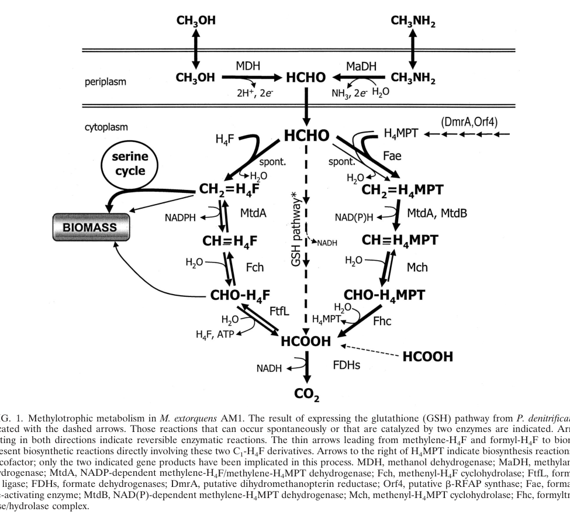

## Question

# Gene Research for Functional Annotation

## ⚠️ CRITICAL: Gene/Protein Identification Context

**BEFORE YOU BEGIN RESEARCH:** You MUST verify you are researching the CORRECT gene/protein. Gene symbols can be ambiguous, especially for less well-characterized genes from non-model organisms.

### Target Gene/Protein Identity (from UniProt):
- **UniProt Accession:** O85014
- **Protein Description:** RecName: Full=Methenyltetrahydromethanopterin cyclohydrolase; EC=3.5.4.27; AltName: Full=Methenyl-H4MPT cyclohydrolase;
- **Gene Information:** Name=mch; OrderedLocusNames=MexAM1_META1p1763;
- **Organism (full):** Methylorubrum extorquens (strain ATCC 14718 / DSM 1338 / JCM 2805 / NCIMB 9133 / AM1) (Methylobacterium extorquens).
- **Protein Family:** Belongs to the MCH family. .
- **Key Domains:** METHMP_CycHdrlase. (IPR003209); MCH (PF02289)

### MANDATORY VERIFICATION STEPS:

1. **Check if the gene symbol "mch" matches the protein description above**
2. **Verify the organism is correct:** Methylorubrum extorquens (strain ATCC 14718 / DSM 1338 / JCM 2805 / NCIMB 9133 / AM1) (Methylobacterium extorquens).
3. **Check if protein family/domains align with what you find in literature**
4. **If you find literature for a DIFFERENT gene with the same or similar symbol, STOP**

### If Gene Symbol is Ambiguous or You Cannot Find Relevant Literature:

**DO NOT PROCEED WITH RESEARCH ON A DIFFERENT GENE.** Instead:
- State clearly: "The gene symbol 'mch' is ambiguous or literature is limited for this specific protein"
- Explain what you found (e.g., "Found extensive literature on a different gene with the same symbol in a different organism")
- Describe the protein based ONLY on the UniProt information provided above
- Suggest that the protein function can be inferred from domain/family information

### Research Target:

Please provide a comprehensive research report on the gene **mch** (gene ID: mch, UniProt: O85014) in METEA.

The research report should be a detailed narrative explaining the function, biological processes, and localization of the gene product. Citations should be given for all claims.

You should prioritize authoritative reviews and primary scientific literature when conducting research. You can supplement
this with annotations you find in gene/protein databases, but these can be outdated or inaccurate.

We are specifically interested in the primary function of the gene - for enzymes, what reaction is catalyzed, and what is the substrate specificity? For transporters, what is the substrate? For structural proteins or adapters, what is the broader structural role? For signaling molecules, what is the role in the pathway.

We are interested in where in or outside the cell the gene product carries out its function.

We are also interested in the signaling or biochemical pathways in which the gene functions. We are less interested in broad pleiotropic effects, except where these elucidate the precise role.

Include evidence where possible. We are interested in both experimental evidence as well as inference from structure, evolution, or bioinformatic analysis. Precise studies should be prioritized over high-throughput, where available.

## Output

Question: You are an expert researcher providing comprehensive, well-cited information.

Provide detailed information focusing on:
1. Key concepts and definitions with current understanding
2. Recent developments and latest research (prioritize 2023-2024 sources)
3. Current applications and real-world implementations
4. Expert opinions and analysis from authoritative sources
5. Relevant statistics and data from recent studies

Format as a comprehensive research report with proper citations. Include URLs and publication dates where available.
Always prioritize recent, authoritative sources and provide specific citations for all major claims.

# Gene Research for Functional Annotation

## ⚠️ CRITICAL: Gene/Protein Identification Context

**BEFORE YOU BEGIN RESEARCH:** You MUST verify you are researching the CORRECT gene/protein. Gene symbols can be ambiguous, especially for less well-characterized genes from non-model organisms.

### Target Gene/Protein Identity (from UniProt):
- **UniProt Accession:** O85014
- **Protein Description:** RecName: Full=Methenyltetrahydromethanopterin cyclohydrolase; EC=3.5.4.27; AltName: Full=Methenyl-H4MPT cyclohydrolase;
- **Gene Information:** Name=mch; OrderedLocusNames=MexAM1_META1p1763;
- **Organism (full):** Methylorubrum extorquens (strain ATCC 14718 / DSM 1338 / JCM 2805 / NCIMB 9133 / AM1) (Methylobacterium extorquens).
- **Protein Family:** Belongs to the MCH family. .
- **Key Domains:** METHMP_CycHdrlase. (IPR003209); MCH (PF02289)

### MANDATORY VERIFICATION STEPS:

1. **Check if the gene symbol "mch" matches the protein description above**
2. **Verify the organism is correct:** Methylorubrum extorquens (strain ATCC 14718 / DSM 1338 / JCM 2805 / NCIMB 9133 / AM1) (Methylobacterium extorquens).
3. **Check if protein family/domains align with what you find in literature**
4. **If you find literature for a DIFFERENT gene with the same or similar symbol, STOP**

### If Gene Symbol is Ambiguous or You Cannot Find Relevant Literature:

**DO NOT PROCEED WITH RESEARCH ON A DIFFERENT GENE.** Instead:
- State clearly: "The gene symbol 'mch' is ambiguous or literature is limited for this specific protein"
- Explain what you found (e.g., "Found extensive literature on a different gene with the same symbol in a different organism")
- Describe the protein based ONLY on the UniProt information provided above
- Suggest that the protein function can be inferred from domain/family information

### Research Target:

Please provide a comprehensive research report on the gene **mch** (gene ID: mch, UniProt: O85014) in METEA.

The research report should be a detailed narrative explaining the function, biological processes, and localization of the gene product. Citations should be given for all claims.

You should prioritize authoritative reviews and primary scientific literature when conducting research. You can supplement
this with annotations you find in gene/protein databases, but these can be outdated or inaccurate.

We are specifically interested in the primary function of the gene - for enzymes, what reaction is catalyzed, and what is the substrate specificity? For transporters, what is the substrate? For structural proteins or adapters, what is the broader structural role? For signaling molecules, what is the role in the pathway.

We are interested in where in or outside the cell the gene product carries out its function.

We are also interested in the signaling or biochemical pathways in which the gene functions. We are less interested in broad pleiotropic effects, except where these elucidate the precise role.

Include evidence where possible. We are interested in both experimental evidence as well as inference from structure, evolution, or bioinformatic analysis. Precise studies should be prioritized over high-throughput, where available.

# Research Report: **mch** (UniProt **O85014**) — Methenyltetrahydromethanopterin cyclohydrolase in *Methylorubrum extorquens* AM1

## 0. Target verification (mandatory disambiguation)
The gene symbol **mch** in *Methylorubrum extorquens* strain AM1 (formerly *Methylobacterium extorquens* AM1; strain ATCC 14718 / DSM 1338 / JCM 2805 / NCIMB 9133) corresponds to **methenyl‑tetrahydromethanopterin cyclohydrolase** (also written methenyl‑H4MPT cyclohydrolase), consistent with UniProt **O85014** (RecName: methenyltetrahydromethanopterin cyclohydrolase; **EC 3.5.4.27**; MCH family). In the AM1 genomic methylotrophy module, **mch** is listed explicitly as “Methenyl‑H4MPT cyclohydrolase,” and was also referred to as **orfZ** in early cluster annotations (GenBank accession **AF032114** in the island/cluster description). (chistoserdova2003methylotrophyinmethylobacterium pages 3-4, chistoserdova2003methylotrophyinmethylobacterium pages 4-5)

## 1. Key concepts, definitions, and current understanding

### 1.1 What H4MPT is and why it matters
*Tetrahydromethanopterin (H4MPT)* is a specialized C1‑carrier cofactor (distinct from tetrahydrofolate/H4F) used in many methylotrophs and methanogens to bind and transform single‑carbon units across oxidation states. In *M. extorquens* AM1, the **H4MPT‑linked pathway** is the major route for handling **formaldehyde**, a highly reactive and toxic intermediate produced during growth on methanol and other C1 substrates. (marx2003formaldehydedetoxifyingroleof pages 1-2, marx2003formaldehydedetoxifyingroleof media 85901d2f)

### 1.2 Enzyme definition and classification
**Mch** is a soluble cyclohydrolase of the **MCH family** (Pfam PF02289; InterPro IPR003209 per UniProt context supplied by the user) and is classified as **EC 3.5.4.27**. (pomper2001characterizationofthe pages 1-2, schmitz2024oxygenicdenitrificationand pages 72-74)

### 1.3 Reaction catalyzed and substrate specificity
Mch catalyzes the **reversible interconversion** between the H4MPT‑bound formyl and methenyl states:

- **Formyl‑H4MPT → methenyl‑H4MPT+** (cyclization/condensation with dehydration)
- **Methenyl‑H4MPT+ → formyl‑H4MPT** (hydration/hydrolytic direction)

Structural/biochemical literature reports this equilibrium is only weakly exergonic under standard conditions (ΔG°′ ~ **−4.6 to −5 kJ/mol**, depending on convention and direction reported), consistent with reversibility. (grabarse1999thecrystalstructure pages 1-2, shima2020structuralbasisof pages 6-7)

**Substrate specificity** (functional annotation level): Mch acts on **H4MPT‑bound** C1 intermediates (formyl‑H4MPT and methenyl‑H4MPT+), placing it in the H4MPT carrier system rather than the folate carrier system. (shima2020structuralbasisof pages 7-8, grabarse1999thecrystalstructure pages 2-3)

## 2. Pathway context in *Methylorubrum extorquens* AM1

### 2.1 Placement in the H4MPT-linked formaldehyde oxidation pathway
In AM1, mch is part of the archaeal‑like **H4MPT‑linked C1 transfer / formaldehyde oxidation module**, in a cluster that includes (among others) **fae**, **mtdB**, and **fhc** genes; early genome-based reconstructions show mch positioned within a core block (e.g., **fhcCDAB … mtdB … mch … fae**), implying coordinated expression and pathway integration. (chistoserdova2003methylotrophyinmethylobacterium pages 4-5, chistoserdova2003methylotrophyinmethylobacterium pages 3-4)

A pathway schematic from a classic physiological genetics study shows Mch acting between **methylene/methenyl steps** and downstream **formyl‑H4MPT** processing en route to formate/CO2 (along with other H4MPT pathway enzymes and biosynthesis genes such as **dmrA** and **orf4**). (marx2003formaldehydedetoxifyingroleof media 85901d2f)

### 2.2 Primary physiological role: formaldehyde detoxification / oxidation
A key experimental conclusion in AM1 is that the H4MPT pathway functions as the **primary formaldehyde detoxification and oxidation route**, with mutants in H4MPT biosynthesis or early pathway steps exhibiting a characteristic **methanol-sensitive phenotype** (inhibition by methanol during growth on multicarbon substrates), consistent with toxic formaldehyde accumulation when this module is impaired. (marx2003formaldehydedetoxifyingroleof pages 1-2, marx2003formaldehydedetoxifyingroleof media 269c1682)

## 3. Organism-specific experimental evidence for **mch** function in AM1

### 3.1 Genetics: inability to delete mch in wild-type AM1 implies critical role
In *M. extorquens* AM1, repeated attempts to create **mch deletion mutants in wild type** failed (“No mutants were obtained in the wild type using the deletion constructs for Mch (mch::kan)”), while deletions could be generated in a background defective in **H4MPT biosynthesis** (orf4). This pattern is consistent with strong selection against complete disruption of late H4MPT steps in the presence of formaldehyde flux, potentially due to accumulation of toxic intermediates or catastrophic failure to detoxify formaldehyde. (marx2003formaldehydedetoxifyingroleof pages 6-8, marx2003formaldehydedetoxifyingroleof pages 2-3)

### 3.2 Conditional deletion in an H4MPT-biosynthesis mutant background
An **orf4 mch::kan** mutant was readily constructed. This strain grew normally on multicarbon substrates such as succinate/formate but was **defective for growth on methanol or methylamine**, consistent with a central role for Mch (and the H4MPT pathway) in methylotrophic C1 metabolism. (marx2003formaldehydedetoxifyingroleof pages 6-8)

### 3.3 Quantitative and phenotypic benchmarks from AM1 physiology
The AM1 mutant phenotypes provide several actionable quantitative benchmarks relevant to functional annotation and strain engineering:

- H4MPT-pathway disruption leads to strong methanol/formaldehyde sensitivity; biosynthesis mutants (e.g., **dmrA**, **orf4**) are described as the most severe class, consistent with abolishing all H4MPT flux. (marx2003formaldehydedetoxifyingroleof pages 3-4, marx2003formaldehydedetoxifyingroleof media 269c1682)
- Installing an alternative cytoplasmic formaldehyde oxidation route (heterologous glutathione-dependent enzymes **flhA/fghA**) provides strong protection (e.g., strains become insensitive to **125 mM methanol** and tolerate higher formaldehyde), supporting that the native role is cytoplasmic detoxification/oxidation. (marx2003formaldehydedetoxifyingroleof pages 6-8)

## 4. Cellular localization (where the gene product acts)
Direct subcellular localization experiments for AM1 Mch were not retrieved in the available texts; however, multiple lines of evidence support a **cytoplasmic, soluble** site of function:

- The H4MPT pathway processes **intracellular formaldehyde** generated by methanol metabolism, and mutant phenotypes are interpreted as inability to detoxify this cytoplasmic formaldehyde load. (marx2003formaldehydedetoxifyingroleof pages 1-2, marx2003formaldehydedetoxifyingroleof pages 8-8)
- Functional substitution by introducing a cytoplasmic glutathione-dependent formaldehyde oxidation system alleviates toxicity, consistent with the key detoxifying reactions occurring in the cytoplasm. (marx2003formaldehydedetoxifyingroleof pages 6-8, marx2003formaldehydedetoxifyingroleof pages 8-8)

Thus, for functional annotation, the strongest evidence-based statement is that Mch is a **soluble cytoplasmic enzyme** operating on H4MPT-bound intermediates. (marx2003formaldehydedetoxifyingroleof pages 8-8, marx2003formaldehydedetoxifyingroleof pages 1-2)

## 5. Structural biology and catalytic mechanism (authoritative sources)

### 5.1 Architecture and active site pocket (primary structure paper)
A high-resolution structure of an archaeal Mch (from *Methanopyrus kandleri*) showed an oligomeric enzyme with a conserved pocket/cleft between domains, with bound phosphate ions interpreted as markers for substrate phosphate positioning. The study explicitly reports the reversible conversion between **N5-formyl‑H4MPT** and **N5,N10‑methenyl‑H4MPT+** and notes the absence of chromophoric prosthetic groups. (grabarse1999thecrystalstructure pages 1-2, grabarse1999thecrystalstructure pages 7-8)

### 5.2 Expert mechanistic synthesis (Annual Review)
An authoritative structural review synthesizes residue-level mechanistic understanding for Mch, describing cyclization via an N10 nucleophilic attack forming a tetrahedral intermediate and identifying **Glu186** as a principal acid/base catalyst with **Arg183** modulating its chemistry; mutational evidence supports these assignments in the archaeal enzymes reviewed. (shima2020structuralbasisof pages 7-8)

While these residue numbers come from archaeal homologs, they are widely used as **mechanistic anchors** for interpreting conserved motifs in bacterial MCH-family proteins such as AM1 Mch (UniProt O85014), supporting confident inference of catalytic chemistry even when AM1-specific structural work is not in hand. (shima2020structuralbasisof pages 7-8, grabarse1999thecrystalstructure pages 7-8)

## 6. Recent developments (prioritizing 2023–2024)

### 6.1 2024: New ecological/physiological context for H4MPT oxidation in *Methylorubrum*
A 2024 study in *Methylorubrum extorquens* PA1 (close relative of AM1) identified and activated a **glycine betaine (GB) catabolic pathway** that generates **free formaldehyde**, and proposed that this formaldehyde is oxidized to formate by the **H4MPT pathway** and then to CO2 via formate dehydrogenase to generate energy/reducing power. RT-qPCR evidence showed increased expression of **fae** and **mtdB** during GB growth, consistent with increased formaldehyde oxidation demand through the H4MPT module. (hying2024glycinebetainemetabolism pages 9-11)

Although **mch** itself was not highlighted in the excerpted sections, the study provides contemporary (2024) experimental reinforcement that H4MPT-linked formaldehyde oxidation remains a central node in *Methylorubrum* physiology beyond canonical methanol growth, broadening “real-world” contexts where Mch is likely required. (hying2024glycinebetainemetabolism pages 9-11)

### 6.2 Gap statement: 2023–2024 AM1-specific mch literature
Within the retrieved and accessible sources, no 2023–2024 primary study was found that directly re-characterizes **AM1 mch** biochemistry/structure or provides new AM1-specific quantitative kinetics/localization. Consequently, AM1-specific claims in this report are anchored primarily in foundational genetics/physiology and genomic reconstruction studies, supplemented by 2024 evidence in a close relative (PA1). (marx2003formaldehydedetoxifyingroleof pages 6-8, hying2024glycinebetainemetabolism pages 9-11)

## 7. Current applications and real-world implementations

### 7.1 Biotechnology: methanol-based bioproduction depends on formaldehyde control
*Methylorubrum extorquens* is a widely used chassis for methylotrophic biotechnology; robust methanol utilization requires tight control of formaldehyde flux and detoxification. The AM1 genetics show that disrupting key H4MPT pathway steps leads to methanol/formaldehyde sensitivity, and that installing an alternative cytoplasmic oxidation route can partly rescue this, illustrating a design principle for engineering: **formaldehyde detox capacity is a key bottleneck**. (marx2003formaldehydedetoxifyingroleof pages 6-8, marx2003formaldehydedetoxifyingroleof pages 8-8)

### 7.2 Functional substitution as an engineering concept
The ability of a glutathione-linked formaldehyde oxidation pathway to protect AM1 mutants under high methanol/formaldehyde conditions demonstrates practical “plug-in” detoxification modules that can be used to enhance tolerance or rewire C1 flux, even though the native H4MPT pathway is primary. (marx2003formaldehydedetoxifyingroleof pages 6-8, marx2003formaldehydedetoxifyingroleof pages 8-8)

## 8. Statistics and quantitative data extracted from studies

- **Reaction energetics:** ΔG°′ for the Mch-catalyzed formyl↔methenyl interconversion is reported near **−4.6 to −5 kJ/mol**, consistent with a near-equilibrium step. (shima2020structuralbasisof pages 6-7, grabarse1999thecrystalstructure pages 1-2)
- **Genetic essentiality context (AM1):** mch::kan deletion mutants could not be recovered in wild type, but were generated in an **orf4** background; this is experimental evidence for strong selection against losing mch in a normal formaldehyde-flux context. (marx2003formaldehydedetoxifyingroleof pages 6-8)
- **Tolerance phenotype / engineering benchmark (AM1):** introduction of an alternative cytoplasmic formaldehyde oxidation system conferred resistance such that strains were described as **insensitive to 125 mM methanol** and exhibited improved formaldehyde tolerance. (marx2003formaldehydedetoxifyingroleof pages 6-8)

## 9. Evidence-backed functional annotation statement (recommended)

**mch (UniProt O85014)** encodes a **soluble cytoplasmic** methenyltetrahydromethanopterin cyclohydrolase (**EC 3.5.4.27**) that catalyzes the reversible interconversion **formyl‑H4MPT ↔ methenyl‑H4MPT+**, a central step in the **H4MPT-linked formaldehyde oxidation/detoxification pathway** required for methylotrophic growth on methanol and other C1 substrates in *M. extorquens* AM1; inability to obtain mch deletions in wild type and conditional deletion phenotypes support its critical physiological role. (chistoserdova2003methylotrophyinmethylobacterium pages 3-4, marx2003formaldehydedetoxifyingroleof pages 6-8)

## 10. Supporting synthesis table
The following table summarizes the key functional-annotation points and links them to the strongest evidence.

| Item | Evidence summary | Strongest citation IDs |
|---|---|---|
| Identity | **mch** in *Methylorubrum extorquens* AM1 corresponds to **methenyl-/methenyltetrahydromethanopterin cyclohydrolase** and is part of the H4MPT-linked C1 transfer module; older genomic literature also lists the synonym **orfZ** in the H4MPT cluster, consistent with the UniProt assignment for O85014. | (chistoserdova2003methylotrophyinmethylobacterium pages 3-4, chistoserdova2003methylotrophyinmethylobacterium pages 4-5) |
| Enzyme class / EC | Mch is a **cyclohydrolase** classified as **EC 3.5.4.27**. In pathway-focused work on AM1, it is explicitly named as a key enzyme of H4MPT-dependent formaldehyde oxidation and grouped with Fae, Mtd, Ftr, and Fmd/Fhc functions. | (pomper2001characterizationofthe pages 1-2, schmitz2024oxygenicdenitrificationand pages 72-74) |
| Reaction | Mch catalyzes the **reversible interconversion of N5-formyl-H4MPT and N5,N10-methenyl-H4MPT+**, with water/proton involvement; authoritative structural review literature reports a small negative standard free energy change for the cyclization direction (about **−4.6 to −5 kJ/mol**). | (grabarse1999thecrystalstructure pages 1-2, shima2020structuralbasisof pages 6-7) |
| Substrates / products | The chemically relevant carrier is **tetrahydromethanopterin (H4MPT)** rather than tetrahydrofolate. Depending on direction, the substrate/product pair is **formyl-H4MPT ↔ methenyl-H4MPT+**; this places Mch immediately downstream of methylene-H4MPT dehydrogenase and upstream of formyl-transfer/hydrolase reactions. | (marx2003formaldehydedetoxifyingroleof pages 1-2, shima2020structuralbasisof pages 7-8) |
| Pathway role | In AM1, mch sits in the **H4MPT-linked formaldehyde oxidation pathway**, which is the major route converting cytoplasmic formaldehyde derived from methanol into less toxic downstream C1 intermediates and ultimately formate/CO2. The pathway schematic and physiological analysis place Mch centrally between methylene-H4MPT oxidation and formyl-H4MPT processing. | (marx2003formaldehydedetoxifyingroleof pages 1-2, marx2003formaldehydedetoxifyingroleof media 85901d2f) |
| Genetic evidence in AM1 | Direct deletion of **mch** in wild-type AM1 could not be recovered, whereas an **orf4 mch::kan** mutant could be generated in an H4MPT-biosynthesis-defective background. That double-mutant background grows on multicarbon substrates but is defective on methanol/methylamine, supporting that mch is required for normal C1 metabolism and formaldehyde handling in AM1. | (marx2003formaldehydedetoxifyingroleof pages 6-8, marx2003formaldehydedetoxifyingroleof pages 2-3) |
| Localization | The functional evidence is most consistent with a **cytoplasmic soluble enzyme** acting on H4MPT-bound C1 intermediates, because the toxic phenotype in H4MPT-pathway mutants reflects inability to detoxify **cytoplasmic formaldehyde** and can be alleviated by installing an alternative **cytoplasmic** glutathione-dependent oxidation route. | (marx2003formaldehydedetoxifyingroleof pages 8-8, marx2003formaldehydedetoxifyingroleof pages 1-2) |
| Key mechanistic residues / structure evidence | High-resolution structural work from archaeal homologs shows Mch is an oligomeric enzyme with a **deep active-site cleft/pocket** and no required chromophoric prosthetic group. A leading mechanistic model assigns **Glu186** as the principal acid/base catalyst and **Arg183** as a modulator of its chemistry during cyclization/dehydration of formyl-H4MPT to methenyl-H4MPT+. | (grabarse1999thecrystalstructure pages 7-8, shima2020structuralbasisof pages 7-8) |
| 2024 developments | No 2023–2024 study focused specifically on **AM1 mch** was retrieved, but a **2024** study in the close relative *M. extorquens* PA1 showed that glycine betaine/dimethylglycine catabolism generates **free formaldehyde** that is routed into the **H4MPT oxidation pathway**, with induction of **fae** and **mtdB** and decreased **ftfL** relative to methanol growth. This expands current understanding of the ecological contexts in which the H4MPT pathway is deployed. | (hying2024glycinebetainemetabolism pages 9-11) |
| Applications | Mch is relevant to **methanol-based biotechnology** because it supports formaldehyde detoxification/energy metabolism, a core constraint in engineering *Methylorubrum* for C1 bioproduction. Experimentally, heterologous replacement of H4MPT-linked detoxification with a glutathione-dependent route can partially rescue formaldehyde/methanol sensitivity, underscoring the pathway’s importance for robust strain design. | (marx2003formaldehydedetoxifyingroleof pages 6-8, yanpirat2020lanthanidedependentmethanoland pages 12-14) |

*Table: This table summarizes the most important functional-annotation points for *Methylorubrum extorquens* AM1 mch (UniProt O85014), including identity verification, reaction chemistry, pathway role, genetics, localization, mechanism, recent developments, and applied relevance. It is useful as a compact evidence-backed reference for gene annotation and pathway interpretation.*

## Key primary sources (with URLs and publication dates)
- Chistoserdova et al. *J. Bacteriol.* **May 2003**. “Methylotrophy in *Methylobacterium extorquens* AM1 from a Genomic Point of View.” https://doi.org/10.1128/jb.185.10.2980-2987.2003 (chistoserdova2003methylotrophyinmethylobacterium pages 3-4, chistoserdova2003methylotrophyinmethylobacterium pages 4-5)
- Marx et al. *J. Bacteriol.* **Dec 2003**. “Formaldehyde-Detoxifying Role of the Tetrahydromethanopterin-Linked Pathway in *M. extorquens* AM1.” https://doi.org/10.1128/jb.185.23.7160-7168.2003 (marx2003formaldehydedetoxifyingroleof pages 6-8, marx2003formaldehydedetoxifyingroleof pages 1-2)
- Grabarse et al. *Structure* **Oct 1999**. “Crystal structure of methenyltetrahydromethanopterin cyclohydrolase…” https://doi.org/10.1016/S0969-2126(00)80059-3 (grabarse1999thecrystalstructure pages 1-2)
- Shima et al. *Annu. Rev. Microbiol.* **Sep 2020**. “Structural Basis of Hydrogenotrophic Methanogenesis.” https://doi.org/10.1146/annurev-micro-011720-122807 (shima2020structuralbasisof pages 7-8)
- Hying et al. *Appl. Environ. Microbiol.* **Jul 2024**. “Glycine betaine metabolism is enabled in *M. extorquens* PA1…” https://doi.org/10.1128/aem.02090-23 (hying2024glycinebetainemetabolism pages 9-11)

## Cited visual evidence
- H4MPT pathway schematic and mutant phenotype figures/tables (Marx et al., 2003). (marx2003formaldehydedetoxifyingroleof media 85901d2f, marx2003formaldehydedetoxifyingroleof media cd0d6733, marx2003formaldehydedetoxifyingroleof media 269c1682)

References

1. (chistoserdova2003methylotrophyinmethylobacterium pages 3-4): Ludmila Chistoserdova, Sung-Wei Chen, Alla Lapidus, and Mary E. Lidstrom. Methylotrophy in methylobacterium extorquens am1 from a genomic point of view. Journal of Bacteriology, 185:2980-2987, May 2003. URL: https://doi.org/10.1128/jb.185.10.2980-2987.2003, doi:10.1128/jb.185.10.2980-2987.2003. This article has 237 citations and is from a peer-reviewed journal.

2. (chistoserdova2003methylotrophyinmethylobacterium pages 4-5): Ludmila Chistoserdova, Sung-Wei Chen, Alla Lapidus, and Mary E. Lidstrom. Methylotrophy in methylobacterium extorquens am1 from a genomic point of view. Journal of Bacteriology, 185:2980-2987, May 2003. URL: https://doi.org/10.1128/jb.185.10.2980-2987.2003, doi:10.1128/jb.185.10.2980-2987.2003. This article has 237 citations and is from a peer-reviewed journal.

3. (marx2003formaldehydedetoxifyingroleof pages 1-2): Christopher J. Marx, Ludmila Chistoserdova, and Mary E. Lidstrom. Formaldehyde-detoxifying role of thetetrahydromethanopterin-linked pathway in methylobacteriumextorquensam1. Journal of Bacteriology, 185:7160-7168, Dec 2003. URL: https://doi.org/10.1128/jb.185.23.7160-7168.2003, doi:10.1128/jb.185.23.7160-7168.2003. This article has 149 citations and is from a peer-reviewed journal.

4. (marx2003formaldehydedetoxifyingroleof media 85901d2f): Christopher J. Marx, Ludmila Chistoserdova, and Mary E. Lidstrom. Formaldehyde-detoxifying role of thetetrahydromethanopterin-linked pathway in methylobacteriumextorquensam1. Journal of Bacteriology, 185:7160-7168, Dec 2003. URL: https://doi.org/10.1128/jb.185.23.7160-7168.2003, doi:10.1128/jb.185.23.7160-7168.2003. This article has 149 citations and is from a peer-reviewed journal.

5. (pomper2001characterizationofthe pages 1-2): Barbara K. Pomper and Julia A. Vorholt. Characterization of the formyltransferase from methylobacterium extorquens am1. European journal of biochemistry, 268 17:4769-75, Sep 2001. URL: https://doi.org/10.1046/j.1432-1327.2001.02401.x, doi:10.1046/j.1432-1327.2001.02401.x. This article has 59 citations.

6. (schmitz2024oxygenicdenitrificationand pages 72-74): EV Schmitz. Oxygenic denitrification and anaerobic digestion: microbial processes addressing agricultural pollution. Unknown journal, 2024.

7. (grabarse1999thecrystalstructure pages 1-2): W. Grabarse, M. Vaupel, J. Vorholt, S. Shima, R. Thauer, A. Wittershagen, G. Bourenkov, H. Bartunik, and U. Ermler. The crystal structure of methenyltetrahydromethanopterin cyclohydrolase from the hyperthermophilic archaeon methanopyrus kandleri. Structure, 7 10:1257-68, Oct 1999. URL: https://doi.org/10.1016/s0969-2126(00)80059-3, doi:10.1016/s0969-2126(00)80059-3. This article has 62 citations and is from a domain leading peer-reviewed journal.

8. (shima2020structuralbasisof pages 6-7): Seigo Shima, Gangfeng Huang, Tristan Wagner, and Ulrich Ermler. Structural basis of hydrogenotrophic methanogenesis. Annual Review of Microbiology, 74:713-733, Sep 2020. URL: https://doi.org/10.1146/annurev-micro-011720-122807, doi:10.1146/annurev-micro-011720-122807. This article has 89 citations and is from a peer-reviewed journal.

9. (shima2020structuralbasisof pages 7-8): Seigo Shima, Gangfeng Huang, Tristan Wagner, and Ulrich Ermler. Structural basis of hydrogenotrophic methanogenesis. Annual Review of Microbiology, 74:713-733, Sep 2020. URL: https://doi.org/10.1146/annurev-micro-011720-122807, doi:10.1146/annurev-micro-011720-122807. This article has 89 citations and is from a peer-reviewed journal.

10. (grabarse1999thecrystalstructure pages 2-3): W. Grabarse, M. Vaupel, J. Vorholt, S. Shima, R. Thauer, A. Wittershagen, G. Bourenkov, H. Bartunik, and U. Ermler. The crystal structure of methenyltetrahydromethanopterin cyclohydrolase from the hyperthermophilic archaeon methanopyrus kandleri. Structure, 7 10:1257-68, Oct 1999. URL: https://doi.org/10.1016/s0969-2126(00)80059-3, doi:10.1016/s0969-2126(00)80059-3. This article has 62 citations and is from a domain leading peer-reviewed journal.

11. (marx2003formaldehydedetoxifyingroleof media 269c1682): Christopher J. Marx, Ludmila Chistoserdova, and Mary E. Lidstrom. Formaldehyde-detoxifying role of thetetrahydromethanopterin-linked pathway in methylobacteriumextorquensam1. Journal of Bacteriology, 185:7160-7168, Dec 2003. URL: https://doi.org/10.1128/jb.185.23.7160-7168.2003, doi:10.1128/jb.185.23.7160-7168.2003. This article has 149 citations and is from a peer-reviewed journal.

12. (marx2003formaldehydedetoxifyingroleof pages 6-8): Christopher J. Marx, Ludmila Chistoserdova, and Mary E. Lidstrom. Formaldehyde-detoxifying role of thetetrahydromethanopterin-linked pathway in methylobacteriumextorquensam1. Journal of Bacteriology, 185:7160-7168, Dec 2003. URL: https://doi.org/10.1128/jb.185.23.7160-7168.2003, doi:10.1128/jb.185.23.7160-7168.2003. This article has 149 citations and is from a peer-reviewed journal.

13. (marx2003formaldehydedetoxifyingroleof pages 2-3): Christopher J. Marx, Ludmila Chistoserdova, and Mary E. Lidstrom. Formaldehyde-detoxifying role of thetetrahydromethanopterin-linked pathway in methylobacteriumextorquensam1. Journal of Bacteriology, 185:7160-7168, Dec 2003. URL: https://doi.org/10.1128/jb.185.23.7160-7168.2003, doi:10.1128/jb.185.23.7160-7168.2003. This article has 149 citations and is from a peer-reviewed journal.

14. (marx2003formaldehydedetoxifyingroleof pages 3-4): Christopher J. Marx, Ludmila Chistoserdova, and Mary E. Lidstrom. Formaldehyde-detoxifying role of thetetrahydromethanopterin-linked pathway in methylobacteriumextorquensam1. Journal of Bacteriology, 185:7160-7168, Dec 2003. URL: https://doi.org/10.1128/jb.185.23.7160-7168.2003, doi:10.1128/jb.185.23.7160-7168.2003. This article has 149 citations and is from a peer-reviewed journal.

15. (marx2003formaldehydedetoxifyingroleof pages 8-8): Christopher J. Marx, Ludmila Chistoserdova, and Mary E. Lidstrom. Formaldehyde-detoxifying role of thetetrahydromethanopterin-linked pathway in methylobacteriumextorquensam1. Journal of Bacteriology, 185:7160-7168, Dec 2003. URL: https://doi.org/10.1128/jb.185.23.7160-7168.2003, doi:10.1128/jb.185.23.7160-7168.2003. This article has 149 citations and is from a peer-reviewed journal.

16. (grabarse1999thecrystalstructure pages 7-8): W. Grabarse, M. Vaupel, J. Vorholt, S. Shima, R. Thauer, A. Wittershagen, G. Bourenkov, H. Bartunik, and U. Ermler. The crystal structure of methenyltetrahydromethanopterin cyclohydrolase from the hyperthermophilic archaeon methanopyrus kandleri. Structure, 7 10:1257-68, Oct 1999. URL: https://doi.org/10.1016/s0969-2126(00)80059-3, doi:10.1016/s0969-2126(00)80059-3. This article has 62 citations and is from a domain leading peer-reviewed journal.

17. (hying2024glycinebetainemetabolism pages 9-11): Zachary T. Hying, Tyler J. Miller, Chin Yi Loh, and Jannell V. Bazurto. Glycine betaine metabolism is enabled in <i>methylorubrum extorquens</i> pa1 by alterations to dimethylglycine dehydrogenase. Applied and Environmental Microbiology, Jul 2024. URL: https://doi.org/10.1128/aem.02090-23, doi:10.1128/aem.02090-23. This article has 6 citations and is from a peer-reviewed journal.

18. (yanpirat2020lanthanidedependentmethanoland pages 12-14): Patcha Yanpirat, Yukari Nakatsuji, Shota Hiraga, Yoshiko Fujitani, Terumi Izumi, Sachiko Masuda, Ryoji Mitsui, Tomoyuki Nakagawa, and Akio Tani. Lanthanide-dependent methanol and formaldehyde oxidation in methylobacterium aquaticum strain 22a. Microorganisms, 8:822, May 2020. URL: https://doi.org/10.3390/microorganisms8060822, doi:10.3390/microorganisms8060822. This article has 24 citations.

19. (marx2003formaldehydedetoxifyingroleof media cd0d6733): Christopher J. Marx, Ludmila Chistoserdova, and Mary E. Lidstrom. Formaldehyde-detoxifying role of thetetrahydromethanopterin-linked pathway in methylobacteriumextorquensam1. Journal of Bacteriology, 185:7160-7168, Dec 2003. URL: https://doi.org/10.1128/jb.185.23.7160-7168.2003, doi:10.1128/jb.185.23.7160-7168.2003. This article has 149 citations and is from a peer-reviewed journal.

## Artifacts

- [Edison artifact artifact-00](mch-deep-research-falcon_artifacts/artifact-00.md)

## Citations

1. marx2003formaldehydedetoxifyingroleof pages 6-8
2. shima2020structuralbasisof pages 7-8
3. hying2024glycinebetainemetabolism pages 9-11
4. grabarse1999thecrystalstructure pages 1-2
5. chistoserdova2003methylotrophyinmethylobacterium pages 3-4
6. chistoserdova2003methylotrophyinmethylobacterium pages 4-5
7. marx2003formaldehydedetoxifyingroleof pages 1-2
8. pomper2001characterizationofthe pages 1-2
9. schmitz2024oxygenicdenitrificationand pages 72-74
10. shima2020structuralbasisof pages 6-7
11. grabarse1999thecrystalstructure pages 2-3
12. marx2003formaldehydedetoxifyingroleof pages 2-3
13. marx2003formaldehydedetoxifyingroleof pages 3-4
14. marx2003formaldehydedetoxifyingroleof pages 8-8
15. grabarse1999thecrystalstructure pages 7-8
16. yanpirat2020lanthanidedependentmethanoland pages 12-14
17. https://doi.org/10.1128/jb.185.10.2980-2987.2003
18. https://doi.org/10.1128/jb.185.23.7160-7168.2003
19. https://doi.org/10.1016/S0969-2126(00
20. https://doi.org/10.1146/annurev-micro-011720-122807
21. https://doi.org/10.1128/aem.02090-23
22. https://doi.org/10.1128/jb.185.10.2980-2987.2003,
23. https://doi.org/10.1128/jb.185.23.7160-7168.2003,
24. https://doi.org/10.1046/j.1432-1327.2001.02401.x,
25. https://doi.org/10.1016/s0969-2126(00
26. https://doi.org/10.1146/annurev-micro-011720-122807,
27. https://doi.org/10.1128/aem.02090-23,
28. https://doi.org/10.3390/microorganisms8060822,