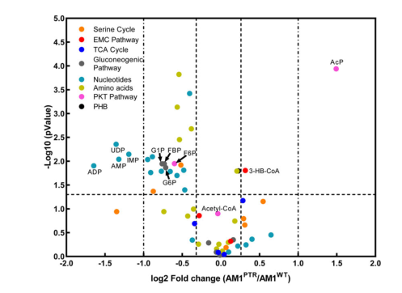

## Question

# Gene Research for Functional Annotation

## ⚠️ CRITICAL: Gene/Protein Identification Context

**BEFORE YOU BEGIN RESEARCH:** You MUST verify you are researching the CORRECT gene/protein. Gene symbols can be ambiguous, especially for less well-characterized genes from non-model organisms.

### Target Gene/Protein Identity (from UniProt):
- **UniProt Accession:** Q84FY8
- **Protein Description:** RecName: Full=Malate dehydrogenase {ECO:0000255|HAMAP-Rule:MF_00487}; EC=1.1.1.37 {ECO:0000255|HAMAP-Rule:MF_00487};
- **Gene Information:** Name=mdh {ECO:0000255|HAMAP-Rule:MF_00487}; OrderedLocusNames=MexAM1_META1p1537;
- **Organism (full):** Methylorubrum extorquens (strain ATCC 14718 / DSM 1338 / JCM 2805 / NCIMB 9133 / AM1) (Methylobacterium extorquens).
- **Protein Family:** Belongs to the LDH/MDH superfamily. MDH type 3 family.
- **Key Domains:** L-lactate/malate_DH. (IPR001557); Lactate/malate_DH_C. (IPR022383); Lactate/malate_DH_N. (IPR001236); Lactate_DH/Glyco_Ohase_4_C. (IPR015955); Malate_DH_type3. (IPR011275)

### MANDATORY VERIFICATION STEPS:

1. **Check if the gene symbol "mdh" matches the protein description above**
2. **Verify the organism is correct:** Methylorubrum extorquens (strain ATCC 14718 / DSM 1338 / JCM 2805 / NCIMB 9133 / AM1) (Methylobacterium extorquens).
3. **Check if protein family/domains align with what you find in literature**
4. **If you find literature for a DIFFERENT gene with the same or similar symbol, STOP**

### If Gene Symbol is Ambiguous or You Cannot Find Relevant Literature:

**DO NOT PROCEED WITH RESEARCH ON A DIFFERENT GENE.** Instead:
- State clearly: "The gene symbol 'mdh' is ambiguous or literature is limited for this specific protein"
- Explain what you found (e.g., "Found extensive literature on a different gene with the same symbol in a different organism")
- Describe the protein based ONLY on the UniProt information provided above
- Suggest that the protein function can be inferred from domain/family information

### Research Target:

Please provide a comprehensive research report on the gene **mdh** (gene ID: mdh, UniProt: Q84FY8) in METEA.

The research report should be a detailed narrative explaining the function, biological processes, and localization of the gene product. Citations should be given for all claims.

You should prioritize authoritative reviews and primary scientific literature when conducting research. You can supplement
this with annotations you find in gene/protein databases, but these can be outdated or inaccurate.

We are specifically interested in the primary function of the gene - for enzymes, what reaction is catalyzed, and what is the substrate specificity? For transporters, what is the substrate? For structural proteins or adapters, what is the broader structural role? For signaling molecules, what is the role in the pathway.

We are interested in where in or outside the cell the gene product carries out its function.

We are also interested in the signaling or biochemical pathways in which the gene functions. We are less interested in broad pleiotropic effects, except where these elucidate the precise role.

Include evidence where possible. We are interested in both experimental evidence as well as inference from structure, evolution, or bioinformatic analysis. Precise studies should be prioritized over high-throughput, where available.

## Output

Question: You are an expert researcher providing comprehensive, well-cited information.

Provide detailed information focusing on:
1. Key concepts and definitions with current understanding
2. Recent developments and latest research (prioritize 2023-2024 sources)
3. Current applications and real-world implementations
4. Expert opinions and analysis from authoritative sources
5. Relevant statistics and data from recent studies

Format as a comprehensive research report with proper citations. Include URLs and publication dates where available.
Always prioritize recent, authoritative sources and provide specific citations for all major claims.

# Gene Research for Functional Annotation

## ⚠️ CRITICAL: Gene/Protein Identification Context

**BEFORE YOU BEGIN RESEARCH:** You MUST verify you are researching the CORRECT gene/protein. Gene symbols can be ambiguous, especially for less well-characterized genes from non-model organisms.

### Target Gene/Protein Identity (from UniProt):
- **UniProt Accession:** Q84FY8
- **Protein Description:** RecName: Full=Malate dehydrogenase {ECO:0000255|HAMAP-Rule:MF_00487}; EC=1.1.1.37 {ECO:0000255|HAMAP-Rule:MF_00487};
- **Gene Information:** Name=mdh {ECO:0000255|HAMAP-Rule:MF_00487}; OrderedLocusNames=MexAM1_META1p1537;
- **Organism (full):** Methylorubrum extorquens (strain ATCC 14718 / DSM 1338 / JCM 2805 / NCIMB 9133 / AM1) (Methylobacterium extorquens).
- **Protein Family:** Belongs to the LDH/MDH superfamily. MDH type 3 family.
- **Key Domains:** L-lactate/malate_DH. (IPR001557); Lactate/malate_DH_C. (IPR022383); Lactate/malate_DH_N. (IPR001236); Lactate_DH/Glyco_Ohase_4_C. (IPR015955); Malate_DH_type3. (IPR011275)

### MANDATORY VERIFICATION STEPS:

1. **Check if the gene symbol "mdh" matches the protein description above**
2. **Verify the organism is correct:** Methylorubrum extorquens (strain ATCC 14718 / DSM 1338 / JCM 2805 / NCIMB 9133 / AM1) (Methylobacterium extorquens).
3. **Check if protein family/domains align with what you find in literature**
4. **If you find literature for a DIFFERENT gene with the same or similar symbol, STOP**

### If Gene Symbol is Ambiguous or You Cannot Find Relevant Literature:

**DO NOT PROCEED WITH RESEARCH ON A DIFFERENT GENE.** Instead:
- State clearly: "The gene symbol 'mdh' is ambiguous or literature is limited for this specific protein"
- Explain what you found (e.g., "Found extensive literature on a different gene with the same symbol in a different organism")
- Describe the protein based ONLY on the UniProt information provided above
- Suggest that the protein function can be inferred from domain/family information

### Research Target:

Please provide a comprehensive research report on the gene **mdh** (gene ID: mdh, UniProt: Q84FY8) in METEA.

The research report should be a detailed narrative explaining the function, biological processes, and localization of the gene product. Citations should be given for all claims.

You should prioritize authoritative reviews and primary scientific literature when conducting research. You can supplement
this with annotations you find in gene/protein databases, but these can be outdated or inaccurate.

We are specifically interested in the primary function of the gene - for enzymes, what reaction is catalyzed, and what is the substrate specificity? For transporters, what is the substrate? For structural proteins or adapters, what is the broader structural role? For signaling molecules, what is the role in the pathway.

We are interested in where in or outside the cell the gene product carries out its function.

We are also interested in the signaling or biochemical pathways in which the gene functions. We are less interested in broad pleiotropic effects, except where these elucidate the precise role.

Include evidence where possible. We are interested in both experimental evidence as well as inference from structure, evolution, or bioinformatic analysis. Precise studies should be prioritized over high-throughput, where available.

## Research Report: Functional Annotation of **mdh** (UniProt **Q84FY8**) in *Methylorubrum extorquens* AM1

### Executive summary (verified target)
This report concerns **malate dehydrogenase (EC 1.1.1.37)** encoded by **mdh** in *Methylorubrum extorquens* strain AM1 (syn. *Methylobacterium extorquens* AM1), UniProt accession **Q84FY8** (ordered locus **MexAM1_META1p1537**). The strongest organism-specific evidence available here includes (i) a high-resolution **structure + enzyme assay** study directly on the AM1 MDH protein and (ii) a recent (2024) systems-level study in AM1-derived strains placing **mdh** in the **serine cycle / central carbon metabolism** transcriptional response. (gonzalez2018conformationalchangeson pages 1-2, gonzalez2018conformationalchangeson pages 4-5, zhang2024phosphoribosylpyrophosphatesynthetaseas pages 3-5)

| Topic | Key finding | Organism/strain | Evidence type | Source (with DOI URL + publication date) |
|---|---|---|---|---|
| Reaction/cofactor | The target protein is the NAD(H)-dependent malate dehydrogenase of *Methylorubrum extorquens* AM1; it reversibly catalyzes oxaloacetate reduction to (2S)-malate and assays/structures support use of the NADH/NAD+ pair rather than NADP(H). (gonzalez2018conformationalchangeson pages 1-2, gonzalez2018conformationalchangeson pages 4-5, gonzalez2018conformationalchangeson pages 2-3, gonzalez2018conformationalchangeson pages 7-7) | *Methylorubrum extorquens* AM1 (syn. *Methylobacterium extorquens* AM1) | Direct structural and enzymatic assay evidence | González JM et al. 2018, *Acta Crystallographica F*; DOI: https://doi.org/10.1107/S2053230X18011809; publication date: Sep 2018 |
| Kinetics | Reported enzymatic parameters for oxaloacetate reduction were Km = 36.8 ± 0.6 mM for oxaloacetate and kcat = (4.6 ± 0.1) × 10^2 s^-1 under the assay conditions described; no broader substrate-specificity panel was available in gathered evidence. (gonzalez2018conformationalchangeson pages 4-5) | *Methylorubrum extorquens* AM1 | Direct biochemical assay | González JM et al. 2018, *Acta Crystallographica F*; DOI: https://doi.org/10.1107/S2053230X18011809; publication date: Sep 2018 |
| Structure/family | The enzyme belongs to the LDH/MDH-like superfamily, with an N-terminal Rossmann-fold NAD+-binding domain; ligand-bound structures showed an open-to-closed transition on substrate binding and catalytic roles for residues including His176 and Arg83/Arg89/Arg152 in oxaloacetate recognition. (gonzalez2018conformationalchangeson pages 1-2, gonzalez2018conformationalchangeson pages 4-5, gonzalez2018conformationalchangeson pages 5-7, gonzalez2018conformationalchangeson pages 7-7) | *Methylorubrum extorquens* AM1 | Direct X-ray crystallography and mechanistic interpretation | González JM et al. 2018, *Acta Crystallographica F*; DOI: https://doi.org/10.1107/S2053230X18011809; publication date: Sep 2018 |
| Oligomerization | Purified MexMDH migrated as a ~34.7 kDa monomer on SDS-PAGE and was described as a stable ~137.4 kDa tetramer with one active site per monomer. (gonzalez2018conformationalchangeson pages 3-4, gonzalez2018conformationalchangeson pages 4-5, gonzalez2018conformationalchangeson pages 5-7) | *Methylorubrum extorquens* AM1 | Direct protein purification and structural analysis | González JM et al. 2018, *Acta Crystallographica F*; DOI: https://doi.org/10.1107/S2053230X18011809; publication date: Sep 2018 |
| Pathway context | In the gathered evidence, mdh is placed at the interface of central carbon metabolism: González et al. note that in aerobic organisms MDH functions in the citric acid cycle, whereas in *M. extorquens* AM1 during growth on C1 compounds it functions in the serine pathway by primarily reducing oxaloacetate; Zhang et al. include mdh among serine-cycle/H4F-pathway-associated genes in a broader map linking serine cycle, TCA cycle, and a phosphoketolase pathway. (gonzalez2018conformationalchangeson pages 1-2, zhang2024phosphoribosylpyrophosphatesynthetaseas pages 3-5, zhang2024phosphoribosylpyrophosphatesynthetaseas media 491b812f) | *Methylorubrum extorquens* AM1 | Direct organism-specific interpretation from structural paper; direct pathway-level multi-omics analysis | González JM et al. 2018, *Acta Crystallographica F*; DOI: https://doi.org/10.1107/S2053230X18011809; publication date: Sep 2018; Zhang C et al. 2024, *Nature Communications*; DOI: https://doi.org/10.1038/s41467-024-50342-9; publication date: Jul 2024 |
| Expression/regulation | In the evolved AM1PTR strain versus AM1WT, mdh was among genes whose expression changed together with ftfL, fch and ppc; the relevant group exhibited expression changes ranging from 2.3- to 7.1-fold, but the gathered evidence did not provide an mdh-specific fold-change. In the same comparison, malate as a serine-cycle intermediate did not change significantly. (zhang2024phosphoribosylpyrophosphatesynthetaseas pages 3-5, zhang2024phosphoribosylpyrophosphatesynthetaseas media 491b812f) | *Methylorubrum extorquens* AM1-derived strains (AM1PTR vs AM1WT) | Direct transcriptomics/metabolomics evidence | Zhang C et al. 2024, *Nature Communications*; DOI: https://doi.org/10.1038/s41467-024-50342-9; publication date: Jul 2024 |
| Localization | No direct experimental subcellular localization for Q84FY8/MexAM1_META1p1537 was found in the gathered evidence. The available studies treat it as a soluble central-metabolism enzyme, but this is inference rather than direct localization evidence. (gonzalez2018conformationalchangeson pages 1-2, zhang2024phosphoribosylpyrophosphatesynthetaseas pages 3-5) | *Methylorubrum extorquens* AM1 | Information not available from retrieved direct evidence | González JM et al. 2018, *Acta Crystallographica F*; DOI: https://doi.org/10.1107/S2053230X18011809; publication date: Sep 2018; Zhang C et al. 2024, *Nature Communications*; DOI: https://doi.org/10.1038/s41467-024-50342-9; publication date: Jul 2024 |

*Table: This table summarizes the strongest organism-specific evidence retrieved for the functional annotation of *Methylorubrum extorquens* AM1 mdh (UniProt Q84FY8). It consolidates enzymatic, structural, pathway, and expression information from the key 2018 structural study and the 2024 systems-level metabolism study, while explicitly noting where evidence is unavailable.*

---

### 1) Key concepts and definitions (current understanding)

#### 1.1 Malate dehydrogenase (MDH; EC 1.1.1.37)
Malate dehydrogenase (MDH) is an oxidoreductase that catalyzes the reversible interconversion of **oxaloacetate (OAA)** and **(2S)-malate** using the **NADH/NAD+** redox couple. In the AM1 enzyme studied directly, MDH “reversibly catalyzes the reduction of oxaloacetate to (2S)-malate using NADH as a reductant,” and assays monitored **NADH oxidation to NAD+** at 340 nm in the presence of oxaloacetate—consistent with **NAD(H)** dependence rather than NADP(H). (gonzalez2018conformationalchangeson pages 1-2, gonzalez2018conformationalchangeson pages 4-5, gonzalez2018conformationalchangeson pages 2-3)

#### 1.2 Metabolic role in methylotrophs: TCA cycle vs serine-cycle interface
In canonical aerobic metabolism, MDH is classically discussed as a TCA-cycle enzyme associated with malate oxidation. However, for *M. extorquens* AM1 growing on C1 substrates, the AM1 MDH has been specifically discussed as functioning in formaldehyde assimilation via the “icl-serine pathway,” and in that context it is described as primarily functioning in the **reduction of oxaloacetate**. (gonzalez2018conformationalchangeson pages 1-2)

---

### 2) Molecular function: reaction, cofactor, mechanism, and structure

#### 2.1 Primary reaction and cofactor usage
**Reaction (physiological direction depends on network context):**
- OAA + NADH + H+ ⇌ (2S)-malate + NAD+.

The AM1 MDH is directly evidenced to use the **NADH/NAD+** pair: the study describes oxaloacetate reduction using NADH as reductant and monitors NADH→NAD+ oxidation; NAD+ is observed bound in the crystal structure. (gonzalez2018conformationalchangeson pages 1-2, gonzalez2018conformationalchangeson pages 2-3, gonzalez2018conformationalchangeson pages 7-7)

#### 2.2 Substrate specificity and kinetics (quantitative data)
A direct kinetic measurement reported for the AM1 enzyme during oxaloacetate reduction gives:
- **Km (oxaloacetate)** = **36.8 ± 0.6 mM**
- **kcat** = **(4.6 ± 0.1) × 10^2 s−1**

These values were obtained from Michaelis–Menten fits of initial-velocity data for oxaloacetate reduction with NADH oxidation as the readout. No additional substrate panel (e.g., pyruvate/lactate) was available in the gathered evidence, so broader substrate promiscuity cannot be assessed here. (gonzalez2018conformationalchangeson pages 4-5)

#### 2.3 Protein family and domains (structure-based annotation)
The AM1 MDH belongs to the **LDH/MDH-like superfamily** and contains a characteristic **Rossmann-fold NAD+-binding domain** in the N-terminal region. Structural complexes (apo, NAD+-bound, substrate-bound) show ligand-dependent conformational changes, including an “open-to-closed” transition upon substrate binding. (gonzalez2018conformationalchangeson pages 1-2, gonzalez2018conformationalchangeson pages 4-5)

#### 2.4 Oligomeric state
The AM1 MDH studied is reported to be a stable **tetramer** (~137.4 kDa), with one active site per monomer; the polypeptide runs as a ~34.7 kDa band on SDS-PAGE (consistent with monomer size). (gonzalez2018conformationalchangeson pages 3-4, gonzalez2018conformationalchangeson pages 4-5, gonzalez2018conformationalchangeson pages 5-7)

#### 2.5 Mechanistic residues and catalytic conformational change (expert structural interpretation)
The ligand-bound structures provide mechanistic inferences about catalysis and substrate recognition. Substrate (OAA) binding is associated with active-site reorganization and salt-bridge formation by multiple arginines (Arg83/Arg89/Arg152) to OAA carboxylates, while a histidine is positioned to donate a proton during formation of (2S)-malate. This structural evidence is presented as supporting a reaction mechanism for NAD+-dependent dehydrogenases in the MDH/LDH-like superfamily. (gonzalez2018conformationalchangeson pages 1-2, gonzalez2018conformationalchangeson pages 5-7, gonzalez2018conformationalchangeson pages 7-7)

---

### 3) Cellular localization and where the protein acts
No direct experimental subcellular localization (e.g., fluorescence tagging, fractionation, signal peptide evidence) for UniProt Q84FY8 is present in the retrieved evidence. The enzyme is treated as a soluble central-metabolism enzyme operating within cytosolic pathways (serine cycle/TCA interface) in the organism-level discussions, but that is contextual inference rather than a direct localization measurement. (gonzalez2018conformationalchangeson pages 1-2, zhang2024phosphoribosylpyrophosphatesynthetaseas pages 3-5)

---

### 4) Pathways and biological processes in *Methylorubrum extorquens* AM1

#### 4.1 Role in serine-cycle-linked C1 assimilation and central metabolism
The AM1 MDH is explicitly discussed as participating in formaldehyde assimilation during growth on C1 compounds via the serine pathway (“icl-serine pathway”), where MDH is described as primarily functioning in oxaloacetate reduction. (gonzalez2018conformationalchangeson pages 1-2)

#### 4.2 Recent systems-level evidence (2024): mdh expression changes in evolved low-methanol strains
A 2024 Nature Communications study evolving AM1-derived strains for improved performance under low methanol reports coordinated transcriptional changes in genes annotated to the H4F-dependent formate transfer pathway and serine cycle, explicitly listing **mdh** among the changing genes (with ftfL, fch, ppc). The authors report that these genes “exhibited the expression changes ranging from **2.3- to 7.1-fold**” between strains (AM1PTR vs AM1WT), while measured serine-cycle intermediates including **malate** “did not change significantly.” (zhang2024phosphoribosylpyrophosphatesynthetaseas pages 3-5)

The study also provides pathway-level visualization integrating metabolomics and transcriptomics, where **mdh** appears within the central metabolic map linking the serine cycle and TCA-cycle nodes in the evolved background. (zhang2024phosphoribosylpyrophosphatesynthetaseas media 491b812f, zhang2024phosphoribosylpyrophosphatesynthetaseas media 64338971)

---

### 5) Recent developments and latest research (prioritizing 2023–2024)

#### 5.1 2024 multi-omics / evolutionary physiology context
The most directly relevant 2024 source in the retrieved library positions mdh within a coordinated central-metabolism response during adaptation of AM1-derived strains to low methanol conditions, including fold-change ranges for a gene set containing mdh and joint metabolite/transcriptome mapping onto central pathways. (Publication date: **July 2024**; URL: https://doi.org/10.1038/s41467-024-50342-9) (zhang2024phosphoribosylpyrophosphatesynthetaseas pages 3-5, zhang2024phosphoribosylpyrophosphatesynthetaseas media 491b812f)

#### 5.2 2018 structure-function foundation remains a key reference point
Although outside the requested 2023–2024 window, the 2018 Acta Cryst F study remains a uniquely strong AM1-specific reference because it provides high-resolution structures with bound ligands plus quantitative enzyme kinetics, enabling confident functional assignment and mechanistic hypotheses for AM1 MDH. (Publication date: **September 2018**; URL: https://doi.org/10.1107/S2053230X18011809) (gonzalez2018conformationalchangeson pages 4-5, gonzalez2018conformationalchangeson pages 5-7)

---

### 6) Current applications and real-world implementations

#### 6.1 MDH as part of industrially relevant methylotroph metabolism (contextual)
*Methylorubrum extorquens* AM1 is widely used as a model methylotroph for methanol-based metabolism and strain development; the 2024 AM1 study frames methylotrophy as important for phyllosphere colonization and plant growth and maps central metabolism (including serine-cycle-associated genes such as mdh) in the context of evolved traits. (zhang2024phosphoribosylpyrophosphatesynthetaseas media 491b812f, zhang2024phosphoribosylpyrophosphatesynthetaseas media 64338971)

#### 6.2 Evidence gap: no mdh-targeted engineering described in retrieved evidence
Within the retrieved sources, there is **no direct report** of industrial processes specifically engineering **the mdh gene (malate dehydrogenase, EC 1.1.1.37)** itself (e.g., overexpression/knockout of mdh with production phenotypes). Therefore, applications are supported here only at the level of **host physiology and pathway context** rather than mdh-specific implementation claims. (zhang2024phosphoribosylpyrophosphatesynthetaseas pages 3-5)

---

### 7) Expert opinions/analysis (authoritative interpretations)

#### 7.1 Directionality depends on metabolic context
The AM1 structural/biochemical study explicitly contrasts typical aerobic-TCA-cycle framing (“primarily functions in the oxidation of malate”) with the methylotrophic assimilation context in AM1 (“primarily functions in the reduction of oxaloacetic acid”) during growth on C1 compounds. This is an organism- and condition-specific interpretation grounded in the known methylotrophic network topology and is directly stated by authors analyzing AM1 MDH. (gonzalez2018conformationalchangeson pages 1-2)

#### 7.2 Structure-guided mechanistic inference supports LDH/MDH superfamily annotation
The ligand-bound structures and described residue interactions (histidine positioning for proton transfer; arginine salt-bridges to OAA) provide a mechanistic rationale for MDH activity and place the enzyme in the broader NAD+-dependent LDH/MDH-like family. (gonzalez2018conformationalchangeson pages 5-7, gonzalez2018conformationalchangeson pages 7-7)

---

### 8) Relevant statistics/data points from recent studies

- **Transcriptome changes (2024):** A set of serine-cycle/H4F-pathway genes including **mdh** showed **2.3- to 7.1-fold** expression changes between AM1PTR and AM1WT. (zhang2024phosphoribosylpyrophosphatesynthetaseas pages 3-5)
- **Metabolomics (2024):** Serine-cycle intermediates including **malate** “did not change significantly” in that same comparison. (zhang2024phosphoribosylpyrophosphatesynthetaseas pages 3-5)
- **Enzyme kinetics (2018):** **Km(OAA) = 36.8 ± 0.6 mM; kcat = (4.6 ± 0.1) × 10^2 s−1** for oxaloacetate reduction by AM1 MDH. (gonzalez2018conformationalchangeson pages 4-5)

---

### 9) Limitations of the current evidence package (important for annotation quality)
- **Essentiality/phenotypes:** No direct mdh knockout/knockdown phenotype or essentiality statement for AM1 mdh was found in the retrieved full texts. 
- **Subcellular localization:** No direct localization experiments were retrieved for Q84FY8.
- **Substrate specificity breadth:** The retrieved evidence provides kinetics for oxaloacetate reduction, but not a systematic substrate screen.

These gaps should be addressed by targeted searches in additional AM1 genetics papers, genome-scale model validation studies, or proteomics/fractionation work; however, such sources were not retrievable within the present tool runs. (gonzalez2018conformationalchangeson pages 4-5, zhang2024phosphoribosylpyrophosphatesynthetaseas pages 3-5)

---

## Key sources (URLs; publication dates)
1. González JM et al. “Conformational changes on substrate binding revealed by structures of *Methylobacterium extorquens* malate dehydrogenase.” *Acta Crystallographica Section F* (Sep **2018**). https://doi.org/10.1107/S2053230X18011809 (gonzalez2018conformationalchangeson pages 1-2, gonzalez2018conformationalchangeson pages 4-5)
2. Zhang C et al. “Phosphoribosylpyrophosphate synthetase as a metabolic valve advances *Methylobacterium/Methylorubrum* phyllosphere colonization and plant growth.” *Nature Communications* (Jul **2024**). https://doi.org/10.1038/s41467-024-50342-9 (zhang2024phosphoribosylpyrophosphatesynthetaseas pages 3-5, zhang2024phosphoribosylpyrophosphatesynthetaseas media 491b812f, zhang2024phosphoribosylpyrophosphatesynthetaseas media 64338971)

References

1. (gonzalez2018conformationalchangeson pages 1-2): Javier M. González, Ricardo Marti-Arbona, Julian C.-H. Chen, Brian Broom-Peltz, and Clifford J. Unkefer. Conformational changes on substrate binding revealed by structures of methylobacterium extorquens malate dehydrogenase. Acta crystallographica. Section F, Structural biology communications, 74 Pt 10:610-616, Sep 2018. URL: https://doi.org/10.1107/s2053230x18011809, doi:10.1107/s2053230x18011809. This article has 11 citations.

2. (gonzalez2018conformationalchangeson pages 4-5): Javier M. González, Ricardo Marti-Arbona, Julian C.-H. Chen, Brian Broom-Peltz, and Clifford J. Unkefer. Conformational changes on substrate binding revealed by structures of methylobacterium extorquens malate dehydrogenase. Acta crystallographica. Section F, Structural biology communications, 74 Pt 10:610-616, Sep 2018. URL: https://doi.org/10.1107/s2053230x18011809, doi:10.1107/s2053230x18011809. This article has 11 citations.

3. (zhang2024phosphoribosylpyrophosphatesynthetaseas pages 3-5): Cong Zhang, Di-Fei Zhou, Meng-Ying Wang, Ya-Zhen Song, Chong Zhang, Ming-Ming Zhang, Jing Sun, Lu Yao, Xu-Hua Mo, Zeng-Xin Ma, Xiao-Jie Yuan, Yi Shao, Hao-Ran Wang, Si-Han Dong, Kai Bao, Shu-Huan Lu, Martin Sadilek, Marina G. Kalyuzhnaya, Xin-Hui Xing, and Song Yang. Phosphoribosylpyrophosphate synthetase as a metabolic valve advances methylobacterium/methylorubrum phyllosphere colonization and plant growth. Nature Communications, Jul 2024. URL: https://doi.org/10.1038/s41467-024-50342-9, doi:10.1038/s41467-024-50342-9. This article has 30 citations and is from a highest quality peer-reviewed journal.

4. (gonzalez2018conformationalchangeson pages 2-3): Javier M. González, Ricardo Marti-Arbona, Julian C.-H. Chen, Brian Broom-Peltz, and Clifford J. Unkefer. Conformational changes on substrate binding revealed by structures of methylobacterium extorquens malate dehydrogenase. Acta crystallographica. Section F, Structural biology communications, 74 Pt 10:610-616, Sep 2018. URL: https://doi.org/10.1107/s2053230x18011809, doi:10.1107/s2053230x18011809. This article has 11 citations.

5. (gonzalez2018conformationalchangeson pages 7-7): Javier M. González, Ricardo Marti-Arbona, Julian C.-H. Chen, Brian Broom-Peltz, and Clifford J. Unkefer. Conformational changes on substrate binding revealed by structures of methylobacterium extorquens malate dehydrogenase. Acta crystallographica. Section F, Structural biology communications, 74 Pt 10:610-616, Sep 2018. URL: https://doi.org/10.1107/s2053230x18011809, doi:10.1107/s2053230x18011809. This article has 11 citations.

6. (gonzalez2018conformationalchangeson pages 5-7): Javier M. González, Ricardo Marti-Arbona, Julian C.-H. Chen, Brian Broom-Peltz, and Clifford J. Unkefer. Conformational changes on substrate binding revealed by structures of methylobacterium extorquens malate dehydrogenase. Acta crystallographica. Section F, Structural biology communications, 74 Pt 10:610-616, Sep 2018. URL: https://doi.org/10.1107/s2053230x18011809, doi:10.1107/s2053230x18011809. This article has 11 citations.

7. (gonzalez2018conformationalchangeson pages 3-4): Javier M. González, Ricardo Marti-Arbona, Julian C.-H. Chen, Brian Broom-Peltz, and Clifford J. Unkefer. Conformational changes on substrate binding revealed by structures of methylobacterium extorquens malate dehydrogenase. Acta crystallographica. Section F, Structural biology communications, 74 Pt 10:610-616, Sep 2018. URL: https://doi.org/10.1107/s2053230x18011809, doi:10.1107/s2053230x18011809. This article has 11 citations.

8. (zhang2024phosphoribosylpyrophosphatesynthetaseas media 491b812f): Cong Zhang, Di-Fei Zhou, Meng-Ying Wang, Ya-Zhen Song, Chong Zhang, Ming-Ming Zhang, Jing Sun, Lu Yao, Xu-Hua Mo, Zeng-Xin Ma, Xiao-Jie Yuan, Yi Shao, Hao-Ran Wang, Si-Han Dong, Kai Bao, Shu-Huan Lu, Martin Sadilek, Marina G. Kalyuzhnaya, Xin-Hui Xing, and Song Yang. Phosphoribosylpyrophosphate synthetase as a metabolic valve advances methylobacterium/methylorubrum phyllosphere colonization and plant growth. Nature Communications, Jul 2024. URL: https://doi.org/10.1038/s41467-024-50342-9, doi:10.1038/s41467-024-50342-9. This article has 30 citations and is from a highest quality peer-reviewed journal.

9. (zhang2024phosphoribosylpyrophosphatesynthetaseas media 64338971): Cong Zhang, Di-Fei Zhou, Meng-Ying Wang, Ya-Zhen Song, Chong Zhang, Ming-Ming Zhang, Jing Sun, Lu Yao, Xu-Hua Mo, Zeng-Xin Ma, Xiao-Jie Yuan, Yi Shao, Hao-Ran Wang, Si-Han Dong, Kai Bao, Shu-Huan Lu, Martin Sadilek, Marina G. Kalyuzhnaya, Xin-Hui Xing, and Song Yang. Phosphoribosylpyrophosphate synthetase as a metabolic valve advances methylobacterium/methylorubrum phyllosphere colonization and plant growth. Nature Communications, Jul 2024. URL: https://doi.org/10.1038/s41467-024-50342-9, doi:10.1038/s41467-024-50342-9. This article has 30 citations and is from a highest quality peer-reviewed journal.

## Artifacts

- [Edison artifact artifact-00](mdh-deep-research-falcon_artifacts/artifact-00.md)

## Citations

1. gonzalez2018conformationalchangeson pages 4-5
2. gonzalez2018conformationalchangeson pages 1-2
3. zhang2024phosphoribosylpyrophosphatesynthetaseas pages 3-5
4. gonzalez2018conformationalchangeson pages 2-3
5. gonzalez2018conformationalchangeson pages 7-7
6. gonzalez2018conformationalchangeson pages 5-7
7. gonzalez2018conformationalchangeson pages 3-4
8. https://doi.org/10.1107/S2053230X18011809;
9. https://doi.org/10.1038/s41467-024-50342-9;
10. https://doi.org/10.1038/s41467-024-50342-9
11. https://doi.org/10.1107/S2053230X18011809
12. https://doi.org/10.1107/s2053230x18011809,
13. https://doi.org/10.1038/s41467-024-50342-9,