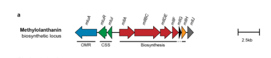

## Question

# Gene Research for Functional Annotation

## ⚠️ CRITICAL: Gene/Protein Identification Context

**BEFORE YOU BEGIN RESEARCH:** You MUST verify you are researching the CORRECT gene/protein. Gene symbols can be ambiguous, especially for less well-characterized genes from non-model organisms.

### Target Gene/Protein Identity (from UniProt):
- **UniProt Accession:** C5B1I4
- **Protein Description:** SubName: Full=Siderophore synthetase component {ECO:0000313|EMBL:ACS41785.1};
- **Gene Information:** OrderedLocusNames=MexAM1_META1p4132 {ECO:0000313|EMBL:ACS41785.1};
- **Organism (full):** Methylorubrum extorquens (strain ATCC 14718 / DSM 1338 / JCM 2805 / NCIMB 9133 / AM1) (Methylobacterium extorquens).
- **Protein Family:** Belongs to the IucA/IucC family.
- **Key Domains:** Aerobactin_biosyn_IucA/IucC_N. (IPR007310); IucA/IucC-like_C. (IPR022770); LucA/IucC-like. (IPR037455); FhuF (PF06276); IucA_IucC (PF04183)

### MANDATORY VERIFICATION STEPS:

1. **Check if the gene symbol "mllA" matches the protein description above**
2. **Verify the organism is correct:** Methylorubrum extorquens (strain ATCC 14718 / DSM 1338 / JCM 2805 / NCIMB 9133 / AM1) (Methylobacterium extorquens).
3. **Check if protein family/domains align with what you find in literature**
4. **If you find literature for a DIFFERENT gene with the same or similar symbol, STOP**

### If Gene Symbol is Ambiguous or You Cannot Find Relevant Literature:

**DO NOT PROCEED WITH RESEARCH ON A DIFFERENT GENE.** Instead:
- State clearly: "The gene symbol 'mllA' is ambiguous or literature is limited for this specific protein"
- Explain what you found (e.g., "Found extensive literature on a different gene with the same symbol in a different organism")
- Describe the protein based ONLY on the UniProt information provided above
- Suggest that the protein function can be inferred from domain/family information

### Research Target:

Please provide a comprehensive research report on the gene **mllA** (gene ID: mllA, UniProt: C5B1I4) in METEA.

The research report should be a detailed narrative explaining the function, biological processes, and localization of the gene product. Citations should be given for all claims.

You should prioritize authoritative reviews and primary scientific literature when conducting research. You can supplement
this with annotations you find in gene/protein databases, but these can be outdated or inaccurate.

We are specifically interested in the primary function of the gene - for enzymes, what reaction is catalyzed, and what is the substrate specificity? For transporters, what is the substrate? For structural proteins or adapters, what is the broader structural role? For signaling molecules, what is the role in the pathway.

We are interested in where in or outside the cell the gene product carries out its function.

We are also interested in the signaling or biochemical pathways in which the gene functions. We are less interested in broad pleiotropic effects, except where these elucidate the precise role.

Include evidence where possible. We are interested in both experimental evidence as well as inference from structure, evolution, or bioinformatic analysis. Precise studies should be prioritized over high-throughput, where available.

## Output

Question: You are an expert researcher providing comprehensive, well-cited information.

Provide detailed information focusing on:
1. Key concepts and definitions with current understanding
2. Recent developments and latest research (prioritize 2023-2024 sources)
3. Current applications and real-world implementations
4. Expert opinions and analysis from authoritative sources
5. Relevant statistics and data from recent studies

Format as a comprehensive research report with proper citations. Include URLs and publication dates where available.
Always prioritize recent, authoritative sources and provide specific citations for all major claims.

# Gene Research for Functional Annotation

## ⚠️ CRITICAL: Gene/Protein Identification Context

**BEFORE YOU BEGIN RESEARCH:** You MUST verify you are researching the CORRECT gene/protein. Gene symbols can be ambiguous, especially for less well-characterized genes from non-model organisms.

### Target Gene/Protein Identity (from UniProt):
- **UniProt Accession:** C5B1I4
- **Protein Description:** SubName: Full=Siderophore synthetase component {ECO:0000313|EMBL:ACS41785.1};
- **Gene Information:** OrderedLocusNames=MexAM1_META1p4132 {ECO:0000313|EMBL:ACS41785.1};
- **Organism (full):** Methylorubrum extorquens (strain ATCC 14718 / DSM 1338 / JCM 2805 / NCIMB 9133 / AM1) (Methylobacterium extorquens).
- **Protein Family:** Belongs to the IucA/IucC family.
- **Key Domains:** Aerobactin_biosyn_IucA/IucC_N. (IPR007310); IucA/IucC-like_C. (IPR022770); LucA/IucC-like. (IPR037455); FhuF (PF06276); IucA_IucC (PF04183)

### MANDATORY VERIFICATION STEPS:

1. **Check if the gene symbol "mllA" matches the protein description above**
2. **Verify the organism is correct:** Methylorubrum extorquens (strain ATCC 14718 / DSM 1338 / JCM 2805 / NCIMB 9133 / AM1) (Methylobacterium extorquens).
3. **Check if protein family/domains align with what you find in literature**
4. **If you find literature for a DIFFERENT gene with the same or similar symbol, STOP**

### If Gene Symbol is Ambiguous or You Cannot Find Relevant Literature:

**DO NOT PROCEED WITH RESEARCH ON A DIFFERENT GENE.** Instead:
- State clearly: "The gene symbol 'mllA' is ambiguous or literature is limited for this specific protein"
- Explain what you found (e.g., "Found extensive literature on a different gene with the same symbol in a different organism")
- Describe the protein based ONLY on the UniProt information provided above
- Suggest that the protein function can be inferred from domain/family information

### Research Target:

Please provide a comprehensive research report on the gene **mllA** (gene ID: mllA, UniProt: C5B1I4) in METEA.

The research report should be a detailed narrative explaining the function, biological processes, and localization of the gene product. Citations should be given for all claims.

You should prioritize authoritative reviews and primary scientific literature when conducting research. You can supplement
this with annotations you find in gene/protein databases, but these can be outdated or inaccurate.

We are specifically interested in the primary function of the gene - for enzymes, what reaction is catalyzed, and what is the substrate specificity? For transporters, what is the substrate? For structural proteins or adapters, what is the broader structural role? For signaling molecules, what is the role in the pathway.

We are interested in where in or outside the cell the gene product carries out its function.

We are also interested in the signaling or biochemical pathways in which the gene functions. We are less interested in broad pleiotropic effects, except where these elucidate the precise role.

Include evidence where possible. We are interested in both experimental evidence as well as inference from structure, evolution, or bioinformatic analysis. Precise studies should be prioritized over high-throughput, where available.

## Research Report: Functional Annotation of **mllA** (UniProt **C5B1I4**; locus **MexAM1_META1p4132**) in *Methylorubrum extorquens* AM1

### Executive summary
The gene symbol **mllA** in *Methylorubrum extorquens* AM1 (formerly *Methylobacterium extorquens* AM1) corresponds to **locus META1p4132** (MexAM1_META1p4132) in the **methylolanthanin (mll)** biosynthetic gene cluster (BGC). This cluster produces **methylolanthanin (MLL)**, a **lanthanophore** (lanthanide-binding metallophore) that improves lanthanide bioavailability and supports lanthanide-dependent methylotrophy and bioaccumulation. Evidence supports mllA’s role as an **IucA/IucC-family NRPS-independent siderophore synthetase (NIS synthetase)** component in MLL biosynthesis, but the **specific catalytic step and substrate specificity of the mllA protein itself has not been directly biochemically reconstituted** in the accessible sources; enzyme chemistry is therefore inferred from family mechanism plus cluster-level functional genetics and metabolite structure. (zytnick2022discoveryandcharacterization pages 3-5)

### Target identity verification (critical)
**Gene symbol ambiguity check and mapping.** In the lanthanophore study by Zytnick et al., the authors explicitly enumerate **META1p4132–4135 as “mllA, mllBC, mllDE, and mllF”**, establishing that **META1p4132 is mllA** in *M. extorquens* AM1. (zytnick2022discoveryandcharacterization pages 3-5)

**Organism verification.** The same work is performed in *Methylobacterium/Methylorubrum extorquens* AM1 and discusses the AM1 lanthanide uptake machinery (lut cluster) and the mll biosynthetic locus in this organism. (zytnick2022discoveryandcharacterization pages 1-3, zytnick2022discoveryandcharacterization pages 3-5)

**Family/domain consistency.** mllA is described as part of a BGC homologous to NRPS-independent siderophore systems (petrobactin/rhodopetrobactin/roseobactin-like) and is functionally interpreted as a siderophore synthetase component; mechanistic studies of **IucA/IucC-family** NIS synthetases provide a consistent biochemical framework (ATP-dependent carboxylate adenylation and amide formation) matching the user-provided UniProt family assignment. (zytnick2022discoveryandcharacterization pages 3-5, mydy2020thesiderophoresynthetase pages 7-10, gulick2024kineticanalysisof pages 1-2)

### 1) Key concepts and definitions (current understanding)

#### Metallophores, siderophores, and lanthanophores
Metallophores are secreted small molecules that chelate metals to improve acquisition under low bioavailability. A **lanthanophore** is a metallophore specialized for lanthanides (Ln). In *M. extorquens* AM1, lanthanide-dependent methanol dehydrogenase systems are periplasmic, and lanthanide acquisition has been proposed to involve siderophore-like mechanisms (TonB-dependent uptake and ABC-type transport), motivating the search for lanthanide chelators. (zytnick2022discoveryandcharacterization pages 1-3, roszczenkojasinska2020geneproductsand pages 4-5)

Zytnick et al. report **methylolanthanin (MLL)** as the **first characterized biological lanthanide chelator (lanthanophore)** and show it forms lanthanide complexes detectable by mass spectrometry. (zytnick2022discoveryandcharacterization pages 1-3, zytnick2022discoveryandcharacterization pages 8-10)

#### NRPS-independent siderophore (NIS) synthetases (IucA/IucC family)
NIS synthetases (including the **IucA/IucC** family) are ATP-dependent ligases that generate an **amide bond between a carboxylate and an amine/hydroxamate** via a two-step mechanism: (i) **acyl-adenylate (acyl-AMP)** formation with release of **PPi**, followed by (ii) nucleophilic attack by the amine/hydroxamate to displace **AMP** and form product. (gulick2024kineticanalysisof pages 1-2, mydy2020thesiderophoresynthetase pages 7-10)

Mechanistically, kinetic analyses support an **ordered sequential** substrate binding mechanism for IucA: **ATP binds first, then citrate, then the hydroxamate donor**. (mydy2020thesiderophoresynthetase pages 23-26, gulick2024kineticanalysisof pages 8-10)

### 2) Gene and pathway context for mllA (what it does)

#### The mll gene cluster encodes methylolanthanin biosynthesis and associated uptake/regulation
Zytnick et al. identify a siderophore-like locus **META1p4129–4138** and assign it as the **mll (methylolanthanin) biosynthetic gene cluster**, with associated uptake/regulatory elements. The cluster includes components consistent with coupling of metallophore biosynthesis to transport and transcriptional control, including a **TonB-dependent outer membrane receptor** plus cell-surface signaling (anti-sigma/sigma factor) features in the locus. (zytnick2022discoveryandcharacterization pages 3-5)

The locus architecture (including mllA/META1p4132) is shown in their gene-cluster schematic (Figure 2a). (zytnick2022discoveryandcharacterization media b0e60267)

#### What methylolanthanin is (product and inferred biosynthetic chemistry)
MLL is structurally characterized as a citrate-containing molecule incorporating **homospermidine-derived linkers** and **hydroxybenzoate** moieties; MS/MS and NMR support incorporation of **citrate** and a **para-hydroxybenzoate (4-HB)** substitution pattern, with acetylated homospermidine features. (zytnick2022discoveryandcharacterization pages 5-8)

Given that (i) MLL incorporates citrate and amine-containing linkers and (ii) the mll locus is homologous to citrate-containing metallophore/siderophore BGCs, it is consistent that **mllA functions as an ATP-dependent amide-forming enzyme** in assembling citrate–amine linkages, as expected for an **IucA/IucC-like NIS synthetase component**. This is consistent with the IucA mechanistic model (citrate adenylation then nucleophilic attack by an amine/hydroxamate donor). (zytnick2022discoveryandcharacterization pages 3-5, mydy2020thesiderophoresynthetase pages 7-10, gulick2024kineticanalysisof pages 1-2)

**Limitations:** none of the accessible sources provide a purified mllA enzyme assay specifying its exact substrates or catalytic step; therefore, **reaction and substrate specificity are inferred**, not directly demonstrated for mllA. (zytnick2022discoveryandcharacterization pages 3-5, gulick2024kineticanalysisof pages 1-2)

### 3) Regulation and physiological role in lanthanide methylotrophy

#### Induction under low lanthanide bioavailability and linkage to methylotrophy
In transcriptomics comparing growth with soluble vs poorly soluble lanthanide sources, Zytnick et al. report that the **mll locus (META1p4129–4138) is highly induced (~32-fold) under Nd2O3** (poorly soluble) compared with NdCl3 (soluble), consistent with a role in mobilizing lanthanides when bioavailability is low. (zytnick2022discoveryandcharacterization pages 3-5)

The same low-bioavailability condition also shows increased expression of the lanthanide-dependent methanol dehydrogenase gene **xoxF1 (5-fold)**, supporting the concept that lanthanide acquisition and lanthanide-dependent methylotrophy are coupled. (zytnick2022discoveryandcharacterization pages 3-5)

#### Uptake and localization pathway context (where the function occurs)
Lanthanide uptake in *M. extorquens* AM1 involves a dedicated **lut (lanthanide utilization and transport)** cluster proposed to function analogously to siderophore-mediated Fe(III) uptake, using TonB-dependent and ABC-type transport components. (roszczenkojasinska2020geneproductsand pages 4-5, roszczenkojasinska2019lanthanidetransportstorage pages 8-12)

Roszczenko-Jasińska et al. provide experimental evidence for this model: they report that a **TonB–ABC transport system is required for lanthanide incorporation into the cytoplasm**, that expression of the TonB receptor is repressed when lanthanides are in excess, and that lanthanides are stored as **cytoplasmic inclusions** resembling polyphosphate granules. (roszczenkojasinska2020geneproductsand pages 1-4, roszczenkojasinska2020geneproductsand pages 4-5)

Within this cell architecture:
- **MLL biosynthesis (including mllA function)** is most plausibly **cytosolic** (as a soluble biosynthetic enzyme), while
- **MLL action** is extracellular/periplasm-linked (chelation and delivery to uptake), and
- lanthanides ultimately can be stored **intracellularly** (cytoplasm) as phosphate-associated deposits/granules. (zytnick2022discoveryandcharacterization pages 1-3, roszczenkojasinska2020geneproductsand pages 4-5)

Zytnick et al. further note cluster components predicted for regulation/transport, including a DUF4142 (ferritin-like) protein predicted to be exported to the periplasm, supporting multi-compartment pathway organization even if mllA itself is not localized directly. (zytnick2022discoveryandcharacterization pages 3-5)

### 4) Experimental evidence for the pathway containing mllA

#### Cluster-level genetics and metabolite complementation
Zytnick et al. report multiple orthogonal lines of evidence that the mll cluster produces a functional lanthanophore:
- **MLL detected** in supernatants of strains with intact/overexpressed cluster and absent in deletion backgrounds, with a defined m/z consistent with the product family. (zytnick2022discoveryandcharacterization pages 5-8)
- **MLL binds lanthanides**, forming detectable complexes with La, Nd, and Lu. (zytnick2022discoveryandcharacterization pages 8-10)
- **Exogenous MLL (50 nM)** improves growth yield under lanthanide conditions. (zytnick2022discoveryandcharacterization pages 8-10)
- **mll overexpression increases lanthanide bioaccumulation (~3.5-fold average)** and rescues growth defects on poorly bioavailable Nd2O3. (zytnick2022discoveryandcharacterization pages 8-10)
- Deleting the cluster causes **bioaccumulation defects**, though the cluster is reported as not essential under some lab conditions, consistent with redundancy/alternative uptake routes. (zytnick2022discoveryandcharacterization pages 3-5, zytnick2022discoveryandcharacterization pages 10-12)

#### Comparative evidence from related siderophore systems (supporting inference)
In *Methylobacterium aquaticum* strain 22A, Juma et al. show that an **iucA/iucC-family-containing siderophore cluster (sbn)** is involved in lanthanide handling and methylotrophy-related phenotypes:
- Wild-type spent medium solubilized **~24-fold more soluble La from La2O3** than spent medium from a siderophore mutant. (juma2022siderophoreforlanthanide pages 3-4)
- A siderophore biosynthesis mutant failed to grow on methanol unless supplemented with wild-type spent medium or citrate, supporting a causal connection between secreted chelators, lanthanide access, and methanol growth. (juma2022siderophoreforlanthanide pages 3-4)
These data reinforce that **IucA/IucC-like NIS chemistry can be deployed in methylobacteria for lanthanide mobilization**, supporting the inference for mllA as a biosynthetic component of a lanthanophore. (juma2022siderophoreforlanthanide pages 1-2, juma2022siderophoreforlanthanide pages 3-4)

### 5) Recent developments (prioritizing 2023–2024)

#### 2024: Environmental genomics ties metallophore BGCs to lanthanide-methylotrophy niches
Voutsinos et al. (BMC Biology; Feb 2024; https://doi.org/10.1186/s12915-024-01841-0) analyze 136 genomes from weathered granite/soil and report extensive secondary metabolism potential:
- **~1,900 biosynthetic gene clusters (BGCs)** detected across genomes; **168 NRPS/PKS BGCs** across 10 phyla. (voutsinos2024weatheredgranitesand pages 7-10)
- A metallophore-predictive **TonB-dependent transporter** co-occurred with **8 NRPS/PKS BGCs**. (voutsinos2024weatheredgranitesand pages 7-10)
- The proportion of DNA encoding BGCs decreased from **0.53% (moderately weathered rock) to 0.34% (soil)**. (voutsinos2024weatheredgranitesand pages 7-10)
They argue that siderophore-like molecules may be required to solubilize lanthanides from minerals in situ and report co-occurrence of lanthanide methylotrophy genes with predicted metallophore systems in some genomes. (voutsinos2024weatheredgranitesand pages 1-2, voutsinos2024weatheredgranitesand pages 7-10)

Notably, they state they **did not observe a system similar to the AM1 lanthanophore cluster** in their reconstructed genomes, implying that lanthanide-chelation strategies may be diverse and not universal across lanthanide-methylotrophs in those environments. (voutsinos2024weatheredgranitesand pages 10-12, voutsinos2024weatheredgranitesand pages 7-10)

#### 2024: Enzyme mechanism synthesis for NIS synthetases (IucA/IucC family)
Gulick et al. (Methods in Enzymology; Jan 2024; https://doi.org/10.1016/bs.mie.2024.06.012) consolidate and extend mechanistic/kinetic frameworks for NIS synthetases, supporting more rigorous functional inference for IucA/IucC-like proteins such as mllA:
- NIS synthetases catalyze ATP-dependent amide formation through **acyl-AMP intermediates**; multiple carboxylates (often citrate) and amine donors are possible across the family. (gulick2024kineticanalysisof pages 1-2)
- For IucA, kinetic and structural analyses support an **ordered binding mechanism**: ATP first, then citrate, then hydroxamate donor. (gulick2024kineticanalysisof pages 8-10)

#### 2023: Real-world implementation—engineering M. extorquens for REE bioleaching and recovery
Good et al. (Environmental Science & Technology; Dec 2023; https://doi.org/10.1021/acs.est.3c06775) demonstrate a scalable, acid-free platform using *M. extorquens* AM1 to recover REEs from waste sources:
- Process demonstrated **scalability up to 10 L** with consistent yields, without harsh acids or high temperatures. (good2023scalableandconsolidated pages 1-2)
- REEs are stored intracellularly as **polyphosphate granules**, and deletion of **exopolyphosphatase (ppx)** improves accumulation, linking phosphate metabolism to REE handling. (good2023scalableandconsolidated pages 2-3)
- Overexpressing the lanthanophore pathway (mll) increased bioaccumulation **>3-fold**, reaching **80 mg Nd/g dry weight**, **15 mg Pr/g**, and **8 mg Dy/g** under the tested conditions. (good2023scalableandconsolidated pages 6-7)
- Deleting ppx increased Nd bioaccumulation to **202 mg Nd/g dry weight (~5.5-fold)**, and engineering reduced granule deconstruction can increase Nd storage capacity **>50-fold**. (good2023scalableandconsolidated pages 6-7)
- With a 0.75 L bioreactor at OD ~20, they estimate **1.3–2.1 g Nd/L** recovery (65–100% recovery in one run with 1% Nd swarf pulp, per their estimate). (good2023scalableandconsolidated pages 6-7)

These outcomes represent a direct application leveraging the lanthanide uptake/chelation biology that mllA supports as part of the lanthanophore pathway. (good2023scalableandconsolidated pages 6-7)

### 6) Current applications and real-world implementations
1. **REE bioleaching and recovery from e-waste / magnet waste** using engineered *M. extorquens* strains that overproduce lanthanophores and improve intracellular storage capacity. (good2023scalableandconsolidated pages 6-7, good2023scalableandconsolidated pages 1-2)
2. **Biodesign for metal selectivity**: organic acids enhance leaching nonspecifically, whereas engineering lanthanophore/PQQ production enables more targeted REE-specific bioleaching and accumulation. (good2023scalableandconsolidated pages 1-2)
3. **Environmental process understanding**: metagenome-based detection of candidate metallophore BGCs linked to lanthanide methylotrophy informs models of mineral weathering and soil formation. (voutsinos2024weatheredgranitesand pages 1-2)

### 7) Expert opinions and authoritative interpretations
- Roszczenko-Jasińska et al. explicitly frame lanthanide uptake as **analogous to siderophore-mediated iron transport** and provide experimental support for TonB/ABC involvement and intracellular storage, shaping a consensus model of lanthanide handling in AM1. (roszczenkojasinska2020geneproductsand pages 4-5)
- Voutsinos et al. argue that **siderophore-like molecules that strongly bind lanthanides may be required** for solubilization of lanthanide phosphate minerals, and they situate metallophore BGCs as ecologically relevant in weathered rock systems. (voutsinos2024weatheredgranitesand pages 1-2)
- Warters (2024; source details incomplete in tool output) proposes an evolutionary interpretation that methylolanthanin systems may have originated via horizontal transfer from iron-binding pathways and are repressed when lanthanides are in excess, consistent with broader metallophore biology; this should be treated as interpretive given uncertain publication venue metadata. (warters2024widespreadbacterialuse pages 13-18)

### 8) Key statistics and data (recent studies emphasized)
- **mll induction:** ~32-fold higher expression with Nd2O3 vs NdCl3 (RNA-seq; low Ln bioavailability). (zytnick2022discoveryandcharacterization pages 3-5)
- **mll/MLL functional impact:** ~3.5-fold average increase in Nd bioaccumulation upon overexpression; exogenous **50 nM MLL** improves growth yield; MLL forms complexes with La/Nd/Lu. (zytnick2022discoveryandcharacterization pages 8-10)
- **NIS synthetase benchmark kinetics (IucA):** apparent **KM(ahLys) = 0.79 ± 0.02 mM**, **kcat = 51.2 ± 0.5 min⁻¹**, and citrate structural features influence activity (e.g., tricarballylate ~4-fold decrease). (mydy2020thesiderophoresynthetase pages 10-12)
- **Environmental BGC statistics:** ~1,900 BGCs across 136 genomes; 168 NRPS/PKS BGCs; 8 NRPS/PKS BGCs co-occur with metallophore-predictive TBDTs; BGC DNA fraction 0.53% (rock) vs 0.34% (soil). (voutsinos2024weatheredgranitesand pages 7-10)
- **Methylobacterium aquaticum 22A lanthanide solubilization:** ~24-fold higher soluble La release from La2O3 using wild-type spent medium vs siderophore mutant. (juma2022siderophoreforlanthanide pages 3-4)
- **REE recovery engineering (AM1):** >3-fold increased bioaccumulation with lanthanophore overexpression (80 mg Nd/g DW); ~5.5-fold increase to 202 mg Nd/g DW with ppx deletion; estimated 1.3–2.1 g Nd/L recovery at scale under specified assumptions. (good2023scalableandconsolidated pages 6-7)

### 9) Localization summary (where the gene product acts)
- **mllA (protein):** likely cytosolic enzyme participating in biosynthesis of MLL (no direct localization data in accessible texts; inference based on being a soluble biosynthetic enzyme). (zytnick2022discoveryandcharacterization pages 3-5, gulick2024kineticanalysisof pages 1-2)
- **MLL (product):** secreted/extracellular metallophore that chelates lanthanides, facilitating outer membrane uptake. (zytnick2022discoveryandcharacterization pages 1-3)
- **Transport/localization of Ln:** TonB-dependent receptor and ABC transport systems move Ln across outer membrane/periplasm and into the cytoplasm; AM1 stores Ln intracellularly as phosphate-associated deposits/granules. (roszczenkojasinska2020geneproductsand pages 1-4, roszczenkojasinska2020geneproductsand pages 4-5)

### 10) Visual evidence: mll gene cluster organization
The following figure panel depicts the **mll BGC including mllA (META1p4132)** and neighboring transport/regulatory genes, supporting gene identity and pathway association. (zytnick2022discoveryandcharacterization media b0e60267)

### Evidence summary table
| Item | Evidence summary | Primary source(s) with year and URL |
|---|---|---|
| Identity | Target protein is mllA in *Methylorubrum extorquens* AM1, corresponding to locus META1p4132 / MexAM1_META1p4132; it is part of the methylolanthanin (mll) biosynthetic gene cluster and is annotated as a siderophore synthetase component consistent with an IucA/IucC-like NRPS-independent siderophore synthetase. (zytnick2022discoveryandcharacterization pages 3-5) | Zytnick et al. 2022, bioRxiv, https://doi.org/10.1101/2022.01.19.476857 |
| Gene/locus mapping | Zytnick et al. explicitly list META1p4132-4135 as mllA, mllBC, mllDE, and mllF, establishing that META1p4132 maps to mllA in the mll locus. The same source places the cluster within META1p4129-4138. (zytnick2022discoveryandcharacterization pages 3-5) | Zytnick et al. 2022, bioRxiv, https://doi.org/10.1101/2022.01.19.476857 |
| Protein family/domains | Direct domain architecture for C5B1I4 is provided by UniProt in the user prompt, and the literature-supported family-level assignment is IucA/IucC-like / NIS synthetase. Mechanistic work on IucA/IucC-family enzymes supports interpreting mllA as an ATP-dependent amide-bond-forming carboxylate:amine ligase in siderophore/metallophore assembly. (mydy2020thesiderophoresynthetase pages 1-5, gulick2024kineticanalysisof pages 1-2) | Mydy et al. 2020, Biochemistry, https://doi.org/10.1021/acs.biochem.0c00250; Gulick et al. 2024, Methods in Enzymology, https://doi.org/10.1016/bs.mie.2024.06.012 |
| Reaction class | IucA/IucC-family NIS synthetases catalyze ATP-dependent amide formation between a carboxylate and an amine/hydroxamate via an acyl-adenylate intermediate, releasing PPi then AMP. For homologs such as mllA, this supports annotation as an adenylating amide-bond-forming siderophore/metallophore synthetase rather than a transporter or redox enzyme. (mydy2020thesiderophoresynthetase pages 7-10, gulick2024kineticanalysisof pages 1-2, mydy2020thesiderophoresynthetase pages 23-26) | Mydy et al. 2020, Biochemistry, https://doi.org/10.1021/acs.biochem.0c00250; Gulick et al. 2024, Methods in Enzymology, https://doi.org/10.1016/bs.mie.2024.06.012 |
| Likely substrates | The exact mllA substrates were not directly measured in the provided snippets. By homology to IucA/IucC-family enzymes and to the mll cluster’s similarity to rhodopetrobactin/petrobactin/roseobactin pathways, mllA likely uses ATP plus a carboxylate acceptor such as citrate and an amine-containing donor in methylolanthanin assembly; the cluster is proposed to use citrate and 3,4-dihydroxybenzoate-derived chelating features. Family-wide substrate ranges include citrate, α-ketoglutarate, succinate or derivatives as carboxylates and hydroxamate/amine donors derived from lysine/ornithine or decarboxylated amines. (zytnick2022discoveryandcharacterization pages 3-5, gulick2024kineticanalysisof pages 1-2) | Zytnick et al. 2022, bioRxiv, https://doi.org/10.1101/2022.01.19.476857; Gulick et al. 2024, Methods in Enzymology, https://doi.org/10.1016/bs.mie.2024.06.012 |
| Pathway role | mllA is a biosynthetic component of the methylolanthanin pathway, which produces a lanthanide-binding metallophore (lanthanophore). The mll locus is proposed to synthesize methylolanthanin, and pathway perturbation changes lanthanide bioaccumulation and growth under low-bioavailability lanthanide conditions. (zytnick2022discoveryandcharacterization pages 3-5, zytnick2022discoveryandcharacterization pages 1-3) | Zytnick et al. 2022, bioRxiv, https://doi.org/10.1101/2022.01.19.476857 |
| Cellular localization/compartment | mllA itself is a biosynthetic enzyme and is therefore most plausibly intracellular/cytosolic, but the provided snippets do not directly localize the protein. The broader lanthanide acquisition pathway spans extracellular chelation by methylolanthanin, outer-membrane uptake via TonB-dependent systems, periplasmic trafficking, and cytoplasmic storage as phosphate-containing deposits. A ferritin-like DUF4142 protein in the mll cluster is predicted to be exported to the periplasm, indicating compartmentalized pathway components. (zytnick2022discoveryandcharacterization pages 3-5, roszczenkojasinska2020geneproductsand pages 4-5, roszczenkojasinska2019lanthanidetransportstorage pages 8-12, zytnick2022discoveryandcharacterization pages 1-3) | Zytnick et al. 2022, bioRxiv, https://doi.org/10.1101/2022.01.19.476857; Roszczenko-Jasińska et al. 2020, Scientific Reports, https://doi.org/10.1038/s41598-020-69401-4 |
| Genomic context/neighbor genes | The mll biosynthetic region includes nearby uptake/regulatory genes META1p4129-4131 encoding a TonB-dependent outer-membrane receptor, anti-sigma factor, and sigma factor, followed by biosynthetic genes including mllA (META1p4132), mllBC, mllDE, mllF, mllG, mllH, and mllJ. This organization supports coupling of biosynthesis to export/import and transcriptional control. (zytnick2022discoveryandcharacterization pages 3-5, zytnick2022discoveryandcharacterization media b0e60267) | Zytnick et al. 2022, bioRxiv, https://doi.org/10.1101/2022.01.19.476857 |
| Regulation/induction conditions | The mll locus is induced when lanthanide bioavailability is poor: expression is ~32-fold higher with poorly soluble Nd2O3 than with soluble NdCl3. In the same low-solubility condition, xoxF1 is upregulated 5-fold, linking lanthanophore production to lanthanide-dependent methanol oxidation. More generally, lanthanide uptake genes in the lut system are repressed by excess lanthanides. (zytnick2022discoveryandcharacterization pages 3-5, roszczenkojasinska2020geneproductsand pages 4-5) | Zytnick et al. 2022, bioRxiv, https://doi.org/10.1101/2022.01.19.476857; Roszczenko-Jasińska et al. 2020, Scientific Reports, https://doi.org/10.1038/s41598-020-69401-4 |
| Key experimental evidence/phenotypes | Evidence for the pathway containing mllA is strong at the cluster/product level: overexpression of MLL biosynthetic genes increases growth and lanthanide bioaccumulation; deletion causes severe defects; purified methylolanthanin binds lanthanides; exogenous MLL rescues growth of a biosynthesis mutant. Analogous evidence from *Methylobacterium aquaticum* 22A shows that IucA/IucC-containing siderophore clusters can solubilize lanthanide oxide and are required for methanol growth in specific genetic backgrounds, supporting the plausibility of mllA as a lanthanide-mobilizing metallophore synthetase. (zytnick2022discoveryandcharacterization pages 3-5, juma2022siderophoreforlanthanide pages 1-2, juma2022siderophoreforlanthanide pages 3-4) | Zytnick et al. 2022, bioRxiv, https://doi.org/10.1101/2022.01.19.476857; Juma et al. 2022, Frontiers in Microbiology, https://doi.org/10.3389/fmicb.2022.921635 |
| Key quantitative stats | mll/locus response: ~32-fold higher expression under Nd2O3 vs NdCl3; xoxF1 upregulated 5-fold under low-solubility lanthanide conditions. IucA-family benchmark kinetics: for hvKP IucA with ahLys, apparent KM = 0.79 ± 0.02 mM, kcat = 51.2 ± 0.5 min⁻¹, kcat/KM = 1,100 M⁻¹ s⁻¹; wild-type IucA shows ~100-fold preference for ahLys over N6-acetyllysine and a ~4-fold activity decrease with tricarballylic acid relative to citrate. Ecological prevalence/statistics from weathered rock metagenomes: ~1,900 BGCs identified across 136 genomes; 168 NRPS/PKS BGCs; metallophore-predictive TonB transporters co-occurred with 8 NRPS/PKS BGCs; three Acidobacteria had co-localized XoxF3-plus-putative metallophore systems and three more had non-colocalized combinations; no system similar to the AM1 lanthanophore cluster was observed. (voutsinos2024weatheredgranitesand pages 7-10, mydy2020thesiderophoresynthetase pages 10-12, mydy2020thesiderophoresynthetase pages 23-26, zytnick2022discoveryandcharacterization pages 3-5) | Zytnick et al. 2022, bioRxiv, https://doi.org/10.1101/2022.01.19.476857; Mydy et al. 2020, Biochemistry, https://doi.org/10.1021/acs.biochem.0c00250; Voutsinos et al. 2024, BMC Biology, https://doi.org/10.1186/s12915-024-01841-0 |
| Current interpretation / confidence | mllA can be annotated with moderate-to-high confidence as an IucA/IucC-family NRPS-independent siderophore/metallophore synthetase component in methylolanthanin biosynthesis, but the exact reaction step and substrate specificity of the mllA protein itself have not been directly biochemically demonstrated in the provided evidence. Thus, pathway membership is experimentally supported, while enzyme-level chemistry remains inferred from family homology and related systems. (zytnick2022discoveryandcharacterization pages 3-5, mydy2020thesiderophoresynthetase pages 1-5, gulick2024kineticanalysisof pages 1-2) | Zytnick et al. 2022, bioRxiv, https://doi.org/10.1101/2022.01.19.476857; Mydy et al. 2020, Biochemistry, https://doi.org/10.1021/acs.biochem.0c00250; Gulick et al. 2024, Methods in Enzymology, https://doi.org/10.1016/bs.mie.2024.06.012 |

*Table: This table summarizes the evidence-supported functional annotation of mllA (META1p4132; UniProt C5B1I4) in Methylorubrum extorquens AM1, integrating direct cluster-level evidence with mechanistic inference from IucA/IucC-family enzymes. It is useful for distinguishing experimentally supported conclusions from homology-based inferences.*

### Gaps and caveats (important)
1. **Direct enzymology for mllA is not available** in the retrieved sources; substrate specificity and exact ligation step are inferred from (i) family mechanism and (ii) MLL structure plus cluster genetics. (gulick2024kineticanalysisof pages 1-2, zytnick2022discoveryandcharacterization pages 5-8)
2. A **2024 PNAS article** (“Identification and characterization of a small-molecule metallophore involved in lanthanide metabolism”; doi:10.1073/pnas.2322096121) was flagged by the search system as **unobtainable**, so its potentially updated/peer-reviewed details could not be directly incorporated. 
3. Direct UniProt web-record verification (beyond user-provided UniProt fields) was not accessible in this tool session.

### Primary sources (with dates and URLs)
- Zytnick AM et al. *Discovery and characterization of the first known biological lanthanide chelator.* bioRxiv (Jan 2022). https://doi.org/10.1101/2022.01.19.476857 (zytnick2022discoveryandcharacterization pages 3-5)
- Roszczenko-Jasińska P et al. *Gene products and processes contributing to lanthanide homeostasis and methanol metabolism in Methylorubrum extorquens AM1.* Scientific Reports (Jul 2020). https://doi.org/10.1038/s41598-020-69401-4 (roszczenkojasinska2020geneproductsand pages 4-5)
- Good NM et al. *Scalable and Consolidated Microbial Platform for Rare Earth Element Leaching and Recovery from Waste Sources.* Environmental Science & Technology (Dec 2023). https://doi.org/10.1021/acs.est.3c06775 (good2023scalableandconsolidated pages 6-7)
- Voutsinos MY et al. *Weathered granites and soils harbour microbes with lanthanide-dependent methylotrophic enzymes.* BMC Biology (Feb 2024). https://doi.org/10.1186/s12915-024-01841-0 (voutsinos2024weatheredgranitesand pages 7-10)
- Gulick AM et al. *Kinetic analysis of the three-substrate reaction mechanism of an NRPS-independent siderophore (NIS) synthetase.* Methods in Enzymology (Jan 2024). https://doi.org/10.1016/bs.mie.2024.06.012 (gulick2024kineticanalysisof pages 1-2)
- Mydy LS et al. *The Siderophore Synthetase IucA of the Aerobactin Biosynthetic Pathway Uses an Ordered Mechanism.* Biochemistry (May 2020). https://doi.org/10.1021/acs.biochem.0c00250 (mydy2020thesiderophoresynthetase pages 10-12)
- Juma PO et al. *Siderophore for Lanthanide and Iron Uptake for Methylotrophy and Plant Growth Promotion in Methylobacterium aquaticum Strain 22A.* Frontiers in Microbiology (Jul 2022). https://doi.org/10.3389/fmicb.2022.921635 (juma2022siderophoreforlanthanide pages 3-4)

References

1. (zytnick2022discoveryandcharacterization pages 3-5): Alexa M. Zytnick, Sophie M. Gutenthaler-Tietze, Allegra T. Aron, Zachary L. Reitz, Manh Tri Phi, Nathan M. Good, Daniel Petras, Lena J. Daumann, and N. Cecilia Martinez-Gomez. Discovery and characterization of the first known biological lanthanide chelator. bioRxiv, Jan 2022. URL: https://doi.org/10.1101/2022.01.19.476857, doi:10.1101/2022.01.19.476857. This article has 20 citations.

2. (zytnick2022discoveryandcharacterization pages 1-3): Alexa M. Zytnick, Sophie M. Gutenthaler-Tietze, Allegra T. Aron, Zachary L. Reitz, Manh Tri Phi, Nathan M. Good, Daniel Petras, Lena J. Daumann, and N. Cecilia Martinez-Gomez. Discovery and characterization of the first known biological lanthanide chelator. bioRxiv, Jan 2022. URL: https://doi.org/10.1101/2022.01.19.476857, doi:10.1101/2022.01.19.476857. This article has 20 citations.

3. (mydy2020thesiderophoresynthetase pages 7-10): Lisa S. Mydy, Daniel C. Bailey, Ketan D. Patel, Matthew R. Rice, and Andrew M. Gulick. The siderophore synthetase iuca of the aerobactin biosynthetic pathway uses an ordered mechanism. Biochemistry, 59:2143-2153, May 2020. URL: https://doi.org/10.1021/acs.biochem.0c00250, doi:10.1021/acs.biochem.0c00250. This article has 34 citations and is from a peer-reviewed journal.

4. (gulick2024kineticanalysisof pages 1-2): Andrew M. Gulick, Lisa S. Mydy, and Ketan D. Patel. Kinetic analysis of the three-substrate reaction mechanism of an nrps-independent siderophore (nis) synthetase. Methods in enzymology, 702:1-19, Jan 2024. URL: https://doi.org/10.1016/bs.mie.2024.06.012, doi:10.1016/bs.mie.2024.06.012. This article has 4 citations and is from a peer-reviewed journal.

5. (roszczenkojasinska2020geneproductsand pages 4-5): Paula Roszczenko-Jasińska, Huong N. Vu, Gabriel A. Subuyuj, Ralph Valentine Crisostomo, James Cai, Nicholas F. Lien, Erik J. Clippard, Elena M. Ayala, Richard T. Ngo, Fauna Yarza, Justin P. Wingett, Charumathi Raghuraman, Caitlin A. Hoeber, Norma C. Martinez-Gomez, and Elizabeth Skovran. Gene products and processes contributing to lanthanide homeostasis and methanol metabolism in methylorubrum extorquens am1. Scientific Reports, Jul 2020. URL: https://doi.org/10.1038/s41598-020-69401-4, doi:10.1038/s41598-020-69401-4. This article has 98 citations and is from a peer-reviewed journal.

6. (zytnick2022discoveryandcharacterization pages 8-10): Alexa M. Zytnick, Sophie M. Gutenthaler-Tietze, Allegra T. Aron, Zachary L. Reitz, Manh Tri Phi, Nathan M. Good, Daniel Petras, Lena J. Daumann, and N. Cecilia Martinez-Gomez. Discovery and characterization of the first known biological lanthanide chelator. bioRxiv, Jan 2022. URL: https://doi.org/10.1101/2022.01.19.476857, doi:10.1101/2022.01.19.476857. This article has 20 citations.

7. (mydy2020thesiderophoresynthetase pages 23-26): Lisa S. Mydy, Daniel C. Bailey, Ketan D. Patel, Matthew R. Rice, and Andrew M. Gulick. The siderophore synthetase iuca of the aerobactin biosynthetic pathway uses an ordered mechanism. Biochemistry, 59:2143-2153, May 2020. URL: https://doi.org/10.1021/acs.biochem.0c00250, doi:10.1021/acs.biochem.0c00250. This article has 34 citations and is from a peer-reviewed journal.

8. (gulick2024kineticanalysisof pages 8-10): Andrew M. Gulick, Lisa S. Mydy, and Ketan D. Patel. Kinetic analysis of the three-substrate reaction mechanism of an nrps-independent siderophore (nis) synthetase. Methods in enzymology, 702:1-19, Jan 2024. URL: https://doi.org/10.1016/bs.mie.2024.06.012, doi:10.1016/bs.mie.2024.06.012. This article has 4 citations and is from a peer-reviewed journal.

9. (zytnick2022discoveryandcharacterization media b0e60267): Alexa M. Zytnick, Sophie M. Gutenthaler-Tietze, Allegra T. Aron, Zachary L. Reitz, Manh Tri Phi, Nathan M. Good, Daniel Petras, Lena J. Daumann, and N. Cecilia Martinez-Gomez. Discovery and characterization of the first known biological lanthanide chelator. bioRxiv, Jan 2022. URL: https://doi.org/10.1101/2022.01.19.476857, doi:10.1101/2022.01.19.476857. This article has 20 citations.

10. (zytnick2022discoveryandcharacterization pages 5-8): Alexa M. Zytnick, Sophie M. Gutenthaler-Tietze, Allegra T. Aron, Zachary L. Reitz, Manh Tri Phi, Nathan M. Good, Daniel Petras, Lena J. Daumann, and N. Cecilia Martinez-Gomez. Discovery and characterization of the first known biological lanthanide chelator. bioRxiv, Jan 2022. URL: https://doi.org/10.1101/2022.01.19.476857, doi:10.1101/2022.01.19.476857. This article has 20 citations.

11. (roszczenkojasinska2019lanthanidetransportstorage pages 8-12): Paula Roszczenko-Jasińska, Huong N. Vu, Gabriel A. Subuyuj, Ralph Valentine Crisostomo, Elena M. Ayala, James Cai, Nicholas F. Lien, Erik J. Clippard, Richard T. Ngo, Fauna Yarza, Justin P. Wingett, Charumathi Raghuraman, Caitlin A. Hoeber, Norma C. Martinez-Gomez, and Elizabeth Skovran. Lanthanide transport, storage, and beyond: genes and processes contributing to xoxf function in methylorubrum extorquens am1. bioRxiv, May 2019. URL: https://doi.org/10.1101/647677, doi:10.1101/647677. This article has 8 citations.

12. (roszczenkojasinska2020geneproductsand pages 1-4): Paula Roszczenko-Jasińska, Huong N. Vu, Gabriel A. Subuyuj, Ralph Valentine Crisostomo, James Cai, Nicholas F. Lien, Erik J. Clippard, Elena M. Ayala, Richard T. Ngo, Fauna Yarza, Justin P. Wingett, Charumathi Raghuraman, Caitlin A. Hoeber, Norma C. Martinez-Gomez, and Elizabeth Skovran. Gene products and processes contributing to lanthanide homeostasis and methanol metabolism in methylorubrum extorquens am1. Scientific Reports, Jul 2020. URL: https://doi.org/10.1038/s41598-020-69401-4, doi:10.1038/s41598-020-69401-4. This article has 98 citations and is from a peer-reviewed journal.

13. (zytnick2022discoveryandcharacterization pages 10-12): Alexa M. Zytnick, Sophie M. Gutenthaler-Tietze, Allegra T. Aron, Zachary L. Reitz, Manh Tri Phi, Nathan M. Good, Daniel Petras, Lena J. Daumann, and N. Cecilia Martinez-Gomez. Discovery and characterization of the first known biological lanthanide chelator. bioRxiv, Jan 2022. URL: https://doi.org/10.1101/2022.01.19.476857, doi:10.1101/2022.01.19.476857. This article has 20 citations.

14. (juma2022siderophoreforlanthanide pages 3-4): Patrick Otieno Juma, Yoshiko Fujitani, Ola Alessa, Tokitaka Oyama, Hiroya Yurimoto, Yasuyoshi Sakai, and Akio Tani. Siderophore for lanthanide and iron uptake for methylotrophy and plant growth promotion in methylobacterium aquaticum strain 22a. Frontiers in Microbiology, Jul 2022. URL: https://doi.org/10.3389/fmicb.2022.921635, doi:10.3389/fmicb.2022.921635. This article has 55 citations and is from a peer-reviewed journal.

15. (juma2022siderophoreforlanthanide pages 1-2): Patrick Otieno Juma, Yoshiko Fujitani, Ola Alessa, Tokitaka Oyama, Hiroya Yurimoto, Yasuyoshi Sakai, and Akio Tani. Siderophore for lanthanide and iron uptake for methylotrophy and plant growth promotion in methylobacterium aquaticum strain 22a. Frontiers in Microbiology, Jul 2022. URL: https://doi.org/10.3389/fmicb.2022.921635, doi:10.3389/fmicb.2022.921635. This article has 55 citations and is from a peer-reviewed journal.

16. (voutsinos2024weatheredgranitesand pages 7-10): Marcos Y. Voutsinos, Jacob A. West-Roberts, Rohan Sachdeva, John W. Moreau, and Jillian F. Banfield. Weathered granites and soils harbour microbes with lanthanide-dependent methylotrophic enzymes. BMC Biology, Feb 2024. URL: https://doi.org/10.1186/s12915-024-01841-0, doi:10.1186/s12915-024-01841-0. This article has 13 citations and is from a domain leading peer-reviewed journal.

17. (voutsinos2024weatheredgranitesand pages 1-2): Marcos Y. Voutsinos, Jacob A. West-Roberts, Rohan Sachdeva, John W. Moreau, and Jillian F. Banfield. Weathered granites and soils harbour microbes with lanthanide-dependent methylotrophic enzymes. BMC Biology, Feb 2024. URL: https://doi.org/10.1186/s12915-024-01841-0, doi:10.1186/s12915-024-01841-0. This article has 13 citations and is from a domain leading peer-reviewed journal.

18. (voutsinos2024weatheredgranitesand pages 10-12): Marcos Y. Voutsinos, Jacob A. West-Roberts, Rohan Sachdeva, John W. Moreau, and Jillian F. Banfield. Weathered granites and soils harbour microbes with lanthanide-dependent methylotrophic enzymes. BMC Biology, Feb 2024. URL: https://doi.org/10.1186/s12915-024-01841-0, doi:10.1186/s12915-024-01841-0. This article has 13 citations and is from a domain leading peer-reviewed journal.

19. (good2023scalableandconsolidated pages 1-2): Nathan M. Good, Christina S. Kang-Yun, Morgan Z. Su, Alexa M. Zytnick, Colin C. Barber, Huong N. Vu, Joseph M. Grace, Hoang H. Nguyen, Wenjun Zhang, Elizabeth Skovran, Maohong Fan, Dan M. Park, and Norma Cecilia Martinez-Gomez. Scalable and consolidated microbial platform for rare earth element leaching and recovery from waste sources. Environmental Science & Technology, 58:570-579, Dec 2023. URL: https://doi.org/10.1021/acs.est.3c06775, doi:10.1021/acs.est.3c06775. This article has 41 citations and is from a domain leading peer-reviewed journal.

20. (good2023scalableandconsolidated pages 2-3): Nathan M. Good, Christina S. Kang-Yun, Morgan Z. Su, Alexa M. Zytnick, Colin C. Barber, Huong N. Vu, Joseph M. Grace, Hoang H. Nguyen, Wenjun Zhang, Elizabeth Skovran, Maohong Fan, Dan M. Park, and Norma Cecilia Martinez-Gomez. Scalable and consolidated microbial platform for rare earth element leaching and recovery from waste sources. Environmental Science & Technology, 58:570-579, Dec 2023. URL: https://doi.org/10.1021/acs.est.3c06775, doi:10.1021/acs.est.3c06775. This article has 41 citations and is from a domain leading peer-reviewed journal.

21. (good2023scalableandconsolidated pages 6-7): Nathan M. Good, Christina S. Kang-Yun, Morgan Z. Su, Alexa M. Zytnick, Colin C. Barber, Huong N. Vu, Joseph M. Grace, Hoang H. Nguyen, Wenjun Zhang, Elizabeth Skovran, Maohong Fan, Dan M. Park, and Norma Cecilia Martinez-Gomez. Scalable and consolidated microbial platform for rare earth element leaching and recovery from waste sources. Environmental Science & Technology, 58:570-579, Dec 2023. URL: https://doi.org/10.1021/acs.est.3c06775, doi:10.1021/acs.est.3c06775. This article has 41 citations and is from a domain leading peer-reviewed journal.

22. (warters2024widespreadbacterialuse pages 13-18): L Warters. Widespread bacterial use of lanthanides for methylotrophy across ecosystems. Unknown journal, 2024.

23. (mydy2020thesiderophoresynthetase pages 10-12): Lisa S. Mydy, Daniel C. Bailey, Ketan D. Patel, Matthew R. Rice, and Andrew M. Gulick. The siderophore synthetase iuca of the aerobactin biosynthetic pathway uses an ordered mechanism. Biochemistry, 59:2143-2153, May 2020. URL: https://doi.org/10.1021/acs.biochem.0c00250, doi:10.1021/acs.biochem.0c00250. This article has 34 citations and is from a peer-reviewed journal.

24. (mydy2020thesiderophoresynthetase pages 1-5): Lisa S. Mydy, Daniel C. Bailey, Ketan D. Patel, Matthew R. Rice, and Andrew M. Gulick. The siderophore synthetase iuca of the aerobactin biosynthetic pathway uses an ordered mechanism. Biochemistry, 59:2143-2153, May 2020. URL: https://doi.org/10.1021/acs.biochem.0c00250, doi:10.1021/acs.biochem.0c00250. This article has 34 citations and is from a peer-reviewed journal.

## Artifacts

- [Edison artifact artifact-00](mllA-deep-research-falcon_artifacts/artifact-00.md)

## Citations

1. zytnick2022discoveryandcharacterization pages 3-5
2. zytnick2022discoveryandcharacterization pages 5-8
3. zytnick2022discoveryandcharacterization pages 8-10
4. juma2022siderophoreforlanthanide pages 3-4
5. voutsinos2024weatheredgranitesand pages 7-10
6. gulick2024kineticanalysisof pages 1-2
7. gulick2024kineticanalysisof pages 8-10
8. good2023scalableandconsolidated pages 1-2
9. good2023scalableandconsolidated pages 2-3
10. good2023scalableandconsolidated pages 6-7
11. voutsinos2024weatheredgranitesand pages 1-2
12. roszczenkojasinska2020geneproductsand pages 4-5
13. warters2024widespreadbacterialuse pages 13-18
14. mydy2020thesiderophoresynthetase pages 10-12
15. zytnick2022discoveryandcharacterization pages 1-3
16. mydy2020thesiderophoresynthetase pages 7-10
17. mydy2020thesiderophoresynthetase pages 23-26
18. roszczenkojasinska2019lanthanidetransportstorage pages 8-12
19. roszczenkojasinska2020geneproductsand pages 1-4
20. zytnick2022discoveryandcharacterization pages 10-12
21. juma2022siderophoreforlanthanide pages 1-2
22. voutsinos2024weatheredgranitesand pages 10-12
23. mydy2020thesiderophoresynthetase pages 1-5
24. https://doi.org/10.1186/s12915-024-01841-0
25. https://doi.org/10.1016/bs.mie.2024.06.012
26. https://doi.org/10.1021/acs.est.3c06775
27. https://doi.org/10.1101/2022.01.19.476857
28. https://doi.org/10.1021/acs.biochem.0c00250;
29. https://doi.org/10.1101/2022.01.19.476857;
30. https://doi.org/10.1038/s41598-020-69401-4
31. https://doi.org/10.3389/fmicb.2022.921635
32. https://doi.org/10.1021/acs.biochem.0c00250
33. https://doi.org/10.1101/2022.01.19.476857,
34. https://doi.org/10.1021/acs.biochem.0c00250,
35. https://doi.org/10.1016/bs.mie.2024.06.012,
36. https://doi.org/10.1038/s41598-020-69401-4,
37. https://doi.org/10.1101/647677,
38. https://doi.org/10.3389/fmicb.2022.921635,
39. https://doi.org/10.1186/s12915-024-01841-0,
40. https://doi.org/10.1021/acs.est.3c06775,