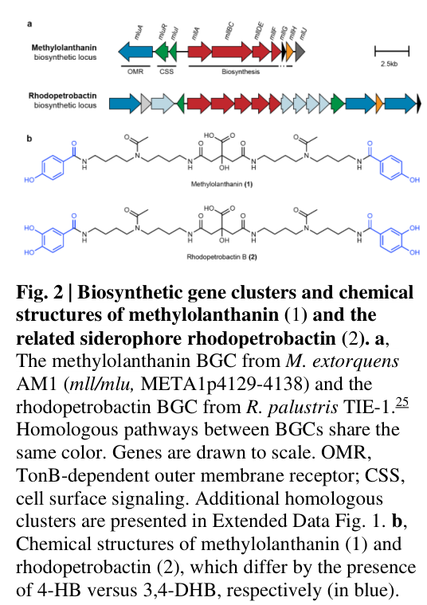

## Question

# Gene Research for Functional Annotation

## ⚠️ CRITICAL: Gene/Protein Identification Context

**BEFORE YOU BEGIN RESEARCH:** You MUST verify you are researching the CORRECT gene/protein. Gene symbols can be ambiguous, especially for less well-characterized genes from non-model organisms.

### Target Gene/Protein Identity (from UniProt):
- **UniProt Accession:** C5B1I5
- **Protein Description:** SubName: Full=Non-ribosomal peptide synthetase, putative acyl-CoA ligase for activation during siderophore synthesis {ECO:0000313|EMBL:ACS41786.1}; EC=6.2.1.26 {ECO:0000313|EMBL:ACS41786.1};
- **Gene Information:** OrderedLocusNames=MexAM1_META1p4133 {ECO:0000313|EMBL:ACS41786.1};
- **Organism (full):** Methylorubrum extorquens (strain ATCC 14718 / DSM 1338 / JCM 2805 / NCIMB 9133 / AM1) (Methylobacterium extorquens).
- **Protein Family:** Not specified in UniProt
- **Key Domains:** Aerobactin_biosyn_IucA/IucC_N. (IPR007310); AMP-bd_C. (IPR025110); AMP-bd_C_sf. (IPR045851); AMP-binding_CS. (IPR020845); AMP-dep_synth/lig_dom. (IPR000873)

### MANDATORY VERIFICATION STEPS:

1. **Check if the gene symbol "mllBC" matches the protein description above**
2. **Verify the organism is correct:** Methylorubrum extorquens (strain ATCC 14718 / DSM 1338 / JCM 2805 / NCIMB 9133 / AM1) (Methylobacterium extorquens).
3. **Check if protein family/domains align with what you find in literature**
4. **If you find literature for a DIFFERENT gene with the same or similar symbol, STOP**

### If Gene Symbol is Ambiguous or You Cannot Find Relevant Literature:

**DO NOT PROCEED WITH RESEARCH ON A DIFFERENT GENE.** Instead:
- State clearly: "The gene symbol 'mllBC' is ambiguous or literature is limited for this specific protein"
- Explain what you found (e.g., "Found extensive literature on a different gene with the same symbol in a different organism")
- Describe the protein based ONLY on the UniProt information provided above
- Suggest that the protein function can be inferred from domain/family information

### Research Target:

Please provide a comprehensive research report on the gene **mllBC** (gene ID: mllBC, UniProt: C5B1I5) in METEA.

The research report should be a detailed narrative explaining the function, biological processes, and localization of the gene product. Citations should be given for all claims.

You should prioritize authoritative reviews and primary scientific literature when conducting research. You can supplement
this with annotations you find in gene/protein databases, but these can be outdated or inaccurate.

We are specifically interested in the primary function of the gene - for enzymes, what reaction is catalyzed, and what is the substrate specificity? For transporters, what is the substrate? For structural proteins or adapters, what is the broader structural role? For signaling molecules, what is the role in the pathway.

We are interested in where in or outside the cell the gene product carries out its function.

We are also interested in the signaling or biochemical pathways in which the gene functions. We are less interested in broad pleiotropic effects, except where these elucidate the precise role.

Include evidence where possible. We are interested in both experimental evidence as well as inference from structure, evolution, or bioinformatic analysis. Precise studies should be prioritized over high-throughput, where available.

## Output

Question: You are an expert researcher providing comprehensive, well-cited information.

Provide detailed information focusing on:
1. Key concepts and definitions with current understanding
2. Recent developments and latest research (prioritize 2023-2024 sources)
3. Current applications and real-world implementations
4. Expert opinions and analysis from authoritative sources
5. Relevant statistics and data from recent studies

Format as a comprehensive research report with proper citations. Include URLs and publication dates where available.
Always prioritize recent, authoritative sources and provide specific citations for all major claims.

# Gene Research for Functional Annotation

## ⚠️ CRITICAL: Gene/Protein Identification Context

**BEFORE YOU BEGIN RESEARCH:** You MUST verify you are researching the CORRECT gene/protein. Gene symbols can be ambiguous, especially for less well-characterized genes from non-model organisms.

### Target Gene/Protein Identity (from UniProt):
- **UniProt Accession:** C5B1I5
- **Protein Description:** SubName: Full=Non-ribosomal peptide synthetase, putative acyl-CoA ligase for activation during siderophore synthesis {ECO:0000313|EMBL:ACS41786.1}; EC=6.2.1.26 {ECO:0000313|EMBL:ACS41786.1};
- **Gene Information:** OrderedLocusNames=MexAM1_META1p4133 {ECO:0000313|EMBL:ACS41786.1};
- **Organism (full):** Methylorubrum extorquens (strain ATCC 14718 / DSM 1338 / JCM 2805 / NCIMB 9133 / AM1) (Methylobacterium extorquens).
- **Protein Family:** Not specified in UniProt
- **Key Domains:** Aerobactin_biosyn_IucA/IucC_N. (IPR007310); AMP-bd_C. (IPR025110); AMP-bd_C_sf. (IPR045851); AMP-binding_CS. (IPR020845); AMP-dep_synth/lig_dom. (IPR000873)

### MANDATORY VERIFICATION STEPS:

1. **Check if the gene symbol "mllBC" matches the protein description above**
2. **Verify the organism is correct:** Methylorubrum extorquens (strain ATCC 14718 / DSM 1338 / JCM 2805 / NCIMB 9133 / AM1) (Methylobacterium extorquens).
3. **Check if protein family/domains align with what you find in literature**
4. **If you find literature for a DIFFERENT gene with the same or similar symbol, STOP**

### If Gene Symbol is Ambiguous or You Cannot Find Relevant Literature:

**DO NOT PROCEED WITH RESEARCH ON A DIFFERENT GENE.** Instead:
- State clearly: "The gene symbol 'mllBC' is ambiguous or literature is limited for this specific protein"
- Explain what you found (e.g., "Found extensive literature on a different gene with the same symbol in a different organism")
- Describe the protein based ONLY on the UniProt information provided above
- Suggest that the protein function can be inferred from domain/family information

### Research Target:

Please provide a comprehensive research report on the gene **mllBC** (gene ID: mllBC, UniProt: C5B1I5) in METEA.

The research report should be a detailed narrative explaining the function, biological processes, and localization of the gene product. Citations should be given for all claims.

You should prioritize authoritative reviews and primary scientific literature when conducting research. You can supplement
this with annotations you find in gene/protein databases, but these can be outdated or inaccurate.

We are specifically interested in the primary function of the gene - for enzymes, what reaction is catalyzed, and what is the substrate specificity? For transporters, what is the substrate? For structural proteins or adapters, what is the broader structural role? For signaling molecules, what is the role in the pathway.

We are interested in where in or outside the cell the gene product carries out its function.

We are also interested in the signaling or biochemical pathways in which the gene functions. We are less interested in broad pleiotropic effects, except where these elucidate the precise role.

Include evidence where possible. We are interested in both experimental evidence as well as inference from structure, evolution, or bioinformatic analysis. Precise studies should be prioritized over high-throughput, where available.

## Research report: functional annotation of **mllBC** (UniProt **C5B1I5**; locus **MexAM1_META1p4133**) in *Methylorubrum extorquens* AM1

### Executive summary (identity verification and main conclusion)
The target protein is **UniProt C5B1I5**, annotated for *Methylorubrum extorquens* strain AM1 as a **putative non-ribosomal peptide synthetase / acyl-adenylate-forming ligase** with **IucA/IucC_N** and **AMP-binding** domain signatures, consistent with **NRPS-independent siderophore (NIS) synthetases**. In organism-specific literature, **MexAM1_META1p4133** is located in the **methylolanthanin (mll/mlu) biosynthetic gene cluster** (META1p4129–META1p4138) and is part of an unusual **mllBC gene fusion**. This cluster is genetically and chemically linked to production of the lanthanide-binding metallophore **methylolanthanin (MLL)** and to lanthanide (Ln) bioaccumulation phenotypes in AM1, supporting that mllBC contributes to **MLL assembly** via an **ATP-dependent adenylation/amide-forming ligase step** typical of NIS pathways. However, **direct purified-enzyme biochemistry (substrate specificity for C5B1I5 alone)** was not found in the retrieved texts; functional assignment is therefore **cluster- and homology-supported** rather than single-gene experimentally proven. (zytnick2022discoveryandcharacterization pages 3-5, zytnick2022discoveryandcharacterization pages 10-12, zytnick2022discoveryandcharacterization pages 5-8)

### 1. Key concepts and definitions (current understanding)

#### 1.1 Metallophores, siderophores, and lanthanophores
Metallophores are secreted small molecules that chelate metals with high affinity to improve acquisition of poorly bioavailable ions. Canonical Gram-negative uptake involves **TonB-dependent outer membrane receptors** for metallophore–metal complexes, followed (in some systems) by periplasmic handling and **ABC-transporter** import to the cytoplasm. This framework is used to interpret lanthanide acquisition pathways because lanthanides can be insoluble and scarce, and Ln-dependent enzymes are often periplasmic in methylotrophs. (zytnick2022discoveryandcharacterization pages 1-3)

A **lanthanophore** is an Ln-chelating metallophore (functionally analogous to siderophores for Fe). Methylolanthanin (MLL) is described as the **first characterized lanthanophore** from *M. extorquens* AM1, required for normal Ln accumulation, with overexpression increasing bioaccumulation. (zytnick2022discoveryandcharacterization pages 1-3)

#### 1.2 NRPS-independent siderophore (NIS) synthetases (IucA/IucC-type)
NIS synthetases are ATP-dependent ligases that form **amide bonds** between a **carboxylate substrate** and an **amine substrate** via a two-step mechanism: (i) formation of an **acyl-adenylate (acyl-AMP)** intermediate with PPi release and (ii) nucleophilic attack by the amine to displace AMP, producing an amide. They therefore consume three substrates (ATP + carboxylate + amine) and produce AMP + PPi + amide product. (gulick2024kineticanalysisof pages 1-2)

Mechanistic work on IucA (a prototypical NIS enzyme in aerobactin biosynthesis) supports an ordered binding model where a quaternary complex can form between ATP, citrate, and an amine substrate; typical NIS carboxylate substrates include **citrate** or related dicarboxylates, while amines include hydroxamate-containing amino-acid derivatives or diamines. (gulick2024kineticanalysisof pages 10-11, gulick2024kineticanalysisof pages 1-2)

### 2. Gene/protein identity and genomic context (MANDATORY verification)

#### 2.1 Match between gene symbol and target protein
In the AM1 methylolanthanin biosynthetic locus, **META1p4132–4135** are annotated as **mllA, mllBC, mllDE, mllF**, and META1p4133 falls within the **mllBC fusion**. This satisfies the required identity match between the target (MexAM1_META1p4133 / UniProt C5B1I5) and the gene symbol context **mllBC** in the relevant organism. (zytnick2022discoveryandcharacterization pages 3-5)

#### 2.2 Organism verification
All locus assignments and functional evidence described here are explicitly for **Methylorubrum extorquens AM1** (formerly *Methylobacterium extorquens* AM1), matching the user-specified organism context. (zytnick2022discoveryandcharacterization pages 1-3, zytnick2022discoveryandcharacterization pages 3-5)

#### 2.3 Cluster organization (visual evidence)
Figure-level evidence shows the methylolanthanin biosynthetic cluster organization and methylolanthanin structure in the same panel, supporting direct linkage of the locus to the metabolite product. (zytnick2022discoveryandcharacterization media 6c8d96b0)

### 3. Primary function: biochemical role inferred for mllBC (C5B1I5)

#### 3.1 What reaction is catalyzed?
**Best-supported functional class**: an **ATP-dependent acyl-adenylate-forming ligase** that catalyzes **amide bond formation** during MLL biosynthesis (NIS-like chemistry). This is supported by:

* The mll locus was detected/annotated using an antiSMASH rule requiring **IucA/IucC** and **AMP-binding** signatures characteristic of NIS siderophore synthetases. (zytnick2022discoveryandcharacterization pages 10-12)
* META1p4132–4135 (including **mllBC**) are homologous to the **petrobactin asb** biosynthetic genes, which are part of NRPS-independent siderophore pathways built via ATP-dependent ligases. (zytnick2022discoveryandcharacterization pages 3-5)

**Limitations**: No retrieved source provided a purified C5B1I5 enzyme assay specifying the exact substrates/products for this single protein, so the catalytic step assignment remains an inference from domain architecture, pathway type, and metabolite structure. (zytnick2022discoveryandcharacterization pages 5-8, zytnick2022discoveryandcharacterization pages 3-5)

#### 3.2 Likely substrate specificity (inferred from methylolanthanin structure)
Methylolanthanin was structurally elucidated as a **citrate core** linked to **two 4-hydroxybenzoate (4-HB) moieties** through **acetylated homospermidine residues** (polyamine linkers). This implies that enzymes in the mll cluster (including adenylate-forming ligases such as mllBC) must activate one or more **carboxylate-bearing components** (e.g., citrate and/or aromatic acid derivatives) to form amide linkages with **amine-containing polyamine modules**. (zytnick2022discoveryandcharacterization pages 5-8, zytnick2022discoveryandcharacterization media 6c8d96b0)

Consistent with general NIS enzyme chemistry, citrate is explicitly a canonical NIS carboxylate substrate class, and polyamines/amine substrates are typical nucleophiles. (gulick2024kineticanalysisof pages 1-2)

### 4. Biological process and pathway context

#### 4.1 Methylolanthanin biosynthesis is induced by low-solubility lanthanides
The mll biosynthetic gene cluster (META1p4129–4138) is highly transcriptionally induced when AM1 is grown with **poorly soluble Nd2O3**, with an average ~**32-fold** upregulation compared with growth in soluble NdCl3. This is consistent with a pathway used when lanthanide bioavailability is low and chelation/mobilization is needed. (zytnick2022discoveryandcharacterization pages 3-5)

#### 4.2 Genetic evidence links the locus (including mllBC) to methylolanthanin production and Ln physiology
Deletion/overexpression of the **META1p4132–4138** region shows it is required for production of methylolanthanin features in culture supernatants and for normal lanthanide bioaccumulation phenotypes. (zytnick2022discoveryandcharacterization pages 5-8)

Quantitative phenotypes reported include:
* **Deletion** decreased Nd bioaccumulation (including **1.8-fold lower** with NdCl3). (zytnick2022discoveryandcharacterization pages 8-10)
* **Overexpression** increased Nd bioaccumulation by ~**3.5-fold** on average. (zytnick2022discoveryandcharacterization pages 8-10)
* A **ΔmxaFΔmll** strain exhibited a **~30% decrease** in lanthanide bioaccumulation in one assay context. (zytnick2022discoveryandcharacterization pages 10-12)
* Exogenous purified methylolanthanin at **50 nM** significantly increased growth yield under conditions tested (reported p-values ~0.036–0.037). (zytnick2022discoveryandcharacterization pages 8-10)

These results support that the mll pathway product methylolanthanin is a functional contributor to Ln acquisition/accumulation, and that mllBC is part of its biosynthesis. (zytnick2022discoveryandcharacterization pages 5-8, zytnick2022discoveryandcharacterization pages 3-5)

#### 4.3 Metal-binding evidence for the pathway product
Purified methylolanthanin forms detectable complexes with La, Nd, and Lu, described as **[MLL−H+ + Ln3+]2+** by mass spectrometry, supporting that the cluster product is a bona fide lanthanide chelator (lanthanophore). (zytnick2022discoveryandcharacterization pages 8-10)

### 5. Cellular localization: where the gene product acts

#### 5.1 Likely cellular compartment for MLL function (extracellular/periplasmic interface)
The mll locus includes components consistent with secretion/uptake at the cell envelope, including predicted **TonB-dependent outer membrane receptor** and associated **cell-surface signaling** proteins (anti-sigma and sigma factors) upstream of biosynthetic genes. This architecture supports a model where the metallophore is made and exported to chelate Ln extracellularly, then brought back through a TonB-dependent receptor into the periplasm. (zytnick2022discoveryandcharacterization pages 3-5, zytnick2022discoveryandcharacterization pages 5-8)

More generally, metallophore uptake in Gram-negative bacteria proceeds via **TonB-dependent receptors into the periplasm**, consistent with this inference. (zytnick2022discoveryandcharacterization pages 1-3)

#### 5.2 Localization of mllBC enzyme itself
No retrieved source directly determined the subcellular localization of the mllBC fusion protein (e.g., cytosolic vs periplasmic). Given typical NIS synthetases are cytosolic enzymes producing secreted metabolites (often later exported), the most plausible working model is that mllBC functions on the **cytosolic side** to assemble methylolanthanin prior to export; however, this specific claim cannot be asserted as experimentally demonstrated from the retrieved evidence and is therefore left as an inference. (zytnick2022discoveryandcharacterization pages 1-3, gulick2024kineticanalysisof pages 1-2)

### 6. Recent developments (prioritizing 2023–2024) and real-world applications

#### 6.1 2023: engineered lanthanophore production for rare earth recovery from waste
A 2023 Environmental Science & Technology study used *M. extorquens* AM1 as a **scalable (up to 10 L)** microbial platform for REE leaching and recovery from waste sources without harsh acids/temperatures, and reports that expressing the **mll pathway** in trans increases REE uptake/bioaccumulation from magnet swarf. Reported quantitative outcomes include: **>3-fold** increased Nd/Pr/Dy uptake with mll expression, reaching **80 mg Nd/g dry weight**, **15 mg Pr/g DW**, and **8 mg Dy/g DW**; and that raising methylolanthanin levels yielded **>20-fold** higher Nd yields above baseline. The authors estimate that process improvements could enable **1.3–2.1 g Nd/L** and **~65–100%** recovery in a single run at **1%** Nd magnet swarf pulp density. (good2023scalableandconsolidated pages 6-7, good2023scalableandconsolidated pages 1-2)

These findings constitute a real-world implementation direction: engineered lanthanophore production to improve bioleaching/bioaccumulation of critical metals from complex waste. (good2023scalableandconsolidated pages 1-2)

#### 6.2 2024: ecological interpretation—metallophores in mineral weathering and Ln mobilization
A 2024 BMC Biology paper argues that specialized molecules such as metallophores may be required to promote lanthanide release from insoluble lanthanide phosphate minerals during rock weathering. It cites experimental evidence in AM1 that a lanthanide chelation cluster is upregulated by poorly soluble Nd2O3 and encodes a biosynthetic cluster (with a TonB-dependent transporter) that produces an aerobactin-like siderophore/metallophore. This provides recent expert framing that metallophore production is a plausible mechanism for Ln mobilization in environmental contexts. (voutsinos2024weatheredgranitesand pages 1-2)

#### 6.3 2024: mechanistic framework for annotating IucA/IucC-type enzymes
A 2024 Methods in Enzymology contribution provides up-to-date mechanistic expectations for IucA/IucC-like NIS synthetases: ATP-dependent acyl-adenylate formation followed by amide bond formation; expected three-substrate kinetics; and a validated approach for assigning ordered substrate binding and catalytic mechanism (e.g., ATP→citrate→amine order in IucA). This is directly applicable guidance for experimentally validating substrate specificity of mllBC/C5B1I5 in future work. (gulick2024kineticanalysisof pages 2-4, gulick2024kineticanalysisof pages 10-11)

### 7. Statistics and data highlights from recent studies
Key quantitative results relevant to the mll locus (and therefore the pathway containing mllBC/META1p4133) include:

* **~32-fold** average induction of the mll cluster with Nd2O3 vs NdCl3 (transcriptomics). (zytnick2022discoveryandcharacterization pages 3-5)
* **1.8-fold decrease** in Nd bioaccumulation with mll deletion under NdCl3 conditions; **~3.5-fold increase** with mll overexpression (ICP-MS). (zytnick2022discoveryandcharacterization pages 8-10)
* **80 mg Nd/g dry weight** (plus Pr/Dy values) achieved in engineered REE recovery contexts with mll expression. (good2023scalableandconsolidated pages 6-7)
* Estimated **1.3–2.1 g Nd/L** recovery and **~65–100%** recovery (single run; 1% pulp density) in a proposed practical process configuration. (good2023scalableandconsolidated pages 6-7)

### 8. Synthesis: recommended functional annotation statement for mllBC (C5B1I5)

**Proposed annotation (evidence-weighted):**
*Gene product mllBC (UniProt C5B1I5; MexAM1_META1p4133) is an NRPS-independent siderophore synthetase-like adenylate-forming ligase within the methylolanthanin biosynthetic gene cluster. It likely catalyzes one or more ATP-dependent acyl-adenylation and amide bond-forming steps required to assemble methylolanthanin, a citrate-based lanthanophore that binds lanthanides (La/Nd/Lu) and promotes lanthanide uptake/bioaccumulation in *M. extorquens* AM1.*

This annotation is supported by cluster homology to asb/petrobactin-type NIS pathways and by strong genetic/chemical evidence linking the locus to methylolanthanin production and Ln bioaccumulation phenotypes, but is limited by the absence (in retrieved sources) of purified mllBC enzyme substrate assays. (zytnick2022discoveryandcharacterization pages 3-5, zytnick2022discoveryandcharacterization pages 5-8, zytnick2022discoveryandcharacterization pages 8-10)

### 9. Evidence summary table
The following table consolidates the major lines of evidence and quantitative findings supporting this functional annotation.

| Evidence type | Key finding | Quantitative data | Source (paper, year, URL) | Citation ID(s) |
|---|---|---|---|---|
| Domain/cluster homology | UniProt C5B1I5 corresponds to MexAM1_META1p4133 within the mll/mlu locus (META1p4129–4138); META1p4132–4135 are annotated as mllA, mllBC, mllDE, and mllF and are homologous to petrobactin asbABCDEF biosynthetic genes. The mllBC fusion is described as unusual among characterized homologs. antiSMASH detection for this locus used IucA_IucC, AMP-binding, PP-binding, and DUF6005 models, supporting assignment to an NRPS-independent siderophore-like pathway. | mll locus upregulated ~32-fold on average with Nd2O3 vs NdCl3 | Zytnick et al., 2022, https://doi.org/10.1101/2022.01.19.476857 | (zytnick2022discoveryandcharacterization pages 3-5, zytnick2022discoveryandcharacterization pages 10-12) |
| Transcriptomics | The methylolanthanin biosynthetic gene cluster was the most strongly induced gene set when cells were grown with poorly soluble lanthanide, consistent with a role in acquisition of low-bioavailability lanthanides. | ~32-fold average induction of mll locus with Nd2O3 vs NdCl3; related changes include xoxF1 ~5-fold, exaF ~3-fold, pqqA2/3 ~4-fold; M. extorquens senses lanthanides at ~2.5 nM | Zytnick et al., 2022, https://doi.org/10.1101/2022.01.19.476857 | (zytnick2022discoveryandcharacterization pages 3-5, zytnick2022discoveryandcharacterization pages 10-12) |
| Genetics | Cluster-level genetics link the locus containing META1p4133 to lanthanide physiology: deletion of mll reduces lanthanide bioaccumulation, while overexpression increases growth and Nd accumulation. Exogenous purified methylolanthanin rescues growth-related defects. | ΔmxaFΔmll shows ~30% lower lanthanide bioaccumulation in one assay; deletion caused 1.8-fold lower Nd bioaccumulation with NdCl3; overexpression increased Nd bioaccumulation ~3.5-fold on average; methylolanthanin added at 50 nM significantly increased growth yield (p = 0.036, 0.037) | Zytnick et al., 2022, https://doi.org/10.1101/2022.01.19.476857 | (zytnick2022discoveryandcharacterization pages 8-10, zytnick2022discoveryandcharacterization pages 3-5) |
| Metabolite structure | Deletion/overexpression of META1p4132–4138 established that the locus containing META1p4133 is required for production of methylolanthanin. Structural analysis showed a citrate core linked to two 4-hydroxybenzoate moieties via acetylated homospermidine residues, distinguishing it from rhodopetrobactin-like 3,4-DHB systems. | Diagnostic LC-MS features at m/z 799.4232 (positive) and 797.4092 (negative); related feature pair at m/z 721.4114/719.3978; n = 20 per group for peak-area statistics and n = 5 per group for volcano plots | Zytnick et al., 2022, https://doi.org/10.1101/2022.01.19.476857 | (zytnick2022discoveryandcharacterization pages 5-8) |
| Metal-binding | Purified methylolanthanin directly binds lanthanides, supporting the interpretation that the META1p4133-containing biosynthetic cluster produces a lanthanophore/metallophore. Complexes were detected with multiple lanthanides. | Complex observed as [MLL-H++Ln3+]2+ with La, Nd, and Lu; cultures for metal-binding/growth assays used 2 µM NdCl3 or 1 µM Nd2O3 in reported experiments | Zytnick et al., 2022, https://doi.org/10.1101/2022.01.19.476857 | (zytnick2022discoveryandcharacterization pages 14-17, zytnick2022discoveryandcharacterization pages 8-10) |
| Localization/transport context | The locus includes predicted uptake and signaling components, indicating the product functions extracellularly/periplasmically in metal capture and import. META1p4129–4131 are predicted to encode a TonB-dependent outer membrane receptor, anti-sigma factor, and sigma factor; mllJ is predicted periplasmic. | Gene cluster spans META1p4129–4138 | Zytnick et al., 2022, https://doi.org/10.1101/2022.01.19.476857; Juma et al., 2022, https://doi.org/10.3389/fmicb.2022.921635 | (zytnick2022discoveryandcharacterization pages 1-3, juma2022siderophoreforlanthanide pages 2-3, zytnick2022discoveryandcharacterization pages 3-5, zytnick2022discoveryandcharacterization pages 5-8) |
| Application/engineering | Engineering increased methylolanthanin/lanthanophore production to improve REE recovery from waste feedstocks. Expression of mll in trans increased uptake of multiple REEs from magnet swarf, supporting real-world bioleaching and bioaccumulation applications. | >3-fold increases in Nd, Pr, and Dy uptake; reached 80 mg Nd/g dry weight, 15 mg Pr/g dry weight, and 8 mg Dy/g dry weight; Nd yields >20-fold above baseline; estimated 1.3–2.1 g Nd/L and ~65–100% recovery in a single run with 1% Nd magnet swarf pulp density; scalable to 10 L | Good et al., 2023, https://doi.org/10.1021/acs.est.3c06775 | (good2023scalableandconsolidated pages 6-7, good2023scalableandconsolidated pages 1-2) |

*Table: This table summarizes the main lines of evidence supporting functional annotation of UniProt C5B1I5 (MexAM1_META1p4133; mllBC fusion) within the methylolanthanin biosynthetic locus of Methylorubrum extorquens AM1. It highlights what is directly supported by transcriptomic, genetic, structural, metal-binding, and engineering data, while distinguishing cluster-level inference from single-enzyme biochemical proof.*

### 10. Key cited sources (with dates and URLs)
* Zytnick et al. (Jan 2022). “Discovery and characterization of the first known biological lanthanide chelator.” bioRxiv. https://doi.org/10.1101/2022.01.19.476857 (zytnick2022discoveryandcharacterization pages 1-3)
* Good et al. (Dec 2023). “Scalable and Consolidated Microbial Platform for Rare Earth Element Leaching and Recovery from Waste Sources.” Environmental Science & Technology. https://doi.org/10.1021/acs.est.3c06775 (good2023scalableandconsolidated pages 1-2)
* Voutsinos et al. (Feb 2024). “Weathered granites and soils harbour microbes with lanthanide-dependent methylotrophic enzymes.” BMC Biology. https://doi.org/10.1186/s12915-024-01841-0 (voutsinos2024weatheredgranitesand pages 1-2)
* Gulick et al. (Jan 2024). “Kinetic analysis of the three-substrate reaction mechanism of an NRPS-independent siderophore (NIS) synthetase.” Methods in Enzymology. https://doi.org/10.1016/bs.mie.2024.06.012 (gulick2024kineticanalysisof pages 1-2)

### Notes on evidence gaps
A 2024 PNAS paper on metallophore characterization is listed by DOI (10.1073/pnas.2322096121) but was not obtainable through the current retrieval, so its potentially more definitive gene-level enzymology could not be incorporated. (unobtainable; see tool output log)

References

1. (zytnick2022discoveryandcharacterization pages 3-5): Alexa M. Zytnick, Sophie M. Gutenthaler-Tietze, Allegra T. Aron, Zachary L. Reitz, Manh Tri Phi, Nathan M. Good, Daniel Petras, Lena J. Daumann, and N. Cecilia Martinez-Gomez. Discovery and characterization of the first known biological lanthanide chelator. bioRxiv, Jan 2022. URL: https://doi.org/10.1101/2022.01.19.476857, doi:10.1101/2022.01.19.476857. This article has 20 citations.

2. (zytnick2022discoveryandcharacterization pages 10-12): Alexa M. Zytnick, Sophie M. Gutenthaler-Tietze, Allegra T. Aron, Zachary L. Reitz, Manh Tri Phi, Nathan M. Good, Daniel Petras, Lena J. Daumann, and N. Cecilia Martinez-Gomez. Discovery and characterization of the first known biological lanthanide chelator. bioRxiv, Jan 2022. URL: https://doi.org/10.1101/2022.01.19.476857, doi:10.1101/2022.01.19.476857. This article has 20 citations.

3. (zytnick2022discoveryandcharacterization pages 5-8): Alexa M. Zytnick, Sophie M. Gutenthaler-Tietze, Allegra T. Aron, Zachary L. Reitz, Manh Tri Phi, Nathan M. Good, Daniel Petras, Lena J. Daumann, and N. Cecilia Martinez-Gomez. Discovery and characterization of the first known biological lanthanide chelator. bioRxiv, Jan 2022. URL: https://doi.org/10.1101/2022.01.19.476857, doi:10.1101/2022.01.19.476857. This article has 20 citations.

4. (zytnick2022discoveryandcharacterization pages 1-3): Alexa M. Zytnick, Sophie M. Gutenthaler-Tietze, Allegra T. Aron, Zachary L. Reitz, Manh Tri Phi, Nathan M. Good, Daniel Petras, Lena J. Daumann, and N. Cecilia Martinez-Gomez. Discovery and characterization of the first known biological lanthanide chelator. bioRxiv, Jan 2022. URL: https://doi.org/10.1101/2022.01.19.476857, doi:10.1101/2022.01.19.476857. This article has 20 citations.

5. (gulick2024kineticanalysisof pages 1-2): Andrew M. Gulick, Lisa S. Mydy, and Ketan D. Patel. Kinetic analysis of the three-substrate reaction mechanism of an nrps-independent siderophore (nis) synthetase. Methods in enzymology, 702:1-19, Jan 2024. URL: https://doi.org/10.1016/bs.mie.2024.06.012, doi:10.1016/bs.mie.2024.06.012. This article has 4 citations and is from a peer-reviewed journal.

6. (gulick2024kineticanalysisof pages 10-11): Andrew M. Gulick, Lisa S. Mydy, and Ketan D. Patel. Kinetic analysis of the three-substrate reaction mechanism of an nrps-independent siderophore (nis) synthetase. Methods in enzymology, 702:1-19, Jan 2024. URL: https://doi.org/10.1016/bs.mie.2024.06.012, doi:10.1016/bs.mie.2024.06.012. This article has 4 citations and is from a peer-reviewed journal.

7. (zytnick2022discoveryandcharacterization media 6c8d96b0): Alexa M. Zytnick, Sophie M. Gutenthaler-Tietze, Allegra T. Aron, Zachary L. Reitz, Manh Tri Phi, Nathan M. Good, Daniel Petras, Lena J. Daumann, and N. Cecilia Martinez-Gomez. Discovery and characterization of the first known biological lanthanide chelator. bioRxiv, Jan 2022. URL: https://doi.org/10.1101/2022.01.19.476857, doi:10.1101/2022.01.19.476857. This article has 20 citations.

8. (zytnick2022discoveryandcharacterization pages 8-10): Alexa M. Zytnick, Sophie M. Gutenthaler-Tietze, Allegra T. Aron, Zachary L. Reitz, Manh Tri Phi, Nathan M. Good, Daniel Petras, Lena J. Daumann, and N. Cecilia Martinez-Gomez. Discovery and characterization of the first known biological lanthanide chelator. bioRxiv, Jan 2022. URL: https://doi.org/10.1101/2022.01.19.476857, doi:10.1101/2022.01.19.476857. This article has 20 citations.

9. (good2023scalableandconsolidated pages 6-7): Nathan M. Good, Christina S. Kang-Yun, Morgan Z. Su, Alexa M. Zytnick, Colin C. Barber, Huong N. Vu, Joseph M. Grace, Hoang H. Nguyen, Wenjun Zhang, Elizabeth Skovran, Maohong Fan, Dan M. Park, and Norma Cecilia Martinez-Gomez. Scalable and consolidated microbial platform for rare earth element leaching and recovery from waste sources. Environmental Science & Technology, 58:570-579, Dec 2023. URL: https://doi.org/10.1021/acs.est.3c06775, doi:10.1021/acs.est.3c06775. This article has 41 citations and is from a domain leading peer-reviewed journal.

10. (good2023scalableandconsolidated pages 1-2): Nathan M. Good, Christina S. Kang-Yun, Morgan Z. Su, Alexa M. Zytnick, Colin C. Barber, Huong N. Vu, Joseph M. Grace, Hoang H. Nguyen, Wenjun Zhang, Elizabeth Skovran, Maohong Fan, Dan M. Park, and Norma Cecilia Martinez-Gomez. Scalable and consolidated microbial platform for rare earth element leaching and recovery from waste sources. Environmental Science & Technology, 58:570-579, Dec 2023. URL: https://doi.org/10.1021/acs.est.3c06775, doi:10.1021/acs.est.3c06775. This article has 41 citations and is from a domain leading peer-reviewed journal.

11. (voutsinos2024weatheredgranitesand pages 1-2): Marcos Y. Voutsinos, Jacob A. West-Roberts, Rohan Sachdeva, John W. Moreau, and Jillian F. Banfield. Weathered granites and soils harbour microbes with lanthanide-dependent methylotrophic enzymes. BMC Biology, Feb 2024. URL: https://doi.org/10.1186/s12915-024-01841-0, doi:10.1186/s12915-024-01841-0. This article has 13 citations and is from a domain leading peer-reviewed journal.

12. (gulick2024kineticanalysisof pages 2-4): Andrew M. Gulick, Lisa S. Mydy, and Ketan D. Patel. Kinetic analysis of the three-substrate reaction mechanism of an nrps-independent siderophore (nis) synthetase. Methods in enzymology, 702:1-19, Jan 2024. URL: https://doi.org/10.1016/bs.mie.2024.06.012, doi:10.1016/bs.mie.2024.06.012. This article has 4 citations and is from a peer-reviewed journal.

13. (zytnick2022discoveryandcharacterization pages 14-17): Alexa M. Zytnick, Sophie M. Gutenthaler-Tietze, Allegra T. Aron, Zachary L. Reitz, Manh Tri Phi, Nathan M. Good, Daniel Petras, Lena J. Daumann, and N. Cecilia Martinez-Gomez. Discovery and characterization of the first known biological lanthanide chelator. bioRxiv, Jan 2022. URL: https://doi.org/10.1101/2022.01.19.476857, doi:10.1101/2022.01.19.476857. This article has 20 citations.

14. (juma2022siderophoreforlanthanide pages 2-3): Patrick Otieno Juma, Yoshiko Fujitani, Ola Alessa, Tokitaka Oyama, Hiroya Yurimoto, Yasuyoshi Sakai, and Akio Tani. Siderophore for lanthanide and iron uptake for methylotrophy and plant growth promotion in methylobacterium aquaticum strain 22a. Frontiers in Microbiology, Jul 2022. URL: https://doi.org/10.3389/fmicb.2022.921635, doi:10.3389/fmicb.2022.921635. This article has 55 citations and is from a peer-reviewed journal.

## Artifacts

- [Edison artifact artifact-00](mllBC-deep-research-falcon_artifacts/artifact-00.md)

## Citations

1. zytnick2022discoveryandcharacterization pages 1-3
2. gulick2024kineticanalysisof pages 1-2
3. zytnick2022discoveryandcharacterization pages 3-5
4. zytnick2022discoveryandcharacterization pages 10-12
5. zytnick2022discoveryandcharacterization pages 5-8
6. zytnick2022discoveryandcharacterization pages 8-10
7. good2023scalableandconsolidated pages 1-2
8. voutsinos2024weatheredgranitesand pages 1-2
9. good2023scalableandconsolidated pages 6-7
10. gulick2024kineticanalysisof pages 10-11
11. gulick2024kineticanalysisof pages 2-4
12. zytnick2022discoveryandcharacterization pages 14-17
13. juma2022siderophoreforlanthanide pages 2-3
14. MLL−H+ + Ln3+
15. MLL-H++Ln3+
16. https://doi.org/10.1101/2022.01.19.476857
17. https://doi.org/10.1101/2022.01.19.476857;
18. https://doi.org/10.3389/fmicb.2022.921635
19. https://doi.org/10.1021/acs.est.3c06775
20. https://doi.org/10.1186/s12915-024-01841-0
21. https://doi.org/10.1016/bs.mie.2024.06.012
22. https://doi.org/10.1101/2022.01.19.476857,
23. https://doi.org/10.1016/bs.mie.2024.06.012,
24. https://doi.org/10.1021/acs.est.3c06775,
25. https://doi.org/10.1186/s12915-024-01841-0,
26. https://doi.org/10.3389/fmicb.2022.921635,