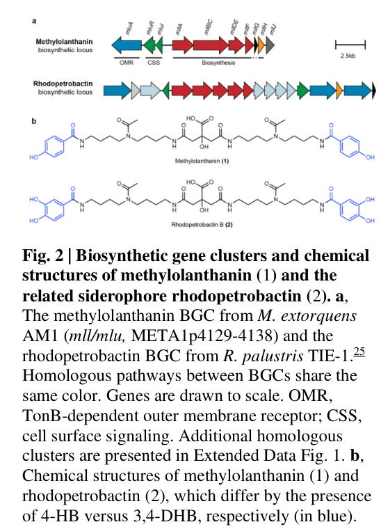

## Question

# Gene Research for Functional Annotation

## ⚠️ CRITICAL: Gene/Protein Identification Context

**BEFORE YOU BEGIN RESEARCH:** You MUST verify you are researching the CORRECT gene/protein. Gene symbols can be ambiguous, especially for less well-characterized genes from non-model organisms.

### Target Gene/Protein Identity (from UniProt):
- **UniProt Accession:** C5B1I7
- **Protein Description:** RecName: Full=Xylose isomerase-like TIM barrel domain-containing protein {ECO:0000259|Pfam:PF01261};
- **Gene Information:** OrderedLocusNames=MexAM1_META1p4135 {ECO:0000313|EMBL:ACS41788.1};
- **Organism (full):** Methylorubrum extorquens (strain ATCC 14718 / DSM 1338 / JCM 2805 / NCIMB 9133 / AM1) (Methylobacterium extorquens).
- **Protein Family:** Not specified in UniProt
- **Key Domains:** IolE/XylAMocC-like. (IPR050312); Xyl_isomerase-like_sf. (IPR036237); Xyl_isomerase-like_TIM-brl. (IPR013022); AP_endonuc_2 (PF01261)

### MANDATORY VERIFICATION STEPS:

1. **Check if the gene symbol "mllF" matches the protein description above**
2. **Verify the organism is correct:** Methylorubrum extorquens (strain ATCC 14718 / DSM 1338 / JCM 2805 / NCIMB 9133 / AM1) (Methylobacterium extorquens).
3. **Check if protein family/domains align with what you find in literature**
4. **If you find literature for a DIFFERENT gene with the same or similar symbol, STOP**

### If Gene Symbol is Ambiguous or You Cannot Find Relevant Literature:

**DO NOT PROCEED WITH RESEARCH ON A DIFFERENT GENE.** Instead:
- State clearly: "The gene symbol 'mllF' is ambiguous or literature is limited for this specific protein"
- Explain what you found (e.g., "Found extensive literature on a different gene with the same symbol in a different organism")
- Describe the protein based ONLY on the UniProt information provided above
- Suggest that the protein function can be inferred from domain/family information

### Research Target:

Please provide a comprehensive research report on the gene **mllF** (gene ID: mllF, UniProt: C5B1I7) in METEA.

The research report should be a detailed narrative explaining the function, biological processes, and localization of the gene product. Citations should be given for all claims.

You should prioritize authoritative reviews and primary scientific literature when conducting research. You can supplement
this with annotations you find in gene/protein databases, but these can be outdated or inaccurate.

We are specifically interested in the primary function of the gene - for enzymes, what reaction is catalyzed, and what is the substrate specificity? For transporters, what is the substrate? For structural proteins or adapters, what is the broader structural role? For signaling molecules, what is the role in the pathway.

We are interested in where in or outside the cell the gene product carries out its function.

We are also interested in the signaling or biochemical pathways in which the gene functions. We are less interested in broad pleiotropic effects, except where these elucidate the precise role.

Include evidence where possible. We are interested in both experimental evidence as well as inference from structure, evolution, or bioinformatic analysis. Precise studies should be prioritized over high-throughput, where available.

## Output

Question: You are an expert researcher providing comprehensive, well-cited information.

Provide detailed information focusing on:
1. Key concepts and definitions with current understanding
2. Recent developments and latest research (prioritize 2023-2024 sources)
3. Current applications and real-world implementations
4. Expert opinions and analysis from authoritative sources
5. Relevant statistics and data from recent studies

Format as a comprehensive research report with proper citations. Include URLs and publication dates where available.
Always prioritize recent, authoritative sources and provide specific citations for all major claims.

# Gene Research for Functional Annotation

## ⚠️ CRITICAL: Gene/Protein Identification Context

**BEFORE YOU BEGIN RESEARCH:** You MUST verify you are researching the CORRECT gene/protein. Gene symbols can be ambiguous, especially for less well-characterized genes from non-model organisms.

### Target Gene/Protein Identity (from UniProt):
- **UniProt Accession:** C5B1I7
- **Protein Description:** RecName: Full=Xylose isomerase-like TIM barrel domain-containing protein {ECO:0000259|Pfam:PF01261};
- **Gene Information:** OrderedLocusNames=MexAM1_META1p4135 {ECO:0000313|EMBL:ACS41788.1};
- **Organism (full):** Methylorubrum extorquens (strain ATCC 14718 / DSM 1338 / JCM 2805 / NCIMB 9133 / AM1) (Methylobacterium extorquens).
- **Protein Family:** Not specified in UniProt
- **Key Domains:** IolE/XylAMocC-like. (IPR050312); Xyl_isomerase-like_sf. (IPR036237); Xyl_isomerase-like_TIM-brl. (IPR013022); AP_endonuc_2 (PF01261)

### MANDATORY VERIFICATION STEPS:

1. **Check if the gene symbol "mllF" matches the protein description above**
2. **Verify the organism is correct:** Methylorubrum extorquens (strain ATCC 14718 / DSM 1338 / JCM 2805 / NCIMB 9133 / AM1) (Methylobacterium extorquens).
3. **Check if protein family/domains align with what you find in literature**
4. **If you find literature for a DIFFERENT gene with the same or similar symbol, STOP**

### If Gene Symbol is Ambiguous or You Cannot Find Relevant Literature:

**DO NOT PROCEED WITH RESEARCH ON A DIFFERENT GENE.** Instead:
- State clearly: "The gene symbol 'mllF' is ambiguous or literature is limited for this specific protein"
- Explain what you found (e.g., "Found extensive literature on a different gene with the same symbol in a different organism")
- Describe the protein based ONLY on the UniProt information provided above
- Suggest that the protein function can be inferred from domain/family information

### Research Target:

Please provide a comprehensive research report on the gene **mllF** (gene ID: mllF, UniProt: C5B1I7) in METEA.

The research report should be a detailed narrative explaining the function, biological processes, and localization of the gene product. Citations should be given for all claims.

You should prioritize authoritative reviews and primary scientific literature when conducting research. You can supplement
this with annotations you find in gene/protein databases, but these can be outdated or inaccurate.

We are specifically interested in the primary function of the gene - for enzymes, what reaction is catalyzed, and what is the substrate specificity? For transporters, what is the substrate? For structural proteins or adapters, what is the broader structural role? For signaling molecules, what is the role in the pathway.

We are interested in where in or outside the cell the gene product carries out its function.

We are also interested in the signaling or biochemical pathways in which the gene functions. We are less interested in broad pleiotropic effects, except where these elucidate the precise role.

Include evidence where possible. We are interested in both experimental evidence as well as inference from structure, evolution, or bioinformatic analysis. Precise studies should be prioritized over high-throughput, where available.

## Research report: functional annotation of **mllF** (UniProt **C5B1I7**; locus **META1p4135 / MexAM1_META1p4135**) in *Methylorubrum extorquens* AM1

### Executive summary
The gene **mllF** corresponds to locus **META1p4135** in *Methylorubrum (Methylobacterium) extorquens* strain AM1 and is part of the **mll/mlu biosynthetic gene cluster (BGC)** responsible for production of the lanthanide-binding metallophore **methylolanthanin** (MLL). (zytnick2022discoveryandcharacterization pages 3-5, zytnick2022discoveryandcharacterization pages 5-8)
Direct experimental work to date establishes the **cluster-level** role of mll (including mllF) in improving growth under poorly soluble lanthanide conditions and in increasing cellular lanthanide bioaccumulation, but does **not** provide a single-gene biochemical characterization of the mllF enzyme product. (zytnick2022discoveryandcharacterization pages 8-10, zytnick2022discoveryandcharacterization pages 10-12)
Based on domain/family evidence and comparison to the closest well-characterized functional analog **AsbF** (Pfam **PF01261**, a TIM-barrel dehydroshikimate dehydratase used in petrobactin biosynthesis), mllF is most plausibly a **divergent AsbF-like metalloenzyme** supplying an aromatic acid building block for methylolanthanin, but this remains an **inference** because the authors explicitly report weak matching of mllF to the PF01261 model. (pfleger2008structuralandfunctional pages 2-4, zytnick2022discoveryandcharacterization pages 10-12)

### 1. Key concepts and definitions (current understanding)

#### 1.1 Lanthanides as “life metals” and the need for acquisition systems
Lanthanides (Ln) are cofactors for certain periplasmic alcohol dehydrogenases (e.g., XoxF-type methanol dehydrogenases) in diverse bacteria, but the mechanisms enabling uptake and utilization under environmentally low Ln bioavailability are incompletely understood. (zytnick2022discoveryandcharacterization pages 1-3)
Bacteria often deploy **metallophores** (small-molecule chelators) plus transport and regulatory systems (e.g., TonB-dependent receptors, ABC transporters, and cell-surface signaling modules) to solubilize and import metals. (zytnick2022discoveryandcharacterization pages 1-3)

#### 1.2 Methylolanthanin (MLL) and the mll BGC
Zytnick et al. report methylolanthanin as the **first known biological lanthanide chelator (lanthanophore)**, discovered via transcriptional response of *M. extorquens* AM1 to a poorly soluble lanthanide source (Nd2O3). (zytnick2022discoveryandcharacterization pages 1-3)
The **mll/mlu BGC** is located at **META1p4129–META1p4138**, and **mllF** is explicitly assigned to locus **META1p4135** within this BGC. (zytnick2022discoveryandcharacterization pages 3-5, zytnick2022discoveryandcharacterization pages 5-8)

#### 1.3 PF01261 / AsbF-like dehydroshikimate dehydratases (reference concept for inference)
AsbF is a **Mn2+-dependent 3-dehydroshikimate (3-DHS) dehydratase** that converts **3-DHS → 3,4-dihydroxybenzoic acid (3,4-DHBA; protocatechuate)**, providing an aromatic chelating subunit for the siderophore petrobactin. (pfleger2008structuralandfunctional pages 2-4, pfleger2008structuralandfunctional pages 1-2)
AsbF is an **(α/β)8 TIM-barrel metalloenzyme**; the structural family is described as related to the “xylose isomerase TIM-barrel family” and is annotated in the AP endonuclease 2 TIM-barrel protein family context. (pfleger2008structuralandfunctional pages 2-4, pfleger2008structuralandfunctional pages 1-2)

### 2. Gene/protein identification verification (mandatory)

#### 2.1 Does the symbol “mllF” match UniProt C5B1I7 context?
Within the methylolanthanin study, **META1p4135 is annotated as mllF** and is part of the methylolanthanin BGC, matching the requested organism/context (*M. extorquens* AM1). (zytnick2022discoveryandcharacterization pages 3-5, zytnick2022discoveryandcharacterization pages 5-8)
The same study explicitly discusses **mllF** in relation to the Pfam model **PF01261**, which is consistent with the UniProt-provided domain cue (PF01261). (zytnick2022discoveryandcharacterization pages 10-12)
Therefore, the literature retrieved supports that the user’s target (UniProt C5B1I7; locus MexAM1_META1p4135/META1p4135) corresponds to **mllF** in the methylolanthanin (mll) BGC context, and not a different “mllF” from another organism. (zytnick2022discoveryandcharacterization pages 3-5)

### 3. Biological role and pathway context in *M. extorquens* AM1

#### 3.1 Placement of mllF in a petrobactin-like biosynthetic system
Zytnick et al. report that genes **META1p4132–4135 (mllA, mllBC, mllDE, mllF)** are homologous to the petrobactin biosynthetic locus **asbABCDEF**, and that the broader locus resembles BGCs for NRPS-independent siderophore biosynthesis (e.g., rhodopetrobactin/petrobactin/roseobactin). (zytnick2022discoveryandcharacterization pages 3-5)
This comparative genomics context supports a role for mllF in **biosynthesis of the lanthanophore methylolanthanin**, rather than in downstream transport (which is typically carried by receptor/transport genes elsewhere in the locus). (zytnick2022discoveryandcharacterization pages 1-3)

#### 3.2 Methylolanthanin structure and what it implies for mllF’s biochemical niche
Methylolanthanin’s structure contains **two 4-hydroxybenzoate (4-HB) moieties**, linked via homospermidine residues to a central citrate core. (zytnick2022discoveryandcharacterization pages 5-8)
This is a crucial clue: if mllF is functionally analogous to AsbF (which generates 3,4-DHBA), then mllF could (hypothetically) be involved in producing an aromatic acid precursor—potentially a hydroxybenzoate-related building block—used to assemble methylolanthanin’s 4-HB groups. However, the study does not directly assign that step to mllF. (zytnick2022discoveryandcharacterization pages 5-8, zytnick2022discoveryandcharacterization pages 10-12)

#### 3.3 Regulatory/physiological context: response to poorly soluble lanthanides
The **mll locus** is reported as highly induced under **Nd2O3** (poorly soluble) compared with **NdCl3** (soluble), with an average induction of approximately **~32-fold**. (zytnick2022discoveryandcharacterization pages 3-5, zytnick2022discoveryandcharacterization pages 1-3)
This induction pattern supports a role in **scavenging or solubilization** of lanthanides when they are poorly bioavailable. (zytnick2022discoveryandcharacterization pages 1-3)

### 4. Experimental evidence relevant to mllF (cluster-level)

#### 4.1 Genetic evidence: necessity for normal lanthanide bioaccumulation
Zytnick et al. report that deletion of the mll cluster (ΔmxaFΔmll) results in reduced lanthanide bioaccumulation (noted as ~30% decrease in one discussion passage), while overexpression increases accumulation. (zytnick2022discoveryandcharacterization pages 10-12, zytnick2022discoveryandcharacterization pages 8-10)
Quantitatively, intracellular Nd (ICP-MS) showed:
- **mll deletion** decreased Nd bioaccumulation, notably by **1.8-fold** in the NdCl3 condition
- **mll overexpression** increased Nd bioaccumulation by **3.5-fold on average**
These are direct physiological readouts of the *cluster’s* function in lanthanide acquisition/handling. (zytnick2022discoveryandcharacterization pages 8-10)

#### 4.2 Chemical evidence: methylolanthanin production and binding to lanthanides
Using UPLC-MS/MS and NMR, the authors identify methylolanthanin and establish its 4-HB-containing structure. (zytnick2022discoveryandcharacterization pages 5-8)
They further show by direct injection MS that methylolanthanin forms complexes with **La(III), Nd(III), and Lu(III)** (detected as **[MLL-H+ + Ln3+]2+**), supporting broad Ln-binding capability. (zytnick2022discoveryandcharacterization pages 8-10)

#### 4.3 Growth phenotypes linked to methylolanthanin production
Overexpression of the mll cluster improved growth on poorly soluble Nd2O3, with a reported growth rate **0.026 hr−1**, described as a nearly **50% increase** relative to the ΔmxaF strain under Nd2O3 and closer to **0.037 hr−1** for ΔmxaF on NdCl3. (zytnick2022discoveryandcharacterization pages 8-10)
Addition of purified methylolanthanin (50 nM) increased growth yield (max OD) of both ΔmxaF and ΔmxaFΔmll cultures in NdCl3. (zytnick2022discoveryandcharacterization pages 8-10)

**Important limitation:** these experiments manipulate the **entire mll cluster**, so they do not isolate the specific contribution of mllF versus other biosynthetic genes. (zytnick2022discoveryandcharacterization pages 8-10, zytnick2022discoveryandcharacterization pages 3-5)

### 5. Functional inference for mllF from domain/homolog evidence (clearly labeled as inference)

#### 5.1 Evidence that mllF is related to (but divergent from) PF01261/AsbF-like enzymes
For comparative genomics detection of petrobactin-like BGCs, Zytnick et al. state that **no asbF model was used** because of a **low bitscore between mllF and the expected Pfam model PF01261**. (zytnick2022discoveryandcharacterization pages 10-12)
This implies that mllF is **not confidently annotated** by standard PF01261 HMM thresholds, but it is close enough to be considered in the same conceptual neighborhood (especially given the locus’ overall similarity to asb genes). (zytnick2022discoveryandcharacterization pages 3-5, zytnick2022discoveryandcharacterization pages 10-12)

#### 5.2 Reference enzymology: AsbF reaction, mechanism, and kinetics
AsbF catalyzes dehydration of **3-dehydroshikimate to 3,4-DHBA**, and requires a divalent metal with **Mn2+ preferred** (Zn2+ inhibitory). (pfleger2008structuralandfunctional pages 2-4)
Reported kinetics (pH 7.5): **Km ~290 µM**, **kcat ~80 min−1**. (pfleger2008structuralandfunctional pages 2-4)
Structural and mechanistic features include a **TIM-barrel fold**, metal coordination in the active site, and an **E1CB-like mechanism** involving enolate stabilization by Mn2+. (pfleger2008structuralandfunctional pages 2-4, pfleger2008structuralandfunctional pages 4-5)
These details provide a concrete biochemical template for the kinds of reactions a PF01261-like enzyme can catalyze, and therefore what kinds of assays (e.g., UV at 290 nm, LC–MS for aromatic acid formation, metal dependence tests) would be appropriate to test mllF function. (pfleger2008structuralandfunctional pages 5-6, pfleger2008structuralandfunctional pages 2-2)

#### 5.3 Working hypothesis for mllF’s primary biochemical function
**Best-supported hypothesis (not yet experimentally proven for mllF):** mllF encodes a **TIM-barrel metalloenzyme in the PF01261/AsbF-like functional space**, contributing to production of an aromatic acid precursor used for methylolanthanin’s hydroxybenzoate moieties. (zytnick2022discoveryandcharacterization pages 5-8, pfleger2008structuralandfunctional pages 2-4)
**Caveat:** because methylolanthanin contains **4-hydroxybenzoate** rather than 3,4-DHBA and because mllF’s match to PF01261 is weak, mllF may catalyze a **non-canonical** variant reaction relative to AsbF, or may have diverged substrate specificity/chemistry while retaining a related fold. (zytnick2022discoveryandcharacterization pages 5-8, zytnick2022discoveryandcharacterization pages 10-12)

### 6. Subcellular localization and where mllF likely acts
No direct subcellular localization experiments for the mllF protein were found in the retrieved literature. (zytnick2022discoveryandcharacterization pages 10-12)
Given its placement in a **small-molecule biosynthetic gene cluster** (rather than a transporter/receptor gene), and by analogy to cytosolic steps in many NRPS-independent siderophore pathways, the most plausible localization for the **mllF-encoded biosynthetic reaction** is **intracellular (cytosolic)**, with methylolanthanin subsequently functioning extracellularly/periplasmically in lanthanide acquisition (via transport systems encoded in/near the BGC). This remains an inference and should be validated experimentally. (zytnick2022discoveryandcharacterization pages 1-3, zytnick2022discoveryandcharacterization pages 8-10)

### 7. Recent developments and latest research (prioritizing 2023–2024)

#### 7.1 2023: Updated preprint version underpinning current functional view of mllF
The primary body of evidence here comes from Zytnick et al.’s bioRxiv preprint (DOI: https://doi.org/10.1101/2022.01.19.476857), explicitly noted as **posted Nov 10, 2023** in the retrieved text, describing methylolanthanin’s structure, lanthanide binding, the mll BGC organization, and phenotypes of deletion/overexpression. (zytnick2022discoveryandcharacterization pages 10-12, zytnick2022discoveryandcharacterization pages 5-8)

#### 7.2 2024: Broader context—Ln-binding proteins and systems
Valdés et al. (2024-11, *Communications Biology*; https://doi.org/10.1038/s42003-024-07258-3) studied LanM homologs and Ln preference in *Hyphomicrobium*, emphasizing the expanding toolkit of biological Ln-binding macromolecules and their potential relevance for sustainable Ln recovery; while this does not directly annotate mllF, it underscores increasing focus on Ln-binding strategies among methylotroph-adjacent taxa. (valdes2024anovelinsilico pages 1-2)

#### 7.3 2024: Peer-reviewed publication mentioned but not accessible in this run
A 2024 PNAS article (“Identification and characterization of a small-molecule metallophore involved in lanthanide metabolism”, DOI https://doi.org/10.1073/pnas.2322096121) was flagged as unobtainable in the retrieval results, so its claims cannot be incorporated as evidence here. (retrieval log)

### 8. Current applications and real-world implementations

#### 8.1 Bioaccumulation and selective recovery of lanthanides
The methylolanthanin work frames *M. extorquens* AM1 as a candidate organism for **selective bioaccumulation and recovery of lanthanides** from waste streams (e.g., electronic waste, magnets), and demonstrates that manipulating the mll pathway can substantially alter intracellular Nd accumulation (up to 3.5-fold increase upon overexpression). (zytnick2022discoveryandcharacterization pages 8-10, zytnick2022discoveryandcharacterization pages 10-12)
These findings support a near-term application space: engineering of metallophore production pathways to improve **biomining/bioleaching** efficiency and selectivity, although scale-up and process-level validation are beyond the scope of the cited study. (zytnick2022discoveryandcharacterization pages 8-10)

### 9. Expert opinions and analysis (authoritative interpretations within sources)
Zytnick et al. argue that methylolanthanin’s narrow distribution and similarity to Fe-siderophore systems suggests the pathway may have entered *Methylorubrum* via **horizontal gene transfer** and subsequently evolved toward Ln chelation, though they emphasize that further study is needed to confirm this hypothesis. (zytnick2022discoveryandcharacterization pages 8-10)
They further propose an evolutionary rationale for methylolanthanin’s unusual **4-HB** moiety (relative to typical bidentate catecholates), suggesting selection may balance Ln acquisition with avoidance of toxic Fe overaccumulation; they note Fe bioaccumulation was unaffected by mll overexpression in their system. (zytnick2022discoveryandcharacterization pages 10-12)

### 10. Relevant statistics and data (recent studies)
Key quantitative results relevant to the mll locus (including mllF) include:
- **~32-fold** induction of the mll locus under Nd2O3 vs NdCl3 conditions (RNA-seq). (zytnick2022discoveryandcharacterization pages 3-5)
- Growth-rate changes under Nd2O3 and NdCl3 upon mll overexpression: **0.026 hr−1** (Nd2O3, ΔmxaF/pAZ1) and **0.037 hr−1** (NdCl3, ΔmxaF reference). (zytnick2022discoveryandcharacterization pages 8-10)
- Intracellular Nd accumulation changes by ICP-MS: **1.8-fold decrease** upon mll deletion (NdCl3 condition) and **3.5-fold increase** on average upon overexpression. (zytnick2022discoveryandcharacterization pages 8-10)
- Reference enzymology for PF01261 analog AsbF: **Km ~290 µM** and **kcat ~80 min−1** (pH 7.5). (pfleger2008structuralandfunctional pages 2-4)

### 11. Evidence summary table
The following table distinguishes experimentally established facts from inference for mllF.

| Claim / annotation item | Evidence type | Key supporting details / quantitative values | Confidence | Primary citation(s) |
|---|---|---|---|---|
| **mllF identity and membership in the methylolanthanin BGC** | Direct experiment in *M. extorquens* AM1; comparative genomics | META1p4135 is explicitly annotated as **mllF** within the **mll/mlu** biosynthetic gene cluster spanning **META1p4129–META1p4138**; the cluster is described as homologous in part to the petrobactin **asb** locus, placing mllF in a metallophore-biosynthetic context. | High | (zytnick2022discoveryandcharacterization pages 3-5, zytnick2022discoveryandcharacterization pages 5-8) |
| **mll locus is induced under poorly soluble lanthanide conditions** | Direct experiment in *M. extorquens* AM1 (RNA-seq) | The entire **mll** locus was reported as highly upregulated, with an average of **~32-fold** higher expression during growth with **Nd2O3** versus **NdCl3**, consistent with a role in scavenging poorly bioavailable lanthanides. | High | (zytnick2022discoveryandcharacterization pages 3-5, zytnick2022discoveryandcharacterization pages 1-3) |
| **Pathway role: methylolanthanin biosynthesis / lanthanophore system** | Direct experiment in *M. extorquens* AM1; comparative genomics | The cluster was identified as producing **methylolanthanin**, the first reported biological lanthanide chelator; the BGC also includes predicted uptake/signaling functions such as a TonB-dependent outer membrane receptor, supporting a dedicated lanthanide acquisition pathway. | High | (zytnick2022discoveryandcharacterization pages 3-5, zytnick2022discoveryandcharacterization pages 1-3) |
| **Methylolanthanin chemical structure** | Direct experiment in *M. extorquens* AM1 | UPLC-MS/MS and NMR established methylolanthanin as a citrate-centered molecule linked to **two 4-hydroxybenzoate (4-HB) moieties** via homospermidine residues; this distinguishes it from rhodopetrobactin, which uses 3,4-DHBA. | High | (zytnick2022discoveryandcharacterization pages 5-8) |
| **Methylolanthanin binds lanthanides** | Direct experiment in *M. extorquens* AM1 | Direct-injection MS showed complexes with **La(III), Nd(III), and Lu(III)**, observed as **[MLL-H+ + Ln3+]2+** species with matching isotopic patterns, demonstrating binding across lanthanides of different ionic radii. | High | (zytnick2022discoveryandcharacterization pages 8-10) |
| **Physiological effect of deleting/overexpressing the mll cluster** | Direct experiment in *M. extorquens* AM1 | Overexpression (**ΔmxaF/pAZ1**) improved growth with poorly soluble **Nd2O3** to **0.026 hr^-1**, described as a **nearly 50% increase** over ΔmxaF under the same condition and closer to **0.037 hr^-1** observed for ΔmxaF with soluble **NdCl3**. Exogenous methylolanthanin (**50 nM**) significantly increased growth yield of both ΔmxaF and ΔmxaFΔmll cultures. | High | (zytnick2022discoveryandcharacterization pages 8-10) |
| **Effect on intracellular neodymium accumulation** | Direct experiment in *M. extorquens* AM1 | **Δmll** reduced Nd bioaccumulation with both lanthanide sources, notably by **1.8-fold** in the **NdCl3** condition, whereas overexpression of **mll** increased Nd bioaccumulation by **3.5-fold on average**. | High | (zytnick2022discoveryandcharacterization pages 8-10) |
| **Predicted enzymatic activity of mllF: divergent AsbF-like PF01261 enzyme** | Comparative genomics; characterized homolog inference | The study grouped **mllF** with genes resembling the petrobactin **asb** biosynthetic locus, but specifically noted that **no asbF model was used** in genome mining because **mllF had a low bitscore to Pfam PF01261**, implying it is **PF01261-related but divergent**. This supports cautious inference rather than definitive assignment. | Medium | (zytnick2022discoveryandcharacterization pages 3-5, zytnick2022discoveryandcharacterization pages 10-12) |
| **Reference reaction for the closest characterized homolog AsbF** | Characterized homolog | **AsbF** is a **Mn2+-dependent 3-dehydroshikimate dehydratase** that converts **3-dehydroshikimate (3-DHS)** to **3,4-dihydroxybenzoic acid (3,4-DHBA / protocatechuate)**, a precursor for petrobactin biosynthesis. | High | (pfleger2008structuralandfunctional pages 2-4, pfleger2008structuralandfunctional pages 1-2, pfleger2008structuralandfunctional pages 4-5) |
| **Reference kinetics and structural family for AsbF** | Characterized homolog | Reported AsbF parameters at **pH 7.5**: **Km ~290 µM**, **kcat ~80 min^-1**. Structurally, AsbF adopts an **(α/β)8 TIM-barrel** fold within the **AP endonuclease 2 / xylose-isomerase-like** family and uses a divalent metal, with **Mn2+ preferred** and **Zn2+ inhibitory**. | High | (pfleger2008structuralandfunctional pages 2-4, pfleger2008structuralandfunctional pages 1-2) |
| **Most likely subcellular localization for mllF function** | Inference from pathway chemistry and homolog class | Because methylolanthanin is a **small-molecule biosynthetic product** and mllF is not described as a membrane or secreted protein, the most plausible localization is **intracellular (cytosolic) biosynthesis**, with the lanthanophore subsequently functioning in extracellular/periplasm-associated metal acquisition. This localization has not been directly tested for mllF alone. | Low | (zytnick2022discoveryandcharacterization pages 1-3, zytnick2022discoveryandcharacterization pages 8-10) |

*Table: This table summarizes the strongest available evidence for functional annotation of mllF/META1p4135 in Methylorubrum extorquens AM1, separating direct AM1 experiments from inference based on the characterized homolog AsbF. It is useful for distinguishing what is experimentally established from what remains a domain-based prediction.*

### 12. Figures (visual evidence)
A biosynthetic gene cluster map including **mllF** and the growth/bioaccumulation phenotypes associated with manipulating the **mll** cluster are shown in extracted figure regions. (zytnick2022discoveryandcharacterization media d423bf82, zytnick2022discoveryandcharacterization media 924bdd07)

### 13. Gaps and recommended experiments for definitive functional annotation of mllF
Because mllF has not been individually characterized, the primary function (substrate specificity and reaction) remains unresolved. (zytnick2022discoveryandcharacterization pages 10-12)
High-value next steps, guided by AsbF assays, would include: heterologous expression/purification of mllF; testing for metal dependence (Mn2+ vs other divalent ions); LC–MS detection of candidate aromatic acid products (including 4-hydroxybenzoate-related chemistry); and genetic complementation within Δmll background to attribute specific steps to mllF. (pfleger2008structuralandfunctional pages 2-4, pfleger2008structuralandfunctional pages 2-2)

### Key sources (URLs and dates)
- Zytnick AM et al. **bioRxiv preprint** “Discovery and characterization of the first known biological lanthanide chelator”. Initially 2022-01; retrieved text indicates version **posted 2023-11-10**. https://doi.org/10.1101/2022.01.19.476857 (zytnick2022discoveryandcharacterization pages 10-12, zytnick2022discoveryandcharacterization pages 1-3)
- Pfleger BF et al. **PNAS** (2008-11) “Structural and functional analysis of AsbF…”. https://doi.org/10.1073/pnas.0808118105 (pfleger2008structuralandfunctional pages 2-4)
- Peek J et al. **Molecular Microbiology** (2017-01) “Structurally diverse dehydroshikimate dehydratase variants…”. https://doi.org/10.1111/mmi.13542 (peek2017structurallydiversedehydroshikimate pages 9-12)

References

1. (zytnick2022discoveryandcharacterization pages 3-5): Alexa M. Zytnick, Sophie M. Gutenthaler-Tietze, Allegra T. Aron, Zachary L. Reitz, Manh Tri Phi, Nathan M. Good, Daniel Petras, Lena J. Daumann, and N. Cecilia Martinez-Gomez. Discovery and characterization of the first known biological lanthanide chelator. bioRxiv, Jan 2022. URL: https://doi.org/10.1101/2022.01.19.476857, doi:10.1101/2022.01.19.476857. This article has 20 citations.

2. (zytnick2022discoveryandcharacterization pages 5-8): Alexa M. Zytnick, Sophie M. Gutenthaler-Tietze, Allegra T. Aron, Zachary L. Reitz, Manh Tri Phi, Nathan M. Good, Daniel Petras, Lena J. Daumann, and N. Cecilia Martinez-Gomez. Discovery and characterization of the first known biological lanthanide chelator. bioRxiv, Jan 2022. URL: https://doi.org/10.1101/2022.01.19.476857, doi:10.1101/2022.01.19.476857. This article has 20 citations.

3. (zytnick2022discoveryandcharacterization pages 8-10): Alexa M. Zytnick, Sophie M. Gutenthaler-Tietze, Allegra T. Aron, Zachary L. Reitz, Manh Tri Phi, Nathan M. Good, Daniel Petras, Lena J. Daumann, and N. Cecilia Martinez-Gomez. Discovery and characterization of the first known biological lanthanide chelator. bioRxiv, Jan 2022. URL: https://doi.org/10.1101/2022.01.19.476857, doi:10.1101/2022.01.19.476857. This article has 20 citations.

4. (zytnick2022discoveryandcharacterization pages 10-12): Alexa M. Zytnick, Sophie M. Gutenthaler-Tietze, Allegra T. Aron, Zachary L. Reitz, Manh Tri Phi, Nathan M. Good, Daniel Petras, Lena J. Daumann, and N. Cecilia Martinez-Gomez. Discovery and characterization of the first known biological lanthanide chelator. bioRxiv, Jan 2022. URL: https://doi.org/10.1101/2022.01.19.476857, doi:10.1101/2022.01.19.476857. This article has 20 citations.

5. (pfleger2008structuralandfunctional pages 2-4): Brian F. Pfleger, Youngchang Kim, Tyler D. Nusca, Natalia Maltseva, Jung Yeop Lee, Christopher M. Rath, Jamie B. Scaglione, Brian K. Janes, Erica C. Anderson, Nicholas H. Bergman, Philip C. Hanna, Andrzej Joachimiak, and David H. Sherman. Structural and functional analysis of asbf: origin of the stealth 3,4-dihydroxybenzoic acid subunit for petrobactin biosynthesis. Proceedings of the National Academy of Sciences, 105:17133-17138, Nov 2008. URL: https://doi.org/10.1073/pnas.0808118105, doi:10.1073/pnas.0808118105. This article has 84 citations and is from a highest quality peer-reviewed journal.

6. (zytnick2022discoveryandcharacterization pages 1-3): Alexa M. Zytnick, Sophie M. Gutenthaler-Tietze, Allegra T. Aron, Zachary L. Reitz, Manh Tri Phi, Nathan M. Good, Daniel Petras, Lena J. Daumann, and N. Cecilia Martinez-Gomez. Discovery and characterization of the first known biological lanthanide chelator. bioRxiv, Jan 2022. URL: https://doi.org/10.1101/2022.01.19.476857, doi:10.1101/2022.01.19.476857. This article has 20 citations.

7. (pfleger2008structuralandfunctional pages 1-2): Brian F. Pfleger, Youngchang Kim, Tyler D. Nusca, Natalia Maltseva, Jung Yeop Lee, Christopher M. Rath, Jamie B. Scaglione, Brian K. Janes, Erica C. Anderson, Nicholas H. Bergman, Philip C. Hanna, Andrzej Joachimiak, and David H. Sherman. Structural and functional analysis of asbf: origin of the stealth 3,4-dihydroxybenzoic acid subunit for petrobactin biosynthesis. Proceedings of the National Academy of Sciences, 105:17133-17138, Nov 2008. URL: https://doi.org/10.1073/pnas.0808118105, doi:10.1073/pnas.0808118105. This article has 84 citations and is from a highest quality peer-reviewed journal.

8. (pfleger2008structuralandfunctional pages 4-5): Brian F. Pfleger, Youngchang Kim, Tyler D. Nusca, Natalia Maltseva, Jung Yeop Lee, Christopher M. Rath, Jamie B. Scaglione, Brian K. Janes, Erica C. Anderson, Nicholas H. Bergman, Philip C. Hanna, Andrzej Joachimiak, and David H. Sherman. Structural and functional analysis of asbf: origin of the stealth 3,4-dihydroxybenzoic acid subunit for petrobactin biosynthesis. Proceedings of the National Academy of Sciences, 105:17133-17138, Nov 2008. URL: https://doi.org/10.1073/pnas.0808118105, doi:10.1073/pnas.0808118105. This article has 84 citations and is from a highest quality peer-reviewed journal.

9. (pfleger2008structuralandfunctional pages 5-6): Brian F. Pfleger, Youngchang Kim, Tyler D. Nusca, Natalia Maltseva, Jung Yeop Lee, Christopher M. Rath, Jamie B. Scaglione, Brian K. Janes, Erica C. Anderson, Nicholas H. Bergman, Philip C. Hanna, Andrzej Joachimiak, and David H. Sherman. Structural and functional analysis of asbf: origin of the stealth 3,4-dihydroxybenzoic acid subunit for petrobactin biosynthesis. Proceedings of the National Academy of Sciences, 105:17133-17138, Nov 2008. URL: https://doi.org/10.1073/pnas.0808118105, doi:10.1073/pnas.0808118105. This article has 84 citations and is from a highest quality peer-reviewed journal.

10. (pfleger2008structuralandfunctional pages 2-2): Brian F. Pfleger, Youngchang Kim, Tyler D. Nusca, Natalia Maltseva, Jung Yeop Lee, Christopher M. Rath, Jamie B. Scaglione, Brian K. Janes, Erica C. Anderson, Nicholas H. Bergman, Philip C. Hanna, Andrzej Joachimiak, and David H. Sherman. Structural and functional analysis of asbf: origin of the stealth 3,4-dihydroxybenzoic acid subunit for petrobactin biosynthesis. Proceedings of the National Academy of Sciences, 105:17133-17138, Nov 2008. URL: https://doi.org/10.1073/pnas.0808118105, doi:10.1073/pnas.0808118105. This article has 84 citations and is from a highest quality peer-reviewed journal.

11. (zytnick2022discoveryandcharacterization media d423bf82): Alexa M. Zytnick, Sophie M. Gutenthaler-Tietze, Allegra T. Aron, Zachary L. Reitz, Manh Tri Phi, Nathan M. Good, Daniel Petras, Lena J. Daumann, and N. Cecilia Martinez-Gomez. Discovery and characterization of the first known biological lanthanide chelator. bioRxiv, Jan 2022. URL: https://doi.org/10.1101/2022.01.19.476857, doi:10.1101/2022.01.19.476857. This article has 20 citations.

12. (zytnick2022discoveryandcharacterization media 924bdd07): Alexa M. Zytnick, Sophie M. Gutenthaler-Tietze, Allegra T. Aron, Zachary L. Reitz, Manh Tri Phi, Nathan M. Good, Daniel Petras, Lena J. Daumann, and N. Cecilia Martinez-Gomez. Discovery and characterization of the first known biological lanthanide chelator. bioRxiv, Jan 2022. URL: https://doi.org/10.1101/2022.01.19.476857, doi:10.1101/2022.01.19.476857. This article has 20 citations.

13. (peek2017structurallydiversedehydroshikimate pages 9-12): James Peek, Joseph Roman, Graham R. Moran, and Dinesh Christendat. Structurally diverse dehydroshikimate dehydratase variants participate in microbial quinate catabolism. Molecular Microbiology, 103:39-54, Jan 2017. URL: https://doi.org/10.1111/mmi.13542, doi:10.1111/mmi.13542. This article has 25 citations and is from a domain leading peer-reviewed journal.

## Artifacts

- [Edison artifact artifact-00](mllF-deep-research-falcon_artifacts/artifact-00.md)

## Citations

1. zytnick2022discoveryandcharacterization pages 1-3
2. zytnick2022discoveryandcharacterization pages 10-12
3. zytnick2022discoveryandcharacterization pages 3-5
4. zytnick2022discoveryandcharacterization pages 5-8
5. zytnick2022discoveryandcharacterization pages 8-10
6. pfleger2008structuralandfunctional pages 2-4
7. valdes2024anovelinsilico pages 1-2
8. peek2017structurallydiversedehydroshikimate pages 9-12
9. pfleger2008structuralandfunctional pages 1-2
10. pfleger2008structuralandfunctional pages 4-5
11. pfleger2008structuralandfunctional pages 5-6
12. pfleger2008structuralandfunctional pages 2-2
13. MLL-H+ + Ln3+
14. https://doi.org/10.1101/2022.01.19.476857
15. https://doi.org/10.1038/s42003-024-07258-3
16. https://doi.org/10.1073/pnas.2322096121
17. https://doi.org/10.1073/pnas.0808118105
18. https://doi.org/10.1111/mmi.13542
19. https://doi.org/10.1101/2022.01.19.476857,
20. https://doi.org/10.1073/pnas.0808118105,
21. https://doi.org/10.1111/mmi.13542,