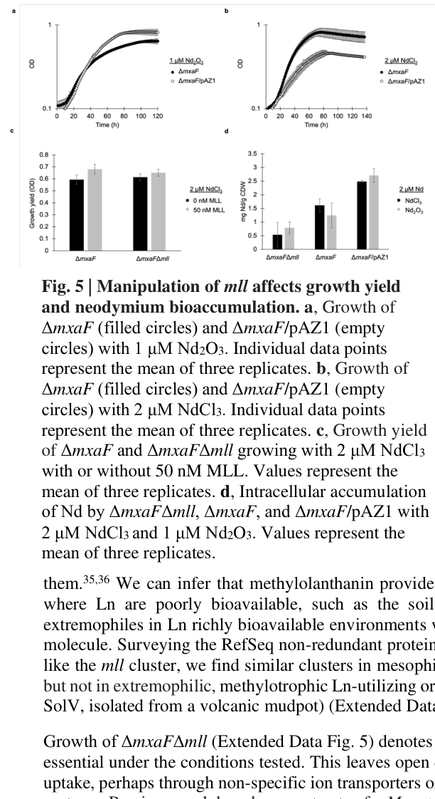

## Question

# Gene Research for Functional Annotation

## ⚠️ CRITICAL: Gene/Protein Identification Context

**BEFORE YOU BEGIN RESEARCH:** You MUST verify you are researching the CORRECT gene/protein. Gene symbols can be ambiguous, especially for less well-characterized genes from non-model organisms.

### Target Gene/Protein Identity (from UniProt):
- **UniProt Accession:** C5B1I8
- **Protein Description:** RecName: Full=2,4-dihydroxyhept-2-ene-1,7-dioic acid aldolase {ECO:0008006|Google:ProtNLM};
- **Gene Information:** OrderedLocusNames=MexAM1_META1p4136 {ECO:0000313|EMBL:ACS41789.1};
- **Organism (full):** Methylorubrum extorquens (strain ATCC 14718 / DSM 1338 / JCM 2805 / NCIMB 9133 / AM1) (Methylobacterium extorquens).
- **Protein Family:** Not specified in UniProt
- **Key Domains:** UCP028291. (IPR014543); DUF2218 (PF09981)

### MANDATORY VERIFICATION STEPS:

1. **Check if the gene symbol "mllG" matches the protein description above**
2. **Verify the organism is correct:** Methylorubrum extorquens (strain ATCC 14718 / DSM 1338 / JCM 2805 / NCIMB 9133 / AM1) (Methylobacterium extorquens).
3. **Check if protein family/domains align with what you find in literature**
4. **If you find literature for a DIFFERENT gene with the same or similar symbol, STOP**

### If Gene Symbol is Ambiguous or You Cannot Find Relevant Literature:

**DO NOT PROCEED WITH RESEARCH ON A DIFFERENT GENE.** Instead:
- State clearly: "The gene symbol 'mllG' is ambiguous or literature is limited for this specific protein"
- Explain what you found (e.g., "Found extensive literature on a different gene with the same symbol in a different organism")
- Describe the protein based ONLY on the UniProt information provided above
- Suggest that the protein function can be inferred from domain/family information

### Research Target:

Please provide a comprehensive research report on the gene **mllG** (gene ID: mllG, UniProt: C5B1I8) in METEA.

The research report should be a detailed narrative explaining the function, biological processes, and localization of the gene product. Citations should be given for all claims.

You should prioritize authoritative reviews and primary scientific literature when conducting research. You can supplement
this with annotations you find in gene/protein databases, but these can be outdated or inaccurate.

We are specifically interested in the primary function of the gene - for enzymes, what reaction is catalyzed, and what is the substrate specificity? For transporters, what is the substrate? For structural proteins or adapters, what is the broader structural role? For signaling molecules, what is the role in the pathway.

We are interested in where in or outside the cell the gene product carries out its function.

We are also interested in the signaling or biochemical pathways in which the gene functions. We are less interested in broad pleiotropic effects, except where these elucidate the precise role.

Include evidence where possible. We are interested in both experimental evidence as well as inference from structure, evolution, or bioinformatic analysis. Precise studies should be prioritized over high-throughput, where available.

## Output

Question: You are an expert researcher providing comprehensive, well-cited information.

Provide detailed information focusing on:
1. Key concepts and definitions with current understanding
2. Recent developments and latest research (prioritize 2023-2024 sources)
3. Current applications and real-world implementations
4. Expert opinions and analysis from authoritative sources
5. Relevant statistics and data from recent studies

Format as a comprehensive research report with proper citations. Include URLs and publication dates where available.
Always prioritize recent, authoritative sources and provide specific citations for all major claims.

# Gene Research for Functional Annotation

## ⚠️ CRITICAL: Gene/Protein Identification Context

**BEFORE YOU BEGIN RESEARCH:** You MUST verify you are researching the CORRECT gene/protein. Gene symbols can be ambiguous, especially for less well-characterized genes from non-model organisms.

### Target Gene/Protein Identity (from UniProt):
- **UniProt Accession:** C5B1I8
- **Protein Description:** RecName: Full=2,4-dihydroxyhept-2-ene-1,7-dioic acid aldolase {ECO:0008006|Google:ProtNLM};
- **Gene Information:** OrderedLocusNames=MexAM1_META1p4136 {ECO:0000313|EMBL:ACS41789.1};
- **Organism (full):** Methylorubrum extorquens (strain ATCC 14718 / DSM 1338 / JCM 2805 / NCIMB 9133 / AM1) (Methylobacterium extorquens).
- **Protein Family:** Not specified in UniProt
- **Key Domains:** UCP028291. (IPR014543); DUF2218 (PF09981)

### MANDATORY VERIFICATION STEPS:

1. **Check if the gene symbol "mllG" matches the protein description above**
2. **Verify the organism is correct:** Methylorubrum extorquens (strain ATCC 14718 / DSM 1338 / JCM 2805 / NCIMB 9133 / AM1) (Methylobacterium extorquens).
3. **Check if protein family/domains align with what you find in literature**
4. **If you find literature for a DIFFERENT gene with the same or similar symbol, STOP**

### If Gene Symbol is Ambiguous or You Cannot Find Relevant Literature:

**DO NOT PROCEED WITH RESEARCH ON A DIFFERENT GENE.** Instead:
- State clearly: "The gene symbol 'mllG' is ambiguous or literature is limited for this specific protein"
- Explain what you found (e.g., "Found extensive literature on a different gene with the same symbol in a different organism")
- Describe the protein based ONLY on the UniProt information provided above
- Suggest that the protein function can be inferred from domain/family information

### Research Target:

Please provide a comprehensive research report on the gene **mllG** (gene ID: mllG, UniProt: C5B1I8) in METEA.

The research report should be a detailed narrative explaining the function, biological processes, and localization of the gene product. Citations should be given for all claims.

You should prioritize authoritative reviews and primary scientific literature when conducting research. You can supplement
this with annotations you find in gene/protein databases, but these can be outdated or inaccurate.

We are specifically interested in the primary function of the gene - for enzymes, what reaction is catalyzed, and what is the substrate specificity? For transporters, what is the substrate? For structural proteins or adapters, what is the broader structural role? For signaling molecules, what is the role in the pathway.

We are interested in where in or outside the cell the gene product carries out its function.

We are also interested in the signaling or biochemical pathways in which the gene functions. We are less interested in broad pleiotropic effects, except where these elucidate the precise role.

Include evidence where possible. We are interested in both experimental evidence as well as inference from structure, evolution, or bioinformatic analysis. Precise studies should be prioritized over high-throughput, where available.

## Research report: Functional annotation of **mllG** (UniProt **C5B1I8**; locus **MexAM1_META1p4136 / META1p4136**) in *Methylorubrum extorquens* AM1

### Executive summary
The gene **mllG** in *Methylorubrum extorquens* AM1 (also historically *Methylobacterium extorquens* AM1) maps to **META1p4136** within the **mll (methylolanthanin) biosynthetic/uptake locus** spanning **META1p4129–META1p4138**. In the best-available primary literature, **mllG is annotated as a DUF2218-family protein**, and its role is inferred to be **regulatory and/or transport-associated** within a lanthanide-acquisition system rather than a directly demonstrated metabolic aldolase. (zytnick2022discoveryandcharacterization pages 3-5)

Although the user-provided UniProt record describes C5B1I8 as a “**2,4-dihydroxyhept-2-ene-1,7-dioic acid aldolase**,” the AM1-focused methylolanthanin literature does **not** provide enzymology (reaction, substrates, kinetics) supporting that specific aldolase activity for **mllG/META1p4136**; instead, the locus is linked to biosynthesis and uptake of **methylolanthanin (MLL)**, a secreted **lanthanophore** that increases lanthanide bioavailability and can enhance growth/yield under lanthanide-limited conditions. (zytnick2022discoveryandcharacterization pages 3-5, zytnick2022discoveryandcharacterization pages 8-10)

### 1) Mandatory verification: gene/protein identity and ambiguity control
**Verified mapping in the target organism.** A primary source explicitly identifies the **mll locus** in *M. extorquens* AM1 as **META1p4129–META1p4138** and names **META1p4136 as mllG**; mllG is annotated as **DUF2218** in this context. This satisfies the requirement that we are discussing the correct gene in the correct organism/strain context, not a symbol collision in another species. (zytnick2022discoveryandcharacterization pages 3-5)

**Domain alignment.** The same AM1 literature frames mllG as **DUF2218**, consistent with the user-provided “DUF2218 (PF09981)” domain callout, and does not place it in a characterized aldolase family. (zytnick2022discoveryandcharacterization pages 3-5)

**Consequence for functional annotation.** Because the strongest gene-resolved evidence ties mllG to a lanthanophore locus and because no direct aldolase biochemistry is reported for AM1 mllG, the **most defensible current functional statement** is that **mllG is an uncharacterized DUF2218 protein associated with methylolanthanin-dependent lanthanide acquisition**, with **inferred** (not experimentally validated) participation in **transport/regulation/accessory functions**. (zytnick2022discoveryandcharacterization pages 3-5)

### 2) Key concepts and definitions (current understanding)

#### 2.1 Lanthanides as “life metals” in methylotrophy
Lanthanides (Ln³⁺) are essential cofactors for certain bacterial alcohol dehydrogenases, including **lanthanide-dependent methanol dehydrogenases** (e.g., XoxF-type) that function in methylotrophic metabolism; these enzymes are commonly **periplasmic**, creating a requirement for acquisition and trafficking of Ln across the outer membrane and into/through the periplasm. (zytnick2022discoveryandcharacterization pages 1-3)

#### 2.2 Lanthanophores and methylolanthanin (MLL)
A **lanthanophore** is a small molecule produced and secreted by microbes to chelate lanthanides and increase their bioavailability, analogous to siderophores for iron. The **mll gene cluster** in *M. extorquens* AM1 encodes biosynthesis of **methylolanthanin (MLL)**, described as the **first reported biological lanthanide chelator/lanthanophore**, with a distinctive **4-hydroxybenzoate** motif. (zytnick2022discoveryandcharacterization pages 1-3, zytnick2022discoveryandcharacterization media 57c5f677)

### 3) Functional annotation of mllG in pathway context

#### 3.1 Genomic context: the mll locus (META1p4129–META1p4138)
Zytnick et al. describe the **mll locus** architecture as containing predicted **uptake/regulatory components** (including a TonB-dependent outer membrane receptor and sigma/anti-sigma-like regulation) followed by genes homologous to NRPS-independent citrate-based metallophore/siderophore pathways (petrobactin/rhodopetrobactin-like), plus accessory functions. Within this locus, **mllG = META1p4136** is annotated as a **DUF2218-containing protein**. (zytnick2022discoveryandcharacterization pages 3-5, zytnick2022discoveryandcharacterization media 57c5f677)

#### 3.2 Proposed role of mllG (DUF2218): what is supported vs. not supported
**Supported (inference from locus membership and comparative genomics).** mllG is present not only in the AM1 mll locus but also in related rhodopetrobactin biosynthetic loci; a homolog in *Vibrio cholerae* occurs near iron uptake regulation and xenosiderophore uptake genes, which Zytnick et al. interpret as suggesting DUF2218 proteins are involved in **regulation or transport** rather than core biosynthesis chemistry. (zytnick2022discoveryandcharacterization pages 3-5)

**Not supported (for this AM1 gene) by the retrieved primary literature.** No purified-protein biochemistry, no enzyme kinetics, and no direct substrate/product assignment (including the UniProt-stated “2,4-dihydroxyhept-2-ene-1,7-dioic acid aldolase” reaction) is provided for **mllG/META1p4136** in the AM1 methylolanthanin sources retrieved here. (zytnick2022discoveryandcharacterization pages 3-5)

**Practical consequence.** For functional annotation, **mllG should be treated as “uncharacterized DUF2218 family protein in lanthanophore BGC; likely accessory transport/regulation component”** until a direct biochemical or genetic dissection isolates its specific step. (zytnick2022discoveryandcharacterization pages 3-5)

### 4) Physiological role, cellular localization, and mechanism (cluster-level evidence)

#### 4.1 Cellular localization: where the system acts
The mll locus encodes a **secreted** chelator (MLL) and is linked to **outer-membrane TonB-dependent transport** and downstream trafficking pathways. This indicates the system functions across the **extracellular space → outer membrane → periplasm**, consistent with the fact that lanthanide-dependent methanol oxidation enzymes in this organism are **periplasmic**. For **mllG itself**, no direct localization experiment was found; its locus context suggests it participates in or regulates these envelope-associated processes. (zytnick2022discoveryandcharacterization pages 3-5, zytnick2022discoveryandcharacterization pages 1-3)

#### 4.2 Condition-specific induction: response to poorly soluble lanthanide sources
The mll locus is described as the **most strongly induced region** when *M. extorquens* AM1 is grown with a poorly soluble lanthanide source (**Nd2O3**), with an average reported induction of **~32-fold**, implicating the system in mobilizing/acquiring lanthanides under low bioavailability conditions. (zytnick2022discoveryandcharacterization pages 3-5)

A 2024 dissertation reports that lanthanide-source comparisons changed expression of **~1,500 genes**, and that a siderophore-like citrate-based gene cluster is among the most upregulated, consistent with the mll locus role. (phi2024assessinglanthanidedependentmethanol pages 48-53)

### 5) Evidence base: experimental findings and key statistics (mll locus / methylolanthanin)

#### 5.1 Methylolanthanin binds lanthanides
Direct injection MS observations show that methylolanthanin forms detectable complexes with multiple lanthanides, including **La(III), Nd(III), and Lu(III)**. (zytnick2022discoveryandcharacterization pages 8-10)

#### 5.2 Growth and yield impacts under lanthanide limitation
Overexpression of the mll genes improves growth under conditions where lanthanides are poorly bioavailable. For example, in one reported condition with **Nd2O3**, an overexpression strain shows a growth rate of **0.026 h⁻¹**, compared with **0.037 h⁻¹** on **NdCl3** (interpreted as partial rescue of insoluble-Ln growth limitations). (zytnick2022discoveryandcharacterization pages 8-10)

Adding purified methylolanthanin (**50 nM**) to cultures grown with **2 µM NdCl3** significantly increased growth yield (reported p-values **0.036** and **0.037** for the comparisons described). (zytnick2022discoveryandcharacterization pages 8-10)

#### 5.3 Lanthanide bioaccumulation changes
Manipulating the mll locus alters intracellular lanthanide accumulation. Reported effects include:
- **Deletion** of mll causing decreased neodymium bioaccumulation (e.g., a reported **1.8-fold decrease** on NdCl3 in one comparison). (zytnick2022discoveryandcharacterization pages 8-10)
- **Overexpression** increasing intracellular neodymium by **~3.5-fold on average**. (zytnick2022discoveryandcharacterization pages 8-10)
- Another analysis describing loss of mll causing a **~30% decrease** in lanthanide bioaccumulation while growth remained similar under tested lab conditions, indicating mll enhances accumulation without being strictly essential for growth in those conditions. (zytnick2022discoveryandcharacterization pages 10-12)

These phenotypes are consistent with a role in **lanthanide acquisition/bioaccumulation**, but they do not resolve the **gene-by-gene** contributions inside the locus (including mllG). (zytnick2022discoveryandcharacterization pages 3-5)

### 6) Recent developments (prioritizing 2023–2024) and expert analysis

#### 6.1 2024 peer-reviewed synthesis: lanthanide trafficking systems and biotechnological relevance
A 2024 peer-reviewed Communications Biology paper situates methylolanthanin (mll) as a recently discovered lanthanophore system (reported in *Methylobacterium aquaticum*) that complexes Ln³⁺, and places it within broader models of microbial lanthanide acquisition involving outer-membrane TonB-dependent transporters and organized transport gene clusters. The paper explicitly links these systems (lanthanophores and high-affinity proteins like LanM) to the growing interest in **eco-friendlier tools/inspirations for lanthanide recovery**. (valdes2024anovelinsilico pages 1-2)

#### 6.2 2024 dissertation: expanded methodological/omics context
A 2024 dissertation describes metabolomics (molecular networking/UHPLC-MS) identifying methylolanthanin in supernatants and observes Ln-binding by mass spectrometry, reinforcing that the mll-like cluster is a citrate-based, siderophore-like system involved in lanthanide-dependent physiology. While not peer reviewed, this dissertation provides method-level detail and additional omics framing. (phi2024assessinglanthanidedependentmethanol pages 48-53)

### 7) Current applications and real-world implementations

#### 7.1 Bioaccumulation as a functional handle for Ln capture
The demonstrated ability of mll/MLL manipulations to shift intracellular Nd accumulation (up to multi-fold increases reported upon overexpression) suggests a plausible **biorecovery/bioaccumulation strategy**: engineer methylotrophs to secrete lanthanophores and improve Ln uptake from low-bioavailability sources. However, this remains **proof-of-concept at laboratory scale** in the cited work and is not yet an established industrial implementation. (zytnick2022discoveryandcharacterization pages 8-10)

#### 7.2 Bio-inspired separation concepts
Recent expert synthesis emphasizes that biological Ln³⁺ binding systems (lanthanophores, LanM-like proteins, and transport clusters) can inform **selective binding and separation** approaches, motivated by increasing demand for critical elements and the need for greener separation technologies. In this framing, methylolanthanin is one of the concrete newly described systems expanding the known “reaction space” for Ln handling in biology. (valdes2024anovelinsilico pages 1-2)

### 8) Conclusions and knowledge gaps (mllG-specific)

1. **Strongest supported annotation (gene-level):** **mllG (META1p4136; UniProt C5B1I8)** is a **DUF2218 family protein** in the methylolanthanin (mll) locus of *M. extorquens* AM1. (zytnick2022discoveryandcharacterization pages 3-5)
2. **Most likely biological role (inferred, not proven):** accessory **transport/regulation** role in lanthanide acquisition via the methylolanthanin system. (zytnick2022discoveryandcharacterization pages 3-5)
3. **Not currently supported for AM1 mllG:** a demonstrated catalytic role as “2,4-dihydroxyhept-2-ene-1,7-dioic acid aldolase” (no direct enzymology found in the retrieved AM1-focused sources). (zytnick2022discoveryandcharacterization pages 3-5)
4. **Where it acts:** likely at the **cell envelope/periplasm-facing acquisition interface** (inference from locus function); mllG’s precise localization remains untested in the sources retrieved. (zytnick2022discoveryandcharacterization pages 3-5, zytnick2022discoveryandcharacterization pages 1-3)

### Embedded structured summary (artifact)
| Aspect | Details | Quantitative evidence / conditions | Primary source (date; URL/DOI) |
|---|---|---|---|
| Verified target identity | **mllG** in *Methylorubrum extorquens* AM1 corresponds to **META1p4136 / MexAM1_META1p4136** within the **mll (methylolanthanin) locus META1p4129–META1p4138**. Literature identified this gene specifically as **mllG** and annotated it as a **DUF2218-containing protein**. Importantly, the literature does **not** support the UniProt reaction annotation “2,4-dihydroxyhept-2-ene-1,7-dioic acid aldolase” for this AM1 protein; instead, available evidence places it in a lanthanophore biosynthetic/uptake locus with a likely **transport or regulatory** role. (zytnick2022discoveryandcharacterization pages 3-5) | mll locus reported as strongly induced under poorly soluble lanthanide conditions; average upregulation of the cluster was reported as **~32-fold** under growth with **Nd2O3**. (zytnick2022discoveryandcharacterization pages 3-5) | Zytnick et al., **2022**, bioRxiv, “Discovery and characterization of the first known biological lanthanide chelator,” https://doi.org/10.1101/2022.01.19.476857 |
| Cluster context | The **mll locus** spans **META1p4129–META1p4138** and encodes methylolanthanin-associated functions. The locus includes predicted **uptake/regulatory genes** (**mluA/m/u?** assignments reported for META1p4129–4131: TonB-dependent outer membrane receptor, anti-sigma factor, sigma factor), followed by **biosynthetic genes** homologous to petrobactin/rhodopetrobactin loci (**META1p4132–4135: mllA, mllBC, mllDE, mllF**), then **mllG = META1p4136 (DUF2218)**, plus **mllH = META1p4137** (acetyltransferase) and **mllJ = META1p4138** (ferritin-like DUF4142 protein, putatively exported to the periplasm). (zytnick2022discoveryandcharacterization pages 3-5, zytnick2022discoveryandcharacterization media 57c5f677) | Cluster identified from transcriptomic response to poorly soluble lanthanide source and linked to a secreted lanthanide chelator. (zytnick2022discoveryandcharacterization pages 3-5, phi2024assessinglanthanidedependentmethanol pages 48-53) | Zytnick et al., **2022**, https://doi.org/10.1101/2022.01.19.476857; Phi, **2024** dissertation, https://doi.org/10.5282/edoc.33507 |
| Gene-by-gene proposed functions in the locus | **META1p4129–4131**: predicted **transport/regulation** for metallophore uptake and expression control; **META1p4132–4135**: predicted **methylolanthanin biosynthesis** based on homology to citrate-based siderophore pathways; **META1p4136/mllG**: **DUF2218** family protein, also present in related rhodopetrobactin loci; homology to *Vibrio cholerae* **VCA0233** near iron-uptake/xenosiderophore genes suggests **regulation or transport rather than direct biosynthesis**; **META1p4137/mllH**: acetyltransferase; **META1p4138/mllJ**: ferritin-like DUF4142 protein, proposed periplasmic accessory role. (zytnick2022discoveryandcharacterization pages 3-5) | No direct enzymatic assay for **mllG** reported in the available sources; no substrate specificity or aldolase reaction was experimentally shown for mllG. (zytnick2022discoveryandcharacterization pages 3-5) | Zytnick et al., **2022**, https://doi.org/10.1101/2022.01.19.476857 |
| Evidence specifically about mllG | **mllG/META1p4136** is explicitly named in the mll cluster and annotated as **DUF2218**. Available literature frames DUF2218 in this context as likely involved in **transport/regulation**, not as a characterized catalytic aldolase. Thus, for this specific protein, the gene symbol is **not ambiguous in the methylolanthanin literature**, but its **molecular function remains incompletely defined**. (zytnick2022discoveryandcharacterization pages 3-5) | Evidence is inferential: locus membership, conservation in related metallophore loci, and homology/context to VCA0233-like proteins. No kinetics, purified-protein activity, or localization experiment for mllG alone was reported. (zytnick2022discoveryandcharacterization pages 3-5) | Zytnick et al., **2022**, https://doi.org/10.1101/2022.01.19.476857 |
| Methylolanthanin product and pathway role | The **mll cluster** encodes production of **methylolanthanin (MLL)**, described as the **first known biological lanthanide chelator/lanthanophore**, structurally related to citrate-based siderophores and containing a **4-hydroxybenzoate** moiety. MLL is secreted and participates in **lanthanide acquisition**, especially when lanthanides are poorly bioavailable. (zytnick2022discoveryandcharacterization pages 8-10, phi2024assessinglanthanidedependentmethanol pages 48-53, zytnick2022discoveryandcharacterization pages 1-3, zytnick2022discoveryandcharacterization media 57c5f677) | MLL was observed to bind **La3+, Nd3+, and Lu3+** by mass spectrometry. (zytnick2022discoveryandcharacterization pages 8-10, phi2024assessinglanthanidedependentmethanol pages 48-53) | Zytnick et al., **2022**, https://doi.org/10.1101/2022.01.19.476857; Phi, **2024**, https://doi.org/10.5282/edoc.33507 |
| Expression induction by insoluble lanthanide source | Transcriptomic studies showed the **mll locus** is among the most highly induced gene clusters when cells are grown with **poorly soluble Nd2O3** rather than soluble lanthanide sources, consistent with a role in improving access to mineral/insoluble lanthanides. (zytnick2022discoveryandcharacterization pages 3-5, phi2024assessinglanthanidedependentmethanol pages 48-53) | Average induction reported as **~32-fold** for the cluster under **Nd2O3** growth conditions; the dissertation notes broad transcriptional remodeling involving **nearly 1,500 genes** across lanthanide-source comparisons. (zytnick2022discoveryandcharacterization pages 3-5, phi2024assessinglanthanidedependentmethanol pages 48-53) | Zytnick et al., **2022**, https://doi.org/10.1101/2022.01.19.476857; Phi, **2024**, https://doi.org/10.5282/edoc.33507 |
| Growth phenotype: overexpression | Overexpression of the **mll biosynthetic cluster** improved growth when lanthanides were poorly bioavailable, supporting a role for the MLL system in lanthanide scavenging. (zytnick2022discoveryandcharacterization pages 3-5, zytnick2022discoveryandcharacterization pages 8-10, zytnick2022discoveryandcharacterization media 51c0fb25) | In a **ΔmxaF/pAZ1** overexpression background grown with **Nd2O3**, growth rate was **0.026 h^-1**, compared with **0.037 h^-1** on **NdCl3**; overexpression partially rescued poor-growth conditions imposed by insoluble Nd source. (zytnick2022discoveryandcharacterization pages 8-10) | Zytnick et al., **2022**, https://doi.org/10.1101/2022.01.19.476857 |
| Growth phenotype: deletion / nonessentiality under tested lab conditions | Deletion of the **mll** cluster impaired lanthanide accumulation but did **not abolish growth** under the tested laboratory conditions, indicating MLL enhances but is not absolutely essential for lanthanide-dependent growth in those settings. (zytnick2022discoveryandcharacterization pages 8-10, zytnick2022discoveryandcharacterization pages 10-12) | **ΔmxaFΔmll** showed growth similar to **ΔmxaF** in some tested conditions, but lanthanide bioaccumulation decreased by about **30%** in one analysis. (zytnick2022discoveryandcharacterization pages 10-12) | Zytnick et al., **2022**, https://doi.org/10.1101/2022.01.19.476857 |
| Nd accumulation phenotype | The mll system contributes to intracellular lanthanide accumulation/bioaccumulation. Deletion reduces, and overexpression increases, intracellular **Nd** levels. (zytnick2022discoveryandcharacterization pages 8-10, zytnick2022discoveryandcharacterization pages 1-3, zytnick2022discoveryandcharacterization media 51c0fb25) | Deletion caused a reported **1.8-fold decrease** in intracellular Nd accumulation on **NdCl3**; overexpression increased intracellular Nd by about **3.5-fold on average**. Separate summary text describes deletion as causing a **~30% decrease** in bioaccumulation. (zytnick2022discoveryandcharacterization pages 8-10, zytnick2022discoveryandcharacterization pages 10-12) | Zytnick et al., **2022**, https://doi.org/10.1101/2022.01.19.476857 |
| Rescue by exogenous methylolanthanin | Purified **methylolanthanin** added exogenously can rescue or enhance growth, showing that the secreted small molecule itself is functionally active in lanthanide acquisition. (zytnick2022discoveryandcharacterization pages 8-10) | Addition of **50 nM MLL** to cultures grown with **2 µM NdCl3** significantly increased growth yield (**p = 0.036 and 0.037** in reported comparisons). (zytnick2022discoveryandcharacterization pages 8-10) | Zytnick et al., **2022**, https://doi.org/10.1101/2022.01.19.476857 |
| Localization and cellular site of action | The **lanthanide-chelating product MLL** is extracellular/secreted, while uptake is tied to **TonB-dependent outer membrane** transport and downstream ABC-type transport. More broadly, known lanthanide-dependent methanol oxidation enzymes in *M. extorquens* AM1 are **periplasmic**, placing MLL-mediated acquisition upstream of periplasmic lanthanide use. For **mllG** specifically, no direct localization experiment was reported. (zytnick2022discoveryandcharacterization pages 3-5, phi2024assessinglanthanidedependentmethanol pages 48-53, zytnick2022discoveryandcharacterization pages 1-3) | Supported by cluster architecture and linked transport systems rather than direct mllG localization assays. (zytnick2022discoveryandcharacterization pages 3-5, zytnick2022discoveryandcharacterization pages 1-3) | Zytnick et al., **2022**, https://doi.org/10.1101/2022.01.19.476857; Phi, **2024**, https://doi.org/10.5282/edoc.33507 |
| Bottom-line annotation for C5B1I8 | For **UniProt C5B1I8 / mllG / META1p4136**, the strongest current evidence supports annotation as an **uncharacterized DUF2218 family protein in the methylolanthanin lanthanophore locus**, probably contributing to **transport/regulation/accessory steps in lanthanide acquisition**, rather than a confidently established **2,4-dihydroxyhept-2-ene-1,7-dioic acid aldolase**. (zytnick2022discoveryandcharacterization pages 3-5) | Major knowledge gap: no direct enzymology, no confirmed substrate, no specific subcellular localization for mllG alone in the available evidence. (zytnick2022discoveryandcharacterization pages 3-5) | Zytnick et al., **2022**, https://doi.org/10.1101/2022.01.19.476857 |

*Table: This table summarizes verified identity, cluster context, proposed gene functions, and the main experimental evidence linking the mll locus to methylolanthanin-mediated lanthanide acquisition in Methylorubrum extorquens AM1. It is useful for distinguishing gene-level evidence for mllG from broader cluster-level functional data.*

### Key figure evidence (from primary source)
- The **mll gene cluster architecture** and **methylolanthanin structure** are shown in a retrieved figure panel. (zytnick2022discoveryandcharacterization media 57c5f677)
- Growth and **intracellular Nd accumulation** phenotypes for mll perturbations are shown in a retrieved figure panel. (zytnick2022discoveryandcharacterization media 51c0fb25)

### References (URLs and publication dates)
- Zytnick AM et al. **Jan 2022**. *Discovery and characterization of the first known biological lanthanide chelator.* bioRxiv. https://doi.org/10.1101/2022.01.19.476857 (zytnick2022discoveryandcharacterization pages 1-3)
- Valdés JJ et al. **Nov 2024**. *A novel in-silico model explores LanM homologs among Hyphomicrobium spp.* Communications Biology. https://doi.org/10.1038/s42003-024-07258-3 (valdes2024anovelinsilico pages 1-2)
- Phi MT. **Jan 2024**. *Assessing lanthanide-dependent methanol dehydrogenase activity and the syntheses of citrate based siderophores.* Dissertation. https://doi.org/10.5282/edoc.33507 (phi2024assessinglanthanidedependentmethanol pages 48-53)

References

1. (zytnick2022discoveryandcharacterization pages 3-5): Alexa M. Zytnick, Sophie M. Gutenthaler-Tietze, Allegra T. Aron, Zachary L. Reitz, Manh Tri Phi, Nathan M. Good, Daniel Petras, Lena J. Daumann, and N. Cecilia Martinez-Gomez. Discovery and characterization of the first known biological lanthanide chelator. bioRxiv, Jan 2022. URL: https://doi.org/10.1101/2022.01.19.476857, doi:10.1101/2022.01.19.476857. This article has 20 citations.

2. (zytnick2022discoveryandcharacterization pages 8-10): Alexa M. Zytnick, Sophie M. Gutenthaler-Tietze, Allegra T. Aron, Zachary L. Reitz, Manh Tri Phi, Nathan M. Good, Daniel Petras, Lena J. Daumann, and N. Cecilia Martinez-Gomez. Discovery and characterization of the first known biological lanthanide chelator. bioRxiv, Jan 2022. URL: https://doi.org/10.1101/2022.01.19.476857, doi:10.1101/2022.01.19.476857. This article has 20 citations.

3. (zytnick2022discoveryandcharacterization pages 1-3): Alexa M. Zytnick, Sophie M. Gutenthaler-Tietze, Allegra T. Aron, Zachary L. Reitz, Manh Tri Phi, Nathan M. Good, Daniel Petras, Lena J. Daumann, and N. Cecilia Martinez-Gomez. Discovery and characterization of the first known biological lanthanide chelator. bioRxiv, Jan 2022. URL: https://doi.org/10.1101/2022.01.19.476857, doi:10.1101/2022.01.19.476857. This article has 20 citations.

4. (zytnick2022discoveryandcharacterization media 57c5f677): Alexa M. Zytnick, Sophie M. Gutenthaler-Tietze, Allegra T. Aron, Zachary L. Reitz, Manh Tri Phi, Nathan M. Good, Daniel Petras, Lena J. Daumann, and N. Cecilia Martinez-Gomez. Discovery and characterization of the first known biological lanthanide chelator. bioRxiv, Jan 2022. URL: https://doi.org/10.1101/2022.01.19.476857, doi:10.1101/2022.01.19.476857. This article has 20 citations.

5. (phi2024assessinglanthanidedependentmethanol pages 48-53): Assessing lanthanide-dependent methanol dehydrogenase activity and the syntheses of citrate based siderophores This article has 0 citations.

6. (zytnick2022discoveryandcharacterization pages 10-12): Alexa M. Zytnick, Sophie M. Gutenthaler-Tietze, Allegra T. Aron, Zachary L. Reitz, Manh Tri Phi, Nathan M. Good, Daniel Petras, Lena J. Daumann, and N. Cecilia Martinez-Gomez. Discovery and characterization of the first known biological lanthanide chelator. bioRxiv, Jan 2022. URL: https://doi.org/10.1101/2022.01.19.476857, doi:10.1101/2022.01.19.476857. This article has 20 citations.

7. (valdes2024anovelinsilico pages 1-2): James J. Valdés, Daniel A. Petrash, and Kurt O. Konhauser. A novel in-silico model explores lanm homologs among hyphomicrobium spp. Communications Biology, Nov 2024. URL: https://doi.org/10.1038/s42003-024-07258-3, doi:10.1038/s42003-024-07258-3. This article has 3 citations and is from a peer-reviewed journal.

8. (zytnick2022discoveryandcharacterization media 51c0fb25): Alexa M. Zytnick, Sophie M. Gutenthaler-Tietze, Allegra T. Aron, Zachary L. Reitz, Manh Tri Phi, Nathan M. Good, Daniel Petras, Lena J. Daumann, and N. Cecilia Martinez-Gomez. Discovery and characterization of the first known biological lanthanide chelator. bioRxiv, Jan 2022. URL: https://doi.org/10.1101/2022.01.19.476857, doi:10.1101/2022.01.19.476857. This article has 20 citations.

## Artifacts

- [Edison artifact artifact-00](mllG-deep-research-falcon_artifacts/artifact-00.md)

## Citations

1. zytnick2022discoveryandcharacterization pages 3-5
2. zytnick2022discoveryandcharacterization pages 1-3
3. phi2024assessinglanthanidedependentmethanol pages 48-53
4. zytnick2022discoveryandcharacterization pages 8-10
5. zytnick2022discoveryandcharacterization pages 10-12
6. valdes2024anovelinsilico pages 1-2
7. https://doi.org/10.1101/2022.01.19.476857
8. https://doi.org/10.1101/2022.01.19.476857;
9. https://doi.org/10.5282/edoc.33507
10. https://doi.org/10.1038/s42003-024-07258-3
11. https://doi.org/10.1101/2022.01.19.476857,
12. https://doi.org/10.1038/s42003-024-07258-3,