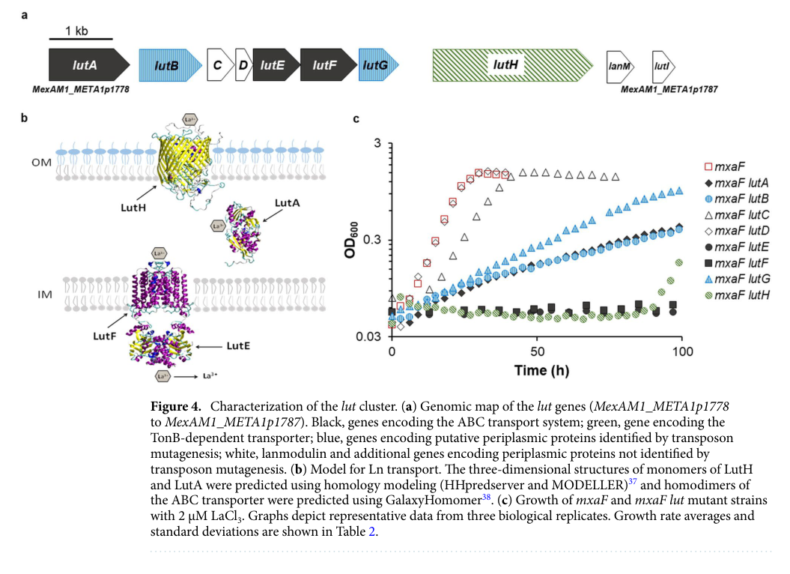

## Question

# Gene Research for Functional Annotation

## ⚠️ CRITICAL: Gene/Protein Identification Context

**BEFORE YOU BEGIN RESEARCH:** You MUST verify you are researching the CORRECT gene/protein. Gene symbols can be ambiguous, especially for less well-characterized genes from non-model organisms.

### Target Gene/Protein Identity (from UniProt):
- **UniProt Accession:** C5B1I1
- **Protein Description:** SubName: Full=TonB-dependent siderophore receptor protein {ECO:0000313|EMBL:ACS41782.1};
- **Gene Information:** OrderedLocusNames=MexAM1_META1p4129 {ECO:0000313|EMBL:ACS41782.1};
- **Organism (full):** Methylorubrum extorquens (strain ATCC 14718 / DSM 1338 / JCM 2805 / NCIMB 9133 / AM1) (Methylobacterium extorquens).
- **Protein Family:** Belongs to the TonB-dependent receptor family.
- **Key Domains:** Plug_dom. (IPR012910); Plug_dom_sf. (IPR037066); Secretin/TonB_short_N. (IPR011662); TonB-dep_rcpt-like. (IPR039426); TonB-dep_rcpt_b-brl. (IPR000531)

### MANDATORY VERIFICATION STEPS:

1. **Check if the gene symbol "mluA" matches the protein description above**
2. **Verify the organism is correct:** Methylorubrum extorquens (strain ATCC 14718 / DSM 1338 / JCM 2805 / NCIMB 9133 / AM1) (Methylobacterium extorquens).
3. **Check if protein family/domains align with what you find in literature**
4. **If you find literature for a DIFFERENT gene with the same or similar symbol, STOP**

### If Gene Symbol is Ambiguous or You Cannot Find Relevant Literature:

**DO NOT PROCEED WITH RESEARCH ON A DIFFERENT GENE.** Instead:
- State clearly: "The gene symbol 'mluA' is ambiguous or literature is limited for this specific protein"
- Explain what you found (e.g., "Found extensive literature on a different gene with the same symbol in a different organism")
- Describe the protein based ONLY on the UniProt information provided above
- Suggest that the protein function can be inferred from domain/family information

### Research Target:

Please provide a comprehensive research report on the gene **mluA** (gene ID: mluA, UniProt: C5B1I1) in METEA.

The research report should be a detailed narrative explaining the function, biological processes, and localization of the gene product. Citations should be given for all claims.

You should prioritize authoritative reviews and primary scientific literature when conducting research. You can supplement
this with annotations you find in gene/protein databases, but these can be outdated or inaccurate.

We are specifically interested in the primary function of the gene - for enzymes, what reaction is catalyzed, and what is the substrate specificity? For transporters, what is the substrate? For structural proteins or adapters, what is the broader structural role? For signaling molecules, what is the role in the pathway.

We are interested in where in or outside the cell the gene product carries out its function.

We are also interested in the signaling or biochemical pathways in which the gene functions. We are less interested in broad pleiotropic effects, except where these elucidate the precise role.

Include evidence where possible. We are interested in both experimental evidence as well as inference from structure, evolution, or bioinformatic analysis. Precise studies should be prioritized over high-throughput, where available.

## Output

Question: You are an expert researcher providing comprehensive, well-cited information.

Provide detailed information focusing on:
1. Key concepts and definitions with current understanding
2. Recent developments and latest research (prioritize 2023-2024 sources)
3. Current applications and real-world implementations
4. Expert opinions and analysis from authoritative sources
5. Relevant statistics and data from recent studies

Format as a comprehensive research report with proper citations. Include URLs and publication dates where available.
Always prioritize recent, authoritative sources and provide specific citations for all major claims.

# Gene Research for Functional Annotation

## ⚠️ CRITICAL: Gene/Protein Identification Context

**BEFORE YOU BEGIN RESEARCH:** You MUST verify you are researching the CORRECT gene/protein. Gene symbols can be ambiguous, especially for less well-characterized genes from non-model organisms.

### Target Gene/Protein Identity (from UniProt):
- **UniProt Accession:** C5B1I1
- **Protein Description:** SubName: Full=TonB-dependent siderophore receptor protein {ECO:0000313|EMBL:ACS41782.1};
- **Gene Information:** OrderedLocusNames=MexAM1_META1p4129 {ECO:0000313|EMBL:ACS41782.1};
- **Organism (full):** Methylorubrum extorquens (strain ATCC 14718 / DSM 1338 / JCM 2805 / NCIMB 9133 / AM1) (Methylobacterium extorquens).
- **Protein Family:** Belongs to the TonB-dependent receptor family.
- **Key Domains:** Plug_dom. (IPR012910); Plug_dom_sf. (IPR037066); Secretin/TonB_short_N. (IPR011662); TonB-dep_rcpt-like. (IPR039426); TonB-dep_rcpt_b-brl. (IPR000531)

### MANDATORY VERIFICATION STEPS:

1. **Check if the gene symbol "mluA" matches the protein description above**
2. **Verify the organism is correct:** Methylorubrum extorquens (strain ATCC 14718 / DSM 1338 / JCM 2805 / NCIMB 9133 / AM1) (Methylobacterium extorquens).
3. **Check if protein family/domains align with what you find in literature**
4. **If you find literature for a DIFFERENT gene with the same or similar symbol, STOP**

### If Gene Symbol is Ambiguous or You Cannot Find Relevant Literature:

**DO NOT PROCEED WITH RESEARCH ON A DIFFERENT GENE.** Instead:
- State clearly: "The gene symbol 'mluA' is ambiguous or literature is limited for this specific protein"
- Explain what you found (e.g., "Found extensive literature on a different gene with the same symbol in a different organism")
- Describe the protein based ONLY on the UniProt information provided above
- Suggest that the protein function can be inferred from domain/family information

### Research Target:

Please provide a comprehensive research report on the gene **mluA** (gene ID: mluA, UniProt: C5B1I1) in METEA.

The research report should be a detailed narrative explaining the function, biological processes, and localization of the gene product. Citations should be given for all claims.

You should prioritize authoritative reviews and primary scientific literature when conducting research. You can supplement
this with annotations you find in gene/protein databases, but these can be outdated or inaccurate.

We are specifically interested in the primary function of the gene - for enzymes, what reaction is catalyzed, and what is the substrate specificity? For transporters, what is the substrate? For structural proteins or adapters, what is the broader structural role? For signaling molecules, what is the role in the pathway.

We are interested in where in or outside the cell the gene product carries out its function.

We are also interested in the signaling or biochemical pathways in which the gene functions. We are less interested in broad pleiotropic effects, except where these elucidate the precise role.

Include evidence where possible. We are interested in both experimental evidence as well as inference from structure, evolution, or bioinformatic analysis. Precise studies should be prioritized over high-throughput, where available.

# Research report: functional annotation of **mluA** (UniProt **C5B1I1**) in *Methylorubrum extorquens* AM1 (ATCC 14718)

## Executive summary
The UniProt accession **C5B1I1** is annotated as a **TonB-dependent siderophore receptor protein** from *Methylorubrum extorquens* AM1 and contains canonical TonB-dependent transporter (TBDT) domains (plug domain + TonB-dependent receptor β-barrel) consistent with an **outer-membrane, TonB/ExbB/ExbD-coupled uptake receptor** for scarce extracellular nutrients (classically ferric-siderophore complexes, but TBDTs can also transport other micronutrients). Mechanistically, TBDTs are 22-strand β-barrel proteins occluded by a plug domain and energized by the TonB–ExbB–ExbD system via a conserved **TonB box** to open the pore for substrate translocation into the periplasm (Braun 2024) (braun2024substrateuptakeby pages 1-2, braun2024substrateuptakeby pages 2-4, braun2024substrateuptakeby pages 4-6).

**Critical identity verification outcome:** across the accessible primary literature for *M. extorquens* AM1 lanthanide/metal uptake, the **gene symbol “mluA” is not explicitly linked** to a characterized AM1 TonB-dependent receptor (e.g., **LutH**) or to the *lut* cluster. Instead, AM1’s best-characterized TonB-dependent receptor for metal uptake is **LutH** (lanthanide uptake), which is distinct from the UniProt description “siderophore receptor” and is encoded in the AM1 *lut* locus (MexAM1_META1p1778–p1787). Therefore, **the symbol mluA should be treated as ambiguous/under-documented for C5B1I1** in the current literature corpus, and functional annotation should be grounded primarily in (i) the TonB-dependent receptor family mechanism and (ii) AM1 metal-uptake paradigms where relevant, without claiming a specific ligand unless experimentally supported (roszczenkojasinska2020geneproductsand pages 6-7, roszczenkojasinska2020geneproductsand pages 7-10).

## 1. Key concepts and definitions (current understanding)

### TonB-dependent transporters (TBDTs)
**Definition and architecture.** TBDTs are **outer-membrane β-barrel transport proteins** whose lumen is blocked by an internal **plug domain**; they mediate uptake of substrates “too large or too scarce” for diffusion through porins and are powered by the **TonB energy transduction system** (braun2024substrateuptakeby pages 1-2). A conserved **five-residue TonB box** in the transporter N-terminus is the main binding site for TonB (braun2024substrateuptakeby pages 1-2).

**Energy coupling.** Transport is energized by the proton motive force across the inner membrane, transmitted via **ExbB–ExbD** to TonB. A recurring structural stoichiometry from cryo-EM is **ExbB\_5–ExbD\_2**, where five ExbB subunits form a pore enclosing an ExbD dimer (braun2024substrateuptakeby pages 14-15, braun2024substrateuptakeby pages 1-2). Energized TonB interacts with the TonB box and induces plug movement/unfolding to open a channel and allow substrate passage into the periplasm (braun2024substrateuptakeby pages 1-2, celia2026advancesinunderstanding pages 8-9).

**Substrate classes and ligand specificity.** TBDTs are best known for ferric-siderophore and vitamin B\_12 uptake, but the family supports a broad substrate range (braun2024substrateuptakeby pages 1-2). Without substrate-bound structures, uptake assays, or genetics for the specific receptor, **ligand specificity cannot be assigned confidently**.

### Lanthanide uptake as a relevant metal-uptake paradigm in AM1
While UniProt describes C5B1I1 as a “siderophore receptor,” the best experimentally defined metal-uptake TBDT system in *M. extorquens* AM1 concerns **lanthanide (Ln) uptake** via the **lut** pathway. This system provides a mechanistic template for how TBDTs participate in metal-chelate uptake in methylotrophs:

* Ln (likely chelated by a secreted lanthanophore/metallophore) is imported across the outer membrane by a **TonB-dependent receptor (LutH)** into the **periplasm**.
* A periplasmic binding protein (**LutA**) is proposed to traffic the complex to an inner-membrane **ABC transporter (LutE/LutF)** for **cytoplasmic import**.
* Expression of the TonB receptor is **repressed by excess lanthanides**, consistent with feedback control of metal uptake (roszczenkojasinska2020geneproductsand pages 7-10, roszczenkojasinska2020geneproductsand pages 10-11, roszczenkojasinska2020geneproductsand pages 1-4).

These data support a general inference relevant to C5B1I1: in methylotrophs, TBDTs frequently function in **metal acquisition** by importing **chelated metal complexes** to the periplasm for downstream periplasmic trafficking and/or cytoplasmic import (daumann2022aperspectiveon pages 5-8).

## 2. Target verification: does “mluA” match UniProt C5B1I1?

### What can be verified from the retrieved literature
* In AM1, the experimentally characterized TonB-dependent receptor involved in lanthanide uptake is **LutH**, residing in the *lut* gene cluster (MexAM1_META1p1778–p1787) (roszczenkojasinska2020geneproductsand pages 6-7, roszczenkojasinska2020geneproductsand pages 7-10).
* Across AM1-focused lanthanide uptake papers retrieved here, **the symbol “mluA” is not mentioned**, and these studies do not map “mluA” to a TonB receptor in AM1 (roszczenkojasinska2020geneproductsand pages 6-7, roszczenkojasinska2020geneproductsand pages 7-10, roszczenkojasinska2020geneproductsand pages 1-4).

### Interpretation
Given the absence of explicit mapping between the gene symbol **mluA** and **C5B1I1** in the retrieved primary literature corpus, the most defensible statement is:

*“The gene symbol **mluA** is ambiguous or literature is limited for this specific protein in *Methylorubrum extorquens* AM1; thus, functional annotation for UniProt **C5B1I1** should be based on its TonB-dependent receptor family/domain architecture and general Gram-negative TBDT mechanisms, rather than assuming it corresponds to LutH or other named AM1 receptors.”* (roszczenkojasinska2020geneproductsand pages 6-7, roszczenkojasinska2020geneproductsand pages 7-10)

## 3. Functional annotation for UniProt C5B1I1 (mluA): molecular function, substrate, localization, pathway context

### 3.1 Molecular function (best-supported)
**Outer-membrane active uptake receptor.** Based on domain/family assignment as a TonB-dependent receptor and the established mechanism of TBDTs, C5B1I1 most likely functions as an **outer-membrane receptor/transporter** that binds an extracellular ligand (often a **metal-chelate**, e.g., ferric-siderophore) and—when energized by TonB—translocates it into the **periplasm** (braun2024substrateuptakeby pages 1-2, braun2024substrateuptakeby pages 2-4).

**Energy transduction dependency.** Functionally, this implies dependency on the TonB–ExbB–ExbD system for transport, with ExbB\_5–ExbD\_2 serving as an inner-membrane motor that relays proton motive force to TonB (braun2024substrateuptakeby pages 14-15, braun2024substrateuptakeby pages 1-2).

### 3.2 Substrate specificity (what is known vs unknown)
**Known at the family level:** TBDTs can mediate uptake of Fe\(III\)-siderophores and other micronutrients, with binding sites formed by extracellular loops and plug/barrel interfaces (braun2024substrateuptakeby pages 4-6).

**Unknown for C5B1I1 specifically:** there is no locus-specific genetic/biochemical evidence in the retrieved corpus identifying the precise ligand for UniProt C5B1I1 in AM1. Therefore, **the substrate should be reported as “unknown; predicted siderophore/metal-chelate”** unless validated experimentally.

**Relevant methylotroph precedent:** methylotrophs use related TBDTs (e.g., LutH) in uptake of lanthanide complexes, suggesting that metal-chelate uptake by TBDTs is biologically central in this clade (roszczenkojasinska2020geneproductsand pages 7-10, daumann2022aperspectiveon pages 5-8).

### 3.3 Subcellular localization
**Outer membrane:** TBDTs are outer-membrane β-barrel proteins by definition (braun2024substrateuptakeby pages 1-2, braun2024substrateuptakeby pages 2-4). Thus C5B1I1 should be localized to the **outer membrane**, with extracellular loops exposed externally and a periplasmic TonB box interface.

**Periplasmic destination of transported ligand:** canonical TBDT transport delivers substrate to the **periplasm**, from which periplasmic binding proteins and inner-membrane ABC transporters can traffic cargo into the cytoplasm (braun2024substrateuptakeby pages 1-2, roszczenkojasinska2020geneproductsand pages 7-10, daumann2022aperspectiveon pages 5-8).

### 3.4 Pathway context in *M. extorquens* AM1: metal acquisition and methylotrophy
A key AM1 pathway connecting metal uptake to metabolism is the **lanthanide switch**, regulating methanol dehydrogenases. AM1 uses a lanthanide-dependent periplasmic methanol dehydrogenase (XoxF1), and lanthanide availability controls expression of *mxa* vs *xox* systems; uptake into cells is mediated by a TonB/ABC-linked pathway and is subject to repression under excess metal (roszczenkojasinska2020geneproductsand pages 1-4, roszczenkojasinska2020geneproductsand pages 7-10). In AM1, lanthanides can be transported to the cytoplasm and **stored as cytoplasmic inclusions** resembling polyphosphate granules, including crystalline lanthanum–phosphate deposits observed by TEM/EDS (roszczenkojasinska2020geneproductsand pages 10-11, roszczenkojasinska2019lanthanidetransportstorage pages 1-5).

Although C5B1I1 is not shown to be LutH, these results establish that AM1 couples TonB-dependent outer-membrane transport to downstream periplasmic/cytoplasmic metal handling.

## 4. Recent developments (prioritizing 2023–2024)

### 4.1 2024: mechanistic consolidation of TBDT energy coupling
A 2024 mechanistic review summarizes the current structural model for TonB-dependent transport: plug-occluded β-barrels, TonB-box recognition, and ExbB\_5–ExbD\_2 stoichiometry mediating pmf-driven force transmission to open TBDTs for periplasmic import (braun2024substrateuptakeby pages 14-15, braun2024substrateuptakeby pages 1-2). This provides the most current authoritative framework for describing C5B1I1’s expected mechanism.

### 4.2 2023: TonB-dependent receptor involvement in the lanthanide switch in methanotrophs
Shiina et al. (2023) identified a TonB-dependent receptor in *Methylosinus trichosporium* OB3b required for XoxF1 induction in the presence of lanthanides and showed that citrate can strengthen the switch, reinforcing the idea that TonB-dependent receptors are causal components of lanthanide-responsive regulation (shiina2023identificationofa pages 2-5). While not AM1, this is recent primary evidence for TonB receptor function in methylotroph metal switching.

## 5. Current applications and real-world implementations

### 5.1 Lanthanide biorecovery and recycling concepts tied to methylotroph uptake
AM1’s lanthanide uptake and mineral storage capacity has been explicitly framed as a basis for developing **sustainable recovery** of critical metals from “mining leachate, coal fly ash, and postconsumer electronics” (roszczenkojasinska2019lanthanidetransportstorage pages 1-5). Complementary work highlights RH AL1 as a candidate for environmentally friendly biorecovery and links such uptake to TonB-ABC transport systems including the *lut* cluster (wegner2021extracellularandintracellular pages 1-2).

### 5.2 Gadolinium (Gd) remediation and bioseparation/sensing technologies
A 2022 authoritative review describes emerging implementations: development of methylotroph strains/variants for **gadolinium capture** from medical waste streams and contaminated waters, and the repurposing of lanmodulin for **biosensing** and **green separation** (e.g., immobilized LanM sorbents) (daumann2022aperspectiveon pages 15-19). These approaches depend on biological metal binding/uptake traits that include TonB-dependent receptors and metallophore/lanthanophore systems (daumann2022aperspectiveon pages 11-15, zytnick2022discoveryandcharacterization pages 1-3).

## 6. Expert synthesis and interpretation (authoritative analysis)

1. **Most defensible function for C5B1I1 (mluA) is “TonB-dependent outer membrane uptake receptor for a scarce metal-chelate/siderophore-like substrate.”** This is strongly supported by the 2024 mechanistic review of TBDTs and the presence of plug/β-barrel/TonB-box architecture implied by TonB-dependent receptor family assignment (braun2024substrateuptakeby pages 1-2, braun2024substrateuptakeby pages 4-6).
2. **Substrate specificity cannot be asserted from the current literature set for this accession.** Even in well-studied methylotroph systems (lanthanide uptake), uncertainty remains about the exact transported chemical form (free ion vs chelated complex), emphasizing the need for direct ligand/transport assays before naming a substrate for C5B1I1 (juma2022siderophoreforlanthanide pages 9-10, daumann2022aperspectiveon pages 5-8).
3. **In methylotrophs, TonB-dependent receptors are tightly integrated with metal-dependent regulation and storage.** AM1’s lut pathway and lanthanide storage phenotypes show that outer-membrane TonB-dependent uptake can govern downstream metabolic switching (mxa/xox) and lead to intracellular mineral deposition (roszczenkojasinska2020geneproductsand pages 10-11, roszczenkojasinska2020geneproductsand pages 1-4).

## 7. Relevant statistics and quantitative data
Key quantitative values from recent and organism-relevant studies include:
* **ExbB\_5–ExbD\_2 stoichiometry** for the inner-membrane motor complex energizing TonB-dependent transport (braun2024substrateuptakeby pages 14-15, braun2024substrateuptakeby pages 1-2).
* AM1 lanthanide switch reporter outputs (RFU/OD\_600): in MeOH without La\(3+\), *mxa* 323 ± 63 and *xox1* 44 ± 3; in MeOH + La\(3+\), *mxa* 61 ± 10 and *xox1* 206 ± 11 (roszczenkojasinska2020geneproductsand pages 7-10).
* AM1 *mxaF lutH* acclimation timeframe and growth: acclimation in ~90–120 h; growth rate 0.14 ± 0.02 h⁻¹ after acclimation (roszczenkojasinska2020geneproductsand pages 7-10).
* Cytoplasmic lanthanum–phosphate storage composition (TEM/EDS): La 22.2 wt%, P 15.1 wt%, O 51.1 wt% in crystalline cytoplasmic deposits (roszczenkojasinska2020geneproductsand pages 10-11).
* In OB3b, lanthanide switch perturbation conditions: 25 mM Ce and 50 mM citrate; ~3-fold reduction of MxaF in wild type under cerium (shiina2023identificationofa pages 2-5).

## Evidence summary table
| Topic | Key finding | Quantitative/statistical data (if any) | Source (author, year) | URL | Citation ID |
|---|---|---|---|---|---|
| Ln uptake model in *M. extorquens* AM1 | The AM1 *lut* cluster encodes a proposed lanthanide uptake pathway in which LutH functions as the outer-membrane TonB-dependent receptor, LutA as a periplasmic binding/shuttling protein, and LutE/LutF as the inner-membrane ABC transporter for cytoplasmic import. | Cluster spans *MexAM1_META1p1778–p1787*; assays reported under 2 μM LaCl3. | Roszczenko-Jasińska et al., 2020 | https://doi.org/10.1038/s41598-020-69401-4 | (roszczenkojasinska2020geneproductsand pages 7-10) |
| *lut* cluster visualization/model | Figure 4 provides a concise visual summary of the functional annotation: panel (a) maps the *lut* genes, panel (b) diagrams Ln uptake across the outer membrane/periplasm/cytoplasmic membrane, and panel (c) links genotype to growth phenotype. | Genomic map for *MexAM1_META1p1778–p1787*; includes *lutH* in the modeled pathway. | Roszczenko-Jasińska et al., 2020, Figure 4 | https://doi.org/10.1038/s41598-020-69401-4 | (roszczenkojasinska2020geneproductsand media 5258917a) |
| Regulation / lanthanide switch in AM1 | Excess lanthanides repress expression of the TonB-dependent receptor gene and shift transcription from the Ca-dependent *mxa* system toward *xox* expression, linking outer-membrane uptake to methanol dehydrogenase remodeling. | WT reporter values in MeOH: *mxa* 323 ± 63 RFU/OD600 and *xox1* 44 ± 3; in MeOH + La3+: *mxa* 61 ± 10 and *xox1* 206 ± 11. | Roszczenko-Jasińska et al., 2020 | https://doi.org/10.1038/s41598-020-69401-4 | (roszczenkojasinska2020geneproductsand pages 1-4, roszczenkojasinska2020geneproductsand pages 7-10) |
| Alternative uptake / acclimation in AM1 | Even without LutH, AM1 can eventually acclimate and restore Ln-responsive growth/signaling, implying an alternative or slower outer-membrane entry route besides the canonical TonB receptor. | *mxaF lutH* acclimation occurred after ~90–120 h; acclimated growth rate 0.14 ± 0.02 h⁻¹. | Roszczenko-Jasińska et al., 2020 | https://doi.org/10.1038/s41598-020-69401-4 | (roszczenkojasinska2020geneproductsand pages 7-10) |
| Ln chelator supporting uptake | Methylolanthanin was identified as a biological lanthanide chelator in *M. extorquens* AM1; its production is required for normal Ln accumulation, supporting the idea that TonB receptors likely recognize a chelated Ln species rather than free ion alone. | Phyllosphere Ln concentrations cited as 0.7–7 μg/g dry weight; experiments used NdCl3 and Nd2O3 to probe low-solubility Ln responses. | Zytnick et al., 2022 | https://doi.org/10.1101/2022.01.19.476857 | (zytnick2022discoveryandcharacterization pages 1-3) |
| Homologous TonB receptor in methanotrophs | In *Methylosinus trichosporium* OB3b, a TonB-dependent receptor homologous to AM1 LutH is required for proper Ln-dependent MDH switching, strengthening family-level functional inference for LutH-like receptors in methylotrophs. | 25 mM Ce induced XoxF1; 50 mM citrate strengthened the switch; MxaF decreased by ~3-fold in WT. | Shiina et al., 2023 | https://doi.org/10.1128/aem.01413-22 | (shiina2023identificationofa pages 2-5) |
| LanA precedent from another methylotroph | In *Methylotuvimicrobium buryatense* 5GB1C, mutagenesis identified LanA, a TonB-dependent receptor required for the lanthanide switch; this established TBDRs as causal regulators/transport components in lanthanide biology. | MNNG increased mutation frequency by 1–2 orders of magnitude; selected isolates carried 1–57 point mutations. | Groom et al., 2019 | https://doi.org/10.1128/JB.00120-19 | (groom2019amutagenicscreen pages 2-5) |
| Extracellular/periplasmic Ln accumulation | RH AL1 data support compartmentalized lanthanide handling in methylotrophs, with extracellular accumulation at OMVs and intracellular storage in the periplasm, consistent with a role for TBDRs at the cell surface in selective metal acquisition. | Extracellular crystals up to 200 nm; 66.2% of cell clusters had crystalline structures contacting OMVs; clustering around crystals averaged 28.61% ± 1.75%. | Wegner et al., 2021 | https://doi.org/10.1128/AEM.03144-20 | (wegner2021extracellularandintracellular pages 2-5, wegner2021extracellularandintracellular pages 1-2) |
| TBDT structure / energy coupling | TonB-dependent transporters are outer-membrane β-barrel proteins occluded by a plug domain; TonB binds the conserved TonB box, and proton-motive-force energy is transmitted from the ExbB–ExbD complex to open the transporter for substrate passage into the periplasm. | ExbB5–ExbD2 stoichiometry; FhuA model is a 22-strand β-barrel; ferrichrome Kd ~0.1 μM; TonB box mutations can abolish uptake. | Braun, 2024 | https://doi.org/10.1111/mmi.15332 | (braun2024substrateuptakeby pages 14-15, braun2024substrateuptakeby pages 1-2, braun2024substrateuptakeby pages 2-4, braun2024substrateuptakeby pages 4-6) |
| Functional annotation relevance to C5B1I1-like proteins | For an uncharacterized TonB-dependent siderophore receptor such as UniProt C5B1I1, the strongest evidence-based annotation is outer-membrane, TonB/ExbB/ExbD-coupled uptake of a scarce metal-chelate or siderophore-like substrate into the periplasm; exact ligand specificity remains unresolved without locus-specific experiments. | Family-level features include plug domain, TonB box, and β-barrel architecture; substrate identity unresolved for the specific accession. | Braun, 2024; Roszczenko-Jasińska et al., 2020; Zytnick et al., 2022 | https://doi.org/10.1111/mmi.15332 ; https://doi.org/10.1038/s41598-020-69401-4 ; https://doi.org/10.1101/2022.01.19.476857 | (roszczenkojasinska2020geneproductsand pages 7-10, zytnick2022discoveryandcharacterization pages 1-3, braun2024substrateuptakeby pages 1-2) |

*Table: This table compiles the most relevant evidence for annotating TonB-dependent receptors in methylotrophs, combining AM1-specific lanthanide uptake studies with recent mechanistic review data on TBDT structure and energy coupling. It is useful for distinguishing well-supported family-level functions from unresolved substrate-specific claims for the target protein.*

## Conclusion: recommended functional annotation for C5B1I1 (mluA)
**Recommended primary annotation (high confidence):** TonB-dependent outer-membrane β-barrel receptor/transporter with plug domain; energized by TonB–ExbB–ExbD; mediates active uptake of an extracellular scarce nutrient into the periplasm (braun2024substrateuptakeby pages 1-2, braun2024substrateuptakeby pages 4-6).

**Recommended substrate annotation (moderate/low confidence):** “siderophore/metal-chelate uptake receptor; specific ligand unknown.” If downstream genomic context supports iron uptake or a defined siderophore system, that should be confirmed experimentally before naming the ligand.

**Localization:** outer membrane (TBDT); functionally interfaces with periplasm (ligand delivery) and requires inner-membrane TonB/ExbB/ExbD machinery (braun2024substrateuptakeby pages 1-2).

**Caveat on gene symbol mapping:** the label **mluA** is not corroborated in the retrieved AM1 primary literature for this accession; do not equate it to AM1 LutH or other characterized receptors without locus-specific evidence (roszczenkojasinska2020geneproductsand pages 6-7, roszczenkojasinska2020geneproductsand pages 7-10).

References

1. (braun2024substrateuptakeby pages 1-2): Volkmar Braun. Substrate uptake by tonb‐dependent outer membrane transporters. Molecular Microbiology, 122:929-947, Dec 2024. URL: https://doi.org/10.1111/mmi.15332, doi:10.1111/mmi.15332. This article has 19 citations and is from a domain leading peer-reviewed journal.

2. (braun2024substrateuptakeby pages 2-4): Volkmar Braun. Substrate uptake by tonb‐dependent outer membrane transporters. Molecular Microbiology, 122:929-947, Dec 2024. URL: https://doi.org/10.1111/mmi.15332, doi:10.1111/mmi.15332. This article has 19 citations and is from a domain leading peer-reviewed journal.

3. (braun2024substrateuptakeby pages 4-6): Volkmar Braun. Substrate uptake by tonb‐dependent outer membrane transporters. Molecular Microbiology, 122:929-947, Dec 2024. URL: https://doi.org/10.1111/mmi.15332, doi:10.1111/mmi.15332. This article has 19 citations and is from a domain leading peer-reviewed journal.

4. (roszczenkojasinska2020geneproductsand pages 6-7): Paula Roszczenko-Jasińska, Huong N. Vu, Gabriel A. Subuyuj, Ralph Valentine Crisostomo, James Cai, Nicholas F. Lien, Erik J. Clippard, Elena M. Ayala, Richard T. Ngo, Fauna Yarza, Justin P. Wingett, Charumathi Raghuraman, Caitlin A. Hoeber, Norma C. Martinez-Gomez, and Elizabeth Skovran. Gene products and processes contributing to lanthanide homeostasis and methanol metabolism in methylorubrum extorquens am1. Scientific Reports, Jul 2020. URL: https://doi.org/10.1038/s41598-020-69401-4, doi:10.1038/s41598-020-69401-4. This article has 98 citations and is from a peer-reviewed journal.

5. (roszczenkojasinska2020geneproductsand pages 7-10): Paula Roszczenko-Jasińska, Huong N. Vu, Gabriel A. Subuyuj, Ralph Valentine Crisostomo, James Cai, Nicholas F. Lien, Erik J. Clippard, Elena M. Ayala, Richard T. Ngo, Fauna Yarza, Justin P. Wingett, Charumathi Raghuraman, Caitlin A. Hoeber, Norma C. Martinez-Gomez, and Elizabeth Skovran. Gene products and processes contributing to lanthanide homeostasis and methanol metabolism in methylorubrum extorquens am1. Scientific Reports, Jul 2020. URL: https://doi.org/10.1038/s41598-020-69401-4, doi:10.1038/s41598-020-69401-4. This article has 98 citations and is from a peer-reviewed journal.

6. (braun2024substrateuptakeby pages 14-15): Volkmar Braun. Substrate uptake by tonb‐dependent outer membrane transporters. Molecular Microbiology, 122:929-947, Dec 2024. URL: https://doi.org/10.1111/mmi.15332, doi:10.1111/mmi.15332. This article has 19 citations and is from a domain leading peer-reviewed journal.

7. (celia2026advancesinunderstanding pages 8-9): Herve Celia, Susan K. Buchanan, and Istvan Botos. Advances in understanding ton and tol system motor proteins. Biochemical Society Transactions, 54:107-119, Jan 2026. URL: https://doi.org/10.1042/bst20253128, doi:10.1042/bst20253128. This article has 0 citations and is from a peer-reviewed journal.

8. (roszczenkojasinska2020geneproductsand pages 10-11): Paula Roszczenko-Jasińska, Huong N. Vu, Gabriel A. Subuyuj, Ralph Valentine Crisostomo, James Cai, Nicholas F. Lien, Erik J. Clippard, Elena M. Ayala, Richard T. Ngo, Fauna Yarza, Justin P. Wingett, Charumathi Raghuraman, Caitlin A. Hoeber, Norma C. Martinez-Gomez, and Elizabeth Skovran. Gene products and processes contributing to lanthanide homeostasis and methanol metabolism in methylorubrum extorquens am1. Scientific Reports, Jul 2020. URL: https://doi.org/10.1038/s41598-020-69401-4, doi:10.1038/s41598-020-69401-4. This article has 98 citations and is from a peer-reviewed journal.

9. (roszczenkojasinska2020geneproductsand pages 1-4): Paula Roszczenko-Jasińska, Huong N. Vu, Gabriel A. Subuyuj, Ralph Valentine Crisostomo, James Cai, Nicholas F. Lien, Erik J. Clippard, Elena M. Ayala, Richard T. Ngo, Fauna Yarza, Justin P. Wingett, Charumathi Raghuraman, Caitlin A. Hoeber, Norma C. Martinez-Gomez, and Elizabeth Skovran. Gene products and processes contributing to lanthanide homeostasis and methanol metabolism in methylorubrum extorquens am1. Scientific Reports, Jul 2020. URL: https://doi.org/10.1038/s41598-020-69401-4, doi:10.1038/s41598-020-69401-4. This article has 98 citations and is from a peer-reviewed journal.

10. (daumann2022aperspectiveon pages 5-8): Lena J. Daumann, Arjan Pol, Huub J.M. Op den Camp, and N. Cecilia Martinez-Gomez. A perspective on the role of lanthanides in biology: discovery, open questions and possible applications. Advances in microbial physiology, 81:1-24, Jan 2022. URL: https://doi.org/10.1016/bs.ampbs.2022.06.001, doi:10.1016/bs.ampbs.2022.06.001. This article has 21 citations and is from a peer-reviewed journal.

11. (roszczenkojasinska2019lanthanidetransportstorage pages 1-5): Paula Roszczenko-Jasińska, Huong N. Vu, Gabriel A. Subuyuj, Ralph Valentine Crisostomo, Elena M. Ayala, James Cai, Nicholas F. Lien, Erik J. Clippard, Richard T. Ngo, Fauna Yarza, Justin P. Wingett, Charumathi Raghuraman, Caitlin A. Hoeber, Norma C. Martinez-Gomez, and Elizabeth Skovran. Lanthanide transport, storage, and beyond: genes and processes contributing to xoxf function in methylorubrum extorquens am1. bioRxiv, May 2019. URL: https://doi.org/10.1101/647677, doi:10.1101/647677. This article has 11 citations.

12. (shiina2023identificationofa pages 2-5): Wataru Shiina, Hidehiro Ito, and Toshiaki Kamachi. Identification of a tonb-dependent receptor involved in lanthanide switch by the characterization of laboratory-adapted methylosinus trichosporium ob3b. Applied and Environmental Microbiology, Jan 2023. URL: https://doi.org/10.1128/aem.01413-22, doi:10.1128/aem.01413-22. This article has 6 citations and is from a peer-reviewed journal.

13. (wegner2021extracellularandintracellular pages 1-2): Carl-Eric Wegner, Martin Westermann, Frank Steiniger, Linda Gorniak, Rohit Budhraja, Lorenz Adrian, and Kirsten Küsel. Extracellular and intracellular lanthanide accumulation in the methylotrophic <i>beijerinckiaceae</i> bacterium rh al1. Jun 2021. URL: https://doi.org/10.1128/aem.03144-20, doi:10.1128/aem.03144-20. This article has 32 citations and is from a peer-reviewed journal.

14. (daumann2022aperspectiveon pages 15-19): Lena J. Daumann, Arjan Pol, Huub J.M. Op den Camp, and N. Cecilia Martinez-Gomez. A perspective on the role of lanthanides in biology: discovery, open questions and possible applications. Advances in microbial physiology, 81:1-24, Jan 2022. URL: https://doi.org/10.1016/bs.ampbs.2022.06.001, doi:10.1016/bs.ampbs.2022.06.001. This article has 21 citations and is from a peer-reviewed journal.

15. (daumann2022aperspectiveon pages 11-15): Lena J. Daumann, Arjan Pol, Huub J.M. Op den Camp, and N. Cecilia Martinez-Gomez. A perspective on the role of lanthanides in biology: discovery, open questions and possible applications. Advances in microbial physiology, 81:1-24, Jan 2022. URL: https://doi.org/10.1016/bs.ampbs.2022.06.001, doi:10.1016/bs.ampbs.2022.06.001. This article has 21 citations and is from a peer-reviewed journal.

16. (zytnick2022discoveryandcharacterization pages 1-3): Alexa M. Zytnick, Sophie M. Gutenthaler-Tietze, Allegra T. Aron, Zachary L. Reitz, Manh Tri Phi, Nathan M. Good, Daniel Petras, Lena J. Daumann, and N. Cecilia Martinez-Gomez. Discovery and characterization of the first known biological lanthanide chelator. bioRxiv, Jan 2022. URL: https://doi.org/10.1101/2022.01.19.476857, doi:10.1101/2022.01.19.476857. This article has 20 citations.

17. (juma2022siderophoreforlanthanide pages 9-10): Patrick Otieno Juma, Yoshiko Fujitani, Ola Alessa, Tokitaka Oyama, Hiroya Yurimoto, Yasuyoshi Sakai, and Akio Tani. Siderophore for lanthanide and iron uptake for methylotrophy and plant growth promotion in methylobacterium aquaticum strain 22a. Frontiers in Microbiology, Jul 2022. URL: https://doi.org/10.3389/fmicb.2022.921635, doi:10.3389/fmicb.2022.921635. This article has 55 citations and is from a peer-reviewed journal.

18. (roszczenkojasinska2020geneproductsand media 5258917a): Paula Roszczenko-Jasińska, Huong N. Vu, Gabriel A. Subuyuj, Ralph Valentine Crisostomo, James Cai, Nicholas F. Lien, Erik J. Clippard, Elena M. Ayala, Richard T. Ngo, Fauna Yarza, Justin P. Wingett, Charumathi Raghuraman, Caitlin A. Hoeber, Norma C. Martinez-Gomez, and Elizabeth Skovran. Gene products and processes contributing to lanthanide homeostasis and methanol metabolism in methylorubrum extorquens am1. Scientific Reports, Jul 2020. URL: https://doi.org/10.1038/s41598-020-69401-4, doi:10.1038/s41598-020-69401-4. This article has 98 citations and is from a peer-reviewed journal.

19. (groom2019amutagenicscreen pages 2-5): Joseph D. Groom, Stephanie M. Ford, Mitchell W. Pesesky, and Mary E. Lidstrom. A mutagenic screen identifies a tonb-dependent receptor required for the lanthanide metal switch in the type i methanotroph “methylotuvimicrobium buryatense” 5gb1c. Journal of Bacteriology, Aug 2019. URL: https://doi.org/10.1128/jb.00120-19, doi:10.1128/jb.00120-19. This article has 62 citations and is from a peer-reviewed journal.

20. (wegner2021extracellularandintracellular pages 2-5): Carl-Eric Wegner, Martin Westermann, Frank Steiniger, Linda Gorniak, Rohit Budhraja, Lorenz Adrian, and Kirsten Küsel. Extracellular and intracellular lanthanide accumulation in the methylotrophic <i>beijerinckiaceae</i> bacterium rh al1. Jun 2021. URL: https://doi.org/10.1128/aem.03144-20, doi:10.1128/aem.03144-20. This article has 32 citations and is from a peer-reviewed journal.

## Artifacts

- [Edison artifact artifact-00](mluA-deep-research-falcon_artifacts/artifact-00.md)

## Citations

1. braun2024substrateuptakeby pages 1-2
2. daumann2022aperspectiveon pages 5-8
3. braun2024substrateuptakeby pages 4-6
4. shiina2023identificationofa pages 2-5
5. roszczenkojasinska2019lanthanidetransportstorage pages 1-5
6. wegner2021extracellularandintracellular pages 1-2
7. daumann2022aperspectiveon pages 15-19
8. roszczenkojasinska2020geneproductsand pages 7-10
9. roszczenkojasinska2020geneproductsand pages 10-11
10. zytnick2022discoveryandcharacterization pages 1-3
11. groom2019amutagenicscreen pages 2-5
12. braun2024substrateuptakeby pages 2-4
13. roszczenkojasinska2020geneproductsand pages 6-7
14. braun2024substrateuptakeby pages 14-15
15. celia2026advancesinunderstanding pages 8-9
16. roszczenkojasinska2020geneproductsand pages 1-4
17. daumann2022aperspectiveon pages 11-15
18. juma2022siderophoreforlanthanide pages 9-10
19. wegner2021extracellularandintracellular pages 2-5
20. https://doi.org/10.1038/s41598-020-69401-4
21. https://doi.org/10.1101/2022.01.19.476857
22. https://doi.org/10.1128/aem.01413-22
23. https://doi.org/10.1128/JB.00120-19
24. https://doi.org/10.1128/AEM.03144-20
25. https://doi.org/10.1111/mmi.15332
26. https://doi.org/10.1111/mmi.15332,
27. https://doi.org/10.1038/s41598-020-69401-4,
28. https://doi.org/10.1042/bst20253128,
29. https://doi.org/10.1016/bs.ampbs.2022.06.001,
30. https://doi.org/10.1101/647677,
31. https://doi.org/10.1128/aem.01413-22,
32. https://doi.org/10.1128/aem.03144-20,
33. https://doi.org/10.1101/2022.01.19.476857,
34. https://doi.org/10.3389/fmicb.2022.921635,
35. https://doi.org/10.1128/jb.00120-19,