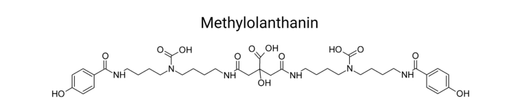

## Question

# Gene Research for Functional Annotation

## ⚠️ CRITICAL: Gene/Protein Identification Context

**BEFORE YOU BEGIN RESEARCH:** You MUST verify you are researching the CORRECT gene/protein. Gene symbols can be ambiguous, especially for less well-characterized genes from non-model organisms.

### Target Gene/Protein Identity (from UniProt):
- **UniProt Accession:** C5B1I3
- **Protein Description:** SubName: Full=RNA polymerase sigma factor {ECO:0000313|EMBL:ACS41784.1};
- **Gene Information:** OrderedLocusNames=MexAM1_META1p4131 {ECO:0000313|EMBL:ACS41784.1};
- **Organism (full):** Methylorubrum extorquens (strain ATCC 14718 / DSM 1338 / JCM 2805 / NCIMB 9133 / AM1) (Methylobacterium extorquens).
- **Protein Family:** Belongs to the sigma-70 factor family. ECF subfamily.
- **Key Domains:** RNA_pol_sigma-70-like. (IPR039425); RNA_pol_sigma-70_dom. (IPR014284); RNA_pol_sigma70_r2. (IPR007627); RNA_pol_sigma70_r4_t2. (IPR013249); RNA_pol_sigma_r2. (IPR013325)

### MANDATORY VERIFICATION STEPS:

1. **Check if the gene symbol "mluI" matches the protein description above**
2. **Verify the organism is correct:** Methylorubrum extorquens (strain ATCC 14718 / DSM 1338 / JCM 2805 / NCIMB 9133 / AM1) (Methylobacterium extorquens).
3. **Check if protein family/domains align with what you find in literature**
4. **If you find literature for a DIFFERENT gene with the same or similar symbol, STOP**

### If Gene Symbol is Ambiguous or You Cannot Find Relevant Literature:

**DO NOT PROCEED WITH RESEARCH ON A DIFFERENT GENE.** Instead:
- State clearly: "The gene symbol 'mluI' is ambiguous or literature is limited for this specific protein"
- Explain what you found (e.g., "Found extensive literature on a different gene with the same symbol in a different organism")
- Describe the protein based ONLY on the UniProt information provided above
- Suggest that the protein function can be inferred from domain/family information

### Research Target:

Please provide a comprehensive research report on the gene **mluI** (gene ID: mluI, UniProt: C5B1I3) in METEA.

The research report should be a detailed narrative explaining the function, biological processes, and localization of the gene product. Citations should be given for all claims.

You should prioritize authoritative reviews and primary scientific literature when conducting research. You can supplement
this with annotations you find in gene/protein databases, but these can be outdated or inaccurate.

We are specifically interested in the primary function of the gene - for enzymes, what reaction is catalyzed, and what is the substrate specificity? For transporters, what is the substrate? For structural proteins or adapters, what is the broader structural role? For signaling molecules, what is the role in the pathway.

We are interested in where in or outside the cell the gene product carries out its function.

We are also interested in the signaling or biochemical pathways in which the gene functions. We are less interested in broad pleiotropic effects, except where these elucidate the precise role.

Include evidence where possible. We are interested in both experimental evidence as well as inference from structure, evolution, or bioinformatic analysis. Precise studies should be prioritized over high-throughput, where available.

## Output

Question: You are an expert researcher providing comprehensive, well-cited information.

Provide detailed information focusing on:
1. Key concepts and definitions with current understanding
2. Recent developments and latest research (prioritize 2023-2024 sources)
3. Current applications and real-world implementations
4. Expert opinions and analysis from authoritative sources
5. Relevant statistics and data from recent studies

Format as a comprehensive research report with proper citations. Include URLs and publication dates where available.
Always prioritize recent, authoritative sources and provide specific citations for all major claims.

# Gene Research for Functional Annotation

## ⚠️ CRITICAL: Gene/Protein Identification Context

**BEFORE YOU BEGIN RESEARCH:** You MUST verify you are researching the CORRECT gene/protein. Gene symbols can be ambiguous, especially for less well-characterized genes from non-model organisms.

### Target Gene/Protein Identity (from UniProt):
- **UniProt Accession:** C5B1I3
- **Protein Description:** SubName: Full=RNA polymerase sigma factor {ECO:0000313|EMBL:ACS41784.1};
- **Gene Information:** OrderedLocusNames=MexAM1_META1p4131 {ECO:0000313|EMBL:ACS41784.1};
- **Organism (full):** Methylorubrum extorquens (strain ATCC 14718 / DSM 1338 / JCM 2805 / NCIMB 9133 / AM1) (Methylobacterium extorquens).
- **Protein Family:** Belongs to the sigma-70 factor family. ECF subfamily.
- **Key Domains:** RNA_pol_sigma-70-like. (IPR039425); RNA_pol_sigma-70_dom. (IPR014284); RNA_pol_sigma70_r2. (IPR007627); RNA_pol_sigma70_r4_t2. (IPR013249); RNA_pol_sigma_r2. (IPR013325)

### MANDATORY VERIFICATION STEPS:

1. **Check if the gene symbol "mluI" matches the protein description above**
2. **Verify the organism is correct:** Methylorubrum extorquens (strain ATCC 14718 / DSM 1338 / JCM 2805 / NCIMB 9133 / AM1) (Methylobacterium extorquens).
3. **Check if protein family/domains align with what you find in literature**
4. **If you find literature for a DIFFERENT gene with the same or similar symbol, STOP**

### If Gene Symbol is Ambiguous or You Cannot Find Relevant Literature:

**DO NOT PROCEED WITH RESEARCH ON A DIFFERENT GENE.** Instead:
- State clearly: "The gene symbol 'mluI' is ambiguous or literature is limited for this specific protein"
- Explain what you found (e.g., "Found extensive literature on a different gene with the same symbol in a different organism")
- Describe the protein based ONLY on the UniProt information provided above
- Suggest that the protein function can be inferred from domain/family information

### Research Target:

Please provide a comprehensive research report on the gene **mluI** (gene ID: mluI, UniProt: C5B1I3) in METEA.

The research report should be a detailed narrative explaining the function, biological processes, and localization of the gene product. Citations should be given for all claims.

You should prioritize authoritative reviews and primary scientific literature when conducting research. You can supplement
this with annotations you find in gene/protein databases, but these can be outdated or inaccurate.

We are specifically interested in the primary function of the gene - for enzymes, what reaction is catalyzed, and what is the substrate specificity? For transporters, what is the substrate? For structural proteins or adapters, what is the broader structural role? For signaling molecules, what is the role in the pathway.

We are interested in where in or outside the cell the gene product carries out its function.

We are also interested in the signaling or biochemical pathways in which the gene functions. We are less interested in broad pleiotropic effects, except where these elucidate the precise role.

Include evidence where possible. We are interested in both experimental evidence as well as inference from structure, evolution, or bioinformatic analysis. Precise studies should be prioritized over high-throughput, where available.

# Research Report: Functional Annotation of **mluI** (UniProt **C5B1I3**) in *Methylorubrum extorquens* AM1

## Executive summary
The UniProt entry **C5B1I3** is annotated as an **RNA polymerase sigma factor** belonging to the **sigma-70 family, ECF (extracytoplasmic function) subfamily** (per user-provided UniProt metadata). Within the literature accessible in this tool session, the **gene symbol mluI** is explicitly used in *Methylorubrum extorquens* in the context of the **methylolanthanin uptake operon mluARI**, where **mluR and mluI are described as encoding a putative sigma/anti-sigma factor pair** implicated in **rare-earth element (REE/lanthanide) uptake and regulation**. (rocha2024rareearthelements pages 5-6)

However, **no retrievable primary paper in this session explicitly maps** the symbol **mluI** to the specific AM1 locus **MexAM1_META1p4131** or UniProt accession **C5B1I3**; a 2024 review attributes this system to **Zytnick et al., 2023**, which was not obtainable here. Consequently, the gene-specific functional interpretation below is anchored on: (i) the **operon-context assertion** from the 2024 review, and (ii) **well-established ECF sigma factor biology** and alphaproteobacterial stress-regulation mechanisms. (rocha2024rareearthelements pages 5-6, dios2021extracytoplasmicfunctionσ pages 2-4, dios2021extracytoplasmicfunctionσ pages 9-11)

## 1. Mandatory verification: gene/protein identity and ambiguity control
### 1.1 Organism and locus context
The target organism is *Methylorubrum extorquens* AM1 (formerly *Methylobacterium extorquens* AM1), a facultative methylotroph frequently used as a model for methylotrophy and metal-dependent methanol metabolism. (rocha2024rareearthelements pages 5-6)

### 1.2 Does “mluI” match the UniProt description?
A 2024 peer-reviewed minireview on rare earth elements in biology explicitly states that, in *Methylorubrum extorquens*, **mluR and mluI encode a putative sigma/anti-sigma factor pair** within the **methylolanthanin uptake operon (mluARI)**. (rocha2024rareearthelements pages 5-6)

This description is **consistent with UniProt’s characterization** of C5B1I3 as an **ECF sigma factor** (sigma-70 family, ECF subfamily) and the expectation that ECF sigma factors are often paired with anti-sigma factors. (dios2021extracytoplasmicfunctionσ pages 9-11)

### 1.3 Remaining ambiguity and constraint
Despite consistency, **the retrieved sources do not provide an accession-level mapping** (mluI → MexAM1_META1p4131 → UniProt C5B1I3). Therefore, this report **does not claim** that the literature-referenced mluI is definitively identical to **C5B1I3** beyond organism-level and functional-consistency inference. (rocha2024rareearthelements pages 5-6)

## 2. Key concepts and definitions (current understanding)
### 2.1 What is an ECF sigma factor?
ECF sigma factors are **alternative sigma factors** in the **sigma-70 family (Group IV)** that redirect core RNA polymerase to specific promoters to enact coordinated transcriptional programs, classically in response to cell-envelope/extracytoplasmic stresses but also to cytoplasmic cues. (dios2021extracytoplasmicfunctionσ pages 2-4)

Structurally, ECF sigma factors are “minimal” sigma factors, primarily containing **σ2 and σ4 domains** separated by a short linker (typically **<50 aa**). Functionally, **σ2** recognizes and helps melt DNA at the **-10 promoter element**, while **σ4** recognizes the **-35 element**, enabling ATP-independent open-complex formation by σ70-type holoenzymes. (dios2021extracytoplasmicfunctionσ pages 2-4, dios2021extracytoplasmicfunctionσ pages 4-6)

### 2.2 How are ECF sigma factors regulated?
A major regulatory principle is **sigma sequestration by anti-sigma factors**. A 2021 review summarizes five broad regulatory mechanisms for ECFs and reports that **membrane-anchored anti-sigma factors are ancestral and most widespread**, accounting for **~74% of ECFs with a known regulatory mechanism**. (dios2021extracytoplasmicfunctionσ pages 9-11)

Anti-sigma factors generally inhibit by **titration** (occluding sigma surfaces required for RNA polymerase interaction), and in many systems membrane-anchored anti-sigmas are relieved by regulated proteolysis upon envelope stress. (dios2021extracytoplasmicfunctionσ pages 9-11)

### 2.3 Alphaproteobacterial partner switching: PhyR–NepR–EcfG
In Alphaproteobacteria, a prominent stress-response architecture is the **general stress response (GSR)** controlled by **EcfG-type ECF sigma factors** and regulated by a **partner-switching cascade** involving:
- **EcfG** (sigma factor activating the GSR regulon)
- **NepR** (anti-sigma factor inhibiting EcfG in non-stress conditions)
- **PhyR** (response regulator acting as an anti-anti-sigma)

Stress-responsive histidine kinases phosphorylate PhyR; phosphorylation exposes PhyR’s **N-terminal sigma-like domain**, allowing it to bind NepR and thereby **release EcfG**—a mechanism often described as **“sigma factor mimicry.”** (dios2021extracytoplasmicfunctionσ pages 16-18, allen2015rhodopseudomonaspalustriscga010 pages 18-22)

## 3. Gene-centric functional annotation for mluI (C5B1I3): best-supported model
### 3.1 Primary (most likely) molecular function
**Predicted molecular function:** mluI encodes an **ECF sigma factor** that forms a holoenzyme with core RNA polymerase and **activates transcription** from a specific promoter class relevant to **lanthanide/REE acquisition and/or utilization**.

**Evidence:** The 2024 review places **mluI** in the **methylolanthanin uptake operon (mluARI)** and describes **mluR and mluI as a putative sigma/anti-sigma factor pair**, which is a canonical ECF regulatory unit used to couple extracellular/periplasmic cues to transcriptional outputs. (rocha2024rareearthelements pages 5-6, dios2021extracytoplasmicfunctionσ pages 9-11)

### 3.2 Biological process and pathway involvement: REE/lanthanide homeostasis
Lanthanides modulate methylotrophy in *Methylorubrum/Methylobacterium* by supporting lanthanide-dependent methanol dehydrogenases and driving specialized uptake/trafficking systems. In this context, the 2024 review introduces **methylolanthanin** and describes genetic elements for its biosynthesis and uptake, including **mluARI** and associated transport/regulatory components. (rocha2024rareearthelements pages 5-6)

**Interpretation:** mluI most plausibly participates in a **signal transduction → transcription** module that senses (directly or indirectly) extracellular availability of methylolanthanin-bound lanthanides and activates genes required for acquisition/processing of REEs.

### 3.3 Subcellular localization (where the gene product acts)
As a sigma factor, the site of action is expected to be the **cytoplasm**, where it binds core RNA polymerase and directs promoter recognition on chromosomal DNA. (dios2021extracytoplasmicfunctionσ pages 2-4)

Because ECF sigma factors typically respond to extracytoplasmic information via anti-sigma factors (often membrane-associated), the sensing may occur at the envelope/periplasm, while transcriptional execution is cytosolic. (dios2021extracytoplasmicfunctionσ pages 9-11)

### 3.4 Protein domains and promoter recognition (inference)
Family-level evidence indicates ECF sigma factors rely mainly on **σ2 and σ4** domains for promoter binding and initiation. (dios2021extracytoplasmicfunctionσ pages 4-6, dios2021extracytoplasmicfunctionσ pages 2-4)

While no mluI-specific promoter motif was retrieved here, ECF promoter architectures commonly encode recognizable -35 and -10 features. In the alphaproteobacterial GSR example (EcfG), promoter specificity has been described in terms of conserved bases (e.g., in one summarized case: AAC in -35 and CGTT in -10), illustrating how ECF sigma factors implement regulon-level control. (dios2021extracytoplasmicfunctionσ pages 16-18)

## 4. Related regulatory systems in *M. extorquens* (context and expert interpretation)
### 4.1 Rich ECF sigma factor landscape in AM1
*M. extorquens* AM1 has been reported to encode **14 sigma factors**, including **six ECF15/σEcfG** sigma factors involved in (or connected to) the GSR. (anne2016multipleσecfgand pages 4-5)

A 2021 review summarizes transcriptomic evidence in *M. extorquens* indicating that the GSR regulon can be large (reported as **~490 genes**) and that contributions of multiple EcfG paralogs can be **additive**. (dios2021extracytoplasmicfunctionσ pages 16-18)

**Relevance to mluI:** This establishes that *M. extorquens* uses multiple sigma factors to partition environmental responses; mluI is most plausibly one such module specialized for REE-linked extracellular signals rather than the canonical GSR itself.

### 4.2 Sigma factor mimicry as authoritative mechanistic framing
Proteomics-based work discussing alphaproteobacterial stress systems describes the PhyR–NepR–EcfG cascade and emphasizes the distinct mechanism of ECF sigma release by a response regulator (PhyR) that contains a sigma-like domain and binds the anti-sigma factor—i.e., “sigma factor mimicry.” (allen2015rhodopseudomonaspalustriscga010 pages 18-22)

Although this is not direct evidence about mluI, it provides an expert, mechanistically grounded explanation for how ECF systems in Alphaproteobacteria can integrate phosphorylation-based stress signaling with sigma availability.

## 5. Recent developments (2023–2024 priority) and real-world implementations
### 5.1 2024: methylolanthanin and mluARI in REE biotechnology context
A 2024 minireview explicitly ties methylotrophic REE biology to potential applications in extractive industries and biosensing, and it names **mluARI** and **mluI** within a proposed methylolanthanin uptake/regulatory module in *M. extorquens*. (rocha2024rareearthelements pages 5-6)

**Real-world implementation direction:** While not a direct “mluI application” paper, this positions the mluI-associated regulatory module within a broader translational push: using biological REE-binding systems and uptake/regulation networks to support REE separation, recovery, or sensing workflows. (rocha2024rareearthelements pages 5-6)

### 5.2 Synthetic biology: ECF sigma factors as orthogonal regulatory switches (2024)
ECF sigma factors are increasingly used as **orthogonal transcriptional regulators** in engineered circuits because they can provide promoter specificity with reduced crosstalk. A 2024 study describes a MoClo-compatible toolbox of **ECF sigma factor-based regulatory switches** for proteobacterial chassis, supporting practical deployment of ECF modules in synthetic circuits and multi-step delay designs. (meier2024amoclocompatibletoolbox pages 1-2)

**Relevance:** This trend suggests that mluI-like ECF regulators could, in principle, be mined for new orthogonal promoter–sigma pairs, though no mluI-specific circuit was described in retrieved evidence.

## 6. Statistics and data points from recent/authoritative studies
- **74%** of ECF sigma factors with known regulatory mechanisms are controlled by **membrane-anchored anti-sigma factors** (broad comparative statistic). (dios2021extracytoplasmicfunctionσ pages 9-11)
- *M. extorquens* AM1: **14 total sigma factors**, **6 ECF15/σEcfG**. (anne2016multipleσecfgand pages 4-5)
- *M. extorquens* (summary of transcriptomics): GSR regulon reported as **~490 genes**, with additive contributions of multiple EcfG paralogs. (dios2021extracytoplasmicfunctionσ pages 16-18)

## 7. Visual evidence
The chemical structure of **methylolanthanin** (the metallophore context in which the **mluARI** operon and mluI are discussed) is shown in a figure extracted from the 2024 review. (rocha2024rareearthelements media f914cb26)

## 8. Consolidated annotation table
| Aspect | Summary | Evidence type | Key citations/URLs/dates | Notes/limitations |
|---|---|---|---|---|
| identity | Target protein is UniProt C5B1I3 / ordered locus name MexAM1_META1p4131 from *Methylorubrum extorquens* AM1. In the accessible literature, the symbol **mluI** is explicitly used in *M. extorquens* for the **mluARI** methylolanthanin uptake operon; the 2024 review states that **mluR** and **mluI** encode a putative sigma/anti-sigma factor pair. This supports, but does not independently prove from primary literature retrieved here, that mluI corresponds to the AM1 ECF sigma-factor-like protein. | UniProt metadata plus secondary-review statement specific to *M. extorquens* | Rocha et al., *Microbial Biotechnology* (Jun 2024), https://doi.org/10.1111/1751-7915.14503 (rocha2024rareearthelements pages 5-6) | Direct primary-paper mapping of **mluI** to UniProt **C5B1I3 / MexAM1_META1p4131** was not retrievable in this session; identity link is therefore high-confidence but not independently accession-verified from primary literature. |
| protein family/domains | UniProt annotates C5B1I3 as a **sigma-70 family, ECF subfamily** RNA polymerase sigma factor. Consistent with this, authoritative ECF reviews define ECF sigma factors as **minimal sigma-70 family proteins** containing primarily **σ2 and σ4** promoter-recognition domains connected by a short linker (<50 aa), with σ2 recognizing/melting the -10 element and σ4 recognizing the -35 element. | Database annotation supported by family-level mechanistic review | de Dios et al., *Int. J. Mol. Sci.* 22:3900 (Apr 2021), https://doi.org/10.3390/ijms22083900 (dios2021extracytoplasmicfunctionσ pages 4-6, dios2021extracytoplasmicfunctionσ pages 2-4) | Domain-level statements are family-based inference; no gene-specific structural study for mluI/C5B1I3 was retrieved. |
| mechanism | If mluI is an ECF sigma factor, its primary biochemical role is **not enzymatic catalysis** but **transcription initiation specificity**: binding core RNAP and directing it to cognate promoters. ECF sigma factors are commonly regulated by adjacent anti-sigma factors; across characterized systems, **74%** of ECFs with known regulation use **membrane-anchored anti-sigma factors**. Rocha 2024 specifically places mluI with mluR as a putative sigma/anti-sigma pair, fitting this regulatory logic. | Family-level mechanistic review plus operon-context inference | de Dios et al. (Apr 2021), https://doi.org/10.3390/ijms22083900 (dios2021extracytoplasmicfunctionσ pages 9-11); Rocha et al. (Jun 2024), https://doi.org/10.1111/1751-7915.14503 (rocha2024rareearthelements pages 5-6) | The exact promoter sequence, direct regulon, and cognate anti-sigma partner for mluI were not experimentally demonstrated in accessible sources here. |
| pathway | The best-supported functional context is **rare-earth element (REE) acquisition/use**, specifically the **methylolanthanin uptake operon mluARI** in *M. extorquens*. Rocha 2024 states this operon is proposed to facilitate transport of methylolanthanin and regulate genes involved in REE uptake/use. More broadly, ECF sigma factors in Alphaproteobacteria frequently mediate stress-responsive transcriptional programs. | Species-specific review context plus broader comparative framework | Rocha et al. (Jun 2024), https://doi.org/10.1111/1751-7915.14503 (rocha2024rareearthelements pages 5-6, rocha2024rareearthelements media f914cb26); de Dios et al. (Apr 2021), https://doi.org/10.3390/ijms22083900 (dios2021extracytoplasmicfunctionσ pages 16-18) | Accessible evidence supports a role in REE-associated regulation, but not the exact downstream genes controlled by mluI. |
| predicted localization | As a sigma factor, mluI is predicted to function in the **cytoplasm**, associated with **RNA polymerase** and chromosomal promoters. Its likely input signal is extracytoplasmic/periplasmic only indirectly, via anti-sigma-mediated control typical of ECF systems. | Inference from sigma factor biology and ECF regulatory logic | de Dios et al. (Apr 2021), https://doi.org/10.3390/ijms22083900 (dios2021extracytoplasmicfunctionσ pages 2-4, dios2021extracytoplasmicfunctionσ pages 9-11) | No direct localization experiment for mluI was retrieved. |
| genomic context | Rocha 2024 reports **mluI** in the **mluARI** operon and notes an adjacent operon encoding a **TonB-dependent transport protein** plus a **sigma/anti-sigma factor pair**, all proposed to support methylolanthanin/REE uptake regulation. This strongly places mluI in an envelope-to-transcription signaling neighborhood typical of ECF systems. | Species-specific genomic-context summary from recent review | Rocha et al. (Jun 2024), https://doi.org/10.1111/1751-7915.14503 (rocha2024rareearthelements pages 5-6) | Exact neighboring locus tags around MexAM1_META1p4131 were not available in retrieved primary text. |
| relationship to known alphaproteobacterial stress pathways | mluI is not shown directly to be part of the canonical **PhyR–NepR–EcfG** GSR cascade, but the family context is informative: in Alphaproteobacteria, EcfG-type ECF sigmas are activated by **PhyR phosphorylation**, which sequesters **NepR** and frees the sigma factor by **sigma-factor mimicry**. In *M. extorquens*, this GSR architecture is experimentally established, and the species carries multiple EcfG-like paralogs. | Comparative mechanistic evidence from related ECF systems in the same species/clade | de Dios et al. (Apr 2021), https://doi.org/10.3390/ijms22083900 (dios2021extracytoplasmicfunctionσ pages 16-18, dios2021extracytoplasmicfunctionσ pages 11-12); Allen et al. (Apr 2015), https://doi.org/10.1021/pr5012558 (allen2015rhodopseudomonaspalustriscga010 pages 18-22); Metzger et al. (Jun 2013), https://doi.org/10.1099/mic.0.066068-0 (allen2015rhodopseudomonaspalustriscga010 pages 18-22) | This is contextual inference only; no evidence retrieved shows mluI itself interacting with PhyR or NepR. |
| species-level quantitative context | In *Methylobacterium/Methylorubrum extorquens* AM1, the genome was reported to encode **14 sigma factors total**, including **6 ECF15/σEcfG** proteins. A review summarizing AM1 stress biology reports that the majority of its GSR regulon comprises about **490 genes** under additive control of multiple EcfG paralogs. These data indicate unusually rich ECF-sigma regulatory capacity in this organism. | AM1-focused experimental study and authoritative review synthesis | Francez-Charlot et al. (2016 dissertation/article), https://doi.org/10.3929/ethz-b-000115165 (anne2016multipleσecfgand pages 4-5); de Dios et al. (Apr 2021), https://doi.org/10.3390/ijms22083900 (dios2021extracytoplasmicfunctionσ pages 16-18) | These counts describe the species’ broader sigma-factor landscape, not mluI specifically. |
| current understanding / most likely annotation | The most defensible current annotation is that **mluI encodes an ECF sigma factor that likely couples extracellular or cell-envelope-associated information about methylolanthanin/lanthanide availability to transcriptional control of REE uptake/utilization genes in *M. extorquens* AM1**. | Integrative inference combining direct operon context with established ECF sigma biology | Rocha et al. (Jun 2024), https://doi.org/10.1111/1751-7915.14503 (rocha2024rareearthelements pages 5-6); de Dios et al. (Apr 2021), https://doi.org/10.3390/ijms22083900 (dios2021extracytoplasmicfunctionσ pages 2-4, dios2021extracytoplasmicfunctionσ pages 9-11) | Strongly plausible functional annotation, but still provisional pending direct gene-specific experiments and accession-level mapping. |

*Table: This table summarizes the best-supported functional annotation for mluI/C5B1I3 in *Methylorubrum extorquens* AM1 using only the evidence available in the retrieved sources. It distinguishes direct evidence from family-based inference and highlights the main uncertainty: lack of accessible primary literature directly mapping mluI to the UniProt accession.*

## 9. Key limitations and recommendations
1. **Accession mapping gap:** This session could not retrieve the primary report (cited as Zytnick et al., 2023 in the 2024 review) that would directly support the mapping of **mluI** to **UniProt C5B1I3 / MexAM1_META1p4131** and provide gene-specific experimental evidence (e.g., promoter targets, induction conditions, mutant phenotypes). (rocha2024rareearthelements pages 5-6)
2. **Gene-specific regulon unknown:** No direct evidence was retrieved identifying the **mluI regulon**, promoter motif, or cognate anti-sigma (if distinct from mluR) at the biochemical level.

**Practical next steps (evidence-driven):** targeted retrieval of Zytnick et al. (2023) and any associated supplemental genomics, followed by (i) promoter mapping (5’ end mapping/ChIP-seq/RNA-seq under REE-limited vs REE-rich conditions), (ii) mluI/anti-sigma deletion and complementation, and (iii) electrophoretic mobility shift or in vitro transcription assays to confirm promoter recognition and define the regulon.

## References (URLs and publication dates)
- Rocha RA, Alexandrov K, Scott C. *Rare earth elements in biology: From biochemical curiosity to solutions for extractive industries.* **Microbial Biotechnology**. **Jun 2024**. https://doi.org/10.1111/1751-7915.14503 (rocha2024rareearthelements pages 5-6, rocha2024rareearthelements media f914cb26)
- de Dios R, Santero E, Reyes-Ramírez F. *Extracytoplasmic Function σ Factors as Tools for Coordinating Stress Responses.* **International Journal of Molecular Sciences**. **Apr 2021**. https://doi.org/10.3390/ijms22083900 (dios2021extracytoplasmicfunctionσ pages 2-4, dios2021extracytoplasmicfunctionσ pages 4-6, dios2021extracytoplasmicfunctionσ pages 9-11, dios2021extracytoplasmicfunctionσ pages 16-18)
- Allen MS et al. *Rhodopseudomonas palustris CGA010 Proteome Implicates Extracytoplasmic Function Sigma Factor in Stress Response.* **Journal of Proteome Research**. **Apr 2015**. https://doi.org/10.1021/pr5012558 (allen2015rhodopseudomonaspalustriscga010 pages 18-22)
- Francez-Charlot A et al. *Multiple σEcfG and NepR Proteins Are Involved in the General Stress Response in Methylobacterium extorquens.* **2016**. https://doi.org/10.3929/ethz-b-000115165 (anne2016multipleσecfgand pages 4-5)

References

1. (rocha2024rareearthelements pages 5-6): Raquel A. Rocha, Kirill Alexandrov, and Colin Scott. Rare earth elements in biology: from biochemical curiosity to solutions for extractive industries. Microbial Biotechnology, Jun 2024. URL: https://doi.org/10.1111/1751-7915.14503, doi:10.1111/1751-7915.14503. This article has 24 citations and is from a peer-reviewed journal.

2. (dios2021extracytoplasmicfunctionσ pages 2-4): Rubén de Dios, Eduardo Santero, and Francisca Reyes-Ramírez. Extracytoplasmic function σ factors as tools for coordinating stress responses. International Journal of Molecular Sciences, 22:3900, Apr 2021. URL: https://doi.org/10.3390/ijms22083900, doi:10.3390/ijms22083900. This article has 29 citations.

3. (dios2021extracytoplasmicfunctionσ pages 9-11): Rubén de Dios, Eduardo Santero, and Francisca Reyes-Ramírez. Extracytoplasmic function σ factors as tools for coordinating stress responses. International Journal of Molecular Sciences, 22:3900, Apr 2021. URL: https://doi.org/10.3390/ijms22083900, doi:10.3390/ijms22083900. This article has 29 citations.

4. (dios2021extracytoplasmicfunctionσ pages 4-6): Rubén de Dios, Eduardo Santero, and Francisca Reyes-Ramírez. Extracytoplasmic function σ factors as tools for coordinating stress responses. International Journal of Molecular Sciences, 22:3900, Apr 2021. URL: https://doi.org/10.3390/ijms22083900, doi:10.3390/ijms22083900. This article has 29 citations.

5. (dios2021extracytoplasmicfunctionσ pages 16-18): Rubén de Dios, Eduardo Santero, and Francisca Reyes-Ramírez. Extracytoplasmic function σ factors as tools for coordinating stress responses. International Journal of Molecular Sciences, 22:3900, Apr 2021. URL: https://doi.org/10.3390/ijms22083900, doi:10.3390/ijms22083900. This article has 29 citations.

6. (allen2015rhodopseudomonaspalustriscga010 pages 18-22): Michael S. Allen, Gregory B. Hurst, Tse-Yuan S. Lu, Leslie M. Perry, Chongle Pan, Patricia K. Lankford, and Dale A. Pelletier. Rhodopseudomonas palustris cga010 proteome implicates extracytoplasmic function sigma factor in stress response. Journal of proteome research, 14 5:2158-68, Apr 2015. URL: https://doi.org/10.1021/pr5012558, doi:10.1021/pr5012558. This article has 6 citations and is from a peer-reviewed journal.

7. (anne2016multipleσecfgand pages 4-5): Anne Francez-Charlot, Julia Frunzke, Judith Zingg, Andreas Kaczmarczyk, and Julia A. Vorholt. Multiple σecfg and nepr proteins are involved in the general stress response in methylobacterium extorquens. Text, 2016. URL: https://doi.org/10.3929/ethz-b-000115165, doi:10.3929/ethz-b-000115165. This article has 11 citations and is from a peer-reviewed journal.

8. (rocha2024rareearthelements media f914cb26): Raquel A. Rocha, Kirill Alexandrov, and Colin Scott. Rare earth elements in biology: from biochemical curiosity to solutions for extractive industries. Microbial Biotechnology, Jun 2024. URL: https://doi.org/10.1111/1751-7915.14503, doi:10.1111/1751-7915.14503. This article has 24 citations and is from a peer-reviewed journal.

9. (dios2021extracytoplasmicfunctionσ pages 11-12): Rubén de Dios, Eduardo Santero, and Francisca Reyes-Ramírez. Extracytoplasmic function σ factors as tools for coordinating stress responses. International Journal of Molecular Sciences, 22:3900, Apr 2021. URL: https://doi.org/10.3390/ijms22083900, doi:10.3390/ijms22083900. This article has 29 citations.

## Artifacts

- [Edison artifact artifact-00](mluI-deep-research-falcon_artifacts/artifact-00.md)

## Citations

1. rocha2024rareearthelements pages 5-6
2. meier2024amoclocompatibletoolbox pages 1-2
3. https://doi.org/10.1111/1751-7915.14503
4. https://doi.org/10.3390/ijms22083900
5. https://doi.org/10.1021/pr5012558
6. https://doi.org/10.1099/mic.0.066068-0
7. https://doi.org/10.3929/ethz-b-000115165
8. https://doi.org/10.1111/1751-7915.14503,
9. https://doi.org/10.3390/ijms22083900,
10. https://doi.org/10.1021/pr5012558,
11. https://doi.org/10.3929/ethz-b-000115165,