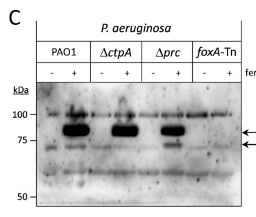

## Question

# Gene Research for Functional Annotation

## ⚠️ CRITICAL: Gene/Protein Identification Context

**BEFORE YOU BEGIN RESEARCH:** You MUST verify you are researching the CORRECT gene/protein. Gene symbols can be ambiguous, especially for less well-characterized genes from non-model organisms.

### Target Gene/Protein Identity (from UniProt):
- **UniProt Accession:** C5B1I2
- **Protein Description:** SubName: Full=FecR, iron siderophore sensor protein {ECO:0000313|EMBL:ACS41783.1};
- **Gene Information:** OrderedLocusNames=MexAM1_META1p4130 {ECO:0000313|EMBL:ACS41783.1};
- **Organism (full):** Methylorubrum extorquens (strain ATCC 14718 / DSM 1338 / JCM 2805 / NCIMB 9133 / AM1) (Methylobacterium extorquens).
- **Protein Family:** Not specified in UniProt
- **Key Domains:** FecR. (IPR006860); FecR_N. (IPR032623); Ferrdict_sens_TM. (IPR012373); DUF4880 (PF16220); FecR (PF04773)

### MANDATORY VERIFICATION STEPS:

1. **Check if the gene symbol "mluR" matches the protein description above**
2. **Verify the organism is correct:** Methylorubrum extorquens (strain ATCC 14718 / DSM 1338 / JCM 2805 / NCIMB 9133 / AM1) (Methylobacterium extorquens).
3. **Check if protein family/domains align with what you find in literature**
4. **If you find literature for a DIFFERENT gene with the same or similar symbol, STOP**

### If Gene Symbol is Ambiguous or You Cannot Find Relevant Literature:

**DO NOT PROCEED WITH RESEARCH ON A DIFFERENT GENE.** Instead:
- State clearly: "The gene symbol 'mluR' is ambiguous or literature is limited for this specific protein"
- Explain what you found (e.g., "Found extensive literature on a different gene with the same symbol in a different organism")
- Describe the protein based ONLY on the UniProt information provided above
- Suggest that the protein function can be inferred from domain/family information

### Research Target:

Please provide a comprehensive research report on the gene **mluR** (gene ID: mluR, UniProt: C5B1I2) in METEA.

The research report should be a detailed narrative explaining the function, biological processes, and localization of the gene product. Citations should be given for all claims.

You should prioritize authoritative reviews and primary scientific literature when conducting research. You can supplement
this with annotations you find in gene/protein databases, but these can be outdated or inaccurate.

We are specifically interested in the primary function of the gene - for enzymes, what reaction is catalyzed, and what is the substrate specificity? For transporters, what is the substrate? For structural proteins or adapters, what is the broader structural role? For signaling molecules, what is the role in the pathway.

We are interested in where in or outside the cell the gene product carries out its function.

We are also interested in the signaling or biochemical pathways in which the gene functions. We are less interested in broad pleiotropic effects, except where these elucidate the precise role.

Include evidence where possible. We are interested in both experimental evidence as well as inference from structure, evolution, or bioinformatic analysis. Precise studies should be prioritized over high-throughput, where available.

## Output

Question: You are an expert researcher providing comprehensive, well-cited information.

Provide detailed information focusing on:
1. Key concepts and definitions with current understanding
2. Recent developments and latest research (prioritize 2023-2024 sources)
3. Current applications and real-world implementations
4. Expert opinions and analysis from authoritative sources
5. Relevant statistics and data from recent studies

Format as a comprehensive research report with proper citations. Include URLs and publication dates where available.
Always prioritize recent, authoritative sources and provide specific citations for all major claims.

# Gene Research for Functional Annotation

## ⚠️ CRITICAL: Gene/Protein Identification Context

**BEFORE YOU BEGIN RESEARCH:** You MUST verify you are researching the CORRECT gene/protein. Gene symbols can be ambiguous, especially for less well-characterized genes from non-model organisms.

### Target Gene/Protein Identity (from UniProt):
- **UniProt Accession:** C5B1I2
- **Protein Description:** SubName: Full=FecR, iron siderophore sensor protein {ECO:0000313|EMBL:ACS41783.1};
- **Gene Information:** OrderedLocusNames=MexAM1_META1p4130 {ECO:0000313|EMBL:ACS41783.1};
- **Organism (full):** Methylorubrum extorquens (strain ATCC 14718 / DSM 1338 / JCM 2805 / NCIMB 9133 / AM1) (Methylobacterium extorquens).
- **Protein Family:** Not specified in UniProt
- **Key Domains:** FecR. (IPR006860); FecR_N. (IPR032623); Ferrdict_sens_TM. (IPR012373); DUF4880 (PF16220); FecR (PF04773)

### MANDATORY VERIFICATION STEPS:

1. **Check if the gene symbol "mluR" matches the protein description above**
2. **Verify the organism is correct:** Methylorubrum extorquens (strain ATCC 14718 / DSM 1338 / JCM 2805 / NCIMB 9133 / AM1) (Methylobacterium extorquens).
3. **Check if protein family/domains align with what you find in literature**
4. **If you find literature for a DIFFERENT gene with the same or similar symbol, STOP**

### If Gene Symbol is Ambiguous or You Cannot Find Relevant Literature:

**DO NOT PROCEED WITH RESEARCH ON A DIFFERENT GENE.** Instead:
- State clearly: "The gene symbol 'mluR' is ambiguous or literature is limited for this specific protein"
- Explain what you found (e.g., "Found extensive literature on a different gene with the same symbol in a different organism")
- Describe the protein based ONLY on the UniProt information provided above
- Suggest that the protein function can be inferred from domain/family information

### Research Target:

Please provide a comprehensive research report on the gene **mluR** (gene ID: mluR, UniProt: C5B1I2) in METEA.

The research report should be a detailed narrative explaining the function, biological processes, and localization of the gene product. Citations should be given for all claims.

You should prioritize authoritative reviews and primary scientific literature when conducting research. You can supplement
this with annotations you find in gene/protein databases, but these can be outdated or inaccurate.

We are specifically interested in the primary function of the gene - for enzymes, what reaction is catalyzed, and what is the substrate specificity? For transporters, what is the substrate? For structural proteins or adapters, what is the broader structural role? For signaling molecules, what is the role in the pathway.

We are interested in where in or outside the cell the gene product carries out its function.

We are also interested in the signaling or biochemical pathways in which the gene functions. We are less interested in broad pleiotropic effects, except where these elucidate the precise role.

Include evidence where possible. We are interested in both experimental evidence as well as inference from structure, evolution, or bioinformatic analysis. Precise studies should be prioritized over high-throughput, where available.

# Research report: **mluR (UniProt C5B1I2; locus MexAM1_META1p4130)** in *Methylorubrum extorquens* AM1

## Executive summary
The UniProt entry **C5B1I2** from *Methylorubrum extorquens* AM1 is annotated as **FecR, an iron siderophore sensor**. In the retrieved literature, **no primary paper explicitly maps the gene symbol “mluR” or locus MexAM1_META1p4130 to an experimentally characterized protein**; thus, “mluR” is ambiguous/under-cited for this organism in accessible full text. Functional annotation is therefore best supported by **conserved domain architecture and the strongly established mechanism of FecR-like cell-surface signaling (CSS) anti-σ/pro-σ factors** (inner-membrane, periplasm-to-cytoplasm transducers), plus recent 2023–2024 mechanistic updates in CSS systems. (braun2022transcriptionregulationof pages 13-13, braun2022transcriptionregulationof pages 2-3)

In current understanding, FecR-family proteins are **membrane-anchored transducers** that couple **TonB-dependent outer-membrane receptors** (that detect ferric-citrate or siderophore-like signals) to **cytoplasmic extracytoplasmic-function (ECF) σ factors**, thereby inducing transcription of uptake/transport genes; activation often involves **regulated, sequential proteolysis** (Prc/CtpA-family periplasmic proteases and the intramembrane protease RseP). (braun2022transcriptionregulationof pages 2-3, braun2022transcriptionregulationof pages 9-10, braun2022transcriptionregulationof pages 5-6)

## 1. Identity verification and ambiguity assessment (mandatory)

### 1.1 Target identity
**Target protein (given):** UniProt **C5B1I2**, described as **FecR, iron siderophore sensor protein**, in *Methylorubrum extorquens* strain AM1 (ATCC 14718 / DSM 1338 / JCM 2805 / NCIMB 9133). The listed domains (InterPro/Pfam) include **FecR**, **FecR_N**, and a **Ferric-dicitrate sensor transmembrane module**, consistent with a FecR-like CSS transducer. (braun2022transcriptionregulationof pages 2-3)

### 1.2 Does the symbol “mluR” match this FecR-like protein?
Across the retrieved full-text sources (reviews and primary research), **no direct mention** was found linking the gene symbol **mluR** to **C5B1I2 / MexAM1_META1p4130**, nor describing this specific locus experimentally. Accordingly:

* **Conclusion:** The symbol **mluR** is **ambiguous/insufficiently grounded** in retrieved literature for AM1; this report avoids attributing functions from other organisms’ “mluR” genes and instead uses the UniProt-defined identity and FecR-family evidence. (braun2022transcriptionregulationof pages 13-13, braun2022transcriptionregulationof pages 2-3)

## 2. Key concepts and definitions (current understanding)

### 2.1 Cell-surface signaling (CSS) in Gram-negative bacteria
CSS is an envelope-spanning regulatory mechanism in which **outer-membrane TonB-dependent receptors** detect extracellular metal complexes (e.g., ferric citrate or siderophores) and transmit signals into the cytoplasm to activate transcription of uptake genes. The canonical example is the **E. coli Fec** system, composed of:

* **FecA**: TonB-dependent outer-membrane receptor/transducer
* **FecR**: inner-membrane regulatory protein (anti-σ/pro-σ) spanning periplasm and cytoplasmic membrane
* **FecI**: ECF σ factor that activates transcription at target promoters (e.g., fecA promoter)

Ligand binding to the receptor’s extracellular side triggers conformational changes reaching the **periplasmic signaling domain**, which interacts with the periplasmic portion of FecR; FecR then controls FecI activity. (braun2022transcriptionregulationof pages 2-3)

### 2.2 What is FecR?
FecR-family proteins are often described as **anti-σ** (sequestering an ECF σ factor) and/or **pro-σ** (generating an activating σ-binding fragment) regulators. Mechanistically, a defining feature is that the output (σ activation) is mediated by an **N-terminal cytosolic region** of FecR-like proteins that physically interacts with and stimulates the partner ECF σ factor (e.g., binding σ4). (braun2022transcriptionregulationof pages 5-6, braun2022transcriptionregulationof pages 6-7)

### 2.3 What “function” means here (not an enzyme)
For C5B1I2 (FecR-like), the primary function is not catalysis or transport. Rather, the protein’s function is **signal transduction and transcriptional regulation**: coupling extracellular iron-carrier availability to transcriptional activation of transport/uptake systems via an ECF σ factor. (braun2022transcriptionregulationof pages 2-3, braun2022transcriptionregulationof pages 5-6)

## 3. Functional annotation for C5B1I2 (mluR): inferred role, processes, and localization

Because AM1-specific experiments for C5B1I2 were not retrieved, the following annotation is best supported as **high-confidence inference** from conserved FecR-family features.

### 3.1 Cellular localization and topology
The FecR archetype is an **inner-membrane protein** with:

* **N-proximal cytoplasmic region** (σ-factor interaction/activation)
* **Single transmembrane helix** localized around **~85–100 aa** in the model (predictions also place the TM near ~82) 
* **C-proximal periplasmic domain** that contacts the receptor signaling domain

This topology strongly supports that C5B1I2 functions at the **cytoplasmic membrane** and in the **periplasmic space** (signal reception), while regulating transcription in the **cytoplasm** through σ factor control. (braun2022transcriptionregulationof pages 5-6, braun2022transcriptionregulationof pages 6-7)

### 3.2 Pathway placement
Canonical CSS logic (applicable template for C5B1I2):

1. An extracellular ferric-citrate/siderophore signal binds a **TonB-dependent receptor**.
2. Receptor conformational changes affect the receptor’s periplasmic signaling domain.
3. The receptor signaling domain engages the **periplasmic domain of FecR-like proteins**.
4. FecR-like processing/activation leads to **ECF σ factor activation**.
5. ECF σ factor directs RNA polymerase to **uptake/transport promoters**.

In *E. coli*, this specifically controls **fecA** and related genes; iron-responsive repression is commonly integrated via **Fur**. (braun2022transcriptionregulationof pages 2-3, braun2022transcriptionregulationof pages 10-10)

### 3.3 Proteolytic activation as a defining mechanistic feature
A major characteristic of FecR-like proteins is **regulated intramembrane proteolysis (RIP)**. In the canonical model:

* Periplasmic cleavage(s) generate intermediates (e.g., ~20 kDa),
* followed by intramembrane cleavage by **RseP** to release an N-terminal fragment that activates the ECF σ factor.

Multiple fragment sizes are reported for FecR-like processing, including **~20, 15, and 12 kDa** species. (braun2022transcriptionregulationof pages 9-10, braun2022transcriptionregulationof pages 5-6)

### 3.4 Conserved activating N-terminus features (expert-level mechanistic inference)
Genetic mapping in FecR indicates the activating region is near **residues ~1–59**, and specific conserved residues (e.g., L13, W19, W39, W50 in the model) are critical for induction. This supports annotation of C5B1I2 N-terminus as the **σ-factor binding/activating module**, with the periplasmic domain acting as the sensor-input module. (braun2022transcriptionregulationof pages 6-7)

## 4. Recent developments (prioritizing 2023–2024)

### 4.1 2024: Revised CSS paradigm—receptor/anti-σ complexes can preform and protect from proteolysis
A 2024 study in *Pseudomonas aeruginosa* (Fox system) provides a major conceptual update: the TonB-dependent receptor signaling domain can **already bind** the anti-σ factor **in the absence of ligand**, and this interaction can **protect the anti-σ factor from proteolysis**, suppressing σECF activation. Ligand-dependent changes then permit proteolytic activation. This revises the older “signal promotes binding” view into a model where **signal relieves a protected state**, enabling degradation/activation. (wettstadt2024bacterialtonbdependenttransducers pages 2-3, wettstadt2024bacterialtonbdependenttransducers pages 1-2)

The same study provides residue-level evidence for a structured receptor–anti-σ interface (β-sheet interface; key residues) and shows receptor processing (FoxA ~84–85 kDa vs a processed ~73–74 kDa form), reinforcing that CSS can involve coordinated processing of multiple envelope proteins. (wettstadt2024bacterialtonbdependenttransducers pages 10-12, wettstadt2024bacterialtonbdependenttransducers media 7647bb29, wettstadt2024bacterialtonbdependenttransducers media b827a8a5)

### 4.2 2023: Structural/mechanistic progress on the intramembrane protease RseP
A 2023 mBio study summarizes key mechanistic features of **RseP** (S2P-family intramembrane protease) and notes its role in cleaving FecR-type substrates, with structural elements (PDZ domains as a filter; membrane-reentrant β-sheet near the active site) helping explain substrate selection and intramembrane cleavage. These advances strengthen the mechanistic plausibility that a FecR-like AM1 protein would be regulated by conserved RIP machinery. (yokoyama2023s2pintramembraneprotease pages 1-2)

## 5. Quantitative/statistical evidence relevant to function

Even though these values are derived from model systems (primarily *E. coli* Fec), they provide quantitative constraints consistent with a FecR-family annotation:

* **FecI σ factor abundance:** reported as extremely low under unrepressed conditions (**<1 molecule/cell**), implying tight regulation and amplification through σ control. (braun2022transcriptionregulationof pages 5-6)
* **RseP dependence of transcriptional activation:** fecA-lacZ induction by ferric citrate can be ~**10-fold** in wild type but lost in rseP mutants, supporting RIP as functionally essential. (braun2022transcriptionregulationof pages 9-10)
* **Proteolytic fragment sizes:** characteristic ~**20/15/12 kDa** fragments support a modular, proteolysis-driven activation mechanism. (braun2022transcriptionregulationof pages 9-10, braun2022transcriptionregulationof pages 5-6)

For 2024 CSS updates:

* **Receptor size/processing evidence:** FoxA shows bands consistent with **~84–85 kDa** full-length and **~73–74 kDa** processed forms in Western blot analyses. (wettstadt2024bacterialtonbdependenttransducers pages 10-12, wettstadt2024bacterialtonbdependenttransducers media 7647bb29)

## 6. Organism context and real-world implementations (metal uptake systems in methylotrophs)

Direct AM1 literature evidence for C5B1I2 is missing in retrieved sources, but *Methylorubrum extorquens* AM1 clearly deploys **TonB-dependent systems** for metal acquisition (well documented for lanthanides), and related methylobacteria use **siderophore-like metallophores** for iron/lanthanide availability.

### 6.1 TonB-dependent metal uptake in AM1 (lanthanides)
Work in *M. extorquens* AM1 describes a lanthanide uptake system involving **TonB-dependent receptors (e.g., LutH)** and downstream transport components, in a manner explicitly compared to siderophore-mediated Fe uptake. This confirms AM1’s envelope is equipped for **TonB-dependent, metallophore-like acquisition**, which is the same architectural context required for a FecR-like iron-sensor transducer. (zytnick2022discoveryandcharacterization pages 1-3, roszczenkojasinska2019lanthanidetransportstorage pages 5-8)

### 6.2 Applications: lanthanide bioaccumulation and sustainable recovery
Lanthanide acquisition by methylotrophs is motivating for **biotechnological recovery** of lanthanides from waste streams; AM1 lanthanide uptake and storage are discussed as a step toward designing sustainable recovery platforms. (zytnick2022discoveryandcharacterization pages 1-3)

A lanthanophore (methylolanthanin) is described as enabling normal lanthanide accumulation, with overexpression increasing bioaccumulation, and environmental lanthanide concentrations in phyllosphere are reported (0.7–7 μg/g dry weight), contextualizing bioavailability challenges that metallophore systems address. (zytnick2022discoveryandcharacterization pages 1-3)

### 6.3 Related “real-world” phenotypes (iron limitation, plant growth promotion) in close relatives
In *Methylobacterium aquaticum* strain 22A, a staphyloferrin B-like siderophore cluster is required for growth under low iron; the siderophore also solubilizes insoluble lanthanide oxide and is linked to methanol growth, and multiple TonB-dependent receptors are implicated in iron-citrate and lanthanide uptake. This supports the ecological plausibility of an iron-sensing CSS regulator in methylobacteria and provides an implementation model for how metallophore pathways can integrate Fe and Ln physiology. (juma2022siderophoreforlanthanide pages 1-2, juma2022siderophoreforlanthanide pages 9-10)

## 7. Expert opinion and authoritative synthesis
The most authoritative synthesis used here is the 2022 FEMS Microbiology Reviews article, which presents FecR-type proteins as a mechanistically defined class: **envelope-spanning, membrane-anchored regulators** that activate ECF σ factors via **proteolytic cascades** initiated by TonB-dependent receptor signaling. This review is widely consistent with (and conceptually extended by) 2024 findings showing receptor–anti-σ interactions can be protective in the absence of signal. (braun2022transcriptionregulationof pages 5-6, wettstadt2024bacterialtonbdependenttransducers pages 2-3)

## 8. Evidence summary tables

| Annotation aspect | Evidence / finding | Interpretation for UniProt C5B1I2 (MexAM1_META1p4130, putative mluR) | Evidence source (citation id) |
|---|---|---|---|
| Identity verification status | No direct literature mapping found in retrieved sources for the symbol **mluR**, locus **MexAM1_META1p4130/META1p4130**, or direct experimental characterization of **UniProt C5B1I2** in *Methylorubrum extorquens* AM1. | The symbol is ambiguous/under-cited; functional annotation should therefore be based on the UniProt assignment and conserved FecR-family architecture/mechanism, while avoiding conflation with unrelated genes of similar name. | (braun2022transcriptionregulationof pages 13-13, braun2022transcriptionregulationof pages 2-3) |
| UniProt-provided identity | UniProt identifies C5B1I2 as **FecR, iron siderophore sensor protein** from *Methylorubrum extorquens* AM1, locus **MexAM1_META1p4130**, with domains **IPR006860 FecR**, **IPR032623 FecR_N**, **IPR012373 Ferrdict_sens_TM**, **PF16220 DUF4880**, **PF04773 FecR**. | The domain set is consistent with a **FecR-like anti-σ/pro-σ transducer** that links an outer-membrane TonB-dependent receptor signal to cytoplasmic transcriptional control of iron uptake genes. | (braun2022transcriptionregulationof pages 2-3) |
| Canonical protein class | FecR-like proteins are membrane-embedded regulatory proteins in TonB-dependent cell-surface signaling (CSS) systems, working with an outer-membrane receptor (e.g., FecA) and an ECF σ factor (e.g., FecI). | C5B1I2 is best interpreted as the **inner-membrane signaling/anti-σ component** of a CSS pathway, not as an enzyme or transporter. | (braun2022transcriptionregulationof pages 2-3) |
| Inferred cellular localization / topology | Archetypal FecR has an **N-proximal cytoplasmic region**, a **single transmembrane helix** near residues **~85–100** (prediction centered around ~82–100), and a **C-proximal periplasmic domain** that contacts the receptor signaling domain. | For C5B1I2, the most likely topology is **cytoplasmic N-terminus → single inner-membrane TM → periplasmic C-terminus**. | (braun2022transcriptionregulationof pages 5-6, braun2022transcriptionregulationof pages 6-7) |
| Periplasmic interaction partner | In the Fec archetype, the outer-membrane receptor signaling domain (FecA residues **1–79**) binds the periplasmic domain of FecR (residues **101–317**); related PupB:PupR proteins form a stable **1:1** periplasmic signaling complex. | C5B1I2 is predicted to receive signal from a **TonB-dependent outer-membrane transducer/receptor** via its periplasmic C-terminal region. | (braun2022transcriptionregulationof pages 5-6, braun2022transcriptionregulationof pages 4-5) |
| Cytoplasmic output function | The FecR N-terminus directly stimulates the partner ECF σ factor; induction-competent region maps to about residues **1–59** (or **9–59**) in the model system, and short N-terminal fragments can be sufficient for activation. | C5B1I2 likely functions by **controlling an ECF σ factor in the cytoplasm**, rather than binding DNA directly. | (braun2022transcriptionregulationof pages 6-7, braun2022transcriptionregulationof pages 13-13) |
| Pathway role | Canonical pathway: **TonB-dependent receptor ligand binding → conformational signaling across the envelope → FecR-like anti-σ processing → ECF σ activation → transcription of iron uptake genes**. Fur commonly represses these systems under iron sufficiency. | C5B1I2 is most plausibly part of an **iron-responsive transcriptional signaling pathway** for uptake functions, likely downstream of a TonB-dependent receptor and upstream of iron acquisition gene expression. | (braun2022transcriptionregulationof pages 2-3, braun2022transcriptionregulationof pages 10-10) |
| Proteolytic activation mechanism | FecR-like proteins undergo regulated intramembrane proteolysis: periplasmic cleavage(s) generate intermediates, then **RseP** cleaves within/near the membrane to release an N-terminal activating fragment. **Prc** acts upstream in the periplasm; newer CSS work also implicates **CtpA** in some systems. | C5B1I2 is expected to be a **proteolytically activated transducer**, not a static scaffold. | (braun2022transcriptionregulationof pages 9-10, braun2022transcriptionregulationof pages 8-9, yokoyama2023s2pintramembraneprotease pages 1-2, wettstadt2024bacterialtonbdependenttransducers pages 2-3) |
| Fragment sizes / processing statistics | Reported FecR-related fragments include approximately **20 kDa**, **15 kDa**, and **12 kDa** products; additional species around **25 kDa** and **17 kDa** are described in related analyses, with **FecR85** comigrating near the 15-kDa form. | These fragment sizes provide a benchmark for interpreting any future immunoblot/proteolysis experiments on C5B1I2. | (braun2022transcriptionregulationof pages 9-10, braun2022transcriptionregulationof pages 5-6, braun2022transcriptionregulationof pages 8-9, braun2022transcriptionregulationof pages 13-13) |
| Key functional residues in activating N-terminus | In E. coli FecR, mutations **L13Q, W19R, W39R, W50R** in the N-terminal activating region abolish induction, and these residues are conserved in FecR-like proteins. | Conserved N-terminal residues in C5B1I2 would be strong candidates for σ-factor interaction and activation. | (braun2022transcriptionregulationof pages 6-7) |
| Quantitative regulatory data | Unrepressed **FecI abundance is <1 molecule/cell** in the model system; in an **rseP** mutant, **fecA-lacZ** is not induced by ferric citrate, whereas wild type shows about **10-fold induction**. | These values indicate that FecR/RseP-dependent signaling can strongly gate transcription and that σ-factor abundance is normally extremely low. | (braun2022transcriptionregulationof pages 5-6, braun2022transcriptionregulationof pages 9-10) |
| Recent 2024 mechanistic update | In the Fox CSS system, the receptor signaling domain can bind the anti-σ factor **before** induction and **protect it from proteolysis**; this revises the older view that receptor–anti-σ contact occurs only after ligand detection. | For C5B1I2, the resting state may involve a **preformed protected receptor–anti-σ complex** rather than a purely signal-triggered first contact. | (wettstadt2024bacterialtonbdependenttransducers pages 2-3, wettstadt2024bacterialtonbdependenttransducers pages 1-2) |
| Residue-level interface data from 2024 | AlphaFold-guided and mutational analysis in FoxA/FoxR identified a **5-stranded β-sheet interface**; **FoxR S292/G293** and **FoxA S81** are critical for interaction, while β-strand-disrupting substitutions abolish binding. | Although from a different bacterium, these data support a conserved **structured periplasmic receptor–anti-σ interface** relevant to C5B1I2 domain-function inference. | (wettstadt2024bacterialtonbdependenttransducers pages 10-12, wettstadt2024bacterialtonbdependenttransducers media b827a8a5) |
| Receptor processing benchmark | In the Fox system, Western blots show full-length **FoxA ~84–85 kDa** and a processed form lacking the signaling domain at **~73–74 kDa**. | These data reinforce that CSS regulation can involve **processing of both the anti-σ protein and the receptor**, which may be relevant when interpreting future C5B1I2-associated receptor studies. | (wettstadt2024bacterialtonbdependenttransducers pages 10-12, wettstadt2024bacterialtonbdependenttransducers media 7647bb29) |
| Methylorubrum-specific context | *M. extorquens* AM1 has documented **TonB-dependent metal uptake** systems (e.g., lanthanide uptake via **LutH** and a TonB-ABC pathway), but retrieved sources did **not** directly connect these methylotroph studies to a named **FecR/FecI-like iron CSS module** or to **mluR/C5B1I2**. | The organism clearly uses TonB-dependent metal acquisition, making a FecR-like iron signaling protein biologically plausible, but **direct experimental evidence for C5B1I2 remains absent in retrieved literature**. | (zytnick2022discoveryandcharacterization pages 1-3) |

*Table: This table consolidates the strongest available evidence for annotating UniProt C5B1I2 as a FecR-like inner-membrane anti-sigma/sensor protein in Methylorubrum extorquens AM1. It distinguishes direct evidence from inference, highlights the ambiguity around the symbol mluR, and maps each claim to citation-ready context IDs.*

| Year | System/organism | Key finding | Why it matters for annotating *M. extorquens* AM1 mluR (C5B1I2) | Publication (with URL) | Evidence source (pqac id) |
|---|---|---|---|---|---|
| 2024 | Fox cell-surface signaling system, *Pseudomonas aeruginosa* | The TonB-dependent transducer signaling domain (FoxA SD) binds the anti-σ factor FoxR **before** induction and protects it from proteolysis; this revises the classical model in which receptor–anti-σ contact was thought to occur mainly after ligand sensing. | Suggests C5B1I2, if truly FecR-like, may exist in a preformed receptor-bound resting complex rather than acting only after siderophore/iron signal arrival. This supports annotation as a regulated signaling transducer, not merely a passive anti-σ factor. | Wettstadt et al. 2024, *PLOS Biology* (published Dec 2024). https://doi.org/10.1371/journal.pbio.3002920 | (wettstadt2024bacterialtonbdependenttransducers pages 2-3, wettstadt2024bacterialtonbdependenttransducers pages 1-2) |
| 2024 | Fox/FoxR interface, *Pseudomonas aeruginosa* | AlphaFold-guided and mutational analysis identified a structured **5-stranded β-sheet interface** between the receptor signaling domain and anti-σ factor; residues FoxR S292/G293 and FoxA S81 are critical for interaction. | Strengthens inference that the periplasmic domain of C5B1I2 should mediate specific receptor coupling through an ordered interface, consistent with UniProt/IPR assignment to the FecR family. | Wettstadt et al. 2024, *PLOS Biology* (published Dec 2024). https://doi.org/10.1371/journal.pbio.3002920 | (wettstadt2024bacterialtonbdependenttransducers pages 10-12, wettstadt2024bacterialtonbdependenttransducers media b827a8a5) |
| 2024 | Fox CSS proteolysis, *Pseudomonas aeruginosa* | Periplasmic proteases Prc and CtpA differentially control anti-σ factor turnover: Δprc stabilizes FoxR C-terminal fragments, whereas ΔctpA lowers FoxR C-terminal abundance; FoxA itself is also proteolytically processed. | Indicates that annotation of C5B1I2 should include likely participation in a multi-step proteolytic control pathway, potentially involving both anti-σ processing and receptor processing. | Wettstadt et al. 2024, *PLOS Biology* (published Dec 2024). https://doi.org/10.1371/journal.pbio.3002920 | (wettstadt2024bacterialtonbdependenttransducers pages 2-3, wettstadt2024bacterialtonbdependenttransducers pages 10-12, wettstadt2024bacterialtonbdependenttransducers media 7647bb29) |
| 2023 | RseP intramembrane proteolysis, *Escherichia coli* | RseP, an S2P-family intramembrane protease, is confirmed as a protease that cleaves FecR-type membrane substrates; recent structural work highlights tandem PDZ domains as a size-exclusion filter and a membrane-reentrant β-sheet that helps discriminate substrates. | Supports a mechanistic annotation for C5B1I2 as a likely substrate of regulated intramembrane proteolysis after prior periplasmic trimming, a hallmark of FecR-family signaling proteins. | Yokoyama et al. 2023, *mBio* (published Jul 2023). https://doi.org/10.1128/mbio.01086-23 | (yokoyama2023s2pintramembraneprotease pages 1-2) |
| 2023 | TonB-dependent outer-membrane transport/signaling review, mainly Gram-negative bacteria | Updated review of TonB/ExbB/ExbD energization emphasizes that conformational changes in TonB-dependent receptors can alter interactions with periplasmic anti-σ partners and thereby affect transcriptional signaling. | Reinforces that a FecR annotation for C5B1I2 implies coupling to a TonB-dependent outer-membrane receptor and envelope-spanning signal transduction rather than transport or catalysis by C5B1I2 itself. | Braun et al. 2023, *Journal of Bacteriology* (published Jun 2023). https://doi.org/10.1128/jb.00035-23 | (wettstadt2024bacterialtonbdependenttransducers pages 2-3) |
| 2022 (background) | Canonical Fec system, mainly *E. coli* and related Gram-negative bacteria | FecR-like proteins are inner-membrane anti-/pro-σ factors with cytoplasmic N-termini, a single transmembrane helix around residues ~85–100, and periplasmic C-termini that receive receptor signals; activation proceeds through sequential cleavage yielding ~20, 15, and 12 kDa fragments, with RseP acting late in the cascade. | This remains the best-supported mechanistic template for annotating C5B1I2 in the absence of direct AM1 experiments: a membrane-anchored FecR-like sensor transmitting iron uptake signals to an ECF σ factor. | Braun et al. 2022, *FEMS Microbiology Reviews* (published Feb 2022). https://doi.org/10.1093/femsre/fuac010 | (braun2022transcriptionregulationof pages 5-6, braun2022transcriptionregulationof pages 13-13, braun2022transcriptionregulationof pages 9-10) |

*Table: This table summarizes the most relevant 2023–2024 advances in FecR-like anti-sigma factor biology and regulated intramembrane proteolysis. It helps anchor the annotation of *Methylorubrum extorquens* AM1 C5B1I2 in current mechanistic understanding while clearly separating direct evidence from inference.*

## 9. Visual evidence (2024 primary research)
The following figure panels provide direct visual support for the updated CSS model (receptor/anti-σ interface; receptor processing) that informs modern annotation of FecR-like proteins:

* AlphaFold-guided structural model of FoxR–FoxA signaling-domain interaction (interface details). (wettstadt2024bacterialtonbdependenttransducers media b827a8a5)
* Western blot evidence of FoxA processing (full-length vs processed forms). (wettstadt2024bacterialtonbdependenttransducers media 7647bb29)

## 10. Conclusions: functional annotation statement for C5B1I2 (mluR)
**Proposed primary function:** C5B1I2 is most plausibly a **FecR-family inner-membrane signal transducer (anti-σ/pro-σ regulator)** that couples an extracellular iron-carrier signal sensed by a TonB-dependent outer-membrane receptor to **activation of an ECF σ factor**, inducing transcription of iron uptake/transport genes. (braun2022transcriptionregulationof pages 2-3, braun2022transcriptionregulationof pages 5-6)

**Likely localization:** inner (cytoplasmic) membrane with an N-terminal cytosolic region (σ-factor interaction) and a C-terminal periplasmic sensing/interface domain; signal transduction spans periplasm-to-cytoplasm. (braun2022transcriptionregulationof pages 5-6, braun2022transcriptionregulationof pages 6-7)

**Mechanistic hallmark:** activation by a **proteolytic cascade** (periplasmic proteases such as Prc/CtpA-type plus intramembrane RseP) generating characteristic N-terminal fragments that activate σ factors; 2024 evidence supports that receptor–anti-σ binding may also serve to **protect** the anti-σ from proteolysis until the inducing ligand is present. (braun2022transcriptionregulationof pages 9-10, wettstadt2024bacterialtonbdependenttransducers pages 2-3)

## 11. Limitations and gaps
1. **No direct AM1 mluR/C5B1I2 experimental characterization** was retrieved; thus all pathway assignments to AM1 are **inferred** from family/domain evidence and general CSS biology. (braun2022transcriptionregulationof pages 13-13)
2. Quantitative AM1-specific iron uptake or transcriptional response values for C5B1I2-associated systems were **not available** in retrieved excerpts.

## Key source URLs and publication dates (from retrieved texts)
* Braun V, Hartmann MD, Hantke K. **FEMS Microbiology Reviews**. Published **Feb 2022**. https://doi.org/10.1093/femsre/fuac010 (braun2022transcriptionregulationof pages 2-3)
* Yokoyama T et al. **mBio**. Published **Jul 2023**. https://doi.org/10.1128/mbio.01086-23 (yokoyama2023s2pintramembraneprotease pages 1-2)
* Wettstadt S et al. **PLOS Biology**. Published **Dec 2024**. https://doi.org/10.1371/journal.pbio.3002920 (wettstadt2024bacterialtonbdependenttransducers pages 1-2)
* Roszczenko-Jasińska P et al. **Scientific Reports**. Published **Jul 2020**. https://doi.org/10.1038/s41598-020-69401-4 (roszczenkojasinska2020geneproductsand pages 1-4)
* Zytnick AM et al. **bioRxiv preprint**. Posted **Jan 2022**. https://doi.org/10.1101/2022.01.19.476857 (zytnick2022discoveryandcharacterization pages 1-3)
* Juma PO et al. **Frontiers in Microbiology**. Published **Jul 2022**. https://doi.org/10.3389/fmicb.2022.921635 (juma2022siderophoreforlanthanide pages 1-2)

References

1. (braun2022transcriptionregulationof pages 13-13): Volkmar Braun, Marcus D Hartmann, and Klaus Hantke. Transcription regulation of iron carrier transport genes by ecf sigma factors through signaling from the cell surface into the cytoplasm. FEMS Microbiology Reviews, Feb 2022. URL: https://doi.org/10.1093/femsre/fuac010, doi:10.1093/femsre/fuac010. This article has 12 citations and is from a domain leading peer-reviewed journal.

2. (braun2022transcriptionregulationof pages 2-3): Volkmar Braun, Marcus D Hartmann, and Klaus Hantke. Transcription regulation of iron carrier transport genes by ecf sigma factors through signaling from the cell surface into the cytoplasm. FEMS Microbiology Reviews, Feb 2022. URL: https://doi.org/10.1093/femsre/fuac010, doi:10.1093/femsre/fuac010. This article has 12 citations and is from a domain leading peer-reviewed journal.

3. (braun2022transcriptionregulationof pages 9-10): Volkmar Braun, Marcus D Hartmann, and Klaus Hantke. Transcription regulation of iron carrier transport genes by ecf sigma factors through signaling from the cell surface into the cytoplasm. FEMS Microbiology Reviews, Feb 2022. URL: https://doi.org/10.1093/femsre/fuac010, doi:10.1093/femsre/fuac010. This article has 12 citations and is from a domain leading peer-reviewed journal.

4. (braun2022transcriptionregulationof pages 5-6): Volkmar Braun, Marcus D Hartmann, and Klaus Hantke. Transcription regulation of iron carrier transport genes by ecf sigma factors through signaling from the cell surface into the cytoplasm. FEMS Microbiology Reviews, Feb 2022. URL: https://doi.org/10.1093/femsre/fuac010, doi:10.1093/femsre/fuac010. This article has 12 citations and is from a domain leading peer-reviewed journal.

5. (braun2022transcriptionregulationof pages 6-7): Volkmar Braun, Marcus D Hartmann, and Klaus Hantke. Transcription regulation of iron carrier transport genes by ecf sigma factors through signaling from the cell surface into the cytoplasm. FEMS Microbiology Reviews, Feb 2022. URL: https://doi.org/10.1093/femsre/fuac010, doi:10.1093/femsre/fuac010. This article has 12 citations and is from a domain leading peer-reviewed journal.

6. (braun2022transcriptionregulationof pages 10-10): Volkmar Braun, Marcus D Hartmann, and Klaus Hantke. Transcription regulation of iron carrier transport genes by ecf sigma factors through signaling from the cell surface into the cytoplasm. FEMS Microbiology Reviews, Feb 2022. URL: https://doi.org/10.1093/femsre/fuac010, doi:10.1093/femsre/fuac010. This article has 12 citations and is from a domain leading peer-reviewed journal.

7. (wettstadt2024bacterialtonbdependenttransducers pages 2-3): Sarah Wettstadt, Francisco J. Marcos-Torres, Joaquín R. Otero-Asman, Alicia García-Puente, Álvaro Ortega, and María A. Llamas. Bacterial tonb-dependent transducers interact with the anti-σ factor in absence of the inducing signal protecting it from proteolysis. Dec 2024. URL: https://doi.org/10.1371/journal.pbio.3002920, doi:10.1371/journal.pbio.3002920. This article has 1 citations and is from a highest quality peer-reviewed journal.

8. (wettstadt2024bacterialtonbdependenttransducers pages 1-2): Sarah Wettstadt, Francisco J. Marcos-Torres, Joaquín R. Otero-Asman, Alicia García-Puente, Álvaro Ortega, and María A. Llamas. Bacterial tonb-dependent transducers interact with the anti-σ factor in absence of the inducing signal protecting it from proteolysis. Dec 2024. URL: https://doi.org/10.1371/journal.pbio.3002920, doi:10.1371/journal.pbio.3002920. This article has 1 citations and is from a highest quality peer-reviewed journal.

9. (wettstadt2024bacterialtonbdependenttransducers pages 10-12): Sarah Wettstadt, Francisco J. Marcos-Torres, Joaquín R. Otero-Asman, Alicia García-Puente, Álvaro Ortega, and María A. Llamas. Bacterial tonb-dependent transducers interact with the anti-σ factor in absence of the inducing signal protecting it from proteolysis. Dec 2024. URL: https://doi.org/10.1371/journal.pbio.3002920, doi:10.1371/journal.pbio.3002920. This article has 1 citations and is from a highest quality peer-reviewed journal.

10. (wettstadt2024bacterialtonbdependenttransducers media 7647bb29): Sarah Wettstadt, Francisco J. Marcos-Torres, Joaquín R. Otero-Asman, Alicia García-Puente, Álvaro Ortega, and María A. Llamas. Bacterial tonb-dependent transducers interact with the anti-σ factor in absence of the inducing signal protecting it from proteolysis. Dec 2024. URL: https://doi.org/10.1371/journal.pbio.3002920, doi:10.1371/journal.pbio.3002920. This article has 1 citations and is from a highest quality peer-reviewed journal.

11. (wettstadt2024bacterialtonbdependenttransducers media b827a8a5): Sarah Wettstadt, Francisco J. Marcos-Torres, Joaquín R. Otero-Asman, Alicia García-Puente, Álvaro Ortega, and María A. Llamas. Bacterial tonb-dependent transducers interact with the anti-σ factor in absence of the inducing signal protecting it from proteolysis. Dec 2024. URL: https://doi.org/10.1371/journal.pbio.3002920, doi:10.1371/journal.pbio.3002920. This article has 1 citations and is from a highest quality peer-reviewed journal.

12. (yokoyama2023s2pintramembraneprotease pages 1-2): Tatsuhiko Yokoyama, Yutaro Yamagata, Saisei Honna, Shinya Mizuno, Shizuka Katagiri, Rika Oi, Terukazu Nogi, Yohei Hizukuri, and Yoshinori Akiyama. S2p intramembrane protease rsep degrades small membrane proteins and suppresses the cytotoxicity of intrinsic toxin hokb. mBio, Jul 2023. URL: https://doi.org/10.1128/mbio.01086-23, doi:10.1128/mbio.01086-23. This article has 6 citations and is from a domain leading peer-reviewed journal.

13. (zytnick2022discoveryandcharacterization pages 1-3): Alexa M. Zytnick, Sophie M. Gutenthaler-Tietze, Allegra T. Aron, Zachary L. Reitz, Manh Tri Phi, Nathan M. Good, Daniel Petras, Lena J. Daumann, and N. Cecilia Martinez-Gomez. Discovery and characterization of the first known biological lanthanide chelator. bioRxiv, Jan 2022. URL: https://doi.org/10.1101/2022.01.19.476857, doi:10.1101/2022.01.19.476857. This article has 20 citations.

14. (roszczenkojasinska2019lanthanidetransportstorage pages 5-8): Paula Roszczenko-Jasińska, Huong N. Vu, Gabriel A. Subuyuj, Ralph Valentine Crisostomo, Elena M. Ayala, James Cai, Nicholas F. Lien, Erik J. Clippard, Richard T. Ngo, Fauna Yarza, Justin P. Wingett, Charumathi Raghuraman, Caitlin A. Hoeber, Norma C. Martinez-Gomez, and Elizabeth Skovran. Lanthanide transport, storage, and beyond: genes and processes contributing to xoxf function in methylorubrum extorquens am1. bioRxiv, May 2019. URL: https://doi.org/10.1101/647677, doi:10.1101/647677. This article has 11 citations.

15. (juma2022siderophoreforlanthanide pages 1-2): Patrick Otieno Juma, Yoshiko Fujitani, Ola Alessa, Tokitaka Oyama, Hiroya Yurimoto, Yasuyoshi Sakai, and Akio Tani. Siderophore for lanthanide and iron uptake for methylotrophy and plant growth promotion in methylobacterium aquaticum strain 22a. Frontiers in Microbiology, Jul 2022. URL: https://doi.org/10.3389/fmicb.2022.921635, doi:10.3389/fmicb.2022.921635. This article has 55 citations and is from a peer-reviewed journal.

16. (juma2022siderophoreforlanthanide pages 9-10): Patrick Otieno Juma, Yoshiko Fujitani, Ola Alessa, Tokitaka Oyama, Hiroya Yurimoto, Yasuyoshi Sakai, and Akio Tani. Siderophore for lanthanide and iron uptake for methylotrophy and plant growth promotion in methylobacterium aquaticum strain 22a. Frontiers in Microbiology, Jul 2022. URL: https://doi.org/10.3389/fmicb.2022.921635, doi:10.3389/fmicb.2022.921635. This article has 55 citations and is from a peer-reviewed journal.

17. (braun2022transcriptionregulationof pages 4-5): Volkmar Braun, Marcus D Hartmann, and Klaus Hantke. Transcription regulation of iron carrier transport genes by ecf sigma factors through signaling from the cell surface into the cytoplasm. FEMS Microbiology Reviews, Feb 2022. URL: https://doi.org/10.1093/femsre/fuac010, doi:10.1093/femsre/fuac010. This article has 12 citations and is from a domain leading peer-reviewed journal.

18. (braun2022transcriptionregulationof pages 8-9): Volkmar Braun, Marcus D Hartmann, and Klaus Hantke. Transcription regulation of iron carrier transport genes by ecf sigma factors through signaling from the cell surface into the cytoplasm. FEMS Microbiology Reviews, Feb 2022. URL: https://doi.org/10.1093/femsre/fuac010, doi:10.1093/femsre/fuac010. This article has 12 citations and is from a domain leading peer-reviewed journal.

19. (roszczenkojasinska2020geneproductsand pages 1-4): Paula Roszczenko-Jasińska, Huong N. Vu, Gabriel A. Subuyuj, Ralph Valentine Crisostomo, James Cai, Nicholas F. Lien, Erik J. Clippard, Elena M. Ayala, Richard T. Ngo, Fauna Yarza, Justin P. Wingett, Charumathi Raghuraman, Caitlin A. Hoeber, Norma C. Martinez-Gomez, and Elizabeth Skovran. Gene products and processes contributing to lanthanide homeostasis and methanol metabolism in methylorubrum extorquens am1. Scientific Reports, Jul 2020. URL: https://doi.org/10.1038/s41598-020-69401-4, doi:10.1038/s41598-020-69401-4. This article has 98 citations and is from a peer-reviewed journal.

## Artifacts

- [Edison artifact artifact-00](mluR-deep-research-falcon_artifacts/artifact-00.md)
- [Edison artifact artifact-01](mluR-deep-research-falcon_artifacts/artifact-01.md)

## Citations

1. braun2022transcriptionregulationof pages 2-3
2. braun2022transcriptionregulationof pages 6-7
3. braun2022transcriptionregulationof pages 5-6
4. braun2022transcriptionregulationof pages 9-10
5. zytnick2022discoveryandcharacterization pages 1-3
6. wettstadt2024bacterialtonbdependenttransducers pages 2-3
7. braun2022transcriptionregulationof pages 13-13
8. wettstadt2024bacterialtonbdependenttransducers pages 1-2
9. roszczenkojasinska2020geneproductsand pages 1-4
10. juma2022siderophoreforlanthanide pages 1-2
11. braun2022transcriptionregulationof pages 10-10
12. wettstadt2024bacterialtonbdependenttransducers pages 10-12
13. roszczenkojasinska2019lanthanidetransportstorage pages 5-8
14. juma2022siderophoreforlanthanide pages 9-10
15. braun2022transcriptionregulationof pages 4-5
16. braun2022transcriptionregulationof pages 8-9
17. https://doi.org/10.1371/journal.pbio.3002920
18. https://doi.org/10.1128/mbio.01086-23
19. https://doi.org/10.1128/jb.00035-23
20. https://doi.org/10.1093/femsre/fuac010
21. https://doi.org/10.1038/s41598-020-69401-4
22. https://doi.org/10.1101/2022.01.19.476857
23. https://doi.org/10.3389/fmicb.2022.921635
24. https://doi.org/10.1093/femsre/fuac010,
25. https://doi.org/10.1371/journal.pbio.3002920,
26. https://doi.org/10.1128/mbio.01086-23,
27. https://doi.org/10.1101/2022.01.19.476857,
28. https://doi.org/10.1101/647677,
29. https://doi.org/10.3389/fmicb.2022.921635,
30. https://doi.org/10.1038/s41598-020-69401-4,