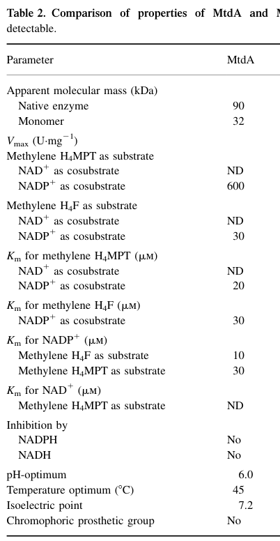

## Question

# Gene Research for Functional Annotation

## ⚠️ CRITICAL: Gene/Protein Identification Context

**BEFORE YOU BEGIN RESEARCH:** You MUST verify you are researching the CORRECT gene/protein. Gene symbols can be ambiguous, especially for less well-characterized genes from non-model organisms.

### Target Gene/Protein Identity (from UniProt):
- **UniProt Accession:** P55818
- **Protein Description:** RecName: Full=Bifunctional protein MdtA {ECO:0000305}; Includes: RecName: Full=NADP-dependent methylenetetrahydromethanopterin dehydrogenase {ECO:0000303|PubMed:9765566}; EC=1.5.1.- {ECO:0000269|PubMed:9765566}; Includes: RecName: Full=Methylenetetrahydrofolate dehydrogenase {ECO:0000303|PubMed:8144463}; EC=1.5.1.5 {ECO:0000269|PubMed:8144463, ECO:0000269|PubMed:9765566};
- **Gene Information:** Name=mtdA {ECO:0000303|PubMed:8144463}; OrderedLocusNames=MexAM1_META1p1728;
- **Organism (full):** Methylorubrum extorquens (strain ATCC 14718 / DSM 1338 / JCM 2805 / NCIMB 9133 / AM1) (Methylobacterium extorquens).
- **Protein Family:** Not specified in UniProt
- **Key Domains:** Aminoacid_DH-like_N_sf. (IPR046346); Methyl-teptahyd_DH_N. (IPR015259); Methyl-teptahyd_DH_N_sf. (IPR037089); NAD(P)-bd_dom_sf. (IPR036291); NAD-bd_H4MPT_DH. (IPR035015)

### MANDATORY VERIFICATION STEPS:

1. **Check if the gene symbol "mtdA" matches the protein description above**
2. **Verify the organism is correct:** Methylorubrum extorquens (strain ATCC 14718 / DSM 1338 / JCM 2805 / NCIMB 9133 / AM1) (Methylobacterium extorquens).
3. **Check if protein family/domains align with what you find in literature**
4. **If you find literature for a DIFFERENT gene with the same or similar symbol, STOP**

### If Gene Symbol is Ambiguous or You Cannot Find Relevant Literature:

**DO NOT PROCEED WITH RESEARCH ON A DIFFERENT GENE.** Instead:
- State clearly: "The gene symbol 'mtdA' is ambiguous or literature is limited for this specific protein"
- Explain what you found (e.g., "Found extensive literature on a different gene with the same symbol in a different organism")
- Describe the protein based ONLY on the UniProt information provided above
- Suggest that the protein function can be inferred from domain/family information

### Research Target:

Please provide a comprehensive research report on the gene **mtdA** (gene ID: mtdA, UniProt: P55818) in METEA.

The research report should be a detailed narrative explaining the function, biological processes, and localization of the gene product. Citations should be given for all claims.

You should prioritize authoritative reviews and primary scientific literature when conducting research. You can supplement
this with annotations you find in gene/protein databases, but these can be outdated or inaccurate.

We are specifically interested in the primary function of the gene - for enzymes, what reaction is catalyzed, and what is the substrate specificity? For transporters, what is the substrate? For structural proteins or adapters, what is the broader structural role? For signaling molecules, what is the role in the pathway.

We are interested in where in or outside the cell the gene product carries out its function.

We are also interested in the signaling or biochemical pathways in which the gene functions. We are less interested in broad pleiotropic effects, except where these elucidate the precise role.

Include evidence where possible. We are interested in both experimental evidence as well as inference from structure, evolution, or bioinformatic analysis. Precise studies should be prioritized over high-throughput, where available.

## Output

Question: You are an expert researcher providing comprehensive, well-cited information.

Provide detailed information focusing on:
1. Key concepts and definitions with current understanding
2. Recent developments and latest research (prioritize 2023-2024 sources)
3. Current applications and real-world implementations
4. Expert opinions and analysis from authoritative sources
5. Relevant statistics and data from recent studies

Format as a comprehensive research report with proper citations. Include URLs and publication dates where available.
Always prioritize recent, authoritative sources and provide specific citations for all major claims.

# Gene Research for Functional Annotation

## ⚠️ CRITICAL: Gene/Protein Identification Context

**BEFORE YOU BEGIN RESEARCH:** You MUST verify you are researching the CORRECT gene/protein. Gene symbols can be ambiguous, especially for less well-characterized genes from non-model organisms.

### Target Gene/Protein Identity (from UniProt):
- **UniProt Accession:** P55818
- **Protein Description:** RecName: Full=Bifunctional protein MdtA {ECO:0000305}; Includes: RecName: Full=NADP-dependent methylenetetrahydromethanopterin dehydrogenase {ECO:0000303|PubMed:9765566}; EC=1.5.1.- {ECO:0000269|PubMed:9765566}; Includes: RecName: Full=Methylenetetrahydrofolate dehydrogenase {ECO:0000303|PubMed:8144463}; EC=1.5.1.5 {ECO:0000269|PubMed:8144463, ECO:0000269|PubMed:9765566};
- **Gene Information:** Name=mtdA {ECO:0000303|PubMed:8144463}; OrderedLocusNames=MexAM1_META1p1728;
- **Organism (full):** Methylorubrum extorquens (strain ATCC 14718 / DSM 1338 / JCM 2805 / NCIMB 9133 / AM1) (Methylobacterium extorquens).
- **Protein Family:** Not specified in UniProt
- **Key Domains:** Aminoacid_DH-like_N_sf. (IPR046346); Methyl-teptahyd_DH_N. (IPR015259); Methyl-teptahyd_DH_N_sf. (IPR037089); NAD(P)-bd_dom_sf. (IPR036291); NAD-bd_H4MPT_DH. (IPR035015)

### MANDATORY VERIFICATION STEPS:

1. **Check if the gene symbol "mtdA" matches the protein description above**
2. **Verify the organism is correct:** Methylorubrum extorquens (strain ATCC 14718 / DSM 1338 / JCM 2805 / NCIMB 9133 / AM1) (Methylobacterium extorquens).
3. **Check if protein family/domains align with what you find in literature**
4. **If you find literature for a DIFFERENT gene with the same or similar symbol, STOP**

### If Gene Symbol is Ambiguous or You Cannot Find Relevant Literature:

**DO NOT PROCEED WITH RESEARCH ON A DIFFERENT GENE.** Instead:
- State clearly: "The gene symbol 'mtdA' is ambiguous or literature is limited for this specific protein"
- Explain what you found (e.g., "Found extensive literature on a different gene with the same symbol in a different organism")
- Describe the protein based ONLY on the UniProt information provided above
- Suggest that the protein function can be inferred from domain/family information

### Research Target:

Please provide a comprehensive research report on the gene **mtdA** (gene ID: mtdA, UniProt: P55818) in METEA.

The research report should be a detailed narrative explaining the function, biological processes, and localization of the gene product. Citations should be given for all claims.

You should prioritize authoritative reviews and primary scientific literature when conducting research. You can supplement
this with annotations you find in gene/protein databases, but these can be outdated or inaccurate.

We are specifically interested in the primary function of the gene - for enzymes, what reaction is catalyzed, and what is the substrate specificity? For transporters, what is the substrate? For structural proteins or adapters, what is the broader structural role? For signaling molecules, what is the role in the pathway.

We are interested in where in or outside the cell the gene product carries out its function.

We are also interested in the signaling or biochemical pathways in which the gene functions. We are less interested in broad pleiotropic effects, except where these elucidate the precise role.

Include evidence where possible. We are interested in both experimental evidence as well as inference from structure, evolution, or bioinformatic analysis. Precise studies should be prioritized over high-throughput, where available.

## Research report: **mtdA (UniProt P55818)** in *Methylorubrum extorquens* AM1 (formerly *Methylobacterium extorquens* AM1)

### 0) Target verification (critical disambiguation)
The literature retrieved here for *M. extorquens* AM1 uses **mtdA** to denote an **NADP-dependent methylene-tetrahydromethanopterin (methylene-H4MPT) dehydrogenase** that also has measurable activity on **methylene-tetrahydrofolate (methylene-H4F)** (i.e., dual C1-carrier specificity). This matches the UniProt P55818 description of a bifunctional enzyme acting on methylene-H4MPT and methylene-H4F and being NADP-dependent. In the AM1 pathway context, MtdA is consistently distinguished from MtdB (a second methylene-H4MPT dehydrogenase with different cofactor usage) and from cyclohydrolases such as **Mch** (methenyl-H4MPT cyclohydrolase) or **FchA** (methenyl-H4F cyclohydrolase). (hagemeier2000characterizationofa pages 7-8, marx2003formaldehydedetoxifyingroleof pages 1-2)

*Note on UniProt accession evidence:* within the full texts retrieved and evidence snippets, UniProt accessions are generally not printed; however, later synthetic-biology papers explicitly use the *M. extorquens* AM1 **MtdA/MeMtdA** enzyme in THF-pathway modules consistent with the UniProt mapping and description (yishai2018invivoassimilation pages 4-6, mohr2025rewiringescherichiacoli pages 1-3).

---

### 1) Key concepts and definitions (current understanding)

#### 1.1 One-carbon (C1) carrier cofactors: H4MPT vs H4F
* **Tetrahydromethanopterin (H4MPT)** and **tetrahydrofolate (H4F/THF)** are chemically related C1 carriers that traffic formaldehyde-derived carbon in different branches of methylotrophy. In *M. extorquens* AM1, formaldehyde formed from methanol oxidation enters the cytoplasm and can react with H4MPT (major detox/oxidation route) or H4F (assimilation/serine-cycle route and general C1 biosynthesis). (marx2003formaldehydedetoxifyingroleof pages 1-2)

#### 1.2 MtdA function (enzyme definition)
MtdA is best described as an **NADP+-dependent methylene-pterin dehydrogenase** with **dual substrate specificity**:
* **Primary:** methylene-H4MPT → methenyl-H4MPT with reduction of NADP+ to NADPH. (hagemeier2000characterizationofa pages 1-2)
* **Secondary (bifunctional substrate range):** methylene-H4F → methenyl-H4F (also NADP+-dependent), including reported reversibility for the H4F reaction. (hagemeier2000characterizationofa pages 7-8, marx2003formaldehydedetoxifyingroleof pages 1-2)

This dual specificity is notable because MtdA shows only minor sequence identity to “classical” bacterial/eukaryotic methylene-H4F dehydrogenases yet still catalyzes methylene-H4F oxidation with lower efficiency. (hagemeier2000characterizationofa pages 1-2)

#### 1.3 “Bifunctional” caveat: dehydrogenase vs cyclohydrolase
The AM1 primary literature analyzed here supports **bifunctionality in substrate range (H4MPT and H4F)** but does **not** provide evidence that MtdA itself has cyclohydrolase activity. Cyclohydrolase activities are attributed to distinct enzymes (e.g., methenyl-H4MPT cyclohydrolase **Mch**, methenyl-H4F cyclohydrolase **FchA**). (hagemeier2000characterizationofa pages 7-8, marx2003formaldehydedetoxifyingroleof pages 1-2)

---

### 2) Biochemical function: reactions, specificity, and quantitative parameters

#### 2.1 Reaction and cofactor usage
MtdA is **strictly NADP-dependent** and catalyzes oxidation of methylene-pterin intermediates to methenyl-pterin intermediates:
* methylene-H4MPT + NADP+ → methenyl-H4MPT + NADPH (hagemeier2000characterizationofa pages 1-2)
* methylene-H4F + NADP+ → methenyl-H4F + NADPH (hagemeier2000characterizationofa pages 7-8, marx2003formaldehydedetoxifyingroleof pages 1-2)

In methanol-grown *M. extorquens* AM1 cell extracts, methylene-H4MPT-dependent NADP reduction activity was measured at **2.6 U·mg−1**, compared with NAD reduction activity of **0.6 U·mg−1** (the NAD-dependent activity relates to the distinct enzyme MtdB rather than MtdA). (hagemeier2000characterizationofa pages 2-3)

#### 2.2 Kinetics and enzyme properties
A detailed comparison of MtdA and MtdB properties, including **Km values** and biochemical features, is reported in Hagemeier et al. (2000) and captured in the table image retrieved from that paper. (hagemeier2000characterizationofa media 5ffb354b)

Key reported quantitative properties for recombinant/purified MtdA include:
* **Specific activity:** purified enzyme ~**1100 U·mg−1**; cell extracts from overexpression in *E. coli* up to ~**370 U·mg−1**. (hagemeier2000characterizationofa pages 5-7)
* **Km (apparent, reported):** methylene-H4MPT ~**20 µM**; methylene-H4F ~**30 µM**; NADP+ ~**30 µM** (with methylene-H4MPT) and ~**10 µM** (with methylene-H4F). (hagemeier2000characterizationofa pages 5-7, hagemeier2000characterizationofa media 5ffb354b)
* **Oligomeric state:** ~**32 kDa** subunit; apparent native mass ~**90 kDa**. (hagemeier2000characterizationofa pages 5-7)
* **Optima:** pH optimum ~**6.0**; temperature optimum ~**45 °C**; no inhibition by NADPH. (hagemeier2000characterizationofa pages 5-7)

#### 2.3 Substrate specificity and efficiency
MtdA’s catalytic efficiency for methylene-H4F is reported to be **~20-fold lower** than for methylene-H4MPT, supporting a model in which H4MPT is the primary physiological substrate and H4F is a secondary substrate in vivo. (hagemeier2000characterizationofa pages 1-2)

---

### 3) Cellular localization
Direct fractionation evidence supports MtdA as a **soluble/cytosolic enzyme**. Following ultracentrifugation (150,000 × g, 1 h), the **membrane fraction lacked NAD(P)-dependent methylene-H4MPT dehydrogenase activity**, while the soluble supernatant contained the activity used for purification—consistent with MtdA not being membrane-associated. (hagemeier2000characterizationofa pages 2-3)

---

### 4) Physiological role and pathway placement in *M. extorquens* AM1

#### 4.1 Formaldehyde detoxification via the H4MPT-linked pathway
In *M. extorquens* AM1, the H4MPT-linked pathway is described as the **major formaldehyde oxidation/detoxification route** during methylotrophic growth. MtdA is one of two methylene dehydrogenases in this network (MtdA and MtdB), oxidizing methylene-H4MPT to methenyl-H4MPT as part of a route ultimately leading to formate/CO2. (marx2003formaldehydedetoxifyingroleof pages 1-2, marx2003formaldehydedetoxifyingroleof pages 6-8)

#### 4.2 Linkage to H4F-dependent biosynthesis/serine cycle
MtdA also “crosses over” to H4F metabolism by catalyzing methylene-H4F oxidation. In pathway diagrams and discussion, this provides a mechanistic link between formaldehyde processing and the H4F C1 pool used for assimilation and biosynthetic C1 chemistry (e.g., generation of formyl-H4F used in biosynthesis). (marx2003formaldehydedetoxifyingroleof pages 1-2, marx2003formaldehydedetoxifyingroleof pages 2-3)

#### 4.3 Genetic essentiality / indispensability (AM1)
Both Hagemeier et al. (2000) and Marx et al. (2003) report that **null mutants in mtdA could not be obtained** (in backgrounds where succinate selection was used), supporting that mtdA is likely essential under tested conditions. (hagemeier2000characterizationofa pages 7-8, marx2003formaldehydedetoxifyingroleof pages 2-3)

#### 4.4 Overexpression phenotype and physiological limitation
Marx et al. (2003) overexpressed mtdA ~**7.4-fold** relative to wild type. This substantially reduced methanol sensitivity but **did not restore growth on methanol** in the tested context, leading to the interpretation that MtdA can support only **moderate formaldehyde flux** when the other dehydrogenase (MtdB) is absent, and that NADP dependence may constrain in vivo capacity. (marx2003formaldehydedetoxifyingroleof pages 6-8)

---

### 5) Recent developments (prioritizing 2023–2024) and emerging research directions

Although direct 2023–2024 studies focusing specifically on AM1 mtdA biochemistry are limited in the retrieved set, recent work strongly emphasizes **deploying the THF-pathway module containing MtdA as a portable C1-assimilation tool**.

#### 5.1 2024: “Serine Shunt” as a new-to-nature formate reduction route (application of MeMtdA)
A 2024 bioRxiv study proposes and demonstrates a **Serine Shunt** that converts **formate → formaldehyde in vivo** via an engineered route in *E. coli*. Critically, its Module 1 (M1) uses *Methylorubrum extorquens* enzymes **MeFtfL (formate-THF ligase), MeFch (methenyl-THF cyclohydrolase), and MeMtdA (methylene-THF dehydrogenase)** to convert formate into **methylene-THF** (consuming ATP and NADPH), which is then transferred to glycine to form serine. Module 2 cleaves serine into formaldehyde and glycine, and formaldehyde production is validated using a **GFP-based formaldehyde sensor** (signal depends on co-expression of both modules). (schann2024theserineshunt pages 8-13)

This work positions MtdA as an enabling enzyme for “wiring” formate-derived C1 units into central metabolites in a genetically tractable host, relevant for sustainable C1 biomanufacturing concepts. (schann2024theserineshunt pages 8-13)

#### 5.2 2024: Intersections between alternative substrates and formaldehyde/THF chemistry in *Methylorubrum*
A 2024 *Applied and Environmental Microbiology* study shows that glycine betaine catabolism in *Methylorubrum extorquens* PA1 can be activated by suppressor mutations and that this catabolism **generates formaldehyde**, directly intersecting methylotrophic metabolism. The paper also notes that demethylation reactions can yield either formaldehyde or methylene-THF (enzyme-dependent) and references THF-linked detoxification possibilities in some bacteria. (hying2024glycinebetainemetabolism pages 1-3)

#### 5.3 2023 perspective: formaldehyde toxicity remains a central constraint
A 2023 review on CO2-derived feedstocks and biomanufacturing highlights **formaldehyde toxicity** as a major barrier in aerobic methylotroph engineering (including *Methylorubrum/Methylobacterium* platforms) and contrasts this with anaerobic Wood–Ljungdahl pathway assimilation that avoids formaldehyde as a free intermediate. (kurt2023perspectivesforusinga pages 16-17)

---

### 6) Current applications and real-world implementations

#### 6.1 Synthetic biology: THF-module transfer for formate-derived methyl groups
A 2025 peer-reviewed study demonstrates the use of the *M. extorquens* THF-assimilation module (MexFTFL, MexFCH, MexMTDA) to channel formate carbon into **methylene-H4F** for downstream biosynthesis, specifically to supply methyl groups for **SAM-dependent methyltransferases** in *E. coli*. Reported quantitative outcomes include:
* **51–81%** 13C labeling in methylated products upon feeding labeled formate. (mohr2025rewiringescherichiacoli pages 1-3)
* In an engineered C1-auxotrophic strain, optimizing formate concentration **doubled conversion rate** and achieved **>70%** formate-derived methyl groups. (mohr2025rewiringescherichiacoli pages 1-3)

These data represent a concrete engineered implementation of the MtdA-containing module as a C1-unit generator for biocatalysis/whole-cell synthesis. (mohr2025rewiringescherichiacoli pages 1-3)

#### 6.2 Methylotroph engineering for chemicals (context)
A 2024 *Microbial Cell Factories* study engineered *Methylorubrum extorquens* (TK 0001) for methanol-based glycolic acid production using modeling and redox/central-metabolism interventions; the excerpted sections do not discuss MtdA specifically, but illustrate continued momentum for deploying methylotrophs as production hosts where formaldehyde handling and C1 flux balancing are recurring constraints. (dietz2024anovelengineered pages 1-2, dietz2024anovelengineered pages 5-6)

---

### 7) Expert synthesis and interpretation (authoritative analysis grounded in evidence)

1. **Physiological primary role:** In AM1, MtdA should be viewed primarily as an **H4MPT-pathway dehydrogenase** contributing to **formaldehyde oxidation/detoxification** and redox generation (NADPH), rather than as a dedicated H4F dehydrogenase. This is supported by the large activity difference and the reported ~20-fold lower catalytic efficiency on H4F compared with H4MPT. (hagemeier2000characterizationofa pages 1-2, marx2003formaldehydedetoxifyingroleof pages 1-2)

2. **Secondary/biosynthetic role via H4F:** Despite lower efficiency on H4F, MtdA may be important because it can provide **methenyl-/formyl-H4F** for essential biosynthetic pathways (purine and other C1-dependent biosynthesis), consistent with observations that **mtdA mutants could not be obtained** and that MtdA may be the only enzyme catalyzing certain H4F interconversions in AM1. (hagemeier2000characterizationofa pages 7-8, marx2003formaldehydedetoxifyingroleof pages 2-3)

3. **Engineering significance:** The fact that MtdA is **soluble**, expresses well heterologously, and functions as part of an effective THF C1 module explains why it is repeatedly repurposed for engineered formatotrophy or C1-to-methyl-group conversion. (hagemeier2000characterizationofa pages 5-7, hagemeier2000characterizationofa pages 2-3, mohr2025rewiringescherichiacoli pages 1-3)

---

### 8) Evidence summary table (with quantitative data)
The following evidence map consolidates the key functional-annotation findings, experimental contexts, and quantitative values.

| Evidence type | Finding (with quantitative values) | Experimental context | Source (paper + year + DOI URL) |
|---|---|---|---|
| Target identity / core annotation | **mtdA** in *Methylorubrum extorquens* AM1 encodes **MtdA**, a **strictly NADP-dependent methylene-H4MPT dehydrogenase** that also catalyzes oxidation of **methylene-H4F**; later literature uses the same enzyme in THF-pathway engineering and identifies the AM1 enzyme as **MtdA / Me-MtdA** consistent with UniProt **P55818** annotation (hagemeier2000characterizationofa pages 7-8, marx2003formaldehydedetoxifyingroleof pages 1-2, yishai2018invivoassimilation pages 4-6) | Primary biochemical genetics in AM1; later heterologous pathway reconstruction in *E. coli* | Hagemeier et al., 2000, Eur J Biochem, https://doi.org/10.1046/j.1432-1327.2000.01413.x; Marx et al., 2003, J Bacteriol, https://doi.org/10.1128/jb.185.23.7160-7168.2003; Yishai et al., 2018, ACS Synth Biol, https://doi.org/10.1021/acssynbio.8b00131 |
| Reaction(s) catalyzed | Catalyzes dehydrogenation of **methylene-H4MPT → methenyl-H4MPT** with **NADP+** reduction; also catalyzes **methylene-H4F → methenyl-H4F** with NADP+. Reversible dehydrogenation of methylene-H4F is specifically noted; no cyclohydrolase activity is assigned to MtdA itself (cyclohydrolase is **FchA/Mch** in adjacent pathway steps) (hagemeier2000characterizationofa pages 7-8, marx2003formaldehydedetoxifyingroleof pages 1-2, hagemeier2000characterizationofa pages 1-2) | Enzyme purified from recombinant expression and interpreted in AM1 C1 metabolism pathway maps | Hagemeier et al., 2000, https://doi.org/10.1046/j.1432-1327.2000.01413.x; Marx et al., 2003, https://doi.org/10.1128/jb.185.23.7160-7168.2003 |
| Substrate specificity | Dual pterin specificity: best substrate is **methylene-H4MPT**; **methylene-H4F** is also accepted, but catalytic efficiency for methylene-H4F is reported to be **~20-fold lower** than for methylene-H4MPT (hagemeier2000characterizationofa pages 1-2) | Comparative biochemical characterization of recombinant/purified MtdA | Hagemeier et al., 2000, https://doi.org/10.1046/j.1432-1327.2000.01413.x |
| Cofactor specificity | **Strictly NADP dependent**; cell extracts of methanol-grown AM1 had **2.6 U/mg** NADP-dependent methylene-H4MPT dehydrogenase activity versus **0.6 U/mg** NAD-dependent activity, the latter attributable to MtdB rather than MtdA (marx2003formaldehydedetoxifyingroleof pages 1-2, hagemeier2000characterizationofa pages 2-3) | Native AM1 cell extracts grown on methanol; chromatographic separation of NADP- vs NAD-dependent activities | Marx et al., 2003, https://doi.org/10.1128/jb.185.23.7160-7168.2003; Hagemeier et al., 2000, https://doi.org/10.1046/j.1432-1327.2000.01413.x |
| Specific activity / expression | Recombinant overexpression in *E. coli* yielded extract activities up to **~370 U/mg**; purified MtdA showed specific activity **~1100 U/mg** with **44% purification yield**; ~**20 mg** purified enzyme obtained from ~**2.5 g** wet cells (hagemeier2000characterizationofa pages 5-7) | Heterologous expression from cloned **mtdA** in *E. coli* and purification of recombinant protein | Hagemeier et al., 2000, https://doi.org/10.1046/j.1432-1327.2000.01413.x |
| Kinetic parameters | Reported apparent **Km** values for MtdA include **~20 µM** for methylene-H4MPT, **~30 µM** for methylene-H4F, **~30 µM** for NADP+ with methylene-H4MPT, and **~10 µM** for NADP+ with methylene-H4F; lower NADP+ Km values support MtdA as the main methylene-H4MPT-oxidizing enzyme (hagemeier2000characterizationofa pages 5-7, hagemeier2000characterizationofa pages 7-8, hagemeier2000characterizationofa media 5ffb354b) | Kinetic comparison table for purified MtdA and MtdB | Hagemeier et al., 2000, https://doi.org/10.1046/j.1432-1327.2000.01413.x |
| Oligomeric state / size | MtdA subunit mass reported as **32 kDa**; apparent native molecular mass **~90 kDa**, consistent with a multimeric soluble enzyme (hagemeier2000characterizationofa pages 1-2, hagemeier2000characterizationofa pages 5-7) | Purified protein characterization | Hagemeier et al., 2000, https://doi.org/10.1046/j.1432-1327.2000.01413.x |
| Biochemical optima / inhibition | **pH optimum ~6.0**, **temperature optimum ~45°C**, **isoelectric point ~7.2**; **no inhibition by NADPH** reported (hagemeier2000characterizationofa pages 5-7) | Purified recombinant MtdA biochemical characterization | Hagemeier et al., 2000, https://doi.org/10.1046/j.1432-1327.2000.01413.x |
| Localization evidence | Methylene-H4MPT dehydrogenase activity was recovered from the **ultracentrifugation supernatant**; the **membrane fraction lacked NAD(P)-dependent methylene-H4MPT dehydrogenase activity**, supporting **soluble/cytosolic localization** for MtdA (hagemeier2000characterizationofa pages 2-3, hagemeier2000characterizationofa pages 5-7, hagemeier2000characterizationofa pages 1-2) | Native AM1 extract fractionation and chromatographic purification from soluble fraction | Hagemeier et al., 2000, https://doi.org/10.1046/j.1432-1327.2000.01413.x |
| Pathway context | MtdA functions in the **H4MPT-linked formaldehyde oxidation pathway** and also interfaces with the **H4F/serine-cycle branch** by generating methenyl-/formyl-H4F for biosynthetic C1 metabolism; pathway diagrams label it as **NADP-dependent methylene-H4F/methylene-H4MPT dehydrogenase** (marx2003formaldehydedetoxifyingroleof pages 1-2, marx2003formaldehydedetoxifyingroleof pages 2-3) | Formaldehyde oxidation/detoxification model in methylotrophic growth | Marx et al., 2003, https://doi.org/10.1128/jb.185.23.7160-7168.2003 |
| Essentiality / genetics | **No null mutants** in **mtdA** could be obtained; reduced-activity mutants could not grow on methanol, indicating likely **essentiality** for central C1 metabolism and/or formyl-H4F supply (hagemeier2000characterizationofa pages 7-8, marx2003formaldehydedetoxifyingroleof pages 2-3) | Gene disruption / allelic exchange studies in AM1 | Hagemeier et al., 2000, https://doi.org/10.1046/j.1432-1327.2000.01413.x; Marx et al., 2003, https://doi.org/10.1128/jb.185.23.7160-7168.2003 |
| Overexpression phenotype | **mtdA overexpression ~7.4-fold** above wild type reduced methanol sensitivity but **did not restore growth on methanol** in the absence of MtdB, implying MtdA can support only **moderate formaldehyde flux** and may be limited in vivo by its reliance on **NADP** rather than NAD (marx2003formaldehydedetoxifyingroleof pages 6-8) | Physiological complementation/overexpression analysis in AM1 H4MPT-pathway mutants | Marx et al., 2003, https://doi.org/10.1128/jb.185.23.7160-7168.2003 |
| Modern applications / real-world implementation | AM1 **MtdA** has been repurposed in engineered THF-based C1-assimilation modules: in synthetic reductive glycine/formate-assimilation systems, **M. extorquens** enzymes **FTL/Fch/MtdA** enable reduction of formyl-H4F to methylene-H4F and support assembly of biomass precursors or methyl donors from formate/CO2 (yishai2018invivoassimilation pages 4-6, mohr2025rewiringescherichiacoli pages 1-3) | Heterologous pathway engineering in *E. coli* and other synthetic C1-assimilation platforms | Yishai et al., 2018, https://doi.org/10.1021/acssynbio.8b00131; Mohr et al., 2025, https://doi.org/10.1186/s12934-025-02674-4 |

*Table: This table compiles key functional-annotation evidence for Methylorubrum extorquens AM1 MtdA, including biochemical activity, specificity, kinetics, localization, and physiological relevance. It is useful as a compact evidence map linking the UniProt annotation to primary literature and recent applications.*

---

### 9) Key sources (publication date + URL)
* Hagemeier CH et al. **2000-06**. *Eur J Biochem.* “Characterization of a second methylene tetrahydromethanopterin dehydrogenase from *Methylobacterium extorquens* AM1.” https://doi.org/10.1046/j.1432-1327.2000.01413.x (hagemeier2000characterizationofa pages 5-7, hagemeier2000characterizationofa pages 2-3, hagemeier2000characterizationofa media 5ffb354b)
* Marx CJ et al. **2003-12**. *J Bacteriol.* “Formaldehyde-detoxifying role of the tetrahydromethanopterin-linked pathway in *M. extorquens* AM1.” https://doi.org/10.1128/jb.185.23.7160-7168.2003 (marx2003formaldehydedetoxifyingroleof pages 1-2, marx2003formaldehydedetoxifyingroleof pages 6-8)
* Kurt E et al. **2023-11**. *Bioengineering.* “Perspectives for Using CO2 as a Feedstock for Biomanufacturing of Fuels and Chemicals.” https://doi.org/10.3390/bioengineering10121357 (kurt2023perspectivesforusinga pages 16-17)
* Hying ZT et al. **2024-07**. *Appl Environ Microbiol.* “Glycine betaine metabolism is enabled in *Methylorubrum extorquens* PA1…” https://doi.org/10.1128/aem.02090-23 (hying2024glycinebetainemetabolism pages 1-3)
* Schann K, Wenk S. **2024-07**. *bioRxiv.* “The Serine Shunt enables formate conversion to formaldehyde in vivo.” https://doi.org/10.1101/2024.07.31.605843 (schann2024theserineshunt pages 8-13)
* Mohr MKF et al. **2025-03**. *Microbial Cell Factories.* “Rewiring *E. coli* to transform formate into methyl groups.” https://doi.org/10.1186/s12934-025-02674-4 (mohr2025rewiringescherichiacoli pages 1-3)

References

1. (hagemeier2000characterizationofa pages 7-8): Christoph H. Hagemeier, Ludmila Chistoserdova, Mary E. Lidstrom, Rudolf K. Thauer, and Julia A. Vorholt. Characterization of a second methylene tetrahydromethanopterin dehydrogenase from methylobacterium extorquens am1. European journal of biochemistry, 267 12:3762-9, Jun 2000. URL: https://doi.org/10.1046/j.1432-1327.2000.01413.x, doi:10.1046/j.1432-1327.2000.01413.x. This article has 85 citations.

2. (marx2003formaldehydedetoxifyingroleof pages 1-2): Christopher J. Marx, Ludmila Chistoserdova, and Mary E. Lidstrom. Formaldehyde-detoxifying role of thetetrahydromethanopterin-linked pathway in methylobacteriumextorquensam1. Journal of Bacteriology, 185:7160-7168, Dec 2003. URL: https://doi.org/10.1128/jb.185.23.7160-7168.2003, doi:10.1128/jb.185.23.7160-7168.2003. This article has 149 citations and is from a peer-reviewed journal.

3. (yishai2018invivoassimilation pages 4-6): Oren Yishai, Madeleine Bouzon, Volker Döring, and Arren Bar-Even. In vivo assimilation of one-carbon via a synthetic reductive glycine pathway in escherichia coli. ACS synthetic biology, 7 9:2023-2028, May 2018. URL: https://doi.org/10.1021/acssynbio.8b00131, doi:10.1021/acssynbio.8b00131. This article has 203 citations and is from a domain leading peer-reviewed journal.

4. (mohr2025rewiringescherichiacoli pages 1-3): Michael K. F. Mohr, Ari Satanowski, Steffen N. Lindner, Tobias J. Erb, and Jennifer N. Andexer. Rewiring escherichia coli to transform formate into methyl groups. Microbial Cell Factories, Mar 2025. URL: https://doi.org/10.1186/s12934-025-02674-4, doi:10.1186/s12934-025-02674-4. This article has 8 citations and is from a peer-reviewed journal.

5. (hagemeier2000characterizationofa pages 1-2): Christoph H. Hagemeier, Ludmila Chistoserdova, Mary E. Lidstrom, Rudolf K. Thauer, and Julia A. Vorholt. Characterization of a second methylene tetrahydromethanopterin dehydrogenase from methylobacterium extorquens am1. European journal of biochemistry, 267 12:3762-9, Jun 2000. URL: https://doi.org/10.1046/j.1432-1327.2000.01413.x, doi:10.1046/j.1432-1327.2000.01413.x. This article has 85 citations.

6. (hagemeier2000characterizationofa pages 2-3): Christoph H. Hagemeier, Ludmila Chistoserdova, Mary E. Lidstrom, Rudolf K. Thauer, and Julia A. Vorholt. Characterization of a second methylene tetrahydromethanopterin dehydrogenase from methylobacterium extorquens am1. European journal of biochemistry, 267 12:3762-9, Jun 2000. URL: https://doi.org/10.1046/j.1432-1327.2000.01413.x, doi:10.1046/j.1432-1327.2000.01413.x. This article has 85 citations.

7. (hagemeier2000characterizationofa media 5ffb354b): Christoph H. Hagemeier, Ludmila Chistoserdova, Mary E. Lidstrom, Rudolf K. Thauer, and Julia A. Vorholt. Characterization of a second methylene tetrahydromethanopterin dehydrogenase from methylobacterium extorquens am1. European journal of biochemistry, 267 12:3762-9, Jun 2000. URL: https://doi.org/10.1046/j.1432-1327.2000.01413.x, doi:10.1046/j.1432-1327.2000.01413.x. This article has 85 citations.

8. (hagemeier2000characterizationofa pages 5-7): Christoph H. Hagemeier, Ludmila Chistoserdova, Mary E. Lidstrom, Rudolf K. Thauer, and Julia A. Vorholt. Characterization of a second methylene tetrahydromethanopterin dehydrogenase from methylobacterium extorquens am1. European journal of biochemistry, 267 12:3762-9, Jun 2000. URL: https://doi.org/10.1046/j.1432-1327.2000.01413.x, doi:10.1046/j.1432-1327.2000.01413.x. This article has 85 citations.

9. (marx2003formaldehydedetoxifyingroleof pages 6-8): Christopher J. Marx, Ludmila Chistoserdova, and Mary E. Lidstrom. Formaldehyde-detoxifying role of thetetrahydromethanopterin-linked pathway in methylobacteriumextorquensam1. Journal of Bacteriology, 185:7160-7168, Dec 2003. URL: https://doi.org/10.1128/jb.185.23.7160-7168.2003, doi:10.1128/jb.185.23.7160-7168.2003. This article has 149 citations and is from a peer-reviewed journal.

10. (marx2003formaldehydedetoxifyingroleof pages 2-3): Christopher J. Marx, Ludmila Chistoserdova, and Mary E. Lidstrom. Formaldehyde-detoxifying role of thetetrahydromethanopterin-linked pathway in methylobacteriumextorquensam1. Journal of Bacteriology, 185:7160-7168, Dec 2003. URL: https://doi.org/10.1128/jb.185.23.7160-7168.2003, doi:10.1128/jb.185.23.7160-7168.2003. This article has 149 citations and is from a peer-reviewed journal.

11. (schann2024theserineshunt pages 8-13): Karin Schann and Sebastian Wenk. The serine shunt enables formate conversion to formaldehyde in vivo. bioRxiv, Jul 2024. URL: https://doi.org/10.1101/2024.07.31.605843, doi:10.1101/2024.07.31.605843. This article has 4 citations.

12. (hying2024glycinebetainemetabolism pages 1-3): Zachary T. Hying, Tyler J. Miller, Chin Yi Loh, and Jannell V. Bazurto. Glycine betaine metabolism is enabled in <i>methylorubrum extorquens</i> pa1 by alterations to dimethylglycine dehydrogenase. Applied and Environmental Microbiology, Jul 2024. URL: https://doi.org/10.1128/aem.02090-23, doi:10.1128/aem.02090-23. This article has 6 citations and is from a peer-reviewed journal.

13. (kurt2023perspectivesforusinga pages 16-17): Elif Kurt, Jiansong Qin, Alexandria Williams, Youbo Zhao, and Dongming Xie. Perspectives for using co2 as a feedstock for biomanufacturing of fuels and chemicals. Bioengineering, 10:1357, Nov 2023. URL: https://doi.org/10.3390/bioengineering10121357, doi:10.3390/bioengineering10121357. This article has 39 citations.

14. (dietz2024anovelengineered pages 1-2): Katharina Dietz, Carina Sagstetter, Melanie Speck, Arne Roth, Steffen Klamt, and Jonathan Thomas Fabarius. A novel engineered strain of methylorubrum extorquens for methylotrophic production of glycolic acid. Microbial Cell Factories, Dec 2024. URL: https://doi.org/10.1186/s12934-024-02583-y, doi:10.1186/s12934-024-02583-y. This article has 10 citations and is from a peer-reviewed journal.

15. (dietz2024anovelengineered pages 5-6): Katharina Dietz, Carina Sagstetter, Melanie Speck, Arne Roth, Steffen Klamt, and Jonathan Thomas Fabarius. A novel engineered strain of methylorubrum extorquens for methylotrophic production of glycolic acid. Microbial Cell Factories, Dec 2024. URL: https://doi.org/10.1186/s12934-024-02583-y, doi:10.1186/s12934-024-02583-y. This article has 10 citations and is from a peer-reviewed journal.

## Artifacts

- [Edison artifact artifact-00](mtdA-deep-research-falcon_artifacts/artifact-00.md)

## Citations

1. marx2003formaldehydedetoxifyingroleof pages 1-2
2. hagemeier2000characterizationofa pages 1-2
3. hagemeier2000characterizationofa pages 2-3
4. hagemeier2000characterizationofa pages 5-7
5. marx2003formaldehydedetoxifyingroleof pages 6-8
6. schann2024theserineshunt pages 8-13
7. hying2024glycinebetainemetabolism pages 1-3
8. kurt2023perspectivesforusinga pages 16-17
9. mohr2025rewiringescherichiacoli pages 1-3
10. hagemeier2000characterizationofa pages 7-8
11. yishai2018invivoassimilation pages 4-6
12. marx2003formaldehydedetoxifyingroleof pages 2-3
13. dietz2024anovelengineered pages 1-2
14. dietz2024anovelengineered pages 5-6
15. https://doi.org/10.1046/j.1432-1327.2000.01413.x;
16. https://doi.org/10.1128/jb.185.23.7160-7168.2003;
17. https://doi.org/10.1021/acssynbio.8b00131
18. https://doi.org/10.1128/jb.185.23.7160-7168.2003
19. https://doi.org/10.1046/j.1432-1327.2000.01413.x
20. https://doi.org/10.1021/acssynbio.8b00131;
21. https://doi.org/10.1186/s12934-025-02674-4
22. https://doi.org/10.3390/bioengineering10121357
23. https://doi.org/10.1128/aem.02090-23
24. https://doi.org/10.1101/2024.07.31.605843
25. https://doi.org/10.1046/j.1432-1327.2000.01413.x,
26. https://doi.org/10.1128/jb.185.23.7160-7168.2003,
27. https://doi.org/10.1021/acssynbio.8b00131,
28. https://doi.org/10.1186/s12934-025-02674-4,
29. https://doi.org/10.1101/2024.07.31.605843,
30. https://doi.org/10.1128/aem.02090-23,
31. https://doi.org/10.3390/bioengineering10121357,
32. https://doi.org/10.1186/s12934-024-02583-y,