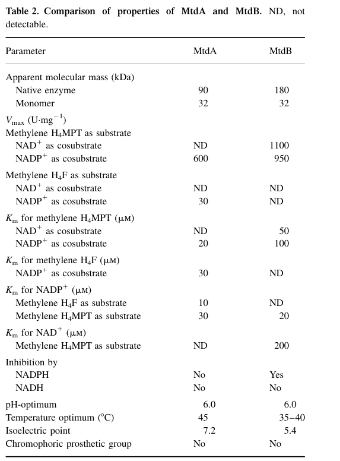

## Question

# Gene Research for Functional Annotation

## ⚠️ CRITICAL: Gene/Protein Identification Context

**BEFORE YOU BEGIN RESEARCH:** You MUST verify you are researching the CORRECT gene/protein. Gene symbols can be ambiguous, especially for less well-characterized genes from non-model organisms.

### Target Gene/Protein Identity (from UniProt):
- **UniProt Accession:** O85012
- **Protein Description:** RecName: Full=NAD(P)-dependent methylenetetrahydromethanopterin dehydrogenase; EC=1.5.1.-;
- **Gene Information:** Name=mtdB; OrderedLocusNames=MexAM1_META1p1761;
- **Organism (full):** Methylorubrum extorquens (strain ATCC 14718 / DSM 1338 / JCM 2805 / NCIMB 9133 / AM1) (Methylobacterium extorquens).
- **Protein Family:** To M.extorquens MtdA. .
- **Key Domains:** Aminoacid_DH-like_N_sf. (IPR046346); Methyl-teptahyd_DH_N. (IPR015259); Methyl-teptahyd_DH_N_sf. (IPR037089); NAD(P)-bd_dom_sf. (IPR036291); NAD-bd_H4MPT_DH. (IPR035015)

### MANDATORY VERIFICATION STEPS:

1. **Check if the gene symbol "mtdB" matches the protein description above**
2. **Verify the organism is correct:** Methylorubrum extorquens (strain ATCC 14718 / DSM 1338 / JCM 2805 / NCIMB 9133 / AM1) (Methylobacterium extorquens).
3. **Check if protein family/domains align with what you find in literature**
4. **If you find literature for a DIFFERENT gene with the same or similar symbol, STOP**

### If Gene Symbol is Ambiguous or You Cannot Find Relevant Literature:

**DO NOT PROCEED WITH RESEARCH ON A DIFFERENT GENE.** Instead:
- State clearly: "The gene symbol 'mtdB' is ambiguous or literature is limited for this specific protein"
- Explain what you found (e.g., "Found extensive literature on a different gene with the same symbol in a different organism")
- Describe the protein based ONLY on the UniProt information provided above
- Suggest that the protein function can be inferred from domain/family information

### Research Target:

Please provide a comprehensive research report on the gene **mtdB** (gene ID: mtdB, UniProt: O85012) in METEA.

The research report should be a detailed narrative explaining the function, biological processes, and localization of the gene product. Citations should be given for all claims.

You should prioritize authoritative reviews and primary scientific literature when conducting research. You can supplement
this with annotations you find in gene/protein databases, but these can be outdated or inaccurate.

We are specifically interested in the primary function of the gene - for enzymes, what reaction is catalyzed, and what is the substrate specificity? For transporters, what is the substrate? For structural proteins or adapters, what is the broader structural role? For signaling molecules, what is the role in the pathway.

We are interested in where in or outside the cell the gene product carries out its function.

We are also interested in the signaling or biochemical pathways in which the gene functions. We are less interested in broad pleiotropic effects, except where these elucidate the precise role.

Include evidence where possible. We are interested in both experimental evidence as well as inference from structure, evolution, or bioinformatic analysis. Precise studies should be prioritized over high-throughput, where available.

## Output

Question: You are an expert researcher providing comprehensive, well-cited information.

Provide detailed information focusing on:
1. Key concepts and definitions with current understanding
2. Recent developments and latest research (prioritize 2023-2024 sources)
3. Current applications and real-world implementations
4. Expert opinions and analysis from authoritative sources
5. Relevant statistics and data from recent studies

Format as a comprehensive research report with proper citations. Include URLs and publication dates where available.
Always prioritize recent, authoritative sources and provide specific citations for all major claims.

# Gene Research for Functional Annotation

## ⚠️ CRITICAL: Gene/Protein Identification Context

**BEFORE YOU BEGIN RESEARCH:** You MUST verify you are researching the CORRECT gene/protein. Gene symbols can be ambiguous, especially for less well-characterized genes from non-model organisms.

### Target Gene/Protein Identity (from UniProt):
- **UniProt Accession:** O85012
- **Protein Description:** RecName: Full=NAD(P)-dependent methylenetetrahydromethanopterin dehydrogenase; EC=1.5.1.-;
- **Gene Information:** Name=mtdB; OrderedLocusNames=MexAM1_META1p1761;
- **Organism (full):** Methylorubrum extorquens (strain ATCC 14718 / DSM 1338 / JCM 2805 / NCIMB 9133 / AM1) (Methylobacterium extorquens).
- **Protein Family:** To M.extorquens MtdA. .
- **Key Domains:** Aminoacid_DH-like_N_sf. (IPR046346); Methyl-teptahyd_DH_N. (IPR015259); Methyl-teptahyd_DH_N_sf. (IPR037089); NAD(P)-bd_dom_sf. (IPR036291); NAD-bd_H4MPT_DH. (IPR035015)

### MANDATORY VERIFICATION STEPS:

1. **Check if the gene symbol "mtdB" matches the protein description above**
2. **Verify the organism is correct:** Methylorubrum extorquens (strain ATCC 14718 / DSM 1338 / JCM 2805 / NCIMB 9133 / AM1) (Methylobacterium extorquens).
3. **Check if protein family/domains align with what you find in literature**
4. **If you find literature for a DIFFERENT gene with the same or similar symbol, STOP**

### If Gene Symbol is Ambiguous or You Cannot Find Relevant Literature:

**DO NOT PROCEED WITH RESEARCH ON A DIFFERENT GENE.** Instead:
- State clearly: "The gene symbol 'mtdB' is ambiguous or literature is limited for this specific protein"
- Explain what you found (e.g., "Found extensive literature on a different gene with the same symbol in a different organism")
- Describe the protein based ONLY on the UniProt information provided above
- Suggest that the protein function can be inferred from domain/family information

### Research Target:

Please provide a comprehensive research report on the gene **mtdB** (gene ID: mtdB, UniProt: O85012) in METEA.

The research report should be a detailed narrative explaining the function, biological processes, and localization of the gene product. Citations should be given for all claims.

You should prioritize authoritative reviews and primary scientific literature when conducting research. You can supplement
this with annotations you find in gene/protein databases, but these can be outdated or inaccurate.

We are specifically interested in the primary function of the gene - for enzymes, what reaction is catalyzed, and what is the substrate specificity? For transporters, what is the substrate? For structural proteins or adapters, what is the broader structural role? For signaling molecules, what is the role in the pathway.

We are interested in where in or outside the cell the gene product carries out its function.

We are also interested in the signaling or biochemical pathways in which the gene functions. We are less interested in broad pleiotropic effects, except where these elucidate the precise role.

Include evidence where possible. We are interested in both experimental evidence as well as inference from structure, evolution, or bioinformatic analysis. Precise studies should be prioritized over high-throughput, where available.

## Research report: **mtdB** (UniProt **O85012**) — NAD(P)-dependent methylene‑tetrahydromethanopterin dehydrogenase in *Methylorubrum extorquens* AM1

### 0) Scope, gene identity verification, and ambiguity check
This report targets **UniProt O85012**, annotated as **NAD(P)-dependent methylenetetrahydromethanopterin dehydrogenase** (EC 1.5.1.-) encoded by **mtdB** in *Methylorubrum extorquens* strain AM1 (formerly *Methylobacterium extorquens* AM1). Primary literature in this exact organism/strain identifies **mtdB** (historically described as **orfX**) as a “second” methylene‑H4MPT dehydrogenase distinct from **mtdA** and catalyzing the same H4MPT-linked oxidation step but with different cofactor usage and in vivo role. (hagemeier2000characterizationofa pages 1-2, martinezgomez2013elucidationofthe pages 1-2)

**Important limitation:** The provided ordered locus name (**MexAM1_META1p1761**) did not appear in the retrieved full-text corpus, so an explicit locus-tag ↔ UniProt accession mapping could not be independently confirmed here; the functional identity of **mtdB/MtdB** in AM1 is, however, supported by multiple AM1-specific primary studies. (hagemeier2000characterizationofa pages 1-2, martinezgomez2013elucidationofthe pages 1-2)

### 1) Key concepts and definitions (current understanding)
#### 1.1 H4MPT-dependent formaldehyde oxidation in facultative methylotrophs
In serine-cycle methylotrophs such as *Methylorubrum extorquens*, formaldehyde generated from methanol (or other methylated substrates) is processed through a **tetrahydromethanopterin (H4MPT)-linked pathway** that channels formaldehyde into **formate** and connects to assimilation via H4F-linked one-carbon chemistry. Reviews emphasize that the H4MPT-mediated route (formaldehyde → formate → methylene-H4F) can dominate assimilatory flux in *M. extorquens* compared with direct spontaneous condensation of formaldehyde with H4F. (klein2022unravellingformaldehydemetabolism pages 11-12, klein2022unravellingformaldehydemetabolism pages 12-14)

#### 1.2 The Mtd (methylene-H4MPT dehydrogenase) step
**Mtd enzymes** catalyze the oxidation of **methylene‑H4MPT (or methylene‑dH4MPT)** to **methenyl‑H4MPT**, using **NAD(P)+** as electron acceptor. In AM1, two enzymes are emphasized:
- **MtdA**: primarily **NADP-specific** and bifunctional in that it can also participate in H4F-linked reactions (methylene-H4F dehydrogenase activity). (martinezgomez2013elucidationofthe pages 5-6, martinezgomez2013elucidationofthe pages 1-2)
- **MtdB** (this report): an “alternative”/second methylene‑H4MPT dehydrogenase that **uses both NAD+ and NADP+** and **does not act on methylene-H4F**. (hagemeier2000characterizationofa pages 3-5, hagemeier2000characterizationofa pages 1-2, martinezgomez2013elucidationofthe pages 5-6)

### 2) Primary molecular function of MtdB (reaction, substrates, specificity)
#### 2.1 Reaction catalyzed
Biochemical characterization of purified AM1 MtdB established that it catalyzes:

**methylene‑H4MPT + NAD(P)+ → methenyl‑H4MPT + NAD(P)H**

with **both NAD+ and NADP+ serving as cosubstrates** in vitro. (hagemeier2000characterizationofa pages 1-2, hagemeier2000characterizationofa pages 3-5)

#### 2.2 Substrate specificity (H4MPT vs H4F)
MtdB was reported to **not** catalyze the dehydrogenation of **methylene‑H4F** (tetrahydrofolate-linked), distinguishing it from MtdA’s bifunctionality and supporting a dedicated role in the H4MPT-linked branch. (hagemeier2000characterizationofa pages 3-5, hagemeier2000characterizationofa pages 1-2, martinezgomez2013elucidationofthe pages 1-2)

#### 2.3 Cofactor usage and kinetic parameters
Hagemeier et al. (publication date: **June 2000**; URL: https://doi.org/10.1046/j.1432-1327.2000.01413.x) reported Michaelis–Menten parameters for MtdB with methylene‑H4MPT and alternative cofactors:
- **Km(methylene‑H4MPT)** ≈ **50 µM** with NAD+ and ≈ **100 µM** with NADP+. (hagemeier2000characterizationofa pages 3-5, hagemeier2000characterizationofa pages 1-2)
- **Km(NAD+)** ≈ **200 µM**; **Km(NADP+)** ≈ **20 µM**, indicating much higher apparent affinity for NADP+ despite dual cofactor capability. (hagemeier2000characterizationofa pages 3-5, hagemeier2000characterizationofa pages 1-2)
- **Vmax** ≈ **1100 U·mg−1** (with NAD+) and ≈ **950 U·mg−1** (with NADP+) for methylene‑H4MPT oxidation. (hagemeier2000characterizationofa pages 3-5)

These values are also supported by the directly retrieved visual content (Table 2 and kinetic plots) from the same paper. (hagemeier2000characterizationofa media 861c9c56, hagemeier2000characterizationofa media 58a702a3)

#### 2.4 Inhibition behavior
NADPH was reported as a **noncompetitive inhibitor** of MtdB, whereas NADH did not inhibit the enzyme under the tested conditions. (hagemeier2000characterizationofa pages 3-5)

### 3) Cellular localization and quaternary structure
#### 3.1 Soluble (cytosolic) localization
Cell fractionation in the biochemical study indicated that NAD(P)-dependent methylene‑H4MPT dehydrogenase activity was **not found in the membrane fraction**, supporting that MtdB functions as a **soluble/cytosolic enzyme** rather than being membrane-associated. (hagemeier2000characterizationofa pages 2-3)

#### 3.2 Oligomeric state
Purified MtdB was reported as ~**32 kDa** per subunit and ~**180 kDa** native mass, consistent with a **homohexameric** enzyme complex. (hagemeier2000characterizationofa pages 3-5, hagemeier2000characterizationofa pages 5-7)

### 4) Biological role in pathways (H4MPT-linked formaldehyde oxidation) and in vivo evidence
#### 4.1 Essentiality for methanol growth and formaldehyde detoxification
Genetic evidence from AM1 shows **mtdB mutants cannot grow on methanol** but can grow on multicarbon substrates (e.g., succinate), and are **highly formaldehyde-sensitive**, implicating MtdB as a key component of formaldehyde oxidation/detoxification required for methylotrophic growth. (hagemeier2000characterizationofa pages 3-5, hagemeier2000characterizationofa pages 5-7, martinezgomez2013elucidationofthe pages 2-3)

A key experiment supporting formaldehyde toxicity as the underlying problem is that **double mutants (mtdB mxaF)** could grow on succinate in the presence of methanol, consistent with methanol oxidation (via methanol dehydrogenase, MxaF) being upstream of formaldehyde generation; removing MxaF reduces formaldehyde stress, alleviating toxicity when MtdB is absent. (hagemeier2000characterizationofa pages 5-7)

#### 4.2 MtdB is not functionally redundant with MtdA in vivo
Although MtdA and MtdB catalyze the same H4MPT-linked oxidation step in vitro, *in vivo* MtdA cannot substitute for MtdB: Martinez-Gomez et al. (publication date: **May 2013**; URL: https://doi.org/10.1128/JB.00029-13) report that **MtdA is unable to replace MtdB**, and that **overexpression of mtdA** did not restore growth on methanol in an mtdB mutant background. (martinezgomez2013elucidationofthe pages 5-6, martinezgomez2013elucidationofthe pages 6-8)

#### 4.3 Metabolite pool perturbation and pathway cross-talk mechanism
Loss of mtdB leads to accumulation of H4MPT-linked intermediates:
- **~5-fold accumulation** of **dH4MPT** and **2–3-fold increase** in **methenyl-dH4MPT** in the mtdB mutant. (martinezgomez2013elucidationofthe pages 6-8)

Importantly, the accumulated methenyl-dH4MPT can inhibit H4F-linked assimilation reactions: methenyl-dH4MPT competitively inhibited MtdA-catalyzed reduction of methenyl-H4F to methylene-H4F, with an estimated **Ki ~10−4 M** (as reported in the snippet). (martinezgomez2013elucidationofthe pages 5-6, martinezgomez2013elucidationofthe pages 1-2)

This provides a mechanistic explanation for why perturbations in the H4MPT oxidation branch (via MtdB loss or altered activity) can propagate to **flux partitioning between oxidation and assimilation** in serine-cycle methylotrophy. (martinezgomez2013elucidationofthe pages 1-2)

### 5) Recent developments (2023–2024 prioritized)
#### 5.1 2024: intersection with plant-derived glycine betaine metabolism (formaldehyde generation)
Hying et al. (publication date: **July 2024**; URL: https://doi.org/10.1128/aem.02090-23) studied how *Methylorubrum extorquens* PA1 can acquire the ability to utilize **glycine betaine (GB)**, a plant-derived compound whose degradation generates **formaldehyde**. They observed:
- Elevated **formaldehyde** in culture supernatants during growth on GB compared with pyruvate (measured by a colorimetric assay; significance reported in the figure-based result). (hying2024glycinebetainemetabolism pages 6-9)
- Increased expression (induction) of **C1 metabolism genes including fae and mtdB** during GB utilization relative to non-methylotrophic growth conditions, consistent with engagement of the **H4MPT-linked formaldehyde oxidation pathway**. (hying2024glycinebetainemetabolism pages 6-9)
- A **markerless deletion of fae** in the GB-utilizing background abolished growth on GB (but not on pyruvate), demonstrating that formaldehyde processing through the methylotrophy-linked module is required for this newly enabled carbon utilization phenotype. (hying2024glycinebetainemetabolism pages 6-9)

While this paper is in strain PA1 (not AM1), it is a recent, authoritative demonstration that **mtdB-associated formaldehyde oxidation remains a central physiological module** enabling exploitation of new environmental substrates that generate formaldehyde. (hying2024glycinebetainemetabolism pages 6-9)

#### 5.2 Lack of new 2023–2024 MtdB-specific biochemical/structural advances in retrieved corpus
Within the retrieved and accessible set of documents, no 2023–2024 primary studies were found that provide new **AM1 MtdB** kinetic constants, crystal/cryo-EM structures, or revised substrate specificity beyond the established foundational work. This is a limitation of the current tool-retrieved corpus rather than proof that such studies do not exist. (hagemeier2000characterizationofa pages 3-5, hying2024glycinebetainemetabolism pages 6-9)

### 6) Current applications and real-world implementations
#### 6.1 Methylotrophic chassis engineering for methanol-based bioproduction
Lim et al. (publication date: **May 2019**; URL: https://doi.org/10.3389/fmicb.2019.01027) engineered *Methylorubrum extorquens* AM1 to produce **itaconic acid** from methanol and other substrates, illustrating real-world use of AM1’s methylotrophic network (which depends on formaldehyde oxidation capacity) as a biomanufacturing chassis.

Quantitative bioprocess metrics reported include:
- **31.6 ± 5.5 mg/L** itaconic acid titer in **batch culture with methanol** as carbon source. (lim2019designingandengineering pages 1-2)
- In a **fed-batch bioreactor** (60% dissolved oxygen), **5.4 ± 0.2 mg/L** titer and **0.056 ± 0.002 mg/L/h** productivity. (lim2019designingandengineering pages 1-2)

Although the work did not engineer mtdB directly, it highlights the importance of formaldehyde oxidation modules for robust methanol-based production systems.

#### 6.2 mtdB as an engineering-relevant node (transcriptomics in a production strain)
In the same study, transcriptomics of an engineered regulatory mutant (ΔphaR) reported **up-regulation of mtdB**, and the authors discussed that increased MtdB could raise methenyl-dH4MPT levels and thereby inhibit MtdA’s H4F-linked assimilation activity—potentially affecting growth/flux balance during methanol-based production. (lim2019designingandengineering pages 8-10)

### 7) Expert opinions and analysis (authoritative synthesis)
A broad expert review of bacterial formaldehyde metabolism and synthetic methylotrophy emphasized that the **H4MPT-linked route** is a core formaldehyde oxidation/detoxification strategy in methylotrophs and is directly relevant to engineering approaches that aim to manage formaldehyde toxicity while enabling C1 assimilation. (klein2022unravellingformaldehydemetabolism pages 27-28, klein2022unravellingformaldehydemetabolism pages 11-12, klein2022unravellingformaldehydemetabolism pages 12-14)

Within this conceptual framing, Mtd enzymes (including MtdB-like dehydrogenases) are “central processing” steps that couple H4MPT-bound C1 conversions to the cellular redox cofactors (NAD(P)H), shaping both detoxification capacity and energy conservation. (klein2022unravellingformaldehydemetabolism pages 27-28, klein2022unravellingformaldehydemetabolism pages 12-14)

### 8) Relevant statistics and data highlights (from recent and classic studies)
Key quantitative values directly supporting functional annotation include:
- **MtdB kinetics (AM1, purified enzyme)**: Km(methylene‑H4MPT) ~50 µM (with NAD+) or ~100 µM (with NADP+); Km(NAD+) ~200 µM; Km(NADP+) ~20 µM; Vmax ~1100 or ~950 U·mg−1 depending on cosubstrate. (hagemeier2000characterizationofa pages 3-5, hagemeier2000characterizationofa media 861c9c56)
- **In vivo metabolite shifts (AM1 mtdB mutant)**: ~5× dH4MPT; 2–3× methenyl-dH4MPT. (martinezgomez2013elucidationofthe pages 6-8)
- **Cross-pathway inhibition constant**: methenyl-dH4MPT competitive inhibition of MtdA H4F-linked activity with reported Ki ~10−4 M. (martinezgomez2013elucidationofthe pages 5-6)
- **Bioprocess demonstration (AM1 engineered, methanol substrate)**: 31.6 ± 5.5 mg/L batch itaconic acid; 5.4 ± 0.2 mg/L fed-batch; productivity 0.056 ± 0.002 mg/L/h. (lim2019designingandengineering pages 1-2)

### 9) Consolidated evidence map
The table below consolidates the key claims, quantitative parameters, and sources.

| Claim/topic | Key quantitative details | Evidence type | Source with year + DOI URL |
|---|---:|---|---|
| Verified enzyme reaction | MtdB catalyzes oxidation of methylene-H4MPT (also described as methylene-dH4MPT) to methenyl-H4MPT using NAD+ and/or NADP+ as electron acceptors; no activity reported on methylene-H4F (hagemeier2000characterizationofa pages 1-2, martinezgomez2013elucidationofthe pages 1-2) | Biochemical, pathway assignment | Hagemeier et al., 2000, https://doi.org/10.1046/j.1432-1327.2000.01413.x (hagemeier2000characterizationofa pages 1-2); Martinez-Gomez et al., 2013, https://doi.org/10.1128/JB.00029-13 (martinezgomez2013elucidationofthe pages 1-2) |
| Cofactor specificity | Both NAD+ and NADP+ serve as cosubstrates; Km(NAD+) ≈ 200 µM, Km(NADP+) ≈ 20 µM, indicating stronger apparent affinity for NADP+; MtdA contrasts by using only NADP+ (hagemeier2000characterizationofa pages 3-5, martinezgomez2013elucidationofthe pages 5-6, martinezgomez2013elucidationofthe pages 2-3) | Biochemical, comparative enzymology | Hagemeier et al., 2000, https://doi.org/10.1046/j.1432-1327.2000.01413.x (hagemeier2000characterizationofa pages 3-5); Martinez-Gomez et al., 2013, https://doi.org/10.1128/JB.00029-13 (martinezgomez2013elucidationofthe pages 5-6, martinezgomez2013elucidationofthe pages 2-3) |
| Substrate specificity | Km(methylene-H4MPT) ≈ 50 µM with NAD+ and ≈100 µM with NADP+; MtdB does **not** dehydrogenate methylene-H4F and lacks methenyl-H4MPT cyclohydrolase activity (hagemeier2000characterizationofa pages 3-5, hagemeier2000characterizationofa pages 1-2) | Biochemical | Hagemeier et al., 2000, https://doi.org/10.1046/j.1432-1327.2000.01413.x (hagemeier2000characterizationofa pages 3-5, hagemeier2000characterizationofa pages 1-2) |
| Catalytic capacity / kinetics | Vmax ≈ 1100 U·mg−1 with NAD+ and ≈950 U·mg−1 with NADP+ for methylene-H4MPT oxidation; purified recombinant enzyme specific activity also reported around 680 U·mg−1 (hagemeier2000characterizationofa pages 3-5, hagemeier2000characterizationofa pages 5-7) | Biochemical | Hagemeier et al., 2000, https://doi.org/10.1046/j.1432-1327.2000.01413.x (hagemeier2000characterizationofa pages 3-5, hagemeier2000characterizationofa pages 5-7) |
| Inhibitor sensitivity | NADPH acts as a noncompetitive inhibitor of MtdB, whereas NADH shows no inhibitory effect in the reported assays (hagemeier2000characterizationofa pages 3-5) | Biochemical | Hagemeier et al., 2000, https://doi.org/10.1046/j.1432-1327.2000.01413.x (hagemeier2000characterizationofa pages 3-5) |
| Oligomeric state | Subunit mass ≈32 kDa; native enzyme ≈180 kDa, consistent with a homohexamer (hagemeier2000characterizationofa pages 3-5, hagemeier2000characterizationofa pages 5-7) | Biochemical, protein characterization | Hagemeier et al., 2000, https://doi.org/10.1046/j.1432-1327.2000.01413.x (hagemeier2000characterizationofa pages 3-5, hagemeier2000characterizationofa pages 5-7) |
| Localization / cellular compartment | NAD(P)-dependent methylene-H4MPT dehydrogenase activity was absent from the membrane fraction, supporting a soluble/cytosolic localization rather than membrane association (hagemeier2000characterizationofa pages 2-3) | Cell fractionation, biochemical | Hagemeier et al., 2000, https://doi.org/10.1046/j.1432-1327.2000.01413.x (hagemeier2000characterizationofa pages 2-3) |
| Mutant phenotype on C1 growth | mtdB insertion/deletion mutants lost the ability to grow on methanol but still grew on succinate; they were also highly formaldehyde-sensitive (hagemeier2000characterizationofa pages 3-5, hagemeier2000characterizationofa pages 5-7, martinezgomez2013elucidationofthe pages 2-3) | Genetics, physiology | Hagemeier et al., 2000, https://doi.org/10.1046/j.1432-1327.2000.01413.x (hagemeier2000characterizationofa pages 3-5, hagemeier2000characterizationofa pages 5-7); Martinez-Gomez et al., 2013, https://doi.org/10.1128/JB.00029-13 (martinezgomez2013elucidationofthe pages 2-3) |
| Formaldehyde toxicity evidence | Double mtdB mxaF mutants could grow on succinate in the presence of methanol, supporting the conclusion that formaldehyde is the toxic intermediate whose oxidation/detoxification depends on the H4MPT pathway including MtdB (hagemeier2000characterizationofa pages 3-5, hagemeier2000characterizationofa pages 5-7) | Genetics, physiology | Hagemeier et al., 2000, https://doi.org/10.1046/j.1432-1327.2000.01413.x (hagemeier2000characterizationofa pages 3-5, hagemeier2000characterizationofa pages 5-7) |
| Pathway role / metabolite-pool effects | In the mtdB mutant, dH4MPT accumulated ~5-fold and methenyl-dH4MPT increased ~2–3-fold; MtdB is therefore the primary methylene-dH4MPT dehydrogenase in vivo and helps sustain flux from formaldehyde toward formate (martinezgomez2013elucidationofthe pages 6-8, martinezgomez2013elucidationofthe pages 2-3) | Genetics, metabolite analysis | Martinez-Gomez et al., 2013, https://doi.org/10.1128/JB.00029-13 (martinezgomez2013elucidationofthe pages 6-8, martinezgomez2013elucidationofthe pages 2-3) |
| Cross-talk with assimilation pathway | Accumulated methenyl-dH4MPT in the mtdB mutant competitively inhibits the H4F-linked activity of MtdA; estimated Ki reported as 10^−4 M in the snippet (martinezgomez2013elucidationofthe pages 5-6, martinezgomez2013elucidationofthe pages 1-2) | Biochemical genetics, metabolite inhibition | Martinez-Gomez et al., 2013, https://doi.org/10.1128/JB.00029-13 (martinezgomez2013elucidationofthe pages 5-6, martinezgomez2013elucidationofthe pages 1-2) |
| Functional nonredundancy with MtdA | Although MtdA and MtdB catalyze the same dH4MPT dehydrogenase step, MtdA cannot replace MtdB in vivo; overexpression of mtdA did not restore methanol growth in an mtdB mutant (martinezgomez2013elucidationofthe pages 5-6, martinezgomez2013elucidationofthe pages 6-8) | Genetics, physiology | Martinez-Gomez et al., 2013, https://doi.org/10.1128/JB.00029-13 (martinezgomez2013elucidationofthe pages 5-6, martinezgomez2013elucidationofthe pages 6-8) |
| Basal extract activities in methanol-grown cells | Methanol-grown AM1 extracts reduced NADP+ with methylene-H4MPT at 2.6 U·mg−1 and NAD+ at 0.6 U·mg−1 before enzyme separation, showing in vivo presence of both dehydrogenase activities (hagemeier2000characterizationofa pages 2-3) | Biochemical, cell extract assay | Hagemeier et al., 2000, https://doi.org/10.1046/j.1432-1327.2000.01413.x (hagemeier2000characterizationofa pages 2-3) |
| Recent 2024 physiological relevance | In Methylorubrum extorquens PA1 glycine betaine utilization, genes including fae and mtdB were induced during GB use; deletion of fae abolished growth on GB but not pyruvate, and supernatant formaldehyde was significantly higher in GB-grown than pyruvate-grown cultures, linking the H4MPT pathway to detoxification/energy capture from GB-derived formaldehyde (hying2024glycinebetainemetabolism pages 6-9) | Transcriptomics, genetics, physiology | Hying et al., 2024, https://doi.org/10.1128/AEM.02090-23 (hying2024glycinebetainemetabolism pages 6-9) |
| Engineering / omics observation | In engineered M. extorquens AM1 for itaconic acid production, mtdB was reported as up-regulated in a phaR-deletion production strain; authors suggested higher mtdB expression could alter dH4MPT/H4F flux balance and growth on methanol (lim2019designingandengineering pages 8-10) | Transcriptomics, metabolic engineering | Lim et al., 2019, https://doi.org/10.3389/fmicb.2019.01027 (lim2019designingandengineering pages 8-10) |
| Application metrics in engineered host | Methanol-fed itaconic acid production in engineered M. extorquens AM1 reached 31.6 ± 5.5 mg/L in batch culture; scaled fed-batch reached 5.4 ± 0.2 mg/L with productivity 0.056 ± 0.002 mg/L/h, illustrating practical use of the methylotrophic chassis whose formaldehyde oxidation network includes MtdB (lim2019designingandengineering pages 1-2) | Application, bioprocess engineering | Lim et al., 2019, https://doi.org/10.3389/fmicb.2019.01027 (lim2019designingandengineering pages 1-2) |
| Expert review consensus | Review literature describes the H4MPT-linked route as the dominant formaldehyde-to-formate channel in M. extorquens, with downstream conversion linking detoxification and assimilation; Mtd enzymes are presented as central components and relevant targets/modules for synthetic methylotrophy engineering (klein2022unravellingformaldehydemetabolism pages 27-28, klein2022unravellingformaldehydemetabolism pages 11-12, klein2022unravellingformaldehydemetabolism pages 12-14) | Review / expert synthesis | Klein et al., 2022, https://doi.org/10.3390/microorganisms10020220 (klein2022unravellingformaldehydemetabolism pages 27-28, klein2022unravellingformaldehydemetabolism pages 11-12, klein2022unravellingformaldehydemetabolism pages 12-14) |

*Table: This table compiles the main biochemical, genetic, physiological, transcriptomic, and application-oriented evidence for MtdB (mtdB, UniProt O85012) in Methylorubrum/Methylobacterium extorquens. It is useful as a source-traceable summary of what is experimentally established versus inferred about reaction chemistry, pathway role, and engineering relevance.*

### 10) Practical functional annotation summary (evidence-weighted)
- **Molecular function:** soluble NAD(P)-dependent methylene‑H4MPT (dH4MPT) dehydrogenase catalyzing methylene‑H4MPT → methenyl‑H4MPT; does not act on methylene‑H4F. (hagemeier2000characterizationofa pages 3-5, martinezgomez2013elucidationofthe pages 1-2)
- **Cofactors:** accepts both NAD+ and NADP+; higher apparent affinity for NADP+ (Km ~20 µM vs ~200 µM for NAD+). (hagemeier2000characterizationofa pages 3-5, hagemeier2000characterizationofa pages 1-2)
- **Biological process/pathway:** required for H4MPT-dependent formaldehyde oxidation/detoxification and for methylotrophic growth on methanol; perturbation disrupts metabolite pools and can inhibit H4F-linked assimilation through methenyl-dH4MPT accumulation. (hagemeier2000characterizationofa pages 5-7, martinezgomez2013elucidationofthe pages 6-8, martinezgomez2013elucidationofthe pages 1-2)
- **Localization:** cytosolic/soluble (not membrane-associated). (hagemeier2000characterizationofa pages 2-3)
- **Physiological/engineering relevance:** implicated as a key formaldehyde-oxidation node in both ecological substrate use (GB-derived formaldehyde; 2024) and as a transcriptionally responsive node in methanol-to-chemical bioproduction strain backgrounds. (hying2024glycinebetainemetabolism pages 6-9, lim2019designingandengineering pages 8-10)

### References (URLs and publication dates)
- Hagemeier CH, Chistoserdova L, Lidstrom ME, Thauer RK, Vorholt JA. **Characterization of a second methylene tetrahydromethanopterin dehydrogenase from *Methylobacterium extorquens* AM1.** *Eur J Biochem.* **June 2000**. https://doi.org/10.1046/j.1432-1327.2000.01413.x (hagemeier2000characterizationofa pages 1-2)
- Martinez-Gomez NC, Nguyen S, Lidstrom ME. **Elucidation of the role of the methylene-tetrahydromethanopterin dehydrogenase MtdA in the tetrahydromethanopterin-dependent oxidation pathway in *Methylobacterium extorquens* AM1.** *J Bacteriol.* **May 2013**. https://doi.org/10.1128/JB.00029-13 (martinezgomez2013elucidationofthe pages 1-2)
- Klein VJ, Irla M, López MG, Brautaset T, Brito LF. **Unravelling Formaldehyde Metabolism in Bacteria: Road towards Synthetic Methylotrophy.** *Microorganisms.* **January 2022**. https://doi.org/10.3390/microorganisms10020220 (klein2022unravellingformaldehydemetabolism pages 11-12)
- Hying ZT, Miller TJ, Loh CY, Bazurto JV. **Glycine betaine metabolism is enabled in *Methylorubrum extorquens* PA1 by alterations to dimethylglycine dehydrogenase.** *Appl Environ Microbiol.* **July 2024**. https://doi.org/10.1128/aem.02090-23 (hying2024glycinebetainemetabolism pages 6-9)
- Lim CK, Villada JC, Chalifour A, Duran MF, Lu H, Lee PKH. **Designing and Engineering *Methylorubrum extorquens* AM1 for Itaconic Acid Production.** *Front Microbiol.* **May 2019**. https://doi.org/10.3389/fmicb.2019.01027 (lim2019designingandengineering pages 1-2)

References

1. (hagemeier2000characterizationofa pages 1-2): Christoph H. Hagemeier, Ludmila Chistoserdova, Mary E. Lidstrom, Rudolf K. Thauer, and Julia A. Vorholt. Characterization of a second methylene tetrahydromethanopterin dehydrogenase from methylobacterium extorquens am1. European journal of biochemistry, 267 12:3762-9, Jun 2000. URL: https://doi.org/10.1046/j.1432-1327.2000.01413.x, doi:10.1046/j.1432-1327.2000.01413.x. This article has 85 citations.

2. (martinezgomez2013elucidationofthe pages 1-2): N. Cecilia Martinez-Gomez, Sandy Nguyen, and Mary E. Lidstrom. Elucidation of the role of the methylene-tetrahydromethanopterin dehydrogenase mtda in the tetrahydromethanopterin-dependent oxidation pathway in methylobacterium extorquens am1. Journal of Bacteriology, 195:2359-2367, May 2013. URL: https://doi.org/10.1128/jb.00029-13, doi:10.1128/jb.00029-13. This article has 22 citations and is from a peer-reviewed journal.

3. (klein2022unravellingformaldehydemetabolism pages 11-12): Vivien Jessica Klein, Marta Irla, Marina Gil López, Trygve Brautaset, and Luciana Fernandes Brito. Unravelling formaldehyde metabolism in bacteria: road towards synthetic methylotrophy. Microorganisms, 10:220, Jan 2022. URL: https://doi.org/10.3390/microorganisms10020220, doi:10.3390/microorganisms10020220. This article has 82 citations.

4. (klein2022unravellingformaldehydemetabolism pages 12-14): Vivien Jessica Klein, Marta Irla, Marina Gil López, Trygve Brautaset, and Luciana Fernandes Brito. Unravelling formaldehyde metabolism in bacteria: road towards synthetic methylotrophy. Microorganisms, 10:220, Jan 2022. URL: https://doi.org/10.3390/microorganisms10020220, doi:10.3390/microorganisms10020220. This article has 82 citations.

5. (martinezgomez2013elucidationofthe pages 5-6): N. Cecilia Martinez-Gomez, Sandy Nguyen, and Mary E. Lidstrom. Elucidation of the role of the methylene-tetrahydromethanopterin dehydrogenase mtda in the tetrahydromethanopterin-dependent oxidation pathway in methylobacterium extorquens am1. Journal of Bacteriology, 195:2359-2367, May 2013. URL: https://doi.org/10.1128/jb.00029-13, doi:10.1128/jb.00029-13. This article has 22 citations and is from a peer-reviewed journal.

6. (hagemeier2000characterizationofa pages 3-5): Christoph H. Hagemeier, Ludmila Chistoserdova, Mary E. Lidstrom, Rudolf K. Thauer, and Julia A. Vorholt. Characterization of a second methylene tetrahydromethanopterin dehydrogenase from methylobacterium extorquens am1. European journal of biochemistry, 267 12:3762-9, Jun 2000. URL: https://doi.org/10.1046/j.1432-1327.2000.01413.x, doi:10.1046/j.1432-1327.2000.01413.x. This article has 85 citations.

7. (hagemeier2000characterizationofa media 861c9c56): Christoph H. Hagemeier, Ludmila Chistoserdova, Mary E. Lidstrom, Rudolf K. Thauer, and Julia A. Vorholt. Characterization of a second methylene tetrahydromethanopterin dehydrogenase from methylobacterium extorquens am1. European journal of biochemistry, 267 12:3762-9, Jun 2000. URL: https://doi.org/10.1046/j.1432-1327.2000.01413.x, doi:10.1046/j.1432-1327.2000.01413.x. This article has 85 citations.

8. (hagemeier2000characterizationofa media 58a702a3): Christoph H. Hagemeier, Ludmila Chistoserdova, Mary E. Lidstrom, Rudolf K. Thauer, and Julia A. Vorholt. Characterization of a second methylene tetrahydromethanopterin dehydrogenase from methylobacterium extorquens am1. European journal of biochemistry, 267 12:3762-9, Jun 2000. URL: https://doi.org/10.1046/j.1432-1327.2000.01413.x, doi:10.1046/j.1432-1327.2000.01413.x. This article has 85 citations.

9. (hagemeier2000characterizationofa pages 2-3): Christoph H. Hagemeier, Ludmila Chistoserdova, Mary E. Lidstrom, Rudolf K. Thauer, and Julia A. Vorholt. Characterization of a second methylene tetrahydromethanopterin dehydrogenase from methylobacterium extorquens am1. European journal of biochemistry, 267 12:3762-9, Jun 2000. URL: https://doi.org/10.1046/j.1432-1327.2000.01413.x, doi:10.1046/j.1432-1327.2000.01413.x. This article has 85 citations.

10. (hagemeier2000characterizationofa pages 5-7): Christoph H. Hagemeier, Ludmila Chistoserdova, Mary E. Lidstrom, Rudolf K. Thauer, and Julia A. Vorholt. Characterization of a second methylene tetrahydromethanopterin dehydrogenase from methylobacterium extorquens am1. European journal of biochemistry, 267 12:3762-9, Jun 2000. URL: https://doi.org/10.1046/j.1432-1327.2000.01413.x, doi:10.1046/j.1432-1327.2000.01413.x. This article has 85 citations.

11. (martinezgomez2013elucidationofthe pages 2-3): N. Cecilia Martinez-Gomez, Sandy Nguyen, and Mary E. Lidstrom. Elucidation of the role of the methylene-tetrahydromethanopterin dehydrogenase mtda in the tetrahydromethanopterin-dependent oxidation pathway in methylobacterium extorquens am1. Journal of Bacteriology, 195:2359-2367, May 2013. URL: https://doi.org/10.1128/jb.00029-13, doi:10.1128/jb.00029-13. This article has 22 citations and is from a peer-reviewed journal.

12. (martinezgomez2013elucidationofthe pages 6-8): N. Cecilia Martinez-Gomez, Sandy Nguyen, and Mary E. Lidstrom. Elucidation of the role of the methylene-tetrahydromethanopterin dehydrogenase mtda in the tetrahydromethanopterin-dependent oxidation pathway in methylobacterium extorquens am1. Journal of Bacteriology, 195:2359-2367, May 2013. URL: https://doi.org/10.1128/jb.00029-13, doi:10.1128/jb.00029-13. This article has 22 citations and is from a peer-reviewed journal.

13. (hying2024glycinebetainemetabolism pages 6-9): Zachary T. Hying, Tyler J. Miller, Chin Yi Loh, and Jannell V. Bazurto. Glycine betaine metabolism is enabled in <i>methylorubrum extorquens</i> pa1 by alterations to dimethylglycine dehydrogenase. Applied and Environmental Microbiology, Jul 2024. URL: https://doi.org/10.1128/aem.02090-23, doi:10.1128/aem.02090-23. This article has 6 citations and is from a peer-reviewed journal.

14. (lim2019designingandengineering pages 1-2): Chee Kent Lim, Juan C. Villada, Annie Chalifour, Maria F. Duran, Hongyuan Lu, and Patrick K. H. Lee. Designing and engineering methylorubrum extorquens am1 for itaconic acid production. Frontiers in Microbiology, May 2019. URL: https://doi.org/10.3389/fmicb.2019.01027, doi:10.3389/fmicb.2019.01027. This article has 54 citations and is from a peer-reviewed journal.

15. (lim2019designingandengineering pages 8-10): Chee Kent Lim, Juan C. Villada, Annie Chalifour, Maria F. Duran, Hongyuan Lu, and Patrick K. H. Lee. Designing and engineering methylorubrum extorquens am1 for itaconic acid production. Frontiers in Microbiology, May 2019. URL: https://doi.org/10.3389/fmicb.2019.01027, doi:10.3389/fmicb.2019.01027. This article has 54 citations and is from a peer-reviewed journal.

16. (klein2022unravellingformaldehydemetabolism pages 27-28): Vivien Jessica Klein, Marta Irla, Marina Gil López, Trygve Brautaset, and Luciana Fernandes Brito. Unravelling formaldehyde metabolism in bacteria: road towards synthetic methylotrophy. Microorganisms, 10:220, Jan 2022. URL: https://doi.org/10.3390/microorganisms10020220, doi:10.3390/microorganisms10020220. This article has 82 citations.

## Artifacts

- [Edison artifact artifact-00](mtdB-deep-research-falcon_artifacts/artifact-00.md)

## Citations

1. hagemeier2000characterizationofa pages 3-5
2. hagemeier2000characterizationofa pages 2-3
3. hagemeier2000characterizationofa pages 5-7
4. martinezgomez2013elucidationofthe pages 6-8
5. martinezgomez2013elucidationofthe pages 1-2
6. hying2024glycinebetainemetabolism pages 6-9
7. lim2019designingandengineering pages 1-2
8. lim2019designingandengineering pages 8-10
9. martinezgomez2013elucidationofthe pages 5-6
10. hagemeier2000characterizationofa pages 1-2
11. martinezgomez2013elucidationofthe pages 2-3
12. klein2022unravellingformaldehydemetabolism pages 11-12
13. klein2022unravellingformaldehydemetabolism pages 12-14
14. klein2022unravellingformaldehydemetabolism pages 27-28
15. https://doi.org/10.1046/j.1432-1327.2000.01413.x
16. https://doi.org/10.1128/JB.00029-13
17. https://doi.org/10.1128/aem.02090-23
18. https://doi.org/10.3389/fmicb.2019.01027
19. https://doi.org/10.1128/AEM.02090-23
20. https://doi.org/10.3390/microorganisms10020220
21. https://doi.org/10.1046/j.1432-1327.2000.01413.x,
22. https://doi.org/10.1128/jb.00029-13,
23. https://doi.org/10.3390/microorganisms10020220,
24. https://doi.org/10.1128/aem.02090-23,
25. https://doi.org/10.3389/fmicb.2019.01027,