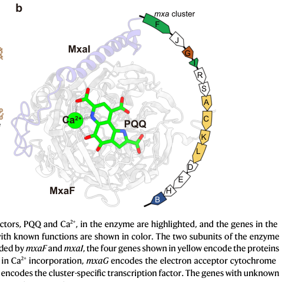

## Question

# Gene Research for Functional Annotation

## ⚠️ CRITICAL: Gene/Protein Identification Context

**BEFORE YOU BEGIN RESEARCH:** You MUST verify you are researching the CORRECT gene/protein. Gene symbols can be ambiguous, especially for less well-characterized genes from non-model organisms.

### Target Gene/Protein Identity (from UniProt):
- **UniProt Accession:** C5AQA2
- **Protein Description:** SubName: Full=MxaC protein {ECO:0000313|EMBL:ACS42162.1};
- **Gene Information:** Name=mxaC {ECO:0000313|EMBL:ACS42162.1}; OrderedLocusNames=MexAM1_META1p4531 {ECO:0000313|EMBL:ACS42162.1};
- **Organism (full):** Methylorubrum extorquens (strain ATCC 14718 / DSM 1338 / JCM 2805 / NCIMB 9133 / AM1) (Methylobacterium extorquens).
- **Protein Family:** Not specified in UniProt
- **Key Domains:** VWF_A. (IPR002035); vWFA_dom_sf. (IPR036465); VWA_2 (PF13519)

### MANDATORY VERIFICATION STEPS:

1. **Check if the gene symbol "mxaC" matches the protein description above**
2. **Verify the organism is correct:** Methylorubrum extorquens (strain ATCC 14718 / DSM 1338 / JCM 2805 / NCIMB 9133 / AM1) (Methylobacterium extorquens).
3. **Check if protein family/domains align with what you find in literature**
4. **If you find literature for a DIFFERENT gene with the same or similar symbol, STOP**

### If Gene Symbol is Ambiguous or You Cannot Find Relevant Literature:

**DO NOT PROCEED WITH RESEARCH ON A DIFFERENT GENE.** Instead:
- State clearly: "The gene symbol 'mxaC' is ambiguous or literature is limited for this specific protein"
- Explain what you found (e.g., "Found extensive literature on a different gene with the same symbol in a different organism")
- Describe the protein based ONLY on the UniProt information provided above
- Suggest that the protein function can be inferred from domain/family information

### Research Target:

Please provide a comprehensive research report on the gene **mxaC** (gene ID: mxaC, UniProt: C5AQA2) in METEA.

The research report should be a detailed narrative explaining the function, biological processes, and localization of the gene product. Citations should be given for all claims.

You should prioritize authoritative reviews and primary scientific literature when conducting research. You can supplement
this with annotations you find in gene/protein databases, but these can be outdated or inaccurate.

We are specifically interested in the primary function of the gene - for enzymes, what reaction is catalyzed, and what is the substrate specificity? For transporters, what is the substrate? For structural proteins or adapters, what is the broader structural role? For signaling molecules, what is the role in the pathway.

We are interested in where in or outside the cell the gene product carries out its function.

We are also interested in the signaling or biochemical pathways in which the gene functions. We are less interested in broad pleiotropic effects, except where these elucidate the precise role.

Include evidence where possible. We are interested in both experimental evidence as well as inference from structure, evolution, or bioinformatic analysis. Precise studies should be prioritized over high-throughput, where available.

## Output

Question: You are an expert researcher providing comprehensive, well-cited information.

Provide detailed information focusing on:
1. Key concepts and definitions with current understanding
2. Recent developments and latest research (prioritize 2023-2024 sources)
3. Current applications and real-world implementations
4. Expert opinions and analysis from authoritative sources
5. Relevant statistics and data from recent studies

Format as a comprehensive research report with proper citations. Include URLs and publication dates where available.
Always prioritize recent, authoritative sources and provide specific citations for all major claims.

# Gene Research for Functional Annotation

## ⚠️ CRITICAL: Gene/Protein Identification Context

**BEFORE YOU BEGIN RESEARCH:** You MUST verify you are researching the CORRECT gene/protein. Gene symbols can be ambiguous, especially for less well-characterized genes from non-model organisms.

### Target Gene/Protein Identity (from UniProt):
- **UniProt Accession:** C5AQA2
- **Protein Description:** SubName: Full=MxaC protein {ECO:0000313|EMBL:ACS42162.1};
- **Gene Information:** Name=mxaC {ECO:0000313|EMBL:ACS42162.1}; OrderedLocusNames=MexAM1_META1p4531 {ECO:0000313|EMBL:ACS42162.1};
- **Organism (full):** Methylorubrum extorquens (strain ATCC 14718 / DSM 1338 / JCM 2805 / NCIMB 9133 / AM1) (Methylobacterium extorquens).
- **Protein Family:** Not specified in UniProt
- **Key Domains:** VWF_A. (IPR002035); vWFA_dom_sf. (IPR036465); VWA_2 (PF13519)

### MANDATORY VERIFICATION STEPS:

1. **Check if the gene symbol "mxaC" matches the protein description above**
2. **Verify the organism is correct:** Methylorubrum extorquens (strain ATCC 14718 / DSM 1338 / JCM 2805 / NCIMB 9133 / AM1) (Methylobacterium extorquens).
3. **Check if protein family/domains align with what you find in literature**
4. **If you find literature for a DIFFERENT gene with the same or similar symbol, STOP**

### If Gene Symbol is Ambiguous or You Cannot Find Relevant Literature:

**DO NOT PROCEED WITH RESEARCH ON A DIFFERENT GENE.** Instead:
- State clearly: "The gene symbol 'mxaC' is ambiguous or literature is limited for this specific protein"
- Explain what you found (e.g., "Found extensive literature on a different gene with the same symbol in a different organism")
- Describe the protein based ONLY on the UniProt information provided above
- Suggest that the protein function can be inferred from domain/family information

### Research Target:

Please provide a comprehensive research report on the gene **mxaC** (gene ID: mxaC, UniProt: C5AQA2) in METEA.

The research report should be a detailed narrative explaining the function, biological processes, and localization of the gene product. Citations should be given for all claims.

You should prioritize authoritative reviews and primary scientific literature when conducting research. You can supplement
this with annotations you find in gene/protein databases, but these can be outdated or inaccurate.

We are specifically interested in the primary function of the gene - for enzymes, what reaction is catalyzed, and what is the substrate specificity? For transporters, what is the substrate? For structural proteins or adapters, what is the broader structural role? For signaling molecules, what is the role in the pathway.

We are interested in where in or outside the cell the gene product carries out its function.

We are also interested in the signaling or biochemical pathways in which the gene functions. We are less interested in broad pleiotropic effects, except where these elucidate the precise role.

Include evidence where possible. We are interested in both experimental evidence as well as inference from structure, evolution, or bioinformatic analysis. Precise studies should be prioritized over high-throughput, where available.

# Functional annotation research report: **mxaC / MxaC** (UniProt **C5AQA2**) in *Methylorubrum extorquens* AM1

## Executive summary
The *Methylorubrum extorquens* AM1 gene **mxaC** (UniProt accession **C5AQA2**) encodes **MxaC**, a **von Willebrand factor A (VWA) domain-containing auxiliary protein** that participates in **biogenesis/maturation of the Ca2+-dependent, PQQ-dependent methanol dehydrogenase (MxaFI)** rather than catalyzing methanol oxidation directly. The best-supported functional role for MxaC is in the **Ca2+ incorporation step** needed to produce an active MxaF catalytic center, likely as part of a **MoxR/VWA-type assembly module** (MxaR + VWA proteins including MxaC). Loss of mxaC yields **inactive MDH** that can be **rescued by Ca2+ treatment**, consistent with a role in metal loading during MDH maturation. (zhou2025decipheringtheassembly pages 2-3, zhou2025decipheringtheassembly pages 4-5)

## 1. Target verification (mandatory gene/protein identity confirmation)
### 1.1. Organism and locus context
Genomic analysis of *M. extorquens* AM1 identified a canonical **mxa methanol-oxidation gene cluster** (a ~12.5 kb cluster), and **mxaC** is explicitly included in this cluster (mxaFJGIRSACKLDEHB). This places mxaC in the correct organism and in the expected methanol-oxidation genetic module, supporting that the retrieved literature refers to the intended target rather than an unrelated “mxaC” in another species. (chistoserdova2003methylotrophyinmethylobacterium pages 4-5)

### 1.2. Functional class/domain alignment with UniProt context
A recent primary study of MDH assembly in *M. extorquens* AM1 describes MxaC as a **VWA domain-containing protein** grouped with other VWA proteins (e.g., MxaS, MxaL) and a **MoxR-class AAA+ ATPase (MxaR)** in a putative **MoxR/VWA complex** implicated in MDH maturation. This matches the user-provided UniProt domain expectation (VWF_A/VWA-like). (zhou2025decipheringtheassembly pages 4-5)

## 2. Key concepts and definitions (current understanding)
### 2.1. Methanol dehydrogenase systems in *Methylorubrum/Methylobacterium*
* Gram-negative methylotrophs commonly use **PQQ-dependent periplasmic methanol dehydrogenases (MDHs)**. In *M. extorquens* AM1, the canonical enzyme is the **MxaFI-type MDH**, a heterotetramer (MxaF2MxaI2) that requires **PQQ** and a **Ca2+** ion in the active site of MxaF. (zhou2025decipheringtheassembly pages 1-2)
* Many methylotrophs also encode **lanthanide-dependent XoxF-type MDHs**, which typically use **lanthanide ions** (instead of Ca2+) to support PQQ-dependent oxidation chemistry. (zhou2025decipheringtheassembly pages 1-2, samanta2024fromgenometo pages 18-20)

### 2.2. Accessory proteins vs. catalytic subunits
Within the methanol oxidation module, only a subset of genes encode catalytic/electron-transfer components (e.g., MxaF/MxaI as structural subunits; cytochrome cL electron acceptor), while others encode **auxiliary factors required for correct enzyme maturation**, including cofactor insertion and metal loading. mxaC falls in this “auxiliary biogenesis factor” category. (chistoserdova2003methylotrophyinmethylobacterium pages 4-5, zhou2025decipheringtheassembly pages 2-3)

### 2.3. VWA-domain proteins and MoxR AAA+ ATPases as assembly factors
VWA domains frequently appear in bacterial protein-quality-control/assembly systems, where they can act as **adaptor/scaffold-like proteins** collaborating with AAA+ ATPases. In the MDH context, MxaC is described as a VWA-domain auxiliary factor that likely collaborates with the AAA+ protein **MxaR** in a **MoxR/VWA module** during enzyme maturation. (zhou2025decipheringtheassembly pages 4-5)

## 3. Functional role of MxaC in methanol oxidation
### 3.1. Pathway placement: the mxa module for periplasmic methanol oxidation
The **mxa cluster** of *M. extorquens* AM1 contains multiple genes required for methanol oxidation, including the structural MDH subunits and accessory genes; mxaC is embedded in this cluster, consistent with a dedicated function in the methanol oxidation system. (chistoserdova2003methylotrophyinmethylobacterium pages 4-5)

### 3.2. Primary functional hypothesis supported by experiments: Ca2+ incorporation into MxaF
A 2025 mechanistic study of PQQ-dependent MDH assembly in *M. extorquens* AM1 identifies MxaC among a defined set of auxiliary proteins required for MDH maturation and specifically implicates these auxiliaries in **Ca2+ incorporation into the catalytic center of MxaF** (“with the assistance of proteins … MxaC … Ca2+ is incorporated into the catalytic center of MxaF”). (zhou2025decipheringtheassembly pages 4-5)

### 3.3. Genetic/biochemical evidence from mxaC perturbation
In the same study, **deletion of mxaC** yielded **inactive MDH** with abnormal cofactor-associated spectral properties; importantly, **in vitro incubation with Ca2+ at pH 9.5 restored** both the characteristic **345 nm absorption** feature and **enzymatic activity**, supporting the interpretation that MxaC is needed for correct Ca2+ loading during maturation rather than for PQQ attachment per se. (zhou2025decipheringtheassembly pages 2-3)

### 3.4. Assembly-module context: proposed MoxR/VWA complex
MxaC is grouped with other VWA-domain proteins (MxaS, MxaL) and the **MoxR-class AAA+ ATPase MxaR**, and these are proposed to form a **MoxR/VWA complex** in the MDH biogenesis pathway. This provides a mechanistic framework: MxaC may act as a VWA-domain adaptor that enables MxaR-driven remodeling or handling of assembly intermediates during Ca2+ insertion/activation steps. (zhou2025decipheringtheassembly pages 4-5)

## 4. Cellular localization and biological process context
### 4.1. Localization: periplasmic MDH maturation context
The relevant enzyme system (PQQ-dependent MDH) is described as a **periplasmic metalloenzyme system** of Gram-negative methylotrophs. Because MxaC is an accessory factor required for MDH maturation, its functional context is best placed at the **cell-envelope/periplasm-facing biogenesis pathway** that produces active periplasmic MDH. Direct localization experiments for MxaC itself were not present in the retrieved texts, so this localization is inferred from pathway context rather than directly demonstrated here. (zhou2025decipheringtheassembly pages 1-2, zhou2025decipheringtheassembly pages 2-3)

### 4.2. Relationship to electron transfer
The MDH system transfers electrons to cytochrome partners in the periplasm; the assembly-focused source notes that mxaG encodes cytochrome cL as an electron acceptor in the mxa gene neighborhood. MxaC is not described as an electron carrier; instead, it supports assembly of the catalytic MDH so that electron transfer can occur. (zhou2025decipheringtheassembly pages 1-2)

## 5. Recent developments (prioritizing 2023–2024 sources) and how they bear on mxaC
### 5.1. 2024 synthesis: metals and C1 metabolism integration
A 2024 review-like synthesis frames methanol metabolism as integrated with **metal biology**, especially **lanthanide-dependent MDH switching** and lanthanide homeostasis processes in *M. extorquens* AM1 and other methylotrophs. While this source does not add MxaC-specific mechanistic detail, it provides current expert context for why metal-handling steps (including Ca2+ vs lanthanide usage) are central to methylotrophy. (hamilton2024crossroadsofcell pages 55-58)

### 5.2. 2024 pangenome analysis: distribution of mxa vs xox methanol oxidation strategies
A 2024 pangenomic analysis of **75 type II methylotroph genomes** describes the classical **Ca2+-dependent Mxa MDH (mxaF/mxaI)** and contrasts it with **lanthanide-dependent xoxF MDHs**, noting that some organisms encode both systems. This supports the current view that metal-dependent MDH systems (and their assembly factors) are widespread and evolutionarily variable. (samanta2024fromgenometo pages 14-16, samanta2024fromgenometo pages 18-20)

### 5.3. Limitation: scarcity of mxaC-focused 2023–2024 mechanistic papers in retrieved corpus
Within the retrieved 2023–2024 literature, there were **no MxaC-focused mechanistic studies** directly recovered; the most explicit mechanistic linkage between MxaC and Ca2+ incorporation/MDH assembly in *M. extorquens* AM1 was provided by a 2025 primary study. Consequently, MxaC-specific functional statements are driven primarily by (i) its genomic context and (ii) the 2025 assembly work, while 2024 sources mainly contribute broader systems-level context. (zhou2025decipheringtheassembly pages 2-3, chistoserdova2003methylotrophyinmethylobacterium pages 4-5, hamilton2024crossroadsofcell pages 55-58)

## 6. Real-world applications and implementations (contextualizing mxaC via the host chassis)
*M. extorquens* AM1 is widely used as a C1/methanol platform organism; although this does not directly annotate mxaC’s biochemical activity, it explains why the mxa system (and its regulation/biogenesis) is a focus for engineering.

### 6.1. C1 biotechnology platform status
A synthetic-biology tools paper describes *M. extorquens* AM1 as a platform organism for a “future C1-bioeconomy” and notes production examples including **mevalonate, α-humulene, 3-hydroxypropionate, and 1-butanol** in this chassis. (carrillo2019designandcontrol pages 1-4)

### 6.2. Quantitative tool metrics relevant to the mxa regulon (PmxaF as benchmark)
The same work provides quantitative engineering metrics for gene expression in *M. extorquens* AM1:
* Newly developed inducible promoters span **6–36-fold induction**.
* Several promoters achieve **9%–166%** of the activity of the strong native **PmxaF** promoter, while a previously “best” inducible promoter was ~**33% of PmxaF**.
These statistics are practically relevant for manipulating methanol-oxidation gene expression, including potentially tuning expression of mxa cluster genes. (carrillo2019designandcontrol pages 4-6)

## 7. Expert interpretation and analysis (evidence-weighted)
### 7.1. What MxaC most likely “does”
Based on (i) its placement in the mxa methanol oxidation cluster, (ii) its designation as a VWA-domain auxiliary protein, (iii) the inactive phenotype upon deletion, and (iv) Ca2+-dependent rescue, the strongest evidence-based statement is:

**MxaC is an MDH maturation/assembly factor required for formation of an active Ca2+-loaded MxaF catalytic center**, likely functioning as part of an **MoxR/VWA assembly module**. (zhou2025decipheringtheassembly pages 2-3, zhou2025decipheringtheassembly pages 4-5, chistoserdova2003methylotrophyinmethylobacterium pages 4-5)

### 7.2. What is *not* supported by current evidence in the retrieved corpus
* There is **no evidence here** that MxaC is itself an enzyme catalyzing methanol oxidation.
* There is **no direct localization assay** for MxaC in the retrieved materials; periplasmic/cell-envelope association is inferred from the MDH pathway context.
* Direct physical interaction data (e.g., co-purification of MxaC with MxaR) are not shown in the retrieved excerpts.

## 8. Evidence highlights (table)
| Aspect | Key points | Best supporting sources (with year, DOI/URL) |
|---|---|---|
| Identity | UniProt C5AQA2 corresponds to **mxaC** in **Methylorubrum extorquens AM1** (formerly *Methylobacterium extorquens* AM1). The gene is part of the canonical **mxa** methanol-oxidation cluster in this organism, supporting that the literature context matches the requested target rather than an unrelated homonym. (chistoserdova2003methylotrophyinmethylobacterium pages 4-5) | Chistoserdova et al., 2003, *J. Bacteriol.* DOI: 10.1128/JB.185.10.2980-2987.2003, https://doi.org/10.1128/jb.185.10.2980-2987.2003 (chistoserdova2003methylotrophyinmethylobacterium pages 4-5) |
| Domain/family | MxaC is annotated as a **von Willebrand factor A (VWA) domain-containing auxiliary protein**. Recent assembly work groups MxaC with **MxaS** and **MxaL** as VWA proteins that likely function together with the **MoxR-class AAA+ ATPase MxaR** in a **MoxR/VWA complex** during methanol dehydrogenase (MDH) biogenesis. (zhou2025decipheringtheassembly pages 4-5, zhou2025decipheringtheassembly media aaf82a88) | Zhou et al., 2025, *Nat. Commun.* DOI: 10.1038/s41467-025-61958-w, https://doi.org/10.1038/s41467-025-61958-w (zhou2025decipheringtheassembly pages 4-5, zhou2025decipheringtheassembly media aaf82a88) |
| Pathway role | MxaC functions in the **MxaFI PQQ-dependent methanol dehydrogenase maturation pathway**, not as the catalytic alcohol-oxidizing enzyme itself. It is one of the auxiliary factors required to assemble active MDH in the periplasmic methanol oxidation system. (zhou2025decipheringtheassembly pages 2-3, chistoserdova2003methylotrophyinmethylobacterium pages 4-5, zhou2025decipheringtheassembly pages 1-2) | Zhou et al., 2025, *Nat. Commun.* DOI: 10.1038/s41467-025-61958-w, https://doi.org/10.1038/s41467-025-61958-w; Chistoserdova et al., 2003, *J. Bacteriol.* DOI: 10.1128/JB.185.10.2980-2987.2003, https://doi.org/10.1128/jb.185.10.2980-2987.2003 (zhou2025decipheringtheassembly pages 2-3, chistoserdova2003methylotrophyinmethylobacterium pages 4-5, zhou2025decipheringtheassembly pages 1-2) |
| Mechanistic function | The strongest current mechanistic inference is that MxaC contributes to **Ca2+ incorporation into the catalytic center of MxaF** during assembly of holo-MDH. In the current assembly model, MxaC acts with **MxaR, MxaS, MxaA, MxaK, and MxaL** during the metal-loading/maturation stage. (zhou2025decipheringtheassembly pages 4-5, zhou2025decipheringtheassembly pages 1-2, zhou2025decipheringtheassembly media aaf82a88) | Zhou et al., 2025, *Nat. Commun.* DOI: 10.1038/s41467-025-61958-w, https://doi.org/10.1038/s41467-025-61958-w (zhou2025decipheringtheassembly pages 4-5, zhou2025decipheringtheassembly pages 1-2, zhou2025decipheringtheassembly media aaf82a88) |
| Experimental evidence | **Deletion of mxaC** produced **inactive MDH** with abnormal cofactor properties; **in vitro Ca2+ incubation at pH 9.5 restored the characteristic 345-nm absorption and enzymatic activity**, supporting a role in Ca2+ loading rather than direct PQQ attachment. MxaC was also among the genes required to reconstitute functional MDH in *E. coli*. (zhou2025decipheringtheassembly pages 2-3) | Zhou et al., 2025, *Nat. Commun.* DOI: 10.1038/s41467-025-61958-w, https://doi.org/10.1038/s41467-025-61958-w (zhou2025decipheringtheassembly pages 2-3) |
| Localization / cellular context | The relevant pathway is the **periplasmic PQQ-dependent MDH system** of Gram-negative methylotrophs. Because MxaC is an MDH auxiliary factor in the **mxa** cluster, its function is most plausibly tied to **periplasm-facing MDH biogenesis/activation**, although the provided contexts do not give a direct subcellular localization experiment specifically for MxaC. (zhou2025decipheringtheassembly pages 2-3, zhou2025decipheringtheassembly pages 1-2) | Zhou et al., 2025, *Nat. Commun.* DOI: 10.1038/s41467-025-61958-w, https://doi.org/10.1038/s41467-025-61958-w (zhou2025decipheringtheassembly pages 2-3, zhou2025decipheringtheassembly pages 1-2) |
| Recent understanding (2024) | Recent review-like synthesis places *M. extorquens* methanol metabolism at the intersection of **metal homeostasis, lanthanide biology, and MDH switching** between Ca2+-dependent MxaFI and lanthanide-dependent XoxF systems. The supplied 2024 context does **not** add MxaC-specific mechanistic details beyond this broader framework. (hamilton2024crossroadsofcell pages 55-58) | Hamilton, 2024, review-like synthesis on metals/C1 metabolism; URL/DOI not available in provided context (hamilton2024crossroadsofcell pages 55-58) |
| Applications / tooling context | *M. extorquens* AM1 is a recognized **C1/methanol biotechnology chassis** used for products including **mevalonate, α-humulene, 3-hydroxypropionate, and 1-butanol**. New synthetic-biology tools include repABC mini-chromosomes and inducible promoters; the native **PmxaF** promoter serves as a strong benchmark for methanol-responsive expression systems. (carrillo2019designandcontrol pages 1-4, carrillo2019designandcontrol pages 4-6) | Carrillo et al., 2019, *ACS Synth. Biol.* DOI: 10.1021/acssynbio.9b00220, https://doi.org/10.1021/acssynbio.9b00220 (carrillo2019designandcontrol pages 1-4, carrillo2019designandcontrol pages 4-6) |
| Quantitative tool data | In engineered expression systems for *M. extorquens* AM1, new inducible promoters spanned **6–36-fold induction**; PA1/PL-derived promoters ranged from **9% to 166% of PmxaF** activity, whereas a previous inducible promoter reached only **33% of PmxaF**. These values are useful when contextualizing the *mxa* system for practical engineering. (carrillo2019designandcontrol pages 4-6) | Carrillo et al., 2019, *ACS Synth. Biol.* DOI: 10.1021/acssynbio.9b00220, https://doi.org/10.1021/acssynbio.9b00220 (carrillo2019designandcontrol pages 4-6) |
| Evidence type / confidence | Confidence is **moderate for pathway assignment and metal-loading role** because recent primary data link mxaC deletion to inactive MDH rescued by Ca2+ and place MxaC in the auxiliary assembly machinery; confidence is **lower for direct biochemical activity or exact localization**, as the supplied evidence does not show purified MxaC activity or a direct localization assay. (zhou2025decipheringtheassembly pages 4-5, zhou2025decipheringtheassembly pages 2-3, chistoserdova2003methylotrophyinmethylobacterium pages 4-5, hamilton2024crossroadsofcell pages 55-58) | Zhou et al., 2025; Chistoserdova et al., 2003; Hamilton, 2024 review-like context (zhou2025decipheringtheassembly pages 4-5, zhou2025decipheringtheassembly pages 2-3, chistoserdova2003methylotrophyinmethylobacterium pages 4-5, hamilton2024crossroadsofcell pages 55-58) |

*Table: This table summarizes the best-supported functional annotation for MxaC (UniProt C5AQA2) in Methylorubrum extorquens AM1 using only the provided evidence contexts. It highlights identity verification, VWA/MoxR-related assembly role, experimental support for Ca2+-dependent MDH maturation, and biotechnology context for the host organism.*

## 9. Key visual evidence (figures)
A recent MDH assembly study includes (i) a gene-cluster diagram showing mxaC in the mxa region and (ii) an MDH maturation schematic placing MxaC within the MxaRSACKL accessory module and the Ca2+/PQQ maturation pathway. (zhou2025decipheringtheassembly media aaf82a88, zhou2025decipheringtheassembly media ce3b2d69)

## References (URLs and publication dates)
* Chistoserdova L, Chen S-W, Lapidus A, Lidstrom ME. **Methylotrophy in *Methylobacterium extorquens* AM1 from a Genomic Point of View.** *Journal of Bacteriology* (May 2003). https://doi.org/10.1128/jb.185.10.2980-2987.2003 (chistoserdova2003methylotrophyinmethylobacterium pages 4-5)
* Carrillo M, Wagner M, Petit F, et al. **Design and Control of Extrachromosomal Elements in *Methylorubrum extorquens* AM1.** *ACS Synthetic Biology* (Oct 2019). https://doi.org/10.1021/acssynbio.9b00220 (carrillo2019designandcontrol pages 1-4, carrillo2019designandcontrol pages 4-6)
* Samanta D, Rauniyar S, Saxena P, Sani RK. **From genome to evolution: investigating type II methylotrophs using a pangenomic analysis.** *mSystems* (Jun 2024). https://doi.org/10.1128/msystems.00248-24 (samanta2024fromgenometo pages 14-16, samanta2024fromgenometo pages 18-20)
* Hamilton RE. **Crossroads of Cell Biology, Metals, and C1 Carbon Metabolism.** (2024; venue/DOI not available in retrieved context). (hamilton2024crossroadsofcell pages 55-58)
* Zhou H, Sun J, Cheng J, et al. **Deciphering the assembly process of PQQ dependent methanol dehydrogenase.** *Nature Communications* (Jul 2025). https://doi.org/10.1038/s41467-025-61958-w (zhou2025decipheringtheassembly pages 1-2, zhou2025decipheringtheassembly pages 2-3, zhou2025decipheringtheassembly pages 4-5, zhou2025decipheringtheassembly media aaf82a88, zhou2025decipheringtheassembly media ce3b2d69)

References

1. (zhou2025decipheringtheassembly pages 2-3): Haichuan Zhou, Junqing Sun, Jian Cheng, Min Wu, Jie Bai, Qian Li, Jie Shen, Manman Han, Chen Yang, Liangpo Li, Yuwan Liu, Qichen Cao, Weidong Liu, Haixia Xiao, Hongjun Dong, Feng Gao, and Huifeng Jiang. Deciphering the assembly process of pqq dependent methanol dehydrogenase. Nature Communications, Jul 2025. URL: https://doi.org/10.1038/s41467-025-61958-w, doi:10.1038/s41467-025-61958-w. This article has 6 citations and is from a highest quality peer-reviewed journal.

2. (zhou2025decipheringtheassembly pages 4-5): Haichuan Zhou, Junqing Sun, Jian Cheng, Min Wu, Jie Bai, Qian Li, Jie Shen, Manman Han, Chen Yang, Liangpo Li, Yuwan Liu, Qichen Cao, Weidong Liu, Haixia Xiao, Hongjun Dong, Feng Gao, and Huifeng Jiang. Deciphering the assembly process of pqq dependent methanol dehydrogenase. Nature Communications, Jul 2025. URL: https://doi.org/10.1038/s41467-025-61958-w, doi:10.1038/s41467-025-61958-w. This article has 6 citations and is from a highest quality peer-reviewed journal.

3. (chistoserdova2003methylotrophyinmethylobacterium pages 4-5): Ludmila Chistoserdova, Sung-Wei Chen, Alla Lapidus, and Mary E. Lidstrom. Methylotrophy in methylobacterium extorquens am1 from a genomic point of view. Journal of Bacteriology, 185:2980-2987, May 2003. URL: https://doi.org/10.1128/jb.185.10.2980-2987.2003, doi:10.1128/jb.185.10.2980-2987.2003. This article has 237 citations and is from a peer-reviewed journal.

4. (zhou2025decipheringtheassembly pages 1-2): Haichuan Zhou, Junqing Sun, Jian Cheng, Min Wu, Jie Bai, Qian Li, Jie Shen, Manman Han, Chen Yang, Liangpo Li, Yuwan Liu, Qichen Cao, Weidong Liu, Haixia Xiao, Hongjun Dong, Feng Gao, and Huifeng Jiang. Deciphering the assembly process of pqq dependent methanol dehydrogenase. Nature Communications, Jul 2025. URL: https://doi.org/10.1038/s41467-025-61958-w, doi:10.1038/s41467-025-61958-w. This article has 6 citations and is from a highest quality peer-reviewed journal.

5. (samanta2024fromgenometo pages 18-20): Dipayan Samanta, Shailabh Rauniyar, Priya Saxena, and Rajesh K. Sani. From genome to evolution: investigating type ii methylotrophs using a pangenomic analysis. Jun 2024. URL: https://doi.org/10.1128/msystems.00248-24, doi:10.1128/msystems.00248-24. This article has 9 citations and is from a peer-reviewed journal.

6. (hamilton2024crossroadsofcell pages 55-58): RE Hamilton. Crossroads of cell biology, metals, and c1 carbon metabolism. Unknown journal, 2024.

7. (samanta2024fromgenometo pages 14-16): Dipayan Samanta, Shailabh Rauniyar, Priya Saxena, and Rajesh K. Sani. From genome to evolution: investigating type ii methylotrophs using a pangenomic analysis. Jun 2024. URL: https://doi.org/10.1128/msystems.00248-24, doi:10.1128/msystems.00248-24. This article has 9 citations and is from a peer-reviewed journal.

8. (carrillo2019designandcontrol pages 1-4): Martina Carrillo, Marcel Wagner, Florian Petit, Amelie Dransfeld, Anke Becker, and Tobias J. Erb. Design and control of extrachromosomal elements in methylorubrum extorquens am1. ACS Synthetic Biology, 8:2451-2456, Oct 2019. URL: https://doi.org/10.1021/acssynbio.9b00220, doi:10.1021/acssynbio.9b00220. This article has 42 citations and is from a domain leading peer-reviewed journal.

9. (carrillo2019designandcontrol pages 4-6): Martina Carrillo, Marcel Wagner, Florian Petit, Amelie Dransfeld, Anke Becker, and Tobias J. Erb. Design and control of extrachromosomal elements in methylorubrum extorquens am1. ACS Synthetic Biology, 8:2451-2456, Oct 2019. URL: https://doi.org/10.1021/acssynbio.9b00220, doi:10.1021/acssynbio.9b00220. This article has 42 citations and is from a domain leading peer-reviewed journal.

10. (zhou2025decipheringtheassembly media aaf82a88): Haichuan Zhou, Junqing Sun, Jian Cheng, Min Wu, Jie Bai, Qian Li, Jie Shen, Manman Han, Chen Yang, Liangpo Li, Yuwan Liu, Qichen Cao, Weidong Liu, Haixia Xiao, Hongjun Dong, Feng Gao, and Huifeng Jiang. Deciphering the assembly process of pqq dependent methanol dehydrogenase. Nature Communications, Jul 2025. URL: https://doi.org/10.1038/s41467-025-61958-w, doi:10.1038/s41467-025-61958-w. This article has 6 citations and is from a highest quality peer-reviewed journal.

11. (zhou2025decipheringtheassembly media ce3b2d69): Haichuan Zhou, Junqing Sun, Jian Cheng, Min Wu, Jie Bai, Qian Li, Jie Shen, Manman Han, Chen Yang, Liangpo Li, Yuwan Liu, Qichen Cao, Weidong Liu, Haixia Xiao, Hongjun Dong, Feng Gao, and Huifeng Jiang. Deciphering the assembly process of pqq dependent methanol dehydrogenase. Nature Communications, Jul 2025. URL: https://doi.org/10.1038/s41467-025-61958-w, doi:10.1038/s41467-025-61958-w. This article has 6 citations and is from a highest quality peer-reviewed journal.

## Artifacts

- [Edison artifact artifact-00](mxaC-deep-research-falcon_artifacts/artifact-00.md)

## Citations

1. chistoserdova2003methylotrophyinmethylobacterium pages 4-5
2. zhou2025decipheringtheassembly pages 4-5
3. zhou2025decipheringtheassembly pages 1-2
4. zhou2025decipheringtheassembly pages 2-3
5. hamilton2024crossroadsofcell pages 55-58
6. carrillo2019designandcontrol pages 1-4
7. carrillo2019designandcontrol pages 4-6
8. samanta2024fromgenometo pages 18-20
9. samanta2024fromgenometo pages 14-16
10. https://doi.org/10.1128/jb.185.10.2980-2987.2003
11. https://doi.org/10.1038/s41467-025-61958-w
12. https://doi.org/10.1038/s41467-025-61958-w;
13. https://doi.org/10.1021/acssynbio.9b00220
14. https://doi.org/10.1128/msystems.00248-24
15. https://doi.org/10.1038/s41467-025-61958-w,
16. https://doi.org/10.1128/jb.185.10.2980-2987.2003,
17. https://doi.org/10.1128/msystems.00248-24,
18. https://doi.org/10.1021/acssynbio.9b00220,