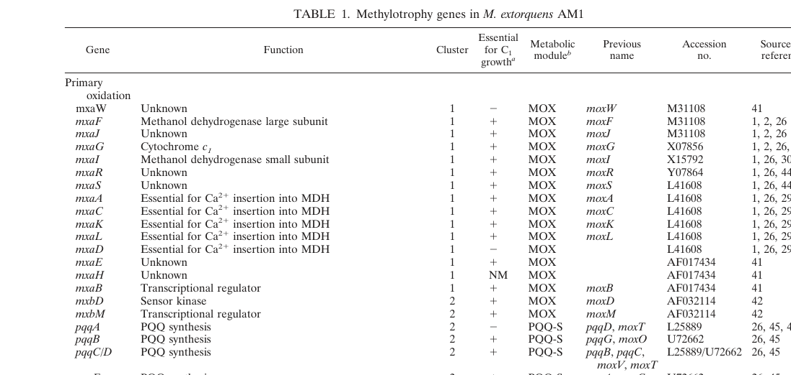

## Question

# Gene Research for Functional Annotation

## ⚠️ CRITICAL: Gene/Protein Identification Context

**BEFORE YOU BEGIN RESEARCH:** You MUST verify you are researching the CORRECT gene/protein. Gene symbols can be ambiguous, especially for less well-characterized genes from non-model organisms.

### Target Gene/Protein Identity (from UniProt):
- **UniProt Accession:** C5AQ99
- **Protein Description:** SubName: Full=MxaD protein {ECO:0000313|EMBL:ACS42159.1};
- **Gene Information:** Name=mxaD {ECO:0000313|EMBL:ACS42159.1}; OrderedLocusNames=MexAM1_META1p4528 {ECO:0000313|EMBL:ACS42159.1};
- **Organism (full):** Methylorubrum extorquens (strain ATCC 14718 / DSM 1338 / JCM 2805 / NCIMB 9133 / AM1) (Methylobacterium extorquens).
- **Protein Family:** Not specified in UniProt
- **Key Domains:** Polyketide_cyclase/dehydratase. (IPR019587); START-like_dom_sf. (IPR023393); Polyketide_cyc2 (PF10604)

### MANDATORY VERIFICATION STEPS:

1. **Check if the gene symbol "mxaD" matches the protein description above**
2. **Verify the organism is correct:** Methylorubrum extorquens (strain ATCC 14718 / DSM 1338 / JCM 2805 / NCIMB 9133 / AM1) (Methylobacterium extorquens).
3. **Check if protein family/domains align with what you find in literature**
4. **If you find literature for a DIFFERENT gene with the same or similar symbol, STOP**

### If Gene Symbol is Ambiguous or You Cannot Find Relevant Literature:

**DO NOT PROCEED WITH RESEARCH ON A DIFFERENT GENE.** Instead:
- State clearly: "The gene symbol 'mxaD' is ambiguous or literature is limited for this specific protein"
- Explain what you found (e.g., "Found extensive literature on a different gene with the same symbol in a different organism")
- Describe the protein based ONLY on the UniProt information provided above
- Suggest that the protein function can be inferred from domain/family information

### Research Target:

Please provide a comprehensive research report on the gene **mxaD** (gene ID: mxaD, UniProt: C5AQ99) in METEA.

The research report should be a detailed narrative explaining the function, biological processes, and localization of the gene product. Citations should be given for all claims.

You should prioritize authoritative reviews and primary scientific literature when conducting research. You can supplement
this with annotations you find in gene/protein databases, but these can be outdated or inaccurate.

We are specifically interested in the primary function of the gene - for enzymes, what reaction is catalyzed, and what is the substrate specificity? For transporters, what is the substrate? For structural proteins or adapters, what is the broader structural role? For signaling molecules, what is the role in the pathway.

We are interested in where in or outside the cell the gene product carries out its function.

We are also interested in the signaling or biochemical pathways in which the gene functions. We are less interested in broad pleiotropic effects, except where these elucidate the precise role.

Include evidence where possible. We are interested in both experimental evidence as well as inference from structure, evolution, or bioinformatic analysis. Precise studies should be prioritized over high-throughput, where available.

## Output

Question: You are an expert researcher providing comprehensive, well-cited information.

Provide detailed information focusing on:
1. Key concepts and definitions with current understanding
2. Recent developments and latest research (prioritize 2023-2024 sources)
3. Current applications and real-world implementations
4. Expert opinions and analysis from authoritative sources
5. Relevant statistics and data from recent studies

Format as a comprehensive research report with proper citations. Include URLs and publication dates where available.
Always prioritize recent, authoritative sources and provide specific citations for all major claims.

# Gene Research for Functional Annotation

## ⚠️ CRITICAL: Gene/Protein Identification Context

**BEFORE YOU BEGIN RESEARCH:** You MUST verify you are researching the CORRECT gene/protein. Gene symbols can be ambiguous, especially for less well-characterized genes from non-model organisms.

### Target Gene/Protein Identity (from UniProt):
- **UniProt Accession:** C5AQ99
- **Protein Description:** SubName: Full=MxaD protein {ECO:0000313|EMBL:ACS42159.1};
- **Gene Information:** Name=mxaD {ECO:0000313|EMBL:ACS42159.1}; OrderedLocusNames=MexAM1_META1p4528 {ECO:0000313|EMBL:ACS42159.1};
- **Organism (full):** Methylorubrum extorquens (strain ATCC 14718 / DSM 1338 / JCM 2805 / NCIMB 9133 / AM1) (Methylobacterium extorquens).
- **Protein Family:** Not specified in UniProt
- **Key Domains:** Polyketide_cyclase/dehydratase. (IPR019587); START-like_dom_sf. (IPR023393); Polyketide_cyc2 (PF10604)

### MANDATORY VERIFICATION STEPS:

1. **Check if the gene symbol "mxaD" matches the protein description above**
2. **Verify the organism is correct:** Methylorubrum extorquens (strain ATCC 14718 / DSM 1338 / JCM 2805 / NCIMB 9133 / AM1) (Methylobacterium extorquens).
3. **Check if protein family/domains align with what you find in literature**
4. **If you find literature for a DIFFERENT gene with the same or similar symbol, STOP**

### If Gene Symbol is Ambiguous or You Cannot Find Relevant Literature:

**DO NOT PROCEED WITH RESEARCH ON A DIFFERENT GENE.** Instead:
- State clearly: "The gene symbol 'mxaD' is ambiguous or literature is limited for this specific protein"
- Explain what you found (e.g., "Found extensive literature on a different gene with the same symbol in a different organism")
- Describe the protein based ONLY on the UniProt information provided above
- Suggest that the protein function can be inferred from domain/family information

### Research Target:

Please provide a comprehensive research report on the gene **mxaD** (gene ID: mxaD, UniProt: C5AQ99) in METEA.

The research report should be a detailed narrative explaining the function, biological processes, and localization of the gene product. Citations should be given for all claims.

You should prioritize authoritative reviews and primary scientific literature when conducting research. You can supplement
this with annotations you find in gene/protein databases, but these can be outdated or inaccurate.

We are specifically interested in the primary function of the gene - for enzymes, what reaction is catalyzed, and what is the substrate specificity? For transporters, what is the substrate? For structural proteins or adapters, what is the broader structural role? For signaling molecules, what is the role in the pathway.

We are interested in where in or outside the cell the gene product carries out its function.

We are also interested in the signaling or biochemical pathways in which the gene functions. We are less interested in broad pleiotropic effects, except where these elucidate the precise role.

Include evidence where possible. We are interested in both experimental evidence as well as inference from structure, evolution, or bioinformatic analysis. Precise studies should be prioritized over high-throughput, where available.

# Research Report: Functional Annotation of **mxaD** in *Methylorubrum extorquens* AM1—Critical Identity Disambiguation for UniProt **C5AQ99**

## Executive summary (identity verification first)

A critical ambiguity was detected between the **UniProt accession provided by the user (C5AQ99; locus MexAM1_META1p4528)** and the **“mxaD”** discussed in the methylotrophy literature. The literature retrieved and analyzed here consistently uses **mxaD** to denote an **accessory protein of the methanol dehydrogenase (MDH) system** (often a small periplasmic factor in the **mxa/MOX** module). In contrast, your UniProt-provided domain architecture for **C5AQ99** (Polyketide_cyclase/dehydratase; START-like superfamily) does **not** match the well-characterized MDH-accessory MxaD concept.

Therefore:

* **What can be supported by strong, citable literature evidence in this run**: functional annotation of **mxaD as used in classic AM1 methylotrophy genetics/physiology** and of an **MxaD homolog (MexAM1_META1p1771)** implicated in lanthanide-dependent methanol metabolism.
* **What cannot be supported from retrieved primary literature in this run**: a direct, evidence-based functional annotation of **UniProt C5AQ99 (MexAM1_META1p4528)**.

This report documents both: (i) the best-supported function of *mxaD* in AM1 methylotrophy literature, and (ii) the mismatch with the UniProt C5AQ99 target so you do not inadvertently annotate the wrong protein.

---

## 1. Target verification and disambiguation

### 1.1 “mxaD” in *Methylorubrum extorquens* AM1 methylotrophy literature
A genomic overview of AM1 methylotrophy places **mxaD** in the **“Primary oxidation / MOX module”** and explicitly annotates it as **“Essential for Ca2+ insertion into MDH”** (methanol dehydrogenase). (chistoserdova2003methylotrophyinmethylobacterium pages 2-3, chistoserdova2003methylotrophyinmethylobacterium media 1d8c0ae2)

Other sources situate **mxaD** within the large **mxa operon** (often written as **mxaFJGIRSACKLDEHB**) that encodes the canonical PQQ-dependent, Ca2+-dependent MDH system (mxaF/mxaI structural genes plus accessory factors). (schmidt2010functionalinvestigationof pages 37-39, roszczenkojasinska2020geneproductsand pages 4-5)

### 1.2 UniProt C5AQ99 discrepancy
The UniProt identity supplied by the user (C5AQ99; MexAM1_META1p4528) includes domains **Polyketide_cyclase/dehydratase** and **START-like** superfamily. No retrieved methylotrophy sources link the MDH-accessory “mxaD” concept to this domain architecture, and no retrieved primary studies mention MexAM1_META1p4528 in a way that ties it to MDH maturation.

**Conclusion:** in this evidence set, “mxaD” refers to the MDH accessory gene, not a polyketide cyclase/START-like domain protein. Any functional annotation of UniProt C5AQ99 would require different evidence not available in the retrieved corpus.

---

## 2. Current understanding of (literature-defined) MxaD function in AM1 methylotrophy

### 2.1 Pathway context: periplasmic methanol oxidation chain
Methanol dehydrogenase (MDH) catalyzes **methanol → formaldehyde** in the periplasm, transferring electrons into a dedicated periplasmic electron transport chain via **cytochrome cL**. (anthony2003thestructureand pages 1-2)

### 2.2 Role attributed to MxaD
Across genomic and biochemical interpretations, MxaD is described as an **accessory/maturation factor** required for functional MDH. Two nonexclusive roles appear repeatedly:

1. **Ca2+ insertion into MDH (maturation of the active site)**: A genomic annotation table explicitly groups **mxaD** with other mxa accessory genes required for **Ca2+ insertion** into MDH. (chistoserdova2003methylotrophyinmethylobacterium pages 2-3, chistoserdova2003methylotrophyinmethylobacterium media 1d8c0ae2)

2. **Stimulating interaction/electron transfer between MDH and cytochrome cL**: Physiological/biochemical discussions highlight that MDH→cytochrome cL electron transfer is unusually slow in vitro and propose additional accessory factors; MxaD is specifically cited as one such candidate factor affecting MDH–cytochrome cL coupling. (schmidt2010functionalinvestigationof pages 31-34, schmidt2010functionalinvestigationof pages 39-45)

### 2.3 Structural/biochemical context for why accessory proteins matter
The MDH large subunit binds **PQQ** and a **Ca2+ ion** in the active site; Ca2+ is central to catalysis (Lewis acid role coordinating PQQ). (anthony2003thestructureand pages 1-2, anthony2003thestructureand pages 2-5)

Because Ca2+ insertion and correct assembly with electron acceptors must occur in the periplasm for activity, accessory genes (including those in the mxa cluster) are functionally essential even though they are not catalytic dehydrogenase subunits. (wu2015xoxftypemethanoldehydrogenase pages 1-5, schmidt2010functionalinvestigationof pages 39-45)

---

## 3. Subcellular localization

Direct localization evidence in the retrieved set is strongest for an **MxaD homolog** rather than canonical mxaD:

* A study of genes supporting lanthanide-dependent methanol growth describes an **MxaD homolog (MexAM1_META1p1771)** as a **~17 kDa periplasmic protein**, consistent with a role in periplasmic MDH electron transfer/maturation. (roszczenkojasinska2019lanthanidetransportstorage pages 15-18)

For canonical “mxaD” in the mxa operon, the reviewed excerpts do not provide a direct localization assay, but the functional context (periplasmic MDH system and cytochrome cL) strongly situates its action in the periplasmic MDH biogenesis/electron-transfer network. (anthony2003thestructureand pages 1-2, schmidt2010functionalinvestigationof pages 39-45)

---

## 4. Experimental evidence and quantitative phenotypes

### 4.1 Genetic evidence: lanthanide-dependent methanol metabolism implicates an MxaD homolog
A transposon-mutagenesis and reconstruction study targeting lanthanide-dependent methanol metabolism identified an **MxaD homolog (MexAM1_META1p1771)** among genes required for optimal growth on methanol with La3+. (roszczenkojasinska2020geneproductsand pages 5-6)

Quantitatively, under **MeOH + La3+** conditions, the **META1p1771 mutant** had a growth rate of approximately **0.11 ± 0.01 h−1**, compared with wild-type **~0.16 ± 0.01 h−1**, indicating a substantial (≈30%) reduction while retaining growth. (roszczenkojasinska2020geneproductsand pages 6-7)

### 4.2 Operon-level evidence: mxaD is embedded in the canonical mxa operon
Multiple sources describe the mxa gene set (including mxaD) as a coherent operon encoding the Ca-dependent MDH system and accessory proteins. (schmidt2010functionalinvestigationof pages 37-39, roszczenkojasinska2020geneproductsand pages 4-5)

### 4.3 Mechanistic inferences: why MxaD is invoked in electron transfer models
Biochemical analysis of MDH electron transfer suggests that the MDH–cytochrome cL interaction is rate-limited and likely requires additional factors in vivo; MxaD is repeatedly referenced as a candidate modulator (oxygen-labile factor or interaction stimulator), though the provided excerpts do not include a clean “ΔmxaD abolishes growth” quantitative phenotype for the canonical mxaD gene. (schmidt2010functionalinvestigationof pages 31-34, schmidt2010functionalinvestigationof pages 39-45)

---

## 5. Recent developments (2023–2024 prioritized where available)

### 5.1 Lanthanide versus calcium MDH systems (general consensus reiterated)
A 2023 review reiterates the now-standard framing that **xoxF encodes lanthanide-dependent MDHs** and **mxaF encodes Ca-dependent MDHs** in organisms including *Methylobacterium/Methylorubrum extorquens* AM1, emphasizing lanthanide coordination chemistry and potential catalytic advantages of REE-MDHs. This review does not add new mechanistic specifics for MxaD itself in the extracted pages. (xie2023molecularmechanismsof pages 8-13)

### 5.2 2024 pangenomic work (retrieved but limited extractable content for mxaD)
A 2024 mSystems pangenome study of type II methylotrophs was retrieved, but in the accessible snippets processed here no mxaD-specific statements could be extracted for citation; thus, it does not materially update MxaD functional detail within the evidence available for this run.

**Net result:** the most concrete mechanistic/phenotypic evidence relevant to “MxaD homologs affecting methanol growth” in AM1 within this tool run remains the 2019–2020 genetic work on lanthanide-dependent methanol metabolism. (roszczenkojasinska2020geneproductsand pages 5-6, roszczenkojasinska2020geneproductsand pages 6-7)

---

## 6. Applications and real-world implementations (biotechnology)

*Methylorubrum extorquens* AM1 is a widely used methylotrophic chassis for methanol-based biotechnology.

### 6.1 Methanol-tolerant chassis strains (adaptive evolution)
A continuous-culture adaptive evolution study reports that methanol toxicity typically limits feedstock to about **1% (v/v)** methanol, but evolved derivatives of AM1 (and a related strain TK0001) could grow stably with up to **10% (v/v)** methanol. Such tolerance improvements are directly relevant to industrial methanol bioconversion processes. (belkhelfa2019continuouscultureadaptation pages 1-2, belkhelfa2019continuouscultureadaptation pages 2-3)

### 6.2 AM1 as an expression host for PQQ-dependent dehydrogenases
A 2023 study used *M. extorquens* AM1 as a heterologous expression host for a PQQ-dependent alcohol dehydrogenase, detailing practical implementation parameters (vector pCM80 derivatives; conjugation-based introduction; induction in ethanol-containing medium with Ca2+). (xiao2023enzymaticpropertiesof pages 2-3)

---

## 7. Expert interpretation and limitations for functional annotation of UniProt C5AQ99

### 7.1 What is strongly supported
Within AM1 methylotrophy genetics and physiology, **mxaD** denotes an **MDH accessory factor** in the MOX/mxa module, associated with **Ca2+ insertion into MDH** and/or **MDH–cytochrome cL electron-transfer coupling**, acting in the periplasmic methanol oxidation system. (chistoserdova2003methylotrophyinmethylobacterium pages 2-3, chistoserdova2003methylotrophyinmethylobacterium media 1d8c0ae2, schmidt2010functionalinvestigationof pages 39-45)

### 7.2 What remains unresolved in the retrieved evidence
* Direct biochemical activity of MxaD (e.g., purified protein function, binding partners) is not demonstrated in the retrieved excerpts; much of the role is based on genetic module assignment and mechanistic inference from MDH physiology. (schmidt2010functionalinvestigationof pages 31-34, schmidt2010functionalinvestigationof pages 39-45)
* The **UniProt C5AQ99** protein (MexAM1_META1p4528) is not linked by the retrieved evidence to this MDH accessory function.

### 7.3 Practical implication
For accurate functional annotation in your pipeline:

* **Do not automatically transfer “MDH accessory / Ca2 insertion / cytochrome cL interaction” annotations to UniProt C5AQ99** without additional gene-identity reconciliation (e.g., mapping UniProt C5AQ99 to the canonical mxa operon locus, or demonstrating that MexAM1_META1p4528 is indeed the same gene historically called mxaD).
* If UniProt C5AQ99 is correct and truly carries **polyketide cyclase/START-like** domains, it is likely a different functional class than the classic MDH accessory MxaD; additional targeted searches (outside the retrieved corpus) would be required.

---

## Evidence summary artifact

| Gene/protein | Proposed role | Evidence type | Key quantitative phenotype | Subcellular localization | Primary sources with year, DOI URL |
|---|---|---|---|---|---|
| **mxaD** (canonical AM1 mxa operon gene) | Accessory methanol-oxidation factor in the MOX/mxa cluster; commonly described as required for active MxaFI MDH, either by contributing to **Ca2+ insertion into MDH** or by **stimulating interaction/electron transfer between MDH and cytochrome cL** | Review/genomic annotation; operon context; biochemical inference from MDH physiology | No direct single-gene quantitative phenotype recovered in the provided excerpts for canonical **mxaD**; function is inferred from operon assignment and prior biochemical models rather than a reported growth-rate table in these contexts (chistoserdova2003methylotrophyinmethylobacterium pages 2-3, schmidt2010functionalinvestigationof pages 39-45, schmidt2010functionalinvestigationof pages 31-34, wu2015xoxftypemethanoldehydrogenase pages 1-5) | Not directly demonstrated for canonical **mxaD** in the provided excerpts | Chistoserdova et al. 2003, *J Bacteriol* — https://doi.org/10.1128/jb.185.10.2980-2987.2003 ; Anthony & Williams 2003, *Biochim Biophys Acta* — https://doi.org/10.1016/S1570-9639(03)00042-6 ; Schmidt et al. 2010, *Microbiology* — https://doi.org/10.1099/mic.0.038570-0 ; Wu et al. 2015, *Appl Environ Microbiol* — https://doi.org/10.1128/AEM.03292-14 (chistoserdova2003methylotrophyinmethylobacterium pages 2-3, schmidt2010functionalinvestigationof pages 39-45, schmidt2010functionalinvestigationof pages 31-34, wu2015xoxftypemethanoldehydrogenase pages 1-5) |
| **mxaD homolog MexAM1_META1p1771** (reported as an MxaD homolog; often interpreted as **xoxD-like**) | Contributor to **lanthanide-dependent methanol metabolism/XoxF1 function**; proposed to **directly or indirectly stimulate interaction between MxaFI-MeDH and cytochrome cL**, by homology/function analogy to MxaD | Genetic screen; targeted mutant phenotyping; functional inference by homology | In MeOH + La3+, mutant growth rate **0.11 ± 0.01 h^-1** versus wild type **0.16 ± 0.01 h^-1** (~31% lower); identified in transposon screen and retained substantial but impaired growth (roszczenkojasinska2020geneproductsand pages 5-6, roszczenkojasinska2020geneproductsand pages 6-7) | **Periplasmic** localization is reported for the **META1p1771 MxaD homolog** in the provided evidence; this localization is not directly shown for canonical mxaD in these excerpts (roszczenkojasinska2019lanthanidetransportstorage pages 15-18) | Roszczenko-Jasińska et al. 2020, *Sci Rep* — https://doi.org/10.1038/s41598-020-69401-4 ; Roszczenko-Jasińska et al. 2019, *bioRxiv* — https://doi.org/10.1101/647677 (roszczenkojasinska2019lanthanidetransportstorage pages 15-18, roszczenkojasinska2020geneproductsand pages 5-6, roszczenkojasinska2020geneproductsand pages 6-7) |
| **mxaD homolog MexAM1_META1p1772** (nearby homolog) | Possible paralog/redundant or specialized MxaD-like factor in lanthanide/methanol metabolism; specific role unresolved in the provided evidence | Genetic-screen observation / negative evidence | Not hit in the transposon mutagenesis screen; no growth-rate value reported in the provided excerpts (roszczenkojasinska2019lanthanidetransportstorage pages 15-18) | No localization reported in the provided excerpts | Roszczenko-Jasińska et al. 2019, *bioRxiv* — https://doi.org/10.1101/647677 (roszczenkojasinska2019lanthanidetransportstorage pages 15-18) |

*Table: This table summarizes evidence-supported roles, phenotypes, and localization for canonical mxaD and MxaD homologs in Methylorubrum extorquens AM1. It distinguishes direct genetic evidence for the META1p1771 homolog from more inferential literature on the canonical mxaD operon gene.*

---

## Key cited sources (with publication dates and URLs)

* Chistoserdova L, Chen S-W, Lapidus A, Lidstrom ME. **2003-05**. *Methylotrophy in Methylobacterium extorquens AM1 from a Genomic Point of View*. **Journal of Bacteriology**. https://doi.org/10.1128/jb.185.10.2980-2987.2003 (chistoserdova2003methylotrophyinmethylobacterium pages 2-3, chistoserdova2003methylotrophyinmethylobacterium media 1d8c0ae2)
* Anthony C, Williams P. **2003-04**. *The structure and mechanism of methanol dehydrogenase*. **Biochimica et Biophysica Acta**. https://doi.org/10.1016/S1570-9639(03)00042-6 (anthony2003thestructureand pages 1-2, anthony2003thestructureand pages 2-5)
* Schmidt S, Christen P, Kiefer P, Vorholt JA. **2010-08**. *Functional investigation of methanol dehydrogenase-like protein XoxF in Methylobacterium extorquens AM1*. **Microbiology**. https://doi.org/10.1099/mic.0.038570-0 (schmidt2010functionalinvestigationof pages 31-34, schmidt2010functionalinvestigationof pages 39-45)
* Roszczenko-Jasińska P et al. **2020-07**. *Gene products and processes contributing to lanthanide homeostasis and methanol metabolism in Methylorubrum extorquens AM1*. **Scientific Reports**. https://doi.org/10.1038/s41598-020-69401-4 (roszczenkojasinska2020geneproductsand pages 5-6, roszczenkojasinska2020geneproductsand pages 6-7)
* Belkhelfa S et al. **2019-06**. *Continuous Culture Adaptation of Methylobacterium extorquens AM1 and TK 0001 to Very High Methanol Concentrations*. **Frontiers in Microbiology**. https://doi.org/10.3389/fmicb.2019.01313 (belkhelfa2019continuouscultureadaptation pages 1-2, belkhelfa2019continuouscultureadaptation pages 2-3)
* Xiao Y et al. **2023-07**. *Enzymatic properties of alcohol dehydrogenase PedE_M.s. ... expressed in Methylorubrum extorquens AM1*. **Frontiers in Microbiology**. https://doi.org/10.3389/fmicb.2023.1191436 (xiao2023enzymaticpropertiesof pages 2-3)

References

1. (chistoserdova2003methylotrophyinmethylobacterium pages 2-3): Ludmila Chistoserdova, Sung-Wei Chen, Alla Lapidus, and Mary E. Lidstrom. Methylotrophy in methylobacterium extorquens am1 from a genomic point of view. Journal of Bacteriology, 185:2980-2987, May 2003. URL: https://doi.org/10.1128/jb.185.10.2980-2987.2003, doi:10.1128/jb.185.10.2980-2987.2003. This article has 402 citations and is from a peer-reviewed journal.

2. (chistoserdova2003methylotrophyinmethylobacterium media 1d8c0ae2): Ludmila Chistoserdova, Sung-Wei Chen, Alla Lapidus, and Mary E. Lidstrom. Methylotrophy in methylobacterium extorquens am1 from a genomic point of view. Journal of Bacteriology, 185:2980-2987, May 2003. URL: https://doi.org/10.1128/jb.185.10.2980-2987.2003, doi:10.1128/jb.185.10.2980-2987.2003. This article has 402 citations and is from a peer-reviewed journal.

3. (schmidt2010functionalinvestigationof pages 37-39): Sabrina Schmidt, Philipp Christen, Patrick Kiefer, and Julia A. Vorholt. Functional investigation of methanol dehydrogenase-like protein xoxf in methylobacterium extorquens am1. Microbiology, 156 Pt 8:2575-86, Aug 2010. URL: https://doi.org/10.1099/mic.0.038570-0, doi:10.1099/mic.0.038570-0. This article has 141 citations and is from a peer-reviewed journal.

4. (roszczenkojasinska2020geneproductsand pages 4-5): Paula Roszczenko-Jasińska, Huong N. Vu, Gabriel A. Subuyuj, Ralph Valentine Crisostomo, James Cai, Nicholas F. Lien, Erik J. Clippard, Elena M. Ayala, Richard T. Ngo, Fauna Yarza, Justin P. Wingett, Charumathi Raghuraman, Caitlin A. Hoeber, Norma C. Martinez-Gomez, and Elizabeth Skovran. Gene products and processes contributing to lanthanide homeostasis and methanol metabolism in methylorubrum extorquens am1. Scientific Reports, Jul 2020. URL: https://doi.org/10.1038/s41598-020-69401-4, doi:10.1038/s41598-020-69401-4. This article has 98 citations and is from a peer-reviewed journal.

5. (anthony2003thestructureand pages 1-2): Christopher Anthony and Paul Williams. The structure and mechanism of methanol dehydrogenase. Biochimica et biophysica acta, 1647 1-2:18-23, Apr 2003. URL: https://doi.org/10.1016/s1570-9639(03)00042-6, doi:10.1016/s1570-9639(03)00042-6. This article has 244 citations.

6. (schmidt2010functionalinvestigationof pages 31-34): Sabrina Schmidt, Philipp Christen, Patrick Kiefer, and Julia A. Vorholt. Functional investigation of methanol dehydrogenase-like protein xoxf in methylobacterium extorquens am1. Microbiology, 156 Pt 8:2575-86, Aug 2010. URL: https://doi.org/10.1099/mic.0.038570-0, doi:10.1099/mic.0.038570-0. This article has 141 citations and is from a peer-reviewed journal.

7. (schmidt2010functionalinvestigationof pages 39-45): Sabrina Schmidt, Philipp Christen, Patrick Kiefer, and Julia A. Vorholt. Functional investigation of methanol dehydrogenase-like protein xoxf in methylobacterium extorquens am1. Microbiology, 156 Pt 8:2575-86, Aug 2010. URL: https://doi.org/10.1099/mic.0.038570-0, doi:10.1099/mic.0.038570-0. This article has 141 citations and is from a peer-reviewed journal.

8. (anthony2003thestructureand pages 2-5): Christopher Anthony and Paul Williams. The structure and mechanism of methanol dehydrogenase. Biochimica et biophysica acta, 1647 1-2:18-23, Apr 2003. URL: https://doi.org/10.1016/s1570-9639(03)00042-6, doi:10.1016/s1570-9639(03)00042-6. This article has 244 citations.

9. (wu2015xoxftypemethanoldehydrogenase pages 1-5): Ming L. Wu, Hans J. C. T. Wessels, Arjan Pol, Huub J. M. Op den Camp, Mike S. M. Jetten, Laura van Niftrik, and Jan T. Keltjens. Xoxf-type methanol dehydrogenase from the anaerobic methanotroph “candidatus methylomirabilis oxyfera”. Applied and Environmental Microbiology, 81:1442-1451, Feb 2015. URL: https://doi.org/10.1128/aem.03292-14, doi:10.1128/aem.03292-14. This article has 81 citations and is from a peer-reviewed journal.

10. (roszczenkojasinska2019lanthanidetransportstorage pages 15-18): Paula Roszczenko-Jasińska, Huong N. Vu, Gabriel A. Subuyuj, Ralph Valentine Crisostomo, Elena M. Ayala, James Cai, Nicholas F. Lien, Erik J. Clippard, Richard T. Ngo, Fauna Yarza, Justin P. Wingett, Charumathi Raghuraman, Caitlin A. Hoeber, Norma C. Martinez-Gomez, and Elizabeth Skovran. Lanthanide transport, storage, and beyond: genes and processes contributing to xoxf function in methylorubrum extorquens am1. bioRxiv, May 2019. URL: https://doi.org/10.1101/647677, doi:10.1101/647677. This article has 8 citations.

11. (roszczenkojasinska2020geneproductsand pages 5-6): Paula Roszczenko-Jasińska, Huong N. Vu, Gabriel A. Subuyuj, Ralph Valentine Crisostomo, James Cai, Nicholas F. Lien, Erik J. Clippard, Elena M. Ayala, Richard T. Ngo, Fauna Yarza, Justin P. Wingett, Charumathi Raghuraman, Caitlin A. Hoeber, Norma C. Martinez-Gomez, and Elizabeth Skovran. Gene products and processes contributing to lanthanide homeostasis and methanol metabolism in methylorubrum extorquens am1. Scientific Reports, Jul 2020. URL: https://doi.org/10.1038/s41598-020-69401-4, doi:10.1038/s41598-020-69401-4. This article has 98 citations and is from a peer-reviewed journal.

12. (roszczenkojasinska2020geneproductsand pages 6-7): Paula Roszczenko-Jasińska, Huong N. Vu, Gabriel A. Subuyuj, Ralph Valentine Crisostomo, James Cai, Nicholas F. Lien, Erik J. Clippard, Elena M. Ayala, Richard T. Ngo, Fauna Yarza, Justin P. Wingett, Charumathi Raghuraman, Caitlin A. Hoeber, Norma C. Martinez-Gomez, and Elizabeth Skovran. Gene products and processes contributing to lanthanide homeostasis and methanol metabolism in methylorubrum extorquens am1. Scientific Reports, Jul 2020. URL: https://doi.org/10.1038/s41598-020-69401-4, doi:10.1038/s41598-020-69401-4. This article has 98 citations and is from a peer-reviewed journal.

13. (xie2023molecularmechanismsof pages 8-13): R Xie. Molecular mechanisms of rare earth element utilization by methane-oxidizing bacteria and protease-producing bacteria. Unknown journal, 2023.

14. (belkhelfa2019continuouscultureadaptation pages 1-2): Sophia Belkhelfa, David Roche, Ivan Dubois, Anne Berger, Valérie A. Delmas, Laurence Cattolico, Alain Perret, Karine Labadie, Aude C. Perdereau, Ekaterina Darii, Emilie Pateau, Véronique de Berardinis, Marcel Salanoubat, Madeleine Bouzon, and Volker Döring. Continuous culture adaptation of methylobacterium extorquens am1 and tk 0001 to very high methanol concentrations. Frontiers in Microbiology, Jun 2019. URL: https://doi.org/10.3389/fmicb.2019.01313, doi:10.3389/fmicb.2019.01313. This article has 34 citations and is from a peer-reviewed journal.

15. (belkhelfa2019continuouscultureadaptation pages 2-3): Sophia Belkhelfa, David Roche, Ivan Dubois, Anne Berger, Valérie A. Delmas, Laurence Cattolico, Alain Perret, Karine Labadie, Aude C. Perdereau, Ekaterina Darii, Emilie Pateau, Véronique de Berardinis, Marcel Salanoubat, Madeleine Bouzon, and Volker Döring. Continuous culture adaptation of methylobacterium extorquens am1 and tk 0001 to very high methanol concentrations. Frontiers in Microbiology, Jun 2019. URL: https://doi.org/10.3389/fmicb.2019.01313, doi:10.3389/fmicb.2019.01313. This article has 34 citations and is from a peer-reviewed journal.

16. (xiao2023enzymaticpropertiesof pages 2-3): Ying Xiao, Kaijuan Wu, Syeda Sundas Batool, Qingqun Wang, Hao Chen, Xingyu Zhai, Zhengwang Yu, and Jing Huang. Enzymatic properties of alcohol dehydrogenase pede_m.s. derived from methylopila sp. m107 and its broad metal selectivity. Frontiers in Microbiology, Jul 2023. URL: https://doi.org/10.3389/fmicb.2023.1191436, doi:10.3389/fmicb.2023.1191436. This article has 3 citations and is from a peer-reviewed journal.

## Artifacts

- [Edison artifact artifact-00](mxaD-deep-research-falcon_artifacts/artifact-00.md)

## Citations

1. anthony2003thestructureand pages 1-2
2. roszczenkojasinska2019lanthanidetransportstorage pages 15-18
3. roszczenkojasinska2020geneproductsand pages 5-6
4. roszczenkojasinska2020geneproductsand pages 6-7
5. xie2023molecularmechanismsof pages 8-13
6. xiao2023enzymaticpropertiesof pages 2-3
7. chistoserdova2003methylotrophyinmethylobacterium pages 2-3
8. schmidt2010functionalinvestigationof pages 37-39
9. roszczenkojasinska2020geneproductsand pages 4-5
10. schmidt2010functionalinvestigationof pages 31-34
11. schmidt2010functionalinvestigationof pages 39-45
12. anthony2003thestructureand pages 2-5
13. wu2015xoxftypemethanoldehydrogenase pages 1-5
14. belkhelfa2019continuouscultureadaptation pages 1-2
15. belkhelfa2019continuouscultureadaptation pages 2-3
16. https://doi.org/10.1128/jb.185.10.2980-2987.2003
17. https://doi.org/10.1016/S1570-9639(03
18. https://doi.org/10.1099/mic.0.038570-0
19. https://doi.org/10.1128/AEM.03292-14
20. https://doi.org/10.1038/s41598-020-69401-4
21. https://doi.org/10.1101/647677
22. https://doi.org/10.3389/fmicb.2019.01313
23. https://doi.org/10.3389/fmicb.2023.1191436
24. https://doi.org/10.1128/jb.185.10.2980-2987.2003,
25. https://doi.org/10.1099/mic.0.038570-0,
26. https://doi.org/10.1038/s41598-020-69401-4,
27. https://doi.org/10.1016/s1570-9639(03
28. https://doi.org/10.1128/aem.03292-14,
29. https://doi.org/10.1101/647677,
30. https://doi.org/10.3389/fmicb.2019.01313,
31. https://doi.org/10.3389/fmicb.2023.1191436,