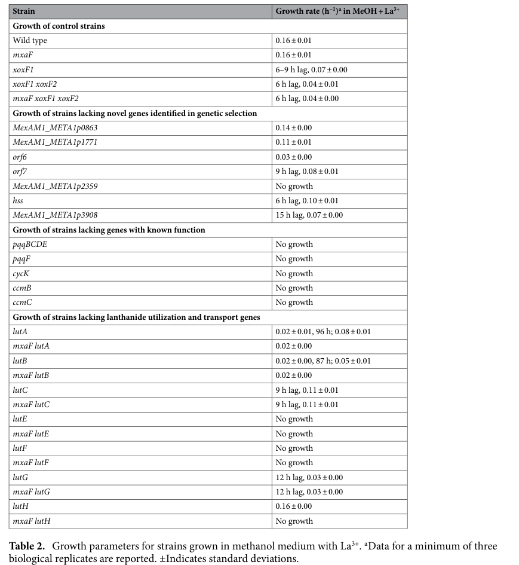

## Question

# Gene Research for Functional Annotation

## ⚠️ CRITICAL: Gene/Protein Identification Context

**BEFORE YOU BEGIN RESEARCH:** You MUST verify you are researching the CORRECT gene/protein. Gene symbols can be ambiguous, especially for less well-characterized genes from non-model organisms.

### Target Gene/Protein Identity (from UniProt):
- **UniProt Accession:** P16027
- **Protein Description:** RecName: Full=Methanol dehydrogenase [cytochrome c] subunit 1; EC=1.1.2.7; AltName: Full=MDH large subunit alpha; AltName: Full=MEDH; Flags: Precursor;
- **Gene Information:** Name=moxF; Synonyms=mxaF; OrderedLocusNames=MexAM1_META1p4538;
- **Organism (full):** Methylorubrum extorquens (strain ATCC 14718 / DSM 1338 / JCM 2805 / NCIMB 9133 / AM1) (Methylobacterium extorquens).
- **Protein Family:** Belongs to the bacterial PQQ dehydrogenase family.
- **Key Domains:** PQQ_b-propeller_rpt. (IPR018391); PQQ_MeOH/EtOH_DH. (IPR017512); PQQ_rpt_dom. (IPR002372); Quinoprotein_ADH-like_sf. (IPR011047); Quinoprotein_DH_CS. (IPR001479)

### MANDATORY VERIFICATION STEPS:

1. **Check if the gene symbol "moxF" matches the protein description above**
2. **Verify the organism is correct:** Methylorubrum extorquens (strain ATCC 14718 / DSM 1338 / JCM 2805 / NCIMB 9133 / AM1) (Methylobacterium extorquens).
3. **Check if protein family/domains align with what you find in literature**
4. **If you find literature for a DIFFERENT gene with the same or similar symbol, STOP**

### If Gene Symbol is Ambiguous or You Cannot Find Relevant Literature:

**DO NOT PROCEED WITH RESEARCH ON A DIFFERENT GENE.** Instead:
- State clearly: "The gene symbol 'moxF' is ambiguous or literature is limited for this specific protein"
- Explain what you found (e.g., "Found extensive literature on a different gene with the same symbol in a different organism")
- Describe the protein based ONLY on the UniProt information provided above
- Suggest that the protein function can be inferred from domain/family information

### Research Target:

Please provide a comprehensive research report on the gene **moxF** (gene ID: mxaF, UniProt: P16027) in METEA.

The research report should be a detailed narrative explaining the function, biological processes, and localization of the gene product. Citations should be given for all claims.

You should prioritize authoritative reviews and primary scientific literature when conducting research. You can supplement
this with annotations you find in gene/protein databases, but these can be outdated or inaccurate.

We are specifically interested in the primary function of the gene - for enzymes, what reaction is catalyzed, and what is the substrate specificity? For transporters, what is the substrate? For structural proteins or adapters, what is the broader structural role? For signaling molecules, what is the role in the pathway.

We are interested in where in or outside the cell the gene product carries out its function.

We are also interested in the signaling or biochemical pathways in which the gene functions. We are less interested in broad pleiotropic effects, except where these elucidate the precise role.

Include evidence where possible. We are interested in both experimental evidence as well as inference from structure, evolution, or bioinformatic analysis. Precise studies should be prioritized over high-throughput, where available.

## Output

Question: You are an expert researcher providing comprehensive, well-cited information.

Provide detailed information focusing on:
1. Key concepts and definitions with current understanding
2. Recent developments and latest research (prioritize 2023-2024 sources)
3. Current applications and real-world implementations
4. Expert opinions and analysis from authoritative sources
5. Relevant statistics and data from recent studies

Format as a comprehensive research report with proper citations. Include URLs and publication dates where available.
Always prioritize recent, authoritative sources and provide specific citations for all major claims.

# Gene Research for Functional Annotation

## ⚠️ CRITICAL: Gene/Protein Identification Context

**BEFORE YOU BEGIN RESEARCH:** You MUST verify you are researching the CORRECT gene/protein. Gene symbols can be ambiguous, especially for less well-characterized genes from non-model organisms.

### Target Gene/Protein Identity (from UniProt):
- **UniProt Accession:** P16027
- **Protein Description:** RecName: Full=Methanol dehydrogenase [cytochrome c] subunit 1; EC=1.1.2.7; AltName: Full=MDH large subunit alpha; AltName: Full=MEDH; Flags: Precursor;
- **Gene Information:** Name=moxF; Synonyms=mxaF; OrderedLocusNames=MexAM1_META1p4538;
- **Organism (full):** Methylorubrum extorquens (strain ATCC 14718 / DSM 1338 / JCM 2805 / NCIMB 9133 / AM1) (Methylobacterium extorquens).
- **Protein Family:** Belongs to the bacterial PQQ dehydrogenase family.
- **Key Domains:** PQQ_b-propeller_rpt. (IPR018391); PQQ_MeOH/EtOH_DH. (IPR017512); PQQ_rpt_dom. (IPR002372); Quinoprotein_ADH-like_sf. (IPR011047); Quinoprotein_DH_CS. (IPR001479)

### MANDATORY VERIFICATION STEPS:

1. **Check if the gene symbol "moxF" matches the protein description above**
2. **Verify the organism is correct:** Methylorubrum extorquens (strain ATCC 14718 / DSM 1338 / JCM 2805 / NCIMB 9133 / AM1) (Methylobacterium extorquens).
3. **Check if protein family/domains align with what you find in literature**
4. **If you find literature for a DIFFERENT gene with the same or similar symbol, STOP**

### If Gene Symbol is Ambiguous or You Cannot Find Relevant Literature:

**DO NOT PROCEED WITH RESEARCH ON A DIFFERENT GENE.** Instead:
- State clearly: "The gene symbol 'moxF' is ambiguous or literature is limited for this specific protein"
- Explain what you found (e.g., "Found extensive literature on a different gene with the same symbol in a different organism")
- Describe the protein based ONLY on the UniProt information provided above
- Suggest that the protein function can be inferred from domain/family information

### Research Target:

Please provide a comprehensive research report on the gene **moxF** (gene ID: mxaF, UniProt: P16027) in METEA.

The research report should be a detailed narrative explaining the function, biological processes, and localization of the gene product. Citations should be given for all claims.

You should prioritize authoritative reviews and primary scientific literature when conducting research. You can supplement
this with annotations you find in gene/protein databases, but these can be outdated or inaccurate.

We are specifically interested in the primary function of the gene - for enzymes, what reaction is catalyzed, and what is the substrate specificity? For transporters, what is the substrate? For structural proteins or adapters, what is the broader structural role? For signaling molecules, what is the role in the pathway.

We are interested in where in or outside the cell the gene product carries out its function.

We are also interested in the signaling or biochemical pathways in which the gene functions. We are less interested in broad pleiotropic effects, except where these elucidate the precise role.

Include evidence where possible. We are interested in both experimental evidence as well as inference from structure, evolution, or bioinformatic analysis. Precise studies should be prioritized over high-throughput, where available.

# Research report: functional annotation of **moxF/mxaF** (UniProt **P16027**) in *Methylorubrum extorquens* AM1

## 0) Identity verification (mandatory disambiguation)
The target protein is the **calcium-dependent pyrroloquinoline quinone (PQQ) methanol dehydrogenase large subunit** of *Methylorubrum extorquens* strain AM1 (formerly *Methylobacterium extorquens* AM1), encoded by **mxaF** (synonym **moxF**) and mapped to **MexAM1_META1p4538** in AM1 genome annotations. This mapping (mxaF = MexAM1_META1p4538) matches the UniProt-provided ordered locus name and the description “methanol dehydrogenase [cytochrome c] subunit 1 / large subunit alpha.” (roszczenkojasinska2020geneproductsand pages 4-5)

The literature also uses **MxaF** to refer to the canonical, **Ca2+-dependent** methanol dehydrogenase system (**MxaFI**) in AM1 and related methylotrophs, which is distinct from the **lanthanide-dependent** alternative MDH systems encoded by **xoxF** genes. (good2016pyrroloquinolinequinoneethanol pages 3-5, chu2016xoxfactsas pages 1-5)

## 1) Key concepts and definitions (current understanding)

### 1.1 What MxaF is
**MxaF is the catalytic large subunit of the classical methanol dehydrogenase MxaFI.** In methylotrophic Alphaproteobacteria, MxaFI is a **PQQ-linked, soluble periplasmic enzyme** that oxidizes methanol during aerobic methylotrophy. (good2016pyrroloquinolinequinoneethanol pages 3-5, chu2016xoxfactsas pages 1-5)

**Subunit composition:** MxaFI-type MDH is typically an **α2β2 heterotetramer** (two MxaF + two MxaI). (good2016pyrroloquinolinequinoneethanol pages 3-5)

**Cofactors:** MxaFI contains **PQQ** as a prosthetic group and a **Ca2+ ion** in the active site (contrasting with XoxF enzymes that incorporate lanthanides rather than Ca2+). (good2016pyrroloquinolinequinoneethanol pages 3-5, deng2018structureandfunction pages 7-10)

### 1.2 The reaction catalyzed and electron transfer chain
**Primary reaction:** MxaFI catalyzes **methanol oxidation to formaldehyde** in the periplasm. (chu2016xoxfactsas pages 1-5, roszczenkojasinska2020geneproductsand pages 4-5)

**Electron acceptor coupling:** The canonical mxa operon includes **mxaG**, encoding a **cytochrome cL** electron acceptor that couples to periplasmic PQQ alcohol dehydrogenases (including MxaFI). (chu2016xoxfactsas pages 1-5, roszczenkojasinska2020geneproductsand pages 4-5, roszczenkojasinska2020geneproductsand pages 1-4)

### 1.3 The “lanthanide switch” (REE switch)
Many methylotrophs (including *M. extorquens* AM1) encode both:
- **MxaFI**: **Ca2+/PQQ-dependent** MDH (mxaF/mxaI), and
- **XoxF-type**: **lanthanide (Ln3+)-dependent** PQQ MDH.

Lanthanides can act as environmental signals that **repress expression of the mxa operon and induce expression of xox genes**, shifting methanol oxidation capacity toward XoxF-type enzymes (“lanthanide switch”). (roszczenkojasinska2020geneproductsand pages 4-5, roszczenkojasinska2020geneproductsand pages 7-10)

## 2) Gene product function in *M. extorquens* AM1: reaction, specificity, and mechanism

### 2.1 Biochemical role in methylotrophy
In AM1, methanol oxidation is carried out in the **periplasm** by PQQ-dependent alcohol dehydrogenases. When **lanthanides are absent**, **MxaFI is the sole methanol oxidizer** supporting methylotrophic growth. (roszczenkojasinska2020geneproductsand pages 4-5, roszczenkojasinska2020geneproductsand pages 1-4)

When **lanthanides are present**, XoxF enzymes oxidize methanol to formaldehyde and other Ln-dependent enzymes (e.g., ExaF) can further influence oxidation chemistry; however, MxaF itself remains the canonical Ca-dependent MDH benchmark and becomes less central as Xox systems dominate. (roszczenkojasinska2020geneproductsand pages 4-5, good2018investigationoflanthanidedependent pages 8-12)

### 2.2 Substrate specificity (what is directly supported by the retrieved sources)
The retrieved AM1-focused sources explicitly support **methanol → formaldehyde** as the core physiological reaction of MxaFI-type MDH. (chu2016xoxfactsas pages 1-5, roszczenkojasinska2020geneproductsand pages 4-5)

They do **not** provide direct AM1-specific kinetic constants (Km, kcat) for MxaF/MxaFI itself; therefore, detailed substrate range beyond methanol cannot be quantified here without additional primary biochemical characterization papers. What is supported is that MxaFI belongs to the methanol/ethanol family of PQQ dehydrogenases and is assayed under alkaline conditions in vitro in related work, but this is not AM1-specific kinetic evidence for MxaF. (good2016pyrroloquinolinequinoneethanol pages 5-7)

### 2.3 Structural/domain rationale (mechanistic inference)
A 2024 review summarizes the **structural logic** of MxaF-type MDHs: PQQ sits in the **β-propeller central cavity**, and the **PQQ–metal complex** performs oxidation of methanol to formaldehyde; the bound metal (Ca2+ in MxaF) acts as a **Lewis acid** to stabilize developing charges. (rocha2024rareearthelements pages 2-5)

The same review highlights a diagnostic difference vs lanthanide-dependent XoxF: the **D-x-x-D-[YFW]-D motif** (final Asp) that helps coordinate lanthanides in XoxF distinguishes XoxF from MxaF. (rocha2024rareearthelements pages 2-5)

## 3) Localization and cellular context

### 3.1 Subcellular localization
Methanol oxidation in AM1 is stated to be carried out in the **periplasm** by PQQ-dependent alcohol dehydrogenases, including **Ca2+-dependent MxaFI** and **Ln-dependent XoxF1**. (roszczenkojasinska2020geneproductsand pages 1-4)

### 3.2 Assembly/partner proteins and operon context
The AM1 **mxa operon** is reported as **mxaFJGIRSACKLDEHB**, and includes key partner proteins:
- **MxaI** (small subunit),
- **MxaG** (cytochrome cL electron acceptor),
- **MxaJ** (periplasmic binding/chaperone-like factor),
- and proteins implicated in **Ca2+ insertion/maturation** (e.g., **mxaACKL**). (chu2016xoxfactsas pages 1-5, roszczenkojasinska2020geneproductsand pages 4-5)

## 4) Pathway role and regulation in AM1

### 4.1 Role in C1 metabolism pathway
MxaF (in MxaFI) initiates aerobic methylotrophy by producing **formaldehyde** from methanol in the periplasm. Formaldehyde is hazardous and must be further processed by downstream pathways; consistent with this, lanthanide-dependent methylotrophic growth still requires intracellular formaldehyde-processing capacity (e.g., dependence on **fae**, the formaldehyde-activating enzyme, in AM1 under lanthanide conditions). (good2018investigationoflanthanidedependent pages 8-12)

### 4.2 Regulation: transcriptional circuitry and lanthanide switch
In AM1, transcription of the mxa operon is controlled by two-component systems and regulators including **MxcQE**, **MxbDM**, and **MxaB**. (chu2016xoxfactsas pages 1-5)

**Quantitative promoter evidence in AM1:** In promoter reporter assays, adding **2 μM La3+** caused the **mxa promoter** signal to drop from ~**323 ± 63** to ~**61 ± 10** RFU/OD600, while **xox1** promoter activity increased from ~**44 ± 3** to ~**206 ± 11**, consistent with the lanthanide switch. (roszczenkojasinska2020geneproductsand pages 7-10)

## 5) Quantitative phenotypes and statistics from recent/authoritative sources

### 5.1 Growth phenotypes: MxaF versus XoxF under lanthanides (AM1)
A key AM1 study reports that in **methanol + La3+**:
- Wild type grows at ~**0.16 ± 0.01 h−1**,
- **ΔmxaF** grows at ~**0.16 ± 0.01 h−1** (i.e., essentially unchanged under La3+),
- **ΔxoxF1** grows more slowly (~**0.07 ± 0.00 h−1**, with a 6–9 h lag),
- **ΔxoxF1 ΔxoxF2** and **ΔmxaF ΔxoxF1 ΔxoxF2** are slower still (~**0.04 h−1**). (roszczenkojasinska2020geneproductsand pages 6-7)

These phenotypes support the interpretation that, **when lanthanides are available**, AM1’s methanol growth depends strongly on the **XoxF system**, while MxaF becomes dispensable under these conditions. (roszczenkojasinska2020geneproductsand pages 6-7)

(Visual evidence: the growth-rate table is shown in the extracted image.) (roszczenkojasinska2020geneproductsand media fa5edca9)

### 5.2 Lanthanides improve methanol growth efficiency (AM1)
A focused AM1 study of lanthanide-dependent methylotrophy reports that adding lanthanides yields **15–22% increases in growth rate** and **10–12.5% increases in growth yield** in methanol growth, indicating that Ln-dependent methylotrophy can be more efficient overall than Ca-dependent methylotrophy (system-level effect attributable to Ln-dependent enzymes such as XoxF1/ExaF). (good2018investigationoflanthanidedependent pages 1-5)

The same work provides example growth rates: at 15 mM methanol, specific growth rates of **0.181 ± 0.002 h−1 (+La)** vs **0.157 ± 0.003 h−1 (−La)**. (good2018investigationoflanthanidedependent pages 8-12)

## 6) Recent developments (prioritizing 2023–2024)

### 6.1 2024 synthesis: MxaF as benchmark Ca/PQQ MDH and mechanistic contrast to XoxF
A 2024 peer-reviewed review (Microbial Biotechnology) explicitly frames **MxaF as the well-characterized Ca2+ and PQQ-dependent MDH** and contrasts it with XoxF enzymes that incorporate REEs instead of Ca2+. (Rocha et al., published **June 2024**, https://doi.org/10.1111/1751-7915.14503). (rocha2024rareearthelements pages 1-2)

This review also summarizes contemporary mechanistic understanding: **PQQ–metal (Ca2+)** chemistry in the β-propeller active site supports methanol oxidation to formaldehyde, and motif differences (DxxD-[YFW]-D) differentiate REE-dependent XoxF from Ca-dependent MxaF. (rocha2024rareearthelements pages 2-5)

### 6.2 2024–present emphasis: REE sensing/transport/storage as an active frontier
AM1 is treated as a model for understanding how metals and periplasmic enzymes integrate with cell biology. In AM1, lanthanides drive operon-level regulation (downregulating mxa, upregulating xox1), and the system includes dedicated lanthanide transport/homeostasis genes such as the lut cluster, including lanmodulin (LanM). (roszczenkojasinska2020geneproductsand pages 4-5, roszczenkojasinska2020geneproductsand pages 7-10)

## 7) Current applications and real-world implementations (with 2024 emphasis)

Although MxaF itself is primarily studied as a methylotrophy enzyme, **2024 work connects the broader PQQ-MDH/REE biology** (MxaF vs XoxF/ExaF) to practical technologies:

### 7.1 Bio-based REE extraction and recycling (examples explicitly reported)
Rocha et al. (2024) report that *M. extorquens* has been used to **accumulate neodymium from magnet waste** and to **reclaim gadolinium from medical waste**, and that **hyperaccumulating mutants** have been reported. (rocha2024rareearthelements pages 5-6)

### 7.2 REE-binding proteins and immobilized capture systems
The 2024 review emphasizes protein-based binders and separations, notably **lanmodulin (LanM)**: it binds lanthanides with **low-picomolar KD** and ~**10^8-fold** selectivity over Ca2+, and it has been immobilized on supports (e.g., agarose, magnetic nanoparticles, elastin-like polypeptides) for REE extraction/chromatography. (rocha2024rareearthelements pages 2-5, rocha2024rareearthelements pages 5-6)

### 7.3 Biosensors relevant to REE/metal biology
Rocha et al. (2024) highlight the development of **REE biosensors** using REE-binding proteins, with potential mining and medical applications; examples include sensors with **low-μM KD** that can yield ~**15-fold fluorescence increases** (LanTERN) and other sensors detecting low-nM terbium in acid mine drainage (as summarized in the review). (rocha2024rareearthelements pages 6-8)

### 7.4 PQQ as a chemical tool for REE recovery
The same review describes **selective precipitation of REEs with PQQ**, noting that **PQQ–REE complexes are practically insoluble** such that adding PQQ can precipitate REEs from solution. (rocha2024rareearthelements pages 6-8)

## 8) Expert interpretation and synthesis

### 8.1 Primary functional annotation (evidence-backed)
Based on AM1 genetics/physiology and biochemical consensus, the most defensible primary annotation for **moxF/mxaF (P16027)** is:
- **Function:** catalytic large subunit of **MxaFI-type methanol dehydrogenase**; oxidizes **methanol → formaldehyde** in the **periplasm** using **PQQ** and **Ca2+**, and transfers electrons to **cytochrome cL (MxaG)**. (chu2016xoxfactsas pages 1-5, roszczenkojasinska2020geneproductsand pages 4-5, roszczenkojasinska2020geneproductsand pages 1-4)

### 8.2 Conditional essentiality driven by metal availability
MxaF is essential for methanol growth **without lanthanides**, but under **La3+** conditions it can become dispensable because XoxF-type MDHs dominate, consistent with measured growth rates where ΔmxaF ≈ wild type in methanol + La3+. (good2016pyrroloquinolinequinoneethanol pages 3-5, roszczenkojasinska2020geneproductsand pages 6-7)

### 8.3 Why this matters beyond annotation
The MxaF/XoxF split is now treated as an entry point into broader metal biology: understanding the lanthanide switch, uptake, and storage in AM1 has become tightly linked to proposed solutions for REE recovery and sensing (biosensors, bioaccumulation, immobilized binders). (rocha2024rareearthelements pages 1-2, rocha2024rareearthelements pages 5-6)

## 9) Evidence summary table
The following table consolidates the key functional-annotation facts and quantitative evidence.

| Feature | Annotation / evidence |
|---|---|
| Target identity | **mxaF / moxF**, UniProt **P16027**, locus **MexAM1_META1p4538**; encodes the large subunit of the canonical methanol dehydrogenase in *Methylorubrum extorquens* AM1. Roszczenko-Jasińska et al. explicitly map **mxaF = MexAM1_META1p4538** in AM1. (roszczenkojasinska2020geneproductsand pages 4-5) |
| Enzyme name / EC | Methanol dehydrogenase [cytochrome c] large subunit **MxaF**; part of **MxaFI-type MeDH**; EC **1.1.2.7** per UniProt target definition. Literature describes MxaFI as the classical Ca²⁺-dependent methanol dehydrogenase of Gram-negative methylotrophs. (chu2016xoxfactsas pages 1-5, good2016pyrroloquinolinequinoneethanol pages 3-5) |
| Primary reaction | Catalyzes **methanol oxidation to formaldehyde** in methylotrophy; in AM1, when lanthanides are absent, **MxaFI is the sole methanol oxidizer**. (chu2016xoxfactsas pages 1-5, roszczenkojasinska2020geneproductsand pages 4-5, roszczenkojasinska2020geneproductsand pages 1-4) |
| Cofactors | **PQQ-dependent** quinoprotein with **Ca²⁺** in the active site for MxaFI-type enzymes; contrasts with XoxF enzymes, which use lanthanides instead of Ca²⁺. (good2016pyrroloquinolinequinoneethanol pages 3-5, chu2016xoxfactsas pages 1-5, deng2018structureandfunction pages 7-10) |
| Subunit composition | MxaFI is an **α2β2 heterotetramer** composed of large subunit **MxaF** and small subunit **MxaI**. (good2016pyrroloquinolinequinoneethanol pages 3-5) |
| Cellular localization | MxaFI-type MDH is a **soluble periplasmic** enzyme; methanol oxidation in AM1 occurs in the **periplasm**. (good2016pyrroloquinolinequinoneethanol pages 3-5, chu2016xoxfactsas pages 1-5, roszczenkojasinska2020geneproductsand pages 1-4) |
| Electron acceptor | The mxa operon includes **mxaG**, encoding the associated **cytochrome cL electron acceptor**; methylotrophic PQQ-ADHs in AM1 pair with cytochrome cL homologs. (chu2016xoxfactsas pages 1-5, roszczenkojasinska2020geneproductsand pages 4-5, roszczenkojasinska2020geneproductsand pages 1-4) |
| Operon / accessory partners | The AM1 **mxa operon** is reported as **mxaFJGIRSACKLDEHB**; associated factors include **mxaI** (small subunit), **mxaG** (cytochrome cL), **mxaJ** (periplasmic binding/chaperone-like factor), and proteins for **Ca²⁺ insertion / MxaFI maturation** (e.g., **mxaACKL**). Regulation involves **MxcQE**, **MxbDM**, and **MxaB**. (chu2016xoxfactsas pages 1-5, roszczenkojasinska2020geneproductsand pages 4-5) |
| Relationship to XoxF / lanthanide switch | AM1 contains one **MxaFI-type** MDH and two **XoxF-type** MDHs. In the absence of lanthanides, MxaFI supports methanol growth; in the presence of lanthanides, the **“lanthanide switch”** represses mxa genes and induces xox genes, shifting oxidation toward XoxF. XoxF1/XoxF2 also contribute to expression/regulation of the Ca²⁺-dependent MxaFI system. (good2016pyrroloquinolinequinoneethanol pages 3-5, chu2016xoxfactsas pages 1-5, roszczenkojasinska2020geneproductsand pages 4-5) |
| Promoter-reporter response to La³⁺ | In AM1 promoter fusions, **mxa** promoter signal fell from **~323 ± 63 RFU/OD600** in MeOH-only medium to **~61 ± 10** with **2 μM La³⁺**, while **xox1** rose from **~44 ± 3** to **~206 ± 11**, directly illustrating the lanthanide switch. (roszczenkojasinska2020geneproductsand pages 7-10) |
| Growth phenotypes with La³⁺ | In MeOH + La³⁺, **wild type** and **ΔmxaF** both grew at **0.16 ± 0.01 h⁻¹**; **ΔxoxF1** dropped to **0.07 ± 0.00 h⁻¹** after a **6–9 h lag**; **ΔxoxF1 ΔxoxF2** and **ΔmxaF ΔxoxF1 ΔxoxF2** grew only at **~0.04 h⁻¹** with a **6 h lag**, showing that under La³⁺ conditions XoxF, not MxaF, is the major MDH system. (roszczenkojasinska2020geneproductsand pages 6-7, roszczenkojasinska2020geneproductsand media fa5edca9) |
| System-level effect of lanthanides on methanol growth | During lanthanide-dependent growth of AM1, growth on methanol is reported to be **15–22% faster** with **10–12.5% higher yield** than calcium-dependent growth, indicating more efficient Ln-supported methylotrophy overall; these gains are attributed mainly to XoxF1/ExaF rather than MxaF itself. (good2018investigationoflanthanidedependent pages 1-5) |
| Functional interpretation for annotation | **MxaF** is the catalytic large subunit of the **classical Ca²⁺/PQQ-dependent, periplasmic methanol dehydrogenase** that oxidizes methanol to formaldehyde and transfers electrons to **cytochrome cL (MxaG)**. It is the principal methanol oxidation system **without lanthanides**, but is transcriptionally and physiologically downshifted when **La³⁺/other lanthanides** trigger use of **XoxF**-type enzymes. (good2016pyrroloquinolinequinoneethanol pages 3-5, chu2016xoxfactsas pages 1-5, roszczenkojasinska2020geneproductsand pages 4-5, roszczenkojasinska2020geneproductsand pages 7-10, roszczenkojasinska2020geneproductsand pages 6-7) |

*Table: This table summarizes the core functional annotation for Methylorubrum extorquens AM1 mxaF/moxF (UniProt P16027), including biochemical role, localization, partners, and quantitative evidence for lanthanide-dependent regulation. It is useful as a compact evidence-backed reference for gene function and pathway context.*

## 10) Key references (publication date + URL)
- Roszczenko-Jasińska P. et al. **2020-07**. *Scientific Reports*. “Gene products and processes contributing to lanthanide homeostasis and methanol metabolism in *Methylorubrum extorquens* AM1.” https://doi.org/10.1038/s41598-020-69401-4 (roszczenkojasinska2020geneproductsand pages 4-5, roszczenkojasinska2020geneproductsand pages 7-10, roszczenkojasinska2020geneproductsand pages 6-7)
- Rocha R.A. et al. **2024-06**. *Microbial Biotechnology*. “Rare earth elements in biology: from biochemical curiosity to solutions for extractive industries.” https://doi.org/10.1111/1751-7915.14503 (rocha2024rareearthelements pages 1-2, rocha2024rareearthelements pages 2-5, rocha2024rareearthelements pages 5-6, rocha2024rareearthelements pages 6-8)
- Good N.M. et al. **2016-11**. *Journal of Bacteriology*. “PQQ ethanol dehydrogenase in *Methylobacterium extorquens* AM1 extends lanthanide-dependent metabolism to multicarbon substrates.” https://doi.org/10.1128/JB.00478-16 (good2016pyrroloquinolinequinoneethanol pages 3-5)
- Chu F., Lidstrom M.E. **2016-04**. *Journal of Bacteriology*. “XoxF acts as the predominant methanol dehydrogenase…” https://doi.org/10.1128/JB.00959-15 (context for operon components/regulators and lanthanide switch concepts) (chu2016xoxfactsas pages 1-5)
- Good N.M. et al. **2018-05** (preprint). bioRxiv. “Investigation of lanthanide-dependent methylotrophy uncovers complementary roles for alcohol dehydrogenase enzymes.” https://doi.org/10.1101/329011 (good2018investigationoflanthanidedependent pages 1-5, good2018investigationoflanthanidedependent pages 8-12)

## Scope/limitations of this report
This report provides strong evidence for **reaction, cofactors, subunit composition, localization, electron acceptor coupling, regulation, and quantitative growth/regulatory phenotypes** in AM1. However, **AM1-specific purified-enzyme kinetic constants and substrate panel data for MxaFI/MxaF** were not present in the retrieved full texts; therefore, detailed kinetic/substrate specificity beyond methanol oxidation is not asserted here.

References

1. (roszczenkojasinska2020geneproductsand pages 4-5): Paula Roszczenko-Jasińska, Huong N. Vu, Gabriel A. Subuyuj, Ralph Valentine Crisostomo, James Cai, Nicholas F. Lien, Erik J. Clippard, Elena M. Ayala, Richard T. Ngo, Fauna Yarza, Justin P. Wingett, Charumathi Raghuraman, Caitlin A. Hoeber, Norma C. Martinez-Gomez, and Elizabeth Skovran. Gene products and processes contributing to lanthanide homeostasis and methanol metabolism in methylorubrum extorquens am1. Scientific Reports, Jul 2020. URL: https://doi.org/10.1038/s41598-020-69401-4, doi:10.1038/s41598-020-69401-4. This article has 92 citations and is from a peer-reviewed journal.

2. (good2016pyrroloquinolinequinoneethanol pages 3-5): Nathan M. Good, Huong N. Vu, Carly J. Suriano, Gabriel A. Subuyuj, Elizabeth Skovran, and N. Cecilia Martinez-Gomez. Pyrroloquinoline quinone ethanol dehydrogenase in methylobacterium extorquens am1 extends lanthanide-dependent metabolism to multicarbon substrates. Journal of Bacteriology, 198:3109-3118, Nov 2016. URL: https://doi.org/10.1128/jb.00478-16, doi:10.1128/jb.00478-16. This article has 154 citations and is from a peer-reviewed journal.

3. (chu2016xoxfactsas pages 1-5): Frances Chu and Mary E. Lidstrom. Xoxf acts as the predominant methanol dehydrogenase in the type i methanotroph methylomicrobium buryatense. Journal of Bacteriology, 198:1317-1325, Apr 2016. URL: https://doi.org/10.1128/jb.00959-15, doi:10.1128/jb.00959-15. This article has 194 citations and is from a peer-reviewed journal.

4. (deng2018structureandfunction pages 7-10): Yue Wen Deng, Soo Y. Ro, and Amy C. Rosenzweig. Structure and function of the lanthanide-dependent methanol dehydrogenase xoxf from the methanotroph methylomicrobium buryatense 5gb1c. JBIC Journal of Biological Inorganic Chemistry, 23:1037-1047, Aug 2018. URL: https://doi.org/10.1007/s00775-018-1604-2, doi:10.1007/s00775-018-1604-2. This article has 87 citations.

5. (roszczenkojasinska2020geneproductsand pages 1-4): Paula Roszczenko-Jasińska, Huong N. Vu, Gabriel A. Subuyuj, Ralph Valentine Crisostomo, James Cai, Nicholas F. Lien, Erik J. Clippard, Elena M. Ayala, Richard T. Ngo, Fauna Yarza, Justin P. Wingett, Charumathi Raghuraman, Caitlin A. Hoeber, Norma C. Martinez-Gomez, and Elizabeth Skovran. Gene products and processes contributing to lanthanide homeostasis and methanol metabolism in methylorubrum extorquens am1. Scientific Reports, Jul 2020. URL: https://doi.org/10.1038/s41598-020-69401-4, doi:10.1038/s41598-020-69401-4. This article has 92 citations and is from a peer-reviewed journal.

6. (roszczenkojasinska2020geneproductsand pages 7-10): Paula Roszczenko-Jasińska, Huong N. Vu, Gabriel A. Subuyuj, Ralph Valentine Crisostomo, James Cai, Nicholas F. Lien, Erik J. Clippard, Elena M. Ayala, Richard T. Ngo, Fauna Yarza, Justin P. Wingett, Charumathi Raghuraman, Caitlin A. Hoeber, Norma C. Martinez-Gomez, and Elizabeth Skovran. Gene products and processes contributing to lanthanide homeostasis and methanol metabolism in methylorubrum extorquens am1. Scientific Reports, Jul 2020. URL: https://doi.org/10.1038/s41598-020-69401-4, doi:10.1038/s41598-020-69401-4. This article has 92 citations and is from a peer-reviewed journal.

7. (good2018investigationoflanthanidedependent pages 8-12): Nathan M. Good, Olivia N. Walser, Riley S. Moore, Carly J. Suriano, Anna F. Huff, and N. Cecilia Martínez-Gómez. Investigation of lanthanide-dependent methylotrophy uncovers complementary roles for alcohol dehydrogenase enzymes. bioRxiv, May 2018. URL: https://doi.org/10.1101/329011, doi:10.1101/329011. This article has 23 citations.

8. (good2016pyrroloquinolinequinoneethanol pages 5-7): Nathan M. Good, Huong N. Vu, Carly J. Suriano, Gabriel A. Subuyuj, Elizabeth Skovran, and N. Cecilia Martinez-Gomez. Pyrroloquinoline quinone ethanol dehydrogenase in methylobacterium extorquens am1 extends lanthanide-dependent metabolism to multicarbon substrates. Journal of Bacteriology, 198:3109-3118, Nov 2016. URL: https://doi.org/10.1128/jb.00478-16, doi:10.1128/jb.00478-16. This article has 154 citations and is from a peer-reviewed journal.

9. (rocha2024rareearthelements pages 2-5): Raquel A. Rocha, Kirill Alexandrov, and Colin Scott. Rare earth elements in biology: from biochemical curiosity to solutions for extractive industries. Microbial Biotechnology, Jun 2024. URL: https://doi.org/10.1111/1751-7915.14503, doi:10.1111/1751-7915.14503. This article has 24 citations and is from a peer-reviewed journal.

10. (roszczenkojasinska2020geneproductsand pages 6-7): Paula Roszczenko-Jasińska, Huong N. Vu, Gabriel A. Subuyuj, Ralph Valentine Crisostomo, James Cai, Nicholas F. Lien, Erik J. Clippard, Elena M. Ayala, Richard T. Ngo, Fauna Yarza, Justin P. Wingett, Charumathi Raghuraman, Caitlin A. Hoeber, Norma C. Martinez-Gomez, and Elizabeth Skovran. Gene products and processes contributing to lanthanide homeostasis and methanol metabolism in methylorubrum extorquens am1. Scientific Reports, Jul 2020. URL: https://doi.org/10.1038/s41598-020-69401-4, doi:10.1038/s41598-020-69401-4. This article has 92 citations and is from a peer-reviewed journal.

11. (roszczenkojasinska2020geneproductsand media fa5edca9): Paula Roszczenko-Jasińska, Huong N. Vu, Gabriel A. Subuyuj, Ralph Valentine Crisostomo, James Cai, Nicholas F. Lien, Erik J. Clippard, Elena M. Ayala, Richard T. Ngo, Fauna Yarza, Justin P. Wingett, Charumathi Raghuraman, Caitlin A. Hoeber, Norma C. Martinez-Gomez, and Elizabeth Skovran. Gene products and processes contributing to lanthanide homeostasis and methanol metabolism in methylorubrum extorquens am1. Scientific Reports, Jul 2020. URL: https://doi.org/10.1038/s41598-020-69401-4, doi:10.1038/s41598-020-69401-4. This article has 92 citations and is from a peer-reviewed journal.

12. (good2018investigationoflanthanidedependent pages 1-5): Nathan M. Good, Olivia N. Walser, Riley S. Moore, Carly J. Suriano, Anna F. Huff, and N. Cecilia Martínez-Gómez. Investigation of lanthanide-dependent methylotrophy uncovers complementary roles for alcohol dehydrogenase enzymes. bioRxiv, May 2018. URL: https://doi.org/10.1101/329011, doi:10.1101/329011. This article has 23 citations.

13. (rocha2024rareearthelements pages 1-2): Raquel A. Rocha, Kirill Alexandrov, and Colin Scott. Rare earth elements in biology: from biochemical curiosity to solutions for extractive industries. Microbial Biotechnology, Jun 2024. URL: https://doi.org/10.1111/1751-7915.14503, doi:10.1111/1751-7915.14503. This article has 24 citations and is from a peer-reviewed journal.

14. (rocha2024rareearthelements pages 5-6): Raquel A. Rocha, Kirill Alexandrov, and Colin Scott. Rare earth elements in biology: from biochemical curiosity to solutions for extractive industries. Microbial Biotechnology, Jun 2024. URL: https://doi.org/10.1111/1751-7915.14503, doi:10.1111/1751-7915.14503. This article has 24 citations and is from a peer-reviewed journal.

15. (rocha2024rareearthelements pages 6-8): Raquel A. Rocha, Kirill Alexandrov, and Colin Scott. Rare earth elements in biology: from biochemical curiosity to solutions for extractive industries. Microbial Biotechnology, Jun 2024. URL: https://doi.org/10.1111/1751-7915.14503, doi:10.1111/1751-7915.14503. This article has 24 citations and is from a peer-reviewed journal.

## Artifacts

- [Edison artifact artifact-00](mxaF-deep-research-falcon_artifacts/artifact-00.md)

## Citations

1. roszczenkojasinska2020geneproductsand pages 4-5
2. good2016pyrroloquinolinequinoneethanol pages 3-5
3. good2016pyrroloquinolinequinoneethanol pages 5-7
4. rocha2024rareearthelements pages 2-5
5. roszczenkojasinska2020geneproductsand pages 1-4
6. good2018investigationoflanthanidedependent pages 8-12
7. chu2016xoxfactsas pages 1-5
8. roszczenkojasinska2020geneproductsand pages 7-10
9. roszczenkojasinska2020geneproductsand pages 6-7
10. good2018investigationoflanthanidedependent pages 1-5
11. rocha2024rareearthelements pages 1-2
12. rocha2024rareearthelements pages 5-6
13. rocha2024rareearthelements pages 6-8
14. deng2018structureandfunction pages 7-10
15. cytochrome c
16. YFW
17. https://doi.org/10.1111/1751-7915.14503
18. https://doi.org/10.1038/s41598-020-69401-4
19. https://doi.org/10.1128/JB.00478-16
20. https://doi.org/10.1128/JB.00959-15
21. https://doi.org/10.1101/329011
22. https://doi.org/10.1038/s41598-020-69401-4,
23. https://doi.org/10.1128/jb.00478-16,
24. https://doi.org/10.1128/jb.00959-15,
25. https://doi.org/10.1007/s00775-018-1604-2,
26. https://doi.org/10.1101/329011,
27. https://doi.org/10.1111/1751-7915.14503,