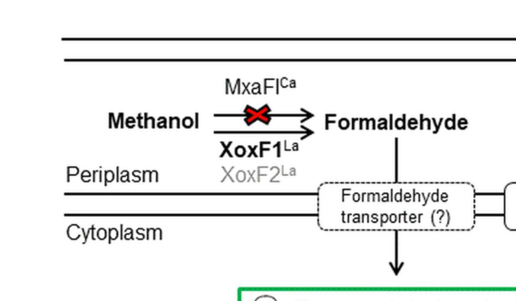

## Question

# Gene Research for Functional Annotation

## ⚠️ CRITICAL: Gene/Protein Identification Context

**BEFORE YOU BEGIN RESEARCH:** You MUST verify you are researching the CORRECT gene/protein. Gene symbols can be ambiguous, especially for less well-characterized genes from non-model organisms.

### Target Gene/Protein Identity (from UniProt):
- **UniProt Accession:** P14774
- **Protein Description:** RecName: Full=Cytochrome c-L; Flags: Precursor;
- **Gene Information:** Name=moxG; Synonyms=mxaG; OrderedLocusNames=MexAM1_META1p4536;
- **Organism (full):** Methylorubrum extorquens (strain ATCC 14718 / DSM 1338 / JCM 2805 / NCIMB 9133 / AM1) (Methylobacterium extorquens).
- **Protein Family:** Not specified in UniProt
- **Key Domains:** Cyt_c-like_dom. (IPR009056); Cyt_c-like_dom_sf. (IPR036909); Cyt_cL. (IPR009153); Cytochrome_CBB3 (PF13442)

### MANDATORY VERIFICATION STEPS:

1. **Check if the gene symbol "moxG" matches the protein description above**
2. **Verify the organism is correct:** Methylorubrum extorquens (strain ATCC 14718 / DSM 1338 / JCM 2805 / NCIMB 9133 / AM1) (Methylobacterium extorquens).
3. **Check if protein family/domains align with what you find in literature**
4. **If you find literature for a DIFFERENT gene with the same or similar symbol, STOP**

### If Gene Symbol is Ambiguous or You Cannot Find Relevant Literature:

**DO NOT PROCEED WITH RESEARCH ON A DIFFERENT GENE.** Instead:
- State clearly: "The gene symbol 'moxG' is ambiguous or literature is limited for this specific protein"
- Explain what you found (e.g., "Found extensive literature on a different gene with the same symbol in a different organism")
- Describe the protein based ONLY on the UniProt information provided above
- Suggest that the protein function can be inferred from domain/family information

### Research Target:

Please provide a comprehensive research report on the gene **moxG** (gene ID: mxaG, UniProt: P14774) in METEA.

The research report should be a detailed narrative explaining the function, biological processes, and localization of the gene product. Citations should be given for all claims.

You should prioritize authoritative reviews and primary scientific literature when conducting research. You can supplement
this with annotations you find in gene/protein databases, but these can be outdated or inaccurate.

We are specifically interested in the primary function of the gene - for enzymes, what reaction is catalyzed, and what is the substrate specificity? For transporters, what is the substrate? For structural proteins or adapters, what is the broader structural role? For signaling molecules, what is the role in the pathway.

We are interested in where in or outside the cell the gene product carries out its function.

We are also interested in the signaling or biochemical pathways in which the gene functions. We are less interested in broad pleiotropic effects, except where these elucidate the precise role.

Include evidence where possible. We are interested in both experimental evidence as well as inference from structure, evolution, or bioinformatic analysis. Precise studies should be prioritized over high-throughput, where available.

## Output

Question: You are an expert researcher providing comprehensive, well-cited information.

Provide detailed information focusing on:
1. Key concepts and definitions with current understanding
2. Recent developments and latest research (prioritize 2023-2024 sources)
3. Current applications and real-world implementations
4. Expert opinions and analysis from authoritative sources
5. Relevant statistics and data from recent studies

Format as a comprehensive research report with proper citations. Include URLs and publication dates where available.
Always prioritize recent, authoritative sources and provide specific citations for all major claims.

# Gene Research for Functional Annotation

## ⚠️ CRITICAL: Gene/Protein Identification Context

**BEFORE YOU BEGIN RESEARCH:** You MUST verify you are researching the CORRECT gene/protein. Gene symbols can be ambiguous, especially for less well-characterized genes from non-model organisms.

### Target Gene/Protein Identity (from UniProt):
- **UniProt Accession:** P14774
- **Protein Description:** RecName: Full=Cytochrome c-L; Flags: Precursor;
- **Gene Information:** Name=moxG; Synonyms=mxaG; OrderedLocusNames=MexAM1_META1p4536;
- **Organism (full):** Methylorubrum extorquens (strain ATCC 14718 / DSM 1338 / JCM 2805 / NCIMB 9133 / AM1) (Methylobacterium extorquens).
- **Protein Family:** Not specified in UniProt
- **Key Domains:** Cyt_c-like_dom. (IPR009056); Cyt_c-like_dom_sf. (IPR036909); Cyt_cL. (IPR009153); Cytochrome_CBB3 (PF13442)

### MANDATORY VERIFICATION STEPS:

1. **Check if the gene symbol "moxG" matches the protein description above**
2. **Verify the organism is correct:** Methylorubrum extorquens (strain ATCC 14718 / DSM 1338 / JCM 2805 / NCIMB 9133 / AM1) (Methylobacterium extorquens).
3. **Check if protein family/domains align with what you find in literature**
4. **If you find literature for a DIFFERENT gene with the same or similar symbol, STOP**

### If Gene Symbol is Ambiguous or You Cannot Find Relevant Literature:

**DO NOT PROCEED WITH RESEARCH ON A DIFFERENT GENE.** Instead:
- State clearly: "The gene symbol 'moxG' is ambiguous or literature is limited for this specific protein"
- Explain what you found (e.g., "Found extensive literature on a different gene with the same symbol in a different organism")
- Describe the protein based ONLY on the UniProt information provided above
- Suggest that the protein function can be inferred from domain/family information

### Research Target:

Please provide a comprehensive research report on the gene **moxG** (gene ID: mxaG, UniProt: P14774) in METEA.

The research report should be a detailed narrative explaining the function, biological processes, and localization of the gene product. Citations should be given for all claims.

You should prioritize authoritative reviews and primary scientific literature when conducting research. You can supplement
this with annotations you find in gene/protein databases, but these can be outdated or inaccurate.

We are specifically interested in the primary function of the gene - for enzymes, what reaction is catalyzed, and what is the substrate specificity? For transporters, what is the substrate? For structural proteins or adapters, what is the broader structural role? For signaling molecules, what is the role in the pathway.

We are interested in where in or outside the cell the gene product carries out its function.

We are also interested in the signaling or biochemical pathways in which the gene functions. We are less interested in broad pleiotropic effects, except where these elucidate the precise role.

Include evidence where possible. We are interested in both experimental evidence as well as inference from structure, evolution, or bioinformatic analysis. Precise studies should be prioritized over high-throughput, where available.

## Research report: *moxG / mxaG* (UniProt P14774) in *Methylorubrum extorquens* AM1

### 0) Target verification (critical identity check)

**User-specified target**: UniProt **P14774**, described as **Cytochrome c-L (precursor)**, gene **moxG** with synonym **mxaG**, in **Methylorubrum extorquens** strain **AM1**.

**Verification from retrieved literature**:
- In *Methylorubrum extorquens* AM1, the canonical methanol oxidation gene cluster includes **mxaG** within the operon **mxaFJGIRSACKLDEHB** (a 12.5-kb cluster) (publication date: **May 2003**) (https://doi.org/10.1128/jb.185.10.2980-2987.2003). This anchors *mxaG* in the correct organism and pathway context (chistoserdova2003methylotrophyinmethylobacterium pages 4-5).
- The same 2003 genomic analysis explicitly lists **mxaG (also noted as moxG)** and annotates it as a cytochrome c-type protein (Table 1 in that work) (publication date: **May 2003**) (https://doi.org/10.1128/jb.185.10.2980-2987.2003) (chistoserdova2003methylotrophyinmethylobacterium pages 2-3).
- Multiple sources explicitly identify **MxaG** as **cytochrome cL**, the cognate electron acceptor for periplasmic PQQ-dependent methanol dehydrogenases (MDH/PQQ-ADHs) in *Methylorubrum extorquens* AM1 or its historical name (*Methylobacterium extorquens*) (roszczenkojasinska2020geneproductsand pages 4-5, roszczenkojasinska2020geneproductsand pages 1-4, purves2019understandingtheimpacts pages 24-28).

**Limitations of the retrieved corpus**: the full UniProt accession **P14774** is not explicitly mentioned in the retrieved papers; thus the accession-level mapping is not directly evidenced here, but the **gene-symbol crosswalk mxaG ↔ moxG** in *M. extorquens* AM1 is supported (chistoserdova2003methylotrophyinmethylobacterium pages 2-3).

### 1) Key concepts and definitions (current understanding)

#### 1.1 What is cytochrome cL (MxaG/MoxG)?
Cytochrome **cL** is a **c-type cytochrome** that functions as the **physiological electron acceptor** for **periplasmic, PQQ-dependent alcohol/methanol dehydrogenases** used in methylotrophy (roszczenkojasinska2020geneproductsand pages 4-5, roszczenkojasinska2020geneproductsand pages 1-4, purves2019understandingtheimpacts pages 24-28). In *Methylorubrum extorquens* AM1, **MxaG** is specifically named as the cytochrome cL partner associated with methylotrophic PQQ-ADHs (roszczenkojasinska2020geneproductsand pages 4-5, roszczenkojasinska2020geneproductsand pages 1-4).

#### 1.2 PQQ-dependent methanol oxidation and electron transfer
In periplasmic methanol oxidation, **methanol dehydrogenase (MDH)** oxidizes methanol to formaldehyde and reduces the prosthetic group **PQQ**. The reduced PQQ is then reoxidized by transferring electrons to the heme of **cytochrome cL**, which passes electrons further into the electron transport chain (roszczenkojasinska2020geneproductsand pages 4-5, roszczenkojasinska2020geneproductsand pages 1-4, rojas2021elucidationofthe pages 19-23, rojas2021elucidationofthea pages 19-23).

#### 1.3 “MOX/mxa” gene cluster and operon organization
A foundational genomic analysis of *M. extorquens* AM1 describes a **12.5-kb cluster** containing **14 mxa genes (mxaFJGIRSACKLDEHB)** transcribed in the same direction; these genes encode methanol dehydrogenase structural polypeptides and the **specific cytochrome c that accepts electrons from methanol dehydrogenase**, along with other essential methanol oxidation proteins (https://doi.org/10.1128/jb.185.10.2980-2987.2003; publication date **May 2003**) (chistoserdova2003methylotrophyinmethylobacterium pages 4-5).

### 2) Functional annotation of *moxG/mxaG*: molecular function, pathway role, and localization

#### 2.1 Primary molecular function
**Best-supported function**: *moxG/mxaG* encodes **cytochrome cL (MxaG)**, which **accepts electrons** derived from MDH/PQQ chemistry and **transfers them onward** to additional cytochromes in the electron transport chain.

Evidence:
- “All methylotrophic PQQ-ADHs are periplasmic enzymes associated with a cytochrome cL (MxaG, XoxG, and ExaG, respectively) that transfers electrons from PQQ to additional cytochromes in the electron transport chain.” (publication date **Jul 2020**, *Scientific Reports*, https://doi.org/10.1038/s41598-020-69401-4) (roszczenkojasinska2020geneproductsand pages 1-4).
- The AM1 genome analysis states that the 14-gene mxa cluster encodes MDH structural polypeptides and “the specific cytochrome c that accepts electrons from methanol dehydrogenase” (publication date **May 2003**, *Journal of Bacteriology*, https://doi.org/10.1128/jb.185.10.2980-2987.2003) (chistoserdova2003methylotrophyinmethylobacterium pages 4-5).
- Mechanistically, reduced PQQ is reoxidized by transferring electrons to the heme of cytochrome cL, which is then oxidized by downstream cytochromes (rojas2021elucidationofthe pages 19-23, rojas2021elucidationofthea pages 19-23).

**Reaction context (what MxaG enables rather than catalyzes)**: MxaG itself does not catalyze methanol oxidation; rather, it **mediates electron transfer** from the MDH redox cofactor (PQQ) to downstream respiratory components (roszczenkojasinska2020geneproductsand pages 4-5, roszczenkojasinska2020geneproductsand pages 1-4, rojas2021elucidationofthe pages 19-23, rojas2021elucidationofthea pages 19-23).

#### 2.2 Biological process and pathway placement
*moxG/mxaG* is part of **aerobic methylotrophic methanol utilization**, specifically the **periplasmic methanol-oxidation module** that feeds electrons into respiration.

- Methanol oxidation is described as occurring in the **periplasm** via PQQ-dependent ADHs in *M. extorquens* AM1, and these enzymes are associated with cytochrome cL (roszczenkojasinska2020geneproductsand pages 1-4).
- Electrons are transferred from PQQ to cytochrome cL and then to additional cytochromes/respiratory chain components, coupling methanol oxidation to energy generation (roszczenkojasinska2020geneproductsand pages 4-5, roszczenkojasinska2020geneproductsand pages 1-4, rojas2021elucidationofthe pages 19-23, rojas2021elucidationofthea pages 19-23).

#### 2.3 Subcellular localization
The strongest localization inference supported by the retrieved evidence is **periplasmic association**:
- Methylotrophic PQQ-ADHs are explicitly described as **periplasmic** and **associated with cytochrome cL** (roszczenkojasinska2020geneproductsand pages 1-4). This supports that cytochrome cL (MxaG) functions in the **periplasmic electron-transfer chain** (roszczenkojasinska2020geneproductsand pages 1-4).
- A schematic figure from Roszczenko-Jasińska et al. depicts methanol oxidation in the **periplasm** by MxaFI and XoxF enzymes (Figure 1; publication date **Jul 2020**, https://doi.org/10.1038/s41598-020-69401-4) (roszczenkojasinska2020geneproductsand media 5e588001).

### 3) Recent developments and latest research (emphasis 2023–2024)

#### 3.1 2023: rare-earth element (REE/lanthanide) “switch” and relationship to cytochrome partners
A 2023 review focused on rare earth element utilization summarizes the **division of labor** between Ca-dependent MxaFI MDH systems and lanthanide-dependent XoxF MDH systems and explicitly places **mxaG** as encoding the **cognate physiological electron acceptor (cytochrome cL)** for methanol oxidation (xie2023molecularmechanismsof pages 13-18). It also describes a widely reported regulatory phenomenon: in the presence of lanthanides, expression of MxaF-type systems is suppressed while XoxF-type systems are induced (xie2023molecularmechanismsof pages 13-18). 

Interpretation for *moxG/mxaG*: in organisms/conditions where the **XoxF system dominates**, cytochrome **XoxG** (a cytochrome cL analog) may be the primary periplasmic electron acceptor for lanthanide-dependent MDH, while **MxaG** remains the canonical partner for the Ca-dependent MxaFI MDH (roszczenkojasinska2020geneproductsand pages 1-4, xie2023molecularmechanismsof pages 13-18).

#### 3.2 2024: ecosystem-scale framing of lanthanide methylotrophy (limited mxaG-specific detail)
Although a 2024 source was retrieved related to widespread bacterial use of lanthanides, the accessible evidence in this run did not provide mxaG-specific mechanistic or quantitative updates suitable for citation about MxaG itself.

### 4) Current applications and real-world implementations

#### 4.1 Engineering and “C1-bioeconomy” context
The methylotroph *Methylorubrum extorquens* AM1 is repeatedly framed in the literature as a platform organism for methanol-based biotechnology. In this context, methanol oxidation (and therefore functional electron transfer via cytochrome partners such as MxaG) is central to growth and productivity on methanol (purves2019understandingtheimpacts pages 24-28). While this run’s strongest application-specific citation is general rather than mechanistically focused, it supports that AM1 has been used for bioproduction in applied settings (purves2019understandingtheimpacts pages 24-28).

#### 4.2 Metal/lanthanide-relevant applications (contextual)
A major applied motivation discussed for *M. extorquens* AM1 is the capacity of methylotrophs to sense/transport lanthanides, with potential relevance to sustainable recovery of lanthanides; however, this run’s strongest lanthanide-focused evidence addresses transport/storage and XoxF function more than MxaG itself (roszczenkojasinska2020geneproductsand pages 1-4).

### 5) Expert opinions / authoritative synthesis from high-citation sources

- **Chistoserdova et al. (2003, Journal of Bacteriology)** provides a highly cited genomic synthesis of methylotrophy modules in AM1, emphasizing that the mxa cluster encodes MDH structural polypeptides and the specific cytochrome c electron acceptor, supporting the canonical view of mxaG/moxG as part of the methanol oxidation module (https://doi.org/10.1128/jb.185.10.2980-2987.2003; publication date **May 2003**) (chistoserdova2003methylotrophyinmethylobacterium pages 4-5).
- **Roszczenko-Jasińska et al. (2020, Scientific Reports)** provides an authoritative summary for AM1 that explicitly identifies cytochrome cL partners (MxaG/XoxG/ExaG) and their role transferring electrons from PQQ to the electron transport chain, reinforcing the accepted functional definition (https://doi.org/10.1038/s41598-020-69401-4; publication date **Jul 2020**) (roszczenkojasinska2020geneproductsand pages 1-4).

### 6) Statistics and data points from retrieved studies (recent where possible)

The retrieved corpus contained limited directly mxaG-specific quantitative biochemistry (e.g., redox potentials, kcat/KM) suitable for extraction. However, two quantitative/structured datapoints relevant to confidence in methylotrophy network assignment include:
- In a transposon mutagenesis study in AM1 focused on lanthanide-dependent methanol metabolism, the authors screened **>600 transposon mutants** and followed up genes identified independently **four or more times** (28 genes), with some mutants showing **≥30% reductions in growth rate**; this supports the utility of genetic approaches in mapping methanol oxidation accessory functions, though it is not a direct measurement of MxaG activity (roszczenkojasinska2020geneproductsand pages 5-6).
- The 2003 genomic work defines the mxa cluster size (**12.5 kb**) and gene count (**14 mxa genes**) as a structured genomic feature of the AM1 methanol oxidation module (chistoserdova2003methylotrophyinmethylobacterium pages 4-5).

### 7) Summary of supported annotation (concise)

- **Gene / protein**: *moxG* (syn. *mxaG*) encodes **cytochrome cL** in *Methylorubrum extorquens* AM1 (roszczenkojasinska2020geneproductsand pages 1-4, purves2019understandingtheimpacts pages 24-28, chistoserdova2003methylotrophyinmethylobacterium pages 2-3).
- **Primary role**: **electron acceptor/shuttle** for methanol oxidation via PQQ-dependent MDH/PQQ-ADHs; transfers electrons onward to additional cytochromes/respiration (roszczenkojasinska2020geneproductsand pages 4-5, roszczenkojasinska2020geneproductsand pages 1-4, rojas2021elucidationofthe pages 19-23, rojas2021elucidationofthea pages 19-23).
- **Localization**: functionally associated with **periplasmic** methanol oxidation enzyme systems (roszczenkojasinska2020geneproductsand pages 1-4, roszczenkojasinska2020geneproductsand media 5e588001).
- **Genomic context**: part of the **mxa operon** (mxaFJGIRSACKLDEHB) that encodes MDH components and the specific cytochrome c electron acceptor (chistoserdova2003methylotrophyinmethylobacterium pages 4-5).

### Evidence map

| Claim (function/localization/pathway) | Evidence summary | Organism/strain context | Source (with year, journal, URL) | Citation id |
|---|---|---|---|---|
| mxaG encodes cytochrome cL, the cognate electron acceptor associated with methanol dehydrogenase | Review text explicitly states that methylotrophic PQQ-dependent alcohol dehydrogenases are associated with cytochrome cL and names MxaG as the cytochrome cL partner; another source states that mxaG encodes cytochrome cL and identifies it as the primary electron acceptor in the MDH system. | Methylorubrum extorquens AM1 / historical Methylobacterium extorquens context | Roszczenko-Jasińska et al., 2020, *Scientific Reports*, https://doi.org/10.1038/s41598-020-69401-4; Purves, 2019, unknown journal, URL not available in retrieved record | (roszczenkojasinska2020geneproductsand pages 4-5, roszczenkojasinska2020geneproductsand pages 1-4, purves2019understandingtheimpacts pages 24-28) |
| Cytochrome cL functions in the periplasmic methanol-oxidation electron transfer chain | Evidence states methanol oxidation occurs in the periplasm via PQQ-dependent ADHs/MDH, and that the associated cytochrome cL transfers electrons from reduced PQQ to additional cytochromes in the electron transport chain. | Methylorubrum extorquens AM1 | Roszczenko-Jasińska et al., 2020, *Scientific Reports*, https://doi.org/10.1038/s41598-020-69401-4 | (roszczenkojasinska2020geneproductsand pages 4-5, roszczenkojasinska2020geneproductsand pages 1-4) |
| In Methylobacterium/Methylorubrum extorquens, mxaG is genetically part of the mxa methanol dehydrogenase cluster | The mxa operon is described as mxaFJGIRSACKLDEHB, placing mxaG within the canonical methanol dehydrogenase gene cluster and supporting its dedicated role in MDH function. | Methylorubrum extorquens AM1 | Roszczenko-Jasińska et al., 2020, *Scientific Reports*, https://doi.org/10.1038/s41598-020-69401-4 | (roszczenkojasinska2020geneproductsand pages 4-5) |
| Electron flow proceeds from MDH-reduced PQQ to cytochrome cL | A source describes that methanol oxidation by periplasmic MDH reduces PQQ, and the reduced PQQ is then reoxidized by transfer of two electrons to the heme of cytochrome cL. | Historical naming: Methylobacterium extorquens (same species complex as Methylorubrum extorquens) | Rojas, 2021, unknown journal, URL not available in retrieved record | (rojas2021elucidationofthe pages 19-23, rojas2021elucidationofthea pages 19-23) |
| Cytochrome cL passes electrons onward to downstream cytochromes/respiratory components | One source states cytochrome cL transfers electrons from PQQ to additional cytochromes in the electron transport chain; another states cytochrome cL is oxidized by cytochrome cH, linking methanol oxidation to respiration and energy conservation. | Methylorubrum extorquens AM1 / historical Methylobacterium extorquens context | Roszczenko-Jasińska et al., 2020, *Scientific Reports*, https://doi.org/10.1038/s41598-020-69401-4; Rojas, 2021, unknown journal, URL not available in retrieved record | (roszczenkojasinska2020geneproductsand pages 4-5, rojas2021elucidationofthe pages 19-23, rojas2021elucidationofthea pages 19-23) |
| Methanol oxidation enzymes and their cytochrome cL partner are localized in the periplasm | The evidence states that methylotrophic PQQ-ADHs are periplasmic and associated with cytochrome cL; a figure-based summary also depicts methanol oxidation in the periplasm by MxaFI/XoxF enzymes. | Methylorubrum extorquens AM1 | Roszczenko-Jasińska et al., 2020, *Scientific Reports*, https://doi.org/10.1038/s41598-020-69401-4 | (roszczenkojasinska2020geneproductsand pages 1-4, roszczenkojasinska2020geneproductsand media 5e588001) |
| The gathered literature supports mxaG as the relevant symbol; explicit use of the synonym moxG was not found in the retrieved evidence | Across the directly gathered evidence, the gene is referred to as mxaG encoding cytochrome cL; the retrieved texts did not explicitly mention the synonym moxG or UniProt P14774. | Methylorubrum extorquens AM1 / historical Methylobacterium extorquens context | Roszczenko-Jasińska et al., 2020, *Scientific Reports*, https://doi.org/10.1038/s41598-020-69401-4; Rojas, 2021, unknown journal, URL not available in retrieved record; Purves, 2019, unknown journal, URL not available in retrieved record | (roszczenkojasinska2020geneproductsand pages 4-5, roszczenkojasinska2020geneproductsand pages 1-4, rojas2021elucidationofthe pages 19-23, rojas2021elucidationofthea pages 19-23, purves2019understandingtheimpacts pages 24-28) |

*Table: This table summarizes directly supported functional annotation claims for Methylorubrum extorquens AM1 moxG/mxaG (cytochrome cL), including function, localization, and pathway role. It is useful as a traceable evidence map restricted to the gathered sources and context IDs.*

References

1. (chistoserdova2003methylotrophyinmethylobacterium pages 4-5): Ludmila Chistoserdova, Sung-Wei Chen, Alla Lapidus, and Mary E. Lidstrom. Methylotrophy in methylobacterium extorquens am1 from a genomic point of view. Journal of Bacteriology, 185:2980-2987, May 2003. URL: https://doi.org/10.1128/jb.185.10.2980-2987.2003, doi:10.1128/jb.185.10.2980-2987.2003. This article has 402 citations and is from a peer-reviewed journal.

2. (chistoserdova2003methylotrophyinmethylobacterium pages 2-3): Ludmila Chistoserdova, Sung-Wei Chen, Alla Lapidus, and Mary E. Lidstrom. Methylotrophy in methylobacterium extorquens am1 from a genomic point of view. Journal of Bacteriology, 185:2980-2987, May 2003. URL: https://doi.org/10.1128/jb.185.10.2980-2987.2003, doi:10.1128/jb.185.10.2980-2987.2003. This article has 402 citations and is from a peer-reviewed journal.

3. (roszczenkojasinska2020geneproductsand pages 4-5): Paula Roszczenko-Jasińska, Huong N. Vu, Gabriel A. Subuyuj, Ralph Valentine Crisostomo, James Cai, Nicholas F. Lien, Erik J. Clippard, Elena M. Ayala, Richard T. Ngo, Fauna Yarza, Justin P. Wingett, Charumathi Raghuraman, Caitlin A. Hoeber, Norma C. Martinez-Gomez, and Elizabeth Skovran. Gene products and processes contributing to lanthanide homeostasis and methanol metabolism in methylorubrum extorquens am1. Scientific Reports, Jul 2020. URL: https://doi.org/10.1038/s41598-020-69401-4, doi:10.1038/s41598-020-69401-4. This article has 98 citations and is from a peer-reviewed journal.

4. (roszczenkojasinska2020geneproductsand pages 1-4): Paula Roszczenko-Jasińska, Huong N. Vu, Gabriel A. Subuyuj, Ralph Valentine Crisostomo, James Cai, Nicholas F. Lien, Erik J. Clippard, Elena M. Ayala, Richard T. Ngo, Fauna Yarza, Justin P. Wingett, Charumathi Raghuraman, Caitlin A. Hoeber, Norma C. Martinez-Gomez, and Elizabeth Skovran. Gene products and processes contributing to lanthanide homeostasis and methanol metabolism in methylorubrum extorquens am1. Scientific Reports, Jul 2020. URL: https://doi.org/10.1038/s41598-020-69401-4, doi:10.1038/s41598-020-69401-4. This article has 98 citations and is from a peer-reviewed journal.

5. (purves2019understandingtheimpacts pages 24-28): K Purves. Understanding the impacts of viruses on microbial methanol utilisation in seawater. Unknown journal, 2019.

6. (rojas2021elucidationofthe pages 19-23): J Rojas. Elucidation of the plant growth–promoting effect of hartmannibacter diazotrophicus on tolerance of barley to salt stress. Unknown journal, 2021.

7. (rojas2021elucidationofthea pages 19-23): J Rojas. Elucidation of the plant growth–promoting effect of hartmannibacter diazotrophicus on tolerance of barley to salt stress. Unknown journal, 2021.

8. (roszczenkojasinska2020geneproductsand media 5e588001): Paula Roszczenko-Jasińska, Huong N. Vu, Gabriel A. Subuyuj, Ralph Valentine Crisostomo, James Cai, Nicholas F. Lien, Erik J. Clippard, Elena M. Ayala, Richard T. Ngo, Fauna Yarza, Justin P. Wingett, Charumathi Raghuraman, Caitlin A. Hoeber, Norma C. Martinez-Gomez, and Elizabeth Skovran. Gene products and processes contributing to lanthanide homeostasis and methanol metabolism in methylorubrum extorquens am1. Scientific Reports, Jul 2020. URL: https://doi.org/10.1038/s41598-020-69401-4, doi:10.1038/s41598-020-69401-4. This article has 98 citations and is from a peer-reviewed journal.

9. (xie2023molecularmechanismsof pages 13-18): R Xie. Molecular mechanisms of rare earth element utilization by methane-oxidizing bacteria and protease-producing bacteria. Unknown journal, 2023.

10. (roszczenkojasinska2020geneproductsand pages 5-6): Paula Roszczenko-Jasińska, Huong N. Vu, Gabriel A. Subuyuj, Ralph Valentine Crisostomo, James Cai, Nicholas F. Lien, Erik J. Clippard, Elena M. Ayala, Richard T. Ngo, Fauna Yarza, Justin P. Wingett, Charumathi Raghuraman, Caitlin A. Hoeber, Norma C. Martinez-Gomez, and Elizabeth Skovran. Gene products and processes contributing to lanthanide homeostasis and methanol metabolism in methylorubrum extorquens am1. Scientific Reports, Jul 2020. URL: https://doi.org/10.1038/s41598-020-69401-4, doi:10.1038/s41598-020-69401-4. This article has 98 citations and is from a peer-reviewed journal.

## Artifacts

- [Edison artifact artifact-00](mxaG-deep-research-falcon_artifacts/artifact-00.md)

## Citations

1. chistoserdova2003methylotrophyinmethylobacterium pages 4-5
2. chistoserdova2003methylotrophyinmethylobacterium pages 2-3
3. roszczenkojasinska2020geneproductsand pages 1-4
4. xie2023molecularmechanismsof pages 13-18
5. purves2019understandingtheimpacts pages 24-28
6. roszczenkojasinska2020geneproductsand pages 5-6
7. roszczenkojasinska2020geneproductsand pages 4-5
8. rojas2021elucidationofthe pages 19-23
9. rojas2021elucidationofthea pages 19-23
10. https://doi.org/10.1128/jb.185.10.2980-2987.2003
11. https://doi.org/10.1128/jb.185.10.2980-2987.2003;
12. https://doi.org/10.1038/s41598-020-69401-4
13. https://doi.org/10.1038/s41598-020-69401-4;
14. https://doi.org/10.1128/jb.185.10.2980-2987.2003,
15. https://doi.org/10.1038/s41598-020-69401-4,