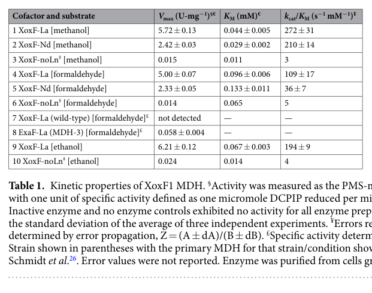

## Question

# Gene Research for Functional Annotation

## ⚠️ CRITICAL: Gene/Protein Identification Context

**BEFORE YOU BEGIN RESEARCH:** You MUST verify you are researching the CORRECT gene/protein. Gene symbols can be ambiguous, especially for less well-characterized genes from non-model organisms.

### Target Gene/Protein Identity (from UniProt):
- **UniProt Accession:** P14775
- **Protein Description:** RecName: Full=Methanol dehydrogenase [cytochrome c] subunit 2; EC=1.1.2.7; AltName: Full=MDH small subunit beta; AltName: Full=MDH-associated peptide; AltName: Full=MEDH; Flags: Precursor;
- **Gene Information:** Name=moxI; Synonyms=mxaI; OrderedLocusNames=MexAM1_META1p4535;
- **Organism (full):** Methylorubrum extorquens (strain ATCC 14718 / DSM 1338 / JCM 2805 / NCIMB 9133 / AM1) (Methylobacterium extorquens).
- **Protein Family:** Belongs to the methanol dehydrogenase subunit 2 family.
- **Key Domains:** Meth_DH_bsu. (IPR003420); Meth_DH_bsu_sf. (IPR036557); MDH (PF02315)

### MANDATORY VERIFICATION STEPS:

1. **Check if the gene symbol "moxI" matches the protein description above**
2. **Verify the organism is correct:** Methylorubrum extorquens (strain ATCC 14718 / DSM 1338 / JCM 2805 / NCIMB 9133 / AM1) (Methylobacterium extorquens).
3. **Check if protein family/domains align with what you find in literature**
4. **If you find literature for a DIFFERENT gene with the same or similar symbol, STOP**

### If Gene Symbol is Ambiguous or You Cannot Find Relevant Literature:

**DO NOT PROCEED WITH RESEARCH ON A DIFFERENT GENE.** Instead:
- State clearly: "The gene symbol 'moxI' is ambiguous or literature is limited for this specific protein"
- Explain what you found (e.g., "Found extensive literature on a different gene with the same symbol in a different organism")
- Describe the protein based ONLY on the UniProt information provided above
- Suggest that the protein function can be inferred from domain/family information

### Research Target:

Please provide a comprehensive research report on the gene **moxI** (gene ID: mxaI, UniProt: P14775) in METEA.

The research report should be a detailed narrative explaining the function, biological processes, and localization of the gene product. Citations should be given for all claims.

You should prioritize authoritative reviews and primary scientific literature when conducting research. You can supplement
this with annotations you find in gene/protein databases, but these can be outdated or inaccurate.

We are specifically interested in the primary function of the gene - for enzymes, what reaction is catalyzed, and what is the substrate specificity? For transporters, what is the substrate? For structural proteins or adapters, what is the broader structural role? For signaling molecules, what is the role in the pathway.

We are interested in where in or outside the cell the gene product carries out its function.

We are also interested in the signaling or biochemical pathways in which the gene functions. We are less interested in broad pleiotropic effects, except where these elucidate the precise role.

Include evidence where possible. We are interested in both experimental evidence as well as inference from structure, evolution, or bioinformatic analysis. Precise studies should be prioritized over high-throughput, where available.

## Output

Question: You are an expert researcher providing comprehensive, well-cited information.

Provide detailed information focusing on:
1. Key concepts and definitions with current understanding
2. Recent developments and latest research (prioritize 2023-2024 sources)
3. Current applications and real-world implementations
4. Expert opinions and analysis from authoritative sources
5. Relevant statistics and data from recent studies

Format as a comprehensive research report with proper citations. Include URLs and publication dates where available.
Always prioritize recent, authoritative sources and provide specific citations for all major claims.

# Gene Research for Functional Annotation

## ⚠️ CRITICAL: Gene/Protein Identification Context

**BEFORE YOU BEGIN RESEARCH:** You MUST verify you are researching the CORRECT gene/protein. Gene symbols can be ambiguous, especially for less well-characterized genes from non-model organisms.

### Target Gene/Protein Identity (from UniProt):
- **UniProt Accession:** P14775
- **Protein Description:** RecName: Full=Methanol dehydrogenase [cytochrome c] subunit 2; EC=1.1.2.7; AltName: Full=MDH small subunit beta; AltName: Full=MDH-associated peptide; AltName: Full=MEDH; Flags: Precursor;
- **Gene Information:** Name=moxI; Synonyms=mxaI; OrderedLocusNames=MexAM1_META1p4535;
- **Organism (full):** Methylorubrum extorquens (strain ATCC 14718 / DSM 1338 / JCM 2805 / NCIMB 9133 / AM1) (Methylobacterium extorquens).
- **Protein Family:** Belongs to the methanol dehydrogenase subunit 2 family.
- **Key Domains:** Meth_DH_bsu. (IPR003420); Meth_DH_bsu_sf. (IPR036557); MDH (PF02315)

### MANDATORY VERIFICATION STEPS:

1. **Check if the gene symbol "moxI" matches the protein description above**
2. **Verify the organism is correct:** Methylorubrum extorquens (strain ATCC 14718 / DSM 1338 / JCM 2805 / NCIMB 9133 / AM1) (Methylobacterium extorquens).
3. **Check if protein family/domains align with what you find in literature**
4. **If you find literature for a DIFFERENT gene with the same or similar symbol, STOP**

### If Gene Symbol is Ambiguous or You Cannot Find Relevant Literature:

**DO NOT PROCEED WITH RESEARCH ON A DIFFERENT GENE.** Instead:
- State clearly: "The gene symbol 'moxI' is ambiguous or literature is limited for this specific protein"
- Explain what you found (e.g., "Found extensive literature on a different gene with the same symbol in a different organism")
- Describe the protein based ONLY on the UniProt information provided above
- Suggest that the protein function can be inferred from domain/family information

### Research Target:

Please provide a comprehensive research report on the gene **moxI** (gene ID: mxaI, UniProt: P14775) in METEA.

The research report should be a detailed narrative explaining the function, biological processes, and localization of the gene product. Citations should be given for all claims.

You should prioritize authoritative reviews and primary scientific literature when conducting research. You can supplement
this with annotations you find in gene/protein databases, but these can be outdated or inaccurate.

We are specifically interested in the primary function of the gene - for enzymes, what reaction is catalyzed, and what is the substrate specificity? For transporters, what is the substrate? For structural proteins or adapters, what is the broader structural role? For signaling molecules, what is the role in the pathway.

We are interested in where in or outside the cell the gene product carries out its function.

We are also interested in the signaling or biochemical pathways in which the gene functions. We are less interested in broad pleiotropic effects, except where these elucidate the precise role.

Include evidence where possible. We are interested in both experimental evidence as well as inference from structure, evolution, or bioinformatic analysis. Precise studies should be prioritized over high-throughput, where available.

## Research Report: Functional annotation of **moxI / mxaI** (UniProt **P14775**) in *Methylorubrum extorquens* strain AM1

### 0) Mandatory identity verification (to avoid gene-symbol ambiguity)
The target protein is UniProt P14775 from *Methylorubrum extorquens* AM1 (formerly *Methylobacterium extorquens* AM1), annotated as “Methanol dehydrogenase [cytochrome c] subunit 2” (small/beta subunit) encoded by **moxI / mxaI**.

Genome-based methylotrophy annotation for AM1 explicitly assigns **mxaI** as “methanol dehydrogenase small subunit,” with the previous name **moxI** and links it to the methanol oxidation (MOX) gene module (co-located with **mxaF** and **mxaG**) (Chistoserdova et al., 2003, published May 2003, https://doi.org/10.1128/JB.185.10.2980-2987.2003) (chistoserdova2003methylotrophyinmethylobacterium pages 2-3). This matches the UniProt-provided identity and organism context.

### 1) Key concepts, definitions, and current understanding
#### 1.1 Canonical methanol oxidation in Gram-negative methylotrophs
In *Methylorubrum/Methylobacterium* methylotrophs, the canonical primary oxidation step is catalyzed by a periplasmic, pyrroloquinoline quinone (PQQ)-dependent **methanol dehydrogenase (MDH)** that oxidizes **methanol → formaldehyde**, producing reducing equivalents that enter the periplasmic electron transfer chain (schmidt2010functionalinvestigationof pages 10-14, schmidt2010functionalinvestigationof pages 14-17).

#### 1.2 What MoxI/MxaI is
**MxaI (MoxI)** is the **small (β) subunit** of the canonical Ca2+/PQQ-dependent MDH system encoded in the **mxa/mox (MOX) gene cluster** in AM1 (chistoserdova2003methylotrophyinmethylobacterium pages 2-3). A recent synthesis source describes the canonical MxaFI MDH as an **α2β2 heterotetramer** consisting of **two large catalytic MxaF (α) subunits and two small MxaI (β) subunits** (xie2023molecularmechanismsofb pages 13-18, xie2023molecularmechanismsof pages 13-18).

#### 1.3 The MxaFI respiratory electron transfer context (partners)
The periplasmic methanol oxidation chain is commonly described as: **MDH → cytochrome cL → cytochrome cH → terminal oxidase → O2** (schmidt2010functionalinvestigationof pages 14-17). In AM1, **mxaG** is annotated as the cytochrome c component associated with MDH electron transfer (chistoserdova2003methylotrophyinmethylobacterium pages 2-3).

A key mechanistic point from experimental literature is that MDH–cytochrome cL interaction is primarily electrostatic and (in cross-linking/interaction studies summarized there) is associated mainly with the **MxaF α-subunit** rather than the β-subunit, implying MxaI is not the dominant cytochrome cL-contacting interface (schmidt2010functionalinvestigationof pages 14-17).

### 2) Functional role of MoxI/MxaI in AM1
#### 2.1 Primary function in the cell
MoxI/MxaI’s primary functional assignment is as the **structural/auxiliary small subunit** required for the functional **MxaFI** periplasmic methanol dehydrogenase complex, enabling the organism’s canonical methanol oxidation capacity when Ca/PQQ MDH is expressed/assembled (chistoserdova2003methylotrophyinmethylobacterium pages 2-3, xie2023molecularmechanismsofb pages 13-18, xie2023molecularmechanismsof pages 13-18).

While the **catalytic chemistry (EC 1.1.2.7)** is attributed to the MDH holoenzyme, the pathway-level reaction catalyzed by the MxaFI system is clearly described as oxidation of methanol to **formaldehyde** in the periplasm in AM1-like systems (schmidt2010functionalinvestigationof pages 10-14, schmidt2010functionalinvestigationof pages 14-17). Substrate specificity at the complex level is methanol oxidation in this canonical pathway context (schmidt2010functionalinvestigationof pages 10-14).

#### 2.2 Subcellular localization and processing
The canonical PQQ-dependent MDH system is described as **periplasmic** in Gram-negative methylotrophs including AM1 (schmidt2010functionalinvestigationof pages 10-14, schmidt2010functionalinvestigationof pages 14-17). In addition, PQQ biogenesis and MDH assembly are described such that cofactor/apoenzyme trafficking leads to **periplasmic holoenzyme formation**, consistent with periplasmic localization of the active enzyme complex containing MxaI (schmidt2010functionalinvestigationof pages 31-34).

**Important evidence limitation:** within the retrieved corpus, there is *not* a direct, gene-specific statement describing the **MxaI signal peptide** or explicit “precursor processing” details for AM1 MxaI itself. Therefore, MxaI’s periplasmic functional location is inferred from its role as a subunit of the periplasmic MxaFI complex rather than from a directly cited MxaI signal-peptide experiment in the retrieved texts (schmidt2010functionalinvestigationof pages 31-34, schmidt2010functionalinvestigationof pages 14-17).

### 3) Pathways and systems context
#### 3.1 The methanol oxidation module (MOX)
AM1 genome synthesis places **mxaI/moxI**, **mxaF/moxF**, and **mxaG/moxG** together in the primary oxidation (MOX) module/cluster (chistoserdova2003methylotrophyinmethylobacterium pages 2-3). Multiple additional genes in the same broader mxa system are annotated as required for MDH function, including factors “essential for Ca2+ insertion into MDH” and PQQ synthesis genes (chistoserdova2003methylotrophyinmethylobacterium pages 2-3).

#### 3.2 Lanthanide (REE) switch and implications for mxaI
A major development in methylotrophy is the recognition that expression of canonical Ca-dependent **MxaFI** and alternative lanthanide-dependent **XoxF** systems is inversely regulated depending on lanthanide availability (“lanthanide switch/REE switch”), with the presence of rare earth elements tending to suppress MxaFI-type expression and promote XoxF-type MDH expression (good2019contrastinginvitro pages 1-2, xie2023molecularmechanismsofb pages 13-18, xie2023molecularmechanismsof pages 13-18).

In AM1 specifically, transcriptomic results under lanthanum conditions are described as **upregulation of xox1 and downregulation of mxa genes**, consistent with this switch (Good et al., 2019; published 2019; https://doi.org/10.1038/s41598-019-41043-1) (good2019contrastinginvitro pages 1-2). This regulation affects the functional deployment of MxaI because MxaI is part of the MxaFI system that is downregulated under lanthanides.

### 4) Recent developments (prioritizing 2023–2024 sources where available)
#### 4.1 2023 synthesis: MDH composition and REE switch
A 2023 synthesis source reiterates the canonical architecture that **MxaFI MDH** comprises **two MxaF catalytic subunits and two MxaI small subunits** and summarizes the REE switch regulatory logic that suppresses MxaF-type and promotes XoxF-type MDHs under lanthanides (xie2023molecularmechanismsofb pages 13-18, xie2023molecularmechanismsof pages 13-18). While not AM1-primary experimental work, it reflects current consensus framing of the system.

#### 4.2 2024 systems view: methylotroph core gene sets (context)
A 2024 pangenomic analysis of type II methylotrophs provides broader context that methylotroph genomes commonly contain periplasmic and cytoplasmic gene complements (including MDH subunits), supporting the view that periplasmic primary oxidation is a conserved feature (Samanta et al., 2024; published Jun 2024; https://doi.org/10.1128/msystems.00248-24) (samanta2024fromgenometo pages referenced in search results; no direct mxaI-specific statement was extracted in current evidence set).

**Note on 2023–2024 AM1-primary literature:** In the retrieved documents, direct 2023–2024 primary experimental studies focused specifically on AM1 **mxaI** (rather than on the broader MDH systems) were limited; thus, some gene-specific details remain supported primarily by foundational AM1 literature and broader recent syntheses.

### 5) Quantitative data and recent statistics
#### 5.1 Methanol induces canonical MDH system
For AM1, methanol growth is associated with strong induction of the canonical MDH system at the transcription/activity level: **mxaF transcription is 5–10× higher on methanol than on succinate**, and overall MDH activity is **~6× induced** during growth on methanol (Schmidt et al., 2010; published Aug 2010; https://doi.org/10.1099/mic.0.038570-0) (schmidt2010functionalinvestigationof pages 31-34). While this is reported for mxaF/MDH activity rather than mxaI alone, it reflects system-level induction of the MxaFI complex in which MxaI participates.

#### 5.2 Lanthanum improves growth rate and shifts expression away from mxa genes
Addition of exogenous lanthanum is reported to increase methanol growth rate by **~9–12%**, and transcriptomics is summarized as showing **downregulation of mxa genes** with lanthanum methanol growth (Good et al., 2019; https://doi.org/10.1038/s41598-019-41043-1) (good2019contrastinginvitro pages 1-2). Because mxaI is within the mxa cluster, it is expected to follow this switch behavior at the operon/module level.

#### 5.3 Alternative Ln-dependent MDH kinetics (context for when MxaI system is suppressed)
Good et al. (2019) provides kinetic parameters for XoxF1 purified with lanthanides and assayed by DCPIP reduction. The extracted Table 1 (image evidence) reports quantitative values for Vmax, KM, and catalytic efficiency for methanol/formaldehyde/ethanol substrates for La- and Nd-containing enzyme (good2019contrastinginvitro media 8ffe6924, good2019contrastinginvitro media bb7d04f0). This does not measure MxaI directly, but it quantifies the alternative periplasmic oxidation system that becomes dominant under lanthanides and thereby provides a quantitative “replacement context” for MxaI-containing MxaFI under the lanthanide switch.

### 6) Current applications and real-world implementations
A direct real-world application demonstrated in AM1 involves lanthanide-dependent methylotrophy and lanthanide acquisition/handling machinery (which functionally interfaces with periplasmic alcohol dehydrogenase systems and the MxaFI/XoxF regulatory swap). A variant of AM1 (“evo-HLn”) was shown to grow on methanol using gadolinium sources including the strong chelator **Gd-DTPA**, with reported similar growth rates for Gd-DTPA vs GdCl3, suggesting potential application in **gadolinium recycling/remediation** (Good et al., 2022; published Mar 2022; https://doi.org/10.3389/fmicb.2022.820327) (good2022hyperaccumulationofgadolinium pages 9-11).

The same study reports that whole-cell MRI scans showed a statistically significant reduction in T1 relaxation time for cells grown with Gd and that evo-HLn cells grown with Gd displayed T1 values >3-fold less than wild type without lanthanides, illustrating a potential route toward **bio-based MRI contrast agents** based on intracellular lanthanide accumulation (good2022hyperaccumulationofgadolinium pages 9-11). Although this application is more directly tied to Ln-dependent systems than specifically to MxaI, it reflects real deployment of *M. extorquens* methylotrophy-associated metal handling and periplasmic alcohol oxidation networks.

### 7) Expert opinion / authoritative analysis (what the field emphasizes)
Two authoritative themes emerge from the AM1 and broader methylotrophy literature:

1. **Periplasmic primary oxidation as a respiratory-entry point:** canonical MDH systems are framed as periplasmic quinoproteins that feed electrons through dedicated cytochromes to terminal oxidases (schmidt2010functionalinvestigationof pages 14-17, schmidt2010functionalinvestigationof pages 10-14).
2. **Metal-driven rewiring (lanthanide switch):** lanthanide availability reshapes expression from Ca-dependent MxaFI (and thus its β subunit MxaI) toward lanthanide-dependent XoxF systems, with measurable growth and transcriptomic consequences (good2019contrastinginvitro pages 1-2, xie2023molecularmechanismsofb pages 13-18, xie2023molecularmechanismsof pages 13-18).

### 8) Evidence gaps and recommended next steps (strictly scoped to this protein)
Within the retrieved sources, **MxaI-specific** experimental details are limited for:
- **Signal peptide / precursor processing** for AM1 MxaI itself (no direct statement located) (schmidt2010functionalinvestigationof pages 31-34).
- **Direct mxaI knockout phenotype** in AM1 (no direct statement located).
- **MxaI-specific kinetic/biochemical role** beyond its defined placement as β-subunit in the α2β2 complex.

Given UniProt’s “precursor” flag and the general periplasmic MDH localization, targeted follow-up should include primary papers on MxaFI maturation/assembly in AM1 and/or direct proteomic N-terminus mapping of MxaI; these were not available in the present retrieved set.

### 9) Summary table of evidence
The following table consolidates the functional annotation claims for MoxI/MxaI with sources, dates, and URLs.

| Annotation aspect | Key claim | Evidence type | Source with year, DOI/URL | Citation context ID(s) |
|---|---|---|---|---|
| Identity | In *Methylorubrum extorquens* AM1, **mxaI** is the methanol dehydrogenase small subunit and is synonymous with **moxI**; it is located in the methanol oxidation (MOX/mxa) cluster with **mxaF** and **mxaG**. | Genomics/review | Chistoserdova et al., 2003, *J. Bacteriol.* DOI: 10.1128/JB.185.10.2980-2987.2003, https://doi.org/10.1128/JB.185.10.2980-2987.2003 | (chistoserdova2003methylotrophyinmethylobacterium pages 2-3) |
| Complex role | MxaI is the small **β** subunit of the canonical **MxaFI** methanol dehydrogenase, which is described as an **α2β2 heterotetramer** containing two catalytic MxaF subunits and two MxaI subunits. | Review/primary | Schmidt et al., 2010, *Microbiology* DOI: 10.1099/mic.0.038570-0, https://doi.org/10.1099/mic.0.038570-0; Xie, 2023, URL not available in provided context | (schmidt2010functionalinvestigationof pages 14-17, xie2023molecularmechanismsofb pages 13-18, xie2023molecularmechanismsof pages 13-18) |
| Localization | The canonical PQQ-dependent MDH system of *M. extorquens* AM1 is **periplasmic**; therefore MxaI functions as part of a periplasm-localized MxaFI enzyme complex. | Primary/review | Schmidt et al., 2010, *Microbiology* DOI: 10.1099/mic.0.038570-0, https://doi.org/10.1099/mic.0.038570-0; Xie, 2023, URL not available in provided context | (schmidt2010functionalinvestigationof pages 14-17, schmidt2010functionalinvestigationof pages 10-14, schmidt2010functionalinvestigationof pages 31-34, xie2023molecularmechanismsofb pages 13-18, xie2023molecularmechanismsof pages 13-18) |
| Localization/processing | Direct experimental evidence for the **MxaI-specific signal peptide or precursor processing** was **not identified in the provided contexts**; however, the holoenzyme/cofactor assembly and enzyme function are described in the periplasm. | Evidence gap based on available primary/review sources | Schmidt et al., 2010, *Microbiology* DOI: 10.1099/mic.0.038570-0, https://doi.org/10.1099/mic.0.038570-0 | (schmidt2010functionalinvestigationof pages 37-39, schmidt2010functionalinvestigationof pages 31-34) |
| Pathway role | MxaFI catalyzes the **oxidation of methanol to formaldehyde** with PQQ as prosthetic group, releasing reducing equivalents into the methanol oxidation respiratory chain. MxaI contributes structurally to this enzyme complex rather than forming the catalytic active site itself. | Primary/review | Schmidt et al., 2010, *Microbiology* DOI: 10.1099/mic.0.038570-0, https://doi.org/10.1099/mic.0.038570-0; Good et al., 2019, *Sci. Rep.* DOI: 10.1038/s41598-019-41043-1, https://doi.org/10.1038/s41598-019-41043-1 | (schmidt2010functionalinvestigationof pages 14-17, schmidt2010functionalinvestigationof pages 10-14, good2019contrastinginvitro pages 1-2) |
| Electron acceptor | The physiological electron acceptor for MxaFI is **cytochrome cL**, encoded by **mxaG**; electrons then pass to cytochrome c(H) and terminal oxidase. Interaction has been described mainly with the **MxaF α-subunit**, with little evidence for direct β-subunit contact. | Primary/genomics | Schmidt et al., 2010, *Microbiology* DOI: 10.1099/mic.0.038570-0, https://doi.org/10.1099/mic.0.038570-0; Chistoserdova et al., 2003, *J. Bacteriol.* DOI: 10.1128/JB.185.10.2980-2987.2003, https://doi.org/10.1128/JB.185.10.2980-2987.2003 | (schmidt2010functionalinvestigationof pages 14-17, schmidt2010functionalinvestigationof pages 10-14, chistoserdova2003methylotrophyinmethylobacterium pages 2-3) |
| Maturation/cofactor requirements | Functional MxaFI requires **PQQ** and multiple **mxa/mox maturation factors** associated with **Ca2+ insertion** (e.g., mxaA, mxaC, mxaK, mxaL, mxaD). These are encoded in the methanol oxidation gene clusters of AM1. | Genomics/review | Chistoserdova et al., 2003, *J. Bacteriol.* DOI: 10.1128/JB.185.10.2980-2987.2003, https://doi.org/10.1128/JB.185.10.2980-2987.2003; Schmidt et al., 2010, *Microbiology* DOI: 10.1099/mic.0.038570-0, https://doi.org/10.1099/mic.0.038570-0 | (chistoserdova2003methylotrophyinmethylobacterium pages 2-3, schmidt2010functionalinvestigationof pages 31-34) |
| Regulation | Under the **lanthanide (REE/Ln) switch**, expression of canonical **MxaFI-type** MDH is suppressed while **XoxF-type** MDH is promoted; in AM1 this applies to the MxaFI system that includes MxaI. | Review/primary | Good et al., 2019, *Sci. Rep.* DOI: 10.1038/s41598-019-41043-1, https://doi.org/10.1038/s41598-019-41043-1; Xie, 2023, URL not available in provided context | (xie2023molecularmechanismsofb pages 13-18, xie2023molecularmechanismsof pages 13-18, good2019contrastinginvitro pages 1-2) |
| Quantitative data | In methanol + lanthanum conditions, *M. extorquens* AM1 showed **9–12% higher growth rate** than without exogenous lanthanum, while transcriptomics showed **upregulation of xox1 and downregulation of mxa genes**, consistent with the Ln-switch. | Primary | Good et al., 2019, *Sci. Rep.* DOI: 10.1038/s41598-019-41043-1, https://doi.org/10.1038/s41598-019-41043-1 | (good2019contrastinginvitro pages 1-2) |
| Quantitative data | During growth on methanol, **mxaF transcription** is reported as **5- to 10-fold higher** than in succinate-grown cells, and overall MDH activity is **~6-fold induced** on methanol; this supports substrate-responsive induction of the MxaFI system containing MxaI. | Primary | Schmidt et al., 2010, *Microbiology* DOI: 10.1099/mic.0.038570-0, https://doi.org/10.1099/mic.0.038570-0 | (schmidt2010functionalinvestigationof pages 31-34) |
| Annotation confidence | The strongest AM1-specific evidence supports annotating P14775/MoxI-MxaI as the **small periplasmic β subunit of the Ca/PQQ-dependent MxaFI methanol dehydrogenase** in the methanol oxidation pathway; however, **MxaI-specific biochemical and processing data remain limited** in the provided literature. | Synthesis from available evidence | Supported by the sources above | (chistoserdova2003methylotrophyinmethylobacterium pages 2-3, schmidt2010functionalinvestigationof pages 14-17, schmidt2010functionalinvestigationof pages 10-14, xie2023molecularmechanismsofb pages 13-18, xie2023molecularmechanismsof pages 13-18, schmidt2010functionalinvestigationof pages 31-34, good2019contrastinginvitro pages 1-2) |

*Table: This table summarizes literature-supported functional annotation evidence for MoxI/MxaI (UniProt P14775) in *Methylorubrum extorquens* AM1, including identity, role in the MxaFI complex, localization, pathway placement, electron transfer context, regulation, and quantitative observations. It also highlights where direct evidence is limited for this specific small subunit.*

### Key references (with publication dates and URLs)
- Chistoserdova L. et al. *Journal of Bacteriology* (May 2003). “Methylotrophy in *Methylobacterium extorquens* AM1 from a Genomic Point of View.” https://doi.org/10.1128/JB.185.10.2980-2987.2003 (chistoserdova2003methylotrophyinmethylobacterium pages 2-3)
- Schmidt S. et al. *Microbiology* (Aug 2010). “Functional investigation of methanol dehydrogenase-like protein XoxF in *Methylobacterium extorquens* AM1.” https://doi.org/10.1099/mic.0.038570-0 (schmidt2010functionalinvestigationof pages 14-17, schmidt2010functionalinvestigationof pages 31-34)
- Good N.M. et al. *Scientific Reports* (2019). “Contrasting in vitro and in vivo methanol oxidation activities of lanthanide-dependent alcohol dehydrogenases XoxF1 and ExaF from *Methylobacterium extorquens* AM1.” https://doi.org/10.1038/s41598-019-41043-1 (good2019contrastinginvitro pages 1-2, good2019contrastinginvitro media 8ffe6924)
- Good N.M. et al. *Frontiers in Microbiology* (Mar 2022). “Hyperaccumulation of Gadolinium by *Methylorubrum extorquens* AM1…” https://doi.org/10.3389/fmicb.2022.820327 (good2022hyperaccumulationofgadolinium pages 9-11)

### Image-based evidence used
- Extracted kinetic and expression tables from Good et al. (2019), including Table 1 (kinetics) and Table 2 (lanthanide switch expression summary) (good2019contrastinginvitro media 8ffe6924, good2019contrastinginvitro media bb7d04f0).

References

1. (chistoserdova2003methylotrophyinmethylobacterium pages 2-3): Ludmila Chistoserdova, Sung-Wei Chen, Alla Lapidus, and Mary E. Lidstrom. Methylotrophy in methylobacterium extorquens am1 from a genomic point of view. Journal of Bacteriology, 185:2980-2987, May 2003. URL: https://doi.org/10.1128/jb.185.10.2980-2987.2003, doi:10.1128/jb.185.10.2980-2987.2003. This article has 401 citations and is from a peer-reviewed journal.

2. (schmidt2010functionalinvestigationof pages 10-14): Sabrina Schmidt, Philipp Christen, Patrick Kiefer, and Julia A. Vorholt. Functional investigation of methanol dehydrogenase-like protein xoxf in methylobacterium extorquens am1. Microbiology, 156 Pt 8:2575-86, Aug 2010. URL: https://doi.org/10.1099/mic.0.038570-0, doi:10.1099/mic.0.038570-0. This article has 141 citations and is from a peer-reviewed journal.

3. (schmidt2010functionalinvestigationof pages 14-17): Sabrina Schmidt, Philipp Christen, Patrick Kiefer, and Julia A. Vorholt. Functional investigation of methanol dehydrogenase-like protein xoxf in methylobacterium extorquens am1. Microbiology, 156 Pt 8:2575-86, Aug 2010. URL: https://doi.org/10.1099/mic.0.038570-0, doi:10.1099/mic.0.038570-0. This article has 141 citations and is from a peer-reviewed journal.

4. (xie2023molecularmechanismsofb pages 13-18): R Xie. Molecular mechanisms of rare earth element utilization by methane-oxidizing bacteria and protease-producing bacteria. Unknown journal, 2023.

5. (xie2023molecularmechanismsof pages 13-18): R Xie. Molecular mechanisms of rare earth element utilization by methane-oxidizing bacteria and protease-producing bacteria. Unknown journal, 2023.

6. (schmidt2010functionalinvestigationof pages 31-34): Sabrina Schmidt, Philipp Christen, Patrick Kiefer, and Julia A. Vorholt. Functional investigation of methanol dehydrogenase-like protein xoxf in methylobacterium extorquens am1. Microbiology, 156 Pt 8:2575-86, Aug 2010. URL: https://doi.org/10.1099/mic.0.038570-0, doi:10.1099/mic.0.038570-0. This article has 141 citations and is from a peer-reviewed journal.

7. (good2019contrastinginvitro pages 1-2): Nathan M. Good, Riley S. Moore, Carly J. Suriano, and N. Cecilia Martinez-Gomez. Contrasting in vitro and in vivo methanol oxidation activities of lanthanide-dependent alcohol dehydrogenases xoxf1 and exaf from methylobacterium extorquens am1. Scientific Reports, Mar 2019. URL: https://doi.org/10.1038/s41598-019-41043-1, doi:10.1038/s41598-019-41043-1. This article has 91 citations and is from a peer-reviewed journal.

8. (good2019contrastinginvitro media 8ffe6924): Nathan M. Good, Riley S. Moore, Carly J. Suriano, and N. Cecilia Martinez-Gomez. Contrasting in vitro and in vivo methanol oxidation activities of lanthanide-dependent alcohol dehydrogenases xoxf1 and exaf from methylobacterium extorquens am1. Scientific Reports, Mar 2019. URL: https://doi.org/10.1038/s41598-019-41043-1, doi:10.1038/s41598-019-41043-1. This article has 91 citations and is from a peer-reviewed journal.

9. (good2019contrastinginvitro media bb7d04f0): Nathan M. Good, Riley S. Moore, Carly J. Suriano, and N. Cecilia Martinez-Gomez. Contrasting in vitro and in vivo methanol oxidation activities of lanthanide-dependent alcohol dehydrogenases xoxf1 and exaf from methylobacterium extorquens am1. Scientific Reports, Mar 2019. URL: https://doi.org/10.1038/s41598-019-41043-1, doi:10.1038/s41598-019-41043-1. This article has 91 citations and is from a peer-reviewed journal.

10. (good2022hyperaccumulationofgadolinium pages 9-11): Nathan M. Good, Harvey D. Lee, Emily R. Hawker, Morgan Z. Su, Assaf A. Gilad, and N. Cecilia Martinez-Gomez. Hyperaccumulation of gadolinium by methylorubrum extorquens am1 reveals impacts of lanthanides on cellular processes beyond methylotrophy. Frontiers in Microbiology, Mar 2022. URL: https://doi.org/10.3389/fmicb.2022.820327, doi:10.3389/fmicb.2022.820327. This article has 38 citations and is from a peer-reviewed journal.

11. (schmidt2010functionalinvestigationof pages 37-39): Sabrina Schmidt, Philipp Christen, Patrick Kiefer, and Julia A. Vorholt. Functional investigation of methanol dehydrogenase-like protein xoxf in methylobacterium extorquens am1. Microbiology, 156 Pt 8:2575-86, Aug 2010. URL: https://doi.org/10.1099/mic.0.038570-0, doi:10.1099/mic.0.038570-0. This article has 141 citations and is from a peer-reviewed journal.

## Artifacts

- [Edison artifact artifact-00](mxaI-deep-research-falcon_artifacts/artifact-00.md)

## Citations

1. chistoserdova2003methylotrophyinmethylobacterium pages 2-3
2. schmidt2010functionalinvestigationof pages 14-17
3. schmidt2010functionalinvestigationof pages 10-14
4. schmidt2010functionalinvestigationof pages 31-34
5. good2019contrastinginvitro pages 1-2
6. good2022hyperaccumulationofgadolinium pages 9-11
7. xie2023molecularmechanismsofb pages 13-18
8. xie2023molecularmechanismsof pages 13-18
9. schmidt2010functionalinvestigationof pages 37-39
10. cytochrome c
11. https://doi.org/10.1128/JB.185.10.2980-2987.2003
12. https://doi.org/10.1038/s41598-019-41043-1
13. https://doi.org/10.1128/msystems.00248-24
14. https://doi.org/10.1099/mic.0.038570-0
15. https://doi.org/10.3389/fmicb.2022.820327
16. https://doi.org/10.1099/mic.0.038570-0;
17. https://doi.org/10.1128/JB.185.10.2980-2987.2003;
18. https://doi.org/10.1038/s41598-019-41043-1;
19. https://doi.org/10.1128/jb.185.10.2980-2987.2003,
20. https://doi.org/10.1099/mic.0.038570-0,
21. https://doi.org/10.1038/s41598-019-41043-1,
22. https://doi.org/10.3389/fmicb.2022.820327,