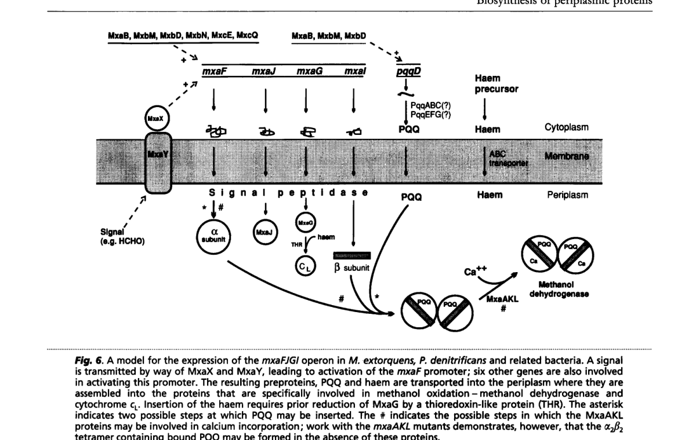

## Question

# Gene Research for Functional Annotation

## ⚠️ CRITICAL: Gene/Protein Identification Context

**BEFORE YOU BEGIN RESEARCH:** You MUST verify you are researching the CORRECT gene/protein. Gene symbols can be ambiguous, especially for less well-characterized genes from non-model organisms.

### Target Gene/Protein Identity (from UniProt):
- **UniProt Accession:** P16028
- **Protein Description:** RecName: Full=Protein MoxJ; Flags: Precursor;
- **Gene Information:** Name=moxJ; Synonyms=mxaJ; OrderedLocusNames=MexAM1_META1p4537;
- **Organism (full):** Methylorubrum extorquens (strain ATCC 14718 / DSM 1338 / JCM 2805 / NCIMB 9133 / AM1) (Methylobacterium extorquens).
- **Protein Family:** Not specified in UniProt
- **Key Domains:** Methanol_oxidation_MoxJ. (IPR022455); Solute-binding_3/MltF_N. (IPR001638); TAT_signal. (IPR006311); SBP_bac_3 (PF00497)

### MANDATORY VERIFICATION STEPS:

1. **Check if the gene symbol "moxJ" matches the protein description above**
2. **Verify the organism is correct:** Methylorubrum extorquens (strain ATCC 14718 / DSM 1338 / JCM 2805 / NCIMB 9133 / AM1) (Methylobacterium extorquens).
3. **Check if protein family/domains align with what you find in literature**
4. **If you find literature for a DIFFERENT gene with the same or similar symbol, STOP**

### If Gene Symbol is Ambiguous or You Cannot Find Relevant Literature:

**DO NOT PROCEED WITH RESEARCH ON A DIFFERENT GENE.** Instead:
- State clearly: "The gene symbol 'moxJ' is ambiguous or literature is limited for this specific protein"
- Explain what you found (e.g., "Found extensive literature on a different gene with the same symbol in a different organism")
- Describe the protein based ONLY on the UniProt information provided above
- Suggest that the protein function can be inferred from domain/family information

### Research Target:

Please provide a comprehensive research report on the gene **moxJ** (gene ID: mxaJ, UniProt: P16028) in METEA.

The research report should be a detailed narrative explaining the function, biological processes, and localization of the gene product. Citations should be given for all claims.

You should prioritize authoritative reviews and primary scientific literature when conducting research. You can supplement
this with annotations you find in gene/protein databases, but these can be outdated or inaccurate.

We are specifically interested in the primary function of the gene - for enzymes, what reaction is catalyzed, and what is the substrate specificity? For transporters, what is the substrate? For structural proteins or adapters, what is the broader structural role? For signaling molecules, what is the role in the pathway.

We are interested in where in or outside the cell the gene product carries out its function.

We are also interested in the signaling or biochemical pathways in which the gene functions. We are less interested in broad pleiotropic effects, except where these elucidate the precise role.

Include evidence where possible. We are interested in both experimental evidence as well as inference from structure, evolution, or bioinformatic analysis. Precise studies should be prioritized over high-throughput, where available.

## Output

Question: You are an expert researcher providing comprehensive, well-cited information.

Provide detailed information focusing on:
1. Key concepts and definitions with current understanding
2. Recent developments and latest research (prioritize 2023-2024 sources)
3. Current applications and real-world implementations
4. Expert opinions and analysis from authoritative sources
5. Relevant statistics and data from recent studies

Format as a comprehensive research report with proper citations. Include URLs and publication dates where available.
Always prioritize recent, authoritative sources and provide specific citations for all major claims.

# Gene Research for Functional Annotation

## ⚠️ CRITICAL: Gene/Protein Identification Context

**BEFORE YOU BEGIN RESEARCH:** You MUST verify you are researching the CORRECT gene/protein. Gene symbols can be ambiguous, especially for less well-characterized genes from non-model organisms.

### Target Gene/Protein Identity (from UniProt):
- **UniProt Accession:** P16028
- **Protein Description:** RecName: Full=Protein MoxJ; Flags: Precursor;
- **Gene Information:** Name=moxJ; Synonyms=mxaJ; OrderedLocusNames=MexAM1_META1p4537;
- **Organism (full):** Methylorubrum extorquens (strain ATCC 14718 / DSM 1338 / JCM 2805 / NCIMB 9133 / AM1) (Methylobacterium extorquens).
- **Protein Family:** Not specified in UniProt
- **Key Domains:** Methanol_oxidation_MoxJ. (IPR022455); Solute-binding_3/MltF_N. (IPR001638); TAT_signal. (IPR006311); SBP_bac_3 (PF00497)

### MANDATORY VERIFICATION STEPS:

1. **Check if the gene symbol "moxJ" matches the protein description above**
2. **Verify the organism is correct:** Methylorubrum extorquens (strain ATCC 14718 / DSM 1338 / JCM 2805 / NCIMB 9133 / AM1) (Methylobacterium extorquens).
3. **Check if protein family/domains align with what you find in literature**
4. **If you find literature for a DIFFERENT gene with the same or similar symbol, STOP**

### If Gene Symbol is Ambiguous or You Cannot Find Relevant Literature:

**DO NOT PROCEED WITH RESEARCH ON A DIFFERENT GENE.** Instead:
- State clearly: "The gene symbol 'moxJ' is ambiguous or literature is limited for this specific protein"
- Explain what you found (e.g., "Found extensive literature on a different gene with the same symbol in a different organism")
- Describe the protein based ONLY on the UniProt information provided above
- Suggest that the protein function can be inferred from domain/family information

### Research Target:

Please provide a comprehensive research report on the gene **moxJ** (gene ID: mxaJ, UniProt: P16028) in METEA.

The research report should be a detailed narrative explaining the function, biological processes, and localization of the gene product. Citations should be given for all claims.

You should prioritize authoritative reviews and primary scientific literature when conducting research. You can supplement
this with annotations you find in gene/protein databases, but these can be outdated or inaccurate.

We are specifically interested in the primary function of the gene - for enzymes, what reaction is catalyzed, and what is the substrate specificity? For transporters, what is the substrate? For structural proteins or adapters, what is the broader structural role? For signaling molecules, what is the role in the pathway.

We are interested in where in or outside the cell the gene product carries out its function.

We are also interested in the signaling or biochemical pathways in which the gene functions. We are less interested in broad pleiotropic effects, except where these elucidate the precise role.

Include evidence where possible. We are interested in both experimental evidence as well as inference from structure, evolution, or bioinformatic analysis. Precise studies should be prioritized over high-throughput, where available.

## Research report: **moxJ / mxaJ (UniProt P16028) in *Methylorubrum extorquens* AM1**

### 0) Target verification (mandatory)
The target is **Protein MoxJ (precursor)** encoded by **moxJ (synonym mxaJ)** from *Methylorubrum extorquens* strain AM1 (formerly *Methylobacterium extorquens* AM1), UniProt **P16028**. In the accessible literature, **mxaJ/moxJ** is consistently discussed as an accessory gene within the canonical **mxa methanol-oxidation operon** (mxaFJGIRSACKLDEHB), adjacent to the catalytic MDH subunit gene **mxaF** and the cytochrome electron-acceptor gene **mxaG**, matching the UniProt context provided. (goodwin1995thebiosynthesisof pages 5-7, goodwin1995thebiosynthesisof pages 4-5, schmidt2010functionalinvestigationof pages 37-39)

### 1) Key concepts and definitions (current understanding)

#### 1.1 Methanol dehydrogenase (MDH) systems in alphaproteobacterial methylotrophs
In *M. extorquens* AM1, methylotrophic growth begins with **periplasmic oxidation of methanol**, classically by **PQQ-dependent methanol dehydrogenase (MDH)** (MxaFI), transferring electrons to a **periplasmic cytochrome cL** (MxaG). The mxa operon encodes not only catalytic subunits but also accessory proteins required for MDH biogenesis and function in the periplasm. (goodwin1995thebiosynthesisof pages 4-5, schmidt2010functionalinvestigationof pages 39-45)

#### 1.2 What is MoxJ/MxaJ?
Historically, **MxaJ** was described as a predicted **~30 kDa periplasmic precursor protein** with uncertain role, proposed either as a **third MDH subunit** or a **molecular chaperone** required for assembly/optimal in vivo function of MDH. (goodwin1995thebiosynthesisof pages 4-5, goodwin1995thebiosynthesisof pages 5-7)

A later comparative genomic/protein-family interpretation classifies MxaJ/XoxJ-like proteins as **Family 3 extracellular solute-binding proteins** (COG0834; Pfam family reported in that context), suggesting a solute-binding-protein-like fold and raising hypotheses such as binding methanol or facilitating formaldehyde release/detoxification (hypotheses; not direct AM1 biochemical proof). (wu2015xoxftypemethanoldehydrogenase pages 8-12)

### 2) Functional annotation of MoxJ/MxaJ: best-supported model

#### 2.1 Localization and cellular compartment
**Periplasmic localization** is supported by: (i) prediction that *mxaJ* encodes a **periplasmic precursor** protein; and (ii) the broader model that MDH structural gene products carry signal sequences that are cleaved upon translocation to the **periplasm**, where PQQ/haem-containing complexes assemble. (goodwin1995thebiosynthesisof pages 4-5, goodwin1995thebiosynthesisof pages 5-7)

**Export pathway (Tat vs Sec):** the accessible papers used here support *periplasmic export* but do **not** directly determine whether AM1 MoxJ uses Tat vs Sec machinery; thus, Tat assignment (even if present in UniProt features) should be treated as database-based unless validated by targeted experiments. (goodwin1995thebiosynthesisof pages 4-5)

#### 2.2 Primary function (mechanistic): MDH maturation via PQQ incorporation
The strongest mechanistic evidence currently available in the retrieved corpus is that **MxaJ is an MDH assembly chaperone that mediates PQQ incorporation** into the catalytic subunit MxaF. Zhou et al. (Nature Communications, **2025-07**, https://doi.org/10.1038/s41467-025-61958-w) reconstructed an MDH assembly system and captured intermediate complexes, concluding that:
- MxaJ forms an **MxaF/MxaJ complex** and promotes conformational changes enabling **PQQ entry/incorporation**.
- After PQQ binding, **MxaI engagement** promotes **MxaJ release**, yielding mature PQQ-loaded MxaF/MxaI complexes.
This provides a direct biochemical/structural basis for the long-standing “assembly protein / periplasmic chaperone” hypothesis for MxaJ-family proteins. (zhou2025decipheringtheassembly pages 4-5, zhou2025decipheringtheassembly pages 1-2)

#### 2.3 Role in pathway architecture and interactions
Genomic context places **mxaJ directly adjacent to mxaF and mxaG** within the mxa cluster, which encodes the periplasmic methanol oxidation module. This operon architecture supports a role for MxaJ in the **biogenesis/activation** of the periplasmic MDH system rather than downstream cytosolic C1 assimilation. (schmidt2010functionalinvestigationof pages 39-45, goodwin1995thebiosynthesisof pages 5-7)

Direct physical interactions of AM1 MxaJ with MxaG or the assembled MDH complex are not demonstrated in the accessible AM1-specific primary evidence here; however, related systems and models depict periplasmic co-assembly of exported proteins with cofactors. (goodwin1995thebiosynthesisof media 8f8bf987, goodwin1995thebiosynthesisof pages 4-5)

### 3) Evidence-backed quantitative findings (statistics and data)

#### 3.1 mxaJ expression is strongly repressed in the lanthanide switch
In *M. extorquens* AM1, lanthanides (e.g., La3+) induce a regulatory **“lanthanide switch”** favoring lanthanide-dependent alcohol dehydrogenases (Xox systems) and repressing the Ca-dependent mxa system.

RNA-seq under methanol growth with **2 µM La3+** (FDR < 0.15; |log2FC| > 1) shows **mxaJ** is strongly downregulated (**log2FC = −7.5**, p = 2.00E−18), together with other mxa genes (e.g., mxaF −8.0; mxaG −7.4). (Scientific Reports, **2019-03**, https://doi.org/10.1038/s41598-019-41043-1) (good2019contrastinginvitro pages 7-8)

In the same dataset, the **xox1 locus** (including **xoxJ**, an MxaJ-like homolog) is upregulated in the presence of La3+ (reported ~16–21-fold; with example log2 values: xoxJ ~ 4.0). (good2019contrastinginvitro pages 6-7)

#### 3.2 Phenotypes associated with xoxJ (homolog) defects under lanthanide conditions
Although direct AM1 **mxaJ knockout** phenotype data were not retrieved here, **xoxJ** (MxaJ-like homolog) mutants show strong growth impairments under methanol + La3+ conditions in AM1: for example, one dataset reports **xoxJ** growth at 0.04 ± 0.01 h−1 on methanol + La3+ with a long lag, compared with higher rates on methanol without La3+. (Scientific Reports, **2020-07**, https://doi.org/10.1038/s41598-020-69401-4) (roszczenkojasinska2020geneproductsand pages 6-7)

This supports functional importance of MxaJ-like proteins across alternative periplasmic PQQ-ADH modules, consistent with a conserved maturation/activation role. (roszczenkojasinska2020geneproductsand pages 4-5)

#### 3.3 Growth-rate effect of lanthanum on methanol growth
A separate AM1 study reports that adding lanthanum increases methanol-growth rate by **~9–12%**, consistent with a switch to lanthanide-dependent periplasmic dehydrogenases while repressing the mxa system. (Scientific Reports, **2019-03**, https://doi.org/10.1038/s41598-019-41043-1) (good2019contrastinginvitro pages 1-2)

#### 3.4 Protein size evidence
Older biochemical/genetic synthesis notes predict an MxaJ precursor of **~30 kDa**, and report isolation of a **~32 kDa** protein in a related methylotroph whose N-terminus matched the predicted mxaJ product, supporting that MxaJ-family proteins are small exported periplasmic factors. (Microbiology, **1995-05**, https://doi.org/10.1099/13500872-141-5-1051) (goodwin1995thebiosynthesisof pages 5-7)

### 4) Recent developments (prioritizing 2023–2024)

Direct 2023–2024 AM1-specific mechanistic studies of **MoxJ/MxaJ** were not retrieved in the accessible corpus. However, multiple **2024** results strongly update the *context* for MxaJ-like proteins in methanol oxidation systems:

#### 4.1 2024 environmental genomics: xoxF clusters frequently include xoxJ/xoxG
A 2024 metagenomics study of weathered granite/soils found that lanthanide-dependent **XoxF-type methanol dehydrogenase systems** are widespread and that XoxF gene clusters commonly include accessory/electron-transfer genes such as **xoxJ** and **xoxG** (MxaJ/MxaG homologs), indicating that MxaJ-like accessory proteins are broadly conserved features of periplasmic PQQ-ADH methanol-oxidation modules in nature. (BMC Biology, **2024-02**, https://doi.org/10.1186/s12915-024-01841-0) (voutsinos2024weatheredgranitesand pages 4-7, voutsinos2024weatheredgranitesand pages 1-2)

#### 4.2 2024 quantitative context: lanthanide abundance and xoxF prevalence
The same 2024 work reports lanthanide concentrations across weathering gradients (e.g., **427 ppm** in lightly weathered granite declining to **214 ppm** in highly weathered granite and **80 ppm** in soil) and recovers **411** XoxF-type MDH sequences (dominated by XoxF3) while not detecting Ca-dependent MxaF sequences in the reconstructed genomes. These data strengthen the view that lanthanide-dependent PQQ-ADH systems (with accessory xoxJ) can be ecologically dominant. (voutsinos2024weatheredgranitesand pages 7-10, voutsinos2024weatheredgranitesand pages 2-4)

### 5) Current applications and real-world implementations

#### 5.1 Biotechnology and metabolic engineering relevance
*M. extorquens* AM1 is widely used as a **platform methylotroph** for C1-based biotechnological approaches. Efficient methanol oxidation depends on functional periplasmic PQQ-ADH systems. Because MxaJ is now mechanistically linked to **PQQ incorporation into MxaF** (a key maturation step), it is a credible engineering target for:
- heterologous reconstruction of active MDH systems,
- improving robustness of methanol oxidation modules,
- enabling controlled switching between Ca-dependent and lanthanide-dependent pathways (via xoxJ-like modules).
This application logic is specifically supported by the demonstration that MxaJ enables PQQ loading during MDH maturation (reconstructed in a heterologous system). (zhou2025decipheringtheassembly pages 1-2)

### 6) Expert opinions and authoritative interpretations (with provenance)

#### 6.1 Historical expert synthesis (1995)
Goodwin & Anthony (Microbiology, 1995-05, https://doi.org/10.1099/13500872-141-5-1051) summarize evidence and propose two models: MxaJ as a **component (“third subunit”)** of MDH, or as a **molecular chaperone essential for assembly** of active MDH; they did not resolve which model is correct at the time. (goodwin1995thebiosynthesisof pages 4-5)

#### 6.2 Contemporary mechanistic resolution (2025)
Zhou et al. (Nature Communications, 2025-07, https://doi.org/10.1038/s41467-025-61958-w) provide direct structural and mechanistic evidence supporting the **chaperone-mediated PQQ incorporation** model, resolving a long-standing question about MxaJ-family proteins. (zhou2025decipheringtheassembly pages 4-5, zhou2025decipheringtheassembly pages 1-2)

### 7) Visual evidence (operon/assembly model)
Goodwin & Anthony provide an operon/assembly model figure showing exported preproteins and periplasmic assembly of the methanol-oxidation module including the mxaFJGI region; cropped figure/table images were retrieved from that paper. (goodwin1995thebiosynthesisof media 8f8bf987, goodwin1995thebiosynthesisof media 3fbdfcda, goodwin1995thebiosynthesisof media 440826dc, goodwin1995thebiosynthesisof media 75627ce3)

### 8) Summary annotation (best-supported)
- **Gene/protein:** moxJ (mxaJ), UniProt P16028, exported precursor protein in AM1 mxa operon. (goodwin1995thebiosynthesisof pages 5-7, schmidt2010functionalinvestigationof pages 39-45)
- **Cellular location:** periplasm (signal-peptide mediated export; Tat vs Sec not resolved here). (goodwin1995thebiosynthesisof pages 4-5)
- **Primary function (current best model):** **MDH maturation chaperone enabling PQQ incorporation into MxaF**; release upon MxaI engagement. (zhou2025decipheringtheassembly pages 4-5)
- **Pathway role:** accessory factor in periplasmic methanol oxidation module (MxaFI MDH + MxaG cytochrome electron acceptor). (schmidt2010functionalinvestigationof pages 39-45)
- **Regulatory context:** strongly repressed under La3+ (lanthanide switch) while xoxJ homologs are induced, indicating modular substitution of MxaJ-like functions in alternative PQQ-ADH systems. (good2019contrastinginvitro pages 7-8, good2019contrastinginvitro pages 6-7)

| Feature | Evidence summary | Key citations (with year) |
|---|---|---|
| Gene names / target identity | The literature for *Methylorubrum/Methylobacterium extorquens* AM1 uses **mxaJ** and **moxJ** for the same methanol-oxidation accessory gene in the canonical **mxa** cluster; Schmidt et al. discuss **MxaJ** and its paralog **XoxJ** in analogous loci, supporting that UniProt P16028 corresponds to the AM1 methanol-oxidation accessory protein rather than an unrelated gene symbol in another organism. | Goodwin & Anthony 1995 (goodwin1995thebiosynthesisof pages 5-7, goodwin1995thebiosynthesisof pages 4-5); Schmidt et al. 2010 (schmidt2010functionalinvestigationof pages 37-39, schmidt2010functionalinvestigationof pages 87-92, schmidt2010functionalinvestigationof pages 39-45) |
| Operon / pathway context | **mxaJ** is located in the **mxaF-mxaJ-mxaG-mxaI** region within the larger methanol-oxidation operon (**mxaFJGIRSACKLDEHB**). This places MxaJ directly alongside the catalytic MDH subunits (**MxaF/MxaI**) and the electron acceptor cytochrome **cL (MxaG)**, consistent with a role in MDH biogenesis or function in periplasmic methanol oxidation. | Goodwin & Anthony 1995 (goodwin1995thebiosynthesisof pages 5-7, goodwin1995thebiosynthesisof pages 4-5, goodwin1995thebiosynthesisof media 8f8bf987); Schmidt et al. 2010 (schmidt2010functionalinvestigationof pages 37-39, schmidt2010functionalinvestigationof pages 87-92, schmidt2010functionalinvestigationof pages 39-45) |
| Predicted localization / export | Goodwin & Anthony describe **mxaJ** as encoding a precursor of a **periplasmic** protein and state that structural-gene products carry signal sequences cleaved upon translocation to the periplasm. Figure/model context shows preproteins entering the periplasm for assembly. The available snippets do **not** directly establish whether MxaJ uses **Tat** versus **Sec** export, so export-pathway assignment remains uncertain from the provided literature evidence alone. | Goodwin & Anthony 1995 (goodwin1995thebiosynthesisof pages 5-7, goodwin1995thebiosynthesisof pages 4-5, goodwin1995thebiosynthesisof media 8f8bf987) |
| Molecular weight | Historical review evidence describes the predicted **MxaJ precursor as ~30 kDa**; a **~32 kDa** protein isolated from *Acetobacter methanolicus* had an N-terminus matching the predicted **mxaJ** product, supporting a small exported accessory-protein assignment. | Goodwin & Anthony 1995 (goodwin1995thebiosynthesisof pages 5-7) |
| Domain / family assignment | Older review literature reported no significant homology to known proteins at that time, but later sequence analysis classified MxaJ/XoxJ-like proteins as **Family 3 extracellular solute-binding proteins**. This aligns broadly with modern database/domain assignments of MoxJ/MxaJ as a solute-binding-protein-like accessory factor, although the provided snippets do not directly test ligand binding. | Goodwin & Anthony 1995 (goodwin1995thebiosynthesisof pages 4-5); Wu et al. 2015 (wu2015xoxftypemethanoldehydrogenase pages 8-12) |
| Proposed function (historical view) | Before direct structural evidence, MxaJ was proposed either as a **third subunit of methanol dehydrogenase** or as a **molecular chaperone / assembly protein** required for formation or optimal in vivo function of MDH. Schmidt et al. reiterate that MxaJ/XoxJ had been suggested to be an assembly protein or periplasmic chaperone. | Goodwin & Anthony 1995 (goodwin1995thebiosynthesisof pages 5-7, goodwin1995thebiosynthesisof pages 4-5); Schmidt et al. 2010 (schmidt2010functionalinvestigationof pages 37-39, schmidt2010functionalinvestigationof pages 87-92, schmidt2010functionalinvestigationof pages 39-45) |
| Current mechanistic understanding | Recent structural work shows **MxaJ functions as an MDH assembly chaperone**: it binds folded **MxaF**, forms an **MxaF/MxaJ** intermediate, and promotes **PQQ incorporation** during MDH maturation. After PQQ loading, **MxaI** engages and helps displace MxaJ, yielding mature **PQQ-loaded MxaF/MxaI**. This is the strongest currently available mechanistic evidence in the provided set. | Zhou et al. 2025 (zhou2025decipheringtheassembly pages 4-5, zhou2025decipheringtheassembly pages 1-2) |
| Relation to XoxJ / ExaJ paralogs | AM1 and related methylotrophs often encode **xoxJ/exaJ** homologs next to alternative alcohol dehydrogenase genes. Roszczenko-Jasińska et al. note that **xoxF/exaF** loci often contain **mxaJ homologs**, while Schmidt et al. describe **xoxJ** as corresponding to the putative periplasmic chaperone/assembly role of MxaJ. This supports a conserved accessory role across Ca-dependent and lanthanide-associated MDH-like systems. | Schmidt et al. 2010 (schmidt2010functionalinvestigationof pages 87-92, schmidt2010functionalinvestigationof pages 39-45); Roszczenko-Jasińska et al. 2020 (schmidt2010functionalinvestigationof pages 37-39) |
| Evidence gaps / uncertainty | The provided snippets do **not** supply clear **AM1-specific mxaJ knockout phenotype data**, direct biochemical measurements of MxaJ interaction with **MxaG**, or direct demonstration of **Tat** export for AM1 MxaJ. Thus, periplasmic accessory/chaperone function is well supported, but some annotation details remain inferential or await more direct AM1-specific experiments in the accessible evidence set. | Goodwin & Anthony 1995 (goodwin1995thebiosynthesisof pages 5-7, goodwin1995thebiosynthesisof pages 4-5); Schmidt et al. 2010 (schmidt2010functionalinvestigationof pages 87-92, schmidt2010functionalinvestigationof pages 39-45); Zhou et al. 2025 (zhou2025decipheringtheassembly pages 1-2) |

*Table: This table condenses the evidence-supported functional annotation for MoxJ/MxaJ (UniProt P16028) in Methylorubrum extorquens AM1. It highlights what is directly supported by the cited literature and explicitly marks remaining evidence gaps such as export-pathway uncertainty and limited AM1-specific mutant data.*

### 9) Limitations of the current evidence set
1. **AM1-specific mxaJ deletion/knockout phenotypes** were not located in the accessible full texts used here; phenotype inference therefore relies on (i) conserved role across homologs (xoxJ), (ii) operon context, and (iii) the direct mechanistic evidence from structural work not explicitly stated to be AM1 P16028. (roszczenkojasinska2020geneproductsand pages 6-7, zhou2025decipheringtheassembly pages 4-5)
2. **Tat signal vs Sec signal**: UniProt domain/export annotations were provided by the user but are not experimentally confirmed in the retrieved papers; this report therefore treats Tat as **unconfirmed** from primary literature evidence in-hand. (goodwin1995thebiosynthesisof pages 4-5)

### 10) Key references (URLs and dates)
- Goodwin PM, Anthony C. *Microbiology* (1995-05). “The biosynthesis of periplasmic electron transport proteins in methylotrophic bacteria.” https://doi.org/10.1099/13500872-141-5-1051 (goodwin1995thebiosynthesisof pages 5-7, goodwin1995thebiosynthesisof pages 4-5)
- Schmidt S et al. *Microbiology* (2010-08). “Functional investigation of methanol dehydrogenase-like protein XoxF in *Methylobacterium extorquens* AM1.” https://doi.org/10.1099/mic.0.038570-0 (schmidt2010functionalinvestigationof pages 37-39, schmidt2010functionalinvestigationof pages 87-92, schmidt2010functionalinvestigationof pages 39-45, schmidt2010functionalinvestigationof pages 61-66)
- Wu ML et al. *Applied and Environmental Microbiology* (2015-02). “XoxF-Type Methanol Dehydrogenase from ‘Ca. Methylomirabilis oxyfera’.” https://doi.org/10.1128/aem.03292-14 (wu2015xoxftypemethanoldehydrogenase pages 8-12)
- Good NM et al. *Scientific Reports* (2019-03). “Contrasting in vitro and in vivo methanol oxidation activities…” https://doi.org/10.1038/s41598-019-41043-1 (good2019contrastinginvitro pages 7-8, good2019contrastinginvitro pages 6-7, good2019contrastinginvitro pages 1-2)
- Roszczenko-Jasińska P et al. *Scientific Reports* (2020-07). “Gene products and processes contributing to lanthanide homeostasis…” https://doi.org/10.1038/s41598-020-69401-4 (roszczenkojasinska2020geneproductsand pages 6-7, roszczenkojasinska2020geneproductsand pages 4-5)
- Voutsinos MY et al. *BMC Biology* (2024-02). “Weathered granites and soils harbour microbes with lanthanide-dependent methylotrophic enzymes.” https://doi.org/10.1186/s12915-024-01841-0 (voutsinos2024weatheredgranitesand pages 7-10, voutsinos2024weatheredgranitesand pages 4-7, voutsinos2024weatheredgranitesand pages 2-4)
- Zhou H et al. *Nature Communications* (2025-07). “Deciphering the assembly process of PQQ dependent methanol dehydrogenase.” https://doi.org/10.1038/s41467-025-61958-w (zhou2025decipheringtheassembly pages 4-5, zhou2025decipheringtheassembly pages 1-2)

References

1. (goodwin1995thebiosynthesisof pages 5-7): Pat M. Goodwin and Christopher Anthony. The biosynthesis of periplasmic electron transport proteins in methylotrophic bacteria. Microbiology, 141 ( Pt 5):1051-64, May 1995. URL: https://doi.org/10.1099/13500872-141-5-1051, doi:10.1099/13500872-141-5-1051. This article has 39 citations and is from a peer-reviewed journal.

2. (goodwin1995thebiosynthesisof pages 4-5): Pat M. Goodwin and Christopher Anthony. The biosynthesis of periplasmic electron transport proteins in methylotrophic bacteria. Microbiology, 141 ( Pt 5):1051-64, May 1995. URL: https://doi.org/10.1099/13500872-141-5-1051, doi:10.1099/13500872-141-5-1051. This article has 39 citations and is from a peer-reviewed journal.

3. (schmidt2010functionalinvestigationof pages 37-39): Sabrina Schmidt, Philipp Christen, Patrick Kiefer, and Julia A. Vorholt. Functional investigation of methanol dehydrogenase-like protein xoxf in methylobacterium extorquens am1. Microbiology, 156 Pt 8:2575-86, Aug 2010. URL: https://doi.org/10.1099/mic.0.038570-0, doi:10.1099/mic.0.038570-0. This article has 141 citations and is from a peer-reviewed journal.

4. (schmidt2010functionalinvestigationof pages 39-45): Sabrina Schmidt, Philipp Christen, Patrick Kiefer, and Julia A. Vorholt. Functional investigation of methanol dehydrogenase-like protein xoxf in methylobacterium extorquens am1. Microbiology, 156 Pt 8:2575-86, Aug 2010. URL: https://doi.org/10.1099/mic.0.038570-0, doi:10.1099/mic.0.038570-0. This article has 141 citations and is from a peer-reviewed journal.

5. (wu2015xoxftypemethanoldehydrogenase pages 8-12): Ming L. Wu, Hans J. C. T. Wessels, Arjan Pol, Huub J. M. Op den Camp, Mike S. M. Jetten, Laura van Niftrik, and Jan T. Keltjens. Xoxf-type methanol dehydrogenase from the anaerobic methanotroph “candidatus methylomirabilis oxyfera”. Applied and Environmental Microbiology, 81:1442-1451, Feb 2015. URL: https://doi.org/10.1128/aem.03292-14, doi:10.1128/aem.03292-14. This article has 81 citations and is from a peer-reviewed journal.

6. (zhou2025decipheringtheassembly pages 4-5): Haichuan Zhou, Junqing Sun, Jian Cheng, Min Wu, Jie Bai, Qian Li, Jie Shen, Manman Han, Chen Yang, Liangpo Li, Yuwan Liu, Qichen Cao, Weidong Liu, Haixia Xiao, Hongjun Dong, Feng Gao, and Huifeng Jiang. Deciphering the assembly process of pqq dependent methanol dehydrogenase. Nature Communications, Jul 2025. URL: https://doi.org/10.1038/s41467-025-61958-w, doi:10.1038/s41467-025-61958-w. This article has 6 citations and is from a highest quality peer-reviewed journal.

7. (zhou2025decipheringtheassembly pages 1-2): Haichuan Zhou, Junqing Sun, Jian Cheng, Min Wu, Jie Bai, Qian Li, Jie Shen, Manman Han, Chen Yang, Liangpo Li, Yuwan Liu, Qichen Cao, Weidong Liu, Haixia Xiao, Hongjun Dong, Feng Gao, and Huifeng Jiang. Deciphering the assembly process of pqq dependent methanol dehydrogenase. Nature Communications, Jul 2025. URL: https://doi.org/10.1038/s41467-025-61958-w, doi:10.1038/s41467-025-61958-w. This article has 6 citations and is from a highest quality peer-reviewed journal.

8. (goodwin1995thebiosynthesisof media 8f8bf987): Pat M. Goodwin and Christopher Anthony. The biosynthesis of periplasmic electron transport proteins in methylotrophic bacteria. Microbiology, 141 ( Pt 5):1051-64, May 1995. URL: https://doi.org/10.1099/13500872-141-5-1051, doi:10.1099/13500872-141-5-1051. This article has 39 citations and is from a peer-reviewed journal.

9. (good2019contrastinginvitro pages 7-8): Nathan M. Good, Riley S. Moore, Carly J. Suriano, and N. Cecilia Martinez-Gomez. Contrasting in vitro and in vivo methanol oxidation activities of lanthanide-dependent alcohol dehydrogenases xoxf1 and exaf from methylobacterium extorquens am1. Scientific Reports, Mar 2019. URL: https://doi.org/10.1038/s41598-019-41043-1, doi:10.1038/s41598-019-41043-1. This article has 92 citations and is from a peer-reviewed journal.

10. (good2019contrastinginvitro pages 6-7): Nathan M. Good, Riley S. Moore, Carly J. Suriano, and N. Cecilia Martinez-Gomez. Contrasting in vitro and in vivo methanol oxidation activities of lanthanide-dependent alcohol dehydrogenases xoxf1 and exaf from methylobacterium extorquens am1. Scientific Reports, Mar 2019. URL: https://doi.org/10.1038/s41598-019-41043-1, doi:10.1038/s41598-019-41043-1. This article has 92 citations and is from a peer-reviewed journal.

11. (roszczenkojasinska2020geneproductsand pages 6-7): Paula Roszczenko-Jasińska, Huong N. Vu, Gabriel A. Subuyuj, Ralph Valentine Crisostomo, James Cai, Nicholas F. Lien, Erik J. Clippard, Elena M. Ayala, Richard T. Ngo, Fauna Yarza, Justin P. Wingett, Charumathi Raghuraman, Caitlin A. Hoeber, Norma C. Martinez-Gomez, and Elizabeth Skovran. Gene products and processes contributing to lanthanide homeostasis and methanol metabolism in methylorubrum extorquens am1. Scientific Reports, Jul 2020. URL: https://doi.org/10.1038/s41598-020-69401-4, doi:10.1038/s41598-020-69401-4. This article has 98 citations and is from a peer-reviewed journal.

12. (roszczenkojasinska2020geneproductsand pages 4-5): Paula Roszczenko-Jasińska, Huong N. Vu, Gabriel A. Subuyuj, Ralph Valentine Crisostomo, James Cai, Nicholas F. Lien, Erik J. Clippard, Elena M. Ayala, Richard T. Ngo, Fauna Yarza, Justin P. Wingett, Charumathi Raghuraman, Caitlin A. Hoeber, Norma C. Martinez-Gomez, and Elizabeth Skovran. Gene products and processes contributing to lanthanide homeostasis and methanol metabolism in methylorubrum extorquens am1. Scientific Reports, Jul 2020. URL: https://doi.org/10.1038/s41598-020-69401-4, doi:10.1038/s41598-020-69401-4. This article has 98 citations and is from a peer-reviewed journal.

13. (good2019contrastinginvitro pages 1-2): Nathan M. Good, Riley S. Moore, Carly J. Suriano, and N. Cecilia Martinez-Gomez. Contrasting in vitro and in vivo methanol oxidation activities of lanthanide-dependent alcohol dehydrogenases xoxf1 and exaf from methylobacterium extorquens am1. Scientific Reports, Mar 2019. URL: https://doi.org/10.1038/s41598-019-41043-1, doi:10.1038/s41598-019-41043-1. This article has 92 citations and is from a peer-reviewed journal.

14. (voutsinos2024weatheredgranitesand pages 4-7): Marcos Y. Voutsinos, Jacob A. West-Roberts, Rohan Sachdeva, John W. Moreau, and Jillian F. Banfield. Weathered granites and soils harbour microbes with lanthanide-dependent methylotrophic enzymes. BMC Biology, Feb 2024. URL: https://doi.org/10.1186/s12915-024-01841-0, doi:10.1186/s12915-024-01841-0. This article has 13 citations and is from a domain leading peer-reviewed journal.

15. (voutsinos2024weatheredgranitesand pages 1-2): Marcos Y. Voutsinos, Jacob A. West-Roberts, Rohan Sachdeva, John W. Moreau, and Jillian F. Banfield. Weathered granites and soils harbour microbes with lanthanide-dependent methylotrophic enzymes. BMC Biology, Feb 2024. URL: https://doi.org/10.1186/s12915-024-01841-0, doi:10.1186/s12915-024-01841-0. This article has 13 citations and is from a domain leading peer-reviewed journal.

16. (voutsinos2024weatheredgranitesand pages 7-10): Marcos Y. Voutsinos, Jacob A. West-Roberts, Rohan Sachdeva, John W. Moreau, and Jillian F. Banfield. Weathered granites and soils harbour microbes with lanthanide-dependent methylotrophic enzymes. BMC Biology, Feb 2024. URL: https://doi.org/10.1186/s12915-024-01841-0, doi:10.1186/s12915-024-01841-0. This article has 13 citations and is from a domain leading peer-reviewed journal.

17. (voutsinos2024weatheredgranitesand pages 2-4): Marcos Y. Voutsinos, Jacob A. West-Roberts, Rohan Sachdeva, John W. Moreau, and Jillian F. Banfield. Weathered granites and soils harbour microbes with lanthanide-dependent methylotrophic enzymes. BMC Biology, Feb 2024. URL: https://doi.org/10.1186/s12915-024-01841-0, doi:10.1186/s12915-024-01841-0. This article has 13 citations and is from a domain leading peer-reviewed journal.

18. (goodwin1995thebiosynthesisof media 3fbdfcda): Pat M. Goodwin and Christopher Anthony. The biosynthesis of periplasmic electron transport proteins in methylotrophic bacteria. Microbiology, 141 ( Pt 5):1051-64, May 1995. URL: https://doi.org/10.1099/13500872-141-5-1051, doi:10.1099/13500872-141-5-1051. This article has 39 citations and is from a peer-reviewed journal.

19. (goodwin1995thebiosynthesisof media 440826dc): Pat M. Goodwin and Christopher Anthony. The biosynthesis of periplasmic electron transport proteins in methylotrophic bacteria. Microbiology, 141 ( Pt 5):1051-64, May 1995. URL: https://doi.org/10.1099/13500872-141-5-1051, doi:10.1099/13500872-141-5-1051. This article has 39 citations and is from a peer-reviewed journal.

20. (goodwin1995thebiosynthesisof media 75627ce3): Pat M. Goodwin and Christopher Anthony. The biosynthesis of periplasmic electron transport proteins in methylotrophic bacteria. Microbiology, 141 ( Pt 5):1051-64, May 1995. URL: https://doi.org/10.1099/13500872-141-5-1051, doi:10.1099/13500872-141-5-1051. This article has 39 citations and is from a peer-reviewed journal.

21. (schmidt2010functionalinvestigationof pages 87-92): Sabrina Schmidt, Philipp Christen, Patrick Kiefer, and Julia A. Vorholt. Functional investigation of methanol dehydrogenase-like protein xoxf in methylobacterium extorquens am1. Microbiology, 156 Pt 8:2575-86, Aug 2010. URL: https://doi.org/10.1099/mic.0.038570-0, doi:10.1099/mic.0.038570-0. This article has 141 citations and is from a peer-reviewed journal.

22. (schmidt2010functionalinvestigationof pages 61-66): Sabrina Schmidt, Philipp Christen, Patrick Kiefer, and Julia A. Vorholt. Functional investigation of methanol dehydrogenase-like protein xoxf in methylobacterium extorquens am1. Microbiology, 156 Pt 8:2575-86, Aug 2010. URL: https://doi.org/10.1099/mic.0.038570-0, doi:10.1099/mic.0.038570-0. This article has 141 citations and is from a peer-reviewed journal.

## Artifacts

- [Edison artifact artifact-00](mxaJ-deep-research-falcon_artifacts/artifact-00.md)

## Citations

1. wu2015xoxftypemethanoldehydrogenase pages 8-12
2. goodwin1995thebiosynthesisof pages 4-5
3. good2019contrastinginvitro pages 7-8
4. good2019contrastinginvitro pages 6-7
5. roszczenkojasinska2020geneproductsand pages 6-7
6. roszczenkojasinska2020geneproductsand pages 4-5
7. good2019contrastinginvitro pages 1-2
8. goodwin1995thebiosynthesisof pages 5-7
9. zhou2025decipheringtheassembly pages 1-2
10. zhou2025decipheringtheassembly pages 4-5
11. schmidt2010functionalinvestigationof pages 39-45
12. schmidt2010functionalinvestigationof pages 37-39
13. voutsinos2024weatheredgranitesand pages 4-7
14. voutsinos2024weatheredgranitesand pages 1-2
15. voutsinos2024weatheredgranitesand pages 7-10
16. voutsinos2024weatheredgranitesand pages 2-4
17. schmidt2010functionalinvestigationof pages 87-92
18. schmidt2010functionalinvestigationof pages 61-66
19. https://doi.org/10.1038/s41467-025-61958-w
20. https://doi.org/10.1038/s41598-019-41043-1
21. https://doi.org/10.1038/s41598-020-69401-4
22. https://doi.org/10.1099/13500872-141-5-1051
23. https://doi.org/10.1186/s12915-024-01841-0
24. https://doi.org/10.1099/mic.0.038570-0
25. https://doi.org/10.1128/aem.03292-14
26. https://doi.org/10.1099/13500872-141-5-1051,
27. https://doi.org/10.1099/mic.0.038570-0,
28. https://doi.org/10.1128/aem.03292-14,
29. https://doi.org/10.1038/s41467-025-61958-w,
30. https://doi.org/10.1038/s41598-019-41043-1,
31. https://doi.org/10.1038/s41598-020-69401-4,
32. https://doi.org/10.1186/s12915-024-01841-0,