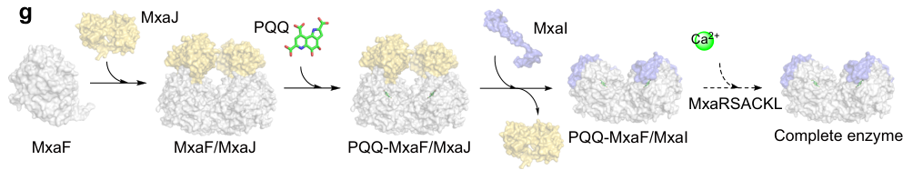

## Question

# Gene Research for Functional Annotation

## ⚠️ CRITICAL: Gene/Protein Identification Context

**BEFORE YOU BEGIN RESEARCH:** You MUST verify you are researching the CORRECT gene/protein. Gene symbols can be ambiguous, especially for less well-characterized genes from non-model organisms.

### Target Gene/Protein Identity (from UniProt):
- **UniProt Accession:** C5AQA1
- **Protein Description:** SubName: Full=MxaK protein {ECO:0000313|EMBL:ACS42161.1};
- **Gene Information:** Name=mxaK {ECO:0000313|EMBL:ACS42161.1}; OrderedLocusNames=MexAM1_META1p4530 {ECO:0000313|EMBL:ACS42161.1};
- **Organism (full):** Methylorubrum extorquens (strain ATCC 14718 / DSM 1338 / JCM 2805 / NCIMB 9133 / AM1) (Methylobacterium extorquens).
- **Protein Family:** Not specified in UniProt
- **Key Domains:** Not specified in UniProt

### MANDATORY VERIFICATION STEPS:

1. **Check if the gene symbol "mxaK" matches the protein description above**
2. **Verify the organism is correct:** Methylorubrum extorquens (strain ATCC 14718 / DSM 1338 / JCM 2805 / NCIMB 9133 / AM1) (Methylobacterium extorquens).
3. **Check if protein family/domains align with what you find in literature**
4. **If you find literature for a DIFFERENT gene with the same or similar symbol, STOP**

### If Gene Symbol is Ambiguous or You Cannot Find Relevant Literature:

**DO NOT PROCEED WITH RESEARCH ON A DIFFERENT GENE.** Instead:
- State clearly: "The gene symbol 'mxaK' is ambiguous or literature is limited for this specific protein"
- Explain what you found (e.g., "Found extensive literature on a different gene with the same symbol in a different organism")
- Describe the protein based ONLY on the UniProt information provided above
- Suggest that the protein function can be inferred from domain/family information

### Research Target:

Please provide a comprehensive research report on the gene **mxaK** (gene ID: mxaK, UniProt: C5AQA1) in METEA.

The research report should be a detailed narrative explaining the function, biological processes, and localization of the gene product. Citations should be given for all claims.

You should prioritize authoritative reviews and primary scientific literature when conducting research. You can supplement
this with annotations you find in gene/protein databases, but these can be outdated or inaccurate.

We are specifically interested in the primary function of the gene - for enzymes, what reaction is catalyzed, and what is the substrate specificity? For transporters, what is the substrate? For structural proteins or adapters, what is the broader structural role? For signaling molecules, what is the role in the pathway.

We are interested in where in or outside the cell the gene product carries out its function.

We are also interested in the signaling or biochemical pathways in which the gene functions. We are less interested in broad pleiotropic effects, except where these elucidate the precise role.

Include evidence where possible. We are interested in both experimental evidence as well as inference from structure, evolution, or bioinformatic analysis. Precise studies should be prioritized over high-throughput, where available.

## Output

Question: You are an expert researcher providing comprehensive, well-cited information.

Provide detailed information focusing on:
1. Key concepts and definitions with current understanding
2. Recent developments and latest research (prioritize 2023-2024 sources)
3. Current applications and real-world implementations
4. Expert opinions and analysis from authoritative sources
5. Relevant statistics and data from recent studies

Format as a comprehensive research report with proper citations. Include URLs and publication dates where available.
Always prioritize recent, authoritative sources and provide specific citations for all major claims.

# Gene Research for Functional Annotation

## ⚠️ CRITICAL: Gene/Protein Identification Context

**BEFORE YOU BEGIN RESEARCH:** You MUST verify you are researching the CORRECT gene/protein. Gene symbols can be ambiguous, especially for less well-characterized genes from non-model organisms.

### Target Gene/Protein Identity (from UniProt):
- **UniProt Accession:** C5AQA1
- **Protein Description:** SubName: Full=MxaK protein {ECO:0000313|EMBL:ACS42161.1};
- **Gene Information:** Name=mxaK {ECO:0000313|EMBL:ACS42161.1}; OrderedLocusNames=MexAM1_META1p4530 {ECO:0000313|EMBL:ACS42161.1};
- **Organism (full):** Methylorubrum extorquens (strain ATCC 14718 / DSM 1338 / JCM 2805 / NCIMB 9133 / AM1) (Methylobacterium extorquens).
- **Protein Family:** Not specified in UniProt
- **Key Domains:** Not specified in UniProt

### MANDATORY VERIFICATION STEPS:

1. **Check if the gene symbol "mxaK" matches the protein description above**
2. **Verify the organism is correct:** Methylorubrum extorquens (strain ATCC 14718 / DSM 1338 / JCM 2805 / NCIMB 9133 / AM1) (Methylobacterium extorquens).
3. **Check if protein family/domains align with what you find in literature**
4. **If you find literature for a DIFFERENT gene with the same or similar symbol, STOP**

### If Gene Symbol is Ambiguous or You Cannot Find Relevant Literature:

**DO NOT PROCEED WITH RESEARCH ON A DIFFERENT GENE.** Instead:
- State clearly: "The gene symbol 'mxaK' is ambiguous or literature is limited for this specific protein"
- Explain what you found (e.g., "Found extensive literature on a different gene with the same symbol in a different organism")
- Describe the protein based ONLY on the UniProt information provided above
- Suggest that the protein function can be inferred from domain/family information

### Research Target:

Please provide a comprehensive research report on the gene **mxaK** (gene ID: mxaK, UniProt: C5AQA1) in METEA.

The research report should be a detailed narrative explaining the function, biological processes, and localization of the gene product. Citations should be given for all claims.

You should prioritize authoritative reviews and primary scientific literature when conducting research. You can supplement
this with annotations you find in gene/protein databases, but these can be outdated or inaccurate.

We are specifically interested in the primary function of the gene - for enzymes, what reaction is catalyzed, and what is the substrate specificity? For transporters, what is the substrate? For structural proteins or adapters, what is the broader structural role? For signaling molecules, what is the role in the pathway.

We are interested in where in or outside the cell the gene product carries out its function.

We are also interested in the signaling or biochemical pathways in which the gene functions. We are less interested in broad pleiotropic effects, except where these elucidate the precise role.

Include evidence where possible. We are interested in both experimental evidence as well as inference from structure, evolution, or bioinformatic analysis. Precise studies should be prioritized over high-throughput, where available.

## Research report: **mxaK** (UniProt **C5AQA1**) in *Methylorubrum extorquens* AM1 (ATCC 14718 / strain AM1)

### 1) Target verification (gene/protein identity)
The retrieved primary and review literature discussing **mxaK** is explicitly in the context of the **mxa methanol dehydrogenase gene cluster** from *Methylobacterium/Methylorubrum extorquens* **AM1**, and consistently describes **mxaK** as an accessory gene required for **Ca2+ insertion into the MxaF active site** during maturation of the Ca-dependent methanol dehydrogenase (MDH). (zhou2025decipheringtheassembly pages 2-3, chistoserdova2003methylotrophyinmethylobacterium pages 2-3)

### 2) Key concepts, definitions, and current understanding

#### 2.1 Methanol dehydrogenases (MDHs) in methylotrophs
* *M. extorquens* AM1 oxidizes methanol using **periplasmic PQQ-dependent alcohol dehydrogenases**.
* Two major MDH “modes” are emphasized across the literature:
  * **MxaFI-type MDH**: canonical Ca2+-dependent MDH, a heterotetramer (2×MxaF large catalytic + 2×MxaI small subunits) with **PQQ and Ca2+ in the MxaF catalytic center**. (zhou2025decipheringtheassembly pages 1-2, yang2025emergingroleof pages 1-2)
  * **XoxF-type MDH**: lanthanide (Ln/REE)-dependent MDH (generally homodimeric), whose expression is induced by REEs and repressed when REEs are absent (“lanthanide/REE switch”). (rocha2024rareearthelements pages 1-2, roszczenkojasinska2020geneproductsand pages 1-4)

#### 2.2 The **mxa** gene cluster/operon in AM1
Genomic and operon mapping work describes the canonical AM1 **mxa** locus as a ~12.5 kb, 14-gene cluster transcribed in one direction with the gene order reported as **mxaFJGIRSACKLDEHB** (which includes **mxaK**). This locus encodes:
* structural MDH subunits (**mxaF**, **mxaI**),
* the electron-acceptor cytochrome (**mxaG**, cytochrome cL), and
* multiple auxiliary proteins required for MDH activation/maturation, including proteins annotated as essential for **Ca2+ insertion** into the MDH apoprotein. (chistoserdova2003methylotrophyinmethylobacterium pages 4-5, roszczenkojasinska2020geneproductsand pages 4-5)

#### 2.3 Operational definition of **mxaK** function in AM1
Across the most directly relevant AM1-specific evidence, **mxaK** is best defined as an **MDH maturation/accessory factor** required for **Ca2+ incorporation** into the catalytic center of MxaF, thereby enabling formation of active Ca-dependent MxaFI methanol dehydrogenase. (zhou2025decipheringtheassembly pages 2-3, zhou2025decipheringtheassembly pages 4-5)

### 3) Primary function of MxaK: evidence-based functional annotation

> In *Methylorubrum extorquens* AM1, deletion of **mxaK** produced methanol dehydrogenase containing the MxaF/MxaI subunits but with **no detectable enzymatic activity**, indicating that MxaK is required for enzyme maturation rather than for assembly of the structural subunits. In the same study, **activity was restored by incubation with 10 mM CaCl2 at pH 9.5**, directly supporting a role for MxaK in the **Ca2+ incorporation** step of MxaFI methanol dehydrogenase maturation. (zhou2025decipheringtheassembly pages 2-3, zhou2025decipheringtheassembly media 213b503b)
>
> Zhou et al. further proposed an assembly model in which **MxaK**, together with MxaR, MxaS, MxaA, MxaC, and MxaL, acts after PQQ loading to help insert **Ca2+ into the catalytic center of MxaF**, yielding the mature active enzyme; these conclusions are specifically illustrated in **Figures 2d/2e and 5g** of the 2025 *Nature Communications* paper. (zhou2025decipheringtheassembly pages 4-5, zhou2025decipheringtheassembly media 213b503b)

*Blockquote: This blockquote summarizes the strongest direct experimental evidence for mxaK function from Zhou et al. 2025, including the deletion phenotype, calcium rescue result, and the proposed assembly model placing MxaK in the Ca2+ insertion step.*

#### 3.1 Genetics + biochemical rescue: loss of activity in ΔmxaK and Ca2+ rescue
A recent, AM1-specific reconstruction of PQQ-dependent MDH assembly provides direct functional evidence:
* **Deleting mxaK** yields an MDH that still contains MxaF/MxaI subunits but is **catalytically inactive**, implying MxaK is not required for subunit presence/assembly but is required for producing the active holoenzyme. (zhou2025decipheringtheassembly pages 2-3)
* Enzymatic activity of the ΔmxaK-derived MDH can be **restored by incubating with CaCl2 (10 mM) at pH 9.5**, supporting that the missing step relates to **Ca2+ incorporation** rather than irreversible misfolding or loss of PQQ. (zhou2025decipheringtheassembly media 213b503b)

#### 3.2 Pathway placement: Ca2+ insertion step during MDH maturation
A mechanistic model proposes that MxaK functions with a set of auxiliary proteins (MxaR, MxaS, MxaA, MxaC, MxaL) in a step that occurs **after PQQ loading** and results in **Ca2+ incorporation into the MxaF catalytic center**, yielding functional MxaFI MDH. (zhou2025decipheringtheassembly pages 4-5, zhou2025decipheringtheassembly media 213b503b)

#### 3.3 Genomic annotation agreement (historical and comparative)
Older and comparative genomic syntheses agree with the experimental assignment:
* The AM1 genome-based operon annotation explicitly lists **mxaK (moxK)** among genes annotated as **essential for Ca2+ insertion into MDH**. (Chistoserdova et al., 2003, *Journal of Bacteriology*, publication date 2003-05; https://doi.org/10.1128/jb.185.10.2980-2987.2003) (chistoserdova2003methylotrophyinmethylobacterium pages 2-3)
* Comparative genomics across *Methylobacterium/Methylorubrum* species describes **mxaK** as “involved in Ca2+ insertion into MxaF,” while noting rare exceptions where some strains appear to grow on methanol without an identifiable mxaK homolog, implying possible redundancy/alternate solutions in some taxa (not necessarily AM1). (Alessa et al., 2021-10, *Frontiers in Microbiology*; https://doi.org/10.3389/fmicb.2021.740610) (alessa2021comprehensivecomparativegenomics pages 7-10)

#### 3.4 What MxaK is *not* (based on available evidence)
* **No enzymatic reaction** for MxaK itself (substrates/products) is demonstrated in the retrieved AM1 evidence; the strongest data support a **non-catalytic maturation/assembly role** required for Ca2+-dependent MDH activation. (zhou2025decipheringtheassembly pages 4-5, zhou2025decipheringtheassembly pages 2-3)
* No direct evidence in the retrieved texts specifies whether MxaK binds Ca2+ directly, acts as a scaffold, or regulates Ca2+ transport; the mechanism appears to be cooperative within a multi-protein maturation system. (zhou2025decipheringtheassembly pages 4-5)

### 4) Biological processes and pathway context

#### 4.1 Role in methanol oxidation and C1 metabolism
MxaFI is a **periplasmic** PQQ-dependent MDH that oxidizes methanol to formaldehyde, transferring electrons via a partner cytochrome cL (MxaG). The **mxa operon** encodes both enzyme subunits and auxiliary proteins for cofactor/metal insertion and electron transfer partner interactions, placing **mxaK** within the core methanol oxidation machinery used when lanthanides are absent. (roszczenkojasinska2020geneproductsand pages 4-5)

#### 4.2 Integration with the “lanthanide switch”
In *M. extorquens* AM1 and related methylotrophs, environmental lanthanides drive a transcriptional/physiological shift in methanol oxidation from Ca-dependent MxaFI toward Ln-dependent XoxF (“REE switch/lanthanide switch”). Reviews and experimental work emphasize that lanthanide availability modulates which MDH system dominates, and that gene products for metal uptake/homeostasis help enforce this switch. (rocha2024rareearthelements pages 1-2, roszczenkojasinska2020geneproductsand pages 5-6)

### 5) Cellular localization: where MxaK likely acts (and what is uncertain)

* The **MxaFI methanol dehydrogenase enzyme** is periplasmic, and its electron-transfer partner cytochrome cL is periplasm-associated. (roszczenkojasinska2020geneproductsand pages 4-5)
* However, the retrieved sources **do not directly state the subcellular localization of MxaK** itself (e.g., cytosolic vs periplasmic, membrane association). Therefore, localization of MxaK should be treated as **unresolved** in this evidence set. (zhou2025decipheringtheassembly pages 4-5, roszczenkojasinska2020geneproductsand pages 4-5)
* The strongest supported localization statement is functional: MxaK participates in a maturation step required to generate active **periplasmic** MxaFI MDH by enabling Ca2+ incorporation into MxaF. (zhou2025decipheringtheassembly media 213b503b)

### 6) Recent developments (prioritizing 2023–2024) relevant to mxaK functional annotation
Direct mxaK-targeted experimental literature in the retrieved set is 2025 (not 2023–2024), but 2023–2024 work substantially updates the **system-level** context in which mxaK functions.

#### 6.1 2024: REE biology and application landscape (expert synthesis)
A 2024 peer-reviewed review describes the field’s view that the best-established biological role for REEs is in **Ln-dependent alcohol oxidation (XoxF/related ADHs)** and highlights translational opportunities including **REE bioseparation and biosensors** using lanthanide-binding proteins (e.g., lanmodulin/lanpepsy) and microbial accumulation. (Rocha et al., 2024-06, *Microbial Biotechnology*; https://doi.org/10.1111/1751-7915.14503) (rocha2024rareearthelements pages 1-2, rocha2024rareearthelements pages 5-6)

#### 6.2 2024: ecological prevalence data showing dominance of Ln-dependent MDHs in some environments
A 2024 metagenomic survey of weathered granite and soils recovered **411 distinct MDH sequences**, all of which were **XoxF-type** (lanthanide-dependent) and **none** were MxaF-type in that dataset. XoxF3 dominated (340 sequences) followed by XoxF5 (63). These data indicate that in some environments, the methanol-oxidation niche can be strongly skewed toward Ln-dependent systems, emphasizing why mxaK-containing Ca-dependent systems may be context-dependent and regulated by metal availability. (Voutsinos et al., 2024-02, *BMC Biology*; https://doi.org/10.1186/s12915-024-01841-0) (voutsinos2024weatheredgranitesand pages 2-4, voutsinos2024weatheredgranitesand pages 4-7)

#### 6.3 2024: quantitative lanthanide-switch physiology and environmental lanthanide concentrations
A 2024 synthesis reports quantitative growth trends in *M. extorquens* AM1 under varying lanthanide levels: **~1 μM** La/Ce/Nd supported the fastest growth/highest density, while **100 μM** lanthanides suppressed growth (cells grew best with calcium at that high concentration). It also compiles environmental lanthanide levels (e.g., groundwater ~35 nmol/kg; lakes ~3.8 nmol/kg; rivers ~3.3 nmol/kg; seawater ~19 pmol/kg), reinforcing that methylotroph metal-switch regulation operates across orders of magnitude of metal availability. (warters2024widespreadbacterialuse pages 1-9, warters2024widespreadbacterialuse pages 9-13)

### 7) Current applications and real-world implementations (systems-level, linked to MDH metal biology)
Although mxaK itself is a maturation gene (not typically a direct engineering target), mxaK sits within the Ca-dependent MDH platform whose regulation and metal handling are being leveraged in applied settings.

#### 7.1 Rare-earth element (REE) recovery and separation
A 2024 review summarizes multiple approaches for REE recovery, including microbial accumulation (notably *M. extorquens* as a model), immobilized lanmodulin-based chromatographic separation, and bioextraction strategies. These application directions are relevant because methanol oxidation systems (MxaF vs XoxF) and their metal-handling pathways are intertwined with REE uptake/homeostasis. (rocha2024rareearthelements pages 5-6)

#### 7.2 REE biosensing
Protein-based REE sensors (e.g., LanTERN) and lanmodulin-enabled quantification strategies are highlighted as current implementations with potential mining and medical relevance. (rocha2024rareearthelements pages 9-10, rocha2024rareearthelements pages 1-2)

### 8) Expert opinion / authoritative analysis (and how it bears on mxaK)
Authoritative syntheses converge on a model in which:
* Metal availability (Ca2+ vs Ln3+) drives expression and use of distinct periplasmic PQQ-dependent dehydrogenases (MxaF vs XoxF). (rocha2024rareearthelements pages 1-2, roszczenkojasinska2020geneproductsand pages 1-4)
* Formation of active MDH requires not just the catalytic subunits but also accessory processes: cofactor biosynthesis (PQQ), electron-transfer partner maturation (cytochrome c biogenesis), and metal trafficking/insertion systems—framing **mxaK** as part of a broader MDH “cell biology of metalloenzyme assembly.” (roszczenkojasinska2020geneproductsand pages 5-6)

### 9) Statistics and data points useful for functional annotation context

* **Operon composition**: AM1 mxa locus is reported as a 14-gene cluster **mxaFJGIRSACKLDEHB**. (chistoserdova2003methylotrophyinmethylobacterium pages 4-5)
* **Environmental sequence prevalence (2024)**: 411 MDH sequences recovered from weathered granite/soil metagenomes were all XoxF-type (no MxaF detected); XoxF3 = 340, XoxF5 = 63, unassigned = 8. (voutsinos2024weatheredgranitesand pages 2-4)
* **Lanthanide concentrations and growth (2024 synthesis)**: *M. extorquens* AM1 grew fastest at ~1 μM La/Ce/Nd and growth was suppressed at 100 μM lanthanides; environmental Ln concentrations cited include groundwater ~35 nmol/kg; lakes ~3.8 nmol/kg; rivers ~3.3 nmol/kg; seawater ~19 pmol/kg. (warters2024widespreadbacterialuse pages 1-9, warters2024widespreadbacterialuse pages 9-13)

### 10) Consolidated functional annotation (evidence-weighted)

**Recommended primary annotation for mxaK (UniProt C5AQA1, AM1):**
* **Biological role:** accessory factor required for **maturation/activation** of Ca2+-dependent PQQ methanol dehydrogenase **MxaFI**, acting in the **Ca2+ incorporation** step into the MxaF catalytic center. (zhou2025decipheringtheassembly pages 2-3, zhou2025decipheringtheassembly pages 4-5)
* **Pathway:** periplasmic methanol oxidation pathway (MxaFI system) operating primarily when lanthanides are absent; integrated into metal-dependent regulation (“lanthanide switch”) that shifts usage toward XoxF under lanthanide availability. (roszczenkojasinska2020geneproductsand pages 4-5, rocha2024rareearthelements pages 1-2)
* **Localization:** MxaFI enzyme is periplasmic; MxaK localization is **not explicitly demonstrated** in the retrieved evidence and should be annotated as **unknown/unspecified**, with a functional note that it supports maturation of a periplasmic enzyme. (roszczenkojasinska2020geneproductsand pages 4-5, zhou2025decipheringtheassembly pages 4-5)

| Source (authors, year, journal) | URL/DOI | What was shown about mxaK | Evidence type | Notes/limitations |
|---|---|---|---|---|
| Zhou et al., 2025, *Nature Communications* | https://doi.org/10.1038/s41467-025-61958-w | In *Methylorubrum extorquens* AM1, **mxaK** is one of the auxiliary **mxa**-cluster genes required for maturation of MxaFI-type PQQ-dependent methanol dehydrogenase (MDH). Deleting **mxaK** did **not** prevent recovery of MxaF/MxaI subunits, but the resulting enzyme was inactive, indicating a role in maturation rather than structural subunit assembly. In vitro incubation with **10 mM CaCl2 at pH 9.5** restored activity, supporting a role in **Ca2+ incorporation** into MDH. A schematic model further places MxaK in a six-protein assembly that enables Ca2+ insertion into the PQQ-loaded MxaF/MxaI complex. (zhou2025decipheringtheassembly pages 2-3, zhou2025decipheringtheassembly pages 4-5, zhou2025decipheringtheassembly media 213b503b) | Genetics, biochemistry, assembly model | Strongest direct evidence for AM1-specific function. The study does **not** assign a unique enzymatic activity or direct cellular localization to MxaK. |
| Chistoserdova et al., 2003, *Journal of Bacteriology* | https://doi.org/10.1128/jb.185.10.2980-2987.2003 | Genome-based annotation of the AM1 **mxa** cluster lists **mxaK** (formerly **moxK**) among genes **essential for Ca2+ insertion into MDH**. The paper places **mxaK** within the large methanol oxidation locus containing structural genes (**mxaF**, **mxaI**) and accessory genes for MDH maturation. (chistoserdova2003methylotrophyinmethylobacterium pages 2-3, chistoserdova2003methylotrophyinmethylobacterium pages 4-5) | Genomics/annotation | Important pathway and operon context, but not a direct biochemical test of MxaK function; localization not specified. |
| Roszczenko-Jasińska et al., 2020, *Scientific Reports* | https://doi.org/10.1038/s41598-020-69401-4 | The canonical AM1 **mxa** operon is given as **mxaFJGIRSACKLDEHB**, confirming **mxaK** as part of the Ca2+-dependent MxaFI methanol oxidation system. The operon encodes the periplasmic MxaFI MDH plus accessory proteins proposed to function in **Ca2+ insertion**, interaction with cytochrome cL, and regulation. The **mxa** system is repressed in the presence of lanthanides as part of the lanthanide switch. (roszczenkojasinska2020geneproductsand pages 4-5) | Operon/pathway context, regulation | Supports pathway placement and regulation of the operon, but does not experimentally isolate **mxaK** function or localization. |
| Alessa et al., 2021, *Frontiers in Microbiology* | https://doi.org/10.3389/fmicb.2021.740610 | Comparative genomics across *Methylobacterium/Methylorubrum* species identifies **mxaK** as **a gene involved in Ca2+ insertion into MxaF** within the 14-gene Ca2+-dependent **mxa** cluster. The study also notes that some strains can lack **mxaK** yet still grow on methanol without lanthanides, suggesting possible redundancy or alternative maturation routes in some taxa. (alessa2021comprehensivecomparativegenomics pages 7-10) | Comparative genomics | Broad comparative support, but not AM1-specific biochemical proof; the exception cases caution against overinterpreting necessity across all species. |
| Xie, 2023, review/secondary source | No reliable journal metadata available in retrieved record | Summarizes **mxaK** with **mxaA/C/L/D** as genes involved in **Ca2+ insertion** for MxaFI-MDH maturation in the periplasmic methanol oxidation pathway. (xie2023molecularmechanismsof pages 13-18) | Review/secondary synthesis | Useful as a recent summary, but weaker than primary AM1 experiments; journal metadata unavailable in the retrieved record, and localization is inferred from the MDH system rather than shown for MxaK itself. |

*Table: This table compiles the strongest available evidence for the function of MxaK (UniProt C5AQA1) in *Methylorubrum extorquens* AM1. It distinguishes direct experimental evidence from genomic and comparative inference, highlighting that the best-supported role is in Ca2+-dependent maturation of MxaFI methanol dehydrogenase.*

### 11) Limitations and gaps
* Despite strong genetic/biochemical evidence that mxaK is required for Ca2+-dependent MDH activation, **MxaK’s molecular mechanism and direct binding partners are not resolved** in the retrieved evidence (e.g., whether MxaK directly coordinates Ca2+). (zhou2025decipheringtheassembly pages 4-5)
* **Subcellular localization of MxaK** remains unreported in the cited excerpts; targeted localization experiments or protein-feature analysis (signal peptide/transmembrane predictions) would be needed for a confident compartment assignment. (roszczenkojasinska2020geneproductsand pages 4-5)

### Key sources (with publication dates and URLs)
* Zhou et al. 2025-07. “Deciphering the assembly process of PQQ dependent methanol dehydrogenase.” *Nature Communications*. https://doi.org/10.1038/s41467-025-61958-w (zhou2025decipheringtheassembly pages 2-3, zhou2025decipheringtheassembly media 213b503b)
* Chistoserdova et al. 2003-05. “Methylotrophy in *Methylobacterium extorquens* AM1 from a Genomic Point of View.” *Journal of Bacteriology*. https://doi.org/10.1128/jb.185.10.2980-2987.2003 (chistoserdova2003methylotrophyinmethylobacterium pages 2-3)
* Roszczenko-Jasińska et al. 2020-07. “Gene products and processes contributing to lanthanide homeostasis and methanol metabolism in *Methylorubrum extorquens* AM1.” *Scientific Reports*. https://doi.org/10.1038/s41598-020-69401-4 (roszczenkojasinska2020geneproductsand pages 4-5, roszczenkojasinska2020geneproductsand pages 5-6)
* Rocha et al. 2024-06. “Rare earth elements in biology: From biochemical curiosity to solutions for extractive industries.” *Microbial Biotechnology*. https://doi.org/10.1111/1751-7915.14503 (rocha2024rareearthelements pages 1-2, rocha2024rareearthelements pages 5-6)
* Voutsinos et al. 2024-02. “Weathered granites and soils harbour microbes with lanthanide-dependent methylotrophic enzymes.” *BMC Biology*. https://doi.org/10.1186/s12915-024-01841-0 (voutsinos2024weatheredgranitesand pages 2-4)

References

1. (zhou2025decipheringtheassembly pages 2-3): Haichuan Zhou, Junqing Sun, Jian Cheng, Min Wu, Jie Bai, Qian Li, Jie Shen, Manman Han, Chen Yang, Liangpo Li, Yuwan Liu, Qichen Cao, Weidong Liu, Haixia Xiao, Hongjun Dong, Feng Gao, and Huifeng Jiang. Deciphering the assembly process of pqq dependent methanol dehydrogenase. Nature Communications, Jul 2025. URL: https://doi.org/10.1038/s41467-025-61958-w, doi:10.1038/s41467-025-61958-w. This article has 6 citations and is from a highest quality peer-reviewed journal.

2. (chistoserdova2003methylotrophyinmethylobacterium pages 2-3): Ludmila Chistoserdova, Sung-Wei Chen, Alla Lapidus, and Mary E. Lidstrom. Methylotrophy in methylobacterium extorquens am1 from a genomic point of view. Journal of Bacteriology, 185:2980-2987, May 2003. URL: https://doi.org/10.1128/jb.185.10.2980-2987.2003, doi:10.1128/jb.185.10.2980-2987.2003. This article has 402 citations and is from a peer-reviewed journal.

3. (zhou2025decipheringtheassembly pages 1-2): Haichuan Zhou, Junqing Sun, Jian Cheng, Min Wu, Jie Bai, Qian Li, Jie Shen, Manman Han, Chen Yang, Liangpo Li, Yuwan Liu, Qichen Cao, Weidong Liu, Haixia Xiao, Hongjun Dong, Feng Gao, and Huifeng Jiang. Deciphering the assembly process of pqq dependent methanol dehydrogenase. Nature Communications, Jul 2025. URL: https://doi.org/10.1038/s41467-025-61958-w, doi:10.1038/s41467-025-61958-w. This article has 6 citations and is from a highest quality peer-reviewed journal.

4. (yang2025emergingroleof pages 1-2): Wenyu Yang, Kaijuan Wu, Hao Chen, Jing Huang, and Zhengwang Yu. Emerging role of rare earth elements in biomolecular functions. The ISME Journal, Dec 2025. URL: https://doi.org/10.1093/ismejo/wrae241, doi:10.1093/ismejo/wrae241. This article has 24 citations.

5. (rocha2024rareearthelements pages 1-2): Raquel A. Rocha, Kirill Alexandrov, and Colin Scott. Rare earth elements in biology: from biochemical curiosity to solutions for extractive industries. Microbial Biotechnology, Jun 2024. URL: https://doi.org/10.1111/1751-7915.14503, doi:10.1111/1751-7915.14503. This article has 24 citations and is from a peer-reviewed journal.

6. (roszczenkojasinska2020geneproductsand pages 1-4): Paula Roszczenko-Jasińska, Huong N. Vu, Gabriel A. Subuyuj, Ralph Valentine Crisostomo, James Cai, Nicholas F. Lien, Erik J. Clippard, Elena M. Ayala, Richard T. Ngo, Fauna Yarza, Justin P. Wingett, Charumathi Raghuraman, Caitlin A. Hoeber, Norma C. Martinez-Gomez, and Elizabeth Skovran. Gene products and processes contributing to lanthanide homeostasis and methanol metabolism in methylorubrum extorquens am1. Scientific Reports, Jul 2020. URL: https://doi.org/10.1038/s41598-020-69401-4, doi:10.1038/s41598-020-69401-4. This article has 98 citations and is from a peer-reviewed journal.

7. (chistoserdova2003methylotrophyinmethylobacterium pages 4-5): Ludmila Chistoserdova, Sung-Wei Chen, Alla Lapidus, and Mary E. Lidstrom. Methylotrophy in methylobacterium extorquens am1 from a genomic point of view. Journal of Bacteriology, 185:2980-2987, May 2003. URL: https://doi.org/10.1128/jb.185.10.2980-2987.2003, doi:10.1128/jb.185.10.2980-2987.2003. This article has 402 citations and is from a peer-reviewed journal.

8. (roszczenkojasinska2020geneproductsand pages 4-5): Paula Roszczenko-Jasińska, Huong N. Vu, Gabriel A. Subuyuj, Ralph Valentine Crisostomo, James Cai, Nicholas F. Lien, Erik J. Clippard, Elena M. Ayala, Richard T. Ngo, Fauna Yarza, Justin P. Wingett, Charumathi Raghuraman, Caitlin A. Hoeber, Norma C. Martinez-Gomez, and Elizabeth Skovran. Gene products and processes contributing to lanthanide homeostasis and methanol metabolism in methylorubrum extorquens am1. Scientific Reports, Jul 2020. URL: https://doi.org/10.1038/s41598-020-69401-4, doi:10.1038/s41598-020-69401-4. This article has 98 citations and is from a peer-reviewed journal.

9. (zhou2025decipheringtheassembly pages 4-5): Haichuan Zhou, Junqing Sun, Jian Cheng, Min Wu, Jie Bai, Qian Li, Jie Shen, Manman Han, Chen Yang, Liangpo Li, Yuwan Liu, Qichen Cao, Weidong Liu, Haixia Xiao, Hongjun Dong, Feng Gao, and Huifeng Jiang. Deciphering the assembly process of pqq dependent methanol dehydrogenase. Nature Communications, Jul 2025. URL: https://doi.org/10.1038/s41467-025-61958-w, doi:10.1038/s41467-025-61958-w. This article has 6 citations and is from a highest quality peer-reviewed journal.

10. (zhou2025decipheringtheassembly media 213b503b): Haichuan Zhou, Junqing Sun, Jian Cheng, Min Wu, Jie Bai, Qian Li, Jie Shen, Manman Han, Chen Yang, Liangpo Li, Yuwan Liu, Qichen Cao, Weidong Liu, Haixia Xiao, Hongjun Dong, Feng Gao, and Huifeng Jiang. Deciphering the assembly process of pqq dependent methanol dehydrogenase. Nature Communications, Jul 2025. URL: https://doi.org/10.1038/s41467-025-61958-w, doi:10.1038/s41467-025-61958-w. This article has 6 citations and is from a highest quality peer-reviewed journal.

11. (alessa2021comprehensivecomparativegenomics pages 7-10): Ola Alessa, Yoshitoshi Ogura, Yoshiko Fujitani, Hideto Takami, Tetsuya Hayashi, Nurettin Sahin, and Akio Tani. Comprehensive comparative genomics and phenotyping of methylobacterium species. Frontiers in Microbiology, Oct 2021. URL: https://doi.org/10.3389/fmicb.2021.740610, doi:10.3389/fmicb.2021.740610. This article has 60 citations and is from a peer-reviewed journal.

12. (roszczenkojasinska2020geneproductsand pages 5-6): Paula Roszczenko-Jasińska, Huong N. Vu, Gabriel A. Subuyuj, Ralph Valentine Crisostomo, James Cai, Nicholas F. Lien, Erik J. Clippard, Elena M. Ayala, Richard T. Ngo, Fauna Yarza, Justin P. Wingett, Charumathi Raghuraman, Caitlin A. Hoeber, Norma C. Martinez-Gomez, and Elizabeth Skovran. Gene products and processes contributing to lanthanide homeostasis and methanol metabolism in methylorubrum extorquens am1. Scientific Reports, Jul 2020. URL: https://doi.org/10.1038/s41598-020-69401-4, doi:10.1038/s41598-020-69401-4. This article has 98 citations and is from a peer-reviewed journal.

13. (rocha2024rareearthelements pages 5-6): Raquel A. Rocha, Kirill Alexandrov, and Colin Scott. Rare earth elements in biology: from biochemical curiosity to solutions for extractive industries. Microbial Biotechnology, Jun 2024. URL: https://doi.org/10.1111/1751-7915.14503, doi:10.1111/1751-7915.14503. This article has 24 citations and is from a peer-reviewed journal.

14. (voutsinos2024weatheredgranitesand pages 2-4): Marcos Y. Voutsinos, Jacob A. West-Roberts, Rohan Sachdeva, John W. Moreau, and Jillian F. Banfield. Weathered granites and soils harbour microbes with lanthanide-dependent methylotrophic enzymes. BMC Biology, Feb 2024. URL: https://doi.org/10.1186/s12915-024-01841-0, doi:10.1186/s12915-024-01841-0. This article has 13 citations and is from a domain leading peer-reviewed journal.

15. (voutsinos2024weatheredgranitesand pages 4-7): Marcos Y. Voutsinos, Jacob A. West-Roberts, Rohan Sachdeva, John W. Moreau, and Jillian F. Banfield. Weathered granites and soils harbour microbes with lanthanide-dependent methylotrophic enzymes. BMC Biology, Feb 2024. URL: https://doi.org/10.1186/s12915-024-01841-0, doi:10.1186/s12915-024-01841-0. This article has 13 citations and is from a domain leading peer-reviewed journal.

16. (warters2024widespreadbacterialuse pages 1-9): L Warters. Widespread bacterial use of lanthanides for methylotrophy across ecosystems. Unknown journal, 2024.

17. (warters2024widespreadbacterialuse pages 9-13): L Warters. Widespread bacterial use of lanthanides for methylotrophy across ecosystems. Unknown journal, 2024.

18. (rocha2024rareearthelements pages 9-10): Raquel A. Rocha, Kirill Alexandrov, and Colin Scott. Rare earth elements in biology: from biochemical curiosity to solutions for extractive industries. Microbial Biotechnology, Jun 2024. URL: https://doi.org/10.1111/1751-7915.14503, doi:10.1111/1751-7915.14503. This article has 24 citations and is from a peer-reviewed journal.

19. (xie2023molecularmechanismsof pages 13-18): R Xie. Molecular mechanisms of rare earth element utilization by methane-oxidizing bacteria and protease-producing bacteria. Unknown journal, 2023.

## Artifacts

- [Edison artifact artifact-00](mxaK-deep-research-falcon_artifacts/artifact-00.md)
- [Edison artifact artifact-01](mxaK-deep-research-falcon_artifacts/artifact-01.md)

## Citations

1. zhou2025decipheringtheassembly pages 2-3
2. chistoserdova2003methylotrophyinmethylobacterium pages 2-3
3. alessa2021comprehensivecomparativegenomics pages 7-10
4. zhou2025decipheringtheassembly pages 4-5
5. roszczenkojasinska2020geneproductsand pages 4-5
6. rocha2024rareearthelements pages 5-6
7. roszczenkojasinska2020geneproductsand pages 5-6
8. chistoserdova2003methylotrophyinmethylobacterium pages 4-5
9. voutsinos2024weatheredgranitesand pages 2-4
10. xie2023molecularmechanismsof pages 13-18
11. zhou2025decipheringtheassembly pages 1-2
12. yang2025emergingroleof pages 1-2
13. rocha2024rareearthelements pages 1-2
14. roszczenkojasinska2020geneproductsand pages 1-4
15. voutsinos2024weatheredgranitesand pages 4-7
16. warters2024widespreadbacterialuse pages 1-9
17. warters2024widespreadbacterialuse pages 9-13
18. rocha2024rareearthelements pages 9-10
19. https://doi.org/10.1128/jb.185.10.2980-2987.2003
20. https://doi.org/10.3389/fmicb.2021.740610
21. https://doi.org/10.1111/1751-7915.14503
22. https://doi.org/10.1186/s12915-024-01841-0
23. https://doi.org/10.1038/s41467-025-61958-w
24. https://doi.org/10.1038/s41598-020-69401-4
25. https://doi.org/10.1038/s41467-025-61958-w,
26. https://doi.org/10.1128/jb.185.10.2980-2987.2003,
27. https://doi.org/10.1093/ismejo/wrae241,
28. https://doi.org/10.1111/1751-7915.14503,
29. https://doi.org/10.1038/s41598-020-69401-4,
30. https://doi.org/10.3389/fmicb.2021.740610,
31. https://doi.org/10.1186/s12915-024-01841-0,