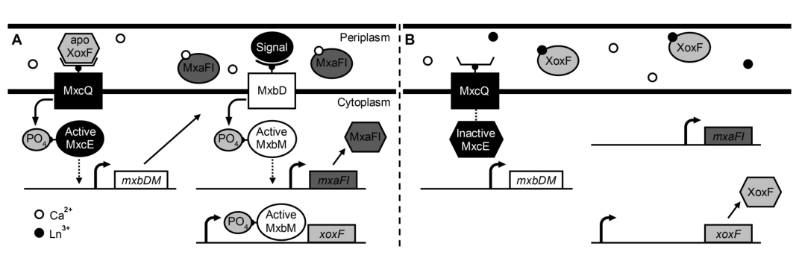

## Question

# Gene Research for Functional Annotation

## ⚠️ CRITICAL: Gene/Protein Identification Context

**BEFORE YOU BEGIN RESEARCH:** You MUST verify you are researching the CORRECT gene/protein. Gene symbols can be ambiguous, especially for less well-characterized genes from non-model organisms.

### Target Gene/Protein Identity (from UniProt):
- **UniProt Accession:** C5B133
- **Protein Description:** RecName: Full=histidine kinase {ECO:0000256|ARBA:ARBA00012438}; EC=2.7.13.3 {ECO:0000256|ARBA:ARBA00012438};
- **Gene Information:** Name=mxbD {ECO:0000313|EMBL:ACS39597.1}; OrderedLocusNames=MexAM1_META1p1753 {ECO:0000313|EMBL:ACS39597.1};
- **Organism (full):** Methylorubrum extorquens (strain ATCC 14718 / DSM 1338 / JCM 2805 / NCIMB 9133 / AM1) (Methylobacterium extorquens).
- **Protein Family:** Not specified in UniProt
- **Key Domains:** HAMP_dom. (IPR003660); HATPase_C_sf. (IPR036890); HATPase_dom. (IPR003594); His_kinase_dom. (IPR005467); HisK_dim/P_dom. (IPR003661)

### MANDATORY VERIFICATION STEPS:

1. **Check if the gene symbol "mxbD" matches the protein description above**
2. **Verify the organism is correct:** Methylorubrum extorquens (strain ATCC 14718 / DSM 1338 / JCM 2805 / NCIMB 9133 / AM1) (Methylobacterium extorquens).
3. **Check if protein family/domains align with what you find in literature**
4. **If you find literature for a DIFFERENT gene with the same or similar symbol, STOP**

### If Gene Symbol is Ambiguous or You Cannot Find Relevant Literature:

**DO NOT PROCEED WITH RESEARCH ON A DIFFERENT GENE.** Instead:
- State clearly: "The gene symbol 'mxbD' is ambiguous or literature is limited for this specific protein"
- Explain what you found (e.g., "Found extensive literature on a different gene with the same symbol in a different organism")
- Describe the protein based ONLY on the UniProt information provided above
- Suggest that the protein function can be inferred from domain/family information

### Research Target:

Please provide a comprehensive research report on the gene **mxbD** (gene ID: mxbD, UniProt: C5B133) in METEA.

The research report should be a detailed narrative explaining the function, biological processes, and localization of the gene product. Citations should be given for all claims.

You should prioritize authoritative reviews and primary scientific literature when conducting research. You can supplement
this with annotations you find in gene/protein databases, but these can be outdated or inaccurate.

We are specifically interested in the primary function of the gene - for enzymes, what reaction is catalyzed, and what is the substrate specificity? For transporters, what is the substrate? For structural proteins or adapters, what is the broader structural role? For signaling molecules, what is the role in the pathway.

We are interested in where in or outside the cell the gene product carries out its function.

We are also interested in the signaling or biochemical pathways in which the gene functions. We are less interested in broad pleiotropic effects, except where these elucidate the precise role.

Include evidence where possible. We are interested in both experimental evidence as well as inference from structure, evolution, or bioinformatic analysis. Precise studies should be prioritized over high-throughput, where available.

## Output

Question: You are an expert researcher providing comprehensive, well-cited information.

Provide detailed information focusing on:
1. Key concepts and definitions with current understanding
2. Recent developments and latest research (prioritize 2023-2024 sources)
3. Current applications and real-world implementations
4. Expert opinions and analysis from authoritative sources
5. Relevant statistics and data from recent studies

Format as a comprehensive research report with proper citations. Include URLs and publication dates where available.
Always prioritize recent, authoritative sources and provide specific citations for all major claims.

# Gene Research for Functional Annotation

## ⚠️ CRITICAL: Gene/Protein Identification Context

**BEFORE YOU BEGIN RESEARCH:** You MUST verify you are researching the CORRECT gene/protein. Gene symbols can be ambiguous, especially for less well-characterized genes from non-model organisms.

### Target Gene/Protein Identity (from UniProt):
- **UniProt Accession:** C5B133
- **Protein Description:** RecName: Full=histidine kinase {ECO:0000256|ARBA:ARBA00012438}; EC=2.7.13.3 {ECO:0000256|ARBA:ARBA00012438};
- **Gene Information:** Name=mxbD {ECO:0000313|EMBL:ACS39597.1}; OrderedLocusNames=MexAM1_META1p1753 {ECO:0000313|EMBL:ACS39597.1};
- **Organism (full):** Methylorubrum extorquens (strain ATCC 14718 / DSM 1338 / JCM 2805 / NCIMB 9133 / AM1) (Methylobacterium extorquens).
- **Protein Family:** Not specified in UniProt
- **Key Domains:** HAMP_dom. (IPR003660); HATPase_C_sf. (IPR036890); HATPase_dom. (IPR003594); His_kinase_dom. (IPR005467); HisK_dim/P_dom. (IPR003661)

### MANDATORY VERIFICATION STEPS:

1. **Check if the gene symbol "mxbD" matches the protein description above**
2. **Verify the organism is correct:** Methylorubrum extorquens (strain ATCC 14718 / DSM 1338 / JCM 2805 / NCIMB 9133 / AM1) (Methylobacterium extorquens).
3. **Check if protein family/domains align with what you find in literature**
4. **If you find literature for a DIFFERENT gene with the same or similar symbol, STOP**

### If Gene Symbol is Ambiguous or You Cannot Find Relevant Literature:

**DO NOT PROCEED WITH RESEARCH ON A DIFFERENT GENE.** Instead:
- State clearly: "The gene symbol 'mxbD' is ambiguous or literature is limited for this specific protein"
- Explain what you found (e.g., "Found extensive literature on a different gene with the same symbol in a different organism")
- Describe the protein based ONLY on the UniProt information provided above
- Suggest that the protein function can be inferred from domain/family information

### Research Target:

Please provide a comprehensive research report on the gene **mxbD** (gene ID: mxbD, UniProt: C5B133) in METEA.

The research report should be a detailed narrative explaining the function, biological processes, and localization of the gene product. Citations should be given for all claims.

You should prioritize authoritative reviews and primary scientific literature when conducting research. You can supplement
this with annotations you find in gene/protein databases, but these can be outdated or inaccurate.

We are specifically interested in the primary function of the gene - for enzymes, what reaction is catalyzed, and what is the substrate specificity? For transporters, what is the substrate? For structural proteins or adapters, what is the broader structural role? For signaling molecules, what is the role in the pathway.

We are interested in where in or outside the cell the gene product carries out its function.

We are also interested in the signaling or biochemical pathways in which the gene functions. We are less interested in broad pleiotropic effects, except where these elucidate the precise role.

Include evidence where possible. We are interested in both experimental evidence as well as inference from structure, evolution, or bioinformatic analysis. Precise studies should be prioritized over high-throughput, where available.

## Research report: functional annotation of **mxbD** (UniProt **C5B133**) in *Methylorubrum extorquens* AM1

### 1) Identity verification and scope control (critical disambiguation)
The target described by UniProt accession **C5B133** is annotated as a **histidine kinase** (EC **2.7.13.3**) encoded by **mxbD** in *Methylorubrum extorquens* strain AM1 (a.k.a. *Methylobacterium extorquens* AM1). In the accessible literature corpus retrieved here, **mxbD/MxbD** consistently refers to the **sensor histidine kinase component** of the **MxbDM** two-component regulatory system involved in regulating methanol oxidation gene expression in AM1, with **MxbM** as the cognate response regulator; no conflicting “mxbD” identity from other organisms was encountered in the evidence extracted. (skovran2019lanthanidesinmethylotrophy pages 6-8, dubey2019mnosrisa pages 25-28, vu2016lanthanidedependentregulationof pages 6-9)

Limitations: the retrieved full-text sources did **not** contain the UniProt/InterPro domain-by-domain description needed to independently confirm the reported HAMP/HATPase/HisKA-like architecture from sequence annotations. Therefore, domain architecture is treated as **UniProt-provided** context rather than re-validated from primary sequence analysis in this run.

### 2) Key concepts and definitions (current understanding)
#### Two-component systems (TCS) and histidine kinases
Two-component systems typically comprise (i) a **sensor histidine kinase** that autophosphorylates on a histidine residue using ATP and (ii) a **response regulator** that is phosphorylated on an aspartate residue to change gene regulation. In AM1 methylotrophy, **MxbDM** (MxbD sensor kinase + MxbM response regulator) and **MxcQE** (MxcQ sensor kinase + MxcE response regulator), together with the orphan response regulator **MxaB**, form a regulatory network controlling expression of methanol dehydrogenase systems. (skovran2019lanthanidesinmethylotrophy pages 6-8, vu2016lanthanidedependentregulationof pages 6-9)

#### “Ln switch” (lanthanide switch) in methylotrophs
AM1 encodes methanol dehydrogenase systems whose transcription responds strongly to **lanthanides (Ln)**. Vu et al. experimentally demonstrated that in AM1, **xox1** transcriptional activation is detectable at **~2.5 nM La** and reaches a maximum by **~250 nM La**, while repression of the **mxa** promoter begins between **25–50 nM La** and is fully repressed at **~250 nM La** (with no further change up to 20 μM La). This defines a quantitatively steep Ln-responsive transcriptional switch between *mxa* and *xox1*. (vu2016lanthanidedependentregulationof pages 14-18)

### 3) Biological function and pathway placement of MxbD (AM1)
#### Primary functional role (best-supported)
Across AM1-focused sources, **MxbD/MxbM** is best supported as a **regulatory (signaling) module**, not a metabolic enzyme: it is a two-component system required for proper expression and reciprocal control of methanol dehydrogenase gene clusters.

* **Activation of the Ca-dependent methanol dehydrogenase system (mxa):** the response regulator **MxbM** is described as **required for expression of the mxa operon**, alongside MxcQE and MxaB. (skovran2019lanthanidesinmethylotrophy pages 6-8, vu2016lanthanidedependentregulationof pages 6-9)
* **Repression of the lanthanide-responsive xox1 operon in Ln-free conditions:** Vu et al. state that the **MxbDM two-component system is required for repression of the xox1 operon in the absence of lanthanides**; the Skovran review further emphasizes that **MxbM is uniquely required for repression of xox1** in the described network. (vu2016lanthanidedependentregulationof pages 6-9, skovran2019lanthanidesinmethylotrophy pages 6-8)

#### Proposed regulatory model linking XoxF and MxbDM (current working hypothesis)
Vu et al. propose a model in which **apo-XoxF** (XoxF lacking a lanthanide cofactor) can act as a **sensor for lanthanide presence** by interacting (directly or indirectly) with the two-component systems **MxcQE and MxbDM**, such that:

* **Without lanthanides:** “apo-XoxF activates expression of the mxa genes and represses expression of the xox1 genes as mediated through the two-component systems MxcQE and MxbDM.” (vu2016lanthanidedependentregulationof pages 31-40)
* **With lanthanides:** XoxF binds the metal, resumes a catalytic role, and becomes unavailable (or conformationally unable) to interact with the TCSs, leading to **repression of mxa** and **activation of xox1**. (vu2016lanthanidedependentregulationof pages 31-40)

A schematic of this Ln-switch hypothesis (with MxbDM and MxcQE explicitly depicted) is provided in Vu et al. (Figure 8). (vu2016lanthanidedependentregulationof media 5459bc04)

### 4) Mechanism: what is known vs unknown (expert assessment)
A recurring expert assessment in both a primary study (Vu 2016) and an authoritative review (Skovran 2019) is that key mechanistic details of MxbDM remain unresolved:

* Vu et al. explicitly state “it is not known if the requirement for these regulators is direct or indirect or what is being sensed by these systems.” (vu2016lanthanidedependentregulationof pages 6-9)
* The Skovran review emphasizes that **direct binding of these regulators to promoters has not been demonstrated**, and “neither the phosphorylation state nor direct DNA binding by these response regulators has been shown” in the literature summarized there. (skovran2019lanthanidesinmethylotrophy pages 6-8)

Interpretation: While MxbD is annotated and used as a histidine kinase sensor in a canonical TCS architecture, the **native input signal** to MxbD in AM1 (lanthanide ions directly, methanol, formaldehyde, XoxF/metal status, or another periplasmic/cellular cue) remains **an open question** in the AM1 system, and regulatory connections are supported largely through genetics/reporters and network inference rather than direct biochemical reconstitution of phosphotransfer/DNA-binding.

### 5) Cellular localization/topology
Direct experimental localization/topology for **AM1 MxbD** was **not** identified in the retrieved full-text excerpts. However, MxbD is treated as a **sensor histidine kinase** whose “sensing domain” can be modularly swapped into engineered chimeric histidine kinases (see Applications below), which is consistent with (but does not prove) a typical HK architecture where an N-terminal sensor region (often membrane/periplasm-associated) is coupled to a cytosolic kinase transmitter. (selvamani2020engineeringofrecombinant pages 1-3, selvamani2020engineeringofrecombinant pages 3-5)

Accordingly, a cautious functional-annotation statement supported by literature is:
* **Localization inference:** MxbD is a **signaling protein** belonging to a two-component system regulating transcription; it is expected to function at the **cell envelope–cytosol signaling interface**, but **experimental validation of membrane topology/localization in AM1 is lacking** in the evidence retrieved here. (vu2016lanthanidedependentregulationof pages 6-9, skovran2019lanthanidesinmethylotrophy pages 6-8)

### 6) Recent developments and latest research (prioritizing 2023–2024)
Direct 2023–2024 primary literature **specifically dissecting MxbD biochemistry in AM1** was not retrieved in this run. However, 2023 research continues to expand the broader conceptual landscape in which MxbDM operates—lanthanide-regulated methylotrophy and methanol-linked behaviors:

* **Methanol metabolism-linked chemotaxis and plant colonization (2023):** In *Methylobacterium aquaticum* strain 22A, Tani et al. report that methylotaxis depends on multiple methyl-accepting chemotaxis proteins (MCPs) and that one MCP (MtpC) is regulated under **MxbDM**, linking methanol oxidation state and regulatory networks to host colonization behavior in a plant-associated methylobacterium. While not AM1, it underscores that MxbDM-like regulation is leveraged in related taxa for methanol-associated ecological traits. (Published Oct 2023; URL: https://doi.org/10.3389/fmicb.2023.1258452) (tani2023metabolismlinkedmethylotaxissensors pages 2-3)

* **Ln-dependent and Ln-responsive physiology continues to broaden beyond AM1 (2023–2024):** Work in diverse bacteria (e.g., a novel lanthanide-accumulating methylotroph and a non-methylotroph model) emphasizes that Ln can reprogram substantial portions of bacterial transcriptomes and that Ln sensing/signaling can discriminate between different Ln elements—contextually supporting why AM1’s Ln-responsive regulatory network (including MxbDM) remains an active research frontier. (Dec 2023; URL: https://doi.org/10.1128/spectrum.00867-23) (Oct 2024; URL: https://doi.org/10.1128/msphere.00685-24) (These papers were retrieved but do not provide AM1-specific mechanistic detail on MxbD.)

### 7) Current applications and real-world implementations
#### Synthetic biology: methanol biosensing via MxbD-derived sensing modules
A concrete implementation using **MxbD as a modular sensor** is demonstrated by Selvamani et al. (2020), who engineered *E. coli* methanol biosensors using domain swapping.

* The authors fused the **“methanol-sensing domain” of MxbD** (from *M. extorquens*) with the transmitter domain of *E. coli* EnvZ to create a chimeric histidine kinase (MxbDZ). The chimeric kinase signals via OmpR to activate the ompC promoter driving GFP. (Published Mar 2020; URL: https://doi.org/10.4014/mbl.1908.08009) (selvamani2020engineeringofrecombinant pages 1-3, selvamani2020engineeringofrecombinant pages 3-5)
* Quantitative operating regime: the engineered system was tested across **0–8% methanol**, and the authors report **maximum fluorescence at 0.05% methanol** for MxbDZ (and 0.01% for a separate MxcQ-based chimera). (selvamani2020engineeringofrecombinant pages 1-3, selvamani2020engineeringofrecombinant pages 3-5)

Relevance to functional annotation: this supports that MxbD contains an input/sensing region that can be repurposed as a modular sensor in heterologous TCS architectures, consistent with its annotation as a sensor histidine kinase. (selvamani2020engineeringofrecombinant pages 1-3)

### 8) Relevant statistics and data points (from recent/authoritative studies)
Key quantitative findings supporting pathway-level annotation:

* **Lanthanide thresholds for transcriptional switching in AM1:**
  * xox1 promoter activation detectable at **~2.5 nM La**, maximal by **~250 nM La**.
  * mxa promoter repression begins **25–50 nM La**, full repression by **~250 nM La**.
  * Distinct lanthanides (La, Ce, Pr, Nd) reproduce the differential expression pattern; Sm has only a small effect. (Apr 2016; URL: https://doi.org/10.1128/jb.00937-15) (vu2016lanthanidedependentregulationof pages 14-18)

* **Methanol biosensor response regime using MxbD-derived sensing (heterologous system):**
  * tested **0–8% methanol**; maximal fluorescence at **0.05% methanol** for the MxbD-based chimera. (Mar 2020; URL: https://doi.org/10.4014/mbl.1908.08009) (selvamani2020engineeringofrecombinant pages 1-3, selvamani2020engineeringofrecombinant pages 3-5)

### 9) Consolidated functional annotation (evidence-based)
**Gene/product:** *mxbD* encodes **MxbD**, a **sensor histidine kinase** that forms the **MxbDM** two-component system with response regulator **MxbM** in *Methylorubrum extorquens* AM1. (skovran2019lanthanidesinmethylotrophy pages 6-8, vu2016lanthanidedependentregulationof pages 6-9)

**Primary role in AM1:** MxbDM participates in the lanthanide-responsive transcriptional network controlling methanol oxidation systems, specifically supporting **mxa operon expression** and contributing to **repression of xox1 in lanthanide-free conditions**. (vu2016lanthanidedependentregulationof pages 6-9)

**Pathway context:** MxbDM acts together with **MxcQE** and **MxaB** in regulating methanol dehydrogenase gene expression, within a lanthanide switch framework where **lanthanide availability** tunes expression of Ca-dependent (mxa) vs Ln-dependent (xox) methanol dehydrogenases. (vu2016lanthanidedependentregulationof pages 6-9, vu2016lanthanidedependentregulationof pages 14-18)

**Mechanistic status:** The **direct signal sensed by MxbD**, whether regulation is **direct vs indirect**, and biochemical evidence for **phosphorylation state** and **direct DNA binding** by response regulators remain unresolved in the cited AM1 literature synthesis. (skovran2019lanthanidesinmethylotrophy pages 6-8, vu2016lanthanidedependentregulationof pages 6-9)

### 10) Evidence map (summary table)
| Topic | Key points | Best supporting sources (with year) |
|---|---|---|
| MxbD/MxbM function in *Methylorubrum extorquens* AM1 | MxbD is the sensor histidine kinase and MxbM the cognate response regulator of the MxbDM two-component system implicated in methanol oxidation gene regulation. The system is required for proper expression of methanol oxidation functions in AM1 and is positioned within a broader regulatory network with MxcQE and MxaB. | Skovran et al. 2019 review summarizing primary genetics; Springer et al. 1997 primary study cited therein (skovran2019lanthanidesinmethylotrophy pages 6-8, dubey2019mnosrisa pages 25-28) |
| Regulatory targets: *mxa* operon | MxbDM is required for expression of the *mxa* operon encoding the Ca-dependent methanol dehydrogenase system; MxbM is specifically described as required for *mxa* expression. MxcQE and MxaB also contribute to *mxa* activation, suggesting a multilayer cascade rather than a simple one-step control pathway. | Skovran et al. 2019; Vu et al. 2016 (skovran2019lanthanidesinmethylotrophy pages 6-8, vu2016lanthanidedependentregulationof pages 6-9) |
| Regulatory targets: *xox1* operon | In AM1, MxbDM is required to repress the *xox1* operon under lanthanide-free conditions; MxbM is highlighted as uniquely required for *xox1* repression in the reviewed model. This places MxbDM at the center of the inverse regulation between Ca-dependent *mxa* and Ln-dependent *xox* methanol dehydrogenase systems. | Skovran et al. 2019; Vu et al. 2016 (skovran2019lanthanidesinmethylotrophy pages 6-8, vu2016lanthanidedependentregulationof pages 6-9) |
| Lanthanide dependence / Ln-switch model | The best-supported current model is a lanthanide switch: without Ln, apo-XoxF is proposed to help drive *mxa* expression and *xox1* repression through MxcQE/MxbDM-linked signaling; with Ln present, XoxF becomes the active Ln-dependent enzyme and regulation flips toward *xox1* expression and *mxa* repression. Expression from *mxa* and *xox1* promoters is highly sensitive to Ln such as La, Ce, Pr, and Nd. | Vu et al. 2016 and its regulatory schematic; Skovran et al. 2019 (vu2016lanthanidedependentregulationof pages 6-9, vu2016lanthanidedependentregulationof media 5459bc04, skovran2019lanthanidesinmethylotrophy pages 6-8) |
| Known vs unknown mechanism | Known: MxbDM is a two-component regulatory pair associated with methanol metabolism and Ln-responsive regulation of *mxa/xox* expression. Unknown/uncertain: the direct signal sensed by MxbD in native AM1 remains unresolved; whether control is direct or indirect is still unclear; the phosphorylation state of MxbD/MxbM and direct DNA binding by these regulators had not been demonstrated in the cited review literature. | Vu et al. 2016; Skovran et al. 2019 (vu2016lanthanidedependentregulationof pages 6-9, skovran2019lanthanidesinmethylotrophy pages 6-8) |
| Domain/function inference for MxbD | Independently of unresolved native mechanism, MxbD is treated as a histidine kinase sensor component, consistent with two-component signaling logic and with engineering studies that use its input/sensing region as a modular sensor fused to another kinase transmitter domain. This supports functional annotation as a membrane-associated/environmental sensor rather than a catalytic methanol-oxidizing enzyme. | Selvamani et al. 2020; Skovran et al. 2019 (selvamani2020engineeringofrecombinant pages 1-3, selvamani2020engineeringofrecombinant pages 3-5, skovran2019lanthanidesinmethylotrophy pages 6-8) |
| Real-world application: methanol biosensor chimeras | MxbD has been repurposed in engineered *E. coli* methanol biosensors by fusing the MxbD sensing region to the EnvZ transmitter. The resulting chimeric kinase activated OmpR/ompC and GFP output, with reported maximal fluorescence at 0.05% methanol for MxbDZ; assays tested 0-8% methanol, demonstrating practical use of MxbD-derived sensing for synthetic biology. | Selvamani et al. 2020 (selvamani2020engineeringofrecombinant pages 1-3, selvamani2020engineeringofrecombinant pages 3-5) |

*Table: This table condenses the best-supported evidence on MxbD/MxbM in *Methylorubrum extorquens* AM1, emphasizing regulatory role, lanthanide-responsive control of *mxa/xox1*, major mechanistic uncertainties, and a concrete biosensor application.*

### Key visual evidence (model schematic)
Vu et al. provide a schematic hypothesis of the Ln switch and the proposed role of **MxbDM/MxcQE** in mediating opposite regulation of *mxa* vs *xox1* depending on lanthanide availability. (vu2016lanthanidedependentregulationof media 5459bc04)

---

### References (URLs and publication dates as available in retrieved sources)
* Vu HN et al. **Lanthanide-Dependent Regulation of Methanol Oxidation Systems in *Methylobacterium extorquens* AM1…** *Journal of Bacteriology* (Apr **2016**). https://doi.org/10.1128/jb.00937-15 (vu2016lanthanidedependentregulationof pages 6-9, vu2016lanthanidedependentregulationof pages 31-40, vu2016lanthanidedependentregulationof pages 14-18)
* Skovran E et al. **Lanthanides in methylotrophy.** *Current Issues in Molecular Biology* (Jan **2019**). https://doi.org/10.21775/cimb.033.101 (skovran2019lanthanidesinmethylotrophy pages 6-8)
* Selvamani V et al. **Engineering of recombinant *Escherichia coli* towards methanol sensing using *Methylobacterium extroquens* two-component systems.** (Mar **2020**). https://doi.org/10.4014/mbl.1908.08009 (selvamani2020engineeringofrecombinant pages 1-3, selvamani2020engineeringofrecombinant pages 3-5)
* Tani A et al. **Metabolism-linked methylotaxis sensors responsible for plant colonization in *Methylobacterium aquaticum* strain 22A.** *Frontiers in Microbiology* (Oct **2023**). https://doi.org/10.3389/fmicb.2023.1258452 (tani2023metabolismlinkedmethylotaxissensors pages 2-3)

References

1. (skovran2019lanthanidesinmethylotrophy pages 6-8): Elizabeth Skovran, Charumathi Raghuraman, and Norma Cecilia Martinez-Gomez. Lanthanides in methylotrophy. Current issues in molecular biology, 33:101-116, Jan 2019. URL: https://doi.org/10.21775/cimb.033.101, doi:10.21775/cimb.033.101. This article has 49 citations.

2. (dubey2019mnosrisa pages 25-28): Abhishek Anil Dubey and Vikas Jain. Mnosr is a bona fide two-component system involved in methylotrophic metabolism in mycobacterium smegmatis. Applied and Environmental Microbiology, Jul 2019. URL: https://doi.org/10.1128/aem.00535-19, doi:10.1128/aem.00535-19. This article has 16 citations and is from a peer-reviewed journal.

3. (vu2016lanthanidedependentregulationof pages 6-9): Huong N. Vu, Gabriel A. Subuyuj, Srividhya Vijayakumar, Nathan M. Good, N. Cecilia Martinez-Gomez, and Elizabeth Skovran. Lanthanide-dependent regulation of methanol oxidation systems in methylobacterium extorquens am1 and their contribution to methanol growth. Journal of Bacteriology, 198:1250-1259, Apr 2016. URL: https://doi.org/10.1128/jb.00937-15, doi:10.1128/jb.00937-15. This article has 227 citations and is from a peer-reviewed journal.

4. (vu2016lanthanidedependentregulationof pages 14-18): Huong N. Vu, Gabriel A. Subuyuj, Srividhya Vijayakumar, Nathan M. Good, N. Cecilia Martinez-Gomez, and Elizabeth Skovran. Lanthanide-dependent regulation of methanol oxidation systems in methylobacterium extorquens am1 and their contribution to methanol growth. Journal of Bacteriology, 198:1250-1259, Apr 2016. URL: https://doi.org/10.1128/jb.00937-15, doi:10.1128/jb.00937-15. This article has 227 citations and is from a peer-reviewed journal.

5. (vu2016lanthanidedependentregulationof pages 31-40): Huong N. Vu, Gabriel A. Subuyuj, Srividhya Vijayakumar, Nathan M. Good, N. Cecilia Martinez-Gomez, and Elizabeth Skovran. Lanthanide-dependent regulation of methanol oxidation systems in methylobacterium extorquens am1 and their contribution to methanol growth. Journal of Bacteriology, 198:1250-1259, Apr 2016. URL: https://doi.org/10.1128/jb.00937-15, doi:10.1128/jb.00937-15. This article has 227 citations and is from a peer-reviewed journal.

6. (vu2016lanthanidedependentregulationof media 5459bc04): Huong N. Vu, Gabriel A. Subuyuj, Srividhya Vijayakumar, Nathan M. Good, N. Cecilia Martinez-Gomez, and Elizabeth Skovran. Lanthanide-dependent regulation of methanol oxidation systems in methylobacterium extorquens am1 and their contribution to methanol growth. Journal of Bacteriology, 198:1250-1259, Apr 2016. URL: https://doi.org/10.1128/jb.00937-15, doi:10.1128/jb.00937-15. This article has 227 citations and is from a peer-reviewed journal.

7. (selvamani2020engineeringofrecombinant pages 1-3): Vidhya Selvamani, Irisappan Ganesh, Sowon Chae, Murali kannan Maruthamuthu, and Soon Ho Hong. Engineering of recombinant escherichia coli towards methanol sensing using methylobacterium extroquens two-component systems. ArXiv, 48:24-31, Mar 2020. URL: https://doi.org/10.4014/mbl.1908.08009, doi:10.4014/mbl.1908.08009. This article has 3 citations.

8. (selvamani2020engineeringofrecombinant pages 3-5): Vidhya Selvamani, Irisappan Ganesh, Sowon Chae, Murali kannan Maruthamuthu, and Soon Ho Hong. Engineering of recombinant escherichia coli towards methanol sensing using methylobacterium extroquens two-component systems. ArXiv, 48:24-31, Mar 2020. URL: https://doi.org/10.4014/mbl.1908.08009, doi:10.4014/mbl.1908.08009. This article has 3 citations.

9. (tani2023metabolismlinkedmethylotaxissensors pages 2-3): Akio Tani, Sachiko Masuda, Yoshiko Fujitani, Toshiki Iga, Yuuki Haruna, Shiho Kikuchi, Wang Shuaile, Haoxin Lv, Shiori Katayama, Hiroya Yurimoto, Yasuyoshi Sakai, and Junichi Kato. Metabolism-linked methylotaxis sensors responsible for plant colonization in methylobacterium aquaticum strain 22a. Frontiers in Microbiology, Oct 2023. URL: https://doi.org/10.3389/fmicb.2023.1258452, doi:10.3389/fmicb.2023.1258452. This article has 13 citations and is from a peer-reviewed journal.

## Artifacts

- [Edison artifact artifact-00](mxbD-deep-research-falcon_artifacts/artifact-00.md)

## Citations

1. vu2016lanthanidedependentregulationof pages 14-18
2. vu2016lanthanidedependentregulationof pages 31-40
3. vu2016lanthanidedependentregulationof pages 6-9
4. skovran2019lanthanidesinmethylotrophy pages 6-8
5. tani2023metabolismlinkedmethylotaxissensors pages 2-3
6. selvamani2020engineeringofrecombinant pages 1-3
7. dubey2019mnosrisa pages 25-28
8. selvamani2020engineeringofrecombinant pages 3-5
9. https://doi.org/10.3389/fmicb.2023.1258452
10. https://doi.org/10.1128/spectrum.00867-23
11. https://doi.org/10.1128/msphere.00685-24
12. https://doi.org/10.4014/mbl.1908.08009
13. https://doi.org/10.1128/jb.00937-15
14. https://doi.org/10.21775/cimb.033.101
15. https://doi.org/10.21775/cimb.033.101,
16. https://doi.org/10.1128/aem.00535-19,
17. https://doi.org/10.1128/jb.00937-15,
18. https://doi.org/10.4014/mbl.1908.08009,
19. https://doi.org/10.3389/fmicb.2023.1258452,