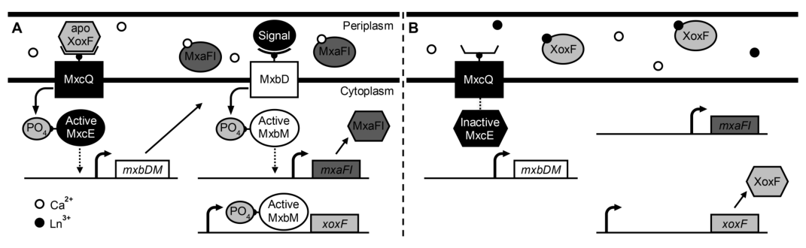

## Question

# Gene Research for Functional Annotation

## ⚠️ CRITICAL: Gene/Protein Identification Context

**BEFORE YOU BEGIN RESEARCH:** You MUST verify you are researching the CORRECT gene/protein. Gene symbols can be ambiguous, especially for less well-characterized genes from non-model organisms.

### Target Gene/Protein Identity (from UniProt):
- **UniProt Accession:** C5ASP3
- **Protein Description:** SubName: Full=Two component transcriptional regulator {ECO:0000313|EMBL:ACS42506.1};
- **Gene Information:** Name=mxcE {ECO:0000313|EMBL:ACS42506.1}; OrderedLocusNames=MexAM1_META1p4897 {ECO:0000313|EMBL:ACS42506.1};
- **Organism (full):** Methylorubrum extorquens (strain ATCC 14718 / DSM 1338 / JCM 2805 / NCIMB 9133 / AM1) (Methylobacterium extorquens).
- **Protein Family:** Not specified in UniProt
- **Key Domains:** CheY-like_superfamily. (IPR011006); Sig_transdc_resp-reg_C-effctor. (IPR016032); Sig_transdc_resp-reg_receiver. (IPR001789); Tscrpt_reg_LuxR_C. (IPR000792); WalR-like. (IPR039420)

### MANDATORY VERIFICATION STEPS:

1. **Check if the gene symbol "mxcE" matches the protein description above**
2. **Verify the organism is correct:** Methylorubrum extorquens (strain ATCC 14718 / DSM 1338 / JCM 2805 / NCIMB 9133 / AM1) (Methylobacterium extorquens).
3. **Check if protein family/domains align with what you find in literature**
4. **If you find literature for a DIFFERENT gene with the same or similar symbol, STOP**

### If Gene Symbol is Ambiguous or You Cannot Find Relevant Literature:

**DO NOT PROCEED WITH RESEARCH ON A DIFFERENT GENE.** Instead:
- State clearly: "The gene symbol 'mxcE' is ambiguous or literature is limited for this specific protein"
- Explain what you found (e.g., "Found extensive literature on a different gene with the same symbol in a different organism")
- Describe the protein based ONLY on the UniProt information provided above
- Suggest that the protein function can be inferred from domain/family information

### Research Target:

Please provide a comprehensive research report on the gene **mxcE** (gene ID: mxcE, UniProt: C5ASP3) in METEA.

The research report should be a detailed narrative explaining the function, biological processes, and localization of the gene product. Citations should be given for all claims.

You should prioritize authoritative reviews and primary scientific literature when conducting research. You can supplement
this with annotations you find in gene/protein databases, but these can be outdated or inaccurate.

We are specifically interested in the primary function of the gene - for enzymes, what reaction is catalyzed, and what is the substrate specificity? For transporters, what is the substrate? For structural proteins or adapters, what is the broader structural role? For signaling molecules, what is the role in the pathway.

We are interested in where in or outside the cell the gene product carries out its function.

We are also interested in the signaling or biochemical pathways in which the gene functions. We are less interested in broad pleiotropic effects, except where these elucidate the precise role.

Include evidence where possible. We are interested in both experimental evidence as well as inference from structure, evolution, or bioinformatic analysis. Precise studies should be prioritized over high-throughput, where available.

## Output

Question: You are an expert researcher providing comprehensive, well-cited information.

Provide detailed information focusing on:
1. Key concepts and definitions with current understanding
2. Recent developments and latest research (prioritize 2023-2024 sources)
3. Current applications and real-world implementations
4. Expert opinions and analysis from authoritative sources
5. Relevant statistics and data from recent studies

Format as a comprehensive research report with proper citations. Include URLs and publication dates where available.
Always prioritize recent, authoritative sources and provide specific citations for all major claims.

# Gene Research for Functional Annotation

## ⚠️ CRITICAL: Gene/Protein Identification Context

**BEFORE YOU BEGIN RESEARCH:** You MUST verify you are researching the CORRECT gene/protein. Gene symbols can be ambiguous, especially for less well-characterized genes from non-model organisms.

### Target Gene/Protein Identity (from UniProt):
- **UniProt Accession:** C5ASP3
- **Protein Description:** SubName: Full=Two component transcriptional regulator {ECO:0000313|EMBL:ACS42506.1};
- **Gene Information:** Name=mxcE {ECO:0000313|EMBL:ACS42506.1}; OrderedLocusNames=MexAM1_META1p4897 {ECO:0000313|EMBL:ACS42506.1};
- **Organism (full):** Methylorubrum extorquens (strain ATCC 14718 / DSM 1338 / JCM 2805 / NCIMB 9133 / AM1) (Methylobacterium extorquens).
- **Protein Family:** Not specified in UniProt
- **Key Domains:** CheY-like_superfamily. (IPR011006); Sig_transdc_resp-reg_C-effctor. (IPR016032); Sig_transdc_resp-reg_receiver. (IPR001789); Tscrpt_reg_LuxR_C. (IPR000792); WalR-like. (IPR039420)

### MANDATORY VERIFICATION STEPS:

1. **Check if the gene symbol "mxcE" matches the protein description above**
2. **Verify the organism is correct:** Methylorubrum extorquens (strain ATCC 14718 / DSM 1338 / JCM 2805 / NCIMB 9133 / AM1) (Methylobacterium extorquens).
3. **Check if protein family/domains align with what you find in literature**
4. **If you find literature for a DIFFERENT gene with the same or similar symbol, STOP**

### If Gene Symbol is Ambiguous or You Cannot Find Relevant Literature:

**DO NOT PROCEED WITH RESEARCH ON A DIFFERENT GENE.** Instead:
- State clearly: "The gene symbol 'mxcE' is ambiguous or literature is limited for this specific protein"
- Explain what you found (e.g., "Found extensive literature on a different gene with the same symbol in a different organism")
- Describe the protein based ONLY on the UniProt information provided above
- Suggest that the protein function can be inferred from domain/family information

### Research Target:

Please provide a comprehensive research report on the gene **mxcE** (gene ID: mxcE, UniProt: C5ASP3) in METEA.

The research report should be a detailed narrative explaining the function, biological processes, and localization of the gene product. Citations should be given for all claims.

You should prioritize authoritative reviews and primary scientific literature when conducting research. You can supplement
this with annotations you find in gene/protein databases, but these can be outdated or inaccurate.

We are specifically interested in the primary function of the gene - for enzymes, what reaction is catalyzed, and what is the substrate specificity? For transporters, what is the substrate? For structural proteins or adapters, what is the broader structural role? For signaling molecules, what is the role in the pathway.

We are interested in where in or outside the cell the gene product carries out its function.

We are also interested in the signaling or biochemical pathways in which the gene functions. We are less interested in broad pleiotropic effects, except where these elucidate the precise role.

Include evidence where possible. We are interested in both experimental evidence as well as inference from structure, evolution, or bioinformatic analysis. Precise studies should be prioritized over high-throughput, where available.

## Research report: functional annotation of **mxcE** (UniProt **C5ASP3**) in *Methylorubrum extorquens* AM1

### 1) Target verification: gene/protein identity and disambiguation
The retrieved AM1-focused literature consistently uses **mxcE** to denote the **response regulator (RR)** partner of the sensor histidine kinase **mxcQ**, together forming the **MxcQE two-component system (TCS)** involved in transcriptional control of methanol oxidation functions in *Methylobacterium/Methylorubrum extorquens* AM1 (vu2016lanthanidedependentregulationof pages 31-40, selvamani2020engineeringofrecombinant pages 1-3). This aligns with the user-provided UniProt description for **C5ASP3** as a “two component transcriptional regulator.”

### 2) Key concepts and definitions (current understanding)
#### Two-component systems (TCS) and response regulators
In bacterial **two-component signaling**, a **sensor histidine kinase (HK)** typically detects an environmental/physiological cue and autophosphorylates on a histidine residue; the phosphate is transferred to a cognate **response regulator** on a conserved aspartate in the N-terminal **receiver (REC) domain**, modulating RR activity (commonly via altered DNA binding through a C-terminal effector domain). In AM1 methanol-oxidation regulation, MxcQE is repeatedly described as a TCS involved in controlling expression of methanol oxidation genes (vu2016lanthanidedependentregulationof pages 31-40, selvamani2020engineeringofrecombinant pages 1-3).

#### What “mxcE” refers to in AM1 methylotrophy
AM1 methanol oxidation genetics historically partition key functions into multiple loci/clusters (e.g., the **mxa** structural/maturation cluster for Ca-dependent MDH), and regulatory modules include TCSs such as **MxbDM** and **MxcQE** (chistoserdova2003methylotrophyinmethylobacterium pages 4-5, vu2016lanthanidedependentregulationof pages 31-40). The **mxc** cluster is also recognized (in broader syntheses) as part of the genetic complement required for functional expression of **MxaFI-type** methanol dehydrogenase (MDH) (xie2023molecularmechanismsof pages 13-18).

### 3) Biological function of MxcE: pathway role and regulated processes
#### Core functional hypothesis supported by AM1 experimental work
A highly cited AM1 study on lanthanide-dependent regulation provides an explicit mechanistic hypothesis placing **MxcQE** (and MxbDM) upstream of **mxa** gene expression (the Ca-dependent methanol dehydrogenase system) and in reciprocal control with **xox1** (lanthanide-dependent MDH system) (vu2016lanthanidedependentregulationof pages 31-40). In this model:
- **In the absence of lanthanides**, “apo-XoxF” is proposed to **activate mxa** and **repress xox1**, mediated through **MxcQE and MxbDM**.
- **In the presence of lanthanides**, XoxF is proposed to resume its catalytic role as a lanthanide-dependent MDH and no longer interact effectively with these TCSs, yielding **repression of mxa** and **activation of xox1**.
Importantly, the authors note that although **MxcQE/MxbDM are required for mxa expression**, whether this requirement is **direct or indirect** has not been demonstrated (vu2016lanthanidedependentregulationof pages 31-40).

#### Genetic/promoter evidence connecting MxcE to methanol-oxidation regulation
A classic AM1 genetics study used **xylE transcriptional fusions** to measure promoter activity in wild type and regulatory mutants, including **MxcE** and **MxcQ** mutants (chistoserdova1997molecularandmutational pages 5-7). Transcription from tested loci was **low in wild type** but rose to **moderate levels** in regulatory methanol oxidation mutants, consistent with these genes being under negative control by the methanol oxidation regulatory system (chistoserdova1997molecularandmutational pages 5-7). Quantitatively (cells grown on succinate), catechol 2,3-dioxygenase activities (nmol min⁻¹ (mg protein)⁻¹) included:
- For an **orf3** upstream region (pLC92B-A): AM1 6; **MxcE 100**; **MxcQ 80**; MxbD 320; MxbM 90.
- For an **orf4** upstream region (pLC200G): AM1 10; **MxcE 80**; **MxcQ 60**; MxbD 290; MxbM 120.
These data show that mutation of **mxcE** changes transcriptional outputs at specific promoters in the broader methylotrophy genomic neighborhood, supporting a regulatory role for MxcE in the methanol-oxidation regulome (chistoserdova1997molecularandmutational pages 5-7).

### 4) Subcellular localization (where the gene product acts)
MxcE is a **two-component response regulator**, and response regulators in this class generally function in the **cytoplasm**, where they interact with DNA and/or transcriptional machinery after phosphorylation. In AM1, the published functional context supports MxcE as a transcriptional regulator controlling promoter activity of methylotrophy genes (chistoserdova1997molecularandmutational pages 5-7, vu2016lanthanidedependentregulationof pages 31-40). (Direct localization experiments for MxcE were not found in the retrieved corpus; this localization assignment is consistent with RR function.)

### 5) Recent developments (prioritizing 2023–2024 sources) and what is (and is not) known for AM1 mxcE
#### 2023 synthesis: mxc cluster in the MDH genetic complement; broader lanthanide-switch mechanisms
A 2023 synthesis/thesis on rare earth element (REE/lanthanide) utilization in methylotrophs reiterates that **>25 genes in five clusters (mxa, mxb, mxc, pqqABCDE, pqqFG)** contribute to functional expression of **MxaFI-type MDH**, and summarizes the “REE switch” in which lanthanides suppress Mxa-type expression and promote Xox-type expression (xie2023molecularmechanismsof pages 13-18). While this 2023 document does not provide AM1 mxcE-specific mechanistic experiments, it represents a recent consolidation of the field’s view that the **mxc** cluster remains part of the canonical MDH-expression genetic system (xie2023molecularmechanismsof pages 13-18).

#### Gap in 2023–2024 mxcE-specific primary research retrieval
Within the tool-retrieved corpus, no **2023–2024 primary experimental paper specifically dissecting AM1 mxcE** (e.g., ChIP-seq-defined regulon, phosphosignaling biochemistry, or structure) was retrievable. Consequently, AM1 mxcE-specific mechanistic statements remain largely anchored in foundational AM1 genetics and lanthanide-regulation work that is still authoritative and heavily cited (chistoserdova1997molecularandmutational pages 5-7, vu2016lanthanidedependentregulationof pages 31-40).

### 6) Current applications and real-world implementations
#### Synthetic biology: methanol biosensing using AM1 two-component modules
A practical implementation of AM1 methanol-oxidation regulatory machinery is the engineering of **heterologous methanol sensors** in *E. coli* using domain swapping. The study explicitly states that **mxcQ/mxcE** constitute a TCS involved in methanol metabolism regulation and builds a chimeric HK by fusing the **MxcQ sensing region** to the **EnvZ** transmitter domain (selvamani2020engineeringofrecombinant pages 1-3, selvamani2020engineeringofrecombinant pages 5-8).

**Performance statistics (application-relevant):** qRT-PCR and GFP reporter assays showed the engineered system’s strongest response at **0.01% methanol**, with maximum GFP signal after ~8 h for the MxcQZ-derived sensor; the authors report that both chimeric TCS constructs could sense methanol down to **0.01%** (selvamani2020engineeringofrecombinant pages 5-8). This demonstrates that key methanol-responsive sensing logic from the AM1 system can be repurposed for biotechnology (selvamani2020engineeringofrecombinant pages 5-8, selvamani2020engineeringofrecombinant pages 1-3).

### 7) Expert opinion / authoritative interpretation from the retrieved literature
The lanthanide-dependent regulation study provides a clear expert synthesis: **MxcQE and MxbDM are required for mxa expression**, but the **directness** of their regulatory effects is unresolved, motivating a model in which **apo-XoxF** is the lanthanide-responsive element interacting with these TCSs (vu2016lanthanidedependentregulationof pages 31-40). This is a critical “state of the evidence” statement: the pathway logic is strongly supported by genetic and reporter assays, but the molecular contacts (direct promoter binding by MxcE vs indirect cascades) remain a key open question (vu2016lanthanidedependentregulationof pages 31-40).

### 8) Key statistics and data points (from the most relevant studies)
- **Promoter fusion (AM1 vs regulatory mutants):** XylE activity for selected promoters increased substantially in **mxcE** and **mxcQ** mutants vs wild type (e.g., *orf3* pLC92B-A: AM1 6 vs MxcE 100; *orf4* pLC200G: AM1 10 vs MxcE 80; units nmol min⁻¹ (mg protein)⁻¹) (chistoserdova1997molecularandmutational pages 5-7).
- **Lanthanide-dependent promoter reporter framework:** The lanthanide-dependent regulation work reports promoter-reporter expression of **mxa-venus** and **xox1-venus** across increasing La concentrations and across multiple lanthanides in biological triplicates (figures and captions) and provides an explicit regulatory hypothesis diagram placing MxcQE/MxbDM in the switching logic (vu2016lanthanidedependentregulationof pages 31-40, vu2016lanthanidedependentregulationof media 62176c9a, vu2016lanthanidedependentregulationof media cef778e0, vu2016lanthanidedependentregulationof media 0a65ce89).
- **Engineered biosensor sensitivity:** heterologous MxcQ-derived sensor shows maximal reporter output at **0.01% methanol** (qRT-PCR and GFP reporter) (selvamani2020engineeringofrecombinant pages 5-8).
- **Recent (2023) compiled genomic context:** “>25 genes in five clusters (mxa, mxb, mxc, pqqABCDE, pqqFG)” contribute to functional expression of MxaFI-type MDH (xie2023molecularmechanismsof pages 13-18).

### 9) Interpretation for functional annotation of UniProt C5ASP3 (mxcE)
**Most defensible functional annotation based on retrieved evidence:**
- **Molecular function:** two-component **response regulator** (transcriptional regulator) acting within **MxcQE** to control transcriptional programs needed for methanol oxidation, particularly expression of the **mxa** (Ca-dependent MDH) system and associated methanol oxidation genes (vu2016lanthanidedependentregulationof pages 31-40, selvamani2020engineeringofrecombinant pages 1-3).
- **Biological process:** regulation of **methylotrophy/methanol oxidation** gene expression; participation in the **lanthanide-responsive MDH switching network** (mxa ↔ xox) as part of an integrated regulatory system (vu2016lanthanidedependentregulationof pages 31-40).
- **Cellular component:** consistent with response regulator biology, likely **cytoplasmic** regulator controlling promoter activity; experimental promoter-fusion phenotypes support a transcriptional regulatory role (chistoserdova1997molecularandmutational pages 5-7).

### Evidence summary table
| Claim/Topic | Evidence summary | Organism/strain | Study type | Year | Source (with DOI URL) |
|---|---|---|---|---|---|
| Lanthanide-dependent model linking MxcQE/MxbDM to *mxa* vs *xox1* regulation | Peer-reviewed study proposes that MxcQE and MxbDM are two-component systems required for expression of the *mxa* genes, although directness was not demonstrated. Working model: in the absence of lanthanides, apo-XoxF activates *mxa* and represses *xox1* through MxcQE/MxbDM; in the presence of lanthanides, XoxF functions as a lanthanide-dependent methanol dehydrogenase and *mxa* is repressed while *xox1* is activated. Figures 6–7 report promoter-reporter measurements from biological triplicates across increasing La concentrations and different lanthanides, supporting lanthanide-responsive switching of *mxa* and *xox1* expression (vu2016lanthanidedependentregulationof pages 31-40, vu2016lanthanidedependentregulationof media 62176c9a, vu2016lanthanidedependentregulationof media cef778e0, vu2016lanthanidedependentregulationof media 0a65ce89). | *Methylobacterium extorquens* AM1 (now *Methylorubrum extorquens* AM1) | Primary experimental study with promoter-reporter assays and regulatory model | 2016 | Vu et al., *Journal of Bacteriology* (2016), DOI: https://doi.org/10.1128/JB.00937-15 |
| Regulatory mutant promoter-fusion evidence implicating MxcE/MxcQ in methanol-oxidation control | In xylE transcription-fusion assays for promoters upstream of *orf3* and *orf4*, wild type showed low activity, while regulatory mutants showed elevated expression. Reported catechol 2,3-dioxygenase activities [nmol min^-1 (mg protein)^-1]: for *orf3* fusion pLC92B-A, AM1 6, MxbD 320, MxbM 90, MxcE 100, MxcQ 80; for *orf4* fusion pLC200G, AM1 10, MxbD 290, MxbM 120, MxcE 80, MxcQ 60. Authors concluded these loci are negatively controlled by the methanol-oxidation regulatory system; MxcE and MxcQ were among the regulatory methanol-oxidation mutants tested (chistoserdova1997molecularandmutational pages 5-7). | *Methylobacterium extorquens* AM1 and regulatory mutants (MxbD, MxbM, MxcE, MxcQ) | Primary genetic/promoter-fusion study | 1997 | Chistoserdova & Lidstrom, *Microbiology* (1997), DOI: https://doi.org/10.1099/00221287-143-5-1729 |
| Engineered methanol sensor demonstrates transferable sensing function from the MxcQ/MxcQE system | Study states that five genes—*mxbDM*, *mxcQE*, and *mxaB*—are responsible for transcription of methanol oxidation genes; *mxcQ* and *mxbD* are sensor kinases and *mxcE* and *mxbM* are response regulators. Researchers fused the *M. extorquens* AM1 MxcQ sensing region to the *E. coli* EnvZ transmitter domain (MxcQZ AM1). The resulting chimeric system produced maximum *ompC* transcription and GFP signal at 0.01% methanol after 8 h; both chimeric TCS constructs sensed methanol down to 0.01%. This supports functional methanol sensing associated with the native MxcQ/MxcQE regulatory framework, though it does not directly characterize native MxcE domains (selvamani2020engineeringofrecombinant pages 5-8, selvamani2020engineeringofrecombinant pages 1-3, selvamani2020engineeringofrecombinant pages 3-5). | Heterologous *Escherichia coli* carrying chimeric components derived from *Methylobacterium extorquens* AM1 | Synthetic biology / heterologous functional assay | 2020 | Selvamani et al., *Microbiology and Biotechnology Letters* (2020), DOI: https://doi.org/10.4014/mbl.1908.08009 |
| Genomic review places methanol oxidation genes in multiple chromosomal clusters and highlights remaining regulatory gaps | Genomic review of AM1 reports methanol oxidation genes are distributed in three chromosomal locations; one 12.5-kb cluster contains 14 *mxa* genes (*mxaFJGIRSACKLDEHB*), all transcribed in the same direction. The review states that genome analysis had identified about 30 new methylotrophy genes and that only “a few regulatory genes” involved in C1 oxidation/assimilation remained unidentified at the time, providing pathway context for regulators such as MxcQE. This review is valuable for placing MxcE within the broader methanol-oxidation network, though it does not itself experimentally resolve MxcE function (chistoserdova2003methylotrophyinmethylobacterium pages 4-5, chistoserdova2003methylotrophyinmethylobacterium pages 3-4). | *Methylobacterium extorquens* AM1 | Genomic review/minireview | 2003 | Chistoserdova et al., *Journal of Bacteriology* (2003), DOI: https://doi.org/10.1128/JB.185.10.2980-2987.2003 |

*Table: This table compiles the most relevant evidence linking MxcE and the MxcQE two-component system to methanol oxidation regulation in Methylorubrum/Methylobacterium extorquens AM1. It integrates mechanistic, genetic, heterologous sensing, and genomic-context studies, with quantitative values where available.*

### Supporting figure and data (visual evidence)
The following retrieved images provide direct visual support for the central regulatory claims:
- Lanthanide-responsive *mxa* vs *xox1* promoter expression (Vu et al. 2016 Figures 6–7) (vu2016lanthanidedependentregulationof media cef778e0, vu2016lanthanidedependentregulationof media 0a65ce89).
- Hypothesized regulatory model placing MxcQE/MxbDM downstream of apo-XoxF in the lanthanide switch (Vu et al. 2016 Figure 8) (vu2016lanthanidedependentregulationof media 62176c9a).

### References (URLs and publication dates)
- Chistoserdova L, Lidstrom ME. **Molecular and mutational analysis of a DNA region separating two methylotrophy gene clusters in *Methylobacterium extorquens* AM1.** *Microbiology*. **May 1997**. https://doi.org/10.1099/00221287-143-5-1729 (chistoserdova1997molecularandmutational pages 5-7)
- Chistoserdova L, Chen S-W, Lapidus A, Lidstrom ME. **Methylotrophy in *Methylobacterium extorquens* AM1 from a Genomic Point of View.** *Journal of Bacteriology*. **May 2003**. https://doi.org/10.1128/JB.185.10.2980-2987.2003 (chistoserdova2003methylotrophyinmethylobacterium pages 4-5, chistoserdova2003methylotrophyinmethylobacterium pages 3-4)
- Vu HN, Subuyuj GA, Vijayakumar S, Good NM, Martinez-Gomez NC, Skovran E. **Lanthanide-Dependent Regulation of Methanol Oxidation Systems in *Methylobacterium extorquens* AM1 and Their Contribution to Methanol Growth.** *Journal of Bacteriology*. **Apr 2016**. https://doi.org/10.1128/JB.00937-15 (vu2016lanthanidedependentregulationof pages 31-40, vu2016lanthanidedependentregulationof media 62176c9a, vu2016lanthanidedependentregulationof media cef778e0, vu2016lanthanidedependentregulationof media 0a65ce89)
- Selvamani V, Ganesh I, Chae S, Maruthamuthu MK, Hong SH. **Engineering of Recombinant *Escherichia coli* towards Methanol Sensing Using *Methylobacterium extroquens* Two-component Systems.** *Microbiology and Biotechnology Letters*. **Mar 2020**. https://doi.org/10.4014/mbl.1908.08009 (selvamani2020engineeringofrecombinant pages 5-8, selvamani2020engineeringofrecombinant pages 1-3)
- Xie R. **Molecular mechanisms of rare earth element utilization by methane-oxidizing bacteria and protease-producing bacteria.** **2023** (source details incomplete in retrieved record) (xie2023molecularmechanismsof pages 13-18)

### Limitations of this report (evidence availability)
- No retrievable full-text source in this run provided **direct biochemical characterization** of MxcE phosphorylation, DNA-binding sites/motifs, or a genome-wide regulon for AM1. Therefore, regulatory mechanisms are reported at the level supported by promoter assays and hypothesis models rather than direct binding evidence (vu2016lanthanidedependentregulationof pages 31-40, chistoserdova1997molecularandmutational pages 5-7).
- Direct external database page retrieval (UniProt/InterPro) was not available through the toolchain here; domain statements are limited to the UniProt context supplied in the user prompt and are not re-verified via database scraping in this run.

References

1. (vu2016lanthanidedependentregulationof pages 31-40): Huong N. Vu, Gabriel A. Subuyuj, Srividhya Vijayakumar, Nathan M. Good, N. Cecilia Martinez-Gomez, and Elizabeth Skovran. Lanthanide-dependent regulation of methanol oxidation systems in methylobacterium extorquens am1 and their contribution to methanol growth. Journal of Bacteriology, 198:1250-1259, Apr 2016. URL: https://doi.org/10.1128/jb.00937-15, doi:10.1128/jb.00937-15. This article has 227 citations and is from a peer-reviewed journal.

2. (selvamani2020engineeringofrecombinant pages 1-3): Vidhya Selvamani, Irisappan Ganesh, Sowon Chae, Murali kannan Maruthamuthu, and Soon Ho Hong. Engineering of recombinant escherichia coli towards methanol sensing using methylobacterium extroquens two-component systems. ArXiv, 48:24-31, Mar 2020. URL: https://doi.org/10.4014/mbl.1908.08009, doi:10.4014/mbl.1908.08009. This article has 3 citations.

3. (chistoserdova2003methylotrophyinmethylobacterium pages 4-5): Ludmila Chistoserdova, Sung-Wei Chen, Alla Lapidus, and Mary E. Lidstrom. Methylotrophy in methylobacterium extorquens am1 from a genomic point of view. Journal of Bacteriology, 185:2980-2987, May 2003. URL: https://doi.org/10.1128/jb.185.10.2980-2987.2003, doi:10.1128/jb.185.10.2980-2987.2003. This article has 402 citations and is from a peer-reviewed journal.

4. (xie2023molecularmechanismsof pages 13-18): R Xie. Molecular mechanisms of rare earth element utilization by methane-oxidizing bacteria and protease-producing bacteria. Unknown journal, 2023.

5. (chistoserdova1997molecularandmutational pages 5-7): Ludmila Chistoserdova and Mary E. Lidstrom. Molecular and mutational analysis of a dna region separating two methylotrophy gene clusters in methylobacterium extorquens am1. Microbiology, 143 ( Pt 5):1729-36, May 1997. URL: https://doi.org/10.1099/00221287-143-5-1729, doi:10.1099/00221287-143-5-1729. This article has 119 citations and is from a peer-reviewed journal.

6. (selvamani2020engineeringofrecombinant pages 5-8): Vidhya Selvamani, Irisappan Ganesh, Sowon Chae, Murali kannan Maruthamuthu, and Soon Ho Hong. Engineering of recombinant escherichia coli towards methanol sensing using methylobacterium extroquens two-component systems. ArXiv, 48:24-31, Mar 2020. URL: https://doi.org/10.4014/mbl.1908.08009, doi:10.4014/mbl.1908.08009. This article has 3 citations.

7. (vu2016lanthanidedependentregulationof media 62176c9a): Huong N. Vu, Gabriel A. Subuyuj, Srividhya Vijayakumar, Nathan M. Good, N. Cecilia Martinez-Gomez, and Elizabeth Skovran. Lanthanide-dependent regulation of methanol oxidation systems in methylobacterium extorquens am1 and their contribution to methanol growth. Journal of Bacteriology, 198:1250-1259, Apr 2016. URL: https://doi.org/10.1128/jb.00937-15, doi:10.1128/jb.00937-15. This article has 227 citations and is from a peer-reviewed journal.

8. (vu2016lanthanidedependentregulationof media cef778e0): Huong N. Vu, Gabriel A. Subuyuj, Srividhya Vijayakumar, Nathan M. Good, N. Cecilia Martinez-Gomez, and Elizabeth Skovran. Lanthanide-dependent regulation of methanol oxidation systems in methylobacterium extorquens am1 and their contribution to methanol growth. Journal of Bacteriology, 198:1250-1259, Apr 2016. URL: https://doi.org/10.1128/jb.00937-15, doi:10.1128/jb.00937-15. This article has 227 citations and is from a peer-reviewed journal.

9. (vu2016lanthanidedependentregulationof media 0a65ce89): Huong N. Vu, Gabriel A. Subuyuj, Srividhya Vijayakumar, Nathan M. Good, N. Cecilia Martinez-Gomez, and Elizabeth Skovran. Lanthanide-dependent regulation of methanol oxidation systems in methylobacterium extorquens am1 and their contribution to methanol growth. Journal of Bacteriology, 198:1250-1259, Apr 2016. URL: https://doi.org/10.1128/jb.00937-15, doi:10.1128/jb.00937-15. This article has 227 citations and is from a peer-reviewed journal.

10. (selvamani2020engineeringofrecombinant pages 3-5): Vidhya Selvamani, Irisappan Ganesh, Sowon Chae, Murali kannan Maruthamuthu, and Soon Ho Hong. Engineering of recombinant escherichia coli towards methanol sensing using methylobacterium extroquens two-component systems. ArXiv, 48:24-31, Mar 2020. URL: https://doi.org/10.4014/mbl.1908.08009, doi:10.4014/mbl.1908.08009. This article has 3 citations.

11. (chistoserdova2003methylotrophyinmethylobacterium pages 3-4): Ludmila Chistoserdova, Sung-Wei Chen, Alla Lapidus, and Mary E. Lidstrom. Methylotrophy in methylobacterium extorquens am1 from a genomic point of view. Journal of Bacteriology, 185:2980-2987, May 2003. URL: https://doi.org/10.1128/jb.185.10.2980-2987.2003, doi:10.1128/jb.185.10.2980-2987.2003. This article has 402 citations and is from a peer-reviewed journal.

## Artifacts

- [Edison artifact artifact-00](mxcE-deep-research-falcon_artifacts/artifact-00.md)

## Citations

1. xie2023molecularmechanismsof pages 13-18
2. vu2016lanthanidedependentregulationof pages 31-40
3. chistoserdova1997molecularandmutational pages 5-7
4. selvamani2020engineeringofrecombinant pages 5-8
5. selvamani2020engineeringofrecombinant pages 1-3
6. chistoserdova2003methylotrophyinmethylobacterium pages 4-5
7. selvamani2020engineeringofrecombinant pages 3-5
8. chistoserdova2003methylotrophyinmethylobacterium pages 3-4
9. nmol min^-1 (mg protein)^-1
10. https://doi.org/10.1128/JB.00937-15
11. https://doi.org/10.1099/00221287-143-5-1729
12. https://doi.org/10.4014/mbl.1908.08009
13. https://doi.org/10.1128/JB.185.10.2980-2987.2003
14. https://doi.org/10.1128/jb.00937-15,
15. https://doi.org/10.4014/mbl.1908.08009,
16. https://doi.org/10.1128/jb.185.10.2980-2987.2003,
17. https://doi.org/10.1099/00221287-143-5-1729,