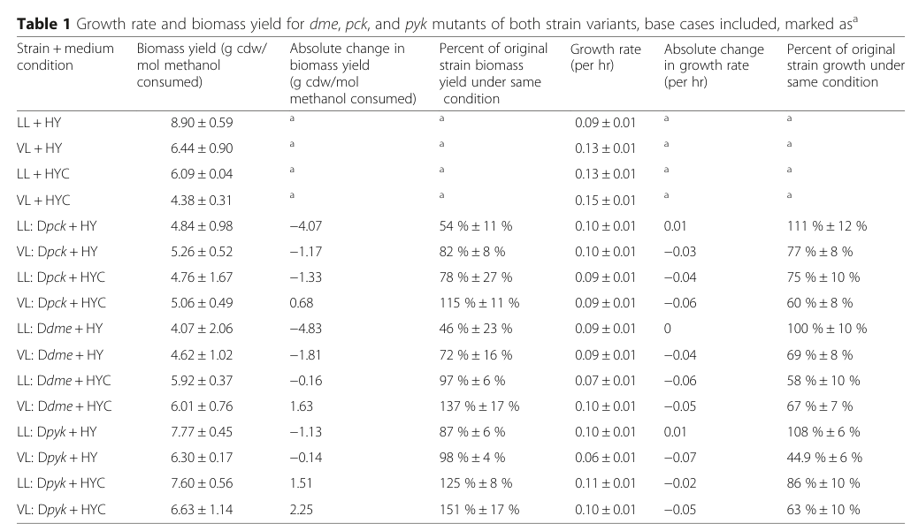

## Question

# Gene Research for Functional Annotation

## ⚠️ CRITICAL: Gene/Protein Identification Context

**BEFORE YOU BEGIN RESEARCH:** You MUST verify you are researching the CORRECT gene/protein. Gene symbols can be ambiguous, especially for less well-characterized genes from non-model organisms.

### Target Gene/Protein Identity (from UniProt):
- **UniProt Accession:** C5B045
- **Protein Description:** RecName: Full=Phosphoenolpyruvate carboxykinase (ATP) {ECO:0000256|ARBA:ARBA00012363, ECO:0000256|HAMAP-Rule:MF_00453}; Short=PCK {ECO:0000256|HAMAP-Rule:MF_00453}; Short=PEP carboxykinase {ECO:0000256|HAMAP-Rule:MF_00453}; Short=PEPCK {ECO:0000256|HAMAP-Rule:MF_00453}; EC=4.1.1.49 {ECO:0000256|ARBA:ARBA00012363, ECO:0000256|HAMAP-Rule:MF_00453};
- **Gene Information:** Name=pck {ECO:0000313|EMBL:ACS39395.1}; Synonyms=pckA {ECO:0000256|HAMAP-Rule:MF_00453}; OrderedLocusNames=MexAM1_META1p1533 {ECO:0000313|EMBL:ACS39395.1};
- **Organism (full):** Methylorubrum extorquens (strain ATCC 14718 / DSM 1338 / JCM 2805 / NCIMB 9133 / AM1) (Methylobacterium extorquens).
- **Protein Family:** Belongs to the phosphoenolpyruvate carboxykinase (ATP)
- **Key Domains:** PEP_carboxykinase_ATP. (IPR001272); PEP_carboxykinase_C. (IPR013035); PEP_carboxykinase_N. (IPR008210); PEPCK_ATP (PF01293)

### MANDATORY VERIFICATION STEPS:

1. **Check if the gene symbol "pck" matches the protein description above**
2. **Verify the organism is correct:** Methylorubrum extorquens (strain ATCC 14718 / DSM 1338 / JCM 2805 / NCIMB 9133 / AM1) (Methylobacterium extorquens).
3. **Check if protein family/domains align with what you find in literature**
4. **If you find literature for a DIFFERENT gene with the same or similar symbol, STOP**

### If Gene Symbol is Ambiguous or You Cannot Find Relevant Literature:

**DO NOT PROCEED WITH RESEARCH ON A DIFFERENT GENE.** Instead:
- State clearly: "The gene symbol 'pck' is ambiguous or literature is limited for this specific protein"
- Explain what you found (e.g., "Found extensive literature on a different gene with the same symbol in a different organism")
- Describe the protein based ONLY on the UniProt information provided above
- Suggest that the protein function can be inferred from domain/family information

### Research Target:

Please provide a comprehensive research report on the gene **pck** (gene ID: pckA, UniProt: C5B045) in METEA.

The research report should be a detailed narrative explaining the function, biological processes, and localization of the gene product. Citations should be given for all claims.

You should prioritize authoritative reviews and primary scientific literature when conducting research. You can supplement
this with annotations you find in gene/protein databases, but these can be outdated or inaccurate.

We are specifically interested in the primary function of the gene - for enzymes, what reaction is catalyzed, and what is the substrate specificity? For transporters, what is the substrate? For structural proteins or adapters, what is the broader structural role? For signaling molecules, what is the role in the pathway.

We are interested in where in or outside the cell the gene product carries out its function.

We are also interested in the signaling or biochemical pathways in which the gene functions. We are less interested in broad pleiotropic effects, except where these elucidate the precise role.

Include evidence where possible. We are interested in both experimental evidence as well as inference from structure, evolution, or bioinformatic analysis. Precise studies should be prioritized over high-throughput, where available.

## Output

Question: You are an expert researcher providing comprehensive, well-cited information.

Provide detailed information focusing on:
1. Key concepts and definitions with current understanding
2. Recent developments and latest research (prioritize 2023-2024 sources)
3. Current applications and real-world implementations
4. Expert opinions and analysis from authoritative sources
5. Relevant statistics and data from recent studies

Format as a comprehensive research report with proper citations. Include URLs and publication dates where available.
Always prioritize recent, authoritative sources and provide specific citations for all major claims.

# Gene Research for Functional Annotation

## ⚠️ CRITICAL: Gene/Protein Identification Context

**BEFORE YOU BEGIN RESEARCH:** You MUST verify you are researching the CORRECT gene/protein. Gene symbols can be ambiguous, especially for less well-characterized genes from non-model organisms.

### Target Gene/Protein Identity (from UniProt):
- **UniProt Accession:** C5B045
- **Protein Description:** RecName: Full=Phosphoenolpyruvate carboxykinase (ATP) {ECO:0000256|ARBA:ARBA00012363, ECO:0000256|HAMAP-Rule:MF_00453}; Short=PCK {ECO:0000256|HAMAP-Rule:MF_00453}; Short=PEP carboxykinase {ECO:0000256|HAMAP-Rule:MF_00453}; Short=PEPCK {ECO:0000256|HAMAP-Rule:MF_00453}; EC=4.1.1.49 {ECO:0000256|ARBA:ARBA00012363, ECO:0000256|HAMAP-Rule:MF_00453};
- **Gene Information:** Name=pck {ECO:0000313|EMBL:ACS39395.1}; Synonyms=pckA {ECO:0000256|HAMAP-Rule:MF_00453}; OrderedLocusNames=MexAM1_META1p1533 {ECO:0000313|EMBL:ACS39395.1};
- **Organism (full):** Methylorubrum extorquens (strain ATCC 14718 / DSM 1338 / JCM 2805 / NCIMB 9133 / AM1) (Methylobacterium extorquens).
- **Protein Family:** Belongs to the phosphoenolpyruvate carboxykinase (ATP)
- **Key Domains:** PEP_carboxykinase_ATP. (IPR001272); PEP_carboxykinase_C. (IPR013035); PEP_carboxykinase_N. (IPR008210); PEPCK_ATP (PF01293)

### MANDATORY VERIFICATION STEPS:

1. **Check if the gene symbol "pck" matches the protein description above**
2. **Verify the organism is correct:** Methylorubrum extorquens (strain ATCC 14718 / DSM 1338 / JCM 2805 / NCIMB 9133 / AM1) (Methylobacterium extorquens).
3. **Check if protein family/domains align with what you find in literature**
4. **If you find literature for a DIFFERENT gene with the same or similar symbol, STOP**

### If Gene Symbol is Ambiguous or You Cannot Find Relevant Literature:

**DO NOT PROCEED WITH RESEARCH ON A DIFFERENT GENE.** Instead:
- State clearly: "The gene symbol 'pck' is ambiguous or literature is limited for this specific protein"
- Explain what you found (e.g., "Found extensive literature on a different gene with the same symbol in a different organism")
- Describe the protein based ONLY on the UniProt information provided above
- Suggest that the protein function can be inferred from domain/family information

### Research Target:

Please provide a comprehensive research report on the gene **pck** (gene ID: pckA, UniProt: C5B045) in METEA.

The research report should be a detailed narrative explaining the function, biological processes, and localization of the gene product. Citations should be given for all claims.

You should prioritize authoritative reviews and primary scientific literature when conducting research. You can supplement
this with annotations you find in gene/protein databases, but these can be outdated or inaccurate.

We are specifically interested in the primary function of the gene - for enzymes, what reaction is catalyzed, and what is the substrate specificity? For transporters, what is the substrate? For structural proteins or adapters, what is the broader structural role? For signaling molecules, what is the role in the pathway.

We are interested in where in or outside the cell the gene product carries out its function.

We are also interested in the signaling or biochemical pathways in which the gene functions. We are less interested in broad pleiotropic effects, except where these elucidate the precise role.

Include evidence where possible. We are interested in both experimental evidence as well as inference from structure, evolution, or bioinformatic analysis. Precise studies should be prioritized over high-throughput, where available.

# Functional annotation research report: **pck / pckA** (UniProt **C5B045**) in *Methylorubrum extorquens* AM1

## 1) Target identity verification (to avoid gene-symbol ambiguity)

This report is restricted to the **ATP-dependent phosphoenolpyruvate carboxykinase (PEPCK/PCK; EC 4.1.1.49)** encoded by **pck / pckA** in *Methylorubrum extorquens* strain AM1 (formerly *Methylobacterium extorquens* AM1), matching the user-provided UniProt record (C5B045) and the enzyme family discussed in bacterial central-carbon metabolism literature (ATP-dependent PEPCK). (koendjbiharie2021thepeppyruvateoxaloacetatenode pages 6-7, koendjbiharie2021thepeppyruvateoxaloacetatenode pages 7-8)

## 2) Key concepts and definitions (current understanding)

### 2.1 Enzymatic reaction and stoichiometry
ATP-dependent PEPCK catalyzes the reversible interconversion between oxaloacetate (OAA) and phosphoenolpyruvate (PEP):

**OAA + ATP ⇌ PEP + ADP + CO2** (koendjbiharie2021thepeppyruvateoxaloacetatenode pages 6-7)

Thermodynamic values compiled for the ATP-dependent reaction suggest it can operate **close to equilibrium**, consistent with bidirectionality depending on cellular demands (ΔrG′m ≈ **−6.8 ± 6.2 kJ/mol** for the ATP-dependent form). (koendjbiharie2021thepeppyruvateoxaloacetatenode pages 6-7, koendjbiharie2021thepeppyruvateoxaloacetatenode pages 7-8)

Mechanistically, PEPCK **binds CO2 (not bicarbonate)** at a specific CO2 binding site, distinguishing it from PEP carboxylase (PEPC) which uses HCO3−. (koendjbiharie2021thepeppyruvateoxaloacetatenode pages 6-7)

### 2.2 Cofactors and mechanism
ATP-dependent PEPCK requires **divalent metal ions** for maximal activity: Mg2+ typically complexes the nucleotide substrate, and Mn2+ associates with the active site; catalysis proceeds stepwise via OAA decarboxylation to a stabilized enolate intermediate, enabling phosphoryl transfer from the nucleotide. (koendjbiharie2021thepeppyruvateoxaloacetatenode pages 6-7)

A complementary mechanistic synthesis notes that ATP-dependent PEPCK catalysis involves two metals (one nucleotide-associated and a second transition-metal cofactor such as Mn2+/Co2+/Ca2+ that helps stabilize the enolate), with an SN2-type phosphoryl transfer step. (rojas2023integratingmultipleregulations pages 1-2)

### 2.3 Pathway context: the PEP–pyruvate–oxaloacetate (PPO) node
PEPCK is one of the enzyme types at the **PEP–pyruvate–OAA node**, a central junction connecting glycolysis/gluconeogenesis, the TCA cycle, and multiple anaplerotic routes. Variation in which PPO-node enzymes are present/used across organisms is a key determinant of energetic and ecological strategy. (koendjbiharie2021thepeppyruvateoxaloacetatenode pages 1-2)

## 3) AM1-specific biological role of pckA/PEPCK: pathway position, directionality, and quantitative evidence

### 3.1 Functional role in AM1 central metabolism
Genome-scale reconstruction for *M. extorquens* AM1 places PEPCK among enzymes supporting **C3/C4 interconversions**, at branching points connecting the serine cycle, the ethylmalonyl-CoA pathway (EMCP), the TCA cycle, and anaplerotic processes. (peyraud2011genomescalereconstructionand pages 4-5)

### 3.2 In vivo directionality and flux during methylotrophic growth
In a system-level analysis integrating reconstruction with experimental fluxomics, AM1 showed **net PEPCK flux** during methylotrophic growth, with PEPCK and malic enzyme contributing to measured CO2 release in central metabolism and participating in **PEP/OAA cycling** (substrate cycling among C3/C4 interconversions). (peyraud2011genomescalereconstructionand pages 13-14)

Key quantitative values reported include:
- **PEPCK flux:** **0.26 mmol·g−1·h−1** (methylotrophic growth) (peyraud2011genomescalereconstructionand pages 13-14)
- **Malic enzyme flux:** **0.36 mmol·g−1·h−1** (peyraud2011genomescalereconstructionand pages 13-14)
- **PEP/OAA cycling contribution:** ~**13%** of PEP recycled (peyraud2011genomescalereconstructionand pages 13-14)

This evidence supports a model in which AM1 uses PEPCK substantially as an **OAA → PEP (C4→C3)** route under at least some methylotrophic conditions. (peyraud2011genomescalereconstructionand pages 13-14, peyraud2011genomescalereconstructionand pages 4-5)

### 3.3 Condition dependence across studies
A separate methanol-limited chemostat 13C-labeling study reported essentially **zero exchange** through the combined “PEP carboxylase/carboxykinase” step under their tested regime (dilution rate **0.09 h−1**, ~80% µmax), emphasizing that flux through this node can be highly condition-dependent. (dien2003quantificationofcentral pages 8-9)

## 4) Genetic evidence in AM1: phenotypes and what they imply about function

### 4.1 Δpck phenotypes link PEPCK to biomass yield optimization
A focused 13C metabolic flux analysis study comparing two AM1 variants (LL and VL) found that **PEPCK activity is strain- and cobalt-condition-dependent** (active in LL under low cobalt; negligible in VL and in LL under high cobalt), consistent with flexible routing at the C3–C4 node. (fu2016differenceinc3–c4 pages 5-6)

Crucially, **Δpck reduced biomass yield**, especially in the LL strain under low cobalt (HY), with modest effects on growth rate:

- LL (HY) WT biomass yield: **8.90 ± 0.59 g/mol**; Δpck: **4.84 ± 0.98 g/mol** (≈ **54%** of WT) (fu2016differenceinc3–c4 media ec0d3f91)
- VL (HY) WT biomass yield: **6.45 ± 0.49 g/mol**; Δpck: **5.26 ± 0.52 g/mol** (≈ **82%** of WT) (fu2016differenceinc3–c4 media ec0d3f91)

These mutant data support the conclusion that PEPCK contributes disproportionately to a **high-yield C3/C4 interconversion strategy** rather than directly determining maximal growth rate. (fu2016differenceinc3–c4 pages 5-6, fu2016differenceinc3–c4 media ec0d3f91)

> **Visual evidence:** the above mutant yield values are shown in Fu et al. 2016 Table 1. (fu2016differenceinc3–c4 media ec0d3f91)

### 4.2 Energetic interpretation at the C3–C4 node
The same study notes that PEPCK **consumes ATP**, whereas alternative routes involving pyruvate kinase (PK) and pyruvate dehydrogenase (PYRDH) produce ATP/NADH, helping explain why shifting usage among these reactions can drive a growth-rate vs. yield tradeoff. (fu2016differenceinc3–c4 pages 5-6)

## 5) Regulation and control: what is known vs. gaps for AM1

### 5.1 General regulatory principles for ATP-dependent PEPCKs
A major review of the PPO node reports that **ATP-dependent** PEPCKs have documented allosteric regulation in some bacteria (e.g., **Ca2+ activation in *E. coli***), while GTP-dependent PEPCKs have not shown reported allosteric control in that review’s summary. (koendjbiharie2021thepeppyruvateoxaloacetatenode pages 7-8)

### 5.2 AM1-specific regulatory evidence remains limited in the retrieved literature
Within the evidence retrieved here, direct AM1-specific transcriptional regulators or post-translational modifications for PEPCK were not identified. Thus, AM1 pckA regulation should currently be treated as **an open/insufficiently evidenced point** based on this evidence set, despite strong pathway-level and phenotype-level support for its functional importance. (koendjbiharie2021thepeppyruvateoxaloacetatenode pages 7-8, fu2016differenceinc3–c4 pages 5-6)

## 6) Cellular localization (what can be stated from evidence)

The retrieved sources establish PEPCK as a central-carbon metabolic enzyme operating at the cytosolic PPO node in bacteria as a general principle, but they do not provide direct AM1-specific localization experiments in the included excerpts. Therefore, this report does not assert a subcellular localization beyond its role in soluble central metabolism at the PEP–pyruvate–OAA node. (koendjbiharie2021thepeppyruvateoxaloacetatenode pages 1-2)

## 7) Recent developments (2023–2024) and latest research, emphasizing real-world implementations

### 7.1 2024: Systems-guided strain engineering in *Methylorubrum extorquens* highlights the PEP/OAA node as an engineering lever
A 2024 study engineered *M. extorquens* (TK 0001) for methylotrophic glycolic acid production using constraint-based modeling and experimental strain construction. Glyoxylate (a serine-cycle intermediate) was identified as the key precursor, linked to regeneration via the EMCP and CO2/bicarbonate fixation. (dietz2024anovelengineered pages 10-12)

Quantitative highlights include:
- **Elementary flux modes (EFMs) computed:** **312,373** GA-forming EFMs (267,347 analyzed post-filtering) (dietz2024anovelengineered pages 8-10)
- **Max theoretical GA yield:** **0.5 mol GA/mol MeOH** (also reported as **1.19 g/g**) (dietz2024anovelengineered pages 8-10)
- **Growth-coupled near-max yield:** ~**0.487 mol GA/mol MeOH** (dietz2024anovelengineered pages 10-12, dietz2024anovelengineered pages 8-10)
- **Fed-batch titer (mixture):** up to **1.2 g/L** total glycolic + lactic acid (dietz2024anovelengineered pages 1-2)

Importantly for pckA annotation, the authors explicitly discuss **phosphoenolpyruvate carboxykinase (PCK)** as a candidate to couple oxaloacetate supply with additional ATP generation (in contrast to relying solely on PEPC-centered solutions), reinforcing that the **OAA→PEP link** is viewed as a practical intervention point in methylotrophic central metabolism. (dietz2024anovelengineered pages 10-12)

### 7.2 2023: Expert review perspectives on central-carbon optimization and regulatory tools relevant to AM1
A 2023 review on central carbon metabolism (CCM) optimization provides expert synthesis emphasizing that controlling PEP availability and node-level regulation can substantially improve production traits. (wu2023advancesinthe pages 7-8)

Quantitative examples in that review include:
- A *M. extorquens* example using **QscR-based sensor-assisted transcriptional regulation** reported to increase **acetyl-CoA ~7%** and enable **mevalonate production to 2.67 g/L** (wu2023advancesinthe pages 7-8)
- An example in *Geobacillus thermoglucosidasius* where knockout of a regulator affecting glyceraldehyde-3-phosphate dehydrogenase and **phosphoenolpyruvate carboxykinase** increased riboflavin production **1.51-fold (171.6 → 260.3 mg/L)** (wu2023advancesinthe pages 7-8)

While not AM1 pckA-specific, these examples provide authoritative context for why PPO-node enzymes (including PEPCK) are frequently targeted in metabolic engineering strategies. (wu2023advancesinthe pages 7-8)

### 7.3 2024: Comparative genomics context in type II methylotrophs
A 2024 pangenomic study of **75 type II methylotrophs** identified **256 exact core gene families** and reported broad distribution of related anaplerotic enzymes (e.g., PEPC present across the dataset in the extracted excerpt), providing context that PPO-node configurations are broadly conserved but may vary at the isoform/accessory gene level. The excerpt did not explicitly report pckA/PEPCK frequency, so no pckA presence/absence statistic can be extracted from the provided text. (samanta2024fromgenometo pages 20-22, samanta2024fromgenometo pages 14-16)

## 8) Summary: primary functional annotation for AM1 pckA (UniProt C5B045)

**Primary molecular function:** ATP-dependent phosphoenolpyruvate carboxykinase (EC 4.1.1.49) catalyzing **OAA + ATP ⇌ PEP + ADP + CO2**, requiring divalent metals (Mg2+/Mn2+) and operating near equilibrium in vitro with direction determined by network/energetic demands. (koendjbiharie2021thepeppyruvateoxaloacetatenode pages 6-7, rojas2023integratingmultipleregulations pages 1-2)

**Physiological role in AM1:** component of the C3/C4 interconversion network at the PPO node, functionally linked to the serine cycle/EMCP/TCA integration; experimental fluxomics and genetics indicate PEPCK frequently contributes to **OAA→PEP** routing and supports **high biomass yield states**, with condition- and strain-dependent utilization. (peyraud2011genomescalereconstructionand pages 13-14, fu2016differenceinc3–c4 pages 5-6, fu2016differenceinc3–c4 media ec0d3f91)

**Best-supported organism-specific quantitative evidence:** methylotrophic flux through PEPCK (**0.26 mmol·g−1·h−1**) and Δpck biomass yield decreases (e.g., LL HY: **8.90→4.84 g/mol**). (peyraud2011genomescalereconstructionand pages 13-14, fu2016differenceinc3–c4 media ec0d3f91)

**Regulation/localization:** direct AM1-specific regulators or localization experiments were not found in the retrieved excerpts; bacterial ATP-PEPCKs can be allosterically regulated in some organisms (e.g., Ca2+ in *E. coli*), but extrapolation to AM1 should be considered tentative without direct evidence. (koendjbiharie2021thepeppyruvateoxaloacetatenode pages 7-8)

---

## Evidence map (table)

| Evidence type | Key finding about pckA/PEPCK | Quantitative values | Experimental/analysis context | Source and URL | Notes/implications for in vivo direction/pathway |
|---|---|---|---|---|---|
| Biochemistry/mechanism | ATP-dependent PEPCK catalyzes reversible OAA + ATP ↔ PEP + ADP + CO2; requires Mg2+ and Mn2+ and proceeds via decarboxylation to an enolate intermediate before phosphoryl transfer. ATP-dependent forms are common in bacteria. (rojas2023integratingmultipleregulations pages 1-2, koendjbiharie2021thepeppyruvateoxaloacetatenode pages 6-7, koendjbiharie2021thepeppyruvateoxaloacetatenode pages 7-8) | ΔrG′m ≈ -6.8 ± 6.2 kJ/mol for ATP-dependent reaction; metal requirement includes Mg2+ with nucleotide and Mn2+ at active site. (koendjbiharie2021thepeppyruvateoxaloacetatenode pages 6-7) | General enzyme biochemistry at the PEP-pyruvate-OAA node; not AM1-specific. | Rojas 2023 AoB Plants; Koendjbiharie 2021 FEMS Microbiol Rev. https://doi.org/10.1093/aobpla/plad053 ; https://doi.org/10.1093/femsre/fuaa061 | Supports annotation of UniProt C5B045 as ATP-dependent PEPCK acting at the central C3/C4 branchpoint; reaction can run either way depending on network demands. |
| Fluxomics | In Methylorubrum/Methylobacterium extorquens AM1 during methylotrophic growth, PEPCK is part of the dense C3/C4 interconversion subnetwork and functions as a C4→C3 step linked to PEP/OAA cycling and central CO2 release. (peyraud2011genomescalereconstructionand pages 13-14, peyraud2011genomescalereconstructionand pages 4-5) | PEPCK flux 0.26 mmol·g^-1·h^-1; malic enzyme 0.36 mmol·g^-1·h^-1; PEP/OAA cycling accounted for ~13% of recycled PEP; Me-THF assimilation flux 2.4 ± 0.02 mmol·g^-1·h^-1. (peyraud2011genomescalereconstructionand pages 13-14) | AM1, methylotrophic growth; genome-scale reconstruction integrated with 13C-fluxomics. | Peyraud 2011 BMC Syst Biol. https://doi.org/10.1186/1752-0509-5-189 | Experimental evidence favors substantial in vivo OAA→PEP operation under methanol growth, contributing to substrate cycling/anaplerotic flexibility rather than being a dedicated sole gluconeogenic route. |
| Fluxomics | Earlier chemostat 13C-labeling work detected essentially no significant exchange through the combined PEPC/PEPCK step under the tested steady-state condition, indicating strong condition dependence of this node. (dien2003quantificationofcentral pages 8-9) | Exchange coefficient for combined PEPC/PEPCK: 0 (0.19) in WT and 0 (0.16) in phaR mutant; dilution rate 0.09 h^-1 (~80% of µmax). (dien2003quantificationofcentral pages 8-9) | AM1 methanol-limited chemostats; WT and phaR mutant. | Van Dien 2003 Biotechnol Bioeng. https://doi.org/10.1002/bit.10745 | Suggests pckA usage is context-sensitive; lack of exchange in one chemostat regime does not contradict active net OAA→PEP flux in other methylotrophic conditions. |
| Genetics/phenotype | 13C-MFA and knockout analysis show pck contributes more to biomass-yield-optimized metabolism than to maximal growth rate; PEPCK is active in LL under low cobalt but negligible in VL and in LL under high cobalt. (fu2016differenceinc3–c4 pages 5-6, fu2016differenceinc3–c4 pages 1-2) | LL + HY biomass yield 8.90 ± 0.59 g/mol; Δpck LL + HY 4.84 ± 0.98 g/mol (−4.07 g/mol; 54% of WT). VL + HY biomass yield 6.45 ± 0.49 g/mol; Δpck VL + HY 5.26 ± 0.52 g/mol (82% of WT). LL growth rate remained ~0.09–0.10 h^-1 with Δpck showing only small effect. (fu2016differenceinc3–c4 pages 5-6, fu2016differenceinc3–c4 media ec0d3f91) | AM1 LL and VL variants; HY vs HYC cobalt conditions; targeted Δpck mutant with 13C-MFA. | Fu 2016 BMC Microbiol. https://doi.org/10.1186/s12866-016-0778-4 | Strongest AM1-specific genetic evidence: pckA supports high biomass yield, especially in LL/low-cobalt conditions, consistent with OAA→PEP flux feeding efficient assimilatory C3/C4 balancing. |
| Genetics/phenotype | PEPCK consumes ATP, whereas alternative PK/PYRDH routes produce ATP/NADH; this energetic contrast helps explain why pck loss mainly lowers yield-associated metabolism rather than abolishing growth. (fu2016differenceinc3–c4 pages 5-6, fu2017metabolicfluxanalysisa pages 25-29, fu2016differenceinc3–c4 pages 6-8) | Qualitative energetic comparison: PEPCK consumes 1 ATP. (fu2017metabolicfluxanalysisa pages 25-29, fu2016differenceinc3–c4 pages 6-8) | AM1 strain-comparison and mutant study under methanol growth with different cobalt levels. | Fu 2016 BMC Microbiol. https://doi.org/10.1186/s12866-016-0778-4 | Implies pckA participates in a higher-yield, more assimilatory C3/C4 strategy, while faster-growth states rely more on PK/PYRDH and less on PEPCK. |
| Modeling/engineering | Recent methanol-to-glycolate engineering/modeling in Methylorubrum extorquens identifies PCK as a candidate enzyme to strengthen the OAA→PEP link and potentially generate extra ATP instead of relying solely on PPC-centered solutions. (dietz2024anovelengineered pages 10-12, dietz2024anovelengineered pages 8-10) | 312,373 GA-forming EFMs computed; 267,347 analyzed; maximal theoretical GA yield 0.5 mol/mol methanol (1.19 g/g), growth-coupled near-maximal yield ~0.487 mol/mol; some EFMs co-produced up to 0.188–0.250 mol ATP/mol methanol; best fed-batch strain reached total 1.2 g/L glycolic + lactic acid. (dietz2024anovelengineered pages 8-10, dietz2024anovelengineered pages 1-2) | Engineered Methylorubrum extorquens TK 0001 for glycolic acid production; constraint-based modeling plus strain engineering. | Dietz 2024 Microb Cell Fact. https://doi.org/10.1186/s12934-024-02583-y | Although not direct AM1 pckA functional genetics, this recent work reinforces that the PEP/OAA node—and potentially PCK activity—is a practical engineering handle in methylotrophic central metabolism. |
| Comparative genomics/regulation | In type II methylotrophs, PEPC and other PEP-pyruvate-OAA node enzymes are broadly distributed, but the 2024 pangenome excerpt did not explicitly report pckA/PEPCK. For ATP-dependent bacterial PEPCKs more generally, specific allosteric regulation is known in some bacteria (e.g., Ca2+ activation in E. coli), but no AM1-specific regulator for pckA was identified in the gathered evidence. (koendjbiharie2021thepeppyruvateoxaloacetatenode pages 7-8, samanta2024fromgenometo pages 14-16, samanta2024fromgenometo pages 20-22) | 75 type II methylotroph genomes analyzed; 256 exact core gene families identified; PEPC present across all 75 organisms, but no explicit pckA statistic reported in the extracted text. (samanta2024fromgenometo pages 14-16, samanta2024fromgenometo pages 20-22) | Comparative genomics across type II methylotrophs; broader ATP-PEPCK regulation review. | Samanta 2024 mSystems; Koendjbiharie 2021 FEMS Microbiol Rev. https://doi.org/10.1128/msystems.00248-24 ; https://doi.org/10.1093/femsre/fuaa061 | For AM1 annotation, regulation remains a gap: the protein is confidently assigned by sequence/family, but direct transcriptional/allosteric control in AM1 is not established by the retrieved evidence. |

*Table: This table summarizes experimentally supported and recent modeling evidence for Methylorubrum extorquens AM1 pck/pckA, emphasizing reaction chemistry, in vivo pathway role, mutant phenotypes, and biotechnology relevance. It is designed as a compact annotation aid linking each major claim to specific cited evidence.*

## Key figure/table excerpt (primary phenotype evidence)

Fu et al. 2016 Table 1 (growth rate and biomass yield changes for Δpck and other mutants): (fu2016differenceinc3–c4 media ec0d3f91)

References

1. (koendjbiharie2021thepeppyruvateoxaloacetatenode pages 6-7): Jeroen G Koendjbiharie, Richard van Kranenburg, and Servé W M Kengen. The pep-pyruvate-oxaloacetate node: variation at the heart of metabolism. FEMS Microbiology Reviews, Dec 2021. URL: https://doi.org/10.1093/femsre/fuaa061, doi:10.1093/femsre/fuaa061. This article has 79 citations and is from a domain leading peer-reviewed journal.

2. (koendjbiharie2021thepeppyruvateoxaloacetatenode pages 7-8): Jeroen G Koendjbiharie, Richard van Kranenburg, and Servé W M Kengen. The pep-pyruvate-oxaloacetate node: variation at the heart of metabolism. FEMS Microbiology Reviews, Dec 2021. URL: https://doi.org/10.1093/femsre/fuaa061, doi:10.1093/femsre/fuaa061. This article has 79 citations and is from a domain leading peer-reviewed journal.

3. (rojas2023integratingmultipleregulations pages 1-2): Bruno E Rojas and Alberto A Iglesias. Integrating multiple regulations on enzyme activity: the case of phosphoenolpyruvate carboxykinases. AoB Plants, Jul 2023. URL: https://doi.org/10.1093/aobpla/plad053, doi:10.1093/aobpla/plad053. This article has 5 citations and is from a peer-reviewed journal.

4. (koendjbiharie2021thepeppyruvateoxaloacetatenode pages 1-2): Jeroen G Koendjbiharie, Richard van Kranenburg, and Servé W M Kengen. The pep-pyruvate-oxaloacetate node: variation at the heart of metabolism. FEMS Microbiology Reviews, Dec 2021. URL: https://doi.org/10.1093/femsre/fuaa061, doi:10.1093/femsre/fuaa061. This article has 79 citations and is from a domain leading peer-reviewed journal.

5. (peyraud2011genomescalereconstructionand pages 4-5): Rémi Peyraud, Kathrin Schneider, Patrick Kiefer, Stéphane Massou, Julia A Vorholt, and Jean-Charles Portais. Genome-scale reconstruction and system level investigation of the metabolic network of methylobacterium extorquens am1. BMC Systems Biology, 5:189-189, Nov 2011. URL: https://doi.org/10.1186/1752-0509-5-189, doi:10.1186/1752-0509-5-189. This article has 165 citations and is from a peer-reviewed journal.

6. (peyraud2011genomescalereconstructionand pages 13-14): Rémi Peyraud, Kathrin Schneider, Patrick Kiefer, Stéphane Massou, Julia A Vorholt, and Jean-Charles Portais. Genome-scale reconstruction and system level investigation of the metabolic network of methylobacterium extorquens am1. BMC Systems Biology, 5:189-189, Nov 2011. URL: https://doi.org/10.1186/1752-0509-5-189, doi:10.1186/1752-0509-5-189. This article has 165 citations and is from a peer-reviewed journal.

7. (dien2003quantificationofcentral pages 8-9): Stephen J. Van Dien, Tim Strovas, and Mary E. Lidstrom. Quantification of central metabolic fluxes in the facultative methylotroph methylobacterium extorquens am1 using 13c‐label tracing and mass spectrometry. Biotechnology and Bioengineering, 84:45-55, Oct 2003. URL: https://doi.org/10.1002/bit.10745, doi:10.1002/bit.10745. This article has 64 citations and is from a domain leading peer-reviewed journal.

8. (fu2016differenceinc3–c4 pages 5-6): Yanfen Fu, David A. C. Beck, and Mary E. Lidstrom. Difference in c3–c4 metabolism underlies tradeoff between growth rate and biomass yield in methylobacterium extorquens am1. BMC Microbiology, Jul 2016. URL: https://doi.org/10.1186/s12866-016-0778-4, doi:10.1186/s12866-016-0778-4. This article has 14 citations and is from a peer-reviewed journal.

9. (fu2016differenceinc3–c4 media ec0d3f91): Yanfen Fu, David A. C. Beck, and Mary E. Lidstrom. Difference in c3–c4 metabolism underlies tradeoff between growth rate and biomass yield in methylobacterium extorquens am1. BMC Microbiology, Jul 2016. URL: https://doi.org/10.1186/s12866-016-0778-4, doi:10.1186/s12866-016-0778-4. This article has 14 citations and is from a peer-reviewed journal.

10. (dietz2024anovelengineered pages 10-12): Katharina Dietz, Carina Sagstetter, Melanie Speck, Arne Roth, Steffen Klamt, and Jonathan Thomas Fabarius. A novel engineered strain of methylorubrum extorquens for methylotrophic production of glycolic acid. Microbial Cell Factories, Dec 2024. URL: https://doi.org/10.1186/s12934-024-02583-y, doi:10.1186/s12934-024-02583-y. This article has 10 citations and is from a peer-reviewed journal.

11. (dietz2024anovelengineered pages 8-10): Katharina Dietz, Carina Sagstetter, Melanie Speck, Arne Roth, Steffen Klamt, and Jonathan Thomas Fabarius. A novel engineered strain of methylorubrum extorquens for methylotrophic production of glycolic acid. Microbial Cell Factories, Dec 2024. URL: https://doi.org/10.1186/s12934-024-02583-y, doi:10.1186/s12934-024-02583-y. This article has 10 citations and is from a peer-reviewed journal.

12. (dietz2024anovelengineered pages 1-2): Katharina Dietz, Carina Sagstetter, Melanie Speck, Arne Roth, Steffen Klamt, and Jonathan Thomas Fabarius. A novel engineered strain of methylorubrum extorquens for methylotrophic production of glycolic acid. Microbial Cell Factories, Dec 2024. URL: https://doi.org/10.1186/s12934-024-02583-y, doi:10.1186/s12934-024-02583-y. This article has 10 citations and is from a peer-reviewed journal.

13. (wu2023advancesinthe pages 7-8): Zhenke Wu, Xiqin Liang, Mingkai Li, Mengyu Ma, Qiusheng Zheng, Defang Li, Tianyue An, and Guoli Wang. Advances in the optimization of central carbon metabolism in metabolic engineering. Microbial Cell Factories, Apr 2023. URL: https://doi.org/10.1186/s12934-023-02090-6, doi:10.1186/s12934-023-02090-6. This article has 93 citations and is from a peer-reviewed journal.

14. (samanta2024fromgenometo pages 20-22): Dipayan Samanta, Shailabh Rauniyar, Priya Saxena, and Rajesh K. Sani. From genome to evolution: investigating type ii methylotrophs using a pangenomic analysis. Jun 2024. URL: https://doi.org/10.1128/msystems.00248-24, doi:10.1128/msystems.00248-24. This article has 9 citations and is from a peer-reviewed journal.

15. (samanta2024fromgenometo pages 14-16): Dipayan Samanta, Shailabh Rauniyar, Priya Saxena, and Rajesh K. Sani. From genome to evolution: investigating type ii methylotrophs using a pangenomic analysis. Jun 2024. URL: https://doi.org/10.1128/msystems.00248-24, doi:10.1128/msystems.00248-24. This article has 9 citations and is from a peer-reviewed journal.

16. (fu2016differenceinc3–c4 pages 1-2): Yanfen Fu, David A. C. Beck, and Mary E. Lidstrom. Difference in c3–c4 metabolism underlies tradeoff between growth rate and biomass yield in methylobacterium extorquens am1. BMC Microbiology, Jul 2016. URL: https://doi.org/10.1186/s12866-016-0778-4, doi:10.1186/s12866-016-0778-4. This article has 14 citations and is from a peer-reviewed journal.

17. (fu2017metabolicfluxanalysisa pages 25-29): Y Fu. Metabolic flux analysis and metabolomics of methylotrophs. Unknown journal, 2017.

18. (fu2016differenceinc3–c4 pages 6-8): Yanfen Fu, David A. C. Beck, and Mary E. Lidstrom. Difference in c3–c4 metabolism underlies tradeoff between growth rate and biomass yield in methylobacterium extorquens am1. BMC Microbiology, Jul 2016. URL: https://doi.org/10.1186/s12866-016-0778-4, doi:10.1186/s12866-016-0778-4. This article has 14 citations and is from a peer-reviewed journal.

## Artifacts

- [Edison artifact artifact-00](pckA-deep-research-falcon_artifacts/artifact-00.md)

## Citations

1. koendjbiharie2021thepeppyruvateoxaloacetatenode pages 6-7
2. rojas2023integratingmultipleregulations pages 1-2
3. koendjbiharie2021thepeppyruvateoxaloacetatenode pages 1-2
4. peyraud2011genomescalereconstructionand pages 4-5
5. peyraud2011genomescalereconstructionand pages 13-14
6. dien2003quantificationofcentral pages 8-9
7. koendjbiharie2021thepeppyruvateoxaloacetatenode pages 7-8
8. dietz2024anovelengineered pages 10-12
9. dietz2024anovelengineered pages 8-10
10. dietz2024anovelengineered pages 1-2
11. wu2023advancesinthe pages 7-8
12. samanta2024fromgenometo pages 20-22
13. samanta2024fromgenometo pages 14-16
14. fu2017metabolicfluxanalysisa pages 25-29
15. https://doi.org/10.1093/aobpla/plad053
16. https://doi.org/10.1093/femsre/fuaa061
17. https://doi.org/10.1186/1752-0509-5-189
18. https://doi.org/10.1002/bit.10745
19. https://doi.org/10.1186/s12866-016-0778-4
20. https://doi.org/10.1186/s12934-024-02583-y
21. https://doi.org/10.1128/msystems.00248-24
22. https://doi.org/10.1093/femsre/fuaa061,
23. https://doi.org/10.1093/aobpla/plad053,
24. https://doi.org/10.1186/1752-0509-5-189,
25. https://doi.org/10.1002/bit.10745,
26. https://doi.org/10.1186/s12866-016-0778-4,
27. https://doi.org/10.1186/s12934-024-02583-y,
28. https://doi.org/10.1186/s12934-023-02090-6,
29. https://doi.org/10.1128/msystems.00248-24,