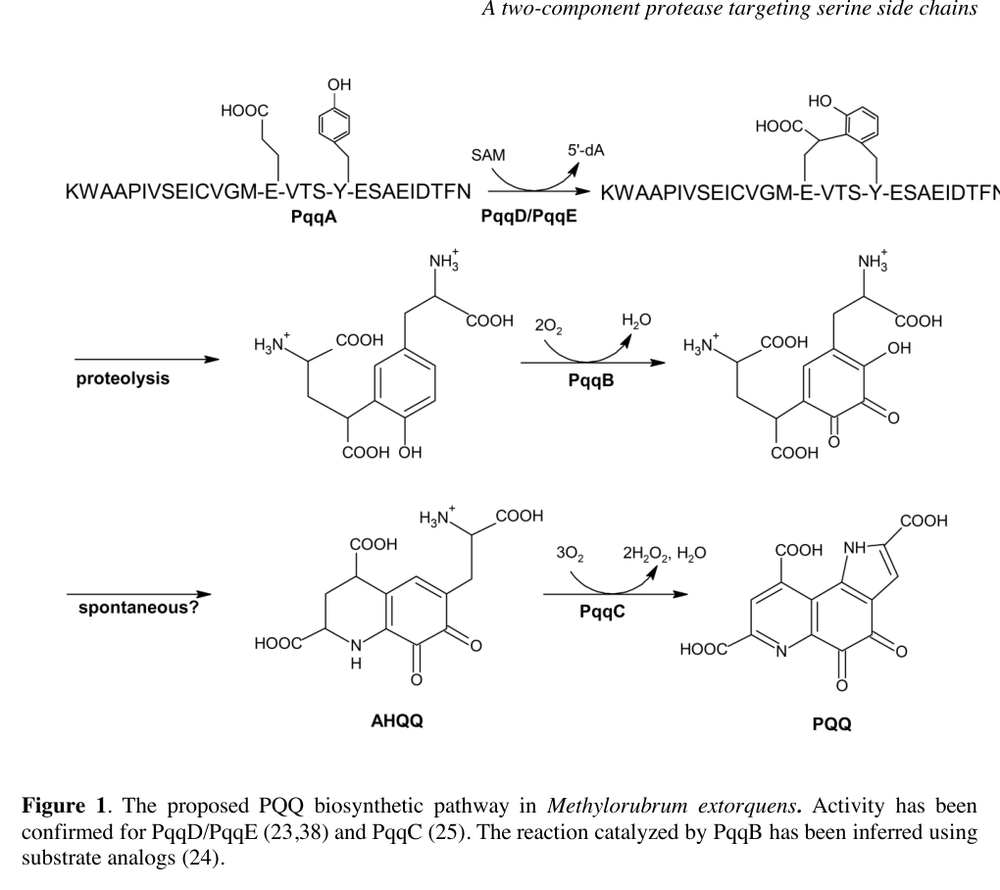

## Question

# Gene Research for Functional Annotation

## ⚠️ CRITICAL: Gene/Protein Identification Context

**BEFORE YOU BEGIN RESEARCH:** You MUST verify you are researching the CORRECT gene/protein. Gene symbols can be ambiguous, especially for less well-characterized genes from non-model organisms.

### Target Gene/Protein Identity (from UniProt):
- **UniProt Accession:** Q49148
- **Protein Description:** RecName: Full=Coenzyme PQQ synthesis protein A; AltName: Full=Coenzyme PQQ synthesis protein D; AltName: Full=Pyrroloquinoline quinone biosynthesis protein A;
- **Gene Information:** Name=pqqA; Synonyms=pqqD; OrderedLocusNames=MexAM1_META1p1751;
- **Organism (full):** Methylorubrum extorquens (strain ATCC 14718 / DSM 1338 / JCM 2805 / NCIMB 9133 / AM1) (Methylobacterium extorquens).
- **Protein Family:** Belongs to the PqqA family. .
- **Key Domains:** PQQ_synth_PqqA. (IPR011725); PqqA (PF08042)

### MANDATORY VERIFICATION STEPS:

1. **Check if the gene symbol "pqqA" matches the protein description above**
2. **Verify the organism is correct:** Methylorubrum extorquens (strain ATCC 14718 / DSM 1338 / JCM 2805 / NCIMB 9133 / AM1) (Methylobacterium extorquens).
3. **Check if protein family/domains align with what you find in literature**
4. **If you find literature for a DIFFERENT gene with the same or similar symbol, STOP**

### If Gene Symbol is Ambiguous or You Cannot Find Relevant Literature:

**DO NOT PROCEED WITH RESEARCH ON A DIFFERENT GENE.** Instead:
- State clearly: "The gene symbol 'pqqA' is ambiguous or literature is limited for this specific protein"
- Explain what you found (e.g., "Found extensive literature on a different gene with the same symbol in a different organism")
- Describe the protein based ONLY on the UniProt information provided above
- Suggest that the protein function can be inferred from domain/family information

### Research Target:

Please provide a comprehensive research report on the gene **pqqA** (gene ID: pqqA, UniProt: Q49148) in METEA.

The research report should be a detailed narrative explaining the function, biological processes, and localization of the gene product. Citations should be given for all claims.

You should prioritize authoritative reviews and primary scientific literature when conducting research. You can supplement
this with annotations you find in gene/protein databases, but these can be outdated or inaccurate.

We are specifically interested in the primary function of the gene - for enzymes, what reaction is catalyzed, and what is the substrate specificity? For transporters, what is the substrate? For structural proteins or adapters, what is the broader structural role? For signaling molecules, what is the role in the pathway.

We are interested in where in or outside the cell the gene product carries out its function.

We are also interested in the signaling or biochemical pathways in which the gene functions. We are less interested in broad pleiotropic effects, except where these elucidate the precise role.

Include evidence where possible. We are interested in both experimental evidence as well as inference from structure, evolution, or bioinformatic analysis. Precise studies should be prioritized over high-throughput, where available.

## Output

Question: You are an expert researcher providing comprehensive, well-cited information.

Provide detailed information focusing on:
1. Key concepts and definitions with current understanding
2. Recent developments and latest research (prioritize 2023-2024 sources)
3. Current applications and real-world implementations
4. Expert opinions and analysis from authoritative sources
5. Relevant statistics and data from recent studies

Format as a comprehensive research report with proper citations. Include URLs and publication dates where available.
Always prioritize recent, authoritative sources and provide specific citations for all major claims.

# Gene Research for Functional Annotation

## ⚠️ CRITICAL: Gene/Protein Identification Context

**BEFORE YOU BEGIN RESEARCH:** You MUST verify you are researching the CORRECT gene/protein. Gene symbols can be ambiguous, especially for less well-characterized genes from non-model organisms.

### Target Gene/Protein Identity (from UniProt):
- **UniProt Accession:** Q49148
- **Protein Description:** RecName: Full=Coenzyme PQQ synthesis protein A; AltName: Full=Coenzyme PQQ synthesis protein D; AltName: Full=Pyrroloquinoline quinone biosynthesis protein A;
- **Gene Information:** Name=pqqA; Synonyms=pqqD; OrderedLocusNames=MexAM1_META1p1751;
- **Organism (full):** Methylorubrum extorquens (strain ATCC 14718 / DSM 1338 / JCM 2805 / NCIMB 9133 / AM1) (Methylobacterium extorquens).
- **Protein Family:** Belongs to the PqqA family. .
- **Key Domains:** PQQ_synth_PqqA. (IPR011725); PqqA (PF08042)

### MANDATORY VERIFICATION STEPS:

1. **Check if the gene symbol "pqqA" matches the protein description above**
2. **Verify the organism is correct:** Methylorubrum extorquens (strain ATCC 14718 / DSM 1338 / JCM 2805 / NCIMB 9133 / AM1) (Methylobacterium extorquens).
3. **Check if protein family/domains align with what you find in literature**
4. **If you find literature for a DIFFERENT gene with the same or similar symbol, STOP**

### If Gene Symbol is Ambiguous or You Cannot Find Relevant Literature:

**DO NOT PROCEED WITH RESEARCH ON A DIFFERENT GENE.** Instead:
- State clearly: "The gene symbol 'pqqA' is ambiguous or literature is limited for this specific protein"
- Explain what you found (e.g., "Found extensive literature on a different gene with the same symbol in a different organism")
- Describe the protein based ONLY on the UniProt information provided above
- Suggest that the protein function can be inferred from domain/family information

### Research Target:

Please provide a comprehensive research report on the gene **pqqA** (gene ID: pqqA, UniProt: Q49148) in METEA.

The research report should be a detailed narrative explaining the function, biological processes, and localization of the gene product. Citations should be given for all claims.

You should prioritize authoritative reviews and primary scientific literature when conducting research. You can supplement
this with annotations you find in gene/protein databases, but these can be outdated or inaccurate.

We are specifically interested in the primary function of the gene - for enzymes, what reaction is catalyzed, and what is the substrate specificity? For transporters, what is the substrate? For structural proteins or adapters, what is the broader structural role? For signaling molecules, what is the role in the pathway.

We are interested in where in or outside the cell the gene product carries out its function.

We are also interested in the signaling or biochemical pathways in which the gene functions. We are less interested in broad pleiotropic effects, except where these elucidate the precise role.

Include evidence where possible. We are interested in both experimental evidence as well as inference from structure, evolution, or bioinformatic analysis. Precise studies should be prioritized over high-throughput, where available.

## Research report: functional annotation of **pqqA** (UniProt **Q49148**) in *Methylorubrum extorquens* AM1

### Executive summary (identity verification)
UniProt Q49148 is annotated in *Methylorubrum extorquens* strain AM1 (syn. *Methylobacterium extorquens* AM1) as **Coenzyme PQQ synthesis protein A**, with synonyms **pqqA / pqqD**. A critical AM1-specific nomenclature mismatch exists in the literature: in older AM1 annotations, the locus called **pqqD** corresponds to the **precursor peptide gene later called pqqA**, while **PqqD** in modern mechanistic literature refers to a distinct **peptide chaperone** that binds the precursor peptide and interacts with the radical-SAM enzyme PqqE. Therefore, Q49148 should be interpreted functionally as the **PQQ precursor peptide PqqA**, not the PqqD chaperone protein. (zhu2020biogenesisofthe pages 9-10, zhu2020biogenesisofthe pages 8-9)

| Topic | Key points | Evidence (with citation IDs) | Publication date & URL |
|---|---|---|---|
| Identity verification | **Target verified as UniProt Q49148 from *Methylorubrum extorquens* AM1** (syn. *Methylobacterium extorquens* AM1), ordered locus **MexAM1_META1p1751**. Critical caveat: AM1 literature contains a **historical naming swap** in which an older **pqqD** assignment corresponds to what later literature calls **pqqA**; thus Q49148 should be interpreted as the **precursor-peptide locus**, not the standalone PqqD chaperone characterized in many mechanistic studies. | Historical nomenclature mismatch and AM1-specific mapping of old pqqD to later pqqA are explicitly noted in reviews and AM1 pathway papers (zhu2020biogenesisofthe pages 9-10, zhu2020biogenesisofthe pages 8-9, martins2019atwocomponentprotease pages 2-3). | 2019-10-11, https://doi.org/10.1074/jbc.ra119.009684; 2020-12, https://doi.org/10.1016/j.cbpa.2020.05.001 |
| Protein type | The gene product corresponding to this AM1 locus is best understood as a **small ribosomally synthesized precursor peptide (RiPP precursor)** for PQQ biosynthesis, not an enzyme. Reported size in the literature is **~22-24 aa**, containing the conserved **Glu** and **Tyr** residues that furnish atoms to the PQQ core. | PqqA described as a short peptide precursor essential for PQQ formation, with conserved Glu/Tyr and mutagenesis support (zhu2020biogenesisofthe pages 3-5, zhu2020biogenesisofthe pages 8-9, martins2019atwocomponentprotease pages 2-3, bhanja2021studyofpyrroloquinoline pages 2-3). | 2019-10-11, https://doi.org/10.1074/jbc.ra119.009684; 2020-12, https://doi.org/10.1016/j.cbpa.2020.05.001; 2021-06, https://doi.org/10.3389/fagro.2021.667339 |
| Pathway step | **Primary function:** substrate peptide for the first committed PQQ-biosynthetic transformation. In the cytosol, the **PqqD/PqqE system** acts on PqqA to install a **de novo C-C bond between Glu and Tyr** (cross-linked **PqqA\*** intermediate), after which proteolysis and downstream PqqB/PqqC chemistry complete PQQ formation. The peptide itself does **not catalyze a reaction**; it is the biosynthetic substrate. | Reviews and AM1 experimental work support PqqA as the precursor and PqqD/PqqE as the machinery for Glu-Tyr cross-linking; pathway schematic confirms this placement (zhu2020biogenesisofthe pages 3-5, martins2019atwocomponentprotease pages 2-3, martins2019atwocomponentprotease pages 10-11, yao2026radicalenzymaticpeptide pages 6-7, martins2019atwocomponentprotease media 2712d995). | 2019-10-11, https://doi.org/10.1074/jbc.ra119.009684; 2020-12, https://doi.org/10.1016/j.cbpa.2020.05.001; 2026-02, https://doi.org/10.1039/d5cs00585j |
| Key interactions | **PqqA-PqqD:** high-affinity, specific binding; **PqqD-PqqE:** direct interaction documented by multiple biophysical methods. PqqD functions as a **peptide chaperone/RRE-like factor**, presenting PqqA to radical SAM enzyme PqqE. Thus, for Q49148, the biologically relevant interaction network is **precursor peptide \u2192 chaperone (PqqD) \u2192 maturase (PqqE)**. | Tight PqqD-PqqA complex and mapped PqqD-PqqE contacts shown by native MS/SPR/ITC/NMR/EPR/HDX-type evidence summarized in review literature; AM1 studies support the same pathway logic (zhu2020biogenesisofthe pages 3-5, zhu2020biogenesisofthe pages 9-10, martins2019atwocomponentprotease pages 10-11, yao2026radicalenzymaticpeptide pages 6-7). | 2020-12, https://doi.org/10.1016/j.cbpa.2020.05.001; 2026-02, https://doi.org/10.1039/d5cs00585j |
| Localization | **Biosynthesis stage:** expected **cytosolic** localization, because PqqA, PqqD, PqqE, and early tailoring/proteolysis steps operate on the intracellular peptide precursor. **Physiological end use:** mature **PQQ** then serves as a redox cofactor for **periplasmic methanol dehydrogenases** such as MxaFI/XoxF in methylotroph physiology. | Cytosolic pathway logic for precursor processing and direct linkage of PQQ to methanol dehydrogenase in methylotrophs are supported in pathway reviews and AM1/methylotroph literature (martins2019atwocomponentprotease pages 2-3, zhu2020biogenesisofthe pages 8-9). | 2019-10-11, https://doi.org/10.1074/jbc.ra119.009684; 2020-12, https://doi.org/10.1016/j.cbpa.2020.05.001 |
| Engineering / application links | **Functional significance:** PQQ biosynthesis underpins **PQQ-dependent alcohol/methanol dehydrogenases**, including **lanthanide-linked methylotrophic systems**. In AM1, PQQ is connected to methanol oxidation and rare-earth-dependent metabolism; AM1 has also been developed for **REE bioleaching/recovery**. More broadly, engineered PQQ production has reached industrially relevant levels in methylotrophs: **1.52 g/L PQQ**, **40.3 mg/g DCW**, after **144 h** in a **5-L fed-batch** *Hyphomicrobium denitrificans* process; heterologous systems cited in the same study yielded **2 mg/L in *E. coli***, **0.56-0.78 mg/L in engineered *Klebsiella pneumoniae***, **~51.3 mg/L in *Gluconobacter***, and a cell-free system converted **~2.5 mg/mL PqqA** to PQQ at **70-80% conversion**. | Quantitative production statistics from recent engineering study; AM1 application to REE leaching/recovery and link between PQQ and methylotrophic/lanthanide systems from recent environmental biotechnology work; PQQ-MDH link from foundational review (ren2023adaptiveevolutionarystrategy pages 1-2, zhu2020biogenesisofthe pages 8-9). | 2023-01-24, https://doi.org/10.1186/s13068-023-02261-y; 2023-12-19, https://doi.org/10.1021/acs.est.3c06775; 2020-12, https://doi.org/10.1016/j.cbpa.2020.05.001 |

*Table: This table summarizes the identity, biochemical role, naming ambiguity, interaction partners, localization, and application relevance of UniProt Q49148 in *Methylorubrum extorquens* AM1. It is designed to help distinguish the AM1 precursor-peptide locus from the separate PqqD chaperone discussed in broader PQQ literature.*

### 1) Key concepts and definitions (current understanding)

#### Pyrroloquinoline quinone (PQQ)
PQQ is a peptide-derived redox cofactor used by bacterial quinoprotein dehydrogenases, including methanol dehydrogenases central to methylotrophy. The modern view is that PQQ is produced via a ribosomally synthesized and post-translationally modified peptide (RiPP-like) logic: a short peptide precursor is enzymatically crosslinked and then processed into the small-molecule cofactor. (zhu2020biogenesisofthe pages 8-9, zhu2020biogenesisofthe pages 5-7)

#### What “PqqA” means in this context
For AM1 and most characterized systems, **PqqA** is the **ribosomally synthesized precursor peptide** (on the order of ~22–24 amino acids) that contains conserved **Glu** and **Tyr** residues that become linked early in the pathway and contribute atoms to the final PQQ scaffold. Site-directed mutagenesis shows that one glutamate and one tyrosine in PqqA are essential for PQQ formation. (zhu2020biogenesisofthe pages 8-9, martins2019atwocomponentprotease pages 2-3)

#### Distinguishing PqqA (precursor peptide) from PqqD (chaperone)
Mechanistic and biophysical studies summarized in authoritative reviews indicate that:
- **PqqE** is a radical S-adenosylmethionine (SAM) enzyme that catalyzes the key **de novo C–C cross-link** formation between the conserved Glu and Tyr side chains within the **PqqA** peptide.
- **PqqD** (in modern usage) is a **small, cofactor-less peptide chaperone** that binds PqqA and enables the PqqE-catalyzed crosslinking reaction by proper substrate presentation/positioning.
This PqqD chaperone role is supported by multiple complementary interaction measurements (e.g., tight PqqD–PqqA binding and mapped contacts to PqqE) summarized in the 2020 review. (zhu2020biogenesisofthe pages 3-5, zhu2020biogenesisofthe pages 9-10)

### 2) Molecular function and pathway role of AM1 **pqqA / Q49148**

#### Primary biological function
The Q49148 gene product functions as the **PQQ biosynthetic precursor peptide** (substrate), not as a catalytic enzyme. It is transformed into a crosslinked peptide intermediate (often denoted PqqA*) by the PqqD/PqqE system and then further processed into PQQ by downstream enzymes. (martins2019atwocomponentprotease pages 2-3, martins2019atwocomponentprotease pages 10-11)

#### Step-by-step pathway placement
A pathway-level schematic from *Methylorubrum extorquens* indicates the early step explicitly: the **PqqD/PqqE complex** catalyzes crosslinking within **PqqA** to form **PqqA***, which then proceeds through proteolysis and downstream tailoring steps (PqqB, PqqC) to yield PQQ. (martins2019atwocomponentprotease media 2712d995)

At the mechanistic level, the 2020 review describes how PqqE uses radical-SAM chemistry to initiate a sequence culminating in the Glu–Tyr cross-link within PqqA, with PqqD acting as the peptide chaperone guiding the reactive side chains. (zhu2020biogenesisofthe pages 5-7)

#### Interactions and complex formation
The current model is a three-component functional module:
- **PqqA (precursor peptide; Q49148)** binds the chaperone **PqqD**.
- **PqqD** interacts with **PqqE**.
- The **PqqD–PqqE** system supports PqqE-catalyzed crosslinking on **PqqA**.
This interaction topology and chaperone concept are specifically described for AM1-associated work and generalized across bacteria in authoritative reviews. (zhu2020biogenesisofthe pages 3-5, zhu2020biogenesisofthe pages 9-10, martins2019atwocomponentprotease pages 10-11)

#### Downstream processing (context for functional annotation)
Although not encoded by Q49148, downstream steps provide context for what PqqA is “for.” After crosslinking, proteolytic processing releases a smaller Glu–Tyr-containing intermediate and then:
- **PqqB** performs oxygen-dependent chemistry consistent with an iron-dependent nonheme hydroxylase; and
- **PqqC** completes later oxidative steps.
The pathway requires multiple enzymes and defined cofactor/oxidant inputs (e.g., SAM and O2 equivalents), emphasizing that PqqA is a biosynthetic substrate in a multi-enzyme maturation pathway. (zhu2020biogenesisofthe pages 5-7)

### 3) Cellular localization and physiological context

#### Where the gene product acts
Because PqqA is a ribosomally produced peptide substrate that is modified by cytosolic enzymes (PqqE, PqqD and associated processing steps), the **biosynthetic function of PqqA is intracellular** (cytosolic side of the pathway). (martins2019atwocomponentprotease pages 2-3, zhu2020biogenesisofthe pages 5-7)

#### Where the pathway product is used
PQQ is used by PQQ-dependent dehydrogenases in methylotroph physiology; in *M. extorquens* AM1 and related methylotrophs these dehydrogenases are classically **periplasmic** (e.g., methanol dehydrogenases), so PQQ biosynthesis supplies a cofactor that supports periplasm-facing oxidation chemistry. (zhu2020biogenesisofthe pages 8-9)

### 4) Recent developments (prioritizing 2023–2024) and latest research

#### 4.1 PQQ and rare-earth element (REE/lanthanide) linked methylotrophy and bioresource recovery (real-world implementation)
A 2023 **Environmental Science & Technology** study developed *Methylobacterium (Methylorubrum) extorquens* AM1 as a scalable platform for **non-acidic REE leaching and recovery from waste sources** and explicitly notes that REE-specific bioleaching can be engineered through overproduction of **lanthanophore ligands and PQQ**. (2023-12-19, https://doi.org/10.1021/acs.est.3c06775) (good2023scalableandconsolidated pages 1-2)

Key quantitative results from this study (selected):
- Demonstrated scale-up to **10 L** with consistent metal yields (good2023scalableandconsolidated pages 1-2), and operation in a **0.75 L bioreactor** under defined conditions (including 1% magnet swarf and methanol as carbon source). (good2023scalableandconsolidated pages 2-3)
- Reported engineering outcomes that increased REE handling substantially, including deletion of **exopolyphosphatase (ppx)** yielding ~**5.5-fold** higher Nd accumulation reaching **202 mg Nd/g dry weight**, and lanthanophore biosynthesis engineering reaching **80 mg Nd/g dry weight** (plus associated Pr and Dy values). (good2023scalableandconsolidated pages 6-7)
- Reported process-level recovery estimates of **1.3–2.1 g Nd/L** (corresponding to **65–100% recovery**) at 1% Nd swarf pulp density, and that **PQQ overproduction** increased Nd bioaccumulation by **53%** in the stated genetic background comparison. (good2023scalableandconsolidated pages 6-7)

These results position pqqA (as the precursor peptide for PQQ supply) as indirectly relevant to REE-enabled methylotrophic metabolism and engineered bioresource recovery, because PQQ availability can be a tunable determinant of downstream PQQ-dependent enzyme functionality in AM1-derived platforms. (good2023scalableandconsolidated pages 6-7, good2023scalableandconsolidated pages 1-2)

#### 4.2 Industrial and engineered PQQ production (statistics; 2023)
A 2023 bioprocessing study focused on improving microbial PQQ production reports that methylotrophic bacteria are prominent PQQ producers and compiles quantitative outcomes across hosts and strategies. (2023-01-24, https://doi.org/10.1186/s13068-023-02261-y) (ren2023adaptiveevolutionarystrategy pages 1-2)

Representative quantitative statistics highlighted in that paper include:
- Heterologous production: ~**2 mg/L** in engineered *E. coli*; **0.56–0.78 mg/L** in engineered *Klebsiella pneumoniae*; ~**51.3 mg/L** in *Gluconobacter* after optimization. (ren2023adaptiveevolutionarystrategy pages 1-2)
- A reported **cell-free** conversion of ~**2.5 mg/mL** PqqA to PQQ with **70–80% conversion**, directly emphasizing PqqA’s precursor role as a substrate that can be transformed into PQQ in vitro. (ren2023adaptiveevolutionarystrategy pages 1-2)
- A high-titer methylotroph process: **1.52 g/L PQQ** with yield **40.3 mg/g DCW** after **144 h** in a **5-L fed-batch** fermentation (in *Hyphomicrobium denitrificans*). (ren2023adaptiveevolutionarystrategy pages 1-2)

Although these production studies are not specific to Q49148, they provide quantitative, recent context for the broader importance of the PqqA precursor peptide as a controllable input to PQQ supply chains in biotechnology. (ren2023adaptiveevolutionarystrategy pages 1-2)

### 5) Expert opinions and authoritative synthesis
Authoritative mechanistic syntheses (notably the 2020 Current Opinion in Chemical Biology review) characterize PQQ biogenesis as a model system for peptide-derived redox cofactor biosynthesis and emphasize: (i) PqqA as a short peptide precursor; (ii) PqqD as a chaperone/RRE-like interaction module; and (iii) PqqE as the radical-SAM catalyst of Glu–Tyr crosslinking, followed by proteolysis and oxygen-dependent tailoring steps. This review also highlights that gene fusion events and naming differences can complicate annotation, directly relevant to AM1/Q49148. (2020-12, https://doi.org/10.1016/j.cbpa.2020.05.001) (zhu2020biogenesisofthe pages 9-10, zhu2020biogenesisofthe pages 5-7)

### 6) Practical functional annotation for Q49148 (recommended database-style statements)

- **Gene product type:** ribosomally synthesized **precursor peptide** for PQQ biosynthesis (RiPP-like precursor). (zhu2020biogenesisofthe pages 8-9, martins2019atwocomponentprotease pages 2-3)
- **Molecular function:** substrate peptide that undergoes **PqqD/PqqE-dependent** intrapeptide **Glu–Tyr C–C crosslinking** as the first committed step of PQQ formation. (martins2019atwocomponentprotease pages 10-11, martins2019atwocomponentprotease media 2712d995, zhu2020biogenesisofthe pages 5-7)
- **Key pathway membership:** PQQ cofactor biogenesis; supplies PQQ used by PQQ-dependent dehydrogenases (e.g., methanol dehydrogenase systems in methylotroph metabolism). (zhu2020biogenesisofthe pages 8-9)
- **Subcellular location (for its direct action):** intracellular/cytosolic (site of peptide modification), with PQQ deployed to support periplasm-associated dehydrogenases. (zhu2020biogenesisofthe pages 8-9, zhu2020biogenesisofthe pages 5-7)
- **Critical caution note:** AM1 literature contains an **older pqqD ↔ newer pqqA** naming swap; Q49148 synonymy can reflect this historical ambiguity and should not be conflated with the modern “PqqD chaperone” protein. (zhu2020biogenesisofthe pages 9-10, zhu2020biogenesisofthe pages 8-9)

### Figure-based evidence
The AM1 PQQ pathway schematic explicitly places **PqqA** upstream of PqqB/PqqC and shows **PqqD/PqqE** acting on PqqA to produce a crosslinked intermediate (PqqA*), providing visual confirmation of the precursor-peptide role of pqqA. (martins2019atwocomponentprotease media 2712d995)

---

### References (URLs and publication dates)
- Martins AM et al. *J Biol Chem* (2019-10-11). “A two-component protease in *Methylorubrum extorquens* with high activity toward the peptide precursor of the redox cofactor pyrroloquinoline quinone.” https://doi.org/10.1074/jbc.ra119.009684 (martins2019atwocomponentprotease pages 2-3, martins2019atwocomponentprotease pages 10-11, martins2019atwocomponentprotease media 2712d995)
- Zhu W, Klinman JP. *Curr Opin Chem Biol* (2020-12). “Biogenesis of the peptide-derived redox cofactor pyrroloquinoline quinone.” https://doi.org/10.1016/j.cbpa.2020.05.001 (zhu2020biogenesisofthe pages 3-5, zhu2020biogenesisofthe pages 9-10, zhu2020biogenesisofthe pages 8-9, zhu2020biogenesisofthe pages 5-7)
- Ren Y et al. *Biotechnology for Biofuels and Bioproducts* (2023-01-24). “Adaptive evolutionary strategy coupled with an optimized biosynthesis process for the efficient production of pyrroloquinoline quinone from methanol.” https://doi.org/10.1186/s13068-023-02261-y (ren2023adaptiveevolutionarystrategy pages 1-2)
- Good NM et al. *Environmental Science & Technology* (2023-12-19). “Scalable and consolidated microbial platform for rare earth element leaching and recovery from waste sources.” https://doi.org/10.1021/acs.est.3c06775 (good2023scalableandconsolidated pages 6-7, good2023scalableandconsolidated pages 2-3, good2023scalableandconsolidated pages 1-2)

References

1. (zhu2020biogenesisofthe pages 9-10): Wen Zhu and Judith P. Klinman. Biogenesis of the peptide-derived redox cofactor pyrroloquinoline quinone. Dec 2020. URL: https://doi.org/10.1016/j.cbpa.2020.05.001, doi:10.1016/j.cbpa.2020.05.001. This article has 66 citations and is from a peer-reviewed journal.

2. (zhu2020biogenesisofthe pages 8-9): Wen Zhu and Judith P. Klinman. Biogenesis of the peptide-derived redox cofactor pyrroloquinoline quinone. Dec 2020. URL: https://doi.org/10.1016/j.cbpa.2020.05.001, doi:10.1016/j.cbpa.2020.05.001. This article has 66 citations and is from a peer-reviewed journal.

3. (martins2019atwocomponentprotease pages 2-3): Ana M. Martins, John A. Latham, Paulo J. Martel, Ian Barr, Anthony T. Iavarone, and Judith P. Klinman. A two-component protease in methylorubrum extorquens with high activity toward the peptide precursor of the redox cofactor pyrroloquinoline quinone. Journal of Biological Chemistry, 294:15025-15036, Oct 2019. URL: https://doi.org/10.1074/jbc.ra119.009684, doi:10.1074/jbc.ra119.009684. This article has 38 citations and is from a domain leading peer-reviewed journal.

4. (zhu2020biogenesisofthe pages 3-5): Wen Zhu and Judith P. Klinman. Biogenesis of the peptide-derived redox cofactor pyrroloquinoline quinone. Dec 2020. URL: https://doi.org/10.1016/j.cbpa.2020.05.001, doi:10.1016/j.cbpa.2020.05.001. This article has 66 citations and is from a peer-reviewed journal.

5. (bhanja2021studyofpyrroloquinoline pages 2-3): Eeshita Bhanja, Renuka Das, Yasmin Begum, and Sunil Kanti Mondal. Study of pyrroloquinoline quinine from phosphate-solubilizing microbes responsible for plant growth: in silico approach. Frontiers in Agronomy, Jun 2021. URL: https://doi.org/10.3389/fagro.2021.667339, doi:10.3389/fagro.2021.667339. This article has 27 citations.

6. (martins2019atwocomponentprotease pages 10-11): Ana M. Martins, John A. Latham, Paulo J. Martel, Ian Barr, Anthony T. Iavarone, and Judith P. Klinman. A two-component protease in methylorubrum extorquens with high activity toward the peptide precursor of the redox cofactor pyrroloquinoline quinone. Journal of Biological Chemistry, 294:15025-15036, Oct 2019. URL: https://doi.org/10.1074/jbc.ra119.009684, doi:10.1074/jbc.ra119.009684. This article has 38 citations and is from a domain leading peer-reviewed journal.

7. (yao2026radicalenzymaticpeptide pages 6-7): Ziwei Yao and Brandon I. Morinaka. Radical enzymatic peptide cyclization in natural product biosynthesis. Chemical Society reviews, Feb 2026. URL: https://doi.org/10.1039/d5cs00585j, doi:10.1039/d5cs00585j. This article has 3 citations and is from a highest quality peer-reviewed journal.

8. (martins2019atwocomponentprotease media 2712d995): Ana M. Martins, John A. Latham, Paulo J. Martel, Ian Barr, Anthony T. Iavarone, and Judith P. Klinman. A two-component protease in methylorubrum extorquens with high activity toward the peptide precursor of the redox cofactor pyrroloquinoline quinone. Journal of Biological Chemistry, 294:15025-15036, Oct 2019. URL: https://doi.org/10.1074/jbc.ra119.009684, doi:10.1074/jbc.ra119.009684. This article has 38 citations and is from a domain leading peer-reviewed journal.

9. (ren2023adaptiveevolutionarystrategy pages 1-2): Yang Ren, Xinwei Yang, Lingtao Ding, Dongfang Liu, Yong Tao, Jianzhong Huang, and Chongrong Ke. Adaptive evolutionary strategy coupled with an optimized biosynthesis process for the efficient production of pyrroloquinoline quinone from methanol. Biotechnology for Biofuels and Bioproducts, Jan 2023. URL: https://doi.org/10.1186/s13068-023-02261-y, doi:10.1186/s13068-023-02261-y. This article has 12 citations and is from a domain leading peer-reviewed journal.

10. (zhu2020biogenesisofthe pages 5-7): Wen Zhu and Judith P. Klinman. Biogenesis of the peptide-derived redox cofactor pyrroloquinoline quinone. Dec 2020. URL: https://doi.org/10.1016/j.cbpa.2020.05.001, doi:10.1016/j.cbpa.2020.05.001. This article has 66 citations and is from a peer-reviewed journal.

11. (good2023scalableandconsolidated pages 1-2): Nathan M. Good, Christina S. Kang-Yun, Morgan Z. Su, Alexa M. Zytnick, Colin C. Barber, Huong N. Vu, Joseph M. Grace, Hoang H. Nguyen, Wenjun Zhang, Elizabeth Skovran, Maohong Fan, Dan M. Park, and Norma Cecilia Martinez-Gomez. Scalable and consolidated microbial platform for rare earth element leaching and recovery from waste sources. Environmental Science & Technology, 58:570-579, Dec 2023. URL: https://doi.org/10.1021/acs.est.3c06775, doi:10.1021/acs.est.3c06775. This article has 41 citations and is from a domain leading peer-reviewed journal.

12. (good2023scalableandconsolidated pages 2-3): Nathan M. Good, Christina S. Kang-Yun, Morgan Z. Su, Alexa M. Zytnick, Colin C. Barber, Huong N. Vu, Joseph M. Grace, Hoang H. Nguyen, Wenjun Zhang, Elizabeth Skovran, Maohong Fan, Dan M. Park, and Norma Cecilia Martinez-Gomez. Scalable and consolidated microbial platform for rare earth element leaching and recovery from waste sources. Environmental Science & Technology, 58:570-579, Dec 2023. URL: https://doi.org/10.1021/acs.est.3c06775, doi:10.1021/acs.est.3c06775. This article has 41 citations and is from a domain leading peer-reviewed journal.

13. (good2023scalableandconsolidated pages 6-7): Nathan M. Good, Christina S. Kang-Yun, Morgan Z. Su, Alexa M. Zytnick, Colin C. Barber, Huong N. Vu, Joseph M. Grace, Hoang H. Nguyen, Wenjun Zhang, Elizabeth Skovran, Maohong Fan, Dan M. Park, and Norma Cecilia Martinez-Gomez. Scalable and consolidated microbial platform for rare earth element leaching and recovery from waste sources. Environmental Science & Technology, 58:570-579, Dec 2023. URL: https://doi.org/10.1021/acs.est.3c06775, doi:10.1021/acs.est.3c06775. This article has 41 citations and is from a domain leading peer-reviewed journal.

## Artifacts

- [Edison artifact artifact-00](pqqA-deep-research-falcon_artifacts/artifact-00.md)

## Citations

1. zhu2020biogenesisofthe pages 5-7
2. zhu2020biogenesisofthe pages 8-9
3. good2023scalableandconsolidated pages 1-2
4. good2023scalableandconsolidated pages 2-3
5. good2023scalableandconsolidated pages 6-7
6. ren2023adaptiveevolutionarystrategy pages 1-2
7. zhu2020biogenesisofthe pages 9-10
8. martins2019atwocomponentprotease pages 2-3
9. zhu2020biogenesisofthe pages 3-5
10. bhanja2021studyofpyrroloquinoline pages 2-3
11. martins2019atwocomponentprotease pages 10-11
12. yao2026radicalenzymaticpeptide pages 6-7
13. https://doi.org/10.1074/jbc.ra119.009684;
14. https://doi.org/10.1016/j.cbpa.2020.05.001
15. https://doi.org/10.1016/j.cbpa.2020.05.001;
16. https://doi.org/10.3389/fagro.2021.667339
17. https://doi.org/10.1039/d5cs00585j
18. https://doi.org/10.1186/s13068-023-02261-y;
19. https://doi.org/10.1021/acs.est.3c06775;
20. https://doi.org/10.1021/acs.est.3c06775
21. https://doi.org/10.1186/s13068-023-02261-y
22. https://doi.org/10.1074/jbc.ra119.009684
23. https://doi.org/10.1016/j.cbpa.2020.05.001,
24. https://doi.org/10.1074/jbc.ra119.009684,
25. https://doi.org/10.3389/fagro.2021.667339,
26. https://doi.org/10.1039/d5cs00585j,
27. https://doi.org/10.1186/s13068-023-02261-y,
28. https://doi.org/10.1021/acs.est.3c06775,