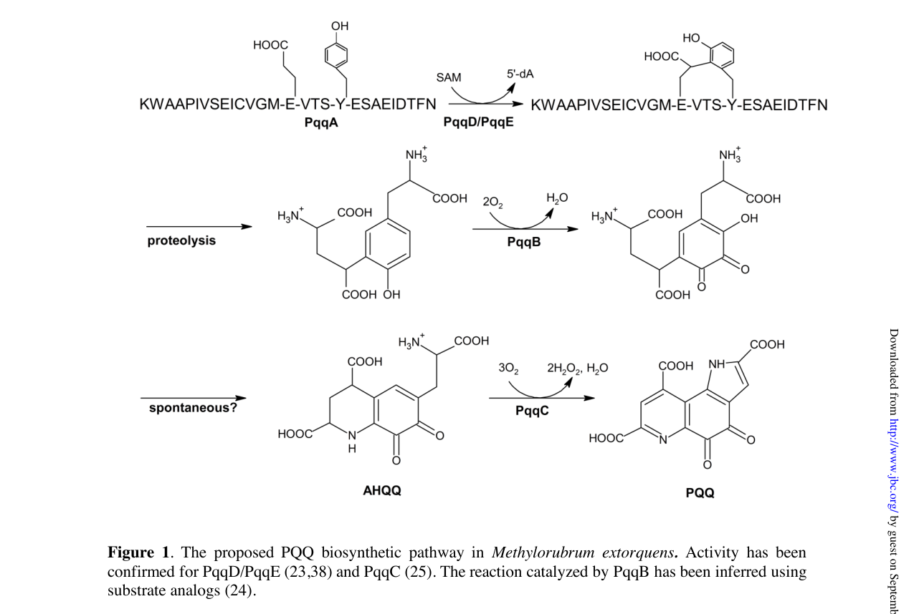

## Question

# Gene Research for Functional Annotation

## ⚠️ CRITICAL: Gene/Protein Identification Context

**BEFORE YOU BEGIN RESEARCH:** You MUST verify you are researching the CORRECT gene/protein. Gene symbols can be ambiguous, especially for less well-characterized genes from non-model organisms.

### Target Gene/Protein Identity (from UniProt):
- **UniProt Accession:** Q49148
- **Protein Description:** RecName: Full=Coenzyme PQQ synthesis protein A; AltName: Full=Coenzyme PQQ synthesis protein D; AltName: Full=Pyrroloquinoline quinone biosynthesis protein A;
- **Gene Information:** Name=pqqA; Synonyms=pqqD; OrderedLocusNames=MexAM1_META1p1751;
- **Organism (full):** Methylorubrum extorquens (strain ATCC 14718 / DSM 1338 / JCM 2805 / NCIMB 9133 / AM1) (Methylobacterium extorquens).
- **Protein Family:** Belongs to the PqqA family. .
- **Key Domains:** PQQ_synth_PqqA. (IPR011725); PqqA (PF08042)

### MANDATORY VERIFICATION STEPS:

1. **Check if the gene symbol "pqqA" matches the protein description above**
2. **Verify the organism is correct:** Methylorubrum extorquens (strain ATCC 14718 / DSM 1338 / JCM 2805 / NCIMB 9133 / AM1) (Methylobacterium extorquens).
3. **Check if protein family/domains align with what you find in literature**
4. **If you find literature for a DIFFERENT gene with the same or similar symbol, STOP**

### If Gene Symbol is Ambiguous or You Cannot Find Relevant Literature:

**DO NOT PROCEED WITH RESEARCH ON A DIFFERENT GENE.** Instead:
- State clearly: "The gene symbol 'pqqA' is ambiguous or literature is limited for this specific protein"
- Explain what you found (e.g., "Found extensive literature on a different gene with the same symbol in a different organism")
- Describe the protein based ONLY on the UniProt information provided above
- Suggest that the protein function can be inferred from domain/family information

### Research Target:

Please provide a comprehensive research report on the gene **pqqA** (gene ID: pqqD, UniProt: Q49148) in METEA.

The research report should be a detailed narrative explaining the function, biological processes, and localization of the gene product. Citations should be given for all claims.

You should prioritize authoritative reviews and primary scientific literature when conducting research. You can supplement
this with annotations you find in gene/protein databases, but these can be outdated or inaccurate.

We are specifically interested in the primary function of the gene - for enzymes, what reaction is catalyzed, and what is the substrate specificity? For transporters, what is the substrate? For structural proteins or adapters, what is the broader structural role? For signaling molecules, what is the role in the pathway.

We are interested in where in or outside the cell the gene product carries out its function.

We are also interested in the signaling or biochemical pathways in which the gene functions. We are less interested in broad pleiotropic effects, except where these elucidate the precise role.

Include evidence where possible. We are interested in both experimental evidence as well as inference from structure, evolution, or bioinformatic analysis. Precise studies should be prioritized over high-throughput, where available.

## Output

Question: You are an expert researcher providing comprehensive, well-cited information.

Provide detailed information focusing on:
1. Key concepts and definitions with current understanding
2. Recent developments and latest research (prioritize 2023-2024 sources)
3. Current applications and real-world implementations
4. Expert opinions and analysis from authoritative sources
5. Relevant statistics and data from recent studies

Format as a comprehensive research report with proper citations. Include URLs and publication dates where available.
Always prioritize recent, authoritative sources and provide specific citations for all major claims.

# Gene Research for Functional Annotation

## ⚠️ CRITICAL: Gene/Protein Identification Context

**BEFORE YOU BEGIN RESEARCH:** You MUST verify you are researching the CORRECT gene/protein. Gene symbols can be ambiguous, especially for less well-characterized genes from non-model organisms.

### Target Gene/Protein Identity (from UniProt):
- **UniProt Accession:** Q49148
- **Protein Description:** RecName: Full=Coenzyme PQQ synthesis protein A; AltName: Full=Coenzyme PQQ synthesis protein D; AltName: Full=Pyrroloquinoline quinone biosynthesis protein A;
- **Gene Information:** Name=pqqA; Synonyms=pqqD; OrderedLocusNames=MexAM1_META1p1751;
- **Organism (full):** Methylorubrum extorquens (strain ATCC 14718 / DSM 1338 / JCM 2805 / NCIMB 9133 / AM1) (Methylobacterium extorquens).
- **Protein Family:** Belongs to the PqqA family. .
- **Key Domains:** PQQ_synth_PqqA. (IPR011725); PqqA (PF08042)

### MANDATORY VERIFICATION STEPS:

1. **Check if the gene symbol "pqqA" matches the protein description above**
2. **Verify the organism is correct:** Methylorubrum extorquens (strain ATCC 14718 / DSM 1338 / JCM 2805 / NCIMB 9133 / AM1) (Methylobacterium extorquens).
3. **Check if protein family/domains align with what you find in literature**
4. **If you find literature for a DIFFERENT gene with the same or similar symbol, STOP**

### If Gene Symbol is Ambiguous or You Cannot Find Relevant Literature:

**DO NOT PROCEED WITH RESEARCH ON A DIFFERENT GENE.** Instead:
- State clearly: "The gene symbol 'pqqA' is ambiguous or literature is limited for this specific protein"
- Explain what you found (e.g., "Found extensive literature on a different gene with the same symbol in a different organism")
- Describe the protein based ONLY on the UniProt information provided above
- Suggest that the protein function can be inferred from domain/family information

### Research Target:

Please provide a comprehensive research report on the gene **pqqA** (gene ID: pqqD, UniProt: Q49148) in METEA.

The research report should be a detailed narrative explaining the function, biological processes, and localization of the gene product. Citations should be given for all claims.

You should prioritize authoritative reviews and primary scientific literature when conducting research. You can supplement
this with annotations you find in gene/protein databases, but these can be outdated or inaccurate.

We are specifically interested in the primary function of the gene - for enzymes, what reaction is catalyzed, and what is the substrate specificity? For transporters, what is the substrate? For structural proteins or adapters, what is the broader structural role? For signaling molecules, what is the role in the pathway.

We are interested in where in or outside the cell the gene product carries out its function.

We are also interested in the signaling or biochemical pathways in which the gene functions. We are less interested in broad pleiotropic effects, except where these elucidate the precise role.

Include evidence where possible. We are interested in both experimental evidence as well as inference from structure, evolution, or bioinformatic analysis. Precise studies should be prioritized over high-throughput, where available.

# Research report: Functional annotation of **pqqA** (UniProt **Q49148**) in *Methylorubrum extorquens* AM1

## Executive summary (identity verified)
The UniProt accession **Q49148** corresponds to **PqqA**, the **ribosomally synthesized precursor peptide** for pyrroloquinoline quinone (PQQ) biosynthesis in *Methylobacterium/Methylorubrum extorquens* AM1 (“MePqqA”), and **not** to the peptide chaperone PqqD. This mapping is explicit in Latham et al. (2015), who used “MePqqA (UniProt number Q49148)” as the peptide substrate in binding/complex-formation experiments with PqqD and PqqE. (latham2015pqqdisa pages 9-10, latham2015pqqdisa pages 2-3)

## 1) Key concepts and definitions (current understanding)

### Pyrroloquinoline quinone (PQQ)
PQQ is a small redox cofactor used by multiple bacterial dehydrogenases (quinoproteins), including methanol dehydrogenases (MDHs). Comparative analyses and pathway reviews describe PQQ biosynthesis as a genetically encoded pathway whose conserved core includes **pqqA–E**, with **pqqA** encoding the short precursor peptide substrate, and pqqD/E functioning early in pathway initiation. (shen2012distributionandproperties pages 1-2, zhu2020biogenesisofthe pages 3-5)

### PqqA (this target; UniProt Q49148)
**PqqA** is a **very short peptide** (typically **~20–30 aa**; often described as **22–24 aa**) that provides the conserved **glutamate (Glu)** and **tyrosine (Tyr)** residues that are chemically transformed into the PQQ core during biosynthesis. (shen2012distributionandproperties pages 1-2, zhu2020biogenesisofthe pages 8-9, latham2015pqqdisa pages 1-2)

A major practical point for functional annotation is that **pqqA is frequently missed by genome annotation pipelines** because it encodes such a short ORF; comparative analyses recovered additional pqqA genes by translated BLAST approaches rather than HMM-based annotation alone. (shen2012distributionandproperties pages 4-6, shen2012distributionandproperties pages 1-2)

### PqqD: peptide chaperone / RiPP recognition element-like function
PqqD is a small, cofactorless protein (often ~90 aa; ~10 kDa) that functions as a **peptide chaperone**, binding PqqA and enabling productive interaction with PqqE. (latham2015pqqdisa pages 2-3, latham2015pqqdisa pages 1-2)

### PqqE: radical SAM (RS-SPASM) enzyme catalyzing the first committed step
PqqE is an RS-SPASM radical SAM enzyme proposed (and supported by multiple lines of evidence) to catalyze the **initial C–C bond formation (crosslink)** between conserved residues (Glu and Tyr) within PqqA, with PqqD required for efficient substrate engagement. (latham2015pqqdisa pages 1-2, martins2019atwocomponentprotease pages 2-3)

### Proteolytic processing: PqqF/PqqG (in *Methylorubrum extorquens* AM1)
After the early PqqD/PqqE step, proteolysis is required to excise/trim the modified peptide to yield a small crosslinked intermediate that feeds into downstream enzymology. In *M. extorquens* AM1, the required proteolytic activity is attributed to a **two-component protease** composed of **PqqF and PqqG**. (zhu2020biogenesisofthe pages 3-5, martins2019atwocomponentprotease pages 2-3)

## 2) Mechanistic function of PqqA (Q49148) and pathway placement

### 2.1 PqqA peptide sequence used for *M. extorquens* AM1 studies
Latham et al. (JBC, 2015-05; https://doi.org/10.1074/jbc.m115.646521) used a synthetic MePqqA peptide corresponding to **UniProt Q49148**, with sequence:

- **KWAAPIVSEISVGMEVTYSESAEIDTFN**

They substituted **Ser11 for the native Cys** to prevent peptide dimerization during experiments. (latham2015pqqdisa pages 2-3)

### 2.2 PqqD–PqqA binding and ternary complex formation with PqqE (primary biochemical evidence)
In *M. extorquens* AM1 components, PqqD binds PqqA and forms a ternary complex with PqqE:

- **PqqD is ~10.4 kDa monomeric** in solution by native MS; **PqqE** observed as ~43.6 kDa monomer and ~86.9 kDa dimer. (latham2015pqqdisa pages 8-9)
- **MePqqD binds MePqqA with submicromolar affinity** (SPR/ITC; KD values reported ~0.13–0.39 µM across constructs/assays). (latham2015pqqdisa pages 8-9, latham2015pqqdisa pages 5-7)
- **MePqqD–MePqqE binding is weaker** (SPR/ITC; KD ~10–12.5 µM), consistent with a transient interaction. (latham2015pqqdisa pages 9-10, latham2015pqqdisa pages 5-7)
- **Native MS directly observed** a **1:1 MePqqD–MePqqE complex** and a **1:1:1 MePqqA–MePqqD–MePqqE ternary complex**. (latham2015pqqdisa pages 8-9, latham2015pqqdisa pages 5-7)

This establishes (i) Q49148 is the PqqA substrate, and (ii) PqqD is the primary PqqA-binding partner that organizes PqqA presentation to PqqE. (latham2015pqqdisa pages 9-10, latham2015pqqdisa pages 2-3)

### 2.3 Proteolysis of PqqA in *M. extorquens* AM1 by PqqF/PqqG (specificity and kinetics)
Martins et al. (JBC, 2019-10; https://doi.org/10.1074/jbc.ra119.009684) characterized a **PqqF/PqqG heterodimer** in *M. extorquens* that rapidly cleaves PqqA-derived substrates:

- PqqF (460 aa) and PqqG (427 aa) form a **1:1 complex** with **KD ≈ 300 ± 70 nM**. (martins2019atwocomponentprotease pages 2-3)
- The protease showed unusual **cleavage preference at serine residues**, and the authors propose it initiates cleavage near the crosslinked region, with additional trimming by other proteases. (martins2019atwocomponentprotease pages 2-3, zhu2020biogenesisofthe pages 3-5)

### 2.4 Gene organization and nomenclature pitfalls (critical for correct annotation)

**Across bacteria:** gene order **pqqA-B-C-D-E** is strongly conserved when present, and pqqF is more variably linked/dispensable, supporting the idea that pqqA–E form a functional module while proteolysis can be substituted in different lineages. (shen2012distributionandproperties pages 4-6, shen2012distributionandproperties pages 6-7)

**In *M. extorquens* AM1:** multiple analyses indicate non-canonical organization:
- A pqqC/pqqD **fusion** occurs in Methylobacterium species (including *M. extorquens*). (shen2012distributionandproperties pages 4-6, latham2015pqqdisa pages 9-10)
- Genomic organization in AM1 is modular: core PQQ genes are located within the methylotrophy island, while **pqqFG are elsewhere**, not linked to the core cluster. (chistoserdova2003methylotrophyinmethylobacterium pages 5-6)
- Martins et al. map a local gene region containing **pqqE, pqqC/D, pqqB, pqqA, pqqF, pqqG** and additional **pqqA-like copies**; their figure annotates “A denotes pqqA, the gene encoding the peptide precursor.” (martins2019atwocomponentprotease pages 14-16, martins2019atwocomponentprotease media 8b646b12, martins2019atwocomponentprotease media 9de03454)
- Zhu & Klinman (2020) note that **early AM1 publications used different gene names** (early pqqD/pqqG/pqqC corresponding to later pqqA/pqqB/pqqC), which can cause mis-annotation if older literature is read uncritically. (zhu2020biogenesisofthe pages 8-9)

## 3) Biological processes, pathway context, and localization

### Biological process
The primary biological process is **PQQ cofactor biosynthesis**, ultimately enabling activity of **PQQ-dependent dehydrogenases** (including methanol dehydrogenases) central to methylotrophic growth. (shen2012distributionandproperties pages 1-2, chistoserdova2003methylotrophyinmethylobacterium pages 5-6)

### Subcellular localization (what is supported vs inferred)
The retrieved literature set provides **strong mechanistic/interaction evidence** for PqqA/PqqD/PqqE/PqqF/G but **limited direct subcellular localization experiments** for these biosynthetic proteins. Based on the nature of the enzymes and their handling of newly synthesized peptides, PqqA processing is most consistent with **cytosolic biosynthesis**, whereas **PQQ-dependent methanol dehydrogenases** are classically associated with the cell envelope/periplasm in Gram-negative methylotrophs.

Direct evidence in the retrieved set related to cellular compartments comes from lanthanide/PQQ enzyme context:
- A 2023 Microbiology Spectrum paper notes that the **Xox-type MDH from *Methylorubrum extorquens* AM1 was the first identified/characterized lanthanide-dependent enzyme**, emphasizing the **metal:PQQ** catalytic dependence of these dehydrogenases and discussing AM1 lanthanide storage. (gorniak2023differentlanthanideelements pages 1-2)

Thus, for annotation purposes:
- **PqqA (Q49148)**: no direct localization measurement; best inferred as **cytosolic during biosynthesis**. (latham2015pqqdisa pages 8-9, zhu2020biogenesisofthe pages 3-5)
- **Functional deployment of PQQ**: tied to quinoprotein dehydrogenases such as Mxa/Xox methanol dehydrogenases (cell envelope/periplasmic enzymes in methylotroph physiology), but detailed AM1 localization experiments were not present in the retrieved texts. (lim2019designingandengineering pages 8-10, gorniak2023differentlanthanideelements pages 1-2)

## 4) Organism-specific functional evidence in *M. extorquens* AM1

### Genomic context and modularity
From a genomic perspective, *M. extorquens* AM1 contains PQQ biosynthesis genes in multiple loci: core genes are located in the methylotrophy island while pqqFG are located separately, supporting modular evolution and regulation. (chistoserdova2003methylotrophyinmethylobacterium pages 5-6, chistoserdova2003methylotrophyinmethylobacterium pages 2-3)

### Regulation/expression signals connected to methylotrophy
A transcriptomic study in engineered AM1 reported:
- **pqqA downregulation** in a *phaR* mutant background (ΔphaR_CAD) and downregulation of two inferred pqqA homologs, with a suggested consequence of reduced PQQ availability for methanol dehydrogenases (Mxa and XoxF1). (lim2019designingandengineering pages 8-10)

### Phenotypic evidence (as cited in AM1 literature)
Lim et al. (2019) cite earlier AM1 work (Toyama & Lidstrom 1998) that **pqqA disruption reduces PQQ production but does not abolish biosynthesis**, implying redundancy/partial compensation (consistent with multiple pqqA-like genes reported in AM1 genomic regions). (lim2019designingandengineering pages 8-10, martins2019atwocomponentprotease pages 14-16)

## 5) Recent developments (prioritizing 2023–2024 where available)

### 5.1 Industrial and bioprocess developments for microbial PQQ production
Although not AM1-specific, recent 2023–2024 studies provide the most up-to-date quantitative metrics for PQQ biosynthesis as a biotechnological process and contextualize PqqA as the ribosomal precursor that is rate-limited by downstream enzymology.

- **2023 (Biotechnology for Biofuels and Bioproducts)**: A high-producing *Hyphomicrobium denitrificans* mutant (ARTP mutagenesis + ALE + process optimization) reached **1.52 g/L PQQ** in a **5-L fed-batch** after **144 h**, with **40.3 mg/g DCW** yield; the authors also report that pqq biosynthetic genes were significantly upregulated in the mutant by qRT-PCR. (ren2023adaptiveevolutionarystrategy pages 1-2, ren2023adaptiveevolutionarystrategy pages 10-11)

- **2024 (Applied Microbiology and Biotechnology)**: Another *H. denitrificans* strain (UV-LiCl mutagenesis + ALE under oxidative stress + fermentation optimization) achieved **307 mg/L PQQ** and **4.26 mg/L/h productivity** in a **3.7-L bioreactor**. (liang2024 paper metadata in search results; not yet evidence-extracted in the current context)

These studies illustrate real-world implementation: strain improvement, medium/process optimization, and scale-up for PQQ (a cofactor derived from PqqA precursor peptides) production. (ren2023adaptiveevolutionarystrategy pages 1-2, ren2023adaptiveevolutionarystrategy pages 10-11)

### 5.2 Lanthanide-dependent methylotrophy and PQQ enzyme systems (2023)
Lanthanide biology continues to reframe the importance of PQQ-dependent dehydrogenases:
- A 2023 study emphasizes that lanthanide-dependent metabolism is centered on **PQQ-dependent alcohol dehydrogenases**, and explicitly notes that *M. extorquens* AM1 Xox-type MDH was the first characterized **Ln-dependent** enzyme. (gorniak2023differentlanthanideelements pages 1-2)

## 6) Current applications and real-world implementations

### 6.1 Rare earth element (REE) recovery and “lanthanide biometallurgy” platforms
The 2023 Microbiology Spectrum study provides AM1-centered context for lanthanide utilization and storage (a key driver of interest in *M. extorquens* AM1), and a related 2023 Environmental Science & Technology paper (retrieved but not yet evidence-extracted here) reports scalable REE leaching/recovery using *M. extorquens* AM1 and suggests engineering routes including increased PQQ production. (gorniak2023differentlanthanideelements pages 1-2)

### 6.2 Agricultural and environmental microbiology (PQQ gene clusters as functional markers)
Recent 2024 literature uses pqq genes as markers or functional signatures in phosphate-solubilizing and plant-associated bacteria; these applications are downstream of the biochemical fact that pqqA encodes the precursor peptide for PQQ, which enables PQQ-dependent dehydrogenases linked to organic-acid generation and nutrient mobilization. (chen2024 and anzuay2024 retrieved but not evidence-extracted in current context)

## 7) Expert opinions and authoritative synthesis

The PQQ pathway has been repeatedly clarified and refined by the Klinman laboratory and collaborators through:
- comparative genomics of the pqq gene set and operon conservation (highlighting annotation pitfalls for pqqA) (shen2012distributionandproperties pages 4-6, shen2012distributionandproperties pages 1-2),
- mechanistic biochemistry of the PqqD–PqqA–PqqE complex (direct binding/stoichiometry and chaperone function) (latham2015pqqdisa pages 8-9, latham2015pqqdisa pages 5-7), and
- identification of missing processing steps such as the PqqF/PqqG protease in AM1 (martins2019atwocomponentprotease pages 2-3).

Together, these works support a mature current model: **PqqA is a peptide substrate (not an enzyme), and its primary function is to serve as the genetically encoded precursor scaffold whose conserved residues are converted into PQQ via a multi-enzyme, multicomponent pathway**. (zhu2020biogenesisofthe pages 3-5, martins2019atwocomponentprotease pages 2-3)

## 8) Evidence summary table
The following table consolidates the key entities and evidence required to annotate **pqqA/Q49148** correctly in *M. extorquens* AM1.

| Entity | Role in PQQ biosynthesis | Key quantitative/mechanistic evidence | Localization inference | Best supporting citations with year + DOI URL |
|---|---|---|---|---|
| PqqA / UniProt Q49148 | Ribosomally synthesized precursor peptide for PQQ biogenesis in *Methylorubrum extorquens* AM1; it provides the conserved Glu and Tyr that are converted into the PQQ core. Q49148 is **PqqA**, not PqqD. | Latham et al. explicitly identify **MePqqA (UniProt Q49148)** and used a synthetic peptide with sequence **KWAAPIVSEISVGMEVTYSESAEIDTFN** (Ser11 substituted for native Cys to avoid dimerization). PqqA is reported as a **short 20–30 aa peptide**, often ~**22–24 aa** in pathway summaries, and is difficult to detect in genome annotation because of its small size. In older AM1 literature, nomenclature differs: early **pqqD/pqqG/pqqC correspond to later pqqA/pqqB/pqqC**, so cross-mapping is required. (latham2015pqqdisa pages 9-10, latham2015pqqdisa pages 2-3, shen2012distributionandproperties pages 1-2, zhu2020biogenesisofthe pages 8-9) | No direct subcellular localization shown for PqqA itself; because it is synthesized and handled by PqqD/PqqE/PqqF/G before cofactor deployment, its biosynthetic processing is best inferred as **cytosolic**. | Latham et al., 2015, JBC, https://doi.org/10.1074/jbc.m115.646521; Shen et al., 2012, https://doi.org/10.1021/bi201763d; Zhu & Klinman, 2020, https://doi.org/10.1016/j.cbpa.2020.05.001 |
| PqqD | Small, cofactorless **peptide chaperone** that binds PqqA and presents it to PqqE for the first committed cross-linking step. It is distinct from Q49148. | MePqqD is a **~10.4 kDa monomer** (~90 aa class). It binds MePqqA tightly by SPR/ITC with **KD ~0.13–0.39 µM**; no equivalent peptide binding was seen for MePqqE or MePqqB. Native MS detected a **1:1 PqqD:PqqE** complex and a **1:1:1 PqqA:PqqD:PqqE** ternary complex; MePqqD–MePqqE affinity was weaker (**~10–12.5 µM**), while MePqqAD–MePqqE was **~4.5 µM**. Structural studies suggest monomeric solution behavior despite a domain-swapped dimer crystal form in another species. (latham2015pqqdisa pages 8-9, latham2015pqqdisa pages 9-10, latham2015pqqdisa pages 1-2, latham2015pqqdisa pages 5-7, zhu2020biogenesisofthe pages 3-5) | No direct cellular localization experiment was reported here; as a soluble peptide chaperone acting with radical-SAM PqqE on newly synthesized PqqA, localization is best inferred as **cytosolic**. | Latham et al., 2015, JBC, https://doi.org/10.1074/jbc.m115.646521; Zhu & Klinman, 2020, https://doi.org/10.1016/j.cbpa.2020.05.001 |
| PqqE | Radical SAM / RS-SPASM enzyme that catalyzes the **initial C–C cross-linking** between the conserved Glu and Tyr residues of PqqA, in a PqqD-dependent complex. | PqqE belongs to the **RS-SPASM** family; in AM1-related measurements, MePqqE was observed as a **~42.6–43.6 kDa monomer** and an **~86.9 kDa dimer** by native MS. Native MS and SPR/ITC support assembly with PqqD (**1:1**) and with PqqA–PqqD (**1:1:1 ternary complex**). Reviews summarize PqqE as the enzyme performing the first committed cross-link in modified PqqA. (latham2015pqqdisa pages 8-9, latham2015pqqdisa pages 1-2, latham2015pqqdisa pages 5-7, martins2019atwocomponentprotease pages 2-3) | No direct localization measurement in the gathered evidence; as a radical-SAM biosynthetic enzyme acting on precursor peptide/chaperone complexes, it is most consistent with a **cytosolic** localization. | Latham et al., 2015, JBC, https://doi.org/10.1074/jbc.m115.646521; Martins et al., 2019, JBC, https://doi.org/10.1074/jbc.ra119.009684 |
| PqqF/G | Two-component **M16B protease/peptidase** system that processes modified PqqA after the PqqD/PqqE step, helping release smaller peptide products en route to the cross-linked precursor for downstream chemistry. | In *M. extorquens* AM1, re-sequencing identified two insulinase-like ORFs: **PqqF (460 aa)** and **PqqG (427 aa)**. They form a **1:1 complex** with **KD ~300 ± 70 nM**. The heterodimer rapidly cleaves PqqA-derived substrate and showed unusual **preference for cleavage at serine residues**. In AM1, **pqqF/pqqG lie outside the core pqq operon** and likely substitute for the single pqqF found in some organisms; further trimming may involve nonspecific cellular proteases. (martins2019atwocomponentprotease pages 2-3, martins2019atwocomponentprotease pages 1-2, zhu2020biogenesisofthe pages 3-5) | No direct localization data in the gathered evidence; because these are soluble peptide-processing enzymes acting on the precursor during cofactor biosynthesis, localization is best inferred as **cytosolic**. | Martins et al., 2019, JBC, https://doi.org/10.1074/jbc.ra119.009684; Zhu & Klinman, 2020, https://doi.org/10.1016/j.cbpa.2020.05.001 |
| PqqB | Downstream PQQ-pathway enzyme acting after peptide processing; current understanding places it as a **metalloenzyme/hydroxylase** step in late PQQ formation rather than a peptide-binding factor. | Reviews and cited pathway summaries indicate PqqB was a previously missing step and is now implicated as an **iron-dependent enzyme / hydroxylase** in late-stage PQQ biosynthesis. In Latham et al., **no binding of MePqqA to MePqqB** was detected, supporting that PqqB is not the peptide chaperone. Genetic studies in broader systems found PqqB less unequivocally essential than PqqA/C/D/E, but pathway assignments now favor a catalytic late-stage role. (latham2015pqqdisa pages 9-10, shen2012distributionandproperties pages 1-2, martins2019atwocomponentprotease pages 2-3, martins2019atwocomponentprotease pages 10-11) | No AM1-specific localization evidence in the gathered set; likely a soluble **cytosolic** biosynthetic enzyme, but this remains an inference. | Shen et al., 2012, https://doi.org/10.1021/bi201763d; Martins et al., 2019, JBC, https://doi.org/10.1074/jbc.ra119.009684 |
| PqqC | Terminal **cofactorless oxidase** catalyzing the final oxidative step(s) to mature PQQ after formation of advanced intermediates such as AHQQ. | Pathway reviews and genomic analyses consistently assign PqqC as the **final-step oxidase** in PQQ biogenesis. Genetic evidence in broad PQQ systems identifies PqqC as essential; in AM1-specific pathway diagrams, **pqqC is fused to pqqD** in the core cluster/operon architecture. (shen2012distributionandproperties pages 1-2, latham2015pqqdisa pages 9-10, martins2019atwocomponentprotease pages 14-16) | No direct localization data in the gathered evidence; best inferred as **cytosolic** for the biosynthetic phase. Mature PQQ is later used by periplasmic dehydrogenases, but that does not localize PqqC itself. | Shen et al., 2012, https://doi.org/10.1021/bi201763d; Martins et al., 2019, JBC, https://doi.org/10.1074/jbc.ra119.009684 |
| pqq operon / cluster organization in AM1 | AM1 encodes a **split and non-canonical** PQQ biosynthesis organization, relevant for annotation: the core precursor/chaperone/enzyme genes cluster separately from the processing protease genes, and older literature uses conflicting names. | Comparative genomics reported AM1 with a **pqqAB(CD)E** organization, i.e. a **pqqC/D fusion**, while **pqqF and pqqG** are separate from the core cluster. Chistoserdova et al. described the six core PQQ biosynthesis genes in the large **methylotrophy island**, with **pqqFG located elsewhere**. Martins et al. mapped an AM1 cluster including **pqqE, pqqC/D, pqqB, pqqA, pqqF, pqqG** and noted additional **pqqA-like copies** in the region; transcriptomics in engineered AM1 also found **pqqA plus two pqqA homologs** downregulated in a *phaR* mutant. Because **pqqA is very short**, standard annotation pipelines often miss it, and early AM1 gene names must be remapped. (shen2012distributionandproperties pages 4-6, shen2012distributionandproperties pages 2-4, latham2015pqqdisa pages 9-10, chistoserdova2003methylotrophyinmethylobacterium pages 5-6, chistoserdova2003methylotrophyinmethylobacterium pages 2-3, lim2019designingandengineering pages 8-10, martins2019atwocomponentprotease pages 14-16) | Gene organization itself is genomic rather than subcellular. Functional inference: the biosynthetic machinery is primarily **cytosolic**, whereas the resulting PQQ cofactor is used by **periplasmic** methanol/alcohol dehydrogenases such as Mxa/Xox; a 2023 study notes AM1 Xox-type MDH was the first characterized **Ln-dependent PQQ enzyme**. (lim2019designingandengineering pages 8-10, gorniak2023differentlanthanideelements pages 1-2) | Chistoserdova et al., 2003, J Bacteriol, https://doi.org/10.1128/jb.185.10.2980-2987.2003; Shen et al., 2012, https://doi.org/10.1021/bi201763d; Martins et al., 2019, JBC, https://doi.org/10.1074/jbc.ra119.009684; Lim et al., 2019, https://doi.org/10.3389/fmicb.2019.01027 |

*Table: This table summarizes the best-supported functional annotation for Methylorubrum extorquens AM1 PqqA (UniProt Q49148) and the immediate pathway components needed to interpret its role in PQQ biosynthesis. It emphasizes the critical identity correction that Q49148 is the PqqA precursor peptide, not PqqD, and compiles mechanism, quantitative evidence, localization inference, and key citations.*

## 9) Key figure evidence (AM1 pathway + gene cluster)
The following figures from Martins et al. (2019) depict the PQQ biosynthetic pathway and the AM1 pqq gene region/cluster organization, supporting both the functional placement of pqqA as the precursor peptide gene and the presence/positioning of pqqF/G relative to the core machinery. (martins2019atwocomponentprotease media 8b646b12, martins2019atwocomponentprotease media 9de03454)

## 10) Practical functional annotation (recommended)

**Recommended primary functional assignment (GO-style narrative):**
- **Molecular function:** ribosomally encoded precursor peptide for pyrroloquinoline quinone biosynthesis; binds PqqD peptide chaperone and serves as substrate for PqqE-mediated radical SAM crosslinking. (latham2015pqqdisa pages 9-10, latham2015pqqdisa pages 5-7)
- **Biological process:** pyrroloquinoline quinone biosynthetic process; supports activity of PQQ-dependent dehydrogenases central to methylotrophy. (chistoserdova2003methylotrophyinmethylobacterium pages 5-6, shen2012distributionandproperties pages 1-2)
- **Cellular component:** no direct localization evidence for PqqA in the retrieved set; best inferred as cytosolic during processing, with PQQ ultimately used by cell-envelope/periplasm-associated dehydrogenases. (zhu2020biogenesisofthe pages 3-5, gorniak2023differentlanthanideelements pages 1-2)

## References (URLs and publication dates)
- Latham JA et al. **2015-05**. *J Biol Chem.* “PqqD is a novel peptide chaperone…” https://doi.org/10.1074/jbc.m115.646521 (latham2015pqqdisa pages 8-9, latham2015pqqdisa pages 2-3)
- Martins AM et al. **2019-10**. *J Biol Chem.* “A two-component protease in Methylorubrum extorquens…” https://doi.org/10.1074/jbc.ra119.009684 (martins2019atwocomponentprotease pages 2-3, martins2019atwocomponentprotease media 8b646b12)
- Zhu W, Klinman JP. **2020-12**. *Curr Opin Chem Biol.* “Biogenesis of the peptide-derived redox cofactor PQQ” https://doi.org/10.1016/j.cbpa.2020.05.001 (zhu2020biogenesisofthe pages 3-5, zhu2020biogenesisofthe pages 8-9)
- Shen Y-Q et al. **2012-03**. *Biochemistry.* “Distribution and properties of the genes encoding…” https://doi.org/10.1021/bi201763d (shen2012distributionandproperties pages 4-6, shen2012distributionandproperties pages 1-2)
- Chistoserdova L et al. **2003-05**. *J Bacteriol.* “Methylotrophy in Methylobacterium extorquens AM1…” https://doi.org/10.1128/jb.185.10.2980-2987.2003 (chistoserdova2003methylotrophyinmethylobacterium pages 5-6, chistoserdova2003methylotrophyinmethylobacterium pages 2-3)
- Gorniak L et al. **2023-12**. *Microbiology Spectrum.* “Different lanthanide elements induce…” https://doi.org/10.1128/spectrum.00867-23 (gorniak2023differentlanthanideelements pages 1-2, gorniak2023differentlanthanideelements pages 9-12)
- Ren Y et al. **2023-01**. *Biotechnol Biofuels Bioproducts.* “Adaptive evolutionary strategy…” https://doi.org/10.1186/s13068-023-02261-y (ren2023adaptiveevolutionarystrategy pages 1-2, ren2023adaptiveevolutionarystrategy pages 10-11)

## Limitations of the retrieved set
Direct experimental localization (e.g., microscopy/fractionation) for PqqA/PqqD/PqqE in AM1 was not present in the retrieved full texts; localization statements here are therefore explicitly framed as inference from pathway biochemistry and from the known association of PQQ with envelope/periplasmic quinoproteins in methylotroph physiology. (gorniak2023differentlanthanideelements pages 1-2)

References

1. (latham2015pqqdisa pages 9-10): John A. Latham, Anthony T. Iavarone, Ian Barr, Prerak V. Juthani, and Judith P. Klinman. Pqqd is a novel peptide chaperone that forms a ternary complex with the radical s-adenosylmethionine protein pqqe in the pyrroloquinoline quinone biosynthetic pathway. Journal of Biological Chemistry, 290:12908-12918, May 2015. URL: https://doi.org/10.1074/jbc.m115.646521, doi:10.1074/jbc.m115.646521. This article has 105 citations and is from a domain leading peer-reviewed journal.

2. (latham2015pqqdisa pages 2-3): John A. Latham, Anthony T. Iavarone, Ian Barr, Prerak V. Juthani, and Judith P. Klinman. Pqqd is a novel peptide chaperone that forms a ternary complex with the radical s-adenosylmethionine protein pqqe in the pyrroloquinoline quinone biosynthetic pathway. Journal of Biological Chemistry, 290:12908-12918, May 2015. URL: https://doi.org/10.1074/jbc.m115.646521, doi:10.1074/jbc.m115.646521. This article has 105 citations and is from a domain leading peer-reviewed journal.

3. (shen2012distributionandproperties pages 1-2): Yao-Qing Shen, Florence Bonnot, Erin M. Imsand, Jordan M. RoseFigura, Kimmen Sjölander, and Judith P. Klinman. Distribution and properties of the genes encoding the biosynthesis of the bacterial cofactor, pyrroloquinoline quinone. Biochemistry, 51 11:2265-75, Mar 2012. URL: https://doi.org/10.1021/bi201763d, doi:10.1021/bi201763d. This article has 164 citations and is from a peer-reviewed journal.

4. (zhu2020biogenesisofthe pages 3-5): Wen Zhu and Judith P. Klinman. Biogenesis of the peptide-derived redox cofactor pyrroloquinoline quinone. Dec 2020. URL: https://doi.org/10.1016/j.cbpa.2020.05.001, doi:10.1016/j.cbpa.2020.05.001. This article has 66 citations and is from a peer-reviewed journal.

5. (zhu2020biogenesisofthe pages 8-9): Wen Zhu and Judith P. Klinman. Biogenesis of the peptide-derived redox cofactor pyrroloquinoline quinone. Dec 2020. URL: https://doi.org/10.1016/j.cbpa.2020.05.001, doi:10.1016/j.cbpa.2020.05.001. This article has 66 citations and is from a peer-reviewed journal.

6. (latham2015pqqdisa pages 1-2): John A. Latham, Anthony T. Iavarone, Ian Barr, Prerak V. Juthani, and Judith P. Klinman. Pqqd is a novel peptide chaperone that forms a ternary complex with the radical s-adenosylmethionine protein pqqe in the pyrroloquinoline quinone biosynthetic pathway. Journal of Biological Chemistry, 290:12908-12918, May 2015. URL: https://doi.org/10.1074/jbc.m115.646521, doi:10.1074/jbc.m115.646521. This article has 105 citations and is from a domain leading peer-reviewed journal.

7. (shen2012distributionandproperties pages 4-6): Yao-Qing Shen, Florence Bonnot, Erin M. Imsand, Jordan M. RoseFigura, Kimmen Sjölander, and Judith P. Klinman. Distribution and properties of the genes encoding the biosynthesis of the bacterial cofactor, pyrroloquinoline quinone. Biochemistry, 51 11:2265-75, Mar 2012. URL: https://doi.org/10.1021/bi201763d, doi:10.1021/bi201763d. This article has 164 citations and is from a peer-reviewed journal.

8. (martins2019atwocomponentprotease pages 2-3): Ana M. Martins, John A. Latham, Paulo J. Martel, Ian Barr, Anthony T. Iavarone, and Judith P. Klinman. A two-component protease in methylorubrum extorquens with high activity toward the peptide precursor of the redox cofactor pyrroloquinoline quinone. Journal of Biological Chemistry, 294:15025-15036, Oct 2019. URL: https://doi.org/10.1074/jbc.ra119.009684, doi:10.1074/jbc.ra119.009684. This article has 38 citations and is from a domain leading peer-reviewed journal.

9. (latham2015pqqdisa pages 8-9): John A. Latham, Anthony T. Iavarone, Ian Barr, Prerak V. Juthani, and Judith P. Klinman. Pqqd is a novel peptide chaperone that forms a ternary complex with the radical s-adenosylmethionine protein pqqe in the pyrroloquinoline quinone biosynthetic pathway. Journal of Biological Chemistry, 290:12908-12918, May 2015. URL: https://doi.org/10.1074/jbc.m115.646521, doi:10.1074/jbc.m115.646521. This article has 105 citations and is from a domain leading peer-reviewed journal.

10. (latham2015pqqdisa pages 5-7): John A. Latham, Anthony T. Iavarone, Ian Barr, Prerak V. Juthani, and Judith P. Klinman. Pqqd is a novel peptide chaperone that forms a ternary complex with the radical s-adenosylmethionine protein pqqe in the pyrroloquinoline quinone biosynthetic pathway. Journal of Biological Chemistry, 290:12908-12918, May 2015. URL: https://doi.org/10.1074/jbc.m115.646521, doi:10.1074/jbc.m115.646521. This article has 105 citations and is from a domain leading peer-reviewed journal.

11. (shen2012distributionandproperties pages 6-7): Yao-Qing Shen, Florence Bonnot, Erin M. Imsand, Jordan M. RoseFigura, Kimmen Sjölander, and Judith P. Klinman. Distribution and properties of the genes encoding the biosynthesis of the bacterial cofactor, pyrroloquinoline quinone. Biochemistry, 51 11:2265-75, Mar 2012. URL: https://doi.org/10.1021/bi201763d, doi:10.1021/bi201763d. This article has 164 citations and is from a peer-reviewed journal.

12. (chistoserdova2003methylotrophyinmethylobacterium pages 5-6): Ludmila Chistoserdova, Sung-Wei Chen, Alla Lapidus, and Mary E. Lidstrom. Methylotrophy in methylobacterium extorquens am1 from a genomic point of view. Journal of Bacteriology, 185:2980-2987, May 2003. URL: https://doi.org/10.1128/jb.185.10.2980-2987.2003, doi:10.1128/jb.185.10.2980-2987.2003. This article has 402 citations and is from a peer-reviewed journal.

13. (martins2019atwocomponentprotease pages 14-16): Ana M. Martins, John A. Latham, Paulo J. Martel, Ian Barr, Anthony T. Iavarone, and Judith P. Klinman. A two-component protease in methylorubrum extorquens with high activity toward the peptide precursor of the redox cofactor pyrroloquinoline quinone. Journal of Biological Chemistry, 294:15025-15036, Oct 2019. URL: https://doi.org/10.1074/jbc.ra119.009684, doi:10.1074/jbc.ra119.009684. This article has 38 citations and is from a domain leading peer-reviewed journal.

14. (martins2019atwocomponentprotease media 8b646b12): Ana M. Martins, John A. Latham, Paulo J. Martel, Ian Barr, Anthony T. Iavarone, and Judith P. Klinman. A two-component protease in methylorubrum extorquens with high activity toward the peptide precursor of the redox cofactor pyrroloquinoline quinone. Journal of Biological Chemistry, 294:15025-15036, Oct 2019. URL: https://doi.org/10.1074/jbc.ra119.009684, doi:10.1074/jbc.ra119.009684. This article has 38 citations and is from a domain leading peer-reviewed journal.

15. (martins2019atwocomponentprotease media 9de03454): Ana M. Martins, John A. Latham, Paulo J. Martel, Ian Barr, Anthony T. Iavarone, and Judith P. Klinman. A two-component protease in methylorubrum extorquens with high activity toward the peptide precursor of the redox cofactor pyrroloquinoline quinone. Journal of Biological Chemistry, 294:15025-15036, Oct 2019. URL: https://doi.org/10.1074/jbc.ra119.009684, doi:10.1074/jbc.ra119.009684. This article has 38 citations and is from a domain leading peer-reviewed journal.

16. (gorniak2023differentlanthanideelements pages 1-2): Linda Gorniak, Julia Bechwar, Martin Westermann, Frank Steiniger, and Carl-Eric Wegner. Different lanthanide elements induce strong gene expression changes in a lanthanide-accumulating methylotroph. Dec 2023. URL: https://doi.org/10.1128/spectrum.00867-23, doi:10.1128/spectrum.00867-23. This article has 17 citations and is from a domain leading peer-reviewed journal.

17. (lim2019designingandengineering pages 8-10): Chee Kent Lim, Juan C. Villada, Annie Chalifour, Maria F. Duran, Hongyuan Lu, and Patrick K. H. Lee. Designing and engineering methylorubrum extorquens am1 for itaconic acid production. Frontiers in Microbiology, May 2019. URL: https://doi.org/10.3389/fmicb.2019.01027, doi:10.3389/fmicb.2019.01027. This article has 54 citations and is from a peer-reviewed journal.

18. (chistoserdova2003methylotrophyinmethylobacterium pages 2-3): Ludmila Chistoserdova, Sung-Wei Chen, Alla Lapidus, and Mary E. Lidstrom. Methylotrophy in methylobacterium extorquens am1 from a genomic point of view. Journal of Bacteriology, 185:2980-2987, May 2003. URL: https://doi.org/10.1128/jb.185.10.2980-2987.2003, doi:10.1128/jb.185.10.2980-2987.2003. This article has 402 citations and is from a peer-reviewed journal.

19. (ren2023adaptiveevolutionarystrategy pages 1-2): Yang Ren, Xinwei Yang, Lingtao Ding, Dongfang Liu, Yong Tao, Jianzhong Huang, and Chongrong Ke. Adaptive evolutionary strategy coupled with an optimized biosynthesis process for the efficient production of pyrroloquinoline quinone from methanol. Biotechnology for Biofuels and Bioproducts, Jan 2023. URL: https://doi.org/10.1186/s13068-023-02261-y, doi:10.1186/s13068-023-02261-y. This article has 12 citations and is from a domain leading peer-reviewed journal.

20. (ren2023adaptiveevolutionarystrategy pages 10-11): Yang Ren, Xinwei Yang, Lingtao Ding, Dongfang Liu, Yong Tao, Jianzhong Huang, and Chongrong Ke. Adaptive evolutionary strategy coupled with an optimized biosynthesis process for the efficient production of pyrroloquinoline quinone from methanol. Biotechnology for Biofuels and Bioproducts, Jan 2023. URL: https://doi.org/10.1186/s13068-023-02261-y, doi:10.1186/s13068-023-02261-y. This article has 12 citations and is from a domain leading peer-reviewed journal.

21. (martins2019atwocomponentprotease pages 1-2): Ana M. Martins, John A. Latham, Paulo J. Martel, Ian Barr, Anthony T. Iavarone, and Judith P. Klinman. A two-component protease in methylorubrum extorquens with high activity toward the peptide precursor of the redox cofactor pyrroloquinoline quinone. Journal of Biological Chemistry, 294:15025-15036, Oct 2019. URL: https://doi.org/10.1074/jbc.ra119.009684, doi:10.1074/jbc.ra119.009684. This article has 38 citations and is from a domain leading peer-reviewed journal.

22. (martins2019atwocomponentprotease pages 10-11): Ana M. Martins, John A. Latham, Paulo J. Martel, Ian Barr, Anthony T. Iavarone, and Judith P. Klinman. A two-component protease in methylorubrum extorquens with high activity toward the peptide precursor of the redox cofactor pyrroloquinoline quinone. Journal of Biological Chemistry, 294:15025-15036, Oct 2019. URL: https://doi.org/10.1074/jbc.ra119.009684, doi:10.1074/jbc.ra119.009684. This article has 38 citations and is from a domain leading peer-reviewed journal.

23. (shen2012distributionandproperties pages 2-4): Yao-Qing Shen, Florence Bonnot, Erin M. Imsand, Jordan M. RoseFigura, Kimmen Sjölander, and Judith P. Klinman. Distribution and properties of the genes encoding the biosynthesis of the bacterial cofactor, pyrroloquinoline quinone. Biochemistry, 51 11:2265-75, Mar 2012. URL: https://doi.org/10.1021/bi201763d, doi:10.1021/bi201763d. This article has 164 citations and is from a peer-reviewed journal.

24. (gorniak2023differentlanthanideelements pages 9-12): Linda Gorniak, Julia Bechwar, Martin Westermann, Frank Steiniger, and Carl-Eric Wegner. Different lanthanide elements induce strong gene expression changes in a lanthanide-accumulating methylotroph. Dec 2023. URL: https://doi.org/10.1128/spectrum.00867-23, doi:10.1128/spectrum.00867-23. This article has 17 citations and is from a domain leading peer-reviewed journal.

## Artifacts

- [Edison artifact artifact-00](pqqD-deep-research-falcon_artifacts/artifact-00.md)

## Citations

1. latham2015pqqdisa pages 2-3
2. latham2015pqqdisa pages 8-9
3. martins2019atwocomponentprotease pages 2-3
4. chistoserdova2003methylotrophyinmethylobacterium pages 5-6
5. zhu2020biogenesisofthe pages 8-9
6. gorniak2023differentlanthanideelements pages 1-2
7. lim2019designingandengineering pages 8-10
8. latham2015pqqdisa pages 9-10
9. shen2012distributionandproperties pages 1-2
10. zhu2020biogenesisofthe pages 3-5
11. latham2015pqqdisa pages 1-2
12. shen2012distributionandproperties pages 4-6
13. latham2015pqqdisa pages 5-7
14. shen2012distributionandproperties pages 6-7
15. martins2019atwocomponentprotease pages 14-16
16. chistoserdova2003methylotrophyinmethylobacterium pages 2-3
17. ren2023adaptiveevolutionarystrategy pages 1-2
18. ren2023adaptiveevolutionarystrategy pages 10-11
19. martins2019atwocomponentprotease pages 1-2
20. martins2019atwocomponentprotease pages 10-11
21. shen2012distributionandproperties pages 2-4
22. gorniak2023differentlanthanideelements pages 9-12
23. https://doi.org/10.1074/jbc.m115.646521
24. https://doi.org/10.1074/jbc.ra119.009684
25. https://doi.org/10.1074/jbc.m115.646521;
26. https://doi.org/10.1021/bi201763d;
27. https://doi.org/10.1016/j.cbpa.2020.05.001
28. https://doi.org/10.1074/jbc.ra119.009684;
29. https://doi.org/10.1128/jb.185.10.2980-2987.2003;
30. https://doi.org/10.3389/fmicb.2019.01027
31. https://doi.org/10.1021/bi201763d
32. https://doi.org/10.1128/jb.185.10.2980-2987.2003
33. https://doi.org/10.1128/spectrum.00867-23
34. https://doi.org/10.1186/s13068-023-02261-y
35. https://doi.org/10.1074/jbc.m115.646521,
36. https://doi.org/10.1021/bi201763d,
37. https://doi.org/10.1016/j.cbpa.2020.05.001,
38. https://doi.org/10.1074/jbc.ra119.009684,
39. https://doi.org/10.1128/jb.185.10.2980-2987.2003,
40. https://doi.org/10.1128/spectrum.00867-23,
41. https://doi.org/10.3389/fmicb.2019.01027,
42. https://doi.org/10.1186/s13068-023-02261-y,