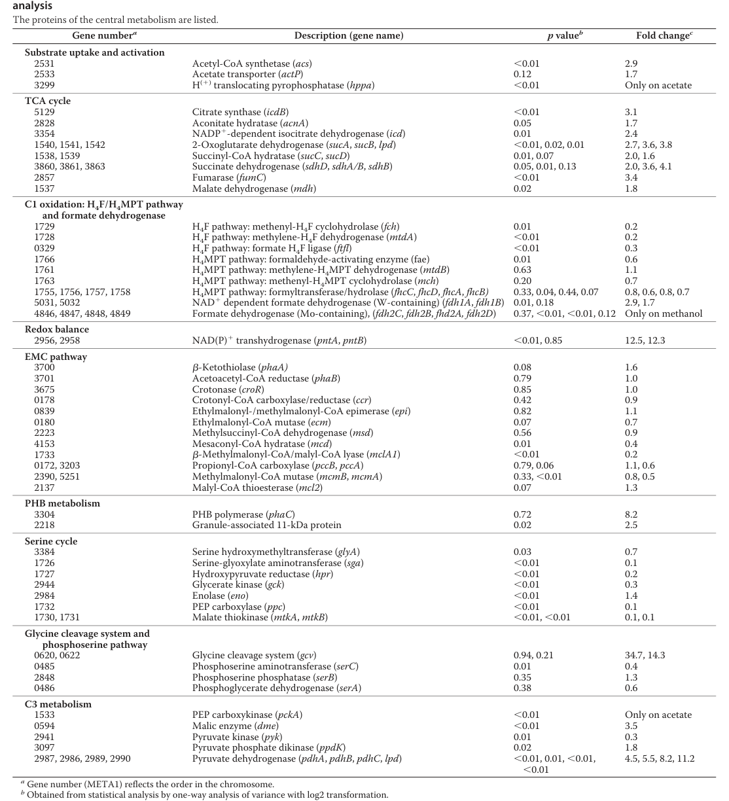

## Question

# Gene Research for Functional Annotation

## ⚠️ CRITICAL: Gene/Protein Identification Context

**BEFORE YOU BEGIN RESEARCH:** You MUST verify you are researching the CORRECT gene/protein. Gene symbols can be ambiguous, especially for less well-characterized genes from non-model organisms.

### Target Gene/Protein Identity (from UniProt):
- **UniProt Accession:** C5B1T5
- **Protein Description:** SubName: Full=Phosphate acetyltransferase {ECO:0000313|EMBL:ACS39719.1}; EC=2.3.1.8 {ECO:0000313|EMBL:ACS39719.1};
- **Gene Information:** Name=pta {ECO:0000313|EMBL:ACS39719.1}; OrderedLocusNames=MexAM1_META1p1893 {ECO:0000313|EMBL:ACS39719.1};
- **Organism (full):** Methylorubrum extorquens (strain ATCC 14718 / DSM 1338 / JCM 2805 / NCIMB 9133 / AM1) (Methylobacterium extorquens).
- **Protein Family:** Not specified in UniProt
- **Key Domains:** Phos_Acetyltrans/Butyryltrans. (IPR050500); PTA_PTB. (IPR002505); PTA_PTB (PF01515)

### MANDATORY VERIFICATION STEPS:

1. **Check if the gene symbol "pta" matches the protein description above**
2. **Verify the organism is correct:** Methylorubrum extorquens (strain ATCC 14718 / DSM 1338 / JCM 2805 / NCIMB 9133 / AM1) (Methylobacterium extorquens).
3. **Check if protein family/domains align with what you find in literature**
4. **If you find literature for a DIFFERENT gene with the same or similar symbol, STOP**

### If Gene Symbol is Ambiguous or You Cannot Find Relevant Literature:

**DO NOT PROCEED WITH RESEARCH ON A DIFFERENT GENE.** Instead:
- State clearly: "The gene symbol 'pta' is ambiguous or literature is limited for this specific protein"
- Explain what you found (e.g., "Found extensive literature on a different gene with the same symbol in a different organism")
- Describe the protein based ONLY on the UniProt information provided above
- Suggest that the protein function can be inferred from domain/family information

### Research Target:

Please provide a comprehensive research report on the gene **pta** (gene ID: pta, UniProt: C5B1T5) in METEA.

The research report should be a detailed narrative explaining the function, biological processes, and localization of the gene product. Citations should be given for all claims.

You should prioritize authoritative reviews and primary scientific literature when conducting research. You can supplement
this with annotations you find in gene/protein databases, but these can be outdated or inaccurate.

We are specifically interested in the primary function of the gene - for enzymes, what reaction is catalyzed, and what is the substrate specificity? For transporters, what is the substrate? For structural proteins or adapters, what is the broader structural role? For signaling molecules, what is the role in the pathway.

We are interested in where in or outside the cell the gene product carries out its function.

We are also interested in the signaling or biochemical pathways in which the gene functions. We are less interested in broad pleiotropic effects, except where these elucidate the precise role.

Include evidence where possible. We are interested in both experimental evidence as well as inference from structure, evolution, or bioinformatic analysis. Precise studies should be prioritized over high-throughput, where available.

## Output

Question: You are an expert researcher providing comprehensive, well-cited information.

Provide detailed information focusing on:
1. Key concepts and definitions with current understanding
2. Recent developments and latest research (prioritize 2023-2024 sources)
3. Current applications and real-world implementations
4. Expert opinions and analysis from authoritative sources
5. Relevant statistics and data from recent studies

Format as a comprehensive research report with proper citations. Include URLs and publication dates where available.
Always prioritize recent, authoritative sources and provide specific citations for all major claims.

# Gene Research for Functional Annotation

## ⚠️ CRITICAL: Gene/Protein Identification Context

**BEFORE YOU BEGIN RESEARCH:** You MUST verify you are researching the CORRECT gene/protein. Gene symbols can be ambiguous, especially for less well-characterized genes from non-model organisms.

### Target Gene/Protein Identity (from UniProt):
- **UniProt Accession:** C5B1T5
- **Protein Description:** SubName: Full=Phosphate acetyltransferase {ECO:0000313|EMBL:ACS39719.1}; EC=2.3.1.8 {ECO:0000313|EMBL:ACS39719.1};
- **Gene Information:** Name=pta {ECO:0000313|EMBL:ACS39719.1}; OrderedLocusNames=MexAM1_META1p1893 {ECO:0000313|EMBL:ACS39719.1};
- **Organism (full):** Methylorubrum extorquens (strain ATCC 14718 / DSM 1338 / JCM 2805 / NCIMB 9133 / AM1) (Methylobacterium extorquens).
- **Protein Family:** Not specified in UniProt
- **Key Domains:** Phos_Acetyltrans/Butyryltrans. (IPR050500); PTA_PTB. (IPR002505); PTA_PTB (PF01515)

### MANDATORY VERIFICATION STEPS:

1. **Check if the gene symbol "pta" matches the protein description above**
2. **Verify the organism is correct:** Methylorubrum extorquens (strain ATCC 14718 / DSM 1338 / JCM 2805 / NCIMB 9133 / AM1) (Methylobacterium extorquens).
3. **Check if protein family/domains align with what you find in literature**
4. **If you find literature for a DIFFERENT gene with the same or similar symbol, STOP**

### If Gene Symbol is Ambiguous or You Cannot Find Relevant Literature:

**DO NOT PROCEED WITH RESEARCH ON A DIFFERENT GENE.** Instead:
- State clearly: "The gene symbol 'pta' is ambiguous or literature is limited for this specific protein"
- Explain what you found (e.g., "Found extensive literature on a different gene with the same symbol in a different organism")
- Describe the protein based ONLY on the UniProt information provided above
- Suggest that the protein function can be inferred from domain/family information

### Research Target:

Please provide a comprehensive research report on the gene **pta** (gene ID: pta, UniProt: C5B1T5) in METEA.

The research report should be a detailed narrative explaining the function, biological processes, and localization of the gene product. Citations should be given for all claims.

You should prioritize authoritative reviews and primary scientific literature when conducting research. You can supplement
this with annotations you find in gene/protein databases, but these can be outdated or inaccurate.

We are specifically interested in the primary function of the gene - for enzymes, what reaction is catalyzed, and what is the substrate specificity? For transporters, what is the substrate? For structural proteins or adapters, what is the broader structural role? For signaling molecules, what is the role in the pathway.

We are interested in where in or outside the cell the gene product carries out its function.

We are also interested in the signaling or biochemical pathways in which the gene functions. We are less interested in broad pleiotropic effects, except where these elucidate the precise role.

Include evidence where possible. We are interested in both experimental evidence as well as inference from structure, evolution, or bioinformatic analysis. Precise studies should be prioritized over high-throughput, where available.

## Research report: functional annotation of **pta** (UniProt **C5B1T5**) in *Methylorubrum extorquens* AM1 (syn. *Methylobacterium extorquens* AM1)

### 1) Target verification (identity and ambiguity control)
The UniProt target (C5B1T5) is annotated as **phosphate acetyltransferase / phosphotransacetylase (Pta)** with **EC 2.3.1.8**, encoded by **pta** in *Methylorubrum extorquens* strain AM1. The literature evidence used here explicitly concerns *M. extorquens* AM1 and discusses **acetate kinase (AckA)** with **phosphoacetyl‑CoA transferase / phosphotransacetylase (Pta)** (AckA–Pta), consistent with the UniProt enzyme class and pathway placement. (schneider2012theethylmalonylcoapathway pages 4-5)

### 2) Key concepts and current understanding

#### 2.1 Definition and biochemical function (reaction)
**Pta** is the CoA‑transfer enzyme of the **AckA–Pta node** linking acetyl‑phosphate and acetyl‑CoA. In a recent (2024) synthetic pathway description, the Pta step is explicitly defined as: a phosphotransacetylase “**transfers a CoA onto acetyl‑phosphate to form acetyl‑CoA**.” (Landwehr et al., 2024-08-08; URL: https://doi.org/10.1101/2024.08.08.607227) (landwehr2024asyntheticcellfree pages 1-4)

In general metabolic context, the AckA–Pta route is described as a **reversible** acetate ↔ acetyl‑phosphate ↔ acetyl‑CoA interconversion module that is widely used by bacteria as part of acetate metabolism and central carbon/energy balancing. (kurt2023perspectivesforusing pages 22-23)

#### 2.2 Pathway role in acetate/acetyl‑phosphate/acetyl‑CoA metabolism
A recent acetate-metabolism perspective (2023) summarizes two main acetate→acetyl‑CoA routes: (i) **AckA–Pta**, which proceeds via acetyl‑phosphate and is reversible; and (ii) **AMP‑forming acetyl‑CoA synthetase (Acs)**, which proceeds via an acetyl‑AMP intermediate. The review notes that **AckA–Pta consumes one ATP equivalent**, while **Acs requires two ATP equivalents**, and that **Acs has ~35× higher affinity for acetate** than AckA–Pta—supporting the common view that Acs dominates under **low acetate**, whereas AckA–Pta more often contributes to acetate overflow/production due to its lower affinity. (Kurt et al., 2023-10; URL: https://doi.org/10.20944/preprints202310.1117.v1) (kurt2023perspectivesforusing pages 22-23)

### 3) Organism-specific evidence in *M. extorquens* AM1

#### 3.1 Dominant acetate activation route during growth on acetate
A primary systems-level study of *M. extorquens* AM1 grown on acetate (JBC 2012) combined proteomics with isotope labeling and flux analysis. In acetate-grown cells, the authors report that **acetate kinase and phosphoacetyl‑CoA transferase (AckA–Pta) were barely detected (“both <0.01‰”)**, while **acetyl‑CoA synthetase** was more abundant (**fold change 2.9** on acetate vs methanol). They therefore state: “**we predict acetyl‑CoA synthesis by AMP‑forming acetyl‑CoA synthetase**.” (Schneider et al., 2012-01; URL: https://doi.org/10.1074/jbc.m111.305219) (schneider2012theethylmalonylcoapathway pages 4-5)

A cropped image of Table 1 (central metabolism proteins upregulated on acetate, including acetyl‑CoA synthetase) supports the proteomics-based inference. (schneider2012theethylmalonylcoapathway media d8f83f16)

**Interpretation:** For AM1 under the tested acetate-growth condition, Pta is likely **not a high-flux acetate activation enzyme**, but rather part of a broader acetate/acetyl‑phosphate module whose activity may become condition-dependent (e.g., in other carbon regimes, during acetate production, or in signaling/energy balancing contexts). This is strongly supported by the near-undetectable abundance of AckA/Pta in acetate-grown proteomes. (schneider2012theethylmalonylcoapathway pages 4-5)

#### 3.2 Quantitative physiology and flux context for acetate growth (statistics)
In the same AM1 acetate-growth study, quantitative physiology and 13C flux analysis provide context for how acetate carbon is processed:

* **Specific acetate uptake rate:** **4.0 ± 0.4 mmol gCDW−1 h−1**. (schneider2012theethylmalonylcoapathway pages 3-4)
* **Flux partitioning:** **68%** of acetyl‑CoA enters the **TCA cycle**; of that, **98%** is fully oxidized to **CO2** (major redox/energy generation route). (schneider2012theethylmalonylcoapathway pages 5-7)
* **Assimilation via EMC pathway:** ~**21%** of acetyl‑CoA proceeds through the **ethylmalonyl‑CoA (EMC) pathway**, assimilating about **0.8 mmol g−1 h−1 CO2**, interpreted as recycling ~**16%** of oxidized acetate carbon. (schneider2012theethylmalonylcoapathway pages 5-7)
* **Storage and byproducts:** PHB content increased on acetate to **13 ± 0.4%** (vs **2 ± 0.05%** on methanol), consistent with diversion of acetyl‑CoA to storage; flux to PHB reported as ~**5%** of acetyl‑CoA. (schneider2012theethylmalonylcoapathway pages 5-7, schneider2012theethylmalonylcoapathway pages 3-4)

These data provide a quantitative “baseline phenotype” for AM1 on acetate in which acetate is activated mainly through Acs, and assimilation is coordinated through the EMC pathway rather than the glyoxylate shunt (which AM1 lacks due to missing isocitrate lyase). (schneider2012theethylmalonylcoapathway pages 5-7, schneider2012theethylmalonylcoapathway pages 4-5)

#### 3.3 Cellular localization
No direct experimental subcellular localization for AM1 Pta was identified in the retrieved texts. The AM1 acetate-growth study mentions an **acetate transporter** (suggesting a membrane protein), but does not provide localization for AckA/Pta or Acs beyond this. (schneider2012theethylmalonylcoapathway pages 4-5)

### 4) Recent developments (prioritizing 2023–2024) and how they relate to AM1 Pta

#### 4.1 2024: cell-free and synthetic pathway usage of Pta highlights its modularity
A 2024 bioRxiv report describes a synthetic cell-free pathway to produce acetyl‑CoA from C1 substrates, using a designed sequence in which a phosphoketolase forms acetyl‑phosphate and **Pta converts acetyl‑phosphate to acetyl‑CoA**. This reinforces the modern view of Pta as a **swappable module** for acetyl‑CoA generation from acetyl‑phosphate in engineered systems. (Landwehr et al., 2024-08-08; URL: https://doi.org/10.1101/2024.08.08.607227) (landwehr2024asyntheticcellfree pages 1-4)

#### 4.2 2024: *Methylorubrum* engineering emphasizes nearby central-carbon control points
A 2024 *Microbial Cell Factories* study engineered *Methylorubrum extorquens* for methylotrophic **glycolic acid (GA)** production. Although it does not focus on pta directly, it quantifies performance and emphasizes central metabolism constraints around glyoxylate/EMC pathway—metabolic neighborhoods that interface with acetyl‑CoA supply and acetate/acetyl‑phosphate balancing in methylotroph physiology.

Key quantitative results include:
* **Theoretical yield:** predicted **1.0 C-mol GA per C-mol methanol** (model-based). (Dietz et al., 2024-12; URL: https://doi.org/10.1186/s12934-024-02583-y) (dietz2024anovelengineered pages 1-2)
* **Fed-batch titers and yields:** GA titer **0.67 g/L** after 41 h; methanol yield **67.0 ± 1.8 mg GA gMeOH−1**; specific GA rate **35.5 ± 0.9 mg GA gCDW−1 h−1**; LA byproduct titer ~**0.54 g/L** after 41 h with **54 ± 0.9 mg LA gMeOH−1**. (dietz2024anovelengineered pages 17-19)
* **Glyoxylate feeding:** GA titer increased to **1.04 g/L** (four-fold in that condition) and qGA up to **1.21 mmol gCDW−1 h−1** with a product-substrate yield **0.21 C-mol GA per C-mol (MeOH+glyoxylate)**. (dietz2024anovelengineered pages 15-16)

**Expert-level interpretation:** For AM1-related strain engineering, “acetyl‑CoA supply” is frequently limiting for acetyl‑CoA-derived products; however, in acetate-grown AM1, the dominant acetate activation is Acs rather than AckA/Pta. This suggests that engineering efforts that rely on acetate uptake at low concentrations may need to prioritize Acs and energy coupling, while AckA/Pta may matter more for acetate overflow control, acetyl‑phosphate availability, or specific engineered routes that explicitly use acetyl‑phosphate as an intermediate. This interpretation is supported by the AM1 proteomics evidence and general acetate metabolism comparison. (schneider2012theethylmalonylcoapathway pages 4-5, kurt2023perspectivesforusing pages 22-23)

### 5) Current applications and real-world implementations

#### 5.1 Engineered AM1 producing itaconic acid: acetyl‑CoA supply and acetate activation routes
A 2019 study engineered *M. extorquens* AM1 to express cis‑aconitate decarboxylase and produce **itaconic acid (ITA)** from methanol and other substrates. The authors explicitly place phosphate acetyltransferase in acetate/acetyl‑CoA interconversion by noting that acetate can be converted to acetyl‑CoA either directly by acetyl‑CoA synthetase or **via acetyl‑phosphate by phosphate acetyltransferase**. (Lim et al., 2019-05; URL: https://doi.org/10.3389/fmicb.2019.01027) (lim2019designingandengineering pages 10-11)

Reported ITA metrics (selected):
* **Batch on methanol:** highest ITA titer **31.6 ± 5.5 mg/L**. (lim2019designingandengineering pages 1-2)
* **Fed-batch (60% DO):** titer **5.4 ± 0.2 mg/L**; productivity **0.056 ± 0.002 mg/L/h**. (lim2019designingandengineering pages 1-2)
* **From acetate (example condition):** **0.22 ± 0.01 mg/L** ITA detected after **5 mM acetate** consumption in one medium/condition. (lim2019designingandengineering pages 3-4)

This demonstrates a real engineered context where the acetate-to-acetyl‑CoA node (including the Pta route) is part of pathway reasoning, even if not the dominant acetate activation route during wild-type acetate growth. (schneider2012theethylmalonylcoapathway pages 4-5, lim2019designingandengineering pages 10-11)

#### 5.2 Broader acetate biotechnology context (2023)
A 2023 perspective summarizes that acetate is used as an industrially relevant carbon feedstock, but can be toxic at concentrations **below 5 g/L** and yields relatively low energy (~**10 ATP/mol acetate** versus ~**38 ATP/mol glucose**). Such constraints shape process design and help explain why acetate assimilation strategy (Acs vs AckA–Pta) is a key engineering decision. (Kurt et al., 2023-10; URL: https://doi.org/10.20944/preprints202310.1117.v1) (kurt2023perspectivesforusing pages 22-23)

### 6) What is known vs. not yet evidenced for AM1 Pta (gap-aware annotation)

**Supported by retrieved evidence:**
* Pta is the enzyme converting **acetyl‑phosphate → acetyl‑CoA** (CoA transfer onto acetyl‑phosphate). (landwehr2024asyntheticcellfree pages 1-4)
* In acetate-grown *M. extorquens* AM1, AckA/Pta are **barely detected**, while Acs is upregulated; acetate activation is inferred to proceed mainly through **AMP-forming Acs**. (schneider2012theethylmalonylcoapathway pages 4-5)
* AM1 acetate growth involves substantial carbon oxidation via TCA and assimilation via EMC, with quantitative flux partitioning and PHB accumulation. (schneider2012theethylmalonylcoapathway pages 5-7, schneider2012theethylmalonylcoapathway pages 3-4)

**Not supported by retrieved evidence (do not infer without additional sources):**
* AM1-specific **Pta kinetic parameters** (Km, kcat) or substrate specificity beyond acetyl‑phosphate/CoA.
* AM1-specific **pta knockout/overexpression phenotypes**.
* Direct experimental **subcellular localization** for AM1 Pta.

### Evidence summary table
The following table consolidates the key evidence-backed points for this functional annotation.

| Topic | Key finding (one sentence) | Organism/condition | Quantitative values (if any) | Primary source with year and URL | Citation ID |
|---|---|---|---|---|---|
| Reaction | Pta is the phosphotransacetylase/phosphate acetyltransferase of the AckA–Pta node, catalyzing transfer of CoA onto acetyl-phosphate to form acetyl-CoA, consistent with UniProt EC 2.3.1.8 annotation. | General biochemical definition; used here to verify annotation of M. extorquens AM1 Pta | No organism-specific kinetics retrieved | Landwehr et al., 2024, https://doi.org/10.1101/2024.08.08.607227 | (landwehr2024asyntheticcellfree pages 1-4) |
| Pathway role | In acetate metabolism, the reversible AckA–Pta route links acetate, acetyl-phosphate, and acetyl-CoA and is generally more associated with low-affinity acetate utilization/acetate production than the high-affinity Acs route. | General acetate assimilation/production overview | AckA–Pta uses 1 ATP equivalent; Acs has ~35-fold higher acetate affinity; acetate toxicity can occur below 5 g/L | Kurt et al., 2023, https://doi.org/10.20944/preprints202310.1117.v1 | (kurt2023perspectivesforusing pages 22-23) |
| Acetate activation in AM1 | During growth of Methylobacterium/Methylorubrum extorquens AM1 on acetate, AckA and Pta were barely detected and the authors inferred that acetate is activated mainly by AMP-forming acetyl-CoA synthetase rather than AckA–Pta. | M. extorquens AM1 grown on acetate vs methanol | Acetyl-CoA synthetase fold change 2.9 on acetate; AckA and Pta both <0.01‰ abundance | Schneider et al., 2012, https://doi.org/10.1074/jbc.m111.305219 | (schneider2012theethylmalonylcoapathway pages 4-5) |
| Quantitative flux/phenotype data | Acetate-grown AM1 partitions acetyl-CoA mainly to the TCA cycle for oxidation and to the EMC pathway for assimilation, showing the physiological context in which any Pta activity would be secondary under these conditions. | M. extorquens AM1, 13C flux analysis during growth on acetate | Specific acetate uptake 4.0 ± 0.4 mmol gCDW^-1 h^-1; 68% of acetyl-CoA to TCA; 98% of that oxidized to CO2; ~21% through EMC; ~0.8 mmol g^-1 h^-1 CO2 assimilated; PHB content 13 ± 0.4% on acetate vs 2 ± 0.05% on methanol; ~5% acetyl-CoA to PHB | Schneider et al., 2012, https://doi.org/10.1074/jbc.m111.305219 | (schneider2012theethylmalonylcoapathway pages 5-7, schneider2012theethylmalonylcoapathway pages 3-4) |
| Engineering/application examples | Engineered M. extorquens AM1 strains for itaconic acid production explicitly place phosphate acetyltransferase in the acetate-to-acetyl-CoA network, indicating the Pta node remains relevant for carbon-flux engineering even when not the dominant acetate activation route in wild-type acetate growth. | Engineered M. extorquens AM1 for itaconic acid production | ITA titer 31.6 ± 5.5 mg/L in batch on methanol; 5.4 ± 0.2 mg/L and 0.056 ± 0.002 mg/L/h in fed-batch; 0.22 ± 0.01 mg/L detected after 5 mM acetate consumed in one condition | Lim et al., 2019, https://doi.org/10.3389/fmicb.2019.01027 | (lim2019designingandengineering pages 10-11, lim2019designingandengineering pages 1-2, lim2019designingandengineering pages 3-4) |
| Engineering/application examples | Recent metabolic engineering in Methylorubrum extorquens exploits nearby central-carbon nodes (glyoxylate/EMC/acetyl-CoA-adjacent metabolism), underscoring practical importance of accurately annotating enzymes like Pta within acetyl-CoA supply and carbon-partitioning networks. | Engineered M. extorquens for glycolic acid production | Theoretical yield 1.0 C-mol glycolic acid per C-mol methanol; best fed-batch total glycolic acid + lactic acid 1.2 g/L; GA titer 0.67 g/L after 41 h; YGA/MeOH 67.0 ± 1.8 mg/g; qP 35.5 ± 0.9 mg gCDW^-1 h^-1 | Dietz et al., 2024, https://doi.org/10.1186/s12934-024-02583-y | (dietz2024anovelengineered pages 17-19, dietz2024anovelengineered pages 15-16, dietz2024anovelengineered pages 1-2) |
| Localization | No direct experimental subcellular localization for Pta in M. extorquens AM1 was found in the retrieved literature; the available evidence only mentions an acetate transporter as membrane-associated while acetate-activation enzymes were discussed without localization data. | M. extorquens AM1 acetate-growth proteomics | None reported for Pta | Schneider et al., 2012, https://doi.org/10.1074/jbc.m111.305219 | (schneider2012theethylmalonylcoapathway pages 4-5) |

*Table: This table summarizes evidence-backed functional annotation points for Pta (UniProt C5B1T5) in Methylorubrum extorquens AM1, including biochemical role, organism-specific acetate-growth evidence, pathway context, and engineering relevance. It is useful as a compact evidence map distinguishing direct AM1 observations from broader pathway-level inferences.*

### Key primary sources (publication dates and URLs)
* Schneider K. et al. **2012-01**. *J Biol Chem.* “The ethylmalonyl‑CoA pathway is used in place of the glyoxylate cycle by *Methylobacterium extorquens* AM1 during growth on acetate.” https://doi.org/10.1074/jbc.m111.305219 (schneider2012theethylmalonylcoapathway pages 5-7, schneider2012theethylmalonylcoapathway pages 3-4, schneider2012theethylmalonylcoapathway pages 4-5)
* Dietz K. et al. **2024-12**. *Microbial Cell Factories.* “A novel engineered strain of *Methylorubrum extorquens* for methylotrophic production of glycolic acid.” https://doi.org/10.1186/s12934-024-02583-y (dietz2024anovelengineered pages 17-19, dietz2024anovelengineered pages 15-16, dietz2024anovelengineered pages 1-2)
* Landwehr G.M. et al. **2024-08-08**. bioRxiv. “A synthetic cell-free pathway for biocatalytic upgrading of one-carbon substrates.” https://doi.org/10.1101/2024.08.08.607227 (landwehr2024asyntheticcellfree pages 1-4)
* Kurt E. et al. **2023-10**. (Preprint) “Perspectives for using CO2 as a feedstock for biomanufacturing.” https://doi.org/10.20944/preprints202310.1117.v1 (kurt2023perspectivesforusing pages 22-23)
* Lim C.K. et al. **2019-05**. *Frontiers in Microbiology.* “Designing and engineering *Methylorubrum extorquens* AM1 for itaconic acid production.” https://doi.org/10.3389/fmicb.2019.01027 (lim2019designingandengineering pages 10-11, lim2019designingandengineering pages 1-2, lim2019designingandengineering pages 3-4)

References

1. (schneider2012theethylmalonylcoapathway pages 4-5): Kathrin Schneider, Rémi Peyraud, Patrick Kiefer, Philipp Christen, Nathanaël Delmotte, Stéphane Massou, Jean-Charles Portais, and Julia A. Vorholt. The ethylmalonyl-coa pathway is used in place of the glyoxylate cycle by methylobacterium extorquens am1 during growth on acetate. Journal of Biological Chemistry, 287:757-766, Jan 2012. URL: https://doi.org/10.1074/jbc.m111.305219, doi:10.1074/jbc.m111.305219. This article has 106 citations and is from a domain leading peer-reviewed journal.

2. (landwehr2024asyntheticcellfree pages 1-4): Grant M. Landwehr, Bastian Vogeli, Cong Tian, Bharti Singal, Anika Gupta, Rebeca Lion, Edward H. Sargent, Ashty S. Karim, and Michael C. Jewett. A synthetic cell-free pathway for biocatalytic upgrading of one-carbon substrates. bioRxiv, Aug 2024. URL: https://doi.org/10.1101/2024.08.08.607227, doi:10.1101/2024.08.08.607227. This article has 6 citations.

3. (kurt2023perspectivesforusing pages 22-23): Elif Kurt, Jiansong Qin, Alexandria R Williams, Youbo Zhao, and Dongming Xie. Perspectives for using co2 as a feedstock for biomanufacturing. Unknown journal, Oct 2023. URL: https://doi.org/10.20944/preprints202310.1117.v1, doi:10.20944/preprints202310.1117.v1.

4. (schneider2012theethylmalonylcoapathway media d8f83f16): Kathrin Schneider, Rémi Peyraud, Patrick Kiefer, Philipp Christen, Nathanaël Delmotte, Stéphane Massou, Jean-Charles Portais, and Julia A. Vorholt. The ethylmalonyl-coa pathway is used in place of the glyoxylate cycle by methylobacterium extorquens am1 during growth on acetate. Journal of Biological Chemistry, 287:757-766, Jan 2012. URL: https://doi.org/10.1074/jbc.m111.305219, doi:10.1074/jbc.m111.305219. This article has 106 citations and is from a domain leading peer-reviewed journal.

5. (schneider2012theethylmalonylcoapathway pages 3-4): Kathrin Schneider, Rémi Peyraud, Patrick Kiefer, Philipp Christen, Nathanaël Delmotte, Stéphane Massou, Jean-Charles Portais, and Julia A. Vorholt. The ethylmalonyl-coa pathway is used in place of the glyoxylate cycle by methylobacterium extorquens am1 during growth on acetate. Journal of Biological Chemistry, 287:757-766, Jan 2012. URL: https://doi.org/10.1074/jbc.m111.305219, doi:10.1074/jbc.m111.305219. This article has 106 citations and is from a domain leading peer-reviewed journal.

6. (schneider2012theethylmalonylcoapathway pages 5-7): Kathrin Schneider, Rémi Peyraud, Patrick Kiefer, Philipp Christen, Nathanaël Delmotte, Stéphane Massou, Jean-Charles Portais, and Julia A. Vorholt. The ethylmalonyl-coa pathway is used in place of the glyoxylate cycle by methylobacterium extorquens am1 during growth on acetate. Journal of Biological Chemistry, 287:757-766, Jan 2012. URL: https://doi.org/10.1074/jbc.m111.305219, doi:10.1074/jbc.m111.305219. This article has 106 citations and is from a domain leading peer-reviewed journal.

7. (dietz2024anovelengineered pages 1-2): Katharina Dietz, Carina Sagstetter, Melanie Speck, Arne Roth, Steffen Klamt, and Jonathan Thomas Fabarius. A novel engineered strain of methylorubrum extorquens for methylotrophic production of glycolic acid. Microbial Cell Factories, Dec 2024. URL: https://doi.org/10.1186/s12934-024-02583-y, doi:10.1186/s12934-024-02583-y. This article has 10 citations and is from a peer-reviewed journal.

8. (dietz2024anovelengineered pages 17-19): Katharina Dietz, Carina Sagstetter, Melanie Speck, Arne Roth, Steffen Klamt, and Jonathan Thomas Fabarius. A novel engineered strain of methylorubrum extorquens for methylotrophic production of glycolic acid. Microbial Cell Factories, Dec 2024. URL: https://doi.org/10.1186/s12934-024-02583-y, doi:10.1186/s12934-024-02583-y. This article has 10 citations and is from a peer-reviewed journal.

9. (dietz2024anovelengineered pages 15-16): Katharina Dietz, Carina Sagstetter, Melanie Speck, Arne Roth, Steffen Klamt, and Jonathan Thomas Fabarius. A novel engineered strain of methylorubrum extorquens for methylotrophic production of glycolic acid. Microbial Cell Factories, Dec 2024. URL: https://doi.org/10.1186/s12934-024-02583-y, doi:10.1186/s12934-024-02583-y. This article has 10 citations and is from a peer-reviewed journal.

10. (lim2019designingandengineering pages 10-11): Chee Kent Lim, Juan C. Villada, Annie Chalifour, Maria F. Duran, Hongyuan Lu, and Patrick K. H. Lee. Designing and engineering methylorubrum extorquens am1 for itaconic acid production. Frontiers in Microbiology, May 2019. URL: https://doi.org/10.3389/fmicb.2019.01027, doi:10.3389/fmicb.2019.01027. This article has 54 citations and is from a peer-reviewed journal.

11. (lim2019designingandengineering pages 1-2): Chee Kent Lim, Juan C. Villada, Annie Chalifour, Maria F. Duran, Hongyuan Lu, and Patrick K. H. Lee. Designing and engineering methylorubrum extorquens am1 for itaconic acid production. Frontiers in Microbiology, May 2019. URL: https://doi.org/10.3389/fmicb.2019.01027, doi:10.3389/fmicb.2019.01027. This article has 54 citations and is from a peer-reviewed journal.

12. (lim2019designingandengineering pages 3-4): Chee Kent Lim, Juan C. Villada, Annie Chalifour, Maria F. Duran, Hongyuan Lu, and Patrick K. H. Lee. Designing and engineering methylorubrum extorquens am1 for itaconic acid production. Frontiers in Microbiology, May 2019. URL: https://doi.org/10.3389/fmicb.2019.01027, doi:10.3389/fmicb.2019.01027. This article has 54 citations and is from a peer-reviewed journal.

## Artifacts

- [Edison artifact artifact-00](pta-deep-research-falcon_artifacts/artifact-00.md)

## Citations

1. schneider2012theethylmalonylcoapathway pages 4-5
2. landwehr2024asyntheticcellfree pages 1-4
3. kurt2023perspectivesforusing pages 22-23
4. schneider2012theethylmalonylcoapathway pages 3-4
5. schneider2012theethylmalonylcoapathway pages 5-7
6. dietz2024anovelengineered pages 1-2
7. dietz2024anovelengineered pages 17-19
8. dietz2024anovelengineered pages 15-16
9. lim2019designingandengineering pages 10-11
10. lim2019designingandengineering pages 1-2
11. lim2019designingandengineering pages 3-4
12. https://doi.org/10.1101/2024.08.08.607227
13. https://doi.org/10.20944/preprints202310.1117.v1
14. https://doi.org/10.1074/jbc.m111.305219
15. https://doi.org/10.1186/s12934-024-02583-y
16. https://doi.org/10.3389/fmicb.2019.01027
17. https://doi.org/10.1074/jbc.m111.305219,
18. https://doi.org/10.1101/2024.08.08.607227,
19. https://doi.org/10.20944/preprints202310.1117.v1,
20. https://doi.org/10.1186/s12934-024-02583-y,
21. https://doi.org/10.3389/fmicb.2019.01027,