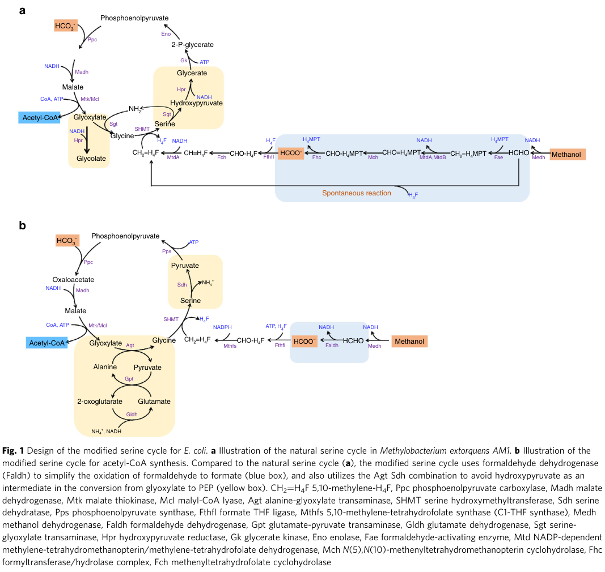

## Question

# Gene Research for Functional Annotation

## ⚠️ CRITICAL: Gene/Protein Identification Context

**BEFORE YOU BEGIN RESEARCH:** You MUST verify you are researching the CORRECT gene/protein. Gene symbols can be ambiguous, especially for less well-characterized genes from non-model organisms.

### Target Gene/Protein Identity (from UniProt):
- **UniProt Accession:** C5APD6
- **Protein Description:** RecName: Full=D-3-phosphoglycerate dehydrogenase {ECO:0000256|ARBA:ARBA00021582}; EC=1.1.1.399 {ECO:0000256|ARBA:ARBA00013001}; EC=1.1.1.95 {ECO:0000256|ARBA:ARBA00013143}; AltName: Full=2-oxoglutarate reductase {ECO:0000256|ARBA:ARBA00030455};
- **Gene Information:** Name=serA {ECO:0000313|EMBL:ACS38072.1}; OrderedLocusNames=MexAM1_META1p0105 {ECO:0000313|EMBL:ACS38072.1};
- **Organism (full):** Methylorubrum extorquens (strain ATCC 14718 / DSM 1338 / JCM 2805 / NCIMB 9133 / AM1) (Methylobacterium extorquens).
- **Protein Family:** Belongs to the D-isomer specific 2-hydroxyacid
- **Key Domains:** ACT-like_dom_sf. (IPR045865); ACT_dom. (IPR002912); AHAS_small-like_ACT. (IPR054480); D-iso_2-hydroxyacid_DH_PdxB. (IPR050418); D-isomer_2_OHA_DH_cat_dom. (IPR006139)

### MANDATORY VERIFICATION STEPS:

1. **Check if the gene symbol "serA" matches the protein description above**
2. **Verify the organism is correct:** Methylorubrum extorquens (strain ATCC 14718 / DSM 1338 / JCM 2805 / NCIMB 9133 / AM1) (Methylobacterium extorquens).
3. **Check if protein family/domains align with what you find in literature**
4. **If you find literature for a DIFFERENT gene with the same or similar symbol, STOP**

### If Gene Symbol is Ambiguous or You Cannot Find Relevant Literature:

**DO NOT PROCEED WITH RESEARCH ON A DIFFERENT GENE.** Instead:
- State clearly: "The gene symbol 'serA' is ambiguous or literature is limited for this specific protein"
- Explain what you found (e.g., "Found extensive literature on a different gene with the same symbol in a different organism")
- Describe the protein based ONLY on the UniProt information provided above
- Suggest that the protein function can be inferred from domain/family information

### Research Target:

Please provide a comprehensive research report on the gene **serA** (gene ID: serA, UniProt: C5APD6) in METEA.

The research report should be a detailed narrative explaining the function, biological processes, and localization of the gene product. Citations should be given for all claims.

You should prioritize authoritative reviews and primary scientific literature when conducting research. You can supplement
this with annotations you find in gene/protein databases, but these can be outdated or inaccurate.

We are specifically interested in the primary function of the gene - for enzymes, what reaction is catalyzed, and what is the substrate specificity? For transporters, what is the substrate? For structural proteins or adapters, what is the broader structural role? For signaling molecules, what is the role in the pathway.

We are interested in where in or outside the cell the gene product carries out its function.

We are also interested in the signaling or biochemical pathways in which the gene functions. We are less interested in broad pleiotropic effects, except where these elucidate the precise role.

Include evidence where possible. We are interested in both experimental evidence as well as inference from structure, evolution, or bioinformatic analysis. Precise studies should be prioritized over high-throughput, where available.

## Output

Question: You are an expert researcher providing comprehensive, well-cited information.

Provide detailed information focusing on:
1. Key concepts and definitions with current understanding
2. Recent developments and latest research (prioritize 2023-2024 sources)
3. Current applications and real-world implementations
4. Expert opinions and analysis from authoritative sources
5. Relevant statistics and data from recent studies

Format as a comprehensive research report with proper citations. Include URLs and publication dates where available.
Always prioritize recent, authoritative sources and provide specific citations for all major claims.

# Gene Research for Functional Annotation

## ⚠️ CRITICAL: Gene/Protein Identification Context

**BEFORE YOU BEGIN RESEARCH:** You MUST verify you are researching the CORRECT gene/protein. Gene symbols can be ambiguous, especially for less well-characterized genes from non-model organisms.

### Target Gene/Protein Identity (from UniProt):
- **UniProt Accession:** C5APD6
- **Protein Description:** RecName: Full=D-3-phosphoglycerate dehydrogenase {ECO:0000256|ARBA:ARBA00021582}; EC=1.1.1.399 {ECO:0000256|ARBA:ARBA00013001}; EC=1.1.1.95 {ECO:0000256|ARBA:ARBA00013143}; AltName: Full=2-oxoglutarate reductase {ECO:0000256|ARBA:ARBA00030455};
- **Gene Information:** Name=serA {ECO:0000313|EMBL:ACS38072.1}; OrderedLocusNames=MexAM1_META1p0105 {ECO:0000313|EMBL:ACS38072.1};
- **Organism (full):** Methylorubrum extorquens (strain ATCC 14718 / DSM 1338 / JCM 2805 / NCIMB 9133 / AM1) (Methylobacterium extorquens).
- **Protein Family:** Belongs to the D-isomer specific 2-hydroxyacid
- **Key Domains:** ACT-like_dom_sf. (IPR045865); ACT_dom. (IPR002912); AHAS_small-like_ACT. (IPR054480); D-iso_2-hydroxyacid_DH_PdxB. (IPR050418); D-isomer_2_OHA_DH_cat_dom. (IPR006139)

### MANDATORY VERIFICATION STEPS:

1. **Check if the gene symbol "serA" matches the protein description above**
2. **Verify the organism is correct:** Methylorubrum extorquens (strain ATCC 14718 / DSM 1338 / JCM 2805 / NCIMB 9133 / AM1) (Methylobacterium extorquens).
3. **Check if protein family/domains align with what you find in literature**
4. **If you find literature for a DIFFERENT gene with the same or similar symbol, STOP**

### If Gene Symbol is Ambiguous or You Cannot Find Relevant Literature:

**DO NOT PROCEED WITH RESEARCH ON A DIFFERENT GENE.** Instead:
- State clearly: "The gene symbol 'serA' is ambiguous or literature is limited for this specific protein"
- Explain what you found (e.g., "Found extensive literature on a different gene with the same symbol in a different organism")
- Describe the protein based ONLY on the UniProt information provided above
- Suggest that the protein function can be inferred from domain/family information

### Research Target:

Please provide a comprehensive research report on the gene **serA** (gene ID: serA, UniProt: C5APD6) in METEA.

The research report should be a detailed narrative explaining the function, biological processes, and localization of the gene product. Citations should be given for all claims.

You should prioritize authoritative reviews and primary scientific literature when conducting research. You can supplement
this with annotations you find in gene/protein databases, but these can be outdated or inaccurate.

We are specifically interested in the primary function of the gene - for enzymes, what reaction is catalyzed, and what is the substrate specificity? For transporters, what is the substrate? For structural proteins or adapters, what is the broader structural role? For signaling molecules, what is the role in the pathway.

We are interested in where in or outside the cell the gene product carries out its function.

We are also interested in the signaling or biochemical pathways in which the gene functions. We are less interested in broad pleiotropic effects, except where these elucidate the precise role.

Include evidence where possible. We are interested in both experimental evidence as well as inference from structure, evolution, or bioinformatic analysis. Precise studies should be prioritized over high-throughput, where available.

# Research Report: **serA (UniProt C5APD6)** in *Methylorubrum extorquens* AM1 (formerly *Methylobacterium extorquens* AM1)

## Executive summary
The UniProt target **C5APD6 (serA)** corresponds (in the *Methylorubrum/Methylobacterium extorquens* lineage) to **3-phosphoglycerate dehydrogenase (SerA)**, a member of the D-isomer-specific 2-hydroxyacid dehydrogenase (2HADH) superfamily that catalyzes an NAD(P)-dependent redox reaction on a 2-keto/2-hydroxyacid substrate pair (general 2HADH chemistry) (matelska2018classificationsubstratespecificity pages 1-2, matelska2018classificationsubstratespecificity pages 7-8). In *M. extorquens* AM1, proteomics places **serA/serB/serC** in the **phosphoserine (phosphorylated) serine biosynthesis pathway** (as distinct from the **serine cycle** used for C1 assimilation) (schneider2012theethylmalonylcoapathway pages 4-4). In a closely related model strain (*M. extorquens* PA1), transposon sequencing indicates **serA is conditionally essential on succinate** (but not on methanol), consistent with a shift in how serine is supplied/used across growth substrates in methylotrophs (ochsner2017transposonsequencinguncovers pages 4-5).

*Important limitation:* In the retrieved full-text evidence for this run, no primary biochemical study directly measuring **AM1 SerA** kinetics, cofactor preference, or substrate range was found; therefore organism-specific catalytic parameters and regulation cannot be asserted beyond the pathway-level and essentiality/proteomics evidence cited above.

---

## 1. Target identity verification (mandatory disambiguation)
### 1.1. Does gene symbol **serA** match the protein description?
Across *Methylobacterium/Methylorubrum extorquens* literature retrieved here, **serA** is explicitly annotated as **3-phosphoglycerate dehydrogenase** (a canonical “serA” function in bacteria) (ochsner2017transposonsequencinguncovers pages 4-5). In AM1 proteomics, **serA** is listed as **“Phosphoglycerate dehydrogenase (serA)”** along with serB and serC in the “phosphoserine pathway” (schneider2012theethylmalonylcoapathway pages 4-4). This aligns with the UniProt-provided identity.

### 1.2. Is the organism context correct?
The evidence includes *Methylobacterium extorquens* **AM1** (proteomics/flux) (schneider2012theethylmalonylcoapathway pages 4-4) and closely related *M. extorquens* **PA1** (TnSeq essentiality) (ochsner2017transposonsequencinguncovers pages 4-5). These are within the same model methylotroph lineage that has undergone taxonomic updates to *Methylorubrum*.

### 1.3. Do protein family/domain expectations align with literature?
The UniProt entry indicates a relationship to D-isomer-specific 2-hydroxyacid dehydrogenases. A family-level phylogenetic/structural analysis of **2HADHs** describes their conserved catalytic features and the general redox chemistry on **2-keto/2-hydroxyacid** pairs (matelska2018classificationsubstratespecificity pages 1-2, matelska2018classificationsubstratespecificity pages 7-8). This supports plausibility of SerA’s oxidoreductase mechanism class, although it does not substitute for organism-specific enzymology.

---

## 2. Key concepts and definitions (current understanding)

### 2.1. Two distinct “serine-related” modules in type II methylotrophs
1) **Phosphoserine (phosphorylated) serine biosynthesis pathway** (often called the “classical serA/serC/serB route”)
- Evidence in AM1: serA, serB, serC are grouped as the **“phosphoserine pathway”** in proteomics tables (schneider2012theethylmalonylcoapathway pages 4-4).
- Evidence in PA1: serA and serB are described as **enzymes involved in serine biosynthesis** and are conditionally essential depending on substrate (succinate vs methanol) (ochsner2017transposonsequencinguncovers pages 4-5).

2) **Serine cycle** (C1 assimilation pathway)
- The serine cycle is central to methylotrophic assimilation in *M. extorquens* and related type II methylotrophs, and is commonly depicted as a pathway converting C1 units plus CO2 into central metabolites/acetyl-CoA precursors (yu2018amodifiedserine pages 1-3, yu2018amodifiedserine media 92073d66).
- In AM1, multiple serine-cycle enzymes (e.g., sga, hpr, ppc, mtk) show strong growth-condition dependence (acetate vs methanol) in proteomics, illustrating that the cycle’s operation is regulated by carbon source (schneider2012theethylmalonylcoapathway pages 4-4).

### 2.2. 2HADH superfamily background relevant to SerA-like enzymes
2HADHs catalyze a stereospecific reversible redox transformation of 2-keto acids to 2-hydroxy acids with NAD(P)H/NAD(P)+, and the family exhibits diversified substrate specificity, complicating annotation (matelska2018classificationsubstratespecificity pages 1-2). Structural analyses emphasize conserved active-site residues and that substrate binding and catalysis involve a conserved “catalytic triad” (Arg/Glu/His) architecture in canonical 2HADHs (matelska2018classificationsubstratespecificity pages 7-8).

---

## 3. Functional annotation of **serA** in *M. extorquens* AM1: what can be stated with evidence

### 3.1. Biological role supported by organism-specific evidence
**serA participates in the phosphoserine pathway for serine biosynthesis**, as shown by explicit grouping of **serA/serB/serC** under “Glycine cleavage system and phosphoserine pathway” in AM1 proteomics (schneider2012theethylmalonylcoapathway pages 4-4). This provides direct pathway-context evidence in the target organism background.

### 3.2. Condition-dependent essentiality (closest available in-line evidence: PA1)
A saturated TnSeq essentiality screen in *M. extorquens* **PA1** reports that **serA (3-phosphoglycerate dehydrogenase; Mext_0213)** and **serB (phosphoserine phosphatase; Mext_2655)** are **essential only during growth on succinate** (not on methanol) (ochsner2017transposonsequencinguncovers pages 4-5). The authors interpret this as reflecting the need for the “classical” serine biosynthesis pathway on succinate, contrasting with a different handling/biosynthesis of serine during growth on methanol (ochsner2017transposonsequencinguncovers pages 4-5).

This constitutes strong experimental evidence that serA-linked serine biosynthesis can be **carbon-source dependent** in this lineage (ochsner2017transposonsequencinguncovers pages 4-5).

### 3.3. Quantitative proteomic evidence (AM1)
In AM1 (acetate vs methanol), quantitative proteomics reports for the phosphoserine branch:
- **serC** fold change **0.4**, **p = 0.01** (acetate vs methanol), indicating lower SerC abundance on acetate (schneider2012theethylmalonylcoapathway pages 4-4).
- **serA** fold change **0.6**, **p = 0.38** (not significant in this dataset) (schneider2012theethylmalonylcoapathway pages 4-4).
- **serB** fold change **1.3**, **p = 0.35** (not significant in this dataset) (schneider2012theethylmalonylcoapathway pages 4-4).

Concurrently, several **serine-cycle** enzymes are strongly decreased on acetate relative to methanol (e.g., **sga 0.1**, **hpr 0.2**, **ppc 0.1**, **mtkA/B 0.1/0.1**, all with **p = 0.01**) (schneider2012theethylmalonylcoapathway pages 4-4). This supports the concept that methylotrophic growth induces serine-cycle machinery (schneider2012theethylmalonylcoapathway pages 4-4).

### 3.4. Reaction chemistry and substrate specificity (what is *not* resolved in the retrieved evidence)
The UniProt entry provided by the user assigns EC numbers consistent with phosphoglycerate dehydrogenase activity and an alternate 2-oxoglutarate reductase annotation; however, **no organism-specific biochemical characterization of AM1 SerA** was retrieved in this run to directly substantiate:
- precise physiological substrate(s) and promiscuity,
- cofactor specificity (NADH vs NADPH),
- kinetic constants,
- allosteric regulation via ACT-like domains.

Therefore, these details remain **inferred** rather than demonstrated here, and should be treated as hypotheses until AM1-specific enzymology is obtained.

---

## 4. Cellular localization (evidence status)
The retrieved organism-specific sources in this run do not directly state SerA subcellular localization. Many methylotrophy functions (e.g., methanol dehydrogenase) are explicitly periplasmic in *Methylorubrum/Methylobacterium* (zhang2024phosphoribosylpyrophosphatesynthetaseas pages 1-2), but SerA is not discussed for localization in the extracted evidence. Thus, localization of SerA must be considered **undetermined from the present cited corpus**.

---

## 5. Pathway integration: serine biosynthesis vs serine cycle

### 5.1. Serine cycle as a C1 assimilation backbone (context)
A widely cited schematic of the **natural serine cycle in *M. extorquens* AM1** is provided in Yu & Liao (2018) (Figure 1a), showing how C1 units (carried by folate chemistry) and CO2 are integrated into central metabolites (yu2018amodifiedserine pages 1-3, yu2018amodifiedserine media 92073d66). This figure is helpful for distinguishing the serine cycle from the phosphoserine biosynthesis branch that includes serA/serB/serC.

### 5.2. Switching requirements across carbon sources
- In PA1, serA/serB are succinate-essential, which implies that on a non-methylotrophic substrate, cells rely on the “classical” biosynthetic route for serine (ochsner2017transposonsequencinguncovers pages 4-5).
- In AM1, serine-cycle enzymes are strongly lower on acetate than methanol, consistent with a reduced need for serine-cycle-driven assimilation when not growing on C1 (schneider2012theethylmalonylcoapathway pages 4-4).

Together, these data support a substrate-dependent reorganization of serine metabolism in the *M. extorquens* lineage.

---

## 6. Recent developments (prioritizing 2023–2024) relevant to serine metabolism in *Methylorubrum*

### 6.1. 2024 Nature Communications: methanol limitation, pathway trade-offs, and the serine cycle chassis
A 2024 study evolved and engineered *Methylorubrum extorquens* AM1-derived strains to improve growth under low methanol, explicitly framing trade-offs between catabolism and anabolism in phyllosphere-relevant conditions (Zhang et al., received Nov 2, 2023; accepted Jul 6, 2024; published Jul 2024) (zhang2024phosphoribosylpyrophosphatesynthetaseas pages 1-2). This paper also provides an ecological statistic frequently used in expert framing: **global methanol emissions are estimated at ~100 Tg annually** (zhang2024phosphoribosylpyrophosphatesynthetaseas pages 1-2).

Although this work centers on methanol assimilation and pathway valves rather than serA, it reinforces the modern view that central-carbon allocation during methylotrophy is an engineering and ecological bottleneck (zhang2024phosphoribosylpyrophosphatesynthetaseas pages 1-2).

### 6.2. 2024 mSystems: pangenomic evidence for conserved serine pathway genes in type II methylotrophs
A 2024 pangenomic analysis of **75 type II methylotrophs** reports that genes associated with **serine pathway** metabolism are broadly conserved across the group, and highlights diversity in specific enzymes/isozymes (published May 2, 2024) (samanta2024fromgenometo pages 1-2). This supports the idea that serine-linked carbon assimilation and its supporting biosynthetic pathways remain central traits at the clade level.

### 6.3. 2024 Microbial Cell Factories: AM1 as a C1 bioproduction platform (implementation enabling future serA-centered optimization)
A 2024 synthetic biology paper emphasizes *M. extorquens* AM1 as “a platform organism used to convert C1 compounds into various value-added products,” and demonstrates **chromosomal integration tools** to increase heterologous gene dosage (Zhu et al., published Jan 2024; article licensed 2023) (zhu2024heterologousproductionof pages 1-2). While not focused on serA, it provides a current implementation context in which serine-related carbon and nitrogen balancing could become engineering levers.

Reported quantitative production data include **3-hydroxypropionic acid (3-HP)** titers of **34.7–55.2 mg/L** (two chromosomal integration copies) and **65.5–92.4 mg/L** (with additional plasmid-based expression) (zhu2024heterologousproductionof pages 1-2).

---

## 7. Current applications and real-world implementations (where serA is relevant)

### 7.1. Methanol-based biotechnology and chassis engineering
Modern applied work positions *Methylorubrum extorquens* AM1 as a chassis for converting **C1 feedstocks** into value-added products (zhu2024heterologousproductionof pages 1-2). In such implementations, **serine metabolism intersects** with:
- C1 assimilation through the **serine cycle** (central carbon entry) (yu2018amodifiedserine pages 1-3, yu2018amodifiedserine media 92073d66).
- Biomass building block provision, where phosphoserine pathway flux (serA/serC/serB) may become conditionally important depending on growth substrate and metabolic rewiring (succinate essentiality in PA1) (ochsner2017transposonsequencinguncovers pages 4-5).

### 7.2. Plant-associated methylotroph function with methanol as a fluctuating resource
The 2024 Nature Communications study frames methylotrophy as critical for phyllosphere colonization and notes plant-derived methanol fluctuates diurnally from trace amounts to tens of millimoles, motivating selection for traits improving methanol assimilation (zhang2024phosphoribosylpyrophosphatesynthetaseas pages 1-2). Serine cycle activity (and by extension serine-related metabolic balancing) is part of this adaptive landscape.

---

## 8. Expert opinions and analysis (authoritative, sourced)
- Systems-level methylotrophy is described as a highly connected, condition-sensitive network; proteomics and flux analyses show strong redirection of metabolic routes depending on carbon source (acetate vs methanol), including large shifts in serine-cycle enzyme abundance (schneider2012theethylmalonylcoapathway pages 4-4).
- High-resolution TnSeq in a closely related strain shows that amino-acid biosynthetic needs can be substrate dependent; serA/serB essentiality only on succinate supports the concept that methylotrophs can bypass or rewire “classical” biosynthetic dependencies during methylotrophic growth (ochsner2017transposonsequencinguncovers pages 4-5).

---

## 9. Key statistics and quantitative data extracted from recent and foundational studies
- **TnSeq scale (PA1):** 486,577 insertions mapped on methanol vs 531,410 on succinate; mean insertion density 11.2 bp (methanol) and 10.3 bp (succinate); 590 shared required genes; 147 methanol-specific; 76 succinate-specific (ochsner2017transposonsequencinguncovers pages 3-4). These data define the experimental resolution underpinning succinate-specific serA essentiality (ochsner2017transposonsequencinguncovers pages 4-5).
- **Proteomics fold-changes (AM1, acetate vs methanol):** serC 0.4 (p=0.01), serA 0.6 (p=0.38), serB 1.3 (p=0.35) (schneider2012theethylmalonylcoapathway pages 4-4). Multiple serine-cycle enzymes show strong downshift on acetate (e.g., sga 0.1, hpr 0.2, ppc 0.1; p=0.01) (schneider2012theethylmalonylcoapathway pages 4-4).
- **Ecological statistic (2024):** estimated annual methanol emission ~100 Tg (Zhang et al., 2024) (zhang2024phosphoribosylpyrophosphatesynthetaseas pages 1-2).
- **Bioproduction statistic (2024):** 3-HP titers 34.7–55.2 mg/L (two chromosomal copies) and 65.5–92.4 mg/L (with plasmid-based expression) in *M. extorquens* AM1 engineering work (zhu2024heterologousproductionof pages 1-2).

---

## 10. Visual evidence: serine cycle context in *M. extorquens* AM1
The following figure provides a compact, peer-reviewed schematic of the **natural serine cycle in *M. extorquens* AM1** (panel a) used as a reference in synthetic biology design.

(yu2018amodifiedserine media 92073d66)

---

## 11. Conclusions and evidence gaps
**What is well supported from the retrieved evidence:**
- serA/serB/serC belong to the **phosphoserine pathway** in AM1 proteomic pathway organization (schneider2012theethylmalonylcoapathway pages 4-4).
- serA is **conditionally essential** (succinate-only) in a closely related model strain PA1, implying substrate-dependent serine provisioning (ochsner2017transposonsequencinguncovers pages 4-5).
- serine-cycle enzyme abundance is strongly growth-substrate dependent in AM1, consistent with the serine cycle being particularly important during C1 growth (schneider2012theethylmalonylcoapathway pages 4-4).

**What remains unresolved for AM1 SerA (C5APD6) in this run:**
- direct SerA enzymology (substrate range, kinetic parameters, cofactor preference),
- allosteric regulation via ACT-like domains,
- subcellular localization,
- direct AM1 serA knockout phenotypes.

Filling these gaps would require retrieving (or experimentally generating) AM1-specific SerA biochemical characterization and/or targeted genetics beyond the scope of the present evidence set.

References

1. (matelska2018classificationsubstratespecificity pages 1-2): Dorota Matelska, Ivan G. Shabalin, Jagoda Jabłońska, Marcin J. Domagalski, Jan Kutner, Krzysztof Ginalski, and Wladek Minor. Classification, substrate specificity and structural features of d-2-hydroxyacid dehydrogenases: 2hadh knowledgebase. BMC Evolutionary Biology, Dec 2018. URL: https://doi.org/10.1186/s12862-018-1309-8, doi:10.1186/s12862-018-1309-8. This article has 41 citations and is from a domain leading peer-reviewed journal.

2. (matelska2018classificationsubstratespecificity pages 7-8): Dorota Matelska, Ivan G. Shabalin, Jagoda Jabłońska, Marcin J. Domagalski, Jan Kutner, Krzysztof Ginalski, and Wladek Minor. Classification, substrate specificity and structural features of d-2-hydroxyacid dehydrogenases: 2hadh knowledgebase. BMC Evolutionary Biology, Dec 2018. URL: https://doi.org/10.1186/s12862-018-1309-8, doi:10.1186/s12862-018-1309-8. This article has 41 citations and is from a domain leading peer-reviewed journal.

3. (schneider2012theethylmalonylcoapathway pages 4-4): Kathrin Schneider, Rémi Peyraud, Patrick Kiefer, Philipp Christen, Nathanaël Delmotte, Stéphane Massou, Jean-Charles Portais, and Julia A. Vorholt. The ethylmalonyl-coa pathway is used in place of the glyoxylate cycle by methylobacterium extorquens am1 during growth on acetate. Journal of Biological Chemistry, 287:757-766, Jan 2012. URL: https://doi.org/10.1074/jbc.m111.305219, doi:10.1074/jbc.m111.305219. This article has 106 citations and is from a domain leading peer-reviewed journal.

4. (ochsner2017transposonsequencinguncovers pages 4-5): Andrea M. Ochsner, Matthias Christen, Lucas Hemmerle, Rémi Peyraud, Beat Christen, and Julia A. Vorholt. Transposon sequencing uncovers an essential regulatory function of phosphoribulokinase for methylotrophy. Current Biology, 27:2579-2588.e6, Sep 2017. URL: https://doi.org/10.1016/j.cub.2017.07.025, doi:10.1016/j.cub.2017.07.025. This article has 58 citations and is from a highest quality peer-reviewed journal.

5. (yu2018amodifiedserine pages 1-3): Hong Yu and James C. Liao. A modified serine cycle in escherichia coli coverts methanol and co2 to two-carbon compounds. Nature Communications, Sep 2018. URL: https://doi.org/10.1038/s41467-018-06496-4, doi:10.1038/s41467-018-06496-4. This article has 227 citations and is from a highest quality peer-reviewed journal.

6. (yu2018amodifiedserine media 92073d66): Hong Yu and James C. Liao. A modified serine cycle in escherichia coli coverts methanol and co2 to two-carbon compounds. Nature Communications, Sep 2018. URL: https://doi.org/10.1038/s41467-018-06496-4, doi:10.1038/s41467-018-06496-4. This article has 227 citations and is from a highest quality peer-reviewed journal.

7. (zhang2024phosphoribosylpyrophosphatesynthetaseas pages 1-2): Cong Zhang, Di-Fei Zhou, Meng-Ying Wang, Ya-Zhen Song, Chong Zhang, Ming-Ming Zhang, Jing Sun, Lu Yao, Xu-Hua Mo, Zeng-Xin Ma, Xiao-Jie Yuan, Yi Shao, Hao-Ran Wang, Si-Han Dong, Kai Bao, Shu-Huan Lu, Martin Sadilek, Marina G. Kalyuzhnaya, Xin-Hui Xing, and Song Yang. Phosphoribosylpyrophosphate synthetase as a metabolic valve advances methylobacterium/methylorubrum phyllosphere colonization and plant growth. Nature Communications, Jul 2024. URL: https://doi.org/10.1038/s41467-024-50342-9, doi:10.1038/s41467-024-50342-9. This article has 30 citations and is from a highest quality peer-reviewed journal.

8. (samanta2024fromgenometo pages 1-2): Dipayan Samanta, Shailabh Rauniyar, Priya Saxena, and Rajesh K. Sani. From genome to evolution: investigating type ii methylotrophs using a pangenomic analysis. Jun 2024. URL: https://doi.org/10.1128/msystems.00248-24, doi:10.1128/msystems.00248-24. This article has 9 citations and is from a peer-reviewed journal.

9. (zhu2024heterologousproductionof pages 1-2): Liping Zhu, Yazhen Song, Shunan Ma, and Song Yang. Heterologous production of 3-hydroxypropionic acid in methylorubrum extorquens by introducing the mcr gene via a multi-round chromosomal integration system based on cre-lox71/lox66 and transposon. Microbial Cell Factories, Jan 2024. URL: https://doi.org/10.1186/s12934-023-02275-z, doi:10.1186/s12934-023-02275-z. This article has 8 citations and is from a peer-reviewed journal.

10. (ochsner2017transposonsequencinguncovers pages 3-4): Andrea M. Ochsner, Matthias Christen, Lucas Hemmerle, Rémi Peyraud, Beat Christen, and Julia A. Vorholt. Transposon sequencing uncovers an essential regulatory function of phosphoribulokinase for methylotrophy. Current Biology, 27:2579-2588.e6, Sep 2017. URL: https://doi.org/10.1016/j.cub.2017.07.025, doi:10.1016/j.cub.2017.07.025. This article has 58 citations and is from a highest quality peer-reviewed journal.

## Artifacts

- [Edison artifact artifact-00](serA-deep-research-falcon_artifacts/artifact-00.md)

## Citations

1. schneider2012theethylmalonylcoapathway pages 4-4
2. ochsner2017transposonsequencinguncovers pages 4-5
3. matelska2018classificationsubstratespecificity pages 1-2
4. matelska2018classificationsubstratespecificity pages 7-8
5. zhang2024phosphoribosylpyrophosphatesynthetaseas pages 1-2
6. samanta2024fromgenometo pages 1-2
7. zhu2024heterologousproductionof pages 1-2
8. ochsner2017transposonsequencinguncovers pages 3-4
9. yu2018amodifiedserine pages 1-3
10. https://doi.org/10.1186/s12862-018-1309-8,
11. https://doi.org/10.1074/jbc.m111.305219,
12. https://doi.org/10.1016/j.cub.2017.07.025,
13. https://doi.org/10.1038/s41467-018-06496-4,
14. https://doi.org/10.1038/s41467-024-50342-9,
15. https://doi.org/10.1128/msystems.00248-24,
16. https://doi.org/10.1186/s12934-023-02275-z,