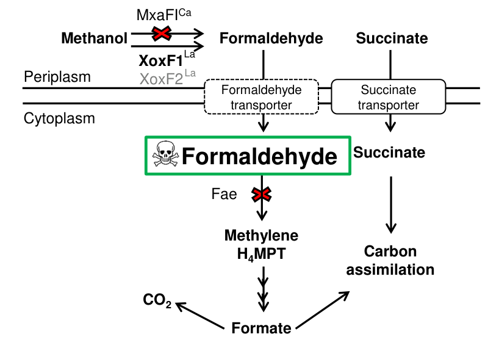

## Question

# Gene Research for Functional Annotation

## ⚠️ CRITICAL: Gene/Protein Identification Context

**BEFORE YOU BEGIN RESEARCH:** You MUST verify you are researching the CORRECT gene/protein. Gene symbols can be ambiguous, especially for less well-characterized genes from non-model organisms.

### Target Gene/Protein Identity (from UniProt):
- **UniProt Accession:** C5B120
- **Protein Description:** RecName: Full=Lanthanide-dependent methanol dehydrogenase {ECO:0000305|PubMed:23209751, ECO:0000305|PubMed:30862918}; Short=Lanthanide-dependent MDH {ECO:0000305|PubMed:23209751, ECO:0000305|PubMed:30862918}; Short=Ln(3+)-dependent MDH {ECO:0000305|PubMed:23209751, ECO:0000305|PubMed:30862918}; EC=1.1.2.10 {ECO:0000305|PubMed:23209751, ECO:0000305|PubMed:32366463}; AltName: Full=La(3+)- and PQQ-dependent MDH {ECO:0000303|PubMed:30862918}; AltName: Full=La(3+)-dependent methanol dehydrogenase {ECO:0000303|PubMed:23209751}; Short=La(3+)-dependent MDH {ECO:0000303|PubMed:23209751}; Flags: Precursor;
- **Gene Information:** Name=xoxF1 {ECO:0000303|PubMed:23209751, ECO:0000303|PubMed:32366463}; Synonyms=xoxF {ECO:0000312|EMBL:ACS39584.1}; OrderedLocusNames=MexAM1_META1p1740 {ECO:0000312|EMBL:ACS39584.1};
- **Organism (full):** Methylorubrum extorquens (strain ATCC 14718 / DSM 1338 / JCM 2805 / NCIMB 9133 / AM1) (Methylobacterium extorquens).
- **Protein Family:** Belongs to the bacterial PQQ dehydrogenase family.
- **Key Domains:** PQQ_b-propeller_rpt. (IPR018391); PQQ_MeOH/EtOH_DH. (IPR017512); PQQ_rpt_dom. (IPR002372); Quinoprotein_ADH-like_sf. (IPR011047); Quinoprotein_DH_CS. (IPR001479)

### MANDATORY VERIFICATION STEPS:

1. **Check if the gene symbol "xoxF1" matches the protein description above**
2. **Verify the organism is correct:** Methylorubrum extorquens (strain ATCC 14718 / DSM 1338 / JCM 2805 / NCIMB 9133 / AM1) (Methylobacterium extorquens).
3. **Check if protein family/domains align with what you find in literature**
4. **If you find literature for a DIFFERENT gene with the same or similar symbol, STOP**

### If Gene Symbol is Ambiguous or You Cannot Find Relevant Literature:

**DO NOT PROCEED WITH RESEARCH ON A DIFFERENT GENE.** Instead:
- State clearly: "The gene symbol 'xoxF1' is ambiguous or literature is limited for this specific protein"
- Explain what you found (e.g., "Found extensive literature on a different gene with the same symbol in a different organism")
- Describe the protein based ONLY on the UniProt information provided above
- Suggest that the protein function can be inferred from domain/family information

### Research Target:

Please provide a comprehensive research report on the gene **xoxF1** (gene ID: xoxF1, UniProt: C5B120) in METEA.

The research report should be a detailed narrative explaining the function, biological processes, and localization of the gene product. Citations should be given for all claims.

You should prioritize authoritative reviews and primary scientific literature when conducting research. You can supplement
this with annotations you find in gene/protein databases, but these can be outdated or inaccurate.

We are specifically interested in the primary function of the gene - for enzymes, what reaction is catalyzed, and what is the substrate specificity? For transporters, what is the substrate? For structural proteins or adapters, what is the broader structural role? For signaling molecules, what is the role in the pathway.

We are interested in where in or outside the cell the gene product carries out its function.

We are also interested in the signaling or biochemical pathways in which the gene functions. We are less interested in broad pleiotropic effects, except where these elucidate the precise role.

Include evidence where possible. We are interested in both experimental evidence as well as inference from structure, evolution, or bioinformatic analysis. Precise studies should be prioritized over high-throughput, where available.

## Output

Question: You are an expert researcher providing comprehensive, well-cited information.

Provide detailed information focusing on:
1. Key concepts and definitions with current understanding
2. Recent developments and latest research (prioritize 2023-2024 sources)
3. Current applications and real-world implementations
4. Expert opinions and analysis from authoritative sources
5. Relevant statistics and data from recent studies

Format as a comprehensive research report with proper citations. Include URLs and publication dates where available.
Always prioritize recent, authoritative sources and provide specific citations for all major claims.

# Gene Research for Functional Annotation

## ⚠️ CRITICAL: Gene/Protein Identification Context

**BEFORE YOU BEGIN RESEARCH:** You MUST verify you are researching the CORRECT gene/protein. Gene symbols can be ambiguous, especially for less well-characterized genes from non-model organisms.

### Target Gene/Protein Identity (from UniProt):
- **UniProt Accession:** C5B120
- **Protein Description:** RecName: Full=Lanthanide-dependent methanol dehydrogenase {ECO:0000305|PubMed:23209751, ECO:0000305|PubMed:30862918}; Short=Lanthanide-dependent MDH {ECO:0000305|PubMed:23209751, ECO:0000305|PubMed:30862918}; Short=Ln(3+)-dependent MDH {ECO:0000305|PubMed:23209751, ECO:0000305|PubMed:30862918}; EC=1.1.2.10 {ECO:0000305|PubMed:23209751, ECO:0000305|PubMed:32366463}; AltName: Full=La(3+)- and PQQ-dependent MDH {ECO:0000303|PubMed:30862918}; AltName: Full=La(3+)-dependent methanol dehydrogenase {ECO:0000303|PubMed:23209751}; Short=La(3+)-dependent MDH {ECO:0000303|PubMed:23209751}; Flags: Precursor;
- **Gene Information:** Name=xoxF1 {ECO:0000303|PubMed:23209751, ECO:0000303|PubMed:32366463}; Synonyms=xoxF {ECO:0000312|EMBL:ACS39584.1}; OrderedLocusNames=MexAM1_META1p1740 {ECO:0000312|EMBL:ACS39584.1};
- **Organism (full):** Methylorubrum extorquens (strain ATCC 14718 / DSM 1338 / JCM 2805 / NCIMB 9133 / AM1) (Methylobacterium extorquens).
- **Protein Family:** Belongs to the bacterial PQQ dehydrogenase family.
- **Key Domains:** PQQ_b-propeller_rpt. (IPR018391); PQQ_MeOH/EtOH_DH. (IPR017512); PQQ_rpt_dom. (IPR002372); Quinoprotein_ADH-like_sf. (IPR011047); Quinoprotein_DH_CS. (IPR001479)

### MANDATORY VERIFICATION STEPS:

1. **Check if the gene symbol "xoxF1" matches the protein description above**
2. **Verify the organism is correct:** Methylorubrum extorquens (strain ATCC 14718 / DSM 1338 / JCM 2805 / NCIMB 9133 / AM1) (Methylobacterium extorquens).
3. **Check if protein family/domains align with what you find in literature**
4. **If you find literature for a DIFFERENT gene with the same or similar symbol, STOP**

### If Gene Symbol is Ambiguous or You Cannot Find Relevant Literature:

**DO NOT PROCEED WITH RESEARCH ON A DIFFERENT GENE.** Instead:
- State clearly: "The gene symbol 'xoxF1' is ambiguous or literature is limited for this specific protein"
- Explain what you found (e.g., "Found extensive literature on a different gene with the same symbol in a different organism")
- Describe the protein based ONLY on the UniProt information provided above
- Suggest that the protein function can be inferred from domain/family information

### Research Target:

Please provide a comprehensive research report on the gene **xoxF1** (gene ID: xoxF1, UniProt: C5B120) in METEA.

The research report should be a detailed narrative explaining the function, biological processes, and localization of the gene product. Citations should be given for all claims.

You should prioritize authoritative reviews and primary scientific literature when conducting research. You can supplement
this with annotations you find in gene/protein databases, but these can be outdated or inaccurate.

We are specifically interested in the primary function of the gene - for enzymes, what reaction is catalyzed, and what is the substrate specificity? For transporters, what is the substrate? For structural proteins or adapters, what is the broader structural role? For signaling molecules, what is the role in the pathway.

We are interested in where in or outside the cell the gene product carries out its function.

We are also interested in the signaling or biochemical pathways in which the gene functions. We are less interested in broad pleiotropic effects, except where these elucidate the precise role.

Include evidence where possible. We are interested in both experimental evidence as well as inference from structure, evolution, or bioinformatic analysis. Precise studies should be prioritized over high-throughput, where available.

# Functional annotation report: **xoxF1** (UniProt **C5B120**; locus **MexAM1_META1p1740**) in *Methylorubrum extorquens* AM1

## 0. Target verification (gene/protein identity)
Multiple AM1-specific studies explicitly identify **xoxF1 (MexAM1_META1p1740)** as a **lanthanide (Ln)-dependent, pyrroloquinoline quinone (PQQ)-dependent methanol dehydrogenase (MDH)** that is **periplasmic** and is induced as part of the **lanthanide switch** in AM1. (vu2016lanthanidedependentregulationof pages 1-6, roszczenkojasinska2020geneproductsand pages 4-5, roszczenkojasinska2020geneproductsand pages 5-6)

## 1. Key concepts and definitions (current understanding)

### 1.1 Lanthanide-dependent methanol dehydrogenase (XoxF)
In methylotrophic Proteobacteria, methanol oxidation is mediated by periplasmic PQQ-dependent alcohol dehydrogenases. In AM1, **XoxF-type MDHs (including XoxF1)** are active when **Ln(III)** (e.g., La(III), Ce(III), Pr(III), Nd(III)) are available and oxidize **methanol → formaldehyde**, contrasting with the canonical Ca-dependent MDH system (MxaFI). (vu2016lanthanidedependentregulationof pages 1-6, roszczenkojasinska2020geneproductsand pages 4-5)

Mechanistically, lanthanides in the active site act as **Lewis acids** that facilitate hydride transfer to PQQ during alcohol oxidation. (roszczenkojasinska2020geneproductsand pages 1-4)

### 1.2 The “lanthanide switch”
The **lanthanide switch** refers to **inverse transcriptional regulation** of methanol oxidation systems: with Ln present, **xox genes** are upregulated and **mxa genes** are repressed; with Ln absent, **mxaFI** dominates. In AM1, this switch is highly sensitive to Ln concentration and involves additional regulatory complexity (including cross-dependence where xoxF genes affect mxa expression). (vu2016lanthanidedependentregulationof pages 1-6)

### 1.3 Pathway context: periplasmic oxidation + electron transfer
XoxF enzymes operate in the **periplasm** and typically couple to **c-type cytochrome electron acceptors**. In AM1, **XoxG (a cytochrome cL-like protein)** is described as transferring electrons from PQQ to downstream components of the respiratory chain, and **XoxJ** is a periplasmic binding protein implicated in XoxF activation. (roszczenkojasinska2020geneproductsand pages 4-5, roszczenkojasinska2020geneproductsand pages 5-6)

## 2. xoxF1 functional annotation (reaction, cofactors, specificity, localization)

### 2.1 Primary catalytic function and reaction
**Primary function:** XoxF1 is a **lanthanide-dependent methanol dehydrogenase** that **oxidizes methanol to formaldehyde** in AM1. This is supported by genetic and physiological evidence (formaldehyde toxicity phenotypes in *fae* backgrounds and growth dependencies on xox genes under Ln). (roszczenkojasinska2020geneproductsand pages 5-6, roszczenkojasinska2020geneproductsand pages 4-5)

**Quantitative enzymology (AM1 XoxF1):** Purified XoxF1 exhibited a low in vitro methanol oxidation activity in one assay context (**Vmax = 0.015 U/mg**). (vu2016lanthanidedependentregulationof pages 1-6)

**Family context (supporting specificity/assay behavior):** XoxF-family enzymes (including *M. extorquens* XoxF5 variants) show measurable methanol activity and PQQ-associated UV–Vis signatures, with reported kinetic parameters for one *M. extorquens* XoxF5 protein of **Vmax 12.5 ± 0.2 U/mg** and **Km 21 ± 1 mM** (methanol assay conditions as in that study). These values support the broader functional annotation of XoxF proteins as methanol dehydrogenases but are not specific to AM1 XoxF1. (huang2019rareearthelement pages 6-8)

### 2.2 Cofactors and metal dependence
XoxF1 is a **PQQ-dependent** dehydrogenase whose active site requires **Ln(III)** rather than Ca(II), distinguishing it from Ca-dependent MxaFI. (vu2016lanthanidedependentregulationof pages 1-6)

Supporting biochemical evidence includes that XoxF purified from Ln-grown cells was reported as a dimer incorporating approximately **~1.24 atoms of La** and **no Ca**, and that promoter/growth responses are sensitive to multiple Ln (La, Ce, Pr, Nd; Sm weaker). (vu2016lanthanidedependentregulationof pages 6-9, vu2016lanthanidedependentregulationof pages 1-6)

Reconstitution assays in the XoxF literature also emphasize **dual requirement for PQQ and Ln** (example conditions: 200 nM XoxF-MDH, 200 nM Ln, 200 nM PQQ, 50 mM methanol; DCPIP/PES readout), reinforcing the cofactor model. (singer2022radioactiveelementscurium pages 41-42)

### 2.3 Subcellular localization
AM1 xoxF1 is repeatedly described/annotated as **periplasmic**, consistent with the general statement that methylotrophic PQQ-ADHs are periplasmic enzymes. (vu2016lanthanidedependentregulationof pages 1-6, roszczenkojasinska2020geneproductsand pages 4-5)

A schematic model explicitly places **XoxF1 in the periplasm** catalyzing methanol oxidation in the presence of lanthanum and depicts a connected lanthanide transport pathway. (roszczenkojasinska2019lanthanidetransportstorage media 5b494616, roszczenkojasinska2019lanthanidetransportstorage media 63d6a23c)

### 2.4 Required partner proteins and supporting processes
Genetic evidence indicates that XoxF1-dependent methanol oxidation requires:
- **XoxG (cytochrome c)** and **XoxJ (periplasmic binding protein)**: loss of either phenocopies loss of xoxF1/xoxF2 for Ln-dependent methanol growth. (roszczenkojasinska2020geneproductsand pages 5-6)
- **PQQ biosynthesis** and **cytochrome c biogenesis/heme export**: disrupting these processes eliminates methanol growth regardless of La presence, consistent with a periplasmic PQQ dehydrogenase feeding electrons into cytochrome c-based respiratory components. (roszczenkojasinska2020geneproductsand pages 5-6)

## 3. Regulation and physiology in AM1 (lanthanide switch; quantitative data)

### 3.1 Lanthanide switch thresholds
In AM1, methanol growth and promoter responses occur over a wide La range:
- **Maximal growth rate and yield at ≥1 μM La**.
- Growth still detectable at **~2.5 nM La** (slower).
- **Intermediate co-expression** of mxa and xox1 promoters at **~50–100 nM La**, reflecting a graded switch. (vu2016lanthanidedependentregulationof pages 1-6)

### 3.2 Growth phenotypes of xoxF mutants (AM1)
In La-containing methanol medium:
- WT and an mxaF strain show similar growth rate ~**0.16 ± 0.01 h⁻1**.
- **ΔxoxF1** shows a lag (~6–9 h) and reduced growth rate **0.07 ± 0.00 h⁻1**.
- **ΔxoxF1 ΔxoxF2** shows stronger defect (lag ~6 h; growth rate **0.04 ± 0.01 h⁻1**). (roszczenkojasinska2020geneproductsand pages 6-7)

### 3.3 Concentration-dependent growth with different lanthanides (2024 dataset)
A 2024 study of AM1 methanol growth (125 mM methanol) reported doubling time and yield dependence on metal identity and concentration (0.1–100 μM):
- With **La³⁺**, fastest doubling ~**4.9 h at 1 μM**; higher concentrations (100 μM) slowed growth (doubling **~9.4 h**).
- With **Ce³⁺**, fastest doubling ~**2.9 h at 1 μM**; **100 μM Ce³⁺** was inhibitory (doubling **~12.4 h**, lower max OD). (warters2024widespreadbacterialuseb pages 18-23, warters2024widespreadbacterialuse pages 18-23)

These results support the concept that light lanthanides can enable rapid methylotrophic growth in AM1 but that excessive concentrations may impose stress or mis-metallation effects. (warters2024widespreadbacterialuseb pages 18-23)

## 4. Biochemical pathway integration: methanol oxidation, formaldehyde handling, and Ln homeostasis

### 4.1 Product fate and connection to downstream C1 metabolism
AM1 XoxF1/2 produce **formaldehyde** from methanol, which is toxic if it accumulates (a feature leveraged experimentally using a *fae* mutant background). (roszczenkojasinska2020geneproductsand pages 4-5, roszczenkojasinska2020geneproductsand pages 5-6)

In contrast, **ExaF** (a distinct lanthanide-dependent alcohol dehydrogenase in AM1’s broader network) is reported to oxidize methanol **to formate**, providing a bypass route that changes where formaldehyde burden appears in metabolism. (roszczenkojasinska2020geneproductsand pages 4-5, roszczenkojasinska2020geneproductsand pages 5-6)

### 4.2 Electron transfer chain context
XoxF1 is linked to cytochrome c-based electron transfer:
- **XoxG** is described as a cytochrome that accepts electrons from XoxF and passes them onward to the electron transport chain.
- **XoxD** (MxaD homolog) and **XoxJ** are implicated in supporting XoxF activation and/or interaction with electron acceptors in XoxF systems. (roszczenkojasinska2020geneproductsand pages 4-5, wegner2019lanthanidedependentmethylotrophsof pages 10-12)

### 4.3 Lanthanide uptake/utilization (lut system) and intracellular storage
AM1 requires dedicated Ln acquisition/trafficking systems for robust Ln-dependent methylotrophy:
- A **TonB-dependent receptor (LutH)** and an **ABC transporter (LutAEF)** are implicated in moving lanthanides from outside the cell to the cytoplasm, with evidence that mutants in these loci disrupt Ln-dependent growth and alter Ln localization. (roszczenkojasinska2020geneproductsand pages 4-5, roszczenkojasinska2019lanthanidetransportstorage pages 1-5)
- Microscopy/EDS evidence shows AM1 can store lanthanides as phosphate-containing deposits. One dataset reports **crystalline La–phosphate deposits** with approximate composition **La 22.2 ± 1.0%, P 15.1 ± 2.1%, O 51.1 ± 1.9%** by EDS. (roszczenkojasinska2019lanthanidetransportstorage pages 15-18)
- Stored Ln can transiently support growth after “preloading” (growth rate **0.15 ± 0.00 h⁻1**), but growth collapses after depletion (**0.01 ± 0.0 h⁻1**), consistent with a finite intracellular Ln reserve supporting XoxF activity. (roszczenkojasinska2019lanthanidetransportstorage pages 15-18)

## 5. Recent developments (prioritizing 2023–2024)

### 5.1 2023: scalable REE leaching and recovery using AM1 (real-world implementation)
Good et al. (published **Dec 2023** in *Environmental Science & Technology*; https://doi.org/10.1021/acs.est.3c06775) developed an AM1-based platform that links methanol metabolism (and thus Ln-dependent MDH function) to **rare earth element recovery** from **Nd magnet swarf** and other complex sources. (good2023scalableandconsolidated pages 4-5)

Key quantitative results include:
- **Feedstock composition (magnet swarf):** 68.0% Fe, 26.7% Nd, 4.35% Pr, 3.34% Dy. (good2023scalableandconsolidated pages 4-5)
- **Abiotic citrate leaching increases total metals in solution** (e.g., with **5 mM citrate:** REE **8.2 ± 0.1 ppm**, Fe **23.7 ± 2.5 ppm**; with **15 mM citrate:** REE **58.7 ± 0.6 ppm**, Fe **142.0 ± 3.2 ppm**), showing that organic acids can increase leaching but not necessarily selectivity. (good2023scalableandconsolidated pages 4-5)
- **Bioaccumulation selectivity:** inoculated cultures scavenged most leached REE into biomass, leaving supernatants largely Fe-dominated (~98% Fe in one condition), while intracellular metals were strongly REE-enriched (example: intracellular Fe only **2.0%** of measured intracellular metals). (good2023scalableandconsolidated pages 4-5)
- **Engineered uptake/storage improvements:** expression of a lanthanophore-related locus (“mll”) increased intracellular REE to **80 mg Nd/g DW** (plus **15 mg Pr/g DW**, **8 mg Dy/g DW**) with minimal Fe uptake; deletion of **ppx** increased to **202 mg Nd/g DW** (~5.5-fold increase). (good2023scalableandconsolidated pages 6-7)
- **Scalability and projected performance:** with citrate-fed batch reaching **OD ≈20** in a **0.75 L bioreactor**, authors projected potential Nd recovery **1.3–2.1 g Nd/L** (at 1% swarf pulp density, assuming 1% Nd in swarf), and reported 10 L scalability with similar yields. (good2023scalableandconsolidated pages 6-7, good2023scalableandconsolidated pages 4-5)

These results establish AM1 (and by extension its Ln-dependent methanol oxidation machinery including XoxF-type enzymes) as an applied chassis for **REE bioleaching/bioaccumulation** under mild conditions. (good2023scalableandconsolidated pages 6-7, good2023scalableandconsolidated pages 4-5)

### 5.2 2024: ecological distribution and biogeochemical context
Voutsinos et al. (published **Feb 2024** in *BMC Biology*; https://doi.org/10.1186/s12915-024-01841-0) performed metagenomics across a weathered granite-to-soil profile and found that **XoxF-type MDHs can be the only MDH class detectable** in these communities. (voutsinos2024weatheredgranitesand pages 10-12)

Key statistics:
- **411 distinct MDH sequences** were recovered; all were **XoxF-type**, and **no Ca-dependent MxaF MDHs** were found. (voutsinos2024weatheredgranitesand pages 2-4)
- Clade distribution: **XoxF3 (340 sequences)** dominated; **XoxF5 (63)** was less common; 8 unassigned. (voutsinos2024weatheredgranitesand pages 2-4, voutsinos2024weatheredgranitesand pages 4-7)
- In 136 high-quality dereplicated genomes, XoxF3 appeared in **43 genomes** and XoxF5 in **7 genomes**; again, no MxaF was found. (voutsinos2024weatheredgranitesand pages 4-7)
- Geochemistry: lanthanides were highest in lightly weathered granite (e.g., **427 ppm** at one site) and decreased along the profile (to **80 ppm** in soil), and lanthanide phosphate crystals were observed and inferred to dissolve during weathering—consistent with dynamic bioavailability of Ln for XoxF-dependent metabolism. (voutsinos2024weatheredgranitesand pages 7-10)

The study also identified candidate metallophore biosynthetic clusters and TonB-dependent transporters potentially linked to mobilizing poorly soluble lanthanide phosphates, providing a mechanistic bridge between rock weathering, Ln bioavailability, and XoxF-based methanol oxidation. (voutsinos2024weatheredgranitesand pages 2-4, voutsinos2024weatheredgranitesand pages 7-10)

## 6. Expert synthesis and authoritative interpretations

### 6.1 Why XoxF1 is central in AM1 physiology
AM1’s xoxF1 system is not only catalytic but also regulatory. Multiple studies report that **xoxF genes influence expression of the Ca-dependent mxaFI system**, implying a role in coordinating methanol oxidation capacity with metal availability (a hallmark of the lanthanide switch). (vu2016lanthanidedependentregulationof pages 1-6, roszczenkojasinska2020geneproductsand pages 5-6)

### 6.2 Metal selectivity and “light lanthanide preference”
Across AM1 and other methylotrophs, **light lanthanides (La–Nd; sometimes Sm weakly)** are most consistently compatible with growth and/or activity. AM1-specific work reports that both XoxF and an additional Ln-dependent methanol oxidation system can use La/Ce/Pr/Nd and to some extent Sm, while broader analyses describe growth limitations with heavier lanthanides in typical strains. (vu2016lanthanidedependentregulationof pages 1-6, good2022hyperaccumulationofgadolinium pages 1-2)

## 7. Visual evidence (pathway and localization)
A schematic model explicitly places **XoxF1 in the periplasm** (with La indicated) and depicts a **Lut-based lanthanide transport pathway** spanning the outer membrane, periplasm, and inner membrane, providing visual support for subcellular localization and pathway integration. (roszczenkojasinska2019lanthanidetransportstorage media 5b494616, roszczenkojasinska2019lanthanidetransportstorage media 63d6a23c)

## 8. Evidence map (quick reference)
| Topic | Key finding (1-2 sentences) | Quantitative data (if any) | Source (first author year, journal) | URL | Citation ID |
|---|---|---|---|---|---|
| Reaction | In *Methylorubrum extorquens* AM1, xoxF1 encodes a lanthanide-dependent methanol dehydrogenase that oxidizes methanol to formaldehyde. Genetic evidence links XoxF1/XoxF2 activity to formaldehyde accumulation phenotypes during methanol growth with lanthanides. | Purified XoxF1 methanol oxidation activity reported as Vmax = 0.015 U/mg. | Vu 2016, *Journal of Bacteriology*; Roszczenko-Jasińska 2020, *Scientific Reports* | https://doi.org/10.1128/jb.00937-15 ; https://doi.org/10.1038/s41598-020-69401-4 | (vu2016lanthanidedependentregulationof pages 1-6, roszczenkojasinska2020geneproductsand pages 5-6) |
| Cofactors | XoxF1 is a PQQ-dependent alcohol dehydrogenase that requires lanthanides rather than Ca²⁺ in the active site. Lanthanides act with PQQ in the catalytic cofactor complex and facilitate alcohol oxidation. | XoxF purified from lanthanide-grown cells incorporated ~1.24 atoms of La and lacked Ca; reconstitution assays used 200 nM enzyme, 200 nM Ln, 200 nM PQQ, 50 mM methanol. | Vu 2016, *Journal of Bacteriology*; Singer 2022, *ChemRxiv* | https://doi.org/10.1128/jb.00937-15 ; https://doi.org/10.26434/chemrxiv-2022-zn3t4 | (vu2016lanthanidedependentregulationof pages 1-6, singer2022radioactiveelementscurium pages 41-42, vu2016lanthanidedependentregulationof pages 6-9) |
| Localization | XoxF1 is described as a periplasmic PQQ-dependent alcohol dehydrogenase, consistent with methylotrophic PQQ-ADHs generally being periplasmic enzymes. It functions in a periplasm-associated lanthanide oxidation system. | No direct localization constant reported; schematic evidence places XoxF1 in the periplasm. | Roszczenko-Jasińska 2020, *Scientific Reports*; Roszczenko-Jasińska 2019, *bioRxiv* | https://doi.org/10.1038/s41598-020-69401-4 ; https://doi.org/10.1101/647677 | (roszczenkojasinska2020geneproductsand pages 1-4, roszczenkojasinska2020geneproductsand pages 4-5, roszczenkojasinska2019lanthanidetransportstorage pages 48-53, roszczenkojasinska2019lanthanidetransportstorage media 5b494616) |
| Regulation | AM1 exhibits a lanthanide switch in which lanthanides upregulate the xox1 operon and repress the Ca-dependent mxa operon. XoxF proteins also appear necessary for proper expression of MxaFI, indicating a regulatory role beyond catalysis. | Growth reaches maximum rate/yield at ≥1 μM La; growth still occurs at ~2.5 nM La but more slowly; intermediate mxa/xox1 co-expression occurs at 50–100 nM La. | Vu 2016, *Journal of Bacteriology*; Roszczenko-Jasińska 2020, *Scientific Reports* | https://doi.org/10.1128/jb.00937-15 ; https://doi.org/10.1038/s41598-020-69401-4 | (vu2016lanthanidedependentregulationof pages 1-6, roszczenkojasinska2020geneproductsand pages 5-6, roszczenkojasinska2020geneproductsand pages 6-7) |
| Growth data | Loss of xoxF1 reduces methanol-growth performance in lanthanide-containing medium, and double loss of xoxF1/xoxF2 causes a stronger defect. Wild type and mxaF mutants grow similarly under La³⁺, showing XoxF-mediated methanol oxidation can support growth. | WT and mxaF growth rates ~0.16 ± 0.01 h⁻¹; xoxF1 0.07 ± 0.00 h⁻¹ with 6–9 h lag; xoxF1 xoxF2 0.04 ± 0.01 h⁻¹ with ~6 h lag. | Roszczenko-Jasińska 2020, *Scientific Reports* | https://doi.org/10.1038/s41598-020-69401-4 | (roszczenkojasinska2020geneproductsand pages 6-7) |
| Metal specificity | AM1 XoxF systems primarily use light lanthanides. La, Ce, Pr, and Nd support the lanthanide switch and methanol growth, while Sm is less effective and heavier lanthanides generally do not support growth in the wild type. | Light Ln range noted as La–Sm (atomic numbers 57–62); growth with Sm is slower; heavier Ln usually do not support growth. | Vu 2016, *Journal of Bacteriology*; Good 2022, *Frontiers in Microbiology* | https://doi.org/10.1128/jb.00937-15 ; https://doi.org/10.3389/fmicb.2022.820327 | (vu2016lanthanidedependentregulationof pages 1-6, good2022hyperaccumulationofgadolinium pages 1-2) |
| Partners | XoxF1 functions with accessory proteins including XoxG, a cytochrome c electron acceptor, and XoxJ, a periplasmic binding protein; both are required for efficient XoxF-dependent methanol oxidation. PQQ biosynthesis and cytochrome c biogenesis genes are also essential for the pathway. | Transposon screen recovered >600 mutants; genes identified independently ≥4 times were prioritized. | Roszczenko-Jasińska 2020, *Scientific Reports*; Roszczenko-Jasińska 2019, *bioRxiv* | https://doi.org/10.1038/s41598-020-69401-4 ; https://doi.org/10.1101/647677 | (roszczenkojasinska2020geneproductsand pages 5-6, roszczenkojasinska2019lanthanidetransportstorage pages 15-18, wegner2019lanthanidedependentmethylotrophsof pages 10-12) |
| Applications | The xoxF1-centered lanthanide methylotrophy system underpins AM1-based rare-earth bioaccumulation, biomining, and potentially MRI/bioremediation technologies. Engineering lanthanide uptake, lanthanophore production, PQQ biosynthesis, and phosphate metabolism enhances recovery from waste sources. | evo-HLn hyperaccumulated Gd ~36-fold; AM1-based REE recovery was scaled to 10 L; whole-cell MRI contrast was observed in Gd-hyperaccumulating cells. | Good 2022, *Frontiers in Microbiology*; Good 2023, *Environmental Science & Technology* | https://doi.org/10.3389/fmicb.2022.820327 ; https://doi.org/10.1021/acs.est.3c06775 | (good2022hyperaccumulationofgadolinium pages 1-2) |
| Comparative enzymology | Broader XoxF literature supports that REE-dependent XoxF enzymes are active methanol dehydrogenases with PQQ-like spectral signatures, alkaline assay optima, and measurable methanol activities, reinforcing the family assignment for AM1 XoxF1. These data are supportive but not AM1 xoxF1-specific kinetics. | Example XoxF5_M.e.1 kinetics: Vmax 12.5 ± 0.2 U mg⁻¹, Km 21 ± 1 mM, Keff 1,252 ± 135 s⁻¹ mM⁻¹; UV-Vis maximum ~355 nm. | Huang 2019, *The ISME Journal* | https://doi.org/10.1038/s41396-019-0414-z | (huang2019rareearthelement pages 6-8) |
| Recent ecosystem-scale growth data | A 2024 ecosystem-oriented study using AM1 showed concentration-dependent growth responses to Ca²⁺ and individual lanthanides, illustrating that moderate light-lanthanide concentrations can support fast methanol growth while higher concentrations can become inhibitory. | With 125 mM methanol: La³⁺ fastest doubling 4.9 h at 1 μM; Ce³⁺ fastest doubling 2.9 h at 1 μM; 100 μM Ce³⁺ slowed doubling to 12.4 h; Ca²⁺ fastest doubling 3.7 h at 10 μM. | Warters 2024, unknown journal/thesis source | Not available from citation metadata | (warters2024widespreadbacterialuseb pages 18-23, warters2024widespreadbacterialuse pages 18-23, warters2024widespreadbacterialusea pages 18-23) |

*Table: This table compiles key functional-annotation evidence for xoxF1 (UniProt C5B120) in *Methylorubrum extorquens* AM1, covering reaction chemistry, cofactors, localization, regulation, growth phenotypes, partner proteins, metal specificity, and applications. It is designed as a quick-reference evidence map tied directly to available citation IDs.*

## 9. Key takeaways for functional annotation
1. **Molecular function:** lanthanide- and PQQ-dependent methanol dehydrogenase; catalyzes **methanol → formaldehyde** in AM1’s periplasm. (vu2016lanthanidedependentregulationof pages 1-6, roszczenkojasinska2020geneproductsand pages 4-5)
2. **Cofactors:** requires **PQQ + Ln(III)** (La/Ce/Pr/Nd most supported); distinct from Ca-dependent MxaFI. (vu2016lanthanidedependentregulationof pages 1-6, vu2016lanthanidedependentregulationof pages 6-9)
3. **Localization:** **periplasmic**; connected to cytochrome c electron transfer via **XoxG** and requires accessory **XoxJ** for function. (roszczenkojasinska2020geneproductsand pages 4-5, roszczenkojasinska2020geneproductsand pages 5-6, roszczenkojasinska2019lanthanidetransportstorage media 5b494616)
4. **Biological process:** methanol oxidation in methylotrophic growth; tightly integrated with formaldehyde handling (toxicity in *fae* background) and Ln uptake/storage (lut system; phosphate-like deposits). (roszczenkojasinska2020geneproductsand pages 4-5, roszczenkojasinska2019lanthanidetransportstorage pages 15-18)
5. **Regulation:** part of the **lanthanide switch** controlling xox vs mxa expression; switch responds to nM–µM Ln and can show intermediate promoter co-expression. (vu2016lanthanidedependentregulationof pages 1-6)
6. **Applications (2023–2024):** AM1-based **REE recovery** at bench scale up to **10 L**, with engineered strains achieving high Nd accumulation (e.g., **202 mg Nd/g DW**) and projected **g/L**-scale recovery under high-density cultivation; ecosystem studies show XoxF-based methylotrophy may dominate in certain mineral-rich environments. (good2023scalableandconsolidated pages 6-7, voutsinos2024weatheredgranitesand pages 7-10)

References

1. (vu2016lanthanidedependentregulationof pages 1-6): Huong N. Vu, Gabriel A. Subuyuj, Srividhya Vijayakumar, Nathan M. Good, N. Cecilia Martinez-Gomez, and Elizabeth Skovran. Lanthanide-dependent regulation of methanol oxidation systems in methylobacterium extorquens am1 and their contribution to methanol growth. Journal of Bacteriology, 198:1250-1259, Apr 2016. URL: https://doi.org/10.1128/jb.00937-15, doi:10.1128/jb.00937-15. This article has 227 citations and is from a peer-reviewed journal.

2. (roszczenkojasinska2020geneproductsand pages 4-5): Paula Roszczenko-Jasińska, Huong N. Vu, Gabriel A. Subuyuj, Ralph Valentine Crisostomo, James Cai, Nicholas F. Lien, Erik J. Clippard, Elena M. Ayala, Richard T. Ngo, Fauna Yarza, Justin P. Wingett, Charumathi Raghuraman, Caitlin A. Hoeber, Norma C. Martinez-Gomez, and Elizabeth Skovran. Gene products and processes contributing to lanthanide homeostasis and methanol metabolism in methylorubrum extorquens am1. Scientific Reports, Jul 2020. URL: https://doi.org/10.1038/s41598-020-69401-4, doi:10.1038/s41598-020-69401-4. This article has 98 citations and is from a peer-reviewed journal.

3. (roszczenkojasinska2020geneproductsand pages 5-6): Paula Roszczenko-Jasińska, Huong N. Vu, Gabriel A. Subuyuj, Ralph Valentine Crisostomo, James Cai, Nicholas F. Lien, Erik J. Clippard, Elena M. Ayala, Richard T. Ngo, Fauna Yarza, Justin P. Wingett, Charumathi Raghuraman, Caitlin A. Hoeber, Norma C. Martinez-Gomez, and Elizabeth Skovran. Gene products and processes contributing to lanthanide homeostasis and methanol metabolism in methylorubrum extorquens am1. Scientific Reports, Jul 2020. URL: https://doi.org/10.1038/s41598-020-69401-4, doi:10.1038/s41598-020-69401-4. This article has 98 citations and is from a peer-reviewed journal.

4. (roszczenkojasinska2020geneproductsand pages 1-4): Paula Roszczenko-Jasińska, Huong N. Vu, Gabriel A. Subuyuj, Ralph Valentine Crisostomo, James Cai, Nicholas F. Lien, Erik J. Clippard, Elena M. Ayala, Richard T. Ngo, Fauna Yarza, Justin P. Wingett, Charumathi Raghuraman, Caitlin A. Hoeber, Norma C. Martinez-Gomez, and Elizabeth Skovran. Gene products and processes contributing to lanthanide homeostasis and methanol metabolism in methylorubrum extorquens am1. Scientific Reports, Jul 2020. URL: https://doi.org/10.1038/s41598-020-69401-4, doi:10.1038/s41598-020-69401-4. This article has 98 citations and is from a peer-reviewed journal.

5. (huang2019rareearthelement pages 6-8): Jing Huang, Zheng Yu, Joseph Groom, Jan-Fang Cheng, Angela Tarver, Yasuo Yoshikuni, and Ludmila Chistoserdova. Rare earth element alcohol dehydrogenases widely occur among globally distributed, numerically abundant and environmentally important microbes. The ISME Journal, 13:2005-2017, Apr 2019. URL: https://doi.org/10.1038/s41396-019-0414-z, doi:10.1038/s41396-019-0414-z. This article has 83 citations.

6. (vu2016lanthanidedependentregulationof pages 6-9): Huong N. Vu, Gabriel A. Subuyuj, Srividhya Vijayakumar, Nathan M. Good, N. Cecilia Martinez-Gomez, and Elizabeth Skovran. Lanthanide-dependent regulation of methanol oxidation systems in methylobacterium extorquens am1 and their contribution to methanol growth. Journal of Bacteriology, 198:1250-1259, Apr 2016. URL: https://doi.org/10.1128/jb.00937-15, doi:10.1128/jb.00937-15. This article has 227 citations and is from a peer-reviewed journal.

7. (singer2022radioactiveelementscurium pages 41-42): Helena Singer, Robin Steudtner, Andreas Klein, Carolin Rulofs, Cathleen Zeymer, Björn Drobot, Arjan Pol, Norma Cecilia Martinez-Gomez, Huub Op den Camp, and Lena Daumann. Radioactive elements curium and americium support methylotrophic bacterial life. ChemRxiv, Jun 2022. URL: https://doi.org/10.26434/chemrxiv-2022-zn3t4, doi:10.26434/chemrxiv-2022-zn3t4. This article has 2 citations.

8. (roszczenkojasinska2019lanthanidetransportstorage media 5b494616): Paula Roszczenko-Jasińska, Huong N. Vu, Gabriel A. Subuyuj, Ralph Valentine Crisostomo, Elena M. Ayala, James Cai, Nicholas F. Lien, Erik J. Clippard, Richard T. Ngo, Fauna Yarza, Justin P. Wingett, Charumathi Raghuraman, Caitlin A. Hoeber, Norma C. Martinez-Gomez, and Elizabeth Skovran. Lanthanide transport, storage, and beyond: genes and processes contributing to xoxf function in methylorubrum extorquens am1. bioRxiv, May 2019. URL: https://doi.org/10.1101/647677, doi:10.1101/647677. This article has 11 citations.

9. (roszczenkojasinska2019lanthanidetransportstorage media 63d6a23c): Paula Roszczenko-Jasińska, Huong N. Vu, Gabriel A. Subuyuj, Ralph Valentine Crisostomo, Elena M. Ayala, James Cai, Nicholas F. Lien, Erik J. Clippard, Richard T. Ngo, Fauna Yarza, Justin P. Wingett, Charumathi Raghuraman, Caitlin A. Hoeber, Norma C. Martinez-Gomez, and Elizabeth Skovran. Lanthanide transport, storage, and beyond: genes and processes contributing to xoxf function in methylorubrum extorquens am1. bioRxiv, May 2019. URL: https://doi.org/10.1101/647677, doi:10.1101/647677. This article has 11 citations.

10. (roszczenkojasinska2020geneproductsand pages 6-7): Paula Roszczenko-Jasińska, Huong N. Vu, Gabriel A. Subuyuj, Ralph Valentine Crisostomo, James Cai, Nicholas F. Lien, Erik J. Clippard, Elena M. Ayala, Richard T. Ngo, Fauna Yarza, Justin P. Wingett, Charumathi Raghuraman, Caitlin A. Hoeber, Norma C. Martinez-Gomez, and Elizabeth Skovran. Gene products and processes contributing to lanthanide homeostasis and methanol metabolism in methylorubrum extorquens am1. Scientific Reports, Jul 2020. URL: https://doi.org/10.1038/s41598-020-69401-4, doi:10.1038/s41598-020-69401-4. This article has 98 citations and is from a peer-reviewed journal.

11. (warters2024widespreadbacterialuseb pages 18-23): L Warters. Widespread bacterial use of lanthanides for methylotrophy across ecosystems. Unknown journal, 2024.

12. (warters2024widespreadbacterialuse pages 18-23): L Warters. Widespread bacterial use of lanthanides for methylotrophy across ecosystems. Unknown journal, 2024.

13. (wegner2019lanthanidedependentmethylotrophsof pages 10-12): Carl-Eric Wegner, Linda Gorniak, Stefan Riedel, Martin Westermann, and Kirsten Küsel. Lanthanide-dependent methylotrophs of the family <i>beijerinckiaceae</i> : physiological and genomic insights. Applied and Environmental Microbiology, Dec 2019. URL: https://doi.org/10.1128/aem.01830-19, doi:10.1128/aem.01830-19. This article has 48 citations and is from a peer-reviewed journal.

14. (roszczenkojasinska2019lanthanidetransportstorage pages 1-5): Paula Roszczenko-Jasińska, Huong N. Vu, Gabriel A. Subuyuj, Ralph Valentine Crisostomo, Elena M. Ayala, James Cai, Nicholas F. Lien, Erik J. Clippard, Richard T. Ngo, Fauna Yarza, Justin P. Wingett, Charumathi Raghuraman, Caitlin A. Hoeber, Norma C. Martinez-Gomez, and Elizabeth Skovran. Lanthanide transport, storage, and beyond: genes and processes contributing to xoxf function in methylorubrum extorquens am1. bioRxiv, May 2019. URL: https://doi.org/10.1101/647677, doi:10.1101/647677. This article has 11 citations.

15. (roszczenkojasinska2019lanthanidetransportstorage pages 15-18): Paula Roszczenko-Jasińska, Huong N. Vu, Gabriel A. Subuyuj, Ralph Valentine Crisostomo, Elena M. Ayala, James Cai, Nicholas F. Lien, Erik J. Clippard, Richard T. Ngo, Fauna Yarza, Justin P. Wingett, Charumathi Raghuraman, Caitlin A. Hoeber, Norma C. Martinez-Gomez, and Elizabeth Skovran. Lanthanide transport, storage, and beyond: genes and processes contributing to xoxf function in methylorubrum extorquens am1. bioRxiv, May 2019. URL: https://doi.org/10.1101/647677, doi:10.1101/647677. This article has 11 citations.

16. (good2023scalableandconsolidated pages 4-5): Nathan M. Good, Christina S. Kang-Yun, Morgan Z. Su, Alexa M. Zytnick, Colin C. Barber, Huong N. Vu, Joseph M. Grace, Hoang H. Nguyen, Wenjun Zhang, Elizabeth Skovran, Maohong Fan, Dan M. Park, and Norma Cecilia Martinez-Gomez. Scalable and consolidated microbial platform for rare earth element leaching and recovery from waste sources. Environmental Science & Technology, 58:570-579, Dec 2023. URL: https://doi.org/10.1021/acs.est.3c06775, doi:10.1021/acs.est.3c06775. This article has 41 citations and is from a domain leading peer-reviewed journal.

17. (good2023scalableandconsolidated pages 6-7): Nathan M. Good, Christina S. Kang-Yun, Morgan Z. Su, Alexa M. Zytnick, Colin C. Barber, Huong N. Vu, Joseph M. Grace, Hoang H. Nguyen, Wenjun Zhang, Elizabeth Skovran, Maohong Fan, Dan M. Park, and Norma Cecilia Martinez-Gomez. Scalable and consolidated microbial platform for rare earth element leaching and recovery from waste sources. Environmental Science & Technology, 58:570-579, Dec 2023. URL: https://doi.org/10.1021/acs.est.3c06775, doi:10.1021/acs.est.3c06775. This article has 41 citations and is from a domain leading peer-reviewed journal.

18. (voutsinos2024weatheredgranitesand pages 10-12): Marcos Y. Voutsinos, Jacob A. West-Roberts, Rohan Sachdeva, John W. Moreau, and Jillian F. Banfield. Weathered granites and soils harbour microbes with lanthanide-dependent methylotrophic enzymes. BMC Biology, Feb 2024. URL: https://doi.org/10.1186/s12915-024-01841-0, doi:10.1186/s12915-024-01841-0. This article has 13 citations and is from a domain leading peer-reviewed journal.

19. (voutsinos2024weatheredgranitesand pages 2-4): Marcos Y. Voutsinos, Jacob A. West-Roberts, Rohan Sachdeva, John W. Moreau, and Jillian F. Banfield. Weathered granites and soils harbour microbes with lanthanide-dependent methylotrophic enzymes. BMC Biology, Feb 2024. URL: https://doi.org/10.1186/s12915-024-01841-0, doi:10.1186/s12915-024-01841-0. This article has 13 citations and is from a domain leading peer-reviewed journal.

20. (voutsinos2024weatheredgranitesand pages 4-7): Marcos Y. Voutsinos, Jacob A. West-Roberts, Rohan Sachdeva, John W. Moreau, and Jillian F. Banfield. Weathered granites and soils harbour microbes with lanthanide-dependent methylotrophic enzymes. BMC Biology, Feb 2024. URL: https://doi.org/10.1186/s12915-024-01841-0, doi:10.1186/s12915-024-01841-0. This article has 13 citations and is from a domain leading peer-reviewed journal.

21. (voutsinos2024weatheredgranitesand pages 7-10): Marcos Y. Voutsinos, Jacob A. West-Roberts, Rohan Sachdeva, John W. Moreau, and Jillian F. Banfield. Weathered granites and soils harbour microbes with lanthanide-dependent methylotrophic enzymes. BMC Biology, Feb 2024. URL: https://doi.org/10.1186/s12915-024-01841-0, doi:10.1186/s12915-024-01841-0. This article has 13 citations and is from a domain leading peer-reviewed journal.

22. (good2022hyperaccumulationofgadolinium pages 1-2): Nathan M. Good, Harvey D. Lee, Emily R. Hawker, Morgan Z. Su, Assaf A. Gilad, and N. Cecilia Martinez-Gomez. Hyperaccumulation of gadolinium by methylorubrum extorquens am1 reveals impacts of lanthanides on cellular processes beyond methylotrophy. Frontiers in Microbiology, Mar 2022. URL: https://doi.org/10.3389/fmicb.2022.820327, doi:10.3389/fmicb.2022.820327. This article has 38 citations and is from a peer-reviewed journal.

23. (roszczenkojasinska2019lanthanidetransportstorage pages 48-53): Paula Roszczenko-Jasińska, Huong N. Vu, Gabriel A. Subuyuj, Ralph Valentine Crisostomo, Elena M. Ayala, James Cai, Nicholas F. Lien, Erik J. Clippard, Richard T. Ngo, Fauna Yarza, Justin P. Wingett, Charumathi Raghuraman, Caitlin A. Hoeber, Norma C. Martinez-Gomez, and Elizabeth Skovran. Lanthanide transport, storage, and beyond: genes and processes contributing to xoxf function in methylorubrum extorquens am1. bioRxiv, May 2019. URL: https://doi.org/10.1101/647677, doi:10.1101/647677. This article has 11 citations.

24. (warters2024widespreadbacterialusea pages 18-23): L Warters. Widespread bacterial use of lanthanides for methylotrophy across ecosystems. Unknown journal, 2024.

## Artifacts

- [Edison artifact artifact-00](xoxF1-deep-research-falcon_artifacts/artifact-00.md)

## Citations

1. roszczenkojasinska2020geneproductsand pages 1-4
2. vu2016lanthanidedependentregulationof pages 1-6
3. huang2019rareearthelement pages 6-8
4. singer2022radioactiveelementscurium pages 41-42
5. roszczenkojasinska2020geneproductsand pages 5-6
6. roszczenkojasinska2020geneproductsand pages 6-7
7. warters2024widespreadbacterialuseb pages 18-23
8. roszczenkojasinska2019lanthanidetransportstorage pages 15-18
9. good2023scalableandconsolidated pages 4-5
10. good2023scalableandconsolidated pages 6-7
11. voutsinos2024weatheredgranitesand pages 10-12
12. voutsinos2024weatheredgranitesand pages 2-4
13. voutsinos2024weatheredgranitesand pages 4-7
14. voutsinos2024weatheredgranitesand pages 7-10
15. good2022hyperaccumulationofgadolinium pages 1-2
16. roszczenkojasinska2020geneproductsand pages 4-5
17. vu2016lanthanidedependentregulationof pages 6-9
18. warters2024widespreadbacterialuse pages 18-23
19. wegner2019lanthanidedependentmethylotrophsof pages 10-12
20. roszczenkojasinska2019lanthanidetransportstorage pages 1-5
21. roszczenkojasinska2019lanthanidetransportstorage pages 48-53
22. warters2024widespreadbacterialusea pages 18-23
23. https://doi.org/10.1021/acs.est.3c06775
24. https://doi.org/10.1186/s12915-024-01841-0
25. https://doi.org/10.1128/jb.00937-15
26. https://doi.org/10.1038/s41598-020-69401-4
27. https://doi.org/10.26434/chemrxiv-2022-zn3t4
28. https://doi.org/10.1101/647677
29. https://doi.org/10.3389/fmicb.2022.820327
30. https://doi.org/10.1038/s41396-019-0414-z
31. https://doi.org/10.1128/jb.00937-15,
32. https://doi.org/10.1038/s41598-020-69401-4,
33. https://doi.org/10.1038/s41396-019-0414-z,
34. https://doi.org/10.26434/chemrxiv-2022-zn3t4,
35. https://doi.org/10.1101/647677,
36. https://doi.org/10.1128/aem.01830-19,
37. https://doi.org/10.1021/acs.est.3c06775,
38. https://doi.org/10.1186/s12915-024-01841-0,
39. https://doi.org/10.3389/fmicb.2022.820327,