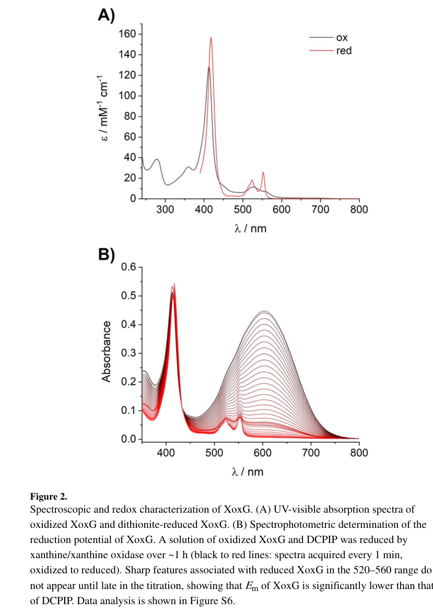

## Question

# Gene Research for Functional Annotation

## ⚠️ CRITICAL: Gene/Protein Identification Context

**BEFORE YOU BEGIN RESEARCH:** You MUST verify you are researching the CORRECT gene/protein. Gene symbols can be ambiguous, especially for less well-characterized genes from non-model organisms.

### Target Gene/Protein Identity (from UniProt):
- **UniProt Accession:** C5B121
- **Protein Description:** SubName: Full=Cytochrome c {ECO:0000313|EMBL:ACS39585.1};
- **Gene Information:** Name=xoxG {ECO:0000313|EMBL:ACS39585.1}; OrderedLocusNames=MexAM1_META1p1741 {ECO:0000313|EMBL:ACS39585.1};
- **Organism (full):** Methylorubrum extorquens (strain ATCC 14718 / DSM 1338 / JCM 2805 / NCIMB 9133 / AM1) (Methylobacterium extorquens).
- **Protein Family:** Not specified in UniProt
- **Key Domains:** C-typ_cyt_methanol_metab-rel. (IPR022411); Cyt_c-like_dom. (IPR009056); Cyt_c-like_dom_sf. (IPR036909); Cytochrome_CBB3 (PF13442)

### MANDATORY VERIFICATION STEPS:

1. **Check if the gene symbol "xoxG" matches the protein description above**
2. **Verify the organism is correct:** Methylorubrum extorquens (strain ATCC 14718 / DSM 1338 / JCM 2805 / NCIMB 9133 / AM1) (Methylobacterium extorquens).
3. **Check if protein family/domains align with what you find in literature**
4. **If you find literature for a DIFFERENT gene with the same or similar symbol, STOP**

### If Gene Symbol is Ambiguous or You Cannot Find Relevant Literature:

**DO NOT PROCEED WITH RESEARCH ON A DIFFERENT GENE.** Instead:
- State clearly: "The gene symbol 'xoxG' is ambiguous or literature is limited for this specific protein"
- Explain what you found (e.g., "Found extensive literature on a different gene with the same symbol in a different organism")
- Describe the protein based ONLY on the UniProt information provided above
- Suggest that the protein function can be inferred from domain/family information

### Research Target:

Please provide a comprehensive research report on the gene **xoxG** (gene ID: xoxG, UniProt: C5B121) in METEA.

The research report should be a detailed narrative explaining the function, biological processes, and localization of the gene product. Citations should be given for all claims.

You should prioritize authoritative reviews and primary scientific literature when conducting research. You can supplement
this with annotations you find in gene/protein databases, but these can be outdated or inaccurate.

We are specifically interested in the primary function of the gene - for enzymes, what reaction is catalyzed, and what is the substrate specificity? For transporters, what is the substrate? For structural proteins or adapters, what is the broader structural role? For signaling molecules, what is the role in the pathway.

We are interested in where in or outside the cell the gene product carries out its function.

We are also interested in the signaling or biochemical pathways in which the gene functions. We are less interested in broad pleiotropic effects, except where these elucidate the precise role.

Include evidence where possible. We are interested in both experimental evidence as well as inference from structure, evolution, or bioinformatic analysis. Precise studies should be prioritized over high-throughput, where available.

## Output

Question: You are an expert researcher providing comprehensive, well-cited information.

Provide detailed information focusing on:
1. Key concepts and definitions with current understanding
2. Recent developments and latest research (prioritize 2023-2024 sources)
3. Current applications and real-world implementations
4. Expert opinions and analysis from authoritative sources
5. Relevant statistics and data from recent studies

Format as a comprehensive research report with proper citations. Include URLs and publication dates where available.
Always prioritize recent, authoritative sources and provide specific citations for all major claims.

# Gene Research for Functional Annotation

## ⚠️ CRITICAL: Gene/Protein Identification Context

**BEFORE YOU BEGIN RESEARCH:** You MUST verify you are researching the CORRECT gene/protein. Gene symbols can be ambiguous, especially for less well-characterized genes from non-model organisms.

### Target Gene/Protein Identity (from UniProt):
- **UniProt Accession:** C5B121
- **Protein Description:** SubName: Full=Cytochrome c {ECO:0000313|EMBL:ACS39585.1};
- **Gene Information:** Name=xoxG {ECO:0000313|EMBL:ACS39585.1}; OrderedLocusNames=MexAM1_META1p1741 {ECO:0000313|EMBL:ACS39585.1};
- **Organism (full):** Methylorubrum extorquens (strain ATCC 14718 / DSM 1338 / JCM 2805 / NCIMB 9133 / AM1) (Methylobacterium extorquens).
- **Protein Family:** Not specified in UniProt
- **Key Domains:** C-typ_cyt_methanol_metab-rel. (IPR022411); Cyt_c-like_dom. (IPR009056); Cyt_c-like_dom_sf. (IPR036909); Cytochrome_CBB3 (PF13442)

### MANDATORY VERIFICATION STEPS:

1. **Check if the gene symbol "xoxG" matches the protein description above**
2. **Verify the organism is correct:** Methylorubrum extorquens (strain ATCC 14718 / DSM 1338 / JCM 2805 / NCIMB 9133 / AM1) (Methylobacterium extorquens).
3. **Check if protein family/domains align with what you find in literature**
4. **If you find literature for a DIFFERENT gene with the same or similar symbol, STOP**

### If Gene Symbol is Ambiguous or You Cannot Find Relevant Literature:

**DO NOT PROCEED WITH RESEARCH ON A DIFFERENT GENE.** Instead:
- State clearly: "The gene symbol 'xoxG' is ambiguous or literature is limited for this specific protein"
- Explain what you found (e.g., "Found extensive literature on a different gene with the same symbol in a different organism")
- Describe the protein based ONLY on the UniProt information provided above
- Suggest that the protein function can be inferred from domain/family information

### Research Target:

Please provide a comprehensive research report on the gene **xoxG** (gene ID: xoxG, UniProt: C5B121) in METEA.

The research report should be a detailed narrative explaining the function, biological processes, and localization of the gene product. Citations should be given for all claims.

You should prioritize authoritative reviews and primary scientific literature when conducting research. You can supplement
this with annotations you find in gene/protein databases, but these can be outdated or inaccurate.

We are specifically interested in the primary function of the gene - for enzymes, what reaction is catalyzed, and what is the substrate specificity? For transporters, what is the substrate? For structural proteins or adapters, what is the broader structural role? For signaling molecules, what is the role in the pathway.

We are interested in where in or outside the cell the gene product carries out its function.

We are also interested in the signaling or biochemical pathways in which the gene functions. We are less interested in broad pleiotropic effects, except where these elucidate the precise role.

Include evidence where possible. We are interested in both experimental evidence as well as inference from structure, evolution, or bioinformatic analysis. Precise studies should be prioritized over high-throughput, where available.

## Research report: functional annotation of **xoxG** (UniProt **C5B121**; locus **MexAM1_META1p1741**) in *Methylorubrum extorquens* AM1

### 1) Mandatory identity verification (to avoid symbol ambiguity)

**Target identity confirmed.** In *Methylorubrum extorquens* AM1 (formerly *Methylobacterium extorquens* AM1), **xoxG** (MexAM1_META1p1741; UniProt C5B121) is genomically adjacent to **xoxF1** (META1_1740) and **xoxJ** (META1_1742), forming an **xoxF–xoxG–xoxJ** module that mirrors the organization of the canonical calcium-dependent **mxaFJG…** methanol dehydrogenase gene cluster, strongly indicating that XoxG is the cognate cytochrome partner for the XoxF methanol dehydrogenase system in this organism (schmidt2010functionalinvestigationof pages 37-39, roszczenkojasinska2020geneproductsand pages 5-6).

This annotation is experimentally supported: XoxG is a **periplasmic, heme c–binding cytochrome** purified from the periplasmic fraction with a **cleaved signal peptide**, and it functions as the **physiological electron acceptor** for lanthanide-dependent XoxF methanol dehydrogenase activity (featherston2019biochemicalandstructural pages 4-6, featherston2019biochemicalandstructural pages 1-3).

### 2) Key concepts and definitions (current understanding)

#### 2.1 Lanthanide-dependent methanol dehydrogenase (XoxF system)
In methylotrophic bacteria, methanol oxidation is initiated by a PQQ-dependent periplasmic alcohol dehydrogenase. In AM1, XoxF-type MDHs are part of a lanthanide-dependent oxidation system, encoded in a module that typically includes:
- **XoxF**: the PQQ-dependent dehydrogenase (lanthanide cofactor in the active site)
- **XoxG**: a **c-type cytochrome** acting as the **electron acceptor** from XoxF
- **XoxJ**: a periplasmic binding protein of unclear function, genetically essential for effective XoxF-dependent growth in AM1 (roszczenkojasinska2020geneproductsand pages 5-6, featherston2019biochemicalandstructural pages 6-7)

A central point for functional annotation is that for PQQ-dependent periplasmic MDHs, catalysis is physiologically coupled to **electron transfer to a cytochrome c** partner, rather than to artificial dyes often used in vitro; therefore, identifying and characterizing the cognate cytochrome (XoxG) is essential for understanding in vivo activity and metal dependence (featherston2019biochemicalandstructural pages 4-6, featherston2019biochemicalandstructural pages 9-10).

#### 2.2 Definition of XoxG in AM1
**XoxG (C5B121)** is best defined as a **periplasmic monoheme class I c-type cytochrome** that serves as the **physiological electron acceptor (“cytochrome cL-like” partner)** for lanthanide-dependent XoxF MDH activity, forming a periplasmic electron-transfer relay to the respiratory chain (featherston2019biochemicalandstructural pages 1-3, featherston2019biochemicalandstructural pages 4-6).

### 3) Mechanistic function: reaction context, electron flow, and pathway placement

#### 3.1 Primary function of XoxG
**Primary role:** accept electrons generated during **methanol oxidation by XoxF**. Featherston et al. explicitly assayed XoxF activity using **purified XoxG** as the electron acceptor and describe XoxG as the “physiological electron acceptor” for XoxF (featherston2019biochemicalandstructural pages 1-3, featherston2019biochemicalandstructural pages 4-6).

In AM1, this places XoxG downstream of the XoxF-catalyzed oxidation step and upstream of later electron transport steps; while the downstream membrane components are not enumerated in the extracted text, the functional model is that XoxG transfers electrons onward into the respiratory chain (consistent with established MDH–cytochrome coupling in periplasmic PQQ dehydrogenases) (featherston2019biochemicalandstructural pages 1-3, schmidt2010functionalinvestigationof pages 37-39).

#### 3.2 Functional tuning to lanthanide identity (expert mechanistic interpretation)
A key expert interpretation from Featherston et al. is that **XoxG’s redox properties are tuned to the redox chemistry of the lanthanide–PQQ cofactor in XoxF**, especially favoring lighter lanthanides.
- XoxG has an **unusually low reduction potential** (see quantitative details below), and the authors propose a chemical rationale: the stronger Lewis acidity of lanthanides (vs Ca) makes methanol oxidation more favorable in Ln-MDHs, and thus XoxG can operate at a lower potential while still extracting electrons effectively (featherston2019biochemicalandstructural pages 7-9, featherston2019biochemicalandstructural pages 4-6).
- The observed **increase in XoxF’s apparent Km for XoxG** when XoxF is metallated with progressively heavier/more Lewis-acidic lanthanides is interpreted as reflecting changes in the reduction potential of the Ln–PQQ cofactor that reduce electron-transfer efficiency, thereby requiring more XoxG to achieve maximal rates (featherston2019biochemicalandstructural pages 9-10).

These points are “expert opinion/analysis” in the sense that they synthesize biochemical measurements with redox/coordination chemistry to propose the governing mechanism, and they are grounded in experimental comparisons of XoxG-linked vs dye-linked assays (featherston2019biochemicalandstructural pages 4-6, featherston2019biochemicalandstructural pages 9-10).

### 4) Localization and cellular context

#### 4.1 Periplasmic localization
XoxG is periplasmic:
- It was heterologously expressed and **purified from the periplasmic fraction**.
- The mature N-terminus was identified as **Gln27 after cleavage of the periplasmic signal peptide** (featherston2019biochemicalandstructural pages 4-6).

This periplasmic location matches the expected compartment for interaction with periplasmic XoxF and for coupling to periplasmic/membrane electron transport (featherston2019biochemicalandstructural pages 4-6, schmidt2010functionalinvestigationof pages 37-39).

#### 4.2 Cofactor and domain architecture
XoxG is a **c-type cytochrome** with a covalently bound **heme c**:
- The heme is attached via the canonical **CXXCH** motif (Cys95/Cys98) (featherston2019biochemicalandstructural pages 4-6).
- The heme iron is axially ligated by **His99 and Met143** (His/Met ligation typical for many monoheme cytochromes c) (featherston2019biochemicalandstructural pages 4-6).

### 5) Key experimental evidence in AM1 (genetics, kinetics, redox, structure)

#### 5.1 Genetic essentiality for lanthanide-dependent methanol growth
A transposon/genetics-based screen and reconstructed mutants show that **xoxG is essential for XoxF-dependent methanol growth** under lanthanide conditions:
- In methanol + La3+, loss of **xoxG** yields a growth defect equivalent to loss of both **xoxF1 and xoxF2**, consistent with XoxG being essential for XoxF-dependent methanol oxidation (roszczenkojasinska2020geneproductsand pages 5-6).
- This phenotype is not explained by impaired expression of the calcium-dependent mxa promoter in the tested reporter setup, suggesting the growth defect reflects loss of XoxG’s functional role in metabolism rather than a simple regulatory collapse of alternative MDH expression (roszczenkojasinska2020geneproductsand pages 5-6, roszczenkojasinska2020geneproductsand pages 7-10).

#### 5.2 Redox potential (key quantitative statistic)
Featherston et al. measured the midpoint reduction potential (Em) of AM1 XoxG:
- **Em = +172 ± 1 mV at pH 7.0** (spectrophotometric titration) (featherston2019biochemicalandstructural pages 4-6).
- This is substantially lower than a cited value for the Ca-dependent partner cytochrome MxaG (**~+256 mV**) and lower than typical His/Met monoheme cytochromes (~+200 to +370 mV) (featherston2019biochemicalandstructural pages 4-6).

The UV–vis and redox titration evidence is shown in the extracted figure panels (featherston2019biochemicalandstructural media 6d482b35).

#### 5.3 Kinetic coupling between XoxF and XoxG (key quantitative statistic)
Using XoxG as electron acceptor, kinetic assays with La-, Ce-, and Nd-metallated XoxF showed:
- **Vmax not significantly different** across La/Ce/Nd XoxF when assayed via XoxG
- but **Km for XoxG increased ~3-fold from La to Nd** (featherston2019biochemicalandstructural pages 4-6).

A major interpretation is that steps involving XoxG (association/dissociation and/or electron transfer) may be rate-limiting in vitro and likely influential in vivo, and thus Km(XoxG) is a key determinant of lanthanide dependence in physiological contexts (featherston2019biochemicalandstructural pages 4-6, featherston2019biochemicalandstructural pages 9-10).

#### 5.4 X-ray structure and structural rationale for low Em
Featherston et al. solved the XoxG crystal structure at **2.71 Å resolution** and propose structural features explaining its unusually low Em:
- XoxG **lacks helix IV**, leaving a longer loop in that region.
- Compared with MxaG, XoxG lacks a nearby **Ca2+ binding site** that in MxaG helps block solvent access; XoxG instead has helix II positioned to leave the **heme propionate face more solvent exposed**, which is expected to decrease Em (featherston2019biochemicalandstructural pages 6-7).
- The heme propionates hydrogen-bond to **Arg118 and Lys132**, and the model emphasizes solvent accessibility/electrostatics as key determinants of the potential shift (featherston2019biochemicalandstructural pages 6-7).

The extracted panels showing the structure and solvent exposure comparisons are available (featherston2019biochemicalandstructural media be5f4d81, featherston2019biochemicalandstructural media c62b7113).

#### 5.5 Proposed interaction interface with XoxF
Using structural homology to a fused PQQ-dependent dehydrogenase–cytochrome protein and an XoxF homology model, Featherston et al. propose a plausible XoxF–XoxG interface involving **surface loops between helices I–II and III–V** of XoxG (featherston2019biochemicalandstructural pages 6-7). This is currently inferential (model-based) rather than a solved complex in AM1.

### 6) Recent developments and latest research (prioritizing 2023–2024)

Direct, AM1-specific new experimental characterization of XoxG itself (e.g., new structures, new redox measurements) was not present in the retrieved 2023–2024 corpus. However, 2023–2024 studies substantially advance the **ecological prevalence** and **systems-level context** in which XoxF/XoxG-type modules operate.

#### 6.1 2024: environmental genomics shows XoxF-based methylotrophy can dominate in soils/rock weathering
A 2024 metagenomic analysis of a granite weathering profile reported that **lanthanide-dependent XoxF-type MDHs were highly abundant** in weathered rock and soil; notably, the authors report the **XoxF-based system was the only methanol dehydrogenase type detected** at their site, implying environmental methanol oxidation there is primarily lanthanide-dependent rather than Ca-dependent (Voutsinos et al., published Feb 2024, URL: https://doi.org/10.1186/s12915-024-01841-0) (voutsinos2024weatheredgranitesand pages 10-12).

While this paper does not focus on XoxG specifically in the excerpted region, it strengthens the importance of understanding XoxF electron-transfer partners (like XoxG) because XoxF-centric methanol oxidation may be widespread in environments where lanthanides are mobilized during mineral weathering (voutsinos2024weatheredgranitesand pages 10-12).

#### 6.2 2023: different lanthanides can reprogram methylotroph physiology far beyond the core xox module
A 2023 RNA-seq study of a lanthanide-accumulating methylotroph (Beijerinckiaceae bacterium RH AL1) demonstrated that **swapping lanthanide identity can drive large-scale transcriptome changes**, with **up to 41% of genes differentially expressed** when La was swapped for Nd or an Ln cocktail (Gorniak et al., published Dec 2023, URL: https://doi.org/10.1128/spectrum.00867-23) (gorniak2023differentlanthanideelements pages 2-6).

This result is not XoxG-specific (different organism), but it is directly relevant to interpreting XoxF/XoxG physiology because it shows that lanthanides can act as broad physiological inputs that alter many pathways (e.g., motility/chemotaxis and energy metabolism), potentially changing periplasmic redox demands and the effective operating regime of electron-transfer proteins like XoxG (gorniak2023differentlanthanideelements pages 2-6).

### 7) Current applications and real-world implementations

#### 7.1 Biometallurgy and lanthanide recovery as a motivating application area
Lanthanide uptake, storage, and utilization by methylotrophs is framed as a platform relevant to sustainable recovery of lanthanides from waste streams and environmentally harmful mining processes. A *M. extorquens* AM1-focused preprint describing lanthanide transport and storage genes explicitly motivates this work by noting lanthanides’ importance in modern technologies and the potential to design methylotroph-based recovery platforms (Roszczenko‑Jasińska et al., May 2019, URL: https://doi.org/10.1101/647677) (roszczenkojasinska2019lanthanidetransportstorage pages 15-18).

Because XoxG is essential for the XoxF-dependent oxidation module in AM1 (and thus for methanol-dependent growth under lanthanide conditions), correct function of the XoxG electron-transfer step is implicitly required for any AM1-based lanthanide-dependent bioprocessing that couples growth/energy generation to methanol oxidation (roszczenkojasinska2020geneproductsand pages 5-6, featherston2019biochemicalandstructural pages 4-6).

#### 7.2 Environmental implementation: methanol oxidation linked to rock weathering and nutrient cycling
The 2024 granite weathering metagenomics study explicitly ties lanthanide-dependent methylotrophy to geochemical processes (lanthanide phosphate mineral dissolution and low phosphate conditions), suggesting real-world roles of XoxF-based systems in weathering zones and soil formation (voutsinos2024weatheredgranitesand pages 10-12).

### 8) Relevant statistics and data (recent and classic, with organism specificity)

#### 8.1 AM1-specific quantitative values for XoxG
- **Localization processing:** mature N-terminus starts at **Gln27** after signal peptide cleavage (featherston2019biochemicalandstructural pages 4-6).
- **Redox potential:** **Em = +172 ± 1 mV** (pH 7.0) (featherston2019biochemicalandstructural pages 4-6).
- **Kinetic tuning:** **Km for XoxG increases ~3-fold from La- to Nd-XoxF**, while Vmax is not significantly different across La/Ce/Nd XoxF when using XoxG as the electron acceptor (featherston2019biochemicalandstructural pages 4-6).
- **Structure:** XoxG solved at **2.71 Å resolution**; monoheme c-type cytochrome with CXXCH motif and His/Met ligation (featherston2019biochemicalandstructural pages 4-6).

#### 8.2 2023 systems-level quantitative values (contextual; not AM1)
- In RH AL1, **up to 41%** of encoded genes were differentially expressed when La was swapped for Nd or Ln cocktail during methanol growth (gorniak2023differentlanthanideelements pages 2-6).

### 9) Evidence map summary table

| Claim/role | Evidence type (genetics/biochemistry/structure/bioinformatics) | Key quantitative values | Notes (organism specificity) | Primary source with publication date and URL |
|---|---|---|---|---|
| xoxG (MexAM1_META1p1741; UniProt C5B121) is the cytochrome c gene in the xoxF-xoxG-xoxJ module of *Methylorubrum extorquens* AM1 | Bioinformatics/genome context | Adjacent to xoxF1 (META1_1740) and xoxJ (META1_1742) in an operon-like arrangement analogous to the Ca-dependent mxaFJG system | Correct target organism and locus; supports assignment of XoxG as the cognate cytochrome partner of XoxF, not an unrelated xoxG homolog from another taxon (roszczenkojasinska2020geneproductsand pages 5-6, schmidt2010functionalinvestigationof pages 37-39) | Schmidt et al., 2010-08, *Microbiology*. https://doi.org/10.1099/mic.0.038570-0 ; Roszczenko-Jasińska et al., 2020-07, *Scientific Reports*. https://doi.org/10.1038/s41598-020-69401-4 |
| XoxG is a periplasmic c-type cytochrome | Biochemistry | Purified from the periplasmic fraction; mature N-terminus starts at Gln27 after signal peptide cleavage; UV-vis spectrum showed characteristic c-type cytochrome features including a weak 695 nm band consistent with Met ligation | Directly measured in *M. extorquens* AM1 XoxG; aligns with UniProt/domain annotation for a cytochrome c-like protein (featherston2019biochemicalandstructural pages 4-6) | Featherston et al., 2019-09, *ChemBioChem*. https://doi.org/10.1002/cbic.201900184 |
| XoxG is the physiological electron acceptor for lanthanide-dependent XoxF methanol dehydrogenase | Biochemistry | XoxF activity was assayed with purified XoxG as the electron acceptor; La-, Ce-, and Nd-XoxFs showed similar Vmax values, but Km for XoxG increased about 3-fold from La to Nd | This is the central experimentally supported function in AM1; places XoxG in periplasmic electron transfer during methanol oxidation (featherston2019biochemicalandstructural pages 1-3, featherston2019biochemicalandstructural pages 9-10, featherston2019biochemicalandstructural pages 4-6) | Featherston et al., 2019-09, *ChemBioChem*. https://doi.org/10.1002/cbic.201900184 |
| XoxG is essential for XoxF-dependent methanol growth in the presence of lanthanum | Genetics | In methanol + La3+, loss of xoxG phenocopied loss of xoxF1 and xoxF2; reporter data showed xoxG mutant had mxa promoter activity 365 ± 24 RFU/OD600 in methanol without La, but no xox1 promoter signal was reported under the tested conditions | Evidence is from reconstructed mutants in *M. extorquens* AM1; supports a direct functional requirement rather than mere operon association (roszczenkojasinska2020geneproductsand pages 5-6, roszczenkojasinska2020geneproductsand pages 7-10) | Roszczenko-Jasińska et al., 2020-07, *Scientific Reports*. https://doi.org/10.1038/s41598-020-69401-4 |
| XoxG is a monoheme class I c-type cytochrome with covalently attached heme c | Structure/biochemistry | X-ray structure solved to 2.71 Å; heme attached via Cys95 and Cys98 in the CXXCH motif; axial ligands His99 and Met143 | Structural work performed on AM1 XoxG directly; supports heme-c mediated electron-transfer role (featherston2019biochemicalandstructural pages 6-7, featherston2019biochemicalandstructural pages 4-6) | Featherston et al., 2019-09, *ChemBioChem*. https://doi.org/10.1002/cbic.201900184 |
| XoxG has an unusually low reduction potential, likely tuned for lanthanide-dependent XoxF catalysis | Biochemistry/structure | Em = +172 ± 1 mV at pH 7.0; lower than the corresponding MxaG value cited as about +256 mV; typical His/Met monoheme cytochromes are usually about +200 to +370 mV | Measured directly for AM1 XoxG; interpreted as a specialization for electron transfer from Ln-PQQ XoxF, especially with lighter lanthanides (featherston2019biochemicalandstructural pages 1-3, featherston2019biochemicalandstructural pages 6-7, featherston2019biochemicalandstructural pages 4-6, featherston2019biochemicalandstructural pages 7-9) | Featherston et al., 2019-09, *ChemBioChem*. https://doi.org/10.1002/cbic.201900184 |
| The low Em is explained by a distinctive heme environment with increased solvent exposure | Structure | XoxG lacks helix IV and lacks the Ca2+ site found near the heme in MxaG; heme propionates hydrogen-bond to Arg118 and Lys132; solvent exposure of the HP6/HP7 face is proposed to depress Em | Mechanistic structural inference is based on the solved AM1 XoxG crystal structure and comparison with MxaG/other cytochromes (featherston2019biochemicalandstructural pages 6-7, featherston2019biochemicalandstructural media 6d482b35, featherston2019biochemicalandstructural media be5f4d81, featherston2019biochemicalandstructural media c62b7113) | Featherston et al., 2019-09, *ChemBioChem*. https://doi.org/10.1002/cbic.201900184 |
| XoxG likely interacts directly with XoxF through defined surface loops | Structure/modeling | Homology-guided model using a fused PQQ-dehydrogenase/cytochrome template suggested loops between helices I-II and III-V contact XoxF | Interaction interface is inferred, not yet captured in a co-crystal for AM1; still useful for functional annotation of partner specificity (featherston2019biochemicalandstructural pages 6-7) | Featherston et al., 2019-09, *ChemBioChem*. https://doi.org/10.1002/cbic.201900184 |
| XoxG appears tuned to favor lighter lanthanides in the cognate XoxF enzyme | Biochemistry/physiological interpretation | Apparent Km for XoxG rises from La-XoxF to Nd-XoxF; authors extrapolated a possible Km near 10 μM for Sm-XoxF, potentially too high for physiological activity at native periplasmic XoxG concentrations | This inference is specific to the AM1 XoxF5/XoxG pair and helps explain why AM1 performs best with lighter lanthanides (featherston2019biochemicalandstructural pages 9-10) | Featherston et al., 2019-09, *ChemBioChem*. https://doi.org/10.1002/cbic.201900184 |
| Functional dependence on cytochrome c maturation/heme export systems supports XoxG’s role as a heme protein in methanol oxidation | Genetics/pathway support | Deletion of cytochrome c biogenesis and heme export genes (e.g., cycK, ccmB, ccmC) eliminated methanol growth with and without La3+ | Indirect but organism-specific support that active heme-containing cytochromes such as XoxG are required for the pathway in AM1 (roszczenkojasinska2020geneproductsand pages 5-6) | Roszczenko-Jasińska et al., 2020-07, *Scientific Reports*. https://doi.org/10.1038/s41598-020-69401-4 |

*Table: This table summarizes the experimentally supported functional annotation of xoxG (C5B121; MexAM1_META1p1741) in *Methylorubrum extorquens* AM1, integrating genetics, biochemistry, structure, and operon context. It is useful as a traceable evidence map for assigning XoxG as the periplasmic cytochrome c electron acceptor in lanthanide-dependent methanol oxidation.*

### 10) Visual evidence (figures)

Extracted figure panels supporting key claims include:
- UV–vis spectrum and redox titration for XoxG (supports cytochrome c identity and Em value) (featherston2019biochemicalandstructural media 6d482b35).
- XoxG structure and comparisons supporting solvent exposure as a rationale for low Em (featherston2019biochemicalandstructural media be5f4d81, featherston2019biochemicalandstructural media c62b7113).

### 11) Conclusions (functional annotation)

**Functional annotation statement:** In *Methylorubrum extorquens* AM1, **xoxG (C5B121; MexAM1_META1p1741)** encodes a **periplasmic monoheme c-type cytochrome** that is the **physiological electron acceptor** for the lanthanide-dependent methanol dehydrogenase **XoxF**, coupling methanol oxidation to downstream electron transport. XoxG displays a **low midpoint potential (~+172 mV)** and lanthanide-dependent kinetic coupling to XoxF (Km effects), consistent with a specialized electron-transfer partner tuned to the redox properties of the Ln–PQQ active site in XoxF and contributing to preferential utilization of lighter lanthanides in vivo (featherston2019biochemicalandstructural pages 4-6, featherston2019biochemicalandstructural pages 9-10, roszczenkojasinska2020geneproductsand pages 5-6).

**Open mechanistic gaps (from available sources):** While XoxG’s role as XoxF’s electron acceptor is strongly supported, the precise downstream electron-transfer route in AM1 (membrane partners) and any potential secondary roles for XoxG beyond electron acceptance are not resolved in the provided AM1-specific excerpts; other taxa show hints of additional roles for some xoxG variants, underscoring that functional extrapolation across organisms should be done cautiously (zheng2018physiologicaleffectof pages 1-2, featherston2019biochemicalandstructural pages 9-10).

References

1. (schmidt2010functionalinvestigationof pages 37-39): Sabrina Schmidt, Philipp Christen, Patrick Kiefer, and Julia A. Vorholt. Functional investigation of methanol dehydrogenase-like protein xoxf in methylobacterium extorquens am1. Microbiology, 156 Pt 8:2575-86, Aug 2010. URL: https://doi.org/10.1099/mic.0.038570-0, doi:10.1099/mic.0.038570-0. This article has 141 citations and is from a peer-reviewed journal.

2. (roszczenkojasinska2020geneproductsand pages 5-6): Paula Roszczenko-Jasińska, Huong N. Vu, Gabriel A. Subuyuj, Ralph Valentine Crisostomo, James Cai, Nicholas F. Lien, Erik J. Clippard, Elena M. Ayala, Richard T. Ngo, Fauna Yarza, Justin P. Wingett, Charumathi Raghuraman, Caitlin A. Hoeber, Norma C. Martinez-Gomez, and Elizabeth Skovran. Gene products and processes contributing to lanthanide homeostasis and methanol metabolism in methylorubrum extorquens am1. Scientific Reports, Jul 2020. URL: https://doi.org/10.1038/s41598-020-69401-4, doi:10.1038/s41598-020-69401-4. This article has 98 citations and is from a peer-reviewed journal.

3. (featherston2019biochemicalandstructural pages 4-6): Emily R. Featherston, Hannah R. Rose, Molly J. McBride, Ellison M. Taylor, Amie K. Boal, and Joseph A. Cotruvo. Biochemical and structural characterization of xoxg and xoxj and their roles in lanthanide‐dependent methanol dehydrogenase activity. ChemBioChem, 20:2360-2372, Sep 2019. URL: https://doi.org/10.1002/cbic.201900184, doi:10.1002/cbic.201900184. This article has 55 citations and is from a peer-reviewed journal.

4. (featherston2019biochemicalandstructural pages 1-3): Emily R. Featherston, Hannah R. Rose, Molly J. McBride, Ellison M. Taylor, Amie K. Boal, and Joseph A. Cotruvo. Biochemical and structural characterization of xoxg and xoxj and their roles in lanthanide‐dependent methanol dehydrogenase activity. ChemBioChem, 20:2360-2372, Sep 2019. URL: https://doi.org/10.1002/cbic.201900184, doi:10.1002/cbic.201900184. This article has 55 citations and is from a peer-reviewed journal.

5. (featherston2019biochemicalandstructural pages 6-7): Emily R. Featherston, Hannah R. Rose, Molly J. McBride, Ellison M. Taylor, Amie K. Boal, and Joseph A. Cotruvo. Biochemical and structural characterization of xoxg and xoxj and their roles in lanthanide‐dependent methanol dehydrogenase activity. ChemBioChem, 20:2360-2372, Sep 2019. URL: https://doi.org/10.1002/cbic.201900184, doi:10.1002/cbic.201900184. This article has 55 citations and is from a peer-reviewed journal.

6. (featherston2019biochemicalandstructural pages 9-10): Emily R. Featherston, Hannah R. Rose, Molly J. McBride, Ellison M. Taylor, Amie K. Boal, and Joseph A. Cotruvo. Biochemical and structural characterization of xoxg and xoxj and their roles in lanthanide‐dependent methanol dehydrogenase activity. ChemBioChem, 20:2360-2372, Sep 2019. URL: https://doi.org/10.1002/cbic.201900184, doi:10.1002/cbic.201900184. This article has 55 citations and is from a peer-reviewed journal.

7. (featherston2019biochemicalandstructural pages 7-9): Emily R. Featherston, Hannah R. Rose, Molly J. McBride, Ellison M. Taylor, Amie K. Boal, and Joseph A. Cotruvo. Biochemical and structural characterization of xoxg and xoxj and their roles in lanthanide‐dependent methanol dehydrogenase activity. ChemBioChem, 20:2360-2372, Sep 2019. URL: https://doi.org/10.1002/cbic.201900184, doi:10.1002/cbic.201900184. This article has 55 citations and is from a peer-reviewed journal.

8. (roszczenkojasinska2020geneproductsand pages 7-10): Paula Roszczenko-Jasińska, Huong N. Vu, Gabriel A. Subuyuj, Ralph Valentine Crisostomo, James Cai, Nicholas F. Lien, Erik J. Clippard, Elena M. Ayala, Richard T. Ngo, Fauna Yarza, Justin P. Wingett, Charumathi Raghuraman, Caitlin A. Hoeber, Norma C. Martinez-Gomez, and Elizabeth Skovran. Gene products and processes contributing to lanthanide homeostasis and methanol metabolism in methylorubrum extorquens am1. Scientific Reports, Jul 2020. URL: https://doi.org/10.1038/s41598-020-69401-4, doi:10.1038/s41598-020-69401-4. This article has 98 citations and is from a peer-reviewed journal.

9. (featherston2019biochemicalandstructural media 6d482b35): Emily R. Featherston, Hannah R. Rose, Molly J. McBride, Ellison M. Taylor, Amie K. Boal, and Joseph A. Cotruvo. Biochemical and structural characterization of xoxg and xoxj and their roles in lanthanide‐dependent methanol dehydrogenase activity. ChemBioChem, 20:2360-2372, Sep 2019. URL: https://doi.org/10.1002/cbic.201900184, doi:10.1002/cbic.201900184. This article has 55 citations and is from a peer-reviewed journal.

10. (featherston2019biochemicalandstructural media be5f4d81): Emily R. Featherston, Hannah R. Rose, Molly J. McBride, Ellison M. Taylor, Amie K. Boal, and Joseph A. Cotruvo. Biochemical and structural characterization of xoxg and xoxj and their roles in lanthanide‐dependent methanol dehydrogenase activity. ChemBioChem, 20:2360-2372, Sep 2019. URL: https://doi.org/10.1002/cbic.201900184, doi:10.1002/cbic.201900184. This article has 55 citations and is from a peer-reviewed journal.

11. (featherston2019biochemicalandstructural media c62b7113): Emily R. Featherston, Hannah R. Rose, Molly J. McBride, Ellison M. Taylor, Amie K. Boal, and Joseph A. Cotruvo. Biochemical and structural characterization of xoxg and xoxj and their roles in lanthanide‐dependent methanol dehydrogenase activity. ChemBioChem, 20:2360-2372, Sep 2019. URL: https://doi.org/10.1002/cbic.201900184, doi:10.1002/cbic.201900184. This article has 55 citations and is from a peer-reviewed journal.

12. (voutsinos2024weatheredgranitesand pages 10-12): Marcos Y. Voutsinos, Jacob A. West-Roberts, Rohan Sachdeva, John W. Moreau, and Jillian F. Banfield. Weathered granites and soils harbour microbes with lanthanide-dependent methylotrophic enzymes. BMC Biology, Feb 2024. URL: https://doi.org/10.1186/s12915-024-01841-0, doi:10.1186/s12915-024-01841-0. This article has 13 citations and is from a domain leading peer-reviewed journal.

13. (gorniak2023differentlanthanideelements pages 2-6): Linda Gorniak, Julia Bechwar, Martin Westermann, Frank Steiniger, and Carl-Eric Wegner. Different lanthanide elements induce strong gene expression changes in a lanthanide-accumulating methylotroph. Dec 2023. URL: https://doi.org/10.1128/spectrum.00867-23, doi:10.1128/spectrum.00867-23. This article has 17 citations and is from a domain leading peer-reviewed journal.

14. (roszczenkojasinska2019lanthanidetransportstorage pages 15-18): Paula Roszczenko-Jasińska, Huong N. Vu, Gabriel A. Subuyuj, Ralph Valentine Crisostomo, Elena M. Ayala, James Cai, Nicholas F. Lien, Erik J. Clippard, Richard T. Ngo, Fauna Yarza, Justin P. Wingett, Charumathi Raghuraman, Caitlin A. Hoeber, Norma C. Martinez-Gomez, and Elizabeth Skovran. Lanthanide transport, storage, and beyond: genes and processes contributing to xoxf function in methylorubrum extorquens am1. bioRxiv, May 2019. URL: https://doi.org/10.1101/647677, doi:10.1101/647677. This article has 8 citations.

15. (zheng2018physiologicaleffectof pages 1-2): Yue Zheng, Jing Huang, Feng Zhao, and Ludmila Chistoserdova. Physiological effect of xoxg(4) on lanthanide-dependent methanotrophy. mBio, May 2018. URL: https://doi.org/10.1128/mbio.02430-17, doi:10.1128/mbio.02430-17. This article has 61 citations and is from a domain leading peer-reviewed journal.

## Artifacts

- [Edison artifact artifact-00](xoxG-deep-research-falcon_artifacts/artifact-00.md)

## Citations

1. featherston2019biochemicalandstructural pages 9-10
2. featherston2019biochemicalandstructural pages 4-6
3. roszczenkojasinska2020geneproductsand pages 5-6
4. featherston2019biochemicalandstructural pages 6-7
5. voutsinos2024weatheredgranitesand pages 10-12
6. gorniak2023differentlanthanideelements pages 2-6
7. roszczenkojasinska2019lanthanidetransportstorage pages 15-18
8. schmidt2010functionalinvestigationof pages 37-39
9. featherston2019biochemicalandstructural pages 1-3
10. featherston2019biochemicalandstructural pages 7-9
11. roszczenkojasinska2020geneproductsand pages 7-10
12. zheng2018physiologicaleffectof pages 1-2
13. https://doi.org/10.1186/s12915-024-01841-0
14. https://doi.org/10.1128/spectrum.00867-23
15. https://doi.org/10.1101/647677
16. https://doi.org/10.1099/mic.0.038570-0
17. https://doi.org/10.1038/s41598-020-69401-4
18. https://doi.org/10.1002/cbic.201900184
19. https://doi.org/10.1099/mic.0.038570-0,
20. https://doi.org/10.1038/s41598-020-69401-4,
21. https://doi.org/10.1002/cbic.201900184,
22. https://doi.org/10.1186/s12915-024-01841-0,
23. https://doi.org/10.1128/spectrum.00867-23,
24. https://doi.org/10.1101/647677,
25. https://doi.org/10.1128/mbio.02430-17,