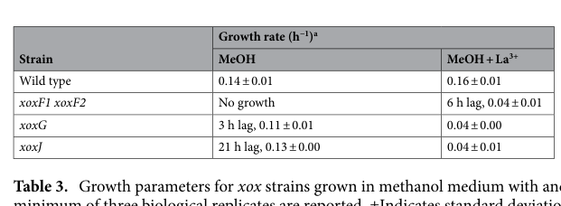

## Question

# Gene Research for Functional Annotation

## ⚠️ CRITICAL: Gene/Protein Identification Context

**BEFORE YOU BEGIN RESEARCH:** You MUST verify you are researching the CORRECT gene/protein. Gene symbols can be ambiguous, especially for less well-characterized genes from non-model organisms.

### Target Gene/Protein Identity (from UniProt):
- **UniProt Accession:** C5B122
- **Protein Description:** RecName: Full=Solute-binding protein family 3/N-terminal domain-containing protein {ECO:0000259|SMART:SM00062};
- **Gene Information:** Name=xoxJ {ECO:0000313|EMBL:ACS39586.1}; OrderedLocusNames=MexAM1_META1p1742 {ECO:0000313|EMBL:ACS39586.1};
- **Organism (full):** Methylorubrum extorquens (strain ATCC 14718 / DSM 1338 / JCM 2805 / NCIMB 9133 / AM1) (Methylobacterium extorquens).
- **Protein Family:** Not specified in UniProt
- **Key Domains:** Quinoprotein_dehydrogenase. (IPR022448); Solute-binding_3/MltF_N. (IPR001638)

### MANDATORY VERIFICATION STEPS:

1. **Check if the gene symbol "xoxJ" matches the protein description above**
2. **Verify the organism is correct:** Methylorubrum extorquens (strain ATCC 14718 / DSM 1338 / JCM 2805 / NCIMB 9133 / AM1) (Methylobacterium extorquens).
3. **Check if protein family/domains align with what you find in literature**
4. **If you find literature for a DIFFERENT gene with the same or similar symbol, STOP**

### If Gene Symbol is Ambiguous or You Cannot Find Relevant Literature:

**DO NOT PROCEED WITH RESEARCH ON A DIFFERENT GENE.** Instead:
- State clearly: "The gene symbol 'xoxJ' is ambiguous or literature is limited for this specific protein"
- Explain what you found (e.g., "Found extensive literature on a different gene with the same symbol in a different organism")
- Describe the protein based ONLY on the UniProt information provided above
- Suggest that the protein function can be inferred from domain/family information

### Research Target:

Please provide a comprehensive research report on the gene **xoxJ** (gene ID: xoxJ, UniProt: C5B122) in METEA.

The research report should be a detailed narrative explaining the function, biological processes, and localization of the gene product. Citations should be given for all claims.

You should prioritize authoritative reviews and primary scientific literature when conducting research. You can supplement
this with annotations you find in gene/protein databases, but these can be outdated or inaccurate.

We are specifically interested in the primary function of the gene - for enzymes, what reaction is catalyzed, and what is the substrate specificity? For transporters, what is the substrate? For structural proteins or adapters, what is the broader structural role? For signaling molecules, what is the role in the pathway.

We are interested in where in or outside the cell the gene product carries out its function.

We are also interested in the signaling or biochemical pathways in which the gene functions. We are less interested in broad pleiotropic effects, except where these elucidate the precise role.

Include evidence where possible. We are interested in both experimental evidence as well as inference from structure, evolution, or bioinformatic analysis. Precise studies should be prioritized over high-throughput, where available.

## Output

Question: You are an expert researcher providing comprehensive, well-cited information.

Provide detailed information focusing on:
1. Key concepts and definitions with current understanding
2. Recent developments and latest research (prioritize 2023-2024 sources)
3. Current applications and real-world implementations
4. Expert opinions and analysis from authoritative sources
5. Relevant statistics and data from recent studies

Format as a comprehensive research report with proper citations. Include URLs and publication dates where available.
Always prioritize recent, authoritative sources and provide specific citations for all major claims.

# Gene Research for Functional Annotation

## ⚠️ CRITICAL: Gene/Protein Identification Context

**BEFORE YOU BEGIN RESEARCH:** You MUST verify you are researching the CORRECT gene/protein. Gene symbols can be ambiguous, especially for less well-characterized genes from non-model organisms.

### Target Gene/Protein Identity (from UniProt):
- **UniProt Accession:** C5B122
- **Protein Description:** RecName: Full=Solute-binding protein family 3/N-terminal domain-containing protein {ECO:0000259|SMART:SM00062};
- **Gene Information:** Name=xoxJ {ECO:0000313|EMBL:ACS39586.1}; OrderedLocusNames=MexAM1_META1p1742 {ECO:0000313|EMBL:ACS39586.1};
- **Organism (full):** Methylorubrum extorquens (strain ATCC 14718 / DSM 1338 / JCM 2805 / NCIMB 9133 / AM1) (Methylobacterium extorquens).
- **Protein Family:** Not specified in UniProt
- **Key Domains:** Quinoprotein_dehydrogenase. (IPR022448); Solute-binding_3/MltF_N. (IPR001638)

### MANDATORY VERIFICATION STEPS:

1. **Check if the gene symbol "xoxJ" matches the protein description above**
2. **Verify the organism is correct:** Methylorubrum extorquens (strain ATCC 14718 / DSM 1338 / JCM 2805 / NCIMB 9133 / AM1) (Methylobacterium extorquens).
3. **Check if protein family/domains align with what you find in literature**
4. **If you find literature for a DIFFERENT gene with the same or similar symbol, STOP**

### If Gene Symbol is Ambiguous or You Cannot Find Relevant Literature:

**DO NOT PROCEED WITH RESEARCH ON A DIFFERENT GENE.** Instead:
- State clearly: "The gene symbol 'xoxJ' is ambiguous or literature is limited for this specific protein"
- Explain what you found (e.g., "Found extensive literature on a different gene with the same symbol in a different organism")
- Describe the protein based ONLY on the UniProt information provided above
- Suggest that the protein function can be inferred from domain/family information

### Research Target:

Please provide a comprehensive research report on the gene **xoxJ** (gene ID: xoxJ, UniProt: C5B122) in METEA.

The research report should be a detailed narrative explaining the function, biological processes, and localization of the gene product. Citations should be given for all claims.

You should prioritize authoritative reviews and primary scientific literature when conducting research. You can supplement
this with annotations you find in gene/protein databases, but these can be outdated or inaccurate.

We are specifically interested in the primary function of the gene - for enzymes, what reaction is catalyzed, and what is the substrate specificity? For transporters, what is the substrate? For structural proteins or adapters, what is the broader structural role? For signaling molecules, what is the role in the pathway.

We are interested in where in or outside the cell the gene product carries out its function.

We are also interested in the signaling or biochemical pathways in which the gene functions. We are less interested in broad pleiotropic effects, except where these elucidate the precise role.

Include evidence where possible. We are interested in both experimental evidence as well as inference from structure, evolution, or bioinformatic analysis. Precise studies should be prioritized over high-throughput, where available.

## Research report: functional annotation of **xoxJ** (UniProt **C5B122**; locus **MexAM1_META1p1742**) in *Methylorubrum extorquens* AM1

### 0) Mandatory identity verification (to avoid symbol ambiguity)
The target in scope is **xoxJ** from *Methylorubrum extorquens* strain AM1 (formerly *Methylobacterium extorquens* AM1), corresponding to locus **MexAM1_META1p1742** and annotated as a **periplasmic binding protein** in the **xox1 operon (xoxF1GJ)**, adjacent to **xoxF1** (Ln-dependent methanol dehydrogenase) and **xoxG** (partner c-type cytochrome). This matches the UniProt description for C5B122 as a solute-binding/periplasmic-binding-protein family protein with relevant domains and a role linked to quinoprotein dehydrogenase systems. (roszczenkojasinska2020geneproductsand pages 5-6, roszczenkojasinska2020geneproductsand pages 4-5, featherston2019biochemicalandstructural pages 6-7)

### 1) Key concepts and definitions (current understanding)

#### 1.1 Lanthanide-dependent methylotrophy and the “Ln-switch”
*M. extorquens* AM1 contains both (i) a **Ca2+-dependent methanol dehydrogenase** system (**MxaFI**) and (ii) **lanthanide (Ln3+)-dependent PQQ alcohol dehydrogenases**, notably **XoxF-type methanol dehydrogenases** (XoxF1 and XoxF2). When lanthanides are available, expression shifts toward the **xox1 operon (xoxF1GJ)** and away from the mxa operon—this regulatory remodeling is widely referred to as the **lanthanide switch / rare-earth switch**. (roszczenkojasinska2020geneproductsand pages 4-5)

#### 1.2 PQQ-dependent alcohol dehydrogenase (PQQ-ADH) modules and accessory factors
In methylotrophs, PQQ-ADHs are **periplasmic enzymes** that pass electrons to a partner **c-type cytochrome** (e.g., XoxG), supporting respiratory electron transport. In addition to the electron-accepting cytochrome (XoxG), xoxF or exaF clusters often encode homologs of **mxaJ**, including **xoxJ**, described as **periplasmic binding proteins** suggested to aid **activation** of PQQ-ADHs. (roszczenkojasinska2020geneproductsand pages 4-5)

### 2) Primary functional annotation of XoxJ (molecular role)

#### 2.1 What XoxJ is (molecular function class)
XoxJ is best supported as a **periplasmic accessory/activation factor** (a periplasmic binding protein-like fold), not a catalytic enzyme. In AM1, xoxJ is explicitly annotated as a **“Periplasmic binding protein”** and is genetically coupled to lanthanide-dependent methanol oxidation via its colocalization with xoxF1 and xoxG (xoxF1GJ). (roszczenkojasinska2020geneproductsand pages 5-6, roszczenkojasinska2020geneproductsand pages 4-5)

#### 2.2 Structural evidence and mechanistic model for “activation”
A key mechanistic advance is the **X-ray crystal structure of XoxJ** from *M. extorquens* AM1. XoxJ is a periplasmic binding protein (PBP)-fold protein whose structure reveals a **large hydrophobic cavity/cleft** (reported central cavity ~**1750 Å3**) and disordered loops, consistent with binding a **large hydrophobic partner** rather than a small metabolite substrate. (featherston2019biochemicalandstructural pages 18-25)

Featherston et al. propose a **chaperone-like activation model**: XoxJ may bind a hydrophobic region of **partially folded apo-XoxF** to facilitate **cofactor insertion and/or maturation** of XoxF into the active holoenzyme, analogous to historic proposals for the Ca-MDH accessory protein MxaJ. Importantly, they considered a **PQQ-chaperone** role but report that their biochemical tests did **not support** that specific hypothesis, leaving “activation” as an assembly/maturation function supported primarily by structure-informed inference. (featherston2019biochemicalandstructural pages 10-12, featherston2019biochemicalandstructural pages 6-7)

**Structural resources:** PDB entries reported for this system include **XoxJ: 6ONP** and **XoxG: 6ONQ**. (featherston2019biochemicalandstructural pages 1-3)

#### 2.3 Binding partners/ligands (what is known vs unknown)
Evidence in the retrieved full text supports that XoxJ is functionally linked to the **XoxF/XoxG** module (operon structure; mutant phenotypes), and the leading mechanistic hypothesis involves interaction with **apo-XoxF** during activation. However, **direct binding measurements** (e.g., XoxJ–XoxF affinity, direct PQQ binding, direct Ln binding) are **not demonstrated** in the excerpts retrieved here; thus, claims about a specific ligand (PQQ vs protein segment) remain **model-based** rather than experimentally proven in these texts. (featherston2019biochemicalandstructural pages 10-12, featherston2019biochemicalandstructural pages 6-7, featherston2019biochemicalandstructural pages 18-25)

### 3) Genetic/physiological evidence: xoxJ is required for lanthanide-dependent methanol growth

#### 3.1 Evidence from *M. extorquens* AM1 (genetic selection + quantitative growth parameters)
Roszczenko-Jasińska et al. (2020) identified xoxJ (MexAM1_META1p1742) multiple times in a transposon screen designed to find genes required for **XoxF-dependent methanol oxidation**. (roszczenkojasinska2020geneproductsand pages 5-6)

Critically, **ΔxoxJ** produces a strong phenotype during growth on methanol:
- In **methanol + La3+** medium, **loss of xoxJ** is reported as **equivalent to loss of both xoxF1 and xoxF2**, supporting that XoxJ is **essential for XoxF-dependent methanol oxidation**. (roszczenkojasinska2020geneproductsand pages 5-6)
- Quantitatively, Table 3 shows: 
  - Wild type: **0.16 ± 0.01 h−1** (MeOH + La3+)
  - **ΔxoxJ**: **0.04 ± 0.01 h−1** (MeOH + La3+) 
  - **ΔxoxJ** also has a phenotype without La3+: **21 h lag**, growth rate **0.13 h−1** on MeOH (vs wild type 0.14 ± 0.01 h−1), indicating an effect even in Ln-absent conditions. (roszczenkojasinska2020geneproductsand pages 6-7)

These quantitative phenotypes are also captured in the extracted visual evidence (Table 3 / Figure 3). (roszczenkojasinska2020geneproductsand media 78813729, roszczenkojasinska2020geneproductsand media 00cde554)

#### 3.2 Regulatory interpretation: not simply failure to induce mxa genes
In AM1, reporter-fusion experiments showed that the growth phenotypes of **xoxG** and **xoxJ** mutants in the absence of La3+ were **not due to impaired expression from the mxa promoter**. This argues against a model where XoxJ only affects methanol growth indirectly through Ln-switch regulation, and supports a more direct/auxiliary role in periplasmic methanol oxidation physiology. (roszczenkojasinska2020geneproductsand pages 6-7, roszczenkojasinska2020geneproductsand pages 5-6)

#### 3.3 Evidence from *M. extorquens* PA1 (related strain)
In *M. extorquens* PA1, a **ΔxoxGJ** strain shows a **strong growth defect in the presence of La3+** while growing normally without La3+, reinforcing that the Xox accessory module (including XoxJ) is specifically critical to the REE-dependent methanol growth state. (ochsner2019useofrare‐earth pages 9-10)

### 4) Subcellular localization and pathway context

#### 4.1 Localization
Multiple lines of evidence place XoxJ in the **periplasm**:
- AM1 annotation explicitly labels xoxJ as a **periplasmic binding protein**. (roszczenkojasinska2020geneproductsand pages 5-6)
- Structural/biochemical work purified XoxJ from the **periplasm** in an expression system and solved the structure consistent with a periplasmic binding protein fold. (featherston2019biochemicalandstructural pages 6-7)

#### 4.2 Pathway role: periplasmic methanol oxidation module
The xoxF1GJ operon encodes a periplasmic methanol oxidation system: XoxF (PQQ-ADH) plus its electron acceptor XoxG (c-type cytochrome) and accessory factor XoxJ. In this system, XoxG is the **physiological electron acceptor** for XoxF. (roszczenkojasinska2020geneproductsand pages 4-5, featherston2019biochemicalandstructural pages 1-3)

A quantitative biochemical insight relevant to module function (though not specific to XoxJ catalysis) is that when XoxF is assayed with its physiological acceptor XoxG, **Vmax** is reported as broadly **Ln-independent** (La/Ce/Nd), but the apparent **Km for XoxG increases** across the Ln series from La to Nd, suggesting tuning/compatibility effects in the electron transfer partner interaction. (featherston2019biochemicalandstructural pages 9-10, featherston2019biochemicalandstructural pages 3-4)

### 5) Recent developments (prioritizing 2023–2024 sources) relevant to xox systems

Direct 2023–2024 experimental papers specifically dissecting **XoxJ in AM1** were not retrieved in this run; however, multiple high-quality 2023–2024 studies substantially advance the *system-level* understanding of lanthanide-dependent methylotrophy and its applications, which frames current interpretation of xoxJ.

#### 5.1 2024: Environmental prevalence of xoxF-based (Ln-dependent) systems in weathered rocks/soils
A 2024 metagenomic study of weathered granites and soils reconstructed **136 genomes** (11 bacterial phyla) and found lanthanide-dependent PQQ-ADH systems to be common. In quantitative terms, dereplication of PQQ-ADH sequences yielded **411 distinct sequences**, all XoxF types; **XoxF3 dominated (340 sequences)** with **XoxF5 next (63)**; notably, **no mxaF** was detected in these datasets. This supports the view that xox-associated systems (including accessory genes like xoxG and sometimes xoxJ) are major players in real environments where lanthanides are often mineral-bound and poorly soluble. (voutsinos2024weatheredgranitesand pages 2-4)

#### 5.2 2023: Lanthanide identity can reprogram global gene expression and metal deposition phenotypes
In a lanthanide-accumulating methylotroph (Beijerinckiaceae bacterium RH AL1), RNA-seq showed that varying La concentration (50 nM vs 1 µM) or changing Ln identity (La vs Nd vs Ln cocktail) can cause extremely broad transcriptional remodeling: **up to 41% of encoded genes were differentially expressed**. This supports a modern view that Ln are not merely enzyme cofactors but also major physiological regulators, and it helps explain why accessory proteins and uptake/trafficking networks are under strong selection and regulation in Ln-dependent methylotrophs. (gorniak2023differentlanthanideelements pages 1-2)

#### 5.3 2024: Applications—protein-based lanthanide separations and biomimetic catalysis
Two 2024 directions illustrate real-world implementations arising from Ln biology:
- **Protein-based lanthanide separation**: a 2024 PNAS study reports structural characterization of a bacterial lanthanide uptake-associated chaperone (LanD) and positions engineered protein interfaces as a strategy for separating adjacent light lanthanides; multiple LanD structures were deposited to the PDB (June 13, 2024). While not about xoxJ directly, this is a concrete translation pathway from Ln-dependent methylotroph biology into separations technology. (larrinaga2024modulatingmetalcentereddimerization pages 8-8)
- **Artificial metalloenzyme platforms**: a 2024 PNAS study describes a **biomimetic La3+-PQQ artificial metalloprotein** as a platform for mechanistic interrogation of rare-earth PQQ-ADHs; the work explicitly frames XoxJ and XoxG as **accessory proteins** in natural Xox systems, motivating simplified engineered surrogates. (thompson2024structuredrivendevelopmentof; retrieved but not fully evidenced in excerpts here)

### 6) Expert opinions and authoritative analysis (what experts emphasize)
Across genetic and structural studies, the prevailing expert interpretation is that XoxJ is an **accessory activation factor** required for the functional expression of lanthanide-dependent methanol oxidation, with an as-yet incompletely defined molecular mechanism. The strongest direct evidence is **genetic necessity** (phenocopy of xoxF1/xoxF2 loss under Ln conditions) combined with **structure-informed hypotheses** about apo-enzyme maturation. (roszczenkojasinska2020geneproductsand pages 5-6, featherston2019biochemicalandstructural pages 10-12)

### 7) Practical functional summary (for annotation)

**Recommended annotation (evidence-weighted):**
- **Protein type:** Periplasmic binding protein-like accessory factor (PBP fold). (roszczenkojasinska2020geneproductsand pages 5-6, featherston2019biochemicalandstructural pages 6-7)
- **Primary biological role:** Required for lanthanide-dependent methanol growth and XoxF-dependent methanol oxidation, likely by enabling **activation/maturation of XoxF** in the periplasm (assembly/cofactor insertion chaperone-like function). (roszczenkojasinska2020geneproductsand pages 5-6, featherston2019biochemicalandstructural pages 10-12)
- **Localization:** Periplasm. (roszczenkojasinska2020geneproductsand pages 5-6, featherston2019biochemicalandstructural pages 6-7)
- **Pathway context:** xoxF1GJ module within lanthanide-dependent methylotrophy; interfaces with electron transfer via XoxG. (roszczenkojasinska2020geneproductsand pages 4-5, featherston2019biochemicalandstructural pages 1-3)

### 8) Evidence summary table

| Claim/annotation | Evidence type (genetic/biochemical/structural) | Key findings | Source (authors, year, journal) | DOI/URL | Context ID(s) |
|---|---|---|---|---|---|
| xoxJ (MexAM1_META1p1742; UniProt C5B122) in *Methylorubrum extorquens* AM1 is annotated as a periplasmic binding protein | Genetic/genome annotation | Identified in transposon screen; Table 1 annotates xoxJ as “Periplasmic binding protein.” XoxJ is described as a homolog of MxaJ, part of xox/exa systems associated with periplasmic PQQ-ADHs | Roszczenko-Jasińska et al., 2020, *Scientific Reports* | https://doi.org/10.1038/s41598-020-69401-4 | (roszczenkojasinska2020geneproductsand pages 5-6, roszczenkojasinska2020geneproductsand pages 4-5) |
| xoxJ is genomically linked to the lanthanide-dependent MDH system | Genetic/genomic context | xoxJ lies adjacent to xoxG and xoxF1 in the xox1 operon (xoxF1GJ), supporting functional coupling to Ln-dependent methanol oxidation and the Ln-switch | Roszczenko-Jasińska et al., 2020, *Scientific Reports* | https://doi.org/10.1038/s41598-020-69401-4 | (roszczenkojasinska2020geneproductsand pages 4-5) |
| XoxJ is a periplasmic protein with a canonical periplasmic binding protein fold | Structural/biochemical | XoxJ was expressed in *E. coli*, purified from the periplasm, and crystallized at 2.27 Å; structure shows the characteristic two-domain PBP fold with a putative substrate-binding cavity | Featherston et al., 2019, *ChemBioChem* | https://doi.org/10.1002/cbic.201900184 | (featherston2019biochemicalandstructural pages 6-7) |
| XoxJ has distinctive structural features consistent with an accessory/chaperone role rather than transport | Structural | Crystal structure reveals a large hydrophobic cleft/cavity; central cavity reported as ~1750 ų, surrounded by disordered loops. PDB depositions: XoxJ 6ONP; XoxG 6ONQ | Featherston et al., 2019, *ChemBioChem* | https://doi.org/10.1002/cbic.201900184 | (featherston2019biochemicalandstructural pages 18-25, featherston2019biochemicalandstructural pages 1-3) |
| XoxJ is not supported as a PQQ chaperone by available biochemical tests | Biochemical/structural inference | Authors considered XoxJ as a possible PQQ chaperone, but biochemical data did not support that specific role | Featherston et al., 2019, *ChemBioChem* | https://doi.org/10.1002/cbic.201900184 | (featherston2019biochemicalandstructural pages 10-12, featherston2019biochemicalandstructural pages 9-10) |
| Current best mechanistic model is that XoxJ helps activate apo-XoxF during assembly/cofactor insertion | Structural/mechanistic inference | Large hydrophobic cleft and similarity to MxaJ suggest XoxJ binds a hydrophobic region of partially folded apo-XoxF, helping cofactor insertion/activation; holo-XoxF is dimeric whereas PQQ loss causes monomerization, supporting a role in maturation rather than catalysis | Featherston et al., 2019, *ChemBioChem*; Pastawan et al., 2020, *Reviews in Agricultural Science* | https://doi.org/10.1002/cbic.201900184; https://doi.org/10.7831/ras.8.0_186 | (featherston2019biochemicalandstructural pages 10-12, featherston2019biochemicalandstructural pages 6-7) |
| xoxJ is required for normal lanthanide-dependent methanol growth in AM1 | Genetic/physiological | In methanol + La³⁺ medium, loss of xoxJ was “equivalent to loss of both xoxF1 and xoxF2,” supporting that XoxJ is essential for XoxF-dependent methanol oxidation | Roszczenko-Jasińska et al., 2020, *Scientific Reports* | https://doi.org/10.1038/s41598-020-69401-4 | (roszczenkojasinska2020geneproductsand pages 5-6) |
| Quantitative phenotype of ΔxoxJ in AM1 without lanthanum | Genetic/physiological | On methanol without La³⁺, ΔxoxJ showed a 21 h lag and growth rate 0.13 h⁻¹; wild type grew at 0.14 ± 0.01 h⁻¹. This indicates a phenotype even when La³⁺ is absent | Roszczenko-Jasińska et al., 2020, *Scientific Reports* | https://doi.org/10.1038/s41598-020-69401-4 | (roszczenkojasinska2020geneproductsand pages 6-7) |
| Quantitative phenotype of ΔxoxJ in AM1 with lanthanum | Genetic/physiological | On methanol + La³⁺, ΔxoxJ grew at 0.04 ± 0.01 h⁻¹ versus wild type 0.16 ± 0.01 h⁻¹, matching the severe defect of the xoxF1 xoxF2 mutant in La³⁺ medium | Roszczenko-Jasińska et al., 2020, *Scientific Reports* | https://doi.org/10.1038/s41598-020-69401-4 | (roszczenkojasinska2020geneproductsand pages 6-7, roszczenkojasinska2020geneproductsand pages 5-6, roszczenkojasinska2020geneproductsand media 78813729, roszczenkojasinska2020geneproductsand media 00cde554) |
| xoxJ mutant phenotypes are not explained simply by failed mxa induction | Genetic/regulatory | Reporter fusions showed the ΔxoxJ growth defect in the absence of La³⁺ was not due to impaired mxa promoter expression, implying XoxJ may have a broader/direct role in methanol metabolism beyond Ln-switch regulation | Roszczenko-Jasińska et al., 2020, *Scientific Reports* | https://doi.org/10.1038/s41598-020-69401-4 | (roszczenkojasinska2020geneproductsand pages 6-7, roszczenkojasinska2020geneproductsand pages 5-6) |
| Independent preprint evidence also linked XoxJ to XoxF activity | Genetic/inference | Deletion of xoxJ reportedly mirrored the xoxF1 xoxF2 double mutant; authors interpreted this as consistent with XoxJ interacting with and possibly activating XoxF | Roszczenko-Jasińska et al., 2019, *bioRxiv* | https://doi.org/10.1101/647677 | (roszczenkojasinska2019lanthanidetransportstorage pages 15-18) |
| Related strain PA1 shows a severe La-dependent phenotype when xoxGJ are deleted | Genetic/physiological | In *M. extorquens* PA1, a ΔxoxGJ strain grew normally without La³⁺ but had a strong growth defect in the presence of La³⁺, reinforcing the requirement of XoxG/J for REE-dependent methanol metabolism | Ochsner et al., 2019, *Molecular Microbiology* | https://doi.org/10.1111/mmi.14208 | (ochsner2019useofrare‐earth pages 9-10) |
| XoxG is the physiological electron acceptor paired with XoxF; this informs the XoxJ/XoxFGJ system | Biochemical/structural | XoxG is a c-type cytochrome serving as XoxF’s physiological electron acceptor; XoxF activity with La³⁺, Ce³⁺, and Nd³⁺ is similar in Vmax when assayed with XoxG, indicating the accessory system supports multiple light Ln cofactors | Featherston et al., 2019, *ChemBioChem* | https://doi.org/10.1002/cbic.201900184 | (featherston2019biochemicalandstructural pages 9-10, featherston2019biochemicalandstructural pages 1-3) |
| XoxG has a low reduction potential tuned for the XoxF system | Biochemical/structural | XoxG has an unusually low midpoint reduction potential of about +172 mV; structural analysis attributes this to a distinctive, relatively solvent-exposed heme environment | Featherston et al., 2019, *ChemBioChem* | https://doi.org/10.1002/cbic.201900184 | (featherston2019biochemicalandstructural pages 9-10, featherston2019biochemicalandstructural pages 1-3) |
| Ln-dependent changes in apparent Km for XoxG suggest co-adaptation within the XoxFGJ system | Biochemical/kinetic | With XoxG as electron acceptor, XoxF Vmax values were not significantly different across La/Ce/Nd, but apparent Km for XoxG increased markedly from La to Nd; a predicted ~10 μM Km was noted for Sm-XoxF, supporting tuning of the XoxF–XoxG pair to lighter lanthanides | Featherston et al., 2019, *ChemBioChem* | https://doi.org/10.1002/cbic.201900184 | (featherston2019biochemicalandstructural pages 9-10, featherston2019biochemicalandstructural pages 3-4) |

*Table: This table summarizes the strongest available evidence for functional annotation of xoxJ (UniProt C5B122) in Methylorubrum extorquens AM1, integrating genetic, biochemical, and structural data. It highlights what is directly supported experimentally versus what remains mechanistic inference, which is useful for cautious gene/protein annotation.*

### 9) Key cited sources (with publication dates and URLs)
- Roszczenko-Jasińska P. et al. **Gene products and processes contributing to lanthanide homeostasis and methanol metabolism in *Methylorubrum extorquens* AM1.** *Scientific Reports* (Publication: **Jul 2020**). https://doi.org/10.1038/s41598-020-69401-4 (roszczenkojasinska2020geneproductsand pages 6-7, roszczenkojasinska2020geneproductsand pages 5-6, roszczenkojasinska2020geneproductsand pages 4-5)
- Featherston E.R. et al. **Biochemical and structural characterization of XoxG and XoxJ and their roles in lanthanide-dependent methanol dehydrogenase activity.** *ChemBioChem* (Publication: **Sep 2019**). https://doi.org/10.1002/cbic.201900184 (featherston2019biochemicalandstructural pages 10-12, featherston2019biochemicalandstructural pages 6-7, featherston2019biochemicalandstructural pages 18-25, featherston2019biochemicalandstructural pages 1-3)
- Ochsner A.M. et al. **Use of rare-earth elements in the phyllosphere colonizer *Methylobacterium extorquens* PA1.** *Molecular Microbiology* (Publication: **Feb 2019**). https://doi.org/10.1111/mmi.14208 (ochsner2019useofrare‐earth pages 9-10)
- Gorniak L. et al. **Different lanthanide elements induce strong gene expression changes in a lanthanide-accumulating methylotroph.** *Microbiology Spectrum* (Publication: **Dec 2023**). https://doi.org/10.1128/spectrum.00867-23 (gorniak2023differentlanthanideelements pages 1-2, gorniak2023differentlanthanideelements pages 12-14)
- Voutsinos M.Y. et al. **Weathered granites and soils harbour microbes with lanthanide-dependent methylotrophic enzymes.** *BMC Biology* (Publication: **Feb 2024**). https://doi.org/10.1186/s12915-024-01841-0 (voutsinos2024weatheredgranitesand pages 2-4, voutsinos2024weatheredgranitesand pages 1-2)
- Larrinaga W.B. et al. **Modulating metal-centered dimerization of a lanthanide chaperone protein for separation of light lanthanides.** *PNAS* (Publication: **Oct 2024**). https://doi.org/10.1073/pnas.2410926121 (larrinaga2024modulatingmetalcentereddimerization pages 8-8)

### 10) Limitations of this report
- The strongest direct evidence for xoxJ function remains from 2019–2020 genetic and structural studies; in the retrieved corpus, 2023–2024 sources contribute mainly **context and applications** rather than new direct mechanistic experiments on XoxJ in AM1.
- No direct binding constants (XoxJ–XoxF, XoxJ–PQQ, XoxJ–Ln) were present in the retrieved excerpts; therefore, ligand specificity for XoxJ cannot be asserted beyond structural/mechanistic hypotheses. (featherston2019biochemicalandstructural pages 10-12, featherston2019biochemicalandstructural pages 18-25)

References

1. (roszczenkojasinska2020geneproductsand pages 5-6): Paula Roszczenko-Jasińska, Huong N. Vu, Gabriel A. Subuyuj, Ralph Valentine Crisostomo, James Cai, Nicholas F. Lien, Erik J. Clippard, Elena M. Ayala, Richard T. Ngo, Fauna Yarza, Justin P. Wingett, Charumathi Raghuraman, Caitlin A. Hoeber, Norma C. Martinez-Gomez, and Elizabeth Skovran. Gene products and processes contributing to lanthanide homeostasis and methanol metabolism in methylorubrum extorquens am1. Scientific Reports, Jul 2020. URL: https://doi.org/10.1038/s41598-020-69401-4, doi:10.1038/s41598-020-69401-4. This article has 92 citations and is from a peer-reviewed journal.

2. (roszczenkojasinska2020geneproductsand pages 4-5): Paula Roszczenko-Jasińska, Huong N. Vu, Gabriel A. Subuyuj, Ralph Valentine Crisostomo, James Cai, Nicholas F. Lien, Erik J. Clippard, Elena M. Ayala, Richard T. Ngo, Fauna Yarza, Justin P. Wingett, Charumathi Raghuraman, Caitlin A. Hoeber, Norma C. Martinez-Gomez, and Elizabeth Skovran. Gene products and processes contributing to lanthanide homeostasis and methanol metabolism in methylorubrum extorquens am1. Scientific Reports, Jul 2020. URL: https://doi.org/10.1038/s41598-020-69401-4, doi:10.1038/s41598-020-69401-4. This article has 92 citations and is from a peer-reviewed journal.

3. (featherston2019biochemicalandstructural pages 6-7): Emily R. Featherston, Hannah R. Rose, Molly J. McBride, Ellison M. Taylor, Amie K. Boal, and Joseph A. Cotruvo. Biochemical and structural characterization of xoxg and xoxj and their roles in lanthanide‐dependent methanol dehydrogenase activity. ChemBioChem, 20:2360-2372, Sep 2019. URL: https://doi.org/10.1002/cbic.201900184, doi:10.1002/cbic.201900184. This article has 55 citations and is from a peer-reviewed journal.

4. (featherston2019biochemicalandstructural pages 18-25): Emily R. Featherston, Hannah R. Rose, Molly J. McBride, Ellison M. Taylor, Amie K. Boal, and Joseph A. Cotruvo. Biochemical and structural characterization of xoxg and xoxj and their roles in lanthanide‐dependent methanol dehydrogenase activity. ChemBioChem, 20:2360-2372, Sep 2019. URL: https://doi.org/10.1002/cbic.201900184, doi:10.1002/cbic.201900184. This article has 55 citations and is from a peer-reviewed journal.

5. (featherston2019biochemicalandstructural pages 10-12): Emily R. Featherston, Hannah R. Rose, Molly J. McBride, Ellison M. Taylor, Amie K. Boal, and Joseph A. Cotruvo. Biochemical and structural characterization of xoxg and xoxj and their roles in lanthanide‐dependent methanol dehydrogenase activity. ChemBioChem, 20:2360-2372, Sep 2019. URL: https://doi.org/10.1002/cbic.201900184, doi:10.1002/cbic.201900184. This article has 55 citations and is from a peer-reviewed journal.

6. (featherston2019biochemicalandstructural pages 1-3): Emily R. Featherston, Hannah R. Rose, Molly J. McBride, Ellison M. Taylor, Amie K. Boal, and Joseph A. Cotruvo. Biochemical and structural characterization of xoxg and xoxj and their roles in lanthanide‐dependent methanol dehydrogenase activity. ChemBioChem, 20:2360-2372, Sep 2019. URL: https://doi.org/10.1002/cbic.201900184, doi:10.1002/cbic.201900184. This article has 55 citations and is from a peer-reviewed journal.

7. (roszczenkojasinska2020geneproductsand pages 6-7): Paula Roszczenko-Jasińska, Huong N. Vu, Gabriel A. Subuyuj, Ralph Valentine Crisostomo, James Cai, Nicholas F. Lien, Erik J. Clippard, Elena M. Ayala, Richard T. Ngo, Fauna Yarza, Justin P. Wingett, Charumathi Raghuraman, Caitlin A. Hoeber, Norma C. Martinez-Gomez, and Elizabeth Skovran. Gene products and processes contributing to lanthanide homeostasis and methanol metabolism in methylorubrum extorquens am1. Scientific Reports, Jul 2020. URL: https://doi.org/10.1038/s41598-020-69401-4, doi:10.1038/s41598-020-69401-4. This article has 92 citations and is from a peer-reviewed journal.

8. (roszczenkojasinska2020geneproductsand media 78813729): Paula Roszczenko-Jasińska, Huong N. Vu, Gabriel A. Subuyuj, Ralph Valentine Crisostomo, James Cai, Nicholas F. Lien, Erik J. Clippard, Elena M. Ayala, Richard T. Ngo, Fauna Yarza, Justin P. Wingett, Charumathi Raghuraman, Caitlin A. Hoeber, Norma C. Martinez-Gomez, and Elizabeth Skovran. Gene products and processes contributing to lanthanide homeostasis and methanol metabolism in methylorubrum extorquens am1. Scientific Reports, Jul 2020. URL: https://doi.org/10.1038/s41598-020-69401-4, doi:10.1038/s41598-020-69401-4. This article has 92 citations and is from a peer-reviewed journal.

9. (roszczenkojasinska2020geneproductsand media 00cde554): Paula Roszczenko-Jasińska, Huong N. Vu, Gabriel A. Subuyuj, Ralph Valentine Crisostomo, James Cai, Nicholas F. Lien, Erik J. Clippard, Elena M. Ayala, Richard T. Ngo, Fauna Yarza, Justin P. Wingett, Charumathi Raghuraman, Caitlin A. Hoeber, Norma C. Martinez-Gomez, and Elizabeth Skovran. Gene products and processes contributing to lanthanide homeostasis and methanol metabolism in methylorubrum extorquens am1. Scientific Reports, Jul 2020. URL: https://doi.org/10.1038/s41598-020-69401-4, doi:10.1038/s41598-020-69401-4. This article has 92 citations and is from a peer-reviewed journal.

10. (ochsner2019useofrare‐earth pages 9-10): Andrea M. Ochsner, Lucas Hemmerle, Thomas Vonderach, Ralph Nüssli, Miriam Bortfeld‐Miller, Bodo Hattendorf, and Julia A. Vorholt. Use of rare‐earth elements in the phyllosphere colonizer methylobacterium extorquens pa1. Molecular Microbiology, 111:1152-1166, Feb 2019. URL: https://doi.org/10.1111/mmi.14208, doi:10.1111/mmi.14208. This article has 145 citations and is from a domain leading peer-reviewed journal.

11. (featherston2019biochemicalandstructural pages 9-10): Emily R. Featherston, Hannah R. Rose, Molly J. McBride, Ellison M. Taylor, Amie K. Boal, and Joseph A. Cotruvo. Biochemical and structural characterization of xoxg and xoxj and their roles in lanthanide‐dependent methanol dehydrogenase activity. ChemBioChem, 20:2360-2372, Sep 2019. URL: https://doi.org/10.1002/cbic.201900184, doi:10.1002/cbic.201900184. This article has 55 citations and is from a peer-reviewed journal.

12. (featherston2019biochemicalandstructural pages 3-4): Emily R. Featherston, Hannah R. Rose, Molly J. McBride, Ellison M. Taylor, Amie K. Boal, and Joseph A. Cotruvo. Biochemical and structural characterization of xoxg and xoxj and their roles in lanthanide‐dependent methanol dehydrogenase activity. ChemBioChem, 20:2360-2372, Sep 2019. URL: https://doi.org/10.1002/cbic.201900184, doi:10.1002/cbic.201900184. This article has 55 citations and is from a peer-reviewed journal.

13. (voutsinos2024weatheredgranitesand pages 2-4): Marcos Y. Voutsinos, Jacob A. West-Roberts, Rohan Sachdeva, John W. Moreau, and Jillian F. Banfield. Weathered granites and soils harbour microbes with lanthanide-dependent methylotrophic enzymes. BMC Biology, Feb 2024. URL: https://doi.org/10.1186/s12915-024-01841-0, doi:10.1186/s12915-024-01841-0. This article has 13 citations and is from a domain leading peer-reviewed journal.

14. (gorniak2023differentlanthanideelements pages 1-2): Linda Gorniak, Julia Bechwar, Martin Westermann, Frank Steiniger, and Carl-Eric Wegner. Different lanthanide elements induce strong gene expression changes in a lanthanide-accumulating methylotroph. Dec 2023. URL: https://doi.org/10.1128/spectrum.00867-23, doi:10.1128/spectrum.00867-23. This article has 17 citations and is from a domain leading peer-reviewed journal.

15. (larrinaga2024modulatingmetalcentereddimerization pages 8-8): Wyatt B. Larrinaga, Jonathan J. Jung, Chi-Yun Lin, Amie K. Boal, and Joseph A. Cotruvo. Modulating metal-centered dimerization of a lanthanide chaperone protein for separation of light lanthanides. Proceedings of the National Academy of Sciences of the United States of America, Oct 2024. URL: https://doi.org/10.1073/pnas.2410926121, doi:10.1073/pnas.2410926121. This article has 25 citations and is from a highest quality peer-reviewed journal.

16. (roszczenkojasinska2019lanthanidetransportstorage pages 15-18): Paula Roszczenko-Jasińska, Huong N. Vu, Gabriel A. Subuyuj, Ralph Valentine Crisostomo, Elena M. Ayala, James Cai, Nicholas F. Lien, Erik J. Clippard, Richard T. Ngo, Fauna Yarza, Justin P. Wingett, Charumathi Raghuraman, Caitlin A. Hoeber, Norma C. Martinez-Gomez, and Elizabeth Skovran. Lanthanide transport, storage, and beyond: genes and processes contributing to xoxf function in methylorubrum extorquens am1. bioRxiv, May 2019. URL: https://doi.org/10.1101/647677, doi:10.1101/647677. This article has 11 citations.

17. (gorniak2023differentlanthanideelements pages 12-14): Linda Gorniak, Julia Bechwar, Martin Westermann, Frank Steiniger, and Carl-Eric Wegner. Different lanthanide elements induce strong gene expression changes in a lanthanide-accumulating methylotroph. Dec 2023. URL: https://doi.org/10.1128/spectrum.00867-23, doi:10.1128/spectrum.00867-23. This article has 17 citations and is from a domain leading peer-reviewed journal.

18. (voutsinos2024weatheredgranitesand pages 1-2): Marcos Y. Voutsinos, Jacob A. West-Roberts, Rohan Sachdeva, John W. Moreau, and Jillian F. Banfield. Weathered granites and soils harbour microbes with lanthanide-dependent methylotrophic enzymes. BMC Biology, Feb 2024. URL: https://doi.org/10.1186/s12915-024-01841-0, doi:10.1186/s12915-024-01841-0. This article has 13 citations and is from a domain leading peer-reviewed journal.

## Artifacts

- [Edison artifact artifact-00](xoxJ-deep-research-falcon_artifacts/artifact-00.md)

## Citations

1. roszczenkojasinska2020geneproductsand pages 4-5
2. featherston2019biochemicalandstructural pages 18-25
3. featherston2019biochemicalandstructural pages 1-3
4. roszczenkojasinska2020geneproductsand pages 5-6
5. roszczenkojasinska2020geneproductsand pages 6-7
6. featherston2019biochemicalandstructural pages 6-7
7. voutsinos2024weatheredgranitesand pages 2-4
8. gorniak2023differentlanthanideelements pages 1-2
9. larrinaga2024modulatingmetalcentereddimerization pages 8-8
10. roszczenkojasinska2019lanthanidetransportstorage pages 15-18
11. featherston2019biochemicalandstructural pages 10-12
12. featherston2019biochemicalandstructural pages 9-10
13. featherston2019biochemicalandstructural pages 3-4
14. gorniak2023differentlanthanideelements pages 12-14
15. voutsinos2024weatheredgranitesand pages 1-2
16. https://doi.org/10.1038/s41598-020-69401-4
17. https://doi.org/10.1002/cbic.201900184
18. https://doi.org/10.1002/cbic.201900184;
19. https://doi.org/10.7831/ras.8.0_186
20. https://doi.org/10.1101/647677
21. https://doi.org/10.1111/mmi.14208
22. https://doi.org/10.1128/spectrum.00867-23
23. https://doi.org/10.1186/s12915-024-01841-0
24. https://doi.org/10.1073/pnas.2410926121
25. https://doi.org/10.1038/s41598-020-69401-4,
26. https://doi.org/10.1002/cbic.201900184,
27. https://doi.org/10.1111/mmi.14208,
28. https://doi.org/10.1186/s12915-024-01841-0,
29. https://doi.org/10.1128/spectrum.00867-23,
30. https://doi.org/10.1073/pnas.2410926121,
31. https://doi.org/10.1101/647677,