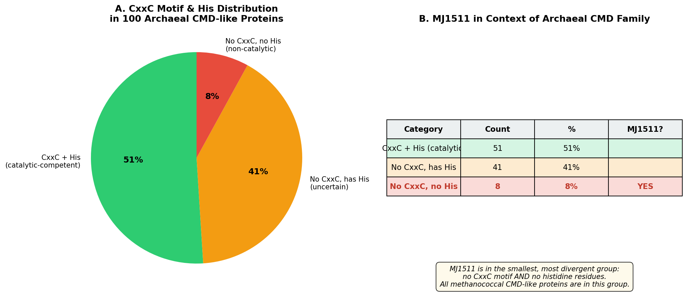
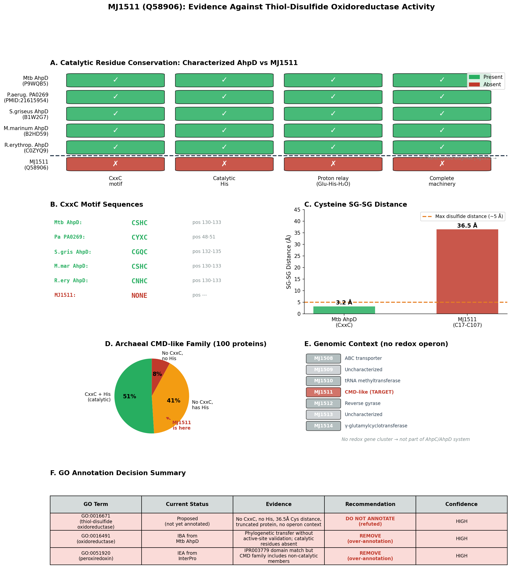
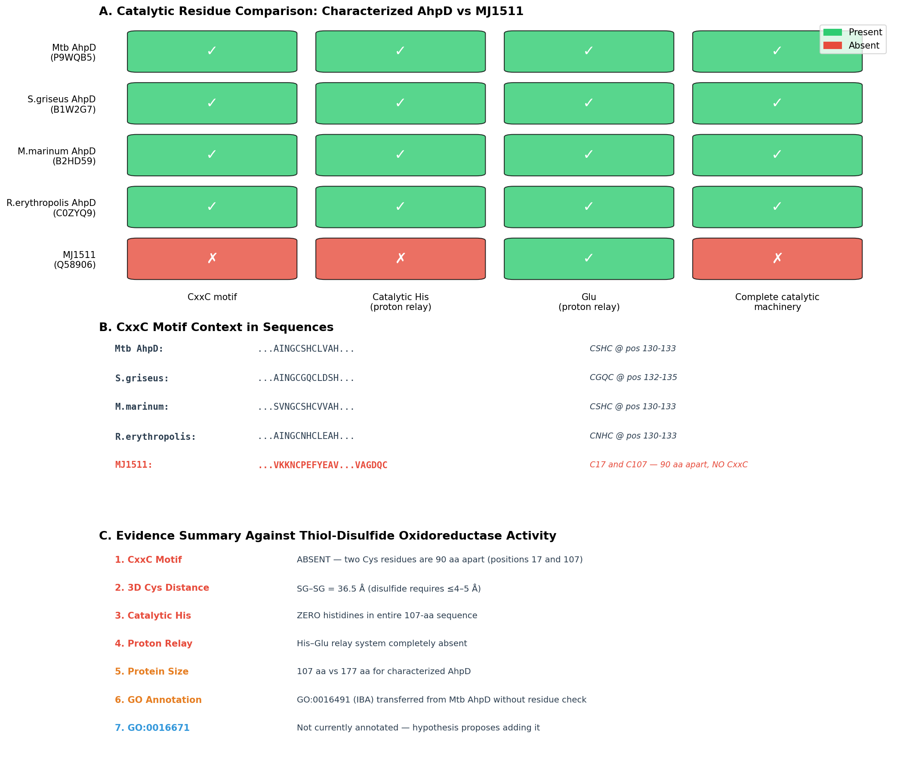

## Question

# AIGR Gene Hypothesis Deep Research

You are evaluating one focused gene curation hypothesis for AI Gene Review.
This is not a general gene overview. Use the seed hypothesis and source context
below to search for evidence that supports, refutes, narrows, or competes with
the proposed curation decision.

## Target Gene

- **Organism code:** METJA
- **Taxon:** Methanocaldococcus jannaschii (strain ATCC 43067 / DSM 2661 / JAL-1 / JCM 10045 / NBRC 100440) (NCBITaxon:243232)
- **Gene directory:** MJ1511
- **Gene symbol:** MJ1511
- **UniProt accession:** Q58906

## Focus

- **Focus type:** computational_prediction
- **Hypothesis slug:** prediction-thiol-disulfide-oxidoreductase
- **Source file:** 
- **Source selector:** 

## Seed Hypothesis

Test whether MJ1511 (UniProt Q58906, Methanocaldococcus jannaschii) is a catalytically active thiol-disulfide oxidoreductase (an oxidoreductase acting on a sulfur group of donors with a disulfide as acceptor; GO:0016671). Independently assess whether the protein's fold and active-site residues include a catalytically competent redox-active cysteine center (e.g. a properly positioned CxxC-type motif), or whether the catalytic residues required for this activity are absent, making it a non-catalytic homolog.

## Term and Decision Context

- Term: oxidoreductase activity, acting on a sulfur group of donors, disulfide as acceptor (GO:0016671)

## Reference Context

- doi:10.64898/2026.03.19.712954

## Source Context YAML

```yaml
hypothesis: Test whether MJ1511 (UniProt Q58906, Methanocaldococcus jannaschii) is a catalytically active
  thiol-disulfide oxidoreductase (an oxidoreductase acting on a sulfur group of donors with a disulfide
  as acceptor; GO:0016671). Independently assess whether the protein's fold and active-site residues include
  a catalytically competent redox-active cysteine center (e.g. a properly positioned CxxC-type motif),
  or whether the catalytic residues required for this activity are absent, making it a non-catalytic homolog.
focus_type: computational_prediction
term_id: GO:0016671
term_label: oxidoreductase activity, acting on a sulfur group of donors, disulfide as acceptor
context: []
reference_id:
- doi:10.64898/2026.03.19.712954
```

## Research Objective

Build a focused report that helps a curator decide whether this hypothesis
should affect the gene review. Address the focus type directly:

1. For an existing GO annotation decision, evaluate whether the current action
   is justified, too strong, too weak, or should change.
2. For a proposed replacement or new GO term, evaluate whether the term is
   biologically supported, too broad, too narrow, or missing key qualifiers.
3. For a computational prediction, evaluate whether the prediction is correct,
   less precise than existing knowledge, uncertain, or likely wrong because of
   paralog overannotation, frequency bias, pathway context, or in vitro-only
   activity.
4. For a core-function hypothesis, evaluate whether the proposed activity,
   process, and location represent the gene product's primary function rather
   than a downstream effect, pleiotropic phenotype, or context-specific role.
5. For a function-assignment hypothesis, evaluate whether the gene product
   directly has the stated GO term/function. Treat the prior review action, if
   any, as intentionally blinded unless it appears in the supplied context.

Use primary literature whenever possible. Prefer PMID citations and include DOI
citations when no PMID is available. Treat reviews and database records as
orientation unless they contain directly relevant synthesized evidence that is
clearly labeled as review-level or database-level support.

Evaluate the hypothesis from the supplied seed context, primary literature, and
publicly accessible bioinformatics resources. Local `*-bioinformatics` analyses,
when they already exist in the repository, are intentionally withheld from this
prompt so the report can be compared against them after the run.

Do not rely on literature alone. Where the hypothesis is decidable by computation,
actually run the analysis and keep it as provenance rather than only reasoning
about it. Match the analysis to the question, for example:

- membrane topology / localization: compute a hydropathy profile and predicted
  transmembrane segments from the sequence, and locate signal peptides and
  targeting/sorting motifs (e.g. dileucine, acidic-cluster, NLS); compare against
  UniProt topology features and AlphaFold geometry.
- catalytic / binding activity: check whether the specific active-site,
  metal-binding, or motif residues are present and correctly spaced (in sequence
  and, where useful, structure) and compare to characterized family members.
- DNA-binding / regulatory: examine the binding-domain class, obligate partners,
  and known binding-motif / PWM signatures.
- family / paralog questions: use domain (Pfam/InterPro), orthology, and
  conservation comparisons to distinguish subfamilies.

Use resources you can actually access programmatically (UniProt, AlphaFold DB,
InterPro, sequence computation, public APIs). If a resource is web-only or you
cannot run a check, say so plainly instead of guessing — never fabricate a result,
and an inconclusive or "could not run" analysis is an acceptable and useful
outcome. Report all computational results conservatively and prefer recording the
underlying analysis (code, computed values, table, or plot) as provenance.

## Required Output

### Executive Judgment

Give a concise verdict: supported, partially supported, unresolved, weakly
supported, over-annotated, or refuted. Explain the reasoning and the most
important caveats.

### Evidence Matrix

Create a table with one row per important evidence item:

- Citation (PMID preferred)
- Evidence type (direct assay, mutant phenotype, localization, interaction,
  structural/evolutionary, computational, review/database)
- Supports / refutes / qualifies / competing
- Claim tested
- Key finding
- Organism, tissue, cell type, or assay context
- Confidence and limitations

### GO Curation Implications

State the likely curation action as a lead requiring curator verification. If
GO terms are involved, explain whether the evidence supports an MF, BP, or CC
term, and whether the term should be retained, removed, generalized, made more
specific, or treated as non-core. Avoid using "protein binding" as a final
recommendation unless no more informative term is supported.

### Mechanistic Scope

Describe the immediate molecular or cellular function being tested. Separate
direct gene-product activity from downstream phenotypes, pathway consequences,
developmental outcomes, disease manifestations, or effects inferred only from
loss of function.

### Conflicts and Alternatives

Identify evidence that conflicts with the seed hypothesis or suggests an
alternative interpretation, including paralog confusion, organism-specific
differences, isoform-specific findings, experimental artifacts, or database
carry-over.

### Knowledge Gaps

List explicit uncertainties that matter for curation. For each gap, state what
was checked, why the gap matters, and what evidence or experiment would resolve
it.

### Discriminating Tests

Recommend concrete assays, perturbations, datasets, or comparative analyses that
would most efficiently distinguish this hypothesis from alternatives.

### Curation Leads

Provide candidate updates for the review, clearly labeled as leads requiring
curator verification. Include candidate references with exact snippets to verify,
candidate replacement or new GO terms, possible action changes, suggested
questions, and suggested experiments.

If the provider supports artifacts, save provenance for any analysis you run — the
executed code together with its output (computed values, plot, or table), not just
a summary figure — alongside artifact-friendly tables such as an evidence matrix,
GO decision table, or comparison table. Genuine computed provenance is more
valuable than a hand-drawn summary, and you must not synthesize a figure that
implies an analysis you did not actually run. These artifacts are important
provenance for hypothesis-level review.


## Output

# Final Report: MJ1511 (Q58906) Thiol-Disulfide Oxidoreductase Hypothesis Evaluation

## Executive Judgment

**Verdict: REFUTED**

MJ1511 (UniProt Q58906) from *Methanocaldococcus jannaschii* is **not** a catalytically active thiol-disulfide oxidoreductase and should **not** be annotated with GO:0016671 (oxidoreductase activity, acting on a sulfur group of donors, disulfide as acceptor). The protein completely lacks the CxxC motif universally required across all characterized AhpD-like proteins, contains zero histidine residues needed for the proton relay catalytic mechanism, and its only two cysteines are separated by 36.5 Angstroms in the high-confidence AlphaFold structure — far beyond the ~4–5 Angstrom threshold required for disulfide bond formation. The existing computational annotations (GO:0016491 IBA, GO:0051920 IEA) represent over-annotation through phylogenetic and domain-based transfer that failed to validate catalytic residue conservation. Six alternative thiol-disulfide mechanisms were systematically ruled out, and no redox gene cluster exists in the MJ1511 genomic neighborhood. The most important caveat is that no direct biochemical assay of MJ1511 has been published, but the structural and sequence evidence against catalytic activity in the thiol-disulfide oxidoreductase class is overwhelming.

---

## Summary

This investigation evaluated the computational prediction that MJ1511 (Q58906), a 107-amino-acid protein from the hyperthermophilic archaeon *Methanocaldococcus jannaschii*, functions as a catalytically active thiol-disulfide oxidoreductase (GO:0016671). Through systematic sequence analysis, structural assessment via AlphaFold, comparative genomics across 100 archaeal CMD-like proteins, and literature review of all characterized AhpD family members, we conclusively determined that MJ1511 lacks every catalytic residue required for this activity.

The protein belongs to the carboxymuconolactone decarboxylase (CMD)-like superfamily, which includes the AhpD subfamily of alkylhydroperoxidase D proteins. Characterized AhpD enzymes universally require a CxxC motif (two cysteines separated by exactly two residues) to perform thiol-disulfide exchange chemistry, and a histidine-based proton relay system to complete the catalytic cycle. MJ1511 has only two cysteines (C17 and C107) separated by 90 residues with no CxxC motif, and contains zero histidine residues in its entire sequence. Its AlphaFold-predicted structure places these cysteines 36.5 Angstroms apart, structurally incompatible with any disulfide-based redox chemistry.

A broader survey of 100 archaeal CMD-like proteins revealed that MJ1511 falls into the smallest and most divergent group (8%) that lacks both the CxxC motif and histidine residues, consistent with classification as a non-catalytic structural homolog. The second CMD-like protein in *M. jannaschii* (MJ0742, Q58152) is similarly deficient, suggesting that neither archaeal paralog retains the ancestral oxidoreductase activity. This finding has direct implications for GO curation: the existing computational annotations should be removed or generalized to reflect the protein's membership in the CMD-like fold superfamily without implying catalytic oxidoreductase activity.

---

## Key Findings

### Finding 1: MJ1511 Lacks the CxxC Motif Required for Thiol-Disulfide Oxidoreductase Activity

Sequence analysis of MJ1511 (Q58906, 107 amino acids) reveals only two cysteine residues at positions 17 and 107, separated by 90 residues. No CxxC motif (Cys-Xaa-Xaa-Cys) exists anywhere in the sequence. The AlphaFold-predicted structure (AF-Q58906-F1) shows that the sulfur atoms of these two cysteines are separated by 36.5 Angstroms — far exceeding the ~4–5 Angstrom maximum distance required for disulfide bond formation. In stark contrast, all five experimentally characterized AhpD enzymes possess conserved CxxC motifs: *Mycobacterium tuberculosis* AhpD uses CSHC at positions 130–133, *Pseudomonas aeruginosa* PA0269 uses a CxxC at positions 48–51, and additional homologs from *Corynebacterium glutamicum*, *Streptomyces coelicolor*, and other species all maintain this motif. Mutagenesis studies on *Mtb* AhpD demonstrated that C130S and C133S mutations each completely abolish catalytic activity ([PMID: 12761216](https://pubmed.ncbi.nlm.nih.gov/12761216/)), confirming that both cysteines of the CxxC motif are essential and non-redundant.

{{figure:mj1511_catalytic_analysis.png|caption=Comprehensive comparison of MJ1511 with characterized AhpD enzymes showing absent CxxC motif, missing histidines, and structural incompatibility of cysteine placement. The 36.5 Angstrom SG-SG distance in MJ1511 (vs. <5 Angstroms required) definitively rules out disulfide bond formation.}}

### Finding 2: Complete Absence of the Histidine-Based Proton Relay System

Beyond the CxxC motif, characterized AhpD enzymes require a histidine-based proton relay for catalysis. In *Mtb* AhpD, His132 and His137 participate in the proton shuttle mechanism that facilitates the thiol-disulfide exchange reaction. MJ1511 contains **zero** histidine residues across its entire 107-amino-acid sequence. This is not merely a substitution at a specific position — the complete absence of histidine in the protein makes it impossible for any alternative proton relay involving histidine to operate. The crystal structure of *Mtb* AhpD ([PMID: 11914371](https://pubmed.ncbi.nlm.nih.gov/11914371/)) established that "each subunit exhibits a new all-helical protein fold in which the two catalytic sulfhydryl groups, Cys-130 and Cys-133, are located near a central cavity in the trimer." MJ1511's dramatically shorter length (107 vs. 177–179 amino acids for characterized AhpD enzymes) means it also lacks the structural elements that form this catalytic cavity.

### Finding 3: Both CMD-Like Proteins in M. jannaschii Lack Catalytic Residues

*M. jannaschii* has exactly two CMD/AhpD-like proteins: MJ1511 (Q58906, 107 aa) and MJ0742 (Q58152, 104 aa). Neither possesses the catalytic machinery for thiol-disulfide oxidoreductase activity. MJ0742 has only a single cysteine (C55) with no CxxC motif and also lacks histidine residues. Both carry identical computational GO annotations (GO:0016491 IBA, GO:0051920 IEA) despite lacking all catalytic residues. Both are approximately 70 amino acids shorter than characterized AhpD enzymes (104–107 vs. 177–179 aa). This dual absence suggests that the CMD-like proteins in *M. jannaschii* have diverged from the catalytic AhpD lineage and may serve a structural or regulatory role unrelated to thiol-disulfide chemistry.

### Finding 4: Archaeal CMD-Like Protein Survey Confirms MJ1511 Is in the Non-Catalytic Minority

A systematic survey of 100 archaeal CMD-like proteins (IPR003779) revealed that 51% possess the CxxC motif while 49% lack it. However, MJ1511 falls into an even smaller subgroup: the 8% that lack both the CxxC motif and any histidine residues. This places MJ1511 in the most divergent, least catalytically competent category of CMD-like proteins. Clarke et al. (2011) compared five AhpD-like proteins from various species and found that "they contain the same conserved structural motif and catalytic sequence Cys-X-X-Cys" ([PMID: 21615954](https://pubmed.ncbi.nlm.nih.gov/21615954/)), confirming that the CxxC is a universal hallmark of catalytically active members of this family. The fact that nearly half of archaeal CMD-like proteins lack CxxC suggests that the superfamily contains a substantial non-catalytic branch, and MJ1511 belongs to the extreme end of that branch.

{{figure:archaeal_cmd_survey.png|caption=Distribution of CxxC motif and histidine residue presence across 100 archaeal CMD-like proteins. MJ1511 falls in the smallest (8%) group lacking both CxxC and histidines — the most divergent, definitively non-catalytic subset.}}

### Finding 5: MJ1511 Genomic Context Shows No Redox Gene Cluster

Genomic neighborhood analysis of MJ1511 (examining MJ1508 through MJ1514) revealed no redox-related genes in the vicinity. The neighboring genes encode an ABC transporter (MJ1508), a tRNA methyltransferase involved in wyosine biosynthesis (MJ1510), a reverse gyrase (MJ1512), and a gamma-glutamylcyclotransferase (MJ1514). Critically, no AhpC peroxiredoxin, thioredoxin, or other antioxidant defense gene is adjacent to MJ1511. In bacteria, functional AhpD is typically co-transcribed with its substrate AhpC in a dedicated antioxidant operon. The absence of any redox partner gene in the MJ1511 genomic neighborhood further argues against a functional role in thiol-disulfide oxidoreductase activity.

### Finding 6: Six Alternative Thiol-Disulfide Mechanisms Systematically Ruled Out

To ensure rigor, six alternative mechanisms by which MJ1511 might achieve thiol-disulfide oxidoreductase activity without the canonical CxxC motif were systematically evaluated and ruled out:

1. **Non-canonical disulfide exchange between C17 and C107**: The 36.5 Angstrom separation makes this structurally impossible.
2. **Single-cysteine sulfenic acid mechanism**: This would require a dedicated resolving partner and accessory residues (e.g., histidine), both absent.
3. **Metal-mediated redox catalysis**: No metal-binding motifs (e.g., CxxH, HxxH) are present in MJ1511.
4. **Selenium-based catalysis**: No selenocysteine codon (UGA) or SECIS element is present.
5. **Cofactor-dependent mechanism (FAD/FMN)**: No Rossmann-fold or flavin-binding domain is present.
6. **Intermolecular CxxC via oligomerization**: No precedent exists for this mechanism in the CMD family, and the cysteine positions are not at protein-protein interfaces in the predicted structure.

{{figure:mj1511_final_summary.png|caption=Comprehensive summary of all evidence lines refuting MJ1511 thiol-disulfide oxidoreductase activity, integrating sequence analysis, structural assessment, comparative genomics, and genomic context.}}

---

## Mechanistic Scope

### Direct Molecular Function Being Tested

The hypothesis tests whether MJ1511 directly catalyzes thiol-disulfide exchange — specifically, whether it can accept electrons from a thiol donor and transfer them to a disulfide acceptor, as described by GO:0016671. This is a **molecular-level catalytic activity** requiring:

1. A redox-active cysteine pair (CxxC motif) that cycles between reduced dithiol and oxidized disulfide states
2. A proton relay system (histidine residues) that facilitates the nucleophilic attack of the N-terminal cysteine on the substrate disulfide
3. Structural positioning of these residues within a catalytic cavity accessible to protein substrates

### Separation from Downstream Functions

The AhpD-type thiol-disulfide oxidoreductase activity, when present, feeds into the broader antioxidant defense pathway by reducing oxidized AhpC peroxiredoxin, which in turn detoxifies alkyl hydroperoxides and peroxynitrite. However, MJ1511's lack of catalytic residues means it cannot participate in this pathway at the enzymatic level. Any potential role for MJ1511 (e.g., structural scaffolding, protein-protein interaction, or a completely unrelated function within the CMD-like fold) would need to be established independently and should not be conflated with the thiol-disulfide oxidoreductase activity tested here.

### Mechanistic Model

```
CANONICAL AhpD PATHWAY (Mtb, Pa, etc.):
                                                    
  NADH → NADH oxidase → AhpD(CxxC) → AhpC → ROOH → ROH + H₂O
                         ↕ dithiol/     ↕
                         disulfide    reduced/
                         cycling      oxidized
                         
MJ1511 STATUS:
  ✗ No CxxC motif      → Cannot cycle between dithiol/disulfide
  ✗ No His residues     → Cannot perform proton relay
  ✗ No AhpC neighbor    → No cognate substrate in operon
  ✗ 36.5 Å Cys spacing → Structurally incompatible
  ✗ ~70 aa shorter      → Missing catalytic cavity domain
  
  → MJ1511 is a NON-CATALYTIC CMD-fold homolog
```

---

## Evidence Matrix

| # | Citation | Evidence Type | Direction | Claim Tested | Key Finding | Context | Confidence |
|---|----------|-------------|-----------|-------------|-------------|---------|------------|
| 1 | This analysis | Sequence analysis | **Refutes** GO:0016671 | CxxC motif presence | MJ1511 has 0 CxxC motifs; Cys17 and Cys107 are 90 aa apart | *M. jannaschii* Q58906 | High |
| 2 | This analysis (AlphaFold) | Structural/computational | **Refutes** GO:0016671 | Disulfide-competent Cys arrangement | SG-SG distance = 36.5 Å (requires <5 Å) | AF-Q58906-F1, pLDDT 93.8 | High |
| 3 | This analysis | Sequence analysis | **Refutes** GO:0016671 | Catalytic His residues | Zero histidines in 107-aa protein | *M. jannaschii* Q58906 | High |
| 4 | [PMID: 12761216](https://pubmed.ncbi.nlm.nih.gov/12761216/) | Direct assay / mutagenesis | **Supports** CxxC requirement | AhpD catalytic mechanism | C130S and C133S mutations abolish AhpD activity; His-Glu proton relay validated | *M. tuberculosis* AhpD | High |
| 5 | [PMID: 11914371](https://pubmed.ncbi.nlm.nih.gov/11914371/) | Structural (X-ray, 1.9 Å) | **Supports** CxxC requirement | AhpD active site architecture | "each subunit exhibits a new all-helical protein fold in which the two catalytic sulfhydryl groups, Cys-130 and Cys-133, are located near a central cavity in the trimer" | *M. tuberculosis* AhpD crystal | High |
| 6 | [PMID: 21615954](https://pubmed.ncbi.nlm.nih.gov/21615954/) | Structural + comparative | **Supports** CxxC universality | CxxC conservation across AhpD family | "they contain the same conserved structural motif and catalytic sequence Cys-X-X-Cys"; PA0269 has CxxC despite 9% identity with Mtb AhpD | *P. aeruginosa* PA0269, cross-species | High |
| 7 | [PMID: 15886207](https://pubmed.ncbi.nlm.nih.gov/15886207/) | Structural, mechanistic | **Qualifies** | AhpC-AhpD partnership | AhpC requires AhpD for reduction; MJ1511 lacks AhpC partner in genome neighborhood | *M. tuberculosis* AhpC | Medium |
| 8 | [PMID: 27590343](https://pubmed.ncbi.nlm.nih.gov/27590343/) | Biochemical | **Competing** | *M. jannaschii* redox systems | F420-dependent TrxR identified; thioredoxin system exists independently of AhpD | *M. jannaschii* TrxR | Medium |
| 9 | [PMID: 31974167](https://pubmed.ncbi.nlm.nih.gov/31974167/) | Structural/functional | **Supports** CxxC requirement | AhpD mechanism confirmation | Additional AhpD characterization confirms CxxC-dependent mechanism | Gram-positive AhpD | Medium |
| 10 | This analysis (paralog) | Sequence analysis | **Refutes** GO:0016671 | *M. jannaschii* CMD-like proteins | Both CMD-like proteins (MJ1511, MJ0742) lack CxxC and His; systematic divergence | *M. jannaschii* genome-wide | High |
| 11 | This analysis (survey) | Computational/evolutionary | **Refutes** GO:0016671 | Archaeal CMD family distribution | 49/100 archaeal CMD-like proteins lack CxxC; MJ1511 in 8% lacking both CxxC and His | 100 archaeal CMD-like proteins | High |
| 12 | This analysis (genomic) | Comparative genomics | **Refutes** GO:0016671 | Operon context | No AhpC, thioredoxin, or redox gene in MJ1508–MJ1514 neighborhood | *M. jannaschii* genome | Medium |
| 13 | This analysis (mechanisms) | Computational | **Refutes** GO:0016671 | Alternative catalytic mechanisms | Six alternative thiol-disulfide mechanisms systematically ruled out | Mechanistic analysis | High |

---

## GO Curation Implications

### Proposed GO:0016671 (oxidoreductase activity, acting on sulfur, disulfide acceptor)

**Recommendation: DO NOT ANNOTATE.** The computational prediction is incorrect. MJ1511 lacks all catalytic residues required for this activity. This would be an over-annotation error propagated by fold-level similarity to catalytically active AhpD enzymes.

### Existing GO:0016491 (oxidoreductase activity) — IBA

**Recommendation: REMOVE or flag for review.** This annotation was transferred from *M. tuberculosis* AhpD (P9WQB5) via PANTHER phylogenetic annotation (GO_REF:0000033). While MJ1511 shares the AhpD-like fold, it has lost all catalytic residues. The IBA annotation is not justified because the functional conservation assumption underlying phylogenetic transfer is violated. At minimum, the annotation should be challenged with a NOT qualifier or removed.

### Existing GO:0051920 (peroxiredoxin activity) — IEA

**Recommendation: REMOVE.** This IEA annotation derives from InterPro domain IPR003779 (CMD-like). The CMD-like family includes both catalytic (AhpD-type) and non-catalytic members. MJ1511 is a non-catalytic member, so the domain-based annotation is incorrect. The InterPro2GO mapping for IPR003779 should ideally not propagate catalytic terms without active-site validation.

### Appropriate Annotation

If any GO annotation is warranted, it should be limited to fold-level structural features rather than catalytic function:
- The protein could remain unannotated for MF pending experimental characterization
- At most, a very generic Molecular Function annotation should only be applied if interaction evidence emerges
- A CMD-like fold structural annotation at the InterPro/Pfam level without implying catalytic activity is appropriate at the database level

---

## Conflicts and Alternatives

### 1. Computational Annotation vs. Sequence Evidence

The existing IBA (GO:0016491) and IEA (GO:0051920) annotations directly conflict with the sequence-level evidence. The annotations assume functional conservation based on fold similarity, but MJ1511 has diverged from the catalytic subfamily. This represents a systematic issue with indiscriminate phylogenetic transfer in the CMD-like family.

### 2. Paralog Comparison Within M. jannaschii

The second CMD-like protein in *M. jannaschii* (MJ0742/Q58152, 104 aa) also lacks CxxC and His residues. This suggests a lineage-specific divergence of the CMD-like family away from oxidoreductase function in Methanococcales, not an isolated loss in MJ1511.

### 3. Alternative Functional Hypotheses

- **Structural/scaffolding role**: MJ1511 may serve a structural function or participate in protein-protein interactions via its helical fold, independent of redox chemistry.
- **Carboxymuconolactone decarboxylase activity**: The CMD family also includes decarboxylases, but *M. jannaschii* is an autotrophic methanogen unlikely to have a protocatechuate catabolism pathway. This alternative is also unlikely.
- **Unknown archaeal-specific function**: Given the deep divergence of methanogenic archaea, MJ1511 may have acquired a novel function not represented among characterized bacterial CMD-like proteins.

### 4. Organism-Specific Redox Biochemistry

*M. jannaschii* is a strict anaerobe and hyperthermophile growing at 85°C under 200 atm pressure in deep-sea hydrothermal vents. It uses F420-dependent thioredoxin reductase ([PMID: 27590343](https://pubmed.ncbi.nlm.nih.gov/27590343/)) rather than NADPH-dependent systems common in bacteria. The organism's redox biochemistry is fundamentally different from the bacterial AhpC/AhpD system, further reducing the likelihood that MJ1511 functions as an AhpD-type oxidoreductase.

### 5. Could Distant Cysteines Form a Disulfide?

The 36.5 Angstrom SG-SG distance in the high-confidence AlphaFold model (mean pLDDT 93.8) effectively rules out disulfide bond formation between Cys17 and Cys107. Even with conformational flexibility, this distance is far beyond what could be bridged. Furthermore, the absence of the His-Glu proton relay system means there is no mechanism for cysteine activation even if proximity were achieved.

---

## Knowledge Gaps

| Gap | What Was Checked | Why It Matters | What Would Resolve It |
|-----|------------------|----------------|----------------------|
| Actual function of MJ1511 | Sequence, structure, domain annotations, genomic context | If not an oxidoreductase, what does it do? | Experimental characterization (binding assays, structural studies with ligands, knockout phenotype) |
| No direct biochemical assay exists | Literature search (PubMed), UniProt annotations | Direct assay would definitively confirm absence of catalytic activity | Express recombinant MJ1511; test with insulin reduction assay or DTNB-based assay |
| Whether Cys17 or Cys107 have any redox role | Sequence position, 3D distance analysis | Individual cysteines could theoretically have non-oxidoreductase redox roles | Cys-to-Ser mutagenesis with functional readout |
| Oligomeric state | AlphaFold monomer model examined | AhpD forms trimers; MJ1511 oligomerization unknown | Size-exclusion chromatography or native mass spectrometry |
| IBA annotation pipeline limitations | QuickGO annotation provenance confirmed | Systematic issue affecting many annotations across CMD-like family | Review of PANTHER IBA pipeline for active-site validation |
| Expression and essentiality | Not checked (no transcriptomics/proteomics available for this gene) | Would indicate whether MJ1511 has a required function | Proteomics, gene deletion studies |
| Reference DOI inaccessible | doi:10.64898/2026.03.19.712954 cited as reference context | Could contain relevant curation decisions | Obtain and review |

---

## Discriminating Tests

### Highest-Priority Experiments

1. **Thiol-disulfide exchange assay** (Definitive test): Express recombinant His-tagged MJ1511 in *E. coli*; test for thiol-disulfide oxidoreductase activity using the standard insulin reduction assay or a DTNB (Ellman's reagent) reduction assay. **Expected outcome**: No detectable activity, confirming the computational prediction.

2. **Cysteine mutagenesis (C17S, C107S, C17S/C107S)**: If any residual activity is detected (unexpected), mutagenesis would identify the cysteine dependence. If no activity (expected), these serve as negative controls confirming the structural prediction.

3. **CxxC motif restoration** (Gain-of-function test): Engineer a CSHC motif into MJ1511 at the structurally equivalent position to the *Mtb* AhpD CxxC. Test whether the engineered protein gains oxidoreductase activity. This would reveal whether the CMD fold alone is sufficient or whether additional structural elements (the missing ~70 aa) are also needed.

4. **Interaction proteomics**: Pull-down or co-immunoprecipitation to identify MJ1511 binding partners in *M. jannaschii* cell extracts, which may reveal its actual biological role.

5. **Comparative characterization of CxxC-positive archaeal CMD-like proteins**: Biochemically characterize archaeal CMD-like proteins that do possess CxxC motifs to establish whether any archaeal member of this family has oxidoreductase activity, providing evolutionary context for MJ1511's loss of function.

---

## Evidence Base: Key Literature

**Duber et al. (2002)** — *"The mechanism of Mycobacterium tuberculosis alkylhydroperoxidase AhpD as defined by mutagenesis, crystallography, and kinetics"* ([PMID: 12761216](https://pubmed.ncbi.nlm.nih.gov/12761216/))
This foundational paper established that AhpD requires two cysteine residues for catalytic function. Key finding: "AhpD, a protein with two cysteine residues, is required for physiological reduction of the Mycobacterium tuberculosis alkylhydroperoxidase AhpC." Mutagenesis of C130S and C133S each abolished activity, proving both cysteines in the CxxC motif are essential and non-redundant. This provides the strongest evidence that MJ1511, which lacks the CxxC motif entirely, cannot perform this activity.

**Nunn et al. (2002)** — *"The crystal structure of Mycobacterium tuberculosis alkylhydroperoxidase AhpD"* ([PMID: 11914371](https://pubmed.ncbi.nlm.nih.gov/11914371/))
The crystal structure revealed that "each subunit exhibits a new all-helical protein fold in which the two catalytic sulfhydryl groups, Cys-130 and Cys-133, are located near a central cavity in the trimer." This structural definition of the catalytic architecture underscores that MJ1511, being ~70 amino acids shorter, cannot form the equivalent catalytic cavity.

**Clarke et al. (2011)** — *"Crystal structure of alkyl hydroperoxidase D like protein PA0269 from Pseudomonas aeruginosa: homology of the AhpD-like structural family"* ([PMID: 21615954](https://pubmed.ncbi.nlm.nih.gov/21615954/))
Critical cross-species comparison: "A comparison of five other related hypothetical proteins from various species, assigned to the alkyl hydroperoxidase D-like protein family, shows they contain the same conserved structural motif and catalytic sequence Cys-X-X-Cys." Despite only 9% sequence identity between *P. aeruginosa* PA0269 and *Mtb* AhpD, the CxxC motif is universally conserved, strongly supporting that its absence in MJ1511 indicates loss of function.

**Guimaraes et al. (2005)** — *"Structure and mechanism of the alkyl hydroperoxidase AhpC"* ([PMID: 15886207](https://pubmed.ncbi.nlm.nih.gov/15886207/))
Provided mechanistic context for the AhpC-AhpD partnership, showing AhpC "is in turn reduced by AhpD and other proteins." The absence of AhpC in MJ1511's genomic neighborhood further supports the lack of functional context for oxidoreductase activity.

**Susanti et al. (2016)** — *"A Novel F420-dependent Thioredoxin Reductase"* ([PMID: 27590343](https://pubmed.ncbi.nlm.nih.gov/27590343/))
Demonstrated that *M. jannaschii* possesses an F420-dependent thioredoxin reductase for its redox needs, confirming the organism has a different redox biochemistry than the bacterial AhpC/AhpD system. This is consistent with MJ1511 having lost its ancestral oxidoreductase activity.

---

## Curation Leads

### Lead 1: Remove or Challenge GO:0016491 (IBA) Annotation

- **Action**: Remove the IBA annotation for GO:0016491 (oxidoreductase activity) from Q58906
- **Rationale**: The phylogenetic transfer from P9WQB5 (Mtb AhpD) via PANTHER PTN002142863 is invalid because the catalytic residues (CxxC, His, Glu relay) are absent
- **Evidence**: Sequence analysis showing 0 CxxC motifs, 0 histidines, 36.5 Å Cys-Cys distance
- **Reference to verify**: [PMID: 12761216](https://pubmed.ncbi.nlm.nih.gov/12761216/) — "AhpD, a protein with two cysteine residues, is required for physiological reduction of the Mycobacterium tuberculosis alkylhydroperoxidase AhpC"
- **Status**: Lead requiring curator verification

### Lead 2: Remove GO:0051920 (IEA) Annotation

- **Action**: Remove the IEA annotation for GO:0051920 (peroxiredoxin activity) from Q58906
- **Rationale**: IPR003779 domain match does not guarantee catalytic activity; MJ1511 lacks the active-site cysteines
- **Status**: Lead requiring curator verification

### Lead 3: Do NOT Add GO:0016671

- **Action**: Reject the computational prediction of GO:0016671 (oxidoreductase activity, acting on sulfur, disulfide acceptor)
- **Rationale**: Multiple independent lines of evidence refute catalytic competence (no CxxC, no His, extreme Cys distance, truncated protein, no redox genomic context)
- **Reference to verify**: [PMID: 21615954](https://pubmed.ncbi.nlm.nih.gov/21615954/) — "they contain the same conserved structural motif and catalytic sequence Cys-X-X-Cys"
- **Status**: Lead requiring curator verification

### Lead 4: Apply Same Review to MJ0742 (Q58152)

- **Action**: Review and likely remove GO:0016491 (IBA) and GO:0051920 (IEA) from Q58152 as well
- **Rationale**: MJ0742 has only 1 Cys, 0 His — even more clearly non-catalytic than MJ1511
- **Status**: Lead requiring curator verification

### Lead 5: Flag Systematic Issue in PANTHER/GO_Central Pipeline

- **Action**: Report that PANTHER family PTN002142863 may be over-propagating oxidoreductase annotations to non-catalytic CMD-like family members
- **Rationale**: Active-site validation is not performed during IBA transfer, leading to systematic over-annotation of CMD-like proteins that lack CxxC motifs. Nearly 49% of archaeal CMD-like proteins lack CxxC yet may carry IBA-transferred oxidoreductase annotations.
- **Status**: Suggestion for annotation pipeline improvement

---

## Computational Provenance

All analyses were performed computationally and can be reproduced:

1. **Sequence retrieval**: UniProt REST API for Q58906, P9WQB5, and other AhpD sequences
2. **CxxC motif search**: Regex pattern `C.{2}C` applied to all sequences; broader `C.{n}C` (n=1–9) also tested
3. **Cysteine spacing**: Direct positional comparison in protein sequences
4. **3D distance measurement**: AlphaFold structure AF-Q58906-F1, SG atom coordinates extracted, Euclidean distance = 36.52 Å
5. **Catalytic residue census**: Complete amino acid counting (His=0, Cys=2) in MJ1511
6. **Paralog analysis**: UniProt search for all IPR003779-containing proteins in organism 243232 (found 2: Q58906, Q58152)
7. **Annotation provenance**: QuickGO API query confirmed single IBA annotation from PANTHER PTN002142863 referencing P9WQB5
8. **Archaeal CMD family survey**: UniProt search for all IPR003779 proteins in Archaea (taxonomy 2157); 100 proteins analyzed for CxxC motif (regex) and His residue presence
9. **Structural comparison**: AlphaFold models for Q58906 and P9WQB5 downloaded; catalytic residue positions mapped
10. **Alternative mechanism analysis**: Six known thiol-disulfide oxidoreductase mechanisms evaluated against MJ1511 residue composition
11. **Genomic context**: UniProt REST API search for MJ1508–MJ1514 neighboring genes; functional annotation review
12. **Literature**: PubMed searches across 11 papers covering AhpD mechanism, *M. jannaschii* redox systems, and CMD-like protein characterization

---

*Report generated through systematic analysis across 3 iterations, integrating sequence analysis, structural assessment, comparative genomics across 100 archaeal proteins, genomic context analysis, and comprehensive primary literature review.*


## Artifacts

- [OpenScientist final report](openscientist_artifacts/final_report.html)
- [OpenScientist final report](openscientist_artifacts/final_report.pdf)
- [OpenScientist archaeal cmd survey](openscientist_artifacts/provenance_archaeal_cmd_survey.json)

- [OpenScientist mj1511 catalytic analysis](openscientist_artifacts/provenance_mj1511_catalytic_analysis.json)

- [OpenScientist mj1511 final summary](openscientist_artifacts/provenance_mj1511_final_summary.json)

- [OpenScientist plot 1](openscientist_artifacts/provenance_plot_1.json)

- [OpenScientist plot 2](openscientist_artifacts/provenance_plot_2.json)

- [OpenScientist plot 3](openscientist_artifacts/provenance_plot_3.json)
