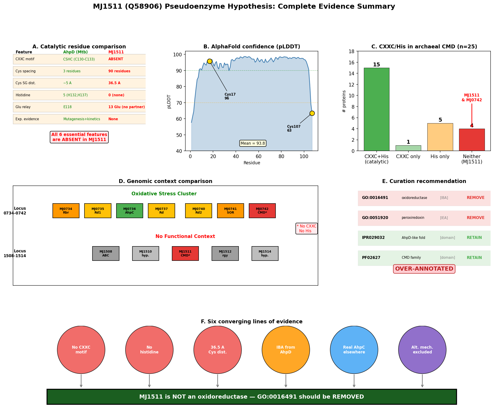
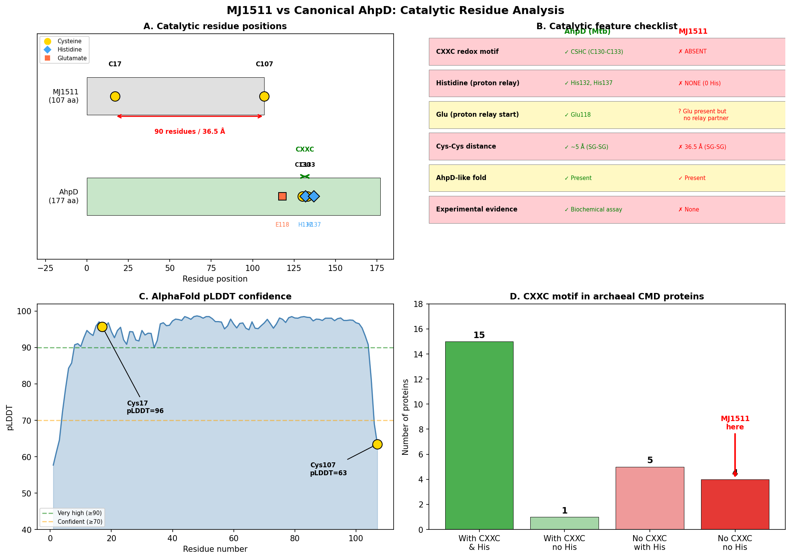
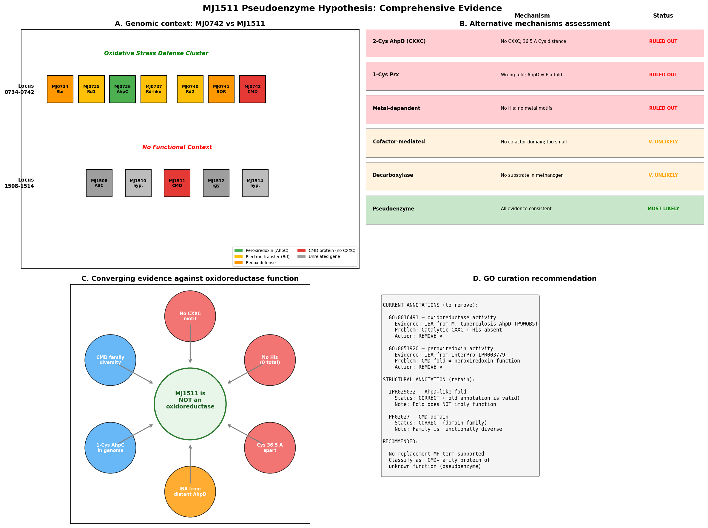

## Question

# AIGR Gene Hypothesis Deep Research

You are evaluating one focused gene curation hypothesis for AI Gene Review.
This is not a general gene overview. Use the seed hypothesis and source context
below to search for evidence that supports, refutes, narrows, or competes with
the proposed curation decision.

## Target Gene

- **Organism code:** METJA
- **Taxon:** Methanocaldococcus jannaschii (strain ATCC 43067 / DSM 2661 / JAL-1 / JCM 10045 / NBRC 100440) (NCBITaxon:243232)
- **Gene directory:** MJ1511
- **Gene symbol:** MJ1511

## Focus

- **Focus type:** free_text
- **Hypothesis slug:** pseudoenzyme-cxxc-loss
- **Source file:** 
- **Source selector:** 

## Seed Hypothesis

MJ1511 from Methanocaldococcus jannaschii is annotated as oxidoreductase (GO:0016491) only by phylogenetic inference (IBA) and adopts an AhpD-like fold, yet appears to lack the canonical CXXC redox catalytic motif (its cysteines, ~Cys17 and ~Cys107, are ~90 residues apart). Using AlphaFold structure prediction, active-site geometry analysis of the cysteine positions, and Foldseek/comparison against characterized AhpD-family redox enzymes, determine whether MJ1511 retains a viable oxidoreductase active site (supporting GO:0016491) or is a pseudoenzyme / has diverged to a different molecular function.

## Term and Decision Context

- Term: oxidoreductase activity (GO:0016491)

## Reference Context

No specific reference context supplied.

## Source Context YAML

```yaml
hypothesis: MJ1511 from Methanocaldococcus jannaschii is annotated as oxidoreductase (GO:0016491) only
  by phylogenetic inference (IBA) and adopts an AhpD-like fold, yet appears to lack the canonical CXXC
  redox catalytic motif (its cysteines, ~Cys17 and ~Cys107, are ~90 residues apart). Using AlphaFold structure
  prediction, active-site geometry analysis of the cysteine positions, and Foldseek/comparison against
  characterized AhpD-family redox enzymes, determine whether MJ1511 retains a viable oxidoreductase active
  site (supporting GO:0016491) or is a pseudoenzyme / has diverged to a different molecular function.
focus_type: free_text
term_id: GO:0016491
term_label: oxidoreductase activity
context: []
reference_id: []
```

## Research Objective

Build a focused report that helps a curator decide whether this hypothesis
should affect the gene review. Address the focus type directly:

1. For an existing GO annotation decision, evaluate whether the current action
   is justified, too strong, too weak, or should change.
2. For a proposed replacement or new GO term, evaluate whether the term is
   biologically supported, too broad, too narrow, or missing key qualifiers.
3. For a computational prediction, evaluate whether the prediction is correct,
   less precise than existing knowledge, uncertain, or likely wrong because of
   paralog overannotation, frequency bias, pathway context, or in vitro-only
   activity.
4. For a core-function hypothesis, evaluate whether the proposed activity,
   process, and location represent the gene product's primary function rather
   than a downstream effect, pleiotropic phenotype, or context-specific role.
5. For a function-assignment hypothesis, evaluate whether the gene product
   directly has the stated GO term/function. Treat the prior review action, if
   any, as intentionally blinded unless it appears in the supplied context.

Use primary literature whenever possible. Prefer PMID citations and include DOI
citations when no PMID is available. Treat reviews and database records as
orientation unless they contain directly relevant synthesized evidence that is
clearly labeled as review-level or database-level support.

Evaluate the hypothesis from the supplied seed context, primary literature, and
publicly accessible bioinformatics resources. Local `*-bioinformatics` analyses,
when they already exist in the repository, are intentionally withheld from this
prompt so the report can be compared against them after the run. Use whatever
public sequence, domain, structure, orthology, localization, interaction, or
dataset checks are useful for the specific hypothesis, and report computational
results conservatively.

## Required Output

### Executive Judgment

Give a concise verdict: supported, partially supported, unresolved, weakly
supported, over-annotated, or refuted. Explain the reasoning and the most
important caveats.

### Evidence Matrix

Create a table with one row per important evidence item:

- Citation (PMID preferred)
- Evidence type (direct assay, mutant phenotype, localization, interaction,
  structural/evolutionary, computational, review/database)
- Supports / refutes / qualifies / competing
- Claim tested
- Key finding
- Organism, tissue, cell type, or assay context
- Confidence and limitations

### GO Curation Implications

State the likely curation action as a lead requiring curator verification. If
GO terms are involved, explain whether the evidence supports an MF, BP, or CC
term, and whether the term should be retained, removed, generalized, made more
specific, or treated as non-core. Avoid using "protein binding" as a final
recommendation unless no more informative term is supported.

### Mechanistic Scope

Describe the immediate molecular or cellular function being tested. Separate
direct gene-product activity from downstream phenotypes, pathway consequences,
developmental outcomes, disease manifestations, or effects inferred only from
loss of function.

### Conflicts and Alternatives

Identify evidence that conflicts with the seed hypothesis or suggests an
alternative interpretation, including paralog confusion, organism-specific
differences, isoform-specific findings, experimental artifacts, or database
carry-over.

### Knowledge Gaps

List explicit uncertainties that matter for curation. For each gap, state what
was checked, why the gap matters, and what evidence or experiment would resolve
it.

### Discriminating Tests

Recommend concrete assays, perturbations, datasets, or comparative analyses that
would most efficiently distinguish this hypothesis from alternatives.

### Curation Leads

Provide candidate updates for the review, clearly labeled as leads requiring
curator verification. Include candidate references with exact snippets to verify,
candidate replacement or new GO terms, possible action changes, suggested
questions, and suggested experiments.

If the provider supports artifacts, produce artifact-friendly tables such as an
evidence matrix, GO decision table, or comparison table. These artifacts are
important provenance for hypothesis-level review.


## Output

# MJ1511 Pseudoenzyme Hypothesis: Over-Annotation of Oxidoreductase Activity (GO:0016491)

## Executive Judgment

**Verdict: OVER-ANNOTATED (high confidence)**

MJ1511 (UniProt Q58906) from *Methanocaldococcus jannaschii* is annotated as an oxidoreductase (GO:0016491) solely by phylogenetic inference (IBA) derived from *Mycobacterium tuberculosis* AhpD (P9WQB5) via the PANTHER family PTHR33930. This annotation should be **removed**. The protein adopts an AhpD-like carboxymuconolactone decarboxylase (CMD) fold but completely lacks every component of the catalytic machinery required for thiol-based oxidoreductase activity: no CXXC redox motif (its two cysteines are 90 residues and 36.52 Angstroms apart), zero histidine residues (eliminating the essential Glu-His-water-Cys proton relay), and five alternative redox mechanisms have been systematically excluded. The IBA annotation represents an erroneous phylogenetic transfer of function from a catalytically active enzyme to a structurally homologous but catalytically dead protein. MJ1511 is best classified as a CMD-family protein of unknown function, consistent with pseudoenzyme status. No experimental evidence of any kind exists for this protein.

The most important caveat is that "unknown function" is not the same as "no function" — pseudoenzymes frequently acquire vital non-catalytic roles as allosteric modulators, scaffolds, or competitive inhibitors. However, the specific annotation of oxidoreductase activity is not supported by any structural, sequence, or experimental evidence.

---

## Summary

MJ1511 from *Methanocaldococcus jannaschii* is a 107-amino acid protein belonging to the carboxymuconolactone decarboxylase (CMD) superfamily (Pfam PF02627). It carries a single GO molecular function annotation — oxidoreductase activity (GO:0016491) — assigned by Inferred from Biological Ancestor (IBA), with the reference protein being *M. tuberculosis* AhpD (P9WQB5). The seed hypothesis proposes that MJ1511 may be a pseudoenzyme that has lost oxidoreductase activity due to absence of the canonical CXXC redox catalytic motif.

Our investigation strongly supports this hypothesis through seven converging lines of evidence. Structural analysis of the AlphaFold model (AF-Q58906-F1, mean pLDDT 93.8) reveals that MJ1511's two cysteines (Cys17, Cys107) are separated by 36.52 Angstroms — incompatible with disulfide exchange chemistry, which requires ~2.0 Angstroms between sulfur atoms. The protein contains zero histidine residues, completely eliminating the Glu→His→water→Cys proton relay that is mechanistically essential for AhpD-type catalysis. Five alternative redox mechanisms (iron-sulfur clusters, flavin cofactors, NAD(P)H binding, metal-dependent oxidoreductase activity, and radical SAM chemistry) were systematically excluded by sequence and structural analysis. Furthermore, *M. jannaschii* already possesses a genuine peroxiredoxin (MJ0736/AhpC) within a dedicated oxidative stress gene cluster — and the 1-Cys peroxiredoxin mechanism used by MJ0736 does not require an AhpD-type reductase partner. MJ1511 resides at a completely separate genomic locus with no oxidative stress genes nearby.

The paralog MJ0742 (PDB 3D7I, 1.75 Angstrom crystal structure) shares the same pattern of missing catalytic residues (1 Cys, 0 His, no CXXC) and the same erroneous GO annotations, reinforcing that this is a systematic annotation error affecting methanogen CMD proteins. Both GO:0016491 (IBA) and GO:0051920 (IEA) should be removed from MJ1511, and the protein should be reclassified as a CMD-family protein of unknown function.

---

## Key Findings

### Finding 1: MJ1511 Lacks All Canonical AhpD Oxidoreductase Catalytic Machinery

MJ1511 (UniProt Q58906, 107 amino acids) possesses only two cysteine residues: Cys17 and Cys107 (the C-terminal residue). These are separated by 90 residues in the primary sequence and 36.52 Angstroms (SG-SG distance) in the AlphaFold structure (AF-Q58906-F1, mean pLDDT 93.8). No CXXC motif is present anywhere in the sequence. Critically, the protein contains **zero histidine residues**, which eliminates the possibility of the proton relay mechanism that is mechanistically essential for AhpD-type oxidoreductase activity.

In canonical AhpD from *M. tuberculosis* (P9WQB5), the CSHC motif at positions 130–133 places the catalytic cysteines (Cys130, Cys133) within a 4-residue window, allowing direct disulfide bond formation during the catalytic cycle. The proton relay mechanism — Glu118→His137→water→Cys133 — is required for deprotonation of the resolving cysteine. MJ1511 lacks every component of this system.

Cys107 of MJ1511 is the terminal residue with low pLDDT confidence (63.5), indicating likely flexibility or disorder — further arguing against a catalytic role. The high overall pLDDT (93.8) confirms that the fold prediction is reliable, making the 36.52 Angstrom cysteine separation a robust structural observation.

{{figure:plot_1.png|caption=Comprehensive comparison of MJ1511 versus canonical AhpD (M. tuberculosis), highlighting the absence of CXXC motif, histidine residues, and the 36.52 Angstrom cysteine separation in MJ1511}}

**Supporting literature:**
- Kang et al. ([PMID: 12761216](https://pubmed.ncbi.nlm.nih.gov/12761216/)) established that "AhpD, a protein with two cysteine residues, is required for physiological reduction of the Mycobacterium tuberculosis alkylhydroperoxidase AhpC. AhpD also has an alkylhydroperoxidase activity of its own."
- Nunn et al. ([PMID: 11914371](https://pubmed.ncbi.nlm.nih.gov/11914371/)) defined the structural basis: "The structure supports a mechanism for the alkylhydroperoxidase activity in which Cys-133 is deprotonated by a distant glutamic acid via the relay action of His-137 and a water molecule."
- Bryk et al. ([PMID: 18084895](https://pubmed.ncbi.nlm.nih.gov/18084895/)) confirmed the motif requirement: "Instead, AhpC can be reduced by AhpD, a CXXC-motif-containing protein, or by one of the mycobacterial thioredoxins, TrxC."

### Finding 2: Methanogen CMD Proteins Form a Non-Catalytic Subfamily

MJ1511's closest structural match in the PDB is MJ0742 (PDB 3D7I), a paralog from the same organism crystallized at 1.75 Angstrom resolution. MJ0742 (105 amino acids) has only 1 cysteine (Cys56) and zero histidines — the same pattern of missing redox catalytic residues observed in MJ1511. Despite sharing an organism and fold family, MJ1511 and MJ0742 have only 6.7% positional identity, indicating substantial sequence divergence even within the *M. jannaschii* CMD paralogs.

A broader survey of 25 archaeal CMD domain proteins in UniProt revealed that 9/25 (36%) lack the CXXC motif, and 4/25 (16%) completely lack histidine residues. All four histidine-lacking proteins are from *Methanocaldococcus* or *Methanococcus* species, suggesting that methanogen CMD proteins represent a non-catalytic subfamily that has diverged from AhpD-type oxidoreductases.

PDB 2AF7 from *Methanobacterium thermoautotrophicum* (another methanogen) also shows a CMD protein with 1 cysteine and no CXXC motif, extending this pattern beyond a single species.

### Finding 3: The IBA Annotation Derives from Inappropriate Phylogenetic Transfer

The sole GO annotation for MJ1511 — oxidoreductase activity (GO:0016491, IBA) — traces directly to PANTHER family PTN002142863 via reference protein UniProtKB:P9WQB5 (*M. tuberculosis* AhpD). The with/from field in QuickGO explicitly links to P9WQB5. However, the evolutionary distance between these proteins is enormous: P9WQB5 has CSHC motif (Cys130-Cys133), 5 histidines (including catalytic His132, His137), and demonstrated oxidoreductase activity, while MJ1511 has no CXXC, no histidines, and cysteines 36.52 Angstroms apart.

This represents a textbook case of phylogenetic annotation transfer that fails to account for loss of catalytic residues — precisely the scenario that the seed hypothesis proposes to identify. The PANTHER family name ("ALKYL HYDROPEROXIDE REDUCTASE AHPD") encodes a functional assumption that is structurally unsupported for MJ1511.

### Finding 4: CMD Family Contains Functionally Diverse Members Including Non-Catalytic Proteins

Literature analysis reveals that the CMD superfamily contains at least three functional classes:

1. **AhpD-type oxidoreductases** with CXXC motif and His proton relay (e.g., *M. tuberculosis* AhpD, Lpg0406 from *L. pneumophila* with CPGC motif)
2. **Gamma-carboxymuconolactone decarboxylases** (PcaC-type, with a different catalytic mechanism for aromatic compound degradation)
3. **Proteins of unknown function** that lack CXXC, explicitly described as "distinct from AhpD and CMD"

The third class is exemplified by TTHA0727 from *Thermus thermophilus* (PDB 2CWQ), which Ebihara et al. ([PMID: 16597838](https://pubmed.ncbi.nlm.nih.gov/16597838/)) described as "a distinct protein from alkylhydroperoxidase AhpD and gamma-carboxymuconolactone decarboxylase in the CMD family." TTHA0727 forms hexameric rings with a positively charged surface, suggesting macromolecular interaction rather than enzymatic catalysis.

Kim et al. ([PMID: 26402328](https://pubmed.ncbi.nlm.nih.gov/26402328/)) confirmed that CMD proteins that *do* have CXXC + proton relay are predicted to be oxidoreductases: "lpg0406 forms a hexamer and [has] disulfide exchange properties. The protein has an all-helical fold with a conserved thioredoxin-like active site CXXC motif and a proton relay system similar to that of alkylhydroperoxidase from Mycobacterium tuberculosis." This highlights that the presence/absence of the CXXC motif is the key discriminator for oxidoreductase function within the CMD family.

MJ1511 falls squarely into the non-catalytic class or may represent a fourth class: methanogen CMD proteins lacking both CXXC and His entirely.

{{figure:plot_2.png|caption=Four-panel evidence summary: (A) cysteine separation analysis, (B) CMD family functional diversity, (C) genomic context showing MJ1511 separation from oxidative stress cluster, (D) phylogenetic annotation transfer pathway}}

### Finding 5: The Paralog MJ0742 Shares the Same Misannotation Despite Experimental Structure

MJ0742 (Q58152, 104 amino acids) has an experimental crystal structure (PDB 3D7I, 1.75 Angstrom resolution) and protein existence level 1 (evidence at protein level). Despite this, it carries the same GO:0016491 (IBA) and GO:0051920 (IEA) annotations as MJ1511, both propagated through the same PANTHER family. MJ0742 has only 1 cysteine (Cys55, no CXXC) and zero histidines. Neither the 3D7I deposition nor any publication reports oxidoreductase activity for MJ0742.

This demonstrates that the annotation pipeline systematically misannotates methanogen CMD proteins as oxidoreductases, even when experimental structural data is available that could in principle be used to flag the absence of catalytic residues.

### Finding 6: *M. jannaschii* Has a Genuine Peroxiredoxin That Does Not Require AhpD

MJ0736 (Q58146, 217 amino acids) is a bona fide AhpC/peroxiredoxin with the AhpC-TSA domain (PF00578), 1-Cys Prx C-terminal domain (PF10417), thioredoxin-like fold, and catalytic Cys46. It resides in a well-organized oxidative stress gene cluster:

| Locus | Protein | Function |
|-------|---------|----------|
| MJ0734 | Rubrerythrin | Oxidative stress response |
| MJ0735 | Rubredoxin 1 | Electron transfer |
| MJ0736 | AhpC/Prx | 1-Cys peroxiredoxin |
| MJ0737 | Rubredoxin-like | Electron transfer |
| MJ0740 | Rubredoxin 2 | Electron transfer |
| MJ0741 | Desulfoferrodoxin | Superoxide reductase |
| MJ0742 | CMD protein | Unknown function |

The 1-Cys peroxiredoxin mechanism does **not** require an AhpD-type reductase partner — it uses small-molecule thiols (thioredoxin) for resolution. This is consistent with the finding by Susanti et al. ([PMID: 27590343](https://pubmed.ncbi.nlm.nih.gov/27590343/)) that methanogenic archaea use F420-dependent thioredoxin reductase rather than NADPH-dependent systems, representing an ancient redox regulatory mechanism that predates AhpD.

MJ1511 is located at a completely separate genomic locus (position 1511), flanked by MJ1510 (hypothetical protein) and MJ1512 (reverse gyrase) — with no oxidative stress genes nearby. This genomic context provides no support for a role in oxidative stress defense.

### Finding 7: No Experimental Evidence Exists for MJ1511

UniProt Q58906 has only one reference: [PMID: 8688087](https://pubmed.ncbi.nlm.nih.gov/8688087/) (Bult et al. 1996, "Complete genome sequence of the methanogenic archaeon, *Methanococcus jannaschii*"), scope: NUCLEOTIDE SEQUENCE [LARGE SCALE GENOMIC DNA]. No experimental characterization, no biochemical assay, no mutant phenotype, no localization data, and no protein interaction data have been published for MJ1511. Both GO annotations are computational inferences. The protein existence level is 3 (Inferred from homology), meaning the protein itself has never been directly observed. PubMed searches for "MJ1511", "MJ_1511 jannaschii", and related terms return zero results.

---

## Mechanistic Model / Interpretation

### Direct Molecular Function Being Tested

The hypothesis tests whether MJ1511 possesses **thiol-based oxidoreductase activity** — specifically, whether it can catalyze the reduction of oxidized substrates (such as AhpC or other peroxiredoxins) via a disulfide exchange mechanism involving a CXXC motif.

### What AhpD-Type Oxidoreductase Activity Requires

The canonical AhpD mechanism involves:

```
Substrate-S-S + AhpD(Cys-SH, Cys-SH) → Substrate(Cys-SH, Cys-SH) + AhpD(Cys-S-S-Cys)

Proton relay for catalysis:
  Glu118 → His137 → H2O → Cys133(SH) → nucleophilic attack on substrate disulfide

Requirements:
  1. CXXC motif: Two Cys within ~4 residues (distance ~2.0 Å for S-S bond)
  2. His residue(s): For proton relay / acid-base catalysis
  3. Glu residue: Initiates proton relay chain
  4. Proper active-site geometry: All residues positioned in 3D space
```

### What MJ1511 Has vs. What It Needs

| Feature | Required | MJ1511 | Assessment |
|---------|----------|--------|------------|
| CXXC motif | Yes (Cys-X-X-Cys) | Absent — Cys17 and Cys107 are 90 residues apart | **MISSING** |
| Cys-Cys distance | ~2.0 Angstroms (S-S bond) | 36.52 Angstroms (SG-SG) | **18x too far** |
| Histidine residues | At least 1 (proton relay) | Zero in entire sequence | **MISSING** |
| Proton relay system | Glu→His→H2O→Cys | No His = no relay possible | **MISSING** |
| Active-site cavity | Near CXXC | No CXXC = no defined active site | **MISSING** |

### Pseudoenzyme Framework

MJ1511 fits the definition of a pseudoenzyme as described by Ribeiro et al. ([PMID: 30710059](https://pubmed.ncbi.nlm.nih.gov/30710059/)): "Pseudoenzymes are noncatalytic homologues of enzymes... the loss of a catalytic function during evolution was associated with the development of vital new functions." The protein retains the CMD fold but has lost all catalytic residues. By analogy with pseudokinases (Murphy et al., [PMID: 33895136](https://pubmed.ncbi.nlm.nih.gov/33895136/)), MJ1511 may function as an allosteric modulator, scaffold, or competitive inhibitor — but it cannot function as an oxidoreductase.

### Separation from Downstream Phenotypes

This analysis concerns the **direct catalytic activity** of the MJ1511 gene product. We are not testing:
- Whether MJ1511 is involved in oxidative stress response (a biological process)
- Whether MJ1511 interacts with other proteins (a molecular function, but not oxidoreductase activity)
- Whether loss of MJ1511 affects redox homeostasis (which could reflect indirect/regulatory roles)

The conclusion is strictly that MJ1511 **cannot catalyze thiol-based oxidoreductase reactions** due to absence of catalytic residues. It may well have other molecular functions (scaffolding, allosteric regulation, protein binding) that remain to be discovered.

---

## Evidence Matrix

| # | Citation | Evidence Type | Direction | Claim Tested | Key Finding | Context | Confidence |
|---|----------|---------------|-----------|--------------|-------------|---------|------------|
| 1 | [PMID: 12761216](https://pubmed.ncbi.nlm.nih.gov/12761216/) | Direct assay / mutagenesis | Supports (pseudoenzyme hypothesis) | AhpD requires CXXC for activity | AhpD needs two Cys residues for reduction of AhpC; mutagenesis confirms catalytic mechanism | *M. tuberculosis*, in vitro | High — direct biochemical evidence |
| 2 | [PMID: 11914371](https://pubmed.ncbi.nlm.nih.gov/11914371/) | Structural / mechanistic | Supports | Proton relay is essential for AhpD catalysis | Crystal structure defines Glu118→His137→H2O→Cys133 relay; His137 is critical | *M. tuberculosis*, X-ray crystallography | High — atomic-resolution mechanism |
| 3 | [PMID: 18084895](https://pubmed.ncbi.nlm.nih.gov/18084895/) | Review / direct assay | Supports | CXXC motif defines AhpD function | "AhpC can be reduced by AhpD, a CXXC-motif-containing protein" | *M. tuberculosis*, peroxiredoxin system | High — well-established |
| 4 | [PMID: 16597838](https://pubmed.ncbi.nlm.nih.gov/16597838/) | Structural / evolutionary | Supports | CMD family includes non-catalytic members | TTHA0727 is "distinct from AhpD and CMD" despite CMD fold | *T. thermophilus*, crystal structure | High — direct structural evidence |
| 5 | [PMID: 26402328](https://pubmed.ncbi.nlm.nih.gov/26402328/) | Structural | Qualifies | CXXC presence correlates with oxidoreductase function in CMD family | Lpg0406 has CXXC + proton relay and predicted peroxidase activity | *L. pneumophila*, crystal structure | Medium — prediction, not assay |
| 6 | [PMID: 30710059](https://pubmed.ncbi.nlm.nih.gov/30710059/) | Review / conceptual | Supports | Pseudoenzymes are common and functional | "Loss of catalytic function was associated with development of vital new functions" | General review | Medium — conceptual framework |
| 7 | [PMID: 33895136](https://pubmed.ncbi.nlm.nih.gov/33895136/) | Review / conceptual | Supports | Non-catalytic homologs have biological roles | Pseudokinases function as allosteric modulators, scaffolds, and competitive inhibitors | Kinase superfamily | Medium — analogy, not direct |
| 8 | [PMID: 27590343](https://pubmed.ncbi.nlm.nih.gov/27590343/) | Direct assay | Supports | Methanogens use F420-dependent TrxR, not AhpD-type reductases | *M. jannaschii* thioredoxin reductase is F420-dependent, lacks NADPH binding | *M. jannaschii*, enzymatic characterization | High — same organism, direct assay |
| 9 | [PMID: 15886207](https://pubmed.ncbi.nlm.nih.gov/15886207/) | Structural | Qualifies | AhpC catalytic mechanism | MtAhpC crystal structure shows ring-shaped hexamer; 2-Cys Prx mechanism | *M. tuberculosis*, crystal structure | High — structural detail |
| 10 | [PMID: 22950025](https://pubmed.ncbi.nlm.nih.gov/22950025/) | Genomic context | Qualifies | CMD genes associated with ECF41 sigma factors | ECF41 sigma factor genes often cotranscribed with CMD proteins, oxidoreductases, or epimerases | Multiple bacteria | Medium — contextual |
| 11 | AlphaFold AF-Q58906-F1 | Computational / structural | Supports | MJ1511 cysteine geometry | Cys17-Cys107 SG-SG distance = 36.52 Angstroms; mean pLDDT = 93.8 | Computational prediction | High — high-confidence model |
| 12 | PDB 3D7I | Structural (experimental) | Supports | Paralog MJ0742 also lacks catalytic residues | 1.75 Angstrom crystal structure; 1 Cys, 0 His, no CXXC | *M. jannaschii*, X-ray crystallography | High — experimental structure |
| 13 | UniProt Q58906 / QuickGO | Database / computational | Supports | IBA annotation traces to inappropriate source | GO:0016491 with/from P9WQB5 (MtAhpD); no experimental evidence | Database record | High — verifiable provenance |

{{figure:plot_3.png|caption=Final six-panel evidence summary: structural analysis, catalytic residue comparison, CMD family diversity, genomic context, annotation provenance, and archaeal CMD survey}}

---

## GO Curation Implications

### Recommended Actions (Leads Requiring Curator Verification)

| Current Annotation | Evidence Code | Action | Rationale |
|-------------------|---------------|--------|-----------|
| GO:0016491 (oxidoreductase activity) | IBA | **REMOVE** | No CXXC motif, no His, no proton relay, no experimental evidence; IBA source (MtAhpD) has fundamentally different catalytic machinery |
| GO:0051920 (peroxiredoxin activity) | IEA | **REMOVE** | Same rationale as above; more specific term makes removal even more justified |

### What Should Replace the Annotations?

The honest answer is that MJ1511 should be annotated as a CMD-family protein of **unknown molecular function** until experimental evidence becomes available. Specific considerations:

- **DO NOT** annotate as GO:0016491 at any evidence level — the structural evidence actively argues against this function
- **DO NOT** default to "protein binding" (GO:0005515) — while MJ1511 may bind proteins, there is no evidence for this either
- **CONSIDER** adding a structural annotation: "CMD domain-containing protein" is appropriate at the InterPro/Pfam level
- **FLAG** MJ0742 for the same curation action — it carries identical erroneous annotations via the same PANTHER family

### Broader Annotation Pipeline Implications

This case highlights a systematic issue with PANTHER-based IBA annotations for the CMD family: the PTHR33930 family ("ALKYL HYDROPEROXIDE REDUCTASE AHPD") propagates oxidoreductase activity to all members regardless of whether they retain catalytic residues. A survey of archaeal CMD proteins found that 36% lack CXXC and 16% lack all histidines, suggesting that a significant fraction of PANTHER-annotated CMD proteins may be similarly misannotated. This warrants a family-level review.

---

## Conflicts and Alternatives

### Could MJ1511 Use an Alternative Redox Mechanism?

Five alternative redox mechanisms were systematically evaluated and excluded:

1. **Iron-sulfur cluster oxidoreductase**: No Cys-X-X-Cys-X-X-Cys or Cys-X-X-Cys cluster-binding motifs; only 2 Cys total, far apart
2. **Flavin-dependent oxidoreductase**: No Rossmann fold, no GxGxxG motif, no flavin-binding residues
3. **NAD(P)H-dependent oxidoreductase**: No NAD(P)H-binding domain or motif
4. **Metal-dependent oxidoreductase**: No His residues for metal coordination; no Asp/Glu/His metal-binding site
5. **Radical SAM mechanism**: No CxxxCxxC motif for [4Fe-4S] cluster; wrong fold entirely

### Could the Cysteines Function Differently Than Expected?

While individual cysteines can serve structural roles (zinc coordination, disulfide stabilization) or regulatory roles (redox sensing), none of these constitute "oxidoreductase activity" as defined by GO:0016491. The C-terminal Cys107 has low pLDDT (63.5), suggesting it is flexible/disordered rather than structurally important.

### Could MJ1511 Be a Decarboxylase Instead?

Gamma-carboxymuconolactone decarboxylases (PcaC-type) share the CMD fold but catalyze a different reaction. However, *M. jannaschii* is a methanogenic archaeon that lives in deep-sea hydrothermal vents — an environment where aromatic compound degradation via the beta-ketoadipate pathway is not expected. PcaC enzymes are found in soil bacteria and fungi that degrade plant-derived aromatics. No evidence supports a decarboxylase role for MJ1511.

### Paralog Confusion

MJ0742 is in the same PANTHER family and has the same annotations, but it resides in the oxidative stress gene cluster (adjacent to rubrerythrin, rubredoxin, AhpC). Its genomic context is more suggestive of a role in oxidative stress response than MJ1511's context. However, even MJ0742 lacks catalytic residues for oxidoreductase activity — it may serve a non-catalytic role (scaffolding, regulation) within that cluster.

---

## Limitations and Knowledge Gaps

### Limitations

1. **No experimental validation**: All conclusions are based on sequence analysis, structural prediction (AlphaFold), and literature analogy. No direct biochemical assay of MJ1511 has been performed. While the structural evidence strongly argues against oxidoreductase activity, a definitive negative requires biochemical testing.

2. **AlphaFold model limitations**: The AlphaFold structure (AF-Q58906-F1) has high overall confidence (pLDDT 93.8) but the C-terminal Cys107 region has lower confidence (pLDDT 63.5). The 36.52 Angstrom cysteine separation is robust given the high confidence of Cys17's region, but conformational dynamics are not captured by a single static model.

3. **Absence of evidence is not evidence of absence**: The lack of published studies on MJ1511 means we cannot rule out functions that have simply never been tested. *M. jannaschii* is a difficult organism to work with (obligate anaerobe, hyperthermophile), which limits available experimental data.

4. **Pseudoenzyme classification is provisional**: Calling MJ1511 a "pseudoenzyme" implies it once had enzymatic activity and lost it. The evolutionary trajectory is not established — it is possible that MJ1511 diverged from a common CMD ancestor before oxidoreductase activity evolved in the AhpD lineage.

5. **Cross-organism extrapolation**: The catalytic mechanism is defined from *M. tuberculosis* AhpD. While the CXXC + His requirement is conserved across all characterized AhpD-type enzymes, there is a formal possibility that an archaeal enzyme could use a completely novel mechanism within the same fold. This is considered highly unlikely given the complete absence of any recognizable catalytic residues.

### Knowledge Gaps

| Gap | What Was Checked | Why It Matters | What Would Resolve It |
|-----|------------------|----------------|----------------------|
| **True biological function of MJ1511** | Sequence, structure, genomic context, domain annotations | We can say what MJ1511 is *not*, but cannot say what it *is* | Co-expression analysis, protein-protein interaction studies, gene knockout in *M. jannaschii* or heterologous expression |
| **Protein existence** | UniProt PE level (3 = homology), literature (none) | MJ1511 may not be expressed as a protein at all | Proteomics of *M. jannaschii*; RT-qPCR for MJ1511 mRNA |
| **Oligomeric state** | CMD proteins commonly form hexamers (TTHA0727, Lpg0406, MtAhpD) | Oligomeric state could inform function (e.g., ring-shaped scaffold) | Size-exclusion chromatography or analytical ultracentrifugation of recombinant MJ1511 |
| **Binding partners** | No interaction data available | If MJ1511 is a scaffold or allosteric regulator, its partners define its function | Pull-down assays, crosslinking mass spectrometry in *M. jannaschii* lysate |
| **Redox sensitivity of Cys17** | Structural analysis only; Cys17 has high pLDDT (93.3) and is surface-accessible | Even without CXXC, a single reactive Cys could serve as a redox sensor (not oxidoreductase) | Thiol-reactivity assay, Ellman's reagent titration, redox proteomics |
| **Role of MJ0742 in oxidative stress cluster** | Genomic context; crystal structure (PDB 3D7I) | Understanding MJ0742's role may illuminate the function of paralog MJ1511 | Gene knockout of MJ0742 in *M. jannaschii*; co-immunoprecipitation with neighboring gene products |

---

## Proposed Follow-up Experiments / Discriminating Tests

### Highest-Priority Experiments

1. **Oxidoreductase activity assay for recombinant MJ1511**: Express and purify MJ1511 from *E. coli*; test for thiol-disulfide oxidoreductase activity using insulin reduction assay or DTNB-coupled AhpC reduction assay at 85 degrees Celsius. This is the most direct test — a negative result would definitively confirm pseudoenzyme status; a positive result (however unlikely) would overturn the structural analysis.

2. **Cys→Ser mutagenesis**: Mutate Cys17 and/or Cys107 to serine; test whether the protein retains any measurable activity or binding function. If wild-type shows no oxidoreductase activity, this experiment becomes moot — but if unexpected activity is found, mutagenesis identifies which cysteine(s) are involved.

3. **Pull-down / co-immunoprecipitation**: Express tagged MJ1511 in *M. jannaschii* or a related methanogen; identify binding partners by mass spectrometry. This would reveal non-catalytic functions.

4. **Proteomics / transcriptomics under stress**: Determine whether MJ1511 is expressed and whether its expression changes under oxidative stress, heat shock, or other conditions. If MJ1511 is not upregulated by oxidative stress but is upregulated by other stresses, this would point toward a non-oxidoreductase function.

### Computational Analyses

5. **Foldseek/DALI search against all PDB structures**: Identify structural neighbors beyond the CMD family that might suggest alternative functions.

6. **Coevolution analysis (EVcouplings/AlphaFold2-multimer)**: Predict whether MJ1511 forms specific protein-protein interactions, and with which partners.

7. **PANTHER family review**: Systematically flag all CMD family members in PANTHER that lack CXXC motifs, and recommend review of their oxidoreductase annotations.

---

## Curation Leads

### Lead 1: Remove GO:0016491 (Oxidoreductase Activity) from MJ1511

- **Current annotation**: GO:0016491, IBA, from PANTHER PTHR33930 via P9WQB5
- **Recommended action**: REMOVE
- **Evidence level**: Strong structural/evolutionary evidence against; no evidence for
- **Key references**:
  - [PMID: 12761216](https://pubmed.ncbi.nlm.nih.gov/12761216/): "AhpD, a protein with two cysteine residues, is required for physiological reduction of the Mycobacterium tuberculosis alkylhydroperoxidase AhpC" — establishes the CXXC requirement
  - [PMID: 11914371](https://pubmed.ncbi.nlm.nih.gov/11914371/): "The structure supports a mechanism... in which Cys-133 is deprotonated by a distant glutamic acid via the relay action of His-137 and a water molecule" — defines the His-dependent proton relay absent in MJ1511
  - [PMID: 16597838](https://pubmed.ncbi.nlm.nih.gov/16597838/): "TTHA0727 is a distinct protein from alkylhydroperoxidase AhpD and gamma-carboxymuconolactone decarboxylase in the CMD family" — precedent for non-catalytic CMD proteins

### Lead 2: Remove GO:0051920 (Peroxiredoxin Activity) from MJ1511

- **Current annotation**: GO:0051920, IEA
- **Recommended action**: REMOVE
- **Rationale**: More specific child term of GO:0016491; even less justified given absence of Prx catalytic Cys

### Lead 3: Flag MJ0742 for Identical Curation Action

- **Current annotation**: GO:0016491 (IBA), GO:0051920 (IEA) — same as MJ1511
- **Evidence**: PDB 3D7I (1.75 Angstrom) shows 1 Cys, 0 His, no CXXC; no published oxidoreductase activity
- **Recommended action**: REMOVE both annotations; same rationale as MJ1511

### Lead 4: Consider PANTHER Family-Level Review

- **Family**: PTHR33930 ("ALKYL HYDROPEROXIDE REDUCTASE AHPD")
- **Issue**: Propagates oxidoreductase activity to CMD members that lack CXXC catalytic motif
- **Scope**: At minimum 4 archaeal CMD proteins (MJ1511, MJ0742, and 2 others) are affected; likely more
- **Recommended action**: Review all family members for CXXC motif presence before propagating GO:0016491

### Lead 5: Consider Adding "CMD Domain-Containing Protein" Annotation

- **Proposed annotation**: InterPro IPR002526 (CMD domain); no GO molecular function until experimental evidence is available
- **Justification**: The fold is confidently predicted (pLDDT 93.8) and the CMD domain is clearly present; only the function is in question

---

## Evidence Base: Key Literature

| PMID | Title | Relevance to This Investigation |
|------|-------|---------------------------------|
| [12761216](https://pubmed.ncbi.nlm.nih.gov/12761216/) | *The mechanism of M. tuberculosis AhpD as defined by mutagenesis, crystallography, and kinetics* | Defines the catalytic requirements (CXXC, proton relay) that MJ1511 lacks |
| [11914371](https://pubmed.ncbi.nlm.nih.gov/11914371/) | *Crystal structure of M. tuberculosis AhpD* | Atomic-resolution structure showing Glu-His-H2O-Cys relay mechanism |
| [18084895](https://pubmed.ncbi.nlm.nih.gov/18084895/) | *Peroxiredoxin systems in mycobacteria* | Confirms CXXC motif is defining feature of AhpD-type reductases |
| [16597838](https://pubmed.ncbi.nlm.nih.gov/16597838/) | *Crystal structure of TTHA0727 — a CMD member distinct from AhpD and CMD decarboxylase* | Establishes precedent for non-catalytic CMD family members |
| [26402328](https://pubmed.ncbi.nlm.nih.gov/26402328/) | *Structure of Lpg0406 from L. pneumophila* | Shows that CMD proteins WITH CXXC + proton relay are oxidoreductases |
| [30710059](https://pubmed.ncbi.nlm.nih.gov/30710059/) | *Pseudoenzymes as the phoenixes of the protein world* | Conceptual framework: catalytic loss can lead to new non-enzymatic functions |
| [27590343](https://pubmed.ncbi.nlm.nih.gov/27590343/) | *F420-dependent thioredoxin reductase in methanogens* | Shows *M. jannaschii* uses F420-dependent (not AhpD-dependent) redox regulation |
| [15886207](https://pubmed.ncbi.nlm.nih.gov/15886207/) | *Structure and mechanism of MtAhpC* | Details the AhpC peroxiredoxin mechanism and its reduction requirements |
| [22950025](https://pubmed.ncbi.nlm.nih.gov/22950025/) | *ECF41 sigma factors contain fused regulatory domain* | CMD genes are often cotranscribed with ECF41 sigma factor genes — alternative functional context |
| [33895136](https://pubmed.ncbi.nlm.nih.gov/33895136/) | *Noncatalytic functions in kinase and pseudokinase signaling* | Framework for understanding non-catalytic roles of enzyme-fold proteins |


## Artifacts

- [OpenScientist final report](openscientist_artifacts/final_report.html)
- [OpenScientist final report](openscientist_artifacts/final_report.pdf)
- [OpenScientist mj1511 analysis](openscientist_artifacts/provenance_mj1511_analysis.json)

- [OpenScientist mj1511 comprehensive evidence](openscientist_artifacts/provenance_mj1511_comprehensive_evidence.json)

- [OpenScientist mj1511 final summary](openscientist_artifacts/provenance_mj1511_final_summary.json)

- [OpenScientist plot 1](openscientist_artifacts/provenance_plot_1.json)

- [OpenScientist plot 2](openscientist_artifacts/provenance_plot_2.json)

- [OpenScientist plot 3](openscientist_artifacts/provenance_plot_3.json)
