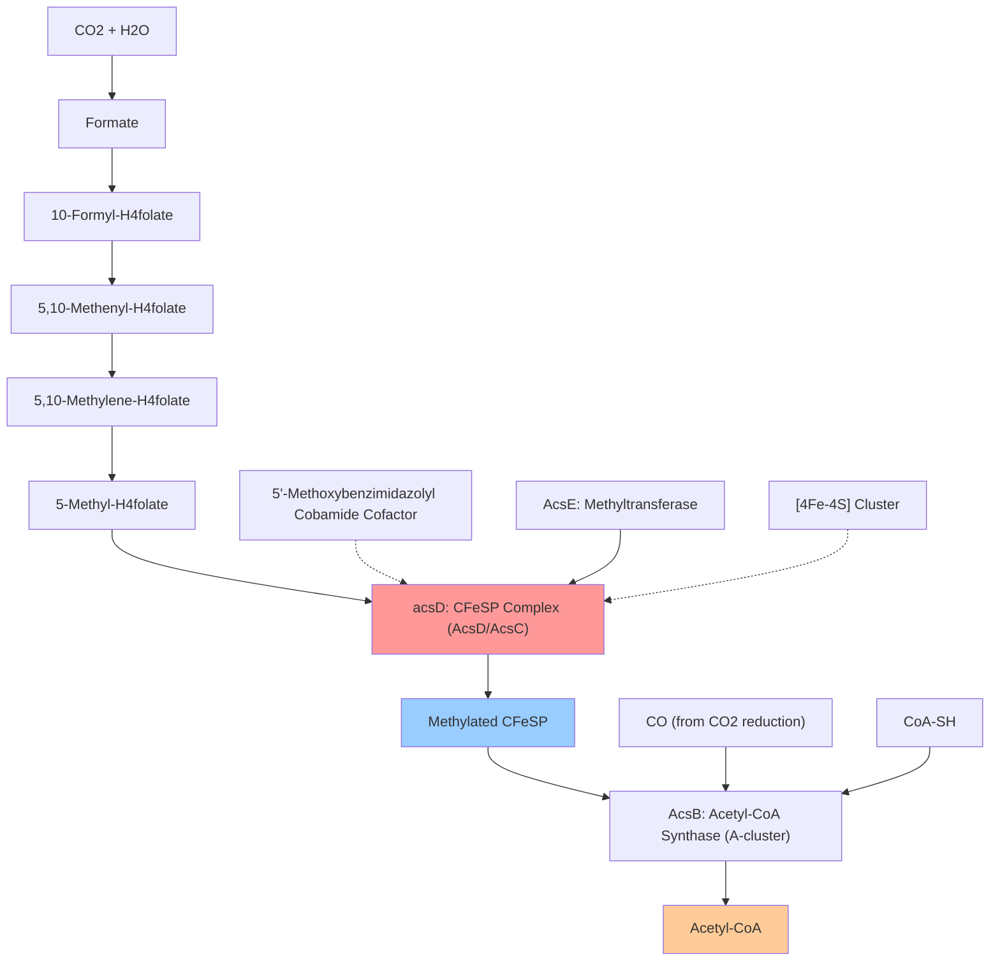

# Pathway Summary for acsD

## Overview
acsD participates in the Wood-Ljungdahl carbon fixation pathway where it functions as the small subunit of the corrinoid iron-sulfur protein (CFeSP) complex [PMID:22419154]. This essential enzyme acts as a methyl group carrier that receives methyl groups from 5-methyltetrahydrofolate via the methyltransferase AcsE and subsequently transfers them to acetyl-CoA synthase (AcsB) for acetyl-CoA biosynthesis, enabling CO2 fixation and autotrophic growth in acetogenic bacteria.

## Wood-Ljungdahl Carbon Fixation Pathway
The Wood-Ljungdahl pathway represents a unique and ancient carbon fixation mechanism that allows acetogenic bacteria like Moorella thermoacetica to grow autotrophically using CO2 as the sole carbon source [PMID:22419154]. This pathway is distinct from other carbon fixation pathways as it directly incorporates CO2 into acetyl-CoA through a series of one-carbon transfer reactions.

AcsD forms a heterodimeric complex with AcsC (large subunit) to create the corrinoid iron-sulfur protein, which serves as the central methyl carrier in this pathway [PMID:22419154]. The protein binds a 5'-methoxybenzimidazolyl cobamide cofactor (a B12 derivative) that enables methyl group transfer reactions essential for the pathway's function.

The pathway operates through a sophisticated molecular mechanism where AcsD receives methyl groups from methyltetrahydrofolate via the methyltransferase AcsE, stores them on its corrinoid cofactor, and then delivers them to the Ni2Fe4S4 active site metallocluster (A-cluster) of acetyl-CoA synthase, where the methyl group becomes incorporated into acetyl-CoA [PMID:22419154].

## One-Carbon Metabolism and Methyl Transfer
AcsD plays a critical role in one-carbon metabolism by serving as an intermediary that facilitates the transfer of C1 units between folate metabolism and acetyl-CoA biosynthesis [PMID:22419154]. This function connects the cellular folate pool with central carbon metabolism, enabling the efficient utilization of one-carbon compounds for biosynthetic purposes.

The protein's corrinoid cofactor undergoes cyclic oxidation and reduction states during methyl transfer, with the methylcob(III)alamin intermediate being highly reactive and requiring protection from side reactions. AcsD provides this protection through its specific protein architecture that shields the cofactor while enabling controlled methyl transfer.

## Wood-Ljungdahl Carbon Fixation Pathway Diagram

## Energy Metabolism and Autotrophic Growth
The Wood-Ljungdahl pathway mediated by AcsD enables acetogenic bacteria to achieve autotrophic growth under strictly anaerobic conditions [PMID:22419154]. This pathway is coupled to energy conservation through electron transport processes that generate ATP, making it a complete autotrophic system that supports cellular growth using only CO2 and simple electron donors.

AcsD's function is essential for this autotrophic lifestyle, as disruption of methyl transfer would prevent acetyl-CoA formation and block carbon fixation. The protein operates within a larger enzymatic network that coordinates carbon fixation with energy metabolism, enabling efficient conversion of CO2 into cellular biomass.

## Protein Complex Assembly and Regulation
AcsD functions as part of a larger protein complex that includes AcsC, AcsE (methyltransferase), and associates with AcsB (acetyl-CoA synthase) [PMID:22419154]. This ~220 kDa assembly creates a sophisticated molecular machine that coordinates multiple catalytic steps in carbon fixation.

The complex assembly places AcsD in optimal position for methyl transfer reactions while protecting the reactive corrinoid cofactor from unwanted side reactions. The heterodimerization with AcsC provides the necessary [4Fe-4S] cluster and structural framework that enables efficient methyl group handling and delivery to acetyl-CoA synthase.

## Environmental and Biotechnological Significance
Understanding AcsD function has important implications for biotechnology applications related to CO2 utilization and bioconversion [PMID:22419154]. The Wood-Ljungdahl pathway represents a highly efficient biological CO2 fixation mechanism that could be engineered for industrial applications such as carbon capture and conversion.

The enzyme's ability to operate under strictly anaerobic conditions and its high efficiency in CO2 fixation make it attractive for developing biotechnological processes that convert CO2 into valuable chemicals and fuels. This represents a sustainable approach to carbon utilization that mirrors natural acetogenic processes.