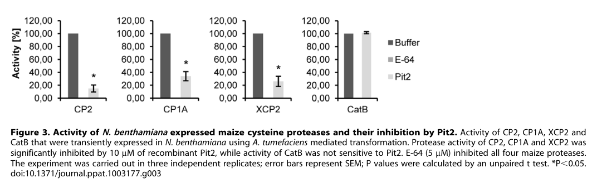

## Question

# Gene Research for Functional Annotation

## ⚠️ CRITICAL: Gene/Protein Identification Context

**BEFORE YOU BEGIN RESEARCH:** You MUST verify you are researching the CORRECT gene/protein. Gene symbols can be ambiguous, especially for less well-characterized genes from non-model organisms.

### Target Gene/Protein Identity (from UniProt):
- **UniProt Accession:** A0A0D1EAR7
- **Protein Description:** RecName: Full=Secreted effector PIT2 {ECO:0000303|PubMed:17080091}; AltName: Full=Proteins important for tumors 2 {ECO:0000303|PubMed:21692877}; Flags: Precursor;
- **Gene Information:** Name=PIT2 {ECO:0000303|PubMed:21692877}; ORFNames=UMAG_01375;
- **Organism (full):** Mycosarcoma maydis (Corn smut fungus) (Ustilago maydis).
- **Protein Family:** Not specified in UniProt
- **Key Domains:** Not specified in UniProt

### MANDATORY VERIFICATION STEPS:

1. **Check if the gene symbol "PIT2" matches the protein description above**
2. **Verify the organism is correct:** Mycosarcoma maydis (Corn smut fungus) (Ustilago maydis).
3. **Check if protein family/domains align with what you find in literature**
4. **If you find literature for a DIFFERENT gene with the same or similar symbol, STOP**

### If Gene Symbol is Ambiguous or You Cannot Find Relevant Literature:

**DO NOT PROCEED WITH RESEARCH ON A DIFFERENT GENE.** Instead:
- State clearly: "The gene symbol 'PIT2' is ambiguous or literature is limited for this specific protein"
- Explain what you found (e.g., "Found extensive literature on a different gene with the same symbol in a different organism")
- Describe the protein based ONLY on the UniProt information provided above
- Suggest that the protein function can be inferred from domain/family information

### Research Target:

Please provide a comprehensive research report on the gene **PIT2** (gene ID: PIT2, UniProt: A0A0D1EAR7) in MYCMD.

The research report should be a detailed narrative explaining the function, biological processes, and localization of the gene product. Citations should be given for all claims.

You should prioritize authoritative reviews and primary scientific literature when conducting research. You can supplement
this with annotations you find in gene/protein databases, but these can be outdated or inaccurate.

We are specifically interested in the primary function of the gene - for enzymes, what reaction is catalyzed, and what is the substrate specificity? For transporters, what is the substrate? For structural proteins or adapters, what is the broader structural role? For signaling molecules, what is the role in the pathway.

We are interested in where in or outside the cell the gene product carries out its function.

We are also interested in the signaling or biochemical pathways in which the gene functions. We are less interested in broad pleiotropic effects, except where these elucidate the precise role.

Include evidence where possible. We are interested in both experimental evidence as well as inference from structure, evolution, or bioinformatic analysis. Precise studies should be prioritized over high-throughput, where available.

## Output

Question: You are an expert researcher providing comprehensive, well-cited information.

Provide detailed information focusing on:
1. Key concepts and definitions with current understanding
2. Recent developments and latest research (prioritize 2023-2024 sources)
3. Current applications and real-world implementations
4. Expert opinions and analysis from authoritative sources
5. Relevant statistics and data from recent studies

Format as a comprehensive research report with proper citations. Include URLs and publication dates where available.
Always prioritize recent, authoritative sources and provide specific citations for all major claims.

# Gene Research for Functional Annotation

## ⚠️ CRITICAL: Gene/Protein Identification Context

**BEFORE YOU BEGIN RESEARCH:** You MUST verify you are researching the CORRECT gene/protein. Gene symbols can be ambiguous, especially for less well-characterized genes from non-model organisms.

### Target Gene/Protein Identity (from UniProt):
- **UniProt Accession:** A0A0D1EAR7
- **Protein Description:** RecName: Full=Secreted effector PIT2 {ECO:0000303|PubMed:17080091}; AltName: Full=Proteins important for tumors 2 {ECO:0000303|PubMed:21692877}; Flags: Precursor;
- **Gene Information:** Name=PIT2 {ECO:0000303|PubMed:21692877}; ORFNames=UMAG_01375;
- **Organism (full):** Mycosarcoma maydis (Corn smut fungus) (Ustilago maydis).
- **Protein Family:** Not specified in UniProt
- **Key Domains:** Not specified in UniProt

### MANDATORY VERIFICATION STEPS:

1. **Check if the gene symbol "PIT2" matches the protein description above**
2. **Verify the organism is correct:** Mycosarcoma maydis (Corn smut fungus) (Ustilago maydis).
3. **Check if protein family/domains align with what you find in literature**
4. **If you find literature for a DIFFERENT gene with the same or similar symbol, STOP**

### If Gene Symbol is Ambiguous or You Cannot Find Relevant Literature:

**DO NOT PROCEED WITH RESEARCH ON A DIFFERENT GENE.** Instead:
- State clearly: "The gene symbol 'PIT2' is ambiguous or literature is limited for this specific protein"
- Explain what you found (e.g., "Found extensive literature on a different gene with the same symbol in a different organism")
- Describe the protein based ONLY on the UniProt information provided above
- Suggest that the protein function can be inferred from domain/family information

### Research Target:

Please provide a comprehensive research report on the gene **PIT2** (gene ID: PIT2, UniProt: A0A0D1EAR7) in MYCMD.

The research report should be a detailed narrative explaining the function, biological processes, and localization of the gene product. Citations should be given for all claims.

You should prioritize authoritative reviews and primary scientific literature when conducting research. You can supplement
this with annotations you find in gene/protein databases, but these can be outdated or inaccurate.

We are specifically interested in the primary function of the gene - for enzymes, what reaction is catalyzed, and what is the substrate specificity? For transporters, what is the substrate? For structural proteins or adapters, what is the broader structural role? For signaling molecules, what is the role in the pathway.

We are interested in where in or outside the cell the gene product carries out its function.

We are also interested in the signaling or biochemical pathways in which the gene functions. We are less interested in broad pleiotropic effects, except where these elucidate the precise role.

Include evidence where possible. We are interested in both experimental evidence as well as inference from structure, evolution, or bioinformatic analysis. Precise studies should be prioritized over high-throughput, where available.

# Functional annotation of PIT2 (UMAG_01375) in corn smut

**Identity and scope.** The target is the *Mycosarcoma maydis* protein historically studied as *Ustilago maydis* Pit2, **UniProt A0A0D1EAR7**, encoded by **UMAG_01375**. The locus assignment is explicit in the fungal literature. It must not be confused with the unrelated **rice Pit2**, an intracellular NLR immune receptor described in a 2024 paper, or with the neighboring fungal transmembrane protein **Pit1**. No canonical protein-family assignment is established for fungal Pit2; its experimentally defined functional feature is a conserved protease-inhibitory peptide motif. (hampel2016unfoldedproteinresponse pages 4-5, mueller2013compatibilityinthe pages 5-8, li2024annlrparalog pages 1-2, villamil2019afungalsubstrate pages 1-2)

## Primary function and location

**Pit2 is a secreted virulence effector and inhibitor of host papain-like cysteine proteases (PLCPs), not an enzyme that catalyzes a reaction.** During maize infection, fluorescently tagged Pit2 accumulates in the extracellular biotrophic interface surrounding fungal hyphae and spreads into adjacent plant apoplastic spaces, including cell-to-cell penetration sites. This puts it alongside the host defense proteases on which it acts. Mutating its inhibitory motif did not prevent secretion or interface localization, separating its biochemical activity from its trafficking. (mueller2013compatibilityinthe pages 2-3, mueller2013compatibilityinthe pages 4-5, mueller2013compatibilityinthe pages 5-8)

Pit2 binds maize **CP1A, CP1B, CP2 and XCP2** in interaction assays; direct CP2 association was additionally supported by co-immunoprecipitation. In assays of individually expressed enzymes, intact recombinant Pit2 inhibited **CP1A, CP2 and XCP2**, but **not CatB**. CP1B binding was reported, but the cited four-enzyme inhibition comparison did not separately establish CP1B catalytic inhibition. In the original recombinant-CP2 experiment, Pit2 reduced measured activity by approximately **85%** under the tested conditions. The inspected experimental figure independently confirms the CP1A/CP2/XCP2-versus-CatB distinction. (mueller2013compatibilityinthe pages 2-3, mueller2013compatibilityinthe pages 4-5, mueller2013compatibilityinthe media f9fd11d7)

A compact account of the principal experiments follows. (mueller2013compatibilityinthe pages 4-5, villamil2019afungalsubstrate pages 7-8, hampel2016unfoldedproteinresponse pages 7-9)

| Feature / experiment | Result and interpretation | Primary citation (author, year, DOI URL) |
|---|---|---|
| Target interaction by yeast two-hybrid and co-immunoprecipitation | Pit2 interacted with maize apoplastic PLCPs CP1A, CP1B, CP2, and XCP2, but not CatB. CP2 interaction was independently supported by co-immunoprecipitation and did not require an intact CP2 catalytic triad. (mueller2013compatibilityinthe pages 2-3, mueller2013compatibilityinthe pages 3-4) | Mueller et al., 2013, [DOI](https://doi.org/10.1371/journal.ppat.1003177) |
| Protease-inhibition specificity | Recombinant full-length Pit2 significantly inhibited individually expressed CP1A, CP2, and XCP2, whereas CatB remained insensitive; E-64 inhibited all four. Thus, intact Pit2 is a selective PLCP inhibitor rather than a universal cysteine-protease inhibitor. (mueller2013compatibilityinthe pages 4-5, mueller2013compatibilityinthe media f9fd11d7) | Mueller et al., 2013, [DOI](https://doi.org/10.1371/journal.ppat.1003177) |
| Free PID14 versus intact Pit2 | The isolated PID14 peptide inhibited CP1A, CP2, XCP2, and CatB, although intact Pit2 did not inhibit CatB. Flanking regions of full-length Pit2 therefore constrain target specificity. Mutated PID14 lacked inhibitory activity. (mueller2013compatibilityinthe pages 8-9, mueller2013compatibilityinthe pages 5-8) | Mueller et al., 2013, [DOI](https://doi.org/10.1371/journal.ppat.1003177) |
| Functional motif and essential residues | Pit2 contains a conserved 14-residue protease-inhibitory region at amino acids 44–57 (PID14). Deletion or aromatic-residue substitution abolished inhibition and virulence without disrupting secretion or localization; later Ala substitution of R48 and W49 likewise failed to restore tumor formation. (mueller2013compatibilityinthe pages 5-8, villamil2019afungalsubstrate pages 10-11) | Mueller et al., 2013, [DOI](https://doi.org/10.1371/journal.ppat.1003177); Misas Villamil et al., 2019, [DOI](https://doi.org/10.1038/s41467-019-09472-8) |
| Host-PLCP-dependent processing and potency | Maize apoplastic PLCPs cleaved Pit2; stabilization by E-64 supported PLCP-dependent processing. Synthetic UmPID14 inhibited maize PLCP activity more efficiently than full-length UmPit2, with reported IC50 values of 2.35 ± 0.16 µM and 3.49 ± 0.25 µM, respectively. These results support a substrate-mimic model in which processing exposes or releases an inhibitory core. (villamil2019afungalsubstrate pages 7-8, villamil2019afungalsubstrate pages 3-4, villamil2019afungalsubstrate pages 2-3) | Misas Villamil et al., 2019, [DOI](https://doi.org/10.1038/s41467-019-09472-8) |
| Indirect downstream target pathway: PROZIP1–Zip1 | Maize CP1 and CP2, but not XCP2 or CatB, processed PROZIP1 to release immune-active Zip1. Zip1 increased salicylic-acid-associated defense, including approximately 20-fold free-SA accumulation; Pit2 inhibition of CP1 and CP2 therefore provides a mechanistic route for suppressing this amplification circuit. (sebastian2018anapoplasticpeptide pages 22-24, sebastian2018anapoplasticpeptide pages 5-9, sebastian2018anapoplasticpeptide pages 24-26) | Ziemann et al., 2018, [DOI](https://doi.org/10.1038/s41477-018-0116-y) |
| Localization | mCherry-tagged Pit2 was secreted and accumulated at the biotrophic interface around intercellular hyphae, spreading through apoplastic spaces near cell-to-cell penetration sites. Motif-mutant proteins retained this localization, showing that their loss of function was biochemical rather than a trafficking defect. (mueller2013compatibilityinthe pages 4-5, mueller2013compatibilityinthe pages 5-8, djamei2012ustilagomaydisdissecting pages 2-3) | Mueller et al., 2013, [DOI](https://doi.org/10.1371/journal.ppat.1003177) |
| Cib1/UPR-dependent expression and secretion | Cib1 bound the UPRE-containing bidirectional pit1/pit2 promoter. Deleting the UPRE abolished ER-stress-dependent pit2 induction and reduced virulence; active UPR also promoted Pit2 processing and secretion. (hampel2016unfoldedproteinresponse pages 7-9, hampel2016unfoldedproteinresponse pages 1-2, hampel2016unfoldedproteinresponse pages 9-11) | Hampel et al., 2016, [DOI](https://doi.org/10.1371/journal.pone.0153861) |
| Δpit2 phenotype and genetic rescue | Δpit2 fungi penetrated and initially established biotrophy but subsequently induced broad host defense, host-cell collapse, loss of sustained fungal proliferation, and failure or severe reduction of tumor formation. Wild-type pit2 restored virulence, whereas PID14-defective alleles did not. (mueller2013compatibilityinthe pages 1-2, mueller2013compatibilityinthe pages 2-3, mueller2013compatibilityinthe pages 4-5) | Mueller et al., 2013, [DOI](https://doi.org/10.1371/journal.ppat.1003177) |

*Table: Experimental evidence defining the localization, host targets, inhibitory mechanism, regulation, and virulence function of Ustilago maydis Pit2 (UMAG_01375). The table excludes the unrelated rice NLR named Pit2.*

## Molecular mechanism and specificity

Pit2 contains a **14-residue protease-inhibitory domain, PID14, at residues 44–57**. Deletion of this region or substitution of its central aromatic residues abolished protease inhibition and prevented a *pit2*-deletion strain from regaining normal tumor-forming ability, although the altered proteins remained detectable and correctly localized. The isolated synthetic PID14 peptide inhibited maize proteases, whereas a motif-mutant peptide did not. An important specificity qualification is that **free PID14 also inhibited CatB**, even though full-length Pit2 did not: inhibition by the isolated motif must therefore not be equated with the target range of the intact effector. (mueller2013compatibilityinthe pages 4-5, mueller2013compatibilityinthe pages 5-8, mueller2013compatibilityinthe pages 8-9)

Subsequent work refined the original inhibitor model. Maize apoplastic fluid **processes Pit2**, and the cysteine-protease inhibitor E-64 protects it from processing; mass spectrometry and peptide assays support PLCP-dependent release of an inhibitory motif-containing region. Synthetic UmPID14 inhibited the assayed maize PLCP activity more potently than full-length UmPit2: reported **IC₅₀ values were 2.35 ± 0.16 µM and 3.49 ± 0.25 µM**, respectively. Substituting **R48 and W49** abolished restoration of virulence. These results underpin the authors’ *substrate-mimicry* model: host defense proteases recognize and cut Pit2, generating a peptide that inhibits further proteolysis. Cleavage and inhibition are experimentally supported; the precise atomic contacts and whether every processing event leaves inhibitor bound at the active site remain mechanistic models rather than directly established structural facts. (villamil2019afungalsubstrate pages 7-8, villamil2019afungalsubstrate pages 10-11, villamil2019afungalsubstrate pages 3-4, villamil2019afungalsubstrate pages 2-3)

The inhibitory motif has related sequences in other plant-associated fungi and bacteria, termed the **conserved microbial inhibitor of proteases (cMIP)** motif. This is evidence for a shared *motif-level inhibitory strategy*, not grounds to assign Pit2 to a conventional globular inhibitor family or assume that proteins carrying the motif have identical host specificity. Indeed, Pit2 orthologs and motif-swap constructs differed in their ability to inhibit maize PLCPs and complement fungal virulence. (villamil2019afungalsubstrate pages 1-2, villamil2019afungalsubstrate pages 11-12, villamil2019afungalsubstrate pages 2-3)

## Biological pathway and infection phenotype

A defined downstream host pathway explains why inhibiting **CP1 and CP2** matters. These apoplastic maize proteases cleave the precursor **PROZIP1** to produce the defense-signaling peptide **Zip1**; **XCP2 and CatB did not cleave PROZIP1** in the corresponding tests. Zip1 activates salicylic-acid-associated defense-gene expression and PLCP activity, forming an immune-amplification circuit. Zip1 treatment yielded approximately **20-fold higher free salicylic acid** than mock treatment in the reported experiment. Thus, suppressing CP1/CP2 offers a mechanistic route by which Pit2 can attenuate PROZIP1–Zip1–salicylic-acid signaling. The PROZIP1 cleavage experiments establish the host pathway; treating every downstream effect as a directly measured Pit2–PROZIP1 interaction would overstate the evidence. (sebastian2018anapoplasticpeptide pages 22-24, sebastian2018anapoplasticpeptide pages 12-15, sebastian2018anapoplasticpeptide pages 5-9, sebastian2018anapoplasticpeptide pages 24-26)

Consistent with that immune-suppression function, **Δ*pit2*** fungi can penetrate maize and begin biotrophic growth but subsequently encounter stronger host defense, host-cell collapse and restricted fungal proliferation, with loss or severe reduction of tumor formation. Infected tissue lacking Pit2 showed about **twice the apoplastic protease activity** measured after wild-type infection. Restoring wild-type *pit2* rescued tumor formation; inhibitory-motif mutants did not. These are laboratory infection and complementation results, not field estimates of crop loss. (mueller2013compatibilityinthe pages 1-2, mueller2013compatibilityinthe pages 8-9, mueller2013compatibilityinthe pages 5-8)

On the **fungal regulatory side**, the unfolded-protein-response transcription factor **Cib1** binds an unfolded-protein-response element in the shared *pit1/pit2* promoter. Removing that element abolished ER-stress-induced *pit2* expression and reduced virulence; UPR activation also increased Pit2 processing and secretion. Pit1 is a distinct fungal membrane protein associated with hyphal tips and intracellular membrane structures. Similar *pit1* and *pit2* infection phenotypes suggest coordinated functions but do **not** establish direct Pit1–Pit2 binding. (hampel2016unfoldedproteinresponse pages 7-9, hampel2016unfoldedproteinresponse pages 9-11, djamei2012ustilagomaydisdissecting pages 2-3)

## Recent research and practical significance

The **2023** *Molecular Plant Pathology* review retains Pit2 among the characterized *U. maydis* effectors targeting maize CP1A/CP1B, CP2 and XCP2, but summarizes earlier experiments rather than reporting a newly discovered Pit2 activity. Likewise, a **2024** maize-virus study provides independent context that host PLCPs and salicylic-acid defense are pathogen targets; its new experiments concern **viral NIa-Pro and maize CCP1**, not fungal Pit2. A **2023** study of the fungal PR-1-like protein **UmPR-1La** investigates a *different protein* and must not be used to assign its CAP domain or cell-surface localization to Pit2. The well-supported practical application of Pit2 remains as an experimentally tractable **maize–smut virulence model and protease-inhibitor motif**; the sources examined do not establish a deployed Pit2-based treatment or resistant maize cultivar. (yu2023progressinpathogenesis pages 4-5, yuan2024niaproofsugarcane pages 2-4, lin2023ustilagomaydispr1like pages 2-3)

**Emerging, lower-certainty development:** A **September 2025 bioRxiv preprint**, explicitly identifying UmPit2 as **UMAG_01375**, proposes an additional role for host-processed Pit2 as a source of the peptide **WWFGFTGSL**, which activates the fungal GPCR **Gpe1** and promotes proliferation. It reports receptor-reporter and fungal-growth assays, but this proposed signaling function is **not peer-reviewed** in the cited source and should not displace the established primary annotation as an apoplastic PLCP inhibitor. (mendozarojas2025acoevolvedpeptidegpcr pages 1-5, mendozarojas2025acoevolvedpeptidegpcr pages 5-7, mendozarojas2025acoevolvedpeptidegpcr pages 7-11)

### Key dated sources

- Mueller *et al.* (**February 2013**), primary target, localization and virulence experiments: https://doi.org/10.1371/journal.ppat.1003177. (mueller2013compatibilityinthe pages 4-5)
- Hampel *et al.* (**April 2016**), Cib1-dependent *pit2* expression and secretion: https://doi.org/10.1371/journal.pone.0153861. (hampel2016unfoldedproteinresponse pages 1-2, hampel2016unfoldedproteinresponse pages 9-11)
- Ziemann *et al.* (**February 2018**), PROZIP1–Zip1 host defense pathway: https://doi.org/10.1038/s41477-018-0116-y. (sebastian2018anapoplasticpeptide pages 22-24, sebastian2018anapoplasticpeptide pages 24-26)
- Misas Villamil *et al.* (**April 2019**), Pit2 processing, PID14 and substrate-mimicry model: https://doi.org/10.1038/s41467-019-09472-8. (villamil2019afungalsubstrate pages 1-2, villamil2019afungalsubstrate pages 7-8)
- Yu *et al.* (**February 2023**), recent *U. maydis* pathogenesis review: https://doi.org/10.1111/mpp.13307. (yu2023progressinpathogenesis pages 4-5)
- Mendoza-Rojas *et al.* (**September 2025**, **non-peer-reviewed preprint**), proposed Pit2–Gpe1 signaling: https://doi.org/10.1101/2025.09.26.678928. (mendozarojas2025acoevolvedpeptidegpcr pages 1-5, mendozarojas2025acoevolvedpeptidegpcr pages 7-11)

References

1. (hampel2016unfoldedproteinresponse pages 4-5): Martin Hampel, Mareike Jakobi, Lara Schmitz, Ute Meyer, Florian Finkernagel, Gunther Doehlemann, and Kai Heimel. Unfolded protein response (upr) regulator cib1 controls expression of genes encoding secreted virulence factors in ustilago maydis. PLoS ONE, 11:e0153861, Apr 2016. URL: https://doi.org/10.1371/journal.pone.0153861, doi:10.1371/journal.pone.0153861. This article has 32 citations and is from a peer-reviewed journal.

2. (mueller2013compatibilityinthe pages 5-8): André N. Mueller, Sebastian Ziemann, Steffi Treitschke, Daniela Aßmann, and Gunther Doehlemann. Compatibility in the ustilago maydis–maize interaction requires inhibition of host cysteine proteases by the fungal effector pit2. PLoS Pathogens, 9:e1003177, Feb 2013. URL: https://doi.org/10.1371/journal.ppat.1003177, doi:10.1371/journal.ppat.1003177. This article has 365 citations and is from a highest quality peer-reviewed journal.

3. (li2024annlrparalog pages 1-2): Yuying Li, Qiong Wang, Huimin Jia, Kazuya Ishikawa, Ken-ichi Kosami, Takahiro Ueba, Atsumi Tsujimoto, Miki Yamanaka, Yasuyuki Yabumoto, Daisuke Miki, Eriko Sasaki, Yoichiro Fukao, Masayuki Fujiwara, Takako Kaneko-Kawano, Li Tan, Chojiro Kojima, Rod A. Wing, Alfino Sebastian, Hideki Nishimura, Fumi Fukada, Qingfeng Niu, Motoki Shimizu, Kentaro Yoshida, Ryohei Terauchi, Ko Shimamoto, and Yoji Kawano. An nlr paralog pit2 generated from tandem duplication of pit1 fine-tunes pit1 localization and function. Nature Communications, May 2024. URL: https://doi.org/10.1038/s41467-024-48943-5, doi:10.1038/s41467-024-48943-5. This article has 12 citations and is from a highest quality peer-reviewed journal.

4. (villamil2019afungalsubstrate pages 1-2): Johana C. Misas Villamil, André N. Mueller, Fatih Demir, Ute Meyer, Bilal Ökmen, Jan Schulze Hüynck, Marlen Breuer, Helen Dauben, Joe Win, Pitter F. Huesgen, and Gunther Doehlemann. A fungal substrate mimicking molecule suppresses plant immunity via an inter-kingdom conserved motif. Nature Communications, Apr 2019. URL: https://doi.org/10.1038/s41467-019-09472-8, doi:10.1038/s41467-019-09472-8. This article has 93 citations and is from a highest quality peer-reviewed journal.

5. (mueller2013compatibilityinthe pages 2-3): André N. Mueller, Sebastian Ziemann, Steffi Treitschke, Daniela Aßmann, and Gunther Doehlemann. Compatibility in the ustilago maydis–maize interaction requires inhibition of host cysteine proteases by the fungal effector pit2. PLoS Pathogens, 9:e1003177, Feb 2013. URL: https://doi.org/10.1371/journal.ppat.1003177, doi:10.1371/journal.ppat.1003177. This article has 365 citations and is from a highest quality peer-reviewed journal.

6. (mueller2013compatibilityinthe pages 4-5): André N. Mueller, Sebastian Ziemann, Steffi Treitschke, Daniela Aßmann, and Gunther Doehlemann. Compatibility in the ustilago maydis–maize interaction requires inhibition of host cysteine proteases by the fungal effector pit2. PLoS Pathogens, 9:e1003177, Feb 2013. URL: https://doi.org/10.1371/journal.ppat.1003177, doi:10.1371/journal.ppat.1003177. This article has 365 citations and is from a highest quality peer-reviewed journal.

7. (mueller2013compatibilityinthe media f9fd11d7): André N. Mueller, Sebastian Ziemann, Steffi Treitschke, Daniela Aßmann, and Gunther Doehlemann. Compatibility in the ustilago maydis–maize interaction requires inhibition of host cysteine proteases by the fungal effector pit2. PLoS Pathogens, 9:e1003177, Feb 2013. URL: https://doi.org/10.1371/journal.ppat.1003177, doi:10.1371/journal.ppat.1003177. This article has 365 citations and is from a highest quality peer-reviewed journal.

8. (villamil2019afungalsubstrate pages 7-8): Johana C. Misas Villamil, André N. Mueller, Fatih Demir, Ute Meyer, Bilal Ökmen, Jan Schulze Hüynck, Marlen Breuer, Helen Dauben, Joe Win, Pitter F. Huesgen, and Gunther Doehlemann. A fungal substrate mimicking molecule suppresses plant immunity via an inter-kingdom conserved motif. Nature Communications, Apr 2019. URL: https://doi.org/10.1038/s41467-019-09472-8, doi:10.1038/s41467-019-09472-8. This article has 93 citations and is from a highest quality peer-reviewed journal.

9. (hampel2016unfoldedproteinresponse pages 7-9): Martin Hampel, Mareike Jakobi, Lara Schmitz, Ute Meyer, Florian Finkernagel, Gunther Doehlemann, and Kai Heimel. Unfolded protein response (upr) regulator cib1 controls expression of genes encoding secreted virulence factors in ustilago maydis. PLoS ONE, 11:e0153861, Apr 2016. URL: https://doi.org/10.1371/journal.pone.0153861, doi:10.1371/journal.pone.0153861. This article has 32 citations and is from a peer-reviewed journal.

10. (mueller2013compatibilityinthe pages 3-4): André N. Mueller, Sebastian Ziemann, Steffi Treitschke, Daniela Aßmann, and Gunther Doehlemann. Compatibility in the ustilago maydis–maize interaction requires inhibition of host cysteine proteases by the fungal effector pit2. PLoS Pathogens, 9:e1003177, Feb 2013. URL: https://doi.org/10.1371/journal.ppat.1003177, doi:10.1371/journal.ppat.1003177. This article has 365 citations and is from a highest quality peer-reviewed journal.

11. (mueller2013compatibilityinthe pages 8-9): André N. Mueller, Sebastian Ziemann, Steffi Treitschke, Daniela Aßmann, and Gunther Doehlemann. Compatibility in the ustilago maydis–maize interaction requires inhibition of host cysteine proteases by the fungal effector pit2. PLoS Pathogens, 9:e1003177, Feb 2013. URL: https://doi.org/10.1371/journal.ppat.1003177, doi:10.1371/journal.ppat.1003177. This article has 365 citations and is from a highest quality peer-reviewed journal.

12. (villamil2019afungalsubstrate pages 10-11): Johana C. Misas Villamil, André N. Mueller, Fatih Demir, Ute Meyer, Bilal Ökmen, Jan Schulze Hüynck, Marlen Breuer, Helen Dauben, Joe Win, Pitter F. Huesgen, and Gunther Doehlemann. A fungal substrate mimicking molecule suppresses plant immunity via an inter-kingdom conserved motif. Nature Communications, Apr 2019. URL: https://doi.org/10.1038/s41467-019-09472-8, doi:10.1038/s41467-019-09472-8. This article has 93 citations and is from a highest quality peer-reviewed journal.

13. (villamil2019afungalsubstrate pages 3-4): Johana C. Misas Villamil, André N. Mueller, Fatih Demir, Ute Meyer, Bilal Ökmen, Jan Schulze Hüynck, Marlen Breuer, Helen Dauben, Joe Win, Pitter F. Huesgen, and Gunther Doehlemann. A fungal substrate mimicking molecule suppresses plant immunity via an inter-kingdom conserved motif. Nature Communications, Apr 2019. URL: https://doi.org/10.1038/s41467-019-09472-8, doi:10.1038/s41467-019-09472-8. This article has 93 citations and is from a highest quality peer-reviewed journal.

14. (villamil2019afungalsubstrate pages 2-3): Johana C. Misas Villamil, André N. Mueller, Fatih Demir, Ute Meyer, Bilal Ökmen, Jan Schulze Hüynck, Marlen Breuer, Helen Dauben, Joe Win, Pitter F. Huesgen, and Gunther Doehlemann. A fungal substrate mimicking molecule suppresses plant immunity via an inter-kingdom conserved motif. Nature Communications, Apr 2019. URL: https://doi.org/10.1038/s41467-019-09472-8, doi:10.1038/s41467-019-09472-8. This article has 93 citations and is from a highest quality peer-reviewed journal.

15. (sebastian2018anapoplasticpeptide pages 22-24): Sebastian Ziemann, Karina van der Linde, Urs Lahrmann, Beyda Acar, Farnusch Kaschani, Tom Colby, Markus Kaiser, Yezhang Ding, Eric Schmelz, Alisa Huffaker, Nicholas Holton, Cyril Zipfel, and Gunther Doehlemann. An apoplastic peptide activates salicylic acid signalling in maize. Nature Plants, 4:172-180, Feb 2018. URL: https://doi.org/10.1038/s41477-018-0116-y, doi:10.1038/s41477-018-0116-y. This article has 167 citations and is from a highest quality peer-reviewed journal.

16. (sebastian2018anapoplasticpeptide pages 5-9): Sebastian Ziemann, Karina van der Linde, Urs Lahrmann, Beyda Acar, Farnusch Kaschani, Tom Colby, Markus Kaiser, Yezhang Ding, Eric Schmelz, Alisa Huffaker, Nicholas Holton, Cyril Zipfel, and Gunther Doehlemann. An apoplastic peptide activates salicylic acid signalling in maize. Nature Plants, 4:172-180, Feb 2018. URL: https://doi.org/10.1038/s41477-018-0116-y, doi:10.1038/s41477-018-0116-y. This article has 167 citations and is from a highest quality peer-reviewed journal.

17. (sebastian2018anapoplasticpeptide pages 24-26): Sebastian Ziemann, Karina van der Linde, Urs Lahrmann, Beyda Acar, Farnusch Kaschani, Tom Colby, Markus Kaiser, Yezhang Ding, Eric Schmelz, Alisa Huffaker, Nicholas Holton, Cyril Zipfel, and Gunther Doehlemann. An apoplastic peptide activates salicylic acid signalling in maize. Nature Plants, 4:172-180, Feb 2018. URL: https://doi.org/10.1038/s41477-018-0116-y, doi:10.1038/s41477-018-0116-y. This article has 167 citations and is from a highest quality peer-reviewed journal.

18. (djamei2012ustilagomaydisdissecting pages 2-3): Armin Djamei and Regine Kahmann. Ustilago maydis: dissecting the molecular interface between pathogen and plant. PLoS Pathogens, 8:e1002955, Nov 2012. URL: https://doi.org/10.1371/journal.ppat.1002955, doi:10.1371/journal.ppat.1002955. This article has 146 citations and is from a highest quality peer-reviewed journal.

19. (hampel2016unfoldedproteinresponse pages 1-2): Martin Hampel, Mareike Jakobi, Lara Schmitz, Ute Meyer, Florian Finkernagel, Gunther Doehlemann, and Kai Heimel. Unfolded protein response (upr) regulator cib1 controls expression of genes encoding secreted virulence factors in ustilago maydis. PLoS ONE, 11:e0153861, Apr 2016. URL: https://doi.org/10.1371/journal.pone.0153861, doi:10.1371/journal.pone.0153861. This article has 32 citations and is from a peer-reviewed journal.

20. (hampel2016unfoldedproteinresponse pages 9-11): Martin Hampel, Mareike Jakobi, Lara Schmitz, Ute Meyer, Florian Finkernagel, Gunther Doehlemann, and Kai Heimel. Unfolded protein response (upr) regulator cib1 controls expression of genes encoding secreted virulence factors in ustilago maydis. PLoS ONE, 11:e0153861, Apr 2016. URL: https://doi.org/10.1371/journal.pone.0153861, doi:10.1371/journal.pone.0153861. This article has 32 citations and is from a peer-reviewed journal.

21. (mueller2013compatibilityinthe pages 1-2): André N. Mueller, Sebastian Ziemann, Steffi Treitschke, Daniela Aßmann, and Gunther Doehlemann. Compatibility in the ustilago maydis–maize interaction requires inhibition of host cysteine proteases by the fungal effector pit2. PLoS Pathogens, 9:e1003177, Feb 2013. URL: https://doi.org/10.1371/journal.ppat.1003177, doi:10.1371/journal.ppat.1003177. This article has 365 citations and is from a highest quality peer-reviewed journal.

22. (villamil2019afungalsubstrate pages 11-12): Johana C. Misas Villamil, André N. Mueller, Fatih Demir, Ute Meyer, Bilal Ökmen, Jan Schulze Hüynck, Marlen Breuer, Helen Dauben, Joe Win, Pitter F. Huesgen, and Gunther Doehlemann. A fungal substrate mimicking molecule suppresses plant immunity via an inter-kingdom conserved motif. Nature Communications, Apr 2019. URL: https://doi.org/10.1038/s41467-019-09472-8, doi:10.1038/s41467-019-09472-8. This article has 93 citations and is from a highest quality peer-reviewed journal.

23. (sebastian2018anapoplasticpeptide pages 12-15): Sebastian Ziemann, Karina van der Linde, Urs Lahrmann, Beyda Acar, Farnusch Kaschani, Tom Colby, Markus Kaiser, Yezhang Ding, Eric Schmelz, Alisa Huffaker, Nicholas Holton, Cyril Zipfel, and Gunther Doehlemann. An apoplastic peptide activates salicylic acid signalling in maize. Nature Plants, 4:172-180, Feb 2018. URL: https://doi.org/10.1038/s41477-018-0116-y, doi:10.1038/s41477-018-0116-y. This article has 167 citations and is from a highest quality peer-reviewed journal.

24. (yu2023progressinpathogenesis pages 4-5): Chun-Man Yu, Jianzhao Qi, Haiyan Han, Pengchao Wang, and Chengwei Liu. Progress in pathogenesis research of ustilago maydis, and the metabolites involved along with their biosynthesis. Molecular Plant Pathology, 24:495-509, Feb 2023. URL: https://doi.org/10.1111/mpp.13307, doi:10.1111/mpp.13307. This article has 42 citations and is from a peer-reviewed journal.

25. (yuan2024niaproofsugarcane pages 2-4): Wen Yuan, Xi Chen, Kaitong Du, Tong Jiang, Mengfei Li, Yanyong Cao, Xiangdong Li, Gunther Doehlemann, Zaifeng Fan, and Tao Zhou. Nia-pro of sugarcane mosaic virus targets corn cysteine protease 1 (ccp1) to undermine salicylic acid-mediated defense in maize. Mar 2024. URL: https://doi.org/10.1371/journal.ppat.1012086, doi:10.1371/journal.ppat.1012086. This article has 13 citations and is from a highest quality peer-reviewed journal.

26. (lin2023ustilagomaydispr1like pages 2-3): Yu-Han Lin, Meng-Yun Xu, Chuan-Chih Hsu, Florensia Ariani Damei, Hui-Chun Lee, Wei-Lun Tsai, Cuong V. Hoang, Yin-Ru Chiang, and Lay-Sun Ma. Ustilago maydis pr-1-like protein has evolved two distinct domains for dual virulence activities. Nature Communications, Sep 2023. URL: https://doi.org/10.1038/s41467-023-41459-4, doi:10.1038/s41467-023-41459-4. This article has 35 citations and is from a highest quality peer-reviewed journal.

27. (mendozarojas2025acoevolvedpeptidegpcr pages 1-5): Gabriel Mendoza-Rojas, Philip Nakonz, Min Lu, Johannes Postma, Naomi Shtakser, Max Heinen, Manav Patel, Orlando Arguello-Miranda, Sonja Billerbeck, and Florian Altegoer. A co-evolved peptide-gpcr system senses host entry to drive fungal infection. BioRxiv, Sep 2025. URL: https://doi.org/10.1101/2025.09.26.678928, doi:10.1101/2025.09.26.678928. This article has 5 citations.

28. (mendozarojas2025acoevolvedpeptidegpcr pages 5-7): Gabriel Mendoza-Rojas, Philip Nakonz, Min Lu, Johannes Postma, Naomi Shtakser, Max Heinen, Manav Patel, Orlando Arguello-Miranda, Sonja Billerbeck, and Florian Altegoer. A co-evolved peptide-gpcr system senses host entry to drive fungal infection. BioRxiv, Sep 2025. URL: https://doi.org/10.1101/2025.09.26.678928, doi:10.1101/2025.09.26.678928. This article has 5 citations.

29. (mendozarojas2025acoevolvedpeptidegpcr pages 7-11): Gabriel Mendoza-Rojas, Philip Nakonz, Min Lu, Johannes Postma, Naomi Shtakser, Max Heinen, Manav Patel, Orlando Arguello-Miranda, Sonja Billerbeck, and Florian Altegoer. A co-evolved peptide-gpcr system senses host entry to drive fungal infection. BioRxiv, Sep 2025. URL: https://doi.org/10.1101/2025.09.26.678928, doi:10.1101/2025.09.26.678928. This article has 5 citations.

## Artifacts

- [Edison artifact artifact-00](PIT2-deep-research-falcon_artifacts/artifact-00.md)

## Citations

1. mueller2013compatibilityinthe pages 4-5
2. yu2023progressinpathogenesis pages 4-5
3. hampel2016unfoldedproteinresponse pages 4-5
4. mueller2013compatibilityinthe pages 5-8
5. li2024annlrparalog pages 1-2
6. villamil2019afungalsubstrate pages 1-2
7. mueller2013compatibilityinthe pages 2-3
8. villamil2019afungalsubstrate pages 7-8
9. hampel2016unfoldedproteinresponse pages 7-9
10. mueller2013compatibilityinthe pages 3-4
11. mueller2013compatibilityinthe pages 8-9
12. villamil2019afungalsubstrate pages 10-11
13. villamil2019afungalsubstrate pages 3-4
14. villamil2019afungalsubstrate pages 2-3
15. sebastian2018anapoplasticpeptide pages 22-24
16. sebastian2018anapoplasticpeptide pages 5-9
17. sebastian2018anapoplasticpeptide pages 24-26
18. djamei2012ustilagomaydisdissecting pages 2-3
19. hampel2016unfoldedproteinresponse pages 1-2
20. hampel2016unfoldedproteinresponse pages 9-11
21. mueller2013compatibilityinthe pages 1-2
22. villamil2019afungalsubstrate pages 11-12
23. sebastian2018anapoplasticpeptide pages 12-15
24. yuan2024niaproofsugarcane pages 2-4
25. mendozarojas2025acoevolvedpeptidegpcr pages 1-5
26. mendozarojas2025acoevolvedpeptidegpcr pages 5-7
27. mendozarojas2025acoevolvedpeptidegpcr pages 7-11
28. DOI
29. https://doi.org/10.1371/journal.ppat.1003177
30. https://doi.org/10.1038/s41467-019-09472-8
31. https://doi.org/10.1038/s41477-018-0116-y
32. https://doi.org/10.1371/journal.pone.0153861
33. https://doi.org/10.1371/journal.ppat.1003177.
34. https://doi.org/10.1371/journal.pone.0153861.
35. https://doi.org/10.1038/s41477-018-0116-y.
36. https://doi.org/10.1038/s41467-019-09472-8.
37. https://doi.org/10.1111/mpp.13307.
38. https://doi.org/10.1101/2025.09.26.678928.
39. https://doi.org/10.1371/journal.pone.0153861,
40. https://doi.org/10.1371/journal.ppat.1003177,
41. https://doi.org/10.1038/s41467-024-48943-5,
42. https://doi.org/10.1038/s41467-019-09472-8,
43. https://doi.org/10.1038/s41477-018-0116-y,
44. https://doi.org/10.1371/journal.ppat.1002955,
45. https://doi.org/10.1111/mpp.13307,
46. https://doi.org/10.1371/journal.ppat.1012086,
47. https://doi.org/10.1038/s41467-023-41459-4,
48. https://doi.org/10.1101/2025.09.26.678928,