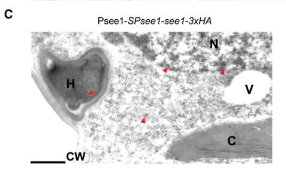

## Question

# Gene Research for Functional Annotation

## ⚠️ CRITICAL: Gene/Protein Identification Context

**BEFORE YOU BEGIN RESEARCH:** You MUST verify you are researching the CORRECT gene/protein. Gene symbols can be ambiguous, especially for less well-characterized genes from non-model organisms.

### Target Gene/Protein Identity (from UniProt):
- **UniProt Accession:** A0A0D1C8C8
- **Protein Description:** RecName: Full=Secreted effector protein See1 {ECO:0000305}; AltName: Full=Seedling efficient effector protein 1 {ECO:0000303|PubMed:25888589}; Flags: Precursor;
- **Gene Information:** Name=See1 {ECO:0000303|PubMed:25888589}; ORFNames=UMAG_02239 {ECO:0000312|EMBL:KIS69712.1};
- **Organism (full):** Mycosarcoma maydis (Corn smut fungus) (Ustilago maydis).
- **Protein Family:** Not specified in UniProt
- **Key Domains:** Not specified in UniProt

### MANDATORY VERIFICATION STEPS:

1. **Check if the gene symbol "See1" matches the protein description above**
2. **Verify the organism is correct:** Mycosarcoma maydis (Corn smut fungus) (Ustilago maydis).
3. **Check if protein family/domains align with what you find in literature**
4. **If you find literature for a DIFFERENT gene with the same or similar symbol, STOP**

### If Gene Symbol is Ambiguous or You Cannot Find Relevant Literature:

**DO NOT PROCEED WITH RESEARCH ON A DIFFERENT GENE.** Instead:
- State clearly: "The gene symbol 'See1' is ambiguous or literature is limited for this specific protein"
- Explain what you found (e.g., "Found extensive literature on a different gene with the same symbol in a different organism")
- Describe the protein based ONLY on the UniProt information provided above
- Suggest that the protein function can be inferred from domain/family information

### Research Target:

Please provide a comprehensive research report on the gene **See1** (gene ID: See1, UniProt: A0A0D1C8C8) in MYCMD.

The research report should be a detailed narrative explaining the function, biological processes, and localization of the gene product. Citations should be given for all claims.

You should prioritize authoritative reviews and primary scientific literature when conducting research. You can supplement
this with annotations you find in gene/protein databases, but these can be outdated or inaccurate.

We are specifically interested in the primary function of the gene - for enzymes, what reaction is catalyzed, and what is the substrate specificity? For transporters, what is the substrate? For structural proteins or adapters, what is the broader structural role? For signaling molecules, what is the role in the pathway.

We are interested in where in or outside the cell the gene product carries out its function.

We are also interested in the signaling or biochemical pathways in which the gene functions. We are less interested in broad pleiotropic effects, except where these elucidate the precise role.

Include evidence where possible. We are interested in both experimental evidence as well as inference from structure, evolution, or bioinformatic analysis. Precise studies should be prioritized over high-throughput, where available.

## Output

Question: You are an expert researcher providing comprehensive, well-cited information.

Provide detailed information focusing on:
1. Key concepts and definitions with current understanding
2. Recent developments and latest research (prioritize 2023-2024 sources)
3. Current applications and real-world implementations
4. Expert opinions and analysis from authoritative sources
5. Relevant statistics and data from recent studies

Format as a comprehensive research report with proper citations. Include URLs and publication dates where available.
Always prioritize recent, authoritative sources and provide specific citations for all major claims.

# Gene Research for Functional Annotation

## ⚠️ CRITICAL: Gene/Protein Identification Context

**BEFORE YOU BEGIN RESEARCH:** You MUST verify you are researching the CORRECT gene/protein. Gene symbols can be ambiguous, especially for less well-characterized genes from non-model organisms.

### Target Gene/Protein Identity (from UniProt):
- **UniProt Accession:** A0A0D1C8C8
- **Protein Description:** RecName: Full=Secreted effector protein See1 {ECO:0000305}; AltName: Full=Seedling efficient effector protein 1 {ECO:0000303|PubMed:25888589}; Flags: Precursor;
- **Gene Information:** Name=See1 {ECO:0000303|PubMed:25888589}; ORFNames=UMAG_02239 {ECO:0000312|EMBL:KIS69712.1};
- **Organism (full):** Mycosarcoma maydis (Corn smut fungus) (Ustilago maydis).
- **Protein Family:** Not specified in UniProt
- **Key Domains:** Not specified in UniProt

### MANDATORY VERIFICATION STEPS:

1. **Check if the gene symbol "See1" matches the protein description above**
2. **Verify the organism is correct:** Mycosarcoma maydis (Corn smut fungus) (Ustilago maydis).
3. **Check if protein family/domains align with what you find in literature**
4. **If you find literature for a DIFFERENT gene with the same or similar symbol, STOP**

### If Gene Symbol is Ambiguous or You Cannot Find Relevant Literature:

**DO NOT PROCEED WITH RESEARCH ON A DIFFERENT GENE.** Instead:
- State clearly: "The gene symbol 'See1' is ambiguous or literature is limited for this specific protein"
- Explain what you found (e.g., "Found extensive literature on a different gene with the same symbol in a different organism")
- Describe the protein based ONLY on the UniProt information provided above
- Suggest that the protein function can be inferred from domain/family information

### Research Target:

Please provide a comprehensive research report on the gene **See1** (gene ID: See1, UniProt: A0A0D1C8C8) in MYCMD.

The research report should be a detailed narrative explaining the function, biological processes, and localization of the gene product. Citations should be given for all claims.

You should prioritize authoritative reviews and primary scientific literature when conducting research. You can supplement
this with annotations you find in gene/protein databases, but these can be outdated or inaccurate.

We are specifically interested in the primary function of the gene - for enzymes, what reaction is catalyzed, and what is the substrate specificity? For transporters, what is the substrate? For structural proteins or adapters, what is the broader structural role? For signaling molecules, what is the role in the pathway.

We are interested in where in or outside the cell the gene product carries out its function.

We are also interested in the signaling or biochemical pathways in which the gene functions. We are less interested in broad pleiotropic effects, except where these elucidate the precise role.

Include evidence where possible. We are interested in both experimental evidence as well as inference from structure, evolution, or bioinformatic analysis. Precise studies should be prioritized over high-throughput, where available.

# Functional annotation report: See1 (UMAG_02239; UniProt A0A0D1C8C8)

## Identity and principal function

**Identity verified.** The *Ustilago maydis* study that established this gene explicitly identifies fungal locus **um02239** as **see1**, encoding **Seedling efficient effector 1**. This matches the supplied UniProt annotation for *Mycosarcoma maydis* (synonym *U. maydis*); it is not a similarly named protein from another organism. See1 is a **secreted, host-translocated virulence effector**, not an experimentally established enzyme or transporter. Its best-supported function is to enable differentiated maize leaf cells to resume DNA synthesis and division, particularly during bundle-sheath-derived tumor hyperplasia. No catalytic reaction, substrate specificity, conserved See1 protein family, or characterized catalytic domain has been established. Experimental constructs encompass residues 22–157 after removal of the N-terminal secretion signal, consistent with a 157-residue precursor and a signal peptide in residues 1–21. The TPR, CS, and SGS domains sometimes discussed alongside See1 belong to its **maize target SGT1**, not to See1. (redkar2015asecretedeffector pages 1-2, redkar2015functionalcharacterizationof pages 61-64, villajuanabonequi2019celltypespecific pages 1-2, redkar2015asecretedeffector pages 8-10)

## Site of action and biochemical mechanism

During infection, fungal hyphae secrete See1 into the **biotrophic interface** and deliver it into maize **cytoplasm and nuclei**. Immunogold electron microscopy of fungus-delivered, tagged See1 detected it in both host compartments; approximately **20% of the quantified particles were in maize nuclei**. A secreted mCherry control accumulated at the interface without comparable entry into plant cells. The relevant site of See1 action is therefore **inside the host cell**, notwithstanding its initial secretion from the fungus. Movement into neighboring plant cells was observed after transient expression, but was not confirmed during natural delivery and may reflect overexpression. Figure 6C–D of the primary study provides localization and control images. (redkar2015asecretedeffector pages 6-8, redkar2015asecretedeffector media 2aaf5877, redkar2015asecretedeffector pages 12-14)

The strongest identified host interactor is **ZmSGT1**, a cochaperone associated with plant immune signaling and cell-cycle regulation. Yeast two-hybrid screening identified the interaction; co-immunoprecipitation in *Nicotiana benthamiana* and bimolecular fluorescence complementation in maize provided independent support, placing the association in both host cytoplasm and nuclei. In an experimental MAPK-activation system, phosphorylation of ZmSGT1 at **Thr150** was detected without See1 but not when See1 was coexpressed. This residue lies in a variable region conserved among the examined monocot SGT1 proteins. By contrast, phosphorylation at **Thr262** was constitutive and See1-independent. Purified tobacco SIPK could phosphorylate ZmSGT1 in vitro; the corresponding endogenous **maize** kinase has not been identified. The supported biochemical description is thus **interference with MAPK-associated phosphorylation of a host regulatory protein**, not direct phosphatase activity by See1. (redkar2015asecretedeffector pages 8-10, redkar2015asecretedeffector pages 10-12, redkar2015asecretedeffector pages 12-14)

The authors propose that altered SGT1 phosphorylation helps both to dampen defense signaling and to release the host cell-division program. These are **not equally established endpoints**: See1-dependent leaf DNA synthesis is directly measured, whereas the downstream biochemical route from SGT1 Thr150 to cell-cycle re-entry—and the extent of a direct See1-specific immune effect—remains unresolved. SGT1 phosphonull and phosphomimic variants caused only modest localization changes and did not establish a Thr150-dependent cell-cycle phenotype in yeast. The experiments therefore do not prove that SGT1 phosphorylation alone accounts for every See1-dependent tumor phenotype. (redkar2015asecretedeffector pages 10-12, redkar2015asecretedeffector pages 12-14, redkar2015asecretedeffector pages 14-15)

## Biological process, tissue specificity, and quantitative evidence

See1 acts most clearly in **vegetative maize leaf tumor formation**, where mature cells must be recruited into a proliferative program. At four days after infection, EdU incorporation—a measure of newly synthesized host DNA—occurred in **67.5 ± 4.2%** of maize cells colonized by wild-type fungal strain SG200, versus **7.3 ± 1.7%** in cells colonized by **Δsee1**. A different small-tumor mutant, **Δtin3**, still gave **44.22 ± 4.0%** EdU-positive colonized cells; thus, the pronounced Δsee1 DNA-synthesis defect cannot simply be attributed to the presence of smaller tumors. Infection-associated expression of host DNA-replication and cell-cycle genes also depended strongly on See1. Cell-resolved studies distinguish **bundle-sheath-derived hyperplasia**—the division-associated tumor component promoted by See1—from **mesophyll-derived hypertrophy**, or cell enlargement. See1 should not be annotated as the demonstrated direct inducer of mesophyll hypertrophy. (redkar2015asecretedeffector pages 3-4, redkar2015asecretedeffector pages 4-6, villajuanabonequi2019celltypespecific pages 1-2, redkar2017insightsintohost pages 3-5)

Genetic tests reinforce this functional assignment. **Δsee1** predominantly formed small **1–4 mm** seedling-leaf tumors and rarely produced the **>6–20 mm** tumors more frequent in wild-type infections; heavy tumors were absent. Reintroducing *see1* into the fungal genome restored leaf virulence. The mutant nevertheless initially colonized maize and caused largely normal **tassel and ear tumors**: See1 is important for a particular host developmental setting, not indispensable for all fungal infection. Its transcript abundance at the measured late stage was **more than 50-fold higher in leaves than in floral organs**. In already proliferating premeiotic anthers, roughly **60%** of cells incorporated EdU regardless of infection or *see1* deletion, consistent with See1 being unnecessary when host division is already active. Conversely, forced fungal expression of *see1* increased abnormal tumors in the **vegetative tassel base** to approximately **38% of infected plants**, versus **8%** with wild-type fungus; this gain-of-function result concerns vegetative tissue, not anther tumors. (redkar2015asecretedeffector pages 2-3, redkar2015asecretedeffector pages 4-6, redkar2015asecretedeffector pages 6-8)

The findings and their principal inferential limits are summarized below.

| Finding | Direct observation | Interpretation and limitation | Source (year; DOI) |
|---|---|---|---|
| Identity and annotation | The fungal locus **um02239/UMAG_02239** was renamed **see1**, encoding Seedling efficient effector 1; experimental constructs indicate a 157-aa precursor with an N-terminal secretion signal at residues 1–21. | Confirms the literature target corresponding to UniProt A0A0D1C8C8. No catalytic activity, conserved protein family, or experimentally validated See1 domain has been established. TPR, CS, and SGS are domains of host **SGT1**, not See1. | Redkar et al. (2015); [10.1105/tpc.114.131086](https://doi.org/10.1105/tpc.114.131086) (redkar2015asecretedeffector pages 1-2, redkar2015functionalcharacterizationof pages 61-64) |
| Organ-specific virulence | **Δsee1** produced predominantly small 1–4-mm seedling-leaf tumors, markedly fewer 6–20-mm tumors, and no heavy tumors. Tassel and ear tumors remained essentially normal. Reinsertion of see1 at the fungal *ip* locus fully restored leaf virulence. | Strong knockout-plus-rescue evidence that See1 is required primarily for vegetative leaf tumor expansion, not for general pathogenicity or floral-tissue infection. | Redkar et al. (2015); [10.1105/tpc.114.131086](https://doi.org/10.1105/tpc.114.131086) (redkar2015asecretedeffector pages 2-3, redkar2015asecretedeffector pages 3-4) |
| Host DNA-synthesis reactivation | At 4 days post-infection, EdU was incorporated by **67.5 ± 4.2%** of maize cells colonized by wild-type SG200 versus **7.3 ± 1.7%** in Δsee1 infections. A separate small-tumor mutant, Δtin3, retained **44.22 ± 4.0%** EdU-positive cells. | Demonstrates a See1-specific requirement for efficient re-entry of differentiated leaf cells into DNA synthesis; EdU establishes DNA replication but alone does not define every downstream cell-cycle step. | Redkar et al. (2015); [10.1105/tpc.114.131086](https://doi.org/10.1105/tpc.114.131086) (redkar2015asecretedeffector pages 3-4, redkar2015asecretedeffector pages 4-6) |
| Host-cell localization | Naturally delivered See1–3×HA was detected in fungal hyphae, the biotrophic interface, maize cytoplasm, and nuclei; approximately **20% of quantified immunogold particles** localized to host nuclei. Secreted mCherry remained at the interface rather than entering host cells. | Supports specific translocation into maize cytoplasm and nucleus. Apparent movement between neighboring cells occurred under transient overexpression but was not confirmed by immunogold microscopy and could be an artifact. | Redkar et al. (2015); [10.1105/tpc.114.131086](https://doi.org/10.1105/tpc.114.131086) (redkar2015asecretedeffector pages 6-8, redkar2015asecretedeffector pages 12-14, redkar2015asecretedeffector media 2aaf5877) |
| Interaction with maize SGT1 | See1–ZmSGT1 association was detected by yeast two-hybrid screening and independently supported by co-immunoprecipitation in *Nicotiana benthamiana* and BiFC in maize; BiFC placed the interaction in cytoplasm and nucleus. | Convergent interaction evidence identifies SGT1 as the best-supported host target. These assays do not by themselves prove that all See1-dependent tumor phenotypes are mediated exclusively through SGT1. | Redkar et al. (2015); [10.1105/tpc.114.131086](https://doi.org/10.1105/tpc.114.131086) (redkar2015asecretedeffector pages 8-10, redkar2015asecretedeffector pages 10-12) |
| Effect on SGT1 phosphorylation | In a heterologous *N. benthamiana* MEK2–SIPK activation system, ZmSGT1 **Thr150** phosphorylation was detected without See1 but became undetectable when See1 was coexpressed. Constitutive phosphorylation at **Thr262** was unaffected. Tobacco SIPK also phosphorylated ZmSGT1 in vitro. | Supports interference with MAPK-associated Thr150 phosphorylation. The endogenous maize kinase was not identified, direct enzymatic inhibition was not demonstrated, and phosphonull/phosphomimic tests did not establish that Thr150 controls SGT1’s cell-cycle function. Immune suppression therefore remains a proposed consequence, not a proven See1 phenotype. | Redkar et al. (2015); [10.1105/tpc.114.131086](https://doi.org/10.1105/tpc.114.131086) (redkar2015asecretedeffector pages 8-10, redkar2015asecretedeffector pages 10-12, redkar2015asecretedeffector pages 12-14) |
| Vegetative-tissue gain-of-function | Constitutive see1 expression increased abnormal tumor formation in the vegetative tassel base to approximately **38%** of infected plants versus **8%** with wild type and increased local EdU labeling; it did not materially alter anther DNA synthesis. | Supports See1 activity in differentiated vegetative tissue rather than a universal capacity to stimulate division in every maize cell type. Overexpression is nonphysiological and cannot alone define the normal pathway. | Redkar et al. (2015); [10.1105/tpc.114.131086](https://doi.org/10.1105/tpc.114.131086) (redkar2015asecretedeffector pages 6-8, redkar2015asecretedeffector pages 4-6) |
| Status of recent research | The 2023 hyperplasia study experimentally characterized **Sts2/UMAG_05318**, which enters the maize nucleus, interacts with ZmNECAP1, and functions as a transcriptional activator. See1 served only as prior-work context or an assay comparator. | Sts2 is a distinct effector and its results are not direct evidence for See1/UMAG_02239. The retrieved 2023–2024 literature adds tumorigenesis context but no major new direct See1 mechanism beyond the 2015 study. | Zuo et al. (2023); [10.1038/s41467-023-42522-w](https://doi.org/10.1038/s41467-023-42522-w) (zuo2023atranscriptionalactivator pages 2-4, zuo2023atranscriptionalactivator pages 1-2, zuo2023atranscriptionalactivator pages 4-6) |

*Table: Evidence specific to fungal See1/UMAG_02239, separating direct observations from mechanistic interpretation and unresolved limitations. The table also prevents conflation with host SGT1 domains or the distinct effector Sts2.*

## Recent research and applications

**Recent work refines the context rather than replacing the See1 mechanism.** A **2023** review continues to identify See1 as a translocated, SGT1-associated effector that promotes seedling-leaf DNA synthesis. A separate **October 2023** primary study demonstrated that **Sts2 (UMAG_05318)** also promotes maize hyperplasia, but through nuclear transcriptional activation and interaction with **ZmNECAP1**. Sts2 is **not See1 (UMAG_02239)**; its experiments do not establish a See1–Sts2 interaction or a shared linear pathway. The retrieved 2024 material likewise recapitulates the See1–SGT1 model without demonstrating a new, direct See1-specific biochemical mechanism. Consequently, the detailed **April 2015 primary study remains the principal direct experimental basis** for annotating this protein. (yu2023progressinpathogenesis pages 4-5, zuo2023atranscriptionalactivator pages 1-2, zuo2023atranscriptionalactivator pages 4-6, lee2024characterizationofhypertrophyrelated pages 30-34)

The present real-world use of See1 is principally **research**, as a genetically tractable example of how a crop pathogen manipulates host developmental state. Fungal deletion, genetic complementation, inducible expression, host EdU labeling, interaction assays, phosphoproteomics, and microscopy have established it as a tool for investigating maize tumor formation and host-targeted effectors. Conservation of See1-like sequences across smut fungi does **not** establish equivalent activity: the *U. hordei* ortholog failed to complement the *U. maydis see1* knockout in the reported comparison. The available evidence does not establish a deployed See1-based crop-control intervention or a validated structure-guided inhibitor. (redkar2015asecretedeffector pages 2-3, redkar2015asecretedeffector pages 3-4, redkar2015asecretedeffector pages 8-10, zuo2019molecularinteractionsbetween pages 8-10)

**Key sources and publication dates:** Redkar *et al.*, *The Plant Cell*, **April 2015**, primary functional study, https://doi.org/10.1105/tpc.114.131086; Redkar *et al.*, *Frontiers in Plant Science*, **May 2017**, developmental-context review, https://doi.org/10.3389/fpls.2017.00899; Villajuana-Bonequi *et al.*, *Scientific Reports*, **2019**, cell-type transcriptomics, https://doi.org/10.1038/s41598-019-46734-3; Zuo *et al.*, *Annual Review of Phytopathology*, **August 2019**, authoritative smut-effector review, https://doi.org/10.1146/annurev-phyto-082718-100139; Yu *et al.*, *Molecular Plant Pathology*, **2023**, recent pathogenesis review, https://doi.org/10.1111/mpp.13307; Zuo *et al.*, *Nature Communications*, **October 2023**, distinct Sts2 mechanism, https://doi.org/10.1038/s41467-023-42522-w. (redkar2015asecretedeffector pages 1-2, redkar2017insightsintohost pages 3-5, villajuanabonequi2019celltypespecific pages 1-2, zuo2019molecularinteractionsbetween pages 8-10, yu2023progressinpathogenesis pages 4-5, zuo2023atranscriptionalactivator pages 1-2)

References

1. (redkar2015asecretedeffector pages 1-2): Amey Redkar, Rafal Hoser, Lena Schilling, Bernd Zechmann, Magdalena Krzymowska, Virginia Walbot, and Gunther Doehlemann. A secreted effector protein of ustilago maydis guides maize leaf cells to form tumors. Plant Cell, 27:1332-1351, Apr 2015. URL: https://doi.org/10.1105/tpc.114.131086, doi:10.1105/tpc.114.131086. This article has 190 citations and is from a highest quality peer-reviewed journal.

2. (redkar2015functionalcharacterizationof pages 61-64): Amey Redkar. Functional characterization of an organ specific effector see1 of ustilago maydis. Text, Jan 2015. URL: https://doi.org/10.17192/z2015.0051, doi:10.17192/z2015.0051. This article has 3 citations and is from a peer-reviewed journal.

3. (villajuanabonequi2019celltypespecific pages 1-2): Mitzi Villajuana-Bonequi, Alexandra Matei, Corinna Ernst, Asis Hallab, Björn Usadel, and Gunther Doehlemann. Cell type specific transcriptional reprogramming of maize leaves during ustilago maydis induced tumor formation. Scientific Reports, Feb 2019. URL: https://doi.org/10.1038/s41598-019-46734-3, doi:10.1038/s41598-019-46734-3. This article has 34 citations and is from a peer-reviewed journal.

4. (redkar2015asecretedeffector pages 8-10): Amey Redkar, Rafal Hoser, Lena Schilling, Bernd Zechmann, Magdalena Krzymowska, Virginia Walbot, and Gunther Doehlemann. A secreted effector protein of ustilago maydis guides maize leaf cells to form tumors. Plant Cell, 27:1332-1351, Apr 2015. URL: https://doi.org/10.1105/tpc.114.131086, doi:10.1105/tpc.114.131086. This article has 190 citations and is from a highest quality peer-reviewed journal.

5. (redkar2015asecretedeffector pages 6-8): Amey Redkar, Rafal Hoser, Lena Schilling, Bernd Zechmann, Magdalena Krzymowska, Virginia Walbot, and Gunther Doehlemann. A secreted effector protein of ustilago maydis guides maize leaf cells to form tumors. Plant Cell, 27:1332-1351, Apr 2015. URL: https://doi.org/10.1105/tpc.114.131086, doi:10.1105/tpc.114.131086. This article has 190 citations and is from a highest quality peer-reviewed journal.

6. (redkar2015asecretedeffector media 2aaf5877): Amey Redkar, Rafal Hoser, Lena Schilling, Bernd Zechmann, Magdalena Krzymowska, Virginia Walbot, and Gunther Doehlemann. A secreted effector protein of ustilago maydis guides maize leaf cells to form tumors. Plant Cell, 27:1332-1351, Apr 2015. URL: https://doi.org/10.1105/tpc.114.131086, doi:10.1105/tpc.114.131086. This article has 190 citations and is from a highest quality peer-reviewed journal.

7. (redkar2015asecretedeffector pages 12-14): Amey Redkar, Rafal Hoser, Lena Schilling, Bernd Zechmann, Magdalena Krzymowska, Virginia Walbot, and Gunther Doehlemann. A secreted effector protein of ustilago maydis guides maize leaf cells to form tumors. Plant Cell, 27:1332-1351, Apr 2015. URL: https://doi.org/10.1105/tpc.114.131086, doi:10.1105/tpc.114.131086. This article has 190 citations and is from a highest quality peer-reviewed journal.

8. (redkar2015asecretedeffector pages 10-12): Amey Redkar, Rafal Hoser, Lena Schilling, Bernd Zechmann, Magdalena Krzymowska, Virginia Walbot, and Gunther Doehlemann. A secreted effector protein of ustilago maydis guides maize leaf cells to form tumors. Plant Cell, 27:1332-1351, Apr 2015. URL: https://doi.org/10.1105/tpc.114.131086, doi:10.1105/tpc.114.131086. This article has 190 citations and is from a highest quality peer-reviewed journal.

9. (redkar2015asecretedeffector pages 14-15): Amey Redkar, Rafal Hoser, Lena Schilling, Bernd Zechmann, Magdalena Krzymowska, Virginia Walbot, and Gunther Doehlemann. A secreted effector protein of ustilago maydis guides maize leaf cells to form tumors. Plant Cell, 27:1332-1351, Apr 2015. URL: https://doi.org/10.1105/tpc.114.131086, doi:10.1105/tpc.114.131086. This article has 190 citations and is from a highest quality peer-reviewed journal.

10. (redkar2015asecretedeffector pages 3-4): Amey Redkar, Rafal Hoser, Lena Schilling, Bernd Zechmann, Magdalena Krzymowska, Virginia Walbot, and Gunther Doehlemann. A secreted effector protein of ustilago maydis guides maize leaf cells to form tumors. Plant Cell, 27:1332-1351, Apr 2015. URL: https://doi.org/10.1105/tpc.114.131086, doi:10.1105/tpc.114.131086. This article has 190 citations and is from a highest quality peer-reviewed journal.

11. (redkar2015asecretedeffector pages 4-6): Amey Redkar, Rafal Hoser, Lena Schilling, Bernd Zechmann, Magdalena Krzymowska, Virginia Walbot, and Gunther Doehlemann. A secreted effector protein of ustilago maydis guides maize leaf cells to form tumors. Plant Cell, 27:1332-1351, Apr 2015. URL: https://doi.org/10.1105/tpc.114.131086, doi:10.1105/tpc.114.131086. This article has 190 citations and is from a highest quality peer-reviewed journal.

12. (redkar2017insightsintohost pages 3-5): Amey Redkar, Alexandra Matei, and Gunther Doehlemann. Insights into host cell modulation and induction of new cells by the corn smut ustilago maydis. Frontiers in Plant Science, May 2017. URL: https://doi.org/10.3389/fpls.2017.00899, doi:10.3389/fpls.2017.00899. This article has 32 citations.

13. (redkar2015asecretedeffector pages 2-3): Amey Redkar, Rafal Hoser, Lena Schilling, Bernd Zechmann, Magdalena Krzymowska, Virginia Walbot, and Gunther Doehlemann. A secreted effector protein of ustilago maydis guides maize leaf cells to form tumors. Plant Cell, 27:1332-1351, Apr 2015. URL: https://doi.org/10.1105/tpc.114.131086, doi:10.1105/tpc.114.131086. This article has 190 citations and is from a highest quality peer-reviewed journal.

14. (zuo2023atranscriptionalactivator pages 2-4): Weiliang Zuo, Jasper R. L. Depotter, Sara Christina Stolze, Hirofumi Nakagami, and Gunther Doehlemann. A transcriptional activator effector of ustilago maydis regulates hyperplasia in maize during pathogen-induced tumor formation. Nature Communications, Oct 2023. URL: https://doi.org/10.1038/s41467-023-42522-w, doi:10.1038/s41467-023-42522-w. This article has 20 citations and is from a highest quality peer-reviewed journal.

15. (zuo2023atranscriptionalactivator pages 1-2): Weiliang Zuo, Jasper R. L. Depotter, Sara Christina Stolze, Hirofumi Nakagami, and Gunther Doehlemann. A transcriptional activator effector of ustilago maydis regulates hyperplasia in maize during pathogen-induced tumor formation. Nature Communications, Oct 2023. URL: https://doi.org/10.1038/s41467-023-42522-w, doi:10.1038/s41467-023-42522-w. This article has 20 citations and is from a highest quality peer-reviewed journal.

16. (zuo2023atranscriptionalactivator pages 4-6): Weiliang Zuo, Jasper R. L. Depotter, Sara Christina Stolze, Hirofumi Nakagami, and Gunther Doehlemann. A transcriptional activator effector of ustilago maydis regulates hyperplasia in maize during pathogen-induced tumor formation. Nature Communications, Oct 2023. URL: https://doi.org/10.1038/s41467-023-42522-w, doi:10.1038/s41467-023-42522-w. This article has 20 citations and is from a highest quality peer-reviewed journal.

17. (yu2023progressinpathogenesis pages 4-5): Chun-Man Yu, Jianzhao Qi, Haiyan Han, Pengchao Wang, and Chengwei Liu. Progress in pathogenesis research of ustilago maydis, and the metabolites involved along with their biosynthesis. Molecular Plant Pathology, 24:495-509, Feb 2023. URL: https://doi.org/10.1111/mpp.13307, doi:10.1111/mpp.13307. This article has 42 citations and is from a peer-reviewed journal.

18. (lee2024characterizationofhypertrophyrelated pages 30-34): YJ Lee. Characterization of hypertrophy-related effectors in ustilago maydis induced tumor formation. Unknown journal, 2024.

19. (zuo2019molecularinteractionsbetween pages 8-10): Weiliang Zuo, Bilal Ökmen, Jasper R.L. Depotter, Malaika K. Ebert, Amey Redkar, Johana Misas Villamil, and Gunther Doehlemann. Molecular interactions between smut fungi and their host plants. Annual review of phytopathology, 57:411-430, Aug 2019. URL: https://doi.org/10.1146/annurev-phyto-082718-100139, doi:10.1146/annurev-phyto-082718-100139. This article has 112 citations and is from a domain leading peer-reviewed journal.

## Artifacts

- [Edison artifact artifact-00](See1-deep-research-falcon_artifacts/artifact-00.md)

## Citations

1. redkar2015asecretedeffector pages 1-2
2. redkar2015functionalcharacterizationof pages 61-64
3. villajuanabonequi2019celltypespecific pages 1-2
4. redkar2015asecretedeffector pages 8-10
5. redkar2015asecretedeffector pages 6-8
6. redkar2015asecretedeffector pages 12-14
7. redkar2015asecretedeffector pages 10-12
8. redkar2015asecretedeffector pages 14-15
9. redkar2015asecretedeffector pages 3-4
10. redkar2015asecretedeffector pages 4-6
11. redkar2017insightsintohost pages 3-5
12. redkar2015asecretedeffector pages 2-3
13. zuo2023atranscriptionalactivator pages 2-4
14. zuo2023atranscriptionalactivator pages 1-2
15. zuo2023atranscriptionalactivator pages 4-6
16. yu2023progressinpathogenesis pages 4-5
17. lee2024characterizationofhypertrophyrelated pages 30-34
18. zuo2019molecularinteractionsbetween pages 8-10
19. 10.1105/tpc.114.131086
20. 10.1038/s41467-023-42522-w
21. https://doi.org/10.1105/tpc.114.131086
22. https://doi.org/10.1038/s41467-023-42522-w
23. https://doi.org/10.1105/tpc.114.131086;
24. https://doi.org/10.3389/fpls.2017.00899;
25. https://doi.org/10.1038/s41598-019-46734-3;
26. https://doi.org/10.1146/annurev-phyto-082718-100139;
27. https://doi.org/10.1111/mpp.13307;
28. https://doi.org/10.1038/s41467-023-42522-w.
29. https://doi.org/10.1105/tpc.114.131086,
30. https://doi.org/10.17192/z2015.0051,
31. https://doi.org/10.1038/s41598-019-46734-3,
32. https://doi.org/10.3389/fpls.2017.00899,
33. https://doi.org/10.1038/s41467-023-42522-w,
34. https://doi.org/10.1111/mpp.13307,
35. https://doi.org/10.1146/annurev-phyto-082718-100139,