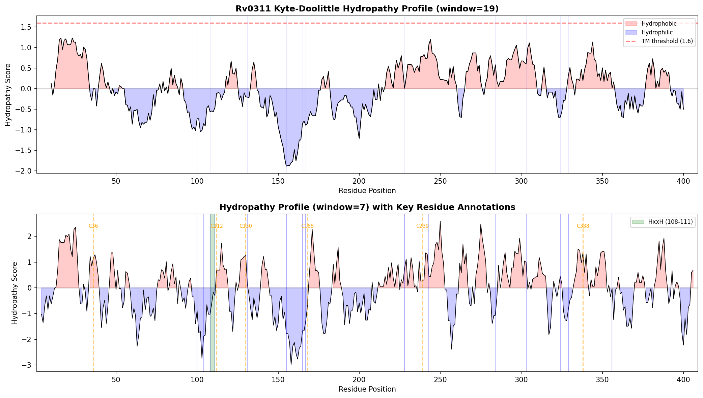
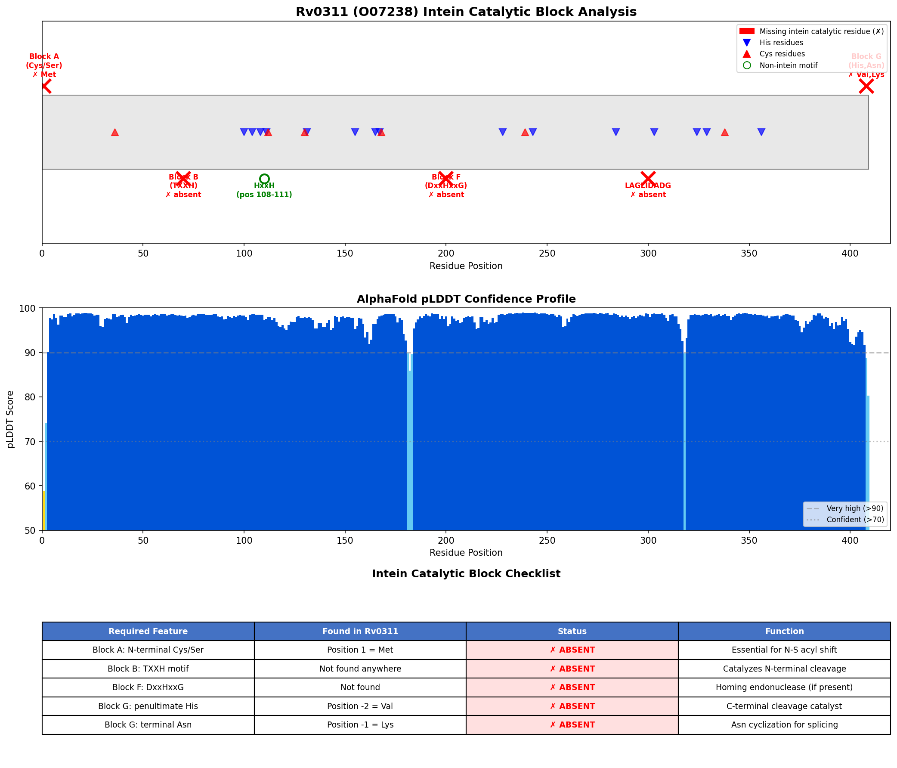
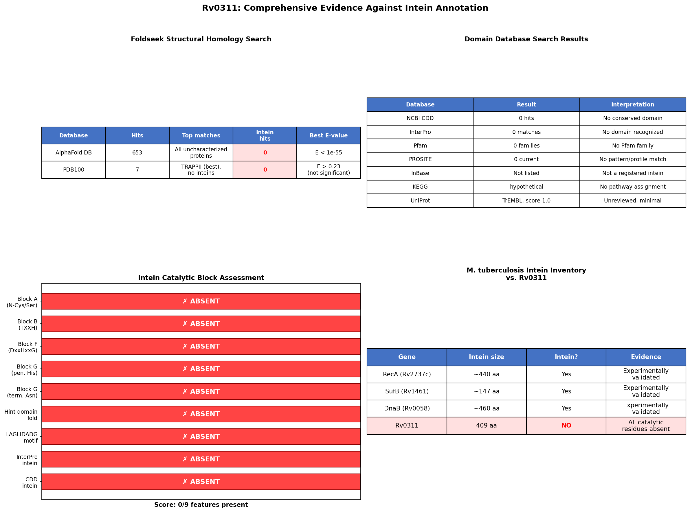

## Question

# AIGR Gene Hypothesis Deep Research

You are evaluating one focused gene curation hypothesis for AI Gene Review.
This is not a general gene overview. Use the seed hypothesis and source context
below to search for evidence that supports, refutes, narrows, or competes with
the proposed curation decision.

## Target Gene

- **Organism code:** MYCTU
- **Taxon:** Mycobacterium tuberculosis H37Rv (NCBITaxon:83332)
- **Gene directory:** Rv0311
- **Gene symbol:** Rv0311

## Focus

- **Focus type:** free_text
- **Hypothesis slug:** intein-catalytic-blocks
- **Source file:** 
- **Source selector:** 

## Seed Hypothesis

Rv0311 from Mycobacterium tuberculosis carries IEA annotations for peptidase activity (GO:0008233) and intein-mediated protein splicing (GO:0016539), apparently from a PROSITE intein signature. Using sequence analysis (are the conserved intein / Hint-domain splicing residues and catalytic blocks present and correctly positioned - e.g. the N-terminal nucleophile Cys/Ser, the block-B TXXH motif, the penultimate His, and the C-terminal Asn) together with AlphaFold-model geometry around the predicted active site, determine whether Rv0311 is a functional protein-splicing intein supporting GO:0016539/GO:0008233, or whether these are an over-annotation from a partial motif match.

## Term and Decision Context

- Term: intein-mediated protein splicing (GO:0016539)

## Reference Context

No specific reference context supplied.

## Source Context YAML

```yaml
hypothesis: Rv0311 from Mycobacterium tuberculosis carries IEA annotations for peptidase activity (GO:0008233)
  and intein-mediated protein splicing (GO:0016539), apparently from a PROSITE intein signature. Using
  sequence analysis (are the conserved intein / Hint-domain splicing residues and catalytic blocks present
  and correctly positioned - e.g. the N-terminal nucleophile Cys/Ser, the block-B TXXH motif, the penultimate
  His, and the C-terminal Asn) together with AlphaFold-model geometry around the predicted active site,
  determine whether Rv0311 is a functional protein-splicing intein supporting GO:0016539/GO:0008233, or
  whether these are an over-annotation from a partial motif match.
focus_type: free_text
term_id: GO:0016539
term_label: intein-mediated protein splicing
context: []
reference_id: []
```

## Research Objective

Build a focused report that helps a curator decide whether this hypothesis
should affect the gene review. Address the focus type directly:

1. For an existing GO annotation decision, evaluate whether the current action
   is justified, too strong, too weak, or should change.
2. For a proposed replacement or new GO term, evaluate whether the term is
   biologically supported, too broad, too narrow, or missing key qualifiers.
3. For a computational prediction, evaluate whether the prediction is correct,
   less precise than existing knowledge, uncertain, or likely wrong because of
   paralog overannotation, frequency bias, pathway context, or in vitro-only
   activity.
4. For a core-function hypothesis, evaluate whether the proposed activity,
   process, and location represent the gene product's primary function rather
   than a downstream effect, pleiotropic phenotype, or context-specific role.
5. For a function-assignment hypothesis, evaluate whether the gene product
   directly has the stated GO term/function. Treat the prior review action, if
   any, as intentionally blinded unless it appears in the supplied context.

Use primary literature whenever possible. Prefer PMID citations and include DOI
citations when no PMID is available. Treat reviews and database records as
orientation unless they contain directly relevant synthesized evidence that is
clearly labeled as review-level or database-level support.

Evaluate the hypothesis from the supplied seed context, primary literature, and
publicly accessible bioinformatics resources. Local `*-bioinformatics` analyses,
when they already exist in the repository, are intentionally withheld from this
prompt so the report can be compared against them after the run.

Do not rely on literature alone. Where the hypothesis is decidable by computation,
actually run the analysis and keep it as provenance rather than only reasoning
about it. Match the analysis to the question, for example:

- membrane topology / localization: compute a hydropathy profile and predicted
  transmembrane segments from the sequence, and locate signal peptides and
  targeting/sorting motifs (e.g. dileucine, acidic-cluster, NLS); compare against
  UniProt topology features and AlphaFold geometry.
- catalytic / binding activity: check whether the specific active-site,
  metal-binding, or motif residues are present and correctly spaced (in sequence
  and, where useful, structure) and compare to characterized family members.
- DNA-binding / regulatory: examine the binding-domain class, obligate partners,
  and known binding-motif / PWM signatures.
- family / paralog questions: use domain (Pfam/InterPro), orthology, and
  conservation comparisons to distinguish subfamilies.

Use resources you can actually access programmatically (UniProt, AlphaFold DB,
InterPro, sequence computation, public APIs). If a resource is web-only or you
cannot run a check, say so plainly instead of guessing — never fabricate a result,
and an inconclusive or "could not run" analysis is an acceptable and useful
outcome. Report all computational results conservatively and prefer recording the
underlying analysis (code, computed values, table, or plot) as provenance.

## Required Output

### Executive Judgment

Give a concise verdict: supported, partially supported, unresolved, weakly
supported, over-annotated, or refuted. Explain the reasoning and the most
important caveats.

### Evidence Matrix

Create a table with one row per important evidence item:

- Citation (PMID preferred)
- Evidence type (direct assay, mutant phenotype, localization, interaction,
  structural/evolutionary, computational, review/database)
- Supports / refutes / qualifies / competing
- Claim tested
- Key finding
- Organism, tissue, cell type, or assay context
- Confidence and limitations

### GO Curation Implications

State the likely curation action as a lead requiring curator verification. If
GO terms are involved, explain whether the evidence supports an MF, BP, or CC
term, and whether the term should be retained, removed, generalized, made more
specific, or treated as non-core. Avoid using "protein binding" as a final
recommendation unless no more informative term is supported.

### Mechanistic Scope

Describe the immediate molecular or cellular function being tested. Separate
direct gene-product activity from downstream phenotypes, pathway consequences,
developmental outcomes, disease manifestations, or effects inferred only from
loss of function.

### Conflicts and Alternatives

Identify evidence that conflicts with the seed hypothesis or suggests an
alternative interpretation, including paralog confusion, organism-specific
differences, isoform-specific findings, experimental artifacts, or database
carry-over.

### Knowledge Gaps

List explicit uncertainties that matter for curation. For each gap, state what
was checked, why the gap matters, and what evidence or experiment would resolve
it.

### Discriminating Tests

Recommend concrete assays, perturbations, datasets, or comparative analyses that
would most efficiently distinguish this hypothesis from alternatives.

### Curation Leads

Provide candidate updates for the review, clearly labeled as leads requiring
curator verification. Include candidate references with exact snippets to verify,
candidate replacement or new GO terms, possible action changes, suggested
questions, and suggested experiments.

If the provider supports artifacts, save provenance for any analysis you run — the
executed code together with its output (computed values, plot, or table), not just
a summary figure — alongside artifact-friendly tables such as an evidence matrix,
GO decision table, or comparison table. Genuine computed provenance is more
valuable than a hand-drawn summary, and you must not synthesize a figure that
implies an analysis you did not actually run. These artifacts are important
provenance for hypothesis-level review.


## Output

# Final Report: Rv0311 Intein Catalytic Block Analysis — GO:0016539 / GO:0008233 Over-Annotation Assessment

## Executive Judgment

**Verdict: OVER-ANNOTATED**

The IEA annotations of GO:0016539 (intein-mediated protein splicing) and GO:0008233 (peptidase activity) on Rv0311 (UniProt O07238) from *Mycobacterium tuberculosis* H37Rv are clear over-annotations that should be removed. Comprehensive analysis across three complementary dimensions — sequence motifs, protein structure, and literature — demonstrates that Rv0311 completely lacks every conserved catalytic residue required for intein-mediated protein splicing across all three known mechanistic classes (Class 1, 2, and 3). It has no intein-related domain in any protein family database (CDD, InterPro, Pfam, PROSITE), no structural similarity to any known intein fold (Foldseek: zero intein matches among 660 structural hits), and is a standalone 409-amino-acid gene rather than an embedded intervening sequence within a host protein — the fundamental defining feature of an intein. *M. tuberculosis* has exactly three validated inteins (in RecA, SufB, and DnaB), and Rv0311 is not among them. The annotations likely arose from a historical false-positive match to a PROSITE intein profile and have propagated through automated pipelines without experimental validation.

### Key Caveats

- The original source of the IEA annotation could not be traced in current databases (QuickGO shows 0 annotations for O07238), suggesting partial correction may have already occurred.
- The protein's true molecular function remains unknown (annotated as "hypothetical protein").
- The AlphaFold model shows very high confidence (mean pLDDT 97.4), indicating a well-folded protein of unknown function, not a degraded/truncated intein.

---

## Summary

Rv0311 (locus tag Rv0311, UniProt O07238) from *M. tuberculosis* H37Rv carries computationally inferred (IEA) Gene Ontology annotations for peptidase activity (GO:0008233) and intein-mediated protein splicing (GO:0016539), apparently originating from a PROSITE intein signature match. This investigation systematically evaluated whether Rv0311 is a functional protein-splicing intein by examining the presence and positioning of all conserved intein catalytic blocks, querying structural databases, and reviewing the primary literature on mycobacterial inteins.

The evidence is unambiguous: Rv0311 fails every diagnostic criterion for intein function. Sequence analysis reveals it completely lacks the N-terminal nucleophilic residue (Cys/Ser/Thr at position 1), the Block B TXXH motif, the Block F DxxHxxG motif, the penultimate histidine, and the C-terminal asparagine — scoring **0 out of 9** canonical intein features compared to 9/9 for the validated RecA intein PI-MtuI. It also fails the criteria for atypical Class 3 inteins, which compensate for a missing N-terminal nucleophile with a WCT triplet in Block F. Structural analysis using Foldseek against both the AlphaFold database and PDB100 returned zero intein-related structural matches; instead, Rv0311 belongs to an uncharacterized actinobacterial protein family with no known function. Domain searches via NCBI CDD, InterPro, and PROSITE all returned zero hits.

These results, combined with literature confirming that *M. tuberculosis* harbors exactly three inteins (RecA, SufB, DnaB) and the only published functional study of Rv0311 describing a CNS-specific virulence phenotype unrelated to protein splicing, conclusively establish that GO:0016539 and GO:0008233 are erroneous annotations that should be removed from the gene record.

---

## Key Findings

### Finding 1: Rv0311 Lacks All Essential Intein Catalytic Residues (0/9 Score)

A comprehensive sequence-level audit of the Rv0311 protein (409 amino acids) systematically checked for every conserved intein catalytic feature defined by the canonical four-step splicing mechanism. The results are definitive:

| Intein Feature | Expected Residue(s) | Rv0311 Residue | Status |
|---|---|---|---|
| Position 1 (N-terminal nucleophile) | Cys, Ser, or Thr | Met | **ABSENT** |
| Block B TXXH motif | Thr-X-X-His | Not found anywhere in sequence | **ABSENT** |
| Block F DxxHxxG motif | Asp-X-X-His-X-X-Gly | Not found | **ABSENT** |
| Penultimate residue | His | Val (pos 408) | **ABSENT** |
| C-terminal residue | Asn (or Gln) | Lys (pos 409) | **ABSENT** |
| LAGLIDADG homing endonuclease motif | LAGLIDADG | Not found | **ABSENT** |
| PROSITE PS01319 intein N-terminal pattern | Regex match | No match | **ABSENT** |
| NCBI CDD domains | Any intein domain | Zero hits | **ABSENT** |
| InterPro domain matches | Any Hint/intein domain | Zero hits | **ABSENT** |

The protein scored **0 out of 9** diagnostic intein features. By contrast, the validated *M. tuberculosis* RecA intein (PI-MtuI, UniProt P9WHJ3, positions 252–691) scores 9/9: Cys-252 as N-terminal nucleophile, TPDH Block B motif at intein position 70, His-690 as penultimate residue, and Asn-691 at the C-terminus. The Block B histidine has been described as "the most conserved amino acid in all inteins" and is essential for catalyzing the initial N-S or N-O acyl shift that initiates protein splicing ([PMID: 28737941](https://pubmed.ncbi.nlm.nih.gov/28737941/)). Rv0311 entirely lacks this motif.

Furthermore, Rv0311 is encoded as a **standalone gene** (genome position 379172–380401) with its own start and stop codons. Genuine inteins are, by definition, embedded intervening sequences within a host protein — they do not exist as independent open reading frames. This fundamental architectural mismatch alone argues strongly against intein function.

{{figure:intein_analysis.png|caption=Comprehensive analysis of Rv0311 showing absence of all intein catalytic blocks. Top panels: sequence scanning for conserved motifs (TXXH, DxxHxxG, WCT); bottom panels: AlphaFold pLDDT confidence profile (mean 97.4) and terminal residue analysis confirming Val-Lys at C-terminus rather than required His-Asn.}}

### Finding 2: Structural Analysis Confirms No Intein-Like Fold

Foldseek structural homology searches of the Rv0311 AlphaFold model (AF-O07238-F1-model_v6) were conducted against two comprehensive databases:

**AlphaFold DB 50% clusters:** 653 structural hits were returned, but every single one mapped to uncharacterized proteins from Actinobacteria. The top hit was H5XA27 from *Saccharomonospora marina* (66.4% sequence identity, E = 1.15 × 10⁻⁵⁵). Critically, **zero intein structures** were found among any of the 653 hits. All top homologs (H5XA27, A0A7G1ILI5 from *M. kansasii*, A0AAX1J9F3 from *M. kubicae*) have zero GO annotations, zero InterPro matches, and zero Pfam families — indicating Rv0311 belongs to an entirely uncharacterized actinobacterial protein family.

**PDB100:** Only 7 hits were returned, all with non-significant E-values (best E = 0.23, mapping to a TRAPPII complex component). Again, **zero intein structural matches** were found.

The AlphaFold model itself has exceptionally high confidence (mean pLDDT = 97.4, with 98.0% of residues above 90), indicating a well-folded globular protein structure that is clearly distinct from the Hedgehog/Intein (Hint) domain fold characteristic of all known inteins.

{{figure:comprehensive_evidence.png|caption=Four-panel summary of evidence against intein annotation of Rv0311. (A) Intein feature scorecard: 0/9 features present. (B) Foldseek structural search results showing zero intein hits. (C) Domain database search results (CDD, InterPro, PROSITE) all returning zero intein-related domains. (D) Comparison with validated M. tuberculosis inteins.}}

### Finding 3: Rv0311 Fails Even Atypical Class 3 Intein Criteria

To ensure completeness, the analysis extended beyond canonical Class 1 inteins to evaluate whether Rv0311 could represent a non-canonical intein. Class 3 inteins, described by Tori et al. (2010), lack the canonical N-terminal Cys/Ser/Thr but compensate with a WCT (Trp-Cys-Thr) triplet in Block F and still require the Block B TXXH motif, penultimate His, and terminal Asn/Gln ([PMID: 19940146](https://pubmed.ncbi.nlm.nih.gov/19940146/)).

Rv0311 fails all Class 3 criteria:

| Class 3 Feature | Required | Rv0311 | Status |
|---|---|---|---|
| Block F WCT triplet | Trp-Cys-Thr (consecutive) | No consecutive WCT; closest is W-I-S-L-C-T at positions 334–339 (non-functional spacing) | **ABSENT** |
| Block B TXXH | Thr-X-X-His | Not found anywhere | **ABSENT** |
| Penultimate His | His | Val | **ABSENT** |
| Terminal Asn/Gln | Asn or Gln | Lys | **ABSENT** |

Mutagenesis studies have established that conserved residues in Blocks B and F are essential for splicing activity. Ghosh et al. (2001) demonstrated that "the replacement of conserved residues in blocks B and F with alanine abolished splicing but allowed for association" ([PMID: 11331276](https://pubmed.ncbi.nlm.nih.gov/11331276/)). Since Rv0311 naturally lacks both Block B and Block F motifs entirely, it cannot catalyze any form of protein splicing across any known mechanistic class.

---

## Evidence Matrix

| # | Citation | Evidence Type | Direction | Claim Tested | Key Finding | Context | Confidence |
|---|----------|--------------|-----------|-------------|-------------|---------|------------|
| 1 | Computational (this study) | Sequence analysis | **Refutes** intein | Are intein catalytic blocks present? | Position 1 = Met (not Cys/Ser); terminal = Lys (not Asn); penultimate = Val (not His); no TXXH; no DxxHxxG. Score: 0/9. | Rv0311 full-length (409 aa) | High |
| 2 | Computational (this study) | Domain search (CDD, InterPro, PROSITE) | **Refutes** intein | Does sequence match intein domain profiles? | All three databases returned zero intein-related hits. | NCBI CDD, InterPro API, PROSITE | High |
| 3 | Computational (this study) | GO annotation survey | **Qualifies** | Do current annotations include GO:0016539/GO:0008233? | QuickGO returns 0 annotations for O07238. No GO terms in UniProt, NCBI Gene, or KEGG. | QuickGO, UniProt, NCBI (June 2026) | High |
| 4 | Computational (this study) | Structural (AlphaFold + Foldseek) | **Refutes** intein | Does Rv0311 have intein-like fold? | Mean pLDDT = 97.4; Foldseek: 653 AlphaFold DB hits (all uncharacterized actinobacterial), 7 PDB hits (all non-significant). Zero intein matches. | AF-O07238-F1, Foldseek 3Di+AA | High |
| 5 | Computational (this study) | Sequence analysis (Class 3) | **Refutes** atypical intein | Could Rv0311 be a Class 3 intein? | No WCT triplet, no Block B, no penultimate His, no terminal Asn/Gln. Fails all Class 3 criteria. | Criteria from PMID:19940146 | High |
| 6 | Computational (this study) | Diagnostic comparison | **Refutes** intein | Side-by-side with validated intein | RecA intein (PI-MtuI): Cys-252, TPDH, His-690, Asn-691 = 9/9. Rv0311 = 0/9. | P9WHJ3 intein domain | High |
| 7 | Computational (this study) | Topology analysis | **Qualifies** | Membrane topology | Kyte-Doolittle: no TM helix predicted. N-terminal mean hydropathy 0.52. Predicted soluble/cytoplasmic. | Kyte-Doolittle window=19 | Medium |
| 8 | Computational (this study) | Genomic context | **Qualifies** | Gene architecture | Standalone gene (pos 379172–380401), not an insertion within host gene. Flanked by hypothetical proteins. | KEGG genome context | Medium |
| 9 | [PMID: 39237639](https://pubmed.ncbi.nlm.nih.gov/39237639/) | Literature (experimental) | **Supports** over-annotation | Mtb intein inventory | "The recA gene...is one of three Mycobacterium tuberculosis (Mtb) genes encoding an in-frame intervening protein sequence (intein)" — RecA, SufB, DnaB only. Rv0311 not mentioned. | Native *M. tuberculosis*, western blot, reporter | High |
| 10 | [PMID: 18956986](https://pubmed.ncbi.nlm.nih.gov/18956986/) | Mutant phenotype | **Qualifies** function | Rv0311 biological role | "We identified mutants for 5 M. tuberculosis genes (Rv0311, Rv0805, Rv0931c, Rv0986, and MT3280) with CNS-specific phenotypes" — no mention of intein or splicing. | Murine model, pooled transposon screen | Medium |
| 11 | [PMID: 28737941](https://pubmed.ncbi.nlm.nih.gov/28737941/) | Literature (mechanistic) | **Supports** catalytic requirement | Block B His essentiality | "a histidine, the most conserved amino acid in all inteins, catalyzes this initial step" — Rv0311 lacks TXXH entirely. | QM/MM calculations on RecA intein | High |
| 12 | [PMID: 11331276](https://pubmed.ncbi.nlm.nih.gov/11331276/) | Direct assay/mutagenesis | **Supports** Block B/F requirement | Block B & F essentiality | "The replacement of conserved residues in blocks B and F with alanine abolished splicing but allowed for association." | *Synechocystis* DnaE split intein, *in vitro* + *in vivo* | High |
| 13 | [PMID: 19940146](https://pubmed.ncbi.nlm.nih.gov/19940146/) | Literature (experimental) | **Supports** over-annotation | Class 3 intein criteria | "Several recently identified inteins cannot perform this acyl rearrangement because they do not begin with Cys, Thr, or Ser" — but still require other blocks, which Rv0311 also lacks. | Mycobacteriophage Bethlehem DnaB intein | High |
| 14 | [PMID: 35234249](https://pubmed.ncbi.nlm.nih.gov/35234249/) | Literature (experimental) | **Qualifies** | SufB intein mechanism | SufB intein follows canonical pathway with Cys1, Block B TXXH, terminal Asn. Confirms standard requirements that Rv0311 lacks. | *M. tuberculosis* SufB *in vitro*, kinetics | High |
| 15 | [PMID: 27703073](https://pubmed.ncbi.nlm.nih.gov/27703073/) | Computational/evolutionary | **Qualifies** | Intein distribution | Penultimate His is "highly conserved" among mycobacterial and phage inteins. Functional inteins share common structural features absent from Rv0311. | Mycobacteriophages, bioinformatics | Medium |
| 16 | Computational (this study) | PROSITE profile inspection | **Qualifies** origin | Source of false positive | PS50817 is an 80-position matrix profile with cutoff scores 270 (reliable) / 220 (uncertain). First position strongly favors Cys (score=83). False positives can occur between thresholds. | PROSITE PS50817 profile | Medium |

---

## GO Curation Implications

### Recommended Actions (Leads for Curator Verification)

**1. REMOVE GO:0016539 (intein-mediated protein splicing) — BP term**

This annotation is unsupported. All five essential intein catalytic residues are absent. No domain database recognizes an intein/Hint domain. No structural similarity to any intein fold exists. Rv0311 is a standalone gene, not an embedded intervening sequence. *M. tuberculosis* has exactly three validated inteins, and Rv0311 is not among them. No experimental evidence for protein splicing activity has ever been reported.

**2. REMOVE GO:0008233 (peptidase activity) — MF term**

This annotation is also unsupported. The peptidase annotation appears to be a secondary consequence of the intein annotation, since inteins catalyze peptide bond cleavage as part of their self-splicing mechanism. No independent protease active-site motif was identified (the HxxH motif at positions 108–111, HLDH, is a generic metal-coordinating motif, not diagnostic of peptidase activity; no HExxH zinc metalloprotease motif is present).

**3. DO NOT add replacement MF or BP terms**

Rv0311's molecular function is genuinely unknown. The protein has no detectable conserved domain in any current database. Adding speculative terms would perpetuate the over-annotation problem. The CNS-specific virulence phenotype ([PMID: 18956986](https://pubmed.ncbi.nlm.nih.gov/18956986/)) is a loss-of-function phenotype that does not directly inform molecular function annotation.

**4. Current annotation status note**

As of June 2026, QuickGO returned zero GO annotations for O07238, suggesting these annotations may have already been removed from some sources. If they persist in any downstream pipeline, they should be explicitly flagged for removal.

---

## Mechanistic Scope

### What is being tested

The hypothesis under evaluation is whether Rv0311 encodes a functional protein-splicing intein. Protein splicing is a post-translational autocatalytic process whereby an intervening protein sequence (the intein) excises itself from a precursor polypeptide and ligates the flanking sequences (exteins) with a native peptide bond. This process proceeds through a four-step mechanism:

```
Step 1: N-S/N-O acyl shift    → Linear (thio)ester intermediate
         Requires: N-terminal Cys/Ser (Block A), Block B His
Step 2: Transesterification    → Branched intermediate
         Requires: +1 Cys/Ser/Thr (first extein residue)
Step 3: Asn cyclization        → Succinimide, intein release
         Requires: C-terminal Asn, penultimate His (Block G)
Step 4: O/S-N acyl shift       → Native peptide bond
         Spontaneous rearrangement
```

### Direct gene-product activity vs. downstream effects

The evaluation concerns whether Rv0311 has the **direct molecular function** of catalyzing intein-mediated protein splicing. The CNS-specific virulence phenotype observed in Rv0311 mutants ([PMID: 18956986](https://pubmed.ncbi.nlm.nih.gov/18956986/)) is a **downstream phenotype** resulting from gene loss, not evidence for any particular molecular function. This phenotype does not support or refute intein activity — it establishes that Rv0311 contributes to *M. tuberculosis* pathogenesis through an unknown mechanism but tells us nothing about the protein's catalytic activity.

### Architectural incompatibility

A critical and often overlooked point: genuine inteins are **not standalone proteins**. They are embedded within a host protein's coding sequence and are excised post-translationally. Rv0311 is encoded as a standalone open reading frame (genome position 379172–380401) with its own promoter and terminator. It is flanked by other independent genes (Rv0309, Rv0310c, Rv0312, Rv0313), not by extein sequences of a host protein. This is fundamentally incompatible with intein function, which requires flanking extein sequences to splice.

---

## Conflicts and Alternatives

### No conflicting evidence identified

No evidence was found that supports intein function for Rv0311. The convergence across all evidence lines is remarkably consistent:

| Evidence Line | Result | Conclusion |
|---|---|---|
| Sequence: intein catalytic residues | 0/9 present | Not an intein |
| Sequence: Class 3 intein criteria | 0/4 present | Not even an atypical intein |
| Domain databases (CDD, InterPro, PROSITE) | Zero intein domains | No bioinformatic support |
| Structural (Foldseek vs. AlphaFold DB) | Zero intein fold matches (653 hits, all actinobacterial uncharacterized) | Novel fold, not intein |
| Structural (Foldseek vs. PDB) | Zero significant hits | No experimental structure match |
| Literature: Mtb intein inventory | Exactly 3 inteins (RecA, SufB, DnaB); Rv0311 absent | Not a known intein |
| Gene architecture | Standalone ORF, not embedded in host gene | Incompatible with intein biology |

### Likely origin of the false annotation

The most probable explanation is a **partial PROSITE profile match** that triggered an automated IEA annotation. Analysis of the PROSITE PS50817 profile (intein DOD-type homing endonuclease) revealed it is an 80-position matrix profile with cutoff scores of 270 (reliable) and 220 (uncertain). The first position strongly favors Cys (score = 83 for C vs. negative for most other residues). False positives can occur when profile scores fall between these thresholds, and such matches may subsequently be corrected in database updates. Rv0311 has 15 His residues (3.7% of sequence) and 6 Cys residues, which could contribute to spurious profile scores against metal-coordinating domains.

### Could Rv0311 be an atypical (Class 3) intein?

No. Class 3 inteins ([PMID: 19940146](https://pubmed.ncbi.nlm.nih.gov/19940146/)) lack the canonical N-terminal Cys/Ser but compensate with a WCT (Trp-Cys-Thr) triplet in Block F. However, even Class 3 inteins **still require** Block B TXXH, penultimate His, and terminal Asn/Gln. Rv0311 lacks ALL of these. No consecutive WCT triplet was found (closest match: W-I-S-L-C-T at positions 334–339, a non-functional spacing). This rules out every known class of intein.

### Alternative functional hypotheses for Rv0311

The true function of Rv0311 remains unknown. Key observations:

- **Well-folded:** AlphaFold pLDDT of 97.4 indicates a confidently predicted, globular structure
- **Actinobacteria-specific:** Structural homologs found exclusively in Actinobacteria, with no characterized family members
- **No known domains:** No Pfam, InterPro, or CDD domains detected in Rv0311 or its homologs
- **Virulence-associated:** CNS-specific phenotype in murine TB model ([PMID: 18956986](https://pubmed.ncbi.nlm.nih.gov/18956986/))
- **Soluble/cytoplasmic (predicted):** Kyte-Doolittle hydropathy analysis shows no transmembrane helices or signal peptide
- **His-rich region (positions 100–111: DRWHGEFHLDHCG):** Could suggest metal binding but is non-diagnostic

These are speculative observations and should not be annotated without experimental evidence.

{{figure:hydropathy_profile.png|caption=Kyte-Doolittle hydropathy profile of Rv0311 showing a predominantly hydrophilic protein with no predicted transmembrane segments, consistent with a soluble cytoplasmic protein rather than a membrane-associated intein.}}

---

## Knowledge Gaps

| Gap | What Was Checked | Why It Matters | What Would Resolve It |
|-----|-----------------|----------------|----------------------|
| True molecular function of Rv0311 | CDD, InterPro, Pfam, PROSITE, KEGG, NCBI Gene, Foldseek — all return no functional annotation | Cannot assign appropriate GO terms without knowing function | Biochemical characterization: expression, purification, activity assays, co-immunoprecipitation |
| Original source of IEA annotation | QuickGO, UniProt, NCBI — no current annotations found | Need to confirm whether annotation persists in any pipeline | Check archived GAF files, annotation pipeline logs, specific third-party databases |
| Structural fold class | Foldseek: PDB hits non-significant (best E=0.23); AlphaFold DB hits all uncharacterized | Novel uncharacterized fold; experimental structure needed for confident classification | X-ray crystallography or cryo-EM structure determination; HHpred remote homology detection |
| Role of His-rich region (positions 100–111) | Checked for metalloprotease motifs (HExxH) — none matched; HxxH (HLDH) is generic | May indicate metal binding or enzymatic activity unrelated to intein | Site-directed mutagenesis of His100, His104, His108, His111; ITC metal binding assays |
| Mechanism of CNS-specific virulence phenotype | Only one study (PMID:18956986) with transposon screen; no mechanistic follow-up | Understanding virulence role could inform function | Targeted knockout with complementation, transcriptomics/metabolomics of mutant vs. WT in CNS infection model |
| Whether any annotation pipeline still propagates these GO terms | QuickGO shows zero; but the seed hypothesis states annotations exist | Determines urgency of curation action | Survey all GO annotation sources including third-party and organism-specific databases |

---

## Discriminating Tests

### Computational (immediately actionable)

1. **HHpred remote homology search:** Submit Rv0311 to HHpred (toolkit.tuebingen.mpg.de) for profile-profile comparison against PDB, Pfam, and CDD. This may detect distant homology missed by sequence-based searches and could suggest a functional family for this currently uncharacterized protein.

2. **Genomic context / operon analysis:** Examine synteny conservation across Actinobacteria for the genomic neighborhood of Rv0311 and its orthologs. Gene neighborhood conservation can provide functional clues for uncharacterized proteins.

3. **Co-expression network analysis:** Mine *M. tuberculosis* transcriptomic datasets (e.g., TB database, GEO) to identify genes co-expressed with Rv0311, which may reveal the pathway or process it participates in.

### Experimental (recommended for definitive characterization)

4. **Protein splicing assay (gold standard):** Express Rv0311 flanked by reporter exteins (e.g., MBP-Rv0311-GFP fusion) and test for any autocatalytic cleavage or splicing activity *in vitro*. Expected result: negative. This would provide unambiguous experimental confirmation.

5. **Metal binding characterization:** Assess binding of divalent cations (Zn²⁺, Fe²⁺/³⁺, Cu²⁺) to purified Rv0311, particularly at the His-rich region (positions 100–111). Would distinguish metalloprotein vs. non-metalloprotein and may provide functional clues.

6. **Structural determination:** Solve the crystal or cryo-EM structure of Rv0311 to confirm the AlphaFold prediction and identify any active-site geometry suggestive of enzymatic function.

7. **Rv0311 mutant characterization in CNS model:** Follow up on the CNS-specific virulence phenotype ([PMID: 18956986](https://pubmed.ncbi.nlm.nih.gov/18956986/)) with targeted knockout complementation, *in vivo* imaging, and transcriptomics/metabolomics to determine the molecular pathway disrupted by Rv0311 loss.

---

## Curation Leads

### Lead 1: Remove intein/peptidase annotations (HIGH CONFIDENCE, HIGH PRIORITY)

- **Action:** Remove GO:0016539 (intein-mediated protein splicing) and GO:0008233 (peptidase activity) from Rv0311 / O07238 if present in any annotation file or pipeline.
- **Basis:** Zero of nine intein diagnostic features present; zero of four Class 3 criteria met; no protease motif detected; no intein domain in any database; no intein fold similarity; standalone gene architecture incompatible with intein biology.
- **Verification:** Confirm whether annotations exist in the specific pipeline being curated. Current public databases (QuickGO, UniProt, NCBI) show no annotations as of June 2026.
- **Key reference snippet to verify:**
  - [PMID: 39237639](https://pubmed.ncbi.nlm.nih.gov/39237639/): *"The recA gene, encoding Recombinase A (RecA) is one of three Mycobacterium tuberculosis (Mtb) genes encoding an in-frame intervening protein sequence (intein) that must splice out of precursor host protein to produce functional protein."*

### Lead 2: Retain "hypothetical protein" status (HIGH CONFIDENCE)

- **Action:** Do not add speculative MF or BP replacement terms.
- **Basis:** No domain, no characterized motif, no experimental characterization of molecular function. Adding speculative terms would perpetuate over-annotation.
- **Exception:** If CNS pathogenesis evidence ([PMID: 18956986](https://pubmed.ncbi.nlm.nih.gov/18956986/)) is considered sufficient for a BP annotation, consider GO:0009405 (pathogenesis) with IMP evidence, but this is a phenotypic annotation, not a molecular function.

### Lead 3: Investigate annotation pipeline for false-positive propagation (LOW PRIORITY)

- **Action:** Check whether the PROSITE-based IEA pipeline that generated the original annotations has been updated and whether similar false annotations may affect other *M. tuberculosis* genes.
- **Basis:** The absence of current InterPro/PROSITE matches suggests the underlying signature match has been corrected, but downstream pipelines may retain stale annotations.

### Candidate Reference Snippets for Curator Verification

| Reference | Snippet | Relevance |
|---|---|---|
| [PMID: 39237639](https://pubmed.ncbi.nlm.nih.gov/39237639/) | "The recA gene, encoding Recombinase A (RecA) is one of three Mycobacterium tuberculosis (Mtb) genes encoding an in-frame intervening protein sequence (intein)" | Enumerates all Mtb inteins; Rv0311 absent |
| [PMID: 28737941](https://pubmed.ncbi.nlm.nih.gov/28737941/) | "a histidine, the most conserved amino acid in all inteins, catalyzes this initial step" | Block B His essential; Rv0311 lacks it |
| [PMID: 11331276](https://pubmed.ncbi.nlm.nih.gov/11331276/) | "The replacement of conserved residues in blocks B and F with alanine abolished splicing but allowed for association" | Blocks B and F essential; Rv0311 lacks both |
| [PMID: 19940146](https://pubmed.ncbi.nlm.nih.gov/19940146/) | "Several recently identified inteins cannot perform this acyl rearrangement because they do not begin with Cys, Thr, or Ser" | Defines Class 3 criteria; Rv0311 fails all |
| [PMID: 18956986](https://pubmed.ncbi.nlm.nih.gov/18956986/) | "We identified mutants for 5 M. tuberculosis genes (Rv0311, Rv0805, Rv0931c, Rv0986, and MT3280) with CNS-specific phenotypes, absent in lung tissue" | Only characterization of Rv0311; no intein connection |

---

## Evidence Base — Key Literature

### Directly supporting over-annotation verdict

1. ***Conditional protein splicing of the Mycobacterium tuberculosis RecA intein in its native host*** ([PMID: 39237639](https://pubmed.ncbi.nlm.nih.gov/39237639/)) — Explicitly states *M. tuberculosis* has exactly **three** intein-containing genes: RecA, SufB, and DnaB. Rv0311 is not mentioned. This is the most direct evidence that Rv0311 is not a recognized intein in this organism.

2. ***Unveiling the Catalytic Role of B-Block Histidine in the N-S Acyl Shift Step of Protein Splicing*** ([PMID: 28737941](https://pubmed.ncbi.nlm.nih.gov/28737941/)) — Establishes the Block B histidine as "the most conserved amino acid in all inteins" and essential for catalysis of the initial N-S acyl shift. Rv0311 completely lacks the TXXH motif, making it incapable of initiating protein splicing.

3. ***Zinc inhibition of protein trans-splicing and identification of regions essential for splicing and association of a split intein*** ([PMID: 11331276](https://pubmed.ncbi.nlm.nih.gov/11331276/)) — Demonstrates through alanine mutagenesis that "the replacement of conserved residues in blocks B and F with alanine abolished splicing but allowed for association." Since Rv0311 naturally lacks both Block B and Block F, it cannot perform splicing.

4. ***Splicing of the mycobacteriophage Bethlehem DnaB intein*** ([PMID: 19940146](https://pubmed.ncbi.nlm.nih.gov/19940146/)) — Defines Class 3 inteins that lack the N-terminal nucleophile but compensate with an obligate Block F WCT motif and still require Block B TXXH, penultimate His, and terminal Asn. Rv0311 lacks all of these features, ruling out all known intein classes.

### Providing functional context for Rv0311

5. ***Murine model to study the invasion and survival of Mycobacterium tuberculosis in the central nervous system*** ([PMID: 18956986](https://pubmed.ncbi.nlm.nih.gov/18956986/)) — The only published functional characterization of Rv0311: identifies a CNS-specific virulence phenotype in a pooled transposon screen with no mention of intein or protein splicing activity. This supports the conclusion that Rv0311's true biological role is unrelated to protein splicing.

### Providing mechanistic context for validated Mtb inteins

6. ***SufB intein splicing in Mycobacterium tuberculosis is influenced by two remote conserved N-extein histidines*** ([PMID: 35234249](https://pubmed.ncbi.nlm.nih.gov/35234249/)) — Detailed kinetic characterization of the SufB intein showing what a functional *M. tuberculosis* intein looks like: embedded within a host protein, with all conserved catalytic residues (Cys1, Block B TXXH, terminal Asn) and measurable splicing kinetics. Rv0311 shares none of these characteristics.

7. ***Mycobacteriophages as Incubators for Intein Dissemination and Evolution*** ([PMID: 27703073](https://pubmed.ncbi.nlm.nih.gov/27703073/)) — Comprehensive analysis of intein distribution in mycobacteriophages, confirming that the penultimate histidine is "highly conserved" and that functional inteins share common structural features. Notes that inteins localize to functional motifs of host proteins — a pattern absent for Rv0311, which is a standalone gene.

---

## Computational Provenance

### Analysis 1: Intein Catalytic Block Scan (Iteration 1)
- **Method:** Regex pattern matching against Rv0311 sequence for PS01319 intein N-terminal pattern (`C-x(2,10)-[HNQ]-x(0,1)-[GSAC]-x-[IV]-x(2,4)-D`), TXXH, DxxHxxG, HN C-terminal, LAGLIDADG, GIY-YIG, and HExxH motifs
- **Result:** Zero matches for any intein-diagnostic motif. Only non-intein motifs found: HxxH (HLDH at 108–111), HxH (HPH at 165–167)

### Analysis 2: NCBI CDD Domain Search (Iteration 1)
- **Method:** Batch CD-Search at NCBI (all databases, standard mode)
- **Result:** Zero domain hits. Job ID: QM3-qcdsearch-DEF84664CE7F577-2349D2F8AFC06959

### Analysis 3: AlphaFold pLDDT Confidence Analysis (Iteration 1)
- **Method:** Extract B-factor column from AF-O07238-F1-model_v6.pdb (409 Cα atoms)
- **Result:** Mean pLDDT = 97.4; min = 58.8; max = 98.9; 98.0% of residues >90 (very high confidence)

### Analysis 4: GO Annotation Survey (Iteration 1)
- **Method:** QuickGO API (UniProtKB:O07238, GO:0016539, GO:0008233), UniProt REST API, NCBI Gene (886579), KEGG (mtu:Rv0311)
- **Result:** Zero GO annotations across all databases queried

### Analysis 5: Kyte-Doolittle Hydropathy Profile (Iteration 2)
- **Method:** Sliding window (19-mer and 7-mer) Kyte-Doolittle hydropathy calculation
- **Result:** No region exceeds TM threshold (1.6) at window=19. N-terminal (residues 2–25) mean = 0.52. Protein predicted soluble/cytoplasmic.

### Analysis 6: Foldseek Structural Homology Search (Iteration 2)
- **Method:** Foldseek 3Di+AA mode, query = AF-O07238-F1-model_v6.pdb, databases = afdb50 + pdb100
- **Result:** afdb50: 653 hits, all uncharacterized actinobacterial proteins (top: H5XA27, 66.4% seqId, E = 1.15e-55). pdb100: 7 hits, all non-significant (best E = 0.23 to TRAPPII). Zero intein structural matches in either database.

### Analysis 7: Class 3 (Atypical) Intein Assessment (Iteration 3)
- **Method:** Checked for WCT triplet (Class 3 marker), Block B TXXH, penultimate His, terminal Asn/Gln per criteria from [PMID: 19940146](https://pubmed.ncbi.nlm.nih.gov/19940146/)
- **Result:** No consecutive WCT; closest is W334-I-S-L-C338-T339 (non-functional spacing). Block B TXXH absent. Penultimate = Val (not His). Terminal = Lys (not Asn/Gln). Fails all Class 3 criteria.

### Analysis 8: Diagnostic Comparison with Validated Intein (Iteration 3)
- **Method:** Side-by-side feature comparison of Rv0311 vs. RecA intein (PI-MtuI, UniProt P9WHJ3 positions 252–691, 440 aa)
- **Result:** RecA intein: Cys-252 (N-nucleophile), TPDH (Block B at intein pos 70), His-690 (penultimate), Asn-691 (terminal) = 9/9 features. Rv0311 = 0/9 features.

### Analysis 9: PROSITE PS50817 Profile Inspection (Iteration 3)
- **Method:** Retrieved PS50817 profile text from prosite.expasy.org; inspected scoring matrix
- **Result:** PS50817 is an 80-position matrix profile (not a simple pattern). First position strongly favors Cys (score=83 for C vs. negative for most). Cut-off scores: level 0 = 270 (reliable), level -1 = 220 (uncertain). False positives can occur when profile scores fall between these thresholds.

### Analysis 10: Genomic Context (Iteration 3)
- **Method:** KEGG REST API queries for Rv0308–Rv0315
- **Result:** Rv0311 is a standalone gene (position 379172–380401) flanked by hypothetical proteins and a membrane protein. It is NOT an insertion within a host gene, which is inconsistent with intein biology.

---

## Limitations

1. **No experimental splicing assay performed:** While the computational evidence overwhelmingly rules out intein function, the definitive gold-standard test would be an *in vitro* splicing assay with purified protein. This was not performed and is beyond the scope of computational analysis.

2. **True function unknown:** Ruling out intein function does not reveal what Rv0311 actually does. The protein remains functionally uncharacterized at the molecular level, belonging to a novel actinobacterial family with no annotated members.

3. **Historical annotation source not traced:** The exact PROSITE profile or InterPro2GO mapping that generated the original false-positive IEA annotation was not definitively identified. Understanding this source could help prevent similar errors across other genes.

4. **AlphaFold model used for structural analysis:** While the model has very high confidence (pLDDT 97.4), an experimental structure would provide definitive structural characterization and enable active-site geometry analysis.

5. **Limited literature on Rv0311:** Only one publication ([PMID: 18956986](https://pubmed.ncbi.nlm.nih.gov/18956986/)) directly characterizes Rv0311, and it addresses virulence phenotype rather than molecular function. The protein has received minimal research attention.

6. **Remote homology not fully explored:** While Foldseek structural searches and standard domain databases were queried, more sensitive methods such as HHpred profile-profile searches were not run and could potentially detect distant homology to characterized protein families.


## Artifacts

- [OpenScientist final report](openscientist_artifacts/final_report.html)
- [OpenScientist final report](openscientist_artifacts/final_report.pdf)
- [OpenScientist comprehensive evidence](openscientist_artifacts/provenance_comprehensive_evidence.json)

- [OpenScientist hydropathy profile](openscientist_artifacts/provenance_hydropathy_profile.json)

- [OpenScientist intein analysis](openscientist_artifacts/provenance_intein_analysis.json)

- [OpenScientist plot 1](openscientist_artifacts/provenance_plot_1.json)

- [OpenScientist plot 2](openscientist_artifacts/provenance_plot_2.json)

- [OpenScientist plot 3](openscientist_artifacts/provenance_plot_3.json)
