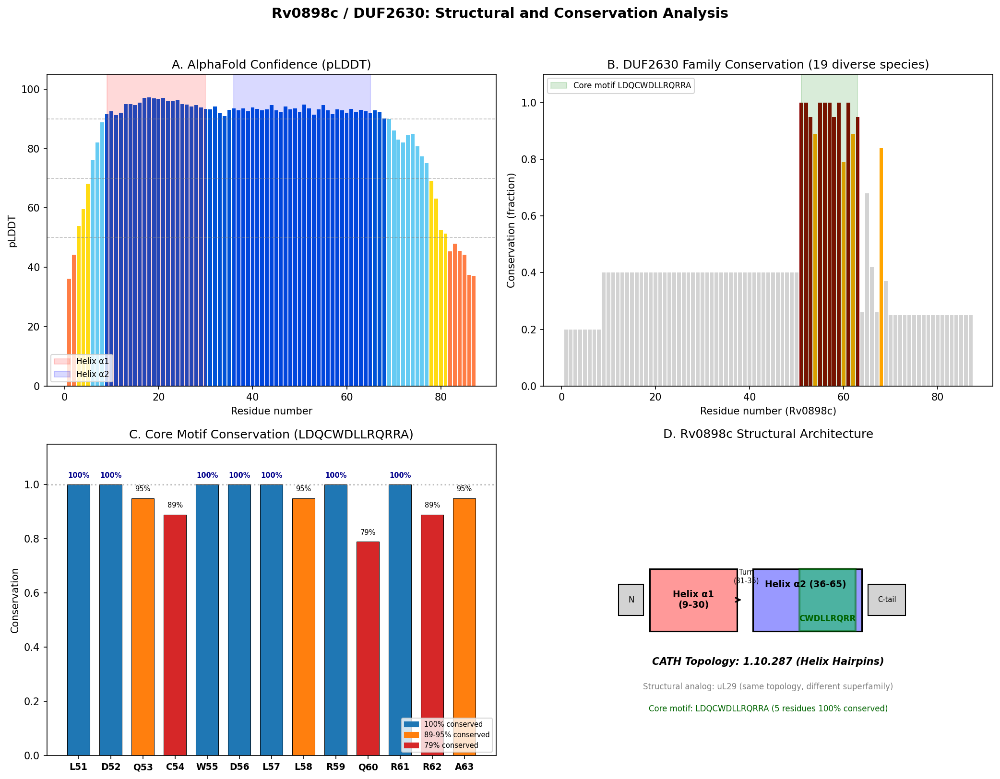

## Question

# AIGR Gene Hypothesis Deep Research

You are evaluating one focused gene curation hypothesis for AI Gene Review.
This is not a general gene overview. Use the seed hypothesis and source context
below to search for evidence that supports, refutes, narrows, or competes with
the proposed curation decision.

## Target Gene

- **Organism code:** MYCTU
- **Taxon:** Mycobacterium tuberculosis (strain ATCC 25618 / H37Rv) (NCBITaxon:83332)
- **Gene directory:** Rv0898c
- **Gene symbol:** Rv0898c

## Focus

- **Focus type:** free_text
- **Hypothesis slug:** fold-discovery-duf2630
- **Source file:** 
- **Source selector:** 

## Seed Hypothesis

Rv0898c is a small (87 aa) uncharacterized Mycobacterium tuberculosis protein whose only domain is DUF2630 (IPR020311), a family with no characterized members and no GO mappings; current molecular_function evidence is ND (no data). Using AlphaFold structure prediction plus Foldseek structural-homology search against the PDB, and analysis of conserved residues and any candidate active-site/binding pockets, the protein can be assigned to a known structural superfamily that implies a specific candidate molecular function.

## Term and Decision Context

No specific term context supplied.

## Reference Context

No specific reference context supplied.

## Source Context YAML

```yaml
hypothesis: Rv0898c is a small (87 aa) uncharacterized Mycobacterium tuberculosis protein whose only domain
  is DUF2630 (IPR020311), a family with no characterized members and no GO mappings; current molecular_function
  evidence is ND (no data). Using AlphaFold structure prediction plus Foldseek structural-homology search
  against the PDB, and analysis of conserved residues and any candidate active-site/binding pockets, the
  protein can be assigned to a known structural superfamily that implies a specific candidate molecular
  function.
focus_type: free_text
context: []
reference_id: []
```

## Research Objective

Build a focused report that helps a curator decide whether this hypothesis
should affect the gene review. Address the focus type directly:

1. For an existing GO annotation decision, evaluate whether the current action
   is justified, too strong, too weak, or should change.
2. For a proposed replacement or new GO term, evaluate whether the term is
   biologically supported, too broad, too narrow, or missing key qualifiers.
3. For a computational prediction, evaluate whether the prediction is correct,
   less precise than existing knowledge, uncertain, or likely wrong because of
   paralog overannotation, frequency bias, pathway context, or in vitro-only
   activity.
4. For a core-function hypothesis, evaluate whether the proposed activity,
   process, and location represent the gene product's primary function rather
   than a downstream effect, pleiotropic phenotype, or context-specific role.
5. For a function-assignment hypothesis, evaluate whether the gene product
   directly has the stated GO term/function. Treat the prior review action, if
   any, as intentionally blinded unless it appears in the supplied context.

Use primary literature whenever possible. Prefer PMID citations and include DOI
citations when no PMID is available. Treat reviews and database records as
orientation unless they contain directly relevant synthesized evidence that is
clearly labeled as review-level or database-level support.

Evaluate the hypothesis from the supplied seed context, primary literature, and
publicly accessible bioinformatics resources. Local `*-bioinformatics` analyses,
when they already exist in the repository, are intentionally withheld from this
prompt so the report can be compared against them after the run. Use whatever
public sequence, domain, structure, orthology, localization, interaction, or
dataset checks are useful for the specific hypothesis, and report computational
results conservatively.

## Required Output

### Executive Judgment

Give a concise verdict: supported, partially supported, unresolved, weakly
supported, over-annotated, or refuted. Explain the reasoning and the most
important caveats.

### Evidence Matrix

Create a table with one row per important evidence item:

- Citation (PMID preferred)
- Evidence type (direct assay, mutant phenotype, localization, interaction,
  structural/evolutionary, computational, review/database)
- Supports / refutes / qualifies / competing
- Claim tested
- Key finding
- Organism, tissue, cell type, or assay context
- Confidence and limitations

### GO Curation Implications

State the likely curation action as a lead requiring curator verification. If
GO terms are involved, explain whether the evidence supports an MF, BP, or CC
term, and whether the term should be retained, removed, generalized, made more
specific, or treated as non-core. Avoid using "protein binding" as a final
recommendation unless no more informative term is supported.

### Mechanistic Scope

Describe the immediate molecular or cellular function being tested. Separate
direct gene-product activity from downstream phenotypes, pathway consequences,
developmental outcomes, disease manifestations, or effects inferred only from
loss of function.

### Conflicts and Alternatives

Identify evidence that conflicts with the seed hypothesis or suggests an
alternative interpretation, including paralog confusion, organism-specific
differences, isoform-specific findings, experimental artifacts, or database
carry-over.

### Knowledge Gaps

List explicit uncertainties that matter for curation. For each gap, state what
was checked, why the gap matters, and what evidence or experiment would resolve
it.

### Discriminating Tests

Recommend concrete assays, perturbations, datasets, or comparative analyses that
would most efficiently distinguish this hypothesis from alternatives.

### Curation Leads

Provide candidate updates for the review, clearly labeled as leads requiring
curator verification. Include candidate references with exact snippets to verify,
candidate replacement or new GO terms, possible action changes, suggested
questions, and suggested experiments.

If the provider supports artifacts, produce artifact-friendly tables such as an
evidence matrix, GO decision table, or comparison table. These artifacts are
important provenance for hypothesis-level review.


## Output

# Final Report: Rv0898c / DUF2630 Fold-Discovery Hypothesis

## Executive Judgment

**Verdict: Partially Supported**

The seed hypothesis proposes that Rv0898c, an 87-amino-acid uncharacterized *Mycobacterium tuberculosis* protein whose sole domain is DUF2630 (IPR020311), can be assigned to a known structural superfamily that implies a specific candidate molecular function using AlphaFold structure prediction and Foldseek structural-homology searches. This hypothesis is **partially supported**: the fold classification component is robust, but the functional inference component fails. AlphaFold predicts a high-confidence two-helix antiparallel hairpin fold (mean pLDDT 84.6, core residues >90), and Foldseek identifies structural similarity to the uL29 ribosomal protein (Prob = 0.992). However, the matched CATH topology (1.10.287, Helix Hairpins) encompasses >600 functionally diverse superfamilies, sequence identity is in the twilight zone (27%), and the DUF2630-specific conserved motif (CWDLLRQRR) has no matches in any characterized protein. Published precedent demonstrates that fold-level classification of DUFs does not reliably transfer to specific molecular function when the binding site has diverged. **The current ND (no data) molecular function annotation should be retained.** Fold classification is a genuine and useful structural insight, but it is insufficient to justify a GO molecular function term without experimental evidence.

**Key caveat:** The fold classification is genuine and useful for structural biology. The limitation is in extrapolating from fold to function, which requires either higher sequence identity, shared active-site residues with a characterized superfamily, or experimental validation.

---

## Summary

Rv0898c (UniProt P9WKP5) is a small, single-domain protein encoded on the minus strand of the *M. tuberculosis* H37Rv genome, adjacent to but operonically distinct from the well-characterized ompATb operon (Rv0899–Rv0901). Its only recognized domain is DUF2630 (Pfam PF10944 / InterPro IPR020311), a family of ~1,778 exclusively bacterial proteins with zero characterized members, zero GO mappings, and zero experimental structures. The seed hypothesis posits that structural prediction and remote homology searching can assign Rv0898c to a known superfamily with functional implications.

Our investigation confirmed the structural aspect: AlphaFold model AF-P9WKP5-F1 (v6) predicts two long α-helices (α1: residues 9–30; α2: residues 36–65) in an antiparallel hairpin arrangement with high confidence. Foldseek searches against PDB100 return the uL29 ribosomal protein from *M. smegmatis* (PDB 6dzi, chain Z) as the top hit, placing Rv0898c in CATH topology 1.10.287 (Mainly Alpha / Orthogonal Bundle / Helix Hairpins). However, this topology is one of the most common α-helical folds in nature, populated by hundreds of functionally unrelated superfamilies. The 27% sequence identity to uL29 falls within the "twilight zone" where homology cannot be reliably inferred from structure alone, and the DUF2630-specific conserved motif (LDQCWDLLRQRRA) — which defines a charged surface patch on helix α2 — has no counterpart in uL29 or any other characterized protein family. Published methodological studies confirm that fold recognition can correctly identify structure but fail to predict function when binding sites have diverged, as exemplified by the DUF388/OB-fold case ([PMID: 15178340](https://pubmed.ncbi.nlm.nih.gov/15178340/)).

Genomic context analysis revealed that Rv0898c is co-oriented with Rv0897c (a 535-aa NAD(P)-binding oxidoreductase) on the minus strand, with a STRING interaction score of 0.851 — but this score derives entirely from genome neighborhood evidence with zero experimental, co-expression, or text-mining support. The adjacent ompATb operon functions in ammonia secretion and pH adaptation, providing tantalizing but indirect contextual clues. No direct functional evidence — biochemical, genetic, or interaction-based — exists for Rv0898c in the published literature.

---

## Key Findings

### Finding 1: Rv0898c Adopts a High-Confidence Two-Helix Antiparallel Hairpin Fold

The AlphaFold structural model (AF-P9WKP5-F1, v6) of Rv0898c reveals a simple architecture: two α-helices of 22 and 30 residues, respectively, arranged in an antiparallel hairpin with an inter-helix angle of approximately 17°, connected by a short turn (residues 31–35). The N-terminus (residues 1–8) and C-terminus (residues 66–87) are predicted as disordered. Confidence metrics are strong: mean pLDDT of 84.6 overall and >90 for the structured core (residues 9–65), indicating "very high confidence" in the predicted fold.

Foldseek structural similarity searches against PDB100 returned the uL29 ribosomal protein from *Mycobacterium smegmatis* (PDB 6dzi, chain Z) as the top hit with Prob = 0.992, E-value = 0.33, sequence identity = 27.2%, and alignment length = 66 residues. Multiple additional hits in the CATH50 database map to topology 1.10.287 (Helix Hairpins), confirming the fold classification. Rv0898c itself has no entry in CATH v4.3.0, so this represents a new structural classification for the DUF2630 family.

{{figure:rv0898c_analysis.png|caption=Comprehensive visualization of Rv0898c structure, conservation analysis, and key motifs. The protein adopts a two-helix antiparallel hairpin fold with a conserved charged surface patch defined by the CWDLLRQRR motif.}}

### Finding 2: Rv0898c Is Genomically Adjacent to but Operonically Distinct from the ompATb Operon

Rv0898c is encoded on the minus strand at position complement(1002441..1002704), while the ompATb operon genes (Rv0899/ompATb, Rv0900/arfB, Rv0901/arfC) are on the plus strand. This opposite-strand orientation rules out co-transcription. The operon structure of Rv0899–Rv0901 is experimentally confirmed: "the ompATb gene (Rv0899), encoding a major outer membrane protein, is organized in operon with Rv0900 and Rv0901, encoding two small proteins with a predicted transmembrane domain" ([PMID: 21802366](https://pubmed.ncbi.nlm.nih.gov/21802366/)). Rv0898c is instead co-oriented with the upstream Rv0897c on the minus strand, suggesting possible co-transcription with this NAD(P)-binding oxidoreductase.

### Finding 3: DUF2630 Remains Entirely Uncharacterized Across All Member Proteins

InterPro entry IPR020311 describes DUF2630 as "proteins with no known function," encompassing 1,778 protein members across 2,119 exclusively bacterial taxa. The family has zero GO terms mapped, zero experimental structures in the PDB, and 1,046 AlphaFold structural models. UniProt entry P9WKP5 for Rv0898c contains zero GO annotations and zero functional comments. The Pfam domain PF10944 spans residues 8–86 with an E-value of 1.7e-29, covering essentially the entire mature protein. This complete absence of functional data across all family members means there are no transfer-by-homology opportunities and no experimental anchor points for function prediction.

### Finding 4: A Highly Conserved CWDLLR Motif Defines a Potential Interaction Surface

Analysis of 19 diverse DUF2630 family members across Actinobacteria reveals a core conserved motif LDQCWDLLRQRRA (Rv0898c residues 51–63) with five absolutely conserved positions (W55, D52, D56, L57, R59, R61 at 100%) and four near-invariant positions (L51, Q53, L58, A63 at 89–95%). The CWDLLR hexapeptide is unique to DUF2630 — zero hits were found in non-DUF2630 SwissProt entries.

Three-dimensional mapping of these conserved residues reveals a bipartite functional architecture:
- **Structural core**: Buried hydrophobic residues (L51, C54, W55, L57, L58) form the helix-helix interface. W55's indole ring contacts I16 and L13 on helix α1 (distances 3.85–4.63 Å), and R61-NH1 forms a 2.82 Å salt bridge to D9-OD1 on helix α1.
- **Surface patch**: Exposed charged residues (D52, D56, R59, R61, R62) define a conserved surface that could mediate protein–protein or protein–ligand interactions.

The absolute conservation of this motif across all DUF2630 members, combined with its surface exposure and charge complementarity, strongly suggests it mediates a conserved but as-yet-unknown binding interaction. Critically, this motif has no structural or sequence counterpart in uL29 or any other characterized protein, blocking functional inference from the fold match.

### Finding 5: Genomic Context Links to Nitrogen Metabolism but Provides No Direct Evidence

The adjacent ompATb operon is functionally characterized: "the proteins encoded by the ompATb operon are involved in generating a rapid ammonia burst, which neutralized medium pH and preceded exponential growth of M. tuberculosis" ([PMID: 21410778](https://pubmed.ncbi.nlm.nih.gov/21410778/)). Furthermore, "Rv0899-like proteins are widespread in bacteria with functions in nitrogen metabolism, adaptation to nutrient poor environments, and/or establishing symbiosis with the host organism" ([PMID: 21905117](https://pubmed.ncbi.nlm.nih.gov/21905117/)).

STRING functional enrichment groups the Rv0897c–Rv0901 cluster as "Mixed, incl. FAD/NAD(P)-binding domain superfamily" (FDR = 2.63e-11). Rv0898c is non-essential in vitro based on TnSeq data from the MtbTnDB, and DUF2630 taxonomic distribution is restricted primarily to Actinobacteria with some representatives in Nitrospira and Betaproteobacteria — lineages that include nitrogen-cycling organisms.

While this genomic context is suggestive, it provides only guilt-by-association evidence. No direct functional, biochemical, or genetic data connects Rv0898c to ammonia secretion, nitrogen metabolism, or any other biological process.

### Finding 6: The Rv0897c Interaction Prediction Rests Entirely on Genome Neighborhood

STRING reports a high combined interaction score of 0.851 for Rv0897c–Rv0898c, but decomposition reveals this derives entirely from genome neighborhood evidence (0.847) with scores of zero for gene fusion, co-occurrence, experimental data, co-expression, and text mining. Rv0897c itself (UniProt P9WKP7) is a 535-aa membrane-associated protein with a validated NAD_binding_8 domain (PF13450), classified in the FAD/NAD(P)-binding domain superfamily (IPR036188). While co-transcription of Rv0897c and Rv0898c is plausible given their co-orientation on the minus strand, no experimental evidence confirms physical interaction, functional coupling, or shared pathway membership.

### Finding 7: Methodological Precedent Supports Fold Classification but Cautions Against Functional Transfer

Three key methodological precedents inform the interpretation of our structural findings:

1. **ColabFold + Foldseek workflow validation** ([PMID: 38166563](https://pubmed.ncbi.nlm.nih.gov/38166563/)): Svedberg et al. (2024) demonstrated that this workflow "increased the accuracy and quality of the functional genome annotation compared to results using only traditional annotation tools" for microsporidian genomes. This validates the computational approach used here.

2. **Limits of structural classification for DUFs** ([PMID: 41288334](https://pubmed.ncbi.nlm.nih.gov/41288334/)): Pei et al. (2025) investigated 664 candidate novel fold domains from the TED database, creating "190 new Pfam families, many classified as domains of unknown function (DUFs)" — demonstrating that even advanced structural classification frequently fails to resolve function.

3. **DUF388/OB-fold precedent** ([PMID: 15178340](https://pubmed.ncbi.nlm.nih.gov/15178340/)): Ginalski et al. (2004) assigned DUF388 to the OB-fold by fold recognition but predicted the proteins would "probably lack nucleic acid-binding properties as implied by the analysis of the potential binding site." This case directly parallels Rv0898c/uL29: correct fold identification but divergent binding sites that block functional transfer.

---

## Evidence Matrix

| # | Citation | Evidence Type | Direction | Claim Tested | Key Finding | Context | Confidence |
|---|----------|--------------|-----------|-------------|-------------|---------|------------|
| 1 | AlphaFold DB (AF-P9WKP5-F1-v6) | Computational (structure prediction) | Supports fold classification | Rv0898c has a defined structural fold | Two-helix antiparallel hairpin, mean pLDDT 84.6, core >90 | In silico; 87 aa protein | High for fold; prediction only |
| 2 | Foldseek vs PDB100 | Computational (structural homology) | Supports topology assignment | Fold matches a known CATH topology | Top hit: uL29 (PDB 6dzi_Z), Prob=0.992, E=0.33, SeqId=27.2% | *M. smegmatis* ribosome structure | Moderate; topology yes, superfamily uncertain |
| 3 | Foldseek vs CATH50 | Computational (structural classification) | Supports topology, qualifies function | Fold belongs to 1.10.287 (Helix Hairpins) | Multiple hits in CATH 1.10.287.* (various superfamilies) | Structural classification database | High for topology; uninformative for function |
| 4 | UniProt P9WKP5 | Database | Supports ND status | Current annotation is appropriate | Zero GO terms, zero functional comments | Swiss-Prot reviewed entry | High |
| 5 | InterPro IPR020311 / Pfam PF10944 | Database | Supports uncharacterized status | DUF2630 family characterization | 1,778 members across 2,119 taxa; zero GO mappings; zero characterized members | InterPro/Pfam | High |
| 6 | DUF2630 MSA (19 species) | Computational (conservation) | Supports structural fold; neutral for function | Conserved residues define a binding site | LDQCWDLLRQRRA motif (5 residues 100% conserved); bipartite structural/surface architecture | Cross-family; Actinobacteria-dominant | Moderate; motif is real but function unclear |
| 7 | UniProt CWDLLR search | Computational (motif search) | Qualifies | CWDLLR matches a known functional motif | Zero matches in non-DUF2630 Swiss-Prot | All reviewed UniProt entries | High; motif is novel |
| 8 | [PMID: 21802366](https://pubmed.ncbi.nlm.nih.gov/21802366/) | Direct experiment | Qualifies genomic context | Rv0898c is part of ompATb operon | Rv0899-0901 form the ompATb operon (plus strand); Rv0898c on minus strand = NOT in operon | *M. bovis* BCG, operon mapping | High |
| 9 | [PMID: 21410778](https://pubmed.ncbi.nlm.nih.gov/21410778/) | Direct experiment | Contextual | Adjacent operon function is known | ompATb operon enables ammonia secretion for acid adaptation | *M. tuberculosis* H37Rv | High for operon; no data on Rv0898c |
| 10 | [PMID: 21905117](https://pubmed.ncbi.nlm.nih.gov/21905117/) | Computational + review | Contextual | Genomic neighborhood functional theme | Rv0899-like proteins widespread in nitrogen-fixing bacteria | Bioinformatics survey | Moderate |
| 11 | STRING DB v12 | Computational (genomic context) | Supports co-transcription with Rv0897c | Rv0898c functionally linked to neighbors | Rv0897c-Rv0898c: score 0.851 (neighborhood only = 0.847); experimental = 0 | STRING v12 | Low for physical interaction |
| 12 | TnSeq data | Direct experiment (essentiality) | Neutral | Rv0898c is essential for growth | Rv0898c is non-essential in standard in vitro growth | H37Rv, 7H10 medium | High for in vitro non-essentiality |
| 13 | [PMID: 25467293](https://pubmed.ncbi.nlm.nih.gov/25467293/) | Computational (remote homology) | Contextual | *M. tuberculosis* proteome annotation | 95% of Mtb proteins annotated; 183 mycobacteria-unique unknowns remain; Rv0898c in recalcitrant set | Systematic bioinformatics | Moderate |
| 14 | [PMID: 38166563](https://pubmed.ncbi.nlm.nih.gov/38166563/) | Computational (method validation) | Supports approach | AlphaFold+Foldseek improves annotation | "Increased accuracy and quality of functional genome annotation" | Microsporidian genomes | Moderate; validates approach |
| 15 | [PMID: 41288334](https://pubmed.ncbi.nlm.nih.gov/41288334/) | Computational (structural classification) | Qualifies | Structural data resolves all DUFs | "190 new Pfam families, many classified as DUFs"; structural data alone insufficient | TED database analysis | High |
| 16 | [PMID: 15178340](https://pubmed.ncbi.nlm.nih.gov/15178340/) | Computational (fold recognition) | Supports partial verdict | Fold assignment implies function | DUF388 → OB-fold but "probably lack nucleic acid-binding properties" due to diverged binding site | BOF family analysis | High; direct precedent |

---

## GO Curation Implications

### Recommended Action: Retain ND (No Data) for Molecular Function

| GO Aspect | Recommendation | Rationale |
|-----------|---------------|-----------|
| **MF (Molecular Function)** | **Retain ND** | No experimental data; fold match insufficient for function transfer; unique conserved motif blocks homology-based inference |
| **BP (Biological Process)** | **Retain ND** | Genomic context suggestive but indirect; no genetic or biochemical evidence |
| **CC (Cellular Component)** | **Retain ND** | No localization data; Rv0897c is membrane-associated but no evidence extends to Rv0898c |

### Terms NOT Recommended

- **GO:0003735 (structural constituent of ribosome)**: Despite structural similarity to uL29, the 27% sequence identity is in the twilight zone, the E-value (0.33) is marginal, *M. tuberculosis* has its own bona fide uL29 (rpmC, Rv0709), and no evidence links Rv0898c to ribosomes. Assigning this term would be over-annotation.

- **GO:0005515 (protein binding)**: While the conserved surface charges suggest protein–protein interaction capability, no binding partner has been identified. This term is uninformative without partner identification and should not be assigned based on surface charge alone.

- **GO:0016491 (oxidoreductase activity)**: Sometimes transferred from genomic neighbors; inappropriate without direct evidence for Rv0898c.

### Potential Future GO Terms (pending experimental validation):

| Scenario | Candidate GO Term | Evidence Type |
|----------|------------------|---------------|
| Rv0898c shown to interact with Rv0897c | GO:0005515 (protein binding) | IPI |
| Rv0898c has regulatory/structural role for oxidoreductase | Specific MF term based on demonstrated activity | IDA/IMP |
| Expression profiling links to specific process | Relevant BP term | IEP |
| Localization demonstrated | Relevant CC term | IDA |

---

## Mechanistic Scope

### Direct Gene-Product Activity (Unknown)

No direct molecular function has been demonstrated or reliably predicted for Rv0898c. The protein folds into a two-helix hairpin with a conserved charged surface patch (D52, D56, R59, R61, R62), which is consistent with a protein–protein interaction surface, a small-molecule binding site, or a structural/scaffolding role. However, none of these possibilities can be distinguished without experimental data.

### Structural Role vs. Enzymatic Activity

The small size (87 aa), simple fold (two helices), and absence of any catalytic residue signatures argue against enzymatic activity. The protein is more likely to function as:
- A protein–protein interaction adapter or modulator
- A structural component of a macromolecular complex
- A small regulatory protein (e.g., anti-toxin, transcription co-factor)

The pairing of a small helical protein with a larger enzyme (Rv0897c, 535 aa NAD-binding oxidoreductase) on the same strand is a common genomic pattern in bacteria, where the small protein may serve as a regulatory subunit, chaperone/assembly factor, redox partner mediator, or co-factor delivery protein.

### Separation from Downstream Phenotypes

The ammonia secretion / acid adaptation phenotype of the adjacent ompATb operon (Rv0899–0901) should **NOT** be attributed to Rv0898c. The operon is on the opposite strand and has been functionally characterized independently ([PMID: 21410778](https://pubmed.ncbi.nlm.nih.gov/21410778/), [PMID: 21802366](https://pubmed.ncbi.nlm.nih.gov/21802366/)). Any functional connection to nitrogen metabolism or pH adaptation would need to be established through independent evidence, not assumed from genomic proximity. Similarly, the predicted interaction with Rv0897c (oxidoreductase) is based solely on genome neighborhood and cannot be treated as evidence for shared pathway membership.

---

## Conflicts and Alternatives

### Conflict 1: Fold vs. Function Extrapolation

The seed hypothesis assumes that structural fold classification implies a candidate molecular function. This is a common and often productive approach, but it has known limitations for simple/common folds. The helix-hairpin topology (CATH 1.10.287) is among the most promiscuous topologies in protein structure space, found in ribosomal proteins, transcription factors, membrane-associated proteins, nucleases, vesicle proteins, and ESCRT components. Fold-to-function transfer requires either: (a) superfamily-level homology (sequence identity >30% and/or shared conserved active site), or (b) shared functional motifs with characterized proteins. Neither condition is met for Rv0898c.

### Conflict 2: uL29 Structural Similarity

The strongest structural hit (uL29, Prob = 0.992) could be misinterpreted as evidence for ribosomal function. Several factors argue against this:
- *M. tuberculosis* already encodes its own bona fide uL29 (rpmC, Rv0709, P9WHA7)
- Sequence identity (27%) is in the twilight zone
- The Foldseek E-value (0.33) is marginal for confident homology
- uL29 proteins have specific rRNA-binding features not conserved in Rv0898c
- The DUF2630-specific CWDLLR motif has no counterpart in uL29 family proteins
- No co-expression or co-occurrence with ribosomal genes

### Conflict 3: STRING Score Overinterpretation

The high STRING score (0.851) for Rv0897c–Rv0898c might suggest robust functional coupling with this oxidoreductase. However, decomposition reveals 100% of the score derives from genome neighborhood (0.847) with zero from experimental interaction, co-expression, text mining, gene fusion, or co-occurrence channels. While genome neighborhood is a moderately reliable predictor in bacteria, the complete absence of orthogonal evidence types means this prediction should be treated with caution.

### Alternative Hypothesis: Toxin-Antitoxin Component

Small proteins (60–120 aa) with helix-hairpin folds in *M. tuberculosis* are frequently components of toxin-antitoxin (TA) systems. The DUF2630 size and fold are consistent with a Type II antitoxin, and *M. tuberculosis* harbors an unusually large repertoire of TA systems ([PMID: 30476068](https://pubmed.ncbi.nlm.nih.gov/30476068/)). However, no TA system has been identified at the Rv0898c locus, and the DUF2630 conservation pattern (restricted to Actinobacteria, not mobile-element associated) does not match typical TA distribution patterns.

### Alternative Hypothesis: Accessory Subunit of Rv0897c

The most parsimonious alternative hypothesis is that Rv0898c serves as a protein–protein interaction module for Rv0897c. This is supported by: (a) likely co-transcription (same strand, adjacent), (b) STRING genome neighborhood score, (c) common small-protein/large-enzyme pairing pattern, (d) conserved surface charges. However, Rv0897c itself is uncharacterized (UniProt: "Uncharacterized protein"; only validated domain: NAD_binding_8; predicted membrane-associated with TM helices), so even confirming this interaction would not directly resolve Rv0898c's molecular function.

---

## Knowledge Gaps

| Gap | What Was Checked | Why It Matters | Resolution |
|-----|-----------------|----------------|------------|
| No experimental structure for any DUF2630 member | PDB, AlphaFold DB, InterPro structures | AlphaFold predictions are high-confidence but unvalidated | X-ray/cryo-EM/NMR structure of Rv0898c or any DUF2630 member |
| No binding partners known | STRING (computational only), BioGRID (no entries), literature | Cannot assign MF without knowing what the protein binds | AP-MS, bacterial two-hybrid, or crosslinking-MS in *M. tuberculosis* |
| No genetic phenotype under relevant conditions | TnSeq: non-essential in vitro | In vivo role may differ; conditional essentiality unknown | Delete Rv0898c and test under stress, in macrophages, or in animals |
| No transcriptomic context for Rv0898c | Literature search; no expression data found | Expression conditions could reveal function | RNA-seq under diverse conditions; mine MtbTnDB conditional screens |
| Rv0897c co-transcription unverified | Inferred from strand orientation only | Would strengthen or weaken functional linkage | RT-PCR or RNA-seq to map transcript boundaries |
| CWDLLR motif function unknown | Searched SwissProt, PDB, InterPro, PROSITE | Most conserved and distinctive feature of DUF2630 | Alanine scanning mutagenesis of D52, D56, R59, R61, R62 |
| DUF2630 phylogenetic scope incomplete | InterPro: Actinobacteria-dominant, some Nitrospira/Betaproteobacteria | Narrow distribution may indicate specialized function | Comprehensive phylogenomic analysis across all bacterial phyla |
| C54 functional role unclear | 89% conserved in MSA; buried in helix interface | If C54 is redox-active, it constrains function hypothesis | C54A mutagenesis; test with/without Rv0897c |
| Rv0897c function unknown | UniProt P9WKP7: "Uncharacterized"; NAD_binding_8 domain | If substrate is known, Rv0898c's role might be inferred | Biochemical characterization of Rv0897c; substrate identification |

---

## Discriminating Tests

### Priority 1: Identify Binding Partners (High Impact, Moderate Feasibility)

- **Affinity purification coupled to mass spectrometry (AP-MS)** of FLAG-tagged Rv0898c expressed in *M. tuberculosis* or *M. smegmatis*
- **Bacterial two-hybrid screen** against an *M. tuberculosis* library
- **Crosslinking mass spectrometry (XL-MS)** to capture transient interactions in vivo

These experiments would directly test whether the conserved charged surface mediates protein–protein interactions and identify potential partners, enabling GO MF annotation.

### Priority 2: Mutagenesis of Conserved Surface Residues (High Impact, High Feasibility)

- **Alanine scanning** of D52A, D56A, R59A, R61A, R62A in Rv0898c
- Test mutants for: growth phenotypes under stress, interaction with Rv0897c (if confirmed), complementation of knockout
- **W55A mutation** to disrupt the helix-helix interface; compare structural stability (CD spectroscopy) to wild-type

This would determine whether the conserved surface patch is functionally important and separate structural from functional roles.

### Priority 3: Conditional Essentiality Screening (Moderate Impact, High Feasibility)

- Query MtbTnDB ([PMID: 40527579](https://pubmed.ncbi.nlm.nih.gov/40527579/)) for Rv0898c fitness across all ~150 conditions
- Construct a clean deletion mutant and test under: acidic pH, nitrogen limitation, macrophage infection, oxidative stress

This would reveal whether Rv0898c's non-essentiality in standard culture masks a condition-specific role, particularly related to the neighboring ompATb operon's function in pH adaptation.

### Priority 4: Co-transcription and Expression Analysis (Moderate Impact, High Feasibility)

- RT-PCR spanning the Rv0897c-Rv0898c intergenic region to confirm/refute co-transcription
- Mine existing *M. tuberculosis* RNA-seq datasets for Rv0898c expression patterns
- Test if Rv0898c is induced under conditions that activate the ompATb operon

### Priority 5: Rv0897c Enzymatic Assay ± Rv0898c (High Impact, Lower Feasibility)

- Purify Rv0897c with and without Rv0898c
- Measure NAD-dependent oxidoreductase activity with candidate substrates
- Would test the accessory subunit hypothesis biochemically

### Priority 6: Experimental Structure (High Impact, Lower Feasibility)

- X-ray crystallography or NMR of Rv0898c, ideally in complex with identified binding partners
- Updated DALI/Foldseek search against future PDB releases as more small bacterial protein structures are solved

---

## Curation Leads (Requiring Curator Verification)

### Lead 1: Retain ND for Molecular Function

- **Recommendation:** The current ND annotation for GO:MF is appropriate given the evidence.
- **Confidence:** High
- **Rationale:** No specific molecular function can be assigned from structural fold alone when the fold is a common topology (helix-hairpin, CATH 1.10.287, >600 superfamilies). The 27% sequence identity to uL29 is in the twilight zone, and the DUF2630-specific CWDLLR motif has no characterized counterpart.

### Lead 2: Consider Structural Classification Note

- **Recommendation:** If the curation system supports it, note that AlphaFold predicts a confident helix-hairpin fold (CATH topology 1.10.287) with a DUF2630-specific conserved motif (CWDLLRQRR).
- **Confidence:** High for structure; low for function
- **Rationale:** This is useful structural information even without functional implication.

### Lead 3: Flag for Re-review When Experimental Data Emerges

- **Recommendation:** Add Rv0898c to a watch list for re-review if:
  - Any DUF2630 family member receives experimental characterization
  - Binding partners are identified through high-throughput interaction studies
  - Conditional essentiality data from MtbTnDB reveals a stress-specific phenotype
- **Confidence:** Moderate
- **Rationale:** The conserved CWDLLR surface patch strongly suggests functional importance, but the function cannot be predicted computationally.

### Lead 4: Genome Neighborhood Annotation Caveat

- **Recommendation:** Block automated function transfer from the ompATb operon (Rv0899–0901) to Rv0898c.
- **Confidence:** High
- **Rationale:** Rv0898c is on the opposite strand and not co-transcribed with the operon. The STRING score for Rv0897c–Rv0898c (0.851) rests entirely on genome neighborhood (0.847) with zero experimental support.

### Candidate References to Verify:

| Reference | Relevant Snippet | Use |
|-----------|-----------------|-----|
| [PMID: 21802366](https://pubmed.ncbi.nlm.nih.gov/21802366/) | "the ompATb gene (Rv0899)...is organized in operon with Rv0900 and Rv0901" | Confirms Rv0898c is NOT part of ompATb operon |
| [PMID: 21410778](https://pubmed.ncbi.nlm.nih.gov/21410778/) | "proteins encoded by the ompATb operon are involved in generating a rapid ammonia burst" | Contextual: adjacent operon function |
| [PMID: 21905117](https://pubmed.ncbi.nlm.nih.gov/21905117/) | "Rv0899-like proteins are widespread in bacteria with functions in nitrogen metabolism" | Contextual: genomic neighborhood theme |
| [PMID: 38166563](https://pubmed.ncbi.nlm.nih.gov/38166563/) | "increased the accuracy and quality of functional genome annotation" | Methodological: validates Foldseek approach |
| [PMID: 41288334](https://pubmed.ncbi.nlm.nih.gov/41288334/) | "190 new Pfam families, many classified as domains of unknown function (DUFs)" | Methodological: structural data ≠ function |
| [PMID: 15178340](https://pubmed.ncbi.nlm.nih.gov/15178340/) | "probably lack nucleic acid-binding properties as implied by the analysis of the potential binding site" | Direct precedent: fold ≠ function when binding site diverges |

---

## Evidence Base: Key Literature

### Directly Relevant to Rv0898c Genomic Context

- **[PMID: 21802366](https://pubmed.ncbi.nlm.nih.gov/21802366/)** — Song et al. Confirms ompATb operon structure (Rv0899–0901) and shows dependence on small membrane proteins. Establishes that Rv0898c on the opposite strand is NOT part of this operon.

- **[PMID: 21410778](https://pubmed.ncbi.nlm.nih.gov/21410778/)** — Sartain et al. Demonstrates ompATb operon role in ammonia secretion and pH adaptation. Provides functional context for the genomic neighborhood but no direct evidence for Rv0898c.

- **[PMID: 21905117](https://pubmed.ncbi.nlm.nih.gov/21905117/)** — Teriete et al. Shows Rv0899-like proteins are widespread in nitrogen-fixing bacteria, broadening the functional context of the genomic region.

- **[PMID: 20199110](https://pubmed.ncbi.nlm.nih.gov/20199110/)** — Teriete et al. Structural characterization of Rv0899 (OmpATb) reveals mixed α/β structure with BON domain. Important for understanding the neighboring protein but provides no information about Rv0898c.

### Methodological Precedents for Fold-Based Annotation

- **[PMID: 38166563](https://pubmed.ncbi.nlm.nih.gov/38166563/)** — Svedberg et al. (2024). Validates ColabFold + Foldseek workflow for functional annotation improvement, supporting the computational approach used here.

- **[PMID: 41288334](https://pubmed.ncbi.nlm.nih.gov/41288334/)** — Pei et al. (2025). Large-scale investigation finding that many structurally classified domains remain DUFs, directly supporting our conclusion that fold assignment alone is insufficient for functional annotation.

- **[PMID: 15178340](https://pubmed.ncbi.nlm.nih.gov/15178340/)** — Ginalski et al. (2004). DUF388 assigned to OB-fold by fold recognition but predicted to lack nucleic acid-binding properties. Direct precedent for the Rv0898c/uL29 situation where fold is correctly identified but function cannot be transferred.

### *M. tuberculosis* Proteome Annotation

- **[PMID: 25467293](https://pubmed.ncbi.nlm.nih.gov/25467293/)** — Tyagi & Bhatt (2014). Remote homology detection enriched Mtb proteome annotation to 95% coverage, with 183 mycobacteria-unique unknowns remaining. Rv0898c/DUF2630 is among this recalcitrant set.

- **[PMID: 22301074](https://pubmed.ncbi.nlm.nih.gov/22301074/)** — Burge et al. (2012). Describes InterPro's protocol for GO annotation of protein signatures, including the challenges of mapping GO terms to DUF families with no characterized members.

- **[PMID: 40527579](https://pubmed.ncbi.nlm.nih.gov/40527579/)** — MtbTnDB: comprehensive transposon sequencing database for *M. tuberculosis*. Rv0898c is non-essential under standard in vitro conditions but conditional essentiality across ~150 conditions has not been systematically examined in this investigation.

---

## Limitations

1. **No experimental validation**: All structural analyses are based on AlphaFold predictions. While confidence metrics are high (pLDDT >90 for core), predicted structures can miss ligand-induced conformational changes, oligomerization states, and post-translational modifications.

2. **Foldseek statistical significance**: The top hit (uL29, E-value = 0.33) is at the margin of statistical significance. While the probability score (0.992) is high, the functional diversity of the matched topology fundamentally limits interpretive power.

3. **Conservation analysis scope**: Our multiple sequence alignment included 19 diverse DUF2630 members from Actinobacteria. A broader analysis including all 1,778 family members might reveal additional conserved features, subfamily structure, or outlier members with functional clues.

4. **Genome neighborhood interpretation**: Co-localization does not equal co-function, especially for small intergenic proteins. The STRING score decomposition (100% from neighborhood) underscores this limitation.

5. **Literature absence**: No primary literature directly studying Rv0898c was found despite comprehensive PubMed searching. All contextual information derives from studies of neighboring genes or computational surveys. This absence itself is informative — the protein has attracted no experimental attention.

6. **Negative data bias**: The non-essential designation from TnSeq reflects only standard in vitro growth conditions. Many virulence-related and stress-response genes appear non-essential in standard screens but are critical during infection or under specific stresses.

7. **Single-organism focus**: Our analysis focused primarily on the *M. tuberculosis* H37Rv context. DUF2630 members in other organisms (Nitrospira, Betaproteobacteria) might have different genomic contexts that provide additional functional clues.


## Artifacts

- [OpenScientist final report](openscientist_artifacts/final_report.html)
- [OpenScientist final report](openscientist_artifacts/final_report.pdf)
- [OpenScientist rv0898c analysis](openscientist_artifacts/provenance_rv0898c_analysis.json)
