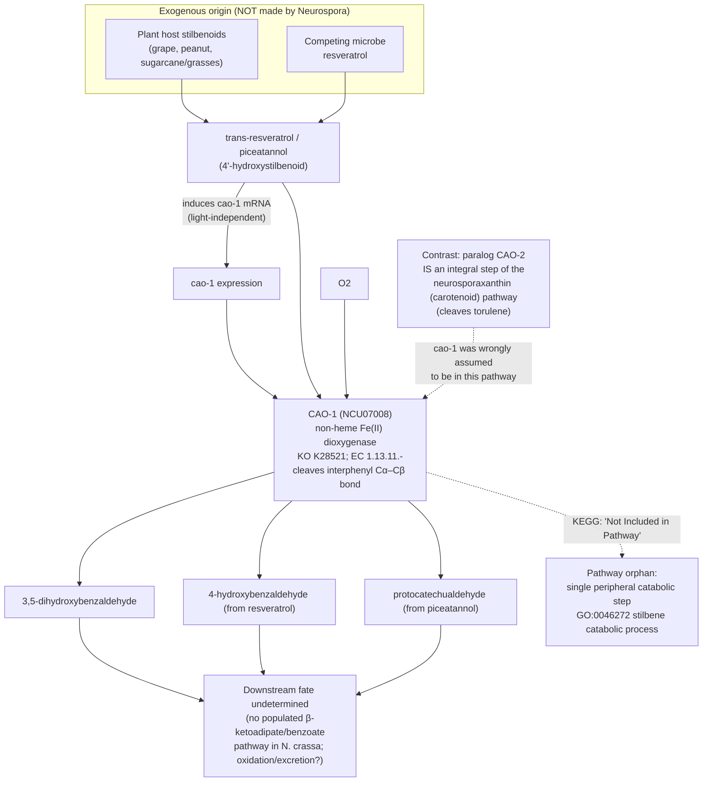

# Pathway Summary for cao-1

## Overview

cao-1 (CAO-1, NCU07008; UniProt Q7S860) does **not** belong to a defined, multi-step endogenous
metabolic pathway. It catalyzes a single, peripheral **catabolic cleavage** step: the FAD-independent,
mononuclear non-heme Fe(II) dioxygenase oxidatively cleaves the interphenyl Cα–Cβ double bond of the
**stilbenoid resveratrol** (and piceatannol), an **exogenous** plant/microbial metabolite that
Neurospora does not synthesize [PMID:23893079]. Consistent with this "standalone reaction" status,
KEGG assigns cao-1 to ortholog **K28521 ("resveratrol cleavage oxygenase", EC 1.13.11.-)** and
explicitly lists it as *"Not Included in Pathway or Brite"* — i.e. it is mapped to no KEGG pathway.

This is the crux of the long-standing mis-annotation: cao-1's paralog **CAO-2 (A7UXI1, NCU11424)** is a
genuine, integral step of the **neurosporaxanthin (carotenoid) biosynthetic pathway** — a torulene
dioxygenase (EC 1.13.11.59, KEGG KO **K17842**) mapped by KEGG to pathway **ncr00906 (Carotenoid
biosynthesis)** [PMID:23893079] — and cao-1 was originally assumed to sit in the same carotenoid
pathway, supplying retinal by cleaving β-carotene. Direct assays disproved this: heterologously
expressed CAO-1 converts no carotenoid or apocarotenoid, and GOA carries a curated **NOT carotenoid
metabolic process** annotation [PMID:23893079]. So cao-1 is *pathway-orphaned* relative to the
carotenoid pathway it was presumed to serve, and instead performs an isolated stilbenoid-catabolic step.

Tellingly, **both paralogs carry the identical phylogenetic (IBA) carotenoid annotations** —
carotenoid dioxygenase activity (GO:0010436) and carotene catabolic process (GO:0016121), both from
GO_REF:0000033 — because they share the carotenoid-oxygenase family (PANTHER PTHR10543). Those terms
are *correct* for CAO-2 but *wrong* for CAO-1; only target-specific experimental evidence separates the
two. The pathway membership follows the same split: CAO-2 belongs to `ncr00906`, while CAO-1 (KEGG KO
K28521) is listed as "Not Included in Pathway or Brite."

## The catalyzed reaction (a single step, not a cascade)

CAO-1 performs one oxygen-dependent scission [PMID:23893079, PMID:28493664]:

- *trans*-resveratrol + O₂ → 3,5-dihydroxybenzaldehyde + 4-hydroxybenzaldehyde (RHEA:73735)
- piceatannol + O₂ → 3,5-dihydroxybenzaldehyde + 3,4-dihydroxybenzaldehyde (protocatechualdehyde) (RHEA:73815)

Substrate recognition is narrow: the enzyme requires free (unmodified) hydroxyls, notably the 4′-OH,
and does not cleave pinosylvin (no 4′-OH), methoxylated stilbenes, or stilbene glycosides
[PMID:23893079]. Structurally, the four-His non-heme Fe(II) center is conserved with the
carotenoid-cleaving members of the family, but the substrate-binding cleft is stilbenoid-adapted
[PMID:28493664]. The best available GO process term for this activity is **stilbene catabolic process
(GO:0046272)** — a peripheral single-step catabolism rather than a canonical pathway.

## Upstream: the substrate is exogenous, not biosynthesized by Neurospora

Neurospora has no stilbene synthase and does not make resveratrol; the substrate is supplied from
**outside the fungus** — either a plant host that produces stilbenoid phytoalexins (grapevine, peanut,
and notably grasses/sugarcane, which accumulate resveratrol and piceatannol) or a competing
resveratrol-producing microbe [PMID:23893079]. There is therefore no endogenous "upstream" biosynthetic
segment feeding CAO-1. The gene is transcriptionally induced by resveratrol and, unlike genuine
carotenoid-pathway genes, is light-independent [PMID:23893079], consistent with an inducible response
to an environmental substrate rather than a constitutive metabolic-pathway enzyme.

## Downstream: the fate of the aldehyde products is undetermined

The cleavage products are aromatic aldehydes — 3,5-dihydroxybenzaldehyde, 4-hydroxybenzaldehyde
(KEGG C00633), and protocatechualdehyde (3,4-dihydroxybenzaldehyde, KEGG C16700). Their metabolic
fate in Neurospora has not been experimentally established. A plausible-on-paper route would feed the
corresponding acids (e.g. protocatechuate) into aromatic-ring catabolism via the β-ketoadipate
pathway, but this is **not supported here**: Neurospora has essentially no populated benzoate/
protocatechuate degradation pathway in KEGG (the KEGG benzoate-degradation map for *N. crassa*,
`ncr00362`, contains a single gene), so a committed downstream catabolic segment cannot be asserted.
The products may instead be further oxidized or simply excreted. The mild growth effect of resveratrol
seen only in Δcao-1 colonies under sorbose stress is attributed to the cleavage products themselves
rather than to a productive downstream pathway [PMID:23893079].

## Biological role: an inducible detoxification / competition step, not a metabolic pathway

The available evidence fits a **facultative catabolic/detoxification** role — an inducible, standalone
step that disposes of an environmental stilbenoid encountered in Neurospora's post-fire, burned-biomass
niche — rather than membership in a defined biosynthetic or degradative pathway. Whether the selected
substrate is a plant 4′-hydroxystilbene (e.g. sugarcane/grass piceatannol) or a competitor-derived
resveratrol remains an open question (see the review's knowledge gap and suggested experiments)
[file:NEUCR/cao-1/cao-1-ai-review.yaml].

## Pathway Diagram

