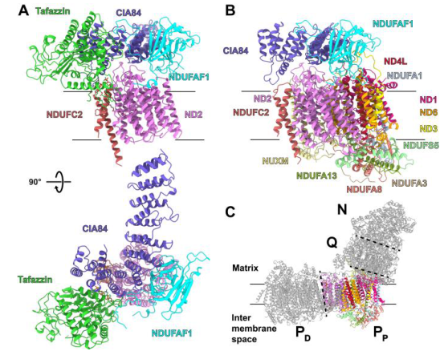

## Question

# Gene Research for Functional Annotation

## ⚠️ CRITICAL: Gene/Protein Identification Context

**BEFORE YOU BEGIN RESEARCH:** You MUST verify you are researching the CORRECT gene/protein. Gene symbols can be ambiguous, especially for less well-characterized genes from non-model organisms.

### Target Gene/Protein Identity (from UniProt):
- **UniProt Accession:** O42636
- **Protein Description:** RecName: Full=Complex I intermediate-associated protein 30, mitochondrial; Flags: Precursor;
- **Gene Information:** Name=cia30; Synonyms=cia35; ORFNames=B13D15.210, NCU01975;
- **Organism (full):** Neurospora crassa (strain ATCC 24698 / 74-OR23-1A / CBS 708.71 / DSM 1257 / FGSC 987).
- **Protein Family:** Belongs to the CIA30 family. .
- **Key Domains:** Galactose-bd-like_sf. (IPR008979); NADH-UbQ_OxRdtase-assoc_prot30. (IPR013857); NDUFAF1. (IPR039131); CIA30 (PF08547)

### MANDATORY VERIFICATION STEPS:

1. **Check if the gene symbol "cia30" matches the protein description above**
2. **Verify the organism is correct:** Neurospora crassa (strain ATCC 24698 / 74-OR23-1A / CBS 708.71 / DSM 1257 / FGSC 987).
3. **Check if protein family/domains align with what you find in literature**
4. **If you find literature for a DIFFERENT gene with the same or similar symbol, STOP**

### If Gene Symbol is Ambiguous or You Cannot Find Relevant Literature:

**DO NOT PROCEED WITH RESEARCH ON A DIFFERENT GENE.** Instead:
- State clearly: "The gene symbol 'cia30' is ambiguous or literature is limited for this specific protein"
- Explain what you found (e.g., "Found extensive literature on a different gene with the same symbol in a different organism")
- Describe the protein based ONLY on the UniProt information provided above
- Suggest that the protein function can be inferred from domain/family information

### Research Target:

Please provide a comprehensive research report on the gene **cia30** (gene ID: cia30, UniProt: O42636) in NEUCR.

The research report should be a detailed narrative explaining the function, biological processes, and localization of the gene product. Citations should be given for all claims.

You should prioritize authoritative reviews and primary scientific literature when conducting research. You can supplement
this with annotations you find in gene/protein databases, but these can be outdated or inaccurate.

We are specifically interested in the primary function of the gene - for enzymes, what reaction is catalyzed, and what is the substrate specificity? For transporters, what is the substrate? For structural proteins or adapters, what is the broader structural role? For signaling molecules, what is the role in the pathway.

We are interested in where in or outside the cell the gene product carries out its function.

We are also interested in the signaling or biochemical pathways in which the gene functions. We are less interested in broad pleiotropic effects, except where these elucidate the precise role.

Include evidence where possible. We are interested in both experimental evidence as well as inference from structure, evolution, or bioinformatic analysis. Precise studies should be prioritized over high-throughput, where available.

## Output

Question: You are an expert researcher providing comprehensive, well-cited information.

Provide detailed information focusing on:
1. Key concepts and definitions with current understanding
2. Recent developments and latest research (prioritize 2023-2024 sources)
3. Current applications and real-world implementations
4. Expert opinions and analysis from authoritative sources
5. Relevant statistics and data from recent studies

Format as a comprehensive research report with proper citations. Include URLs and publication dates where available.
Always prioritize recent, authoritative sources and provide specific citations for all major claims.

# Gene Research for Functional Annotation

## ⚠️ CRITICAL: Gene/Protein Identification Context

**BEFORE YOU BEGIN RESEARCH:** You MUST verify you are researching the CORRECT gene/protein. Gene symbols can be ambiguous, especially for less well-characterized genes from non-model organisms.

### Target Gene/Protein Identity (from UniProt):
- **UniProt Accession:** O42636
- **Protein Description:** RecName: Full=Complex I intermediate-associated protein 30, mitochondrial; Flags: Precursor;
- **Gene Information:** Name=cia30; Synonyms=cia35; ORFNames=B13D15.210, NCU01975;
- **Organism (full):** Neurospora crassa (strain ATCC 24698 / 74-OR23-1A / CBS 708.71 / DSM 1257 / FGSC 987).
- **Protein Family:** Belongs to the CIA30 family. .
- **Key Domains:** Galactose-bd-like_sf. (IPR008979); NADH-UbQ_OxRdtase-assoc_prot30. (IPR013857); NDUFAF1. (IPR039131); CIA30 (PF08547)

### MANDATORY VERIFICATION STEPS:

1. **Check if the gene symbol "cia30" matches the protein description above**
2. **Verify the organism is correct:** Neurospora crassa (strain ATCC 24698 / 74-OR23-1A / CBS 708.71 / DSM 1257 / FGSC 987).
3. **Check if protein family/domains align with what you find in literature**
4. **If you find literature for a DIFFERENT gene with the same or similar symbol, STOP**

### If Gene Symbol is Ambiguous or You Cannot Find Relevant Literature:

**DO NOT PROCEED WITH RESEARCH ON A DIFFERENT GENE.** Instead:
- State clearly: "The gene symbol 'cia30' is ambiguous or literature is limited for this specific protein"
- Explain what you found (e.g., "Found extensive literature on a different gene with the same symbol in a different organism")
- Describe the protein based ONLY on the UniProt information provided above
- Suggest that the protein function can be inferred from domain/family information

### Research Target:

Please provide a comprehensive research report on the gene **cia30** (gene ID: cia30, UniProt: O42636) in NEUCR.

The research report should be a detailed narrative explaining the function, biological processes, and localization of the gene product. Citations should be given for all claims.

You should prioritize authoritative reviews and primary scientific literature when conducting research. You can supplement
this with annotations you find in gene/protein databases, but these can be outdated or inaccurate.

We are specifically interested in the primary function of the gene - for enzymes, what reaction is catalyzed, and what is the substrate specificity? For transporters, what is the substrate? For structural proteins or adapters, what is the broader structural role? For signaling molecules, what is the role in the pathway.

We are interested in where in or outside the cell the gene product carries out its function.

We are also interested in the signaling or biochemical pathways in which the gene functions. We are less interested in broad pleiotropic effects, except where these elucidate the precise role.

Include evidence where possible. We are interested in both experimental evidence as well as inference from structure, evolution, or bioinformatic analysis. Precise studies should be prioritized over high-throughput, where available.

# Research Report: Functional Annotation of *Neurospora crassa* **cia30** (UniProt O42636; NCU01975)

## Executive summary
The *Neurospora crassa* gene **cia30** (UniProt **O42636**; synonyms **cia35**; ORF **NCU01975**) encodes **Complex I intermediate-associated protein 30 kDa (CIA30)**, a **mitochondrial respiratory complex I assembly factor** (the fungal ortholog of mammalian **NDUFAF1**). The strongest organism-specific evidence indicates CIA30 is **imported into mitochondria**, exists in **free and assembly-bound pools**, and **binds transiently to a large membrane-arm assembly intermediate** (not the mature holoenzyme). Genetic/biochemical analyses support a **specific role in complex I biogenesis** rather than a pleiotropic effect on other OXPHOS complexes. Recent (2023–2024) structural work in genetically tractable fungi and mechanistic work on the conserved MCIA pathway in mammals now clarify *how* CIA30/NDUFAF1 stabilizes membrane-arm assembly intermediates—particularly by **sequestering the ND3 TMH1–2 loop** (protecting a conserved cysteine) and coordinating PP-module maturation—providing updated, mechanistically grounded functional annotation.

## 1) Key concepts, definitions, and current understanding

### 1.1 Respiratory complex I and “assembly factors”
Mitochondrial respiratory complex I (NADH:ubiquinone oxidoreductase) is a ~1 MDa enzyme in many eukaryotes that couples electron transfer from NADH to ubiquinone with proton pumping across the inner mitochondrial membrane. Modern module terminology partitions complex I into the **N module** (NADH oxidation), **Q module** (ubiquinone reduction), and **proximal and distal proton-pumping modules (PP and PD)**. (schiller2022insightsintocomplex pages 1-2)

“Assembly factors” are proteins **not present in the mature holoenzyme** but required for stepwise construction of complex I through transient intermediates; defects in these factors can stall assembly and lead to accumulation of subcomplexes. CIA30/NDUFAF1 is a canonical example. (schulte2001biogenesisofrespiratory pages 2-4, dunning2007humancia30is pages 8-9)

### 1.2 CIA30/NDUFAF1 family identity (verification against the user’s target)
High-authority sources explicitly state that NDUFAF1 was first described as **CIA30** in the filamentous fungus *Neurospora crassa*, and they connect CIA30 to complex I assembly intermediates. This matches the UniProt O42636 description (“Complex I intermediate-associated protein 30, mitochondrial; precursor”) and the CIA30/NDUFAF1-family assignment. (schiller2022insightsintocomplex pages 1-2, dunning2007humancia30is pages 1-2)

## 2) Organism-specific functional evidence for *N. crassa* CIA30 (cia30/NCU01975)

### 2.1 Subcellular localization: mitochondrial import
In *N. crassa*, the cloned CIA30 protein is reported as a **globular protein preceded by a typical mitochondrial import sequence of 12 amino acids**, supporting mitochondrial targeting and import. (schulte2001biogenesisofrespiratory pages 2-4)

### 2.2 Primary function: complex I assembly factor (not a catalytic subunit)
*Neurospora* complex I assembly was established to occur **stepwise** from intermediates. CIA30 (together with CIA84) is **associated with the large membrane-arm assembly intermediate** and is **not found in the mature complex I holoenzyme**, consistent with an assembly factor/chaperone function. (schulte2001biogenesisofrespiratory pages 2-4, dunning2007humancia30is pages 8-9)

### 2.3 Pathway placement: membrane-arm intermediate association and assembly-state dependence
In *N. crassa*, the **large membrane-arm intermediate** contains **five mitochondrially encoded subunits and six nuclear-encoded subunits**, and it is specifically the intermediate to which CIA30 associates. (schulte2001biogenesisofrespiratory pages 2-4)

CIA proteins (CIA30/CIA84) exist in two pools: **bound to the assembly intermediate** and **free/unbound**. In wild type, **roughly equal amounts** are present in each pool; when **small membrane-arm assembly is blocked**, the large intermediate accumulates and CIA proteins shift predominantly from free to bound. Conversely, mutants unable to form a stable large intermediate show CIA proteins **exclusively free**. This supports a model in which CIA30 cycles between a reservoir pool and an intermediate-bound functional pool during assembly. (schulte2001biogenesisofrespiratory pages 2-4)

### 2.4 Complex I specificity of cia phenotypes
Schulte (2001) reports that characterization of **cia mutants** indicates **complex I is the only respiratory complex affected**, and no other target for CIA proteins was identified in those analyses. This supports annotating cia30 as a complex-I-specific biogenesis factor rather than a general mitochondrial maintenance protein. (schulte2001biogenesisofrespiratory pages 2-4)

### 2.5 Assembly intermediates: reported molecular sizes (350/200 kDa)
Neurospora genetic disruption of a complex I subunit (21.3 kDa) produced assembly defects with accumulation of **~350 kDa and ~200 kDa membrane intermediates**; the **~350 kDa intermediate** contained multiple mtDNA-encoded and at least six nuclear-encoded subunits and was associated with **CIA30 and CIA84**. CIA30 and CIA84 appeared to bind this intermediate independently and not to fully assembled complex I. (dunning2007humancia30is pages 8-9)

*Important limitation:* The accessible sources here provide strong evidence for intermediate association and assembly specificity, but they do not provide detailed *organismal* phenotypes (growth, development, stress) for a clean *cia30* null mutant in *N. crassa*; such phenotypes are mentioned generally as “severe disruption of assembly” without detailed quantitative organism-level readouts in the excerpts obtained. (janssen2002cia30complexi pages 1-2)

## 3) Mechanistic and structural interpretation (updated by 2022–2024 research)

Although much of the high-resolution mechanistic detail comes from the yeast model *Yarrowia lipolytica* and mammalian systems, these are directly relevant because CIA30 is orthologous to NDUFAF1 and participates in a conserved PP/membrane-arm assembly pathway.

### 3.1 PP-module “seed” complex and role of CIA30/NDUFAF1
Cryo-EM of NDUFAF1-associated intermediates shows that subunits **ND2 and NDUFC2**, together with **NDUFAF1 (CIA30)** and fungal **CIA84**, form a nucleation (“seed”) complex for the NDUFAF1-dependent assembly pathway of the **PP module**. NDUFAF1 also “locks” the **ND3** subunit in an assembly-competent conformation during PP-module maturation. (schiller2022insightsintocomplex pages 1-2)

### 3.2 2023–2024: high-resolution structural details of NDUFAF1-associated intermediates
A 2024 cryo-EM-focused review summarizes that NDUFAF1-associated complexes of **~170 kDa (early PP intermediate)** and **~280 kDa (late PP intermediate)** were obtained at **3.2 Å** resolution. Mechanistically, NDUFAF1 binds the **ND3 TMH1–2 loop** in a cleft, sequestering a conserved cysteine; this both enforces an assembly-specific ND3 topology and plausibly protects a chemically sensitive region important for later complex I function. (laube2024usingcryoemto pages 3-4)

### 3.3 Link to cardiolipin remodeling (tafazzin) during early PP assembly
Unexpectedly, tafazzin (a cardiolipin-remodeling transacylase) was found as an integral component of the early NDUFAF1-dependent PP “seed” complex (in *Y. lipolytica*), linking lipid remodeling to assembly of the membrane/proton-pumping arm. (schiller2022insightsintocomplex pages 1-2)

### 3.4 2023: MCIA complex mechanism (conserved pathway context for NDUFAF1)
In mammals, NDUFAF1 participates in the **MCIA** (mitochondrial complex I intermediate assembly) pathway. A 2023 *Nature Communications* study resolved how MCIA subunits **ECSIT and ACAD9** form a core complex: ECSIT binding induces conformational change in ACAD9’s FAD-binding loop, triggers **FAD release**, and switches ACAD9 from a fatty-acid β-oxidation enzyme to a complex I assembly factor. The study identified a **critical ECSIT Glu323–ACAD9 Lys228 salt bridge** (E323A abolishes binding) and showed a minimal **15-residue ECSIT peptide** can be sufficient for complex formation. While these data are not *Neurospora*-specific, they provide authoritative mechanistic context for the conserved NDUFAF1-containing PP/membrane-arm assembly pathway. (mcgregor2023theassemblyof pages 1-2, laube2024usingcryoemto pages 7-9)

## 4) Current applications and real-world implementations

### 4.1 Functional annotation and mitochondrial biology modeling
*Neurospora crassa* remains a key aerobic fungal model for dissecting complex I assembly via genetics and biochemistry, because assembly intermediates can be tracked and mutants constructed. CIA30 is central to this work as one of the earliest identified complex-I-specific assembly factors. (schulte2001biogenesisofrespiratory pages 2-4, dunning2007humancia30is pages 1-2)

### 4.2 Translational relevance: human disease and diagnostic genetics (orthology-based)
The discovery of *N. crassa* CIA30 motivated screening of the human ortholog (**NDUFAF1**) as a candidate for complex I deficiency. This is an important “real-world” use of CIA30-family functional annotation: identifying mitochondrial disease genes and interpreting complexome/BN-PAGE patterns in patient samples. (janssen2002cia30complexi pages 1-2, dunning2007humancia30is pages 8-9)

## 5) Expert opinion and synthesis (authoritative interpretation)

The prevailing expert interpretation is that CIA30/NDUFAF1-family proteins function as **assembly chaperones** that:
1) **associate transiently with membrane-arm/PP intermediates** rather than the mature enzyme, and
2) **stabilize or protect key membrane subunits (notably ND3)** in assembly-specific conformations until later modules join.

This interpretation is consistent across organism-specific *Neurospora* evidence (intermediate association, bound/free pools, complex I specificity) and modern structural data (ND3 loop sequestration; early PP seed complexes). (schulte2001biogenesisofrespiratory pages 2-4, laube2024usingcryoemto pages 3-4, schiller2022insightsintocomplex pages 1-2)

## 6) Relevant statistics and quantitative findings from recent studies

* **Complex I modular definitions and size:** Complex I is described as a **~1 MDa** membrane complex in mitochondria. (schiller2022insightsintocomplex pages 1-2, mcgregor2023theassemblyof pages 1-2)
* **Quantitative assembly dependence:** In *Y. lipolytica*, deletion of **NDUFAF1** reduced complex I content (NADH:hexaammineruthenium assay) to **~14%**, and **ubiquinone reductase activity was below detection**, indicating failure to assemble functional complex I. (schiller2022insightsintocomplex pages 1-2)
* **Structural intermediate sizes/resolution:** NDUFAF1-associated early/late PP intermediates were reported at **~170 kDa and ~280 kDa** and mapped at **3.2 Å**. (laube2024usingcryoemto pages 3-4)
* **Neurospora intermediate sizes:** Assembly defects in *N. crassa* can produce membrane intermediates at **~350 kDa and ~200 kDa**, with CIA30/CIA84 bound to the ~350 kDa intermediate. (dunning2007humancia30is pages 8-9)
* **Molecular interaction detail (MCIA core):** A minimal **15-residue ECSIT** peptide can mediate binding to ACAD9; an **ECSIT Glu323–ACAD9 Lys228** salt bridge is critical (mutation E323A abolishes binding). (mcgregor2023theassemblyof pages 1-2)

## Visual evidence from primary structural study
The following cropped figure panel shows the NDUFAF1/CIA30-associated early and late PP-module assembly intermediates (including ND2/NDUFC2 with NDUFAF1/CIA84 and tafazzin in the early intermediate, and the late intermediate containing ND3 held in an assembly-competent conformation).

(schiller2022insightsintocomplex media a5675587)

## Evidence table (traceable claims)
| Claim/annotation field | Organism/system | Key evidence (1-2 sentences) | Publication (first author, year, journal) | URL | Citation ID |
|---|---|---|---|---|---|
| Verified identity / family assignment | *Neurospora crassa*; conserved fungal/animal orthology | CIA30 was first described in *N. crassa* as a complex I intermediate-associated protein; later work identifies human NDUFAF1 as its ortholog, supporting annotation of UniProt O42636 as the fungal CIA30/NDUFAF1-family assembly factor rather than a catalytic complex I subunit. | Schiller, 2022, *Science Advances* | https://doi.org/10.1126/sciadv.add3855 | (schiller2022insightsintocomplex pages 1-2) |
| Primary molecular function | *N. crassa* | CIA30 is a transient complex I assembly factor/chaperone, not a mature holoenzyme subunit. In *N. crassa* it associates with the large membrane-arm assembly intermediate and is released during assembly progression. | Schulte, 2001, *Journal of Bioenergetics and Biomembranes* | https://doi.org/10.1023/a:1010730919074 | (schulte2001biogenesisofrespiratory pages 2-4) |
| Biological process | *N. crassa* | Complex I assembly proceeds modularly, with peripheral and membrane arms formed separately; CIA30 participates specifically in membrane-arm biogenesis by associating with the large membrane-arm intermediate. | Schulte, 2001, *Journal of Bioenergetics and Biomembranes* | https://doi.org/10.1023/a:1010730919074 | (schulte2001biogenesisofrespiratory pages 2-4) |
| Subcellular localization | *N. crassa* | CIA30 has an N-terminal mitochondrial import sequence of 12 amino acids, supporting mitochondrial localization consistent with its role in respiratory complex I biogenesis. | Schulte, 2001, *Journal of Bioenergetics and Biomembranes* | https://doi.org/10.1023/a:1010730919074 | (schulte2001biogenesisofrespiratory pages 2-4) |
| Sub-mitochondrial localization / topology inference | Human ortholog; relevant conserved inference for fungal CIA30 | Human CIA30/NDUFAF1 is imported into the mitochondrial matrix and associates with inner-membrane assembly intermediates. This strongly supports annotation of fungal CIA30 as a matrix-side assembly factor acting on the inner membrane arm during assembly. | Dunning, 2007, *The EMBO Journal* | https://doi.org/10.1038/sj.emboj.7601748 | (dunning2007humancia30is pages 8-9, dunning2007humancia30is pages 1-2) |
| Complex/intermediate association | *N. crassa* | The large membrane-arm intermediate contains five mitochondrially encoded and six nuclear-encoded complex I subunits plus CIA30 and CIA84; CIA30 is absent from mature complex I. | Schulte, 2001, *Journal of Bioenergetics and Biomembranes* | https://doi.org/10.1023/a:1010730919074 | (schulte2001biogenesisofrespiratory pages 2-4) |
| Intermediate size / composition | *N. crassa* | Disruption of a 21.3 kDa complex I subunit caused accumulation of ~350 kDa and ~200 kDa membrane intermediates; the ~350 kDa species contains multiple mtDNA-encoded subunits, at least six nuclear-encoded subunits, and CIA30/CIA84. | Dunning, 2007, *The EMBO Journal* | https://doi.org/10.1038/sj.emboj.7601748 | (dunning2007humancia30is pages 8-9) |
| Bound versus free assembly-factor pools | *N. crassa* | In wild type, CIA proteins exist in roughly equal bound and free pools. Blocking small membrane-arm assembly shifts CIA proteins toward the bound pool, whereas failure to form a stable large intermediate leaves CIA proteins exclusively free. | Schulte, 2001, *Journal of Bioenergetics and Biomembranes* | https://doi.org/10.1023/a:1010730919074 | (schulte2001biogenesisofrespiratory pages 2-4) |
| Specificity of effect | *N. crassa* | Characterization of cia mutants indicates that complex I is the only respiratory complex detectably affected; no other respiratory target was identified in the cited study. | Schulte, 2001, *Journal of Bioenergetics and Biomembranes* | https://doi.org/10.1023/a:1010730919074 | (schulte2001biogenesisofrespiratory pages 2-4) |
| Role in mature enzyme vs assembly | *N. crassa* | CIA30 and CIA84 bind independently to the ~350 kDa assembly intermediate but do not interact with fully assembled complex I, supporting a chaperone/assembly-factor role rather than a structural role in the final enzyme. | Dunning, 2007, *The EMBO Journal* | https://doi.org/10.1038/sj.emboj.7601748 | (dunning2007humancia30is pages 8-9) |
| Gene disruption / phenotype when disrupted | *N. crassa* and family-level inference | Deletion/disruption of CIA genes in *N. crassa* severely disrupts complex I assembly, motivating their use as candidate assembly-factor genes in other organisms. This supports annotation of cia30 as essential for efficient complex I biogenesis. | Janssen, 2002, *Human Genetics* | https://doi.org/10.1007/s00439-001-0673-3 | (janssen2002cia30complexi pages 1-2) |
| Conserved assembly pathway role | Yeast (*Yarrowia lipolytica*) | Cryo-EM shows NDUFAF1-dependent assembly starts from an early PP-module “seed” containing ND2, NDUFC2, NDUFAF1 and fungal CIA84; a later PP intermediate contains all 12 PP-module subunits. This refines functional annotation of fungal CIA30 as an early PP/membrane-arm assembly factor. | Schiller, 2022, *Science Advances* | https://doi.org/10.1126/sciadv.add3855 | (schiller2022insightsintocomplex pages 1-2, schiller2022insightsintocomplex media a5675587) |
| Mechanism: conformational control | Yeast (*Yarrowia lipolytica*) | NDUFAF1/CIA30 locks the central ND3 subunit in an assembly-competent conformation and binds the ND3 TMH1–2 loop, preventing premature rearrangements during PP-module maturation. | Schiller, 2022, *Science Advances* | https://doi.org/10.1126/sciadv.add3855 | (schiller2022insightsintocomplex pages 1-2) |
| Mechanism: protective binding of ND3 loop | Yeast (*Yarrowia lipolytica*) | At 3.2 Å resolution, NDUFAF1 is seen to sequester the ND3 TMH1–2 loop and shield its conserved cysteine in a binding cleft, implying a protective role during assembly before later module joining. | Laube, 2024, *Acta Crystallographica D* | https://doi.org/10.1107/S205979832400086X | (laube2024usingcryoemto pages 3-4, laube2024usingcryoemto pages 4-7) |
| Quantitative structural data | Yeast (*Yarrowia lipolytica*) | NDUFAF1-associated early and late PP intermediates were resolved as ~170 kDa and ~280 kDa complexes at 3.2 Å resolution, providing direct structural support for transient assembly-factor association. | Laube, 2024, *Acta Crystallographica D* | https://doi.org/10.1107/S205979832400086X | (laube2024usingcryoemto pages 3-4) |
| Quantitative disruption phenotype | Yeast (*Yarrowia lipolytica*) | Deletion of NDUFAF1 reduced complex I content to ~14% of control and abolished detectable ubiquinone reductase activity, demonstrating that CIA30-family proteins are essential assembly factors rather than accessory stabilizers. | Schiller, 2022, *Science Advances* | https://doi.org/10.1126/sciadv.add3855 | (schiller2022insightsintocomplex pages 1-2) |
| Conserved partner proteins / pathway context | Mammalian MCIA complex | NDUFAF1 is part of the mitochondrial complex I intermediate assembly (MCIA) complex with ECSIT and ACAD9, with additional peripheral membrane components; this places CIA30-family proteins in a conserved assembly network for the membrane/PP arm. | McGregor, 2023, *Nature Communications* | https://doi.org/10.1038/s41467-023-43865-0 | (mcgregor2023theassemblyof pages 1-2) |
| Conserved mechanistic partner insight | Mammalian MCIA complex | ECSIT binding remodels ACAD9 and triggers FAD release, converting ACAD9 from a fatty-acid oxidation enzyme into a complex I assembly factor. Although CIA30 itself is not catalytic, this explains the mechanistic context of the NDUFAF1-containing MCIA pathway. | McGregor, 2023, *Nature Communications* | https://doi.org/10.1038/s41467-023-43865-0 | (mcgregor2023theassemblyof pages 1-2) |
| Interaction landscape in vertebrates | Human | CIA30/NDUFAF1 associates with newly translated mtDNA-encoded ND1, ND2 and ND3 and with many nuclear-encoded complex I subunits; it co-migrates with B460 and B830 kDa assembly intermediates but not with late-assembling NDUFS5. | Dunning, 2007, *The EMBO Journal* | https://doi.org/10.1038/sj.emboj.7601748 | (dunning2007humancia30is pages 8-9) |
| Quantitative intermediate sizes in vertebrates | Human | CIA30-containing complexes were observed at ~440–500 and 600–700 kDa in one study, with related reports placing them at 500–850 kDa; these detergent-sensitive assemblies are consistent with transient association with assembly intermediates rather than the mature holoenzyme. | Dunning, 2007, *The EMBO Journal* | https://doi.org/10.1038/sj.emboj.7601748 | (dunning2007humancia30is pages 8-9) |
| Pathway terminology / module definitions | Eukaryotic complex I, general | Authoritative structural work defines the N module for NADH oxidation, the Q module for ubiquinone reduction, and the proximal/distal P modules (PP/PD) for proton pumping. CIA30/NDUFAF1 acts in PP-module assembly, which maps well onto earlier “membrane-arm intermediate” terminology from *N. crassa*. | Schiller, 2022, *Science Advances* | https://doi.org/10.1126/sciadv.add3855 | (schiller2022insightsintocomplex pages 1-2) |
| Link to membrane lipid remodeling | Yeast (*Yarrowia lipolytica*) | Tafazzin, the cardiolipin-remodeling enzyme, was unexpectedly found as an integral component of the early NDUFAF1/CIA30-containing PP seed complex, linking complex I assembly to cardiolipin remodeling. | Schiller, 2022, *Science Advances* | https://doi.org/10.1126/sciadv.add3855 | (schiller2022insightsintocomplex pages 1-2, schiller2022insightsintocomplex media a5675587) |

*Table: This table summarizes organism-specific evidence for Neurospora crassa CIA30 and conserved mechanistic insights from orthologous NDUFAF1/CIA30 studies. It is useful for functional annotation because it separates direct Neurospora findings from higher-confidence family-level inferences about localization, assembly intermediates, mechanism, and disruption phenotypes.*

## Practical functional annotation recommendation for **cia30 (O42636)**
Based on the evidence above, the most defensible annotation for *N. crassa* CIA30 is:
* **Molecular function:** mitochondrial complex I assembly factor (chaperone-like), binds transient membrane-arm/PP intermediates; not a complex I catalytic subunit. (schulte2001biogenesisofrespiratory pages 2-4, dunning2007humancia30is pages 8-9)
* **Biological process:** assembly/biogenesis of mitochondrial respiratory chain complex I (particularly membrane arm / PP module). (schulte2001biogenesisofrespiratory pages 2-4, schiller2022insightsintocomplex pages 1-2)
* **Cellular component:** mitochondrion (import sequence), likely matrix-side association with inner membrane assembly intermediates. (schulte2001biogenesisofrespiratory pages 2-4, dunning2007humancia30is pages 8-9)
* **Pathway context:** complex I assembly pathway; functionally connected (by orthology) to NDUFAF1-dependent PP assembly and, in metazoans, MCIA network (NDUFAF1/ECSIT/ACAD9). (schiller2022insightsintocomplex pages 1-2, mcgregor2023theassemblyof pages 1-2)

## References (selected; with publication dates and URLs)
- Schulte U. **Biogenesis of respiratory complex I**. *Journal of Bioenergetics and Biomembranes*. **June 2001**. https://doi.org/10.1023/a:1010730919074 (schulte2001biogenesisofrespiratory pages 2-4)
- Janssen R, et al. **CIA30 complex I assembly factor: a candidate for human complex I deficiency?** *Human Genetics*. Published online **1 Feb 2002** (Accepted 9 Dec 2001). https://doi.org/10.1007/s00439-001-0673-3 (janssen2002cia30complexi pages 1-2)
- Dunning CJR, et al. **Human CIA30 is involved in the early assembly of mitochondrial complex I and mutations in its gene cause disease**. *The EMBO Journal*. **July 2007**. https://doi.org/10.1038/sj.emboj.7601748 (dunning2007humancia30is pages 8-9)
- Schiller J, et al. **Insights into complex I assembly: Function of NDUFAF1 and a link with cardiolipin remodeling**. *Science Advances*. **16 Nov 2022**. https://doi.org/10.1126/sciadv.add3855 (schiller2022insightsintocomplex pages 1-2)
- McGregor L, et al. **The assembly of the Mitochondrial Complex I Assembly complex uncovers a redox pathway coordination**. *Nature Communications*. Accepted **21 Nov 2023** (Received 13 Mar 2023). https://doi.org/10.1038/s41467-023-43865-0 (mcgregor2023theassemblyof pages 1-2)
- Laube E, et al. **Using cryo-EM to understand the assembly pathway of respiratory complex I**. *Acta Crystallographica Section D: Structural Biology*. **Feb 2024**. https://doi.org/10.1107/S205979832400086X (laube2024usingcryoemto pages 3-4)

References

1. (schiller2022insightsintocomplex pages 1-2): Jonathan Schiller, Eike Laube, Ilka Wittig, Werner Kühlbrandt, Janet Vonck, and Volker Zickermann. Insights into complex i assembly: function of ndufaf1 and a link with cardiolipin remodeling. Science Advances, Nov 2022. URL: https://doi.org/10.1126/sciadv.add3855, doi:10.1126/sciadv.add3855. This article has 28 citations and is from a highest quality peer-reviewed journal.

2. (schulte2001biogenesisofrespiratory pages 2-4): Ulrich Schulte. Biogenesis of respiratory complex i. Journal of Bioenergetics and Biomembranes, 33:205-212, Jun 2001. URL: https://doi.org/10.1023/a:1010730919074, doi:10.1023/a:1010730919074. This article has 82 citations and is from a peer-reviewed journal.

3. (dunning2007humancia30is pages 8-9): Christopher J.R. Dunning, Matthew McKenzie, C. Sugiana, M. Lazarou, John Silke, A. Connelly, Janice M. Fletcher, D. Kirby, David R. Thorburn, and Michael T. Ryan. Human cia30 is involved in the early assembly of mitochondrial complex i and mutations in its gene cause disease. The EMBO Journal, 26:3227-3237, Jul 2007. URL: https://doi.org/10.1038/sj.emboj.7601748, doi:10.1038/sj.emboj.7601748. This article has 246 citations.

4. (dunning2007humancia30is pages 1-2): Christopher J.R. Dunning, Matthew McKenzie, C. Sugiana, M. Lazarou, John Silke, A. Connelly, Janice M. Fletcher, D. Kirby, David R. Thorburn, and Michael T. Ryan. Human cia30 is involved in the early assembly of mitochondrial complex i and mutations in its gene cause disease. The EMBO Journal, 26:3227-3237, Jul 2007. URL: https://doi.org/10.1038/sj.emboj.7601748, doi:10.1038/sj.emboj.7601748. This article has 246 citations.

5. (janssen2002cia30complexi pages 1-2): Rolf Janssen, Jan Smeitink, Roel Smeets, and Lambert van den Heuvel. Cia30 complex i assembly factor: a candidate for human complex i deficiency? Human Genetics, 110:264-270, Feb 2002. URL: https://doi.org/10.1007/s00439-001-0673-3, doi:10.1007/s00439-001-0673-3. This article has 94 citations and is from a peer-reviewed journal.

6. (laube2024usingcryoemto pages 3-4): Eike Laube, Jonathan Schiller, Volker Zickermann, and Janet Vonck. Using cryo-em to understand the assembly pathway of respiratory complex i. Acta Crystallographica. Section D, Structural Biology, 80:159-173, Feb 2024. URL: https://doi.org/10.1107/s205979832400086x, doi:10.1107/s205979832400086x. This article has 8 citations.

7. (mcgregor2023theassemblyof pages 1-2): Lindsay McGregor, Samira Acajjaoui, Ambroise Desfosses, Melissa Saïdi, Maria Bacia-Verloop, Jennifer J. Schwarz, Pauline Juyoux, Jill von Velsen, Matthew W. Bowler, Andrew A. McCarthy, Eaazhisai Kandiah, Irina Gutsche, and Montserrat Soler-Lopez. The assembly of the mitochondrial complex i assembly complex uncovers a redox pathway coordination. Nature Communications, Dec 2023. URL: https://doi.org/10.1038/s41467-023-43865-0, doi:10.1038/s41467-023-43865-0. This article has 31 citations and is from a highest quality peer-reviewed journal.

8. (laube2024usingcryoemto pages 7-9): Eike Laube, Jonathan Schiller, Volker Zickermann, and Janet Vonck. Using cryo-em to understand the assembly pathway of respiratory complex i. Acta Crystallographica. Section D, Structural Biology, 80:159-173, Feb 2024. URL: https://doi.org/10.1107/s205979832400086x, doi:10.1107/s205979832400086x. This article has 8 citations.

9. (schiller2022insightsintocomplex media a5675587): Jonathan Schiller, Eike Laube, Ilka Wittig, Werner Kühlbrandt, Janet Vonck, and Volker Zickermann. Insights into complex i assembly: function of ndufaf1 and a link with cardiolipin remodeling. Science Advances, Nov 2022. URL: https://doi.org/10.1126/sciadv.add3855, doi:10.1126/sciadv.add3855. This article has 28 citations and is from a highest quality peer-reviewed journal.

10. (laube2024usingcryoemto pages 4-7): Eike Laube, Jonathan Schiller, Volker Zickermann, and Janet Vonck. Using cryo-em to understand the assembly pathway of respiratory complex i. Acta Crystallographica. Section D, Structural Biology, 80:159-173, Feb 2024. URL: https://doi.org/10.1107/s205979832400086x, doi:10.1107/s205979832400086x. This article has 8 citations.

## Artifacts

- [Edison artifact artifact-00](cia30-deep-research-falcon_artifacts/artifact-00.md)

## Citations

1. schiller2022insightsintocomplex pages 1-2
2. schulte2001biogenesisofrespiratory pages 2-4
3. laube2024usingcryoemto pages 3-4
4. mcgregor2023theassemblyof pages 1-2
5. laube2024usingcryoemto pages 7-9
6. laube2024usingcryoemto pages 4-7
7. https://doi.org/10.1126/sciadv.add3855
8. https://doi.org/10.1023/a:1010730919074
9. https://doi.org/10.1038/sj.emboj.7601748
10. https://doi.org/10.1007/s00439-001-0673-3
11. https://doi.org/10.1107/S205979832400086X
12. https://doi.org/10.1038/s41467-023-43865-0
13. https://doi.org/10.1126/sciadv.add3855,
14. https://doi.org/10.1023/a:1010730919074,
15. https://doi.org/10.1038/sj.emboj.7601748,
16. https://doi.org/10.1007/s00439-001-0673-3,
17. https://doi.org/10.1107/s205979832400086x,
18. https://doi.org/10.1038/s41467-023-43865-0,