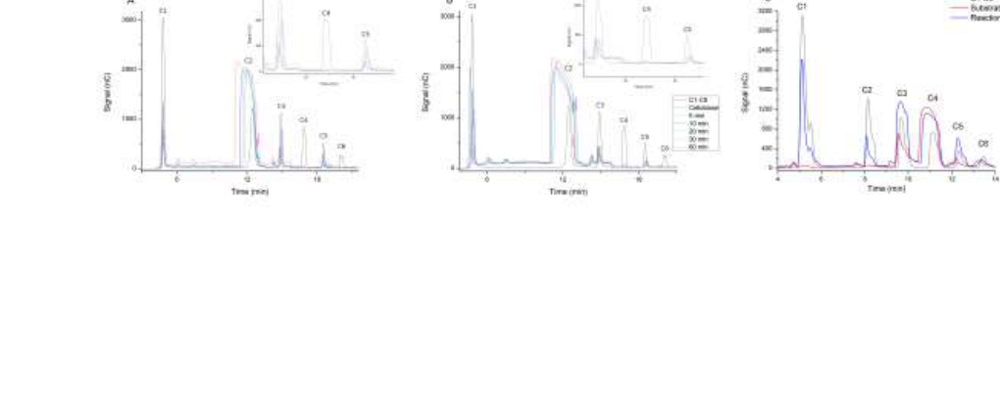

## Question

# Gene Research for Functional Annotation

## ⚠️ CRITICAL: Gene/Protein Identification Context

**BEFORE YOU BEGIN RESEARCH:** You MUST verify you are researching the CORRECT gene/protein. Gene symbols can be ambiguous, especially for less well-characterized genes from non-model organisms.

### Target Gene/Protein Identity (from UniProt):
- **UniProt Accession:** A0A1J6KFZ7
- **Protein Description:** SubName: Full=Beta-glucosidase 18 {ECO:0000313|EMBL:OIT21731.1};
- **Gene Information:** Name=BGLU18_6 {ECO:0000313|EMBL:OIT21731.1}; ORFNames=A4A49_57285 {ECO:0000313|EMBL:OIT21731.1};
- **Organism (full):** Nicotiana attenuata (Coyote tobacco).
- **Protein Family:** Belongs to the glycosyl hydrolase 1 family.
- **Key Domains:** GH. (IPR017853); GH_1_N_CS. (IPR033132); Glyco_hydro_1. (IPR001360); Glyco_hydro_1_AS. (IPR018120); Glyco_hydro_1 (PF00232)

### MANDATORY VERIFICATION STEPS:

1. **Check if the gene symbol "BGLU18_6" matches the protein description above**
2. **Verify the organism is correct:** Nicotiana attenuata (Coyote tobacco).
3. **Check if protein family/domains align with what you find in literature**
4. **If you find literature for a DIFFERENT gene with the same or similar symbol, STOP**

### If Gene Symbol is Ambiguous or You Cannot Find Relevant Literature:

**DO NOT PROCEED WITH RESEARCH ON A DIFFERENT GENE.** Instead:
- State clearly: "The gene symbol 'BGLU18_6' is ambiguous or literature is limited for this specific protein"
- Explain what you found (e.g., "Found extensive literature on a different gene with the same symbol in a different organism")
- Describe the protein based ONLY on the UniProt information provided above
- Suggest that the protein function can be inferred from domain/family information

### Research Target:

Please provide a comprehensive research report on the gene **BGLU18_6** (gene ID: NaBGL1_candidate_BGLU18_6, UniProt: A0A1J6KFZ7) in NICAT.

The research report should be a detailed narrative explaining the function, biological processes, and localization of the gene product. Citations should be given for all claims.

You should prioritize authoritative reviews and primary scientific literature when conducting research. You can supplement
this with annotations you find in gene/protein databases, but these can be outdated or inaccurate.

We are specifically interested in the primary function of the gene - for enzymes, what reaction is catalyzed, and what is the substrate specificity? For transporters, what is the substrate? For structural proteins or adapters, what is the broader structural role? For signaling molecules, what is the role in the pathway.

We are interested in where in or outside the cell the gene product carries out its function.

We are also interested in the signaling or biochemical pathways in which the gene functions. We are less interested in broad pleiotropic effects, except where these elucidate the precise role.

Include evidence where possible. We are interested in both experimental evidence as well as inference from structure, evolution, or bioinformatic analysis. Precise studies should be prioritized over high-throughput, where available.

## Output

Question: You are an expert researcher providing comprehensive, well-cited information.

Provide detailed information focusing on:
1. Key concepts and definitions with current understanding
2. Recent developments and latest research (prioritize 2023-2024 sources)
3. Current applications and real-world implementations
4. Expert opinions and analysis from authoritative sources
5. Relevant statistics and data from recent studies

Format as a comprehensive research report with proper citations. Include URLs and publication dates where available.
Always prioritize recent, authoritative sources and provide specific citations for all major claims.

# Gene Research for Functional Annotation

## ⚠️ CRITICAL: Gene/Protein Identification Context

**BEFORE YOU BEGIN RESEARCH:** You MUST verify you are researching the CORRECT gene/protein. Gene symbols can be ambiguous, especially for less well-characterized genes from non-model organisms.

### Target Gene/Protein Identity (from UniProt):
- **UniProt Accession:** A0A1J6KFZ7
- **Protein Description:** SubName: Full=Beta-glucosidase 18 {ECO:0000313|EMBL:OIT21731.1};
- **Gene Information:** Name=BGLU18_6 {ECO:0000313|EMBL:OIT21731.1}; ORFNames=A4A49_57285 {ECO:0000313|EMBL:OIT21731.1};
- **Organism (full):** Nicotiana attenuata (Coyote tobacco).
- **Protein Family:** Belongs to the glycosyl hydrolase 1 family.
- **Key Domains:** GH. (IPR017853); GH_1_N_CS. (IPR033132); Glyco_hydro_1. (IPR001360); Glyco_hydro_1_AS. (IPR018120); Glyco_hydro_1 (PF00232)

### MANDATORY VERIFICATION STEPS:

1. **Check if the gene symbol "BGLU18_6" matches the protein description above**
2. **Verify the organism is correct:** Nicotiana attenuata (Coyote tobacco).
3. **Check if protein family/domains align with what you find in literature**
4. **If you find literature for a DIFFERENT gene with the same or similar symbol, STOP**

### If Gene Symbol is Ambiguous or You Cannot Find Relevant Literature:

**DO NOT PROCEED WITH RESEARCH ON A DIFFERENT GENE.** Instead:
- State clearly: "The gene symbol 'BGLU18_6' is ambiguous or literature is limited for this specific protein"
- Explain what you found (e.g., "Found extensive literature on a different gene with the same symbol in a different organism")
- Describe the protein based ONLY on the UniProt information provided above
- Suggest that the protein function can be inferred from domain/family information

### Research Target:

Please provide a comprehensive research report on the gene **BGLU18_6** (gene ID: NaBGL1_candidate_BGLU18_6, UniProt: A0A1J6KFZ7) in NICAT.

The research report should be a detailed narrative explaining the function, biological processes, and localization of the gene product. Citations should be given for all claims.

You should prioritize authoritative reviews and primary scientific literature when conducting research. You can supplement
this with annotations you find in gene/protein databases, but these can be outdated or inaccurate.

We are specifically interested in the primary function of the gene - for enzymes, what reaction is catalyzed, and what is the substrate specificity? For transporters, what is the substrate? For structural proteins or adapters, what is the broader structural role? For signaling molecules, what is the role in the pathway.

We are interested in where in or outside the cell the gene product carries out its function.

We are also interested in the signaling or biochemical pathways in which the gene functions. We are less interested in broad pleiotropic effects, except where these elucidate the precise role.

Include evidence where possible. We are interested in both experimental evidence as well as inference from structure, evolution, or bioinformatic analysis. Precise studies should be prioritized over high-throughput, where available.

## Research report: Functional annotation of *Nicotiana attenuata* BGLU18_6 (UniProt A0A1J6KFZ7)

### 0) Executive summary and identity verification (critical)
The target protein is specified (by UniProt accession provided in the prompt) as *Nicotiana attenuata* (coyote tobacco) “Beta-glucosidase 18” with gene name **BGLU18_6** / ORF **A4A49_57285**, and annotated to **glycosyl hydrolase family 1 (GH1; PF00232)**.

A targeted literature search using the exact identifiers **A0A1J6KFZ7**, **BGLU18_6**, and **A4A49_57285** did **not** retrieve any paper in the current corpus that directly studies or even mentions this specific *N. attenuata* protein; therefore, any functional assignment below must be treated as **GH1-family inference** and **must not be conflated with Arabidopsis “BGLU18”** (a different gene) that appears in proteomics datasets under the same symbol (niehl2013labelfreequantitativeproteomic pages 5-6).

The artifact table below summarizes what can and cannot be supported from the retrieved evidence.

| Claim/annotation item | Evidence type (direct for this gene vs inference from GH1 family vs related gene in other species) | Key details (reaction, motifs, localization, pathway) | Best supporting source (citation id) | Publication year | URL (if in evidence) |
|---|---|---|---|---|---|
| No direct literature found for Nicotiana attenuata BGLU18_6 / UniProt A0A1J6KFZ7 / ORF A4A49_57285 in retrieved papers | Direct search result for this exact gene: none | No retrieved paper directly mentioned the accession, gene symbol, or ORF; functional annotation must therefore rely on UniProt/domain assignment plus cautious family-level inference | (florindo2018structuralinsightsinto pages 12-15) | 2018 | https://doi.org/10.1016/j.nbt.2017.08.012 |
| Protein is very likely a GH1 beta-glucosidase | Inference from GH1 family/domain assignment | GH1 beta-glucosidases hydrolyze β-glucosidic bonds between carbohydrate units or between a carbohydrate and an aglycone; this matches the UniProt description “Beta-glucosidase 18” and GH1/PF00232 domain assignment | (cho2020enhancedbiomassyield pages 1-3) | 2020 | https://doi.org/10.3390/biom10050806 |
| Likely catalytic mechanism is retaining double-displacement hydrolysis using two catalytic glutamates | Inference from GH1 family | GH1 enzymes use a Koshland retaining mechanism with one glutamate as catalytic acid/base and one as nucleophile, proceeding through a glycosyl-enzyme intermediate | (ehrenreich2021sitedirectedmutagenesisstudies pages 13-16) | 2021 |  |
| Expected conserved catalytic motifs/residues include NEP/TXNEP and TENG/related motif containing the two catalytic glutamates | Inference from GH1 family | GH1 beta-glucosidases commonly contain conserved motifs harboring the catalytic glutamates; examples include NEP and TENG, or broader TXNEP/TFNEP-like motifs used to identify GH1 active sites | (liew2018purificationandcharacterization pages 6-8, ehrenreich2021sitedirectedmutagenesisstudies pages 13-16) | 2018; 2021 | https://doi.org/10.1016/j.ijbiomac.2018.04.156 |
| Expected structural fold is a canonical (α/β)8 TIM barrel | Inference from GH1 family | Structural studies of GH1 beta-glucosidases show the active site embedded in a TIM-barrel fold; catalytic glutamates occupy conserved positions in the barrel architecture | (florindo2018structuralinsightsinto pages 12-15, florindo2018structuralinsightsinto media a919e2b1) | 2018 | https://doi.org/10.1016/j.nbt.2017.08.012 |
| Substrate specificity cannot be assigned specifically for BGLU18_6, but GH1 enzymes often range from aryl-β-glucosides to cellobiose and broader heterosides | Inference from GH1 family | GH1 beta-glucosidases are often classified as aryl-β-glucosidases, true cellobiases, or broad-specificity enzymes; therefore BGLU18_6 may act on small glucosides, but exact substrate must be experimentally determined | (liew2018purificationandcharacterization pages 6-8) | 2018 | https://doi.org/10.1016/j.ijbiomac.2018.04.156 |
| A plausible biological role is activation of defense or specialized metabolites by deglycosylation | Related gene/function in plants and microbes; cautious inference | Plant beta-glucosidases can activate chemical defense compounds and release active metabolites from conjugates; in a host-pathogen context, beta-glucosidase hydrolysis of scopolin releases scopoletin, illustrating how glucoside cleavage can alter defense chemistry | (cho2020enhancedbiomassyield pages 1-3, deflandre2022structureandfunction pages 1-2) | 2020; 2022 | https://doi.org/10.3390/biom10050806; https://doi.org/10.1128/mbio.00935-22 |
| Another plausible pathway context is phytohormone or stored-metabolite activation rather than primary cellulose digestion | Inference from plant GH1 functions | Plant beta-glucosidases are reported to release active phytohormones from conjugates and to activate defense chemistry; these roles are more consistent with many plant GH1 enzymes than bulk cellulose catabolism alone | (cho2020enhancedbiomassyield pages 1-3) | 2020 | https://doi.org/10.3390/biom10050806 |
| Cellular localization remains unresolved for this exact gene | No direct evidence for this gene; limited family-level inference | Retrieved evidence did not identify subcellular localization for BGLU18_6; because plant GH1 beta-glucosidases can occur in multiple compartments, localization should be treated as unknown until sequence-based prediction or experiment confirms it | (cho2020enhancedbiomassyield pages 1-3) | 2020 | https://doi.org/10.3390/biom10050806 |
| Active-site microenvironment can strongly influence substrate preference and hydrolysis vs transglycosylation | Inference from GH1 family structure-function studies | Comparative GH1 structures show that local pocket residues and water access alter glycone/aglycone binding and reaction outcome, implying that sequence-level family membership alone is insufficient to assign precise substrate specificity to BGLU18_6 | (florindo2018structuralinsightsinto pages 12-15, florindo2018structuralinsightsinto media 92ab043b, florindo2018structuralinsightsinto media b52681d9) | 2018 | https://doi.org/10.1016/j.nbt.2017.08.012 |

*Table: This table summarizes the available evidence and cautious inferences for functional annotation of Nicotiana attenuata BGLU18_6 (A0A1J6KFZ7). It highlights the absence of direct literature for the exact gene and shows which annotation items are supported only by GH1 family knowledge or related beta-glucosidase studies.*

### 1) Key concepts and definitions (current understanding)

#### 1.1 What “β-glucosidase (GH1)” means
GH1 β-glucosidases are glycoside hydrolases that cleave **β-glucosidic bonds**, releasing terminal glucose from (i) oligosaccharides such as cellobiose/cello-oligosaccharides, or (ii) small-molecule glucosides (“heterosides”) where glucose is linked to an aglycone (cho2020enhancedbiomassyield pages 1-3, liew2018purificationandcharacterization pages 6-8).

#### 1.2 Catalytic mechanism (retaining double-displacement) and active-site architecture
Across GH1 enzymes, catalysis generally follows a **retaining (Koshland) double-displacement** mechanism using two conserved **catalytic glutamate residues**: one serves as the nucleophile forming a glycosyl–enzyme intermediate, and the other serves as the general acid/base (ehrenreich2021sitedirectedmutagenesisstudies pages 13-16). Structurally, GH1 β-glucosidases typically adopt a classical **(α/β)8 TIM-barrel fold**, with the two catalytic glutamates positioned in conserved regions of the barrel active-site cleft (florindo2018structuralinsightsinto pages 12-15).

Multiple GH1 studies report conserved sequence motifs (often summarized as **NEP/TXNEP**-type and **TENG**-type regions) that contain these catalytic glutamates and are used for GH1 identification/annotation (liew2018purificationandcharacterization pages 6-8, ehrenreich2021sitedirectedmutagenesisstudies pages 13-16). Because A0A1J6KFZ7 is annotated as GH1 in the prompt, the most defensible mechanistic inference is that it uses this canonical GH1 two-glutamate, retaining mechanism.

### 2) Functional hypotheses for *N. attenuata* BGLU18_6 (A0A1J6KFZ7)

#### 2.1 Most defensible primary biochemical function (family-level inference)
**Likely reaction class:** hydrolysis of β-D-glucosides (glycoside + H2O → aglycone + D-glucose), consistent with GH1 β-glucosidase chemistry (cho2020enhancedbiomassyield pages 1-3, ehrenreich2021sitedirectedmutagenesisstudies pages 13-16).

**Substrate specificity:** cannot be assigned to BGLU18_6 specifically from current evidence. GH1 enzymes span (at least) aryl-β-glucosides, “true” cellobiases, and broad-specificity enzymes (liew2018purificationandcharacterization pages 6-8). Structural work shows that relatively small changes in the active-site pocket and solvent accessibility can shift reaction outcomes (hydrolysis vs transglycosylation) and alter substrate preferences, making “GH1” alone insufficient to predict the physiological substrate of BGLU18_6 (florindo2018structuralinsightsinto pages 12-15).

#### 2.2 Plausible biological roles in plants (general β-glucosidase roles)
Plant β-glucosidases are widely implicated in (i) releasing active phytohormones from conjugated storage forms, (ii) contributing to lignification intermediates, (iii) degrading endosperm cell walls during germination, and (iv) activating chemical defense compounds by deglucosylation (cho2020enhancedbiomassyield pages 1-3). These roles provide plausible hypotheses for *N. attenuata* BGLU18_6, but they are not direct evidence.

### 3) Recent developments (prioritizing 2023–2024) relevant to functional annotation

#### 3.1 2023: Quantitative evidence that plant β-glucosidases can control active antimicrobial coumarin levels
A 2023 *Plant Physiology* study in apple linked a specific plant β-glucosidase (**MdBGLU40**) to accumulation of **coumarin (1,2-benzopyrone)** and to increased resistance to *Cytospora mali* under high potassium (HK) status (publication date: **Mar 2023**; URL: https://doi.org/10.1093/plphys/kiad184) (du2023sufficientcoumarinaccumulation pages 1-2).

Key quantitative results relevant to GH1 functional logic:
- Potassium status was shifted from **LK 4.30 g/kg** to **HK 9.30 g/kg**, which increased resistance; blocking K channels abolished resistance (du2023sufficientcoumarinaccumulation pages 1-2).
- Multi-omics implicated phenylpropanoid reprogramming, reporting **“increases of 18 antifungal chemicals”** (du2023sufficientcoumarinaccumulation pages 1-2).
- Of 45 tested metabolites, **18 inhibited** *C. mali* growth (du2023sufficientcoumarinaccumulation pages 11-13).
- Coumarin at HK physiological concentrations (**191.2 and 245.0 µg/g**) almost completely inhibited mycelial growth at 4 dpi (du2023sufficientcoumarinaccumulation pages 11-13).
- **MdBGLU40 upregulation (~13.1-fold)** in HK tissue was reported, and functional perturbations supported causality: overexpression increased coumarin to **172.6 ± 10.5 µg/g** (vs **60.4 ± 9.5 µg/g** in LK-mock) and restored resistance, while RNAi reduced MdBGLU40 expression by ~**68%**, lowering coumarin to **35.3 ± 8.9 µg/g** and increasing lesions (e.g., **2.0 ± 0.1 cm** vs **0.8 ± 0.2 cm** at 4 dpi) (du2023sufficientcoumarinaccumulation pages 11-13, du2023sufficientcoumarinaccumulation pages 13-14).

Although this is not *N. attenuata* BGLU18_6, it is authoritative, quantitative evidence that plant β-glucosidases can be decisive “hub” enzymes that activate defense chemistry by deglycosylation steps (du2023sufficientcoumarinaccumulation pages 11-13, du2023sufficientcoumarinaccumulation pages 1-2).

#### 3.2 2024: Tobacco transcriptomics link glycoside-hydrolase genes to immunity/metabolic reprogramming
A 2024 *Frontiers in Plant Science* transcriptome study in tobacco (publication date: **Mar 2024**; URL: https://doi.org/10.3389/fpls.2024.1338169) reported broad metabolic and signaling changes when nicotine biosynthesis regulators (NtERF189/199; NIC loci) were disrupted, including induction of carbohydrate/glycoside metabolism pathways (song2024comparativetranscriptomeanalysis pages 8-9).

Notable points for contextualizing GH enzymes:
- The paper reports induction of genes annotated as glycoside hydrolases (example given: **“glucan endo-1,3-beta-glucosidase 5”**) among upregulated genes in nicotine-deficient plants, alongside KEGG enrichments including **starch and sucrose metabolism** and **amino sugar and nucleotide sugar metabolism** (song2024comparativetranscriptomeanalysis pages 8-9).
- Differential expression thresholds were defined as **|log2FC| ≥ 1**, and the authors report **75 AP2/ERF TFs** differentially expressed (7 up, 68 down), indicating global rewiring of stress/defense-associated transcriptional programs (song2024comparativetranscriptomeanalysis pages 8-9).

This study does not identify BGLU18_6, but it supports the broader idea that glycoside hydrolases are engaged during immunity-related metabolic reprogramming in *Nicotiana* species (song2024comparativetranscriptomeanalysis pages 8-9).

### 4) Structural/biochemical evidence that motivates caution in assigning specific substrates to BGLU18_6
A high-resolution structure-function analysis of two GH1 enzymes (publication date: **Jan 2018**; URL: https://doi.org/10.1016/j.nbt.2017.08.012) shows how small active-site differences influence whether GH1 enzymes primarily hydrolyze or transglycosylate and can even shift functional class (cellobiase-like vs β-fucosidase-like) (florindo2018structuralinsightsinto pages 12-15).

The retrieved figure panels highlight:
- The canonical **TIM-barrel fold** of GH1 β-glucosidases (florindo2018structuralinsightsinto media a919e2b1).
- Structural alignment of active-site residues between two GH1 enzymes (florindo2018structuralinsightsinto media 92ab043b).
- The catalytic glutamates and differing water accessibility/density that correlate with hydrolysis vs transglycosylation behavior (florindo2018structuralinsightsinto media b52681d9).

These results support an “expert” interpretation that **family membership (GH1) is reliable for mechanism, but not for physiological substrate without direct experimentation** (florindo2018structuralinsightsinto pages 12-15, florindo2018structuralinsightsinto media b52681d9).

### 5) Cellular localization: what can be said for BGLU18_6
No direct localization evidence for *N. attenuata* A0A1J6KFZ7 was found in the retrieved corpus. More generally, plant β-glucosidases can act in diverse compartments, and engineering work demonstrates that targeting β-glucosidase activity to organelles such as chloroplasts and vacuoles is feasible and impactful (cho2020enhancedbiomassyield pages 1-3). Therefore, **the localization of BGLU18_6 should be treated as currently unknown** until (i) sequence-level targeting predictions (signal peptide/transit peptide) are performed for A0A1J6KFZ7, or (ii) experimental localization (e.g., fluorescent fusion) is reported.

### 6) Current applications and real-world implementations (β-glucosidases, including in *Nicotiana*)

#### 6.1 Plant engineering for biomass saccharification (industrial biotechnology)
A 2020 study in *Biomolecules* (publication date: **May 2020**; URL: https://doi.org/10.3390/biom10050806) expressed a thermostable β-glucosidase (BglB from *Thermotoga maritima*) in transgenic tobacco targeted to chloroplasts and vacuoles, reporting:
- **52% higher biomass yield**
- **92% higher saccharification**
- **36% shorter life cycle** compared to wild-type (cho2020enhancedbiomassyield pages 1-3)

This is not BGLU18_6, but it is a concrete *Nicotiana* implementation showing how β-glucosidase activity can be deployed in planta for real-world biomass processing outcomes (cho2020enhancedbiomassyield pages 1-3).

#### 6.2 Defense chemistry activation by glucoside hydrolysis (conceptual implementation)
Microbial β-glucosidase work provides a mechanistic example of how glucoside cleavage can modulate plant–microbe interactions: hydrolysis of the plant heteroside **scopolin** by a β-glucosidase releases **scopoletin**, which inhibits a microbial virulence factor in *Streptomyces scabiei* (publication date: **Aug 2022**; URL: https://doi.org/10.1128/mbio.00935-22) (deflandre2022structureandfunction pages 1-2). This supports a broadly accepted defense-activation paradigm applicable to plant GH1 enzymes, including a plausible hypothesis for *N. attenuata* BGLU18_6.

### 7) Gene symbol ambiguity and “BGLU18” in the literature (why this matters here)
A proteomics study in **Arabidopsis thaliana** (publication date: **May 2013**; URL: https://doi.org/10.1021/pr3010698) lists **BGLU18** with locus **AT1G52400** (also “BGL1, ATBG1”), and reports it as a reproducibly changed protein in systemic tissue after mock/wounding versus virus conditions (niehl2013labelfreequantitativeproteomic pages 5-6). This underscores that “BGLU18” can refer to a well-known Arabidopsis gene and should not be taken as evidence for *N. attenuata* BGLU18_6.

### 8) Recommended next steps to turn this into a high-confidence functional annotation (evidence-generating)
Because no direct experimental literature was found for A0A1J6KFZ7 in the retrieved corpus, the most direct ways to resolve substrate specificity and in vivo role are:
1. **Sequence-based checks** on A0A1J6KFZ7: confirm presence/positions of GH1 catalytic glutamate motifs (NEP/TXNEP and TENG-like regions) and assess N-terminus for signal/transit peptides (mechanistic expectations supported by GH1 literature) (liew2018purificationandcharacterization pages 6-8, ehrenreich2021sitedirectedmutagenesisstudies pages 13-16).
2. **Heterologous expression and substrate panel assays** (pNP-β-glucoside, cellobiose, and candidate *Nicotiana* defense glucosides) to directly determine substrate specificity; structural evidence shows this is necessary because small pocket differences can drive large functional changes (florindo2018structuralinsightsinto pages 12-15).
3. **In planta perturbation** (VIGS/CRISPR or overexpression in *N. attenuata*) combined with metabolomics (especially phenylpropanoids/coumarins and other glucoside–aglycone pairs), inspired by the causal design used for MdBGLU40 and coumarin resistance (du2023sufficientcoumarinaccumulation pages 11-13, du2023sufficientcoumarinaccumulation pages 13-14).

### 9) Conclusion
Within the current retrieved literature set, **there is no direct study of *N. attenuata* BGLU18_6 / UniProt A0A1J6KFZ7**, so the best-supported annotation is that it is a **GH1 retaining β-glucosidase** with the canonical TIM-barrel fold and two catalytic glutamates in conserved motifs (ehrenreich2021sitedirectedmutagenesisstudies pages 13-16, florindo2018structuralinsightsinto pages 12-15). Its **physiological substrate(s), pathway placement, and subcellular localization remain unresolved** and should be treated as hypotheses rather than facts. Recent (2023–2024) plant studies reinforce that β-glucosidases can act as decisive enzymes in defense/specialized-metabolism activation (e.g., coumarin-based resistance under high K) and that glycoside hydrolase genes participate in *Nicotiana* immunity-related metabolic reprogramming, motivating targeted experimental validation of BGLU18_6 in *N. attenuata* (du2023sufficientcoumarinaccumulation pages 11-13, du2023sufficientcoumarinaccumulation pages 1-2, song2024comparativetranscriptomeanalysis pages 8-9).

References

1. (niehl2013labelfreequantitativeproteomic pages 5-6): Annette Niehl, Zhe Jenny Zhang, Martin Kuiper, Scott C. Peck, and Manfred Heinlein. Label-free quantitative proteomic analysis of systemic responses to local wounding and virus infection in arabidopsis thaliana. Journal of proteome research, 12 6:2491-503, May 2013. URL: https://doi.org/10.1021/pr3010698, doi:10.1021/pr3010698. This article has 25 citations and is from a peer-reviewed journal.

2. (florindo2018structuralinsightsinto pages 12-15): Renata N. Florindo, Valquiria P. Souza, Hemily S. Mutti, Cesar Camilo, Lívia Regina Manzine, Sandro R. Marana, Igor Polikarpov, and Alessandro S. Nascimento. Structural insights into β-glucosidase transglycosylation based on biochemical, structural and computational analysis of two gh1 enzymes from trichoderma harzianum. New biotechnology, 40 Pt B:218-227, Jan 2018. URL: https://doi.org/10.1016/j.nbt.2017.08.012, doi:10.1016/j.nbt.2017.08.012. This article has 55 citations and is from a peer-reviewed journal.

3. (cho2020enhancedbiomassyield pages 1-3): Eun Jin Cho, Quynh Anh Nguyen, Yoon Gyo Lee, Younho Song, Bok Jae Park, and Hyeun-Jong Bae. Enhanced biomass yield of and saccharification in transgenic tobacco over-expressing β-glucosidase. Biomolecules, 10:806, May 2020. URL: https://doi.org/10.3390/biom10050806, doi:10.3390/biom10050806. This article has 11 citations.

4. (ehrenreich2021sitedirectedmutagenesisstudies pages 13-16): CL Ehrenreich. Site-directed mutagenesis studies on a novel dual domain β-galactosidase/β-glucosidase open reading frame identified from a dairy run-off metagenome. Unknown journal, 2021.

5. (liew2018purificationandcharacterization pages 6-8): Kok Jun Liew, Lily Lim, Hui Ying Woo, Kok-Gan Chan, Mohd Shahir Shamsir, and Kian Mau Goh. Purification and characterization of a novel gh1 beta-glucosidase from jeotgalibacillus malaysiensis. International journal of biological macromolecules, 115:1094-1102, Aug 2018. URL: https://doi.org/10.1016/j.ijbiomac.2018.04.156, doi:10.1016/j.ijbiomac.2018.04.156. This article has 63 citations and is from a peer-reviewed journal.

6. (florindo2018structuralinsightsinto media a919e2b1): Renata N. Florindo, Valquiria P. Souza, Hemily S. Mutti, Cesar Camilo, Lívia Regina Manzine, Sandro R. Marana, Igor Polikarpov, and Alessandro S. Nascimento. Structural insights into β-glucosidase transglycosylation based on biochemical, structural and computational analysis of two gh1 enzymes from trichoderma harzianum. New biotechnology, 40 Pt B:218-227, Jan 2018. URL: https://doi.org/10.1016/j.nbt.2017.08.012, doi:10.1016/j.nbt.2017.08.012. This article has 55 citations and is from a peer-reviewed journal.

7. (deflandre2022structureandfunction pages 1-2): Benoit Deflandre, Cédric Jadot, Sören Planckaert, Noémie Thiébaut, Nudzejma Stulanovic, Raphaël Herman, Bart Devreese, Frédéric Kerff, and Sébastien Rigali. Structure and function of bcpe2, the most promiscuous gh3-family glucose scavenging beta-glucosidase. Aug 2022. URL: https://doi.org/10.1128/mbio.00935-22, doi:10.1128/mbio.00935-22. This article has 16 citations and is from a domain leading peer-reviewed journal.

8. (florindo2018structuralinsightsinto media 92ab043b): Renata N. Florindo, Valquiria P. Souza, Hemily S. Mutti, Cesar Camilo, Lívia Regina Manzine, Sandro R. Marana, Igor Polikarpov, and Alessandro S. Nascimento. Structural insights into β-glucosidase transglycosylation based on biochemical, structural and computational analysis of two gh1 enzymes from trichoderma harzianum. New biotechnology, 40 Pt B:218-227, Jan 2018. URL: https://doi.org/10.1016/j.nbt.2017.08.012, doi:10.1016/j.nbt.2017.08.012. This article has 55 citations and is from a peer-reviewed journal.

9. (florindo2018structuralinsightsinto media b52681d9): Renata N. Florindo, Valquiria P. Souza, Hemily S. Mutti, Cesar Camilo, Lívia Regina Manzine, Sandro R. Marana, Igor Polikarpov, and Alessandro S. Nascimento. Structural insights into β-glucosidase transglycosylation based on biochemical, structural and computational analysis of two gh1 enzymes from trichoderma harzianum. New biotechnology, 40 Pt B:218-227, Jan 2018. URL: https://doi.org/10.1016/j.nbt.2017.08.012, doi:10.1016/j.nbt.2017.08.012. This article has 55 citations and is from a peer-reviewed journal.

10. (du2023sufficientcoumarinaccumulation pages 1-2): Youwei Du, Hongchen Jia, Zi Yang, Shuanghong Wang, Yuanyuan Liu, Huiya Ma, Xiaofei Liang, Bo Wang, Mingqi Zhu, Yanan Meng, Mark L Gleason, Tom Hsiang, Sadia Noorin, Rong Zhang, and Guangyu Sun. Sufficient coumarin accumulation improves apple resistance to cytospora mali under high-potassium status. Plant Physiology, 192:1396-1419, Mar 2023. URL: https://doi.org/10.1093/plphys/kiad184, doi:10.1093/plphys/kiad184. This article has 38 citations and is from a highest quality peer-reviewed journal.

11. (du2023sufficientcoumarinaccumulation pages 11-13): Youwei Du, Hongchen Jia, Zi Yang, Shuanghong Wang, Yuanyuan Liu, Huiya Ma, Xiaofei Liang, Bo Wang, Mingqi Zhu, Yanan Meng, Mark L Gleason, Tom Hsiang, Sadia Noorin, Rong Zhang, and Guangyu Sun. Sufficient coumarin accumulation improves apple resistance to cytospora mali under high-potassium status. Plant Physiology, 192:1396-1419, Mar 2023. URL: https://doi.org/10.1093/plphys/kiad184, doi:10.1093/plphys/kiad184. This article has 38 citations and is from a highest quality peer-reviewed journal.

12. (du2023sufficientcoumarinaccumulation pages 13-14): Youwei Du, Hongchen Jia, Zi Yang, Shuanghong Wang, Yuanyuan Liu, Huiya Ma, Xiaofei Liang, Bo Wang, Mingqi Zhu, Yanan Meng, Mark L Gleason, Tom Hsiang, Sadia Noorin, Rong Zhang, and Guangyu Sun. Sufficient coumarin accumulation improves apple resistance to cytospora mali under high-potassium status. Plant Physiology, 192:1396-1419, Mar 2023. URL: https://doi.org/10.1093/plphys/kiad184, doi:10.1093/plphys/kiad184. This article has 38 citations and is from a highest quality peer-reviewed journal.

13. (song2024comparativetranscriptomeanalysis pages 8-9): Zhongbang Song, Ruixue Wang, Hongbo Zhang, Zhijun Tong, Cheng Yuan, Yong Li, Changjun Huang, Lu Zhao, Yuehu Wang, Yingtong Di, and Xueyi Sui. Comparative transcriptome analysis reveals nicotine metabolism is a critical component for enhancing stress response intensity of innate immunity system in tobacco. Frontiers in Plant Science, Mar 2024. URL: https://doi.org/10.3389/fpls.2024.1338169, doi:10.3389/fpls.2024.1338169. This article has 4 citations.

## Artifacts

- [Edison artifact artifact-00](NaBGL1_candidate_BGLU18_6-deep-research-falcon_artifacts/artifact-00.md)

## Citations

1. niehl2013labelfreequantitativeproteomic pages 5-6
2. florindo2018structuralinsightsinto pages 12-15
3. cho2020enhancedbiomassyield pages 1-3
4. ehrenreich2021sitedirectedmutagenesisstudies pages 13-16
5. liew2018purificationandcharacterization pages 6-8
6. du2023sufficientcoumarinaccumulation pages 1-2
7. du2023sufficientcoumarinaccumulation pages 11-13
8. song2024comparativetranscriptomeanalysis pages 8-9
9. deflandre2022structureandfunction pages 1-2
10. du2023sufficientcoumarinaccumulation pages 13-14
11. https://doi.org/10.1016/j.nbt.2017.08.012
12. https://doi.org/10.3390/biom10050806
13. https://doi.org/10.1016/j.ijbiomac.2018.04.156
14. https://doi.org/10.3390/biom10050806;
15. https://doi.org/10.1128/mbio.00935-22
16. https://doi.org/10.1093/plphys/kiad184
17. https://doi.org/10.3389/fpls.2024.1338169
18. https://doi.org/10.1021/pr3010698
19. https://doi.org/10.1021/pr3010698,
20. https://doi.org/10.1016/j.nbt.2017.08.012,
21. https://doi.org/10.3390/biom10050806,
22. https://doi.org/10.1016/j.ijbiomac.2018.04.156,
23. https://doi.org/10.1128/mbio.00935-22,
24. https://doi.org/10.1093/plphys/kiad184,
25. https://doi.org/10.3389/fpls.2024.1338169,