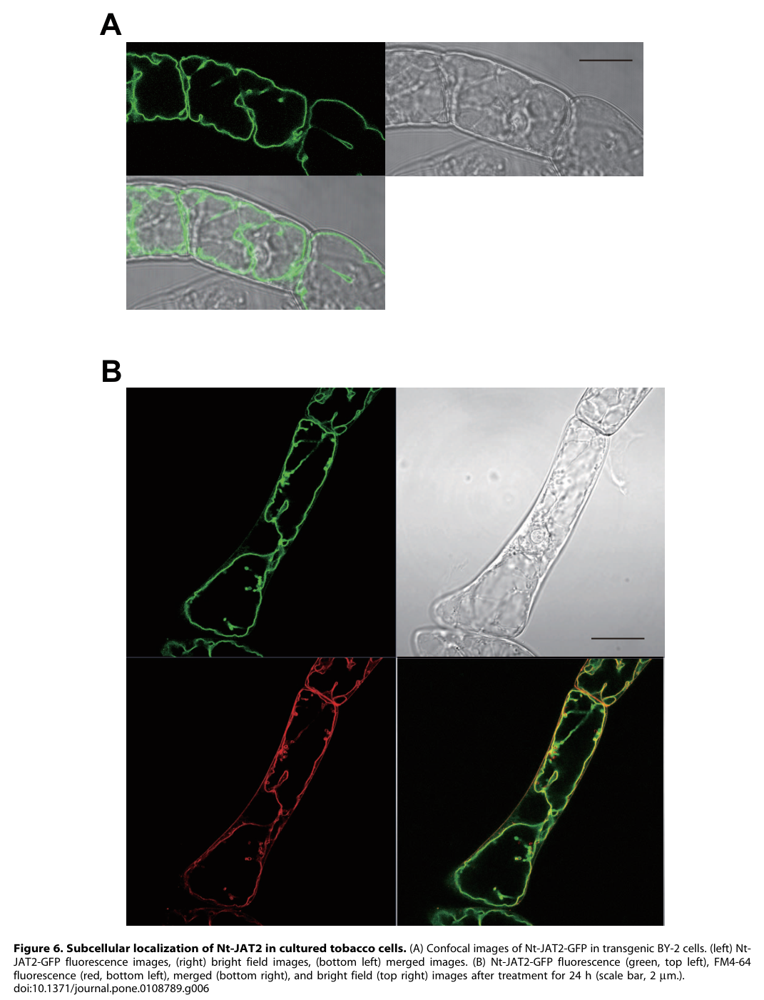

## Question

# Gene Research for Functional Annotation

## ⚠️ CRITICAL: Gene/Protein Identification Context

**BEFORE YOU BEGIN RESEARCH:** You MUST verify you are researching the CORRECT gene/protein. Gene symbols can be ambiguous, especially for less well-characterized genes from non-model organisms.

### Target Gene/Protein Identity (from UniProt):
- **UniProt Accession:** A0A314KVN4
- **Protein Description:** RecName: Full=Protein DETOXIFICATION {ECO:0000256|RuleBase:RU004914}; AltName: Full=Multidrug and toxic compound extrusion protein {ECO:0000256|RuleBase:RU004914};
- **Gene Information:** Name=DTX40_3 {ECO:0000313|EMBL:OIT33047.1}; ORFNames=A4A49_09978 {ECO:0000313|EMBL:OIT33047.1};
- **Organism (full):** Nicotiana attenuata (Coyote tobacco).
- **Protein Family:** Belongs to the multi antimicrobial extrusion (MATE)
- **Key Domains:** MATE_euk. (IPR045069); MATE_fam. (IPR002528); MatE (PF01554)

### MANDATORY VERIFICATION STEPS:

1. **Check if the gene symbol "DTX40_3" matches the protein description above**
2. **Verify the organism is correct:** Nicotiana attenuata (Coyote tobacco).
3. **Check if protein family/domains align with what you find in literature**
4. **If you find literature for a DIFFERENT gene with the same or similar symbol, STOP**

### If Gene Symbol is Ambiguous or You Cannot Find Relevant Literature:

**DO NOT PROCEED WITH RESEARCH ON A DIFFERENT GENE.** Instead:
- State clearly: "The gene symbol 'DTX40_3' is ambiguous or literature is limited for this specific protein"
- Explain what you found (e.g., "Found extensive literature on a different gene with the same symbol in a different organism")
- Describe the protein based ONLY on the UniProt information provided above
- Suggest that the protein function can be inferred from domain/family information

### Research Target:

Please provide a comprehensive research report on the gene **DTX40_3** (gene ID: NaMATE1_candidate_DTX40_3, UniProt: A0A314KVN4) in NICAT.

The research report should be a detailed narrative explaining the function, biological processes, and localization of the gene product. Citations should be given for all claims.

You should prioritize authoritative reviews and primary scientific literature when conducting research. You can supplement
this with annotations you find in gene/protein databases, but these can be outdated or inaccurate.

We are specifically interested in the primary function of the gene - for enzymes, what reaction is catalyzed, and what is the substrate specificity? For transporters, what is the substrate? For structural proteins or adapters, what is the broader structural role? For signaling molecules, what is the role in the pathway.

We are interested in where in or outside the cell the gene product carries out its function.

We are also interested in the signaling or biochemical pathways in which the gene functions. We are less interested in broad pleiotropic effects, except where these elucidate the precise role.

Include evidence where possible. We are interested in both experimental evidence as well as inference from structure, evolution, or bioinformatic analysis. Precise studies should be prioritized over high-throughput, where available.

## Output

Question: You are an expert researcher providing comprehensive, well-cited information.

Provide detailed information focusing on:
1. Key concepts and definitions with current understanding
2. Recent developments and latest research (prioritize 2023-2024 sources)
3. Current applications and real-world implementations
4. Expert opinions and analysis from authoritative sources
5. Relevant statistics and data from recent studies

Format as a comprehensive research report with proper citations. Include URLs and publication dates where available.
Always prioritize recent, authoritative sources and provide specific citations for all major claims.

# Gene Research for Functional Annotation

## ⚠️ CRITICAL: Gene/Protein Identification Context

**BEFORE YOU BEGIN RESEARCH:** You MUST verify you are researching the CORRECT gene/protein. Gene symbols can be ambiguous, especially for less well-characterized genes from non-model organisms.

### Target Gene/Protein Identity (from UniProt):
- **UniProt Accession:** A0A314KVN4
- **Protein Description:** RecName: Full=Protein DETOXIFICATION {ECO:0000256|RuleBase:RU004914}; AltName: Full=Multidrug and toxic compound extrusion protein {ECO:0000256|RuleBase:RU004914};
- **Gene Information:** Name=DTX40_3 {ECO:0000313|EMBL:OIT33047.1}; ORFNames=A4A49_09978 {ECO:0000313|EMBL:OIT33047.1};
- **Organism (full):** Nicotiana attenuata (Coyote tobacco).
- **Protein Family:** Belongs to the multi antimicrobial extrusion (MATE)
- **Key Domains:** MATE_euk. (IPR045069); MATE_fam. (IPR002528); MatE (PF01554)

### MANDATORY VERIFICATION STEPS:

1. **Check if the gene symbol "DTX40_3" matches the protein description above**
2. **Verify the organism is correct:** Nicotiana attenuata (Coyote tobacco).
3. **Check if protein family/domains align with what you find in literature**
4. **If you find literature for a DIFFERENT gene with the same or similar symbol, STOP**

### If Gene Symbol is Ambiguous or You Cannot Find Relevant Literature:

**DO NOT PROCEED WITH RESEARCH ON A DIFFERENT GENE.** Instead:
- State clearly: "The gene symbol 'DTX40_3' is ambiguous or literature is limited for this specific protein"
- Explain what you found (e.g., "Found extensive literature on a different gene with the same symbol in a different organism")
- Describe the protein based ONLY on the UniProt information provided above
- Suggest that the protein function can be inferred from domain/family information

### Research Target:

Please provide a comprehensive research report on the gene **DTX40_3** (gene ID: NaMATE1_candidate_DTX40_3, UniProt: A0A314KVN4) in NICAT.

The research report should be a detailed narrative explaining the function, biological processes, and localization of the gene product. Citations should be given for all claims.

You should prioritize authoritative reviews and primary scientific literature when conducting research. You can supplement
this with annotations you find in gene/protein databases, but these can be outdated or inaccurate.

We are specifically interested in the primary function of the gene - for enzymes, what reaction is catalyzed, and what is the substrate specificity? For transporters, what is the substrate? For structural proteins or adapters, what is the broader structural role? For signaling molecules, what is the role in the pathway.

We are interested in where in or outside the cell the gene product carries out its function.

We are also interested in the signaling or biochemical pathways in which the gene functions. We are less interested in broad pleiotropic effects, except where these elucidate the precise role.

Include evidence where possible. We are interested in both experimental evidence as well as inference from structure, evolution, or bioinformatic analysis. Precise studies should be prioritized over high-throughput, where available.

# Functional annotation research report: **DTX40_3 / NaMATE1_candidate_DTX40_3** (UniProt **A0A314KVN4**) in *Nicotiana attenuata*

## Executive summary and verification
**Target identity (as specified):** UniProt **A0A314KVN4**, gene **DTX40_3** (ORF **A4A49_09978**) from *Nicotiana attenuata* (coyote tobacco). UniProt describes this protein as “Protein detoxification / multidrug and toxic compound extrusion protein” and assigns it to the **MATE (multidrug and toxic compound extrusion; DTX) transporter family** with InterPro/Pfam MATE domains.

**Critical limitation:** In the retrieved, full‑text accessible literature set, **no publication explicitly mentions** *N. attenuata* gene symbol **DTX40_3**, UniProt **A0A314KVN4**, or ORF **A4A49_09978**. Therefore, **gene-specific functional claims (substrate, localization, phenotype)** cannot be stated as experimentally validated for this *N. attenuata* locus. All functional annotation below is constrained to (i) **family/domain-level evidence** and (ii) **closest Nicotiana and plant MATE homolog precedents**, clearly labeled as inference. (takanashi2014themultidrugand pages 1-3, shitan2016secondarymetabolitesin pages 3-6)

## 1) Key concepts and definitions (current understanding)

### 1.1 What are plant MATE/DTX transporters?
Plant MATE (DTX) proteins are **secondary active transporters** (cation antiporters) that use an electrochemical gradient (commonly **H+** in many plant examples) to drive export or compartmentation of substrates. They are generally described as **efflux transporters**, moving substrates from the cytosol to the **apoplast** or into intracellular compartments such as the **vacuole**. (takanashi2014themultidrugand pages 1-3, shitan2016secondarymetabolitesin pages 3-6)

### 1.2 Typical topology and coupling
A widely cited property of plant MATEs is a predicted **12-transmembrane domain (12-TM) topology**; they are “presumed to function as proton antiporters” in plants. (shitan2016secondarymetabolitesin pages 3-6)

### 1.3 Substrate scope and functional breadth
Plant MATEs transport chemically diverse substrates including **secondary metabolites** (alkaloids, flavonoids), **organic acids** (notably citrate), and **hormone-related compounds** (e.g., ABA/SA-related transport processes in some members). They contribute to:
- **Detoxification and self-tolerance** (sequestration/efflux of toxic metabolites or xenobiotics). (takanashi2014themultidrugand pages 1-3, shitan2016secondarymetabolitesin pages 3-6)
- **Specialized metabolite storage**, often in the vacuole (e.g., alkaloids/flavonoids). (takanashi2014themultidrugand pages 3-5, shitan2016secondarymetabolitesin pages 3-6)
- **Metal homeostasis**, such as citrate efflux for **Fe translocation** and **Al3+ detoxification**. (takanashi2014themultidrugand pages 7-9, takanashi2014themultidrugand pages 9-10)

## 2) Gene-centric functional annotation for *N. attenuata* DTX40_3 (A0A314KVN4)

### 2.1 Most defensible function statement (evidence-based)
Given UniProt’s description and the domain family assignment, **DTX40_3 (A0A314KVN4) should be annotated as a MATE/DTX family secondary transporter likely involved in detoxification via efflux/compartmentation**. This is consistent with plant MATE family roles as cation antiporters exporting substrates to the apoplast or vacuole. (takanashi2014themultidrugand pages 1-3, shitan2016secondarymetabolitesin pages 3-6)

### 2.2 Likely biological role in *Nicotiana*: vacuolar sequestration of defensive alkaloids (inference from closest Nicotiana homolog system)
Although not demonstrated for *N. attenuata* DTX40_3 specifically, **the Nicotiana genus provides strong precedents** that some MATEs function in **alkaloid (nicotine) sequestration**:
- The tobacco (*N. tabacum*) MATE **Nt‑JAT2** is implicated in **vacuolar sequestration of nicotine in leaves**. It is **methyl jasmonate (MeJA) inducible** and **leaf‑preferential**, aligning with herbivory‑responsive defense deployment. (shitan2014involvementofthe pages 1-2, shitan2014involvementofthe pages 4-6)
- In yeast assays, Nt‑JAT2 expression lowered intracellular **nicotine** and also lowered **anabasine** and **anatabine**, supporting transport of multiple related alkaloids; it did not transport tested flavonoids in that assay. (shitan2014involvementofthe pages 3-4)
- Reviews of plant secondary metabolite transport similarly describe **JAT1/JAT2 and MATE1/MATE2** as nicotine transporters that likely act as **nicotine/H+ antiporters** localized to the vacuolar membrane, with tissue specificity (leaf vs root vacuoles). (shitan2016secondarymetabolitesin pages 3-6, takanashi2014themultidrugand pages 3-5)

**Gene-specific caution:** The above is **not proof** that *N. attenuata* DTX40_3 transports nicotine; rather, it supports a **plausible hypothesis** that a *Nicotiana* MATE annotated for detoxification could participate in **alkaloid compartmentation**.

### 2.3 Subcellular localization: most likely tonoplast (inference)
For DTX40_3 itself, localization is unknown in the retrieved literature. However, multiple Nicotiana alkaloid MATEs are **tonoplast-localized**, consistent with a vacuolar sequestration mechanism. The Nt‑JAT2 paper provides direct imaging evidence that Nt‑JAT2‑GFP localizes to the **tonoplast in plant cells**, while heterologous yeast expression can show different membrane patterns. (shitan2014involvementofthe media eaf0b77f, shitan2014involvementofthe media a1b95952, shitan2014involvementofthe pages 1-2)

Thus, **DTX40_3 is conservatively predicted to be an endomembrane MATE, plausibly tonoplast-localized**, but this needs direct experimental confirmation (e.g., GFP fusion in *N. attenuata*). (shitan2016secondarymetabolitesin pages 3-6)

### 2.4 Pathway context: JA-regulated defense metabolism and long-distance nicotine allocation (inference)
In *Nicotiana*, nicotine biosynthesis and transport are strongly integrated with **jasmonate signaling**, coordinating expression of metabolic genes and transporters. JAT2 is explicitly described as **jasmonate-inducible**, linking MATE-mediated sequestration to defense signaling. (shitan2014involvementofthe pages 1-2, shitan2015translocationandaccumulation pages 2-3)

A 2024 authoritative tobacco review emphasizes that **JA signaling activates transcriptional regulators** coordinating downstream metabolic and transport genes needed for nicotine production and allocation. (shoji2024geneticregulationand pages 1-2)

For *N. attenuata*, DTX40_3 could plausibly function in the **downstream transport/storage** segment of JA-induced chemical defense, but again this is **hypothesis** without locus-specific expression data.

## 3) Recent developments (prioritizing 2023–2024)

### 3.1 2024: Quantitative demonstration of strict substrate specificity in a plant tonoplast MATE
A major 2024 advance for functional annotation is the detailed biochemical characterization of **CrMATE1** (*Catharanthus roseus*), a **tonoplast MATE** shown to be a **vacuolar importer** with **strict substrate specificity** for **secologanin**. The study used *Xenopus* oocytes to show directionality and reported quantified transport: **1 mM secologanin translocated within 25 min**. (li2024characterizationofa pages 1-2)

This is relevant to DTX40_3 because it demonstrates that plant MATEs can be **highly substrate-specific gatekeepers** of specialized metabolism flux, reinforcing that a “detoxification MATE” annotation does not imply promiscuity and that **precise substrate identification requires direct transport assays**. (li2024characterizationofa pages 2-3)

### 3.2 2024: Nicotine manipulation strategies and transporter context in tobacco
A 2024 Journal of Experimental Botany review synthesizes current nicotine biology and engineering strategies and reiterates that **multiple MATE transporters (JAT1/JAT2/MATE1/MATE2) mediate vacuolar sequestration of nicotine** as tonoplast proton antiporters. (shoji2024geneticregulationand pages 4-5)

The same review also provides application-oriented definitions used in the field: “low nicotine” and “ultra-low nicotine” are framed as **<20% and 5%** of wild-type nicotine levels, respectively. (shoji2024geneticregulationand pages 1-2)

### 3.3 2023: Broader functional diversification of DTX/MATE transporters
A 2023 review summarizes that DTX/MATE transporters participate in diverse processes beyond alkaloids, including:
- Seed vacuolar transport of flavonoid glycosides (e.g., DTX41/TT12). (zhang2023researchprogresson pages 8-11)
- Chloroplast envelope localization of some MATEs involved in salicylic acid-related processes (e.g., EDS5, referenced in plant MATE functional literature). (payne2016genediscoveryin pages 88-91)

For DTX40_3 annotation, this indicates that **DTX naming does not uniquely specify substrate class**, and that experimental localization/substrate testing is necessary.

## 4) Current applications and real-world implementations

### 4.1 Plant metabolic engineering and molecular breeding
In Nicotiana and other crops, transporters are increasingly viewed as **engineering targets** to alter metabolite accumulation in specific organs. The nicotine transporter literature explicitly discusses “transport engineering” concepts: coordinated manipulation of transporters can alter tissue allocation and final metabolite content. (shitan2014involvementofthe pages 6-8, shitan2015translocationandaccumulation pages 2-3)

### 4.2 Public-health driven nicotine reduction targets (tobacco)
The 2024 J Exp Bot review cites real-world regulatory goals and actions: WHO recommendation to reduce cigarette nicotine to **0.4 mg g−1** and the FDA’s proposed product standard (2022) to set a maximum nicotine level. While this is not *N. attenuata* biology per se, it is a major driver of transporter/biosynthesis research programs in Nicotiana. (shoji2024geneticregulationand pages 2-3)

### 4.3 Transporters as pathway flux “gatekeepers”
The CrMATE1 work highlights an emerging implementation theme: identifying transport steps that constrain pathway flux and using them to optimize production of valuable specialized metabolites. (li2024characterizationofa pages 1-2, li2024characterizationofa pages 2-3)

## 5) Expert synthesis and analysis (authoritative viewpoints)

### 5.1 The most likely functional hypothesis for DTX40_3
Given: (i) UniProt’s detoxification/MATE annotation and (ii) strong Nicotiana precedent for tonoplast MATE alkaloid sequestration, the most biologically coherent hypothesis is:

**DTX40_3 encodes a 12‑TM MATE/DTX transporter that uses the proton motive force to sequester (export) toxic specialized metabolites—plausibly alkaloids—into the vacuole (tonoplast) to support self‑tolerance and defense deployment.** (shitan2016secondarymetabolitesin pages 3-6, takanashi2014themultidrugand pages 3-5)

### 5.2 Alternative plausible roles (less supported without gene-specific data)
Because plant MATEs also include citrate exporters for **Fe translocation** and **Al tolerance**, and hormone-related transport functions, DTX40_3 could instead belong to a metal/hormone-related clade. Metal-handling MATEs (e.g., FRD3/FRDL-type) are phylogenetically distinct and are described as mediating citrate efflux into xylem or rhizosphere, supporting Fe mobilization and Al detoxification. (takanashi2014themultidrugand pages 7-9, takanashi2014themultidrugand pages 9-10)

Without sequence-phylogeny placement or expression context for A0A314KVN4, assigning DTX40_3 specifically to “nicotine” vs “citrate/Fe/Al” vs “ABA/SA” remains uncertain.

## 6) Statistics and quantitative data relevant to annotation

### 6.1 Gene family size and general properties
- **Arabidopsis** contains **56 MATE genes** (also described as “more than 50”). (shitan2016secondarymetabolitesin pages 3-6, takanashi2014themultidrugand pages 1-3)

### 6.2 Quantitative anchors from Nicotiana alkaloid transport literature
- Nt‑JAT2 paper provides a physiological concentration gradient context: nicotine is approximately **~1 mM in xylem** and can reach **~60 mM in leaf vacuoles**, motivating tonoplast sequestration transport. (shitan2014involvementofthe pages 1-2)
- MeJA induction kinetics for Nt‑JAT2 are described as rapid (within hours) with sustained induction over a day in the original study’s time course narrative. (shitan2014involvementofthe pages 2-3)

### 6.3 Quantitative functional data from a 2024 plant MATE study
- CrMATE1 transports **1 mM secologanin within 25 min** (oocyte assay). (li2024characterizationofa pages 1-2)
- VIGS knockdown reduced transcript **~73–80%**, increased secologanol **16–38×**, and reduced downstream MIAs (e.g., catharanthine/vindoline). (li2024characterizationofa pages 2-3)

## Visual evidence (for localization precedent)
The following figure panels document tonoplast localization of a Nicotiana MATE alkaloid transporter (Nt‑JAT2), supporting the plausibility of tonoplast targeting for related Nicotiana MATEs.

- Nt‑JAT2‑GFP tonoplast localization in plant cells: (shitan2014involvementofthe media eaf0b77f)
- Nt‑JAT2‑GFP localization patterns in yeast (heterologous expression): (shitan2014involvementofthe media a1b95952)

## Summary table (evidence vs inference for DTX40_3)
| Aspect | Evidence/notes | Best supporting citations (pqac ids) | External URL(s)/publication date(s) |
|---|---|---|---|
| Family/domain | **Target identity verification:** direct literature for **Nicotiana attenuata DTX40_3 / UniProt A0A314KVN4 / ORF A4A49_09978** was not found in the retrieved corpus, so annotation should remain **family-based and inferential**. UniProt describes A0A314KVN4 as a **plant MATE/DTX transporter** with **MATE_euk / MATE_fam / MatE** domains. Broad plant MATE reviews describe this family as one of the largest transporter families in plants, involved in transport of secondary metabolites, organic acids, hormones, and xenobiotics. | (takanashi2014themultidrugand pages 1-3) | UniProt entry for A0A314KVN4: https://www.uniprot.org/uniprotkb/A0A314KVN4 ; Takanashi et al. 2014, Plant Biotechnology, Dec 2014: https://doi.org/10.5511/plantbiotechnology.14.0904a |
| Topology/energy coupling | Plant MATE transporters are typically predicted to have **12 transmembrane domains** and commonly function as **secondary antiporters**, usually **H+ coupled** in plant examples. For Nicotiana alkaloid transporters, **NtMATE1 shows H+/nicotine antiport** activity in yeast; broader reviews state plant MATEs generally use **Na+ or H+ electrochemical gradients**, though proton coupling is the strongest inference for vacuolar alkaloid transporters. Thus, DTX40_3 is best annotated as a **probable 12-TM H+-coupled antiporter** unless direct data prove otherwise. | (shitan2016secondarymetabolitesin pages 3-6, takanashi2014themultidrugand pages 3-5, takanashi2014themultidrugand pages 1-3) | Shitan 2016, Biosci Biotechnol Biochem, Jul 2016: https://doi.org/10.1080/09168451.2016.1151344 ; Takanashi et al. 2014, Dec 2014: https://doi.org/10.5511/plantbiotechnology.14.0904a |
| Likely subcellular localization | Direct localization for DTX40_3 is unavailable. In **Nicotiana tabacum**, the closest functional precedents for alkaloid-associated MATEs (**Nt-JAT1, Nt-JAT2, NtMATE1/2**) localize primarily to the **tonoplast/vacuolar membrane** and mediate vacuolar sequestration. Nt-JAT2-GFP was localized to the **tonoplast** in BY-2 cells; yeast heterologous expression can show plasma-membrane signal, so plant-cell localization is more informative. Therefore DTX40_3 is **most plausibly tonoplast-localized**, though plasma membrane cannot be excluded without experiment. | (shitan2014involvementofthe pages 6-8, shitan2014involvementofthe pages 1-2, shitan2014involvementofthe pages 3-4, shitan2014involvementofthe media eaf0b77f, shitan2016secondarymetabolitesin pages 3-6) | Shitan et al. 2014, PLOS ONE, Sep 2014: https://doi.org/10.1371/journal.pone.0108789 ; Figure evidence for tonoplast localization in the same paper, Sep 2014 |
| Likely substrates | No direct substrate assay for DTX40_3 was found. The strongest Nicotiana precedent is **alkaloid transport**, especially **nicotine**, plus related alkaloids **anabasine** and **anatabine**; Nt-JAT2 also handled **berberine** and **scopolamine** in yeast assays, but not tested flavonoids such as **cyanidin 3-O-glucoside** or **rutin**. Because A0A314KVN4 is annotated as a detoxification/MATE protein from **Nicotiana attenuata**, a species well known for inducible defensive alkaloid metabolism, the most conservative substrate prediction is **specialized metabolite cation(s), likely pyridine alkaloids or other defense-related toxic metabolites**, not a broad flavonoid transporter. | (shitan2014involvementofthe pages 6-8, shitan2014involvementofthe pages 1-2, shitan2014involvementofthe pages 3-4, takanashi2014themultidrugand pages 3-5) | Shitan et al. 2014, Sep 2014: https://doi.org/10.1371/journal.pone.0108789 ; Takanashi et al. 2014, Dec 2014: https://doi.org/10.5511/plantbiotechnology.14.0904a |
| Biological role/process | Best-supported inferred role is **detoxification by compartmentation**, i.e., moving specialized metabolites from the cytosol into the vacuole to reduce self-toxicity while enabling accumulation for defense. In Nicotiana homologs, this role is specifically **vacuolar sequestration of nicotine/alkaloids** after root-to-shoot transport. More generally, plant MATEs mediate xenobiotic efflux, alkaloid/flavonoid accumulation, citrate export, Fe homeostasis, and hormone transport; however, the Nicotiana homolog evidence points most strongly to **alkaloid sequestration/detoxification** rather than metal or hormone transport. | (takanashi2014themultidrugand pages 3-5, takanashi2014themultidrugand pages 1-3, shitan2014involvementofthe pages 3-4, shitan2016secondarymetabolitesin pages 3-6) | Takanashi et al. 2014, Dec 2014: https://doi.org/10.5511/plantbiotechnology.14.0904a ; Shitan 2016, Jul 2016: https://doi.org/10.1080/09168451.2016.1151344 |
| Signaling/pathway context | Nicotiana MATE alkaloid transporters are closely linked to **jasmonate (JA/MeJA)-responsive defense pathways**. **Nt-JAT2** is rapidly induced by **methyl jasmonate**, with strong leaf-preferential expression, supporting a role during herbivory-induced nicotine deployment. For DTX40_3 in **N. attenuata**, the most plausible pathway placement is therefore within **JA-regulated defensive specialized metabolism**, likely downstream of alkaloid biosynthesis and long-distance transport, where it would mediate final sequestration/storage. This remains an inference, not a gene-specific demonstration. | (shitan2014involvementofthe pages 6-8, shitan2014involvementofthe pages 2-3, shitan2014involvementofthe pages 4-6, payne2016genediscoveryin pages 93-97) | Shitan et al. 2014, Sep 2014: https://doi.org/10.1371/journal.pone.0108789 ; Shitan et al. 2015, Plant Signaling & Behavior, Jul 2015: https://doi.org/10.1080/15592324.2015.1035852 |
| Key quantitative data | Family- and homolog-level quantitative anchors useful for annotation: **Arabidopsis has >50 / 56 MATE genes**; **Nt-JAT2** is induced by **MeJA within ~2 h** and remains elevated for **24 h**; Nt-JAT2 is a **~507 aa** protein predicted to contain **12 TM helices**; recent plant-MATE work showed another alkaloid-pathway transporter, **CrMATE1**, transports **1 mM secologanin within 25 min**, and VIGS reduced transcript by **~73–80%**, causing **16–38-fold** secologanol accumulation and reduced downstream MIAs. These values do **not** measure DTX40_3 directly but illustrate realistic MATE family behavior and experimental expectations. | (takanashi2014themultidrugand pages 1-3, shitan2016secondarymetabolitesin pages 3-6, shitan2014involvementofthe pages 2-3, li2024characterizationofa pages 1-2, li2024characterizationofa pages 2-3) | Takanashi et al. 2014, Dec 2014: https://doi.org/10.5511/plantbiotechnology.14.0904a ; Shitan et al. 2014, Sep 2014: https://doi.org/10.1371/journal.pone.0108789 ; Li et al. 2024, Communications Biology, Aug 2024: https://doi.org/10.1038/s42003-024-06624-5 |
| Confidence/limitations | **High confidence:** A0A314KVN4 is a **plant MATE/DTX family transporter**. **Moderate confidence:** it is a **12-TM, proton-coupled transporter**. **Moderate-to-low confidence:** it is **tonoplast-localized** and transports **nicotine/related alkaloids**, because these are inferred from Nicotiana homologs rather than shown directly for DTX40_3. **Low confidence for exact substrate specificity, tissue expression, and physiological phenotype** until gene-specific localization, transport assays, and expression profiling are performed in **N. attenuata**. | (takanashi2014themultidrugand pages 1-3, shitan2014involvementofthe pages 1-2, shitan2016secondarymetabolitesin pages 3-6, takanashi2014themultidrugand pages 3-5) | Evidence synthesis based on cited sources above; no direct publication located for A0A314KVN4 / DTX40_3 in retrieved literature corpus |

*Table: This table summarizes the most defensible functional annotation for Nicotiana attenuata DTX40_3 (UniProt A0A314KVN4) using direct identity information plus experimentally characterized plant and Nicotiana MATE homologs. It is useful for separating high-confidence family-level facts from lower-confidence gene-specific inferences.*

## Conclusions
1. **DTX40_3 (A0A314KVN4) is best annotated as a plant MATE/DTX secondary transporter** involved in detoxification by efflux/compartmentation, consistent with MATE family definitions and plant MATE roles. (takanashi2014themultidrugand pages 1-3, shitan2016secondarymetabolitesin pages 3-6)
2. **No gene-specific experimental literature** was found for this exact *N. attenuata* locus in the retrieved corpus; thus **substrate, localization, and pathway assignments remain hypotheses**.
3. The **strongest functional precedent in Nicotiana** is **tonoplast MATE-mediated vacuolar sequestration of nicotine and related alkaloids** (Nt‑JAT2/JAT1/MATE1/2), making alkaloid transport a plausible candidate function for DTX40_3. (shitan2014involvementofthe pages 1-2, takanashi2014themultidrugand pages 3-5)
4. **Recent 2024 work** underscores that plant MATEs can be **highly substrate-specific** and quantitatively impactful on pathway flux, reinforcing the need for direct substrate tests for DTX40_3. (li2024characterizationofa pages 1-2, li2024characterizationofa pages 2-3)

## Key references (with URLs and publication dates)
- Shitan N. et al. **2014-09**. *PLOS ONE*. “Nt‑JAT2… vacuolar sequestration of nicotine.” https://doi.org/10.1371/journal.pone.0108789 (shitan2014involvementofthe pages 1-2, shitan2014involvementofthe pages 3-4)
- Takanashi K. et al. **2014-12**. *Plant Biotechnology*. “The MATE family in plants.” https://doi.org/10.5511/plantbiotechnology.14.0904a (takanashi2014themultidrugand pages 1-3, takanashi2014themultidrugand pages 3-5)
- Shitan N. **2016-07**. *Biosci Biotechnol Biochem*. “Secondary metabolites… self‑tolerance mechanisms.” https://doi.org/10.1080/09168451.2016.1151344 (shitan2016secondarymetabolitesin pages 3-6)
- Li F. et al. **2024-08**. *Communications Biology*. “CrMATE1 vacuolar importer of secologanin.” https://doi.org/10.1038/s42003-024-06624-5 (li2024characterizationofa pages 1-2, li2024characterizationofa pages 2-3)
- Shoji T. et al. **2024-08**. *Journal of Experimental Botany*. “Genetic regulation and manipulation of nicotine biosynthesis…” https://doi.org/10.1093/jxb/erad341 (shoji2024geneticregulationand pages 4-5, shoji2024geneticregulationand pages 2-3, shoji2024geneticregulationand pages 1-2)

References

1. (takanashi2014themultidrugand pages 1-3): Kojiro Takanashi, Nobukazu Shitan, and Kazufumi Yazaki. The multidrug and toxic compound extrusion (mate) family in plants. Plant Biotechnology, 31:417-430, Dec 2014. URL: https://doi.org/10.5511/plantbiotechnology.14.0904a, doi:10.5511/plantbiotechnology.14.0904a. This article has 180 citations and is from a peer-reviewed journal.

2. (shitan2016secondarymetabolitesin pages 3-6): Nobukazu Shitan. Secondary metabolites in plants: transport and self-tolerance mechanisms. Bioscience, Biotechnology, and Biochemistry, 80:1283-1293, Jul 2016. URL: https://doi.org/10.1080/09168451.2016.1151344, doi:10.1080/09168451.2016.1151344. This article has 231 citations.

3. (takanashi2014themultidrugand pages 3-5): Kojiro Takanashi, Nobukazu Shitan, and Kazufumi Yazaki. The multidrug and toxic compound extrusion (mate) family in plants. Plant Biotechnology, 31:417-430, Dec 2014. URL: https://doi.org/10.5511/plantbiotechnology.14.0904a, doi:10.5511/plantbiotechnology.14.0904a. This article has 180 citations and is from a peer-reviewed journal.

4. (takanashi2014themultidrugand pages 7-9): Kojiro Takanashi, Nobukazu Shitan, and Kazufumi Yazaki. The multidrug and toxic compound extrusion (mate) family in plants. Plant Biotechnology, 31:417-430, Dec 2014. URL: https://doi.org/10.5511/plantbiotechnology.14.0904a, doi:10.5511/plantbiotechnology.14.0904a. This article has 180 citations and is from a peer-reviewed journal.

5. (takanashi2014themultidrugand pages 9-10): Kojiro Takanashi, Nobukazu Shitan, and Kazufumi Yazaki. The multidrug and toxic compound extrusion (mate) family in plants. Plant Biotechnology, 31:417-430, Dec 2014. URL: https://doi.org/10.5511/plantbiotechnology.14.0904a, doi:10.5511/plantbiotechnology.14.0904a. This article has 180 citations and is from a peer-reviewed journal.

6. (shitan2014involvementofthe pages 1-2): Nobukazu Shitan, Shota Minami, Masahiko Morita, Minaho Hayashida, Shingo Ito, Kojiro Takanashi, Hiroshi Omote, Yoshinori Moriyama, Akifumi Sugiyama, Alain Goossens, Masataka Moriyasu, and Kazufumi Yazaki. Involvement of the leaf-specific multidrug and toxic compound extrusion (mate) transporter nt-jat2 in vacuolar sequestration of nicotine in nicotiana tabacum. PLoS ONE, 9:e108789, Sep 2014. URL: https://doi.org/10.1371/journal.pone.0108789, doi:10.1371/journal.pone.0108789. This article has 112 citations and is from a peer-reviewed journal.

7. (shitan2014involvementofthe pages 4-6): Nobukazu Shitan, Shota Minami, Masahiko Morita, Minaho Hayashida, Shingo Ito, Kojiro Takanashi, Hiroshi Omote, Yoshinori Moriyama, Akifumi Sugiyama, Alain Goossens, Masataka Moriyasu, and Kazufumi Yazaki. Involvement of the leaf-specific multidrug and toxic compound extrusion (mate) transporter nt-jat2 in vacuolar sequestration of nicotine in nicotiana tabacum. PLoS ONE, 9:e108789, Sep 2014. URL: https://doi.org/10.1371/journal.pone.0108789, doi:10.1371/journal.pone.0108789. This article has 112 citations and is from a peer-reviewed journal.

8. (shitan2014involvementofthe pages 3-4): Nobukazu Shitan, Shota Minami, Masahiko Morita, Minaho Hayashida, Shingo Ito, Kojiro Takanashi, Hiroshi Omote, Yoshinori Moriyama, Akifumi Sugiyama, Alain Goossens, Masataka Moriyasu, and Kazufumi Yazaki. Involvement of the leaf-specific multidrug and toxic compound extrusion (mate) transporter nt-jat2 in vacuolar sequestration of nicotine in nicotiana tabacum. PLoS ONE, 9:e108789, Sep 2014. URL: https://doi.org/10.1371/journal.pone.0108789, doi:10.1371/journal.pone.0108789. This article has 112 citations and is from a peer-reviewed journal.

9. (shitan2014involvementofthe media eaf0b77f): Nobukazu Shitan, Shota Minami, Masahiko Morita, Minaho Hayashida, Shingo Ito, Kojiro Takanashi, Hiroshi Omote, Yoshinori Moriyama, Akifumi Sugiyama, Alain Goossens, Masataka Moriyasu, and Kazufumi Yazaki. Involvement of the leaf-specific multidrug and toxic compound extrusion (mate) transporter nt-jat2 in vacuolar sequestration of nicotine in nicotiana tabacum. PLoS ONE, 9:e108789, Sep 2014. URL: https://doi.org/10.1371/journal.pone.0108789, doi:10.1371/journal.pone.0108789. This article has 112 citations and is from a peer-reviewed journal.

10. (shitan2014involvementofthe media a1b95952): Nobukazu Shitan, Shota Minami, Masahiko Morita, Minaho Hayashida, Shingo Ito, Kojiro Takanashi, Hiroshi Omote, Yoshinori Moriyama, Akifumi Sugiyama, Alain Goossens, Masataka Moriyasu, and Kazufumi Yazaki. Involvement of the leaf-specific multidrug and toxic compound extrusion (mate) transporter nt-jat2 in vacuolar sequestration of nicotine in nicotiana tabacum. PLoS ONE, 9:e108789, Sep 2014. URL: https://doi.org/10.1371/journal.pone.0108789, doi:10.1371/journal.pone.0108789. This article has 112 citations and is from a peer-reviewed journal.

11. (shitan2015translocationandaccumulation pages 2-3): Nobukazu Shitan, Minaho Hayashida, and Kazufumi Yazaki. Translocation and accumulation of nicotine via distinct spatio-temporal regulation of nicotine transporters in <i>nicotiana tabacum</i>. Plant Signaling &amp; Behavior, 10:e1035852, Jul 2015. URL: https://doi.org/10.1080/15592324.2015.1035852, doi:10.1080/15592324.2015.1035852. This article has 45 citations and is from a peer-reviewed journal.

12. (shoji2024geneticregulationand pages 1-2): Tsubasa Shoji, Takashi Hashimoto, and Kazuki Saito. Genetic regulation and manipulation of nicotine biosynthesis in tobacco: strategies to eliminate addictive alkaloids. Journal of Experimental Botany, 75:1741-1753, Aug 2024. URL: https://doi.org/10.1093/jxb/erad341, doi:10.1093/jxb/erad341. This article has 37 citations and is from a domain leading peer-reviewed journal.

13. (li2024characterizationofa pages 1-2): Fanfan Li, Mohammadamin Shahsavarani, Cody-Jordan Handy-Hart, Audrey Côté, Xavier Brasseur-Trottier, Victoria Montgomery, Robin N. Beech, Lan Liu, Stéphane Bayen, Yang Qu, Vincenzo De Luca, and Mehran Dastmalchi. Characterization of a vacuolar importer of secologanin in catharanthus roseus. Communications Biology, Aug 2024. URL: https://doi.org/10.1038/s42003-024-06624-5, doi:10.1038/s42003-024-06624-5. This article has 12 citations and is from a peer-reviewed journal.

14. (li2024characterizationofa pages 2-3): Fanfan Li, Mohammadamin Shahsavarani, Cody-Jordan Handy-Hart, Audrey Côté, Xavier Brasseur-Trottier, Victoria Montgomery, Robin N. Beech, Lan Liu, Stéphane Bayen, Yang Qu, Vincenzo De Luca, and Mehran Dastmalchi. Characterization of a vacuolar importer of secologanin in catharanthus roseus. Communications Biology, Aug 2024. URL: https://doi.org/10.1038/s42003-024-06624-5, doi:10.1038/s42003-024-06624-5. This article has 12 citations and is from a peer-reviewed journal.

15. (shoji2024geneticregulationand pages 4-5): Tsubasa Shoji, Takashi Hashimoto, and Kazuki Saito. Genetic regulation and manipulation of nicotine biosynthesis in tobacco: strategies to eliminate addictive alkaloids. Journal of Experimental Botany, 75:1741-1753, Aug 2024. URL: https://doi.org/10.1093/jxb/erad341, doi:10.1093/jxb/erad341. This article has 37 citations and is from a domain leading peer-reviewed journal.

16. (zhang2023researchprogresson pages 8-11): J Zhang, Q Li, C Li, Q Wang, and X Hou. Research progress on mate transporters in plants. Unknown journal, 2023.

17. (payne2016genediscoveryin pages 88-91): R Payne. Gene discovery in catharanthus roseus using virus induced gene silencing. Unknown journal, 2016.

18. (shitan2014involvementofthe pages 6-8): Nobukazu Shitan, Shota Minami, Masahiko Morita, Minaho Hayashida, Shingo Ito, Kojiro Takanashi, Hiroshi Omote, Yoshinori Moriyama, Akifumi Sugiyama, Alain Goossens, Masataka Moriyasu, and Kazufumi Yazaki. Involvement of the leaf-specific multidrug and toxic compound extrusion (mate) transporter nt-jat2 in vacuolar sequestration of nicotine in nicotiana tabacum. PLoS ONE, 9:e108789, Sep 2014. URL: https://doi.org/10.1371/journal.pone.0108789, doi:10.1371/journal.pone.0108789. This article has 112 citations and is from a peer-reviewed journal.

19. (shoji2024geneticregulationand pages 2-3): Tsubasa Shoji, Takashi Hashimoto, and Kazuki Saito. Genetic regulation and manipulation of nicotine biosynthesis in tobacco: strategies to eliminate addictive alkaloids. Journal of Experimental Botany, 75:1741-1753, Aug 2024. URL: https://doi.org/10.1093/jxb/erad341, doi:10.1093/jxb/erad341. This article has 37 citations and is from a domain leading peer-reviewed journal.

20. (shitan2014involvementofthe pages 2-3): Nobukazu Shitan, Shota Minami, Masahiko Morita, Minaho Hayashida, Shingo Ito, Kojiro Takanashi, Hiroshi Omote, Yoshinori Moriyama, Akifumi Sugiyama, Alain Goossens, Masataka Moriyasu, and Kazufumi Yazaki. Involvement of the leaf-specific multidrug and toxic compound extrusion (mate) transporter nt-jat2 in vacuolar sequestration of nicotine in nicotiana tabacum. PLoS ONE, 9:e108789, Sep 2014. URL: https://doi.org/10.1371/journal.pone.0108789, doi:10.1371/journal.pone.0108789. This article has 112 citations and is from a peer-reviewed journal.

21. (payne2016genediscoveryin pages 93-97): R Payne. Gene discovery in catharanthus roseus using virus induced gene silencing. Unknown journal, 2016.

## Artifacts

- [Edison artifact artifact-00](NaMATE1_candidate_DTX40_3-deep-research-falcon_artifacts/artifact-00.md)

## Citations

1. shitan2016secondarymetabolitesin pages 3-6
2. shitan2014involvementofthe pages 3-4
3. shoji2024geneticregulationand pages 1-2
4. li2024characterizationofa pages 1-2
5. li2024characterizationofa pages 2-3
6. shoji2024geneticregulationand pages 4-5
7. zhang2023researchprogresson pages 8-11
8. payne2016genediscoveryin pages 88-91
9. shoji2024geneticregulationand pages 2-3
10. shitan2014involvementofthe pages 1-2
11. shitan2014involvementofthe pages 2-3
12. takanashi2014themultidrugand pages 1-3
13. takanashi2014themultidrugand pages 3-5
14. takanashi2014themultidrugand pages 7-9
15. takanashi2014themultidrugand pages 9-10
16. shitan2014involvementofthe pages 4-6
17. shitan2015translocationandaccumulation pages 2-3
18. shitan2014involvementofthe pages 6-8
19. payne2016genediscoveryin pages 93-97
20. https://www.uniprot.org/uniprotkb/A0A314KVN4
21. https://doi.org/10.5511/plantbiotechnology.14.0904a
22. https://doi.org/10.1080/09168451.2016.1151344
23. https://doi.org/10.1371/journal.pone.0108789
24. https://doi.org/10.1080/15592324.2015.1035852
25. https://doi.org/10.1038/s42003-024-06624-5
26. https://doi.org/10.1093/jxb/erad341
27. https://doi.org/10.5511/plantbiotechnology.14.0904a,
28. https://doi.org/10.1080/09168451.2016.1151344,
29. https://doi.org/10.1371/journal.pone.0108789,
30. https://doi.org/10.1080/15592324.2015.1035852,
31. https://doi.org/10.1093/jxb/erad341,
32. https://doi.org/10.1038/s42003-024-06624-5,