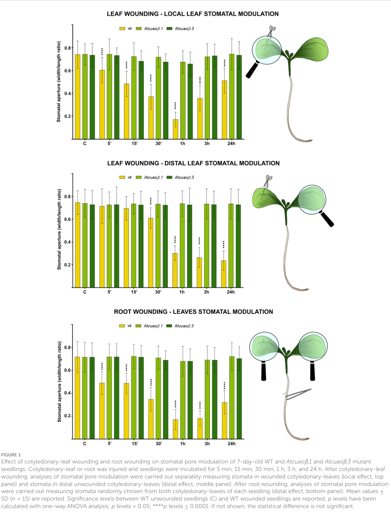

## Question

# Gene Research for Functional Annotation

## ⚠️ CRITICAL: Gene/Protein Identification Context

**BEFORE YOU BEGIN RESEARCH:** You MUST verify you are researching the CORRECT gene/protein. Gene symbols can be ambiguous, especially for less well-characterized genes from non-model organisms.

### Target Gene/Protein Identity (from UniProt):
- **UniProt Accession:** A0A314KPU1
- **Protein Description:** RecName: Full=Amine oxidase {ECO:0000256|RuleBase:RU000672}; EC=1.4.3.- {ECO:0000256|RuleBase:RU000672};
- **Gene Information:** Name=AMO_3 {ECO:0000313|EMBL:OIT31177.1}; ORFNames=A4A49_14063 {ECO:0000313|EMBL:OIT31177.1};
- **Organism (full):** Nicotiana attenuata (Coyote tobacco).
- **Protein Family:** Belongs to the copper/topaquinone oxidase family.
- **Key Domains:** Cu_amine_oxidase. (IPR000269); Cu_amine_oxidase_C. (IPR015798); Cu_amine_oxidase_C_sf. (IPR036460); Cu_amine_oxidase_N-reg. (IPR016182); Cu_amine_oxidase_N2. (IPR015800)

### MANDATORY VERIFICATION STEPS:

1. **Check if the gene symbol "AMO_3" matches the protein description above**
2. **Verify the organism is correct:** Nicotiana attenuata (Coyote tobacco).
3. **Check if protein family/domains align with what you find in literature**
4. **If you find literature for a DIFFERENT gene with the same or similar symbol, STOP**

### If Gene Symbol is Ambiguous or You Cannot Find Relevant Literature:

**DO NOT PROCEED WITH RESEARCH ON A DIFFERENT GENE.** Instead:
- State clearly: "The gene symbol 'AMO_3' is ambiguous or literature is limited for this specific protein"
- Explain what you found (e.g., "Found extensive literature on a different gene with the same symbol in a different organism")
- Describe the protein based ONLY on the UniProt information provided above
- Suggest that the protein function can be inferred from domain/family information

### Research Target:

Please provide a comprehensive research report on the gene **AMO_3** (gene ID: NaMPO1_candidate_AMO_3, UniProt: A0A314KPU1) in NICAT.

The research report should be a detailed narrative explaining the function, biological processes, and localization of the gene product. Citations should be given for all claims.

You should prioritize authoritative reviews and primary scientific literature when conducting research. You can supplement
this with annotations you find in gene/protein databases, but these can be outdated or inaccurate.

We are specifically interested in the primary function of the gene - for enzymes, what reaction is catalyzed, and what is the substrate specificity? For transporters, what is the substrate? For structural proteins or adapters, what is the broader structural role? For signaling molecules, what is the role in the pathway.

We are interested in where in or outside the cell the gene product carries out its function.

We are also interested in the signaling or biochemical pathways in which the gene functions. We are less interested in broad pleiotropic effects, except where these elucidate the precise role.

Include evidence where possible. We are interested in both experimental evidence as well as inference from structure, evolution, or bioinformatic analysis. Precise studies should be prioritized over high-throughput, where available.

## Output

Question: You are an expert researcher providing comprehensive, well-cited information.

Provide detailed information focusing on:
1. Key concepts and definitions with current understanding
2. Recent developments and latest research (prioritize 2023-2024 sources)
3. Current applications and real-world implementations
4. Expert opinions and analysis from authoritative sources
5. Relevant statistics and data from recent studies

Format as a comprehensive research report with proper citations. Include URLs and publication dates where available.
Always prioritize recent, authoritative sources and provide specific citations for all major claims.

# Gene Research for Functional Annotation

## ⚠️ CRITICAL: Gene/Protein Identification Context

**BEFORE YOU BEGIN RESEARCH:** You MUST verify you are researching the CORRECT gene/protein. Gene symbols can be ambiguous, especially for less well-characterized genes from non-model organisms.

### Target Gene/Protein Identity (from UniProt):
- **UniProt Accession:** A0A314KPU1
- **Protein Description:** RecName: Full=Amine oxidase {ECO:0000256|RuleBase:RU000672}; EC=1.4.3.- {ECO:0000256|RuleBase:RU000672};
- **Gene Information:** Name=AMO_3 {ECO:0000313|EMBL:OIT31177.1}; ORFNames=A4A49_14063 {ECO:0000313|EMBL:OIT31177.1};
- **Organism (full):** Nicotiana attenuata (Coyote tobacco).
- **Protein Family:** Belongs to the copper/topaquinone oxidase family.
- **Key Domains:** Cu_amine_oxidase. (IPR000269); Cu_amine_oxidase_C. (IPR015798); Cu_amine_oxidase_C_sf. (IPR036460); Cu_amine_oxidase_N-reg. (IPR016182); Cu_amine_oxidase_N2. (IPR015800)

### MANDATORY VERIFICATION STEPS:

1. **Check if the gene symbol "AMO_3" matches the protein description above**
2. **Verify the organism is correct:** Nicotiana attenuata (Coyote tobacco).
3. **Check if protein family/domains align with what you find in literature**
4. **If you find literature for a DIFFERENT gene with the same or similar symbol, STOP**

### If Gene Symbol is Ambiguous or You Cannot Find Relevant Literature:

**DO NOT PROCEED WITH RESEARCH ON A DIFFERENT GENE.** Instead:
- State clearly: "The gene symbol 'AMO_3' is ambiguous or literature is limited for this specific protein"
- Explain what you found (e.g., "Found extensive literature on a different gene with the same symbol in a different organism")
- Describe the protein based ONLY on the UniProt information provided above
- Suggest that the protein function can be inferred from domain/family information

### Research Target:

Please provide a comprehensive research report on the gene **AMO_3** (gene ID: NaMPO1_candidate_AMO_3, UniProt: A0A314KPU1) in NICAT.

The research report should be a detailed narrative explaining the function, biological processes, and localization of the gene product. Citations should be given for all claims.

You should prioritize authoritative reviews and primary scientific literature when conducting research. You can supplement
this with annotations you find in gene/protein databases, but these can be outdated or inaccurate.

We are specifically interested in the primary function of the gene - for enzymes, what reaction is catalyzed, and what is the substrate specificity? For transporters, what is the substrate? For structural proteins or adapters, what is the broader structural role? For signaling molecules, what is the role in the pathway.

We are interested in where in or outside the cell the gene product carries out its function.

We are also interested in the signaling or biochemical pathways in which the gene functions. We are less interested in broad pleiotropic effects, except where these elucidate the precise role.

Include evidence where possible. We are interested in both experimental evidence as well as inference from structure, evolution, or bioinformatic analysis. Precise studies should be prioritized over high-throughput, where available.

## Research report: Functional annotation of *Nicotiana attenuata* AMO_3 (UniProt A0A314KPU1)

### Executive summary and evidence-quality statement
The UniProt entry A0A314KPU1 (gene name **AMO_3**, ORF **A4A49_14063**) from *Nicotiana attenuata* is annotated as an **“Amine oxidase” (EC 1.4.3.-)** and as a member of the **copper/topaquinone (TPQ) amine oxidase (CuAO) family**, with Cu_amine_oxidase domains (provided by user). Within the literature retrieved in this run, **no publication explicitly mentions A0A314KPU1, AMO_3, or A4A49_14063**. Therefore, the functional annotation below is necessarily **inference-based**, grounded in (i) biochemical and localization studies of plant CuAOs (especially Arabidopsis) and (ii) *N. attenuata* nicotine-pathway work describing **N-methylputrescine oxidase (MPO)**, a CuAO subclass used in alkaloid biosynthesis. The report explicitly labels direct vs indirect evidence throughout.

### 1) Key concepts and definitions (current understanding)

#### 1.1 Copper/topaquinone amine oxidases (CuAOs): definition and catalytic chemistry
Plant **copper-containing amine oxidases (CuAOs)** (also called diamine oxidases in many plant contexts) are **quinoenzymes** that catalyze the **oxidative deamination of primary amino groups** of amines/polyamines, producing an **aminoaldehyde**, **ammonia (NH3)**, and **hydrogen peroxide (H2O2)**. This places them as both metabolic enzymes (polyamine catabolism) and **reactive oxygen species (ROS) generators** (signaling). In Arabidopsis, CuAOs were experimentally validated to oxidize polyamines such as **putrescine** and **spermidine**, with H2O2 measured as a reaction product using Amplex Red assays, and with activity sensitive to classic CuAO inhibitors (aminoguanidine; copper chelation) (planasportell2013coppercontainingamineoxidases pages 10-12, planasportell2013coppercontainingamineoxidases pages 1-2, planasportell2013coppercontainingamineoxidases pages 2-5).

CuAOs contain a **copper ion** and a **topaquinone (TPQ) cofactor** generated from a conserved Tyr residue, and they require conserved catalytic residues (e.g., copper-binding histidines, essential active-site Asp). These features are consistent with the family/domain assignment provided for A0A314KPU1 (planasportell2013coppercontainingamineoxidases pages 1-2, planasportell2013coppercontainingamineoxidases pages 2-5).

#### 1.2 Cellular compartments and why they matter
Plant CuAOs are not confined to one compartment. Arabidopsis CuAOs include **apoplastic/extracellular** enzymes as well as **peroxisomal** enzymes, supporting functional diversification: apoplastic CuAOs can generate extracellular H2O2 for cell-wall processes and signaling, while peroxisomal CuAOs integrate with intracellular polyamine catabolism and redox metabolism (planasportell2013coppercontainingamineoxidases pages 10-12, planasportell2013coppercontainingamineoxidases pages 1-2, planasportell2013coppercontainingamineoxidases pages 6-7). A tobacco methods paper highlights experimental strategies used to determine intracellular localization of CuAOs (including **peroxisomal localization** paradigms) by transient expression and fluorescent tagging (shoji2018analysisofthe pages 8-9).

### 2) Target-gene identity verification (mandatory context)

**Checked identifiers:** A0A314KPU1 / AMO_3 / A4A49_14063 / *N. attenuata*. Within retrieved sources, none contained these exact identifiers; consequently, no direct gene-specific functional paper could be cited for AMO_3 in *N. attenuata*.

**Conclusion:** The symbol **AMO_3** should be treated as **ambiguous in the literature corpus retrieved here**; the most defensible annotation is to describe A0A314KPU1 using **UniProt-provided family/domain identity** and **CuAO-family functional inference**.

### 3) Predicted molecular function of AMO_3 (A0A314KPU1)

#### 3.1 Most likely enzymatic reaction
Given its CuAO-family assignment, AMO_3 is most likely a **copper/TPQ-dependent primary-amine oxidase** catalyzing terminal oxidative deamination of **diamines/polyamines**, producing **aminoaldehyde + NH3 + H2O2** (planasportell2013coppercontainingamineoxidases pages 1-2, planasportell2013coppercontainingamineoxidases pages 2-5, fraudentali2023distinctroleof pages 1-2).

For Arabidopsis CuAOs, recombinant enzymes oxidized **putrescine and spermidine** with measurable H2O2 production (planasportell2013coppercontainingamineoxidases pages 10-12, planasportell2013coppercontainingamineoxidases pages 6-7, planasportell2013coppercontainingamineoxidases pages 2-5). A 2023 Arabidopsis defense study also cites CuAOs as contributors to polyamine oxidation and H2O2 generation, and notes strong preference for putrescine relative to higher polyamines in several plant contexts (zhang2023spermineinhibitspampinduced pages 1-2).

**Substrate specificity (inferred):** Most consistent inference is that AMO_3 oxidizes **putrescine** and possibly **spermidine**, with weaker activity toward **spermine** (family-level inference from Arabidopsis biochemical results) (planasportell2013coppercontainingamineoxidases pages 6-7, planasportell2013coppercontainingamineoxidases pages 2-5, zhang2023spermineinhibitspampinduced pages 1-2).

#### 3.2 Alternative/adjacent functional hypothesis: nicotine-pathway MPO-like activity
In *Nicotiana* alkaloid metabolism, **N-methylputrescine oxidase (MPO)** catalyzes oxidative deamination of **N-methylputrescine**, generating intermediates that cyclize to the **pyrrolinium cation** (pyrrolidine ring precursor for nicotine-like alkaloids). In *N. attenuata*, MPO is described as oxidizing N-methylputrescine to **N-methylaminobutyric acid** (pathway description) (tong2025dnamethylationvalley pages 1-2, tong2025dnamethylationvalley pages 2-4). A Nicotiana-focused synthesis describes MPO as a **subclass of copper diamine oxidases** and states MPO catalyzes oxidative deamination of N-methylputrescine to **1-methylaminobutanal**, which cyclizes to the pyrrolinium cation; MPO is root-associated and induced by wound-related stimuli and methyl jasmonate in Nicotiana pathway discussions (dalton2017theregulationof pages 45-48).

**Critical caveat:** The retrieved sources do **not** demonstrate that AMO_3 (A0A314KPU1) is the specific MPO enzyme in *N. attenuata*. Thus, this is a plausible functional neighborhood (if AMO_3 is root-expressed and N-methylputrescine-active), but remains **unconfirmed**.

### 4) Cellular localization of AMO_3 (inference)

Because plant CuAOs can be apoplastic or peroxisomal, AMO_3 could plausibly localize to:

* **Apoplast/extracellular space** (for stress signaling/cell wall-associated H2O2 generation), as demonstrated for some Arabidopsis isoforms (e.g., AtCuAO1) (planasportell2013coppercontainingamineoxidases pages 10-12, planasportell2013coppercontainingamineoxidases pages 1-2).
* **Peroxisomes** (for terminal polyamine oxidation coupled to intracellular redox metabolism), as demonstrated for Arabidopsis AtCuAO2/AtCuAO3 by fluorescent co-localization with peroxisomal markers (planasportell2013coppercontainingamineoxidases pages 10-12, planasportell2013coppercontainingamineoxidases pages 1-2).

Tobacco localization workflows provide precedents for testing peroxisomal targeting by transient expression, but do not specify AMO_3 (shoji2018analysisofthe pages 8-9). No direct localization data were found for *N. attenuata* A0A314KPU1.

### 5) Biological processes and pathways: current understanding and mapping to *N. attenuata*

#### 5.1 Polyamine catabolism and H2O2 signaling (core CuAO pathway role)
CuAOs are central to **polyamine catabolism**, and the **H2O2** they produce is increasingly viewed as a regulated signal in abiotic and biotic stress responses (planasportell2013coppercontainingamineoxidases pages 1-2, fraudentali2023distinctroleof pages 1-2). Arabidopsis CuAO genes respond transcriptionally to signals such as ABA, MeJA, SA, flagellin22, and wounding, consistent with roles at the interface of hormone signaling and oxidative stress (planasportell2013coppercontainingamineoxidases pages 1-2, planasportell2013coppercontainingamineoxidases pages 6-7).

A key mechanistic framing from plant studies is that CuAO-driven H2O2 can act in the **apoplast** as a relatively stable ROS, supporting local and long-distance signaling in wound responses (fraudentali2023distinctroleof pages 2-3).

#### 5.2 Recent (2023) mechanistic advance: CuAO-driven systemic stomatal closure after wounding
Fraudentali et al. (Frontiers in Plant Science; **publication date April 2023**; URL https://doi.org/10.3389/fpls.2023.1154431) provided a detailed genetic dissection of how an apoplastic CuAO (AtCuAOβ) contributes to **wound-induced stomatal closure** and **systemic signaling**.

Quantitative highlights (Arabidopsis; family-level inference for AMO_3 relevance):

* After **local leaf wounding**, WT stomata began closing within **5 min** and reached **~75% peak closure at 1 h**. (fraudentali2023distinctroleof pages 3-4, fraudentali2023distinctroleof media ee4501ee)
* In the **distal (unwounded) leaf**, closure began after **~30 min** and reached **~70% peak closure between 1–24 h** (fraudentali2023distinctroleof pages 3-4, fraudentali2023distinctroleof media ee4501ee).
* ROS imaging (CM-H2DCFDA) showed strong wound-triggered guard-cell ROS in WT but **no wound-induced fluorescence in Atcuaoβ stomata**, consistent with CuAO as an essential upstream ROS source; inhibitor concentrations used include **DMTU 100 µM** (H2O2 scavenger) and **DPI 50 µM** (NADPH oxidase inhibitor) (fraudentali2023distinctroleof pages 6-9, fraudentali2023distinctroleof media e5e7804c).

While this work is not in *Nicotiana*, it provides a modern, experimentally rigorous model for how CuAO-family enzymes can function in plant stress physiology.

#### 5.3 Nicotiana-specific pathway context: jasmonate/wounding regulation of nicotine biosynthesis and MPO step
Tong et al. (Frontiers in Plant Science; **publication date August 2025**; URL https://doi.org/10.3389/fpls.2025.1647622) report that **nicotine is synthesized exclusively in roots** and that in their RNA-seq, nicotine-related genes were expressed only in roots (tong2025dnamethylationvalley pages 1-2, tong2025dnamethylationvalley pages 2-4). Importantly for CuAO-family annotation, they state:

* **MPO catalyzes oxidation of N-methylputrescine → N-methylaminobutyric acid** (tong2025dnamethylationvalley pages 1-2, tong2025dnamethylationvalley pages 2-4).
* Nicotine biosynthesis is linked to **jasmonate signaling**: insect feeding/wounding elevates JA and upregulates nicotine biosynthesis; the JA-related TF **MYC2** binds and activates nicotine pathway gene expression (example given for PMT) (tong2025dnamethylationvalley pages 2-4).
* They report an epigenetic statistic: **37.4%** of root-preferentially expressed genes were “DNA methylation valley (DMV)” genes (tong2025dnamethylationvalley pages 1-2).

A Nicotiana defense-chemistry synthesis further emphasizes that MPO is a copper diamine oxidase subclass catalyzing oxidative deamination of N-methylputrescine to 1-methylaminobutanal (pyrrolinium precursor), and that MPO transcripts are induced by stressors such as wounding and methyl jasmonate in Nicotiana pathway context (dalton2017theregulationof pages 45-48, dalton2017theregulationof pages 48-51). Again, this does not prove AMO_3 is MPO, but it establishes a biologically plausible role for certain Nicotiana CuAO-like enzymes in defense alkaloid metabolism.

### 6) Recent developments and latest research (prioritizing 2023–2024 where available)

**2023: functional dissection of CuAO vs NADPH oxidase ROS sources in systemic signaling.** The Fraudentali et al. 2023 work advances the field by separating roles of CuAO-driven vs RBOH-driven ROS in **local vs systemic** wound responses, with clear mutant phenotypes and time-resolved quantification (fraudentali2023distinctroleof pages 3-4, fraudentali2023distinctroleof media ee4501ee, fraudentali2023distinctroleof media e5e7804c).

**2023: polyamines and immunity context.** A 2023 JXB study frames CuAOs as contributors to apoplastic/peroxisomal ROS production via polyamine oxidation, and summarizes substrate preferences and compartmentalization as key determinants of polyamine-driven defense signaling (zhang2023spermineinhibitspampinduced pages 1-2).

**Note on 2024 gap:** No 2024 primary plant CuAO functional paper was successfully retrieved in this run that directly adds mechanistic insight beyond the 2023 studies above.

### 7) Current applications and real-world implementations

#### 7.1 Plant biology and agriculture: stress physiology targets
CuAO-family enzymes are practical targets for engineering or breeding because they sit at a nexus of:

* **polyamine homeostasis** (growth and stress adaptation)
* **H2O2 production** (stomatal behavior, systemic signaling, cell wall modification)

The Arabidopsis wound/stomatal work implies that modulating apoplastic CuAO activity could influence **water-use responses under damage** (stomatal closure) and potentially drought-resilience tradeoffs, though this requires careful species-specific validation (fraudentali2023distinctroleof pages 3-4, fraudentali2023distinctroleof media ee4501ee).

#### 7.2 Specialized metabolism in Nicotiana: nicotine pathway engineering
In *N. attenuata*, nicotine-related genes are root-specific and jasmonate-inducible, and MPO is described as catalyzing N-methylputrescine oxidation in the nicotine pathway (tong2025dnamethylationvalley pages 1-2, tong2025dnamethylationvalley pages 2-4). This supports applications where pathway flux is manipulated (e.g., altering herbivore defense alkaloids), though the link to AMO_3 specifically is not established.

### 8) Expert analysis (authoritative interpretations within the retrieved sources)

Two consistent expert interpretations emerge from the plant CuAO literature retrieved:

1. **Functional diversification by subcellular targeting.** Evidence that closely related CuAOs localize either extracellularly or to peroxisomes supports the view that **localization is a major axis of functional specialization**, shaping whether H2O2 is deployed primarily as a signaling molecule in the apoplast or integrated into intracellular catabolism (planasportell2013coppercontainingamineoxidases pages 10-12, planasportell2013coppercontainingamineoxidases pages 1-2).

2. **CuAOs as ROS/signaling enzymes, not just metabolic “cleanup.”** The 2023 systemic stomatal closure study argues that CuAO-derived H2O2 can be a decisive upstream signal for whole-plant coordination after wounding, not merely a byproduct of amine turnover (fraudentali2023distinctroleof pages 2-3, fraudentali2023distinctroleof pages 6-9, fraudentali2023distinctroleof pages 3-4).

### 9) Functional-annotation conclusion for AMO_3 (A0A314KPU1)

#### 9.1 Most defensible annotation (family-based)
**AMO_3 (A0A314KPU1) is best annotated as a copper/TPQ-dependent amine oxidase (CuAO/DAO-like) that oxidatively deaminates diamines/polyamines (most likely putrescine and possibly spermidine), generating aminoaldehyde(s), NH3, and H2O2.** This places it in **polyamine catabolism** and **H2O2-mediated stress signaling**, with likely roles in wound/hormone responses depending on its expression/localization (planasportell2013coppercontainingamineoxidases pages 1-2, planasportell2013coppercontainingamineoxidases pages 6-7, planasportell2013coppercontainingamineoxidases pages 2-5, fraudentali2023distinctroleof pages 1-2).

#### 9.2 Candidate pathways in *N. attenuata* (hypotheses to test)
* **Defense signaling module:** If AMO_3 is apoplastic, it could contribute to extracellular H2O2 generation analogous to Arabidopsis AtCuAOβ in wound-induced stomatal and systemic signaling (hypothesis by analogy) (fraudentali2023distinctroleof pages 3-4, fraudentali2023distinctroleof media e5e7804c).
* **Nicotine/alkaloid metabolism adjacency:** If AMO_3 is root-expressed and accepts N-methylputrescine, it could be functionally close to nicotine-pathway MPO described in *N. attenuata* (tong2025dnamethylationvalley pages 1-2, tong2025dnamethylationvalley pages 2-4). This remains unproven.

### 10) Recommended experimental validation path (actionable next steps)
Because AMO_3-specific literature was not retrieved, key experiments to confirm function/localization include:

1. **Subcellular localization** of AMO_3-GFP by transient expression (tobacco systems have established protocols for CuAOs) (shoji2018analysisofthe pages 8-9).
2. **Recombinant enzyme assays** with candidate substrates (putrescine, spermidine, N-methylputrescine) measuring H2O2 (Amplex Red approach used for plant CuAOs) and inhibitor sensitivity (aminoguanidine; copper chelator) (planasportell2013coppercontainingamineoxidases pages 10-12, planasportell2013coppercontainingamineoxidases pages 2-5).
3. **Expression profiling** across root vs leaf and after MeJA/wounding, given that CuAO-family genes respond to these signals and nicotine genes are root-specific and JA-inducible (planasportell2013coppercontainingamineoxidases pages 1-2, planasportell2013coppercontainingamineoxidases pages 6-7, tong2025dnamethylationvalley pages 2-4).

### Evidence summary table
| Evidence type | Key findings | Species/system | Strength for annotating A0A314KPU1 | Citation ID | Publication year | URL |
|---|---|---|---|---|---|---|
| Biochemical reaction | Plant CuAOs catalyze oxidative deamination/terminal oxidation of polyamines, yielding aminoaldehydes plus H2O2 and NH3; CuAO proteins are copper/TPQ-dependent amine oxidases. | Arabidopsis thaliana CuAOs; plant CuAO family | Indirect-family inference | (planasportell2013coppercontainingamineoxidases pages 1-2, planasportell2013coppercontainingamineoxidases pages 2-5, fraudentali2023distinctroleof pages 1-2) | 2013, 2023 | https://doi.org/10.1186/1471-2229-13-109 ; https://doi.org/10.3389/fpls.2023.1154431 |
| Substrate specificity | Recombinant Arabidopsis AtCuAO1/2/3 oxidized putrescine and spermidine, but not spermine in the cited assays; reviews note putrescine is often the preferred substrate and spermine is poorer. | Arabidopsis thaliana | Indirect-family inference | (planasportell2013coppercontainingamineoxidases pages 6-7, planasportell2013coppercontainingamineoxidases pages 2-5, zhang2023spermineinhibitspampinduced pages 1-2) | 2013, 2023 | https://doi.org/10.1186/1471-2229-13-109 ; https://doi.org/10.1093/jxb/erac411 |
| Family/domain support | CuAOs are homodimeric copper/topaquinone enzymes containing conserved copper-binding histidines, a Tyr-derived TPQ cofactor, and an essential Asp active-site residue; this matches the UniProt family assignment for A0A314KPU1. | Plant CuAO family | Indirect-family inference | (planasportell2013coppercontainingamineoxidases pages 1-2, planasportell2013coppercontainingamineoxidases pages 2-5) | 2013 | https://doi.org/10.1186/1471-2229-13-109 |
| Localization | Plant CuAOs localize to distinct compartments, especially apoplast/extracellular space and peroxisomes; AtCuAO1 is extracellular, AtCuAO2/3 are peroxisomal. Tobacco localization methods paper also discusses peroxisomal localization of tobacco CuAOs/MPO. | Arabidopsis thaliana; tobacco transient-expression systems | Indirect-family inference | (planasportell2013coppercontainingamineoxidases pages 10-12, shoji2018analysisofthe pages 8-9, planasportell2013coppercontainingamineoxidases pages 12-12) | 2013, 2018 | https://doi.org/10.1186/1471-2229-13-109 ; https://doi.org/10.1007/978-1-4939-7398-9_20 |
| Regulation | CuAO genes respond to ABA, methyl jasmonate, salicylic acid, flagellin22, and wounding; recent family-wide synthesis also notes induction by MeJA, ABA, and SA. | Arabidopsis thaliana; plant CuAO family | Indirect-family inference | (planasportell2013coppercontainingamineoxidases pages 1-2, planasportell2013coppercontainingamineoxidases pages 6-7, zhang2025thetreeof pages 1-2) | 2013, 2025 | https://doi.org/10.1186/1471-2229-13-109 ; https://doi.org/10.3389/fpls.2025.1544527 |
| Physiological role | CuAO-generated H2O2 contributes to stress signaling, including stomatal closure, systemic wound responses, and protoxylem differentiation; apoplastic AtCuAOβ is a key ROS source in guard-cell/wound signaling. | Arabidopsis thaliana | Indirect-family inference | (fraudentali2023distinctroleof pages 1-2, fraudentali2023distinctroleof pages 6-9, fraudentali2023distinctroleof pages 3-4) | 2023 | https://doi.org/10.3389/fpls.2023.1154431 |
| ROS/defense context | CuAOs are positioned in plant defense-associated ROS networks, producing sustained H2O2 in apoplast/peroxisomes and contributing to defense/stress signaling. | Arabidopsis and general plant defense context | Indirect-family inference | (zhang2023spermineinhibitspampinduced pages 1-2, fraudentali2023distinctroleof pages 2-3, zhang2025thetreeof pages 14-15) | 2023, 2025 | https://doi.org/10.1093/jxb/erac411 ; https://doi.org/10.3389/fpls.2025.1544527 |
| Nicotiana nicotine-pathway MPO context | In Nicotiana attenuata nicotine-pathway context, MPO oxidizes N-methylputrescine to N-methylaminobutyric acid/N-methylaminobutanal en route to the pyrrolinium intermediate; nicotine-pathway genes are predominantly root-specific. | Nicotiana attenuata; Nicotiana pathway literature | Indirect-Nicotiana MPO pathway | (tong2025dnamethylationvalley pages 1-2, tong2025dnamethylationvalley pages 2-4, dalton2017theregulationof pages 45-48) | 2025, 2017 | https://doi.org/10.3389/fpls.2025.1647622 ; https://doi.org/10.4225/03/58b77d49bebeb |
| Nicotiana regulation context | Nicotiana nicotine biosynthesis is upregulated by insect feeding/wounding and jasmonate signaling; MPO is listed among structural genes induced by wound stress and MeJA in Nicotiana pathway literature. | Nicotiana attenuata and Nicotiana spp. | Indirect-Nicotiana MPO pathway | (tong2025dnamethylationvalley pages 2-4, dalton2017theregulationof pages 48-51, dalton2017theregulationof pages 41-45) | 2025, 2017 | https://doi.org/10.3389/fpls.2025.1647622 ; https://doi.org/10.4225/03/58b77d49bebeb |
| Quantitative data | Arabidopsis wound-response study: local stomata began closing within 5 min and reached ~75% peak closure at 1 h; distal stomata began closing after 30 min and reached ~70% peak closure between 1 and 24 h; assays used n=15 biological replicates and >=60 stomata per leaf. | Arabidopsis thaliana | Indirect-family inference | (fraudentali2023distinctroleof pages 3-4, fraudentali2023distinctroleof media ee4501ee) | 2023 | https://doi.org/10.3389/fpls.2023.1154431 |
| Quantitative data | ROS imaging/wounding study used DMTU 100 uM and DPI 50 uM; Atcuaoβ mutants lacked wound-induced guard-cell ROS fluorescence, whereas rbohd mainly reduced distal/systemic signal. | Arabidopsis thaliana | Indirect-family inference | (fraudentali2023distinctroleof pages 2-3, fraudentali2023distinctroleof pages 6-9, fraudentali2023distinctroleof media e5e7804c) | 2023 | https://doi.org/10.3389/fpls.2023.1154431 |
| Evidence limitation | No retrieved paper in this search directly mentioned UniProt A0A314KPU1, AMO_3, or ORF A4A49_14063 in Nicotiana attenuata; annotation therefore rests on UniProt family/domain assignment plus indirect evidence from plant CuAOs and Nicotiana MPO literature. | Nicotiana attenuata AMO_3 target | Direct for N. attenuata AMO_3 (not available); current evidence is indirect | (shoji2018analysisofthe pages 8-9, tong2025dnamethylationvalley pages 1-2) | 2018, 2025 | https://doi.org/10.1007/978-1-4939-7398-9_20 ; https://doi.org/10.3389/fpls.2025.1647622 |

*Table: This table summarizes direct evidence limitations and the strongest indirect evidence from plant CuAO and Nicotiana MPO literature relevant to annotating Nicotiana attenuata AMO_3 (UniProt A0A314KPU1). It is useful for separating family-level biochemical inference from Nicotiana-specific pathway context and from unavailable direct gene-specific evidence.*

### Visual evidence (figures)
Quantitative and imaging evidence for CuAO-driven wound signaling is available from Fraudentali et al. 2023 figures showing stomatal-aperture time courses and ROS (CM-H2DCFDA) micrographs/quantification (fraudentali2023distinctroleof media ee4501ee, fraudentali2023distinctroleof media 27448433, fraudentali2023distinctroleof media e5e7804c).

References

1. (planasportell2013coppercontainingamineoxidases pages 10-12): Joan Planas-Portell, Marta Gallart, Antonio F Tiburcio, and Teresa Altabella. Copper-containing amine oxidases contribute to terminal polyamine oxidation in peroxisomes and apoplast of arabidopsis thaliana. BMC Plant Biology, 13:109-109, Aug 2013. URL: https://doi.org/10.1186/1471-2229-13-109, doi:10.1186/1471-2229-13-109. This article has 194 citations and is from a peer-reviewed journal.

2. (planasportell2013coppercontainingamineoxidases pages 1-2): Joan Planas-Portell, Marta Gallart, Antonio F Tiburcio, and Teresa Altabella. Copper-containing amine oxidases contribute to terminal polyamine oxidation in peroxisomes and apoplast of arabidopsis thaliana. BMC Plant Biology, 13:109-109, Aug 2013. URL: https://doi.org/10.1186/1471-2229-13-109, doi:10.1186/1471-2229-13-109. This article has 194 citations and is from a peer-reviewed journal.

3. (planasportell2013coppercontainingamineoxidases pages 2-5): Joan Planas-Portell, Marta Gallart, Antonio F Tiburcio, and Teresa Altabella. Copper-containing amine oxidases contribute to terminal polyamine oxidation in peroxisomes and apoplast of arabidopsis thaliana. BMC Plant Biology, 13:109-109, Aug 2013. URL: https://doi.org/10.1186/1471-2229-13-109, doi:10.1186/1471-2229-13-109. This article has 194 citations and is from a peer-reviewed journal.

4. (planasportell2013coppercontainingamineoxidases pages 6-7): Joan Planas-Portell, Marta Gallart, Antonio F Tiburcio, and Teresa Altabella. Copper-containing amine oxidases contribute to terminal polyamine oxidation in peroxisomes and apoplast of arabidopsis thaliana. BMC Plant Biology, 13:109-109, Aug 2013. URL: https://doi.org/10.1186/1471-2229-13-109, doi:10.1186/1471-2229-13-109. This article has 194 citations and is from a peer-reviewed journal.

5. (shoji2018analysisofthe pages 8-9): Tsubasa Shoji. Analysis of the intracellular localization of transiently expressed and fluorescently labeled copper-containing amine oxidases, diamine oxidase and n-methylputrescine oxidase in tobacco, using an agrobacterium infiltration protocol. Methods in molecular biology, 1694:215-223, Oct 2018. URL: https://doi.org/10.1007/978-1-4939-7398-9\_20, doi:10.1007/978-1-4939-7398-9\_20. This article has 17 citations and is from a peer-reviewed journal.

6. (fraudentali2023distinctroleof pages 1-2): Ilaria Fraudentali, Chiara Pedalino, Riccardo D’Incà, Paraskevi Tavladoraki, Riccardo Angelini, and Alessandra Cona. Distinct role of atcuaoβ- and rbohd-driven h2o2 production in wound-induced local and systemic leaf-to-leaf and root-to-leaf stomatal closure. Frontiers in Plant Science, Apr 2023. URL: https://doi.org/10.3389/fpls.2023.1154431, doi:10.3389/fpls.2023.1154431. This article has 13 citations.

7. (zhang2023spermineinhibitspampinduced pages 1-2): Chi Zhang, Kostadin E Atanasov, and Rubén Alcázar. Spermine inhibits pamp-induced ros and ca2+ burst and reshapes the transcriptional landscape of pamp-triggered immunity in arabidopsis. Journal of Experimental Botany, 74:427-442, Oct 2023. URL: https://doi.org/10.1093/jxb/erac411, doi:10.1093/jxb/erac411. This article has 18 citations and is from a domain leading peer-reviewed journal.

8. (tong2025dnamethylationvalley pages 1-2): Ahui Tong, Bingwu Wang, and Jinsong Wu. Dna methylation valley as a distinguishing feature occurs in root-specific expressed nicotine-related genes in nicotiana attenuata. Frontiers in Plant Science, Aug 2025. URL: https://doi.org/10.3389/fpls.2025.1647622, doi:10.3389/fpls.2025.1647622. This article has 2 citations.

9. (tong2025dnamethylationvalley pages 2-4): Ahui Tong, Bingwu Wang, and Jinsong Wu. Dna methylation valley as a distinguishing feature occurs in root-specific expressed nicotine-related genes in nicotiana attenuata. Frontiers in Plant Science, Aug 2025. URL: https://doi.org/10.3389/fpls.2025.1647622, doi:10.3389/fpls.2025.1647622. This article has 2 citations.

10. (dalton2017theregulationof pages 45-48): Heidi L Dalton. The regulation of defence chemistry in nicotiana. ArXiv, Jan 2017. URL: https://doi.org/10.4225/03/58b77d49bebeb, doi:10.4225/03/58b77d49bebeb. This article has 1 citations.

11. (fraudentali2023distinctroleof pages 2-3): Ilaria Fraudentali, Chiara Pedalino, Riccardo D’Incà, Paraskevi Tavladoraki, Riccardo Angelini, and Alessandra Cona. Distinct role of atcuaoβ- and rbohd-driven h2o2 production in wound-induced local and systemic leaf-to-leaf and root-to-leaf stomatal closure. Frontiers in Plant Science, Apr 2023. URL: https://doi.org/10.3389/fpls.2023.1154431, doi:10.3389/fpls.2023.1154431. This article has 13 citations.

12. (fraudentali2023distinctroleof pages 3-4): Ilaria Fraudentali, Chiara Pedalino, Riccardo D’Incà, Paraskevi Tavladoraki, Riccardo Angelini, and Alessandra Cona. Distinct role of atcuaoβ- and rbohd-driven h2o2 production in wound-induced local and systemic leaf-to-leaf and root-to-leaf stomatal closure. Frontiers in Plant Science, Apr 2023. URL: https://doi.org/10.3389/fpls.2023.1154431, doi:10.3389/fpls.2023.1154431. This article has 13 citations.

13. (fraudentali2023distinctroleof media ee4501ee): Ilaria Fraudentali, Chiara Pedalino, Riccardo D’Incà, Paraskevi Tavladoraki, Riccardo Angelini, and Alessandra Cona. Distinct role of atcuaoβ- and rbohd-driven h2o2 production in wound-induced local and systemic leaf-to-leaf and root-to-leaf stomatal closure. Frontiers in Plant Science, Apr 2023. URL: https://doi.org/10.3389/fpls.2023.1154431, doi:10.3389/fpls.2023.1154431. This article has 13 citations.

14. (fraudentali2023distinctroleof pages 6-9): Ilaria Fraudentali, Chiara Pedalino, Riccardo D’Incà, Paraskevi Tavladoraki, Riccardo Angelini, and Alessandra Cona. Distinct role of atcuaoβ- and rbohd-driven h2o2 production in wound-induced local and systemic leaf-to-leaf and root-to-leaf stomatal closure. Frontiers in Plant Science, Apr 2023. URL: https://doi.org/10.3389/fpls.2023.1154431, doi:10.3389/fpls.2023.1154431. This article has 13 citations.

15. (fraudentali2023distinctroleof media e5e7804c): Ilaria Fraudentali, Chiara Pedalino, Riccardo D’Incà, Paraskevi Tavladoraki, Riccardo Angelini, and Alessandra Cona. Distinct role of atcuaoβ- and rbohd-driven h2o2 production in wound-induced local and systemic leaf-to-leaf and root-to-leaf stomatal closure. Frontiers in Plant Science, Apr 2023. URL: https://doi.org/10.3389/fpls.2023.1154431, doi:10.3389/fpls.2023.1154431. This article has 13 citations.

16. (dalton2017theregulationof pages 48-51): Heidi L Dalton. The regulation of defence chemistry in nicotiana. ArXiv, Jan 2017. URL: https://doi.org/10.4225/03/58b77d49bebeb, doi:10.4225/03/58b77d49bebeb. This article has 1 citations.

17. (planasportell2013coppercontainingamineoxidases pages 12-12): Joan Planas-Portell, Marta Gallart, Antonio F Tiburcio, and Teresa Altabella. Copper-containing amine oxidases contribute to terminal polyamine oxidation in peroxisomes and apoplast of arabidopsis thaliana. BMC Plant Biology, 13:109-109, Aug 2013. URL: https://doi.org/10.1186/1471-2229-13-109, doi:10.1186/1471-2229-13-109. This article has 194 citations and is from a peer-reviewed journal.

18. (zhang2025thetreeof pages 1-2): Zai-Bao Zhang, Tao Xiong, Kejia Li, Kexin Huang, Siyu Wu, and Luhui Wu. The tree of life of copper-containing amine oxidases. Frontiers in Plant Science, Apr 2025. URL: https://doi.org/10.3389/fpls.2025.1544527, doi:10.3389/fpls.2025.1544527. This article has 1 citations.

19. (zhang2025thetreeof pages 14-15): Zai-Bao Zhang, Tao Xiong, Kejia Li, Kexin Huang, Siyu Wu, and Luhui Wu. The tree of life of copper-containing amine oxidases. Frontiers in Plant Science, Apr 2025. URL: https://doi.org/10.3389/fpls.2025.1544527, doi:10.3389/fpls.2025.1544527. This article has 1 citations.

20. (dalton2017theregulationof pages 41-45): Heidi L Dalton. The regulation of defence chemistry in nicotiana. ArXiv, Jan 2017. URL: https://doi.org/10.4225/03/58b77d49bebeb, doi:10.4225/03/58b77d49bebeb. This article has 1 citations.

21. (fraudentali2023distinctroleof media 27448433): Ilaria Fraudentali, Chiara Pedalino, Riccardo D’Incà, Paraskevi Tavladoraki, Riccardo Angelini, and Alessandra Cona. Distinct role of atcuaoβ- and rbohd-driven h2o2 production in wound-induced local and systemic leaf-to-leaf and root-to-leaf stomatal closure. Frontiers in Plant Science, Apr 2023. URL: https://doi.org/10.3389/fpls.2023.1154431, doi:10.3389/fpls.2023.1154431. This article has 13 citations.

## Artifacts

- [Edison artifact artifact-00](NaMPO1_candidate_AMO_3-deep-research-falcon_artifacts/artifact-00.md)

## Citations

1. shoji2018analysisofthe pages 8-9
2. zhang2023spermineinhibitspampinduced pages 1-2
3. dalton2017theregulationof pages 45-48
4. fraudentali2023distinctroleof pages 2-3
5. tong2025dnamethylationvalley pages 2-4
6. tong2025dnamethylationvalley pages 1-2
7. planasportell2013coppercontainingamineoxidases pages 10-12
8. planasportell2013coppercontainingamineoxidases pages 1-2
9. planasportell2013coppercontainingamineoxidases pages 2-5
10. planasportell2013coppercontainingamineoxidases pages 6-7
11. fraudentali2023distinctroleof pages 1-2
12. fraudentali2023distinctroleof pages 3-4
13. fraudentali2023distinctroleof pages 6-9
14. dalton2017theregulationof pages 48-51
15. planasportell2013coppercontainingamineoxidases pages 12-12
16. zhang2025thetreeof pages 1-2
17. zhang2025thetreeof pages 14-15
18. dalton2017theregulationof pages 41-45
19. https://doi.org/10.3389/fpls.2023.1154431
20. https://doi.org/10.3389/fpls.2025.1647622
21. https://doi.org/10.1186/1471-2229-13-109
22. https://doi.org/10.1093/jxb/erac411
23. https://doi.org/10.1007/978-1-4939-7398-9_20
24. https://doi.org/10.3389/fpls.2025.1544527
25. https://doi.org/10.4225/03/58b77d49bebeb
26. https://doi.org/10.1186/1471-2229-13-109,
27. https://doi.org/10.1007/978-1-4939-7398-9\_20,
28. https://doi.org/10.3389/fpls.2023.1154431,
29. https://doi.org/10.1093/jxb/erac411,
30. https://doi.org/10.3389/fpls.2025.1647622,
31. https://doi.org/10.4225/03/58b77d49bebeb,
32. https://doi.org/10.3389/fpls.2025.1544527,