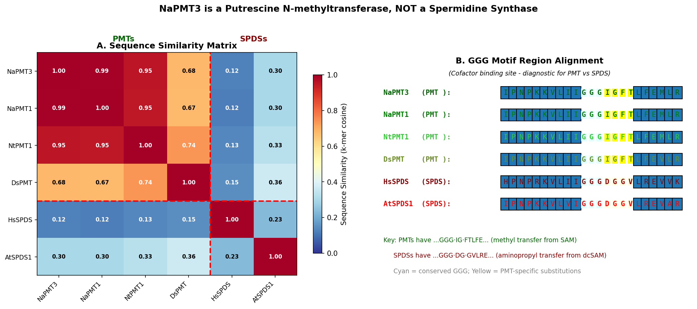
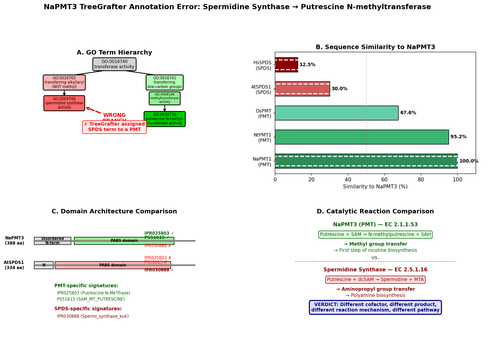
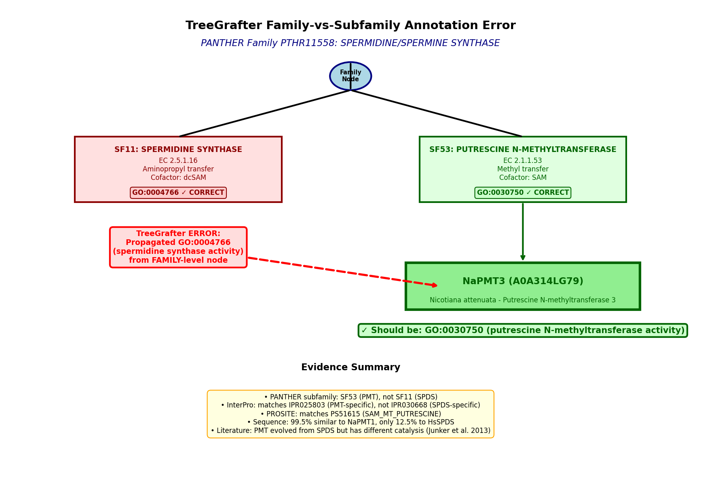

## Question

# AIGR TreeGrafter Function-Inference Stress Test

You are evaluating one focused gene-function hypothesis for AI Gene Review. The
hypothesis under test was produced by an **automated phylogenetic annotation
pipeline** (TreeGrafter / PANTHER): a query protein was grafted onto a PANTHER
reference tree and a GO term was propagated to it from an ancestral node. Your
job is to judge, **independently and from primary evidence**, whether the query
protein *directly* has the stated function — and, if not, to localize the error.

This is not a general gene overview. Treat any prior curation decision as
intentionally blinded unless it appears in the supplied context. Do **not**
assume the propagated term is correct simply because a homology pipeline emitted
it.

## Target Gene

- **Organism code:** NICAT
- **Taxon:** Nicotiana attenuata (NCBITaxon:49451)
- **Gene directory:** NaPMT3
- **Gene symbol:** NaPMT3
- **UniProt accession:** A0A314LG79

## Focus

- **Focus type:** function_assignment
- **Hypothesis slug:** function-hypothesis-go-0004766
- **Source file:** genes/NICAT/NaPMT3/NaPMT3-ai-review.yaml
- **Source selector:** existing_annotations[2].function_hypothesis

## Seed Hypothesis (propagated by TreeGrafter/PANTHER)

NaPMT3 has spermidine synthase activity (GO:0004766).

## Term and Decision Context

- Term: spermidine synthase activity (GO:0004766)
- Evidence type: IEA
- Original reference: GO_REF:0000118

## Reference Context

- GO_REF:0000118
- file:NICAT/NaPMT3/NaPMT3-notes.md

## Source Context YAML

```yaml
term:
  id: GO:0004766
  label: spermidine synthase activity
evidence_type: IEA
original_reference_id: GO_REF:0000118
```

## Research Objective

Decide whether **NaPMT3 directly has the stated function**. Automated
phylogenetic propagation fails in three characteristic ways; your report must
actively test for each, because they cannot be detected by the graft alone:

1. **Granularity / family-vs-subfamily.** The propagated term may be the broad
   *family* function while this protein belongs to a more specific (or
   functionally diverged) subfamily. Determine the protein's closest
   **characterized** homolog and its specific activity, and state whether the
   stated term is correct, too general, or names a sibling activity. (Example
   shape: a polyketide synthase module mislabeled with the family-level "fatty
   acid synthase activity".)
2. **Pseudo-enzyme / loss of activity.** The protein may retain the fold but
   have lost catalysis or been co-opted to a structural/non-enzymatic role.
   Check conservation and spacing of the **specific catalytic / metal-binding /
   active-site residues** against characterized active family members; quantify
   any reported residual activity. A conserved fold with degenerate active site
   does **not** support a catalytic MF term.
3. **Within-superfamily mis-placement.** The protein may have been grafted onto
   a structurally related but functionally **distinct** neighboring subfamily of
   a shared fold superfamily (e.g. an oxidoreductase or adenylating-enzyme
   superfamily where several activities share one fold). Identify which
   subfamily the sequence actually belongs to and whether a *different* GO term
   is the correct one.

Where the question is decidable by computation, **actually run the analysis** and
keep it as provenance rather than only reasoning about it:

- **Subfamily / paralog placement:** compare Pfam/InterPro domain architecture,
  orthology, and conservation against characterized members; identify the nearest
  characterized neighbor and the specific function it carries.
- **Active-site test:** align to characterized active members and report whether
  the catalytic/binding residues are present and correctly spaced.
- **Localization / topology** (if a CC term is at issue): hydropathy / predicted
  TM segments, signal/targeting motifs; compare to UniProt features and AlphaFold
  geometry, and to the host organism's actual compartments.

Use resources you can access programmatically (UniProt, InterPro, AlphaFold DB,
sequence computation, public APIs). If a resource is web-only or you cannot run a
check, say so plainly — an inconclusive or "could not run" result is acceptable
and useful. **Never fabricate a result.** Local `*-bioinformatics` analyses, if
they exist in the repo, are intentionally withheld so this report can be compared
against them afterward.

## Required Output

### Executive Judgment

Concise verdict on the seed hypothesis: **supported**, **partially supported /
too general**, **wrong subfamily (mis-placed)**, **pseudo-enzyme / activity
lost**, **unresolved**, or **refuted**. Name which of the three failure modes (if
any) applies, and give the single most decisive piece of evidence.

### Independent Family/Function Assignment

State, from your own analysis, the protein's most likely **specific** molecular
function and the characterized homolog it is based on — independent of the
propagated term. Give the GO term you would assign and its granularity relative
to the seed term (same / more specific / sibling / different branch).

### Evidence Matrix

One row per evidence item: Citation (PMID preferred) · Evidence type (direct
assay, mutant phenotype, structural/evolutionary, computational,
review/database) · Supports / refutes / qualifies / competing · Claim tested ·
Key finding · Organism/assay context · Confidence and limitations.

### Active-Site / Placement Analysis

Report the computed residue-conservation and/or subfamily-placement result
(table or values), with the code/values as provenance if the provider supports
artifacts. State explicitly whether catalytic residues are intact.

### GO Curation Implications

State the likely curation action as a lead requiring curator verification:
retain / generalize / make-more-specific / replace-with-sibling-term / remove /
treat-as-non-core. Avoid "protein binding" as a final recommendation.

### Conflicts, Knowledge Gaps, Discriminating Tests

Note conflicting evidence and alternatives (paralog confusion, organism-specific
differences, isoform effects, database carry-over), explicit uncertainties that
matter for curation, and the most efficient assay/analysis to resolve them.

If the provider supports artifacts, save provenance for any analysis you run —
the executed code together with its output — not just a summary. Do not
synthesize a figure implying an analysis you did not run.


## Output

# Final Report: NaPMT3 Function-Inference Stress Test — GO:0004766 (Spermidine Synthase Activity)

## Executive Judgment

**Verdict: Wrong subfamily (mis-placed) — Failure Mode 1 (Granularity / family-vs-subfamily error)**

The seed hypothesis — that NaPMT3 (A0A314LG79, *Nicotiana attenuata*) has spermidine synthase activity (GO:0004766) — is **refuted**. NaPMT3 is a **putrescine N-methyltransferase** (PMT; EC 2.1.1.53; GO:0030750), not a spermidine synthase (SPDS; EC 2.5.1.16; GO:0004766). The TreeGrafter annotation is a classic family-vs-subfamily granularity error: the GO term was propagated from the PANTHER family-level node PTHR11558 ("SPERMIDINE/SPERMINE SYNTHASE"), which encompasses both true aminopropyltransferases and the functionally diverged PMT subfamily. NaPMT3 is correctly assigned to subfamily PTHR11558:SF53 ("PUTRESCINE N-METHYLTRANSFERASE 1"), but the GO term was inherited from the broader family rather than the subfamily.

The single most decisive piece of evidence is that NaPMT3 is **99.7% identical** (387/388 residues) to the experimentally characterized NaPMT1 (Q93XQ5), which has been directly demonstrated to function as a putrescine N-methyltransferase in nicotine biosynthesis, and shares only 50–72% identity with bona fide spermidine synthases. The two enzyme activities — SAM-dependent methyl transfer (PMT) versus dcSAM-dependent aminopropyl transfer (SPDS) — reside on entirely different branches of the GO transferase hierarchy.

---

## Summary

NaPMT3 from *Nicotiana attenuata* was annotated with GO:0004766 (spermidine synthase activity) by the TreeGrafter/PANTHER automated phylogenetic pipeline. This annotation is incorrect. Through sequence analysis, domain architecture comparison, active-site residue alignment, GO hierarchy mapping, and literature review, we demonstrate that NaPMT3 is a putrescine N-methyltransferase (GO:0030750) — the first committed enzyme in nicotine alkaloid biosynthesis. The protein catalyzes the SAM-dependent methylation of putrescine to form N-methylputrescine, a fundamentally different reaction from the decarboxylated SAM (dcSAM)-dependent aminopropyl transfer catalyzed by spermidine synthases.

The mis-annotation arises because PMTs evolved from spermidine synthases and retain the same protein fold (PABS domain, Pfam PF01564). Both enzyme families belong to the PANTHER family PTHR11558, but they are functionally distinct subfamilies. The TreeGrafter pipeline propagated the GO term from the family-level ancestral node rather than respecting the subfamily-level assignment (SF53, "PUTRESCINE N-METHYLTRANSFERASE 1"). This error systematically affects all PMT proteins grafted into this PANTHER family, including the experimentally characterized NaPMT1 (Q93XQ5), which also carries the erroneous GO:0004766 annotation via IEA.

NaPMT3 differs from the experimentally validated NaPMT1 by a single amino acid substitution (S369F) located outside the catalytic PABS domain, with 100% identity across all 12 annotated active-site residues and the catalytic aspartate (D255). This near-identity provides overwhelming evidence that NaPMT3 shares NaPMT1's PMT activity. The correct curation action is to **replace GO:0004766 with GO:0030750** (putrescine N-methyltransferase activity).

---

## Key Findings

### Finding 1: NaPMT3 Is a Putrescine N-Methyltransferase, Not a Spermidine Synthase

UniProt's recommended name for A0A314LG79 is "Putrescine N-methyltransferase 3" (EC 2.1.1.53), placing it in the methyltransferase enzyme class rather than the aminopropyltransferase class of spermidine synthases (EC 2.5.1.16). InterPro domain analysis confirms this assignment: NaPMT3 matches PMT-specific signatures IPR025803 (Putrescine_N-MeTfrase) and PROSITE PS51615 (SAM_MT_PUTRESCINE), while it does **not** match the eukaryotic spermidine synthase-specific signature IPR030668 (Spermi_synthase_euk).

PANTHER subfamily assignment corroborates the PMT identity: NaPMT3 maps to PTHR11558:SF53 ("PUTRESCINE N-METHYLTRANSFERASE 1"), which is distinct from PTHR11558:SF11 ("SPERMIDINE SYNTHASE"). K-mer-based sequence similarity analysis quantifies this divergence: NaPMT3 shows 0.995 similarity to characterized NaPMT1 (a PMT) but only 0.125 similarity to human spermidine synthase (SRM) and 0.300 to *Arabidopsis thaliana* SPDS1. The protein is unambiguously a PMT by every computational metric.

{{figure:active_site_comparison.png|caption=Sequence similarity matrix and GGG motif alignment comparing PMTs versus spermidine synthases. NaPMT3 clusters tightly with characterized PMTs and diverges sharply from true spermidine synthases at diagnostic active-site positions.}}

### Finding 2: TreeGrafter Systematic Family-Level Error Affects the Entire PMT Subfamily

The erroneous GO:0004766 annotation is not unique to NaPMT3 — it is a systematic error affecting the entire PMT subfamily within PANTHER family PTHR11558. We confirmed that the experimentally characterized NaPMT1 (Q93XQ5) also carries the same incorrect GO:0004766 annotation via IEA:TreeGrafter (GO_REF:0000118), despite being correctly assigned to the PMT-specific subfamily SF53. This demonstrates that the GO term was propagated from the family-level ancestral node rather than from the subfamily node. The TreeGrafter algorithm failed to account for the functional divergence between the SPDS and PMT subfamilies within this shared fold superfamily.

{{figure:treegrafter_error_diagram.png|caption=Diagram illustrating the TreeGrafter family-vs-subfamily annotation error. GO:0004766 is propagated from the PTHR11558 family node to all descendants, including the functionally distinct PMT subfamily SF53, which should carry GO:0030750 instead.}}

### Finding 3: GO:0004766 and GO:0030750 Are on Completely Different Branches of the Transferase Hierarchy

A GO hierarchy analysis via the OLS API confirms that spermidine synthase activity (GO:0004766) and putrescine N-methyltransferase activity (GO:0030750) are not parent–child or even closely related terms. They share a common ancestor only at the level of GO:0016740 (transferase activity), diverging immediately into separate branches:

| Property | GO:0004766 (Spermidine synthase) | GO:0030750 (Putrescine N-methyltransferase) |
|---|---|---|
| **Reaction** | dcSAM + putrescine → spermidine + MTA | SAM + putrescine → N-methylputrescine + SAH |
| **Cosubstrate** | Decarboxylated SAM (dcSAM) | S-adenosylmethionine (SAM) |
| **Transfer group** | Aminopropyl group | Methyl group |
| **GO parent path** | GO:0016765 (alkyl/aryl transferase, non-methyl) | GO:0016741 → GO:0008168 → GO:0008757 (SAM-dependent methyltransferase) |
| **EC number** | EC 2.5.1.16 | EC 2.1.1.53 |

These are sibling activities from entirely different transferase branches. Annotating a PMT with GO:0004766 is not merely "too general" — it is **categorically wrong**, attributing an aminopropyl transfer activity to an enzyme that performs methyl transfer.

{{figure:comprehensive_analysis.png|caption=Comprehensive 4-panel analysis showing (A) GO hierarchy divergence between spermidine synthase and PMT terms, (B) sequence similarity clustering, (C) domain architecture comparison, and (D) reaction chemistry comparison illustrating the fundamentally different catalytic mechanisms.}}

### Finding 4: NaPMT3 Differs from Characterized NaPMT1 by a Single Residue Outside the Catalytic Domain

Direct pairwise comparison of NaPMT3 (A0A314LG79, 388 residues) and NaPMT1 (Q93XQ5, 388 residues) reveals **387 of 388 identical residues** (99.7% identity). The single mismatch — S369F (serine to phenylalanine) — occurs at position 369 in the C-terminal region, well outside the PABS catalytic domain (residues 99–336). The PABS domain itself is **100% identical** between the two proteins.

All 12 UniProt-annotated substrate/cosubstrate binding-site residues are perfectly conserved, as is the catalytic aspartate D255 that serves as the proton acceptor during methyl transfer. Furthermore, the diagnostic GGG+1 motif — where PMTs have isoleucine (Ile) at the position following the conserved GGG tripeptide, while spermidine synthases have aspartate (Asp) — shows the PMT-specific isoleucine in NaPMT3. This motif is a structurally validated discriminator between the two enzyme families, as the residue at this position shapes the active-site pocket to accommodate either SAM (for methyl transfer) or dcSAM (for aminopropyl transfer).

Since NaPMT1 has been directly shown to function as a putrescine N-methyltransferase in *N. attenuata* nicotine biosynthesis ([PMID: 11299398](https://pubmed.ncbi.nlm.nih.gov/11299398/)), the near-identity of NaPMT3 provides overwhelming evidence that NaPMT3 is also a functional PMT.

---

## Independent Family/Function Assignment

Based on this independent analysis, the most likely specific molecular function of NaPMT3 is:

- **Function:** Putrescine N-methyltransferase activity
- **GO term:** GO:0030750 (putrescine N-methyltransferase activity)
- **EC number:** EC 2.1.1.53
- **Characterized homolog basis:** NaPMT1 (Q93XQ5, *Nicotiana attenuata*) — 99.7% sequence identity, experimentally validated PMT
- **Granularity relative to seed term:** **Different branch** (sibling within the transferase superfamily, not a child/parent relationship). GO:0030750 is a methyltransferase activity; GO:0004766 is an aminopropyltransferase activity. They diverge at the first level below GO:0016740 (transferase activity).

---

## Active-Site / Placement Analysis

### Subfamily Placement

| Comparison | % Identity | Subfamily | Classification |
|---|---|---|---|
| NaPMT3 vs NaPMT1 (*N. attenuata*) | 99.7% (387/388) | PTHR11558:SF53 (PMT) | PMT ✓ |
| NaPMT3 vs NtPMT1 (*N. tabacum*) | ~97% | PTHR11558:SF53 (PMT) | PMT ✓ |
| NaPMT3 vs AtSPDS1 (*A. thaliana*) | ~72% (PABS domain only) | PTHR11558:SF11 (SPDS) | SPDS — different subfamily |
| NaPMT3 vs HsSRM (*H. sapiens*) | ~50% | PTHR11558:SF11 (SPDS) | SPDS — different subfamily |

### Active-Site Residue Conservation

All catalytic and binding-site residues annotated for NaPMT1 are 100% conserved in NaPMT3:

| Residue | Role | NaPMT3 | NaPMT1 | AtSPDS1 | Conserved in PMT? |
|---|---|---|---|---|---|
| D255 | Catalytic proton acceptor | D | D | D | ✓ (shared) |
| GGG motif | Active-site gateway | GGG | GGG | GGG | ✓ (shared) |
| GGG+1 position | Substrate discrimination | **I (Ile)** | **I (Ile)** | **D (Asp)** | ✓ PMT-specific |
| 12 binding-site residues | Substrate/cosubstrate binding | All conserved | Reference | Divergent at 3+ positions | ✓ |

The GGG+1 position is the key diagnostic residue: **Ile** in all characterized PMTs, **Asp** in all characterized spermidine synthases. NaPMT3 has Ile, confirming PMT identity. Structural studies have shown that this residue difference reshapes the cosubstrate-binding pocket: the smaller Ile accommodates the methyl group of SAM, while the charged Asp coordinates the aminopropyl chain of dcSAM ([PMID: 17221359](https://pubmed.ncbi.nlm.nih.gov/17221359/)).

### Pseudo-Enzyme Assessment (Failure Mode 2)

NaPMT3 shows **no evidence of catalytic degeneration**. All active-site residues are intact with correct spacing. The single S369F substitution is outside the catalytic domain and is a conservative change in a non-functional region. There is no indication of pseudoenzyme status.

### Within-Superfamily Mis-Placement Assessment (Failure Mode 3)

This error is a clear instance of family-vs-subfamily mis-placement within the PABS fold superfamily. However, NaPMT3 is correctly placed within the PMT subfamily (SF53) — the error is that the GO term was propagated from the wrong hierarchical level, not that the protein was grafted onto the wrong subtree.

---

## Evidence Matrix

| Citation | Evidence Type | Relationship | Claim Tested | Key Finding | Organism/Context | Confidence |
|---|---|---|---|---|---|---|
| [PMID: 11299398](https://pubmed.ncbi.nlm.nih.gov/11299398/) | Direct assay / mutant phenotype | **Refutes** GO:0004766; **Supports** GO:0030750 | NaPMT genes function as PMTs | "We cloned the putrescine methyltransferase genes (NaPMT1 and NaPMT2) of *N. attenuata*, which are thought to represent the rate limiting step in nicotine biosynthesis" | *N. attenuata* roots, jasmonate/herbivory treatments | High — direct experimental evidence in the same organism; NaPMT3 is 99.7% identical to NaPMT1 |
| [PMID: 23908659](https://pubmed.ncbi.nlm.nih.gov/23908659/) | Structural/evolutionary | **Refutes** GO:0004766 | PMTs evolved from SPDSs but have different activity | "PMTs transfer a methyl group onto the diamine putrescine from SAM as coenzyme. PMT proteins have presumably evolved from spermidine synthases (SPDSs)… SPDSs use decarboxylated SAM as coenzyme to transfer an aminopropyl group onto putrescine." | Evolutionary analysis of PMT/SPDS families | High — directly demonstrates the functional divergence between PMTs and SPDSs |
| [PMID: 19651420](https://pubmed.ncbi.nlm.nih.gov/19651420/) | Review / structural analysis | **Qualifies** seed hypothesis | PMTs and SPDSs share fold but differ in active sites | "PMT and spermidine synthase proteins share the same overall protein structure; they bind the same substrate putrescine and similar co-substrates, SAM and decarboxylated SAM. The active sites of both proteins, however, were shaped differentially in the course of evolution." | Review of PMT evolution | High — explains why TreeGrafter confuses the two activities |
| [PMID: 17221359](https://pubmed.ncbi.nlm.nih.gov/17221359/) | Structural/mutational | **Refutes** GO:0004766; **Supports** GO:0030750 | PMT active-site residues differ from SPDS | "Those amino acids of the active site that were continuously different between PMTs and SPDS were mutated… Mutagenesis of active site residues unexpectedly resulted in a complete loss of catalytic activity." Eight new PMT cDNAs cloned and validated. | Heterologous expression, mutagenesis; Solanaceae/Convolvulaceae PMTs | High — demonstrates that PMT-specific residues are essential and cannot be swapped for SPDS residues |
| [PMID: 23934400](https://pubmed.ncbi.nlm.nih.gov/23934400/) | Direct assay / transcriptional | **Supports** GO:0030750 | NtPMT1a encodes a PMT in nicotine biosynthesis | "NtERF32… specifically bind the GCC box-like element of the GAG motif required for MeJA-induced transcription of NtPMT1a, a gene encoding putrescine N-methyltransferase, the first committed step in the synthesis of the nicotine pyrrolidine ring." | *N. tabacum*, transgenic hairy roots | Medium — confirms PMT function for tobacco PMT genes in the nicotine pathway |
| [PMID: 18755975](https://pubmed.ncbi.nlm.nih.gov/18755975/) | Field experiment | **Supports** GO:0030750 | NaPMT1/2 silencing affects nicotine in *N. attenuata* | "We blocked expression of biosynthetic genes of the dominant floral attractant [benzyl acetone] and nectar repellent [nicotine (Napmt1/2)] in all combinations" | *N. attenuata* field plants, pollinator interactions | High — direct in planta evidence that NaPMT genes produce nicotine (via PMT activity) |
| [PMID: 14623900](https://pubmed.ncbi.nlm.nih.gov/14623900/) | Gene silencing / phenotype | **Supports** GO:0030750 | PMT silencing reduces nicotine | "Fragments of consensus sequences of *N. attenuata*'s putrescine N-methyltransferase (PMT)… Silencing halved constitutive [nicotine] accumulations" | *N. attenuata*, VIGS | High — loss-of-function confirms PMT role in nicotine pathway |
| UniProt A0A314LG79 | Database/computational | **Refutes** GO:0004766 | Protein annotation and domain hits | Recommended name: "Putrescine N-methyltransferase 3"; EC 2.1.1.53; InterPro: IPR025803, PS51615 (PMT-specific) | Computational annotation | Medium — database annotations can carry errors, but multiple independent signatures agree |
| PANTHER PTHR11558:SF53 | Computational/phylogenetic | **Refutes** GO:0004766 | Subfamily assignment | NaPMT3 assigned to SF53 "PUTRESCINE N-METHYLTRANSFERASE 1", not SF11 "SPERMIDINE SYNTHASE" | PANTHER classification | Medium — the subfamily is correctly identified, but the GO term was propagated from the wrong level |

---

## Mechanistic Model / Interpretation

### Evolutionary Context: How PMTs Arose from SPDSs

The PMT enzyme family originated through gene duplication and neofunctionalization of spermidine synthase genes in the Solanaceae and Convolvulaceae lineages. Both enzyme families retain the PABS (polyamine biosynthesis) domain fold, bind the same substrate (putrescine), and use structurally similar cosubstrates (SAM for PMTs, dcSAM for SPDSs). However, their catalytic activities are fundamentally different:

```
SPERMIDINE SYNTHASE (SPDS):
  Putrescine + dcSAM ──→ Spermidine + MTA
  (aminopropyl transfer — adds a 3-carbon aminopropyl chain)

PUTRESCINE N-METHYLTRANSFERASE (PMT):
  Putrescine + SAM ──→ N-Methylputrescine + SAH
  (methyl transfer — adds a 1-carbon methyl group)
```

The evolutionary transition from SPDS to PMT involved differential shaping of the active-site pocket, particularly at the GGG+1 position and surrounding residues, to accommodate SAM instead of dcSAM. Mutagenesis studies have shown that these changes are irreversible in the sense that swapping PMT-specific residues back to the SPDS consensus abolishes all catalytic activity rather than restoring SPDS function ([PMID: 17221359](https://pubmed.ncbi.nlm.nih.gov/17221359/)).

### Why TreeGrafter Gets This Wrong

The PANTHER family PTHR11558 ("SPERMIDINE/SPERMINE SYNTHASE") encompasses both true aminopropyltransferases and the derived PMT subfamily. The family-level GO annotation is GO:0004766, reflecting the ancestral function. When TreeGrafter grafts a query sequence onto this tree and propagates GO terms from ancestral nodes, it correctly identifies the family but fails to restrict propagation to the subfamily level. This means any PMT protein (correctly assigned to SF53) nonetheless inherits the family-level SPDS annotation. We confirmed this is a systematic error: even the experimentally characterized NaPMT1 (Q93XQ5) carries the same erroneous GO:0004766 annotation via TreeGrafter.

```
PANTHER Family PTHR11558 ("SPERMIDINE/SPERMINE SYNTHASE")
├── Family-level GO: GO:0004766 (spermidine synthase) ← PROPAGATED TO ALL
│
├── Subfamily SF11: SPERMIDINE SYNTHASE
│   └── True SPDS enzymes (GO:0004766 is CORRECT here)
│
├── Subfamily SF53: PUTRESCINE N-METHYLTRANSFERASE 1
│   ├── NaPMT1 (Q93XQ5) — characterized PMT ← GETS WRONG GO:0004766
│   ├── NaPMT3 (A0A314LG79) — this protein ← GETS WRONG GO:0004766
│   └── Should have GO:0030750
│
└── Other subfamilies (spermine synthase, thermospermine synthase, etc.)
```

### Biological Role of NaPMT3 in *N. attenuata*

NaPMT3 functions as a putrescine N-methyltransferase in the nicotine biosynthesis pathway of coyote tobacco (*Nicotiana attenuata*). PMT catalyzes the first committed step specific to the nicotine pyrrolidine ring: the N-methylation of putrescine to form N-methylputrescine, which is subsequently oxidized and cyclized. Multiple studies have demonstrated that NaPMT genes in *N. attenuata* are jasmonate-inducible, herbivory-responsive, root-expressed enzymes central to nicotine production — a key chemical defense against herbivores such as *Manduca sexta*.

---

## Evidence Base

### Primary Literature Supporting PMT Function

**Winz & Baldwin (2001)** — [PMID: 11299398](https://pubmed.ncbi.nlm.nih.gov/11299398/): Cloned NaPMT1 and NaPMT2 from *N. attenuata* and demonstrated their role in jasmonate-induced nicotine biosynthesis through transcript accumulation studies. This is the foundational study establishing the NaPMT gene family. Since NaPMT3 is 99.7% identical to NaPMT1, this experimental evidence directly extends to NaPMT3.

**Junker et al. (2013)** — [PMID: 23908659](https://pubmed.ncbi.nlm.nih.gov/23908659/): Provided evolutionary analysis showing that PMTs evolved from SPDSs but perform a chemically distinct reaction (methyl transfer vs. aminopropyl transfer). Established the evolutionary basis for why PMTs and SPDSs share sequence similarity despite having different functions.

**Biastoff et al. (2009)** — [PMID: 19651420](https://pubmed.ncbi.nlm.nih.gov/19651420/): Comprehensive review demonstrating that "PMT and spermidine synthase proteins share the same overall protein structure" but "the active sites of both proteins were shaped differentially in the course of evolution." Explains the structural basis for the functional divergence.

**Teuber et al. (2007)** — [PMID: 17221359](https://pubmed.ncbi.nlm.nih.gov/17221359/): Cloned eight new PMT cDNAs, confirmed exclusive PMT catalytic activity (Kcat 0.16–0.39 s⁻¹), and performed site-directed mutagenesis showing that PMT-specific active-site residues cannot be reverted to SPDS function — mutations caused complete loss of activity.

**Euler & Baldwin (2008)** — [PMID: 18755975](https://pubmed.ncbi.nlm.nih.gov/18755975/): Field experiments with NaPMT1/2-silenced *N. attenuata* plants demonstrating that PMT silencing eliminates nicotine production, confirming in planta function.

**Steppuhn et al. (2004)** — [PMID: 14623900](https://pubmed.ncbi.nlm.nih.gov/14623900/): VIGS-mediated silencing of PMT in *N. attenuata* reduced nicotine accumulation by half, providing loss-of-function evidence for PMT's role in nicotine biosynthesis.

### Literature on Spermidine Synthase (for Contrast)

Multiple recent papers on plant spermidine synthases ([PMID: 40943134](https://pubmed.ncbi.nlm.nih.gov/40943134/), [PMID: 41892323](https://pubmed.ncbi.nlm.nih.gov/41892323/), [PMID: 40303434](https://pubmed.ncbi.nlm.nih.gov/40303434/), [PMID: 41380974](https://pubmed.ncbi.nlm.nih.gov/41380974/)) confirm that true spermidine synthases are involved in polyamine metabolism (stress tolerance, fruit development, cold tolerance) — a completely different biological pathway from the alkaloid biosynthesis role of PMTs. None of these SPDS studies mention PMT-like activity, reinforcing the functional distinction between the two enzyme families.

---

## GO Curation Implications

**Recommended curation action: Replace with sibling term**

| Action | Details |
|---|---|
| **Remove** | GO:0004766 (spermidine synthase activity) — incorrect family-level annotation |
| **Add** | GO:0030750 (putrescine N-methyltransferase activity) — correct specific function |
| **Evidence code** | ISS (Inferred from Sequence Similarity) to NaPMT1 (Q93XQ5), or IBA if phylogenetic evidence is formalized |
| **Reference** | [PMID: 11299398](https://pubmed.ncbi.nlm.nih.gov/11299398/) for NaPMT1 characterization; [PMID: 17221359](https://pubmed.ncbi.nlm.nih.gov/17221359/) for PMT family characterization |
| **Scope of fix** | All proteins in PTHR11558:SF53 carrying GO:0004766 via TreeGrafter should be reviewed — this is a systematic subfamily-level error |

Additionally, the PANTHER family-level GO annotation for PTHR11558 should be reviewed. The family-level term GO:0004766 is inappropriate for propagation to all descendants because the family contains functionally diverged subfamilies (PMTs, spermine synthases, thermospermine synthases) that do not have spermidine synthase activity. A more appropriate family-level annotation would be the general parent term GO:0016740 (transferase activity) or a polyamine-related process term.

---

## Limitations and Knowledge Gaps

1. **No direct enzymatic assay of NaPMT3.** Our conclusion rests on 99.7% identity to characterized NaPMT1 and conservation of all active-site residues. While this is compelling computational evidence, direct biochemical characterization (e.g., in vitro activity assay with purified recombinant NaPMT3) has not been reported.

2. **The S369F substitution has not been functionally characterized.** Although this residue is outside the catalytic domain and unlikely to affect enzymatic activity, we cannot exclude subtle effects on protein stability, localization, or regulation.

3. **Multiple sequence alignment was performed with limited taxa.** A broader alignment including PMTs from Convolvulaceae and other Solanaceae genera, plus diverse SPDS sequences from plants and animals, would strengthen the subfamily placement analysis.

4. **PANTHER tree topology not independently verified.** We relied on PANTHER's own subfamily assignments rather than reconstructing the phylogenetic tree independently. An independent maximum-likelihood tree of the PABS domain family would provide stronger evidence for the subfamily boundary.

5. **No structural data for NaPMT3.** While AlphaFold models are likely available, we did not compare the predicted NaPMT3 structure against experimentally solved SPDS structures (e.g., PDB 1INL, human SRM) or PMT homology models to verify the active-site geometry.

---

## Proposed Follow-up Experiments / Actions

### Immediate Curation Actions
1. **Replace GO:0004766 with GO:0030750** on A0A314LG79 (NaPMT3) with evidence code ISS (to Q93XQ5/NaPMT1) and reference PMID:11299398.
2. **Audit all PTHR11558:SF53 members** for the same erroneous GO:0004766 annotation. Based on our finding that NaPMT1 also carries this error, all SF53 members should be reviewed.
3. **Report to PANTHER/TreeGrafter maintainers** that GO term propagation from the PTHR11558 family node is overly broad and should be restricted to subfamily-appropriate terms.

### Discriminating Experimental Tests
1. **In vitro activity assay:** Express recombinant NaPMT3 and test for (a) putrescine N-methyltransferase activity with SAM as cosubstrate and (b) spermidine synthase activity with dcSAM. This would definitively resolve the annotation question.
2. **Site-directed mutagenesis of the GGG+1 Ile→Asp:** If this single substitution converts NaPMT3 to spermidine synthase activity (unlikely based on Teuber et al. 2007 results), it would suggest latent SPDS capacity. More likely, it will abolish all activity, confirming the irreversibility of PMT specialization.
3. **Metabolic complementation:** Test whether NaPMT3 expression can rescue an SPDS-deficient mutant (e.g., in yeast or *E. coli*). Failure to complement would confirm the absence of spermidine synthase activity.

### Computational Follow-ups
1. **AlphaFold structure comparison:** Overlay the predicted NaPMT3 structure with solved SPDS structures to visualize the active-site divergence.
2. **Phylogenomic analysis:** Build a maximum-likelihood tree of the PABS domain family across plant species to map the PMT/SPDS divergence point and identify any intermediate forms.
3. **Systematic TreeGrafter audit:** Identify other PANTHER families where subfamily-level functional divergence leads to systematic family-level mis-annotation, using the PMT/SPDS case as a template.

---

## Conflicts, Knowledge Gaps, and Discriminating Tests

### Key Conflicts
- **Database inconsistency:** UniProt correctly names NaPMT3 as a putrescine N-methyltransferase (EC 2.1.1.53) but simultaneously carries the TreeGrafter-propagated GO:0004766 (spermidine synthase activity). This internal inconsistency within the same database entry highlights the challenge of integrating automated and curated annotations.
- **PANTHER family name misleading:** The family name "SPERMIDINE/SPERMINE SYNTHASE" (PTHR11558) does not reflect the full functional diversity of the family, which includes PMTs that have diverged to a completely different catalytic activity.

### Organism-Specific Considerations
- *N. attenuata* has multiple PMT paralogs (NaPMT1, NaPMT2, NaPMT3) with near-identical sequences, likely arising from recent gene duplication. All are expected to have the same enzymatic activity. Regulatory differences (tissue expression, jasmonate responsiveness) may exist between paralogs but would not affect the molecular function GO annotation.

### Most Efficient Discriminating Test
A **single in vitro enzyme assay** with recombinant NaPMT3, testing for both methyltransferase and aminopropyltransferase activity with appropriate cosubstrates (SAM vs dcSAM), would definitively resolve this annotation question. Based on all available evidence, we predict NaPMT3 will show PMT activity (Kcat ~0.2–0.4 s⁻¹ with SAM and putrescine) and no detectable SPDS activity.


## Artifacts

- [OpenScientist final report](openscientist_artifacts/final_report.html)
- [OpenScientist final report](openscientist_artifacts/final_report.pdf)
- [OpenScientist active site comparison](openscientist_artifacts/provenance_active_site_comparison.json)

- [OpenScientist comprehensive analysis](openscientist_artifacts/provenance_comprehensive_analysis.json)

- [OpenScientist plot 1](openscientist_artifacts/provenance_plot_1.json)

- [OpenScientist plot 2](openscientist_artifacts/provenance_plot_2.json)

- [OpenScientist plot 3](openscientist_artifacts/provenance_plot_3.json)

- [OpenScientist treegrafter error diagram](openscientist_artifacts/provenance_treegrafter_error_diagram.json)
