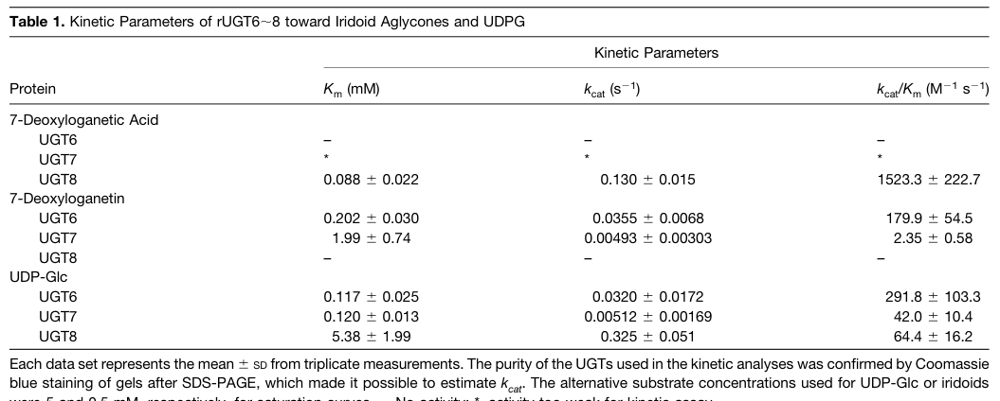

## Question

# Gene Research for Functional Annotation

## ⚠️ CRITICAL: Gene/Protein Identification Context

**BEFORE YOU BEGIN RESEARCH:** You MUST verify you are researching the CORRECT gene/protein. Gene symbols can be ambiguous, especially for less well-characterized genes from non-model organisms.

### Target Gene/Protein Identity (from UniProt):
- **UniProt Accession:** A0A2H4GSI3
- **Protein Description:** RecName: Full=7-deoxyloganetic acid glucosyltransferase {ECO:0000256|ARBA:ARBA00066941}; EC=2.4.1.323 {ECO:0000256|ARBA:ARBA00066941};
- **Gene Information:** Name=UGT85A2_0 {ECO:0000313|EMBL:OIT31852.1}; ORFNames=A4A49_26396 {ECO:0000313|EMBL:OIT31852.1}, NaUGT_g26396 {ECO:0000313|EMBL:AQQ16684.1};
- **Organism (full):** Nicotiana attenuata (Coyote tobacco).
- **Protein Family:** Belongs to the UDP-glycosyltransferase family.
- **Key Domains:** UDP_glucos_trans. (IPR002213); UDPGT (PF00201)

### MANDATORY VERIFICATION STEPS:

1. **Check if the gene symbol "UGT85A2_0" matches the protein description above**
2. **Verify the organism is correct:** Nicotiana attenuata (Coyote tobacco).
3. **Check if protein family/domains align with what you find in literature**
4. **If you find literature for a DIFFERENT gene with the same or similar symbol, STOP**

### If Gene Symbol is Ambiguous or You Cannot Find Relevant Literature:

**DO NOT PROCEED WITH RESEARCH ON A DIFFERENT GENE.** Instead:
- State clearly: "The gene symbol 'UGT85A2_0' is ambiguous or literature is limited for this specific protein"
- Explain what you found (e.g., "Found extensive literature on a different gene with the same symbol in a different organism")
- Describe the protein based ONLY on the UniProt information provided above
- Suggest that the protein function can be inferred from domain/family information

### Research Target:

Please provide a comprehensive research report on the gene **UGT85A2_0** (gene ID: NaUGT1_candidate_UGT85A2_0, UniProt: A0A2H4GSI3) in NICAT.

The research report should be a detailed narrative explaining the function, biological processes, and localization of the gene product. Citations should be given for all claims.

You should prioritize authoritative reviews and primary scientific literature when conducting research. You can supplement
this with annotations you find in gene/protein databases, but these can be outdated or inaccurate.

We are specifically interested in the primary function of the gene - for enzymes, what reaction is catalyzed, and what is the substrate specificity? For transporters, what is the substrate? For structural proteins or adapters, what is the broader structural role? For signaling molecules, what is the role in the pathway.

We are interested in where in or outside the cell the gene product carries out its function.

We are also interested in the signaling or biochemical pathways in which the gene functions. We are less interested in broad pleiotropic effects, except where these elucidate the precise role.

Include evidence where possible. We are interested in both experimental evidence as well as inference from structure, evolution, or bioinformatic analysis. Precise studies should be prioritized over high-throughput, where available.

## Output

Question: You are an expert researcher providing comprehensive, well-cited information.

Provide detailed information focusing on:
1. Key concepts and definitions with current understanding
2. Recent developments and latest research (prioritize 2023-2024 sources)
3. Current applications and real-world implementations
4. Expert opinions and analysis from authoritative sources
5. Relevant statistics and data from recent studies

Format as a comprehensive research report with proper citations. Include URLs and publication dates where available.
Always prioritize recent, authoritative sources and provide specific citations for all major claims.

# Gene Research for Functional Annotation

## ⚠️ CRITICAL: Gene/Protein Identification Context

**BEFORE YOU BEGIN RESEARCH:** You MUST verify you are researching the CORRECT gene/protein. Gene symbols can be ambiguous, especially for less well-characterized genes from non-model organisms.

### Target Gene/Protein Identity (from UniProt):
- **UniProt Accession:** A0A2H4GSI3
- **Protein Description:** RecName: Full=7-deoxyloganetic acid glucosyltransferase {ECO:0000256|ARBA:ARBA00066941}; EC=2.4.1.323 {ECO:0000256|ARBA:ARBA00066941};
- **Gene Information:** Name=UGT85A2_0 {ECO:0000313|EMBL:OIT31852.1}; ORFNames=A4A49_26396 {ECO:0000313|EMBL:OIT31852.1}, NaUGT_g26396 {ECO:0000313|EMBL:AQQ16684.1};
- **Organism (full):** Nicotiana attenuata (Coyote tobacco).
- **Protein Family:** Belongs to the UDP-glycosyltransferase family.
- **Key Domains:** UDP_glucos_trans. (IPR002213); UDPGT (PF00201)

### MANDATORY VERIFICATION STEPS:

1. **Check if the gene symbol "UGT85A2_0" matches the protein description above**
2. **Verify the organism is correct:** Nicotiana attenuata (Coyote tobacco).
3. **Check if protein family/domains align with what you find in literature**
4. **If you find literature for a DIFFERENT gene with the same or similar symbol, STOP**

### If Gene Symbol is Ambiguous or You Cannot Find Relevant Literature:

**DO NOT PROCEED WITH RESEARCH ON A DIFFERENT GENE.** Instead:
- State clearly: "The gene symbol 'UGT85A2_0' is ambiguous or literature is limited for this specific protein"
- Explain what you found (e.g., "Found extensive literature on a different gene with the same symbol in a different organism")
- Describe the protein based ONLY on the UniProt information provided above
- Suggest that the protein function can be inferred from domain/family information

### Research Target:

Please provide a comprehensive research report on the gene **UGT85A2_0** (gene ID: NaUGT1_candidate_UGT85A2_0, UniProt: A0A2H4GSI3) in NICAT.

The research report should be a detailed narrative explaining the function, biological processes, and localization of the gene product. Citations should be given for all claims.

You should prioritize authoritative reviews and primary scientific literature when conducting research. You can supplement
this with annotations you find in gene/protein databases, but these can be outdated or inaccurate.

We are specifically interested in the primary function of the gene - for enzymes, what reaction is catalyzed, and what is the substrate specificity? For transporters, what is the substrate? For structural proteins or adapters, what is the broader structural role? For signaling molecules, what is the role in the pathway.

We are interested in where in or outside the cell the gene product carries out its function.

We are also interested in the signaling or biochemical pathways in which the gene functions. We are less interested in broad pleiotropic effects, except where these elucidate the precise role.

Include evidence where possible. We are interested in both experimental evidence as well as inference from structure, evolution, or bioinformatic analysis. Precise studies should be prioritized over high-throughput, where available.

## Comprehensive research report: *Nicotiana attenuata* UGT85A2_0 (UniProt A0A2H4GSI3)

### Executive summary (identity-verified)
The gene/protein requested—**UGT85A2_0** (ORF names **A4A49_26396 / NaUGT_g26396**), **UniProt accession A0A2H4GSI3**—is annotated (per UniProt information provided in the prompt) as a **family-1 UDP-dependent glycosyltransferase (UGT; PF00201/IPR002213)** with the **recommended name “7-deoxyloganetic acid glucosyltransferase” (EC 2.4.1.323)** in **Nicotiana attenuata**. However, in the literature retrieved and examined here, **no primary paper explicitly mentions this *N. attenuata* protein by accession or gene identifier**, and therefore **no direct experimental evidence (substrate specificity, kinetics, in planta phenotype, or subcellular localization) could be attributed to A0A2H4GSI3 itself**.

Accordingly, the most defensible functional annotation approach is:
1) **Keep the target identity fixed** to UniProt A0A2H4GSI3 (*N. attenuata*) and **avoid symbol confusion** with “UGT85A2” genes from other taxa.
2) **Infer likely function** only from: (i) UniProt’s enzyme assignment to **7-deoxyloganetic acid glucosyltransferase**, and (ii) **high-quality experimental reference evidence** from the **best-characterized 7DLGT** in plants—**Catharanthus roseus UGT8 (CrUGT8)**—which catalyzes the same reaction step in **secologanin (iridoid) biosynthesis** and has been validated biochemically and genetically.

A key outcome is that **the best current evidence base for “7DLGT” activity and biological role comes from *Catharanthus roseus* UGT8**, not from *N. attenuata* A0A2H4GSI3 (asada2013a7deoxyloganeticacid pages 2-4, asada2013a7deoxyloganeticacid pages 6-7).

### 1. Key concepts and definitions (current understanding)

#### 1.1 UDP-glycosyltransferases (UGTs; family 1)
Plant “family-1” UGTs are soluble enzymes that typically **transfer a sugar moiety (commonly glucose from UDP-glucose) onto small-molecule acceptors**, producing glycosides that can alter solubility, stability, transport, and bioactivity of specialized metabolites. The UGTs discussed here belong to the broad family that includes enzymes acting on **iridoids** and other specialized metabolites (song2018attractivebuttoxic pages 10-10).

#### 1.2 7-deoxyloganetic acid glucosyltransferase (7DLGT; EC 2.4.1.323)
**7DLGT** denotes an enzyme that **glucosylates 7-deoxyloganetic acid**, producing the corresponding glucoside **7-deoxyloganic acid** as an intermediate in iridoid-derived pathways (asada2013a7deoxyloganeticacid pages 2-4, salim2023advancesinmetabolic pages 2-4). In the canonical secologanin pathway described for *Catharanthus roseus*, this glucosylation step occurs after formation of 7-deoxyloganetic acid and before hydroxylation/methylation steps leading toward **loganin** and **secologanin** (asada2013a7deoxyloganeticacid pages 1-2, salim2023advancesinmetabolic pages 2-4).

#### 1.3 Secologanin and iridoid/secoiridoid pathways
Iridoids are a large class of plant specialized metabolites. **Secologanin** is an iridoid-derived monoterpene that serves as a key building block in biosynthesis of **monoterpene indole alkaloids (MIAs)**, a family described as containing **>3000 compounds** (review statement) (salim2023advancesinmetabolic pages 2-4). In *Catharanthus roseus*, secologanin biosynthesis is multi-step and **spatially compartmentalized among cell types** (see below) (salim2023advancesinmetabolic pages 2-4).

### 2. Target gene/protein: what can be stated with evidence

#### 2.1 Verified identity constraints and ambiguity control
- Target is **UniProt A0A2H4GSI3**, gene name **UGT85A2_0**, organism **Nicotiana attenuata** (as provided in the prompt).
- Despite extensive searching in the retrieved literature set, **no publication was found that directly references A0A2H4GSI3 / NaUGT_g26396 / A4A49_26396**.
- Therefore, **all “functional” claims about the *N. attenuata* protein are necessarily inference** from annotation and from characterized homologous activities in other plants.

#### 2.2 Primary functional hypothesis (inference + reference evidence)
The UniProt assignment (from the prompt) proposes that *N. attenuata* UGT85A2_0 catalyzes:

**UDP-glucose + 7-deoxyloganetic acid → UDP + 7-deoxyloganic acid**

This reaction is strongly supported as biologically meaningful and chemically plausible because it matches the experimentally validated activity of *Catharanthus roseus* **UGT8**, which is explicitly identified as a **7-deoxyloganetic acid glucosyltransferase (7DLGT)** in secologanin biosynthesis (asada2013a7deoxyloganeticacid pages 1-2, asada2013a7deoxyloganeticacid pages 2-4).

### 3. Best available experimental evidence for 7DLGT function (authoritative primary study)

Because direct evidence for the *N. attenuata* protein is absent in the retrieved set, the strongest functional grounding comes from **Asada et al., The Plant Cell (Oct 2013)**, which cloned and characterized three iridoid UGTs (UGT6/UGT7/UGT8) in *Catharanthus roseus* and identified **UGT8 as 7DLGT** (https://doi.org/10.1105/tpc.113.115154; published Oct 2013) (asada2013a7deoxyloganeticacid pages 1-2).

#### 3.1 Reaction catalyzed and substrate specificity
Asada et al. report recombinant **UGT8 converts 7-deoxyloganetic acid to 7-deoxyloganic acid**, and notably **UGT8 showed strict specificity**—it “only used deoxyloganetic acid as a substrate” in their tested set (asada2013a7deoxyloganeticacid pages 6-7, asada2013a7deoxyloganeticacid pages 2-4).

#### 3.2 Enzyme kinetics (quantitative statistics)
Kinetic parameters (acceptor = 7-deoxyloganetic acid) reported for CrUGT8 include:
- **Km = 0.088 ± 0.022 mM**
- **kcat = 0.130 ± 0.015 s⁻¹**
- **kcat/Km ≈ 1523 ± 223 M⁻¹ s⁻¹**
(asada2013a7deoxyloganeticacid pages 2-4)

They also report **no detectable activity on 7-deoxyloganetin** (asada2013a7deoxyloganeticacid pages 2-4). This combination of strict specificity and comparatively high catalytic efficiency is a key argument that UGT8 is the physiologically relevant 7DLGT in periwinkle (asada2013a7deoxyloganeticacid pages 6-7).

A cropped image of the original kinetics table and pathway/assay figures was retrieved from Asada et al. (Table 1; Figure 1/2) (asada2013a7deoxyloganeticacid media c9691a79, asada2013a7deoxyloganeticacid media 0a283440, asada2013a7deoxyloganeticacid media 35283c90).

#### 3.3 In planta functional genetics (VIGS)
Asada et al. used **virus-induced gene silencing (VIGS)** to test pathway function. Silencing of UGT8 reduced UGT8 transcript levels by approximately **~70–80%** and was associated with a **>50% decline in secologanin** and decreases in downstream MIAs (asada2013a7deoxyloganeticacid pages 6-7, asada2013a7deoxyloganeticacid pages 7-9).

#### 3.4 Cell-type expression / tissue localization (biological “where”)
Asada et al. provide cell-type specificity evidence:
- UGT8 expression is **preferentially expressed in leaves** and is **much less abundant in epidermis** than whole leaves (carborundum abrasion method) (asada2013a7deoxyloganeticacid pages 4-6, asada2013a7deoxyloganeticacid pages 1-2).
- In situ hybridization places UGT8 transcripts preferentially in **internal phloem-associated parenchyma (IPAP) cells** (asada2013a7deoxyloganeticacid pages 4-6, asada2013a7deoxyloganeticacid pages 1-2).

This is important because it ties 7DLGT activity to a broader model of **multicellular compartmentation** of iridoid and MIA biosynthesis.

### 4. Recent developments (prioritizing 2023–2024) and current understanding updates

#### 4.1 2023 expert synthesis: pathway order and compartmentation
A 2023 review focused on metabolic engineering of MIAs summarizes the iridoid branch as:
- **IO** produces **7-deoxyloganetic acid** from nepetalactol;
- **7DLGT** glucosylates it to **7-deoxyloganic acid**;
- **7DLH** hydroxylates to **loganic acid**;
- **LAMT** methylates to **loganin**;
- **SLS** yields **secologanin**
(https://doi.org/10.3390/biology12081056; published Jul 2023) (salim2023advancesinmetabolic pages 2-4).

The same review emphasizes that the pathway is distributed across cell types in *Catharanthus roseus*, stating that assembly of loganic acid from GPP occurs in **IPAP mesophyll cells**, and later steps and condensation to strictosidine occur after transport to the **leaf epidermis** (salim2023advancesinmetabolic pages 2-4). It further highlights multi-organelle localization (plastids/cytosol/ER/vacuole/nucleus) that creates trafficking constraints for heterologous reconstruction (salim2023advancesinmetabolic pages 2-4).

#### 4.2 2024 plant-omics papers: pathway gene annotations rather than new 7DLGT biochemistry
Recent 2024 transcriptome/metabolome work in *Ligustrum lucidum* fruit development discusses secoiridoid-rich metabolism and references related iridoid/secoiridoid pathway steps, but does not provide new direct enzymology for 7DLGT; it focuses on candidate genes and downstream secoiridoid diversification routes in that system (https://doi.org/10.1186/s12870-024-05096-3; published Jun 2024) (zhou2024transcriptomeandmetabolome pages 1-2). These studies indicate ongoing expansion of candidate UGT catalogs for iridoid/secoiridoid tailoring, but they do not resolve the *N. attenuata* target’s specific activity.

### 5. Current applications and real-world implementations

#### 5.1 Metabolic engineering / synthetic biology of iridoid-derived pathways
The 2023 review frames the practical motivation: MIAs have medical value but low abundance in plants, motivating **heterologous reconstruction in microbes and plants**; secologanin supply is a bottleneck for strictosidine-derived pathways (salim2023advancesinmetabolic pages 2-4). In this context, a functional 7DLGT is a required enzymatic module for moving from 7-deoxyloganetic acid to glycosylated iridoid intermediates (salim2023advancesinmetabolic pages 2-4).

#### 5.2 Nicotiana as expression host vs *N. attenuata* as native pathway organism
Some pathway work uses **Nicotiana benthamiana** transient expression as a chassis for specialized metabolism (e.g., glucosyltransferase pathway assays in unrelated systems) (diretto2019ugt709g1anovel pages 8-9). However, this does not provide direct evidence that *N. attenuata* UGT85A2_0 performs 7DLGT activity in its native physiological context.

### 6. Expert analysis: what is most likely true about *N. attenuata* UGT85A2_0, and what remains unknown

#### 6.1 Most defensible functional statement
Given (i) UniProt annotation in the prompt (7DLGT; EC 2.4.1.323; family-1 UGT domains), and (ii) strong precedent that a dedicated 7DLGT exists and can be highly substrate-specific (CrUGT8) with measurable kinetics and strong pathway phenotypes (asada2013a7deoxyloganeticacid pages 2-4, asada2013a7deoxyloganeticacid pages 6-7), the **most defensible functional hypothesis** for A0A2H4GSI3 is:
- It encodes a **cytosolic family-1 UGT** that **can glucosylate an iridoid-related acid substrate**, plausibly **7-deoxyloganetic acid**, producing **7-deoxyloganic acid**, potentially feeding into an iridoid/secoiridoid-like branch if such metabolites exist/are induced in *N. attenuata*.

Crucially, this remains **hypothesis**, not a validated functional assignment for this species/protein.

#### 6.2 Substrate specificity expectations
Reference evidence shows that a bona fide 7DLGT can be **highly selective** (UGT8 exclusive preference for 7-deoxyloganetic acid; no activity on 7-deoxyloganetin) (asada2013a7deoxyloganeticacid pages 2-4). Thus, if A0A2H4GSI3 is truly a 7DLGT, it may also show **narrow acceptor specificity**—but direct biochemical testing would be required.

#### 6.3 Cellular localization (“where does it act?”)
No target-specific localization data for *N. attenuata* UGT85A2_0 were found. For the reference enzyme CrUGT8, expression is enriched in **IPAP cells** and reduced in epidermis relative to whole leaf, indicating a **cell-type–structured pathway** (asada2013a7deoxyloganeticacid pages 4-6, asada2013a7deoxyloganeticacid pages 1-2). Whether *N. attenuata* has a comparable compartmentation for any analogous pathway is untested here.

### 7. Key quantitative/statistical takeaways (from authoritative evidence)
- **CrUGT8 kinetics** for 7-deoxyloganetic acid: **Km 0.088 mM; kcat 0.130 s⁻¹; kcat/Km ~1523 M⁻¹ s⁻¹** (Plant Cell 2013) (asada2013a7deoxyloganeticacid pages 2-4).
- **In planta knockdown** (VIGS) of CrUGT8 reduced transcript ~**70–80%** and reduced secologanin and downstream MIAs by **>50%** in silenced plants (asada2013a7deoxyloganeticacid pages 6-7, asada2013a7deoxyloganeticacid pages 7-9).
- **Pathway scope statistic** (review): MIAs comprise **>3000 natural products** (salim2023advancesinmetabolic pages 2-4).

### 8. Evidence-based figure/table support
Cropped visuals from Asada et al. (2013) include the **pathway schematic showing the 7-deoxyloganetic acid → 7-deoxyloganic acid step** and the **kinetics table (Table 1)** supporting the quantitative claims above (asada2013a7deoxyloganeticacid media c9691a79, asada2013a7deoxyloganeticacid media 0a283440, asada2013a7deoxyloganeticacid media 35283c90).

### 9. Consolidated evidence table
| Entity | Organism | Enzyme/reaction | Evidence type | Key quantitative data | Localization/cell-type | Source (with URL and pub date when available) |
|---|---|---|---|---|---|---|
| UniProt A0A2H4GSI3 / UGT85A2_0 (NaUGT_g26396; A4A49_26396) | *Nicotiana attenuata* (coyote tobacco) | Annotated as 7-deoxyloganetic acid glucosyltransferase; EC 2.4.1.323; predicted to catalyze glucosylation of 7-deoxyloganetic acid to 7-deoxyloganic acid | Database/prompt annotation only; no direct primary literature identified for this specific *N. attenuata* protein in retrieved sources | No experimental kinetic data found for this exact protein in retrieved sources; family/domain annotation: UDP-glycosyltransferase family, IPR002213 / PF00201 | No direct localization data found for this exact protein in retrieved sources | UniProt-derived annotation supplied in prompt; no retrievable primary paper directly validating A0A2H4GSI3 in *N. attenuata* was found in the searched evidence set |
| CrUGT8 / 7DLGT | *Catharanthus roseus* (Madagascar periwinkle) | 7-deoxyloganetic acid glucosyltransferase converting 7-deoxyloganetic acid → 7-deoxyloganic acid, a late iridoid/secologanin pathway step | Direct biochemical characterization with recombinant enzyme; kinetic assays; VIGS functional genetics; expression analysis; in situ hybridization (asada2013a7deoxyloganeticacid pages 2-4, asada2013a7deoxyloganeticacid pages 1-2) | For 7-deoxyloganetic acid: Km = 0.088 ± 0.022 mM; kcat = 0.130 ± 0.015 s−1; kcat/Km ≈ 1523.3 ± 222.7 M−1 s−1; no detectable activity on 7-deoxyloganetin; VIGS reduced transcript by ~70–80% and caused >50% declines in secologanin/downstream MIAs (asada2013a7deoxyloganeticacid pages 2-4, asada2013a7deoxyloganeticacid pages 6-7) | Preferentially expressed in leaves, especially internal phloem-associated parenchyma (IPAP) cells; low in epidermis relative to whole leaves (asada2013a7deoxyloganeticacid pages 4-6, asada2013a7deoxyloganeticacid pages 1-2) | Asada et al., *The Plant Cell* 25(10):4123-4134, Oct 2013. https://doi.org/10.1105/tpc.113.115154 (asada2013a7deoxyloganeticacid pages 2-4, asada2013a7deoxyloganeticacid pages 6-7, asada2013a7deoxyloganeticacid pages 4-6) |
| 7DLGT pathway context in MIA engineering/review literature | Primarily *Catharanthus roseus* pathway discussed in review; heterologous engineering context includes yeast and tobacco platforms | Step order summarized as: nepetalactol —IO→ 7-deoxyloganetic acid —7DLGT→ 7-deoxyloganic acid —7DLH→ loganic acid —LAMT→ loganin —SLS→ secologanin | Review/pathway synthesis; engineering context rather than new enzyme characterization (salim2023advancesinmetabolic pages 2-4) | Review notes MIA family comprises >3000 compounds; excerpt gives no new 7DLGT kinetic constants or production yields (salim2023advancesinmetabolic pages 2-4) | Pathway compartmentation: assembly to loganic acid in IPAP mesophyll cells, then transport to leaf epidermis for later steps; subcellular distribution spans plastids, cytosol, ER, vacuole, and nucleus, creating trafficking constraints for heterologous reconstruction (salim2023advancesinmetabolic pages 2-4) | Salim et al., *Biology* 12:1056, Jul 2023. https://doi.org/10.3390/biology12081056 (salim2023advancesinmetabolic pages 2-4) |

*Table: This table compares the prompt-provided annotation for the target Nicotiana attenuata protein with the experimentally validated Catharanthus roseus reference enzyme CrUGT8/7DLGT and a recent 2023 review summarizing pathway order and compartmentation. It helps distinguish direct evidence from annotation-based inference.*

### 10. Conclusions and recommended next experimental steps (grounded in evidence gaps)
Within the retrieved literature set, **UGT85A2_0 (A0A2H4GSI3) remains unvalidated experimentally in *N. attenuata***. The most relevant, authoritative functional anchor is **CrUGT8 (7DLGT)** from *Catharanthus roseus*, which provides a strong mechanistic template (reaction, specificity, kinetic constants, and in planta necessity for secologanin/MIA accumulation) (asada2013a7deoxyloganeticacid pages 2-4, asada2013a7deoxyloganeticacid pages 6-7). A reasonable next step for functional annotation would be: heterologous expression of A0A2H4GSI3 and enzyme assays against **7-deoxyloganetic acid** and near neighbors, using the kinetic framework in Asada et al. as a benchmark (asada2013a7deoxyloganeticacid pages 10-11), plus expression/localization testing to determine whether *N. attenuata* shows any analogous cell-type compartmentation.

References

1. (asada2013a7deoxyloganeticacid pages 2-4): Keisuke Asada, Vonny Salim, Sayaka Masada-Atsumi, Elizabeth Edmunds, Mai Nagatoshi, Kazuyoshi Terasaka, Hajime Mizukami, and Vincenzo De Luca. A 7-deoxyloganetic acid glucosyltransferase contributes a key step in secologanin biosynthesis in madagascar periwinkle. The Plant Cell, 25(10):4123-4134, Oct 2013. URL: https://doi.org/10.1105/tpc.113.115154, doi:10.1105/tpc.113.115154. This article has 177 citations.

2. (asada2013a7deoxyloganeticacid pages 6-7): Keisuke Asada, Vonny Salim, Sayaka Masada-Atsumi, Elizabeth Edmunds, Mai Nagatoshi, Kazuyoshi Terasaka, Hajime Mizukami, and Vincenzo De Luca. A 7-deoxyloganetic acid glucosyltransferase contributes a key step in secologanin biosynthesis in madagascar periwinkle. The Plant Cell, 25(10):4123-4134, Oct 2013. URL: https://doi.org/10.1105/tpc.113.115154, doi:10.1105/tpc.113.115154. This article has 177 citations.

3. (song2018attractivebuttoxic pages 10-10): Chuankui Song, Katja Härtl, Kate McGraphery, Thomas Hoffmann, and Wilfried Schwab. Attractive but toxic: emerging roles of glycosidically bound volatiles and glycosyltransferases involved in their formation. Molecular plant, 11 10:1225-1236, Oct 2018. URL: https://doi.org/10.1016/j.molp.2018.09.001, doi:10.1016/j.molp.2018.09.001. This article has 171 citations and is from a highest quality peer-reviewed journal.

4. (salim2023advancesinmetabolic pages 2-4): Vonny Salim, Sara-Alexis Jarecki, Marshall Vick, and Ryan Miller. Advances in metabolic engineering of plant monoterpene indole alkaloids. Biology, 12:1056, Jul 2023. URL: https://doi.org/10.3390/biology12081056, doi:10.3390/biology12081056. This article has 15 citations.

5. (asada2013a7deoxyloganeticacid pages 1-2): Keisuke Asada, Vonny Salim, Sayaka Masada-Atsumi, Elizabeth Edmunds, Mai Nagatoshi, Kazuyoshi Terasaka, Hajime Mizukami, and Vincenzo De Luca. A 7-deoxyloganetic acid glucosyltransferase contributes a key step in secologanin biosynthesis in madagascar periwinkle. The Plant Cell, 25(10):4123-4134, Oct 2013. URL: https://doi.org/10.1105/tpc.113.115154, doi:10.1105/tpc.113.115154. This article has 177 citations.

6. (asada2013a7deoxyloganeticacid media c9691a79): Keisuke Asada, Vonny Salim, Sayaka Masada-Atsumi, Elizabeth Edmunds, Mai Nagatoshi, Kazuyoshi Terasaka, Hajime Mizukami, and Vincenzo De Luca. A 7-deoxyloganetic acid glucosyltransferase contributes a key step in secologanin biosynthesis in madagascar periwinkle. The Plant Cell, 25(10):4123-4134, Oct 2013. URL: https://doi.org/10.1105/tpc.113.115154, doi:10.1105/tpc.113.115154. This article has 177 citations.

7. (asada2013a7deoxyloganeticacid media 0a283440): Keisuke Asada, Vonny Salim, Sayaka Masada-Atsumi, Elizabeth Edmunds, Mai Nagatoshi, Kazuyoshi Terasaka, Hajime Mizukami, and Vincenzo De Luca. A 7-deoxyloganetic acid glucosyltransferase contributes a key step in secologanin biosynthesis in madagascar periwinkle. The Plant Cell, 25(10):4123-4134, Oct 2013. URL: https://doi.org/10.1105/tpc.113.115154, doi:10.1105/tpc.113.115154. This article has 177 citations.

8. (asada2013a7deoxyloganeticacid media 35283c90): Keisuke Asada, Vonny Salim, Sayaka Masada-Atsumi, Elizabeth Edmunds, Mai Nagatoshi, Kazuyoshi Terasaka, Hajime Mizukami, and Vincenzo De Luca. A 7-deoxyloganetic acid glucosyltransferase contributes a key step in secologanin biosynthesis in madagascar periwinkle. The Plant Cell, 25(10):4123-4134, Oct 2013. URL: https://doi.org/10.1105/tpc.113.115154, doi:10.1105/tpc.113.115154. This article has 177 citations.

9. (asada2013a7deoxyloganeticacid pages 7-9): Keisuke Asada, Vonny Salim, Sayaka Masada-Atsumi, Elizabeth Edmunds, Mai Nagatoshi, Kazuyoshi Terasaka, Hajime Mizukami, and Vincenzo De Luca. A 7-deoxyloganetic acid glucosyltransferase contributes a key step in secologanin biosynthesis in madagascar periwinkle. The Plant Cell, 25(10):4123-4134, Oct 2013. URL: https://doi.org/10.1105/tpc.113.115154, doi:10.1105/tpc.113.115154. This article has 177 citations.

10. (asada2013a7deoxyloganeticacid pages 4-6): Keisuke Asada, Vonny Salim, Sayaka Masada-Atsumi, Elizabeth Edmunds, Mai Nagatoshi, Kazuyoshi Terasaka, Hajime Mizukami, and Vincenzo De Luca. A 7-deoxyloganetic acid glucosyltransferase contributes a key step in secologanin biosynthesis in madagascar periwinkle. The Plant Cell, 25(10):4123-4134, Oct 2013. URL: https://doi.org/10.1105/tpc.113.115154, doi:10.1105/tpc.113.115154. This article has 177 citations.

11. (zhou2024transcriptomeandmetabolome pages 1-2): Peina Zhou, Jingjie Dang, Zheng Jiang, Shilin Dai, Cheng Qu, and Qinan Wu. Transcriptome and metabolome analysis revealed the dynamic change of bioactive compounds of fructus ligustri lucidi. BMC Plant Biology, Jun 2024. URL: https://doi.org/10.1186/s12870-024-05096-3, doi:10.1186/s12870-024-05096-3. This article has 9 citations and is from a peer-reviewed journal.

12. (diretto2019ugt709g1anovel pages 8-9): Gianfranco Diretto, Oussama Ahrazem, Ángela Rubio‐Moraga, Alessia Fiore, Filippo Sevi, Javier Argandoña, and Lourdes Gómez‐Gómez. Ugt709g1: a novel udp-glycosyltransferase involved in the biosynthesis of picrocrocin, the precursor of safranal in saffron (crocus sativus). The New phytologist, 224:725-740, Oct 2019. URL: https://doi.org/10.1111/nph.16079, doi:10.1111/nph.16079. This article has 82 citations.

13. (asada2013a7deoxyloganeticacid pages 10-11): Keisuke Asada, Vonny Salim, Sayaka Masada-Atsumi, Elizabeth Edmunds, Mai Nagatoshi, Kazuyoshi Terasaka, Hajime Mizukami, and Vincenzo De Luca. A 7-deoxyloganetic acid glucosyltransferase contributes a key step in secologanin biosynthesis in madagascar periwinkle. The Plant Cell, 25(10):4123-4134, Oct 2013. URL: https://doi.org/10.1105/tpc.113.115154, doi:10.1105/tpc.113.115154. This article has 177 citations.

## Artifacts

- [Edison artifact artifact-00](NaUGT1_candidate_UGT85A2_0-deep-research-falcon_artifacts/artifact-00.md)

## Citations

1. song2018attractivebuttoxic pages 10-10
2. salim2023advancesinmetabolic pages 2-4
3. zhou2024transcriptomeandmetabolome pages 1-2
4. https://doi.org/10.1105/tpc.113.115154;
5. https://doi.org/10.3390/biology12081056;
6. https://doi.org/10.1186/s12870-024-05096-3;
7. https://doi.org/10.1105/tpc.113.115154
8. https://doi.org/10.3390/biology12081056
9. https://doi.org/10.1105/tpc.113.115154,
10. https://doi.org/10.1016/j.molp.2018.09.001,
11. https://doi.org/10.3390/biology12081056,
12. https://doi.org/10.1186/s12870-024-05096-3,
13. https://doi.org/10.1111/nph.16079,