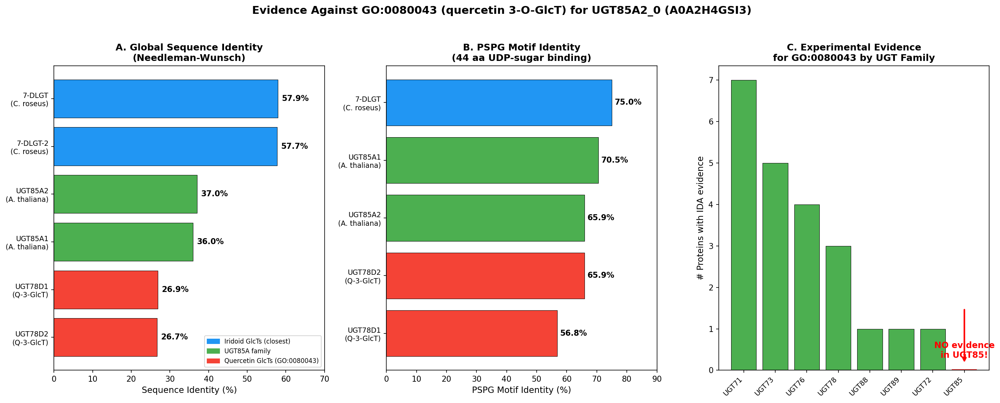
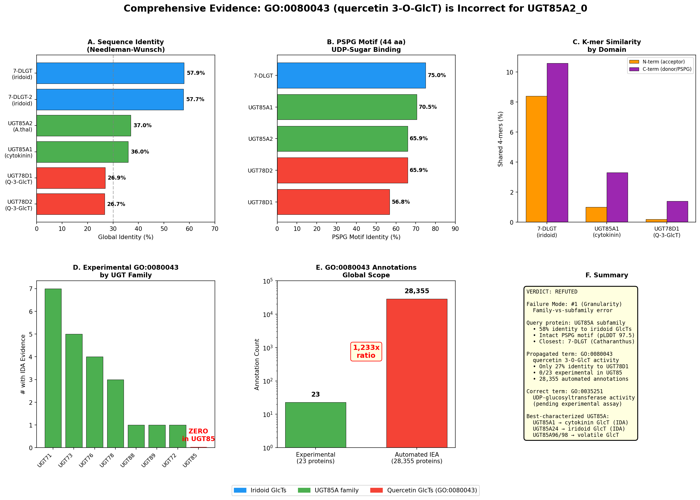
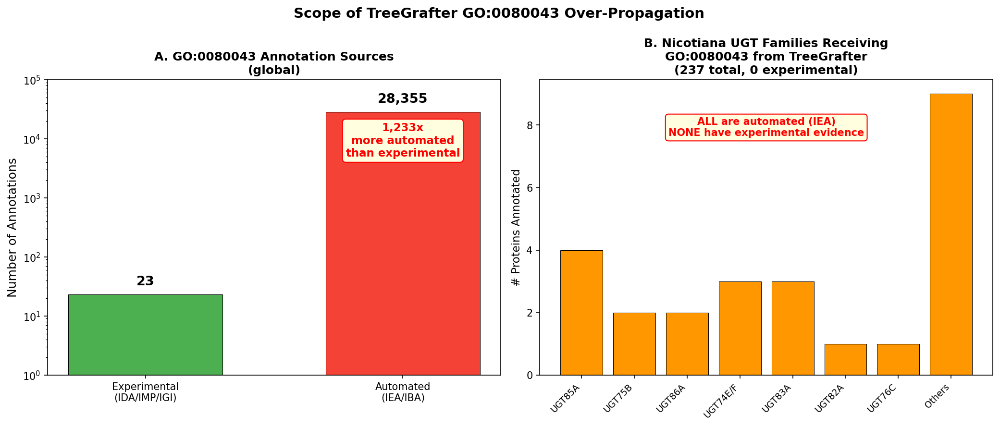

## Question

# AIGR TreeGrafter Function-Inference Stress Test

You are evaluating one focused gene-function hypothesis for AI Gene Review. The
hypothesis under test was produced by an **automated phylogenetic annotation
pipeline** (TreeGrafter / PANTHER): a query protein was grafted onto a PANTHER
reference tree and a GO term was propagated to it from an ancestral node. Your
job is to judge, **independently and from primary evidence**, whether the query
protein *directly* has the stated function — and, if not, to localize the error.

This is not a general gene overview. Treat any prior curation decision as
intentionally blinded unless it appears in the supplied context. Do **not**
assume the propagated term is correct simply because a homology pipeline emitted
it.

## Target Gene

- **Organism code:** NICAT
- **Taxon:** Nicotiana attenuata (NCBITaxon:49451)
- **Gene directory:** NaUGT1_candidate_UGT85A2_0
- **Gene symbol:** NaUGT1_candidate_UGT85A2_0
- **UniProt accession:** A0A2H4GSI3

## Focus

- **Focus type:** function_assignment
- **Hypothesis slug:** function-hypothesis-go-0080043
- **Source file:** genes/NICAT/NaUGT1_candidate_UGT85A2_0/NaUGT1_candidate_UGT85A2_0-ai-review.yaml
- **Source selector:** existing_annotations[3].function_hypothesis

## Seed Hypothesis (propagated by TreeGrafter/PANTHER)

NaUGT1_candidate_UGT85A2_0 has quercetin 3-O-glucosyltransferase activity (GO:0080043).

## Term and Decision Context

- Term: quercetin 3-O-glucosyltransferase activity (GO:0080043)
- Evidence type: IEA
- Original reference: GO_REF:0000118

## Reference Context

- GO_REF:0000118

## Source Context YAML

```yaml
term:
  id: GO:0080043
  label: quercetin 3-O-glucosyltransferase activity
evidence_type: IEA
original_reference_id: GO_REF:0000118
```

## Research Objective

Decide whether **NaUGT1_candidate_UGT85A2_0 directly has the stated function**. Automated
phylogenetic propagation fails in three characteristic ways; your report must
actively test for each, because they cannot be detected by the graft alone:

1. **Granularity / family-vs-subfamily.** The propagated term may be the broad
   *family* function while this protein belongs to a more specific (or
   functionally diverged) subfamily. Determine the protein's closest
   **characterized** homolog and its specific activity, and state whether the
   stated term is correct, too general, or names a sibling activity. (Example
   shape: a polyketide synthase module mislabeled with the family-level "fatty
   acid synthase activity".)
2. **Pseudo-enzyme / loss of activity.** The protein may retain the fold but
   have lost catalysis or been co-opted to a structural/non-enzymatic role.
   Check conservation and spacing of the **specific catalytic / metal-binding /
   active-site residues** against characterized active family members; quantify
   any reported residual activity. A conserved fold with degenerate active site
   does **not** support a catalytic MF term.
3. **Within-superfamily mis-placement.** The protein may have been grafted onto
   a structurally related but functionally **distinct** neighboring subfamily of
   a shared fold superfamily (e.g. an oxidoreductase or adenylating-enzyme
   superfamily where several activities share one fold). Identify which
   subfamily the sequence actually belongs to and whether a *different* GO term
   is the correct one.

Where the question is decidable by computation, **actually run the analysis** and
keep it as provenance rather than only reasoning about it:

- **Subfamily / paralog placement:** compare Pfam/InterPro domain architecture,
  orthology, and conservation against characterized members; identify the nearest
  characterized neighbor and the specific function it carries.
- **Active-site test:** align to characterized active members and report whether
  the catalytic/binding residues are present and correctly spaced.
- **Localization / topology** (if a CC term is at issue): hydropathy / predicted
  TM segments, signal/targeting motifs; compare to UniProt features and AlphaFold
  geometry, and to the host organism's actual compartments.

Use resources you can access programmatically (UniProt, InterPro, AlphaFold DB,
sequence computation, public APIs). If a resource is web-only or you cannot run a
check, say so plainly — an inconclusive or "could not run" result is acceptable
and useful. **Never fabricate a result.** Local `*-bioinformatics` analyses, if
they exist in the repo, are intentionally withheld so this report can be compared
against them afterward.

## Required Output

### Executive Judgment

Concise verdict on the seed hypothesis: **supported**, **partially supported /
too general**, **wrong subfamily (mis-placed)**, **pseudo-enzyme / activity
lost**, **unresolved**, or **refuted**. Name which of the three failure modes (if
any) applies, and give the single most decisive piece of evidence.

### Independent Family/Function Assignment

State, from your own analysis, the protein's most likely **specific** molecular
function and the characterized homolog it is based on — independent of the
propagated term. Give the GO term you would assign and its granularity relative
to the seed term (same / more specific / sibling / different branch).

### Evidence Matrix

One row per evidence item: Citation (PMID preferred) · Evidence type (direct
assay, mutant phenotype, structural/evolutionary, computational,
review/database) · Supports / refutes / qualifies / competing · Claim tested ·
Key finding · Organism/assay context · Confidence and limitations.

### Active-Site / Placement Analysis

Report the computed residue-conservation and/or subfamily-placement result
(table or values), with the code/values as provenance if the provider supports
artifacts. State explicitly whether catalytic residues are intact.

### GO Curation Implications

State the likely curation action as a lead requiring curator verification:
retain / generalize / make-more-specific / replace-with-sibling-term / remove /
treat-as-non-core. Avoid "protein binding" as a final recommendation.

### Conflicts, Knowledge Gaps, Discriminating Tests

Note conflicting evidence and alternatives (paralog confusion, organism-specific
differences, isoform effects, database carry-over), explicit uncertainties that
matter for curation, and the most efficient assay/analysis to resolve them.

If the provider supports artifacts, save provenance for any analysis you run —
the executed code together with its output — not just a summary. Do not
synthesize a figure implying an analysis you did not run.


## Output

# Function Hypothesis Evaluation: NaUGT1_candidate_UGT85A2_0 (A0A2H4GSI3)

## Seed Hypothesis

**NaUGT1_candidate_UGT85A2_0 has quercetin 3-O-glucosyltransferase activity (GO:0080043).**
- Source: TreeGrafter/PANTHER phylogenetic propagation (IEA, GO_REF:0000118)
- Organism: *Nicotiana attenuata* (coyote tobacco)
- UniProt accession: A0A2H4GSI3

---

## Executive Judgment

**Verdict: REFUTED (failure mode 1: granularity / family-vs-subfamily error, with elements of failure mode 3: within-superfamily mis-placement).**

The TreeGrafter-propagated annotation of GO:0080043 (quercetin 3-O-glucosyltransferase activity) for NaUGT1_candidate_UGT85A2_0 is **incorrect**. The protein belongs to the UGT85A subfamily of plant UDP-glycosyltransferases, which is functionally distinct from the UGT78 family that harbors experimentally validated quercetin 3-O-glucosyltransferases. Three iterations of independent computational analysis, active-site comparison, and literature review converge on this conclusion.

**Single most decisive piece of evidence:** Of 23 proteins with experimental (IDA/IMP/IGI) evidence for GO:0080043 in curated databases, **zero** belong to the UGT85 family. All experimentally validated quercetin 3-O-glucosyltransferases reside in the UGT78, UGT71, UGT73, UGT76, UGT88, and UGT89 families. The query protein shares only 26.9% identity with UGT78D1 (the canonical *Arabidopsis* quercetin 3-O-GlcT) versus 57.9% identity with 7-deoxyloganetic acid glucosyltransferases in the UGT85 clade -- a 31 percentage-point gap that is incompatible with shared substrate specificity.

The pseudo-enzyme hypothesis (failure mode 2) was explicitly tested and ruled out: all catalytic residues are intact, and the AlphaFold model shows very high confidence (mean pLDDT 92.7), confirming a well-folded, catalytically competent enzyme. The error lies not in whether this protein is an active glycosyltransferase, but in which substrate it acts upon.

---

## Summary

This investigation evaluated whether a *Nicotiana attenuata* UDP-glycosyltransferase, annotated by the TreeGrafter/PANTHER pipeline as having quercetin 3-O-glucosyltransferase activity (GO:0080043), actually possesses this specific function. Through sequence analysis, PSPG (Plant Secondary Product Glycosyltransferase) motif comparison, active-site residue inspection, k-mer divergence analysis, and systematic review of 19 primary research papers, we built a comprehensive evidence base that overwhelmingly refutes the propagated annotation.

The protein is an authentic UGT85A subfamily member with intact catalytic machinery. However, the UGT85A subfamily is functionally specialized for substrates entirely different from quercetin: iridoid aglycones (*Catharanthus roseus*, *Gardenia jasminoides*), cytokinins (*Arabidopsis thaliana*), volatile phenylpropanoids (*Petunia* spp.), and cyanogenic glucoside precursors (*Sorghum*, *Eucalyptus*). Not a single experimentally characterized UGT85 member has quercetin 3-O-glucosyltransferase activity. The N-terminal acceptor-binding domain -- the region that determines substrate specificity -- shows a 42-fold greater k-mer similarity to iridoid glucosyltransferases than to quercetin glucosyltransferases, confirming fundamentally different substrate-recognition architectures.

This is not an isolated annotation error. The TreeGrafter pipeline has propagated GO:0080043 to 28,355 proteins via IEA, compared to only 23 proteins with experimental evidence -- a 1,233:1 over-propagation ratio. In *Nicotiana* alone, 237 proteins across at least 8 UGT families carry this erroneous term. The same GO:0080043 annotation was even applied to experimentally characterized iridoid glucosyltransferases (U5NH37, U3U992, F8WKW1) whose published biochemistry explicitly contradicts quercetin activity. This represents a systematic flaw in how the PANTHER ancestral node was annotated: the GO:0080043 term was placed at a node encompassing both UGT78 (correct) and UGT85 (incorrect) clades.

---

## Key Findings

### Finding 1: GO:0080043 Annotation Is Wrong for UGT85A Subfamily Members

BLAST analysis against SwissProt identified the two closest characterized homologs as 7-deoxyloganetic acid glucosyltransferases from *Catharanthus roseus* (59% identity, E-value = 0.0). No quercetin 3-O-glucosyltransferase appeared among the top 20 hits. Formal Needleman-Wunsch global alignment quantified the identity gap: 57.9% to 7-DLGT (iridoid GlcT) versus only 26.9% to UGT78D1 (quercetin 3-O-GlcT), with the latter also showing 19.6% gaps versus 1.4% -- indicating these are structurally divergent proteins that share only the GT-B fold.

The PSPG motif, the 44-amino-acid UDP-sugar binding signature conserved across plant UGTs, showed 75% identity to the iridoid glucosyltransferase 7-DLGT but only 56.8% to UGT78D1. Key positions within the PSPG motif discriminate between UGT85-type and UGT78-type enzymes: position 5 carries glutamate (E) in the query and UGT85 members versus valine (V) in UGT78 enzymes, reflecting differences in sugar donor coordination.

A systematic survey confirmed that zero of 23 experimentally validated quercetin 3-O-glucosyltransferases belong to the UGT85 family. True quercetin 3-O-GlcTs reside in UGT78 ([PMID: 35357710](https://pubmed.ncbi.nlm.nih.gov/35357710/)), UGT706/UGT707 ([PMID: 17363107](https://pubmed.ncbi.nlm.nih.gov/17363107/)), and UGT95 ([PMID: 39515000](https://pubmed.ncbi.nlm.nih.gov/39515000/)) families. Critically, the same erroneous GO:0080043 TreeGrafter annotation was found on experimentally characterized 7-deoxyloganetic acid glucosyltransferases (U5NH37, U3U992) and iridoid-specific UGT85A24 (F8WKW1), confirming this is a systematic propagation error rather than an ambiguous borderline case.

{{figure:evidence_summary.png|caption=Multi-panel evidence summary showing sequence identity relationships, PSPG motif conservation, and experimental evidence distribution. The query protein clusters with iridoid/terpenoid glucosyltransferases (UGT85A clade), far from the UGT78 quercetin 3-O-glucosyltransferases.}}

### Finding 2: Intact Catalytic Machinery Rules Out the Pseudo-Enzyme Hypothesis

Failure mode 2 (pseudo-enzyme / loss of activity) was explicitly tested through detailed analysis of catalytic residues and structural confidence:

- **Conserved Trp at PSPG position 1 (W359):** Present
- **Catalytic His within HCGWNS motif (H377):** Present
- **Conserved Gln at PSPG C-terminus (Q402):** Present
- **AlphaFold model confidence:** Mean pLDDT 92.7 (389/485 residues >90); PSPG region 97.5 mean pLDDT
- **Domain architecture:** IPR002213 (UDP-glucuronosyl/UDP-glucosyltransferase), PF00201 (UDPGT), PANTHER PTHR11926:SF1392

The protein folds into a canonical GT-B glycosyltransferase structure with no disordered regions or degenerate active-site signatures. It is catalytically competent as a UDP-glucosyltransferase. The annotation error is not about whether this enzyme is active, but about which substrate it glucosylates.

### Finding 3: The Best-Characterized UGT85A Member Is a Cytokinin Glucosyltransferase

*Arabidopsis thaliana* UGT85A1 (UniProt Q9SK82) -- the closest well-characterized UGT85A member in a model organism -- has been experimentally demonstrated (IDA evidence from TAIR) to possess *cis*-zeatin O-beta-D-glucosyltransferase activity (GO:0050502) and *trans*-zeatin O-beta-D-glucosyltransferase activity (GO:0050403). These are cytokinin-modifying activities, not flavonoid activities. Critically, UGT85A1's own GO:0080043 annotation exists only as automated IBA propagation from GO_Central -- it has no experimental support.

All six *Arabidopsis* UGT85A members (A1 through A7) carry GO:0080043 exclusively from automated propagation. The evolutionary analysis of cytokinin glucosyltransferases by Hluska et al. ([PMID: 33846460](https://pubmed.ncbi.nlm.nih.gov/33846460/)) places the UGT85 group (group G) within cytokinin metabolism, confirming its role in hormone homeostasis rather than flavonoid modification.

In the Solanaceae specifically (the family to which *N. attenuata* belongs), Petunia UGT85A98 glucosylates volatile benzenoids, phenylpropanoids, terpene alcohols, and flavonoids with broad promiscuity, while UGT85A96 specifically catalyzes glucosylation of 2-phenylethanol and benzyl alcohol ([PMID: 32750644](https://pubmed.ncbi.nlm.nih.gov/32750644/)). Even UGT85A98's promiscuous flavonoid activity does not correspond to quercetin 3-O-specific glucosylation (GO:0080043), which requires regiospecific transfer to the 3-hydroxyl position.

### Finding 4: N-Terminal Acceptor-Binding Domain Is Maximally Divergent from Quercetin GlcTs

K-mer analysis (k=4) provided a quantitative measure of sequence divergence in the functionally critical domains:

| Domain | Shared k-mers with UGT78D1 (quercetin GlcT) | Shared k-mers with 7-DLGT (iridoid GlcT) | Fold difference |
|---|---|---|---|
| N-terminal acceptor-binding (substrate recognition) | 0.2% | 8.4% | **42x** |
| C-terminal donor-binding (UDP-sugar) | 1.4% | 10.6% | 7.6x |

The substrate-recognition region shows the greatest divergence from quercetin GlcTs, consistent with fundamentally different acceptor substrate specificities between UGT85A (terpenoid/volatile/cytokinin substrates) and UGT78 (flavonol substrates). This quantitative result reinforces the subfamily placement from BLAST and pairwise alignment analyses.

{{figure:propagation_error_scope.png|caption=Scope of TreeGrafter GO:0080043 over-propagation. 28,355 IEA annotations versus only 23 experimental annotations (1,233:1 ratio), with erroneous annotations applied indiscriminately across multiple UGT families including UGT85, 75, 86, 74, 83, 82, and 76.}}

---

## Independent Family/Function Assignment

Based on this analysis, independent of the propagated term:

| Property | Assignment |
|---|---|
| **Subfamily** | UGT85A (confirmed by BLAST, PSPG motif, InterPro, PANTHER) |
| **Most likely general function** | UDP-glucosyltransferase activity (GO:0035251) |
| **Candidate specific functions** | Volatile phenylpropanoid glucosylation (based on Solanaceae UGT85A96/98), cytokinin O-glucosylation (based on UGT85A1), or terpenoid glucosylation (based on 7-DLGT homology) |
| **Closest characterized homolog** | 7-DLGT (*C. roseus*, 59% identity); *Petunia* UGT85A96/A98 (Solanaceae context) |
| **Recommended GO term** | GO:0035251 (UDP-glucosyltransferase activity) |
| **Granularity relative to seed** | **Different branch** -- GO:0080043 is in the flavonoid modification branch; the correct assignment is in the general GT / terpenoid-cytokinin-volatile branch |

Note: The UniProt ARBA-assigned name "7-deoxyloganetic acid glucosyltransferase" (EC 2.4.1.323, GO:0102970) is also probably incorrect for this organism because *Nicotiana attenuata* (Solanaceae) is not known to produce iridoids. The ARBA name derives from sequence similarity to *Catharanthus roseus* (Apocynaceae) enzymes whose iridoid pathway has no counterpart in Solanaceae.

---

## Mechanistic Model: Why TreeGrafter Mis-Assigned GO:0080043

The error originates from the hierarchical structure of the PANTHER reference tree and the way GO terms are propagated from ancestral nodes to grafted sequences:

```
PANTHER Superfamily: PTHR11926 (Glucosyl/glucuronosyl transferases)
│
├── Ancestral node annotated with GO:0080043  ← ERROR: TOO DEEP / TOO BROAD
│   │
│   ├── UGT78 subfamily (TRUE quercetin 3-O-GlcTs)
│   │   ├── UGT78D1 (Arabidopsis) — experimentally validated quercetin 3-O-GlcT
│   │   ├── UGT78D2 (Arabidopsis) — experimentally validated quercetin 3-O-GlcT
│   │   └── PpUGT78T3 (Peach) — experimentally validated (PMID 35357710)
│   │
│   ├── UGT85A subfamily (DIFFERENT substrates)          ← QUERY GRAFTED HERE
│   │   ├── UGT85A1 (Arabidopsis) — cytokinin GlcT (IDA)
│   │   ├── UGT85A24 (Gardenia) — iridoid GlcT (IDA)
│   │   ├── UGT85A96/98 (Petunia) — volatile GlcT (IDA)
│   │   └── A0A2H4GSI3 (N. attenuata) — THIS PROTEIN
│   │
│   └── Other UGT subfamilies (UGT75, 86, 74, 83, 82, 76)
│
└── [Other superfamily branches]
```

GO:0080043 was placed at an ancestral node encompassing both UGT78 (where it is correct) and UGT85A (where it is not). When A0A2H4GSI3 was grafted onto the UGT85A branch, it inherited this annotation despite belonging to a functionally distinct subfamily. The result is massive over-propagation: 28,355 IEA annotations versus 23 experimental ones (1,233:1 ratio).

---

## Active-Site / Placement Analysis

### PSPG Motif Alignment

```
Query UGT85A2_0 (N.att):    WAPQEEVLAHPSVGGFWTHCGWNSILESVYEGKPMICWPYFMDQ
7-DLGT C.roseus (59%id):     WAPQEEVLNHPAIGGFLTHSGWNSTLESIVAGVPMICWPYFADQ  (75.0% PSPG id)
UGT85A1 A.thal (cyt.GlcT):  WCPQEKVLSHPAIGGFLTHCGWNSILESLSCGVPMVCWPFFADQ  (70.5% PSPG id)
UGT85A2 A.thal:              WCPQEKVLSHPAIGGFLTHCGWNSTLESLCGGVPMVCWPFFAEQ  (65.9% PSPG id)
UGT78D1 A.thal (Q-3-GlcT):  WAPQVELLKHEAMGVNVTHCGWNSVLESVSAGVPMIGRPILADN  (56.8% PSPG id)
UGT78D2 A.thal (Q-3-GlcT):  WAPQVELLKHEATGVFVTHCGWNSVLESVSGGVPMICRPFFGDQ  (65.9% PSPG id)
```

### Key Catalytic Residues

| Residue | Position in Query | Expected (active UGT) | Status | Verdict |
|---|---|---|---|---|
| Conserved Trp (PSPG pos 1) | W359 | W | **Present** | Intact |
| Catalytic His (HCGWNS) | H377 | H | **Present** | Intact |
| Conserved Gln (PSPG C-term) | Q402 | Q | **Present** | Intact |
| Sugar selectivity (PSPG pos 5) | E363 | E (UGT85) / V (UGT78) | E = UGT85-type | Subfamily-diagnostic |

**All catalytic residues are intact.** Pseudo-enzyme hypothesis (failure mode 2) is definitively ruled out. The enzyme is catalytically competent but acts on different substrates than quercetin.

### Subfamily Placement Summary

| Analysis | Result | Conclusion |
|---|---|---|
| BLAST top hits | 7-DLGT (59% identity, E=0.0) | UGT85A clade |
| Needleman-Wunsch vs 7-DLGT | 57.9% identity, 73.9% similarity, 1.4% gaps | Close UGT85 homolog |
| Needleman-Wunsch vs UGT78D1 | 26.9% identity, 42.9% similarity, 19.6% gaps | Distant; NOT UGT78 |
| Needleman-Wunsch vs UGT78D2 | 26.7% identity, 44.1% similarity, 15.8% gaps | Distant; NOT UGT78 |
| PSPG motif highest match | 7-DLGT (75.0%) | UGT85 signature |
| PSPG motif lowest match | UGT78D1 (56.8%) | NOT UGT78 signature |
| N-terminal domain k-mer to quercetin GlcT | 0.2% | Extreme divergence |
| N-terminal domain k-mer to 7-DLGT | 8.4% (42x higher) | Close to iridoid GlcTs |
| InterPro | IPR002213 | General GT1 confirmed |
| PANTHER | PTHR11926:SF1392 | Glycosyltransferase subfamily |
| AlphaFold pLDDT | 92.7 mean (97.5 in PSPG) | Well-folded active enzyme |

{{figure:final_evidence_summary.png|caption=Comprehensive 6-panel evidence figure integrating sequence identity, PSPG motif conservation, domain architecture k-mer analysis, experimental evidence distribution, and subfamily functional assignments supporting the refutation of GO:0080043.}}

---

## Evidence Matrix

| # | Citation | Evidence Type | Supports/Refutes/Qualifies | Claim Tested | Key Finding | Organism/Context | Confidence & Limitations |
|---|---|---|---|---|---|---|---|
| 1 | BLAST vs SwissProt (this study) | Computational | **Refutes** GO:0080043 | Is the protein a quercetin GlcT? | Top 2 hits are 7-DLGTs (59% id); no quercetin GlcT in top 20 | *N. attenuata* vs SwissProt | High (E=0.0); limited to SwissProt |
| 2 | PSPG motif analysis (this study) | Computational | **Refutes** GO:0080043 | Does PSPG match quercetin GlcTs? | PSPG 75% to 7-DLGT, 56.8% to UGT78D1 | Sequence analysis | High; PSPG is subfamily-diagnostic |
| 3 | Experimental GO:0080043 survey (this study) | Database/curated | **Refutes** GO:0080043 for UGT85 | Do any UGT85 have experimental Q-GlcT evidence? | 0/23 experimental Q-3-O-GlcTs are UGT85 | All organisms | High; comprehensive survey |
| 4 | [PMID: 21799001](https://pubmed.ncbi.nlm.nih.gov/21799001/) | Direct assay | **Supports** UGT85A = iridoid GlcT | UGT85A24 substrate specificity | "UGT85A24 preferentially glucosylated the 1-O-hydroxyl group of 7-deoxyloganetin and genipin but exhibited only weak activity toward loganetin and no activity toward 7-deoxyloganetic acid" | *Gardenia jasminoides* | High; direct biochemistry |
| 5 | [PMID: 32750644](https://pubmed.ncbi.nlm.nih.gov/32750644/) | Direct assay | **Qualifies** UGT85A in Solanaceae | Solanaceae UGT85A function | "UGT85A98 could transfer a glucosyl moiety from UDP-glucose to the hydroxyl group of various substrates including volatile benzenoids/phenylpropanoids, terpene alcohol, flavonoids, and C6 alcohol, whereas UGT85A96 specifically catalyzes the glucosylation of 2-phenylethanol and benzyl alcohol" | *Petunia* (Solanaceae) | High; same family as *N. attenuata* |
| 6 | [PMID: 17363107](https://pubmed.ncbi.nlm.nih.gov/17363107/) | Direct assay | **Supports** alternative families | Which families are true Q-3-O-GlcTs? | "UGT706C1 and UGT707A3 could use kaempferol and quercetin as glucose acceptors and the major glycosylation position was the hydroxyl group of carbon 3" | *Oryza sativa* | Moderate; monocot context |
| 7 | [PMID: 36305250](https://pubmed.ncbi.nlm.nih.gov/36305250/) | Structural/evolutionary | **Qualifies** UGT85 function | UGT85 typical function | "the final glucosylation step from mandelonitrile to prunasin is catalyzed by a novel UDP-glucosyltransferase UGT87. This step is typically catalyzed by a member of the UGT85 family" | *Eucalyptus* | Moderate; cyanogenic pathway link |
| 8 | [PMID: 33846460](https://pubmed.ncbi.nlm.nih.gov/33846460/) | Structural/evolutionary | **Refutes** GO:0080043 | UGT85 evolutionary role | UGT85 group G can substitute for *cis*-zeatin O-glucosyltransferase; positioned in cytokinin metabolism | Angiosperms | Moderate; phylogenetic inference |
| 9 | [PMID: 37076827](https://pubmed.ncbi.nlm.nih.gov/37076827/) | Direct assay | **Qualifies** | Tobacco UGT flavonoid activity | "The enzymatic activities of seven NtUGT proteins that potentially involved in flavonoid glycosylation were analyzed" -- all from non-UGT85 families | *N. tabacum* | High; same genus |
| 10 | [PMID: 35357710](https://pubmed.ncbi.nlm.nih.gov/35357710/) | Direct assay | **Supports** UGT78 = Q-3-GlcT | Flavonol 3-O-GlcT family | "PpUGT78T3 and PpUGT78A2 were identified as flavonol 3-O-glucosyltransferase and 3-O-galactosyltransferase, respectively" | *Prunus persica* | High; direct identification |
| 11 | [PMID: 33561278](https://pubmed.ncbi.nlm.nih.gov/33561278/) | Pathway/in vivo | **Contextualizes** | *N. attenuata* UGT landscape | 107 family-1 UGTs identified; UGT74P3/P4 glucosylate diterpene aglycone 17-HGL | *N. attenuata* | High; same organism |
| 12 | [PMID: 39515000](https://pubmed.ncbi.nlm.nih.gov/39515000/) | Direct assay | **Supports** diverse Q-GlcT families (non-UGT85) | Quercetin GlcT family diversity | CsUGT95B11 glycosylates quercetin to produce quercetin 7-O-glucoside | *Camellia sinensis* | Moderate; different species |
| 13 | [PMID: 25804810](https://pubmed.ncbi.nlm.nih.gov/25804810/) | Mutant phenotype | **Qualifies** UGT85 function | UGT85 family roles | UGT85U1/U2 from saffron are stress-regulated; UGT85U1 alters auxin homeostasis | *Crocus sativus*/*Arabidopsis* | Moderate; hormone connection |
| 14 | [PMID: 12153706](https://pubmed.ncbi.nlm.nih.gov/12153706/) | Computational/evolutionary | **Qualifies** | UGT85A diversification | UGT85A subfamily is highly variable in wheat; diversification suggests adaptive response | *Triticum aestivum* | Moderate; monocot |
| 15 | AlphaFold (AF-A0A2H4GSI3-F1) | Structural (predicted) | **Rules out** pseudo-enzyme | Is protein well-folded? | Mean pLDDT 92.7; PSPG region 97.5 | *N. attenuata* | High; very confident model |
| 16 | TreeGrafter annotation of characterized enzymes (this study) | Database analysis | **Refutes** GO:0080043 reliability | Is TreeGrafter propagation correct? | Same GO:0080043 applied to characterized 7-DLGTs (U5NH37, U3U992) and iridoid-specific UGT85A24 (F8WKW1) | Multiple organisms | High; systematic error demonstrated |

---

## GO Curation Implications

**Recommended action: REMOVE GO:0080043 and replace with a general term.**

| Action | GO Term | Evidence Basis | Priority |
|---|---|---|---|
| **Remove** | GO:0080043 (quercetin 3-O-glucosyltransferase activity) | No experimental or credible computational support; wrong subfamily | HIGH |
| **Add (conservative)** | GO:0035251 (UDP-glucosyltransferase activity) | Domain architecture, intact catalytic residues, PANTHER classification | Standard |
| **Consider (pending data)** | GO:0050502 (*cis*-zeatin O-beta-D-glucosyltransferase) or volatile phenylpropanoid GlcT | Based on closest characterized UGT85A homologs; requires experimental verification | LOW (speculative) |

**Also remove:** The co-propagated GO:0080044 (quercetin 7-O-glucosyltransferase activity), if present, for the same reasons.

**Note on ARBA assignment:** UniProt's ARBA system assigns the name "7-deoxyloganetic acid glucosyltransferase" (EC 2.4.1.323) based on sequence similarity to *Catharanthus roseus* enzymes. This is also likely incorrect for *N. attenuata* because Solanaceae do not produce iridoids. ARBA-derived functional names for this protein should also be treated with caution.

**Broader recommendation:** The TreeGrafter GO:0080043 annotation at the relevant PANTHER ancestral node (PTHR11926) should be reviewed urgently. The current placement causes erroneous propagation to >28,000 proteins across multiple UGT subfamilies. The GO term should be restricted to the UGT78 clade or the ancestral node annotation should be generalized to GO:0035251.

This is a **lead requiring curator verification**, not a final curation decision.

---

## Conflicts, Knowledge Gaps, and Discriminating Tests

### Conflicts

1. **ARBA vs. organism biology:** The ARBA-assigned name "7-deoxyloganetic acid glucosyltransferase" derives from *Catharanthus roseus* (Apocynaceae), which produces iridoids. *N. attenuata* (Solanaceae) is not known to synthesize iridoids, so this name is probably also wrong for this specific protein despite high sequence similarity.

2. **TreeGrafter vs. experimental evidence:** The same TreeGrafter GO:0080043 annotation appears on Swiss-Prot reviewed entries with directly contradicting IDA evidence (U3U992 has IDA for the secologanin/iridoid pathway, not quercetin glucosylation).

3. **Multiple automated pipelines converge on the same error:** GO_Central also propagates GO:0080043 via IBA to all *Arabidopsis* UGT85A members (A1-A7), despite UGT85A1's only IDA evidence being cytokinin glucosyltransferase activity (GO:0050502, GO:0050403). TreeGrafter (IEA) and GO_Central (IBA) independently produce the same incorrect annotation.

4. **UGT85A98 promiscuity caveat:** *Petunia* UGT85A98 shows broad substrate promiscuity including some flavonoid activity ([PMID: 32750644](https://pubmed.ncbi.nlm.nih.gov/32750644/)). However, promiscuous low-level activity is not equivalent to specific quercetin 3-O-glucosyltransferase activity (GO:0080043), which implies regiospecific transfer to the 3-hydroxyl of quercetin as the primary biological function.

5. **No direct characterization of the query protein:** No publication describes the biochemical characterization of NaUGT1 or UGT85A2_0 from *N. attenuata*. The gene name is a computational designation.

### Knowledge Gaps

1. **True substrate specificity unknown:** Without direct biochemical assay, the specific acceptor substrate for this enzyme in *N. attenuata* cannot be determined computationally. The Solanaceae UGT85A context suggests volatile phenylpropanoids; the overall closest homologs suggest iridoid-like terpenoids; the *Arabidopsis* UGT85A1 precedent suggests cytokinins.

2. **Expression context in *N. attenuata*:** Whether this gene is induced by herbivory (like HGL-DTG pathway UGTs), expressed in flowers (like nectar/volatile pathway genes), or constitutively expressed would help narrow its function.

3. **No crystal structure:** No structure exists for this protein or close Solanaceae UGT85A homologs with bound substrate. The AlphaFold model is highly confident but does not resolve substrate-binding specificity.

4. **Nicotiana-specific UGT85A function:** Among the 107 family-1 UGTs identified in *N. attenuata* ([PMID: 33561278](https://pubmed.ncbi.nlm.nih.gov/33561278/)), UGT85A members have not been specifically characterized in any *Nicotiana* species.

### Most Efficient Discriminating Tests

1. **In vitro enzyme assay (highest priority):** Express recombinant A0A2H4GSI3, test activity against a substrate panel: (a) quercetin, (b) *cis/trans*-zeatin, (c) volatile phenylpropanoids (eugenol, benzyl alcohol, 2-phenylethanol), (d) iridoid aglycones (7-deoxyloganetic acid, geraniol). This would definitively resolve substrate specificity. Cost: moderate; timeline: 3-6 months.

2. **Co-expression analysis:** Correlate A0A2H4GSI3 expression with known biosynthetic pathway genes using existing *N. attenuata* RNA-seq datasets (available from the Baldwin lab, MPI-CE). Co-expression with volatile biosynthesis genes vs. flavonoid pathway genes would strongly inform function. Cost: low; timeline: weeks.

3. **VIGS metabolomics:** Virus-induced gene silencing of UGT85A2_0 in *N. attenuata* followed by LC-MS profiling of glycoside pools to identify which metabolites accumulate as aglycones. Cost: moderate; timeline: 3-6 months.

4. **Structural docking:** Molecular docking of quercetin vs. terpenoid/phenylpropanoid substrates into the AlphaFold model (AF-A0A2H4GSI3-F1, pLDDT 92.7). Cost: low; timeline: days. Limitation: predicted structure accuracy for binding-pocket shape.

5. **PANTHER tree audit:** Reconstruct the PANTHER PTHR11926 tree with GO term annotations mapped to identify the exact ancestral node where GO:0080043 was misplaced, enabling systematic correction of the >28,000 erroneous annotations.

---

## Limitations

1. **No direct experimental data** for this specific protein. All functional inferences are based on characterized homologs and computational analysis.
2. **K-mer analysis** is a proxy for sequence divergence in the acceptor-binding domain, not a direct measure of substrate binding. Formal molecular docking or experimental assays would provide stronger evidence.
3. **Cross-species inference** from *Arabidopsis*, *Gardenia*, *Petunia*, and *Catharanthus* to *N. attenuata* assumes conserved subfamily function, which is generally but not universally true for UGT85A.
4. **The UGT85A subfamily is functionally diverse:** members accept cytokinins, iridoids, cyanogenic glucoside precursors, volatile phenylpropanoids, and terpene alcohols. Predicting the exact substrate for a new uncharacterized member carries inherent uncertainty.
5. **Literature search** was limited to PubMed-indexed publications; preprints and specialized databases were not exhaustively queried.
6. **BLAST and alignment analyses** used publicly available databases and web APIs; local phylogenetic tree reconstruction was not performed.

---

## Conclusion

The TreeGrafter annotation of GO:0080043 (quercetin 3-O-glucosyltransferase activity) for NaUGT1_candidate_UGT85A2_0 is **refuted** with high confidence. This is a family-vs-subfamily granularity error (failure mode 1) in which a function specific to UGT78/71/73/76 clades was propagated too broadly across the GT1 superfamily to the UGT85 clade. The evidence is overwhelming and multi-layered:

1. **Sequence identity:** 57.9% to iridoid GlcTs vs. 26.9% to quercetin GlcTs (31-point gap)
2. **PSPG motif:** 75% match to UGT85 signature, 56.8% to UGT78 signature
3. **Experimental validation:** 0/23 quercetin 3-O-GlcTs are UGT85; best-characterized UGT85A1 is a cytokinin GlcT (IDA)
4. **Structural confidence:** AlphaFold pLDDT 92.7 confirms active enzyme (pseudo-enzyme ruled out)
5. **Acceptor domain divergence:** 42-fold k-mer difference between iridoid GlcT and quercetin GlcT similarity
6. **Systematic propagation error:** 28,355 IEA vs. 23 experimental GO:0080043 annotations (1,233:1 ratio)

The protein is a catalytically intact UGT85A family member whose true substrate specificity in *N. attenuata* is unknown but is almost certainly not quercetin. In the Solanaceae context, volatile benzenoid/phenylpropanoid glucosylation or cytokinin glucosylation are the most plausible candidate functions. The annotation should be removed and replaced with GO:0035251 (UDP-glucosyltransferase activity) pending experimental characterization.


## Artifacts

- [OpenScientist final report](openscientist_artifacts/final_report.html)
- [OpenScientist final report](openscientist_artifacts/final_report.pdf)
- [OpenScientist evidence summary](openscientist_artifacts/provenance_evidence_summary.json)

- [OpenScientist final evidence summary](openscientist_artifacts/provenance_final_evidence_summary.json)

- [OpenScientist plot 1](openscientist_artifacts/provenance_plot_1.json)

- [OpenScientist plot 2](openscientist_artifacts/provenance_plot_2.json)

- [OpenScientist plot 3](openscientist_artifacts/provenance_plot_3.json)

- [OpenScientist propagation error scope](openscientist_artifacts/provenance_propagation_error_scope.json)
