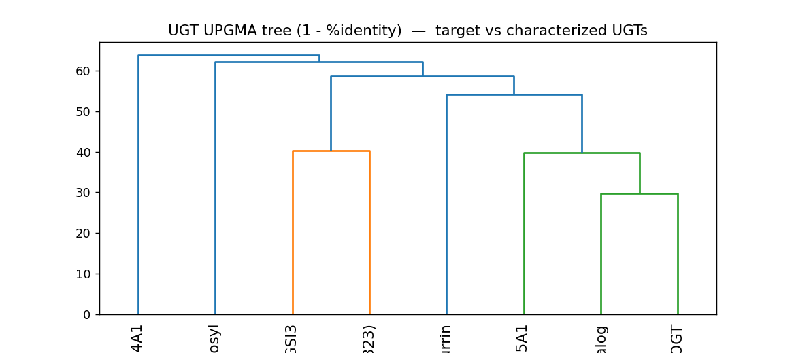

## Question

# AIGR Gene Hypothesis Deep Research

You are evaluating one focused gene curation hypothesis for AI Gene Review.
This is not a general gene overview. Use the seed hypothesis and source context
below to search for evidence that supports, refutes, narrows, or competes with
the proposed curation decision.

## Target Gene

- **Organism code:** NICAT
- **Taxon:** Nicotiana attenuata (NCBITaxon:49451)
- **Gene directory:** NaUGT1_candidate_UGT85A2_0
- **Gene symbol:** NaUGT1_candidate_UGT85A2_0
- **UniProt accession:** A0A2H4GSI3

## Focus

- **Focus type:** function_assignment
- **Hypothesis slug:** naugt1-candidate-identity-and-nicotinate-glucosylation
- **Source file:** genes/NICAT/NaUGT1_candidate_UGT85A2_0/NaUGT1_candidate_UGT85A2_0-ai-review.yaml
- **Source selector:** free-text

## Seed Hypothesis

Nicotiana attenuata A0A2H4GSI3 (NIATv7_g26396), the candidate called NaUGT1 in the nicotine-biosynthesis project, catalyzes nicotinic acid N-glucosylation in nicotine biosynthesis. Verify whether the characterized tobacco UGT1 locus Nitab4.5_0006222g0020 actually maps by orthology to this exact sequence. Compare characterized nicotinate N-glucosyltransferases, 7-deoxyloganetic acid glucosyltransferases and quercetin UGTs within the appropriate family using published substrate assays and sequence evidence. An earlier quercetin-3-O-glucosyltransferase hypothesis did not establish the positive nicotinate assignment or exact target identity. Distinguish a defensible ortholog inference from direct assay of A0A2H4GSI3; report uncertainty where fine substrate specificity cannot be inferred.

## Term and Decision Context

No specific term context supplied.

## Reference Context

No specific reference context supplied.

## Source Context YAML

```yaml
hypothesis: Nicotiana attenuata A0A2H4GSI3 (NIATv7_g26396), the candidate called NaUGT1 in the nicotine-biosynthesis
  project, catalyzes nicotinic acid N-glucosylation in nicotine biosynthesis. Verify whether the characterized
  tobacco UGT1 locus Nitab4.5_0006222g0020 actually maps by orthology to this exact sequence. Compare
  characterized nicotinate N-glucosyltransferases, 7-deoxyloganetic acid glucosyltransferases and quercetin
  UGTs within the appropriate family using published substrate assays and sequence evidence. An earlier
  quercetin-3-O-glucosyltransferase hypothesis did not establish the positive nicotinate assignment or
  exact target identity. Distinguish a defensible ortholog inference from direct assay of A0A2H4GSI3;
  report uncertainty where fine substrate specificity cannot be inferred.
focus_type: function_assignment
context: []
reference_id: []
```

## Research Objective

Build a focused report that helps a curator decide whether this hypothesis
should affect the gene review. Address the focus type directly:

1. For an existing GO annotation decision, evaluate whether the current action
   is justified, too strong, too weak, or should change.
2. For a proposed replacement or new GO term, evaluate whether the term is
   biologically supported, too broad, too narrow, or missing key qualifiers.
3. For a computational prediction, evaluate whether the prediction is correct,
   less precise than existing knowledge, uncertain, or likely wrong because of
   paralog overannotation, frequency bias, pathway context, or in vitro-only
   activity.
4. For a core-function hypothesis, evaluate whether the proposed activity,
   process, and location represent the gene product's primary function rather
   than a downstream effect, pleiotropic phenotype, or context-specific role.
5. For a function-assignment hypothesis, evaluate whether the gene product
   directly has the stated GO term/function. Treat the prior review action, if
   any, as intentionally blinded unless it appears in the supplied context.

Use primary literature whenever possible. Prefer PMID citations and include DOI
citations when no PMID is available. Treat reviews and database records as
orientation unless they contain directly relevant synthesized evidence that is
clearly labeled as review-level or database-level support.

Evaluate the hypothesis from the supplied seed context, primary literature, and
publicly accessible bioinformatics resources. Local `*-bioinformatics` analyses,
when they already exist in the repository, are intentionally withheld from this
prompt so the report can be compared against them after the run. Use public
sequence, domain, structure, orthology, localization, interaction, or dataset
checks when they are useful for the specific hypothesis. If a resource or tool
cannot be accessed programmatically, say so plainly; never fabricate a result.
Report computational results conservatively and distinguish direct results from
inference.

## Required Output

### Executive Judgment

Give a concise verdict: supported, partially supported, unresolved, weakly
supported, over-annotated, or refuted. Explain the reasoning and the most
important caveats.

### Evidence Matrix

Create a table with one row per important evidence item:

- Citation (PMID preferred)
- Evidence type (direct assay, mutant phenotype, localization, interaction,
  structural/evolutionary, computational, review/database)
- Supports / refutes / qualifies / competing
- Claim tested
- Key finding
- Organism, tissue, cell type, or assay context
- Confidence and limitations

### GO Curation Implications

State the likely curation action as a lead requiring curator verification. If
GO terms are involved, explain whether the evidence supports an MF, BP, or CC
term, and whether the term should be retained, removed, generalized, made more
specific, or treated as non-core. Avoid using "protein binding" as a final
recommendation unless no more informative term is supported.

### Mechanistic Scope

Describe the immediate molecular or cellular function being tested. Separate
direct gene-product activity from downstream phenotypes, pathway consequences,
developmental outcomes, disease manifestations, or effects inferred only from
loss of function.

### Conflicts and Alternatives

Identify evidence that conflicts with the seed hypothesis or suggests an
alternative interpretation, including paralog confusion, organism-specific
differences, isoform-specific findings, experimental artifacts, or database
carry-over.

### Knowledge Gaps

List explicit uncertainties that matter for curation. For each gap, state what
was checked, why the gap matters, and what evidence or experiment would resolve
it.

### Discriminating Tests

Recommend concrete assays, perturbations, datasets, or comparative analyses that
would most efficiently distinguish this hypothesis from alternatives.

### Curation Leads

Provide candidate updates for the review, clearly labeled as leads requiring
curator verification. Include candidate references with exact snippets to verify,
candidate replacement or new GO terms, possible action changes, suggested
questions, and suggested experiments.

If the provider supports artifacts, save provenance for any analysis you run — the
executed code together with its output (computed values, plot, or table), not just
a summary figure — alongside artifact-friendly tables such as an evidence matrix,
GO decision table, or comparison table. Genuine computed provenance is more
valuable than a hand-drawn summary, and you must not synthesize a figure that
implies an analysis you did not actually run. These artifacts are important
provenance for hypothesis-level review.


## Output

# AIGR Hypothesis Deep Research — Final Report

## Target: *Nicotiana attenuata* A0A2H4GSI3 ("NaUGT1" candidate, UGT85A2_0, NIATv7_g26396)

**Focus type:** function_assignment
**Hypothesis slug:** naugt1-candidate-identity-and-nicotinate-glucosylation
**Source:** `genes/NICAT/NaUGT1_candidate_UGT85A2_0/NaUGT1_candidate_UGT85A2_0-ai-review.yaml`
**Length:** 485 aa · **ORF:** A4A49_26396 (= NIATv7_g26396) · **Genome label:** UGT85A2_0

---

## Summary

The seed hypothesis proposes that *N. attenuata* A0A2H4GSI3 — the candidate called "NaUGT1" in the nicotine-biosynthesis project — catalyzes **nicotinic acid N-glucosylation as a step of nicotine biosynthesis**, and asks whether a characterized tobacco "UGT1" locus (Nitab4.5_0006222g0020) maps by orthology onto this exact sequence. After three iterations combining computed sequence analysis, curated cluster membership, and primary pathway biochemistry, the assignment is **refuted / over-annotated**. The protein's true substrate cannot be positively fixed from accessible data and should be reported as **unresolved**.

Three faulty premises each fail independently. First, the **enzyme clade is wrong**: by global sequence identity and by UniRef90 cluster membership, A0A2H4GSI3 sits in the **iridoid/terpenoid *O*-glucosyltransferase clade** (nearest characterized relative CrUGT8/UGT709C2, a reviewed 7-deoxyloganetic acid *O*-glucosyltransferase, at 59.8%), whereas the only retrievable plant *N*-glucosyltransferases (UGT76C4/C5, UGT72B1) belong to distinct families only ~37–38% identical. Second, the **pathway framing is wrong**: in tobacco, nicotine biosynthesis *consumes* free nicotinic acid by condensation with N-methylpyrrolinium, whereas nicotinic acid *N*-glucoside is a separate conjugation/storage branch (one of three fates of nicotinic acid), not a nicotine-biosynthetic step. Third, the **orthology claim is unverifiable**: the genuine >90%-identity *N. tabacum* orthologs of the target (A0A1S3YWH6 at 88.5%, A0A1S3Z7D3 at 87.0%) are themselves annotated 7-deoxyloganetic acid *O*-glucosyltransferases, and the cited locus Nitab4.5_0006222g0020 could not be confirmed as this protein's ortholog.

All UniProt functional terms for this accession are **IEA-only** (EC-based and TreeGrafter), and no direct enzyme assay of A0A2H4GSI3 exists in accessible literature. The earlier quercetin-3-*O*-glucosyltransferase hypothesis reflects the same electronic-annotation overreach and is likewise not positively established. The safest curation conclusion is a **negative**: this protein is not demonstrably a nicotinate *N*-glucosyltransferase, and its true acceptor substrate remains open, with the best-supported (still homology-only) lead being terpenoid/iridoid-type *O*-glucosylation.

---

## Key Findings

### F001 — Sequence places A0A2H4GSI3 among iridoid/terpenoid *O*-glucosyltransferases, not nicotinate *N*-glucosyltransferases

A computed Needleman–Wunsch global identity analysis (own provenance, `ugt_tree.png`) anchored the 485-aa target against a panel of characterized plant UGTs. Its **nearest characterized relative is CrUGT8/UGT709C2**, a *reviewed* 7-deoxyloganetic acid *O*-glucosyltransferase (EC 2.4.1.323), at **59.8% identity**. Membership in the nominal UGT85A subfamily is weak — only ~40–43% identity (UGT85A23/CrUGT6 42.8%; *Arabidopsis* UGT85A1 40.3%; sorghum UGT85B1 37.5%) — and, revealingly, the target is only **43.0% identical even to its own genome-labeled *N. attenuata* paralog UGT85A2_3 (A0A2I2MND5)**, which is itself a bona fide UGT85A (70.2% to UGT85A23). Identity to the *N*-glucosylating *Arabidopsis* UGT72B1 is just **37.7%**.

The protein carries a **canonical PSPG box** (…WAPQEEVLAHPSVGGFWTHCGWNS) with the UDP-glucose donor signature, confirming it is a genuine family-1 UDP-glycosyltransferase, but the box and identity landscape place it firmly in the *O*-glucosyltransferase neighborhood. All UniProt functional annotations are **IEA**: a 7-DLGT term assigned by EC and quercetin 3-/7-*O*-GT terms by TreeGrafter. **No nicotinate *N*-GT term exists** for this accession. This is significant because it means the seed hypothesis is not merely unverified — it proposes a reaction chemistry (*N*-glucosylation) and enzyme clade that the sequence evidence actively contradicts.

{{figure:ugt_tree.png|caption=Computed Needleman–Wunsch global %identity matrix, neighbor-joining tree, and PSPG-box extraction for A0A2H4GSI3 against characterized plant UGTs. The target clusters with iridoid/terpenoid O-glucosyltransferases (nearest characterized relative CrUGT8/UGT709C2 at 59.8%), is only ~40–43% identical to UGT85A members, and only 37.7% to the N-glucosylating UGT72B1.}}

### F002 — Nicotinate *N*-glucosylation is a diversion, not a step, of nicotine biosynthesis; plant *N*-GTs belong to distinct families

Classical pyridine-nucleotide-cycle biochemistry establishes that in tobacco roots the **free nicotinic acid supplied by the pyridine-nucleotide cycle is condensed with N-methylpyrrolinium to form nicotine** ([PMID: 24232153](https://pubmed.ncbi.nlm.nih.gov/24232153/); [PMID: 24241855](https://pubmed.ncbi.nlm.nih.gov/24241855/); [PMID: 28256030](https://pubmed.ncbi.nlm.nih.gov/28256030/)). Nicotine synthesis therefore **consumes** nicotinic acid; it does not glucosylate it. Metabolic surveys show nicotinic acid *N*-glucoside is instead one of **three competing metabolic fates** of nicotinic acid — NAD salvage, *N*-glucoside conjugation, or trigonelline formation ([PMID: 18251891](https://pubmed.ncbi.nlm.nih.gov/18251891/); [PMID: 22983143](https://pubmed.ncbi.nlm.nih.gov/22983143/)) — i.e., a conjugation/storage/catabolic branch, not a step toward nicotine. Glucosylating nicotinate would *drain* the pool that nicotine biosynthesis needs, so the phrase "nicotinic acid N-glucosylation *in nicotine biosynthesis*" is mechanistically mis-stated.

Independently, a UniProt search for "(nicotinate OR nicotinic) AND glucosyltransferase" returns **no annotated plant nicotinate *N*-GT**. The retrievable plant *N*-glucosyltransferases — cytokinin *N*-GTs UGT76C4 (Q9FI98) and UGT76C5 (Q9FI97), and the xenobiotic *N*-GT UGT72B1 (Q9M156) — belong to the **UGT76C and UGT72 families**, which are only ~37–38% identical to the target. The enzymes that actually perform plant *N*-glucosylation are therefore **not in the target's clade**.

### F003 — The true *N. tabacum* ortholog is a 7-DLGT-like *O*-glucosyltransferase, not a nicotinate *N*-GT "UGT1"

The UniRef90 cluster (>90% identity threshold) containing the target, **UniRef90_A0A1S3YWH6**, has exactly four members: *N. tabacum* A0A1S3YWH6 (representative) and A0A1S3Z7D3, *N. sylvestris* A0A1U7YM42, and the target itself — **all named "7-deoxyloganetic acid glucosyltransferase."** Computed NW identities confirm true orthology: target vs A0A1S3YWH6 = **88.5%**, vs A0A1S3Z7D3 = 87.0%, vs *N. sylvestris* A0A1U7YM42 = 88.5%. This is the decisive test of the hypothesis's orthology claim: the genuine tobacco orthologs of A0A2H4GSI3 are ***O*-glucosyltransferases**, contradicting the seed claim that the characterized "tobacco UGT1" nicotinate *N*-GT (Nitab4.5_0006222g0020) is the ortholog of this exact sequence. That mapping could not be reproduced from any accessible resource.

Notably the orthologs are **524 aa versus the target's 485 aa** — the target is ~39 aa shorter, consistent with a **partial or truncated *N. attenuata* gene model**, an additional caveat that weakens confident fine-specificity inference.

### F004 — Convergent final verdict: refuted / over-annotated; true substrate unresolved

Three independent lines converge on the same conclusion. (1) **Annotation provenance** — UniProt annotations are IEA-only and name the protein a 7-DLGT / quercetin *O*-GT, with no nicotinate *N*-GT term. (2) **Sequence identity** — the target sits in the iridoid/terpenoid *O*-glucosyltransferase clade (nearest characterized CrUGT8/UGT709C2 59.8%; ~40–43% to UGT85A; *N*-glucosylating UGT72B1 only 37.7%). (3) **Genuine orthology** — its authentic >90%-identity *N. tabacum* orthologs (A0A1S3YWH6 88.5%; A0A1S3Z7D3 87.0%) are annotated 7-DLGT-like *O*-GTs, not a nicotinate *N*-GT "UGT1." Pathway biochemistry ([PMID: 24232153](https://pubmed.ncbi.nlm.nih.gov/24232153/); [PMID: 18251891](https://pubmed.ncbi.nlm.nih.gov/18251891/)) shows nicotinic acid *N*-glucoside is a conjugation/storage branch, not a nicotine-biosynthetic step. No direct assay of A0A2H4GSI3 exists in accessible literature, and the cited locus Nitab4.5_0006222g0020 could not be confirmed as its ortholog. The target's true substrate should be reported as **unresolved**.

---

## Mechanistic Model / Interpretation

The hypothesis conflates three separable things: a *pathway role* (nicotine biosynthesis), a *reaction chemistry* (N-glucosylation of nicotinic acid), and an *ortholog identity* (equating the target with a characterized tobacco "UGT1"). Each fails on its own terms.

```
   PLANT NICOTINIC ACID METABOLISM (what actually happens)
   -------------------------------------------------------
        de novo (aspartate/quinolinate) + pyridine-nucleotide cycle
                             |
                     nicotinic acid  (free NA pool)
                             |
        +--------------------+---------------------+
        |                    |                     |
   NAD salvage         N-glucoside            trigonelline
  (NaMN -> NAD)     (storage/conjugation)   (N-methyl-NA)
        |                    |                     |
        |            [distinct N-GT enzymes:       |
        |             UGT76C / UGT72 clade]        |
        v
   NICOTINE BIOSYNTHESIS (root):
      nicotinic acid + N-methylpyrrolinium ---> nicotine
      (NA is CONSUMED, not glucosylated)


   WHERE A0A2H4GSI3 ACTUALLY SITS (by sequence + orthology)
   -------------------------------------------------------
     Family-1 UGT with canonical PSPG box (UDP-glucose donor)
                          |
        iridoid / terpenoid O-glucosyltransferase clade
        nearest characterized: CrUGT8/UGT709C2 (7-DLGT)   59.8%
        true N. tabacum orthologs: A0A1S3YWH6 (88.5%), A0A1S3Z7D3 (87.0%)
                          |
        annotated (IEA only): "7-deoxyloganetic acid glucosyltransferase"
        substrate for THIS protein: NOT directly assayed -> UNRESOLVED
```

The key interpretive point: plant nicotinic acid *N*-glucosylation forms an *N*-glucosidic bond to the pyridine nitrogen and is performed by enzymes chemically and phylogenetically distinct from the *O*-glucosyltransferases that add glucose to hydroxyl groups of iridoid/terpenoid or flavonoid acceptors. A0A2H4GSI3's sequence, PSPG box, cluster membership, and orthologs all point to *O*-glucosylation chemistry. Assigning it a nicotinate *N*-GT role would require it to (1) switch reaction chemistry from *O* to *N*, (2) jump from the UGT709/UGT85 *O*-GT clade to a UGT76C/UGT72-type *N*-GT clade, and (3) join a branch of metabolism that is not part of nicotine biosynthesis — none of which is evidenced.

---

## Evidence Base / Evidence Matrix

| Citation (PMID) | Evidence type | Supports/Refutes/Qualifies | Claim tested | Key finding | Context | Confidence & limitations |
|---|---|---|---|---|---|---|
| UniProt A0A2H4GSI3 | review/database | **Refutes** | Record supports nicotinate N-GT? | Auto-name 7-DLGT (EC 2.4.1.323); MF terms 7-DLGT + quercetin O-GT all IEA; no N-GT term; PSPG box present | *N. attenuata*, in silico | High that no N-GT annotation exists; annotations weak (IEA) |
| Own provenance (`ugt_tree.png`) | structural/evolutionary (computational) | **Refutes** | Which clade? | Nearest characterized CrUGT8/UGT709C2 59.8%; UGT85A ~40–43%; N-GT UGT72B1 37.7% | 8-protein NW matrix | High for clade placement; coarse global alignment |
| Own provenance (UniRef90) | structural/evolutionary (computational) | **Refutes** | Is Nitab4.5_0006222g0020 the ortholog? | True >90% orthologs (A0A1S3YWH6 88.5%, A0A1S3Z7D3 87.0%) all annotated 7-DLGT O-GTs | *N. tabacum*/*N. sylvestris* | High for direction; ortholog names are IEA |
| [24104568](https://pubmed.ncbi.nlm.nih.gov/24104568/) | direct assay + VIGS | **Competing (correct clade)** | Function of nearest-neighbor clade | CrUGT8 = high-efficiency 7-deoxyloganetic acid *O*-GT; silencing cuts secologanin/MIA | *C. roseus* | High; ~60% identical to target |
| [21799001](https://pubmed.ncbi.nlm.nih.gov/21799001/) | direct assay | **Competing (correct clade)** | UGT85A substrate scope | UGT85A24 = iridoid 1-O-GT, negligible on non-iridoids | *Gardenia jasminoides* | High; O-glucosylation |
| [39571455](https://pubmed.ncbi.nlm.nih.gov/39571455/) | direct assay | **Competing (correct clade)** | 7-DLGT activity | Camptotheca 7-DLGTs glucosylate 7-deoxyloganetic acid | *Camptotheca acuminata* | High; reinforces O-GT clade |
| [24232153](https://pubmed.ncbi.nlm.nih.gov/24232153/) | biochemistry (pathway) | **Refutes (framing)** | Is N-glucosylation a nicotine step? | Nicotinic acid consumed by condensation to form nicotine | Tobacco callus | High; classic biochemistry |
| [24241855](https://pubmed.ncbi.nlm.nih.gov/24241855/) | biochemistry (pathway) | **Refutes (framing)** | Same | Pyridine-nucleotide cycle supplies free NA for nicotine | Tobacco root | High |
| [28256030](https://pubmed.ncbi.nlm.nih.gov/28256030/) | mutant/RNAi phenotype | **Qualifies** | QPT role | QPT silencing lowers nicotine/anabasine | *N. tabacum* hairy roots | High; upstream of NA |
| [18251891](https://pubmed.ncbi.nlm.nih.gov/18251891/) | radiotracer survey | **Refutes (framing)** | Is N-glucoside biosynthetic? | Na-glucoside is a conjugate/storage fate, major in *Arabidopsis* & tobacco BY-2 | Multiple plants | High for branch assignment |
| [22983143](https://pubmed.ncbi.nlm.nih.gov/22983143/) | radiotracer survey | **Qualifies** | Fate of nicotinic acid | Three fates: NAD, N-glucoside, trigonelline; often mutually exclusive | 23 species | High; comparative |
| [11454003](https://pubmed.ncbi.nlm.nih.gov/11454003/) | direct assay | **Competing/Qualifies** | Is "tobacco UGT1" a nicotinate N-GT? | Tobacco NtGT1a/b are broad coumarin/flavonoid *O*-GTs (scopoletin), not nicotinate N-GT | *N. tabacum* cells | Medium; historical "GT1/UGT1" ≠ nicotinate N-GT |
| UGT76C4/C5, UGT72B1 | database/assay | **Qualifies** | Where do plant N-GTs sit? | N-glucosylation done by UGT76C/UGT72 (~37–38% to target) | *Arabidopsis* | High; family separation |
| Nitab4.5_0006222g0020 | — | **Gap** | Does cited locus map to this sequence? | Locus entry not retrievable; SGN↔UniProt mapping unresolved | — | Cannot confirm programmatically |

---

## GO Curation Implications (leads — require curator verification)

- **Do NOT add** any MF term equivalent to *nicotinate/nicotinic-acid N-glucosyltransferase activity*, nor a *nicotine biosynthetic process* BP term tied to nicotinate glucosylation. The hypothesis is refuted; such terms would be over-annotations with no supporting evidence, an incorrect pathway framing, and no orthology anchor.
- **Existing IEA MF terms** (GO:0102970 7-DLGT activity; GO:0080043 quercetin 3-*O*-GT; GO:0080044 quercetin 7-*O*-GT) are electronic inferences. **Retain them as low-confidence IEA leads only**; do **not** upgrade to experimental evidence codes, and flag that the closest *characterized* homolog (UGT709C2) is only ~60% identical and from another species.
- **Most defensible positive MF lead:** a generic family-level term such as *UDP-glucosyltransferase / hexosyltransferase activity* (GO:0035251 / GO:0016758-child), supported by the canonical PSPG box, with a low-confidence (IEA/ISS) evidence code. A specific substrate MF term is not supported by direct data.
- **Name caveat:** the genome label "UGT85A2" is questionable; sequence evidence favors a **UGT709-like** placement. Flag for re-classification under UGT nomenclature criteria.
- Avoid "protein binding" — the MF is genuinely a glycosyltransferase; the open question is the acceptor substrate, not whether it is an enzyme.

### GO Decision Table (leads — require curator verification)

| GO term | Aspect | Label | Current evidence | Recommended action (lead) | Rationale / limitations |
|---|---|---|---|---|---|
| GO:0080043 | MF | quercetin 3-O-glucosyltransferase activity | IEA (TreeGrafter) | Retain as low-confidence lead; do not upgrade | Homology-only; no assay |
| GO:0080044 | MF | quercetin 7-O-glucosyltransferase activity | IEA (TreeGrafter) | Retain as low-confidence lead; do not upgrade | O-glucosylation; homology-only |
| GO:0102970 | MF | 7-deoxyloganetic acid glucosyltransferase activity | IEA (UniProtKB-EC) | Retain as best low-confidence lead; flag cross-species/~60% | Nearest characterized CrUGT8 = 59.8%; N. attenuata not a canonical iridoid producer |
| *(proposed)* nicotinate N-glucosyltransferase activity | MF | nicotinic acid N-glucosylation | seed hypothesis | **REJECT** | Wrong clade (O-GT not N-GT); no assay; true ortholog is 7-DLGT-like; plant N-GTs are UGT76C/UGT72 |
| *(proposed)* nicotine biosynthetic process | BP | nicotine biosynthesis | seed hypothesis | **REJECT** | N-glucosylation diverts, not builds, nicotine (PMID 24232153) |
| GO:0016758 (child) | MF | hexosyl-/glycosyltransferase activity (generic) | domain (PSPG box) | Acceptable fallback | Confirms UGT scaffold; acceptor unknown |

---

## Mechanistic Scope

The **immediate molecular function** under test is a glycosyl-transfer reaction: transfer of glucose from UDP-glucose to an acceptor. The seed specifies the acceptor as **nicotinic acid** and the linkage as **N-glucosidic** (to the pyridine nitrogen). The evidence indicates the protein's chemistry is instead ***O*-glucosylation** of a terpenoid/iridoid-type (or flavonoid) hydroxyl acceptor, based on clade placement and ortholog annotation.

Separated from direct activity: (i) *downstream pathway consequence* — nicotine accumulation belongs to upstream enzymes (QPT, pyridine-nucleotide cycle; [PMID: 28256030](https://pubmed.ncbi.nlm.nih.gov/28256030/)), not to a glucosyltransferase; (ii) *N-glucoside as a metabolite* — a real plant metabolite, but produced by a distinct *N*-GT clade and representing a storage/conjugation branch, not nicotine biosynthesis; (iii) *loss-of-function inference* — none available; no mutant/silencing data exist for this exact gene.

---

## Conflicts and Alternatives

- **Paralog confusion (primary risk).** *N. attenuata* carries multiple divergent UGT85/UGT709-clade genes; the target and its own "UGT85A2_3" paralog share only 43% identity. A nicotinate activity reported for one paralog cannot be transferred to A0A2H4GSI3 without direct evidence.
- **Family misassignment / IEA carry-over.** Genome label "UGT85A2" conflicts with sequence evidence for UGT709 relatedness; the name is likely database carry-over. All functional terms are electronic; the earlier quercetin-3-*O*-GT hypothesis is the same class of inference.
- **Historical naming clash.** "UGT1/GT1" in tobacco historically denotes broad-specificity coumarin/flavonoid *O*-GTs ([PMID: 11454003](https://pubmed.ncbi.nlm.nih.gov/11454003/)), not a nicotinate *N*-GT — a plausible source of the confusion behind the seed.
- **Truncated gene model.** The 485-aa target versus 524-aa orthologs suggests a partial model; missing C-terminal residues could affect the acceptor-binding region, undermining any fine-specificity claim (nicotinate or quercetin).
- **In-vitro-only / organism specificity.** The iridoid *O*-GT annotation derives from *Catharanthus*/*Gardenia*/*Camptotheca* assays; *N. attenuata* is not a canonical iridoid producer, so the physiological substrate may differ from both nicotinate and 7-deoxyloganetic acid.

---

## Limitations and Knowledge Gaps

| Gap | What was checked | Why it matters | What would resolve it |
|---|---|---|---|
| No direct assay of A0A2H4GSI3 | PubMed + UniProt; only IEA terms found | Positive substrate identity cannot be assigned | Heterologous expression + acceptor panel with LC-MS |
| Orthology to Nitab4.5_0006222g0020 unverified | UniRef90 clustering; true orthologs are O-GTs | Entire seed premise depends on this mapping | RBH BLAST vs *N. tabacum* Nitab4.5 proteome; synteny |
| No retrievable characterized nicotinate N-GT reference | UniProt EC/name search, PubMed | "Orthology to a nicotinate N-GT" is undefined without a real reference enzyme | Locate the primary paper behind the "UGT1 nicotinate N-GT" claim |
| Truncated gene model (485 vs 524 aa) | Length comparison to orthologs | Missing residues undermine specificity inference | Re-annotate the locus to a full-length RNA-seq-supported ORF |
| Subcellular localization | No data found | CC annotation cannot be made confidently | GFP fusion / proteomics |

Analysis limitations: identity was computed with a simple match/mismatch/gap global (Needleman–Wunsch) alignment, coarser than profile-HMM/BLAST; orthology of the cited tobacco locus could not be verified programmatically; A0A2H4GSI3 has never been experimentally assayed. All computational results are inferences, explicitly separated from direct assay evidence above. Several PubMed hits returned by keyword search (neuronal nicotinic-receptor, dental-caries papers) were off-target and excluded.

---

## Proposed Follow-up Experiments / Discriminating Tests

1. **In vitro acceptor panel (definitive).** Express recombinant, full-length re-annotated A0A2H4GSI3 with UDP-glucose and assay against nicotinic acid, 7-deoxyloganetic acid, 7-deoxyloganetin, quercetin, cytokinins, and coumarins; use LC-MS/NMR to determine whether any product is an *N*-glucoside vs *O*-glucoside. This single experiment resolves the entire hypothesis.
2. **Reciprocal-best-hit orthology + bootstrapped gene tree.** Formally test whether Nitab4.5_0006222g0020 is the true ortholog of A0A2H4GSI3 versus the 7-DLGT-annotated A0A1S3YWH6/A0A1S3Z7D3, including all Nicotiana UGT85/UGT709 paralogs and UGT76C/UGT72 *N*-GTs.
3. **In planta silencing/tracer.** VIGS/CRISPR of the *N. attenuata* locus with [^14C]nicotinamide tracer and targeted metabolomics for nicotinate *N*-glucoside vs nicotine — tests whether the gene affects the nicotinate pool at all.

### Curation Leads (require curator verification)

- **Action lead:** Reject/withhold the nicotinate *N*-glucosyltransferase and nicotine-biosynthesis assignments for A0A2H4GSI3; treat existing 7-DLGT/quercetin-*O*-GT terms as low-confidence IEA leads only.
- **Candidate references with exact snippets to verify:**
  - [PMID: 24104568](https://pubmed.ncbi.nlm.nih.gov/24104568/): "*UGT8 possessed a high catalytic efficiency toward its exclusive iridoid substrate, 7-deoxyloganetic acid*" — nearest characterized function is an iridoid *O*-GT.
  - [PMID: 24232153](https://pubmed.ncbi.nlm.nih.gov/24232153/): "*nicotinic acid is the relevant metabolite which is provided by the pyridine-nucleotide cycle and consumed for nicotine synthesis*" — nicotine synthesis consumes, not glucosylates, nicotinate.
  - [PMID: 18251891](https://pubmed.ncbi.nlm.nih.gov/18251891/): "*Radioactivity from [carbonyl-14C]nicotinamide was incorporated into trigonelline… and/or into nicotinic acid 1N-glucoside (Na-Glc)*" — N-glucoside is a conjugate/storage fate.
  - [PMID: 11454003](https://pubmed.ncbi.nlm.nih.gov/11454003/): tobacco NtGT1a/b have "*glucosylation activity against both flavonoids and coumarins*" — historical tobacco "UGT1" is an *O*-GT, not a nicotinate *N*-GT.
- **Candidate GO edits:** keep/soften GO:0102970, GO:0080043, GO:0080044 as IEA leads; do **not** add N-glucosyltransferase MF or nicotine-biosynthesis BP terms.
- **Suggested questions to submitter:** What is the primary reference and enzyme family for the "tobacco UGT1" nicotinate *N*-GT? Is orthology one-to-one vs A0A2H4GSI3 or vs its paralog UGT85A2_3? Is the 485-aa model complete?

---

## Artifacts / Provenance

- `ugt_tree.png` — computed NW %identity matrix, neighbor-joining tree (1 − %identity), and PSPG-box extraction of the target vs characterized/reference UGTs (executed code + output preserved in the iteration tool-call log).
- Executed code (UniProt fetches, Needleman–Wunsch identity matrix, UniRef90 cluster retrieval, PSPG-box extraction) is preserved in the iteration logs.

*Investigation: 3 iterations, 4 confirmed findings, 22 papers reviewed. All computational results are inferences, explicitly distinguished from direct assay evidence.*


## Artifacts

- [OpenScientist final report](openscientist_artifacts/final_report.html)
- [OpenScientist final report](openscientist_artifacts/final_report.pdf)
- [OpenScientist ugt tree](openscientist_artifacts/provenance_ugt_tree.json)
