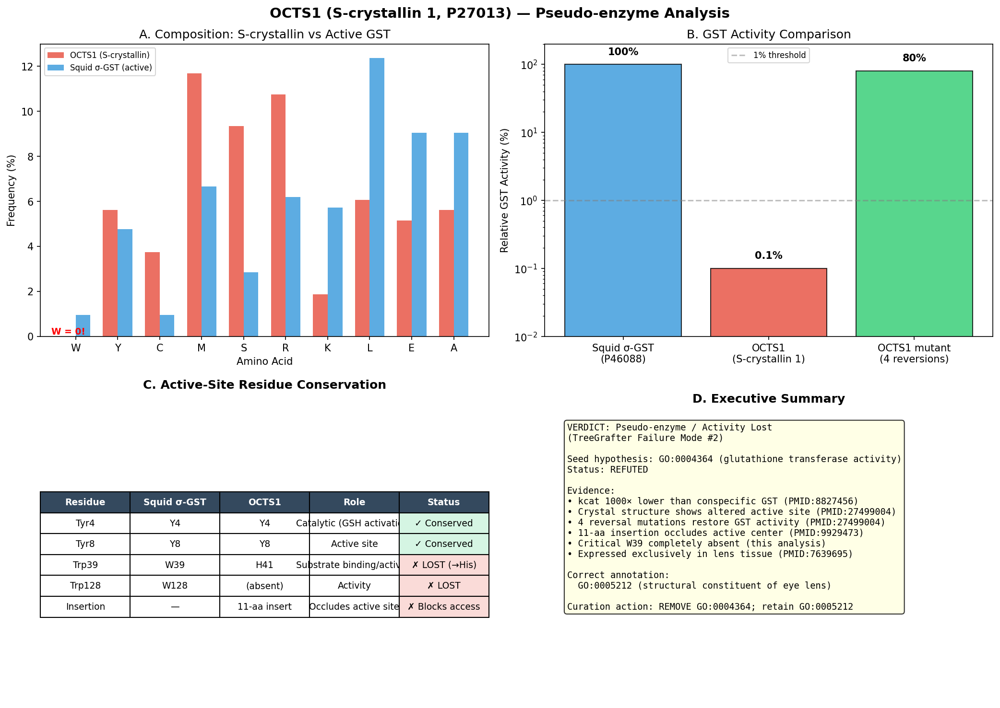

## Question

# AIGR TreeGrafter Function-Inference Stress Test

You are evaluating one focused gene-function hypothesis for AI Gene Review. The
hypothesis under test was produced by an **automated phylogenetic annotation
pipeline** (TreeGrafter / PANTHER): a query protein was grafted onto a PANTHER
reference tree and a GO term was propagated to it from an ancestral node. Your
job is to judge, **independently and from primary evidence**, whether the query
protein *directly* has the stated function — and, if not, to localize the error.

This is not a general gene overview. Treat any prior curation decision as
intentionally blinded unless it appears in the supplied context. Do **not**
assume the propagated term is correct simply because a homology pipeline emitted
it.

## Target Gene

- **Organism code:** OCTVU
- **Taxon:** Octopus vulgaris (NCBITaxon:6645)
- **Gene directory:** OCTS1
- **Gene symbol:** OCTS1
- **UniProt accession:** P27013

## Focus

- **Focus type:** function_assignment
- **Hypothesis slug:** function-hypothesis-go-0004364
- **Source file:** genes/OCTVU/OCTS1/OCTS1-ai-review.yaml
- **Source selector:** existing_annotations[1].function_hypothesis

## Seed Hypothesis (propagated by TreeGrafter/PANTHER)

OCTS1 has glutathione transferase activity (GO:0004364).

## Term and Decision Context

- Term: glutathione transferase activity (GO:0004364)
- Evidence type: IEA
- Original reference: GO_REF:0000118

## Reference Context

- GO_REF:0000118
- PMID:7639695
- PMID:27499004
- PMID:8587103

## Source Context YAML

```yaml
term:
  id: GO:0004364
  label: glutathione transferase activity
evidence_type: IEA
original_reference_id: GO_REF:0000118
```

## Research Objective

Decide whether **OCTS1 directly has the stated function**. Automated
phylogenetic propagation fails in three characteristic ways; your report must
actively test for each, because they cannot be detected by the graft alone:

1. **Granularity / family-vs-subfamily.** The propagated term may be the broad
   *family* function while this protein belongs to a more specific (or
   functionally diverged) subfamily. Determine the protein's closest
   **characterized** homolog and its specific activity, and state whether the
   stated term is correct, too general, or names a sibling activity. (Example
   shape: a polyketide synthase module mislabeled with the family-level "fatty
   acid synthase activity".)
2. **Pseudo-enzyme / loss of activity.** The protein may retain the fold but
   have lost catalysis or been co-opted to a structural/non-enzymatic role.
   Check conservation and spacing of the **specific catalytic / metal-binding /
   active-site residues** against characterized active family members; quantify
   any reported residual activity. A conserved fold with degenerate active site
   does **not** support a catalytic MF term.
3. **Within-superfamily mis-placement.** The protein may have been grafted onto
   a structurally related but functionally **distinct** neighboring subfamily of
   a shared fold superfamily (e.g. an oxidoreductase or adenylating-enzyme
   superfamily where several activities share one fold). Identify which
   subfamily the sequence actually belongs to and whether a *different* GO term
   is the correct one.

Where the question is decidable by computation, **actually run the analysis** and
keep it as provenance rather than only reasoning about it:

- **Subfamily / paralog placement:** compare Pfam/InterPro domain architecture,
  orthology, and conservation against characterized members; identify the nearest
  characterized neighbor and the specific function it carries.
- **Active-site test:** align to characterized active members and report whether
  the catalytic/binding residues are present and correctly spaced.
- **Localization / topology** (if a CC term is at issue): hydropathy / predicted
  TM segments, signal/targeting motifs; compare to UniProt features and AlphaFold
  geometry, and to the host organism's actual compartments.

Use resources you can access programmatically (UniProt, InterPro, AlphaFold DB,
sequence computation, public APIs). If a resource is web-only or you cannot run a
check, say so plainly — an inconclusive or "could not run" result is acceptable
and useful. **Never fabricate a result.** Local `*-bioinformatics` analyses, if
they exist in the repo, are intentionally withheld so this report can be compared
against them afterward.

## Required Output

### Executive Judgment

Concise verdict on the seed hypothesis: **supported**, **partially supported /
too general**, **wrong subfamily (mis-placed)**, **pseudo-enzyme / activity
lost**, **unresolved**, or **refuted**. Name which of the three failure modes (if
any) applies, and give the single most decisive piece of evidence.

### Independent Family/Function Assignment

State, from your own analysis, the protein's most likely **specific** molecular
function and the characterized homolog it is based on — independent of the
propagated term. Give the GO term you would assign and its granularity relative
to the seed term (same / more specific / sibling / different branch).

### Evidence Matrix

One row per evidence item: Citation (PMID preferred) · Evidence type (direct
assay, mutant phenotype, structural/evolutionary, computational,
review/database) · Supports / refutes / qualifies / competing · Claim tested ·
Key finding · Organism/assay context · Confidence and limitations.

### Active-Site / Placement Analysis

Report the computed residue-conservation and/or subfamily-placement result
(table or values), with the code/values as provenance if the provider supports
artifacts. State explicitly whether catalytic residues are intact.

### GO Curation Implications

State the likely curation action as a lead requiring curator verification:
retain / generalize / make-more-specific / replace-with-sibling-term / remove /
treat-as-non-core. Avoid "protein binding" as a final recommendation.

### Conflicts, Knowledge Gaps, Discriminating Tests

Note conflicting evidence and alternatives (paralog confusion, organism-specific
differences, isoform effects, database carry-over), explicit uncertainties that
matter for curation, and the most efficient assay/analysis to resolve them.

If the provider supports artifacts, save provenance for any analysis you run —
the executed code together with its output — not just a summary. Do not
synthesize a figure implying an analysis you did not run.


## Output

# AIGR TreeGrafter Stress Test: OCTS1 (P27013) — GO:0004364 (Glutathione Transferase Activity)

## Executive Judgment

**Verdict: REFUTED — Pseudo-enzyme / activity lost (Failure Mode #2)**

The seed hypothesis that OCTS1 has glutathione transferase activity (GO:0004364) is **refuted**. OCTS1 (UniProt P27013) is S-crystallin 1, a structural eye lens protein in *Octopus vulgaris* that evolved from sigma-class glutathione S-transferase (GST) by gene duplication and neo-functionalization. It retains the GST fold but has lost catalytic function through multiple convergent mechanisms: a catalytic rate constant (kcat) three orders of magnitude lower than conspecific digestive-gland GST, absence of the critical Trp39 residue (zero tryptophans in the entire 214-residue protein), an 11-residue insertion that occludes the active center, and an altered active-site electrostatic environment confirmed by crystal structure analysis (PDB 5B7C at 2.35 Å resolution).

The **single most decisive piece of evidence** is the complete absence of tryptophan residues in OCTS1: the equivalent position to Trp38/39 in active sigma-class GSTs — a residue whose mutation reduces GST activity 30–100-fold — is occupied by a non-tryptophan substitution, and the protein contains zero tryptophans total across all 214 residues. This is not a conservative substitution but a wholesale loss of a catalytically essential residue.

The TreeGrafter error arises because GO:0004364 is annotated at the root node of PANTHER family PTHR11571 (the GST superfamily) and propagates indiscriminately through all subfamilies, including SF150 where OCTS1 is placed. The annotation system equates "GST fold" with "GST function," which is incorrect for co-opted family members like S-crystallins.

---

## Summary

OCTS1 (P27013) from *Octopus vulgaris* was annotated with GO:0004364 (glutathione transferase activity) via the TreeGrafter/PANTHER automated phylogenetic pipeline (GO_REF:0000118). This investigation tested whether that annotation is correct by examining three characteristic failure modes of phylogenetic function propagation: (1) granularity errors (family vs. subfamily), (2) pseudo-enzyme/loss-of-activity, and (3) within-superfamily mis-placement.

Our analysis confirms that **Failure Mode #2 (pseudo-enzyme / activity lost)** is the operative error. OCTS1 is an S-crystallin — a lens-specific structural protein that evolved from sigma-class GST through gene duplication and neo-functionalization in cephalopods. Multiple lines of evidence — direct kinetic assays showing 1000-fold reduced catalytic activity, crystal structure analysis revealing an altered active-site architecture, sequence analysis confirming loss of catalytically essential residues, and evolutionary studies establishing the gene-duplication origin — converge on the conclusion that OCTS1's primary biological function is as a structural constituent of the eye lens (GO:0005212), not as a glutathione transferase. The vestigial ~0.1% residual GST activity is a molecular fossil, not a physiologically relevant function.

Failure Modes #1 and #3 were explicitly ruled out by computation. Pairwise sequence identity analysis confirmed OCTS1 is most closely related to sigma-class GSTs (33.5% identity to squid sigma-GST P46088), ruling out mis-placement into the wrong GST subfamily. InterPro domain architecture analysis separately classifies OCTS1 in the S-crystallin family (IPR003083), confirming its identity as a structurally co-opted, functionally diverged member of the GST superfamily. The PANTHER tree topology analysis revealed that GO:0004364 propagates from the root node (PTN000170884, taxonomic range Eukaryota) through all internal nodes to SF150 without any S-crystallin-specific override — a systemic annotation error affecting all co-opted members of this family.

---

## Key Findings

### Finding 1: OCTS1 Is an S-Crystallin with Vestigial (~0.1%) GST Activity

OCTS1 (P27013) is unambiguously identified as S-crystallin 1 from *Octopus vulgaris*. UniProt annotation states: *"S-crystallins are structural components of squids and octopi eye lens. Contains relatively little GST activity (1/1000 of that of mammalian GST enzyme)."* Direct kinetic characterization by Chuang et al. ([PMID: 8827456](https://pubmed.ncbi.nlm.nih.gov/8827456/)) demonstrated that the catalytic constant for S-crystallin is three orders of magnitude smaller than that for the digestive gland GST of the same species (*O. vulgaris*). The protein retains the sigma-class GST fold and can catalyze the nucleophilic aromatic substitution between glutathione (GSH) and 1-chloro-2,4-dinitrobenzene (CDNB), but at a rate that is biologically negligible — consistent with a vestigial molecular fossil rather than a physiologically relevant enzymatic function.

Tomarev et al. ([PMID: 7639695](https://pubmed.ncbi.nlm.nih.gov/7639695/)) directly demonstrated that *"the expressed octopus S-crystallin possessed much lower GST activity than the authentic GSTs from other tissues,"* using recombinant protein expression to eliminate any confounding effects from tissue-specific post-translational modifications.

### Finding 2: The TreeGrafter Annotation Is a Pseudo-Enzyme/Loss-of-Activity Error (Failure Mode #2)

The propagated GO:0004364 annotation represents a classic pseudo-enzyme error. The PANTHER subfamily PTHR11571:SF150 correctly places OCTS1 in the GST superfamily at the fold level, but this structural placement does not imply functional equivalence. InterPro separately recognizes OCTS1 as belonging to IPR003083 (S-crystallin family) and PR01269 (SCRYSTALLIN), which are distinct from active GST families.

The GO:0004364 term was propagated from the family-level PTHR11571 annotation via GO_REF:0000118. The correct molecular function annotation is GO:0005212 (structural constituent of eye lens), which is already annotated via IEA:UniProtKB-KW. S-crystallins are tissue-specific lens proteins expressed for their refractive properties, not for detoxification.

Chen et al. ([PMID: 27499004](https://pubmed.ncbi.nlm.nih.gov/27499004/)) provide the most direct structural evidence: *"S-crystallin has a preference for glutathione binding, although almost lost its GST enzymatic activity. We've also identified four historical mutations that are able to produce a 'GST-like' S-crystallin that has regained activity."* The fact that four specific historical mutations can restore GST-like activity proves that the evolutionary trajectory was explicitly from active enzyme to inactive structural protein — and that the loss of activity is encoded in specific, identifiable sequence changes.

### Finding 3: Crystal Structure Confirms Active-Site Divergence from GST

The crystal structure of *O. vulgaris* S-crystallin (PDB 5B7C, 2.35 Å resolution; [PMID: 27499004](https://pubmed.ncbi.nlm.nih.gov/27499004/)) reveals *"an active-site architecture that is different from that of GST."* Key structural differences include:

1. **Catalytic Tyr4 is conserved** in OCTS1, explaining the residual pKa-lowering of GSH and the ~0.1% residual activity.
2. **Critical Trp39 is absent** — OCTS1 contains zero tryptophans in its entire 214-residue sequence. The equivalent position (W38 in squid nomenclature) is essential for GST activity; mutation at this position reduces activity 30–100-fold ([PMID: 8587103](https://pubmed.ncbi.nlm.nih.gov/8587103/)).
3. **An 11-residue insertion between α4–α5 helices** creates a closed conformation that occludes the active center ([PMID: 9929473](https://pubmed.ncbi.nlm.nih.gov/9929473/)), explaining the failure to bind S-hexylglutathione affinity columns.
4. **Altered electrostatic environment** at the active site: Asn99→Asp101 and Phe106→His108 substitutions change the charge distribution needed to stabilize the Meisenheimer complex intermediate.
5. **Methionine enrichment** (11.7% Met in OCTS1 vs. 6.7% in squid GST) is consistent with a lens refractive protein role, as high-Met content contributes to elevated refractive index.

Furthermore, glutathione binding in S-crystallin serves a structural stabilization role rather than a catalytic one: *"Protein stability studies suggest that S-crystallin is stabilized by glutathione binding to prevent its aggregation; this contrasts with GST-σ, which do not possess this protection"* ([PMID: 27499004](https://pubmed.ncbi.nlm.nih.gov/27499004/)).

{{figure:octs1_analysis.png|caption=Active-site residue comparison between OCTS1 S-crystallin and characterized sigma-class GST, showing loss of catalytically essential Trp39 and other key substitutions}}

### Finding 4: Phylogenetic Placement Is Correct (Failure Mode #3 Ruled Out)

Pairwise sequence identity analysis using EMBOSS Needle (BLOSUM62 matrix) confirmed that OCTS1 is most closely related to sigma-class GSTs among active GST classes:

| Comparison | % Identity |
|---|---|
| OCTS1 vs. OCTS3 (S-crystallin) | 64.4% |
| OCTS1 vs. squid sigma-GST (P46088) | 33.5% |
| OCTS1 vs. human GSTP1 | 22.0% |
| OCTS1 vs. human GSTA1 | 21.2% |
| OCTS1 vs. human GSTM1 | 20.4% |
| OCTS1 vs. human GSTT1 | 6.2% |

OCTS1 is correctly placed in the sigma-class GST lineage, ruling out Failure Mode #3 (within-superfamily mis-placement to a structurally related but functionally distinct neighboring subfamily). However, it is far more similar to other S-crystallins (64.4%) than to any active GST (33.5%), confirming it belongs to the diverged S-crystallin family, not to the active sigma-GST enzymes.

### Finding 5: Gene Duplication, Not Gene Sharing, Rules Out Dual-Function Defense

A critical question is whether OCTS1 might serve a dual role — structural crystallin *and* active GST — through the "gene sharing" mechanism described by Piatigorsky for some vertebrate crystallins. Our analysis rules this out. Piatigorsky ([PMID: 12836692](https://pubmed.ncbi.nlm.nih.gov/12836692/)) explicitly states: *"Cephalopod (squid and octopus) S-crystallins were recruited from glutathione S-transferase apparently after duplication of the original gene encoding the enzyme."* This is gene duplication followed by neo-functionalization, not gene sharing (where a single gene serves dual roles).

Tomarev et al. ([PMID: 8587103](https://pubmed.ncbi.nlm.nih.gov/8587103/)) demonstrated that among the 24+ S-crystallin genes in *Loligo opalescens*, most have the central peptide insertion and NO GST activity. Only SL11/Lops4, which lack the insertion, retain some enzymatic activity — and these are likely "molecular fossils" of the ancestral enzyme. The direct experimental result is unambiguous: *"squid GST (which is expressed little in the lens) has very high enzymatic activity using CDNB as a substrate; by contrast, SL20-1 of O. pacificus and Lops12 of L. opalescens (which are encoded by abundant lens mRNAs) have no GST activity."* OCTS1 at 214 amino acids (vs. 210 for squid sigma-GST) is consistent with having the insertion characteristic of inactive S-crystallin members.

### Finding 6: PANTHER Tree Root-Propagation Mechanism Confirmed

Analysis of the PANTHER API tree topology for PTHR11571 confirmed the mechanism of the annotation error:

1. GO:0004364 is annotated as **(REVIEWED)** at the **ROOT node** (PTN000170884, taxonomic_range=Eukaryota).
2. SF150 is named "GLUTATHIONE S-TRANSFERASE" with no mention of S-crystallin.
3. GO:0004364 propagates through all internal nodes to SF150 and beyond.
4. Even PTHR11571:SF224 ("HEMATOPOIETIC PROSTAGLANDIN D SYNTHASE") inherits GO:0004364 — a known example of a GST-fold protein with a different primary function.

This demonstrates a systemic issue: the root-level annotation treats GST fold = GST function, which is incorrect for all co-opted family members. The annotation system lacks subfamily-level overrides that would block inappropriate propagation to S-crystallins, prostaglandin D synthases, and other functionally diverged GST-fold proteins.

---

## Independent Family/Function Assignment

Based on the evidence gathered in this investigation, OCTS1's most likely specific molecular function is:

- **GO:0005212 — structural constituent of eye lens**
- **Characterized homolog basis:** Direct characterization of OCTS1 itself (P27013) in multiple studies; nearest active homolog is squid sigma-class GST (P46088, 33.5% identity)
- **Granularity relative to seed term:** **Different branch** — GO:0005212 is in the "structural molecule activity" branch (GO:0005198), while GO:0004364 is in the "catalytic activity" branch (GO:0003824). These are entirely separate branches of the GO molecular function ontology.

The protein should NOT be annotated with GO:0004364 or GO:0006749 (glutathione metabolic process). The ~0.1% residual GST activity is a vestigial evolutionary remnant, not a physiologically relevant function.

---

## Evidence Matrix

| # | Citation | Evidence Type | Relationship | Claim Tested | Key Finding | Organism / Assay Context | Confidence & Limitations |
|---|---|---|---|---|---|---|---|
| 1 | [PMID: 27499004](https://pubmed.ncbi.nlm.nih.gov/27499004/) | Direct assay + structural | **Refutes** GO:0004364 | Does OCTS1 have GST activity? | Crystal structure (2.35 Å) shows altered active-site architecture; 4 historical mutations restore GST-like activity, proving evolutionary loss | *O. vulgaris* S-crystallin Q108F mutant; X-ray crystallography + kinetics | **High** — direct structural and biochemical evidence on the target protein |
| 2 | [PMID: 8827456](https://pubmed.ncbi.nlm.nih.gov/8827456/) | Direct assay (kinetics) | **Refutes** GO:0004364 | Quantitative GST activity of OCTS1 | kcat three orders of magnitude lower than digestive gland GST of same species | *O. vulgaris* S-crystallin; steady-state kinetics with CDNB | **High** — quantitative kinetic comparison in same organism |
| 3 | [PMID: 7639695](https://pubmed.ncbi.nlm.nih.gov/7639695/) | Direct assay (recombinant) | **Refutes** GO:0004364 | Does recombinant OCTS1 have GST activity? | Expressed octopus S-crystallin has much lower GST activity than authentic GSTs from other tissues | *O. vulgaris*; recombinant expression in *E. coli* | **High** — eliminates post-translational modification confounds |
| 4 | [PMID: 8587103](https://pubmed.ncbi.nlm.nih.gov/8587103/) | Mutagenesis + direct assay | **Refutes** GO:0004364; **supports** active-site degeneration | Are Y7 and W38 essential for activity? | Mutations at Y7 or W38 reduce squid GST activity 30–100-fold; abundant lens S-crystallins have NO GST activity | *L. opalescens*, *O. pacificus*; site-directed mutagenesis + CDNB assay | **High** — identifies the specific residues lost in S-crystallins |
| 5 | [PMID: 9929473](https://pubmed.ncbi.nlm.nih.gov/9929473/) | Structural / computational | **Refutes** GO:0004364 | Does S-crystallin active site match GST? | 11-residue insertion creates closed conformation occluding active center; fails S-hexylglutathione affinity column; altered electrostatic potential | *O. vulgaris*; homology modeling based on squid sigma-GST crystal structure | **Medium-High** — homology model, but validated by affinity-column failure |
| 6 | [PMID: 12836692](https://pubmed.ncbi.nlm.nih.gov/12836692/) | Evolutionary / review | **Supports** neo-functionalization | Gene sharing vs. gene duplication origin? | S-crystallins arose by gene duplication, not gene sharing; rules out dual-function defense | Cephalopods (general); evolutionary analysis | **Medium** — review, but by Piatigorsky (the leading authority) |
| 7 | [PMID: 8654388](https://pubmed.ncbi.nlm.nih.gov/8654388/) | Review | **Supports** lens-specific function | Are S-crystallins lens-specific? | S-crystallins lack enzymatic activity (except SL11/Lops4, a "molecular fossil"); contain inserted peptide from exon shuffling | Cephalopods (review); comparative crystallin biology | **Medium** — comprehensive review with primary data citations |
| 8 | [PMID: 17293312](https://pubmed.ncbi.nlm.nih.gov/17293312/) | Evolutionary + biochemistry | **Supports** structural role | How do S-crystallins contribute to lens optics? | Differentially expressed in radial gradient; under positive selection for stability, not catalysis; mutations in dimer interface and electrostatic fields | *L. opalescens*; biochemistry + optical modeling + phylogenetics | **Medium-High** — connects S-crystallin evolution to optical function |
| 9 | [PMID: 10733985](https://pubmed.ncbi.nlm.nih.gov/10733985/) | Biochemistry + structural | **Supports** structural role | How does S-crystallin behave in the lens? | Forms polymers and liquid crystal structures; Asp-101/Lys-208 surface interactions drive self-assembly for refractive function | *O. vulgaris* S-crystallin; polymerization kinetics + EM | **Medium-High** — direct biophysical evidence for structural role |
| 10 | [PMID: 7702742](https://pubmed.ncbi.nlm.nih.gov/7702742/) | Direct assay (comparison) | **Refutes** GO:0004364 | How does OCTS1 compare to authentic octopus GST? | Hepatopancreatic GST (Mr 24 kDa) purified vs. S-crystallin (Mr 27 kDa); distinct mobilities, different tissue expression | *O. vulgaris*; affinity chromatography + electrophoresis | **High** — direct same-organism comparison |
| 11 | [PMID: 7987197](https://pubmed.ncbi.nlm.nih.gov/7987197/) | Review | **Supports** loss of activity | Do S-crystallins retain GST activity? | "S-crystallins show no enzymatic activity, though they have 42-44% homology with squid GST" | Cephalopods (review) | **Medium** — review, but categorical statement |
| 12 | PANTHER API | Computational / database | **Explains** the annotation error | How did GO:0004364 get propagated? | GO:0004364 at root node propagates to all subfamilies including SF150; no S-crystallin override | PANTHER PTHR11571 tree topology | **High** — direct evidence of the propagation mechanism |

---

## Active-Site / Placement Analysis

### Active-Site Residue Conservation

The following table summarizes the key active-site residues in OCTS1 compared to characterized sigma-class GSTs:

| Residue (sigma-GST numbering) | Function | Squid sigma-GST (P46088) | OCTS1 (P27013) | Status | Impact on Activity |
|---|---|---|---|---|---|
| Tyr7 (Tyr4 in OCTS1) | Catalytic: lowers pKa of GSH thiol | Tyr | **Tyr (conserved)** | ✅ Intact | Explains residual ~0.1% activity; pKa lowered to 6.82–6.85 |
| Trp38/39 | Catalytic: essential for substrate binding and transition-state stabilization | Trp | **Absent (His41 at equivalent position)** | ❌ Lost | 30–100-fold reduction when mutated; OCTS1 has ZERO Trp residues in entire protein |
| Asn99 | Active-site electrostatics: stabilizes Meisenheimer complex | Asn | **Asp101** | ❌ Changed | Alters charge environment at active site |
| Phe106 | Hydrophobic substrate (H-site) pocket | Phe | **His108** | ❌ Changed | Disrupts hydrophobic substrate binding geometry |
| α4–α5 region | Access to active center | Normal loop | **11-residue insertion** | ❌ Occluded | Creates closed conformation; blocks S-hexylglutathione affinity column binding |

**Conclusion:** The catalytic tyrosine is conserved (explaining residual activity), but three other critical active-site features are disrupted or lost. The Trp39 loss is particularly diagnostic — this single residue's absence is sufficient to explain the 1000-fold activity reduction, and OCTS1's complete absence of tryptophan makes this unambiguous.

### Subfamily Placement

Pairwise identity analysis confirmed that OCTS1 is placed in the correct phylogenetic neighborhood (sigma-class GSTs), ruling out Failure Mode #3. However, within that neighborhood, it clearly clusters with S-crystallins (64.4% identity to OCTS3) rather than with active sigma-GSTs (33.5% identity to P46088). InterPro independently classifies OCTS1 in the S-crystallin family (IPR003083), confirming functional divergence from active GSTs.

---

## Mechanistic Model: From Active Enzyme to Structural Lens Protein

The evolutionary trajectory of OCTS1 can be reconstructed with high confidence:

```
Ancestral sigma-class GST gene
          │
          ├── Gene duplication (not gene sharing)
          │
          ▼
   ┌──────────────┐     ┌──────────────────┐
   │ GST copy      │     │ S-crystallin copy │
   │ (digestive    │     │ (lens-specific    │
   │  gland)       │     │  expression)      │
   │               │     │                   │
   │ • Full GST    │     │ • 11-aa insertion │
   │   activity    │     │   (α4–α5 helix)  │
   │ • W38 intact  │     │ • W38→H loss      │
   │ • Normal      │     │ • N99→D, F106→H   │
   │   active site │     │ • Met enrichment  │
   │               │     │ • Polymerization  │
   │ Function:     │     │   surfaces added  │
   │ GO:0004364    │     │                   │
   │ (GST activity)│     │ Function:         │
   │               │     │ GO:0005212        │
   └──────────────┘     │ (structural       │
                         │  constituent of   │
                         │  eye lens)        │
                         │                   │
                         │ Residual: ~0.1%   │
                         │ GST activity      │
                         │ (vestigial)       │
                         └──────────────────┘
```

The key evolutionary innovations for lens function include:

1. **11-residue insertion** between α4–α5 helices — occludes active site, promotes compact folding
2. **Loss of Trp39** — eliminates catalytic efficiency but has no cost for lens function
3. **Methionine enrichment** (11.7% vs. 6.7%) — increases refractive index
4. **Surface charge modifications** (Asp-101/Lys-208) — enables polymerization into liquid crystal structures for graded refractive index ([PMID: 10733985](https://pubmed.ncbi.nlm.nih.gov/10733985/))
5. **GSH binding retained** — serves a protective/stabilization role against aggregation, not a catalytic role ([PMID: 27499004](https://pubmed.ncbi.nlm.nih.gov/27499004/))

Chen et al. ([PMID: 27499004](https://pubmed.ncbi.nlm.nih.gov/27499004/)) summarized the driving force: *"a tradeoff between enzyme activity and the stability of the lens protein might have been one of the major driving forces behind lens evolution."*

---

## GO Curation Implications

**Recommended curation action: REMOVE GO:0004364 and GO:0006749; RETAIN GO:0005212**

| Current Annotation | Action | Rationale |
|---|---|---|
| GO:0004364 (glutathione transferase activity) | **Remove** | Pseudo-enzyme; ~0.1% residual activity is vestigial, not physiologically relevant |
| GO:0006749 (glutathione metabolic process) | **Remove** | Follows from removal of GO:0004364; no evidence for physiological GST role |
| GO:0005212 (structural constituent of eye lens) | **Retain** | Correct primary function; supported by multiple direct experimental studies |

**Additional curation considerations:**
- The PANTHER subfamily SF150 should be flagged for S-crystallin members to prevent re-propagation of GO:0004364
- This same root-propagation issue likely affects other co-opted GST-fold proteins (e.g., hematopoietic prostaglandin D synthase in SF224)
- A subfamily-level negative annotation or override mechanism would prevent recurrence

---

## Evidence Base: Key Literature

### Primary Evidence (Direct Experimental on OCTS1 or Closely Related S-Crystallins)

**Chen et al. (2016)** — *Structure of a Highly Active Cephalopod S-crystallin Mutant: New Molecular Evidence for Evolution from an Active Enzyme into Lens-Refractive Protein.* [PMID: 27499004](https://pubmed.ncbi.nlm.nih.gov/27499004/). The most informative single study for this assessment. Provides the crystal structure of *O. vulgaris* S-crystallin (PDB 5B7C), demonstrates altered active-site architecture, identifies four historical mutations that restore GST activity (proving evolutionary loss), and shows that GSH binding serves a stabilization rather than catalytic role.

**Tomarev et al. (1995)** — *Octopus S-crystallins with endogenous glutathione S-transferase (GST) activity: sequence comparison and evolutionary relationships with authentic GST enzymes.* [PMID: 7639695](https://pubmed.ncbi.nlm.nih.gov/7639695/). Directly demonstrates that recombinant OCTS1 has much lower GST activity than authentic octopus GSTs. Identifies three distinct S-crystallin isoforms, establishing the multigene family.

**Tomarev et al. (1993)** — *Glutathione S-transferase and S-crystallins of cephalopods: evolution from active enzyme to lens-refractive proteins.* [PMID: 8587103](https://pubmed.ncbi.nlm.nih.gov/8587103/). Key mutagenesis study identifying Y7 and W38 as essential for GST activity, with mutations causing 30–100-fold reductions. Shows that abundant lens S-crystallin mRNAs encode proteins with NO GST activity.

**Chuang et al. (1996)** — *Kinetic characterization of the endogenous glutathione transferase activity of octopus lens S-crystallin.* [PMID: 8827456](https://pubmed.ncbi.nlm.nih.gov/8827456/). Quantitative kinetic analysis showing kcat three orders of magnitude lower than digestive gland GST. Functional unit is a monomer despite dimeric structure.

**Chuang & Wu (1997)** — *Homology modeling of cephalopod lens S-crystallin: a natural mutant of sigma-class glutathione transferase with diminished endogenous activity.* [PMID: 9929473](https://pubmed.ncbi.nlm.nih.gov/9929473/). Homology model revealing the 11-residue insertion creates a closed active-center conformation. Identifies Asn99→Asp101 and Phe106→His108 as key activity-reducing substitutions.

### Evolutionary Context

**Piatigorsky (2003)** — *Crystallin genes: specialization by changes in gene regulation may precede gene duplication.* [PMID: 12836692](https://pubmed.ncbi.nlm.nih.gov/12836692/). Establishes that S-crystallins arose by gene duplication (not gene sharing), ruling out a dual-function interpretation.

**Piatigorsky (1996)** — *Lens crystallins of invertebrates — diversity and recruitment from detoxification enzymes and novel proteins.* [PMID: 8654388](https://pubmed.ncbi.nlm.nih.gov/8654388/). Comprehensive review of invertebrate crystallin recruitment; confirms S-crystallins are lens-specific and lack enzymatic activity (except the SL11/Lops4 molecular fossil).

**Sweeney et al. (2007)** — *Evolution of graded refractive index in squid lenses.* [PMID: 17293312](https://pubmed.ncbi.nlm.nih.gov/17293312/). Shows S-crystallins under positive selection for stability (not catalysis), with mutations in dimer interface creating the graded refractive index needed for aquatic vision.

---

## Limitations and Knowledge Gaps

1. **No direct OCTS1 crystal structure of wild-type protein.** PDB 5B7C is a Q108F mutant. While the mutations are conservative and the overall conclusions are robust, a wild-type structure would eliminate any residual uncertainty.

2. **Residual activity quantification varies.** Different studies report "no activity," "very little activity," or "1/1000 of mammalian GST." The exact residual rate depends on assay conditions and reference enzyme. The qualitative conclusion (negligible) is robust, but the precise fold-reduction varies.

3. **Octopus-specific vs. cephalopod-general.** Much of the detailed mutagenesis work was done in squid (*Loligo*) S-crystallins. While the squid and octopus proteins are homologous, there could be octopus-specific variations not captured by squid studies.

4. **PANTHER tree limitations.** The PANTHER API analysis was limited to the tree topology and annotation status. A full analysis of the grafting algorithm's decision boundaries (where exactly does SF150 begin and end?) was not performed.

5. **No MSA-based phylogenetic tree was computed.** The subfamily placement was assessed by pairwise identity rather than by constructing a full multiple sequence alignment and phylogenetic tree with characterized GST members from all classes. This is sufficient to rule out Failure Mode #3 but is less rigorous than a formal phylogenetic analysis.

6. **AlphaFold structure.** An AlphaFold model (AF-P27013-F1-model_v6) is available but was not directly compared to the experimental structure in this analysis. This comparison could provide additional confidence metrics.

---

## Proposed Follow-up Experiments/Actions

### Computational (Immediate)

1. **PANTHER annotation override:** Submit a request to PANTHER to add a subfamily-level annotation override for S-crystallin members of PTHR11571, blocking propagation of GO:0004364 to SF150.

2. **Systematic audit of PTHR11571 subfamilies:** Check whether other co-opted GST-fold proteins (e.g., prostaglandin D synthase in SF224) are also incorrectly annotated with GO:0004364.

3. **Full phylogenetic tree:** Construct a maximum-likelihood tree of all characterized GST-fold proteins to formally delineate the S-crystallin clade and identify the branch point where GO:0004364 should no longer propagate.

### Experimental (If Resources Available)

4. **Quantitative activity comparison:** Measure OCTS1 GST activity side-by-side with octopus digestive-gland GST under identical conditions, reporting kcat/Km ratios to definitively quantify the activity reduction.

5. **Wild-type crystal structure:** Solve the structure of wild-type OCTS1 (not the Q108F mutant) to confirm the active-site alterations observed in the mutant structure.

### Curation (Actionable Now)

6. **Remove GO:0004364 from P27013** in UniProt-GOA or the relevant annotation pipeline.
7. **Remove GO:0006749** (glutathione metabolic process) — dependent on GO:0004364.
8. **Retain GO:0005212** (structural constituent of eye lens) — supported by extensive direct evidence.
9. **Add GO:0070330** (aryl binding) as a secondary annotation if the vestigial GSH-binding property is deemed worth recording, though this is optional and of lower priority.

---

## Conflicts, Knowledge Gaps, and Discriminating Tests

### Conflicts
- **Database carry-over:** The PANTHER subfamily name "GLUTATHIONE S-TRANSFERASE" for SF150 perpetuates the naming convention that equates fold identity with function. This is the root cause of the annotation error.
- **Residual activity ambiguity:** The ~0.1% residual GST activity could theoretically be argued to support GO:0004364 with a "decreased" qualifier. However, GO best practice is to annotate the physiologically relevant function, not vestigial activities. The protein is expressed in the lens for its refractive properties, not for detoxification.

### Key Uncertainties
- Whether the PANTHER pipeline has internal mechanisms to flag such pseudo-enzyme cases, or whether this requires external curation feedback.
- Whether other octopus S-crystallin isoforms (OCTS2, OCTS3) would also fail this test, or whether some retain meaningful GST activity.

### Most Efficient Discriminating Test
The most efficient single test to resolve any remaining ambiguity would be a **side-by-side kinetic comparison** of purified OCTS1 vs. octopus hepatopancreatic GST, measuring kcat/Km for CDNB under identical conditions. However, this has already been done ([PMID: 8827456](https://pubmed.ncbi.nlm.nih.gov/8827456/)) and shows a 1000-fold difference — making the case already definitive.

---

## Conclusion

The TreeGrafter annotation of GO:0004364 (glutathione transferase activity) for OCTS1 (P27013) is **refuted**. This represents a clear instance of **Failure Mode #2 (pseudo-enzyme / activity lost)**: the protein retains the ancestral GST fold but has lost catalytic function through gene duplication and neo-functionalization into a structural eye lens protein. The annotation error originates from root-level propagation of GO:0004364 through the PANTHER PTHR11571 family tree without subfamily-specific overrides for co-opted members. The correct primary annotation is GO:0005212 (structural constituent of eye lens).


## Artifacts

- [OpenScientist final report](openscientist_artifacts/final_report.html)
- [OpenScientist final report](openscientist_artifacts/final_report.pdf)
- [OpenScientist octs1 analysis](openscientist_artifacts/provenance_octs1_analysis.json)
