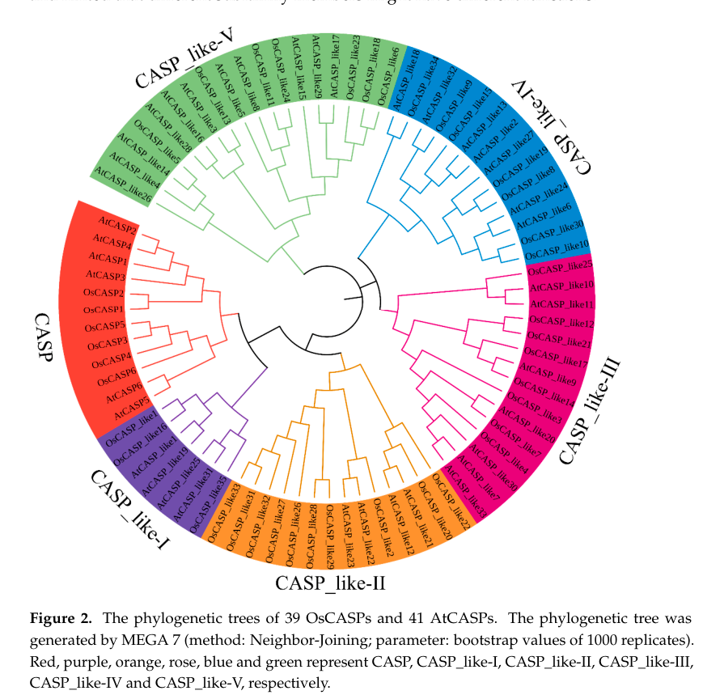

## Question

# Gene Research for Functional Annotation

## ⚠️ CRITICAL: Gene/Protein Identification Context

**BEFORE YOU BEGIN RESEARCH:** You MUST verify you are researching the CORRECT gene/protein. Gene symbols can be ambiguous, especially for less well-characterized genes from non-model organisms.

### Target Gene/Protein Identity (from UniProt):
- **UniProt Accession:** Q84UT5
- **Protein Description:** RecName: Full=CASP-like protein BLE3; AltName: Full=CASP-like protein 1C2; Short=OsCASPL1C2; AltName: Full=Protein brassinolide-enhanced 3; Short=OsBLE3; Short=Protein BL-enhanced 3;
- **Gene Information:** Name=BLE3; OrderedLocusNames=Os05g0245300, LOC_Os05g15630; ORFNames=OsJ_017008, OSJNBa0037H06.9;
- **Organism (full):** Oryza sativa subsp. japonica (Rice).
- **Protein Family:** Belongs to the Casparian strip membrane proteins (CASP)
- **Key Domains:** CASP/CASPL. (IPR006459); CASP_dom. (IPR006702); CASPL. (IPR044173); CASP_dom (PF04535)

### MANDATORY VERIFICATION STEPS:

1. **Check if the gene symbol "BLE3" matches the protein description above**
2. **Verify the organism is correct:** Oryza sativa subsp. japonica (Rice).
3. **Check if protein family/domains align with what you find in literature**
4. **If you find literature for a DIFFERENT gene with the same or similar symbol, STOP**

### If Gene Symbol is Ambiguous or You Cannot Find Relevant Literature:

**DO NOT PROCEED WITH RESEARCH ON A DIFFERENT GENE.** Instead:
- State clearly: "The gene symbol 'BLE3' is ambiguous or literature is limited for this specific protein"
- Explain what you found (e.g., "Found extensive literature on a different gene with the same symbol in a different organism")
- Describe the protein based ONLY on the UniProt information provided above
- Suggest that the protein function can be inferred from domain/family information

### Research Target:

Please provide a comprehensive research report on the gene **BLE3** (gene ID: Q84UT5, UniProt: Q84UT5) in ORYSJ.

The research report should be a detailed narrative explaining the function, biological processes, and localization of the gene product. Citations should be given for all claims.

You should prioritize authoritative reviews and primary scientific literature when conducting research. You can supplement
this with annotations you find in gene/protein databases, but these can be outdated or inaccurate.

We are specifically interested in the primary function of the gene - for enzymes, what reaction is catalyzed, and what is the substrate specificity? For transporters, what is the substrate? For structural proteins or adapters, what is the broader structural role? For signaling molecules, what is the role in the pathway.

We are interested in where in or outside the cell the gene product carries out its function.

We are also interested in the signaling or biochemical pathways in which the gene functions. We are less interested in broad pleiotropic effects, except where these elucidate the precise role.

Include evidence where possible. We are interested in both experimental evidence as well as inference from structure, evolution, or bioinformatic analysis. Precise studies should be prioritized over high-throughput, where available.

## Output

Question: You are an expert researcher providing comprehensive, well-cited information.

Provide detailed information focusing on:
1. Key concepts and definitions with current understanding
2. Recent developments and latest research (prioritize 2023-2024 sources)
3. Current applications and real-world implementations
4. Expert opinions and analysis from authoritative sources
5. Relevant statistics and data from recent studies

Format as a comprehensive research report with proper citations. Include URLs and publication dates where available.
Always prioritize recent, authoritative sources and provide specific citations for all major claims.

# Gene Research for Functional Annotation

## ⚠️ CRITICAL: Gene/Protein Identification Context

**BEFORE YOU BEGIN RESEARCH:** You MUST verify you are researching the CORRECT gene/protein. Gene symbols can be ambiguous, especially for less well-characterized genes from non-model organisms.

### Target Gene/Protein Identity (from UniProt):
- **UniProt Accession:** Q84UT5
- **Protein Description:** RecName: Full=CASP-like protein BLE3; AltName: Full=CASP-like protein 1C2; Short=OsCASPL1C2; AltName: Full=Protein brassinolide-enhanced 3; Short=OsBLE3; Short=Protein BL-enhanced 3;
- **Gene Information:** Name=BLE3; OrderedLocusNames=Os05g0245300, LOC_Os05g15630; ORFNames=OsJ_017008, OSJNBa0037H06.9;
- **Organism (full):** Oryza sativa subsp. japonica (Rice).
- **Protein Family:** Belongs to the Casparian strip membrane proteins (CASP)
- **Key Domains:** CASP/CASPL. (IPR006459); CASP_dom. (IPR006702); CASPL. (IPR044173); CASP_dom (PF04535)

### MANDATORY VERIFICATION STEPS:

1. **Check if the gene symbol "BLE3" matches the protein description above**
2. **Verify the organism is correct:** Oryza sativa subsp. japonica (Rice).
3. **Check if protein family/domains align with what you find in literature**
4. **If you find literature for a DIFFERENT gene with the same or similar symbol, STOP**

### If Gene Symbol is Ambiguous or You Cannot Find Relevant Literature:

**DO NOT PROCEED WITH RESEARCH ON A DIFFERENT GENE.** Instead:
- State clearly: "The gene symbol 'BLE3' is ambiguous or literature is limited for this specific protein"
- Explain what you found (e.g., "Found extensive literature on a different gene with the same symbol in a different organism")
- Describe the protein based ONLY on the UniProt information provided above
- Suggest that the protein function can be inferred from domain/family information

### Research Target:

Please provide a comprehensive research report on the gene **BLE3** (gene ID: Q84UT5, UniProt: Q84UT5) in ORYSJ.

The research report should be a detailed narrative explaining the function, biological processes, and localization of the gene product. Citations should be given for all claims.

You should prioritize authoritative reviews and primary scientific literature when conducting research. You can supplement
this with annotations you find in gene/protein databases, but these can be outdated or inaccurate.

We are specifically interested in the primary function of the gene - for enzymes, what reaction is catalyzed, and what is the substrate specificity? For transporters, what is the substrate? For structural proteins or adapters, what is the broader structural role? For signaling molecules, what is the role in the pathway.

We are interested in where in or outside the cell the gene product carries out its function.

We are also interested in the signaling or biochemical pathways in which the gene functions. We are less interested in broad pleiotropic effects, except where these elucidate the precise role.

Include evidence where possible. We are interested in both experimental evidence as well as inference from structure, evolution, or bioinformatic analysis. Precise studies should be prioritized over high-throughput, where available.

## Research Report: Rice **BLE3** (UniProt **Q84UT5**) — Functional Annotation, Evidence, and Current Understanding

### 1) Mandatory identity verification (critical)
The user-specified target is UniProt **Q84UT5**, annotated as a **CASP-like protein BLE3** (CASP/CASPL family) from *Oryza sativa* subsp. *japonica* (rice). In the peer‑reviewed primary literature, a rice gene explicitly named **OsBLE3** is experimentally characterized and maps to **LOC_Os05g15630** (chromosome 5), i.e., the same locus name included in the UniProt record provided by the user (LOC_Os05g15630). This supports that the gene symbol **BLE3/OsBLE3** corresponds to the rice locus used in that study (https://doi.org/10.1016/j.phytochem.2006.05.026; publication date: **2006-07**) (yang2006osble3abrassinolideenhanced pages 2-4, yang2006osble3abrassinolideenhanced pages 1-2).

However, the 2006 OsBLE3 study describes a small multi‑pass membrane protein with **3 predicted transmembrane segments** and a **mitochondrial targeting peptide / probable mitochondrial inner membrane localization**, while modern CASP/CASPL literature commonly describes **CASP/CASPL proteins as 4‑transmembrane (MARVEL‑branch) plasma‑membrane proteins** that assemble the Casparian strip membrane domain. This creates a **non-trivial annotation tension**: (i) BLE3 may indeed be a CASP/CASPL (DUF588/PF04535-based) family member but earlier predictions differed, or (ii) some database annotations may have been revised/propagated without direct protein-localization validation for BLE3/Q84UT5. Because the tools here cannot directly query UniProt/InterPro records, I treat CASP/CASPL assignment for Q84UT5 as **plausible but not experimentally verified for BLE3 specifically** based on the retrieved evidence (yang2006osble3abrassinolideenhanced pages 2-4, barbosa2023directedgrowthand pages 11-12).

### 2) Key concepts and definitions (current understanding)
**Casparian strip (CS):** a lignin-impregnated cell-wall band in root endodermis (and in some species exodermis) that forms an **apoplastic diffusion barrier** controlling water and mineral movement. Disrupting CS integrity can alter ion homeostasis and nutrient uptake (xue2024comparativeanalysisof pages 1-2, yang2022riceoscasp1orchestrates pages 1-2).

**CASP / CASP-like (CASPL) proteins:** membrane proteins that define the **Casparian strip membrane domain (CSD)** and contribute to forming a scaffold/matrix that recruits/organizes lignin polymerization components and secreted factors involved in localized lignification (e.g., RBOHF, ESB1, PER64, UCC1 are cited in the family-level context). In rice, CASP/CASPL repertoires have been systematically enumerated using the **DUF588 (PF04535)** HMM as the defining domain signature (xue2024comparativeanalysisof pages 1-2, yang2022riceoscasp1orchestrates pages 1-2).

### 3) Gene/protein features of rice OsBLE3 from primary literature (direct evidence)
#### 3.1 Protein size and predicted topology
Yang et al. cloned OsBLE3 cDNA (865 bp) encoding a **162 aa** protein (~**16.8 kDa**, predicted pI **8.24**), and predicted **three transmembrane domains** plus an N‑terminal targeting peptide, with PSORT/MitoProt II supporting probable **mitochondrial inner membrane localization** (https://doi.org/10.1016/j.phytochem.2006.05.026; **2006-07**) (yang2006osble3abrassinolideenhanced pages 2-4, yang2006osble3abrassinolideenhanced pages 6-8).

#### 3.2 Expression patterns (tissue/cell-type)
OsBLE3 transcript accumulation was highest in **roots** and **leaf sheath** and was detected in regions consistent with active growth: **vascular bundles**, **shoot apical meristem**, **organ primordia**, and **branch root primordia** (via Northern blot, in situ hybridization, and promoter::GUS) (yang2006osble3abrassinolideenhanced pages 2-4, yang2006osble3abrassinolideenhanced pages 1-2, yang2006osble3abrassinolideenhanced pages 4-6).

### 4) Regulation and pathway context (direct evidence)
#### 4.1 Brassinosteroid (BR) and auxin responsiveness
OsBLE3 was originally identified as a **brassinolide (BL)-enhanced** gene. BL induces OsBLE3 transcript levels **dose-dependently**; IAA (auxin) also induces OsBLE3 dose‑dependently; and BL can further enhance OsBLE3 expression at low IAA concentrations. The OsBLE3 promoter contains auxin response element motifs (TGTCTC), supporting dual hormonal regulation (yang2006osble3abrassinolideenhanced pages 4-6, yang2006osble3abrassinolideenhanced pages 8-10).

Genetic/hormone signaling placement: OsBLE3 expression was strongly reduced in the BR‑deficient **brd1** mutant, and BL induction was impaired in **OsBRI1 antisense** plants, indicating dependence on BR biosynthesis and (at least in part) BR receptor signaling (yang2006osble3abrassinolideenhanced pages 4-6, yang2006osble3abrassinolideenhanced pages 1-2).

### 5) Functional evidence (direct perturbation data for OsBLE3)
Yang et al. generated **antisense OsBLE3** transgenic rice lines. Multiple lines (e.g., A7/A11/A12) showed greatly reduced OsBLE3 transcript levels and exhibited **growth repression / semi-dwarf phenotypes**, including **shorter roots**, **less branching**, and **shortened internodes**. Internode cell length was reduced to approximately **65–75%** of control (often summarized as ~70%), supporting a role in **cell elongation** (yang2006osble3abrassinolideenhanced pages 6-8, yang2006osble3abrassinolideenhanced pages 1-2).

In lamina-joint bending assays, antisense plants remained BL responsive but showed markedly reduced bending compared with controls, consistent with OsBLE3 contributing to BR-associated growth outputs rather than being absolutely required for BL perception (yang2006osble3abrassinolideenhanced pages 6-8).

### 6) Recent developments (2023–2024) most relevant to BLE3/Q84UT5
#### 6.1 2024: comparative rice/Arabidopsis CASP family analysis
A 2024 comparative genomics study defined rice CASP family members using a DUF588/PF04535 HMM, identifying **41 OsCASP genes** and organizing them into **six** subgroups; it further reports that many OsCASP genes show **root-enriched** expression, with endodermal expression patterns emphasized as relevant to CS function (https://doi.org/10.3390/ijms25189858; **2024-09**) (xue2024comparativeanalysisof pages 1-2, xue2024comparativeanalysisof pages 2-4).

The same study proposed candidate OsCASP_like genes with particularly pronounced root/endodermal expression (e.g., OsCASP_like11/9 or 11/19 as described in summaries) and reported ion/stress-responsive expression patterns for subsets of OsCASP_like genes. This provides current “family context” but does not directly validate BLE3/Q84UT5 function or localization (xue2024comparativeanalysisof pages 1-2, xue2024comparativeanalysisof media a3353a44).

#### 6.2 2023: mechanistic understanding of CASP microdomains
A 2023 *Nature Communications* study in Arabidopsis provided mechanistic insight into how CASPs shape and fuse membrane-wall microdomains during CS formation, implicating CASPs in organizing exocyst/secretory dynamics and identifying candidate interacting partners via proximity labeling (https://doi.org/10.1038/s41467-023-37265-7; **2023-07**) (barbosa2023directedgrowthand pages 11-12). This is authoritative mechanistic evidence for CASP function, but it is **not BLE3-specific**.

#### 6.3 2024: contemporary transcriptomic usage of OsBLE3
A 2024 rice/wheat transcriptomic paper on the tertiary amine BMVE explicitly cites **OsBLE3 (LOC_Os05g15630)** as an auxin-responsive gene reported to be involved in cell elongation with dual regulation by brassinolide and auxin, reflecting continued community usage of OsBLE3 as a BR/auxin-responsive growth gene (https://doi.org/10.3389/fpls.2023.1273620; **2024-01**) (contextual mention; evidence derived from the older primary study) (yang2006osble3abrassinolideenhanced pages 1-2).

### 7) Current applications and real-world implementations
**Hormone-responsive growth control:** The most direct BLE3-relevant application direction is that OsBLE3 is a **hormone (BR/auxin)-responsive growth regulator** linked to cell elongation and plant architecture traits (semi-dwarfing, internode length). While no applied breeding/CRISPR deployment for BLE3 itself was retrieved here, its phenotype and BR/auxin regulation make it conceptually relevant to architectural trait engineering (yang2006osble3abrassinolideenhanced pages 6-8, yang2006osble3abrassinolideenhanced pages 8-10).

**Barrier biology (CASP/CASPL pathway applications):** CASP/CASPL genes in rice are implicated in CS/suberin barrier formation, which can influence nutrient homeostasis and stress responses (e.g., salt). For example, OsCASP1 mutants show CS delays and altered suberin/lignin patterns with downstream ion imbalance and salt-related phenotypes, motivating “barrier engineering” concepts for nutrient/stress resilience. This is strong for CASP family members generally, but it is **not direct evidence for BLE3** (yang2022riceoscasp1orchestrates pages 1-2, yang2022riceoscasp1orchestrates pages 15-16).

### 8) Expert synthesis and analysis (evidence-weighted functional annotation)
#### 8.1 Most defensible BLE3 function based on direct data
The highest-confidence, BLE3-specific conclusion is that **OsBLE3 is a brassinolide-enhanced and auxin-responsive gene that positively contributes to rice growth via cell elongation**, supported by antisense phenotypes and internode cell-length measurements (yang2006osble3abrassinolideenhanced pages 6-8, yang2006osble3abrassinolideenhanced pages 8-10).

#### 8.2 Subcellular localization: unresolved conflict
Direct predictions in the OsBLE3 primary paper support **mitochondrial inner membrane localization**, but CASP/CASPL family biology places proteins at **plasma membrane microdomains (CSD)**. Without direct protein localization experiments for BLE3/Q84UT5 (e.g., BLE3-GFP), localization remains **uncertain**; any statement that BLE3 acts at the CSD should be treated as **inference contingent on confirming Q84UT5 as a CASP/CASPL member** (yang2006osble3abrassinolideenhanced pages 2-4, barbosa2023directedgrowthand pages 11-12).

#### 8.3 How to reconcile “BLE3” with “CASP-like” annotation
The strongest bridge between the two is the repeated use of **DUF588/PF04535** as the defining signature for rice CASP/CASPL gene discovery; the 2006 OsBLE3 study also references DUF588-like annotation for OsBLE3. This suggests BLE3 could be placed within the broader DUF588/PF04535 space used to define CASP families, but the predicted TM count and localization in 2006 differ from recent family topology models (yang2006osble3abrassinolideenhanced pages 2-4, xue2024comparativeanalysisof pages 1-2, barbosa2023directedgrowthand pages 11-12). Definitive resolution requires current sequence/domain/topology confirmation (e.g., current UniProt/InterPro features and/or experimental localization).

### 9) Key statistics and data points (from cited studies)
- OsBLE3 protein: **162 aa**, predicted **16.8 kDa**, pI **8.24**, predicted **3 transmembrane domains** (yang2006osble3abrassinolideenhanced pages 2-4).
- Antisense OsBLE3 internode cell length: **~65–75% of control** (often summarized ~70%), consistent with reduced cell elongation (yang2006osble3abrassinolideenhanced pages 6-8, yang2006osble3abrassinolideenhanced pages 1-2).
- Rice CASP family size (bioinformatics): **41 OsCASP genes** identified using DUF588/PF04535 HMM criteria (xue2024comparativeanalysisof pages 1-2, xue2024comparativeanalysisof pages 2-4).

### 10) Visual evidence from recent literature
The 2024 comparative CASP family paper contains figures summarizing conserved domains/motifs and multiple expression heatmaps across tissues, root cell types, abiotic stress conditions, and ion-deficiency treatments for OsCASP genes (xue2024comparativeanalysisof media a3353a44, xue2024comparativeanalysisof media 937b3861, xue2024comparativeanalysisof media c8c8a19b, xue2024comparativeanalysisof media b24ca4f6, xue2024comparativeanalysisof media 15af25cc, xue2024comparativeanalysisof media e6e112ce).

### Evidence map (what is direct vs inferred)
| Claim/Aspect | Evidence type | Key details | Source (paper, year, DOI/URL) | Citation ID(s) |
|---|---|---|---|---|
| Gene identifiers and mapping | Direct experiment + database-linked mapping | OsBLE3 in the literature maps to rice LOC_Os05g15630 on chromosome 5; the user-supplied target further maps this locus to UniProt Q84UT5 / Os05g0245300. Direct literature supports the OsBLE3 ↔ LOC_Os05g15630 link, but accession-level reconciliation with the CASP-like UniProt annotation should be treated cautiously because older literature emphasized a BL-induced gene rather than explicit CASP family placement. | Yang et al., 2006, *Phytochemistry*, DOI: 10.1016/j.phytochem.2006.05.026, https://doi.org/10.1016/j.phytochem.2006.05.026; Dharni et al., 2024, *Frontiers in Plant Science*, DOI: 10.3389/fpls.2023.1273620, https://doi.org/10.3389/fpls.2023.1273620 | (yang2006osble3abrassinolideenhanced pages 2-4, yang2006osble3abrassinolideenhanced pages 1-2) |
| Protein length / TMs / DUF588 / PF04535 | Direct experiment + bioinformatic prediction + family inference | The 2006 OsBLE3 study reported an 865 bp cDNA encoding a 162 aa protein (~16.8 kDa, pI 8.24) with 3 predicted transmembrane domains and a DUF588-domain assignment. Recent CASP/CASPL family studies define rice CASP proteins using the DUF588/PF04535 HMM, supporting that DUF588/PF04535 is the key family-level signature used for CASP/CASPL annotation in rice. | Yang et al., 2006, *Phytochemistry*, DOI: 10.1016/j.phytochem.2006.05.026, https://doi.org/10.1016/j.phytochem.2006.05.026; Xue et al., 2024, *Int. J. Mol. Sci.*, DOI: 10.3390/ijms25189858, https://doi.org/10.3390/ijms25189858 | (yang2006osble3abrassinolideenhanced pages 2-4, xue2024comparativeanalysisof pages 1-2, xue2024comparativeanalysisof pages 2-4) |
| Predicted localization: mitochondrial inner membrane vs plasma membrane CSD | Bioinformatic prediction vs family inference | For OsBLE3 specifically, PSORT/MitoProt-based prediction suggested an N-terminal targeting peptide and probable mitochondrial inner membrane localization. In contrast, CASP/CASPL family proteins are generally inferred or shown to localize to plasma-membrane Casparian strip domains (CSDs), where they organize membrane-wall microdomains. Thus, localization evidence is currently conflicting between direct old prediction for OsBLE3 and family-based CASP/CASPL expectation. | Yang et al., 2006, *Phytochemistry*, DOI: 10.1016/j.phytochem.2006.05.026, https://doi.org/10.1016/j.phytochem.2006.05.026; Yang et al., 2022, *Frontiers in Plant Science*, DOI: 10.3389/fpls.2022.1007300, https://doi.org/10.3389/fpls.2022.1007300; Barbosa et al., 2023, *Nature Communications*, DOI: 10.1038/s41467-023-37265-7, https://doi.org/10.1038/s41467-023-37265-7 | (yang2006osble3abrassinolideenhanced pages 2-4, yang2006osble3abrassinolideenhanced pages 6-8, yang2022riceoscasp1orchestrates pages 2-3, barbosa2023directedgrowthand pages 11-12) |
| Regulation by brassinolide and auxin | Direct experiment | OsBLE3 transcript accumulation is induced by brassinolide (BL) in a dose-dependent manner; promoter analyses identified auxin-response elements (TGTCTC), and IAA also induced expression, with BL enhancing expression at low IAA. OsBLE3 expression was strongly reduced in the BL-deficient *brd1* background and BL induction was impaired in OsBRI1-antisense plants, placing OsBLE3 downstream of BR signaling and under dual BR/auxin control. | Yang et al., 2006, *Phytochemistry*, DOI: 10.1016/j.phytochem.2006.05.026, https://doi.org/10.1016/j.phytochem.2006.05.026 | (yang2006osble3abrassinolideenhanced pages 1-2, yang2006osble3abrassinolideenhanced pages 8-10, yang2006osble3abrassinolideenhanced pages 4-6, komatsuUnknownyearartificiallycontrollingmorphogenesis pages 3-4) |
| Expression patterns: roots/leaf sheath; vascular tissues; branch root primordia | Direct experiment | Northern blot, in situ hybridization, and promoter::GUS analyses showed strongest expression in roots and leaf sheaths, little to none in leaf blade, and signal in vascular bundles, nodal vascular tissues, shoot apical meristem, organ primordia, and branch root primordia. BL-responsive GUS activity was prominent in vascular tissues and lower-root primordia-like spots. | Yang et al., 2006, *Phytochemistry*, DOI: 10.1016/j.phytochem.2006.05.026, https://doi.org/10.1016/j.phytochem.2006.05.026 | (yang2006osble3abrassinolideenhanced pages 2-4, yang2006osble3abrassinolideenhanced pages 1-2, yang2006osble3abrassinolideenhanced pages 4-6) |
| Phenotypes from antisense | Direct experiment | Twelve antisense lines were generated; at least lines A7, A11, and A12 showed markedly reduced OsBLE3 transcript levels. Antisense plants were growth retarded/semi-dwarf, had shorter roots, reduced branching, shortened internodes, and reduced internode cell length to ~65–75% of control (~70% in summary statements). Lamina-joint bending remained BL responsive but was reduced versus controls, supporting a role in BR-related cell elongation/growth. | Yang et al., 2006, *Phytochemistry*, DOI: 10.1016/j.phytochem.2006.05.026, https://doi.org/10.1016/j.phytochem.2006.05.026 | (yang2006osble3abrassinolideenhanced pages 6-8, yang2006osble3abrassinolideenhanced pages 1-2, yang2006osble3abrassinolideenhanced pages 8-10, komatsuUnknownyearartificiallycontrollingmorphogenesis pages 3-4) |
| CASP/CASPL family roles in Casparian strip formation and lignin/suberin deposition | Family inference + direct evidence from related rice genes | CASP/CASPL proteins are membrane-domain scaffold proteins that help define the Casparian strip domain, recruit lignin polymerization machinery, and organize apoplastic barrier formation. In rice, OsCASP1 directly contributes to timely Casparian strip formation, proper lignin patterning, and suberin deposition in small lateral roots; loss of OsCASP1 delays CS formation and perturbs ion homeostasis. These data provide the strongest mechanistic basis for inferring a CASP-like role if BLE3/Q84UT5 is indeed a CASP/CASPL member. | Yang et al., 2022, *Frontiers in Plant Science*, DOI: 10.3389/fpls.2022.1007300, https://doi.org/10.3389/fpls.2022.1007300; Barbosa et al., 2023, *Nature Communications*, DOI: 10.1038/s41467-023-37265-7, https://doi.org/10.1038/s41467-023-37265-7 | (yang2022riceoscasp1orchestrates pages 1-2, yang2022riceoscasp1orchestrates pages 2-3, yang2022riceoscasp1orchestrates pages 15-16, barbosa2023directedgrowthand pages 11-12, yang2022riceoscasp1orchestrates pages 3-5) |
| Recent 2024 comparative CASP family study findings relevant to rice | Bioinformatic family study | A 2024 comparative study identified 41 OsCASP genes in rice using the DUF588/PF04535 HMM, grouped them into six subfamilies, and found most are root enriched, especially in endodermal cells. Candidate rice genes for Casparian-strip-related roles included OsCASP_like11/9 (or 11/19 as reported in summary text) for root/endodermal expression and OsCASP_like2/3/13/17/21/30 for ion-defect responses. The study provides current family context but did not directly validate BLE3/Q84UT5 experimentally. | Xue et al., 2024, *Int. J. Mol. Sci.*, DOI: 10.3390/ijms25189858, https://doi.org/10.3390/ijms25189858 | (xue2024comparativeanalysisof pages 1-2, xue2024comparativeanalysisof pages 2-4, xue2024comparativeanalysisof media a3353a44, xue2024comparativeanalysisof media 937b3861, xue2024comparativeanalysisof media c8c8a19b, xue2024comparativeanalysisof media b24ca4f6, xue2024comparativeanalysisof media 15af25cc, xue2024comparativeanalysisof media e6e112ce) |

*Table: This table compares direct experimental evidence for rice OsBLE3/LOC_Os05g15630 with broader CASP/CASPL family annotations used in recent rice studies. It is useful for separating what is experimentally shown for BLE3 from what is currently inferred from family-level CASP biology.*

### 11) Practical next steps for definitive functional annotation (recommended based on evidence gaps)
1. **Directly confirm Q84UT5 topology/localization** (BLE3-GFP in rice; co-localization with endodermal CSD markers vs mitochondrial markers) to resolve whether BLE3 is a CASP/CASPL-type CSD protein or a mitochondria-localized BR/auxin-responsive membrane protein (yang2006osble3abrassinolideenhanced pages 2-4, barbosa2023directedgrowthand pages 11-12).
2. If BLE3 is plasma-membrane CSD-localized, test **barrier phenotypes** (Casparian strip lignin continuity, suberin patterning, tracer penetration assays) in BLE3 knockouts, paralleling rice OsCASP1 functional assays (yang2022riceoscasp1orchestrates pages 1-2, yang2022riceoscasp1orchestrates pages 15-16).

### References (URLs and publication dates)
- Yang G. et al. **2006-07**. *Phytochemistry*. “OsBLE3, a brassinolide-enhanced gene, is involved in the growth of rice.” https://doi.org/10.1016/j.phytochem.2006.05.026 (yang2006osble3abrassinolideenhanced pages 2-4, yang2006osble3abrassinolideenhanced pages 6-8)
- Dharni J.S. et al. **2024-01**. *Frontiers in Plant Science*. “Growth and transcriptional response of wheat and rice to the tertiary amine BMVE.” https://doi.org/10.3389/fpls.2023.1273620 (yang2006osble3abrassinolideenhanced pages 1-2)
- Xue B. et al. **2024-09**. *International Journal of Molecular Sciences*. “Comparative Analysis of Casparian Strip Membrane Domain Protein Family in Oryza sativa (L.) and Arabidopsis thaliana (L.).” https://doi.org/10.3390/ijms25189858 (xue2024comparativeanalysisof pages 1-2, xue2024comparativeanalysisof media a3353a44)
- Barbosa I.C.R. et al. **2023-07**. *Nature Communications*. “Directed growth and fusion of membrane-wall microdomains requires CASP-mediated inhibition and displacement of secretory foci.” https://doi.org/10.1038/s41467-023-37265-7 (barbosa2023directedgrowthand pages 11-12)
- Yang X. et al. **2022-12**. *Frontiers in Plant Science*. “Rice OsCASP1 orchestrates Casparian strip formation and suberin deposition in small lateral roots to maintain nutrient homeostasis.” https://doi.org/10.3389/fpls.2022.1007300 (yang2022riceoscasp1orchestrates pages 1-2, yang2022riceoscasp1orchestrates pages 15-16)

References

1. (yang2006osble3abrassinolideenhanced pages 2-4): Guangxiao Yang, Hidemitsu Nakamura, Hiroaki Ichikawa, Hidemi Kitano, and Setsuko Komatsu. Osble3, a brassinolide-enhanced gene, is involved in the growth of rice. Phytochemistry, 67 14:1442-54, Jul 2006. URL: https://doi.org/10.1016/j.phytochem.2006.05.026, doi:10.1016/j.phytochem.2006.05.026. This article has 32 citations and is from a peer-reviewed journal.

2. (yang2006osble3abrassinolideenhanced pages 1-2): Guangxiao Yang, Hidemitsu Nakamura, Hiroaki Ichikawa, Hidemi Kitano, and Setsuko Komatsu. Osble3, a brassinolide-enhanced gene, is involved in the growth of rice. Phytochemistry, 67 14:1442-54, Jul 2006. URL: https://doi.org/10.1016/j.phytochem.2006.05.026, doi:10.1016/j.phytochem.2006.05.026. This article has 32 citations and is from a peer-reviewed journal.

3. (barbosa2023directedgrowthand pages 11-12): Inês Catarina Ramos Barbosa, D. De Bellis, Isabelle Flückiger, E. Bellani, Mathieu Grangé-Guerment, Kian Hématy, and N. Geldner. Directed growth and fusion of membrane-wall microdomains requires casp-mediated inhibition and displacement of secretory foci. Nature Communications, Jul 2023. URL: https://doi.org/10.1038/s41467-023-37265-7, doi:10.1038/s41467-023-37265-7. This article has 33 citations and is from a highest quality peer-reviewed journal.

4. (xue2024comparativeanalysisof pages 1-2): Baoping Xue, Zicong Liang, Yue Liu, Dongyang Li, Peng Cao, and Chang Liu. Comparative analysis of casparian strip membrane domain protein family in oryza sativa (l.) and arabidopsis thaliana (l.). International Journal of Molecular Sciences, 25:9858, Sep 2024. URL: https://doi.org/10.3390/ijms25189858, doi:10.3390/ijms25189858. This article has 5 citations.

5. (yang2022riceoscasp1orchestrates pages 1-2): Xianfeng Yang, Huifang Xie, Qunqing Weng, Kangjing Liang, Xiujuan Zheng, Yuchun Guo, and Xinli Sun. Rice oscasp1 orchestrates casparian strip formation and suberin deposition in small lateral roots to maintain nutrient homeostasis. Frontiers in Plant Science, Dec 2022. URL: https://doi.org/10.3389/fpls.2022.1007300, doi:10.3389/fpls.2022.1007300. This article has 18 citations.

6. (yang2006osble3abrassinolideenhanced pages 6-8): Guangxiao Yang, Hidemitsu Nakamura, Hiroaki Ichikawa, Hidemi Kitano, and Setsuko Komatsu. Osble3, a brassinolide-enhanced gene, is involved in the growth of rice. Phytochemistry, 67 14:1442-54, Jul 2006. URL: https://doi.org/10.1016/j.phytochem.2006.05.026, doi:10.1016/j.phytochem.2006.05.026. This article has 32 citations and is from a peer-reviewed journal.

7. (yang2006osble3abrassinolideenhanced pages 4-6): Guangxiao Yang, Hidemitsu Nakamura, Hiroaki Ichikawa, Hidemi Kitano, and Setsuko Komatsu. Osble3, a brassinolide-enhanced gene, is involved in the growth of rice. Phytochemistry, 67 14:1442-54, Jul 2006. URL: https://doi.org/10.1016/j.phytochem.2006.05.026, doi:10.1016/j.phytochem.2006.05.026. This article has 32 citations and is from a peer-reviewed journal.

8. (yang2006osble3abrassinolideenhanced pages 8-10): Guangxiao Yang, Hidemitsu Nakamura, Hiroaki Ichikawa, Hidemi Kitano, and Setsuko Komatsu. Osble3, a brassinolide-enhanced gene, is involved in the growth of rice. Phytochemistry, 67 14:1442-54, Jul 2006. URL: https://doi.org/10.1016/j.phytochem.2006.05.026, doi:10.1016/j.phytochem.2006.05.026. This article has 32 citations and is from a peer-reviewed journal.

9. (xue2024comparativeanalysisof pages 2-4): Baoping Xue, Zicong Liang, Yue Liu, Dongyang Li, Peng Cao, and Chang Liu. Comparative analysis of casparian strip membrane domain protein family in oryza sativa (l.) and arabidopsis thaliana (l.). International Journal of Molecular Sciences, 25:9858, Sep 2024. URL: https://doi.org/10.3390/ijms25189858, doi:10.3390/ijms25189858. This article has 5 citations.

10. (xue2024comparativeanalysisof media a3353a44): Baoping Xue, Zicong Liang, Yue Liu, Dongyang Li, Peng Cao, and Chang Liu. Comparative analysis of casparian strip membrane domain protein family in oryza sativa (l.) and arabidopsis thaliana (l.). International Journal of Molecular Sciences, 25:9858, Sep 2024. URL: https://doi.org/10.3390/ijms25189858, doi:10.3390/ijms25189858. This article has 5 citations.

11. (yang2022riceoscasp1orchestrates pages 15-16): Xianfeng Yang, Huifang Xie, Qunqing Weng, Kangjing Liang, Xiujuan Zheng, Yuchun Guo, and Xinli Sun. Rice oscasp1 orchestrates casparian strip formation and suberin deposition in small lateral roots to maintain nutrient homeostasis. Frontiers in Plant Science, Dec 2022. URL: https://doi.org/10.3389/fpls.2022.1007300, doi:10.3389/fpls.2022.1007300. This article has 18 citations.

12. (xue2024comparativeanalysisof media 937b3861): Baoping Xue, Zicong Liang, Yue Liu, Dongyang Li, Peng Cao, and Chang Liu. Comparative analysis of casparian strip membrane domain protein family in oryza sativa (l.) and arabidopsis thaliana (l.). International Journal of Molecular Sciences, 25:9858, Sep 2024. URL: https://doi.org/10.3390/ijms25189858, doi:10.3390/ijms25189858. This article has 5 citations.

13. (xue2024comparativeanalysisof media c8c8a19b): Baoping Xue, Zicong Liang, Yue Liu, Dongyang Li, Peng Cao, and Chang Liu. Comparative analysis of casparian strip membrane domain protein family in oryza sativa (l.) and arabidopsis thaliana (l.). International Journal of Molecular Sciences, 25:9858, Sep 2024. URL: https://doi.org/10.3390/ijms25189858, doi:10.3390/ijms25189858. This article has 5 citations.

14. (xue2024comparativeanalysisof media b24ca4f6): Baoping Xue, Zicong Liang, Yue Liu, Dongyang Li, Peng Cao, and Chang Liu. Comparative analysis of casparian strip membrane domain protein family in oryza sativa (l.) and arabidopsis thaliana (l.). International Journal of Molecular Sciences, 25:9858, Sep 2024. URL: https://doi.org/10.3390/ijms25189858, doi:10.3390/ijms25189858. This article has 5 citations.

15. (xue2024comparativeanalysisof media 15af25cc): Baoping Xue, Zicong Liang, Yue Liu, Dongyang Li, Peng Cao, and Chang Liu. Comparative analysis of casparian strip membrane domain protein family in oryza sativa (l.) and arabidopsis thaliana (l.). International Journal of Molecular Sciences, 25:9858, Sep 2024. URL: https://doi.org/10.3390/ijms25189858, doi:10.3390/ijms25189858. This article has 5 citations.

16. (xue2024comparativeanalysisof media e6e112ce): Baoping Xue, Zicong Liang, Yue Liu, Dongyang Li, Peng Cao, and Chang Liu. Comparative analysis of casparian strip membrane domain protein family in oryza sativa (l.) and arabidopsis thaliana (l.). International Journal of Molecular Sciences, 25:9858, Sep 2024. URL: https://doi.org/10.3390/ijms25189858, doi:10.3390/ijms25189858. This article has 5 citations.

17. (yang2022riceoscasp1orchestrates pages 2-3): Xianfeng Yang, Huifang Xie, Qunqing Weng, Kangjing Liang, Xiujuan Zheng, Yuchun Guo, and Xinli Sun. Rice oscasp1 orchestrates casparian strip formation and suberin deposition in small lateral roots to maintain nutrient homeostasis. Frontiers in Plant Science, Dec 2022. URL: https://doi.org/10.3389/fpls.2022.1007300, doi:10.3389/fpls.2022.1007300. This article has 18 citations.

18. (komatsuUnknownyearartificiallycontrollingmorphogenesis pages 3-4): S Komatsu. Artificially controlling morphogenesis by altering plant function based on the elucidation of molecular mechanism for brassinosteroids and gibberellins signal …. Unknown journal, Unknown year.

19. (yang2022riceoscasp1orchestrates pages 3-5): Xianfeng Yang, Huifang Xie, Qunqing Weng, Kangjing Liang, Xiujuan Zheng, Yuchun Guo, and Xinli Sun. Rice oscasp1 orchestrates casparian strip formation and suberin deposition in small lateral roots to maintain nutrient homeostasis. Frontiers in Plant Science, Dec 2022. URL: https://doi.org/10.3389/fpls.2022.1007300, doi:10.3389/fpls.2022.1007300. This article has 18 citations.

## Artifacts

- [Edison artifact artifact-00](BLE3-deep-research-falcon_artifacts/artifact-00.md)

## Citations

1. barbosa2023directedgrowthand pages 11-12
2. xue2024comparativeanalysisof pages 1-2
3. xue2024comparativeanalysisof pages 2-4
4. https://doi.org/10.1016/j.phytochem.2006.05.026;
5. https://doi.org/10.3390/ijms25189858;
6. https://doi.org/10.1038/s41467-023-37265-7;
7. https://doi.org/10.3389/fpls.2023.1273620;
8. https://doi.org/10.3389/fpls.2023.1273620
9. https://doi.org/10.3390/ijms25189858
10. https://doi.org/10.3389/fpls.2022.1007300;
11. https://doi.org/10.1038/s41467-023-37265-7
12. https://doi.org/10.1016/j.phytochem.2006.05.026
13. https://doi.org/10.3389/fpls.2022.1007300
14. https://doi.org/10.1016/j.phytochem.2006.05.026,
15. https://doi.org/10.1038/s41467-023-37265-7,
16. https://doi.org/10.3390/ijms25189858,
17. https://doi.org/10.3389/fpls.2022.1007300,