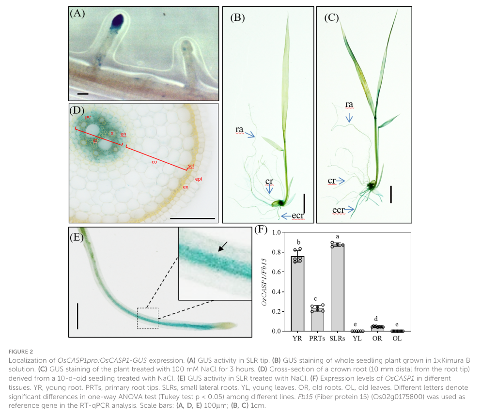

## Question

# Gene Research for Functional Annotation

## ⚠️ CRITICAL: Gene/Protein Identification Context

**BEFORE YOU BEGIN RESEARCH:** You MUST verify you are researching the CORRECT gene/protein. Gene symbols can be ambiguous, especially for less well-characterized genes from non-model organisms.

### Target Gene/Protein Identity (from UniProt):
- **UniProt Accession:** Q2QNE3
- **Protein Description:** RecName: Full=CASP-like protein 4C1; Short=OsCASPL4C1;
- **Gene Information:** OrderedLocusNames=Os12g0568700, LOC_Os12g38100;
- **Organism (full):** Oryza sativa subsp. japonica (Rice).
- **Protein Family:** Belongs to the Casparian strip membrane proteins (CASP)
- **Key Domains:** CASP_dom. (IPR006702); CASP_dom (PF04535)

### MANDATORY VERIFICATION STEPS:

1. **Check if the gene symbol "CASPL4C1" matches the protein description above**
2. **Verify the organism is correct:** Oryza sativa subsp. japonica (Rice).
3. **Check if protein family/domains align with what you find in literature**
4. **If you find literature for a DIFFERENT gene with the same or similar symbol, STOP**

### If Gene Symbol is Ambiguous or You Cannot Find Relevant Literature:

**DO NOT PROCEED WITH RESEARCH ON A DIFFERENT GENE.** Instead:
- State clearly: "The gene symbol 'CASPL4C1' is ambiguous or literature is limited for this specific protein"
- Explain what you found (e.g., "Found extensive literature on a different gene with the same symbol in a different organism")
- Describe the protein based ONLY on the UniProt information provided above
- Suggest that the protein function can be inferred from domain/family information

### Research Target:

Please provide a comprehensive research report on the gene **CASPL4C1** (gene ID: Q2QNE3, UniProt: Q2QNE3) in ORYSJ.

The research report should be a detailed narrative explaining the function, biological processes, and localization of the gene product. Citations should be given for all claims.

You should prioritize authoritative reviews and primary scientific literature when conducting research. You can supplement
this with annotations you find in gene/protein databases, but these can be outdated or inaccurate.

We are specifically interested in the primary function of the gene - for enzymes, what reaction is catalyzed, and what is the substrate specificity? For transporters, what is the substrate? For structural proteins or adapters, what is the broader structural role? For signaling molecules, what is the role in the pathway.

We are interested in where in or outside the cell the gene product carries out its function.

We are also interested in the signaling or biochemical pathways in which the gene functions. We are less interested in broad pleiotropic effects, except where these elucidate the precise role.

Include evidence where possible. We are interested in both experimental evidence as well as inference from structure, evolution, or bioinformatic analysis. Precise studies should be prioritized over high-throughput, where available.

## Output

Question: You are an expert researcher providing comprehensive, well-cited information.

Provide detailed information focusing on:
1. Key concepts and definitions with current understanding
2. Recent developments and latest research (prioritize 2023-2024 sources)
3. Current applications and real-world implementations
4. Expert opinions and analysis from authoritative sources
5. Relevant statistics and data from recent studies

Format as a comprehensive research report with proper citations. Include URLs and publication dates where available.
Always prioritize recent, authoritative sources and provide specific citations for all major claims.

# Gene Research for Functional Annotation

## ⚠️ CRITICAL: Gene/Protein Identification Context

**BEFORE YOU BEGIN RESEARCH:** You MUST verify you are researching the CORRECT gene/protein. Gene symbols can be ambiguous, especially for less well-characterized genes from non-model organisms.

### Target Gene/Protein Identity (from UniProt):
- **UniProt Accession:** Q2QNE3
- **Protein Description:** RecName: Full=CASP-like protein 4C1; Short=OsCASPL4C1;
- **Gene Information:** OrderedLocusNames=Os12g0568700, LOC_Os12g38100;
- **Organism (full):** Oryza sativa subsp. japonica (Rice).
- **Protein Family:** Belongs to the Casparian strip membrane proteins (CASP)
- **Key Domains:** CASP_dom. (IPR006702); CASP_dom (PF04535)

### MANDATORY VERIFICATION STEPS:

1. **Check if the gene symbol "CASPL4C1" matches the protein description above**
2. **Verify the organism is correct:** Oryza sativa subsp. japonica (Rice).
3. **Check if protein family/domains align with what you find in literature**
4. **If you find literature for a DIFFERENT gene with the same or similar symbol, STOP**

### If Gene Symbol is Ambiguous or You Cannot Find Relevant Literature:

**DO NOT PROCEED WITH RESEARCH ON A DIFFERENT GENE.** Instead:
- State clearly: "The gene symbol 'CASPL4C1' is ambiguous or literature is limited for this specific protein"
- Explain what you found (e.g., "Found extensive literature on a different gene with the same symbol in a different organism")
- Describe the protein based ONLY on the UniProt information provided above
- Suggest that the protein function can be inferred from domain/family information

### Research Target:

Please provide a comprehensive research report on the gene **CASPL4C1** (gene ID: Q2QNE3, UniProt: Q2QNE3) in ORYSJ.

The research report should be a detailed narrative explaining the function, biological processes, and localization of the gene product. Citations should be given for all claims.

You should prioritize authoritative reviews and primary scientific literature when conducting research. You can supplement
this with annotations you find in gene/protein databases, but these can be outdated or inaccurate.

We are specifically interested in the primary function of the gene - for enzymes, what reaction is catalyzed, and what is the substrate specificity? For transporters, what is the substrate? For structural proteins or adapters, what is the broader structural role? For signaling molecules, what is the role in the pathway.

We are interested in where in or outside the cell the gene product carries out its function.

We are also interested in the signaling or biochemical pathways in which the gene functions. We are less interested in broad pleiotropic effects, except where these elucidate the precise role.

Include evidence where possible. We are interested in both experimental evidence as well as inference from structure, evolution, or bioinformatic analysis. Precise studies should be prioritized over high-throughput, where available.

# Research Report: Functional Annotation of Rice **OsCASPL4C1** (UniProt **Q2QNE3**; loci **Os12g0568700 / LOC_Os12g38100**) 

## 0. Executive summary (scope and evidence limits)
Target identity is **Oryza sativa subsp. japonica** CASP-like protein **OsCASPL4C1** (UniProt Q2QNE3), annotated as belonging to the **CASP/CASPL (Casparian strip membrane domain proteins / CASP-like)** family with the **CASP domain (PF04535; IPR006702)** (user-supplied UniProt context). In the tool-retrieved full texts, **no paper explicitly mentions the identifiers** *Q2QNE3*, *OsCASPL4C1*, *Os12g0568700*, or *LOC_Os12g38100*; therefore, the report necessarily emphasizes (i) **mechanistic CASP/CASPL family biology** and (ii) **rice CASP-family expression/phenotype evidence** from closely related rice genes (notably **OsCASP1**) as the most defensible basis for inference. This is explicitly documented in the evidence table below (barbosa2023directedgrowthand pages 1-2, yang2022riceoscasp1orchestrates pages 15-16, xue2024genomewideidentificationand pages 1-2, xue2024comparativeanalysisof pages 1-2).

## 1. Key concepts and definitions (current understanding)
### 1.1 Casparian strip and CASP/CASPL proteins
The **Casparian strip (CS)** is a **lignin-impregnated cell wall band** in root endodermal cells that functions as an **extracellular diffusion barrier**, helping regulate apoplastic transport and ion homeostasis (barbosa2023directedgrowthand pages 1-2). 

**CASP proteins (CASP1–5 in Arabidopsis)** are **small, four-transmembrane-span** proteins that accumulate in a specialized plasma membrane region aligned with the CS cell wall domain (barbosa2023directedgrowthand pages 1-2). CASPs and their **CASP-LIKE (CASPL)** relatives are described as a **larger plant family** (reported as **39 CASP-LIKE members in Arabidopsis** in the cited mechanistic work), supporting the interpretation that CASPL proteins are evolutionarily related scaffolds implicated in barrier-domain organization (barbosa2023directedgrowthand pages 1-2).

### 1.2 Mechanistic model: what CASPs do at the membrane–wall interface
Recent mechanistic work refined the model for CASP function: in a **full CASP knock-out**, **correctly positioned lignin microdomains still form**, indicating CASPs are **not strictly required for localized lignification** per se; however, the microdomains are **ultrastructurally disorganized**, with **excessive cell wall growth**, loss of **protein exclusion zone** and **matrix (cell wall) adhesion**, and altered **exocyst dynamics** (barbosa2023directedgrowthand pages 1-2). The authors propose CASPs contribute to **directed growth and fusion of membrane–wall microdomains**, in part by influencing secretory foci dynamics and interacting networks (e.g., exocyst-related processes) (barbosa2023directedgrowthand pages 1-2). 

**Implication for OsCASPL4C1 annotation:** given the shared CASP domain and family membership (UniProt context) and the general statement that CASPLs are homologous, 4-TM membrane proteins, the strongest current inference is that OsCASPL4C1 is likely a **membrane scaffold/organizer** affecting the **spatial organization and maturation** of lignin/suberin-associated barrier microdomains rather than acting as a catalytic enzyme or transporter (barbosa2023directedgrowthand pages 1-2, xue2024genomewideidentificationand pages 1-2).

## 2. Gene-specific evidence status for OsCASPL4C1 (verification)
Despite targeted searches for the exact identifiers, **no retrieved full text in this session contained OsCASPL4C1/Q2QNE3/Os12g0568700/LOC_Os12g38100**, so there is **no direct experimental localization, phenotype, or biochemistry** available here for this specific rice protein (barbosa2023directedgrowthand pages 1-2, yang2022riceoscasp1orchestrates pages 15-16, xue2024genomewideidentificationand pages 1-2, xue2024comparativeanalysisof pages 1-2). 

Accordingly, the remainder of this report provides: 
1) **family-level mechanistic evidence** (Arabidopsis CASPs; cross-species CASPL characteristics), and 
2) **rice CASP-family evidence** (OsCASP1 phenotypes and rice CASP-family expression patterns) as the most relevant proxy for a rice CASPL protein’s likely role.

## 3. Recent developments and latest research (prioritizing 2023–2024)
### 3.1 2023: CASPs organize membrane–wall microdomains beyond “lignin recruitment”
A key 2023 advance is the demonstration that CASPs are **not required to position lignin microdomains** but are required to make them **structurally coherent and fused** into a functional band with defined membrane properties (protein exclusion and adhesion) (Barbosa et al., **2023-07**, *Nature Communications*, https://doi.org/10.1038/s41467-023-37265-7) (barbosa2023directedgrowthand pages 1-2). This shifts functional annotation emphasis from “lignin deposition initiation” to **microdomain organization and barrier sealing**.

### 3.2 2024: Rice CASP-family systems view (expression, stress, ion deficiency)
A 2024 comparative study identified **41 rice CASP-family genes** and profiled expression across tissues, root cell types, abiotic stresses, and ion deficiencies (Xue et al., **2024-09**, *International Journal of Molecular Sciences*, https://doi.org/10.3390/ijms25189858) (xue2024comparativeanalysisof pages 1-2, xue2024comparativeanalysisof pages 7-11, xue2024comparativeanalysisof pages 11-13). Key points relevant to OsCASPL4C1 inference include:
- Most rice CASP genes are **root-preferential**, and multiple CASP genes show **endodermis-enriched expression** based on root cell-type data (xue2024comparativeanalysisof pages 7-11).
- CASP-family expression is **stress responsive**: under **cold** stress, **16** OsCASP genes were up-regulated and **7** down-regulated; under **drought**, **10** up and **5** down; under **flood**, **13** up and **4** down (xue2024comparativeanalysisof pages 11-13).
- Some effects are large-magnitude (e.g., **OsCASP3 >7-fold up** under cold; **OsCASP_like1 >10-fold down** under cold) (xue2024comparativeanalysisof pages 11-13).
- Under ion-defect conditions, genes including **OsCASP_like21** show statistically significant increases; other genes show coordinated or opposing patterns across deficiencies (xue2024comparativeanalysisof pages 13-15).

### 3.3 2024: CASPL family characterization in monocots (orthology-based expectations)
A 2024 maize genome-wide study provides generalized features that strengthen inference for a rice CASPL: CASPL proteins are described as **4-transmembrane membrane proteins** with conserved topology and associations with **root development, mineral uptake, and stress responsiveness** (Xue et al., **2024-10**, *Frontiers in Plant Science*, https://doi.org/10.3389/fpls.2024.1477383) (xue2024genomewideidentificationand pages 1-2). While not rice-specific, it supports the view that CASPL proteins broadly function in **root barrier-related biology**.

## 4. Current understanding of function for the target protein (inference anchored to evidence)
### 4.1 Primary biochemical function
No enzymatic activity is implied by the CASP/CASPL family model in the retrieved literature; rather, CASP-family proteins function as **structural scaffolds** shaping specialized plasma membrane domains that coordinate wall-domain formation and sealing (barbosa2023directedgrowthand pages 1-2). Thus, the most evidence-supported “primary function” statement for OsCASPL4C1 (Q2QNE3) is:
- **Likely role:** **membrane-domain scaffold/organizer** contributing to the formation and/or maturation of **lignin/suberin-associated apoplastic barriers** (Casparian strip-like domains or related lignified barriers) (barbosa2023directedgrowthand pages 1-2, xue2024genomewideidentificationand pages 1-2).

### 4.2 Subcellular localization
Across the family, CASP/CASPL proteins are consistently described as **membrane proteins with four transmembrane domains**, consistent with localization to the **plasma membrane** and enrichment in specialized microdomains aligned with wall barriers (barbosa2023directedgrowthand pages 1-2, xue2024genomewideidentificationand pages 1-2). 

**Expected localization for OsCASPL4C1:** plasma membrane, potentially within **endodermal barrier microdomains** (inferred from family properties and root/endodermis-enriched expression trends in rice CASP-family genes) (xue2024comparativeanalysisof pages 7-11).

### 4.3 Pathways and biological processes
The mechanistic 2023 work links CASP microdomains to **exocytosis/exocyst dynamics** and organization of membrane–wall interfaces during CS formation (barbosa2023directedgrowthand pages 1-2). The rice 2024 analysis indicates broad integration of CASP-family regulation with **stress-responsive transcriptional programs** and **ion deficiency responses**, consistent with their role in controlling barrier permeability and nutrient homeostasis (xue2024comparativeanalysisof pages 11-13, xue2024comparativeanalysisof pages 13-15). 

**Working pathway placement for OsCASPL4C1:** root barrier formation / apoplastic diffusion barrier processes, potentially affecting nutrient uptake/homeostasis and abiotic stress resilience (barbosa2023directedgrowthand pages 1-2, xue2024comparativeanalysisof pages 11-13).

## 5. Rice experimental proxy evidence: OsCASP1 as a mechanistic analog (real-world phenotype relevance)
Although OsCASPL4C1 itself was not found in the retrieved papers, rice **OsCASP1** provides direct experimental evidence for what disruption of a rice CASP-family scaffold can do:
- **Expression/localization proxy:** OsCASP1 promoter-driven reporter signal is concentrated in **small lateral root tips and stele**, and is induced by **NaCl**, especially in steles (yang2022riceoscasp1orchestrates pages 5-8, yang2022riceoscasp1orchestrates media 4a78c803). 
- **Barrier phenotypes:** In Oscasp1 mutants, CS formation in small lateral roots is **delayed**, and abnormal CS patterns appear; the authors report that ~**1/5** of small lateral roots in **5-day** seedlings and ~**1/2** in **10-day** seedlings showed abnormal CS in a mutant line (yang2022riceoscasp1orchestrates pages 8-9). 
- **Wall polymer patterns:** Loss of OsCASP1 function is associated with **abnormal lignin deposition** (wider/uneven or stronger CS bands; enhanced lignin staining patterns in some regions) and **ectopic/patchy suberin deposition** patterns (yang2022riceoscasp1orchestrates pages 8-9, yang2022riceoscasp1orchestrates pages 5-8, yang2022riceoscasp1orchestrates media ecc5e842, yang2022riceoscasp1orchestrates media b122dd28, yang2022riceoscasp1orchestrates media b92bbc9d). 

**Interpretation for OsCASPL4C1:** if OsCASPL4C1 is expressed in similar root barrier contexts, the most plausible measurable outcomes of perturbing it would include altered **timing/organization of CS-like microdomains**, altered **suberin patterning**, and downstream **ion imbalance/stress sensitivity**, consistent with a structural organizer role (barbosa2023directedgrowthand pages 1-2, yang2022riceoscasp1orchestrates pages 8-9).

## 6. Applications and real-world implementation relevance
### 6.1 Engineering apoplastic barrier traits for stress tolerance
The rice OsCASP1 study directly links a CASP-family gene to **salt stress responses** and phenotypes consistent with disrupted nutrient/ion homeostasis (yang2022riceoscasp1orchestrates pages 15-16, yang2022riceoscasp1orchestrates pages 5-8). The 2024 rice family study indicates substantial **stress-responsive transcriptional modulation** of CASP-family genes (cold, osmotic, drought, flood) and large fold-changes for some members (xue2024comparativeanalysisof pages 11-13). Together, these findings support current applied interest in manipulating barrier-associated scaffolds to tune **stress resilience** and **nutrient uptake**.

### 6.2 Candidate-gene prioritization and marker development
The 2024 rice/Arabidopsis comparative analysis provides a framework for prioritizing rice CASP-family candidates for endodermis CS formation based on **root cell-type enrichment** and stress/ion-defect response profiles (xue2024comparativeanalysisof pages 7-11, xue2024comparativeanalysisof pages 11-13). Even though OsCASPL4C1 was not individually resolved in the evidence set, such datasets provide a rationale for including CASPL genes in **root barrier engineering** pipelines.

## 7. Expert opinions and authoritative analysis (as represented in primary sources)
- The 2023 *Nature Communications* authors explicitly propose a model in which CASP microdomains **displace/reshape secretion foci** to enable microdomain fusion into a continuous band that seals extracellular space, highlighting organization of **membrane–wall microdomains** as a key CASP function (barbosa2023directedgrowthand pages 1-2).
- The 2022 rice OsCASP1 study argues that rice CASP-family proteins can influence both **Casparian strip formation** and **suberin deposition patterns**, with consequences for nutrient homeostasis and salt tolerance, suggesting the family’s importance in rice adaptation to growth environments (yang2022riceoscasp1orchestrates pages 15-16).

## 8. Key statistics and quantitative data from recent studies
- Rice CASP-family response counts (2024): under **cold** stress **16 up / 7 down**; **osmotic** stress **8 up / 11 down**; **drought** **10 up / 5 down**; **flood** **13 up / 4 down** (xue2024comparativeanalysisof pages 11-13). 
- Large fold-changes (2024): **OsCASP3 >7-fold up** under cold; **OsCASP_like1 >10-fold down** under cold (xue2024comparativeanalysisof pages 11-13).
- OsCASP1 mutant penetrance for abnormal CS in SLRs (2022): ~**1/5** (5-day seedlings) and ~**1/2** (10-day seedlings) SLRs exhibit abnormal CS features in a mutant background (yang2022riceoscasp1orchestrates pages 8-9).

## 9. Consolidated evidence table
| Item (concept/gene) | Species | Key finding (function/localization/pathway/expression/phenotype) | Evidence type (experimental vs bioinformatic) | Stress/condition | Quantitative/statistical data (if any) | Source (authors, year, journal) | DOI/URL |
|---|---|---|---|---|---|---|---|
| CASP proteins / CASP-like family background | *Arabidopsis thaliana* | CASPs are small four-transmembrane proteins that mark the Casparian strip membrane domain; localized lignin microdomains can still form without CASPs, but CASPs are required to organize/fuse microdomains into a continuous membrane-wall domain with protein exclusion, membrane-wall adhesion, and proper exocyst dynamics; broader CASP-LIKE family noted, supporting functional inference for plant CASPL proteins (barbosa2023directedgrowthand pages 1-2) | Experimental mechanistic genetics, cell biology, proximity labeling | Root endodermis / Casparian strip formation | Full CASP knockout still formed positioned lignin microdomains but caused disorganized wall growth and impaired exclusion zone; Arabidopsis CASP-LIKE family size reported as 39 members (barbosa2023directedgrowthand pages 1-2) | Barbosa et al., 2023, *Nature Communications* | https://doi.org/10.1038/s41467-023-37265-7 |
| OsCASP1 | *Oryza sativa* | OsCASP1 is highly expressed in small lateral root (SLR) tips and stele, induced by NaCl, and regulates timely Casparian strip formation plus suberin patterning in SLRs; loss of function delays first CS appearance, causes abnormal/wider or stronger lignified CS bands, altered suberin deposition, ion imbalance, reduced tillering, withered leaves, and lower salt tolerance; supports a rice barrier/homeostasis role relevant to CASP/CASPL annotation (yang2022riceoscasp1orchestrates pages 15-16, yang2022riceoscasp1orchestrates pages 8-9, yang2022riceoscasp1orchestrates pages 5-8) | Experimental genetics, histochemistry, GUS localization, RT-qPCR, microscopy | Salt stress; root developmental context, especially SLRs | Approx. one-fifth of SLRs in 5-day seedlings and approx. one-half in 10-day seedlings showed abnormal CS in the mutant; statistical significance reported by ANOVA/Tukey in expression and phenotype assays (yang2022riceoscasp1orchestrates pages 8-9, yang2022riceoscasp1orchestrates pages 5-8) | Yang et al., 2022, *Frontiers in Plant Science* | https://doi.org/10.3389/fpls.2022.1007300 |
| OsCASP family in rice vs Arabidopsis | *Oryza sativa* and *Arabidopsis thaliana* | Comparative family analysis identified 41 OsCASP and 39 AtCASP genes; most OsCASP genes are root-preferential, and OsCASP1/2/3/4/5 show higher endodermal expression than other root cells; OsCASP1 and OsCASP_like9/11 are especially enriched in endodermis, making them candidate Casparian strip genes; many promoters contain MYB/W-box/MYC elements; many family members are stress- and ion-defect responsive, linking CASP/CASPL genes to barrier formation, nutrient uptake, and abiotic adaptation (xue2024comparativeanalysisof pages 1-2, xue2024comparativeanalysisof pages 13-15, xue2024comparativeanalysisof pages 7-11, xue2024comparativeanalysisof pages 11-13) | Bioinformatic and expression analysis (RNA-seq, single-cell atlas, promoter analysis) plus targeted RT-qPCR | Cold, osmotic, drought, flood; Fe, Zn, Cu, Mn, N, P, K, Mg, Mo, B deficiency | 41 OsCASP and 39 AtCASP genes identified; under cold stress, 16 OsCASP genes were up-regulated and 7 down-regulated; under osmotic stress, 8 up and 11 down; under drought, 10 up and 5 down; under flood, 13 up and 4 down; ~39% of OsCASPs up-regulated and 17% down-regulated under cold stress; OsCASP3 increased >7-fold under cold; OsCASP_like1 decreased >10-fold under cold; OsCASP_like21 significantly increased under multiple ionic defects (xue2024comparativeanalysisof pages 13-15, xue2024comparativeanalysisof pages 7-11, xue2024comparativeanalysisof pages 11-13) | Xue et al., 2024, *International Journal of Molecular Sciences* | https://doi.org/10.3390/ijms25189858 |
| CASPL family framework (orthology-based inference) | *Zea mays* | CASPL proteins are membrane proteins with four transmembrane domains, two intracellular loops and one extracellular loop, homologous to CASPs and similar to MARVEL-domain proteins; CASPL genes are associated with root development, mineral uptake, and stress responsiveness; some maize members are root-specific candidates for Casparian strip development, supporting analogous functional inference for rice CASPL proteins such as OsCASPL4C1 (xue2024genomewideidentificationand pages 1-2) | Bioinformatic and expression analysis | Drought, salt, heat, cold, low N/P, pathogen infection, p-hydroxybenzoic acid | 47 maize CASPL genes identified; expression of some members was stress responsive; orthologous relationship to Arabidopsis AtCASPL4C1 noted in the study summary (xue2024genomewideidentificationand pages 1-2) | Xue et al., 2024, *Frontiers in Plant Science* | https://doi.org/10.3389/fpls.2024.1477383 |
| Target gene check: UniProt Q2QNE3 / OsCASPL4C1 / Os12g0568700 / LOC_Os12g38100 | *Oryza sativa* subsp. *japonica* | No direct mention of UniProt Q2QNE3, OsCASPL4C1, Os12g0568700, or LOC_Os12g38100 was found in the retrieved full texts examined here; therefore, functional annotation for this specific rice protein must rely primarily on UniProt family/domain assignment and family-level inference from CASP/CASPL literature rather than direct gene-specific experiments in the retrieved sources (barbosa2023directedgrowthand pages 1-2, yang2022riceoscasp1orchestrates pages 15-16, xue2024genomewideidentificationand pages 1-2, xue2024comparativeanalysisof pages 1-2) | Negative literature verification result | Not applicable | 0 direct retrieved full-text mentions among the reviewed papers in this evidence set (barbosa2023directedgrowthand pages 1-2, yang2022riceoscasp1orchestrates pages 15-16, xue2024genomewideidentificationand pages 1-2, xue2024comparativeanalysisof pages 1-2) | Synthesized from retrieved texts, 2019–2024 | UniProt accession referenced by user; family evidence above via cited DOIs/URLs |

*Table: This table summarizes direct and indirect evidence relevant to annotating rice CASP/CASPL proteins, with emphasis on family function, localization, stress responsiveness, and rice-specific barrier biology. It also records the key verification result that the specific target OsCASPL4C1/Q2QNE3 was not directly mentioned in the retrieved full texts.*

## 10. Practical annotation statement for OsCASPL4C1 (Q2QNE3), with confidence qualifiers
**Proposed function (inferred):** OsCASPL4C1 is most plausibly a **plasma membrane, multi-pass (4-TM) scaffold protein** in the CASP/CASPL family that contributes to **organization/maturation of lignin/suberin-associated barrier microdomains** (e.g., Casparian strip-like domains), influencing **apoplastic diffusion barrier integrity**, and thereby affecting **ion homeostasis** and **abiotic stress responses** (barbosa2023directedgrowthand pages 1-2, xue2024comparativeanalysisof pages 11-13, xue2024genomewideidentificationand pages 1-2).

**Localization (inferred):** plasma membrane microdomains in roots (likely including endodermis), consistent with 4-TM CASP-family proteins and root/endodermis-enriched expression patterns reported for multiple rice CASP-family genes (barbosa2023directedgrowthand pages 1-2, xue2024comparativeanalysisof pages 7-11).

**Evidence gap:** This inference should be treated as **moderate confidence at the family level** but **low confidence at the specific gene level** until OsCASPL4C1-specific data (expression, localization, mutant phenotype) are obtained, because no retrieved full text directly mentions Q2QNE3/OsCASPL4C1/Os12g0568700/LOC_Os12g38100 (barbosa2023directedgrowthand pages 1-2, xue2024comparativeanalysisof pages 1-2).

## Key primary sources (with dates and URLs)
- Barbosa ICR et al. **2023-07**. *Nature Communications*. “Directed growth and fusion of membrane-wall microdomains requires CASP-mediated inhibition and displacement of secretory foci.” https://doi.org/10.1038/s41467-023-37265-7 (barbosa2023directedgrowthand pages 1-2)
- Yang X et al. **2022-12**. *Frontiers in Plant Science*. “Rice OsCASP1 orchestrates Casparian strip formation and suberin deposition in small lateral roots to maintain nutrient homeostasis.” https://doi.org/10.3389/fpls.2022.1007300 (yang2022riceoscasp1orchestrates pages 15-16)
- Xue B et al. **2024-09**. *International Journal of Molecular Sciences*. “Comparative Analysis of Casparian Strip Membrane Domain Protein Family in Oryza sativa (L.) and Arabidopsis thaliana (L.).” https://doi.org/10.3390/ijms25189858 (xue2024comparativeanalysisof pages 1-2)
- Xue B et al. **2024-10**. *Frontiers in Plant Science*. “Genome-wide identification and expression analysis of CASPL gene family in Zea mays (L.).” https://doi.org/10.3389/fpls.2024.1477383 (xue2024genomewideidentificationand pages 1-2)

References

1. (barbosa2023directedgrowthand pages 1-2): Inês Catarina Ramos Barbosa, D. De Bellis, Isabelle Flückiger, E. Bellani, Mathieu Grangé-Guerment, Kian Hématy, and N. Geldner. Directed growth and fusion of membrane-wall microdomains requires casp-mediated inhibition and displacement of secretory foci. Nature Communications, Jul 2023. URL: https://doi.org/10.1038/s41467-023-37265-7, doi:10.1038/s41467-023-37265-7. This article has 33 citations and is from a highest quality peer-reviewed journal.

2. (yang2022riceoscasp1orchestrates pages 15-16): Xianfeng Yang, Huifang Xie, Qunqing Weng, Kangjing Liang, Xiujuan Zheng, Yuchun Guo, and Xinli Sun. Rice oscasp1 orchestrates casparian strip formation and suberin deposition in small lateral roots to maintain nutrient homeostasis. Frontiers in Plant Science, Dec 2022. URL: https://doi.org/10.3389/fpls.2022.1007300, doi:10.3389/fpls.2022.1007300. This article has 18 citations.

3. (xue2024genomewideidentificationand pages 1-2): Baoping Xue, Zicong Liang, Dongyang Li, Yue Liu, and Chang Liu. Genome-wide identification and expression analysis of caspl gene family in zea mays (l.). Frontiers in Plant Science, Oct 2024. URL: https://doi.org/10.3389/fpls.2024.1477383, doi:10.3389/fpls.2024.1477383. This article has 4 citations.

4. (xue2024comparativeanalysisof pages 1-2): Baoping Xue, Zicong Liang, Yue Liu, Dongyang Li, Peng Cao, and Chang Liu. Comparative analysis of casparian strip membrane domain protein family in oryza sativa (l.) and arabidopsis thaliana (l.). International Journal of Molecular Sciences, 25:9858, Sep 2024. URL: https://doi.org/10.3390/ijms25189858, doi:10.3390/ijms25189858. This article has 5 citations.

5. (xue2024comparativeanalysisof pages 7-11): Baoping Xue, Zicong Liang, Yue Liu, Dongyang Li, Peng Cao, and Chang Liu. Comparative analysis of casparian strip membrane domain protein family in oryza sativa (l.) and arabidopsis thaliana (l.). International Journal of Molecular Sciences, 25:9858, Sep 2024. URL: https://doi.org/10.3390/ijms25189858, doi:10.3390/ijms25189858. This article has 5 citations.

6. (xue2024comparativeanalysisof pages 11-13): Baoping Xue, Zicong Liang, Yue Liu, Dongyang Li, Peng Cao, and Chang Liu. Comparative analysis of casparian strip membrane domain protein family in oryza sativa (l.) and arabidopsis thaliana (l.). International Journal of Molecular Sciences, 25:9858, Sep 2024. URL: https://doi.org/10.3390/ijms25189858, doi:10.3390/ijms25189858. This article has 5 citations.

7. (xue2024comparativeanalysisof pages 13-15): Baoping Xue, Zicong Liang, Yue Liu, Dongyang Li, Peng Cao, and Chang Liu. Comparative analysis of casparian strip membrane domain protein family in oryza sativa (l.) and arabidopsis thaliana (l.). International Journal of Molecular Sciences, 25:9858, Sep 2024. URL: https://doi.org/10.3390/ijms25189858, doi:10.3390/ijms25189858. This article has 5 citations.

8. (yang2022riceoscasp1orchestrates pages 5-8): Xianfeng Yang, Huifang Xie, Qunqing Weng, Kangjing Liang, Xiujuan Zheng, Yuchun Guo, and Xinli Sun. Rice oscasp1 orchestrates casparian strip formation and suberin deposition in small lateral roots to maintain nutrient homeostasis. Frontiers in Plant Science, Dec 2022. URL: https://doi.org/10.3389/fpls.2022.1007300, doi:10.3389/fpls.2022.1007300. This article has 18 citations.

9. (yang2022riceoscasp1orchestrates media 4a78c803): Xianfeng Yang, Huifang Xie, Qunqing Weng, Kangjing Liang, Xiujuan Zheng, Yuchun Guo, and Xinli Sun. Rice oscasp1 orchestrates casparian strip formation and suberin deposition in small lateral roots to maintain nutrient homeostasis. Frontiers in Plant Science, Dec 2022. URL: https://doi.org/10.3389/fpls.2022.1007300, doi:10.3389/fpls.2022.1007300. This article has 18 citations.

10. (yang2022riceoscasp1orchestrates pages 8-9): Xianfeng Yang, Huifang Xie, Qunqing Weng, Kangjing Liang, Xiujuan Zheng, Yuchun Guo, and Xinli Sun. Rice oscasp1 orchestrates casparian strip formation and suberin deposition in small lateral roots to maintain nutrient homeostasis. Frontiers in Plant Science, Dec 2022. URL: https://doi.org/10.3389/fpls.2022.1007300, doi:10.3389/fpls.2022.1007300. This article has 18 citations.

11. (yang2022riceoscasp1orchestrates media ecc5e842): Xianfeng Yang, Huifang Xie, Qunqing Weng, Kangjing Liang, Xiujuan Zheng, Yuchun Guo, and Xinli Sun. Rice oscasp1 orchestrates casparian strip formation and suberin deposition in small lateral roots to maintain nutrient homeostasis. Frontiers in Plant Science, Dec 2022. URL: https://doi.org/10.3389/fpls.2022.1007300, doi:10.3389/fpls.2022.1007300. This article has 18 citations.

12. (yang2022riceoscasp1orchestrates media b122dd28): Xianfeng Yang, Huifang Xie, Qunqing Weng, Kangjing Liang, Xiujuan Zheng, Yuchun Guo, and Xinli Sun. Rice oscasp1 orchestrates casparian strip formation and suberin deposition in small lateral roots to maintain nutrient homeostasis. Frontiers in Plant Science, Dec 2022. URL: https://doi.org/10.3389/fpls.2022.1007300, doi:10.3389/fpls.2022.1007300. This article has 18 citations.

13. (yang2022riceoscasp1orchestrates media b92bbc9d): Xianfeng Yang, Huifang Xie, Qunqing Weng, Kangjing Liang, Xiujuan Zheng, Yuchun Guo, and Xinli Sun. Rice oscasp1 orchestrates casparian strip formation and suberin deposition in small lateral roots to maintain nutrient homeostasis. Frontiers in Plant Science, Dec 2022. URL: https://doi.org/10.3389/fpls.2022.1007300, doi:10.3389/fpls.2022.1007300. This article has 18 citations.

## Artifacts

- [Edison artifact artifact-00](CASPL4C1-deep-research-falcon_artifacts/artifact-00.md)

## Citations

1. barbosa2023directedgrowthand pages 1-2
2. xue2024comparativeanalysisof pages 7-11
3. xue2024comparativeanalysisof pages 11-13
4. xue2024comparativeanalysisof pages 13-15
5. xue2024genomewideidentificationand pages 1-2
6. xue2024comparativeanalysisof pages 1-2
7. https://doi.org/10.1038/s41467-023-37265-7
8. https://doi.org/10.3390/ijms25189858
9. https://doi.org/10.3389/fpls.2024.1477383
10. https://doi.org/10.3389/fpls.2022.1007300
11. https://doi.org/10.1038/s41467-023-37265-7,
12. https://doi.org/10.3389/fpls.2022.1007300,
13. https://doi.org/10.3389/fpls.2024.1477383,
14. https://doi.org/10.3390/ijms25189858,