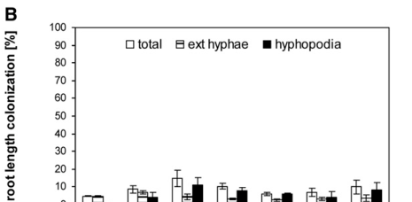

## Question

# Gene Research for Functional Annotation

## ⚠️ CRITICAL: Gene/Protein Identification Context

**BEFORE YOU BEGIN RESEARCH:** You MUST verify you are researching the CORRECT gene/protein. Gene symbols can be ambiguous, especially for less well-characterized genes from non-model organisms.

### Target Gene/Protein Identity (from UniProt):
- **UniProt Accession:** Q6AVM3
- **Protein Description:** RecName: Full=Calcium and calcium/calmodulin-dependent serine/threonine-protein kinase; Short=OsCCaMK; EC=2.7.11.17;
- **Gene Information:** Name=CCAMK; Synonyms=DMI3; OrderedLocusNames=Os05g0489900, LOC_Os05g41090; ORFNames=OJ1119_H02.20, OsJ_19014;
- **Organism (full):** Oryza sativa subsp. japonica (Rice).
- **Protein Family:** Belongs to the protein kinase superfamily. CAMK Ser/Thr
- **Key Domains:** CDPK_Ser/Thr_kinases. (IPR050205); EF-hand-dom_pair. (IPR011992); EF_Hand_1_Ca_BS. (IPR018247); EF_hand_dom. (IPR002048); Kinase-like_dom_sf. (IPR011009)

### MANDATORY VERIFICATION STEPS:

1. **Check if the gene symbol "CCAMK" matches the protein description above**
2. **Verify the organism is correct:** Oryza sativa subsp. japonica (Rice).
3. **Check if protein family/domains align with what you find in literature**
4. **If you find literature for a DIFFERENT gene with the same or similar symbol, STOP**

### If Gene Symbol is Ambiguous or You Cannot Find Relevant Literature:

**DO NOT PROCEED WITH RESEARCH ON A DIFFERENT GENE.** Instead:
- State clearly: "The gene symbol 'CCAMK' is ambiguous or literature is limited for this specific protein"
- Explain what you found (e.g., "Found extensive literature on a different gene with the same symbol in a different organism")
- Describe the protein based ONLY on the UniProt information provided above
- Suggest that the protein function can be inferred from domain/family information

### Research Target:

Please provide a comprehensive research report on the gene **CCAMK** (gene ID: CCAMK, UniProt: Q6AVM3) in ORYSJ.

The research report should be a detailed narrative explaining the function, biological processes, and localization of the gene product. Citations should be given for all claims.

You should prioritize authoritative reviews and primary scientific literature when conducting research. You can supplement
this with annotations you find in gene/protein databases, but these can be outdated or inaccurate.

We are specifically interested in the primary function of the gene - for enzymes, what reaction is catalyzed, and what is the substrate specificity? For transporters, what is the substrate? For structural proteins or adapters, what is the broader structural role? For signaling molecules, what is the role in the pathway.

We are interested in where in or outside the cell the gene product carries out its function.

We are also interested in the signaling or biochemical pathways in which the gene functions. We are less interested in broad pleiotropic effects, except where these elucidate the precise role.

Include evidence where possible. We are interested in both experimental evidence as well as inference from structure, evolution, or bioinformatic analysis. Precise studies should be prioritized over high-throughput, where available.

## Output

Question: You are an expert researcher providing comprehensive, well-cited information.

Provide detailed information focusing on:
1. Key concepts and definitions with current understanding
2. Recent developments and latest research (prioritize 2023-2024 sources)
3. Current applications and real-world implementations
4. Expert opinions and analysis from authoritative sources
5. Relevant statistics and data from recent studies

Format as a comprehensive research report with proper citations. Include URLs and publication dates where available.
Always prioritize recent, authoritative sources and provide specific citations for all major claims.

# Gene Research for Functional Annotation

## ⚠️ CRITICAL: Gene/Protein Identification Context

**BEFORE YOU BEGIN RESEARCH:** You MUST verify you are researching the CORRECT gene/protein. Gene symbols can be ambiguous, especially for less well-characterized genes from non-model organisms.

### Target Gene/Protein Identity (from UniProt):
- **UniProt Accession:** Q6AVM3
- **Protein Description:** RecName: Full=Calcium and calcium/calmodulin-dependent serine/threonine-protein kinase; Short=OsCCaMK; EC=2.7.11.17;
- **Gene Information:** Name=CCAMK; Synonyms=DMI3; OrderedLocusNames=Os05g0489900, LOC_Os05g41090; ORFNames=OJ1119_H02.20, OsJ_19014;
- **Organism (full):** Oryza sativa subsp. japonica (Rice).
- **Protein Family:** Belongs to the protein kinase superfamily. CAMK Ser/Thr
- **Key Domains:** CDPK_Ser/Thr_kinases. (IPR050205); EF-hand-dom_pair. (IPR011992); EF_Hand_1_Ca_BS. (IPR018247); EF_hand_dom. (IPR002048); Kinase-like_dom_sf. (IPR011009)

### MANDATORY VERIFICATION STEPS:

1. **Check if the gene symbol "CCAMK" matches the protein description above**
2. **Verify the organism is correct:** Oryza sativa subsp. japonica (Rice).
3. **Check if protein family/domains align with what you find in literature**
4. **If you find literature for a DIFFERENT gene with the same or similar symbol, STOP**

### If Gene Symbol is Ambiguous or You Cannot Find Relevant Literature:

**DO NOT PROCEED WITH RESEARCH ON A DIFFERENT GENE.** Instead:
- State clearly: "The gene symbol 'CCAMK' is ambiguous or literature is limited for this specific protein"
- Explain what you found (e.g., "Found extensive literature on a different gene with the same symbol in a different organism")
- Describe the protein based ONLY on the UniProt information provided above
- Suggest that the protein function can be inferred from domain/family information

### Research Target:

Please provide a comprehensive research report on the gene **CCAMK** (gene ID: CCAMK, UniProt: Q6AVM3) in ORYSJ.

The research report should be a detailed narrative explaining the function, biological processes, and localization of the gene product. Citations should be given for all claims.

You should prioritize authoritative reviews and primary scientific literature when conducting research. You can supplement
this with annotations you find in gene/protein databases, but these can be outdated or inaccurate.

We are specifically interested in the primary function of the gene - for enzymes, what reaction is catalyzed, and what is the substrate specificity? For transporters, what is the substrate? For structural proteins or adapters, what is the broader structural role? For signaling molecules, what is the role in the pathway.

We are interested in where in or outside the cell the gene product carries out its function.

We are also interested in the signaling or biochemical pathways in which the gene functions. We are less interested in broad pleiotropic effects, except where these elucidate the precise role.

Include evidence where possible. We are interested in both experimental evidence as well as inference from structure, evolution, or bioinformatic analysis. Precise studies should be prioritized over high-throughput, where available.

## Research Report: Functional Annotation of Rice CCaMK (OsCCaMK/OsDMI3; UniProt Q6AVM3)

### Executive summary
Calcium and calcium/calmodulin-dependent serine/threonine-protein kinase **OsCCaMK** (also called **OsDMI3**; rice gene **CCAMK**) is a Ca2+/calmodulin (CaM)-regulated kinase that decodes intracellular/nuclear calcium signatures and couples them to transcriptional programs and stress signaling outputs. In rice, OsCCaMK is an essential core component of the **common symbiosis signaling pathway (CSSP)** required for arbuscular mycorrhizal (AM) colonization, acting upstream of the transcription factor **CYCLOPS/IPD3**. Beyond symbiosis, OsDMI3 regulates abiotic-stress tolerance, including saline-alkaline tolerance via ion-homeostasis outputs, and has been positioned (via 2023 primary work cited by 2024 reviews) as a kinase that phosphorylates **OsRBOHB**, promoting **H2O2** production to potentiate **ABA signaling** and drought-related responses. (ni2020calciumcalmodulindependentproteinkinase pages 3-4, gutjahr2008arbuscularmycorrhiza–specificsignaling pages 1-2, wang2024reactiveoxygenspecies pages 20-21)

### 1) Identity verification and definitions (critical disambiguation)

#### 1.1 Correct target gene/protein
The target described by UniProt accession **Q6AVM3** (rice *Oryza sativa* ssp. japonica) matches the rice CCaMK literature in which **CCAMK** is explicitly identified as **Os05g41090 (CCAMK)** and described as a calcium/calmodulin-dependent protein kinase containing a CaM-binding region and EF-hands. In Gutjahr et al. (2008), the gene is listed as **“Os05g41090 (CCAMK)”**, and a Tos17 insertion allele is described as being **between the calmodulin-binding domain and the three EF-hands**, consistent with the UniProt domain architecture (kinase + CaM-binding/autoinhibitory region + EF-hands). (gutjahr2008arbuscularmycorrhiza–specificsignaling pages 13-14)

Independent rice stress literature uses the name **OsDMI3** for this CCaMK: Ni et al. (2020) repeatedly refers to **“a rice Ca2+/calmodulin-dependent protein kinase, OsDMI3”**, i.e., OsDMI3 = rice CCaMK. (ni2020calciumcalmodulindependentproteinkinase pages 1-3)

**Operational definitions used in this report**
- **CCaMK (calcium- and calmodulin-dependent protein kinase):** a plant Ser/Thr kinase regulated by Ca2+ binding and Ca2+/CaM, often functioning as a decoder of calcium oscillations/spiking in symbiotic and stress signaling. (wu2023receptorkinasesand pages 9-11)
- **CSSP/CSP/SYM pathway:** a conserved signaling pathway for intracellular symbioses (AM and, in legumes, nodulation) that transduces symbiont perception into nuclear Ca2+ spiking and transcriptional reprogramming. (gutjahr2008arbuscularmycorrhiza–specificsignaling pages 1-2, wu2023receptorkinasesand pages 9-11)

### 2) Molecular function and enzymatic activity

#### 2.1 Catalyzed reaction (EC 2.7.11.17) and evidence for kinase activity
OsDMI3/OsCCaMK is experimentally shown to have protein kinase activity in rice roots using an **in-gel kinase assay**. In Ni et al. (2020), OsDMI3 was immunoprecipitated and assayed using **myelin basic protein (MBP)** as an in vitro substrate, confirming enzymatic activity consistent with a Ser/Thr protein kinase. (ni2020calciumcalmodulindependentproteinkinase pages 3-4)

**Assay conditions supporting Ca2+/CaM regulation:** The kinase reaction mixture included **0.5 mM CaCl2** and **2 mM calmodulin**, along with Mg2+ (5 mM MgCl2), indicating activity was evaluated under Ca2+/CaM-activating conditions and supporting classification as Ca2+/CaM-dependent in biochemical assays. (ni2020calciumcalmodulindependentproteinkinase pages 3-4)

#### 2.2 Substrate specificity and direct targets
**Best-supported direct downstream target in symbiosis signaling:** Rice symbiosis work places CCAMK immediately upstream of **CYCLOPS/IPD3** and states that **CYCLOPS interacts with CCAMK and is a phosphorylation substrate of CCAMK**, making CYCLOPS the most directly supported signaling substrate relevant to functional annotation. (gutjahr2008arbuscularmycorrhiza–specificsignaling pages 2-3)

**ABA/ROS axis target (from 2023 primary study as summarized in 2024 sources):** A 2024 authoritative review in *Journal of Integrative Plant Biology* explicitly states that the CaM-dependent kinase **OsDMI3** “was recently shown to **phosphorylate OsRBOHB and promote H2O2 production to potentiate ABA signaling and drought stress tolerance in rice** (Wang et al., 2023).” (wang2024reactiveoxygenspecies pages 20-21)

In addition, a 2024 rice RBOH genetics paper quotes the title-level conclusion of the 2023 Mol Plant study: **“Phosphorylation of OsRbohB by the protein kinase OsDMI3 promotes H2O2 production to potentiate ABA responses in rice.”** (zhu2024identificationofnadph pages 14-15)

**Important limitation:** the 2023 primary paper itself was not retrievable in this run, so the exact phosphosites/kinetics cannot be directly extracted here; the statement is nevertheless attributable to authoritative 2024 secondary sources that cite the primary work. (zhu2024identificationofnadph pages 14-15, wang2024reactiveoxygenspecies pages 20-21)

### 3) Regulation mechanisms and structure–function relationships

#### 3.1 Domain architecture as a Ca2+ signal decoder
A current mechanistic synthesis of CCaMK regulation in the CSSP describes activation as requiring **Ca2+ binding to EF-hands**, **CaM binding**, and **autophosphorylation** at a conserved threonine. The 2023 CSSP chapter states that CCaMK activation requires **Ca2+ binding to three EF-hands**, **CaM binding**, and **autophosphorylation at Thr265**. (wu2023receptorkinasesand pages 9-11)

Consistent with rice CCAMK structural features, the rice AM genetics paper notes a CCAMK insertion allele occurring between the **CaM-binding domain** and the **three EF hands**, supporting the same architecture for rice CCAMK. (gutjahr2008arbuscularmycorrhiza–specificsignaling pages 13-14)

#### 3.2 Autoinhibition and phosphorylation-based control (expert mechanistic view)
Mechanistic work summarized in authoritative dissertations (largely in the *Lotus japonicus* CCaMK system but describing conserved residues and logic) supports the following regulatory principles:
- CCaMK is regulated by **Ca2+ and Ca2+/CaM** and possesses a **CaM-binding/autoinhibitory domain**; autophosphorylation at a conserved threonine (T265 in canonical numbering) stabilizes an autoinhibitory conformation and phosphomimetic substitutions can generate autoactive variants. (katzer2017structurefunctionand pages 27-30, bellon2021phosphorylationofthe pages 43-46)
- A conserved phosphorylation site in the CaM-binding region (S337 in *Lotus*) is described as a negative regulator; phosphomimetic variants reduce CaM binding and substrate phosphorylation. (bellon2021phosphorylationofthe pages 43-46, singh2014thecalciumsignature pages 64-68)

These mechanistic points are relevant for rice functional annotation because the rice protein has matching domains (UniProt Q6AVM3) and rice genetic lesions map to the CaM/EF-hand junction. (gutjahr2008arbuscularmycorrhiza–specificsignaling pages 13-14)

### 4) Cellular localization
Direct rice subcellular localization experiments were not retrieved in the available rice texts in this run; however, CCaMK is consistently framed as a **nuclear calcium-spiking decoder** in CSSP models, acting with the transcription factor CYCLOPS. (gutjahr2008arbuscularmycorrhiza–specificsignaling pages 1-2, wu2023receptorkinasesand pages 9-11)

Supporting experimental evidence from a closely related plant system indicates CCaMK localization to the **root cell nucleus**, consistent with the nuclear Ca2+ decoding role and interaction with CYCLOPS. This supports a conservative localization inference for OsCCaMK as acting primarily in the nucleus in symbiosis signaling, while acknowledging that direct rice localization should be confirmed experimentally. (shimoda2019kinaseactivitydependentstability pages 1-2)

### 5) Biological processes and signaling pathways in rice

#### 5.1 Common symbiosis signaling pathway (CSSP) and AM symbiosis
In rice AM symbiosis genetics, CCAMK/DMI3 is described as acting **downstream of Ca2+ spiking** in the SYM pathway and is thought to transduce/decipher calcium signals; CCAMK interacts with and phosphorylates CYCLOPS/IPD3. (gutjahr2008arbuscularmycorrhiza–specificsignaling pages 1-2, gutjahr2008arbuscularmycorrhiza–specificsignaling pages 2-3)

**Phenotypic evidence in rice:** Rice ccamk mutants show impaired AM interactions and failure to establish normal colonization patterns; the extracted figure panels from Gutjahr et al. include a pathway schematic and quantitative colonization readouts showing reduced colonization for **ccamk-1** and **ccamk-2**, plus microscopy panels consistent with entry/penetration defects and failure of cortical progression. (gutjahr2008arbuscularmycorrhiza–specificsignaling media ba832510, gutjahr2008arbuscularmycorrhiza–specificsignaling media 5b9ed253, gutjahr2008arbuscularmycorrhiza–specificsignaling media 6cac6fba)

**Current expert model (2023):** A conserved downstream module in CSSP is described as **CCaMK–CYCLOPS–DELLA**, where CCaMK phosphorylates CYCLOPS and DELLA proteins help route signaling outputs toward symbiosis-specific transcriptional programs such as **RAM1** (AM) or **NIN** (nodulation in legumes). (wu2023receptorkinasesand pages 3-7, wu2023receptorkinasesand pages 1-3)

#### 5.2 Evolutionary conservation (2024)
A 2024 bioRxiv preprint synthesizes and extends evidence that the SYMRK–CCaMK–CYCLOPS module is deeply conserved: it argues that CCaMK is essential for AM symbiosis in legumes and **monocots including rice and barley**, and then demonstrates essentiality of the orthologous module in the liverwort *Marchantia paleacea*, supporting conservation across ~450 million years. (vernie2024conservationofsymbiotic pages 3-6)

#### 5.3 Saline-alkaline stress tolerance in rice roots
Ni et al. (2020) provides direct rice evidence that OsDMI3 positively regulates **saline-alkaline tolerance** in roots. Key observations:
- Treatment: **75 mM NaHCO3 (pH 8.0)** induces OsDMI3 transcript levels and kinase activity; activity increase is observed **1 h** after treatment in the in-gel kinase assay. (ni2020calciumcalmodulindependentproteinkinase pages 3-4)
- Physiological outputs: OsDMI3 overexpression lines show **greater root length and fresh weight** under stress and **reduced Na+ accumulation** and reduced **Na+ and H+ influx** (root meristem zone) relative to wild type; knockouts show the opposite trend. (ni2020calciumcalmodulindependentproteinkinase pages 4-6, ni2020calciumcalmodulindependentproteinkinase pages 3-4)
- Transcriptional outputs: OsDMI3 upregulates **OsSOS1** and PM H+-ATPase genes **OsA3** and **OsA8** under saline-alkaline stress. (ni2020calciumcalmodulindependentproteinkinase pages 4-6)

**Direct vs indirect effects:** The study explicitly notes that whether OsDMI3 directly phosphorylates the transport machinery remains unresolved; therefore, OsSOS1 and PM H+-ATPase genes should currently be treated as downstream outputs rather than confirmed direct substrates. (ni2020calciumcalmodulindependentproteinkinase pages 4-6)

#### 5.4 ABA and ROS signaling (2023–2024 perspective)
A 2024 high-impact review explicitly integrates OsDMI3 into a ROS/ABA regulatory circuit in rice: OsDMI3 phosphorylates **OsRBOHB** (NADPH oxidase) to promote **H2O2** production, potentiating **ABA signaling** and **drought stress tolerance**. (wang2024reactiveoxygenspecies pages 20-21)

This mechanism provides a concrete biochemical bridge from **Ca2+/CaM-dependent kinase activity** to **ROS production**, consistent with broader expert frameworks that RBOH activity must be tightly regulated in drought responses (e.g., stomatal closure). (wang2024reactiveoxygenspecies pages 20-21)

### 6) Current applications and real-world implementations

#### 6.1 Stress tolerance breeding / genetic targets
Ni et al. (2020) makes explicit translational claims: the authors conclude that OsDMI3 is “an important genetic target” for protecting rice growth under saline-alkaline stress and “a promising candidate gene for breeding saline-alkaline tolerant rice varieties.” (ni2020calciumcalmodulindependentproteinkinase pages 1-3, ni2020calciumcalmodulindependentproteinkinase pages 4-6)

#### 6.2 Symbiosis pathway engineering (conceptual potential)
The 2023 CSSP chapter emphasizes cross-species functional conservation, stating that rice **OsDMI3** can functionally complement AM symbiosis in *Medicago truncatula* (and only partially restore nodulation), supporting the concept that conserved CCaMK modules can be transplanted or tuned across species. (wu2023receptorkinasesand pages 9-11)

**Limitations on real-world deployment:** The retrieved sources do not describe commercial cultivars or field-deployed OsDMI3-edited/overexpression lines; the applications are primarily at the proof-of-concept gene-target and pathway-conservation stage in the available texts. (ni2020calciumcalmodulindependentproteinkinase pages 4-6, wu2023receptorkinasesand pages 9-11)

### 7) Key statistics and data highlights from retrieved studies

- **Saline-alkaline stress protocol and replication (rice roots):** 3-day-old seedlings treated with **75 mM NaHCO3**; Na+/H+ fluxes measured after **24 h** by NMT; RT-PCR after **6 h**; flux data reported as means ± SEM of **six independent experiments**; gene-expression data means ± SEM of **three independent experiments**. (ni2020calciumcalmodulindependentproteinkinase pages 4-6)
- **Kinase assay biochemistry:** immunoprecipitated OsDMI3 assayed with MBP in the presence of **0.5 mM CaCl2** and **2 mM calmodulin**. (ni2020calciumcalmodulindependentproteinkinase pages 3-4)
- **AM colonization defect evidence:** extracted figure panels provide visual and quantitative evidence that rice **ccamk** mutants show reduced AM colonization and aberrant infection structures compared to WT. (gutjahr2008arbuscularmycorrhiza–specificsignaling media 5b9ed253, gutjahr2008arbuscularmycorrhiza–specificsignaling media 6cac6fba)

### 8) Evidence synthesis table
The following table consolidates the major functional-annotation facts, with URLs and dates.

| Aspect | Key finding for rice OsCCaMK/OsDMI3 (Q6AVM3) | Evidence / quantitative detail | Source (date, URL) |
|---|---|---|---|
| Target identity / disambiguation | The literature consistently identifies rice **CCAMK/CCaMK** as **OsDMI3**, a **calcium/calmodulin-dependent protein kinase** in *Oryza sativa*; a classic rice locus used in foundational AM papers is **Os05g41090 (CCAMK)**. A Tos17 insertion was reported between the **CaM-binding domain** and **three EF hands**, matching the UniProt domain architecture. | Explicit rice identifier **Os05g41090 (CCAMK)**; mutant structure supports kinase + CaM-binding + EF-hand identity. (gutjahr2008arbuscularmycorrhiza–specificsignaling pages 13-14, ni2020calciumcalmodulindependentproteinkinase pages 1-3) | Gutjahr et al., *Plant Cell* (2008), https://doi.org/10.1105/tpc.108.062414; Ni et al., *Plant Signaling & Behavior* (2020), https://doi.org/10.1080/15592324.2020.1813999 |
| Molecular function / enzyme class | OsCCaMK/OsDMI3 is a **Ser/Thr protein kinase** that acts as a **Ca2+/calmodulin-responsive decoder** of calcium signals. | In rice, kinase activity was measured by **in-gel kinase assay** after immunoprecipitation; assay used **myelin basic protein (MBP)** as substrate. Activity increased after saline-alkaline treatment. (ni2020calciumcalmodulindependentproteinkinase pages 1-3, ni2020calciumcalmodulindependentproteinkinase pages 3-4) | Ni et al. (2020), https://doi.org/10.1080/15592324.2020.1813999 |
| Assay conditions for kinase activity | Rice OsDMI3 kinase assays were performed under **Ca2+/CaM-containing conditions**, supporting biochemical classification as a Ca2+/CaM-dependent kinase. | Reaction conditions included **25 mM Tris-HCl pH 7.5, 5 mM MgCl2, 0.5 mM CaCl2, 2 mM calmodulin**; kinase activity significantly increased **1 h after 75 mM NaHCO3 (pH 8.0)** treatment. (ni2020calciumcalmodulindependentproteinkinase pages 3-4) | Ni et al. (2020), https://doi.org/10.1080/15592324.2020.1813999 |
| Known substrate / interacting partner | The best-supported direct downstream target for plant CCaMKs, including the rice symbiosis framework, is **CYCLOPS/IPD3**, which **interacts with and is phosphorylated by CCaMK**. | Rice symbiosis literature states CYCLOPS is a phosphorylation substrate of CCAMK; pathway models place **CCAMK → CYCLOPS** downstream of Ca2+ spiking. (gutjahr2008arbuscularmycorrhiza–specificsignaling pages 1-2, gutjahr2008arbuscularmycorrhiza–specificsignaling pages 2-3, gutjahr2008arbuscularmycorrhiza–specificsignaling media ba832510) | Gutjahr et al. (2008), https://doi.org/10.1105/tpc.108.062414 |
| Putative downstream effectors in saline-alkaline stress | Under saline-alkaline stress, OsDMI3 promotes expression of **OsSOS1** and plasma-membrane H+-ATPase genes **OsA3** and **OsA8**; these are supported as downstream outputs, but **direct phosphorylation was not established** in this paper. | After **75 mM NaHCO3**, OsDMI3 OE lines showed lower root **Na+** accumulation and lower **Na+ / H+ influx** than WT; KO lines showed the opposite. The study explicitly notes that direct phosphorylation of these transport systems remains unresolved. (ni2020calciumcalmodulindependentproteinkinase pages 4-6, ni2020calciumcalmodulindependentproteinkinase pages 3-4) | Ni et al. (2020), https://doi.org/10.1080/15592324.2020.1813999 |
| Regulation by Ca2+, CaM, autoinhibition | CCaMK family proteins are regulated by **both Ca2+ and Ca2+/CaM** and contain a **CaM-binding/autoinhibitory domain**. Conserved regulatory phosphorylation sites include **T265** (autophosphorylation-associated autoinhibitory control) and **S337** (within/near the CaM-binding region; negative regulatory role). | Family-level mechanistic work shows **T265D** can create autoactive forms; **S337D** reduces CaM binding/substrate phosphorylation; these data are strong for plant CCaMKs, though not all were measured directly for rice OsDMI3 in the retrieved rice papers. (katzer2017structurefunctionand pages 27-30, bellon2021phosphorylationofthe pages 43-46, singh2014thecalciumsignature pages 64-68) | Katzer dissertation (2017), https://doi.org/10.5282/edoc.24793; Bellon dissertation (2021), https://doi.org/10.5282/edoc.28624; Singh dissertation (2014), https://doi.org/10.5282/edoc.16950 |
| Domain architecture / substrate-sensing logic | Plant CCaMKs possess an N-terminal **kinase domain**, a **CaM-binding/autoinhibitory region**, and a C-terminal **EF-hand Ca2+-binding region**; these features underpin calcium-signal decoding. | Retrieved texts describe **two visinin-like plus one non-canonical EF-hand** organization and show that disruption/deletion of EF-hand region impairs symbiotic function. Rice mutant insertion between CaM-binding region and EF hands further supports this architecture. (katzer2017structurefunctionand pages 27-30, gutjahr2008arbuscularmycorrhiza–specificsignaling pages 13-14, singh2014thecalciumsignature pages 64-68) | Katzer (2017), https://doi.org/10.5282/edoc.24793; Gutjahr et al. (2008), https://doi.org/10.1105/tpc.108.062414; Singh (2014), https://doi.org/10.5282/edoc.16950 |
| Subcellular localization | CCaMK is most strongly supported as a **nuclear** signaling kinase in symbiosis, where it forms a complex with CYCLOPS and decodes nuclear Ca2+ spiking. | Nuclear localization is directly supported in Lotus and used in cross-species mechanistic interpretation; rice pathway papers place CCAMK downstream of nuclear Ca2+ spiking and upstream of CYCLOPS, consistent with nuclear action. Direct rice localization evidence was not retrieved here. (katzer2017structurefunctionand pages 27-30, shimoda2019kinaseactivitydependentstability pages 1-2, gutjahr2008arbuscularmycorrhiza–specificsignaling pages 1-2) | Katzer (2017), https://doi.org/10.5282/edoc.24793; Shimoda et al., *Planta* (2019), https://doi.org/10.1007/s00425-019-03264-6; Gutjahr et al. (2008), https://doi.org/10.1105/tpc.108.062414 |
| Core pathway role | OsCCaMK/OsDMI3 is a central component of the **common symbiosis signaling pathway (CSSP/SYM pathway)**, acting **downstream of Ca2+ spiking** and upstream of transcriptional reprogramming via CYCLOPS. | Rice **ccamk** mutants display impaired AM interactions and altered AM-marker gene expression; pathway figures explicitly place **CASTOR/POLLUX → Ca2+ spiking → CCAMK → CYCLOPS**. (gutjahr2008arbuscularmycorrhiza–specificsignaling pages 1-2, gutjahr2008arbuscularmycorrhiza–specificsignaling media ba832510) | Gutjahr et al. (2008), https://doi.org/10.1105/tpc.108.062414 |
| AM symbiosis phenotype in rice | Loss of rice CCAMK strongly impairs **arbuscular mycorrhizal colonization**, with fungal entry defects and failure of proper cortical colonization. | Figure evidence from the rice AM study shows **reduced root-length colonization** in **ccamk-1** and **ccamk-2** and abnormal epidermal/rhizodermal fungal structures without normal cortical progression. (gutjahr2008arbuscularmycorrhiza–specificsignaling media ba832510, gutjahr2008arbuscularmycorrhiza–specificsignaling media 5b9ed253, gutjahr2008arbuscularmycorrhiza–specificsignaling media 6cac6fba) | Gutjahr et al. (2008), https://doi.org/10.1105/tpc.108.062414 |
| Saline-alkaline tolerance role | Beyond symbiosis, OsDMI3 positively regulates **saline-alkaline tolerance in rice roots** by modulating ion homeostasis. | Experimental setup: **3-day-old seedlings** treated with **75 mM NaHCO3**; Na+/H+ fluxes measured after **24 h** by NMT; RT-PCR after **6 h**; flux data were means ± SEM of **6 independent experiments**. OE plants had longer roots/higher fresh weight under stress; KO plants were more sensitive. (ni2020calciumcalmodulindependentproteinkinase pages 4-6, ni2020calciumcalmodulindependentproteinkinase pages 3-4) | Ni et al. (2020), https://doi.org/10.1080/15592324.2020.1813999 |
| Recent / current understanding | Recent reviews and comparative studies continue to treat CCaMK as an **ancient, highly conserved symbiotic signaling hub**, with the **CCaMK–CYCLOPS** module retained across land-plant evolution. | 2023 review summarizes **CCaMK-CYCLOPS-DELLA** as central to AM signaling; 2024 evolutionary study argues conservation of the module across **~450 million years** of land-plant evolution. These are not rice-specific functional assays but support current expert consensus. (gutjahr2008arbuscularmycorrhiza–specificsignaling pages 1-2) | Wu et al., IntechOpen chapter (2023), https://doi.org/10.5772/intechopen.107261; Vernié et al., bioRxiv (2024), https://doi.org/10.1101/2024.01.16.575147 |

*Table: This table summarizes experimentally supported and strongly inferred functional-annotation facts for rice OsCCaMK/OsDMI3, including identity verification, kinase activity, regulation, localization, pathway role, and key quantitative details with source URLs.*

### 9) Figures supporting key claims (visual evidence)
The following extracted figure panels from Gutjahr et al. (2008) support (i) CCAMK’s placement in the rice SYM/CSSP pathway and (ii) AM colonization phenotypes of ccamk mutants.

- CSSP/SYM pathway schematic including CCAMK and CYCLOPS: (gutjahr2008arbuscularmycorrhiza–specificsignaling media ba832510)
- Quantitative colonization readout and microscopy phenotypes for ccamk alleles: (gutjahr2008arbuscularmycorrhiza–specificsignaling media 5b9ed253, gutjahr2008arbuscularmycorrhiza–specificsignaling media 6cac6fba)

### 10) Gaps and recommendations for further curation
1. **Direct OsCCaMK localization in rice:** while nuclear action is strongly implied by CSSP models and supported in other plants, direct rice localization (e.g., OsDMI3-GFP in rice roots during symbiosis and stress) was not retrieved here and would strengthen annotation. (wu2023receptorkinasesand pages 9-11, shimoda2019kinaseactivitydependentstability pages 1-2)
2. **Direct substrates beyond CYCLOPS and OsRBOHB:** the saline-alkaline work supports transcriptional control of OsSOS1 and H+-ATPases, but direct phosphorylation has not been shown in the retrieved rice text; targeted phosphoproteomics or in vitro kinase assays with these proteins would clarify direct substrates. (ni2020calciumcalmodulindependentproteinkinase pages 4-6)
3. **Access to the 2023 Mol Plant primary OsRBOHB phosphorylation paper:** multiple 2024 authoritative sources cite it; retrieving the primary paper would allow extraction of phosphosites, biochemical kinetics, and genetic epistasis details for more precise molecular annotation. (zhu2024identificationofnadph pages 14-15, wang2024reactiveoxygenspecies pages 20-21)

### References (URLs and publication dates)
- Gutjahr C. et al. **Arbuscular Mycorrhiza–Specific Signaling in Rice Transcends the Common Symbiosis Signaling Pathway.** *The Plant Cell* (Nov 2008). https://doi.org/10.1105/tpc.108.062414 (gutjahr2008arbuscularmycorrhiza–specificsignaling pages 1-2, gutjahr2008arbuscularmycorrhiza–specificsignaling pages 13-14, gutjahr2008arbuscularmycorrhiza–specificsignaling media ba832510)
- Ni L. et al. **Calcium/calmodulin-dependent protein kinase OsDMI3 positively regulates saline-alkaline tolerance in rice roots.** *Plant Signaling & Behavior* (Aug 2020). https://doi.org/10.1080/15592324.2020.1813999 (ni2020calciumcalmodulindependentproteinkinase pages 3-4, ni2020calciumcalmodulindependentproteinkinase pages 4-6)
- Wu J. et al. **Receptor Kinases and Signal Pathway in the Arbuscular Mycorrhizal Symbiosis.** IntechOpen book chapter (Mar 2023). https://doi.org/10.5772/intechopen.107261 (wu2023receptorkinasesand pages 9-11)
- Vernié T. et al. **Conservation of symbiotic signalling across 450 million years of plant evolution.** bioRxiv (Jan 2024). https://doi.org/10.1101/2024.01.16.575147 (vernie2024conservationofsymbiotic pages 3-6)
- Wang P. et al. **Reactive oxygen species: multidimensional regulators of plant adaptation to abiotic stress and development.** *Journal of Integrative Plant Biology* (Jan 2024). https://doi.org/10.1111/jipb.13601 (wang2024reactiveoxygenspecies pages 20-21)
- Zhu Y.-X. et al. **Identification of NADPH Oxidase Genes Crucial for Rice Multiple Disease Resistance and Yield Traits.** *Rice* (Jan 2024). https://doi.org/10.1186/s12284-023-00678-5 (zhu2024identificationofnadph pages 14-15)

References

1. (ni2020calciumcalmodulindependentproteinkinase pages 3-4): Lan Ni, Shuang Wang, Tao Shen, Qingwen Wang, Chao Chen, Jixing Xia, and Mingyi Jiang. Calcium/calmodulin-dependent protein kinase osdmi3 positively regulates saline-alkaline tolerance in rice roots. Plant Signaling & Behavior, Aug 2020. URL: https://doi.org/10.1080/15592324.2020.1813999, doi:10.1080/15592324.2020.1813999. This article has 32 citations and is from a peer-reviewed journal.

2. (gutjahr2008arbuscularmycorrhiza–specificsignaling pages 1-2): Caroline Gutjahr, Mari Banba, Vincent Croset, Kyungsook An, Akio Miyao, Gynheung An, Hirohiko Hirochika, Haruko Imaizumi-Anraku, and Uta Paszkowski. Arbuscular mycorrhiza–specific signaling in rice transcends the common symbiosis signaling pathway[w]. The Plant Cell Online, 20:2989-3005, Nov 2008. URL: https://doi.org/10.1105/tpc.108.062414, doi:10.1105/tpc.108.062414. This article has 338 citations.

3. (wang2024reactiveoxygenspecies pages 20-21): Pengtao Wang, Wen‐Cheng Liu, Chao Han, Situ Wang, Ming‐Yi Bai, and Chun‐Peng Song. Reactive oxygen species: multidimensional regulators of plant adaptation to abiotic stress and development. Journal of Integrative Plant Biology, 66:330-367, Jan 2024. URL: https://doi.org/10.1111/jipb.13601, doi:10.1111/jipb.13601. This article has 487 citations and is from a peer-reviewed journal.

4. (gutjahr2008arbuscularmycorrhiza–specificsignaling pages 13-14): Caroline Gutjahr, Mari Banba, Vincent Croset, Kyungsook An, Akio Miyao, Gynheung An, Hirohiko Hirochika, Haruko Imaizumi-Anraku, and Uta Paszkowski. Arbuscular mycorrhiza–specific signaling in rice transcends the common symbiosis signaling pathway[w]. The Plant Cell Online, 20:2989-3005, Nov 2008. URL: https://doi.org/10.1105/tpc.108.062414, doi:10.1105/tpc.108.062414. This article has 338 citations.

5. (ni2020calciumcalmodulindependentproteinkinase pages 1-3): Lan Ni, Shuang Wang, Tao Shen, Qingwen Wang, Chao Chen, Jixing Xia, and Mingyi Jiang. Calcium/calmodulin-dependent protein kinase osdmi3 positively regulates saline-alkaline tolerance in rice roots. Plant Signaling & Behavior, Aug 2020. URL: https://doi.org/10.1080/15592324.2020.1813999, doi:10.1080/15592324.2020.1813999. This article has 32 citations and is from a peer-reviewed journal.

6. (wu2023receptorkinasesand pages 9-11): Jiashan Wu, Weiyun Wang, Hui Zhu, and Yangrong Cao. Receptor kinases and signal pathway in the arbuscular mycorrhizal symbiosis. Arbuscular Mycorrhizal Fungi in Agriculture - New Insights, Mar 2023. URL: https://doi.org/10.5772/intechopen.107261, doi:10.5772/intechopen.107261. This article has 5 citations.

7. (gutjahr2008arbuscularmycorrhiza–specificsignaling pages 2-3): Caroline Gutjahr, Mari Banba, Vincent Croset, Kyungsook An, Akio Miyao, Gynheung An, Hirohiko Hirochika, Haruko Imaizumi-Anraku, and Uta Paszkowski. Arbuscular mycorrhiza–specific signaling in rice transcends the common symbiosis signaling pathway[w]. The Plant Cell Online, 20:2989-3005, Nov 2008. URL: https://doi.org/10.1105/tpc.108.062414, doi:10.1105/tpc.108.062414. This article has 338 citations.

8. (zhu2024identificationofnadph pages 14-15): Yong-Xing Zhu, Hao Su, Xin-Xian Liu, Ji-Fen Sun, Ling Xiang, Yan-Jing Liu, Zhang-Wei Hu, Xiao-Yu Xiong, Xue-mei Yang, Sadam Hussain Bhutto, Guobang Li, Yuanying Peng, He Wang, Xu Shen, Zhi-Xue Zhao, Ji-Wei Zhang, Yan-Yan Huang, Jing Fan, Wen-ming Wang, and Yan Li. Identification of nadph oxidase genes crucial for rice multiple disease resistance and yield traits. Rice, Jan 2024. URL: https://doi.org/10.1186/s12284-023-00678-5, doi:10.1186/s12284-023-00678-5. This article has 22 citations and is from a peer-reviewed journal.

9. (katzer2017structurefunctionand pages 27-30): Katja Katzer. Structure, function and regulation of the ccamk/cyclops complex during root symbioses. Dissertation, Jan 2017. URL: https://doi.org/10.5282/edoc.24793, doi:10.5282/edoc.24793. This article has 0 citations.

10. (bellon2021phosphorylationofthe pages 43-46): Phosphorylation of the transcription factor Cyclops from L. japonicus modulates its activity and its interaction with CCaMK This article has 0 citations.

11. (singh2014thecalciumsignature pages 64-68): Sylvia Singh. The calcium signature decoding ccamk/cyclops complex activates the transcription of symbiosis associated genes. Dissertation, Jan 2014. URL: https://doi.org/10.5282/edoc.16950, doi:10.5282/edoc.16950. This article has 1 citations.

12. (shimoda2019kinaseactivitydependentstability pages 1-2): Yoshikazu Shimoda, Haruko Imaizumi-Anraku, and Makoto Hayashi. Kinase activity-dependent stability of calcium/calmodulin-dependent protein kinase of lotus japonicus. Planta, 250:1773-1779, Aug 2019. URL: https://doi.org/10.1007/s00425-019-03264-6, doi:10.1007/s00425-019-03264-6. This article has 5 citations and is from a peer-reviewed journal.

13. (gutjahr2008arbuscularmycorrhiza–specificsignaling media ba832510): Caroline Gutjahr, Mari Banba, Vincent Croset, Kyungsook An, Akio Miyao, Gynheung An, Hirohiko Hirochika, Haruko Imaizumi-Anraku, and Uta Paszkowski. Arbuscular mycorrhiza–specific signaling in rice transcends the common symbiosis signaling pathway[w]. The Plant Cell Online, 20:2989-3005, Nov 2008. URL: https://doi.org/10.1105/tpc.108.062414, doi:10.1105/tpc.108.062414. This article has 338 citations.

14. (gutjahr2008arbuscularmycorrhiza–specificsignaling media 5b9ed253): Caroline Gutjahr, Mari Banba, Vincent Croset, Kyungsook An, Akio Miyao, Gynheung An, Hirohiko Hirochika, Haruko Imaizumi-Anraku, and Uta Paszkowski. Arbuscular mycorrhiza–specific signaling in rice transcends the common symbiosis signaling pathway[w]. The Plant Cell Online, 20:2989-3005, Nov 2008. URL: https://doi.org/10.1105/tpc.108.062414, doi:10.1105/tpc.108.062414. This article has 338 citations.

15. (gutjahr2008arbuscularmycorrhiza–specificsignaling media 6cac6fba): Caroline Gutjahr, Mari Banba, Vincent Croset, Kyungsook An, Akio Miyao, Gynheung An, Hirohiko Hirochika, Haruko Imaizumi-Anraku, and Uta Paszkowski. Arbuscular mycorrhiza–specific signaling in rice transcends the common symbiosis signaling pathway[w]. The Plant Cell Online, 20:2989-3005, Nov 2008. URL: https://doi.org/10.1105/tpc.108.062414, doi:10.1105/tpc.108.062414. This article has 338 citations.

16. (wu2023receptorkinasesand pages 3-7): Jiashan Wu, Weiyun Wang, Hui Zhu, and Yangrong Cao. Receptor kinases and signal pathway in the arbuscular mycorrhizal symbiosis. Arbuscular Mycorrhizal Fungi in Agriculture - New Insights, Mar 2023. URL: https://doi.org/10.5772/intechopen.107261, doi:10.5772/intechopen.107261. This article has 5 citations.

17. (wu2023receptorkinasesand pages 1-3): Jiashan Wu, Weiyun Wang, Hui Zhu, and Yangrong Cao. Receptor kinases and signal pathway in the arbuscular mycorrhizal symbiosis. Arbuscular Mycorrhizal Fungi in Agriculture - New Insights, Mar 2023. URL: https://doi.org/10.5772/intechopen.107261, doi:10.5772/intechopen.107261. This article has 5 citations.

18. (vernie2024conservationofsymbiotic pages 3-6): Tatiana Vernié, Mélanie Rich, Tifenn Pellen, Eve Teyssier, Vincent Garrigues, Lucie Chauderon, Lauréna Medioni, Fabian van Beveren, Cyril Libourel, Jean Keller, Camille Girou, Corinne Lefort, Aurélie Le Ru, Didier Reinhardt, Kyoichi Kodama, Syota Shimazaki, Patrice Morel, Junko Kyozuka, Malick Mbengue, Michiel Vandenbussche, and Pierre-Marc Delaux. Conservation of symbiotic signalling across 450 million years of plant evolution. bioRxiv, Jan 2024. URL: https://doi.org/10.1101/2024.01.16.575147, doi:10.1101/2024.01.16.575147. This article has 5 citations.

19. (ni2020calciumcalmodulindependentproteinkinase pages 4-6): Lan Ni, Shuang Wang, Tao Shen, Qingwen Wang, Chao Chen, Jixing Xia, and Mingyi Jiang. Calcium/calmodulin-dependent protein kinase osdmi3 positively regulates saline-alkaline tolerance in rice roots. Plant Signaling & Behavior, Aug 2020. URL: https://doi.org/10.1080/15592324.2020.1813999, doi:10.1080/15592324.2020.1813999. This article has 32 citations and is from a peer-reviewed journal.

## Artifacts

- [Edison artifact artifact-00](CCAMK-deep-research-falcon_artifacts/artifact-00.md)

## Citations

1. ni2020calciumcalmodulindependentproteinkinase pages 1-3
2. wu2023receptorkinasesand pages 9-11
3. ni2020calciumcalmodulindependentproteinkinase pages 3-4
4. wang2024reactiveoxygenspecies pages 20-21
5. zhu2024identificationofnadph pages 14-15
6. shimoda2019kinaseactivitydependentstability pages 1-2
7. vernie2024conservationofsymbiotic pages 3-6
8. ni2020calciumcalmodulindependentproteinkinase pages 4-6
9. katzer2017structurefunctionand pages 27-30
10. bellon2021phosphorylationofthe pages 43-46
11. singh2014thecalciumsignature pages 64-68
12. wu2023receptorkinasesand pages 3-7
13. wu2023receptorkinasesand pages 1-3
14. w
15. https://doi.org/10.1105/tpc.108.062414;
16. https://doi.org/10.1080/15592324.2020.1813999
17. https://doi.org/10.1105/tpc.108.062414
18. https://doi.org/10.5282/edoc.24793;
19. https://doi.org/10.5282/edoc.28624;
20. https://doi.org/10.5282/edoc.16950
21. https://doi.org/10.1007/s00425-019-03264-6;
22. https://doi.org/10.5772/intechopen.107261;
23. https://doi.org/10.1101/2024.01.16.575147
24. https://doi.org/10.5772/intechopen.107261
25. https://doi.org/10.1111/jipb.13601
26. https://doi.org/10.1186/s12284-023-00678-5
27. https://doi.org/10.1080/15592324.2020.1813999,
28. https://doi.org/10.1105/tpc.108.062414,
29. https://doi.org/10.1111/jipb.13601,
30. https://doi.org/10.5772/intechopen.107261,
31. https://doi.org/10.1186/s12284-023-00678-5,
32. https://doi.org/10.5282/edoc.24793,
33. https://doi.org/10.5282/edoc.16950,
34. https://doi.org/10.1007/s00425-019-03264-6,
35. https://doi.org/10.1101/2024.01.16.575147,