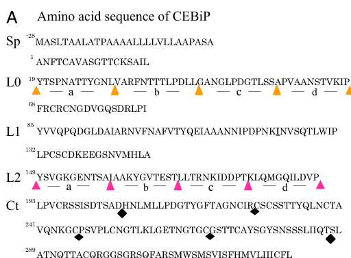

## Question

# Gene Research for Functional Annotation

## ⚠️ CRITICAL: Gene/Protein Identification Context

**BEFORE YOU BEGIN RESEARCH:** You MUST verify you are researching the CORRECT gene/protein. Gene symbols can be ambiguous, especially for less well-characterized genes from non-model organisms.

### Target Gene/Protein Identity (from UniProt):
- **UniProt Accession:** Q8H8C7
- **Protein Description:** RecName: Full=Chitin elicitor-binding protein {ECO:0000303|PubMed:16829581}; Short=CEBiP {ECO:0000303|PubMed:16829581}; Short=OsCEBiP {ECO:0000303|PubMed:27238968}; AltName: Full=Lysin motif-containing protein 1; Short=Os-LYP1; Flags: Precursor;
- **Gene Information:** Name=CEBIP {ECO:0000303|PubMed:16829581}; OrderedLocusNames=Os03g0133400 {ECO:0000312|EMBL:BAS82158.1}, LOC_Os03g04110 {ECO:0000312|EMBL:ABF93833.1}; ORFNames=OJ1006F06.19 {ECO:0000312|EMBL:AAN05509.1}, OsJ_30068 {ECO:0000312|EMBL:EAZ45419.1};
- **Organism (full):** Oryza sativa subsp. japonica (Rice).
- **Protein Family:** Not specified in UniProt
- **Key Domains:** LysM. (IPR018392); LysM_dom_sf. (IPR036779); LysM (PF01476)

### MANDATORY VERIFICATION STEPS:

1. **Check if the gene symbol "CEBIP" matches the protein description above**
2. **Verify the organism is correct:** Oryza sativa subsp. japonica (Rice).
3. **Check if protein family/domains align with what you find in literature**
4. **If you find literature for a DIFFERENT gene with the same or similar symbol, STOP**

### If Gene Symbol is Ambiguous or You Cannot Find Relevant Literature:

**DO NOT PROCEED WITH RESEARCH ON A DIFFERENT GENE.** Instead:
- State clearly: "The gene symbol 'CEBIP' is ambiguous or literature is limited for this specific protein"
- Explain what you found (e.g., "Found extensive literature on a different gene with the same symbol in a different organism")
- Describe the protein based ONLY on the UniProt information provided above
- Suggest that the protein function can be inferred from domain/family information

### Research Target:

Please provide a comprehensive research report on the gene **CEBIP** (gene ID: CEBIP, UniProt: Q8H8C7) in ORYSJ.

The research report should be a detailed narrative explaining the function, biological processes, and localization of the gene product. Citations should be given for all claims.

You should prioritize authoritative reviews and primary scientific literature when conducting research. You can supplement
this with annotations you find in gene/protein databases, but these can be outdated or inaccurate.

We are specifically interested in the primary function of the gene - for enzymes, what reaction is catalyzed, and what is the substrate specificity? For transporters, what is the substrate? For structural proteins or adapters, what is the broader structural role? For signaling molecules, what is the role in the pathway.

We are interested in where in or outside the cell the gene product carries out its function.

We are also interested in the signaling or biochemical pathways in which the gene functions. We are less interested in broad pleiotropic effects, except where these elucidate the precise role.

Include evidence where possible. We are interested in both experimental evidence as well as inference from structure, evolution, or bioinformatic analysis. Precise studies should be prioritized over high-throughput, where available.

## Output

Question: You are an expert researcher providing comprehensive, well-cited information.

Provide detailed information focusing on:
1. Key concepts and definitions with current understanding
2. Recent developments and latest research (prioritize 2023-2024 sources)
3. Current applications and real-world implementations
4. Expert opinions and analysis from authoritative sources
5. Relevant statistics and data from recent studies

Format as a comprehensive research report with proper citations. Include URLs and publication dates where available.
Always prioritize recent, authoritative sources and provide specific citations for all major claims.

# Gene Research for Functional Annotation

## ⚠️ CRITICAL: Gene/Protein Identification Context

**BEFORE YOU BEGIN RESEARCH:** You MUST verify you are researching the CORRECT gene/protein. Gene symbols can be ambiguous, especially for less well-characterized genes from non-model organisms.

### Target Gene/Protein Identity (from UniProt):
- **UniProt Accession:** Q8H8C7
- **Protein Description:** RecName: Full=Chitin elicitor-binding protein {ECO:0000303|PubMed:16829581}; Short=CEBiP {ECO:0000303|PubMed:16829581}; Short=OsCEBiP {ECO:0000303|PubMed:27238968}; AltName: Full=Lysin motif-containing protein 1; Short=Os-LYP1; Flags: Precursor;
- **Gene Information:** Name=CEBIP {ECO:0000303|PubMed:16829581}; OrderedLocusNames=Os03g0133400 {ECO:0000312|EMBL:BAS82158.1}, LOC_Os03g04110 {ECO:0000312|EMBL:ABF93833.1}; ORFNames=OJ1006F06.19 {ECO:0000312|EMBL:AAN05509.1}, OsJ_30068 {ECO:0000312|EMBL:EAZ45419.1};
- **Organism (full):** Oryza sativa subsp. japonica (Rice).
- **Protein Family:** Not specified in UniProt
- **Key Domains:** LysM. (IPR018392); LysM_dom_sf. (IPR036779); LysM (PF01476)

### MANDATORY VERIFICATION STEPS:

1. **Check if the gene symbol "CEBIP" matches the protein description above**
2. **Verify the organism is correct:** Oryza sativa subsp. japonica (Rice).
3. **Check if protein family/domains align with what you find in literature**
4. **If you find literature for a DIFFERENT gene with the same or similar symbol, STOP**

### If Gene Symbol is Ambiguous or You Cannot Find Relevant Literature:

**DO NOT PROCEED WITH RESEARCH ON A DIFFERENT GENE.** Instead:
- State clearly: "The gene symbol 'CEBIP' is ambiguous or literature is limited for this specific protein"
- Explain what you found (e.g., "Found extensive literature on a different gene with the same symbol in a different organism")
- Describe the protein based ONLY on the UniProt information provided above
- Suggest that the protein function can be inferred from domain/family information

### Research Target:

Please provide a comprehensive research report on the gene **CEBIP** (gene ID: CEBIP, UniProt: Q8H8C7) in ORYSJ.

The research report should be a detailed narrative explaining the function, biological processes, and localization of the gene product. Citations should be given for all claims.

You should prioritize authoritative reviews and primary scientific literature when conducting research. You can supplement
this with annotations you find in gene/protein databases, but these can be outdated or inaccurate.

We are specifically interested in the primary function of the gene - for enzymes, what reaction is catalyzed, and what is the substrate specificity? For transporters, what is the substrate? For structural proteins or adapters, what is the broader structural role? For signaling molecules, what is the role in the pathway.

We are interested in where in or outside the cell the gene product carries out its function.

We are also interested in the signaling or biochemical pathways in which the gene functions. We are less interested in broad pleiotropic effects, except where these elucidate the precise role.

Include evidence where possible. We are interested in both experimental evidence as well as inference from structure, evolution, or bioinformatic analysis. Precise studies should be prioritized over high-throughput, where available.

# Functional annotation report: rice CEBiP (UniProt Q8H8C7)

## Identity and principal function

**Identity verified.** The supplied UniProt accession Q8H8C7 denotes **CEBiP/OsCEBiP**, the chitin elicitor-binding protein of *Oryza sativa* subsp. *japonica*; the supplied locus identifiers are **Os03g0133400** and **LOC_Os03g04110**. The original rice study identified the CEBiP gene on chromosome 3, and a 2024 receptor review independently lists rice OsCEBiP at LOC_Os03g04110. This report concerns that protein—not the kinase OsCERK1, the related rice proteins OsLYP4/OsLYP6, or barley/Arabidopsis CEBiP homologues. (kaku2006plantcellsrecognize pages 2-4, cai2024receptorlikeproteinsdecisionmakers pages 4-6)

**Primary annotation:** CEBiP is an extracellular-facing, plasma-membrane-associated **LysM pattern-recognition receptor protein**. Its experimentally established molecular activity is **binding acetylated chitin oligosaccharides**, particularly longer fungal chitin fragments. It acts as the principal ligand-recognition component of the canonical rice **CEBiP–OsCERK1 chitin-immunity complex**. CEBiP has no demonstrated catalytic reaction or intracellular kinase domain: signal transmission depends on its kinase partner, OsCERK1. (kaku2006plantcellsrecognize pages 1-2, hayafune2014chitininducedactivationof pages 1-2, shimizu2010twolysmreceptor pages 1-2)

## Protein architecture, ligand and location

Kaku and colleagues cloned a **356-amino-acid precursor** with a predicted **28-residue N-terminal secretion signal**; removal of that signal gives the reported **328-residue mature polypeptide**. They identified two extracellular LysM regions, approximately **Tyr85–Pro131** and **Tyr149–Pro192**, and purified a glycosylated, chitin-binding protein from rice **plasma-membrane preparations**. The affinity-labeled species migrated at approximately **75 kDa**, while deglycosylation yielded a roughly **34-kDa** polypeptide. These findings place ligand recognition on the **outside-facing surface of the plasma membrane**, where released fungal chitin fragments can reach the receptor. (kaku2006plantcellsrecognize pages 2-2, kaku2006plantcellsrecognize pages 1-2)

Domain-resolution experiments later identified the **central LysM1** as essential for detectable chitin-oligomer binding; mutagenesis supported a contribution from **Ile122**. An HMM analysis additionally suggested an N-terminal **LysM-like region, termed LysM0**, which standard Pfam analysis had not identified. Thus, describing *two originally identified/canonical LysMs plus a proposed LysM0* is more precise than treating three equally validated binding domains as established. The LysM0 and second-LysM deletion experiments were partly limited by protein-expression or stability effects. The study’s domain diagram and deletion scheme are shown in its Figure 1. (hayafune2014chitininducedactivationof pages 2-4, hayafune2014chitininducedactivationof media fc7708eb)

**Membrane-attachment qualification:** the 2006 sequence analysis called the short C-terminal hydrophobic segment a **predicted transmembrane region**, whereas some later descriptions of CEBiP-like proteins use **GPI-anchored** terminology. The examined original rice experiments directly establish plasma-membrane association, but do **not** by themselves distinguish a persistent transmembrane helix from processing into a GPI anchor. GPI attachment should therefore not be stated as directly demonstrated for Q8H8C7 on this evidence. (kaku2006plantcellsrecognize pages 2-2, shinya2012functionalcharacterizationof pages 1-2)

Affinity purification with **N-acetylchitooctaose, (GlcNAc)₈**, establishes physical recognition of an acetylated chitin oligomer. NMR epitope mapping, binding/deletion studies and mutagenesis subsequently showed preferential interaction with **longer, N-acetylated oligomers**, particularly **heptamers and octamers**. Addition of (GlcNAc)₈ induced CEBiP-ectodomain dimerization in vitro; an asymmetrically deacetylated oligomer inhibited both this dimerization and chitin-induced reactive oxygen production. Together these results support a **sandwich model** in which two CEBiP ectodomains engage opposite faces of one sufficiently long chitin oligomer. The sandwich geometry is a mechanistic model supported by these experiments, not a measurement of every intact receptor-complex subunit in a living membrane. No rice-CEBiP dissociation constant is established by the evidence reviewed here; binding-saturation values reported for **Arabidopsis** CEBiP must not be transferred to Q8H8C7. (hayafune2014chitininducedactivationof pages 1-2, hayafune2014chitininducedactivationof pages 2-2, shinya2012functionalcharacterizationof pages 2-3)

The following evidence map separates properties measured for CEBiP from functions assigned to its partners.

| Element | What direct evidence establishes | Important attribution/limitation | Key paper and DOI |
|---|---|---|---|
| Chitin-oligomer recognition | OsCEBiP preferentially recognizes longer, fully acetylated chitin oligomers, especially GN7/GN8. Deletion, domain-swap, NMR, modeling, and mutagenesis identify central LysM1 and Ile122 as critical; GN8 induces a sandwich-like dimer in which two OsCEBiP ectodomains engage one ligand. (hayafune2014chitininducedactivationof pages 2-2, hayafune2014chitininducedactivationof pages 1-2, hayafune2014chitininducedactivationof pages 2-4) | The sequence has two canonical LysM domains (approximately residues 85–131 and 149–192); an additional N-terminal LysM-like region, LysM0, was predicted by HMM but not standard PFAM analysis. The reported 200–300 nM saturation value is for Arabidopsis AtCEBiP—not rice OsCEBiP—and must not be transferred to Q8H8C7. (kaku2006plantcellsrecognize pages 2-2, shinya2012functionalcharacterizationof pages 2-3, hayafune2014chitininducedactivationof pages 2-4) | Hayafune et al., *PNAS* (6 January 2014), https://doi.org/10.1073/pnas.1312099111 |
| Cell-surface localization and topology | CEBiP was isolated from rice plasma-membrane preparations by GN8 affinity purification and detected as an approximately 75-kDa glycoprotein; deglycosylation yielded an approximately 34-kDa polypeptide. The cloned precursor is 356 aa, with a predicted 28-aa signal peptide; its processed extracellular polypeptide is 328 aa. (kaku2006plantcellsrecognize pages 1-2, kaku2006plantcellsrecognize pages 2-2) | The original study predicted a 22-aa C-terminal hydrophobic/transmembrane region and demonstrated plasma-membrane association, but the retrieved rice-specific evidence does not biochemically prove a GPI anchor. Accordingly, “GPI-anchored” should be treated as an annotation/model unless supported by rice phospholipase sensitivity or direct anchor analysis. (kaku2006plantcellsrecognize pages 2-2, shinya2012functionalcharacterizationof pages 1-2) | Kaku et al., *PNAS* (18 July 2006), https://doi.org/10.1073/pnas.0508882103 |
| OsCEBiP–OsCERK1 receptor complex | OsCEBiP is the principal chitin-binding receptor-like protein, whereas OsCERK1 is the associated receptor kinase. Yeast two-hybrid, co-immunoprecipitation, blue-native PAGE, and cross-linking support CEBiP homo-oligomers and chitin-promoted formation or stabilization of an OsCEBiP–OsCERK1 complex. OsCERK1 knockdown suppresses GN8-induced responses without reducing membrane GN8 binding. (shimizu2010twolysmreceptor pages 1-2, hayafune2014chitininducedactivationof pages 1-2, shimizu2010twolysmreceptor pages 3-4) | Direct canonical chitin binding is assigned primarily to OsCEBiP; catalytic signal transmission is assigned to OsCERK1. Complex dependence does not imply that OsCEBiP has kinase activity—it lacks a cytoplasmic kinase domain. (akamatsu2013anoscebiposcerk1osracgef1osrac1module pages 1-2, awwanah2020characterizationofpopulus pages 27-30) | Shimizu et al., *The Plant Journal* (September 2010), https://doi.org/10.1111/j.1365-313X.2010.04324.x |
| Intracellular signaling branches | After receptor activation, OsCERK1 phosphorylates OsRacGEF1 at Ser549, promoting OsRac1 activation at the plasma membrane. A parallel OsCERK1–OsRLCK185 route engages OsMAPKKKε, OsMKK4/5, and OsMPK3/6 to activate immune outputs. (akamatsu2013anoscebiposcerk1osracgef1osrac1module pages 1-2, sanchezvallet2015thebattlefor pages 2-3, wang2017oscerk1mediatedchitinperception pages 1-5) | These phosphorylation and kinase-cascade activities belong to OsCERK1 and its cytoplasmic substrates—not to OsCEBiP. OsCEBiP supplies extracellular ligand recognition and receptor-complex assembly upstream. | Akamatsu et al., *Cell Host & Microbe* (17 April 2013), https://doi.org/10.1016/j.chom.2013.03.007; Wang et al., *Molecular Plant* (April 2017), https://doi.org/10.1016/j.molp.2017.01.006 |
| Receptor competition and ubiquitin regulation | In roots, CO4-bound OsMYR1 competes with OsCEBiP for OsCERK1, reducing OsCERK1–OsCEBiP association and OsCERK1-mediated OsGEF1 phosphorylation. In 2024, OsCIE1 was shown to ubiquitinate and restrain OsCERK1; activated OsCERK1 phosphorylates OsCIE1 and inhibits this ubiquitin brake. (zhang2021discriminatingsymbiosisand pages 1-2, wang2024releaseofa pages 2-3, wang2024releaseofa pages 1-2, zhang2021discriminatingsymbiosisand pages 2-3) | The 2021 competition result places OsCEBiP in immunity-versus-symbiosis receptor allocation. The 2024 ubiquitination mechanism was demonstrated directly for OsCERK1, not Q8H8C7; it is therefore a pathway-level update rather than evidence that OsCEBiP itself is ubiquitinated. | Zhang et al., *PNAS* (20 April 2021), https://doi.org/10.1073/pnas.2023738118; Wang et al., *Nature* (May 2024), https://doi.org/10.1038/s41586-024-07418-9 |

*Table: Compact evidence map separating direct properties of japonica rice OsCEBiP Q8H8C7 from functions performed by its kinase partner OsCERK1. It highlights ligand specificity, topology uncertainties, receptor-complex organization, downstream signaling, and recent regulatory findings.*

## Receptor complex and intracellular pathway

CEBiP alone is not an intracellular signaling enzyme. In rice, **OsCERK1** provides the receptor-kinase component: OsCERK1 silencing greatly reduced chitin-induced defense responses **without reducing membrane binding** of a biotinylated chitin octasaccharide. Yeast two-hybrid assays supported interactions between the extracellular receptor regions; membrane co-immunoprecipitation supported chitin-induced CEBiP–OsCERK1 association. Blue-native electrophoresis and cross-linking also detected **CEBiP homo-oligomers before ligand addition**. Accordingly, ligand may reorganize and/or stabilize pre-existing receptor assemblies; the evidence does not require every CEBiP molecule to begin as an isolated monomer. (shimizu2010twolysmreceptor pages 1-2, shimizu2010twolysmreceptor pages 3-4)

Downstream of extracellular chitin recognition, **OsCERK1**, rather than CEBiP, phosphorylates **OsRacGEF1**; the reported **Ser549** phosphorylation supports activation of the plasma-membrane small GTPase **OsRac1**. A second characterized branch uses OsCERK1-associated **OsRLCK185** and **OsMAPKKKε**, feeding into **OsMKK4/5–OsMPK3/6** MAP-kinase signaling. These pathways link the CEBiP-containing perception complex to oxidative burst, defense transcription and antifungal immunity, but their phosphorylation reactions must not be assigned to CEBiP itself. (akamatsu2013anoscebiposcerk1osracgef1osrac1module pages 1-2, wang2017oscerk1mediatedchitinperception pages 1-5, sanchezvallet2015thebattlefor pages 2-3)

## Experimental strength and biological relevance

**Targeted loss of function:** in the original rice suspension-cell experiment, two CEBiP-RNAi lines retained **2.9% and 6.7%** of control CEBiP transcript. After chitin-octamer treatment, their induced hydrogen-peroxide output fell to approximately **one-quarter to one-seventh** of control. Lipopolysaccharide-triggered ROS remained unaffected, supporting a comparatively specific defect in chitin perception. Of genes normally induced or repressed by the chitin elicitor, **71%** and **80%**, respectively, became unresponsive or substantially less responsive after CEBiP knockdown; membrane chitin-binding sites were also diminished. These are measurements in the studied rice cells, not universal effect sizes for all rice tissues or pathogens. (kaku2006plantcellsrecognize pages 2-4, kaku2006plantcellsrecognize pages 4-5)

**Infection relevance:** the rice-blast fungus *Magnaporthe oryzae* secretes the chitin-binding effector **Slp1** at the fungal–rice interface. Slp1 competes with CEBiP for chitin oligomers and suppresses chitin-induced ROS and defense-gene expression. Importantly, CEBiP silencing allowed substantial blast disease even in the **absence of fungal Slp1**, genetically supporting the significance of CEBiP-dependent recognition during infection rather than only in elicitor-treated cell cultures. This establishes a mechanistic pathogen-evasion route, not evidence that CEBiP binds Slp1 directly. (mentlak2012effectormediatedsuppressionof pages 1-2)

## Recent developments and scope of application

A **2021 rice study** refined how immune and symbiotic signals are distinguished: the short chitooligosaccharide **CO4** and its receptor **OsMYR1** can compete with CEBiP for OsCERK1, reducing formation of the immune receptor complex and OsCERK1-mediated phosphorylation of OsGEF1. Conversely, CEBiP association opposes OsMYR1–OsCERK1 complex formation; the study reported increased early mycorrhizal colonization in *oscebip* mutants. This implicates CEBiP in **allocation of a shared kinase partner**, but does not make CEBiP the established CO4 symbiosis receptor. (zhang2021discriminatingsymbiosisand pages 1-2, zhang2021discriminatingsymbiosisand pages 2-3)

Ligand assignment is likewise context-specific. Another **2021 primary study** found that two hemicellulose-derived rice-cell-wall oligosaccharides released during blast infection bind **OsCERK1, not CEBiP**, although both receptors participate in the resulting ROS response and receptor association. Therefore, a phenotype requiring *oscebip* does not, by itself, prove **direct CEBiP binding** of every elicitor that activates the complex. Nor should the demonstrated chitin specificity of Q8H8C7 be replaced with the peptidoglycan-binding assignments of other rice LysM proteins. (yang2021poaceaespecificcellwallderived pages 1-2, cai2024receptorlikeproteinsdecisionmakers pages 4-6)

The strongest **2024 mechanistic advance** retrieved concerns regulation of **OsCERK1**, rather than a newly established biochemical activity of CEBiP: a *Nature* study found that the E3 ligase **OsCIE1** restrains OsCERK1 through ubiquitination and that activated OsCERK1 can inhibit this brake. *Oscie1* mutants showed enhanced chitin-triggered ROS and pathogen resistance, with genetic evidence that much of the phenotype depended on OsCERK1. This is a **pathway-level update**, not a demonstration that OsCIE1 ubiquitinates Q8H8C7. A November 2024 receptor review continues to classify rice OsCEBiP as the **chitin-recognizing LysM receptor protein partnered with OsCERK1**. (wang2024releaseofa pages 2-3, wang2024releaseofa pages 1-2, cai2024receptorlikeproteinsdecisionmakers pages 4-6)

For real-world use, CEBiP is a **mechanistically validated target for studying or engineering rice pattern-triggered resistance**, because both rice loss-of-function experiments and fungal-effector genetics connect its ligand-recognition role to immunity. That is a research and crop-improvement rationale, **not evidence that a CEBiP-based cultivar or treatment is already deployed commercially**. The most defensible functional annotation remains: **a cell-surface, extracellular chitin-oligosaccharide-binding receptor component that recruits/works with OsCERK1 to initiate rice innate immune signaling**. (kaku2006plantcellsrecognize pages 4-5, mentlak2012effectormediatedsuppressionof pages 1-2, shimizu2010twolysmreceptor pages 1-2)

### Principal sources and publication dates

- Kaku et al., *PNAS*, **18 July 2006**, “Plant cells recognize chitin fragments for defense signaling through a plasma membrane receptor.” https://doi.org/10.1073/pnas.0508882103. (kaku2006plantcellsrecognize pages 1-2, kaku2006plantcellsrecognize pages 2-2)
- Shimizu et al., *The Plant Journal*, **September 2010**, “Two LysM receptor molecules, CEBiP and OsCERK1, cooperatively regulate chitin elicitor signaling in rice.” https://doi.org/10.1111/j.1365-313x.2010.04324.x. (shimizu2010twolysmreceptor pages 1-2)
- Mentlak et al., *The Plant Cell*, **January 2012**, “Effector-Mediated Suppression of Chitin-Triggered Immunity by *Magnaporthe oryzae* Is Necessary for Rice Blast Disease.” https://doi.org/10.1105/tpc.111.092957. (mentlak2012effectormediatedsuppressionof pages 1-2)
- Akamatsu et al., *Cell Host & Microbe*, **April 2013**, “An OsCEBiP/OsCERK1–OsRacGEF1–OsRac1 module is an essential early component of chitin-induced rice immunity.” https://doi.org/10.1016/j.chom.2013.03.007. (akamatsu2013anoscebiposcerk1osracgef1osrac1module pages 1-2)
- Hayafune et al., *PNAS*, **6 January 2014** online, “Chitin-induced activation of immune signaling by the rice receptor CEBiP relies on a unique sandwich-type dimerization.” https://doi.org/10.1073/pnas.1312099111. (hayafune2014chitininducedactivationof pages 1-2, hayafune2014chitininducedactivationof pages 2-4)
- Wang et al., *Molecular Plant*, **April 2017**, OsRLCK185/MAP-kinase signaling study. https://doi.org/10.1016/j.molp.2017.01.006. (wang2017oscerk1mediatedchitinperception pages 1-5)
- Zhang et al., *PNAS*, **April 2021**, “Discriminating symbiosis and immunity signals by receptor competition in rice.” https://doi.org/10.1073/pnas.2023738118. (zhang2021discriminatingsymbiosisand pages 1-2)
- Yang et al., *Nature Communications*, **April 2021**, cell-wall oligosaccharide/OsCERK1 ligand-specificity study. https://doi.org/10.1038/s41467-021-22456-x. (yang2021poaceaespecificcellwallderived pages 1-2)
- Wang et al., *Nature*, **May 2024**, “Release of a ubiquitin brake activates OsCERK1-triggered immunity in rice.” https://doi.org/10.1038/s41586-024-07418-9. (wang2024releaseofa pages 1-2)
- Cai et al., *Phytopathology Research*, **November 2024**, receptor-like protein review. https://doi.org/10.1186/s42483-024-00279-0. (cai2024receptorlikeproteinsdecisionmakers pages 4-6)

References

1. (kaku2006plantcellsrecognize pages 2-4): Hanae Kaku, Yoko Nishizawa, Naoko Ishii-Minami, Chiharu Akimoto-Tomiyama, Naoshi Dohmae, Koji Takio, Eiichi Minami, and Naoto Shibuya. Plant cells recognize chitin fragments for defense signaling through a plasma membrane receptor. Proceedings of the National Academy of Sciences of the United States of America, 103 29:11086-91, Jul 2006. URL: https://doi.org/10.1073/pnas.0508882103, doi:10.1073/pnas.0508882103. This article has 1458 citations and is from a highest quality peer-reviewed journal.

2. (cai2024receptorlikeproteinsdecisionmakers pages 4-6): Minrui Cai, Hongqiang Yu, E. Sun, and Cunwu Zuo. Receptor-like proteins: decision-makers of plant immunity. Phytopathology Research, Nov 2024. URL: https://doi.org/10.1186/s42483-024-00279-0, doi:10.1186/s42483-024-00279-0. This article has 24 citations and is from a peer-reviewed journal.

3. (kaku2006plantcellsrecognize pages 1-2): Hanae Kaku, Yoko Nishizawa, Naoko Ishii-Minami, Chiharu Akimoto-Tomiyama, Naoshi Dohmae, Koji Takio, Eiichi Minami, and Naoto Shibuya. Plant cells recognize chitin fragments for defense signaling through a plasma membrane receptor. Proceedings of the National Academy of Sciences of the United States of America, 103 29:11086-91, Jul 2006. URL: https://doi.org/10.1073/pnas.0508882103, doi:10.1073/pnas.0508882103. This article has 1458 citations and is from a highest quality peer-reviewed journal.

4. (hayafune2014chitininducedactivationof pages 1-2): Masahiro Hayafune, Rita Berisio, Roberta Marchetti, Alba Silipo, Miyu Kayama, Yoshitake Desaki, Sakiko Arima, Flavia Squeglia, Alessia Ruggiero, Ken Tokuyasu, Antonio Molinaro, Hanae Kaku, and Naoto Shibuya. Chitin-induced activation of immune signaling by the rice receptor cebip relies on a unique sandwich-type dimerization. Proceedings of the National Academy of Sciences, 111:E404-E413, Jan 2014. URL: https://doi.org/10.1073/pnas.1312099111, doi:10.1073/pnas.1312099111. This article has 436 citations and is from a highest quality peer-reviewed journal.

5. (shimizu2010twolysmreceptor pages 1-2): Takeo Shimizu, Takuto Nakano, Daisuke Takamizawa, Yoshitake Desaki, Naoko Ishii-Minami, Yoko Nishizawa, Eiichi Minami, Kazunori Okada, Hisakazu Yamane, Hanae Kaku, and Naoto Shibuya. Two lysm receptor molecules, cebip and oscerk1, cooperatively regulate chitin elicitor signaling in rice. The Plant Journal, 64:204-214, Sep 2010. URL: https://doi.org/10.1111/j.1365-313x.2010.04324.x, doi:10.1111/j.1365-313x.2010.04324.x. This article has 893 citations.

6. (kaku2006plantcellsrecognize pages 2-2): Hanae Kaku, Yoko Nishizawa, Naoko Ishii-Minami, Chiharu Akimoto-Tomiyama, Naoshi Dohmae, Koji Takio, Eiichi Minami, and Naoto Shibuya. Plant cells recognize chitin fragments for defense signaling through a plasma membrane receptor. Proceedings of the National Academy of Sciences of the United States of America, 103 29:11086-91, Jul 2006. URL: https://doi.org/10.1073/pnas.0508882103, doi:10.1073/pnas.0508882103. This article has 1458 citations and is from a highest quality peer-reviewed journal.

7. (hayafune2014chitininducedactivationof pages 2-4): Masahiro Hayafune, Rita Berisio, Roberta Marchetti, Alba Silipo, Miyu Kayama, Yoshitake Desaki, Sakiko Arima, Flavia Squeglia, Alessia Ruggiero, Ken Tokuyasu, Antonio Molinaro, Hanae Kaku, and Naoto Shibuya. Chitin-induced activation of immune signaling by the rice receptor cebip relies on a unique sandwich-type dimerization. Proceedings of the National Academy of Sciences, 111:E404-E413, Jan 2014. URL: https://doi.org/10.1073/pnas.1312099111, doi:10.1073/pnas.1312099111. This article has 436 citations and is from a highest quality peer-reviewed journal.

8. (hayafune2014chitininducedactivationof media fc7708eb): Masahiro Hayafune, Rita Berisio, Roberta Marchetti, Alba Silipo, Miyu Kayama, Yoshitake Desaki, Sakiko Arima, Flavia Squeglia, Alessia Ruggiero, Ken Tokuyasu, Antonio Molinaro, Hanae Kaku, and Naoto Shibuya. Chitin-induced activation of immune signaling by the rice receptor cebip relies on a unique sandwich-type dimerization. Proceedings of the National Academy of Sciences, 111:E404-E413, Jan 2014. URL: https://doi.org/10.1073/pnas.1312099111, doi:10.1073/pnas.1312099111. This article has 436 citations and is from a highest quality peer-reviewed journal.

9. (shinya2012functionalcharacterizationof pages 1-2): Tomonori Shinya, Noriko Motoyama, Asahi Ikeda, Miyuki Wada, Kota Kamiya, Masahiro Hayafune, Hanae Kaku, and Naoto Shibuya. Functional characterization of cebip and cerk1 homologs in arabidopsis and rice reveals the presence of different chitin receptor systems in plants. Plant & cell physiology, 53 10:1696-706, Oct 2012. URL: https://doi.org/10.1093/pcp/pcs113, doi:10.1093/pcp/pcs113. This article has 242 citations and is from a domain leading peer-reviewed journal.

10. (hayafune2014chitininducedactivationof pages 2-2): Masahiro Hayafune, Rita Berisio, Roberta Marchetti, Alba Silipo, Miyu Kayama, Yoshitake Desaki, Sakiko Arima, Flavia Squeglia, Alessia Ruggiero, Ken Tokuyasu, Antonio Molinaro, Hanae Kaku, and Naoto Shibuya. Chitin-induced activation of immune signaling by the rice receptor cebip relies on a unique sandwich-type dimerization. Proceedings of the National Academy of Sciences, 111:E404-E413, Jan 2014. URL: https://doi.org/10.1073/pnas.1312099111, doi:10.1073/pnas.1312099111. This article has 436 citations and is from a highest quality peer-reviewed journal.

11. (shinya2012functionalcharacterizationof pages 2-3): Tomonori Shinya, Noriko Motoyama, Asahi Ikeda, Miyuki Wada, Kota Kamiya, Masahiro Hayafune, Hanae Kaku, and Naoto Shibuya. Functional characterization of cebip and cerk1 homologs in arabidopsis and rice reveals the presence of different chitin receptor systems in plants. Plant & cell physiology, 53 10:1696-706, Oct 2012. URL: https://doi.org/10.1093/pcp/pcs113, doi:10.1093/pcp/pcs113. This article has 242 citations and is from a domain leading peer-reviewed journal.

12. (shimizu2010twolysmreceptor pages 3-4): Takeo Shimizu, Takuto Nakano, Daisuke Takamizawa, Yoshitake Desaki, Naoko Ishii-Minami, Yoko Nishizawa, Eiichi Minami, Kazunori Okada, Hisakazu Yamane, Hanae Kaku, and Naoto Shibuya. Two lysm receptor molecules, cebip and oscerk1, cooperatively regulate chitin elicitor signaling in rice. The Plant Journal, 64:204-214, Sep 2010. URL: https://doi.org/10.1111/j.1365-313x.2010.04324.x, doi:10.1111/j.1365-313x.2010.04324.x. This article has 893 citations.

13. (akamatsu2013anoscebiposcerk1osracgef1osrac1module pages 1-2): Akira Akamatsu, Hann Lin Wong, Masayuki Fujiwara, Jun Okuda, Keita Nishide, Kazumi Uno, Keiko Imai, Kenji Umemura, Tsutomu Kawasaki, Yoji Kawano, and Ko Shimamoto. An oscebip/oscerk1-osracgef1-osrac1 module is an essential early component of chitin-induced rice immunity. Cell host & microbe, 13 4:465-76, Apr 2013. URL: https://doi.org/10.1016/j.chom.2013.03.007, doi:10.1016/j.chom.2013.03.007. This article has 299 citations and is from a highest quality peer-reviewed journal.

14. (awwanah2020characterizationofpopulus pages 27-30): Awwanah Mo. Characterization of populus x canescens lysm-receptor like kinases lyk4/lyk5 and lysm-receptor like protein lym2 and their roles in chitin signaling. Unknown journal, 2020. URL: https://doi.org/10.53846/goediss-7913, doi:10.53846/goediss-7913.

15. (sanchezvallet2015thebattlefor pages 2-3): Andrea Sánchez-Vallet, Jeroen R. Mesters, and Bart P.H.J. Thomma. The battle for chitin recognition in plant-microbe interactions. FEMS microbiology reviews, 39 2:171-83, Mar 2015. URL: https://doi.org/10.1093/femsre/fuu003, doi:10.1093/femsre/fuu003. This article has 363 citations and is from a domain leading peer-reviewed journal.

16. (wang2017oscerk1mediatedchitinperception pages 1-5): Chao Wang, Gang Wang, Chi Zhang, Pinkuan Zhu, Huiling Dai, Nan Yu, Zuhua He, Ling Xu, and Ertao Wang. Oscerk1-mediated chitin perception and immune signaling requires receptor-like cytoplasmic kinase 185 to activate an mapk cascade in rice. Molecular plant, 10 4:619-633, Apr 2017. URL: https://doi.org/10.1016/j.molp.2017.01.006, doi:10.1016/j.molp.2017.01.006. This article has 235 citations and is from a highest quality peer-reviewed journal.

17. (zhang2021discriminatingsymbiosisand pages 1-2): Chi Zhang, Jiangman He, Huiling Dai, Gang Wang, Xiaowei Zhang, Chao Wang, Jincai Shi, Xi Chen, Dapeng Wang, and Ertao Wang. Discriminating symbiosis and immunity signals by receptor competition in rice. Proceedings of the National Academy of Sciences, Apr 2021. URL: https://doi.org/10.1073/pnas.2023738118, doi:10.1073/pnas.2023738118. This article has 145 citations and is from a highest quality peer-reviewed journal.

18. (wang2024releaseofa pages 2-3): Gang Wang, Xi Chen, Chengzhi Yu, Xiaobao Shi, Wenxian Lan, Chaofeng Gao, Jun Yang, Huiling Dai, Xiaowei Zhang, Huili Zhang, Boyu Zhao, Qi Xie, Nan Yu, Zuhua He, Yu Zhang, and Ertao Wang. Release of a ubiquitin brake activates oscerk1-triggered immunity in rice. Nature, May 2024. URL: https://doi.org/10.1038/s41586-024-07418-9, doi:10.1038/s41586-024-07418-9. This article has 80 citations and is from a highest quality peer-reviewed journal.

19. (wang2024releaseofa pages 1-2): Gang Wang, Xi Chen, Chengzhi Yu, Xiaobao Shi, Wenxian Lan, Chaofeng Gao, Jun Yang, Huiling Dai, Xiaowei Zhang, Huili Zhang, Boyu Zhao, Qi Xie, Nan Yu, Zuhua He, Yu Zhang, and Ertao Wang. Release of a ubiquitin brake activates oscerk1-triggered immunity in rice. Nature, May 2024. URL: https://doi.org/10.1038/s41586-024-07418-9, doi:10.1038/s41586-024-07418-9. This article has 80 citations and is from a highest quality peer-reviewed journal.

20. (zhang2021discriminatingsymbiosisand pages 2-3): Chi Zhang, Jiangman He, Huiling Dai, Gang Wang, Xiaowei Zhang, Chao Wang, Jincai Shi, Xi Chen, Dapeng Wang, and Ertao Wang. Discriminating symbiosis and immunity signals by receptor competition in rice. Proceedings of the National Academy of Sciences, Apr 2021. URL: https://doi.org/10.1073/pnas.2023738118, doi:10.1073/pnas.2023738118. This article has 145 citations and is from a highest quality peer-reviewed journal.

21. (kaku2006plantcellsrecognize pages 4-5): Hanae Kaku, Yoko Nishizawa, Naoko Ishii-Minami, Chiharu Akimoto-Tomiyama, Naoshi Dohmae, Koji Takio, Eiichi Minami, and Naoto Shibuya. Plant cells recognize chitin fragments for defense signaling through a plasma membrane receptor. Proceedings of the National Academy of Sciences of the United States of America, 103 29:11086-91, Jul 2006. URL: https://doi.org/10.1073/pnas.0508882103, doi:10.1073/pnas.0508882103. This article has 1458 citations and is from a highest quality peer-reviewed journal.

22. (mentlak2012effectormediatedsuppressionof pages 1-2): Thomas A. Mentlak, Anja Kombrink, Tomonori Shinya, Lauren S. Ryder, Ippei Otomo, Hiromasa Saitoh, Ryohei Terauchi, Yoko Nishizawa, Naoto Shibuya, Bart P.H.J. Thomma, and Nicholas J. Talbot. Effector-mediated suppression of chitin-triggered immunity by <i>magnaporthe oryzae</i> is necessary for rice blast disease. The Plant Cell, 24(1):322-335, Jan 2012. URL: https://doi.org/10.1105/tpc.111.092957, doi:10.1105/tpc.111.092957. This article has 674 citations.

23. (yang2021poaceaespecificcellwallderived pages 1-2): Chao Yang, Rui Liu, Jinhuan Pang, Bin Ren, Huanbin Zhou, Gang Wang, Ertao Wang, and Jun Liu. Poaceae-specific cell wall-derived oligosaccharides activate plant immunity via oscerk1 during magnaporthe oryzae infection in rice. Nature Communications, Apr 2021. URL: https://doi.org/10.1038/s41467-021-22456-x, doi:10.1038/s41467-021-22456-x. This article has 200 citations and is from a highest quality peer-reviewed journal.

## Artifacts

- [Edison artifact artifact-00](CEBIP-deep-research-falcon_artifacts/artifact-00.md)

## Citations

1. mentlak2012effectormediatedsuppressionof pages 1-2
2. shimizu2010twolysmreceptor pages 1-2
3. zhang2021discriminatingsymbiosisand pages 1-2
4. yang2021poaceaespecificcellwallderived pages 1-2
5. wang2024releaseofa pages 1-2
6. cai2024receptorlikeproteinsdecisionmakers pages 4-6
7. kaku2006plantcellsrecognize pages 2-4
8. kaku2006plantcellsrecognize pages 1-2
9. hayafune2014chitininducedactivationof pages 1-2
10. kaku2006plantcellsrecognize pages 2-2
11. hayafune2014chitininducedactivationof pages 2-4
12. shinya2012functionalcharacterizationof pages 1-2
13. hayafune2014chitininducedactivationof pages 2-2
14. shinya2012functionalcharacterizationof pages 2-3
15. shimizu2010twolysmreceptor pages 3-4
16. awwanah2020characterizationofpopulus pages 27-30
17. sanchezvallet2015thebattlefor pages 2-3
18. wang2024releaseofa pages 2-3
19. zhang2021discriminatingsymbiosisand pages 2-3
20. kaku2006plantcellsrecognize pages 4-5
21. https://doi.org/10.1073/pnas.1312099111
22. https://doi.org/10.1073/pnas.0508882103
23. https://doi.org/10.1111/j.1365-313X.2010.04324.x
24. https://doi.org/10.1016/j.chom.2013.03.007;
25. https://doi.org/10.1016/j.molp.2017.01.006
26. https://doi.org/10.1073/pnas.2023738118;
27. https://doi.org/10.1038/s41586-024-07418-9
28. https://doi.org/10.1073/pnas.0508882103.
29. https://doi.org/10.1111/j.1365-313x.2010.04324.x.
30. https://doi.org/10.1105/tpc.111.092957.
31. https://doi.org/10.1016/j.chom.2013.03.007.
32. https://doi.org/10.1073/pnas.1312099111.
33. https://doi.org/10.1016/j.molp.2017.01.006.
34. https://doi.org/10.1073/pnas.2023738118.
35. https://doi.org/10.1038/s41467-021-22456-x.
36. https://doi.org/10.1038/s41586-024-07418-9.
37. https://doi.org/10.1186/s42483-024-00279-0.
38. https://doi.org/10.1073/pnas.0508882103,
39. https://doi.org/10.1186/s42483-024-00279-0,
40. https://doi.org/10.1073/pnas.1312099111,
41. https://doi.org/10.1111/j.1365-313x.2010.04324.x,
42. https://doi.org/10.1093/pcp/pcs113,
43. https://doi.org/10.1016/j.chom.2013.03.007,
44. https://doi.org/10.53846/goediss-7913,
45. https://doi.org/10.1093/femsre/fuu003,
46. https://doi.org/10.1016/j.molp.2017.01.006,
47. https://doi.org/10.1073/pnas.2023738118,
48. https://doi.org/10.1038/s41586-024-07418-9,
49. https://doi.org/10.1105/tpc.111.092957,
50. https://doi.org/10.1038/s41467-021-22456-x,