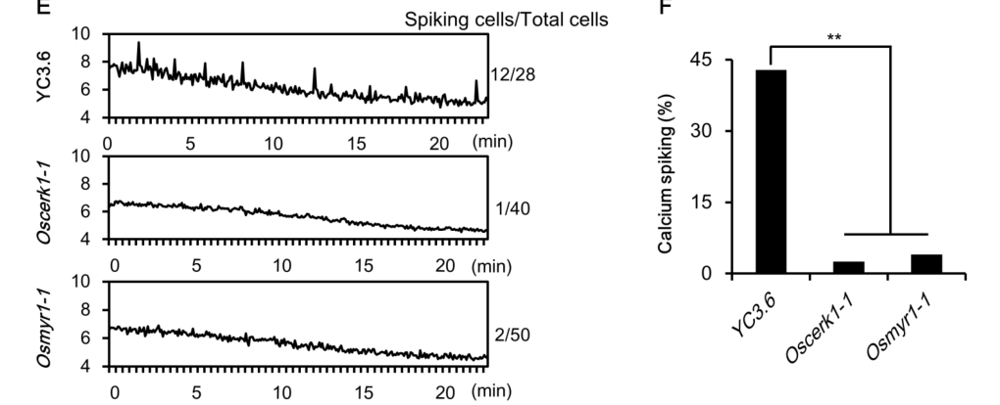

## Question

# Gene Research for Functional Annotation

## ⚠️ CRITICAL: Gene/Protein Identification Context

**BEFORE YOU BEGIN RESEARCH:** You MUST verify you are researching the CORRECT gene/protein. Gene symbols can be ambiguous, especially for less well-characterized genes from non-model organisms.

### Target Gene/Protein Identity (from UniProt):
- **UniProt Accession:** A0A0P0XII1
- **Protein Description:** RecName: Full=Chitin elicitor receptor kinase 1 {ECO:0000303|PubMed:21070404}; Short=OsCERK1 {ECO:0000303|PubMed:21070404}; EC=2.7.11.1 {ECO:0000269|PubMed:23498959}; AltName: Full=LysM domain receptor-like kinase 1 {ECO:0000305}; Short=LysM RLK1 {ECO:0000305}; Short=LysM-containing receptor-like kinase 1 {ECO:0000305}; AltName: Full=LysM domain receptor-like kinase 9 {ECO:0000303|PubMed:21070404}; Short=OsLysM-RLK9 {ECO:0000303|PubMed:21070404}; Flags: Precursor;
- **Gene Information:** Name=CERK1 {ECO:0000303|PubMed:21070404}; Synonyms=RLK9 {ECO:0000303|PubMed:21070404}; OrderedLocusNames=Os08g0538300 {ECO:0000312|EMBL:BAT06465.1}, LOC_Os08g42580 {ECO:0000305}; ORFNames=P0665C04.34 {ECO:0000312|EMBL:BAD01244.1}, P0666G10.101 {ECO:0000312|EMBL:BAD33138.1};
- **Organism (full):** Oryza sativa subsp. japonica (Rice).
- **Protein Family:** Belongs to the protein kinase superfamily. Ser/Thr protein
- **Key Domains:** CERK1/LYK3-like. (IPR044812); Kinase-like_dom_sf. (IPR011009); LysM_RLK3/10. (IPR057097); Prot_kinase_dom. (IPR000719); Protein_kinase_ATP_BS. (IPR017441)

### MANDATORY VERIFICATION STEPS:

1. **Check if the gene symbol "CERK1" matches the protein description above**
2. **Verify the organism is correct:** Oryza sativa subsp. japonica (Rice).
3. **Check if protein family/domains align with what you find in literature**
4. **If you find literature for a DIFFERENT gene with the same or similar symbol, STOP**

### If Gene Symbol is Ambiguous or You Cannot Find Relevant Literature:

**DO NOT PROCEED WITH RESEARCH ON A DIFFERENT GENE.** Instead:
- State clearly: "The gene symbol 'CERK1' is ambiguous or literature is limited for this specific protein"
- Explain what you found (e.g., "Found extensive literature on a different gene with the same symbol in a different organism")
- Describe the protein based ONLY on the UniProt information provided above
- Suggest that the protein function can be inferred from domain/family information

### Research Target:

Please provide a comprehensive research report on the gene **CERK1** (gene ID: CERK1, UniProt: A0A0P0XII1) in ORYSJ.

The research report should be a detailed narrative explaining the function, biological processes, and localization of the gene product. Citations should be given for all claims.

You should prioritize authoritative reviews and primary scientific literature when conducting research. You can supplement
this with annotations you find in gene/protein databases, but these can be outdated or inaccurate.

We are specifically interested in the primary function of the gene - for enzymes, what reaction is catalyzed, and what is the substrate specificity? For transporters, what is the substrate? For structural proteins or adapters, what is the broader structural role? For signaling molecules, what is the role in the pathway.

We are interested in where in or outside the cell the gene product carries out its function.

We are also interested in the signaling or biochemical pathways in which the gene functions. We are less interested in broad pleiotropic effects, except where these elucidate the precise role.

Include evidence where possible. We are interested in both experimental evidence as well as inference from structure, evolution, or bioinformatic analysis. Precise studies should be prioritized over high-throughput, where available.

## Output

Question: You are an expert researcher providing comprehensive, well-cited information.

Provide detailed information focusing on:
1. Key concepts and definitions with current understanding
2. Recent developments and latest research (prioritize 2023-2024 sources)
3. Current applications and real-world implementations
4. Expert opinions and analysis from authoritative sources
5. Relevant statistics and data from recent studies

Format as a comprehensive research report with proper citations. Include URLs and publication dates where available.
Always prioritize recent, authoritative sources and provide specific citations for all major claims.

# Gene Research for Functional Annotation

## ⚠️ CRITICAL: Gene/Protein Identification Context

**BEFORE YOU BEGIN RESEARCH:** You MUST verify you are researching the CORRECT gene/protein. Gene symbols can be ambiguous, especially for less well-characterized genes from non-model organisms.

### Target Gene/Protein Identity (from UniProt):
- **UniProt Accession:** A0A0P0XII1
- **Protein Description:** RecName: Full=Chitin elicitor receptor kinase 1 {ECO:0000303|PubMed:21070404}; Short=OsCERK1 {ECO:0000303|PubMed:21070404}; EC=2.7.11.1 {ECO:0000269|PubMed:23498959}; AltName: Full=LysM domain receptor-like kinase 1 {ECO:0000305}; Short=LysM RLK1 {ECO:0000305}; Short=LysM-containing receptor-like kinase 1 {ECO:0000305}; AltName: Full=LysM domain receptor-like kinase 9 {ECO:0000303|PubMed:21070404}; Short=OsLysM-RLK9 {ECO:0000303|PubMed:21070404}; Flags: Precursor;
- **Gene Information:** Name=CERK1 {ECO:0000303|PubMed:21070404}; Synonyms=RLK9 {ECO:0000303|PubMed:21070404}; OrderedLocusNames=Os08g0538300 {ECO:0000312|EMBL:BAT06465.1}, LOC_Os08g42580 {ECO:0000305}; ORFNames=P0665C04.34 {ECO:0000312|EMBL:BAD01244.1}, P0666G10.101 {ECO:0000312|EMBL:BAD33138.1};
- **Organism (full):** Oryza sativa subsp. japonica (Rice).
- **Protein Family:** Belongs to the protein kinase superfamily. Ser/Thr protein
- **Key Domains:** CERK1/LYK3-like. (IPR044812); Kinase-like_dom_sf. (IPR011009); LysM_RLK3/10. (IPR057097); Prot_kinase_dom. (IPR000719); Protein_kinase_ATP_BS. (IPR017441)

### MANDATORY VERIFICATION STEPS:

1. **Check if the gene symbol "CERK1" matches the protein description above**
2. **Verify the organism is correct:** Oryza sativa subsp. japonica (Rice).
3. **Check if protein family/domains align with what you find in literature**
4. **If you find literature for a DIFFERENT gene with the same or similar symbol, STOP**

### If Gene Symbol is Ambiguous or You Cannot Find Relevant Literature:

**DO NOT PROCEED WITH RESEARCH ON A DIFFERENT GENE.** Instead:
- State clearly: "The gene symbol 'CERK1' is ambiguous or literature is limited for this specific protein"
- Explain what you found (e.g., "Found extensive literature on a different gene with the same symbol in a different organism")
- Describe the protein based ONLY on the UniProt information provided above
- Suggest that the protein function can be inferred from domain/family information

### Research Target:

Please provide a comprehensive research report on the gene **CERK1** (gene ID: CERK1, UniProt: A0A0P0XII1) in ORYSJ.

The research report should be a detailed narrative explaining the function, biological processes, and localization of the gene product. Citations should be given for all claims.

You should prioritize authoritative reviews and primary scientific literature when conducting research. You can supplement
this with annotations you find in gene/protein databases, but these can be outdated or inaccurate.

We are specifically interested in the primary function of the gene - for enzymes, what reaction is catalyzed, and what is the substrate specificity? For transporters, what is the substrate? For structural proteins or adapters, what is the broader structural role? For signaling molecules, what is the role in the pathway.

We are interested in where in or outside the cell the gene product carries out its function.

We are also interested in the signaling or biochemical pathways in which the gene functions. We are less interested in broad pleiotropic effects, except where these elucidate the precise role.

Include evidence where possible. We are interested in both experimental evidence as well as inference from structure, evolution, or bioinformatic analysis. Precise studies should be prioritized over high-throughput, where available.

# Functional annotation report: rice CERK1 (OsCERK1)

## Identity and principal function

**The target is the japonica rice protein OsCERK1**, UniProt [A0A0P0XII1](https://www.uniprot.org/uniprotkb/A0A0P0XII1/entry), encoded by **CERK1/OsLysM-RLK9** (the supplied record also lists **Os08g0538300** and **LOC_Os08g42580**). This assignment matches the rice protein called OsLysM-RLK9 in the original characterization; it is **not Arabidopsis CERK1**, whose chitin-binding behavior differs. The experimentally characterized rice protein has 624 amino acids, an N-terminal signal peptide, an extracellular LysM-containing region, one transmembrane segment and an intracellular serine/threonine kinase domain. Motif analysis identified **one recognizable extracellular LysM motif** in rice OsCERK1, versus three in the Arabidopsis protein. The locus identifiers above come from the UniProt information supplied with the question; the cited characterization independently establishes the OsLysM-RLK9/OsCERK1 name and protein architecture. (shimizu2010twolysmreceptor pages 1-2, shimizu2010twolysmreceptor pages 2-3, shinya2012functionalcharacterizationof pages 3-4)

**Primary annotation:** OsCERK1 is a **plasma-membrane receptor-like kinase and shared signaling component** of two rice pathways: chitin-triggered innate immunity and perception of arbuscular-mycorrhizal fungal signals. Its main biochemical activity is transfer of phosphate from ATP to protein substrates, including OsRacGEF1, OsRLCK185, OsMYR1 and OsCIE1; it also autophosphorylates. It is **not a chitin-degrading enzyme or a transporter**. Nor should its participation in chitin perception be equated with proven high-affinity *direct* chitin binding: in the tested colloidal-chitin assay, the rice OsCERK1 ectodomain did not bind, whereas partner receptors provide directly demonstrated ligand binding. Detailed catalytic constants or a complete physiological substrate repertoire have not been established by the studies examined. (shinya2012functionalcharacterizationof pages 3-4, he2019alysmreceptor pages 7-10, akamatsu2013anoscebiposcerk1osracgef1osrac1module pages 1-2, yamaguchi2013areceptorlikecytoplasmic pages 1-2, wang2024releaseofa pages 4-5)

## Where it acts and how it recognizes extracellular signals

OsCERK1 spans the **plasma membrane**: its LysM-containing region faces the extracellular space and its catalytic domain faces the cytoplasm. Rice root epidermal and cortical expression, plasma-membrane localization and membrane-localized interaction with OsMYR1 support its role at the plant–microbe interface; plasma-membrane experiments also place its immune signaling partners there. Evidence that an OsCERK1–OsRacGEF1 complex traffics from the endoplasmic reticulum to the plasma membrane describes receptor delivery, **not** the ER as its principal signaling site. (shimizu2010twolysmreceptor pages 2-3, he2019alysmreceptor pages 7-10, akamatsu2013anoscebiposcerk1osracgef1osrac1module pages 2-3, akamatsu2013anoscebiposcerk1osracgef1osrac1module pages 1-2)

In the **immune complex**, extracellular fungal chitin fragments—particularly longer chitooligosaccharides such as the eight-residue **CO8**, or (GlcNAc)₈—are bound principally by **OsCEBiP**. Chitin-oligosaccharide treatment promotes formation of an OsCEBiP–OsCERK1 membrane complex. Binding of labeled chitin oligomer to rice membranes persisted after OsCERK1 knockdown, while an isolated OsCERK1 ectodomain failed to bind colloidal chitin under the conditions tested. These are stronger grounds for annotating OsCERK1 as the **kinase-bearing signaling partner** than as a directly proven high-affinity CO8-binding protein. A negative result in that assay does not exclude every possible weak or context-dependent interaction. Rice and Arabidopsis results must not be interchanged: the latter protein's direct chitin binding does not establish the same property for OsCERK1. (shimizu2010twolysmreceptor pages 1-2, shimizu2010twolysmreceptor pages 3-4, shinya2012functionalcharacterizationof pages 3-4, shinya2012functionalcharacterizationof pages 5-7)

In the **symbiotic complex**, **OsMYR1/OsLYK2** directly recognizes the short fungal chitooligosaccharide **CO4** (chitotetraose). Its purified ectodomain bound CO4 with a measured **Kᵈ of 89 ± 44.9 nM**; CO4 increased OsMYR1–OsCERK1 association approximately **twofold**. OsMYR1 also interacted with long-chain chitin beads, with CO4 and CO8 competing for that association. Thus, CO length helps bias the response, but CO4-versus-CO8 sensing is **not an absolute, one-ligand/one-receptor rule**. The quoted affinity is for **OsMYR1**, not OsCERK1, and should not be assigned to the target kinase. (he2019alysmreceptor pages 7-10, zhang2021discriminatingsymbiosisand pages 1-2)

## Catalytic reaction and signaling routes

The supported reaction class is **ATP-dependent phosphorylation of a protein serine or threonine residue**: protein–OH + ATP → protein–O–phosphate + ADP. This formulation specifies OsCERK1's phosphotransfer role, not specificity for one small-molecule substrate. Purified OsCERK1 kinase domain autophosphorylated and phosphorylated OsMYR1 and the assay substrate myelin basic protein; the OsCERK1 **T484A** activation-loop variant lacked detectable kinase activity in vitro. OsMYR1 did not show comparable intrinsic kinase activity, helping explain why the ligand-binding symbiotic receptor recruits OsCERK1. CO4 enhanced phosphorylation of the receptor pair in cells and transgenic rice. (he2019alysmreceptor pages 7-10)

Several **protein substrates and downstream branches** have more precise experimental support:

* **OsRacGEF1–OsRac1 immunity branch.** OsCERK1's intracellular domain phosphorylates the guanine-nucleotide exchange factor **OsRacGEF1 at Ser549** after chitin treatment. Activated OsRacGEF1 promotes activation of the small GTPase **OsRac1** at the plasma membrane. FRET imaging detected chitin-associated OsRac1 activation there; this connects receptor kinase activity to early defense signaling rather than implying that OsCERK1 phosphorylates OsRac1 directly. (akamatsu2013anoscebiposcerk1osracgef1osrac1module pages 1-2, akamatsu2013anoscebiposcerk1osracgef1osrac1module pages 2-3)
* **OsRLCK185–MAPK immunity branch.** OsCERK1 associates with and directly phosphorylates the receptor-like cytoplasmic kinase **OsRLCK185**. OsRLCK185 then phosphorylates **OsMAPKKKε**, which phosphorylates **OsMKK4** and promotes **OsMPK3/6** activation. Silencing OsRLCK185 compromised chitin- and peptidoglycan-induced MAPK activation and defense-gene expression; the bacterial effector **Xoo1488** inhibited OsCERK1-dependent OsRLCK185 phosphorylation. OsRLCK185's subsequent phosphorylation of OsMAPKKKε is **OsRLCK185's** activity, not a separately demonstrated direct OsCERK1→OsMAPKKKε reaction. (yamaguchi2013areceptorlikecytoplasmic pages 1-2, wang2017oscerk1mediatedchitinperception pages 1-5, wang2017oscerk1mediatedchitinperception pages 5-9)
* **OsMYR1 symbiosis branch.** CO4-bound OsMYR1 recruits kinase-active OsCERK1, promoting receptor phosphorylation and **nuclear Ca²⁺ oscillations**, an early common-symbiosis-pathway readout. In root atrichoblasts, CO4 triggered oscillations in **42.8%** of wild-type cells, versus **2.5%** of *Oscerk1-1* cells and **4%** of *Osmyr1-1* cells. Wild-type OsCERK1, but not kinase-inactive **T484A**, rescued the *Oscerk1* mycorrhizal-colonization defect. The oscillation comparison and complementation are also represented in the original study's figure panels. (he2019alysmreceptor pages 7-10, he2019alysmreceptor media 9c58ef8b, he2019alysmreceptor media 7d365666)

The following table consolidates the rice-specific ligand, localization, phosphorylation and perturbation evidence; it separates **what binds extracellular ligand** from **what catalyzes intracellular signaling**. (shimizu2010twolysmreceptor pages 2-3, he2019alysmreceptor pages 7-10)

| Mode / partner | Ligand or substrate | Direct rice-specific evidence / readout | Key study, date, DOI / URL |
|---|---|---|---|
| Receptor topology and localization | — | OsCERK1 is a 624-aa, single-pass receptor-like kinase with an N-terminal signal peptide, extracellular LysM-containing region, transmembrane helix and intracellular Ser/Thr kinase domain. It is expressed broadly and localizes to the plasma membrane, including root epidermal and cortical cells. (shimizu2010twolysmreceptor pages 2-3, he2019alysmreceptor pages 7-10) | Shimizu et al., Sep 2010, [10.1111/j.1365-313X.2010.04324.x](https://doi.org/10.1111/j.1365-313X.2010.04324.x); He et al., Dec 2019, [10.1016/j.molp.2019.10.015](https://doi.org/10.1016/j.molp.2019.10.015) |
| Immunity: OsCEBiP–OsCERK1 | Long-chain chitin oligosaccharides, especially CO8 / (GlcNAc)₈ | OsCEBiP is the principal ligand-binding component; ligand treatment promotes an OsCEBiP–OsCERK1 complex. OsCERK1 knockdown markedly reduced biphasic ROS, phytoalexins and defense transcription: about 85% of normally upregulated and 98% of downregulated elicitor-responsive genes lost responsiveness. Importantly, the isolated **OsCERK1 ectodomain did not bind colloidal chitin** in the 2012 assay. (shimizu2010twolysmreceptor pages 1-2, shimizu2010twolysmreceptor pages 2-3, shinya2012functionalcharacterizationof pages 3-4, shinya2012functionalcharacterizationof pages 5-7, shimizu2010twolysmreceptor pages 3-4) | Shimizu et al., Sep 2010, [10.1111/j.1365-313X.2010.04324.x](https://doi.org/10.1111/j.1365-313X.2010.04324.x); Shinya et al., Oct 2012, [10.1093/pcp/pcs113](https://doi.org/10.1093/pcp/pcs113) |
| Mycorrhiza: OsMYR1/OsLYK2–OsCERK1 | CO4 (chitotetraose); OsMYR1 also recognizes CO8 | OsMYR1 directly bound CO4 with **Kᵈ = 89 ± 44.9 nM**; CO4 increased OsMYR1–OsCERK1 association about twofold and enhanced receptor phosphorylation. CO4 induced nuclear Ca²⁺ oscillations in **42.8%** of wild-type atrichoblasts versus **2.5%** in *Oscerk1-1* and 4% in *Osmyr1-1*. Kinase-dead OsCERK1-T484A failed to rescue mycorrhizal colonization. (he2019alysmreceptor pages 7-10, he2019alysmreceptor media 9c58ef8b) | He et al., Dec 2019, [10.1016/j.molp.2019.10.015](https://doi.org/10.1016/j.molp.2019.10.015) |
| Kinase substrate: OsRacGEF1 | OsRacGEF1 Ser549 | OsCERK1’s cytoplasmic domain phosphorylated OsRacGEF1 at **Ser549**, activating the GEF–OsRac1 branch at the plasma membrane; chitin-triggered OsRac1 activity was followed by a FRET biosensor at three-minute intervals. (akamatsu2013anoscebiposcerk1osracgef1osrac1module pages 1-2, akamatsu2013anoscebiposcerk1osracgef1osrac1module pages 2-3) | Akamatsu et al., Apr 2013, [10.1016/j.chom.2013.03.007](https://doi.org/10.1016/j.chom.2013.03.007) |
| Kinase substrate: OsRLCK185 | OsRLCK185 | Association and in-vitro kinase assays showed direct OsCERK1-dependent phosphorylation of OsRLCK185 at the plasma membrane. Silencing OsRLCK185 impaired chitin- and peptidoglycan-induced MAPK activation and defense-gene expression; OsRLCK185 relays signaling through OsMAPKKKε–OsMKK4–OsMPK3/6. (yamaguchi2013areceptorlikecytoplasmic pages 1-2, wang2017oscerk1mediatedchitinperception pages 1-5, wang2017oscerk1mediatedchitinperception pages 5-9) | Yamaguchi et al., Mar 2013, [10.1016/j.chom.2013.02.007](https://doi.org/10.1016/j.chom.2013.02.007); Wang et al., Apr 2017, [10.1016/j.molp.2017.01.006](https://doi.org/10.1016/j.molp.2017.01.006) |
| Kinase substrate: OsMYR1 | Kinase-inactive OsMYR1 intracellular domain | Purified OsCERK1 kinase phosphorylated itself, myelin basic protein and OsMYR1; OsMYR1 lacked detectable intrinsic kinase activity. CO4 enhanced phosphorylation of both receptors in protoplasts and transgenic rice. (he2019alysmreceptor pages 7-10) | He et al., Dec 2019, [10.1016/j.molp.2019.10.015](https://doi.org/10.1016/j.molp.2019.10.015) |
| Kinase substrate: OsCIE1 | OsCIE1 Thr206, Thr215, Thr216 and Ser237; principal regulatory site Ser237 | Chitin-activated OsCERK1 phosphorylates the U-box E3 ligase OsCIE1. **Ser237** phosphorylation weakens OsCIE1–OsUBC8 association and suppresses E3 activity, releasing inhibition of OsCERK1. Phosphomimetic S237D showed reduced ubiquitination activity and failed to restore normal blast susceptibility fully. (wang2024releaseofa pages 4-5, wang2024releaseofa pages 5-6) | Wang et al., May 2024, [10.1038/s41586-024-07418-9](https://doi.org/10.1038/s41586-024-07418-9) |
| Basal ubiquitin brake: OsCIE1→OsCERK1 | OsCERK1 Lys329, Lys347, Lys352, Lys445, Lys453, Lys458, Lys548, Lys558, Lys570 and Lys584 | In resting cells, OsCIE1 polyubiquitinates OsCERK1 at ten mapped lysines and inhibits kinase activity **without promoting proteasomal degradation**. *Oscie1* mutants had stronger chitin-induced ROS and resistance to *Magnaporthe oryzae* and *Xanthomonas oryzae*, but reduced seed setting, grain yield and mycorrhizal colonization; double-mutant evidence showed substantial OsCERK1 dependence. (wang2024releaseofa pages 4-5, wang2024releaseofa pages 2-3, wang2024releaseofa pages 1-2) | Wang et al., May 2024, [10.1038/s41586-024-07418-9](https://doi.org/10.1038/s41586-024-07418-9) |
| Experimental application: chitin-induced systemic resistance | Soil-applied chitin oligomers (DP2–6) or chitin nanofiber at 0.01–0.1% | Both preparations induced systemic resistance to *Bipolaris oryzae* and altered leaf cell-wall biogenesis; disruption of either OsCERK1 or OsCEBiP compromised the response. This was a controlled rice experiment, not yet evidence of routine field deployment. (takagi2022chitininducedsystemicdisease pages 1-2, takagi2022chitininducedsystemicdisease pages 2-3, takagi2022chitininducedsystemicdisease pages 11-12) | Takagi et al., Nov 2022, [10.3389/fpls.2022.1064628](https://doi.org/10.3389/fpls.2022.1064628) |
| Experimental application: receptor competition | CO4 versus CO8 | OsMYR1–CO4 competes with OsCEBiP for OsCERK1, suppressing OsCERK1 homodimerization and OsGEF1 phosphorylation; conversely, OsCEBiP limits the symbiotic receptor complex. *Osmyr1* mutants were more blast-resistant in roots, whereas early AM colonization increased in *Oscebip*. (zhang2021discriminatingsymbiosisand pages 1-2, zhang2021discriminatingsymbiosisand pages 2-3, zhang2021discriminatingsymbiosisand pages 4-5, zhang2021discriminatingsymbiosisand pages 3-4) | Zhang et al., Apr 2021, [10.1073/pnas.2023738118](https://doi.org/10.1073/pnas.2023738118) |

*Table: Rice-specific evidence distinguishes OsCERK1’s kinase/coreceptor function from direct ligand binding and summarizes its immune, mycorrhizal and ubiquitin-regulatory mechanisms. Quantitative findings and practical experiments are linked to primary studies.*

## Choosing immunity or symbiosis

**Receptor competition** provides an experimentally supported explanation for how one kinase can participate in opposing outcomes. In rice roots, OsMYR1 and OsCEBiP compete for OsCERK1: CO4/OsMYR1 favors the symbiotic receptor complex and reduces formation of the OsCEBiP–OsCERK1 immune complex. OsMYR1 also reduced OsCERK1 self-association and inhibited OsCERK1 autophosphorylation and phosphorylation of **OsGEF1/OsRacGEF1** in vitro. Importantly, under the tested conditions it **did not prevent phosphorylation of OsRLCK185**; the competition model is therefore more nuanced than global shutdown of all OsCERK1 catalysis. Conversely, OsCEBiP impeded OsMYR1–OsCERK1 association. *Osmyr1* mutants were more resistant to root infection by the rice-blast fungus *Magnaporthe oryzae*, whereas *Oscebip* showed increased **early**, but not persistently increased, arbuscular-mycorrhizal colonization. These results identify receptor-partner availability, ligand context and tissue as determinants of output. (zhang2021discriminatingsymbiosisand pages 1-2, zhang2021discriminatingsymbiosisand pages 2-3, zhang2021discriminatingsymbiosisand pages 4-5, zhang2021discriminatingsymbiosisand pages 5-6)

## Recent mechanism: control by ubiquitination, 2024

A **May 2024 *Nature* primary study** identified **OsCIE1**, a U-box E3 ubiquitin ligase, as a negative regulator of OsCERK1. In the basal state OsCIE1 ubiquitinates OsCERK1 and restrains its kinase activity **without primarily driving proteasomal receptor degradation**. Mass spectrometry identified **ten** modified OsCERK1 lysines: K329, K347, K352, K445, K453, K458, K548, K558, K570 and K584. Upon chitin activation, OsCERK1 phosphorylates OsCIE1 at several mapped positions, including the key **Ser237** within its U-box region. This weakens recruitment of the E2 enzyme **OsUBC8**, suppresses OsCIE1's ubiquitin-ligase activity and releases the brake on immune signaling. Phosphorylation-mimicking OsCIE1 mutants supported that direction of causality. (wang2024releaseofa pages 4-5, wang2024releaseofa pages 2-3, wang2024releaseofa pages 5-6)

The genetic results expose an application-relevant constraint: *Oscie1* mutants displayed stronger chitin-induced reactive-oxygen responses and increased resistance to *M. oryzae* and bacterial blight agent *Xanthomonas oryzae* pv. *oryzae*, **but lower seed setting and grain yield**, as well as reduced mycorrhizal colonization. Double-mutant evidence showed that much of this phenotype depends on OsCERK1. Consequently, simply maximizing OsCERK1 signaling is **not** a demonstrated yield-neutral crop-improvement strategy. (wang2024releaseofa pages 2-3, wang2024releaseofa pages 1-2)

## Experimental applications and outstanding limits

**Chitin treatment** illustrates potential use of this receptor pathway rather than established routine deployment. In a **November 2022** rice experiment, soil amended with chitin oligomers or chitin nanofibers at **0.01–0.1%** induced systemic resistance in leaves to *Bipolaris oryzae*; disruption of either **OsCERK1 or OsCEBiP** compromised the effect. Leaf transcriptomic, cytokinin and cell-wall analyses implicated altered cell-wall biogenesis, but the root-to-leaf signal and direct perception of nanofibers were **not identified**. Thus the study supports an experimental elicitor strategy, not a defined OsCERK1-mediated nanofiber-binding reaction or proven field-level benefit. (takagi2022chitininducedsystemicdisease pages 1-2, takagi2022chitininducedsystemicdisease pages 2-3, takagi2022chitininducedsystemicdisease pages 11-12, takagi2022chitininducedsystemicdisease pages 5-6)

**Breeding and mycorrhiza management** require cultivar-specific evaluation. A **September 2024 review** discusses naturally varying OsCERK1 alleles associated with mycorrhizal performance and blast resistance and notes that an additional proposed LCO receptor, **OsLYK11**, is present in one examined rice genotype but absent from the examined japonica genome. OsLYK11 is **another gene**, not an alternative name for the japonica OsCERK1 studied here; differences among cultivars and ligand classes prevent assuming that all rice lines share the same symbiotic receptor complement. A contemporaneous 2024 **preprint** investigated other LysM-receptor groups across plants, but its non-OsCERK1 ligand-binding measurements should not be substituted for measurements on this protein. These findings motivate receptor-allele and agronomic testing rather than establish an implemented OsCERK1-based cultivar improvement for this UniProt entry. (he2024agapin pages 2-3, ding2024anewgroup pages 1-4)

**Overall assessment.** The strongest functional annotation is **a plasma-membrane, ATP-dependent LysM receptor-like protein kinase that transduces chitin-associated immune signals with OsCEBiP and CO4-associated mycorrhizal signals with OsMYR1**. Direct rice experiments establish receptor-partner interactions, defined phosphorylation events, loss-of-function phenotypes and the 2024 OsCIE1 regulatory mechanism. Precise ligand affinity for *OsCERK1 itself*, full substrate-site specificity, how nuclear calcium signaling is coupled molecularly to this kinase, and yield-neutral manipulation of its immune–symbiotic balance remain insufficiently resolved. (shimizu2010twolysmreceptor pages 1-2, shinya2012functionalcharacterizationof pages 3-4, he2019alysmreceptor pages 7-10, wang2024releaseofa pages 4-5, wang2024releaseofa pages 2-3)

### Principal sources and publication dates

* Shimizu *et al.*, **September 2010**, *The Plant Journal*: initial rice receptor characterization, [doi:10.1111/j.1365-313x.2010.04324.x](https://doi.org/10.1111/j.1365-313x.2010.04324.x). (shimizu2010twolysmreceptor pages 1-2, shimizu2010twolysmreceptor pages 2-3)
* Shinya *et al.*, **October 2012**, *Plant & Cell Physiology*: rice-versus-Arabidopsis ligand-binding comparison, [doi:10.1093/pcp/pcs113](https://doi.org/10.1093/pcp/pcs113). (shinya2012functionalcharacterizationof pages 3-4, shinya2012functionalcharacterizationof pages 5-7)
* Akamatsu *et al.* and Yamaguchi *et al.*, **April and March 2013**, *Cell Host & Microbe*: OsRacGEF1 and OsRLCK185 phosphorylation branches, [doi:10.1016/j.chom.2013.03.007](https://doi.org/10.1016/j.chom.2013.03.007) and [doi:10.1016/j.chom.2013.02.007](https://doi.org/10.1016/j.chom.2013.02.007). (akamatsu2013anoscebiposcerk1osracgef1osrac1module pages 1-2, yamaguchi2013areceptorlikecytoplasmic pages 1-2)
* He *et al.*, **December 2019**, *Molecular Plant*: OsMYR1–OsCERK1 symbiotic complex, [doi:10.1016/j.molp.2019.10.015](https://doi.org/10.1016/j.molp.2019.10.015). (he2019alysmreceptor pages 7-10)
* Zhang *et al.*, **April 2021**, *PNAS*: receptor competition, [doi:10.1073/pnas.2023738118](https://doi.org/10.1073/pnas.2023738118). (zhang2021discriminatingsymbiosisand pages 1-2, zhang2021discriminatingsymbiosisand pages 2-3)
* Wang *et al.*, **May 2024**, *Nature*: OsCIE1 ubiquitin–phosphorylation feedback, [doi:10.1038/s41586-024-07418-9](https://doi.org/10.1038/s41586-024-07418-9); He, Huang and Xie, **September 2024**, *Frontiers in Plant Science*: contextual review of mycorrhizal receptor diversity, [doi:10.3389/fpls.2024.1418699](https://doi.org/10.3389/fpls.2024.1418699). (wang2024releaseofa pages 4-5, wang2024releaseofa pages 5-6, he2024agapin pages 2-3)

References

1. (shimizu2010twolysmreceptor pages 1-2): Takeo Shimizu, Takuto Nakano, Daisuke Takamizawa, Yoshitake Desaki, Naoko Ishii-Minami, Yoko Nishizawa, Eiichi Minami, Kazunori Okada, Hisakazu Yamane, Hanae Kaku, and Naoto Shibuya. Two lysm receptor molecules, cebip and oscerk1, cooperatively regulate chitin elicitor signaling in rice. The Plant Journal, 64:204-214, Sep 2010. URL: https://doi.org/10.1111/j.1365-313x.2010.04324.x, doi:10.1111/j.1365-313x.2010.04324.x. This article has 893 citations.

2. (shimizu2010twolysmreceptor pages 2-3): Takeo Shimizu, Takuto Nakano, Daisuke Takamizawa, Yoshitake Desaki, Naoko Ishii-Minami, Yoko Nishizawa, Eiichi Minami, Kazunori Okada, Hisakazu Yamane, Hanae Kaku, and Naoto Shibuya. Two lysm receptor molecules, cebip and oscerk1, cooperatively regulate chitin elicitor signaling in rice. The Plant Journal, 64:204-214, Sep 2010. URL: https://doi.org/10.1111/j.1365-313x.2010.04324.x, doi:10.1111/j.1365-313x.2010.04324.x. This article has 893 citations.

3. (shinya2012functionalcharacterizationof pages 3-4): Tomonori Shinya, Noriko Motoyama, Asahi Ikeda, Miyuki Wada, Kota Kamiya, Masahiro Hayafune, Hanae Kaku, and Naoto Shibuya. Functional characterization of cebip and cerk1 homologs in arabidopsis and rice reveals the presence of different chitin receptor systems in plants. Plant & cell physiology, 53 10:1696-706, Oct 2012. URL: https://doi.org/10.1093/pcp/pcs113, doi:10.1093/pcp/pcs113. This article has 242 citations and is from a domain leading peer-reviewed journal.

4. (he2019alysmreceptor pages 7-10): Jiangman He, Chi Zhang, Huiling Dai, Huan Liu, Xiaowei Zhang, Jun Yang, Xi Chen, Yayun Zhu, Dapeng Wang, Xiaofeng Qi, Weichao Li, Zhihui Wang, Guoyong An, Nan Yu, Zuhua He, Yong-Fei Wang, Youli Xiao, Peng Zhang, and Ertao Wang. A lysm receptor heteromer mediates perception of arbuscular mycorrhizal symbiotic signal in rice. Molecular Plant, 12:1561-1576, Dec 2019. URL: https://doi.org/10.1016/j.molp.2019.10.015, doi:10.1016/j.molp.2019.10.015. This article has 207 citations and is from a highest quality peer-reviewed journal.

5. (akamatsu2013anoscebiposcerk1osracgef1osrac1module pages 1-2): Akira Akamatsu, Hann Lin Wong, Masayuki Fujiwara, Jun Okuda, Keita Nishide, Kazumi Uno, Keiko Imai, Kenji Umemura, Tsutomu Kawasaki, Yoji Kawano, and Ko Shimamoto. An oscebip/oscerk1-osracgef1-osrac1 module is an essential early component of chitin-induced rice immunity. Cell host & microbe, 13 4:465-76, Apr 2013. URL: https://doi.org/10.1016/j.chom.2013.03.007, doi:10.1016/j.chom.2013.03.007. This article has 299 citations and is from a highest quality peer-reviewed journal.

6. (yamaguchi2013areceptorlikecytoplasmic pages 1-2): Koji Yamaguchi, Kenta Yamada, Kazuya Ishikawa, Satomi Yoshimura, Nagao Hayashi, Kouhei Uchihashi, Nobuaki Ishihama, Mitsuko Kishi-Kaboshi, Akira Takahashi, Seiji Tsuge, Hirokazu Ochiai, Yasuomi Tada, Ko Shimamoto, Hirofumi Yoshioka, and Tsutomu Kawasaki. A receptor-like cytoplasmic kinase targeted by a plant pathogen effector is directly phosphorylated by the chitin receptor and mediates rice immunity. Cell host & microbe, 13 3:347-57, Mar 2013. URL: https://doi.org/10.1016/j.chom.2013.02.007, doi:10.1016/j.chom.2013.02.007. This article has 329 citations and is from a highest quality peer-reviewed journal.

7. (wang2024releaseofa pages 4-5): Gang Wang, Xi Chen, Chengzhi Yu, Xiaobao Shi, Wenxian Lan, Chaofeng Gao, Jun Yang, Huiling Dai, Xiaowei Zhang, Huili Zhang, Boyu Zhao, Qi Xie, Nan Yu, Zuhua He, Yu Zhang, and Ertao Wang. Release of a ubiquitin brake activates oscerk1-triggered immunity in rice. Nature, May 2024. URL: https://doi.org/10.1038/s41586-024-07418-9, doi:10.1038/s41586-024-07418-9. This article has 80 citations and is from a highest quality peer-reviewed journal.

8. (akamatsu2013anoscebiposcerk1osracgef1osrac1module pages 2-3): Akira Akamatsu, Hann Lin Wong, Masayuki Fujiwara, Jun Okuda, Keita Nishide, Kazumi Uno, Keiko Imai, Kenji Umemura, Tsutomu Kawasaki, Yoji Kawano, and Ko Shimamoto. An oscebip/oscerk1-osracgef1-osrac1 module is an essential early component of chitin-induced rice immunity. Cell host & microbe, 13 4:465-76, Apr 2013. URL: https://doi.org/10.1016/j.chom.2013.03.007, doi:10.1016/j.chom.2013.03.007. This article has 299 citations and is from a highest quality peer-reviewed journal.

9. (shimizu2010twolysmreceptor pages 3-4): Takeo Shimizu, Takuto Nakano, Daisuke Takamizawa, Yoshitake Desaki, Naoko Ishii-Minami, Yoko Nishizawa, Eiichi Minami, Kazunori Okada, Hisakazu Yamane, Hanae Kaku, and Naoto Shibuya. Two lysm receptor molecules, cebip and oscerk1, cooperatively regulate chitin elicitor signaling in rice. The Plant Journal, 64:204-214, Sep 2010. URL: https://doi.org/10.1111/j.1365-313x.2010.04324.x, doi:10.1111/j.1365-313x.2010.04324.x. This article has 893 citations.

10. (shinya2012functionalcharacterizationof pages 5-7): Tomonori Shinya, Noriko Motoyama, Asahi Ikeda, Miyuki Wada, Kota Kamiya, Masahiro Hayafune, Hanae Kaku, and Naoto Shibuya. Functional characterization of cebip and cerk1 homologs in arabidopsis and rice reveals the presence of different chitin receptor systems in plants. Plant & cell physiology, 53 10:1696-706, Oct 2012. URL: https://doi.org/10.1093/pcp/pcs113, doi:10.1093/pcp/pcs113. This article has 242 citations and is from a domain leading peer-reviewed journal.

11. (zhang2021discriminatingsymbiosisand pages 1-2): Chi Zhang, Jiangman He, Huiling Dai, Gang Wang, Xiaowei Zhang, Chao Wang, Jincai Shi, Xi Chen, Dapeng Wang, and Ertao Wang. Discriminating symbiosis and immunity signals by receptor competition in rice. Proceedings of the National Academy of Sciences, Apr 2021. URL: https://doi.org/10.1073/pnas.2023738118, doi:10.1073/pnas.2023738118. This article has 145 citations and is from a highest quality peer-reviewed journal.

12. (wang2017oscerk1mediatedchitinperception pages 1-5): Chao Wang, Gang Wang, Chi Zhang, Pinkuan Zhu, Huiling Dai, Nan Yu, Zuhua He, Ling Xu, and Ertao Wang. Oscerk1-mediated chitin perception and immune signaling requires receptor-like cytoplasmic kinase 185 to activate an mapk cascade in rice. Molecular plant, 10 4:619-633, Apr 2017. URL: https://doi.org/10.1016/j.molp.2017.01.006, doi:10.1016/j.molp.2017.01.006. This article has 235 citations and is from a highest quality peer-reviewed journal.

13. (wang2017oscerk1mediatedchitinperception pages 5-9): Chao Wang, Gang Wang, Chi Zhang, Pinkuan Zhu, Huiling Dai, Nan Yu, Zuhua He, Ling Xu, and Ertao Wang. Oscerk1-mediated chitin perception and immune signaling requires receptor-like cytoplasmic kinase 185 to activate an mapk cascade in rice. Molecular plant, 10 4:619-633, Apr 2017. URL: https://doi.org/10.1016/j.molp.2017.01.006, doi:10.1016/j.molp.2017.01.006. This article has 235 citations and is from a highest quality peer-reviewed journal.

14. (he2019alysmreceptor media 9c58ef8b): Jiangman He, Chi Zhang, Huiling Dai, Huan Liu, Xiaowei Zhang, Jun Yang, Xi Chen, Yayun Zhu, Dapeng Wang, Xiaofeng Qi, Weichao Li, Zhihui Wang, Guoyong An, Nan Yu, Zuhua He, Yong-Fei Wang, Youli Xiao, Peng Zhang, and Ertao Wang. A lysm receptor heteromer mediates perception of arbuscular mycorrhizal symbiotic signal in rice. Molecular Plant, 12:1561-1576, Dec 2019. URL: https://doi.org/10.1016/j.molp.2019.10.015, doi:10.1016/j.molp.2019.10.015. This article has 207 citations and is from a highest quality peer-reviewed journal.

15. (he2019alysmreceptor media 7d365666): Jiangman He, Chi Zhang, Huiling Dai, Huan Liu, Xiaowei Zhang, Jun Yang, Xi Chen, Yayun Zhu, Dapeng Wang, Xiaofeng Qi, Weichao Li, Zhihui Wang, Guoyong An, Nan Yu, Zuhua He, Yong-Fei Wang, Youli Xiao, Peng Zhang, and Ertao Wang. A lysm receptor heteromer mediates perception of arbuscular mycorrhizal symbiotic signal in rice. Molecular Plant, 12:1561-1576, Dec 2019. URL: https://doi.org/10.1016/j.molp.2019.10.015, doi:10.1016/j.molp.2019.10.015. This article has 207 citations and is from a highest quality peer-reviewed journal.

16. (wang2024releaseofa pages 5-6): Gang Wang, Xi Chen, Chengzhi Yu, Xiaobao Shi, Wenxian Lan, Chaofeng Gao, Jun Yang, Huiling Dai, Xiaowei Zhang, Huili Zhang, Boyu Zhao, Qi Xie, Nan Yu, Zuhua He, Yu Zhang, and Ertao Wang. Release of a ubiquitin brake activates oscerk1-triggered immunity in rice. Nature, May 2024. URL: https://doi.org/10.1038/s41586-024-07418-9, doi:10.1038/s41586-024-07418-9. This article has 80 citations and is from a highest quality peer-reviewed journal.

17. (wang2024releaseofa pages 2-3): Gang Wang, Xi Chen, Chengzhi Yu, Xiaobao Shi, Wenxian Lan, Chaofeng Gao, Jun Yang, Huiling Dai, Xiaowei Zhang, Huili Zhang, Boyu Zhao, Qi Xie, Nan Yu, Zuhua He, Yu Zhang, and Ertao Wang. Release of a ubiquitin brake activates oscerk1-triggered immunity in rice. Nature, May 2024. URL: https://doi.org/10.1038/s41586-024-07418-9, doi:10.1038/s41586-024-07418-9. This article has 80 citations and is from a highest quality peer-reviewed journal.

18. (wang2024releaseofa pages 1-2): Gang Wang, Xi Chen, Chengzhi Yu, Xiaobao Shi, Wenxian Lan, Chaofeng Gao, Jun Yang, Huiling Dai, Xiaowei Zhang, Huili Zhang, Boyu Zhao, Qi Xie, Nan Yu, Zuhua He, Yu Zhang, and Ertao Wang. Release of a ubiquitin brake activates oscerk1-triggered immunity in rice. Nature, May 2024. URL: https://doi.org/10.1038/s41586-024-07418-9, doi:10.1038/s41586-024-07418-9. This article has 80 citations and is from a highest quality peer-reviewed journal.

19. (takagi2022chitininducedsystemicdisease pages 1-2): Momoko Takagi, Kei Hotamori, Keigo Naito, Sumire Matsukawa, Mayumi Egusa, Yoko Nishizawa, Yuri Kanno, Mitsunori Seo, Shinsuke Ifuku, Akira Mine, and Hironori Kaminaka. Chitin-induced systemic disease resistance in rice requires both oscerk1 and oscebip and is mediated via perturbation of cell-wall biogenesis in leaves. Nov 2022. URL: https://doi.org/10.3389/fpls.2022.1064628, doi:10.3389/fpls.2022.1064628. This article has 28 citations.

20. (takagi2022chitininducedsystemicdisease pages 2-3): Momoko Takagi, Kei Hotamori, Keigo Naito, Sumire Matsukawa, Mayumi Egusa, Yoko Nishizawa, Yuri Kanno, Mitsunori Seo, Shinsuke Ifuku, Akira Mine, and Hironori Kaminaka. Chitin-induced systemic disease resistance in rice requires both oscerk1 and oscebip and is mediated via perturbation of cell-wall biogenesis in leaves. Nov 2022. URL: https://doi.org/10.3389/fpls.2022.1064628, doi:10.3389/fpls.2022.1064628. This article has 28 citations.

21. (takagi2022chitininducedsystemicdisease pages 11-12): Momoko Takagi, Kei Hotamori, Keigo Naito, Sumire Matsukawa, Mayumi Egusa, Yoko Nishizawa, Yuri Kanno, Mitsunori Seo, Shinsuke Ifuku, Akira Mine, and Hironori Kaminaka. Chitin-induced systemic disease resistance in rice requires both oscerk1 and oscebip and is mediated via perturbation of cell-wall biogenesis in leaves. Nov 2022. URL: https://doi.org/10.3389/fpls.2022.1064628, doi:10.3389/fpls.2022.1064628. This article has 28 citations.

22. (zhang2021discriminatingsymbiosisand pages 2-3): Chi Zhang, Jiangman He, Huiling Dai, Gang Wang, Xiaowei Zhang, Chao Wang, Jincai Shi, Xi Chen, Dapeng Wang, and Ertao Wang. Discriminating symbiosis and immunity signals by receptor competition in rice. Proceedings of the National Academy of Sciences, Apr 2021. URL: https://doi.org/10.1073/pnas.2023738118, doi:10.1073/pnas.2023738118. This article has 145 citations and is from a highest quality peer-reviewed journal.

23. (zhang2021discriminatingsymbiosisand pages 4-5): Chi Zhang, Jiangman He, Huiling Dai, Gang Wang, Xiaowei Zhang, Chao Wang, Jincai Shi, Xi Chen, Dapeng Wang, and Ertao Wang. Discriminating symbiosis and immunity signals by receptor competition in rice. Proceedings of the National Academy of Sciences, Apr 2021. URL: https://doi.org/10.1073/pnas.2023738118, doi:10.1073/pnas.2023738118. This article has 145 citations and is from a highest quality peer-reviewed journal.

24. (zhang2021discriminatingsymbiosisand pages 3-4): Chi Zhang, Jiangman He, Huiling Dai, Gang Wang, Xiaowei Zhang, Chao Wang, Jincai Shi, Xi Chen, Dapeng Wang, and Ertao Wang. Discriminating symbiosis and immunity signals by receptor competition in rice. Proceedings of the National Academy of Sciences, Apr 2021. URL: https://doi.org/10.1073/pnas.2023738118, doi:10.1073/pnas.2023738118. This article has 145 citations and is from a highest quality peer-reviewed journal.

25. (zhang2021discriminatingsymbiosisand pages 5-6): Chi Zhang, Jiangman He, Huiling Dai, Gang Wang, Xiaowei Zhang, Chao Wang, Jincai Shi, Xi Chen, Dapeng Wang, and Ertao Wang. Discriminating symbiosis and immunity signals by receptor competition in rice. Proceedings of the National Academy of Sciences, Apr 2021. URL: https://doi.org/10.1073/pnas.2023738118, doi:10.1073/pnas.2023738118. This article has 145 citations and is from a highest quality peer-reviewed journal.

26. (takagi2022chitininducedsystemicdisease pages 5-6): Momoko Takagi, Kei Hotamori, Keigo Naito, Sumire Matsukawa, Mayumi Egusa, Yoko Nishizawa, Yuri Kanno, Mitsunori Seo, Shinsuke Ifuku, Akira Mine, and Hironori Kaminaka. Chitin-induced systemic disease resistance in rice requires both oscerk1 and oscebip and is mediated via perturbation of cell-wall biogenesis in leaves. Nov 2022. URL: https://doi.org/10.3389/fpls.2022.1064628, doi:10.3389/fpls.2022.1064628. This article has 28 citations.

27. (he2024agapin pages 2-3): Junliang He, Renliang Huang, and Xianan Xie. A gap in the recognition of two mycorrhizal factors: new insights into two lysm-type mycorrhizal receptors. Frontiers in Plant Science, Sep 2024. URL: https://doi.org/10.3389/fpls.2024.1418699, doi:10.3389/fpls.2024.1418699. This article has 6 citations.

28. (ding2024anewgroup pages 1-4): Yi Ding, Virginie Gasciolli, Lauréna Medioni, Mégane Gaston, Annélie de-Regibus, Céline Rem-blière, Jean Jacques Bono, Julie Cullimore, Marion Dalmais, Christine Saffray, Solène Mazeau, Abdelhafid Bendahmane, Richard Sibout, Michiel Vandenbussche, Jacques Rouster, Tongming Wang, Guanghua He, Arnaud Masselin, Sylvain Cottaz, Sébastien Fort, and Benoit Lefebvre. A new group of lysm-rlks involved in symbiotic signal perception and arbuscular mycorrhiza establishment. bioRxiv, Mar 2024. URL: https://doi.org/10.1101/2024.03.06.583654, doi:10.1101/2024.03.06.583654. This article has 5 citations.

## Artifacts

- [Edison artifact artifact-00](CERK1-deep-research-falcon_artifacts/artifact-00.md)

## Citations

1. he2019alysmreceptor pages 7-10
2. shimizu2010twolysmreceptor pages 1-2
3. shimizu2010twolysmreceptor pages 2-3
4. shinya2012functionalcharacterizationof pages 3-4
5. yamaguchi2013areceptorlikecytoplasmic pages 1-2
6. wang2024releaseofa pages 4-5
7. shimizu2010twolysmreceptor pages 3-4
8. shinya2012functionalcharacterizationof pages 5-7
9. zhang2021discriminatingsymbiosisand pages 1-2
10. wang2024releaseofa pages 5-6
11. wang2024releaseofa pages 2-3
12. wang2024releaseofa pages 1-2
13. takagi2022chitininducedsystemicdisease pages 1-2
14. takagi2022chitininducedsystemicdisease pages 2-3
15. takagi2022chitininducedsystemicdisease pages 11-12
16. zhang2021discriminatingsymbiosisand pages 2-3
17. zhang2021discriminatingsymbiosisand pages 4-5
18. zhang2021discriminatingsymbiosisand pages 3-4
19. zhang2021discriminatingsymbiosisand pages 5-6
20. takagi2022chitininducedsystemicdisease pages 5-6
21. he2024agapin pages 2-3
22. ding2024anewgroup pages 1-4
23. A0A0P0XII1
24. 10.1111/j.1365-313X.2010.04324.x
25. 10.1016/j.molp.2019.10.015
26. 10.1093/pcp/pcs113
27. 10.1016/j.chom.2013.03.007
28. 10.1016/j.chom.2013.02.007
29. 10.1016/j.molp.2017.01.006
30. 10.1038/s41586-024-07418-9
31. 10.3389/fpls.2022.1064628
32. 10.1073/pnas.2023738118
33. doi:10.1111/j.1365-313x.2010.04324.x
34. doi:10.1093/pcp/pcs113
35. doi:10.1016/j.chom.2013.03.007
36. doi:10.1016/j.chom.2013.02.007
37. doi:10.1016/j.molp.2019.10.015
38. doi:10.1073/pnas.2023738118
39. doi:10.1038/s41586-024-07418-9
40. doi:10.3389/fpls.2024.1418699
41. https://www.uniprot.org/uniprotkb/A0A0P0XII1/entry
42. https://doi.org/10.1111/j.1365-313X.2010.04324.x
43. https://doi.org/10.1016/j.molp.2019.10.015
44. https://doi.org/10.1093/pcp/pcs113
45. https://doi.org/10.1016/j.chom.2013.03.007
46. https://doi.org/10.1016/j.chom.2013.02.007
47. https://doi.org/10.1016/j.molp.2017.01.006
48. https://doi.org/10.1038/s41586-024-07418-9
49. https://doi.org/10.3389/fpls.2022.1064628
50. https://doi.org/10.1073/pnas.2023738118
51. https://doi.org/10.1111/j.1365-313x.2010.04324.x
52. https://doi.org/10.3389/fpls.2024.1418699
53. https://doi.org/10.1111/j.1365-313x.2010.04324.x,
54. https://doi.org/10.1093/pcp/pcs113,
55. https://doi.org/10.1016/j.molp.2019.10.015,
56. https://doi.org/10.1016/j.chom.2013.03.007,
57. https://doi.org/10.1016/j.chom.2013.02.007,
58. https://doi.org/10.1038/s41586-024-07418-9,
59. https://doi.org/10.1073/pnas.2023738118,
60. https://doi.org/10.1016/j.molp.2017.01.006,
61. https://doi.org/10.3389/fpls.2022.1064628,
62. https://doi.org/10.3389/fpls.2024.1418699,
63. https://doi.org/10.1101/2024.03.06.583654,